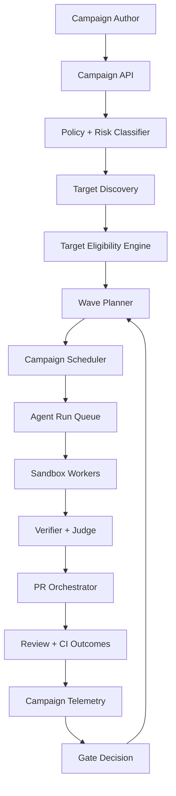
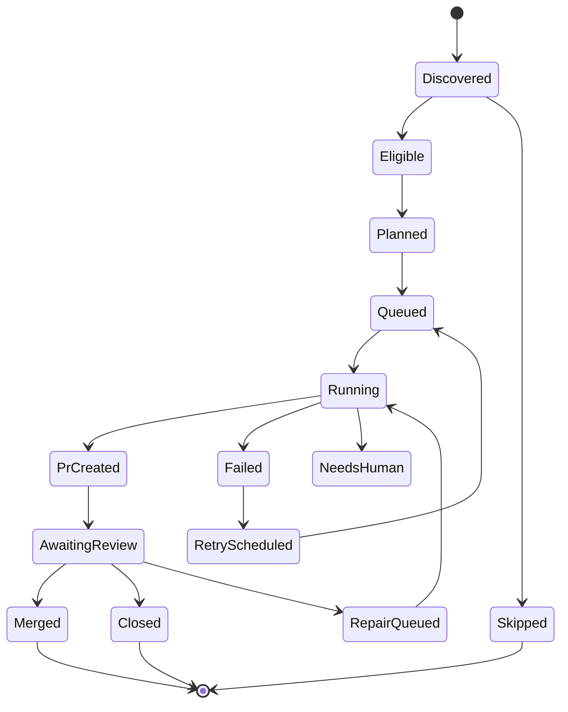
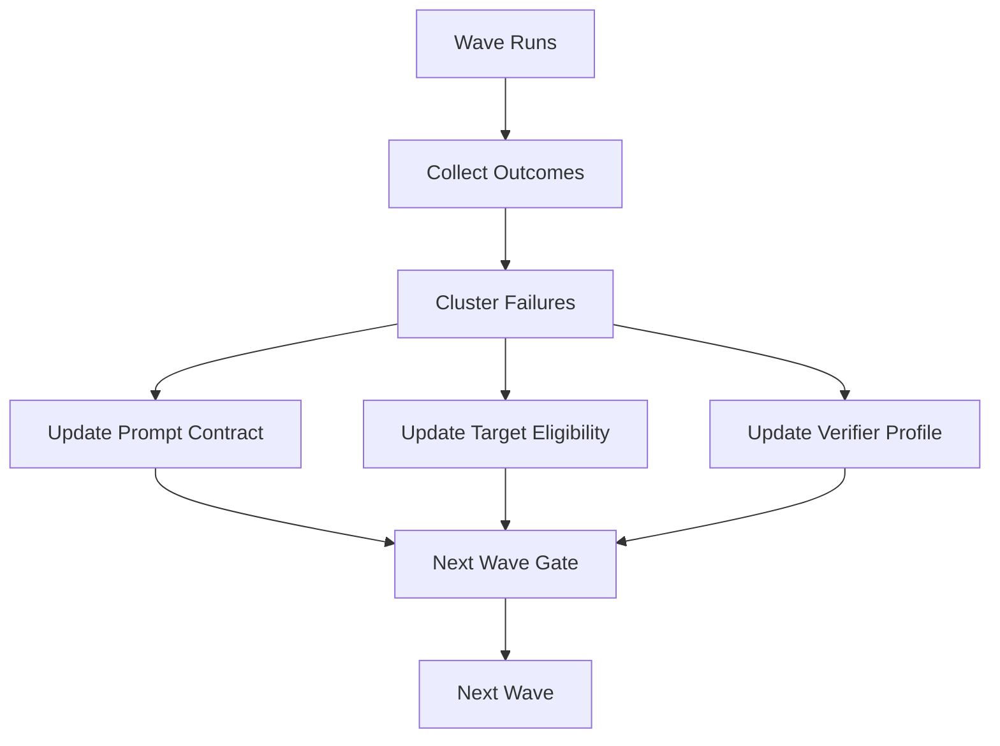

------
title: Learn AI Coding Agent From Scratch - Part 062
description: Fleet-wide code change platform untuk Honk-like AI coding agent: campaign, target selection, batching, rollout wave, backoff, PR storm prevention, telemetry, governance, dan operating model lintas ribuan repository.
series: learn-ai-coding-agent
seriesTitle: Learn AI Coding Agent From Scratch
order: 62
partTitle: Fleet-Wide Code Change Platform
tags:
- ai-coding-agent
- fleet-management
- code-migration
- platform-engineering
- governance
- automation
date: 2026-07-04
---

# Part 062 — Fleet-Wide Code Change Platform

Satu PR yang bagus adalah awal. Tetapi Honk-like background agent tidak berhenti di satu repository.

Target sebenarnya adalah kemampuan ini:

> “Terapkan perubahan kode yang sama atau sejenis ke banyak repository dengan aman, bertahap, terukur, dan bisa diaudit.”

Ini bukan lagi problem coding agent biasa. Ini problem **fleet-wide software change management**.

Contoh use case:

- upgrade dependency vulnerable di 300 repository;
- migrasi framework internal dari v1 ke v2;
- mengganti config key deprecated;
- update GitHub Actions workflow secara aman;
- menambahkan policy check ke semua service;
- migrasi Java API internal lintas domain;
- memperbaiki pattern insecure logging;
- memperbarui generated client contract;
- menghapus library yang sudah end-of-life.

Jika dilakukan manual, pekerjaan seperti ini menjadi spreadsheet, Slack thread, reminder, dan PR berbulan-bulan.

Jika dilakukan agent tanpa fleet control, hasilnya bisa lebih buruk: PR spam, reviewer overload, rate limit, perubahan tidak konsisten, dan blast radius besar.

Maka kita butuh **Fleet-Wide Code Change Platform**.

---

## 1. Mental Model: Campaign, Target, Run, PR

Untuk skala fleet, jangan berpikir “agent run”. Berpikir “campaign”.

```txt
Campaign
  -> Target Repository
      -> Target Plan
          -> Agent Run
              -> Patch
                  -> PR
                      -> Review/Merge Outcome
```

Definisi:

| Entity | Meaning |
|---|---|
| Campaign | program perubahan lintas repo |
| Target | satu repository/service yang kandidat terkena campaign |
| Wave | batch rollout terkontrol |
| Run | eksekusi agent untuk satu target |
| PR | package perubahan per target |
| Gate | aturan lanjut/tahan/stop campaign |
| Outcome | merged, closed, failed, skipped, needs human |

Contoh:

```txt
Campaign: CMP-20260704-018
Goal: migrate RetryPolicy config from v1 to v2
Targets: 842 repositories
Wave 0: 5 canary repos
Wave 1: 25 repos
Wave 2: 100 repos
Wave 3: remaining eligible repos
```

---

## 2. Mengapa Fleet Platform Tidak Sama dengan Loop For Repository

Pendekatan naif:

```ts
for (const repo of repos) {
  runAgent(repo, task);
}
```

Masalahnya:

- tidak ada canary;
- tidak ada backoff;
- tidak ada prioritization;
- tidak ada target validation;
- tidak ada ownership routing;
- tidak ada deduplication;
- tidak ada campaign-level metrics;
- tidak ada PR storm prevention;
- tidak ada rollback/stop gate;
- tidak ada audit campaign;
- tidak ada per-repo risk override.

Fleet platform harus memperlakukan perubahan sebagai **controlled rollout**, bukan batch script.

---

## 3. High-Level Architecture



Key idea:

> Campaign scheduler tidak menjalankan kode. Ia menentukan kapan dan di mana run boleh dibuat.

Execution tetap dilakukan oleh worker/sandbox seperti part sebelumnya.

---

## 4. Campaign Contract

Campaign harus punya contract yang jelas.

```ts
type Campaign = {
  id: string;
  name: string;
  objective: string;
  changeType: "DEPENDENCY_UPGRADE" | "API_MIGRATION" | "CONFIG_MIGRATION" | "POLICY_FIX" | "CUSTOM";
  promptContractId: string;
  targetQuery: TargetQuery;
  rolloutPlan: RolloutPlan;
  verificationProfile: string;
  prPolicy: CampaignPrPolicy;
  riskPolicy: CampaignRiskPolicy;
  stopPolicy: StopPolicy;
  owner: string;
  approvers: string[];
};
```

Contoh campaign YAML:

```yaml
id: CMP-20260704-018
name: migrate-retry-policy-v2
objective: Replace deprecated RetryPolicy v1 config keys with v2 equivalents.
changeType: CONFIG_MIGRATION
promptContractId: prompt-retry-policy-v2-001
owner: platform-reliability

targetQuery:
  include:
    languages: [java, kotlin]
    repoTopics: [backend-service]
    fileContains:
      - pathGlob: "**/*.yml"
        text: "retryPolicyV1"
  exclude:
    archived: true
    frozen: true
    repoTopics: [legacy-do-not-touch]

rolloutPlan:
  mode: waves
  waves:
    - name: canary
      maxTargets: 5
      concurrency: 2
    - name: early
      maxTargets: 25
      concurrency: 5
    - name: broad
      maxTargets: 200
      concurrency: 20

verificationProfile: java-service-config-migration

prPolicy:
  defaultMode: draft
  readyWhen:
    requiredVerifierPassed: true
    judgeVerdict: READY_FOR_REVIEW
    riskAtMost: MEDIUM

stopPolicy:
  stopIfFailureRateAbove: 0.25
  stopIfPolicyHardFailuresAbove: 0
  stopIfReviewRejectionRateAbove: 0.20
```

---

## 5. Target Discovery

Target discovery menjawab:

> Repository mana yang mungkin perlu perubahan?

Sumber data:

1. source control organization/repository list;
2. service catalog;
3. dependency index;
4. code search index;
5. SBOM/security scanner;
6. ownership metadata;
7. runtime inventory;
8. previous campaign outcomes;
9. manually included/excluded repos.

Target query bukan sekadar regex.

```ts
type TargetQuery = {
  include: {
    organizations?: string[];
    repositories?: string[];
    languages?: string[];
    repoTopics?: string[];
    owners?: string[];
    dependency?: DependencySelector;
    fileContains?: FileContainsSelector[];
    codeSearch?: CodeSearchSelector[];
  };
  exclude: {
    repositories?: string[];
    archived?: boolean;
    frozen?: boolean;
    repoTopics?: string[];
    riskLevelAtLeast?: "HIGH" | "CRITICAL";
  };
};
```

Target discovery harus menghasilkan evidence:

```json
{
  "repository": "acme/payment-service",
  "matchedBecause": [
    "pom.xml contains com.acme:retry-policy:1.4.2",
    "src/main/resources/application.yml contains retryPolicyV1"
  ],
  "owner": "payments-platform",
  "language": "java",
  "riskHints": ["customer-facing", "high-change-rate"]
}
```

Jangan menjalankan agent ke repo hanya karena “mungkin relevan”.

---

## 6. Target Eligibility Engine

Setelah discovery, lakukan eligibility check.

Pertanyaan:

- Apakah repository archived?
- Apakah branch default bisa dibaca?
- Apakah token agent punya permission?
- Apakah repo sedang freeze?
- Apakah ada open PR campaign yang sama?
- Apakah build system didukung?
- Apakah repo punya owner/reviewer?
- Apakah target punya evidence kuat?
- Apakah repo masuk denylist?
- Apakah perubahan terlalu high-risk?

Model:

```ts
type TargetEligibility = {
  repository: string;
  eligible: boolean;
  decision: "ELIGIBLE" | "SKIPPED" | "BLOCKED" | "NEEDS_APPROVAL";
  reasons: string[];
  evidence: string[];
  riskLevel: "LOW" | "MEDIUM" | "HIGH" | "CRITICAL";
};
```

Contoh:

```json
{
  "repository": "acme/legacy-payment-gateway",
  "eligible": false,
  "decision": "BLOCKED",
  "reasons": [
    "repository has topic legacy-do-not-touch",
    "no active owner found"
  ],
  "riskLevel": "HIGH"
}
```

---

## 7. Campaign Target State Machine

Setiap target punya lifecycle sendiri.



Campaign state bukan sekadar agregasi target state. Campaign punya gate sendiri.

---

## 8. Wave Planning

Wave adalah cara mengontrol blast radius.

Contoh wave:

| Wave | Target | Concurrency | Mode |
|---|---:|---:|---|
| canary | 5 | 2 | draft |
| early | 25 | 5 | ready if safe |
| broad-1 | 100 | 10 | ready if safe |
| broad-2 | 500 | 25 | ready if safe |

Wave planner mempertimbangkan:

- repo risk;
- owner distribution;
- language/build system;
- dependency pattern;
- previous success rate;
- business criticality;
- reviewer capacity;
- CI capacity;
- provider rate limit.

Jangan memilih canary acak.

Canary yang baik:

1. representative;
2. owner responsif;
3. build relatif cepat;
4. blast radius rendah;
5. punya test cukup;
6. mencakup variasi pattern utama.

---

## 9. Batching dan Backpressure

Campaign scheduler harus punya backpressure.

Sinyal backpressure:

- queue depth tinggi;
- worker capacity rendah;
- provider API rate limit;
- CI queue panjang;
- reviewer backlog;
- failure rate meningkat;
- cost budget mendekati batas;
- open PR per team terlalu banyak;
- branch protection/checks sedang degraded.

Scheduler decision:

```ts
type SchedulingDecision =
  | { action: "START_RUN"; targetId: string }
  | { action: "DELAY"; reason: string; retryAfterSeconds: number }
  | { action: "PAUSE_WAVE"; reason: string }
  | { action: "STOP_CAMPAIGN"; reason: string };
```

Pseudo-code:

```ts
async function scheduleCampaign(campaignId: string) {
  const campaign = await campaignStore.get(campaignId);
  const gate = await gateEvaluator.evaluate(campaign);

  if (gate.action === "STOP") return stopCampaign(campaign, gate.reason);
  if (gate.action === "PAUSE") return pauseCampaign(campaign, gate.reason);

  const capacity = await capacityModel.current();
  const targets = await targetStore.nextEligibleTargets(campaign.currentWave, capacity.maxStarts);

  for (const target of targets) {
    const decision = await targetAdmission.evaluate(campaign, target, capacity);
    if (decision.action === "START_RUN") {
      await enqueueRun(campaign, target);
    }
  }
}
```

---

## 10. Campaign Gates

Gate menentukan apakah wave boleh lanjut.

Sinyal:

- success rate;
- verification failure rate;
- policy hard failure count;
- judge rejection rate;
- PR close/reject rate;
- human requested changes rate;
- average review latency;
- cost per successful PR;
- number of open PRs;
- incidents/alerts;
- manual pause.

Gate example:

```ts
type CampaignGateResult = {
  action: "CONTINUE" | "PAUSE" | "STOP" | "REQUIRE_APPROVAL";
  reasons: string[];
  metrics: Record<string, number>;
};
```

Rules:

```yaml
gates:
  canaryToEarly:
    require:
      mergedOrApprovedAtLeast: 3
      hardPolicyFailures: 0
      verificationFailureRateBelow: 0.20
      humanRejectionRateBelow: 0.10
  earlyToBroad:
    requireApprovalFrom:
      - platform-owner
      - security-owner
```

---

## 11. PR Storm Prevention

PR storm adalah saat agent membuat terlalu banyak PR sehingga organisasi tidak bisa memprosesnya.

Batas yang disarankan:

```txt
max_open_agent_prs_per_repo = 1
max_open_agent_prs_per_team = 10
max_open_agent_prs_per_campaign = 50
max_new_prs_per_hour = configurable
max_high_risk_prs_per_wave = low
```

Selain jumlah PR, perhatikan reviewer load.

```ts
type ReviewerLoad = {
  team: string;
  openAgentPrs: number;
  openHumanPrs: number;
  averageReviewLatencyHours: number;
  capacity: "OK" | "BUSY" | "OVERLOADED";
};
```

Jika team overload:

- delay target milik team tersebut;
- buat draft PR tanpa reviewer request;
- batch PR weekly;
- require campaign owner approval.

---

## 12. Dedupe dan Idempotency

Fleet campaign mudah membuat duplicate work.

Dedupe key:

```txt
campaign_id + repository + target_fingerprint
```

Target fingerprint dapat berupa:

- base commit SHA;
- dependency version detected;
- matched file hash;
- prompt contract version;
- migration rule version.

```ts
type TargetFingerprint = {
  baseSha: string;
  promptContractVersion: string;
  detectorVersion: string;
  matchedEvidenceHash: string;
};
```

Jika campaign di-retry, platform harus tahu:

- target sudah skipped;
- target sudah PR created;
- target sudah merged;
- target sudah failed terminal;
- target perlu rerun karena base berubah.

---

## 13. Campaign Database Schema

Minimal tables:

```sql
create table campaigns (
  id text primary key,
  name text not null,
  objective text not null,
  state text not null,
  owner text not null,
  prompt_contract_id text not null,
  verification_profile text not null,
  created_at timestamptz not null default now(),
  updated_at timestamptz not null default now()
);

create table campaign_waves (
  id uuid primary key,
  campaign_id text not null references campaigns(id),
  name text not null,
  wave_order integer not null,
  state text not null,
  max_targets integer not null,
  concurrency integer not null,
  created_at timestamptz not null default now(),
  unique(campaign_id, wave_order)
);

create table campaign_targets (
  id uuid primary key,
  campaign_id text not null references campaigns(id),
  wave_id uuid references campaign_waves(id),
  repository_full_name text not null,
  base_branch text not null,
  base_sha text,
  target_fingerprint text not null,
  state text not null,
  risk_level text not null,
  eligibility_reason jsonb not null,
  owner text,
  run_id uuid,
  pr_number integer,
  pr_url text,
  created_at timestamptz not null default now(),
  updated_at timestamptz not null default now(),
  unique(campaign_id, repository_full_name, target_fingerprint)
);

create table campaign_events (
  id uuid primary key,
  campaign_id text not null,
  target_id uuid,
  event_type text not null,
  payload jsonb not null,
  created_at timestamptz not null default now()
);
```

---

## 14. Dry Run Mode

Sebelum campaign berjalan, lakukan dry run.

Dry run harus menjawab:

- berapa target ditemukan?
- berapa eligible?
- berapa skipped/blocked?
- apa distribusi risk?
- apa distribusi owner?
- apa estimasi biaya?
- apa estimasi PR count?
- apa sample diff dari canary?
- apa expected verifier profile?

Dry run output:

```md
# Campaign Dry Run: CMP-20260704-018

Detected targets: 842
Eligible targets: 617
Skipped: 188
Blocked: 37

Risk distribution:
- low: 310
- medium: 246
- high: 61

Top owners by target count:
- payments-platform: 74
- identity-platform: 53
- commerce-core: 49

Recommended canary:
- acme/payment-demo-service
- acme/invoice-worker
- acme/identity-sandbox
- acme/order-query-service
- acme/notification-service
```

Dry run tidak boleh membuat branch/PR.

---

## 15. Campaign Approval

Fleet campaign butuh approval berbeda dari single PR.

Approval levels:

| Level | Required for |
|---|---|
| author approval | create dry run |
| platform approval | start canary |
| domain approval | broad wave for owned domain |
| security approval | dependency/security campaign |
| executive/incident approval | emergency mass change |

Approval harus scoped:

```json
{
  "approvalType": "START_WAVE",
  "campaignId": "CMP-20260704-018",
  "wave": "early",
  "maxTargets": 25,
  "expiresAt": "2026-07-11T00:00:00Z"
}
```

Jangan gunakan approval global seperti “boleh jalan semua”.

---

## 16. Target Planning Per Repository

Sebelum agent run, buat target plan.

```ts
type TargetPlan = {
  campaignId: string;
  targetId: string;
  repository: string;
  baseSha: string;
  taskPrompt: string;
  promptContractId: string;
  expectedFiles: string[];
  forbiddenFiles: string[];
  verifierProfile: string;
  prMode: "DRAFT" | "READY_IF_SAFE";
  reviewerHints: string[];
};
```

Task prompt tidak boleh hanya copy paste campaign objective. Ia harus dikompilasi dengan evidence target.

Contoh:

```md
You are updating repository `acme/payment-service` as part of campaign `CMP-20260704-018`.

Objective:
Replace RetryPolicy v1 config keys with v2 equivalents.

Target evidence:
- `src/main/resources/application.yml` contains `retryPolicyV1.maxAttempts`
- `pom.xml` depends on `com.acme:retry-policy:1.4.2`

Allowed changes:
- application config files
- tests that assert retry config binding

Forbidden changes:
- CI workflow files
- unrelated dependency upgrades
- service business logic unrelated to retry config

Verification profile:
- `mvn -q test`
- config schema validation
```

---

## 17. Consistency Across Repos

Fleet campaign harus menjaga consistency.

Risiko:

- agent memilih pattern berbeda di tiap repo;
- PR body berbeda-beda;
- verifier berbeda tanpa alasan;
- label berbeda;
- reviewer routing tidak konsisten;
- beberapa repo mendapat workaround manual yang tidak terdokumentasi.

Solusi:

1. Prompt contract versioned.
2. Verifier profile versioned.
3. PR template deterministic.
4. Campaign labels standardized.
5. Diff rubric sama.
6. Exception registry.

Exception registry:

```yaml
exceptions:
  - repository: acme/legacy-payment-gateway
    reason: custom retry implementation
    decision: skip
    approvedBy: platform-owner
  - repository: acme/identity-service
    reason: integration test requires unavailable IAM emulator
    decision: allow-draft-pr
    approvedBy: identity-owner
```

---

## 18. Fleet Telemetry

Campaign dashboard harus menunjukkan:

- target count by state;
- success/failure rate;
- PR created/merged/closed;
- verification pass rate;
- policy failure count;
- judge rejection reason;
- reviewer latency;
- average cost per target;
- total cost;
- token usage;
- wave progress;
- top failure clusters;
- owner/team load;
- blocked targets.

Example metrics:

```txt
campaign_targets_total{campaign="CMP-20260704-018",state="eligible"} 617
campaign_runs_total{campaign="CMP-20260704-018",result="success"} 42
campaign_prs_open{campaign="CMP-20260704-018"} 31
campaign_verification_failure_rate{campaign="CMP-20260704-018"} 0.14
campaign_cost_usd_total{campaign="CMP-20260704-018"} 187.42
campaign_review_latency_hours_p50{campaign="CMP-20260704-018"} 9.2
```

Fleet telemetry harus bisa menjawab:

> “Apakah campaign ini sehat dan boleh lanjut?”

---

## 19. Failure Clustering

Dalam fleet campaign, failure satu repo tidak terlalu penting. Failure cluster penting.

Cluster examples:

- Maven dependency resolution fails due private registry auth.
- Repos using Spring Boot 2 need different migration.
- Kotlin projects fail formatter.
- Generated client repos should be skipped.
- Config binding tests fail because old schema still used.

Cluster model:

```ts
type FailureCluster = {
  clusterId: string;
  campaignId: string;
  signature: string;
  affectedTargets: number;
  sampleRepositories: string[];
  rootCauseHypothesis: string;
  recommendedAction: "UPDATE_PROMPT" | "UPDATE_VERIFIER" | "SKIP_TARGETS" | "MANUAL_REVIEW" | "PAUSE_CAMPAIGN";
};
```

If 30 repos fail for the same reason, do not let 30 independent agents rediscover it.

Update campaign-level prompt/verifier or target eligibility.

---

## 20. Campaign-Level Learning Loop

Fleet platform harus belajar dari wave sebelumnya.



Important:

- Jangan mengubah prompt contract diam-diam tanpa versioning.
- Jika prompt berubah, target fingerprint berubah.
- Jika verifier berubah, old evidence mungkin tidak comparable.
- Jika target eligibility berubah, dry run harus diperbarui.

---

## 21. Stop, Pause, Resume

Campaign harus bisa dihentikan.

Pause reasons:

- failure rate tinggi;
- reviewer overload;
- provider rate limit;
- CI degraded;
- user manual pause;
- new security concern;
- prompt defect detected.

Stop reasons:

- destructive bug in generated patches;
- secret leak;
- wrong target selection;
- campaign objective invalid;
- compliance block.

Resume membutuhkan:

- root cause documented;
- updated prompt/verifier/policy version;
- approval;
- rerun dry run if target logic changed;
- clear state transition for affected targets.

---

## 22. Handling Already Open Human PRs

Before creating PR, check existing PRs.

Cases:

| Existing state | Decision |
|---|---|
| human PR already fixes same issue | skip / link |
| human PR touches same files | delay / needs human |
| agent PR from same campaign exists | attach/update |
| old stale agent PR exists | close or supersede with approval |
| conflicting dependency upgrade PR exists | needs human |

Conflict detector:

```ts
type ExistingPrConflict = {
  repository: string;
  prNumber: number;
  conflictType: "SAME_CAMPAIGN" | "SAME_FILES" | "SAME_DEPENDENCY" | "UNKNOWN";
  decision: "ATTACH" | "SKIP" | "DELAY" | "NEEDS_HUMAN";
};
```

Do not create duplicate work.

---

## 23. Ownership and Communication

Fleet change is socio-technical.

Platform should inform owners:

- what campaign is;
- why their repo is targeted;
- what PR to expect;
- how to opt out;
- what approval means;
- how to report bad patch;
- expected timeline.

PR body is not enough for large campaign.

Add campaign page:

```txt
/campaigns/CMP-20260704-018
```

Page contents:

- objective;
- owner;
- prompt contract;
- verifier profile;
- wave plan;
- target list;
- status;
- known issues;
- opt-out process;
- dashboard.

---

## 24. Governance Policy

Example policies:

```yaml
policy:
  maxOpenPrsPerTeam: 10
  maxOpenPrsPerRepository: 1
  requireApprovalFor:
    - broad-wave
    - high-risk-target
    - ci-workflow-change
    - dependency-major-upgrade
    - production-critical-service
  forbidden:
    - archived-repository
    - frozen-repository
    - no-owner-repository
    - secret-detected
```

Governance is not bureaucracy. Governance is how fleet automation avoids becoming fleet damage.

---

## 25. Emergency Campaigns

Sometimes fleet change is urgent: critical vulnerability, leaked config, broken build ecosystem.

Emergency campaign profile:

- smaller prompt scope;
- strict deterministic transform if possible;
- faster approval path;
- lower PR concurrency than expected if reviewers are overloaded;
- explicit incident link;
- high audit detail;
- rollback plan;
- communication channel;
- post-campaign review.

Do not confuse urgency with lack of control.

Urgency means controls must be faster and clearer, not absent.

---

## 26. Implementation Skeleton

```ts
export class CampaignScheduler {
  constructor(
    private readonly campaignStore: CampaignStore,
    private readonly targetStore: CampaignTargetStore,
    private readonly gateEvaluator: CampaignGateEvaluator,
    private readonly capacityModel: CapacityModel,
    private readonly runQueue: AgentRunQueue,
    private readonly audit: AuditWriter,
  ) {}

  async tick(campaignId: string): Promise<void> {
    const campaign = await this.campaignStore.get(campaignId);

    const gate = await this.gateEvaluator.evaluate(campaign);
    if (gate.action === "STOP") return this.stop(campaign, gate);
    if (gate.action === "PAUSE") return this.pause(campaign, gate);
    if (gate.action === "REQUIRE_APPROVAL") return this.requireApproval(campaign, gate);

    const capacity = await this.capacityModel.getCapacity(campaign);
    const targets = await this.targetStore.nextSchedulable(campaign.id, capacity.startLimit);

    for (const target of targets) {
      await this.scheduleTarget(campaign, target);
    }
  }

  private async scheduleTarget(campaign: Campaign, target: CampaignTarget) {
    const command = compileRunCommand(campaign, target);
    await this.runQueue.enqueue(command);
    await this.targetStore.markQueued(target.id, command.runId);
    await this.audit.write("CAMPAIGN_TARGET_QUEUED", {
      campaignId: campaign.id,
      targetId: target.id,
      runId: command.runId,
    });
  }
}
```

---

## 27. Campaign Gate Evaluator

```ts
export class CampaignGateEvaluator {
  async evaluate(campaign: Campaign): Promise<CampaignGateResult> {
    const metrics = await this.loadMetrics(campaign.id);

    if (metrics.secretLeaks > 0) {
      return { action: "STOP", reasons: ["secret leak detected"], metrics };
    }

    if (metrics.hardPolicyFailures > campaign.stopPolicy.maxHardPolicyFailures) {
      return { action: "STOP", reasons: ["hard policy failure threshold exceeded"], metrics };
    }

    if (metrics.verificationFailureRate > campaign.stopPolicy.maxVerificationFailureRate) {
      return { action: "PAUSE", reasons: ["verification failure rate too high"], metrics };
    }

    if (metrics.openPrsPerTeamMax > campaign.policy.maxOpenPrsPerTeam) {
      return { action: "PAUSE", reasons: ["reviewer load too high"], metrics };
    }

    if (campaign.currentWave.requiresApproval && !campaign.currentWave.approved) {
      return { action: "REQUIRE_APPROVAL", reasons: ["wave approval required"], metrics };
    }

    return { action: "CONTINUE", reasons: [], metrics };
  }
}
```

---

## 28. Integration with Part 061

Part 061 created one PR package.

Part 062 coordinates many PR packages.

```txt
Campaign Target Plan
  -> Agent Run
      -> Patch
          -> PR Orchestrator
              -> PR Result
                  -> Campaign Outcome
```

PR Orchestrator should not know campaign scheduling details.

It only receives campaign metadata:

```ts
type CampaignMetadata = {
  campaignId: string;
  waveName: string;
  targetId: string;
  rolloutMode: "CANARY" | "EARLY" | "BROAD";
};
```

Then it uses it for:

- branch naming;
- PR title/body;
- labels;
- trace links;
- audit.

---

## 29. Testing Fleet Platform

Unit tests:

- target query evaluation;
- eligibility decision;
- wave planner;
- gate evaluator;
- dedupe key;
- capacity model;
- PR storm limit;
- target state transitions.

Integration tests:

1. campaign dry run does not create runs;
2. canary schedules only max targets;
3. failed gate pauses campaign;
4. duplicate campaign tick does not duplicate runs;
5. already merged target is not rerun;
6. prompt contract version change invalidates fingerprint;
7. reviewer overload delays targets;
8. manual pause stops scheduling;
9. resume continues from correct target state;
10. failed cluster updates campaign recommendation.

Simulation test:

```ts
it("pauses campaign when canary failure rate exceeds threshold", async () => {
  const campaign = await createCampaign({ canarySize: 5, maxFailureRate: 0.2 });

  await simulateTargets(campaign, [
    "FAILED", "FAILED", "SUCCESS", "SUCCESS", "SUCCESS"
  ]);

  const gate = await gateEvaluator.evaluate(campaign);

  expect(gate.action).toBe("PAUSE");
});
```

---

## 30. Anti-Patterns

### Anti-pattern 1 — All Repos at Once

This maximizes blast radius and reviewer fatigue.

### Anti-pattern 2 — No Dry Run

You will discover targeting bugs only after PR spam.

### Anti-pattern 3 — Campaign Without Owner

Fleet automation needs accountable human owner.

### Anti-pattern 4 — No Stop Gate

If the agent is wrong, it will be wrong faster than humans can respond.

### Anti-pattern 5 — Same Prompt Forever

Campaigns evolve. Prompt/verifier/policy must be versioned.

### Anti-pattern 6 — Ignoring Social Capacity

Reviewer overload is a system failure, not a people problem.

### Anti-pattern 7 — Treating Skipped as Failure

Skipped can be correct if repository is out of scope or unsafe.

---

## 31. Minimal Build Target for This Part

Implement:

1. `Campaign` model.
2. `CampaignTarget` model.
3. `TargetDiscovery` fake adapter.
4. `EligibilityEngine`.
5. `WavePlanner`.
6. `CampaignScheduler`.
7. `CampaignGateEvaluator`.
8. `CampaignDashboard` read model.
9. Dedupe key.
10. Dry run report.

Do not start with real organization-wide API calls. Simulate 100 repositories first.

---

## 32. Exercise: Simulated Fleet Campaign

Build a simulation:

- 100 repositories;
- 4 teams;
- random build systems;
- 30 repositories matching config migration;
- 5 high-risk repos;
- canary wave of 3;
- broad wave of 20;
- failure rate threshold 20%;
- max open PR per team 5.

Expected behavior:

1. dry run lists targets;
2. canary schedules first;
3. campaign pauses if two canary targets fail;
4. campaign continues if canary passes;
5. reviewer overloaded team gets delayed;
6. duplicate scheduler tick creates no duplicate run;
7. dashboard shows campaign status.

---

## 33. Checklist Kelulusan Part 062

Kamu selesai dengan part ini jika bisa menjelaskan dan mengimplementasikan:

- campaign vs target vs run vs PR;
- target discovery dan eligibility;
- campaign dry run;
- wave planning;
- backpressure dan capacity;
- gate continue/pause/stop;
- PR storm prevention;
- campaign fingerprint/dedupe;
- campaign telemetry;
- failure clustering;
- campaign-level learning loop;
- ownership/governance;
- simulation test untuk fleet rollout.

---

## 34. Kesimpulan

Fleet-wide code change platform mengubah coding agent dari alat individu menjadi infrastruktur organisasi.

Tanpa fleet control, agent hanya mempercepat chaos. Dengan campaign, target eligibility, wave rollout, gate, telemetry, PR storm prevention, dan governance, agent bisa membantu organisasi melakukan perubahan besar secara bertahap dan defensible.

Part berikutnya akan membahas **production hardening, governance, multi-tenant isolation, audit, dan rollout strategy** agar sistem ini siap dipakai sebagai platform internal yang aman.
