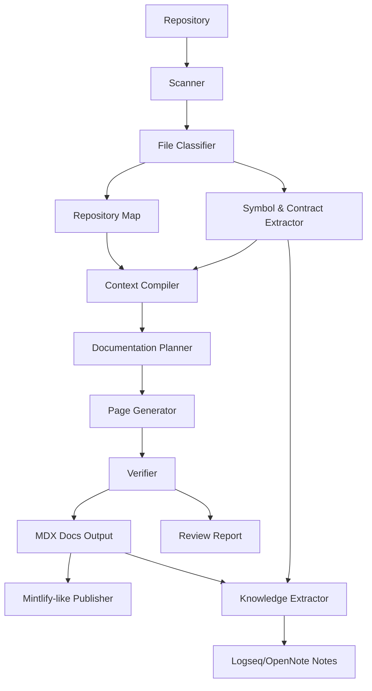
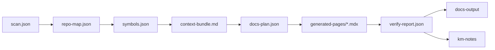
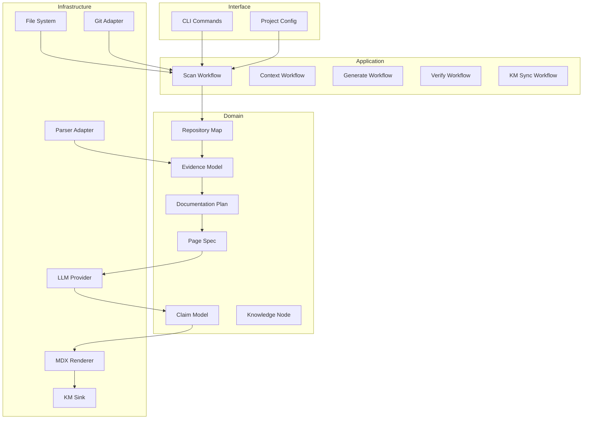

------
title: Build From Scratch: Mintlify-like AI-driven Documentation Generator CLI - Part 001
description: Memetakan ruang masalah, batas sistem, target arsitektur, invariant, dan failure mode untuk membangun AI-driven documentation generator CLI yang source-grounded, reviewable, dan terhubung dengan knowledge management.
series: learn-ai-docs-km-cli
seriesTitle: Build From Scratch: Mintlify-like AI-driven Documentation Generator CLI with Code2Prompt and Open-source Knowledge Management
order: 1
partTitle: Problem Space and System Boundary
tags:
- ai-docs
- documentation
- cli
- code2prompt
- knowledge-management
- logseq
- opennote
- mdx
- system-design
date: 2026-07-04
---

# Part 001 — Problem Space and System Boundary

Kita tidak sedang membangun “script AI yang membaca repo lalu menulis README”. Itu terlalu kecil dan terlalu rapuh.

Kita sedang membangun **developer documentation intelligence system** dalam bentuk CLI: alat yang bisa memahami struktur repository, mengemas context seperti Code2Prompt, menghasilkan dokumentasi MDX yang mirip workflow Mintlify, memverifikasi klaim terhadap source code, lalu menyinkronkan pengetahuan internal ke sistem knowledge management seperti Logseq atau OpenNote.

Kalau disederhanakan:

```txt
repository -> evidence -> context -> plan -> generated docs -> verification -> docs site / knowledge graph
```

Kalau satu bagian dari rantai itu lemah, hasil akhirnya akan kelihatan “AI-ish”: terdengar percaya diri, tapi tidak bisa dipercaya.

Part ini membangun fondasi mental model. Kita akan menjawab:

1. Masalah sebenarnya apa?
2. Sistem seperti apa yang layak dibangun?
3. Batasnya di mana?
4. Artifact apa saja yang harus ada?
5. Invariant apa yang tidak boleh dilanggar?
6. Failure mode apa yang harus didesain sejak awal?

---

## 1. Masalah yang Sebenarnya

Dokumentasi developer sering gagal bukan karena tim tidak tahu cara menulis Markdown. Masalahnya lebih struktural:

- kode berubah lebih cepat daripada docs;
- API contract berubah tetapi tutorial tidak ikut berubah;
- README menjelaskan masa lalu, bukan kondisi repo saat ini;
- arsitektur hanya hidup di kepala senior engineer;
- contoh penggunaan di docs tidak pernah dijalankan;
- onboarding engineer baru bergantung pada tribal knowledge;
- internal knowledge tersebar di Slack, issue, PR, Notion, wiki, dan notes pribadi;
- AI bisa membantu menulis, tetapi sering membuat klaim yang tidak ada di source.

Masalahnya bukan “bagaimana membuat AI menulis lebih banyak teks”. Masalahnya adalah:

> Bagaimana membuat sistem yang dapat mengubah repository menjadi dokumentasi yang berguna, source-grounded, reviewable, maintainable, dan bisa menjadi knowledge base jangka panjang.

Itu berbeda jauh.

### 1.1 Documentation Generator Biasa vs Documentation Intelligence System

Documentation generator biasa biasanya punya pola seperti ini:

```txt
input schema/code comment -> generated reference docs
```

Contoh:

- Javadoc dari komentar Java.
- Swagger UI dari OpenAPI.
- TypeDoc dari TypeScript.
- Sphinx dari docstring Python.

Itu berguna, tetapi terbatas. Ia biasanya menghasilkan **reference documentation**, bukan pemahaman sistem.

Documentation intelligence system punya pola lebih luas:

```txt
repo + contracts + tests + examples + existing docs + git history
  -> repository understanding
  -> context bundle
  -> documentation plan
  -> generated pages
  -> verification report
  -> public docs + internal knowledge graph
```

Perbedaannya ada pada “understanding layer”. Tanpa layer ini, AI hanya menebak.

---

## 2. Apa yang Akan Kita Bangun

Nama working system dalam seri ini: **AIDocs KM CLI**.

Tujuannya: membangun CLI yang bisa dipakai developer untuk menghasilkan dan merawat dokumentasi dari repository secara aman dan terstruktur.

### 2.1 Target Kemampuan Minimum

Pada akhir seri, CLI minimal harus bisa:

```bash
ai-docs init
ai-docs scan
ai-docs context
ai-docs plan
ai-docs generate
ai-docs verify
ai-docs km sync
ai-docs preview
```

Tapi command ini hanya permukaan. Di baliknya ada pipeline:

1. Membaca repository.
2. Mengabaikan file yang tidak relevan atau berbahaya.
3. Membangun repository map.
4. Mengekstrak symbol, contract, endpoint, config, dan example.
5. Membuat context bundle seperti Code2Prompt, tetapi dengan metadata, provenance, dan token budgeting.
6. Membuat documentation plan.
7. Menghasilkan MDX page.
8. Memverifikasi klaim dan link.
9. Menghasilkan navigation config ala Mintlify `docs.json`.
10. Menulis notes ke knowledge graph Logseq/OpenNote-compatible.

### 2.2 Inspirasi Faktual, Bukan Copy-paste

Ada beberapa inspirasi nyata yang penting:

- **Code2Prompt** menunjukkan bahwa codebase dapat dikemas menjadi prompt terstruktur untuk LLM, dengan fitur seperti file filtering, prompt templating, token tracking, dan git integration.
- **Mintlify** memakai `docs.json` sebagai konfigurasi pusat untuk navigation, appearance, integrations, API settings, dan struktur site.
- **Logseq** adalah platform knowledge management open-source yang fokus pada privacy, longevity, user control, dan mendukung Markdown/Org-mode.
- **OpenNote** adalah notebook app berbasis Rust yang mengklaim local-first, semantic search, dan AI-powered block-based note-taking, namun masih heavy development sehingga integrasi harus longgar.

Kita tidak akan meniru mentah-mentah. Kita akan mengambil mental model yang relevan, lalu membangun versi yang bisa dipahami dari scratch.

---

## 3. Sistem Ini Bukan Apa

Sebelum membuat arsitektur, kita perlu menghapus scope yang salah.

### 3.1 Bukan Chatbot Documentation Assistant

Chatbot bisa menjawab pertanyaan seperti:

```txt
“Jelaskan repo ini.”
```

Masalahnya:

- jawaban tidak selalu tersimpan;
- tidak ada artifact deterministic;
- tidak ada review flow;
- tidak ada repeatable build;
- tidak ada diff yang bisa dipakai di pull request.

CLI kita harus menghasilkan artifact yang bisa diperiksa:

```txt
.aidocs/scans/latest.json
.aidocs/context/overview.prompt.md
.aidocs/plans/docs-plan.json
apps/docs/index.mdx
apps/docs/docs.json
.aidocs/reports/verify.json
```

Chat boleh menjadi UI tambahan nanti. Core system tetap pipeline.

### 3.2 Bukan Static Site Generator Baru

Kita tidak sedang mengganti Astro, Next.js, Docusaurus, atau Mintlify.

Static site generator menjawab:

> Bagaimana mengubah content menjadi site?

Sistem kita menjawab:

> Bagaimana mengubah repository menjadi content yang benar, terstruktur, dan maintainable?

Output bisa diarahkan ke banyak target:

- Mintlify-like MDX project;
- plain Markdown docs;
- internal wiki;
- Logseq graph;
- OpenNote notes;
- search index;
- `llms.txt` / AI agent context.

### 3.3 Bukan Pengganti Developer Review

AI boleh menulis draft. AI tidak boleh menjadi satu-satunya sumber kebenaran.

Rule dasarnya:

> Generated docs are proposals until verified and reviewed.

Developer tetap punya peran:

- approve generated docs;
- memperbaiki intent yang tidak terlihat dari source;
- menambahkan context bisnis;
- menolak klaim yang terlalu spekulatif;
- menentukan public/private boundary.

### 3.4 Bukan Knowledge Graph yang Mengarang Relasi

Knowledge graph yang buruk lebih berbahaya daripada tidak ada graph.

Contoh relasi buruk:

```txt
PaymentService -> owns -> RefundPolicy
```

Padahal source hanya menunjukkan `PaymentService` memanggil `RefundClient` sekali.

Relasi harus punya evidence:

```json
{
  "from": "PaymentService",
  "relation": "calls",
  "to": "RefundClient",
  "evidence": [
    {
      "file": "src/payment/PaymentService.java",
      "lineStart": 42,
      "lineEnd": 58
    }
  ],
  "confidence": "high"
}
```

---

## 4. Target System Boundary

Mari tentukan batas sistem dengan jelas.

### 4.1 Input yang Didukung

Input utama:

| Input | Contoh | Kegunaan |
|---|---|---|
| Source files | `.java`, `.ts`, `.go`, `.py`, `.rs` | memahami modul, fungsi, API, behaviour |
| Config files | `package.json`, `pom.xml`, `Dockerfile`, `.github/workflows/*.yml` | memahami runtime, build, deployment |
| Contracts | `openapi.yaml`, `schema.json`, `.proto`, `.avsc` | membuat API/data contract docs |
| Tests | unit/integration/e2e tests | menemukan usage examples dan expected behavior |
| Existing docs | `README.md`, `docs/**/*.mdx` | menjaga continuity dan menghindari overwrite kasar |
| Git metadata | diff, branch, commit summary | incremental docs, PR docs review |
| User config | `ai-docs.config.*` | scope, target output, provider, policies |

Input yang harus dihindari default:

- `.env`;
- secret files;
- credential material;
- binary blobs;
- generated build artifacts;
- dependency folders seperti `node_modules` atau `target`;
- large lock files kecuali dibutuhkan untuk dependency summary;
- private data sample yang tidak boleh dikirim ke model.

### 4.2 Output yang Didukung

Output utama:

| Output | Bentuk | Tujuan |
|---|---|---|
| Repository map | JSON/Markdown | ringkasan struktur repo |
| Context bundle | Markdown/JSON/XML | input LLM yang inspectable |
| Documentation plan | JSON/MDX summary | blueprint docs |
| Generated docs | `.mdx` | halaman public/internal docs |
| Navigation config | `docs.json` | Mintlify-like navigation |
| Verification report | JSON/Markdown | bukti kualitas dan masalah |
| KM notes | Markdown | Logseq/OpenNote-compatible notes |
| Search index | JSON/SQLite optional | retrieval lokal |

Output yang tidak menjadi fokus awal:

- full hosted SaaS;
- collaborative editor realtime;
- custom WYSIWYG editor;
- proprietary sync system;
- end-user analytics platform;
- billing/metering product.

---

## 5. Big Picture Architecture

Kita mulai dari arsitektur konseptual.



Ada dua jalur besar:

1. **Docs pipeline**: repo → docs site.
2. **Knowledge pipeline**: repo/docs → knowledge graph/notes.

Dua jalur ini berbagi sumber evidence yang sama. Itu penting. Kalau docs dan notes dibangun dari evidence berbeda, knowledge akan cepat drift.

---

## 6. Core Mental Model: Evidence First

Prinsip utama seri ini:

> Jangan mulai dari generation. Mulai dari evidence.

AI generation adalah tahap akhir dari chain panjang. Kalau evidence kacau, output bagus hanya secara bahasa, bukan secara kebenaran.

### 6.1 Evidence Unit

Kita butuh unit evidence. Minimal:

```ts
export type EvidenceKind =
  | "source_file"
  | "symbol"
  | "api_contract"
  | "test_case"
  | "config"
  | "existing_doc"
  | "git_diff"
  | "user_note";

export type EvidenceRef = {
  id: string;
  kind: EvidenceKind;
  path: string;
  lineStart?: number;
  lineEnd?: number;
  hash: string;
  summary?: string;
};
```

Dokumentasi yang baik harus bisa menjawab:

> Klaim ini berasal dari evidence mana?

Contoh klaim:

```mdx
The CLI supports watch mode for incremental local preview.
```

Evidence yang valid bisa berupa:

- command definition `src/commands/preview.ts`;
- README section `Local Preview`;
- test `preview.watch.test.ts`;
- config schema `watch: boolean`.

Kalau tidak ada evidence, klaim harus ditandai speculative atau tidak boleh masuk generated docs.

### 6.2 Evidence vs Interpretation

Kita perlu membedakan evidence dan interpretation.

Evidence:

```txt
File src/routes/users.ts defines GET /users/:id.
```

Interpretation:

```txt
This endpoint is used to retrieve a user's profile for dashboard rendering.
```

Interpretation boleh dibuat, tetapi harus punya dasar. Jika tidak ada source yang menunjukkan dashboard, jangan tulis.

### 6.3 Evidence vs Policy

Ada hal yang tidak bisa disimpulkan dari kode.

Contoh:

- “This endpoint is stable.”
- “This API is safe for production.”
- “This module is recommended for all users.”
- “This package is deprecated.”

Hal seperti itu harus datang dari explicit policy:

```yaml
policies:
  stability:
    src/api/v1/**: stable
    src/experimental/**: experimental
  visibility:
    internal/**: private
    public/**: public
```

Tanpa policy, generator tidak boleh mengarang status.

---

## 7. Artifact-first Design

CLI ini harus artifact-first.

Artinya setiap stage menghasilkan artifact yang bisa:

- disimpan;
- di-diff;
- di-cache;
- di-debug;
- di-review;
- dijalankan ulang.

### 7.1 Artifact Pipeline



### 7.2 Kenapa Artifact Penting

Tanpa artifact, debugging akan menjadi seperti ini:

> “Kenapa AI menulis endpoint yang tidak ada?”

Dengan artifact, kita bisa cek:

1. Apakah file endpoint masuk scan?
2. Apakah classifier mengenalinya sebagai source file?
3. Apakah extractor menemukan route?
4. Apakah context bundle memasukkan route itu?
5. Apakah prompt page generation memberi constraint yang benar?
6. Apakah verifier gagal menangkap klaim palsu?

Ini mental model production engineering: jangan debugging output akhir saja. Debug chain-nya.

---

## 8. System Boundary dalam Bentuk Layer

Kita akan membagi sistem menjadi beberapa layer.



### 8.1 Interface Layer

Tanggung jawab:

- parsing command;
- membaca config;
- menampilkan progress;
- menulis output user-facing;
- mapping error ke exit code.

Tidak boleh:

- melakukan business logic kompleks;
- tahu detail prompt generation;
- langsung memanggil provider LLM dari command handler tanpa application service.

### 8.2 Application Layer

Tanggung jawab:

- orchestrate workflow;
- menentukan stage order;
- membaca/menulis artifact;
- menghubungkan domain service dan adapter.

Contoh service:

```ts
class GenerateDocsWorkflow {
  async run(input: GenerateDocsInput): Promise<GenerateDocsResult> {
    const scan = await this.artifacts.readScan(input.scanId);
    const repoMap = await this.repoMapper.build(scan);
    const context = await this.contextCompiler.compile(repoMap, input.target);
    const plan = await this.docPlanner.plan(context);
    const pages = await this.pageGenerator.generate(plan);
    const report = await this.verifier.verify(pages, repoMap);
    await this.output.writeDocs(pages, report);
    return { pages, report };
  }
}
```

### 8.3 Domain Layer

Tanggung jawab:

- model inti;
- invariant;
- validation;
- policy;
- relationship antar artifact.

Domain layer tidak boleh tahu provider spesifik seperti OpenAI, Anthropic, Ollama, Mintlify, atau Logseq.

### 8.4 Infrastructure Layer

Tanggung jawab:

- file system;
- git;
- parser;
- LLM API;
- local model;
- static site output;
- Logseq/OpenNote writer;
- SQLite/vector index optional.

Layer ini boleh diganti tanpa mengubah domain.

---

## 9. Boundary Keputusan Penting

Agar sistem tidak melebar liar, kita perlu keputusan scope yang eksplisit.

### 9.1 Local-first by Default

Default CLI harus bisa jalan lokal:

```bash
ai-docs scan .
ai-docs context --target overview
ai-docs generate --dry-run
```

Alasan:

- developer repo sering private;
- prompt bisa berisi source code proprietary;
- debugging lebih mudah;
- tidak perlu hosted control plane di awal.

Hosted mode bisa datang belakangan.

### 9.2 Source-grounded by Default

LLM tidak boleh diberi kebebasan menulis klaim besar tanpa source.

Prompt harus mengandung constraint seperti:

```txt
Only describe behavior that is supported by the provided source evidence.
If a detail is not present, write "Not visible from the current repository evidence" instead of guessing.
```

Tetapi jangan hanya mengandalkan prompt. Kita tetap perlu verifier.

### 9.3 Reviewable by Default

Generated docs harus dibuat sebagai draft/diff, bukan langsung overwrite.

Contoh:

```bash
ai-docs generate --target overview --out .aidocs/drafts
ai-docs review
ai-docs apply
```

Atau:

```bash
ai-docs generate --dry-run --format patch
```

### 9.4 Safe by Default

Scanner harus exclude secrets dan sensitive files secara default.

Minimal default ignore:

```gitignore
.env
.env.*
*.pem
*.key
*.p12
*.jks
id_rsa
id_ed25519
node_modules/
target/
build/
dist/
coverage/
.git/
```

Selain ignore, kita perlu secret detector sebelum context dikirim ke LLM.

### 9.5 Deterministic Where Possible

AI output tidak sepenuhnya deterministic. Tetapi pipeline di sekitarnya harus deterministic:

- scan order stable;
- file sort stable;
- hash stable;
- context packing stable;
- prompt template versioned;
- generated output punya metadata.

Contoh metadata:

```yaml
generatedBy: ai-docs
generatorVersion: 0.1.0
sourceScanHash: sha256:...
promptTemplate: overview-page@1.2.0
reviewStatus: draft
```

---

## 10. Data Product Utama

Sekarang kita definisikan artifact yang akan dipakai terus sepanjang seri.

### 10.1 Scan Artifact

Hasil dari `ai-docs scan`.

```json
{
  "schemaVersion": "1.0",
  "repoRoot": "/workspace/acme-api",
  "createdAt": "2026-07-04T00:00:00+07:00",
  "files": [
    {
      "path": "src/routes/users.ts",
      "sizeBytes": 4812,
      "hash": "sha256:abc",
      "language": "typescript",
      "kind": "source",
      "isIgnored": false,
      "reasons": ["matched-source-extension"]
    }
  ]
}
```

Scan artifact tidak boleh berisi semua content file secara default. Ia metadata dulu. Content masuk stage context dengan selection.

### 10.2 Repository Map

Repository map adalah ringkasan struktur.

```json
{
  "root": "acme-api",
  "modules": [
    {
      "name": "api",
      "path": "src/routes",
      "role": "http-api",
      "evidence": ["src/routes/users.ts", "src/routes/orders.ts"]
    },
    {
      "name": "database",
      "path": "migrations",
      "role": "schema-migrations",
      "evidence": ["migrations/001_init.sql"]
    }
  ]
}
```

### 10.3 Symbol Artifact

Symbol artifact berisi entitas yang ditemukan.

```json
{
  "symbols": [
    {
      "id": "symbol:src/routes/users.ts#getUserById",
      "name": "getUserById",
      "kind": "function",
      "path": "src/routes/users.ts",
      "lineStart": 18,
      "lineEnd": 44,
      "exports": true
    }
  ]
}
```

### 10.4 Context Bundle

Context bundle adalah prompt-ready artifact.

```md
# Context Bundle: Overview Page

## Repository Summary
...

## Source Tree
...

## Selected Evidence
...

## Files

### File: src/routes/users.ts
```ts
...
```

## Generation Constraints
...
```

Context bundle harus bisa dibaca manusia. Kalau developer tidak bisa melihat apa yang dikirim ke LLM, sistem tidak layak dipercaya.

### 10.5 Documentation Plan

```json
{
  "pages": [
    {
      "id": "page:index",
      "path": "index.mdx",
      "title": "Acme API",
      "purpose": "Explain what the project is and where to start",
      "sourceEvidence": ["repo-map", "README.md", "openapi.yaml"],
      "requiredSections": ["What it is", "Quickstart", "Core concepts", "Next steps"]
    }
  ]
}
```

### 10.6 Verification Report

```json
{
  "status": "failed",
  "checks": [
    {
      "id": "claim-source-check",
      "status": "failed",
      "message": "3 claims have no source evidence",
      "items": [
        {
          "page": "index.mdx",
          "claim": "The API supports OAuth2 refresh tokens.",
          "reason": "No matching auth config or OpenAPI security scheme found"
        }
      ]
    }
  ]
}
```

Verification report adalah safety net.

---

## 11. Public Docs vs Internal Knowledge

Ini salah satu boundary terpenting.

Public docs dan internal notes tidak sama.

### 11.1 Public Docs

Karakteristik:

- polished;
- user-facing;
- stable;
- harus minim internal implementation detail;
- aman dibaca customer/community;
- fokus pada task, concept, API, guide.

Contoh:

```txt
How to authenticate requests
How to create an order
API error model
SDK installation
```

### 11.2 Internal Knowledge

Karakteristik:

- lebih granular;
- boleh memuat decision notes;
- boleh memuat trade-off;
- boleh memuat TODO internal;
- bisa graph-oriented;
- bisa disimpan sebagai Logseq/OpenNote notes.

Contoh:

```txt
[[Order Validation Pipeline]]
[[ADR-003 Use Outbox Pattern for Order Events]]
[[Known Issue: Redis cache invalidation race]]
[[Concept: Quote-to-Order Transition]]
```

### 11.3 Boundary Rule

Satu source bisa menghasilkan dua output berbeda.

Contoh source:

```ts
class ExperimentalRiskScorer {}
```

Public docs mungkin menulis:

```mdx
Risk scoring is not part of the public API.
```

Internal notes mungkin menulis:

```md
- [[ExperimentalRiskScorer]]
  - status:: experimental
  - owner:: risk-platform
  - evidence:: src/risk/ExperimentalRiskScorer.ts
```

Kita butuh visibility policy:

```yaml
visibility:
  public:
    include:
      - openapi.yaml
      - README.md
      - docs/public/**
    exclude:
      - src/internal/**
      - docs/internal/**
  internal:
    include:
      - src/**
      - docs/internal/**
```

---

## 12. Mintlify-like Boundary

Kita menyebut “Mintlify-like” bukan berarti kita membangun clone Mintlify.

Yang kita ambil adalah product shape:

- docs-as-code;
- MDX pages;
- structured navigation;
- API reference integration;
- local preview;
- publishable docs project.

Mintlify modern menggunakan `docs.json` sebagai central configuration untuk navigation, appearance, integrations, API settings, dan lain-lain. Jadi output kita akan kompatibel secara konsep dengan model seperti:

```json
{
  "$schema": "https://mintlify.com/docs.json",
  "theme": "mint",
  "name": "Acme Docs",
  "colors": {
    "primary": "#1a73e8"
  },
  "navigation": {
    "groups": [
      {
        "group": "Get started",
        "pages": ["index", "quickstart"]
      },
      {
        "group": "Guides",
        "pages": ["guides/authentication", "guides/orders"]
      }
    ]
  }
}
```

Tetapi sistem kita harus tetap target-agnostic. Hari ini output Mintlify-like. Besok bisa output Docusaurus-like, Astro Starlight-like, atau plain Markdown.

Boundary yang benar:

```txt
core docs model -> renderer adapter -> target docs project
```

Bukan:

```txt
all domain logic depends on Mintlify config
```

---

## 13. Code2Prompt-style Boundary

Code2Prompt relevan karena ia menunjukkan kebutuhan nyata: developer butuh cara mengubah codebase menjadi prompt terstruktur, bukan copy-paste manual.

Tetapi untuk sistem kita, “context compiler” harus lebih kaya daripada satu prompt besar.

### 13.1 Prompt Besar Saja Tidak Cukup

Approach naïve:

```bash
cat **/*.ts > prompt.txt
```

Masalah:

- terlalu besar;
- banyak noise;
- tidak ada provenance;
- tidak ada ranking;
- tidak ada token budgeting;
- tidak bisa incremental;
- tidak bisa menjelaskan kenapa file dipilih.

### 13.2 Context Compiler yang Kita Butuhkan

Kita butuh context compiler dengan kemampuan:

- source tree rendering;
- file selection;
- include/exclude rules;
- token estimation;
- prompt template;
- evidence metadata;
- target-specific packing;
- hash untuk cache;
- debug report.

Contoh:

```bash
ai-docs context --target page:index --explain
```

Output explain:

```txt
Included files:
- README.md: root overview, high relevance
- openapi.yaml: public API contract, high relevance
- src/routes/users.ts: endpoint implementation, medium relevance

Excluded files:
- node_modules/**: dependency directory
- .env.local: secret-like file
- dist/**: generated output
```

---

## 14. Knowledge Management Boundary

Logseq/OpenNote integration tidak boleh menjadi “export semua docs ke notes”. Itu miskin nilai.

Yang berguna adalah membuat knowledge artifacts yang graph-friendly.

### 14.1 Knowledge Node

```ts
type KnowledgeNode = {
  id: string;
  title: string;
  kind: "module" | "concept" | "api" | "decision" | "runbook" | "glossary";
  body: string;
  links: string[];
  evidence: EvidenceRef[];
  visibility: "public" | "internal";
};
```

### 14.2 Example Logseq Output

```md
- # Module: Order Service
  - type:: module
  - source:: `src/orders/OrderService.ts`
  - owns:: [[Order Lifecycle]]
  - emits:: [[OrderCreatedEvent]]
  - depends-on:: [[Pricing Client]]
  - evidence:: `src/orders/OrderService.ts:1-220`
  - notes:: Generated from repository scan. Review before relying on this as design intent.
```

### 14.3 Example OpenNote-style Output

```md
---
title: Order Service
kind: module
tags:
  - generated
  - module
  - order-management
source:
  - src/orders/OrderService.ts
---

# Order Service

The Order Service coordinates order creation and state transition logic visible in the repository evidence.

## Related

- Order Lifecycle
- Pricing Client
- OrderCreatedEvent
```

The exact OpenNote API/storage format may change because the project is still in heavy development. Jadi kita desain integrasi sebagai **export adapter**, bukan hard dependency.

---

## 15. Invariant Sistem

Invariant adalah aturan yang harus tetap benar walaupun implementasi berubah.

### 15.1 Invariant 1 — No Untraceable Generated Claim

Setiap klaim penting harus punya source evidence atau diberi label uncertain.

Bad:

```md
This service is production-ready and highly scalable.
```

Better:

```md
The repository includes Docker and Kubernetes deployment files, but production readiness still needs environment-specific review.
```

### 15.2 Invariant 2 — Generated Content Must Be Reviewable

Generated docs tidak boleh langsung menimpa human docs tanpa diff atau marker.

Bad:

```bash
ai-docs generate --overwrite docs/
```

Better:

```bash
ai-docs generate --out .aidocs/drafts
ai-docs review
ai-docs apply
```

### 15.3 Invariant 3 — Secrets Must Not Enter Context Bundle

Context bundle adalah artifact berisiko. Kalau secret masuk context bundle, secret bisa:

- terkirim ke provider;
- tersimpan di cache;
- muncul di logs;
- masuk PR artifact.

Jadi secret scanning terjadi sebelum context compilation.

### 15.4 Invariant 4 — Human-owned Sections Are Protected

Kita butuh marker:

```mdx
{/* ai-docs:start section="overview" sourceHash="sha256:abc" */}
Generated content here.
{/* ai-docs:end */}

{/* human:start */}
Manual notes that generator must not overwrite.
{/* human:end */}
```

Atau strategy lebih sederhana: generated docs masuk draft, bukan overwrite.

### 15.5 Invariant 5 — Context Selection Must Be Explainable

Kalau generator memasukkan file, ia harus bisa menjelaskan alasannya.

```json
{
  "path": "src/auth/session.ts",
  "includedFor": ["auth-guide"],
  "signals": ["route-reference", "test-reference", "config-reference"],
  "score": 0.87
}
```

### 15.6 Invariant 6 — Build Must Be Reproducible Enough

Dengan input sama, config sama, template sama, dan model setting sama, artifact sebelum LLM harus identik.

LLM output bisa sedikit berbeda. Tetapi context bundle, plan input, scan artifact, dan verifier harus stabil.

---

## 16. Failure Mode Utama

Kita desain dari failure mode, bukan dari happy path saja.

### 16.1 Hallucinated Docs

Gejala:

- docs menyebut fitur yang tidak ada;
- docs menyebut config key salah;
- docs mengarang endpoint;
- docs mengarang status production-ready.

Penyebab:

- prompt terlalu bebas;
- context kurang;
- source evidence tidak diwajibkan;
- verifier tidak ada.

Mitigasi:

- source-grounded generation;
- claim extraction;
- evidence mapping;
- forbidden claim policy;
- human review.

### 16.2 Stale Docs

Gejala:

- endpoint berubah, docs tidak berubah;
- command CLI berubah, quickstart lama;
- environment variable di docs tidak ada lagi.

Penyebab:

- tidak ada drift detection;
- docs tidak terhubung ke source hash;
- generated docs dianggap final.

Mitigasi:

- source hash per page;
- dependency graph page → source files;
- CI drift check;
- stale report.

### 16.3 Broken Navigation

Gejala:

- sidebar menunjuk file yang tidak ada;
- page ada tapi tidak masuk navigation;
- group terlalu besar;
- quickstart tersembunyi.

Mitigasi:

- navigation generator;
- navigation lint;
- docs.json validation;
- orphan page check.

### 16.4 Invalid Examples

Gejala:

- snippet tidak compile;
- command salah;
- response example tidak cocok schema;
- tutorial tidak followable.

Mitigasi:

- mine examples dari tests;
- snippet validation;
- OpenAPI schema validation;
- command dry-run optional;
- example freshness check.

### 16.5 Sensitive Data Leak

Gejala:

- `.env` masuk prompt;
- token muncul di generated docs;
- internal endpoint masuk public docs;
- customer data sample masuk notes.

Mitigasi:

- default ignore;
- secret scanner;
- redaction;
- visibility policy;
- public/private target separation.

### 16.6 Context Overload

Gejala:

- LLM menerima terlalu banyak file;
- output superficial;
- file penting tenggelam;
- biaya tinggi;
- generation lambat.

Mitigasi:

- relevance ranking;
- token budgeting;
- summarization tier;
- target-specific context;
- context debug report.

---

## 17. The Smallest Useful Version

Kita harus tahu MVP yang benar. MVP bukan “semua fitur kecil”. MVP adalah versi paling kecil yang membuktikan chain inti.

### 17.1 MVP Pipeline

```bash
ai-docs init
ai-docs scan .
ai-docs context --target overview
ai-docs generate --target overview --dry-run
ai-docs verify .aidocs/drafts/index.mdx
```

MVP artifact:

```txt
.aidocs/
  scans/latest.json
  context/overview.prompt.md
  plans/overview-page.json
  drafts/index.mdx
  reports/verify-overview.json
```

MVP tidak perlu:

- full plugin system;
- semantic search;
- hosted dashboard;
- deep AST untuk semua bahasa;
- perfect static site renderer;
- full bidirectional sync.

Tetapi MVP harus punya:

- safe scan;
- context bundle inspectable;
- generated MDX;
- basic verifier;
- no secret by default.

### 17.2 MVP Success Criteria

MVP berhasil jika developer bisa membuka generated docs dan berkata:

> “Ini memang sesuai repo, saya bisa review diff-nya, dan saya tahu bagian mana yang butuh koreksi manual.”

Bukan:

> “Wah tulisannya bagus.”

Tulisan bagus tanpa trust tidak cukup.

---

## 18. Target Final System

Di akhir seri, kita ingin sistem seperti ini:

```bash
# initialize docs intelligence project
ai-docs init --target mintlify-like --km logseq

# scan repository safely
ai-docs scan . --profile local

# explain repository structure
ai-docs map --format markdown

# compile source-grounded context
ai-docs context --target guides/authentication --explain

# plan docs site
ai-docs plan --target public-docs

# generate docs as draft
ai-docs generate --draft

# verify generated output
ai-docs verify --strict

# sync internal knowledge notes
ai-docs km sync --target logseq --visibility internal

# preview docs
ai-docs preview

# CI check
ai-docs ci check
```

Final system bukan hanya generator. Ia menjadi **documentation operating layer** untuk repository.

---

## 19. Design Philosophy

Kita akan memakai beberapa prinsip sepanjang seri.

### 19.1 Make the Invisible Visible

Repository understanding harus terlihat.

Jangan hanya:

```txt
Generated docs successfully.
```

Tampilkan:

```txt
Scanned 1,248 files
Included 82 source files
Excluded 1,104 files
Detected 18 API endpoints
Detected 27 config keys
Generated 9 page drafts
Verification failed: 4 unsupported claims, 2 broken links
```

### 19.2 Prefer Boring Artifacts

JSON, Markdown, SQLite, file hashes, diff, config. Jangan buru-buru ke distributed architecture.

CLI production-grade sering menang karena predictable, bukan karena fancy.

### 19.3 AI Is a Stage, Not the Architecture

LLM hanya satu adapter.

Core architecture tetap:

```txt
scan -> model -> plan -> generate -> verify
```

Kalau besok model berubah, sistem tetap hidup.

### 19.4 Verification Is Not Optional

Generator tanpa verifier adalah content liability.

Verifier tidak perlu sempurna di awal, tapi harus ada sejak part awal implementasi.

### 19.5 Knowledge Must Have Lifecycle

Knowledge bukan dump.

Setiap knowledge node butuh:

- source;
- owner optional;
- freshness;
- visibility;
- relation;
- confidence.

---

## 20. Latihan Desain: Tentukan Boundary untuk Repo Nyata

Sebelum lanjut ke part berikutnya, coba ambil satu repo yang kamu kenal. Jawab pertanyaan berikut.

### 20.1 Repository Identity

```txt
Nama repo:
Bahasa utama:
Framework:
Tipe produk:
Public/internal:
Ada OpenAPI/schema?:
Ada tests?:
Ada docs existing?:
```

### 20.2 Documentation Target

```txt
Target docs:
- public user docs?
- internal architecture docs?
- API reference?
- onboarding docs?
- runbook?
```

### 20.3 Risk Boundary

```txt
Sensitive paths:
Internal-only modules:
Generated files:
Secret-like files:
Customer data samples:
```

### 20.4 Evidence Sources

```txt
High-signal source files:
Contracts:
Tests:
Examples:
Existing docs:
CI/deployment files:
```

Kalau kamu tidak bisa mengisi ini, jangan mulai generate docs dulu. Scanner dan mapping belum cukup jelas.

---

## 21. Ringkasan Part 001

Kita sudah menetapkan fondasi:

- Sistem ini bukan chatbot, bukan static site generator baru, dan bukan pengganti review developer.
- Core pipeline adalah repository → evidence → context → plan → generated docs → verification → docs/KM output.
- Sistem harus artifact-first, source-grounded, safe by default, local-first, dan reviewable.
- Public docs dan internal knowledge harus dipisahkan dengan visibility policy.
- Mintlify-like berarti kita mengambil model MDX + `docs.json` + navigation, bukan membuat clone penuh.
- Code2Prompt-style berarti kita membangun context compiler, bukan sekadar `cat` semua file ke prompt.
- Failure mode seperti hallucination, stale docs, broken navigation, invalid examples, dan secret leak harus menjadi desain awal.

Part berikutnya akan masuk ke **product thinking untuk CLI**: siapa user-nya, journey-nya seperti apa, command surface apa yang masuk akal, dan bagaimana membuat CLI yang terasa seperti alat engineer serius, bukan gimmick AI.

---

## 22. Referensi Faktual

- Code2Prompt GitHub — menjelaskan Code2Prompt sebagai tool untuk mengubah codebase menjadi prompt LLM, dengan filtering, templating, token tracking, dan git integration: https://github.com/mufeedvh/code2prompt
- Code2Prompt website — menjelaskan structured prompt, Rust performance, Handlebars template, multi-format output, dan git integration: https://code2prompt.dev/
- Mintlify Navigation docs — menjelaskan navigation dalam `docs.json` dengan groups, pages, dropdowns, tabs, anchors, products, versions, dan languages: https://www.mintlify.com/docs/organize/navigation
- Mintlify Global Settings docs — menjelaskan `docs.json` sebagai central configuration untuk navigation, appearance, integrations, API settings, dan site blueprint: https://www.mintlify.com/docs/organize/settings
- Logseq GitHub — menjelaskan Logseq sebagai open-source knowledge management/collaboration platform yang fokus pada privacy, longevity, user control, serta mendukung Markdown dan Org-mode: https://github.com/logseq/logseq
- OpenNote GitHub — menjelaskan OpenNote sebagai AI-powered note-taking app berbasis Rust dengan local-first dan semantic search, serta status heavy development: https://github.com/opennote-org/opennote
