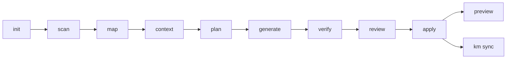
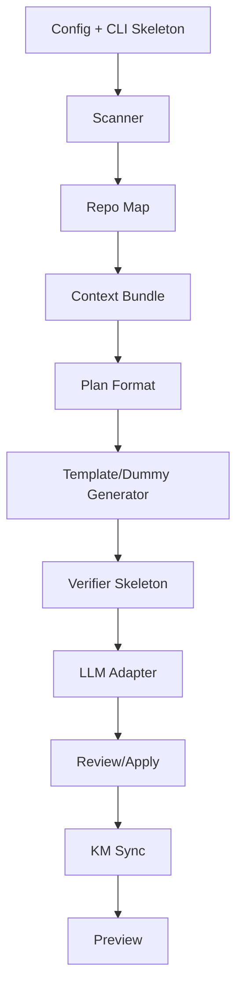
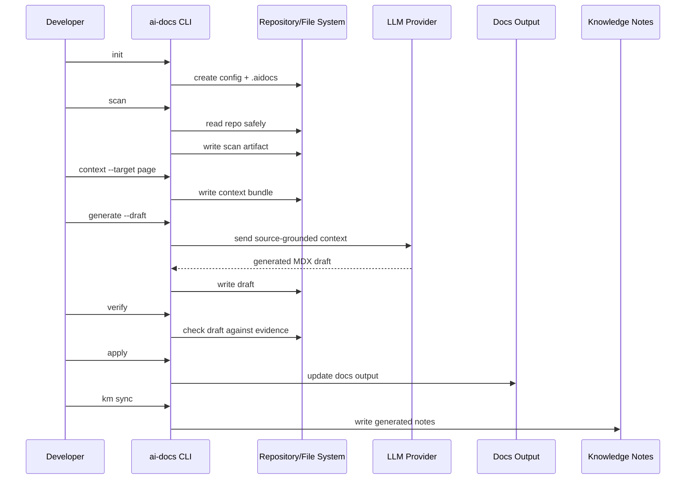

------
title: Build From Scratch: Mintlify-like AI-driven Documentation Generator CLI - Part 002
description: Mendesain product model, user journey, command surface, UX invariant, dan workflow CLI untuk AI-driven documentation generator yang dipakai developer secara nyata.
series: learn-ai-docs-km-cli
seriesTitle: Build From Scratch: Mintlify-like AI-driven Documentation Generator CLI with Code2Prompt and Open-source Knowledge Management
order: 2
partTitle: Product Thinking for Developer Documentation CLI
tags:
- ai-docs
- documentation
- cli
- product-thinking
- developer-experience
- docs-as-code
- mdx
- system-design
date: 2026-07-04
---

# Part 002 — Product Thinking for Developer Documentation CLI

Part sebelumnya menetapkan batas sistem. Sekarang kita turun satu lapis: **produk seperti apa yang sebenarnya sedang kita bangun?**

Ini penting karena banyak tooling developer gagal bukan karena algoritmanya buruk, tetapi karena product shape-nya salah. Tool terlalu magical, terlalu banyak prompt bebas, tidak bisa di-debug, tidak cocok dengan pull request flow, atau terasa seperti demo AI yang tidak bisa dipercaya dalam pekerjaan nyata.

CLI yang bagus harus punya rasa seperti ini:

```txt
Saya tahu command apa yang harus dipakai.
Saya tahu input apa yang dibaca.
Saya tahu output apa yang ditulis.
Saya tahu kapan AI dipakai.
Saya bisa review sebelum apply.
Saya bisa menjalankannya di CI.
Saya bisa menjelaskan hasilnya ke tim.
```

Jadi pada part ini kita akan mendesain produk dari sisi developer experience, bukan implementasi internal dulu.

---

## 1. Core Product Question

Pertanyaan produk utama:

> Bagaimana membuat CLI yang membantu developer menghasilkan dan merawat dokumentasi dari repository tanpa kehilangan kontrol, trust, dan reviewability?

Bukan:

> Bagaimana membuat AI menulis dokumen paling panjang?

Bukan juga:

> Bagaimana membuat wrapper API LLM untuk generate Markdown?

Kita perlu product model yang menyatu dengan cara engineer bekerja:

- repository;
- branch;
- pull request;
- diff;
- CI;
- code ownership;
- local preview;
- docs-as-code;
- internal notes;
- release lifecycle.

---

## 2. Siapa User-nya?

Sistem ini punya beberapa user persona. Kita tidak harus memuaskan semuanya di MVP, tetapi harus paham perbedaannya.

### 2.1 Library Maintainer

Library maintainer ingin:

- README yang jelas;
- installation guide;
- API reference;
- examples;
- migration guide;
- changelog/release notes.

Pain point:

- API berubah tetapi docs lambat;
- example sering outdated;
- public users bertanya hal sama di issue;
- docs dan tests tidak sinkron.

Command yang paling sering dipakai:

```bash
ai-docs generate --target public-docs
ai-docs verify --examples
ai-docs plan --from README.md
```

### 2.2 Platform Engineer

Platform engineer ingin:

- internal architecture docs;
- onboarding docs;
- service catalog;
- runbooks;
- config reference;
- dependency map;
- operational troubleshooting.

Pain point:

- knowledge tersebar;
- engineer baru sulit onboarding;
- runbook hanya ada di kepala orang lama;
- dependency antar service tidak jelas;
- incident berulang karena penyebab lama tidak terdokumentasi.

Command yang paling sering dipakai:

```bash
ai-docs scan --profile internal
ai-docs generate --target runbooks
ai-docs km sync --target logseq
ai-docs drift check
```

### 2.3 API Team

API team ingin:

- OpenAPI-driven reference;
- auth docs;
- error model;
- pagination docs;
- usage examples;
- versioned docs.

Pain point:

- OpenAPI menjelaskan shape, tetapi tidak menjelaskan workflow;
- guide dan API reference sering duplikatif;
- breaking changes tidak terlihat di docs;
- customer bingung urutan penggunaan API.

Command yang paling sering dipakai:

```bash
ai-docs generate --target api-reference
ai-docs generate --target guides/api-workflows
ai-docs verify --openapi
ai-docs nav generate
```

### 2.4 Internal Tooling Team

Internal tooling team ingin:

- docs untuk CLI/internal platform;
- command reference;
- examples;
- decision notes;
- self-service guide.

Pain point:

- user internal malas baca docs panjang;
- command berubah cepat;
- onboarding bergantung demo manual;
- docs internal sering tidak punya owner.

Command yang paling sering dipakai:

```bash
ai-docs generate --target cli-reference
ai-docs generate --target quickstart
ai-docs km sync --visibility internal
```

### 2.5 OSS Maintainer

OSS maintainer ingin:

- setup cepat;
- no heavy infra;
- generated docs bisa masuk PR;
- sensitive data aman;
- output compatible dengan static docs platform.

Pain point:

- kontribusi docs sulit dijaga;
- issue onboarding banyak;
- CI harus murah;
- contributors tidak punya akses secret/model API.

Command yang paling sering dipakai:

```bash
ai-docs generate --dry-run
ai-docs verify
ai-docs preview
```

---

## 3. Jobs To Be Done

Daripada mulai dari fitur, kita mulai dari pekerjaan yang ingin diselesaikan user.

### 3.1 Job 1 — “Bantu Saya Memahami Repo Ini”

Input:

```bash
ai-docs map
```

Output:

- repository summary;
- module list;
- detected languages/frameworks;
- high-signal files;
- potential docs targets.

User value:

- onboarding cepat;
- orientasi sebelum generate docs;
- bisa dipakai untuk review arsitektur.

### 3.2 Job 2 — “Buatkan Draft Docs yang Bisa Saya Review”

Input:

```bash
ai-docs generate --target overview --draft
```

Output:

- `index.mdx` draft;
- source evidence report;
- unsupported claim warning;
- suggested navigation placement.

User value:

- tidak mulai dari blank page;
- tetap bisa review;
- AI tidak langsung overwrite.

### 3.3 Job 3 — “Pastikan Docs Tidak Drift dari Code”

Input:

```bash
ai-docs drift check
```

Output:

- pages affected by code changes;
- stale sections;
- changed API contracts;
- missing docs update recommendation.

User value:

- docs jadi bagian dari engineering quality gate;
- mengurangi outdated docs.

### 3.4 Job 4 — “Sinkronkan Pengetahuan Internal”

Input:

```bash
ai-docs km sync --target logseq
```

Output:

- generated concept notes;
- module notes;
- architecture decision candidates;
- relationship graph.

User value:

- knowledge tidak hanya menjadi public docs;
- internal understanding bisa tumbuh dari codebase.

### 3.5 Job 5 — “Buat Docs Site yang Bisa Dipreview”

Input:

```bash
ai-docs preview
```

Output:

- local docs site;
- navigation;
- rendered MDX;
- link errors;
- API reference preview.

User value:

- developer melihat hasil seperti pembaca akhir;
- feedback loop cepat.

---

## 4. Product Shape: CLI sebagai Pipeline, Bukan Magic Button

Magic button terlihat menarik:

```bash
ai-docs make-everything-perfect
```

Tapi ini buruk untuk tool engineering. Developer butuh kontrol stage.

Product shape yang benar:

```bash
ai-docs init
ai-docs scan
ai-docs map
ai-docs context
ai-docs plan
ai-docs generate
ai-docs verify
ai-docs review
ai-docs apply
ai-docs preview
ai-docs km sync
```

Command boleh punya shortcut:

```bash
ai-docs build
```

Tetapi shortcut harus hanya orchestrate stage yang transparan, bukan menyembunyikan semua logic.

### 4.1 Pipeline View



### 4.2 Why Stage-by-stage Matters

Stage-by-stage penting karena:

- scanner bisa salah ignore file;
- context bisa terlalu besar;
- plan bisa buruk;
- generated page bisa hallucinate;
- verifier bisa menemukan error;
- reviewer mungkin ingin apply sebagian.

Kalau semuanya disembunyikan di satu command, developer kehilangan leverage.

---

## 5. Command Surface Awal

Mari desain command surface dengan hati-hati.

### 5.1 `ai-docs init`

Tujuan:

- membuat config awal;
- mendeteksi docs target;
- membuat folder `.aidocs/`;
- optional membuat `docs/` skeleton.

Contoh:

```bash
ai-docs init
```

Output:

```txt
Created ai-docs.config.yaml
Created .aidocs/
Detected project: TypeScript API service
Detected docs target: mintlify-like
Next: ai-docs scan
```

Generated config:

```yaml
schemaVersion: 1
project:
  name: acme-api
  visibility: internal

docs:
  target: mintlify-like
  outputDir: docs
  navigationFile: docs.json

scan:
  include:
    - README.md
    - src/**
    - docs/**
    - openapi*.yaml
    - package.json
  exclude:
    - node_modules/**
    - dist/**
    - coverage/**
    - .env*

ai:
  provider: openai
  model: configurable
  mode: draft-only

km:
  enabled: false
  target: logseq
  outputDir: knowledge/generated
```

Design note:

- `init` tidak boleh langsung generate docs.
- `init` boleh detect, tetapi harus conservative.

### 5.2 `ai-docs scan`

Tujuan:

- membaca repository;
- menerapkan ignore rules;
- mendeteksi file type;
- membuat scan artifact.

Contoh:

```bash
ai-docs scan .
```

Output:

```txt
Scanned repository: acme-api
Files seen: 1,842
Files included: 214
Files excluded: 1,628
Potential secrets excluded: 3
Scan artifact: .aidocs/scans/2026-07-04T10-15-00.json
```

Options:

```bash
ai-docs scan --profile public
ai-docs scan --profile internal
ai-docs scan --include "src/**" --exclude "src/internal/**"
ai-docs scan --explain
```

Design note:

- `scan` harus bisa jalan tanpa AI.
- `scan` harus cepat.
- `scan` harus aman.

### 5.3 `ai-docs map`

Tujuan:

- membuat repository map dari scan;
- menjelaskan struktur repo;
- membantu user melihat apakah scanner benar.

Contoh:

```bash
ai-docs map --format markdown
```

Output:

```md
# Repository Map: acme-api

## Detected Project Type

- Node.js API service
- OpenAPI contract present
- Docker deployment present

## Important Directories

- `src/routes`: HTTP route handlers
- `src/services`: business services
- `migrations`: database migrations
- `docs`: existing documentation
```

Design note:

- `map` boleh memakai heuristic dan optional AI summary.
- Jika memakai AI, hasil harus tetap dikaitkan dengan evidence.

### 5.4 `ai-docs context`

Tujuan:

- mengompilasi context bundle untuk target tertentu.

Contoh:

```bash
ai-docs context --target guides/authentication --explain
```

Output:

```txt
Context bundle created: .aidocs/context/guides-authentication.prompt.md
Estimated tokens: 18,420
Included files: 12
Excluded candidate files: 31
Run with --open to inspect.
```

Design note:

- context bundle harus inspectable.
- command ini adalah jantung Code2Prompt-style workflow kita.

### 5.5 `ai-docs plan`

Tujuan:

- membuat documentation plan sebelum generate pages.

Contoh:

```bash
ai-docs plan --target public-docs
```

Output:

```txt
Generated docs plan: .aidocs/plans/public-docs.json
Suggested pages: 12
Suggested navigation groups: 4
Potential missing sources: 2
```

Plan snippet:

```json
{
  "pages": [
    {
      "path": "index.mdx",
      "title": "Acme API",
      "purpose": "Explain what this project does and guide readers to the next step",
      "evidence": ["README.md", "openapi.yaml", "package.json"],
      "sections": ["Overview", "Quickstart", "Core Concepts", "Next Steps"]
    }
  ]
}
```

Design note:

- plan harus bisa diedit sebelum generate.
- plan memungkinkan docs generation lebih stabil.

### 5.6 `ai-docs generate`

Tujuan:

- menghasilkan MDX draft dari plan/context.

Contoh:

```bash
ai-docs generate --target public-docs --draft
```

Output:

```txt
Generated 12 draft pages in .aidocs/drafts/public-docs
No files overwritten.
Next: ai-docs verify .aidocs/drafts/public-docs
```

Options:

```bash
ai-docs generate --page index
ai-docs generate --changed-only
ai-docs generate --draft
ai-docs generate --out docs
ai-docs generate --no-ai # use templates only where possible
```

Design note:

- default harus draft, bukan overwrite.
- setiap generated page harus punya metadata.

### 5.7 `ai-docs verify`

Tujuan:

- memverifikasi generated docs.

Contoh:

```bash
ai-docs verify .aidocs/drafts/public-docs --strict
```

Checks:

- frontmatter valid;
- link valid;
- navigation valid;
- code fence syntax;
- OpenAPI reference valid;
- unsupported claims;
- secret leakage;
- stale source hash;
- page orphan.

Output:

```txt
Verification failed.
- 2 unsupported claims
- 1 broken internal link
- 1 code block missing language
Report: .aidocs/reports/verify-public-docs.json
```

Design note:

- verifier adalah product feature, bukan internal utility.
- user harus bisa memahami laporan.

### 5.8 `ai-docs review`

Tujuan:

- membantu user menerima/menolak generated changes.

Contoh:

```bash
ai-docs review
```

Possible UX:

```txt
Page: docs/index.mdx
Status: draft
Verification: passed with warnings

[A] accept  [E] edit  [S] skip  [D] show diff  [Q] quit
```

Design note:

- TUI optional.
- Non-interactive mode harus ada untuk CI.

### 5.9 `ai-docs apply`

Tujuan:

- menerapkan draft ke docs output.

Contoh:

```bash
ai-docs apply --from .aidocs/drafts/public-docs --to docs
```

Design note:

- apply harus preserve human sections.
- apply harus bisa fail jika target berubah sejak draft dibuat.

### 5.10 `ai-docs preview`

Tujuan:

- local preview docs.

Contoh:

```bash
ai-docs preview
```

Output:

```txt
Starting docs preview at http://localhost:3000
Watching docs/**/*.mdx and docs.json
```

Design note:

- preview bisa delegate ke target renderer.
- untuk Mintlify-like target, bisa menjalankan adapter yang sesuai.

### 5.11 `ai-docs km sync`

Tujuan:

- menyinkronkan knowledge notes.

Contoh:

```bash
ai-docs km sync --target logseq --visibility internal
```

Output:

```txt
Generated 34 knowledge notes
Updated 8 existing generated notes
Skipped 12 human-owned notes
Output: knowledge/generated
```

Design note:

- KM sync tidak boleh mengacak personal notes.
- generated notes perlu namespace/folder sendiri.

### 5.12 `ai-docs ci check`

Tujuan:

- command tunggal untuk CI.

Contoh:

```bash
ai-docs ci check
```

Equivalent:

```bash
ai-docs scan --ci
ai-docs drift check --ci
ai-docs verify docs --strict
```

Design note:

- exit code harus meaningful.
- output harus machine-readable optional.

---

## 6. CLI UX Invariant

Tool ini harus terasa seperti alat engineering yang bisa dipercaya.

### 6.1 Predictable

Command yang sama dengan input sama harus menghasilkan artifact yang sama sejauh mungkin.

Bad:

```txt
Sometimes it updates docs, sometimes it creates drafts, sometimes it deletes pages.
```

Good:

```txt
generate creates drafts by default.
apply modifies docs.
verify never modifies files.
scan never calls AI.
```

### 6.2 Inspectable

User harus bisa melihat apa yang terjadi.

Command:

```bash
ai-docs context --target quickstart --open
```

Atau:

```bash
ai-docs explain page docs/guides/authentication.mdx
```

Output:

```txt
This page was generated from:
- README.md
- openapi.yaml#/paths/~1auth~1login
- src/auth/session.ts
- tests/auth/login.test.ts
```

### 6.3 Resumable

Jika generation gagal di page ke-8, user tidak boleh mulai dari nol.

Artifact state:

```json
{
  "runId": "run_20260704_101500",
  "status": "partial",
  "completedPages": ["index", "quickstart", "guides/authentication"],
  "failedPages": ["guides/webhooks"]
}
```

Command:

```bash
ai-docs generate --resume run_20260704_101500
```

### 6.4 Safe

Default harus aman:

- no overwrite;
- no secrets;
- no public exposure of internal modules;
- no auto-commit;
- no silent provider call for sensitive context.

### 6.5 Diff-first

Developer berpikir dalam diff.

Command:

```bash
ai-docs diff
```

Output:

```diff
+ ## Authentication
+ This API uses bearer token authentication as defined in `openapi.yaml`.
```

### 6.6 CI-friendly

Setiap interactive feature harus punya non-interactive equivalent.

Bad:

```bash
ai-docs review # only TUI, cannot run in CI
```

Good:

```bash
ai-docs verify --format json --output report.json
ai-docs ci check --fail-on unsupported-claims,broken-links
```

### 6.7 Explain Failure, Not Just Error

Bad:

```txt
Generation failed.
```

Good:

```txt
Generation failed for docs/guides/webhooks.mdx.
Reason: context bundle exceeded token budget.
Largest contributors:
- src/webhooks/examples/big-fixture.json: 41,200 estimated tokens
- test/fixtures/events.json: 18,900 estimated tokens
Suggestion: exclude fixtures or enable summarization tier.
```

---

## 7. User Journey End-to-end

Mari ikuti satu journey nyata.

### 7.1 Starting Point

Repo:

```txt
acme-api/
  README.md
  package.json
  openapi.yaml
  src/
    routes/
      users.ts
      orders.ts
    services/
      order-service.ts
      pricing-client.ts
  tests/
    orders.test.ts
  docs/
    old-overview.md
```

Developer ingin membuat docs public dengan overview, quickstart, API reference, dan order workflow guide.

### 7.2 Step 1 — Init

```bash
ai-docs init --target mintlify-like
```

Tool membuat:

```txt
ai-docs.config.yaml
.aidocs/
docs/
```

### 7.3 Step 2 — Scan

```bash
ai-docs scan --profile public --explain
```

Output penting:

```txt
Included:
- README.md
- openapi.yaml
- src/routes/users.ts
- src/routes/orders.ts
- tests/orders.test.ts

Excluded:
- .env.local: secret-like file
- node_modules/**: dependency directory
- dist/**: generated output
```

Developer melihat scan masuk akal.

### 7.4 Step 3 — Map

```bash
ai-docs map --format markdown --out .aidocs/repo-map.md
```

Output:

```md
# Repository Map

This repository appears to be a Node.js API service with OpenAPI contract and route handlers under `src/routes`.

## Modules

- API routes: `src/routes`
- Order service: `src/services/order-service.ts`
- Pricing integration: `src/services/pricing-client.ts`
```

### 7.5 Step 4 — Plan

```bash
ai-docs plan --target public-docs
```

Plan:

```json
{
  "pages": [
    { "path": "index.mdx", "title": "Acme API" },
    { "path": "quickstart.mdx", "title": "Quickstart" },
    { "path": "guides/orders.mdx", "title": "Order Workflow" },
    { "path": "api-reference/introduction.mdx", "title": "API Reference" }
  ]
}
```

Developer bisa edit plan sebelum generation.

### 7.6 Step 5 — Context

```bash
ai-docs context --page guides/orders --explain
```

Output:

```txt
Included files for guides/orders:
- openapi.yaml: order endpoints
- src/routes/orders.ts: route implementation
- src/services/order-service.ts: core workflow
- tests/orders.test.ts: usage examples

Estimated tokens: 22,300
```

### 7.7 Step 6 — Generate Draft

```bash
ai-docs generate --page guides/orders --draft
```

Output:

```txt
Generated draft: .aidocs/drafts/guides/orders.mdx
```

### 7.8 Step 7 — Verify

```bash
ai-docs verify .aidocs/drafts/guides/orders.mdx
```

Output:

```txt
Verification completed with warnings:
- Claim needs review: "Orders are processed asynchronously"
  Evidence: partial. Found event emission but no queue consumer in scanned files.
```

This is exactly what we want. The tool does not pretend certainty.

### 7.9 Step 8 — Apply

```bash
ai-docs apply --page guides/orders
```

Output:

```txt
Applied draft to docs/guides/orders.mdx
Updated docs.json navigation
```

### 7.10 Step 9 — KM Sync

```bash
ai-docs km sync --target logseq --visibility internal
```

Generated:

```txt
knowledge/generated/pages/Order Workflow.md
knowledge/generated/pages/Order Service.md
knowledge/generated/pages/Pricing Client.md
```

---

## 8. Product Modes

Satu CLI bisa punya beberapa mode. Mode penting untuk safety.

### 8.1 Local Mode

Default untuk developer.

```yaml
mode: local
```

Behavior:

- writes local artifacts;
- prompts before risky actions;
- no CI-specific output;
- can use interactive review.

### 8.2 CI Mode

```bash
ai-docs ci check
```

Behavior:

- no interactive prompt;
- stable output;
- meaningful exit code;
- JSON report;
- fail on configured rules.

Exit code design:

| Exit Code | Meaning |
|---:|---|
| 0 | success |
| 1 | verification failed |
| 2 | invalid config |
| 3 | unsafe input detected |
| 4 | provider/model failure |
| 5 | internal error |

### 8.3 Draft Mode

Default for generation.

```bash
ai-docs generate --draft
```

Behavior:

- writes to `.aidocs/drafts`;
- no docs overwrite;
- includes source metadata;
- ready for review.

### 8.4 Apply Mode

Explicit mutation.

```bash
ai-docs apply
```

Behavior:

- modifies docs output;
- requires verified draft by default;
- preserves human sections;
- updates navigation if allowed.

### 8.5 Public Mode vs Internal Mode

Public mode:

```bash
ai-docs generate --visibility public
```

Internal mode:

```bash
ai-docs generate --visibility internal
```

Difference:

| Concern | Public | Internal |
|---|---|---|
| Internal module details | excluded by default | included if safe |
| Architecture trade-off | limited | allowed |
| Runbooks | sanitized | detailed |
| Customer data | never | still restricted |
| Notes output | optional | primary use case |

---

## 9. Configuration as Product Contract

Config bukan detail teknis. Config adalah kontrak antara user dan tool.

### 9.1 Minimal Config

```yaml
schemaVersion: 1
project:
  name: acme-api

docs:
  target: mintlify-like
  outputDir: docs

scan:
  include:
    - README.md
    - src/**
    - docs/**
  exclude:
    - node_modules/**
    - dist/**
    - .env*
```

### 9.2 Advanced Config

```yaml
schemaVersion: 1
project:
  name: acme-api
  defaultVisibility: public
  repositoryUrl: https://example.invalid/acme-api

docs:
  target: mintlify-like
  outputDir: docs
  navigationFile: docs.json
  preserveHumanSections: true
  generatedMarker: ai-docs

scan:
  include:
    - README.md
    - src/**
    - docs/**
    - openapi*.yaml
    - package.json
    - tests/**
  exclude:
    - node_modules/**
    - dist/**
    - coverage/**
    - .env*
    - "**/*.pem"
    - "**/*.key"
  maxFileSizeKb: 256

visibility:
  public:
    exclude:
      - src/internal/**
      - docs/internal/**
  internal:
    include:
      - src/**
      - docs/internal/**

ai:
  provider: configurable
  model: configurable
  temperature: 0.2
  maxOutputTokens: 4096
  requireSourceGrounding: true

verification:
  failOn:
    - secret-leak
    - broken-link
    - unsupported-claim
  warnOn:
    - missing-example
    - weak-source

km:
  enabled: true
  target: logseq
  outputDir: knowledge/generated
  namespace: aidocs
```

### 9.3 Config Design Rules

Good config:

- explicit;
- versioned;
- validated;
- has safe defaults;
- supports profiles;
- can be explained.

Bad config:

- too magical;
- silently inferred;
- no schema;
- no validation;
- provider secrets mixed into repo config.

---

## 10. The CLI Should Teach the User the System

Good developer tools are educational. They show the system model through commands.

### 10.1 Bad Output

```txt
Done.
```

### 10.2 Better Output

```txt
Generated 4 draft pages.

Verification:
- passed: 3 pages
- warnings: 1 page

Next recommended command:
  ai-docs review
```

### 10.3 Best Output

```txt
Generated 4 draft pages from plan .aidocs/plans/public-docs.json

Pages:
- index.mdx: passed
- quickstart.mdx: passed
- guides/authentication.mdx: warning: 1 weak claim
- api-reference/introduction.mdx: passed

No docs files were overwritten.
Next:
  ai-docs review
  ai-docs apply --verified-only
```

This reduces cognitive load. User always knows what happened and what comes next.

---

## 11. Avoiding Product Anti-patterns

### 11.1 Anti-pattern: One Giant Generate Command

```bash
ai-docs generate-everything
```

Problem:

- impossible to debug;
- expensive;
- risky;
- unpredictable;
- not CI-friendly.

Better:

```bash
ai-docs plan
ai-docs generate --page quickstart
ai-docs verify
```

### 11.2 Anti-pattern: Silent Overwrite

Bad:

```bash
ai-docs generate --out docs
```

Then user finds manual docs gone.

Better:

```bash
ai-docs generate --draft
ai-docs diff
ai-docs apply
```

### 11.3 Anti-pattern: Prompt Hidden from User

Bad:

```txt
AI generated docs.
```

But user cannot see context.

Better:

```bash
ai-docs context --page quickstart --open
```

### 11.4 Anti-pattern: Treating AI as Source of Truth

Bad generated sentence:

```md
This architecture is highly scalable and production-ready.
```

Better:

```md
The repository includes Docker configuration and CI workflow files. Production readiness still depends on deployment configuration, runtime limits, monitoring, and environment-specific review.
```

### 11.5 Anti-pattern: No Public/Internal Split

Bad:

```bash
ai-docs generate --all
```

Potential leak.

Better:

```bash
ai-docs generate --visibility public
ai-docs km sync --visibility internal
```

---

## 12. Designing the First-run Experience

First-run experience menentukan apakah developer percaya atau uninstall.

### 12.1 Ideal First Run

```bash
ai-docs init
```

Output:

```txt
AIDocs will create a local configuration and artifact directory.
It will not call any AI provider during init.
It will not modify existing docs.

Detected:
- Node.js project
- OpenAPI file: openapi.yaml
- Existing docs directory: docs/

Created:
- ai-docs.config.yaml
- .aidocs/

Next:
  ai-docs scan --explain
```

### 12.2 First Scan

```bash
ai-docs scan --explain
```

Output should show:

- files included;
- files excluded;
- possible secrets;
- config used;
- artifact path.

### 12.3 First Generation

Never start with full site generation. Start with one page.

```bash
ai-docs generate --page index --draft
```

This reduces risk and teaches the workflow.

---

## 13. Product Metrics

Metrics untuk CLI ini bukan vanity metrics seperti “jumlah kata yang dihasilkan”.

### 13.1 Useful Metrics

| Metric | Why it matters |
|---|---|
| Draft acceptance rate | Apakah generated docs benar-benar membantu |
| Unsupported claim count | Trust quality |
| Drift detection count | Maintenance value |
| Time from repo scan to first draft | First value speed |
| Human edit distance | Seberapa banyak user harus memperbaiki |
| Broken link count | Docs health |
| Example validation pass rate | Followability |
| Secret detection count | Safety |

### 13.2 Dangerous Metrics

| Metric | Why dangerous |
|---|---|
| Words generated | Banyak teks tidak berarti berguna |
| Pages generated | Bisa menghasilkan docs spam |
| Token spent | Cost, bukan value |
| AI calls made | Activity, bukan outcome |

### 13.3 North Star Metric

Untuk produk ini, north star yang lebih masuk akal:

```txt
Verified documentation changes accepted by developers per repository change.
```

Kenapa?

- “verified” menekankan quality;
- “accepted” menekankan human review;
- “per repository change” menekankan maintenance, bukan one-time generation.

---

## 14. Designing for Trust

Trust tidak datang dari klaim “AI-powered”. Trust datang dari controllability.

### 14.1 Trust Lever 1 — Provenance

Setiap page punya metadata:

```yaml
sourceEvidence:
  - README.md
  - openapi.yaml
  - src/routes/orders.ts
sourceScanHash: sha256:abc
lastVerifiedAt: 2026-07-04T10:15:00+07:00
```

### 14.2 Trust Lever 2 — Verification

User tidak harus percaya output AI. User membaca report.

```txt
No unsupported claims found.
2 links checked.
3 code fences checked.
OpenAPI references valid.
```

### 14.3 Trust Lever 3 — Diffs

Generated docs harus masuk review seperti code.

### 14.4 Trust Lever 4 — Safe Defaults

Default behavior:

- no overwrite;
- no auto-publish;
- no secret inclusion;
- no internal public docs;
- no silent remote call during scan/init.

### 14.5 Trust Lever 5 — Reversibility

Jika apply salah, user harus bisa revert:

```bash
ai-docs apply --create-backup
ai-docs rollback last
```

Rollback bisa sederhana: store patch.

---

## 15. CLI Information Architecture

Command hierarchy harus mudah diingat.

Proposed hierarchy:

```txt
ai-docs
  init
  scan
  map
  context
  plan
  generate
  verify
  review
  apply
  diff
  preview
  drift
    check
    report
  nav
    generate
    verify
  km
    sync
    export
    verify
  ci
    check
  doctor
```

### 15.1 `doctor`

`doctor` penting untuk DX.

```bash
ai-docs doctor
```

Checks:

- config valid;
- docs output writable;
- provider configured;
- model reachable optional;
- target renderer installed;
- git available;
- no suspicious config.

Output:

```txt
AIDocs Doctor
✓ Config valid
✓ Git available
✓ Docs output writable
! No AI provider configured
  Generation commands requiring AI will fail.
✓ Secret scanner enabled
```

---

## 16. State Model

CLI butuh state. Jangan simpan semuanya secara implicit.

### 16.1 `.aidocs` Directory

```txt
.aidocs/
  config.lock.json
  scans/
  repo-maps/
  symbols/
  context/
  plans/
  drafts/
  reports/
  runs/
  cache/
  km/
```

### 16.2 Run Record

```json
{
  "runId": "run_20260704_101500",
  "command": "generate",
  "startedAt": "2026-07-04T10:15:00+07:00",
  "endedAt": "2026-07-04T10:16:22+07:00",
  "status": "completed_with_warnings",
  "inputs": {
    "scanId": "scan_abc",
    "planId": "plan_public_docs"
  },
  "outputs": {
    "draftDir": ".aidocs/drafts/public-docs",
    "report": ".aidocs/reports/generate_public_docs.json"
  }
}
```

State membuat resume, debug, dan audit possible.

---

## 17. Human Edit Protection

Ini product requirement penting.

### 17.1 Three Strategies

#### Strategy A — Draft-only Default

Paling aman.

```txt
Generated output always goes to .aidocs/drafts first.
```

#### Strategy B — Generated Regions

Gunakan markers.

```mdx
{/* ai-docs:start id="auth-overview" */}
Generated content.
{/* ai-docs:end */}
```

#### Strategy C — Three-way Merge

Lebih kompleks:

```txt
base generated version
current human version
new generated version
```

Lalu merge.

### 17.2 MVP Choice

Untuk MVP, pilih:

```txt
Draft-only default + explicit apply
```

Generated regions dan three-way merge datang setelah pipeline stabil.

---

## 18. Product Decision: What to Build First

Urutan implementasi harus mengikuti risk.

### 18.1 Jangan Mulai dari LLM Adapter

Banyak orang akan mulai dari:

```ts
const result = await openai.chat.completions.create(...)
```

Itu terlalu cepat. Yang lebih penting lebih dulu:

1. config;
2. scanner;
3. artifact layout;
4. context bundle format;
5. draft output;
6. verifier skeleton.

LLM adapter bisa dummy dulu.

### 18.2 Build Order yang Benar



Kenapa LLM adapter tidak pertama?

Karena tanpa scanner/context/verifier, LLM hanya membuat output yang tidak bisa dipercaya.

---

## 19. Example Product Spec v0.1

Mari tulis product spec awal.

### 19.1 Product Name

```txt
AIDocs KM CLI
```

### 19.2 Product Promise

```txt
Generate, verify, and maintain source-grounded developer documentation from your repository, with optional knowledge graph export for internal engineering notes.
```

### 19.3 Primary Users

- software engineers;
- platform teams;
- API teams;
- OSS maintainers.

### 19.4 MVP Features

- `init` config;
- safe `scan`;
- repository `map`;
- inspectable `context` bundle;
- editable `plan`;
- draft `generate`;
- basic `verify`;
- explicit `apply`;
- simple `km sync` export;
- local `preview` placeholder/adapter.

### 19.5 Non-goals v0.1

- hosted SaaS;
- real-time collaboration;
- perfect AST for every language;
- automatic publish to production;
- full bidirectional notes sync;
- replacing human docs review.

### 19.6 Safety Defaults

- no overwrite by default;
- no secrets in context;
- no provider call during `init` or `scan`;
- public/internal visibility split;
- verification before apply recommended;
- all generated artifacts traceable.

---

## 20. Concrete CLI Help Draft

Good CLI help is product design.

```txt
AIDocs KM CLI

Usage:
  ai-docs <command> [options]

Core workflow:
  init        Create project config and local artifact directory
  scan        Scan repository safely and produce scan artifact
  map         Build and display repository map
  context     Compile inspectable LLM context bundle
  plan        Create documentation plan before generation
  generate    Generate MDX documentation drafts
  verify      Verify docs for links, claims, examples, and safety
  review      Review generated drafts interactively
  apply       Apply reviewed drafts to docs output
  preview     Preview generated documentation locally

Maintenance:
  drift       Detect docs drift from repository changes
  nav         Generate or verify docs navigation
  km          Sync generated knowledge notes
  ci          Run CI-safe docs checks
  doctor      Diagnose local configuration and environment

Safety:
  init and scan never call an AI provider.
  generate writes drafts by default.
  apply is the explicit command that modifies docs output.
```

This help text teaches the operating model.

---

## 21. UX for Errors

Error design matters.

### 21.1 Invalid Config

Bad:

```txt
YAML parse error.
```

Good:

```txt
Invalid config: ai-docs.config.yaml

Problem:
  docs.outputDir must be a string, but got array.

Found:
  docs:
    outputDir:
      - docs

Expected:
  docs:
    outputDir: docs
```

### 21.2 Unsafe File Detected

```txt
Unsafe input detected during scan.

File:
  .env.production

Reason:
  Secret-like file matched default exclude pattern `.env*`.

Action:
  File was excluded from scan and will not enter context bundles.
```

### 21.3 Token Budget Exceeded

```txt
Context budget exceeded for page guides/authentication.

Budget:
  32,000 tokens
Estimated:
  47,800 tokens

Largest files:
- tests/fixtures/auth-large.json: 18,200
- src/generated/client.ts: 12,900

Suggestions:
- add tests/fixtures/** to scan.exclude
- enable summarization for generated files
- generate a narrower page target
```

### 21.4 Unsupported Claim

```txt
Unsupported claim found.

Page:
  docs/guides/authentication.mdx

Claim:
  "Refresh tokens expire after 30 days."

Reason:
  No matching config, OpenAPI schema, constant, or test evidence found.

Suggested action:
  Remove the claim or add explicit evidence/policy.
```

---

## 22. Product Risk Register

| Risk | Impact | Mitigation |
|---|---|---|
| AI writes false docs | Loss of trust | source-grounding, verifier, review |
| Secret leak | Severe | default ignore, secret scanning, redaction |
| Docs overwrite human edits | Severe | draft-only default, apply command |
| CLI too complex | Adoption drop | progressive workflow, good help, sensible defaults |
| Too much context cost | Expensive/slow | token budget, relevance ranking, cache |
| KM sync pollutes notes | User frustration | generated namespace, human-owned protection |
| CI too flaky | Teams disable it | deterministic checks, no AI in default verify |
| Multi-language parsing too hard | Scope explosion | heuristic first, plugin analyzers later |

---

## 23. The Product Contract in One Diagram



Notice:

- `init` and `scan` do not call LLM.
- `generate` writes draft.
- `apply` is explicit.
- `km sync` is separate.

This is the product boundary.

---

## 24. Practical Exercise: Design Your First CLI Session

Pick one repo. Write the first session you want a developer to run.

Template:

```bash
ai-docs init --target mintlify-like
ai-docs scan --profile public --explain
ai-docs map --format markdown
ai-docs plan --target public-docs
ai-docs context --page index --explain
ai-docs generate --page index --draft
ai-docs verify .aidocs/drafts/index.mdx
ai-docs review
ai-docs apply --page index
ai-docs preview
```

Then answer:

```txt
What should each command output?
Which command is allowed to modify docs/?
Which command is allowed to call AI?
Which command must be CI-safe?
Which artifacts must be inspectable?
What should happen if verification fails?
```

If answers are unclear, product design is not ready.

---

## 25. Ringkasan Part 002

Kita sudah mendesain product shape CLI:

- CLI harus menjadi pipeline yang transparan, bukan magic button.
- User utama bisa library maintainer, platform engineer, API team, internal tooling team, atau OSS maintainer.
- Command surface inti: `init`, `scan`, `map`, `context`, `plan`, `generate`, `verify`, `review`, `apply`, `preview`, `km sync`, dan `ci check`.
- UX invariant: predictable, inspectable, resumable, safe, diff-first, CI-friendly, dan failure-explaining.
- Default harus draft-only dan safe by default.
- AI generation bukan tahap pertama; scanner, artifact model, context bundle, dan verifier harus dibangun lebih dulu.
- Product trust dibangun dari provenance, verification, diff, safe defaults, dan reversibility.

Part berikutnya akan masuk ke **Reference Architecture: From Repository to Knowledge Platform**. Di sana kita akan membangun architecture blueprint yang lebih presisi: module boundary, dataflow, storage, adapter, dan deployment mode.

---

## 26. Referensi Faktual

- Code2Prompt GitHub — konteks untuk product need berupa CLI yang mengemas codebase menjadi prompt LLM, mendukung filtering, templating, token tracking, dan git integration: https://github.com/mufeedvh/code2prompt
- Code2Prompt website — konteks untuk structured prompt, Rust performance, Handlebars templating, multi-format output, dan git integration: https://code2prompt.dev/
- Mintlify Navigation docs — konteks untuk docs navigation berbasis `docs.json`, pages, groups, tabs, anchors, products, versions, dan languages: https://www.mintlify.com/docs/organize/navigation
- Mintlify Global Settings docs — konteks untuk `docs.json` sebagai central site configuration: https://www.mintlify.com/docs/organize/settings
- Logseq GitHub — konteks untuk open-source privacy-first knowledge management dengan Markdown/Org-mode: https://github.com/logseq/logseq
- OpenNote GitHub — konteks untuk local-first AI-powered notebook berbasis Rust dengan semantic search dan status heavy development: https://github.com/opennote-org/opennote
