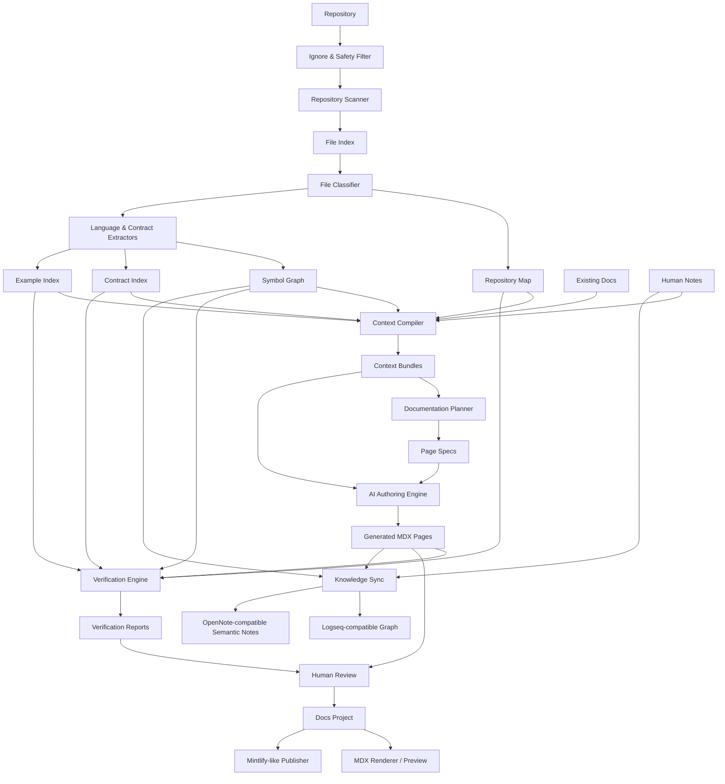
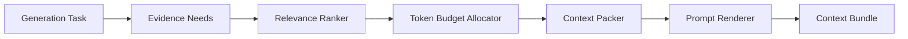
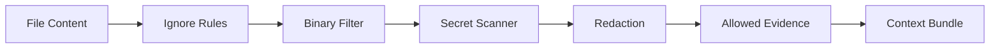
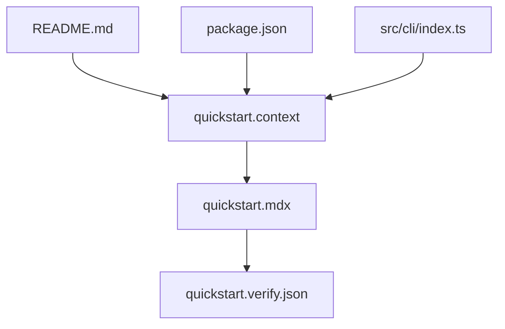
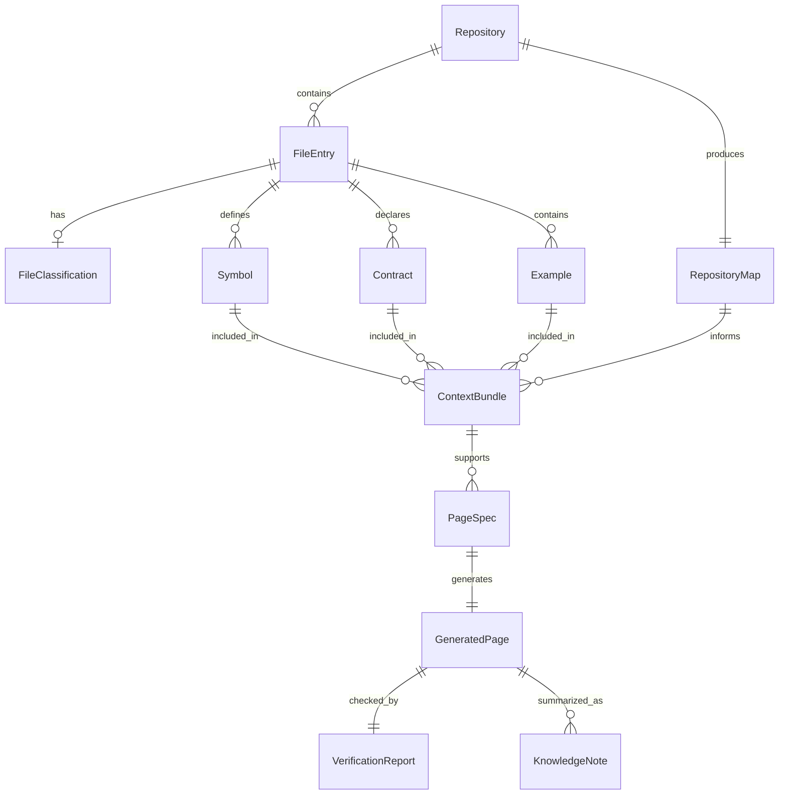

------
title: Build From Scratch: Mintlify-like AI-driven Documentation Generator CLI - Part 003
description: Mendesain reference architecture end-to-end dari repository scanner, context compiler, AI documentation planner, verifier, knowledge graph sink, sampai Mintlify-like publishing pipeline.
series: learn-ai-docs-km-cli
seriesTitle: Build From Scratch: Mintlify-like AI-driven Documentation Generator CLI with Code2Prompt and Open-source Knowledge Management
order: 3
partTitle: Reference Architecture: From Repository to Knowledge Platform
tags:
- ai-docs
- documentation
- cli
- architecture
- code2prompt
- knowledge-management
- logseq
- opennote
- mdx
- system-design
date: 2026-07-04
---

# Part 003 — Reference Architecture: From Repository to Knowledge Platform

Pada dua part sebelumnya kita sudah menetapkan dua hal penting:

1. sistem ini bukan sekadar generator README;
2. CLI ini harus terasa seperti alat developer yang bisa di-debug, di-review, dan dijalankan ulang.

Sekarang kita naik satu level: **arsitektur referensi**.

Kita perlu peta besar sebelum menulis scanner, prompt builder, verifier, atau publisher. Tanpa peta ini, implementasi akan mudah berubah menjadi kumpulan script acak:

```txt
scan repo -> kirim semua file ke LLM -> tulis docs -> berharap hasilnya benar
```

Itu bukan sistem. Itu eksperimen.

Sistem production-grade perlu arsitektur yang memisahkan:

- pengumpulan evidence;
- pemahaman repository;
- penyusunan context;
- perencanaan dokumentasi;
- penulisan MDX;
- verifikasi klaim;
- sinkronisasi knowledge graph;
- rendering dan publishing.

Arsitektur ini harus membuat satu prinsip selalu benar:

> AI boleh membantu menulis, tetapi struktur sistem harus menentukan apa yang boleh dibaca, apa yang boleh diklaim, apa yang harus diverifikasi, dan apa yang boleh dipublikasikan.

---

## 1. Bentuk Sistem yang Sedang Kita Bangun

Secara kasar, sistem yang kita bangun punya bentuk seperti ini:

```txt
Repository
  -> Repository Understanding Engine
  -> Context Compiler
  -> Documentation Planner
  -> AI Authoring Engine
  -> Verification Engine
  -> Docs Publisher
  -> Knowledge Management Sink
```

Namun bentuk ini masih terlalu linear. Dalam praktiknya, sistem harus menyimpan artifact di setiap stage, karena developer harus bisa melihat, mengulang, membandingkan, dan memperbaiki setiap hasil.

Bentuk yang lebih benar:

```txt
Repository
  -> scan artifact
  -> repository map artifact
  -> symbol graph artifact
  -> context bundle artifact
  -> docs plan artifact
  -> generated page artifacts
  -> verification report artifact
  -> published docs artifact
  -> knowledge notes artifact
```

Jadi CLI ini bukan hanya command runner. Ia adalah **artifact pipeline**.

---

## 2. Kenapa Artifact-first Architecture Penting

Banyak tool AI gagal karena semua prosesnya terjadi di dalam satu request besar ke model. Akibatnya:

- developer tidak tahu file apa yang dipakai;
- developer tidak tahu prompt apa yang dikirim;
- developer tidak tahu mengapa halaman tertentu dibuat;
- developer tidak tahu klaim mana berasal dari source mana;
- ketika hasil salah, sulit memperbaiki stage yang tepat;
- hasil tidak reproducible.

Artifact-first architecture memecah proses menjadi hasil antara yang eksplisit.

Contoh:

```bash
ai-docs scan
ai-docs context --page quickstart
ai-docs plan
ai-docs generate --page quickstart
ai-docs verify --page quickstart
```

Setiap command menghasilkan file yang bisa dibuka:

```txt
.aidocs/
  scans/latest.json
  repo-map/latest.json
  symbols/latest.json
  contexts/quickstart.prompt.md
  plans/docs-plan.json
  generated/quickstart.mdx
  reports/quickstart.verify.json
```

Dari sini developer bisa bertanya dengan jelas:

- scanner salah membaca file?
- classifier salah menganggap file penting?
- context terlalu besar?
- planner membuat page yang tidak perlu?
- LLM mengarang klaim?
- verifier gagal mendeteksi link rusak?

Tanpa artifact, semua pertanyaan itu kabur.

---

## 3. Arsitektur Besar

Diagram berikut menunjukkan arsitektur referensi sistem.



Diagram ini terlihat besar, tetapi secara mental cukup sederhana:

1. **Repository layer** mengubah file mentah menjadi evidence.
2. **Context layer** mengubah evidence menjadi prompt/task yang sempit dan jelas.
3. **Generation layer** mengubah task menjadi MDX.
4. **Verification layer** memastikan MDX tidak lepas dari source.
5. **Publishing layer** menjadikan output bisa dibaca manusia.
6. **Knowledge layer** menjadikan output bisa menjadi long-term developer memory.

---

## 4. Layer 1 — Repository Understanding Engine

Layer pertama adalah bagian yang paling sering diremehkan.

Banyak orang langsung ingin memanggil LLM. Padahal kualitas output AI sangat bergantung pada kualitas input. Kalau input berupa dump file acak, output juga akan acak.

Repository Understanding Engine bertugas menjawab:

- repo ini proyek apa?
- bahasa dan framework apa yang dipakai?
- file mana yang penting?
- file mana yang tidak boleh dikirim ke model?
- module apa saja yang ada?
- public API surface ada di mana?
- contoh penggunaan ada di mana?
- test mana yang menunjukkan behavior?
- contract mana yang menjadi source of truth?

### 4.1 Sub-komponen Repository Understanding Engine

```txt
Repository Understanding Engine
  - IgnoreResolver
  - FileScanner
  - FileClassifier
  - LanguageDetector
  - FrameworkDetector
  - SourceTreeBuilder
  - SymbolExtractor
  - ContractExtractor
  - ExampleMiner
  - RepositorySummarizer
```

Setiap komponen harus kecil dan bisa diuji.

### 4.2 IgnoreResolver

Tugasnya menentukan file mana yang tidak boleh diproses.

Sumber aturan:

- `.gitignore`;
- `.docignore`;
- konfigurasi `ai-docs.config.*`;
- default ignore bawaan;
- secret detection;
- binary detection;
- generated file detection.

Default ignore harus agresif. Lebih baik melewatkan file yang bisa dimasukkan manual daripada secara tidak sengaja mengirim secret atau data sensitif.

Contoh default ignore:

```txt
.git/
node_modules/
target/
build/
dist/
coverage/
.env
*.pem
*.key
*.p12
*.jks
*.class
*.jar
*.png
*.jpg
*.pdf
```

Nanti kita akan desain lebih detail pada part scanner dan security.

### 4.3 FileScanner

FileScanner menghasilkan daftar file dengan metadata.

Contoh model:

```json
{
  "path": "src/server/routes/users.ts",
  "extension": ".ts",
  "sizeBytes": 4821,
  "sha256": "...",
  "isBinary": false,
  "isIgnored": false,
  "lastModified": "2026-07-04T10:12:00Z"
}
```

Scanner tidak boleh langsung membaca semua isi file secara membabi buta. Ia harus hemat, incremental, dan aman.

### 4.4 FileClassifier

Classifier memberi label semantik ke file.

Contoh:

```json
{
  "path": "openapi.yaml",
  "kind": "api_contract",
  "importance": "high",
  "reason": "OpenAPI specification detected at repository root"
}
```

Label file penting untuk context packing. File `openapi.yaml` dan file test integrasi mungkin lebih penting untuk dokumentasi daripada file util internal kecil.

### 4.5 SourceTreeBuilder

Source tree adalah representasi struktur repo.

Code2Prompt populer karena bisa mengubah codebase menjadi prompt yang berisi source tree dan isi file terpilih. Konsep ini penting: sebelum membaca isi file, model perlu melihat bentuk repo. Source tree memberi orientasi global.

Contoh tree:

```txt
.
├── docs/
├── src/
│   ├── cli/
│   ├── scanner/
│   ├── context/
│   └── verifier/
├── tests/
├── package.json
└── README.md
```

Tapi untuk sistem production-grade, source tree bukan hanya string. Ia artifact terstruktur:

```json
{
  "root": ".",
  "nodes": [
    { "path": "src/cli", "type": "directory", "children": 8 },
    { "path": "src/context/compiler.ts", "type": "file", "kind": "source_code" }
  ]
}
```

### 4.6 SymbolExtractor

Symbol extractor mengambil elemen penting dari kode.

Untuk TypeScript:

- exported function;
- class;
- interface;
- CLI command;
- route handler.

Untuk Java:

- class;
- interface;
- annotation;
- JAX-RS endpoint;
- Spring controller;
- DTO;
- repository;
- service.

Untuk Go:

- exported function;
- struct;
- interface;
- package;
- route registration.

Symbol graph tidak harus sempurna di awal. Yang penting adalah bisa menjadi evidence untuk docs.

### 4.7 ContractExtractor

Contract extractor mencari source of truth eksternal:

- OpenAPI;
- JSON Schema;
- Protobuf;
- Avro;
- GraphQL schema;
- AsyncAPI;
- database migration;
- CLI manifest;
- config schema.

Kontrak biasanya lebih kuat daripada komentar kode. Jika OpenAPI mengatakan endpoint `GET /users/{id}` mengembalikan `404`, docs tidak boleh mengarang response lain tanpa evidence.

### 4.8 ExampleMiner

Example miner mencari cara nyata menggunakan sistem:

- tests;
- fixtures;
- example app;
- README snippets;
- integration scripts;
- curl examples;
- SDK usage.

Documentation yang baik sering berasal dari contoh yang benar-benar dijalankan.

---

## 5. Layer 2 — Context Compiler

Context Compiler adalah jantung sistem.

Ia terinspirasi dari ide Code2Prompt: mengemas codebase menjadi prompt yang bisa dipakai LLM. Namun kita tidak hanya membuat satu prompt besar. Kita membuat context bundle yang:

- task-specific;
- token-aware;
- source-grounded;
- reproducible;
- debuggable;
- punya provenance.

### 5.1 Kenapa Tidak Mengirim Seluruh Repo?

Karena buruk untuk kualitas, biaya, dan trust.

Masalah mengirim seluruh repo:

- terlalu banyak noise;
- token mahal;
- model kehilangan fokus;
- file penting tenggelam;
- secret risk naik;
- output sulit dijelaskan;
- prompt tidak reusable.

Context compiler harus memilih evidence yang relevan untuk tugas tertentu.

Contoh tugas:

```txt
Generate Quickstart page
```

Evidence yang mungkin penting:

- README;
- package manager config;
- CLI entrypoint;
- example usage;
- installation script;
- test yang menunjukkan happy path.

Evidence yang mungkin tidak penting:

- internal cache implementation;
- build output;
- lock file;
- unrelated feature module.

### 5.2 Context Bundle

Context bundle adalah artifact yang berisi semua hal yang boleh digunakan LLM untuk tugas tertentu.

Contoh struktur:

```yaml
bundleId: page:quickstart
objective: Generate a quickstart guide for new users
sourceTreeRef: .aidocs/repo-map/latest.json
includedFiles:
  - README.md
  - package.json
  - src/cli/index.ts
  - examples/basic.md
symbols:
  - ai-docs init
  - ai-docs scan
  - ai-docs generate
constraints:
  - Do not claim commands that are not present in source.
  - Use only examples from included files.
  - Mark unknown behavior as unknown instead of inventing.
output:
  format: mdx
  frontmatter: required
```

Context bundle bukan sekadar prompt text. Prompt text adalah salah satu rendering dari bundle.

### 5.3 Context Compiler Pipeline



Pipeline ini membuat context generation bisa diuji.

Contoh unit test:

```txt
Given quickstart generation task
When context compiler runs
Then README, package config, CLI entrypoint, and examples are included
And database migration files are excluded
```

---

## 6. Layer 3 — Documentation Planner

Documentation Planner menentukan halaman apa yang perlu dibuat.

Tanpa planner, sistem akan menghasilkan halaman berdasarkan kebetulan prompt.

Planner menjawab:

- docs site ini butuh halaman apa?
- urutan membacanya bagaimana?
- halaman mana narrative guide?
- halaman mana API reference?
- halaman mana internal architecture?
- halaman mana troubleshooting?
- source evidence apa yang wajib untuk setiap halaman?

### 6.1 Input Planner

Input planner:

- repository map;
- symbol graph;
- API contracts;
- existing docs;
- package metadata;
- user config;
- target audience.

### 6.2 Output Planner

Output planner adalah docs plan.

Contoh:

```json
{
  "pages": [
    {
      "id": "overview",
      "path": "docs/overview.mdx",
      "title": "Overview",
      "type": "conceptual",
      "requiredEvidence": ["README.md", "src/cli/index.ts"]
    },
    {
      "id": "quickstart",
      "path": "docs/getting-started/quickstart.mdx",
      "title": "Quickstart",
      "type": "tutorial",
      "requiredEvidence": ["README.md", "examples/basic.md"]
    }
  ]
}
```

Docs plan harus bisa direview sebelum generation.

```bash
ai-docs plan --print
ai-docs plan --write
```

### 6.3 Navigation-first Planning

Mintlify-like docs sangat bergantung pada navigasi yang baik. Mintlify modern menggunakan `docs.json` untuk konfigurasi docs dan navigation, sementara API reference dapat digabungkan dengan OpenAPI-based pages.

Kita akan memakai mental model serupa:

```txt
docs content files + docs.json navigation = readable docs product
```

Planner tidak boleh hanya membuat file. Ia harus membuat pengalaman membaca.

---

## 7. Layer 4 — AI Authoring Engine

AI Authoring Engine adalah bagian yang memanggil model.

Tapi dalam arsitektur ini, model bukan pusat sistem. Model adalah adapter yang menerima:

- context bundle;
- page spec;
- output constraints;
- style guide;
- verification requirements.

Lalu menghasilkan:

- MDX draft;
- provenance hints;
- uncertainty notes;
- optional review comments.

### 7.1 Authoring Engine Bukan “LLM Wrapper”

LLM wrapper biasa:

```txt
prompt -> text
```

Authoring engine yang benar:

```txt
page spec + context bundle + style guide + output schema
  -> draft page
  -> structured metadata
  -> verification hints
```

### 7.2 Provider Abstraction

Kita tidak boleh mengunci sistem ke satu model.

Interface minimal:

```ts
interface LlmProvider {
  generate(request: GenerateRequest): Promise<GenerateResponse>;
}

interface GenerateRequest {
  model: string;
  systemPrompt: string;
  userPrompt: string;
  temperature: number;
  responseFormat?: ResponseFormat;
  maxOutputTokens?: number;
}

interface GenerateResponse {
  text: string;
  usage?: TokenUsage;
  raw?: unknown;
}
```

Tapi domain layer tidak boleh tahu detail provider.

Domain hanya tahu:

```txt
Generate this page from this context under these constraints.
```

### 7.3 Style Guide Injection

Karena seri ini ingin gaya seperti blog teknis yang step-by-step dan followable, style guide harus menjadi artifact, bukan cuma instruksi informal.

Contoh style constraints:

```yaml
style:
  tone: direct, technical, explanatory
  avoid:
    - vague marketing language
    - unverified claims
    - unexplained buzzwords
  require:
    - mental model first
    - step-by-step walkthrough
    - concrete examples
    - failure modes
    - implementation reasoning
```

Style guide harus bisa diganti per proyek.

---

## 8. Layer 5 — Verification Engine

Verification Engine adalah pembeda antara toy AI generator dan tool yang layak dipakai di engineering workflow.

Ia bertugas menjawab:

- apakah setiap halaman punya frontmatter valid?
- apakah link internal valid?
- apakah code fence punya bahasa yang benar?
- apakah command yang disebut benar-benar ada?
- apakah endpoint yang disebut ada di OpenAPI/source?
- apakah contoh bisa dijalankan?
- apakah klaim arsitektur punya evidence?
- apakah ada secret yang bocor ke docs?

### 8.1 Verification Types

```txt
Verification Engine
  - FrontmatterVerifier
  - LinkVerifier
  - CodeFenceVerifier
  - ClaimVerifier
  - ContractVerifier
  - ExampleVerifier
  - NavigationVerifier
  - SecretVerifier
```

Tidak semua verifier harus sempurna di MVP. Tapi architecture harus menyediakan tempat untuk semuanya.

### 8.2 Claim Verification

Claim verification adalah bagian paling sulit.

Contoh klaim:

```mdx
The CLI supports incremental scanning using file hashes.
```

Verifier harus bertanya:

- apakah source mengandung implementasi hash?
- apakah ada command/config yang mendukung incremental scan?
- apakah klaim terlalu kuat?

Jika evidence tidak cukup, laporan harus berkata:

```json
{
  "claim": "The CLI supports incremental scanning using file hashes.",
  "status": "unsupported",
  "reason": "No implementation or config evidence found for incremental scan cache."
}
```

Untuk MVP, kita bisa mulai dengan rule-based verification:

- command names;
- endpoint paths;
- config keys;
- filenames;
- package scripts;
- exported symbols;
- links.

Semantic claim verification bisa ditambahkan setelah artifact dasar kuat.

### 8.3 Verification Report

Report harus machine-readable dan human-readable.

```json
{
  "page": "docs/getting-started/quickstart.mdx",
  "status": "failed",
  "errors": [
    {
      "type": "unknown_command",
      "message": "Command `ai-docs deploy` is mentioned but not found in CLI command index.",
      "line": 42
    }
  ],
  "warnings": [
    {
      "type": "weak_claim",
      "message": "Architecture claim has no direct source reference.",
      "line": 88
    }
  ]
}
```

CI bisa memakai status report untuk menolak merge.

---

## 9. Layer 6 — Human Review Layer

AI-generated docs tidak boleh langsung dianggap benar.

Human review layer harus mendukung:

- melihat diff;
- melihat source evidence;
- menerima halaman;
- menolak halaman;
- menerima sebagian section;
- mengunci section manual;
- memberi komentar;
- menjalankan ulang generation hanya pada page tertentu.

### 9.1 Human Review Artifact

Contoh:

```yaml
page: docs/getting-started/quickstart.mdx
status: needs_changes
reviewer: platform-team
comments:
  - section: Installation
    comment: Use pnpm, not npm, for this repository.
  - section: Authentication
    comment: Remove this section. CLI has no auth yet.
lockedSections:
  - Manual Notes
```

Review bukan hanya proses sosial. Ia harus tercermin dalam artifact agar generation berikutnya tidak menghapus keputusan manusia.

### 9.2 Generated Sections vs Human Sections

Generated docs perlu boundary.

Contoh:

```mdx
<!-- ai-docs:start section="Installation" source="package.json,README.md" -->
## Installation
...
<!-- ai-docs:end -->

## Maintainer Notes

This section is human-owned and must not be overwritten.
```

Dengan cara ini, CLI bisa update section tertentu tanpa merusak seluruh file.

---

## 10. Layer 7 — Docs Project and Publisher

Docs project adalah output public-facing.

Struktur minimal:

```txt
docs/
  overview.mdx
  getting-started/
    installation.mdx
    quickstart.mdx
  concepts/
    architecture.mdx
  api-reference/
    users.mdx
  troubleshooting/
    common-errors.mdx
docs.json
```

Kita tidak harus membuat clone penuh Mintlify. Targetnya adalah **Mintlify-like project model**:

- MDX pages;
- frontmatter;
- navigation config;
- API reference from OpenAPI;
- local preview;
- static rendering compatibility;
- clean developer UX.

### 10.1 Publisher Boundary

Publisher tidak boleh bertanggung jawab atas pemahaman repo.

Publisher hanya menerima docs project yang sudah diverifikasi.

```txt
Verified MDX + docs.json + assets -> preview/build/publish
```

Jika docs belum valid, publisher harus menolak.

### 10.2 Local Preview

Local preview penting karena developer perlu melihat hasil sebelum commit.

```bash
ai-docs preview
```

Preview harus menunjukkan:

- rendered MDX;
- navigation;
- broken links;
- verification warnings;
- source provenance jika debug mode aktif.

---

## 11. Layer 8 — Knowledge Management Sink

Sistem ini juga harus bisa menghasilkan internal knowledge, bukan hanya public docs.

Public docs biasanya polished, linear, dan audience-driven.

Knowledge notes biasanya graph-based, fragmentary, dan internal.

Contoh public docs:

```txt
How to configure authentication
```

Contoh knowledge notes:

```txt
[[Authentication Boundary]]
- implemented in [[src/auth/AuthMiddleware.ts]]
- depends on [[JWT Verification]]
- used by [[User API]]
- open question: refresh token lifecycle
```

### 11.1 Logseq-compatible Sink

Logseq cocok sebagai target graph notes karena ia open-source, privacy-focused, dan mendukung file Markdown/Org-mode. Dalam seri ini, integrasi Logseq akan dibuat melalui file Markdown yang mengikuti konvensi page links dan block references.

Output contoh:

```md
- [[AIDocs CLI]]
  - type:: project
  - owns:: [[Repository Scanner]]
  - owns:: [[Context Compiler]]
  - publishes:: [[Mintlify-like Docs Project]]
```

### 11.2 OpenNote-compatible Sink

OpenNote/Open Notebook-style systems relevan untuk local-first semantic research/knowledge use case. Karena ekosistem local AI notebook masih cepat berubah, integrasi harus dibuat sebagai adapter longgar:

- export Markdown;
- export JSONL chunks;
- include metadata;
- include source references;
- avoid depending on unstable private internals.

Contoh chunk:

```json
{
  "id": "concept:context-compiler",
  "title": "Context Compiler",
  "body": "The Context Compiler turns repository evidence into task-specific prompt bundles.",
  "tags": ["ai-docs", "architecture"],
  "sources": ["src/context/compiler.ts"]
}
```

### 11.3 Knowledge Sink Boundary

Knowledge sink tidak boleh membuat klaim baru. Ia hanya mengekstrak dan menyusun ulang knowledge dari artifact yang sudah ada.

```txt
repo evidence + generated docs + human notes -> knowledge notes
```

Bukan:

```txt
LLM bebas menulis encyclopedia tentang sistem
```

---

## 12. Cross-cutting Concern: Provenance

Provenance berarti setiap hasil tahu asalnya.

Contoh:

```yaml
section: Installation
sources:
  - package.json
  - README.md
confidence: high
generatedAt: 2026-07-04T10:00:00Z
model: provider/model-name
```

Provenance dibutuhkan untuk:

- review;
- verification;
- audit;
- regeneration;
- debugging;
- trust.

Tanpa provenance, kita tidak tahu apakah sebuah paragraf berasal dari source, dari model, atau dari imajinasi.

### 12.1 Provenance Levels

Kita bisa memakai tiga level:

```txt
Level 1: Page-level provenance
Level 2: Section-level provenance
Level 3: Claim-level provenance
```

MVP minimal harus punya page-level dan section-level provenance.

Claim-level provenance lebih mahal, tetapi sangat berguna untuk enterprise docs.

---

## 13. Cross-cutting Concern: Safety

Sistem ini membaca source code. Source code bisa berisi:

- secret;
- credential;
- customer data;
- internal endpoint;
- license-restricted code;
- security-sensitive implementation;
- vulnerability details.

Safety tidak boleh menjadi part tambahan di akhir. Ia harus ada di semua layer.

### 13.1 Safety Pipeline



### 13.2 Default Rule

Default rule:

> Tidak ada file masuk context bundle sebelum melewati safety filter.

Bahkan local-only mode tetap perlu safety, karena prompt dan logs bisa tersimpan.

---

## 14. Cross-cutting Concern: Incrementality

Repo besar tidak boleh diproses ulang dari nol setiap command.

Incrementality berlaku untuk:

- scanning;
- classification;
- symbol extraction;
- context compilation;
- docs generation;
- verification;
- KM sync.

### 14.1 Hash-based Dirty Detection

Setiap artifact punya input hash.

Contoh:

```json
{
  "artifact": "context:quickstart",
  "inputs": {
    "README.md": "sha256:a1...",
    "package.json": "sha256:b2...",
    "src/cli/index.ts": "sha256:c3..."
  },
  "outputHash": "sha256:d4..."
}
```

Jika input tidak berubah, context tidak perlu dibangun ulang.

### 14.2 Dependency Graph

Incrementality butuh dependency graph.



Jika `src/cli/index.ts` berubah, hanya halaman yang bergantung padanya yang perlu ditandai dirty.

---

## 15. Cross-cutting Concern: Observability

Developer tools butuh observability juga.

Bukan observability cloud yang berat, tetapi minimal:

- structured logs;
- debug traces;
- timing per stage;
- token usage;
- cost estimate;
- cache hit/miss;
- selected files explanation;
- verification summary.

Contoh output:

```txt
[scan] 1,248 files scanned, 931 ignored, 317 indexed
[classify] 44 source files, 3 contracts, 12 tests, 2 existing docs
[context] quickstart: 8 files selected, 14,220 tokens estimated
[generate] quickstart: 1,482 output tokens, $0.02 estimated
[verify] quickstart: passed with 2 warnings
```

Ini membuat CLI terasa dapat dipercaya.

---

## 16. Deployment Modes

Sistem ini bisa berjalan dalam beberapa mode.

### 16.1 Local CLI Mode

Mode paling penting.

```bash
ai-docs scan
ai-docs generate --page quickstart
ai-docs preview
```

Karakteristik:

- developer menjalankan lokal;
- output ditulis ke working tree;
- review lewat git diff;
- cocok untuk OSS dan project kecil.

### 16.2 CI Check Mode

Mode untuk pull request.

```bash
ai-docs verify --ci
ai-docs drift check --ci
```

Karakteristik:

- tidak menulis docs otomatis;
- hanya melaporkan drift atau error;
- bisa membuat PR comment;
- gate sebelum merge.

### 16.3 CI Generate Preview Mode

Mode untuk preview.

```bash
ai-docs generate --changed --dry-run
ai-docs preview --ci
```

Karakteristik:

- menghasilkan artifact sementara;
- publish preview site;
- tidak commit otomatis kecuali policy mengizinkan.

### 16.4 Team Knowledge Sync Mode

Mode untuk internal knowledge base.

```bash
ai-docs km sync --target logseq
ai-docs km sync --target opennote
```

Karakteristik:

- menghasilkan notes;
- mempertahankan source metadata;
- bisa dijalankan lokal atau CI;
- harus menghormati policy privacy.

### 16.5 Hosted Control Plane Mode

Ini bukan fokus MVP, tetapi arsitektur tidak boleh menutup jalan.

Hosted mode mungkin berguna untuk:

- organization-wide docs governance;
- central prompt template registry;
- usage analytics;
- model cost control;
- team review workflow;
- policy enforcement.

Namun hosted mode membawa risiko privacy dan compliance yang lebih besar.

---

## 17. Domain Model Awal

Kita butuh vocabulary yang stabil.

### 17.1 Core Entities

```txt
Repository
FileEntry
FileClassification
RepositoryMap
Symbol
Contract
Example
Evidence
ContextBundle
DocumentationPlan
PageSpec
GeneratedPage
VerificationReport
KnowledgeNote
PublishArtifact
```

### 17.2 Relationship Antar Entity



Ini bukan database schema final. Ini domain map agar implementasi tidak kabur.

---

## 18. Module Boundary

Kita bisa memecah codebase CLI seperti ini:

```txt
src/
  cli/
    commands/
    output/
  core/
    model/
    pipeline/
    errors/
  scanner/
    ignore/
    classify/
    tree/
  extractors/
    common/
    typescript/
    java/
    openapi/
  context/
    ranker/
    packer/
    renderer/
  planner/
  authoring/
    providers/
    templates/
  verifier/
    links/
    claims/
    examples/
  docs/
    mdx/
    navigation/
    preview/
  km/
    logseq/
    opennote/
  storage/
    artifacts/
    cache/
  config/
  telemetry/
```

Boundary penting:

- `cli` tidak boleh berisi business logic berat;
- `scanner` tidak boleh memanggil LLM;
- `context` tidak boleh menulis docs;
- `authoring` tidak boleh melewati verifier;
- `publisher` tidak boleh mengubah source evidence;
- `km` tidak boleh mengarang knowledge baru.

---

## 19. Pipeline Execution Model

Ada dua pendekatan:

1. command langsung memanggil module;
2. command menyusun pipeline stage.

Untuk sistem seperti ini, lebih baik memakai stage model.

Contoh:

```ts
interface PipelineStage<I, O> {
  name: string;
  run(input: I, ctx: PipelineContext): Promise<O>;
}
```

Stage bisa:

- di-log;
- di-cache;
- di-retry;
- di-skip jika up-to-date;
- di-test secara terpisah.

### 19.1 Example Pipeline

```txt
GeneratePagePipeline
  1. LoadConfig
  2. LoadScanArtifact
  3. LoadRepositoryMap
  4. LoadPageSpec
  5. CompileContext
  6. RenderPrompt
  7. GenerateDraft
  8. WriteGeneratedPage
  9. VerifyGeneratedPage
  10. EmitReport
```

Kita tidak perlu framework workflow berat. Yang penting stage-nya eksplisit.

---

## 20. Command to Architecture Mapping

Command harus memanggil layer yang jelas.

| Command | Layer utama | Output utama |
|---|---|---|
| `init` | config/docs project | config, folder structure |
| `scan` | repository understanding | file index, repo map |
| `context` | context compiler | context bundle, prompt preview |
| `plan` | documentation planner | docs plan, page specs |
| `generate` | authoring engine | generated MDX |
| `verify` | verification engine | verification report |
| `review` | human review | accepted/rejected changes |
| `km sync` | knowledge sink | Logseq/OpenNote notes |
| `preview` | docs renderer | local rendered docs |
| `publish` | publisher | deployed/static docs |

Kalau satu command melakukan terlalu banyak hal, UX menjadi tidak jelas.

---

## 21. Example End-to-end Flow

Misalkan user punya repo CLI TypeScript.

Ia menjalankan:

```bash
ai-docs init
```

Output:

```txt
ai-docs.config.json
docs/
docs.json
.aidocs/
```

Lalu:

```bash
ai-docs scan
```

Output:

```txt
.aidocs/scans/latest.json
.aidocs/repo-map/latest.json
.aidocs/symbols/latest.json
```

Lalu:

```bash
ai-docs plan
```

Output:

```txt
.aidocs/plans/docs-plan.json
.aidocs/plans/pages/overview.json
.aidocs/plans/pages/quickstart.json
```

Lalu:

```bash
ai-docs generate --page quickstart
```

Output:

```txt
docs/getting-started/quickstart.mdx
.aidocs/contexts/quickstart.prompt.md
.aidocs/generated/quickstart.metadata.json
```

Lalu:

```bash
ai-docs verify --page quickstart
```

Output:

```txt
.aidocs/reports/quickstart.verify.json
```

Jika lolos:

```bash
ai-docs preview
```

Jika ingin notes:

```bash
ai-docs km sync --target logseq
```

Output:

```txt
knowledge/logseq/pages/AIDocs CLI.md
knowledge/logseq/pages/Context Compiler.md
knowledge/logseq/pages/Repository Scanner.md
```

---

## 22. Failure Mode Architecture

Arsitektur baik bukan hanya menjelaskan happy path. Ia menunjukkan di mana sistem bisa gagal.

### 22.1 Scanner Failure

Contoh:

- file terlalu besar;
- permission denied;
- symlink loop;
- binary file salah terbaca;
- `.gitignore` tidak dihormati.

Mitigasi:

- file size limit;
- symlink policy;
- binary detection;
- ignore resolver;
- warning report.

### 22.2 Context Failure

Contoh:

- file penting tidak masuk;
- prompt terlalu besar;
- context berisi secret;
- evidence tidak relevan;
- file duplikat.

Mitigasi:

- relevance explanation;
- token budget report;
- secret scanning;
- context preview;
- manual include/exclude.

### 22.3 Generation Failure

Contoh:

- LLM mengarang command;
- LLM menulis API yang tidak ada;
- output bukan MDX valid;
- output terlalu marketing;
- section penting hilang.

Mitigasi:

- page contract;
- structured output;
- low temperature default;
- style guide;
- verifier.

### 22.4 Verification Failure

Contoh:

- verifier terlalu lemah;
- false positive terlalu banyak;
- semantic claim tidak terdeteksi;
- link checker melewatkan anchor.

Mitigasi:

- start rule-based;
- severity levels;
- user override;
- regression tests;
- verifier plugins.

### 22.5 Publishing Failure

Contoh:

- navigation rusak;
- MDX tidak compile;
- page missing;
- OpenAPI reference broken;
- asset missing.

Mitigasi:

- build validation;
- navigation lint;
- static preview;
- contract checks.

### 22.6 Knowledge Sync Failure

Contoh:

- notes duplikat;
- human notes tertimpa;
- backlinks salah;
- generated graph terlalu noisy;
- semantic chunks kehilangan source.

Mitigasi:

- stable IDs;
- generated block markers;
- sync state;
- dry-run;
- human-owned boundaries.

---

## 23. MVP Architecture vs Full Architecture

Arsitektur lengkap tidak berarti MVP harus membangun semuanya sekaligus.

### 23.1 MVP

MVP layak:

```txt
scan -> classify -> repo map -> context bundle -> docs plan -> generate MDX -> verify basic -> preview
```

Fitur minimal:

- local CLI;
- ignore rules;
- source tree;
- selected files;
- prompt rendering;
- page spec;
- MDX generation;
- frontmatter validation;
- link validation;
- command/config validation;
- docs.json generation.

### 23.2 V1 Production

V1 production:

- incremental cache;
- symbol extraction;
- OpenAPI integration;
- example mining;
- claim verification basic;
- CI mode;
- human review metadata;
- Logseq export.

### 23.3 Advanced

Advanced:

- semantic retrieval;
- knowledge graph reasoning;
- multi-repo docs;
- plugin ecosystem;
- hosted governance;
- provider policy;
- semantic drift detection.

---

## 24. Design Invariants

Invariants adalah aturan yang harus tetap benar walaupun implementasi berubah.

### 24.1 Evidence Before Generation

Tidak ada generation tanpa evidence.

```txt
No context bundle -> no generated page
```

### 24.2 Plan Before Pages

Tidak ada halaman massal tanpa docs plan.

```txt
No page spec -> no page generation
```

### 24.3 Verify Before Publish

Tidak ada publish tanpa verification.

```txt
No passing verification -> no publish
```

### 24.4 Human Edits Are Protected

Human-owned section tidak boleh ditimpa tanpa explicit flag.

```txt
Human content wins over generated content
```

### 24.5 Provenance Is Not Optional

Generated artifact harus tahu input-nya.

```txt
Generated output without provenance is invalid
```

### 24.6 Safety Filter Before Context

File tidak boleh masuk prompt sebelum melewati safety filter.

```txt
No unsafe file in context bundle
```

### 24.7 Deterministic Where Possible

Scanner, classifier, planner, context selection, and verification harus deterministic sebanyak mungkin.

LLM adalah bagian non-deterministic. Karena itu semua stage sebelum dan sesudah LLM harus mempersempit ruang kesalahan.

---

## 25. Reference Architecture Summary

Sistem ini dapat dipahami sebagai rangkaian artifact:

```txt
source files
  -> file index
  -> repository map
  -> symbol/contract/example indexes
  -> context bundles
  -> documentation plan
  -> page specs
  -> generated MDX
  -> verification reports
  -> docs project
  -> knowledge notes
```

Setiap artifact punya fungsi:

- **file index**: apa saja yang ada di repo;
- **repository map**: bagaimana struktur repo dipahami;
- **symbol graph**: konsep teknis apa yang terdeteksi;
- **context bundle**: evidence apa yang diberikan ke AI;
- **docs plan**: halaman apa yang akan dibuat;
- **page spec**: kontrak tiap halaman;
- **generated MDX**: output untuk manusia;
- **verification report**: bukti kualitas;
- **knowledge notes**: long-term graph memory.

Kalau architecture ini dijaga, sistem bisa berkembang tanpa berubah menjadi prompt spaghetti.

---

## 26. Latihan Mental Model

Sebelum lanjut ke implementation, coba jawab pertanyaan ini untuk repo nyata yang kamu punya:

1. File apa yang menjadi source of truth untuk public API?
2. File apa yang paling baik dipakai sebagai usage example?
3. Section docs mana yang harus human-owned?
4. Klaim apa yang paling berisiko di-hallucinate oleh AI?
5. Artifact apa yang perlu kamu lihat sebelum percaya pada generated docs?
6. Apakah knowledge internal proyek lebih cocok ditulis sebagai public docs atau graph notes?

Kalau kamu bisa menjawab pertanyaan ini, kamu sudah mulai berpikir sebagai builder documentation intelligence system, bukan sebagai user generator Markdown.

---

## 27. Apa yang Akan Dilanjutkan di Part Berikutnya

Part berikutnya membahas **Docs-as-Code and Knowledge-as-Code**.

Kita akan memperjelas perbedaan:

- docs yang dipublikasikan;
- notes yang hidup sebagai knowledge graph;
- AI context yang dipakai sebagai artifact;
- metadata provenance yang menjaga trust;
- versioning model agar docs, code, dan knowledge tidak saling lepas.

Setelah itu baru kita masuk ke scanner core.

---

## References

- Code2Prompt repository: `https://github.com/mufeedvh/code2prompt`
- Code2Prompt documentation/site: `https://code2prompt.dev/`
- Mintlify OpenAPI setup documentation: `https://www.mintlify.com/docs/api-playground/openapi-setup`
- Mintlify pages/frontmatter documentation: `https://www.mintlify.com/docs/organize/pages`
- Logseq repository: `https://github.com/logseq/logseq`
- Open Notebook repository: `https://github.com/lfnovo/open-notebook`
- Repository-Level Prompt Generation for Large Language Models of Code: `https://arxiv.org/abs/2206.12839`
