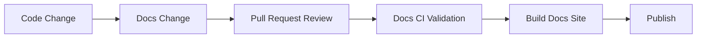
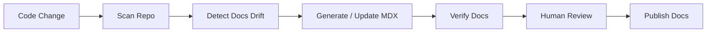
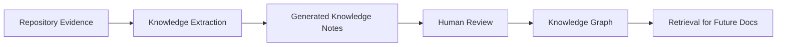
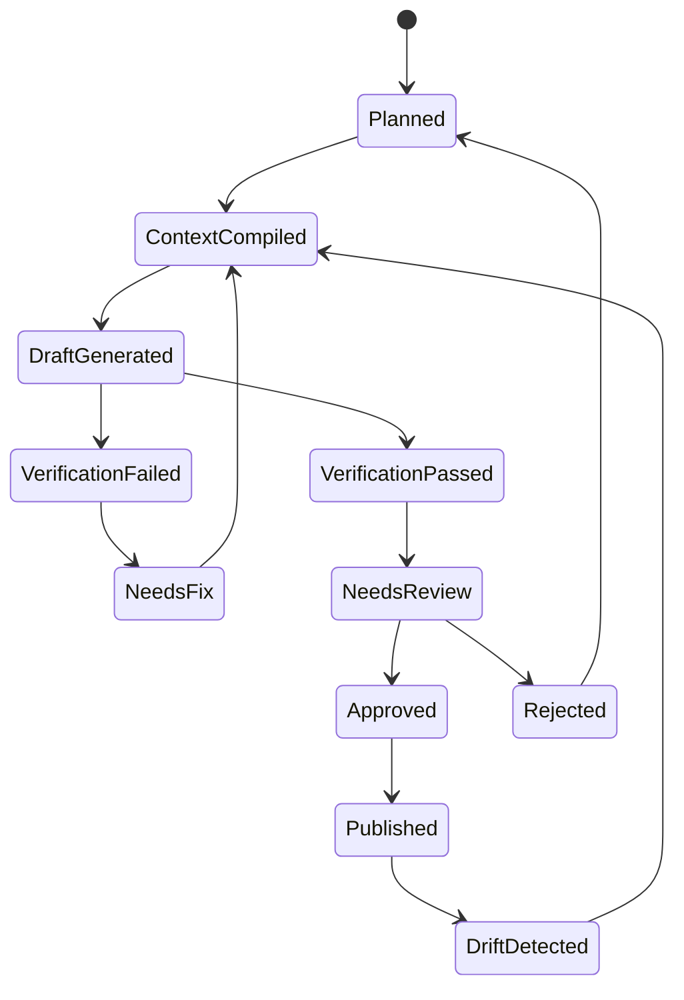
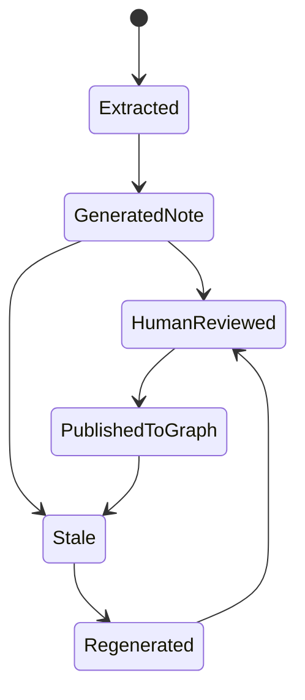

------
title: Build From Scratch: Mintlify-like AI-driven Documentation Generator CLI - Part 004
description: Membangun mental model docs-as-code dan knowledge-as-code sebagai fondasi versioning, provenance, reviewability, dan sinkronisasi antara public documentation, internal notes, dan AI context artifacts.
series: learn-ai-docs-km-cli
seriesTitle: Build From Scratch: Mintlify-like AI-driven Documentation Generator CLI with Code2Prompt and Open-source Knowledge Management
order: 4
partTitle: Docs-as-Code and Knowledge-as-Code
tags:
- ai-docs
- docs-as-code
- knowledge-as-code
- documentation
- mdx
- logseq
- opennote
- provenance
- system-design
date: 2026-07-04
---

# Part 004 — Docs-as-Code and Knowledge-as-Code

Part sebelumnya memberi kita arsitektur besar: dari repository, ke evidence, ke context, ke generated MDX, ke verifier, lalu ke docs site dan knowledge graph.

Sekarang kita perlu memperkuat fondasi filosofis dan teknisnya:

> Dokumentasi harus diperlakukan seperti code. Knowledge juga harus diperlakukan seperti code.

Kalimat itu terdengar sederhana, tetapi implikasinya besar.

Kalau docs hanya dianggap “konten”, maka docs akan mudah basi. Kalau notes hanya dianggap “catatan bebas”, maka knowledge akan sulit direview, sulit disinkronkan, dan sulit dipercaya. Kalau AI context hanya dianggap prompt sementara, maka generation tidak reproducible.

Dalam sistem yang kita bangun, ketiganya harus menjadi artifact yang jelas:

```txt
source code -> docs-as-code -> knowledge-as-code -> AI context-as-artifact
```

Part ini membangun mental model agar nanti saat kita menulis scanner, context compiler, verifier, dan KM sync, kita tahu kenapa desainnya seperti itu.

---

## 1. Problem: Documentation and Knowledge Drift

Ada tiga jenis drift yang sering terjadi di engineering organization.

### 1.1 Code-to-docs Drift

Kode berubah, docs tidak berubah.

Contoh:

```txt
CLI command berubah dari `docs generate` ke `ai-docs generate`
README masih menyebut command lama
```

User mengikuti docs, lalu gagal.

### 1.2 Docs-to-knowledge Drift

Public docs sudah diperbarui, tetapi internal notes, onboarding guide, atau architecture decision notes masih lama.

Contoh:

```txt
Docs public mengatakan auth memakai OAuth2
Internal onboarding note masih mengatakan API key static
```

Engineer baru bingung karena dua sumber saling bertentangan.

### 1.3 Knowledge-to-code Drift

Team knowledge menyebut keputusan arsitektur tertentu, tetapi code sudah berkembang berbeda.

Contoh:

```txt
ADR mengatakan service A tidak boleh memanggil service B secara langsung
Tapi code sekarang punya direct client dari A ke B
```

Ini lebih berbahaya karena knowledge internal menciptakan rasa aman palsu.

---

## 2. Docs-as-Code Mental Model

Docs-as-code berarti dokumentasi diperlakukan dengan disiplin yang mirip source code:

- disimpan di repository;
- di-version-control;
- di-review lewat pull request;
- divalidasi di CI;
- punya ownership;
- punya style guide;
- bisa di-build;
- bisa gagal build;
- punya release lifecycle.

Bukan sekadar “docs ditulis di Markdown”. Markdown hanya format. Docs-as-code adalah operating model.

### 2.1 Docs-as-Code Pipeline



Dalam sistem AI docs CLI, pipeline-nya menjadi:



AI masuk sebagai pembantu generation, bukan pengganti operating model.

### 2.2 Docs-as-Code Invariants

Beberapa invariant penting:

```txt
Docs live with the code they describe.
Docs changes are reviewable.
Docs build can fail.
Docs ownership is explicit.
Docs examples are testable where possible.
Docs navigation is versioned.
```

Kalau docs dihasilkan AI tetapi tidak bisa direview, itu bukan docs-as-code. Itu content dump.

---

## 3. Knowledge-as-Code Mental Model

Knowledge-as-code berarti pengetahuan teknis penting diperlakukan sebagai artifact yang bisa:

- disimpan;
- di-version-control;
- dilacak asalnya;
- disinkronkan;
- direview;
- di-query;
- diubah secara incremental;
- tidak hilang saat orang pindah tim.

Knowledge-as-code tidak selalu berarti semua catatan harus rigid seperti source code. Tapi knowledge penting harus punya struktur minimal.

### 3.1 Apa yang Termasuk Knowledge?

Dalam konteks developer documentation system, knowledge bisa berupa:

- architecture decision;
- module responsibility;
- service boundary;
- API lifecycle;
- troubleshooting note;
- gotcha;
- glossary;
- dependency relationship;
- operational assumption;
- release procedure;
- onboarding explanation;
- historical reason.

Contoh knowledge note:

```md
# Context Compiler

type:: concept
source:: [[src/context/compiler.ts]]
related:: [[Prompt Bundle]], [[Token Budget]], [[Relevance Ranking]]

The Context Compiler turns repository evidence into task-specific prompt bundles.

## Invariants

- It must not include files blocked by safety filters.
- It must preserve source provenance.
- It must explain why files were selected.
```

Ini bukan public docs. Ini internal knowledge.

### 3.2 Knowledge-as-Code Pipeline



Knowledge notes bisa menjadi retrieval source untuk generation berikutnya, tetapi harus tetap dibedakan dari source code evidence.

---

## 4. Perbedaan Docs, Notes, Context, dan Artifact

Kita harus membedakan empat hal yang sering dicampur.

| Jenis | Audience | Format | Lifecycle | Source of Truth? |
|---|---|---|---|---|
| Public docs | user/developer eksternal | MDX | release/versioned | sebagian |
| Internal notes | team/internal engineer | Markdown/graph notes | evolving | tidak selalu |
| AI context | LLM/generator | prompt bundle | ephemeral/rebuildable | tidak |
| Pipeline artifact | CLI/verifier/reviewer | JSON/MD/metadata | reproducible | derived |

Kesalahan umum adalah menganggap generated docs sebagai source of truth. Itu berbahaya.

Source of truth utama tetap:

- source code;
- tests;
- contracts;
- config schema;
- human-approved architectural decisions.

Generated docs adalah derived artifact yang bisa dipublikasikan setelah diverifikasi.

---

## 5. Source of Truth Hierarchy

Ketika beberapa sumber bertentangan, sistem perlu hierarchy.

Contoh hierarchy:

```txt
1. Explicit user config
2. Machine-readable contracts
3. Source code
4. Tests and examples
5. Existing human docs
6. Generated docs
7. Generated knowledge notes
```

Ini bukan hukum absolut, tetapi default yang sehat.

### 5.1 Kenapa Config Paling Tinggi?

Karena user config mewakili intention eksplisit.

Contoh:

```json
{
  "docs": {
    "audience": "internal-platform-team",
    "exclude": ["experimental/**"],
    "productName": "AIDocs KM CLI"
  }
}
```

Kalau repo punya module experimental tetapi config mengecualikan, generator harus patuh.

### 5.2 Kenapa Contract Lebih Kuat dari Narrative Docs?

Jika OpenAPI menyatakan endpoint `POST /users` membutuhkan body tertentu, sedangkan README lama menyebut bentuk lama, contract harus menang.

Machine-readable contract lebih mudah diverifikasi dan biasanya lebih dekat dengan runtime/API boundary.

### 5.3 Kenapa Generated Notes Paling Rendah?

Generated notes berguna, tetapi tetap hasil turunan. Mereka boleh membantu retrieval, tetapi tidak boleh mengalahkan source evidence.

---

## 6. Versioning Model

Docs-as-code dan knowledge-as-code membutuhkan versioning.

Ada beberapa jenis versioning:

1. source version;
2. docs version;
3. API version;
4. knowledge note version;
5. generator version;
6. prompt template version;
7. model version.

Semuanya dapat memengaruhi output.

### 6.1 Source Version

Source version biasanya commit hash.

```yaml
sourceRevision: 3f4a2c9
branch: main
```

Generated docs harus tahu commit source yang dipakai.

### 6.2 Docs Version

Docs version bisa mengikuti release produk.

```txt
docs/v1/
docs/v2/
```

Atau mengikuti branch.

```txt
main docs
release/2.x docs
```

### 6.3 Generator Version

Jika generator berubah, output bisa berubah meskipun source sama.

```yaml
generator:
  name: ai-docs-km-cli
  version: 0.4.0
```

### 6.4 Prompt Template Version

Prompt template adalah code juga.

```yaml
template:
  id: tutorial-page
  version: 2.1.0
```

Kalau template berubah, docs mungkin perlu regenerate.

### 6.5 Model Version

LLM output bergantung pada model.

```yaml
model:
  provider: example-provider
  name: example-model
```

Untuk audit, metadata ini penting. Untuk reproducibility penuh, LLM tetap tidak selalu deterministic, tetapi metadata membantu menjelaskan perubahan.

---

## 7. Provenance Model

Provenance adalah informasi tentang asal-usul artifact.

Dalam sistem ini, provenance bukan fitur tambahan. Ia fondasi trust.

### 7.1 Page-level Provenance

Contoh:

```yaml
page: docs/getting-started/quickstart.mdx
sources:
  - README.md
  - package.json
  - src/cli/index.ts
sourceRevision: 3f4a2c9
generatedAt: 2026-07-04T10:30:00Z
generatorVersion: 0.4.0
contextBundle: .aidocs/contexts/quickstart.prompt.md
verificationReport: .aidocs/reports/quickstart.verify.json
```

### 7.2 Section-level Provenance

Lebih detail:

```mdx
<!-- ai-docs:start section="Installation" sources="package.json,README.md" -->
## Installation

Install the CLI using the package manager configured for this repository.
<!-- ai-docs:end -->
```

Section-level provenance membantu regeneration parsial.

### 7.3 Claim-level Provenance

Paling kuat tetapi paling mahal.

Contoh:

```json
{
  "claim": "The CLI supports `scan`, `context`, `plan`, and `generate` commands.",
  "sources": [
    { "path": "src/cli/index.ts", "lines": [12, 48] }
  ]
}
```

Claim-level provenance cocok untuk enterprise/high-trust docs, tetapi MVP bisa mulai dari page/section-level.

---

## 8. Public Docs vs Internal Knowledge Graph

Public docs dan internal graph punya bentuk berbeda.

### 8.1 Public Docs

Public docs harus:

- linear;
- polished;
- audience-aware;
- stable;
- minimal noise;
- mudah dinavigasi;
- tidak membocorkan detail internal yang tidak perlu.

Contoh struktur public docs:

```txt
Overview
Getting Started
Concepts
Guides
API Reference
Troubleshooting
```

### 8.2 Internal Knowledge Graph

Internal graph harus:

- connected;
- exploratory;
- detail-rich;
- boleh berisi open question;
- bisa mencatat historical reason;
- bisa menghubungkan source, decision, module, incident, dan issue.

Contoh struktur graph:

```txt
[[Context Compiler]]
  -> [[Prompt Bundle]]
  -> [[Token Budget]]
  -> [[Relevance Ranking]]
  -> [[Doc Drift Detection]]
```

### 8.3 Jangan Memaksa Satu Format untuk Semua

Kesalahan desain:

```txt
Semua knowledge harus menjadi docs page.
```

Akibatnya public docs penuh noise.

Kesalahan lain:

```txt
Semua docs cukup menjadi graph notes.
```

Akibatnya user eksternal tidak punya learning path yang jelas.

Sistem kita harus mendukung dua output:

```txt
MDX docs for readers
Graph notes for knowledge workers
```

---

## 9. MDX sebagai Docs Artifact

MDX cocok untuk public docs karena:

- Markdown-compatible;
- bisa punya frontmatter;
- bisa memakai komponen;
- bisa menyisipkan code block;
- bisa menyisipkan Mermaid;
- bisa dipakai oleh banyak static docs framework modern.

Namun MDX juga punya risiko:

- syntax bisa rusak;
- komponen bisa tidak tersedia;
- expression JSX bisa berbahaya kalau tidak dibatasi;
- generated code fence bisa invalid;
- frontmatter bisa tidak konsisten.

Karena itu authoring engine harus punya output discipline.

### 9.1 Frontmatter Standard

Kita akan memakai frontmatter seperti ini:

```yaml
------
title: Page Title
description: Short page description
series: learn-ai-docs-km-cli
seriesTitle: Build From Scratch: Mintlify-like AI-driven Documentation Generator CLI with Code2Prompt and Open-source Knowledge Management
order: 4
partTitle: Docs-as-Code and Knowledge-as-Code
tags:
- ai-docs
- docs-as-code
date: 2026-07-04
---
```

Catatan: contoh user memakai enam dash pembuka `------` dan tiga dash penutup `---`. Dalam seri ini kita mengikuti format tersebut sesuai permintaan.

### 9.2 Generated Block Markers

Untuk melindungi human edit:

```mdx
<!-- ai-docs:start id="install" sources="package.json README.md" -->
## Installation
...
<!-- ai-docs:end -->
```

Rules:

- generator hanya boleh mengubah blok yang ia miliki;
- human-owned section tidak disentuh;
- jika source berubah, blok bisa ditandai dirty;
- reviewer bisa mengunci blok.

---

## 10. Logseq-compatible Knowledge Artifact

Logseq menggunakan model outliner dan graph notes. Ia cocok untuk knowledge-as-code karena Markdown/Org-mode bisa disimpan di filesystem dan di-version-control.

Kita tidak perlu bergantung pada internal database Logseq. Untuk integrasi awal, cukup hasilkan Markdown yang bisa dibaca Logseq.

### 10.1 Page Model

Contoh page:

```md
# Context Compiler

type:: concept
tags:: ai-docs, architecture
source:: [[src/context/compiler.ts]]

- The Context Compiler turns repository evidence into task-specific prompt bundles.
- It depends on [[Repository Map]], [[Symbol Graph]], and [[Example Index]].
- It produces [[Context Bundle]].
```

### 10.2 Block Model

Logseq kuat di block-level knowledge.

Contoh:

```md
- [[Context Compiler]] invariant
  - It must not include unsafe files.
  - It must preserve source provenance.
  - It must explain selected files.
```

### 10.3 Page Link Strategy

Generated notes harus memakai stable page naming.

Bad:

```txt
[[The context compiler system that creates prompt bundles]]
```

Good:

```txt
[[Context Compiler]]
[[Prompt Bundle]]
[[Repository Map]]
[[Verification Report]]
```

### 10.4 Metadata Strategy

Setiap generated note butuh metadata:

```md
source-revision:: 3f4a2c9
generated-by:: ai-docs-km-cli
generated-at:: 2026-07-04
source-files:: [[src/context/compiler.ts]], [[src/context/packer.ts]]
```

Metadata ini membuat notes bisa ditelusuri.

---

## 11. OpenNote/Open Notebook-compatible Knowledge Artifact

OpenNote/Open Notebook-style tools menekankan local/private notebook, multi-source knowledge, full-text search, vector search, dan chat with context.

Karena tool seperti ini sering berkembang cepat, desain integrasi harus format-first, bukan API-first.

Artinya kita hasilkan artifact umum:

- Markdown note;
- JSONL chunk;
- metadata;
- source references;
- embedding-ready text.

### 11.1 JSONL Chunk Format

Contoh:

```json
{"id":"concept:context-compiler","title":"Context Compiler","body":"The Context Compiler turns repository evidence into task-specific prompt bundles.","tags":["ai-docs","context"],"sources":["src/context/compiler.ts"],"sourceRevision":"3f4a2c9"}
```

Satu baris satu chunk.

Kenapa JSONL?

- mudah di-stream;
- mudah di-index;
- mudah di-import ke vector database;
- mudah di-diff per line;
- cocok untuk batch processing.

### 11.2 Chunking Rule

Chunk knowledge tidak boleh terlalu besar.

Bad:

```txt
Satu note panjang 10.000 kata tentang seluruh arsitektur.
```

Good:

```txt
Satu concept chunk untuk Context Compiler.
Satu relationship chunk untuk Context Compiler -> Prompt Bundle.
Satu invariant chunk untuk Context Compiler safety rules.
```

### 11.3 Retrieval Metadata

Untuk semantic search, metadata sangat penting:

```json
{
  "kind": "invariant",
  "concept": "Context Compiler",
  "sourceType": "generated_from_code",
  "confidence": "medium",
  "humanReviewed": false
}
```

Retrieval layer nanti bisa memilih hanya human-reviewed knowledge untuk high-risk generation.

---

## 12. AI Context as Code Artifact

Prompt sering dianggap ephemeral. Dalam sistem ini, prompt bundle harus menjadi artifact.

Kenapa?

Karena saat docs salah, kita perlu tahu:

- file apa yang diberikan ke model;
- instruksi apa yang dipakai;
- constraints apa yang ada;
- token budget berapa;
- template versi berapa;
- model apa yang dipakai;
- output apa yang diminta.

### 12.1 Prompt Bundle File

Contoh:

```txt
.aidocs/contexts/quickstart.prompt.md
.aidocs/contexts/quickstart.bundle.json
```

Prompt markdown untuk manusia:

```md
# Task

Generate a Quickstart page.

# Constraints

- Use only source evidence below.
- Do not invent commands.
- If behavior is unclear, say it is not documented in the source.

# Repository Tree

...

# Source Files

...
```

Bundle JSON untuk mesin:

```json
{
  "task": "generate_page",
  "pageId": "quickstart",
  "includedFiles": ["README.md", "package.json"],
  "tokenEstimate": 12400,
  "templateVersion": "tutorial-page@1.0.0"
}
```

### 12.2 Prompt Diff

Jika generation berubah, prompt diff harus bisa diperiksa.

```bash
git diff .aidocs/contexts/quickstart.prompt.md
```

Ini membantu menjawab:

```txt
Apakah output berubah karena source berubah, template berubah, atau model berubah?
```

---

## 13. Reviewability

Reviewability adalah kemampuan untuk memeriksa perubahan secara rasional.

AI-generated docs harus reviewable di beberapa level:

1. docs plan;
2. context bundle;
3. generated MDX;
4. verification report;
5. knowledge notes;
6. navigation config.

### 13.1 Bad Review Experience

```txt
AI generated 47 files. Please review.
```

Itu hampir tidak mungkin direview.

### 13.2 Good Review Experience

```txt
Generated 3 pages from changed API contract:
- docs/api/users.mdx
- docs/guides/user-management.mdx
- docs/troubleshooting/user-errors.mdx

Verification:
- 0 errors
- 3 warnings

Human attention needed:
- Authentication section changed because OpenAPI security scheme changed.
- Example response changed because schema changed.
```

Review harus fokus pada semantic change.

---

## 14. Ownership Model

Docs dan knowledge perlu ownership.

Contoh mapping:

```yaml
owners:
  docs/api/**:
    - api-platform-team
  docs/guides/authentication.mdx:
    - identity-team
  knowledge/logseq/pages/Authentication*.md:
    - identity-team
```

Ownership bisa berasal dari:

- config;
- CODEOWNERS;
- file path;
- module ownership;
- API ownership;
- service catalog.

### 14.1 Generated Does Not Mean Ownerless

AI-generated content tetap butuh owner.

Jika tidak ada owner, tidak ada yang bertanggung jawab saat docs salah.

### 14.2 Ownership in Verification Report

Verification report bisa menyertakan owner:

```json
{
  "page": "docs/guides/authentication.mdx",
  "owner": "identity-team",
  "status": "needs_review"
}
```

CI bisa mention reviewer yang tepat.

---

## 15. Change Classification

Tidak semua perubahan docs sama.

Kita butuh change classification:

```txt
cosmetic
content_update
api_behavior_change
breaking_change
new_feature_docs
deprecated_feature_docs
security_sensitive_change
unknown
```

### 15.1 Kenapa Change Classification Penting?

Karena review policy berbeda.

Contoh:

- typo fix bisa auto-approve;
- API behavior change butuh API owner;
- security-sensitive change butuh security review;
- generated command docs butuh CLI owner.

### 15.2 Example Classification

```json
{
  "page": "docs/api/users.mdx",
  "changeType": "api_behavior_change",
  "reason": "OpenAPI response schema for 400 error changed.",
  "requiredReviewers": ["api-platform-team"]
}
```

---

## 16. Conflict Handling

Karena sistem ini menyentuh generated docs dan human notes, konflik pasti terjadi.

### 16.1 Conflict Types

```txt
Generated block changed, source changed too
Human edited generated block
Human-owned block overlaps generated block
Knowledge note renamed manually
Source file deleted but note still exists
Docs page moved but nav still references old path
```

### 16.2 Conflict Policy

Default policy:

```txt
Human edits win unless user explicitly asks regeneration to overwrite.
```

Contoh behavior:

```txt
Detected manual edits inside AI-owned block.
Choose:
  1. keep human changes
  2. regenerate and overwrite
  3. create conflict file
  4. show diff
```

Untuk non-interactive CI, default harus aman:

```txt
fail with conflict report
```

---

## 17. Derived vs Human-authored Content

Kita perlu menandai content berdasarkan asal.

```txt
human-authored
ai-generated
ai-updated
machine-generated-from-contract
imported-existing-doc
synced-knowledge-note
```

### 17.1 Why It Matters

Karena trust berbeda.

- human-authored architecture decision mungkin authoritative;
- machine-generated OpenAPI reference bisa kuat jika spec valid;
- AI-generated conceptual explanation perlu review;
- synced note mungkin hanya derived summary.

### 17.2 Metadata Example

```yaml
contentOrigin: ai-generated
humanReviewed: false
sourceEvidence:
  - src/cli/index.ts
  - README.md
```

Setelah review:

```yaml
contentOrigin: ai-generated
humanReviewed: true
reviewedBy: platform-team
reviewedAt: 2026-07-04
```

---

## 18. Navigation as Code

Navigation bukan detail UI. Navigation adalah bagian dari product thinking.

Docs yang bagus punya learning path.

Navigation harus versioned dan divalidasi.

Contoh `docs.json` style:

```json
{
  "navigation": [
    {
      "group": "Getting Started",
      "pages": [
        "overview",
        "getting-started/installation",
        "getting-started/quickstart"
      ]
    },
    {
      "group": "API Reference",
      "pages": [
        "api-reference/users"
      ]
    }
  ]
}
```

### 18.1 Navigation Invariants

```txt
Every nav page must exist.
Every important page must be reachable.
No duplicated page in navigation unless explicitly allowed.
API reference and narrative guides must not be mixed randomly.
Landing pages must precede deep pages.
```

### 18.2 Generated Navigation Review

Navigation generation harus reviewable:

```txt
Added:
- API Reference / Users
- Troubleshooting / Authentication Errors

Moved:
- Quickstart from Overview group to Getting Started group

Removed:
- Deprecated Setup page because source file no longer exists
```

---

## 19. Docs Build as Quality Gate

Docs-as-code berarti build bisa gagal.

Build failure adalah fitur, bukan gangguan.

Quality gate minimal:

```txt
frontmatter valid
MDX parses
links valid
navigation valid
code fences syntactically sane
OpenAPI references resolve
no unsafe generated content
verification report has no blocking errors
```

### 19.1 CI Commands

```bash
ai-docs scan --ci
ai-docs verify --ci
ai-docs docs build --ci
```

Atau nanti bisa:

```bash
ai-docs check
```

Yang menjalankan semua gate non-generative.

---

## 20. Knowledge Build as Quality Gate

Knowledge notes juga bisa divalidasi.

Minimal:

```txt
no duplicate generated note IDs
all source references exist
all generated backlinks are syntactically valid
human-owned notes are not overwritten
sync state is consistent
```

Contoh command:

```bash
ai-docs km check --target logseq
```

Output:

```txt
[km] 42 generated notes checked
[km] 0 duplicate ids
[km] 3 stale source references
[km] failed
```

---

## 21. Storage Layout

Agar docs-as-code dan knowledge-as-code rapi, layout harus jelas.

Contoh:

```txt
.
├── docs/
│   ├── overview.mdx
│   └── getting-started/
├── docs.json
├── knowledge/
│   ├── logseq/
│   │   └── pages/
│   └── opennote/
│       └── chunks.jsonl
├── .aidocs/
│   ├── scans/
│   ├── repo-map/
│   ├── symbols/
│   ├── contexts/
│   ├── plans/
│   ├── generated/
│   ├── reports/
│   └── sync-state/
└── ai-docs.config.json
```

### 21.1 Apa yang Masuk Git?

Tidak semua artifact harus masuk git.

Rekomendasi default:

Masuk git:

```txt
docs/
docs.json
knowledge/ jika team memang memakai repo-based notes
ai-docs.config.json
prompt templates custom
```

Tidak masuk git secara default:

```txt
.aidocs/cache/
.aidocs/tmp/
raw model responses
local provider credentials
```

Opsional masuk git:

```txt
.aidocs/plans/
.aidocs/contexts/
.aidocs/reports/
```

Untuk enterprise audit, context dan report mungkin perlu disimpan. Untuk OSS, mungkin cukup generated docs dan config.

---

## 22. Config as Code

Konfigurasi juga code.

Contoh `ai-docs.config.json`:

```json
{
  "project": {
    "name": "AIDocs KM CLI",
    "audience": "developer",
    "visibility": "public"
  },
  "docs": {
    "outputDir": "docs",
    "navigationFile": "docs.json",
    "styleGuide": "./docs-style.md"
  },
  "context": {
    "maxTokens": 24000,
    "includeTests": true,
    "includeExamples": true
  },
  "km": {
    "targets": ["logseq"],
    "outputDir": "knowledge"
  },
  "safety": {
    "redactSecrets": true,
    "failOnSecret": true
  }
}
```

Config harus:

- explicit;
- validated;
- documented;
- stable;
- overridable via CLI flags.

---

## 23. Git Workflow

Sistem ini harus menyatu dengan Git.

### 23.1 Local Flow

```bash
git checkout -b docs/bootstrap
ai-docs scan
ai-docs plan
ai-docs generate
ai-docs verify
ai-docs preview
git diff
git add docs docs.json ai-docs.config.json
git commit -m "Generate initial documentation"
```

### 23.2 PR Flow

```txt
Developer changes code
CI runs ai-docs drift check
CI reports docs impacted
Developer runs ai-docs generate --changed
Generated docs reviewed in PR
Verifier passes
PR merges
```

### 23.3 Never Auto-merge AI Docs by Default

Auto-commit can be useful. Auto-merge is dangerous.

Default policy:

```txt
AI can propose. Human or policy gate decides.
```

---

## 24. AI-generated Docs Lifecycle

A generated page goes through states.



This lifecycle prevents treating generated text as immediately final.

---

## 25. Knowledge Note Lifecycle

Knowledge notes also need lifecycle.



A note can be useful even before review, but retrieval policy should know its status.

---

## 26. Retrieval Trust Model

Later, generated notes may be used as context for generating docs.

But not all retrieved context should be trusted equally.

Ranking example:

```txt
highest trust: source code, contracts, tests
medium trust: human-reviewed docs and notes
lower trust: generated unreviewed notes
lowest trust: stale generated summaries
```

### 26.1 Retrieval Metadata Example

```json
{
  "chunkId": "note:context-compiler:invariants",
  "trustLevel": "medium",
  "humanReviewed": true,
  "stale": false,
  "sourceRevision": "3f4a2c9"
}
```

Generation prompt can then say:

```txt
Treat source code and contracts as authoritative. Use internal notes only as explanatory context. Do not treat unreviewed generated notes as source of truth.
```

---

## 27. Practical Rules for This Series

From this part forward, kita akan memakai beberapa rule:

### Rule 1 — Every Output Has an Owner

Generated docs, notes, context bundles, and reports all need ownership metadata or a clear owner inference.

### Rule 2 — Every Generated Page Has Evidence

No page should be generated from vague intention alone.

### Rule 3 — Every Human Edit Is Preserved

Generator updates only generated blocks unless explicitly told otherwise.

### Rule 4 — Every Claim Can Be Weakened

If evidence is weak, docs should use weaker wording.

Bad:

```mdx
The system guarantees exactly-once generation.
```

Better:

```mdx
The current pipeline is designed to make generation resumable through explicit artifacts, but exactly-once execution is not guaranteed by the available source evidence.
```

### Rule 5 — Every Sync Is Dry-run-able

Knowledge sync and docs update must support dry-run.

```bash
ai-docs generate --dry-run
ai-docs km sync --dry-run
```

---

## 28. Common Anti-patterns

### 28.1 Treating AI Output as Source of Truth

Bad:

```txt
Generated docs say it, so it must be true.
```

Correct:

```txt
Generated docs are a draft derived from source evidence and must be verified.
```

### 28.2 Mixing Public Docs and Internal Notes

Bad:

```mdx
## Why Bob Changed This in 2024
```

Maybe useful internally, but bad public docs unless relevant.

### 28.3 No Provenance

Bad:

```mdx
This system uses incremental scanning.
```

No evidence.

Better:

```mdx
<!-- ai-docs:start section="Incremental Scanning" sources="src/scanner/cache.ts" -->
...
<!-- ai-docs:end -->
```

### 28.4 Regenerating Whole Docs Site on Every Change

Bad for review and cost.

Better:

```txt
changed source -> impacted pages -> targeted regeneration
```

### 28.5 Prompt-only Architecture

Bad:

```txt
A giant prompt explains everything.
```

Better:

```txt
scanner + classifier + context compiler + page spec + verifier
```

---

## 29. Mini Design Exercise

Imagine a repo with:

```txt
src/api/users.ts
src/api/orders.ts
openapi.yaml
docs/getting-started/quickstart.mdx
tests/users.test.ts
README.md
```

A developer changes `openapi.yaml` and removes field `nickname` from `User` schema.

A good docs-as-code and knowledge-as-code system should:

1. detect `openapi.yaml` changed;
2. identify impacted pages;
3. mark `docs/api/users.mdx` dirty;
4. maybe mark `docs/guides/user-profile.mdx` dirty;
5. regenerate only impacted blocks;
6. verify no docs mention `nickname` as active field;
7. update knowledge note `[[User Schema]]`;
8. report the change in PR;
9. require API owner review.

This is the mental model we are building toward.

---

## 30. Summary

Docs-as-code means documentation participates in engineering workflow.

Knowledge-as-code means internal understanding is also treated as a structured, reviewable, source-aware artifact.

AI context-as-artifact means prompts and context bundles are not invisible magic. They are inspectable build products.

The full model:

```txt
source code and contracts
  -> evidence artifacts
  -> context artifacts
  -> generated docs
  -> verified docs
  -> published docs
  -> synchronized knowledge graph
```

The key discipline:

```txt
Do not let generated text outrank source evidence.
Do not let knowledge notes drift silently.
Do not let AI overwrite human intent.
Do not publish unverified docs.
```

If these rules hold, AI becomes a force multiplier. If they do not, AI becomes a faster way to create stale, confident misinformation.

---

## 31. Apa yang Akan Dilanjutkan di Part Berikutnya

Part berikutnya mulai masuk implementasi nyata: **Repository Scanning Core**.

Kita akan membangun scanner dari scratch:

- traversal;
- ignore rules;
- binary detection;
- content hashing;
- metadata model;
- incremental scan;
- monorepo considerations;
- failure handling.

Dari situ pipeline kita mulai bergerak dari konsep ke code.

---

## References

- Code2Prompt repository: `https://github.com/mufeedvh/code2prompt`
- Code2Prompt documentation/site: `https://code2prompt.dev/`
- Mintlify OpenAPI setup documentation: `https://www.mintlify.com/docs/api-playground/openapi-setup`
- Mintlify pages/frontmatter documentation: `https://www.mintlify.com/docs/organize/pages`
- Logseq repository: `https://github.com/logseq/logseq`
- Open Notebook repository: `https://github.com/lfnovo/open-notebook`
