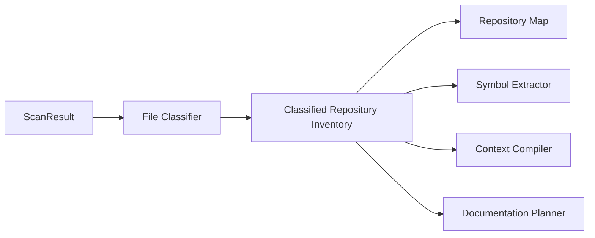
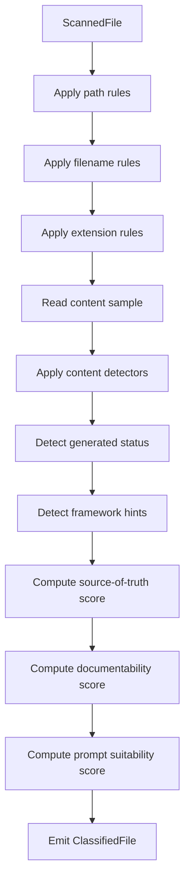
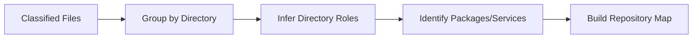

------
title: Build From Scratch: Mintlify-like AI-driven Documentation Generator CLI - Part 006
description: Membangun file classifier dan documentability scoring agar AI documentation generator tahu file mana yang relevan, berbahaya, generated, source-of-truth, atau hanya noise.
series: learn-ai-docs-km-cli
seriesTitle: Build From Scratch: Mintlify-like AI-driven Documentation Generator CLI with Code2Prompt and Open-source Knowledge Management
order: 6
partTitle: File Classification and Documentability
tags:
- ai-docs
- documentation
- cli
- file-classification
- documentability
- code2prompt
- mdx
date: 2026-07-04
---

# Part 006 — File Classification and Documentability

Part 005 membangun repository scanner. Scanner menghasilkan inventory: path, size, hash, binary flag, include/exclude reason, safety flags, dan metadata dasar.

Sekarang kita naik satu level.

Kita perlu memahami **apa arti file itu**.

File `src/api/users.ts` tidak sama dengan `src/api/users.test.ts`. File `openapi.yaml` tidak sama dengan `docker-compose.yml`. File `README.md` tidak sama dengan `CHANGELOG.md`. File `generated/client.ts` tidak sama dengan source code buatan manusia.

Kalau semua file diperlakukan sama, AI documentation generator akan menjadi buruk:

- prompt terlalu penuh,
- docs berisi detail internal yang tidak perlu,
- generated code dikira source of truth,
- test snapshot dikira contoh penggunaan,
- config lokal dikira konfigurasi production,
- dokumentasi lama dikira benar,
- file contract penting terlewat.

Karena itu kita butuh **file classification** dan **documentability scoring**.

---

## 1. Mental Model: File Classification Bukan Extension Mapping

Cara paling dangkal:

```ts
if (path.endsWith(".ts")) kind = "source";
if (path.endsWith(".md")) kind = "docs";
if (path.endsWith(".yaml")) kind = "config";
```

Ini terlalu lemah.

Kenapa?

Karena `.ts` bisa berarti:

- source code,
- test,
- generated client,
- migration script,
- config file,
- CLI entrypoint,
- build script,
- example.

`.yaml` bisa berarti:

- OpenAPI contract,
- Kubernetes manifest,
- GitHub Actions workflow,
- Docker Compose,
- Helm values,
- generic app config,
- Logseq/OpenNote export metadata,
- CI config.

`.md` bisa berarti:

- public docs,
- ADR,
- changelog,
- license,
- generated docs,
- internal notes,
- issue template,
- prompt template,
- package README.

Jadi classifier harus melihat kombinasi:

- path,
- filename,
- extension,
- directory role,
- content signals,
- known manifest schema,
- framework conventions,
- size,
- scanner safety flags,
- generated markers,
- repository context.

Classification adalah proses probabilistik-terkontrol, bukan if-else extension saja.

---

## 2. Posisi Classifier dalam Pipeline



Classifier memperkaya `ScannedFile` menjadi `ClassifiedFile`.

Scanner menjawab:

> File ini ada, aman, readable, dan berubah atau tidak.

Classifier menjawab:

> File ini kemungkinan source code utama, test, API contract, docs lama, config deployment, generated file, example, atau noise.

---

## 3. Output Model Classifier

Kita buat artifact baru: `classification.v1`.

```ts
export type ClassificationResult = {
  schemaVersion: "classification.v1";
  scanHash: string;
  generatedAt: string;
  summary: ClassificationSummary;
  files: ClassifiedFile[];
  warnings: ClassificationWarning[];
};
```

`scanHash` mengikat classification ke hasil scan tertentu. Kalau scan berubah, classification lama tidak boleh dipakai begitu saja.

### 3.1 Classified File

```ts
export type ClassifiedFile = {
  path: string;
  scanContentHash?: string;
  primaryKind: FileKind;
  secondaryKinds: FileKind[];
  language?: LanguageId;
  frameworkHints: FrameworkHint[];
  roleHints: RoleHint[];
  generated: GeneratedStatus;
  sourceOfTruthScore: number;
  documentabilityScore: number;
  promptSuitabilityScore: number;
  confidence: number;
  reasons: ClassificationReason[];
  risks: ClassificationRisk[];
};
```

Poin penting:

- `primaryKind`: klasifikasi utama.
- `secondaryKinds`: karena file bisa punya lebih dari satu peran.
- `sourceOfTruthScore`: seberapa besar file ini menjadi sumber kebenaran.
- `documentabilityScore`: seberapa layak file ini dipakai untuk membangun docs.
- `promptSuitabilityScore`: seberapa layak masuk prompt mentah.
- `confidence`: seberapa yakin classifier.
- `reasons`: alasan eksplisit.
- `risks`: risiko jika file dipakai.

### 3.2 FileKind

```ts
export type FileKind =
  | "source_code"
  | "test_code"
  | "api_contract"
  | "schema_contract"
  | "event_contract"
  | "database_migration"
  | "configuration"
  | "build_manifest"
  | "ci_workflow"
  | "deployment_manifest"
  | "documentation"
  | "architecture_decision_record"
  | "changelog"
  | "license"
  | "example"
  | "fixture"
  | "snapshot"
  | "generated_code"
  | "vendor_code"
  | "binary_asset"
  | "prompt_template"
  | "knowledge_note"
  | "unknown";
```

Jangan takut enum panjang. Lebih baik eksplisit daripada semua masuk `source` dan `config`.

---

## 4. Tiga Skor Penting

Classifier tidak cukup memberi label. Ia harus memberi skor.

### 4.1 Source of Truth Score

`sourceOfTruthScore` menjawab:

> Apakah file ini merupakan sumber kebenaran utama untuk behavior sistem?

Contoh skor tinggi:

- source code utama,
- OpenAPI spec yang dipakai CI,
- database migration,
- public package manifest,
- CLI command implementation,
- test integration yang mencerminkan behavior aktual.

Contoh skor rendah:

- README lama,
- generated client,
- compiled bundle,
- snapshot output,
- vendored dependency,
- coverage report,
- temporary notes.

### 4.2 Documentability Score

`documentabilityScore` menjawab:

> Apakah file ini berguna untuk menulis dokumentasi?

File bisa memiliki source-of-truth tinggi tapi documentability sedang.

Contoh:

- `src/core/algorithm.ts` source-of-truth tinggi, tetapi sulit dipahami tanpa simbol extraction.
- `examples/basic.ts` documentability tinggi karena memberi usage example.
- `openapi.yaml` documentability sangat tinggi untuk API reference.
- `README.md` documentability tinggi tapi bisa stale.

### 4.3 Prompt Suitability Score

`promptSuitabilityScore` menjawab:

> Apakah file ini layak dimasukkan mentah ke prompt?

File bisa penting tetapi tidak cocok masuk prompt mentah.

Contoh:

- database migration besar: penting, tapi perlu diringkas.
- OpenAPI besar: penting, tapi perlu selective extraction.
- source file kecil: cocok masuk prompt mentah.
- generated client: biasanya tidak cocok.
- large fixture: tidak cocok.
- `.env`: tidak cocok sama sekali.

---

## 5. Classification Matrix

Berikut matrix awal.

| Kind | Source of Truth | Documentability | Prompt Suitability | Catatan |
|---|---:|---:|---:|---|
| source_code | tinggi | sedang/tinggi | sedang | perlu symbol extraction |
| test_code | sedang/tinggi | tinggi | sedang/tinggi | bagus untuk contoh usage |
| api_contract | tinggi | sangat tinggi | tergantung size | bagus untuk API reference |
| schema_contract | tinggi | tinggi | sedang | perlu extraction |
| database_migration | tinggi | sedang | rendah/sedang | bagus untuk data model docs |
| configuration | sedang/tinggi | tinggi | sedang | perlu redaction |
| build_manifest | tinggi | tinggi | tinggi | bagus untuk install/build docs |
| ci_workflow | sedang | sedang | sedang | bagus untuk contribution docs |
| deployment_manifest | sedang/tinggi | sedang | rendah/sedang | bisa sensitif |
| documentation | rendah/tinggi | tinggi | tinggi | harus dicek drift |
| ADR | tinggi untuk decision | tinggi | tinggi | bagus untuk architecture docs |
| changelog | sedang | sedang | tinggi | bagus untuk release docs |
| example | sedang | sangat tinggi | tinggi | bagus untuk tutorial |
| fixture | rendah/sedang | sedang | rendah | sering terlalu besar/sensitif |
| snapshot | rendah | rendah | rendah | sering noise |
| generated_code | rendah | rendah/sedang | rendah | jangan jadi source utama |
| vendor_code | rendah | rendah | rendah | exclude |

Ini bukan aturan final. Ini baseline. User bisa override.

---

## 6. Classification Signals

Classifier memakai banyak signal kecil. Tidak ada satu signal yang sempurna.

### 6.1 Path Signals

Path sering sangat informatif.

```text
src/**                  -> source_code candidate
test/**                 -> test_code candidate
tests/**                -> test_code candidate
__tests__/**            -> test_code candidate
examples/**             -> example candidate
docs/**                 -> documentation candidate
.github/workflows/**    -> ci_workflow candidate
k8s/**                  -> deployment_manifest candidate
helm/**                 -> deployment_manifest candidate
migrations/**           -> database_migration candidate
schemas/**              -> schema_contract candidate
contracts/**            -> api/schema/event contract candidate
generated/**            -> generated candidate
vendor/**               -> vendor candidate
```

### 6.2 Filename Signals

```text
README.md               -> documentation / package overview
CHANGELOG.md            -> changelog
LICENSE                 -> license
Dockerfile              -> deployment/build artifact
docker-compose.yml      -> local runtime/deployment config
openapi.yaml            -> api_contract
swagger.yaml            -> api_contract
package.json            -> build_manifest
pom.xml                 -> build_manifest
build.gradle            -> build_manifest
go.mod                  -> build_manifest
Cargo.toml              -> build_manifest
requirements.txt        -> build_manifest
```

### 6.3 Extension Signals

Extension hanya signal tambahan.

```text
.ts .tsx .js .jsx        -> source/test/config depending on path
.java                   -> source/test depending on path
.go                     -> source/test depending on filename
.rs                     -> source/test depending on path
.py                     -> source/test/script/config depending on path
.yaml .yml              -> contract/config/ci/deployment
.json                   -> schema/config/fixture/package manifest
.md .mdx                -> docs/ADR/notes/prompt template
.sql                    -> migration/query/schema
.proto                  -> schema/event/api contract
.avsc                   -> Avro schema contract
.graphql                -> GraphQL schema/query
```

### 6.4 Content Signals

Content mengkonfirmasi atau membantah path/extension.

Contoh OpenAPI:

```yaml
openapi: 3.1.0
info:
  title: Example API
paths:
  /users:
    get:
```

Contoh GitHub Actions:

```yaml
name: CI
on:
  pull_request:
jobs:
  test:
```

Contoh Kubernetes manifest:

```yaml
apiVersion: apps/v1
kind: Deployment
metadata:
  name: api
```

Contoh generated file marker:

```text
// Code generated by ... DO NOT EDIT.
// <auto-generated>
# This file was generated
```

Classifier harus bisa membaca sample content, bukan selalu seluruh file besar.

---

## 7. Generated File Detection

Generated file adalah salah satu sumber kesalahan terbesar.

AI sering membaca generated code lalu menyimpulkan arsitektur dari output generator, bukan source manusia.

Generated status:

```ts
export type GeneratedStatus =
  | "not_generated"
  | "probably_generated"
  | "generated"
  | "unknown";
```

Signals:

- path mengandung `generated`, `gen`, `dist`, `build`, `target`, `.openapi-generator`, `coverage`, `out`;
- content marker seperti `DO NOT EDIT`;
- file sangat besar dan repetitive;
- generated timestamp header;
- source map reference;
- minified JS;
- machine-generated JSON.

Contoh reasons:

```json
{
  "code": "generated_marker_found",
  "message": "File contains 'DO NOT EDIT' marker"
}
```

Generated file tidak selalu tidak berguna.

Contoh:

- generated OpenAPI client bisa menunjukkan API shape, tapi bukan source of truth.
- generated protobuf file tidak perlu dibaca jika `.proto` tersedia.
- generated docs tidak boleh dipakai sebagai sumber utama jika source docs ada.

Rule:

> Prefer source contract over generated output.

---

## 8. Documentation File Classification

File Markdown tidak otomatis bagus.

Kita perlu membedakan:

- public docs,
- package README,
- stale docs,
- ADR,
- changelog,
- issue template,
- generated docs,
- personal notes,
- prompt templates.

### 8.1 README

README biasanya penting, tetapi bisa stale.

Skor awal:

```text
sourceOfTruthScore: 0.55
documentabilityScore: 0.85
promptSuitabilityScore: 0.90
```

Kenapa source-of-truth tidak langsung tinggi?

Karena README sering tidak diverifikasi oleh test. Ia bisa berisi aspirasi lama, bukan behavior sekarang.

### 8.2 ADR

ADR sangat berharga untuk architecture docs.

Signals:

```text
docs/adr/**
adr/**
architecture/decisions/**
0001-*.md
```

Content signals:

```text
# Status
# Context
# Decision
# Consequences
```

ADR source-of-truth tinggi untuk alasan desain, bukan untuk behavior runtime.

### 8.3 Existing Generated Docs

Jika file memiliki marker:

```md
<!-- generated by aidocs -->
```

maka jangan dianggap independent source of truth. Ia adalah output lama.

Gunakan untuk preserving human edits atau drift comparison, bukan dasar behavior.

---

## 9. Contract File Classification

Contract files sangat penting untuk documentation generator.

### 9.1 OpenAPI

Signals:

- filename: `openapi.yaml`, `openapi.json`, `swagger.yaml`, `swagger.json`, `api.yaml`, `api-spec.json`
- content: top-level `openapi` atau `swagger`
- presence of `paths`, `components`, `info`

Classification:

```json
{
  "primaryKind": "api_contract",
  "sourceOfTruthScore": 0.95,
  "documentabilityScore": 0.98,
  "promptSuitabilityScore": 0.65,
  "confidence": 0.97
}
```

Prompt suitability bisa tidak tinggi kalau spec sangat besar. Lebih baik extract endpoints tertentu.

### 9.2 JSON Schema

Signals:

- `$schema`,
- `type`,
- `properties`,
- `required`,
- path `schemas/**`.

### 9.3 Protobuf

Signals:

- `.proto`,
- `syntax = "proto3";`,
- `message`,
- `service`,
- `rpc`.

### 9.4 Avro

Signals:

- `.avsc`,
- JSON object dengan `type: record`,
- `fields`.

### 9.5 GraphQL

Signals:

- `.graphql`, `.gql`,
- `type Query`,
- `type Mutation`,
- `schema {`.

Contract files harus diprioritaskan untuk docs generation karena lebih stabil dan deklaratif daripada implementation scanning.

---

## 10. Config File Classification

Config file sering penting tetapi berisiko.

Contoh config penting:

```text
package.json
pom.xml
build.gradle
Dockerfile
docker-compose.yml
.env.example
application.yml
application.properties
tsconfig.json
vite.config.ts
next.config.js
eslint.config.js
```

Config membantu menulis:

- installation docs,
- local development docs,
- environment variable docs,
- deployment docs,
- build docs,
- contribution docs.

Namun config bisa mengandung secrets.

Rule:

- `.env.example` documentability tinggi.
- `.env` prompt suitability nol.
- `application-prod.yml` perlu redaction/safety scan.
- Kubernetes secret manifest harus ditolak atau diringkas tanpa value.

---

## 11. Test File Classification

Test file adalah salah satu sumber dokumentasi terbaik.

Signals:

```text
*.test.ts
*.spec.ts
*_test.go
*Test.java
src/test/**
tests/**
__tests__/**
```

Test dapat menghasilkan:

- usage examples,
- edge cases,
- expected behavior,
- error conditions,
- setup flow,
- integration contract.

Tapi tidak semua test bagus untuk docs.

Test yang bagus:

- readable,
- menggunakan public API,
- punya clear setup,
- tidak terlalu mock-heavy,
- menunjukkan expected output.

Test yang kurang bagus:

- terlalu internal,
- hanya snapshot besar,
- flaky/infrastructure-heavy,
- memakai private implementation details.

Tambahkan `roleHints`:

```ts
export type RoleHint =
  | "public_usage_example"
  | "edge_case_behavior"
  | "error_behavior"
  | "internal_unit_test"
  | "integration_behavior"
  | "snapshot_assertion"
  | "mock_heavy";
```

---

## 12. Example File Classification

`examples/**` biasanya documentability tinggi.

Tapi perlu hati-hati:

- example bisa outdated,
- example bisa tidak compile,
- example bisa terlalu trivial,
- example bisa hanya demo marketing.

Signals:

```text
examples/**
samples/**
demo/**
playground/**
quickstart/**
```

Example files harus masuk candidate untuk:

- quickstart,
- tutorials,
- how-to guides,
- SDK usage docs,
- CLI usage docs.

Skor awal:

```text
sourceOfTruthScore: 0.60
documentabilityScore: 0.95
promptSuitabilityScore: 0.85
```

Source-of-truth sedang karena example bisa tidak diuji. Kalau example punya CI test, naikkan skor.

---

## 13. Fixture and Snapshot Classification

Fixture tidak selalu noise. Kadang fixture menjelaskan data model.

Namun fixture sering:

- besar,
- repetitive,
- sensitif,
- bukan behavior utama,
- sulit dimasukkan ke prompt.

Classifier harus membedakan:

```text
small semantic fixture        -> useful
large response dump           -> summarize or exclude
snapshot output               -> usually exclude
customer-like data fixture    -> safety risk
schema-like fixture           -> useful if no schema exists
```

Contoh:

```json
{
  "path": "tests/fixtures/user-valid.json",
  "primaryKind": "fixture",
  "documentabilityScore": 0.55,
  "promptSuitabilityScore": 0.40,
  "risks": []
}
```

```json
{
  "path": "tests/__snapshots__/huge-response.snap",
  "primaryKind": "snapshot",
  "documentabilityScore": 0.10,
  "promptSuitabilityScore": 0.05,
  "risks": ["large_generated_output"]
}
```

---

## 14. Language Detection

Language detection tidak boleh hanya extension, tetapi extension adalah baseline.

```ts
export type LanguageId =
  | "typescript"
  | "javascript"
  | "java"
  | "kotlin"
  | "go"
  | "rust"
  | "python"
  | "csharp"
  | "sql"
  | "yaml"
  | "json"
  | "markdown"
  | "mdx"
  | "protobuf"
  | "graphql"
  | "xml"
  | "unknown";
```

Ambiguity examples:

- `.h` could be C or C++.
- `.m` could be Objective-C or MATLAB.
- `.gradle` Groovy vs Kotlin depends on `.gradle.kts`.
- extensionless `Dockerfile` has known filename.
- `Makefile` has known filename.

Use content hints where needed.

---

## 15. Framework Hints

Framework detection membantu planner membuat docs yang tepat.

```ts
export type FrameworkHint = {
  name: string;
  confidence: number;
  evidence: string[];
};
```

Examples:

```json
{
  "name": "express",
  "confidence": 0.82,
  "evidence": ["package.json dependency express", "src/server.ts imports express"]
}
```

```json
{
  "name": "spring-boot",
  "confidence": 0.91,
  "evidence": ["pom.xml contains spring-boot-starter-web", "Application.java contains @SpringBootApplication"]
}
```

Framework hint bukan scanner basic. Ia bisa dimulai sederhana dari manifests.

Framework hints berguna untuk:

- API route discovery,
- config docs,
- run command docs,
- architecture docs,
- example validation.

---

## 16. Documentability Scoring Algorithm

Kita butuh scoring yang explainable.

Jangan pakai model misterius di awal. Pakai weighted rules.

```ts
function scoreDocumentability(file: ClassifiedFileDraft): ScoreResult {
  let score = 0.0;
  const reasons: ClassificationReason[] = [];

  if (file.primaryKind === "api_contract") {
    score += 0.40;
    reasons.push(reason("api_contract_high_doc_value"));
  }

  if (file.primaryKind === "example") {
    score += 0.35;
    reasons.push(reason("example_high_doc_value"));
  }

  if (file.primaryKind === "test_code") {
    score += 0.25;
    reasons.push(reason("tests_can_reveal_behavior"));
  }

  if (file.generated === "generated") {
    score -= 0.30;
    reasons.push(reason("generated_file_lower_doc_value"));
  }

  if (file.risks.includes("secret_like_content")) {
    score = 0.0;
    reasons.push(reason("secret_like_content_not_documentable"));
  }

  return clampScore(score, reasons);
}
```

Skor harus bisa dijelaskan.

Contoh:

```json
{
  "path": "openapi.yaml",
  "documentabilityScore": 0.98,
  "reasons": [
    { "code": "openapi_contract_detected", "weight": 0.40 },
    { "code": "api_paths_present", "weight": 0.30 },
    { "code": "small_enough_for_extraction", "weight": 0.10 },
    { "code": "not_generated", "weight": 0.05 }
  ]
}
```

---

## 17. Prompt Suitability Scoring

Prompt suitability berbeda dari documentability.

Formula awal:

```text
promptSuitability = documentability
  - sizePenalty
  - generatedPenalty
  - safetyPenalty
  - binaryPenalty
  - lowConfidencePenalty
  + smallFocusedFileBonus
  + exampleBonus
```

Contoh:

- `examples/basic.ts`: high documentability, high prompt suitability.
- `openapi.yaml` kecil: high documentability, medium/high prompt suitability.
- `openapi.yaml` 3 MB: high documentability, low raw prompt suitability; needs extraction.
- `.env`: maybe config-relevant, zero prompt suitability.
- `generated/client.ts`: low prompt suitability.

Prompt suitability menentukan file masuk context mentah atau melalui summarizer/extractor.

---

## 18. Source-of-Truth Scoring

Source-of-truth scoring membantu mencegah docs berdasar sumber yang salah.

Baseline:

```text
implementation source       -> high behavior truth
contract source             -> high API truth
migration                   -> high data model truth
README                      -> medium narrative truth
ADR                         -> high decision truth
example                     -> medium usage truth
generated code              -> low primary truth
snapshot                    -> low truth
```

Tapi context matters.

Kalau repo hanya berisi generated SDK dan tidak ada OpenAPI spec, generated client mungkin menjadi source terbaik yang tersedia. Jangan nol mutlak kecuali vendor/noise.

Rule lebih baik:

> Generated file is not preferred source of truth if its generator input exists.

Classifier bisa mencatat `supersededBy`:

```json
{
  "path": "src/generated/client.ts",
  "primaryKind": "generated_code",
  "sourceOfTruthScore": 0.20,
  "supersededBy": ["openapi.yaml"]
}
```

---

## 19. Classification Pipeline



Pipeline harus deterministic. Jangan panggil LLM untuk classification awal.

LLM boleh dipakai nanti untuk semantic enrichment, tetapi basic classification harus cepat, murah, offline, dan testable.

---

## 20. Rule Engine Design

Representasikan classifier sebagai kumpulan rule.

```ts
export type ClassificationRule = {
  id: string;
  description: string;
  appliesTo(file: ScannedFile, context: ClassificationContext): boolean;
  apply(file: ClassificationDraft, context: ClassificationContext): void;
};
```

Contoh rule:

```ts
const openApiRule: ClassificationRule = {
  id: "openapi-contract",
  description: "Detect OpenAPI specification files",
  appliesTo(file, context) {
    return file.extension === ".yaml" || file.extension === ".yml" || file.extension === ".json";
  },
  apply(draft, context) {
    const sample = context.readSample(draft.path);
    if (sample.includes("openapi:") || sample.includes('"openapi"')) {
      draft.addKind("api_contract", 0.95, "openapi_field_detected");
      draft.addScore("sourceOfTruth", 0.35, "api_contract_source_of_truth");
      draft.addScore("documentability", 0.40, "api_contract_high_doc_value");
    }
  },
};
```

Keuntungan rule engine:

- mudah ditest,
- mudah ditambah plugin,
- explainable,
- bisa disable/override,
- cocok untuk multi-language.

---

## 21. Conflict Resolution

File bisa cocok dengan beberapa rule.

Contoh:

```text
examples/openapi.yaml
```

Bisa `example`, bisa `api_contract`.

Jangan memaksa satu label saja.

Gunakan `primaryKind` + `secondaryKinds`.

Decision:

```json
{
  "primaryKind": "api_contract",
  "secondaryKinds": ["example"],
  "reasons": [
    { "code": "openapi_field_detected", "confidence": 0.97 },
    { "code": "inside_examples_directory", "confidence": 0.70 }
  ]
}
```

Primary kind dipilih berdasarkan confidence dan priority.

Priority awal:

```text
safety risk > generated/vendor > contract > manifest > source/test > documentation > fixture > unknown
```

Safety risk bukan kind, tetapi bisa mengubah suitability menjadi nol.

---

## 22. Handling Unknown Files

Unknown bukan kegagalan.

Unknown berarti classifier tidak cukup yakin.

```json
{
  "path": "tools/build.foo",
  "primaryKind": "unknown",
  "confidence": 0.22,
  "documentabilityScore": 0.20,
  "promptSuitabilityScore": 0.10,
  "reasons": [
    { "code": "unknown_extension" },
    { "code": "no_known_content_pattern" }
  ]
}
```

Unknown harus masuk report:

```text
12 files could not be confidently classified.
Run with --explain unknown to inspect them.
```

CLI UX:

```bash
aidocs classify --show unknown
```

---

## 23. Classification Report UX

Command:

```bash
aidocs classify
```

Output:

```text
Classification complete

Files classified: 214
High documentability: 47
High source-of-truth: 38
Prompt-ready: 61
Needs extraction/summarization: 22
Excluded from prompt for safety: 3
Unknown: 12

Top categories:
- source_code: 86
- test_code: 42
- documentation: 24
- api_contract: 3
- configuration: 18
- example: 9
```

Explain satu file:

```bash
aidocs classify --explain src/api/users.ts
```

Output:

```text
src/api/users.ts

Primary kind: source_code
Language: typescript
Source of truth: 0.87
Documentability: 0.72
Prompt suitability: 0.78
Confidence: 0.91

Reasons:
+ inside src directory
+ .ts extension
+ imports express router
+ exports route handler
- not an example file
- no public README reference found
```

Explainability adalah fitur inti, bukan tambahan.

---

## 24. Integration with Repository Map

Classification result menjadi input repository map.



Directory role bisa di-infer dari file di dalamnya.

Contoh:

```text
services/order/src/main/java/**      -> source directory
services/order/src/test/java/**      -> test directory
services/order/src/main/resources/** -> config/resources
services/order/openapi.yaml          -> API contract
```

Part berikutnya akan membangun source tree model dan repository map dari hasil ini.

---

## 25. Testing Classifier

Classifier harus ditest sebagai rule engine.

### 25.1 Unit Test per Rule

- OpenAPI rule,
- Kubernetes rule,
- GitHub Actions rule,
- generated marker rule,
- test file naming rule,
- README rule,
- ADR rule,
- fixture rule,
- secret risk propagation.

### 25.2 Fixture Repositories

Gunakan fixture dari scanner.

```text
fixtures/repos/simple-node
fixtures/repos/java-service
fixtures/repos/monorepo-mixed
fixtures/repos/repo-with-generated-client
fixtures/repos/repo-with-openapi
fixtures/repos/repo-with-logseq-notes
```

### 25.3 Snapshot Classification

Simpan hasil classification normalized:

```json
{
  "path": "openapi.yaml",
  "primaryKind": "api_contract",
  "documentabilityScore": 0.98,
  "promptSuitabilityScore": 0.65
}
```

Hindari snapshot terlalu brittle pada score detail. Yang penting primary kind, major flags, dan score range.

### 25.4 Score Range Test

Alih-alih exact score:

```ts
expect(file.documentabilityScore).toBeGreaterThan(0.9);
expect(file.promptSuitabilityScore).toBeLessThan(0.8);
```

Score rule akan berevolusi.

---

## 26. Practical Default Rules

Untuk versi awal, implementasikan rules ini dulu:

```text
[ ] default vendor/build/generated path rule
[ ] source directory rule
[ ] test file rule
[ ] example directory rule
[ ] README/docs rule
[ ] ADR rule
[ ] changelog/license rule
[ ] OpenAPI rule
[ ] JSON Schema rule
[ ] Protobuf rule
[ ] GraphQL rule
[ ] package manifest rule
[ ] Maven/Gradle manifest rule
[ ] Dockerfile rule
[ ] docker-compose rule
[ ] GitHub Actions rule
[ ] Kubernetes manifest rule
[ ] database migration rule
[ ] generated marker rule
[ ] fixture/snapshot rule
[ ] prompt template rule
[ ] Logseq/OpenNote knowledge note rule
```

Ini sudah cukup kuat untuk membuat context compiler jauh lebih pintar daripada “concat semua file”.

---

## 27. Knowledge Note Classification

Karena sistem kita terintegrasi dengan Logseq/OpenNote-style KM, classifier perlu mengenali notes.

Signals untuk Logseq-like graph:

```text
logseq/**
pages/**
journals/**
assets/**
```

Content signals:

```md
- [[Some Page]]
- #tag
- collapsed:: true
- id:: ...
```

Signals untuk OpenNote-like local notebook akan tergantung layout project yang dipakai. Karena ecosystem ini lebih baru dan bisa berubah, integrasi harus longgar:

```text
notes/**
knowledge/**
.opennote/**
```

Treat notes as:

```text
primaryKind: knowledge_note
documentabilityScore: medium/high
sourceOfTruthScore: depends on provenance
promptSuitabilityScore: high if non-sensitive and concise
```

Important rule:

> Knowledge notes are not automatically more truthful than code.

Notes membantu menjelaskan intent, tetapi behavior tetap harus diverifikasi ke source.

---

## 28. Documentability Is Page-dependent

Skor global berguna, tetapi dokumentasi bersifat kontekstual.

File yang tidak relevan untuk quickstart bisa sangat relevan untuk architecture docs.

Contoh:

| File | Quickstart | API Reference | Architecture | Troubleshooting |
|---|---:|---:|---:|---:|
| README.md | tinggi | rendah | sedang | rendah |
| openapi.yaml | sedang | sangat tinggi | rendah | sedang |
| docker-compose.yml | tinggi | rendah | sedang | tinggi |
| src/core/router.ts | sedang | tinggi | tinggi | sedang |
| docs/adr/0002-auth.md | rendah | sedang | sangat tinggi | sedang |
| tests/errors.test.ts | rendah | sedang | rendah | tinggi |

Karena itu classification harus menghasilkan metadata dasar. Context compiler nanti menghitung relevance per task/page.

Jangan membuat classifier terlalu pintar sampai mengambil keputusan final untuk semua page.

---

## 29. Anti-patterns

### Anti-pattern 1 — Treat README as Truth

README penting, tetapi bisa stale. Gunakan sebagai narrative hint, bukan satu-satunya sumber.

### Anti-pattern 2 — Treat Generated Code as Architecture

Generated code bisa besar dan terlihat authoritative, padahal hanya output generator.

### Anti-pattern 3 — Exclude Tests Entirely

Banyak tools mengabaikan tests karena dianggap bukan production code. Untuk documentation generator, itu salah besar. Test sering menjelaskan behavior lebih baik dari source.

### Anti-pattern 4 — Prompt Suitability = Documentability

File penting belum tentu cocok masuk prompt mentah.

### Anti-pattern 5 — No Explanation

Kalau classifier tidak bisa menjelaskan kenapa file diklasifikasikan, user akan sulit mempercayai output.

### Anti-pattern 6 — LLM for Basic Classification

Jangan panggil LLM untuk memutuskan `.java` di `src/test` adalah test. Itu mahal dan tidak perlu.

---

## 30. Minimal Acceptance Criteria

Classifier siap dipakai jika mampu:

- menerima `scan.v1`,
- menghasilkan `classification.v1`,
- memberi `primaryKind`,
- memberi `secondaryKinds`,
- memberi language hint,
- mendeteksi generated files,
- mendeteksi docs, tests, examples, contracts, configs, manifests,
- memberi source-of-truth score,
- memberi documentability score,
- memberi prompt suitability score,
- memberi confidence,
- memberi reasons,
- menghasilkan report,
- punya `--explain <path>`,
- punya fixture tests,
- deterministic.

---

## 31. Mini Implementation Checklist

```text
[ ] Define classification.v1 schema
[ ] Implement FileKind enum
[ ] Implement LanguageId detection baseline
[ ] Implement rule engine
[ ] Implement path rules
[ ] Implement filename rules
[ ] Implement content sample reader
[ ] Implement OpenAPI detector
[ ] Implement schema/protobuf/graphql detectors
[ ] Implement test/example/docs detectors
[ ] Implement generated marker detector
[ ] Implement source-of-truth scoring
[ ] Implement documentability scoring
[ ] Implement prompt suitability scoring
[ ] Implement confidence calculation
[ ] Implement classification report
[ ] Implement explain command
[ ] Add fixture-based tests
```

---

## 32. What We Built Conceptually

Repository scanner memberi kita inventory.

File classifier memberi kita meaning.

Setelah Part 006, sistem mulai tahu:

- file mana yang source,
- file mana yang test,
- file mana yang contract,
- file mana yang docs,
- file mana yang generated,
- file mana yang example,
- file mana yang berbahaya,
- file mana yang cocok untuk prompt,
- file mana yang perlu extraction,
- file mana yang sebaiknya diabaikan.

Ini adalah fondasi untuk Part 007: **Source Tree Model and Repository Map**.

Di sana kita akan mengubah file-level classification menjadi peta repository yang bisa dibaca manusia dan AI: directory roles, package boundaries, service boundaries, entrypoints, contract locations, docs roots, dan struktur navigasi awal.

