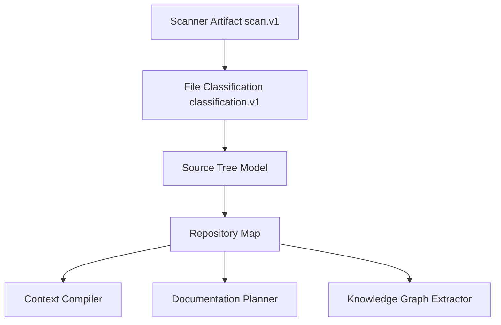
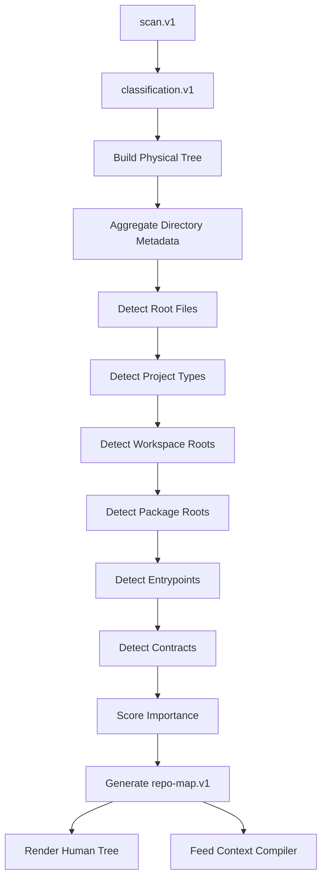
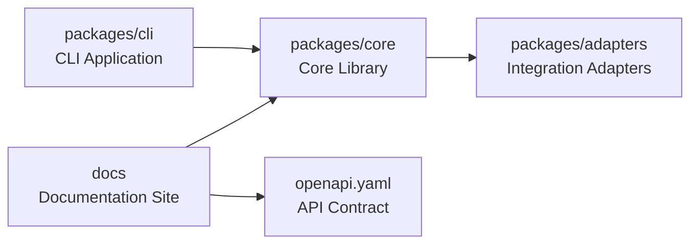
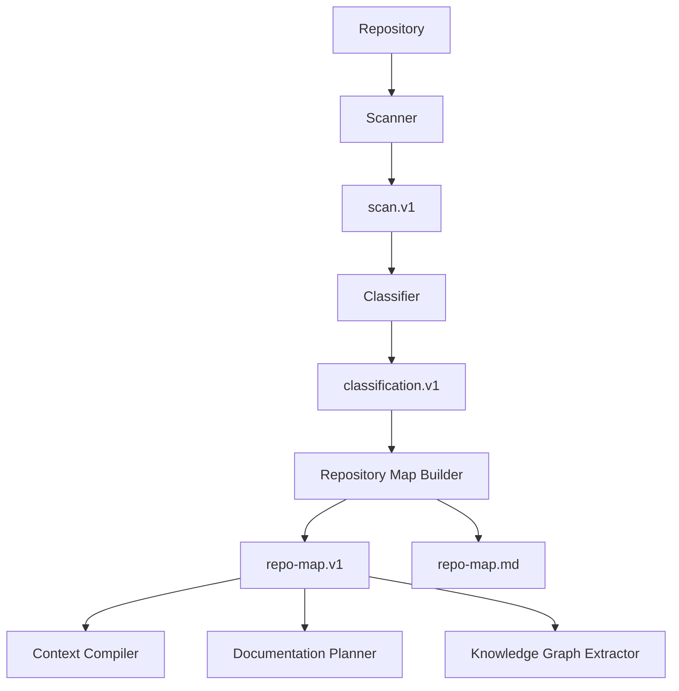

------
title: Build From Scratch: Mintlify-like AI-driven Documentation Generator CLI - Part 007
description: Membangun source tree model dan repository map agar AI documentation generator memahami bentuk, boundary, entrypoint, dan prioritas sebuah codebase sebelum menulis dokumentasi.
series: learn-ai-docs-km-cli
seriesTitle: Build From Scratch: Mintlify-like AI-driven Documentation Generator CLI with Code2Prompt and Open-source Knowledge Management
order: 7
partTitle: Source Tree Model and Repository Map
tags:
- ai-docs
- documentation
- cli
- source-tree
- repository-map
- code2prompt
- context-engineering
- mdx
date: 2026-07-04
---

# Part 007 — Source Tree Model and Repository Map

Part 005 membuat scanner.

Part 006 membuat classifier.

Sekarang kita masuk ke artifact yang sering terlihat sederhana, tapi sebenarnya sangat menentukan kualitas seluruh sistem: **source tree model** dan **repository map**.

Dalam tool Code2Prompt-style, source tree biasanya dipakai untuk memberi model gambaran struktur codebase sebelum isi file diberikan. Itu penting, tetapi untuk sistem dokumentasi production-grade, source tree tidak boleh hanya berupa teks:

```txt
src/
  index.ts
  api/
    users.ts
  services/
    billing.ts
```

Itu hanya tampilan.

Yang kita butuhkan adalah **model struktural**:

- directory apa yang penting,
- file mana yang menjadi entrypoint,
- folder mana yang generated,
- modul mana yang public-facing,
- file mana yang source-of-truth,
- boundary sistem ada di mana,
- bagian mana yang harus masuk dokumentasi,
- bagian mana hanya noise.

Repository map adalah peta semantik awal codebase.

Kalau scanner menjawab:

> “File apa saja yang ada?”

Classifier menjawab:

> “File itu jenisnya apa?”

Repository map menjawab:

> “Codebase ini bentuknya seperti apa, bagian mana yang penting, dan bagaimana kita harus menavigasinya?”

---

## 1. Mental Model: Source Tree Bukan Daftar File

Source tree yang buruk hanya menampilkan path.

Source tree yang baik menunjukkan **struktur keputusan**.

Contoh:

```txt
.
├── apps/
│   ├── web/              # frontend app
│   └── docs/             # docs site
├── packages/
│   ├── core/             # public library surface
│   ├── cli/              # command entrypoint
│   └── adapters/         # integrations
├── openapi.yaml          # API contract
├── package.json          # workspace config
└── README.md             # existing overview
```

Dengan anotasi seperti ini, AI bisa mulai memahami:

- repo ini kemungkinan monorepo,
- ada package core,
- ada CLI,
- ada docs site existing,
- ada OpenAPI contract,
- `README.md` mungkin existing public explanation,
- `packages/core` mungkin lebih penting daripada `apps/docs` saat generate API/library docs.

Tetapi anotasi manual tidak cukup. CLI kita harus menghasilkan peta tersebut secara otomatis.

---

## 2. Source Tree vs Repository Map

Kita pisahkan dua konsep.

### Source Tree

Source tree adalah representasi hierarki file/directory.

Fokusnya:

- path,
- depth,
- children,
- file count,
- total size,
- include/exclude status,
- classification summary.

### Repository Map

Repository map adalah interpretasi semantik di atas source tree.

Fokusnya:

- project type,
- workspaces,
- packages,
- services,
- entrypoints,
- contracts,
- documentation roots,
- test roots,
- generated roots,
- external interface,
- documentation priority.

Hubungannya:



Source tree adalah **struktur fisik**.

Repository map adalah **struktur pemahaman**.

---

## 3. Kenapa Repository Map Penting untuk AI Docs Generator

Tanpa repository map, generator cenderung membuat dokumentasi seperti ini:

- menjelaskan setiap file satu per satu,
- menulis overview terlalu generik,
- gagal menemukan entrypoint,
- mencampur public API dan internal implementation,
- gagal membedakan package utama dan package pendukung,
- menulis docs dari folder test secara berlebihan,
- menganggap generated code sebagai desain sistem,
- menaruh file config sebagai inti produk.

Repository map memberi generator kemampuan untuk berkata:

> “Untuk quickstart, saya harus melihat README, package manager file, CLI entrypoint, examples, dan package public API. Saya tidak perlu memasukkan semua test snapshot.”

Itu perbedaan antara AI yang “membaca banyak file” dan AI yang “memahami codebase secara terarah”.

---

## 4. Artifact Target: `repo-map.v1.json`

Kita akan membuat artifact bernama `repo-map.v1.json`.

Contoh ringkas:

```json
{
  "version": "repo-map.v1",
  "repository": {
    "root": ".",
    "name": "acme-docs-cli",
    "detectedProjectType": ["node", "typescript", "cli", "monorepo"],
    "primaryPackageManager": "pnpm",
    "confidence": 0.91
  },
  "tree": {
    "totalFiles": 421,
    "includedFiles": 233,
    "excludedFiles": 188,
    "maxDepth": 8
  },
  "roots": [
    {
      "path": "packages/core",
      "role": "core-library",
      "importance": 0.94,
      "confidence": 0.88,
      "evidence": ["package.json", "src/index.ts", "README.md"]
    },
    {
      "path": "packages/cli",
      "role": "cli-application",
      "importance": 0.97,
      "confidence": 0.92,
      "evidence": ["package.json:bin", "src/main.ts"]
    }
  ],
  "entrypoints": [
    {
      "path": "packages/cli/src/main.ts",
      "kind": "cli-entrypoint",
      "publicSurface": true,
      "confidence": 0.9
    }
  ],
  "contracts": [
    {
      "path": "openapi.yaml",
      "kind": "openapi",
      "sourceOfTruthScore": 0.95
    }
  ],
  "docs": {
    "existingRoots": ["docs", "README.md"],
    "recommendedOutputRoot": "docs"
  },
  "documentationPriorities": [
    {
      "target": "packages/cli",
      "priority": "critical",
      "reason": "User-facing command surface"
    }
  ]
}
```

Artifact ini bukan output final untuk user. Ini adalah artifact internal yang dipakai oleh stage berikutnya.

---

## 5. Data Model: Tree Node

Mulai dari source tree.

Minimal node:

```ts
export type TreeNodeKind = "directory" | "file";

export interface SourceTreeNode {
  path: string;
  name: string;
  kind: TreeNodeKind;
  depth: number;
  parentPath?: string;

  fileCount: number;
  includedFileCount: number;
  excludedFileCount: number;
  totalBytes: number;

  classificationSummary?: Record<string, number>;
  flags: TreeNodeFlag[];
  children?: SourceTreeNode[];
}

export type TreeNodeFlag =
  | "generated-heavy"
  | "test-heavy"
  | "docs-root"
  | "source-root"
  | "contract-root"
  | "config-root"
  | "vendor-root"
  | "build-output"
  | "workspace-root"
  | "package-root"
  | "hidden-root";
```

Perhatikan field `classificationSummary`.

Directory tidak hanya tahu anaknya. Directory juga tahu komposisi anaknya.

Contoh:

```json
{
  "path": "packages/cli",
  "kind": "directory",
  "classificationSummary": {
    "source": 31,
    "test": 18,
    "config": 3,
    "docs": 1
  },
  "flags": ["package-root", "source-root"]
}
```

Dari sini, generator bisa memahami bahwa `packages/cli` adalah folder yang aktif dan penting, bukan sekadar folder biasa.

---

## 6. Building Tree from Flat Scan Records

Scanner menghasilkan flat records:

```json
[
  { "path": "packages/cli/src/main.ts", "kind": "file" },
  { "path": "packages/cli/src/commands/init.ts", "kind": "file" },
  { "path": "packages/core/src/index.ts", "kind": "file" }
]
```

Kita perlu mengubahnya menjadi tree.

Pseudo-code:

```ts
function buildTree(files: ScannedFile[]): SourceTreeNode {
  const root = createDirectoryNode(".");
  const nodes = new Map<string, SourceTreeNode>();
  nodes.set(".", root);

  for (const file of files) {
    const segments = file.path.split("/");
    let currentPath = ".";
    let parent = root;

    for (let i = 0; i < segments.length; i++) {
      const segment = segments[i];
      const isFile = i === segments.length - 1;
      const nextPath = currentPath === "." ? segment : `${currentPath}/${segment}`;

      let node = nodes.get(nextPath);
      if (!node) {
        node = isFile
          ? createFileNode(file)
          : createDirectoryNode(nextPath);
        nodes.set(nextPath, node);
        parent.children ??= [];
        parent.children.push(node);
      }

      parent = node;
      currentPath = nextPath;
    }
  }

  aggregateTree(root);
  return root;
}
```

`aggregateTree` menghitung:

- file count,
- size,
- classification summary,
- included/excluded count,
- flags turunan.

---

## 7. Sorting Tree for Human and AI Readability

Tree harus deterministic.

Jangan bergantung pada urutan filesystem.

Sorting rule yang baik:

1. directory sebelum file,
2. root-important file naik ke atas,
3. alphabetical sebagai fallback,
4. generated/build/vendor turun atau dikompresi.

Contoh priority file:

```ts
const ROOT_FILE_PRIORITY = [
  "README.md",
  "package.json",
  "pnpm-workspace.yaml",
  "pom.xml",
  "build.gradle",
  "settings.gradle",
  "go.mod",
  "Cargo.toml",
  "pyproject.toml",
  "Dockerfile",
  "docker-compose.yml",
  "openapi.yaml",
  "openapi.yml",
  "openapi.json"
];
```

Kenapa root files penting?

Karena root files sering menjawab pertanyaan:

- project ini apa,
- build tool apa,
- package manager apa,
- entrypoint apa,
- workspace structure apa,
- external contract apa,
- cara menjalankan project apa.

---

## 8. Tree Compression

Codebase besar tidak bisa selalu ditampilkan penuh.

Kita butuh compression.

Contoh tree terlalu panjang:

```txt
node_modules/
  ... 90,000 files
coverage/
  ... 1,240 files
packages/core/src/
  ... 300 files
```

Compression rule:

```ts
export interface TreeCompressionRule {
  match: string;
  strategy: "omit" | "summarize" | "collapse" | "sample";
  reason: string;
}
```

Contoh:

```json
[
  {
    "match": "node_modules/**",
    "strategy": "omit",
    "reason": "Dependency vendor directory"
  },
  {
    "match": "coverage/**",
    "strategy": "omit",
    "reason": "Generated coverage output"
  },
  {
    "match": "generated/**",
    "strategy": "summarize",
    "reason": "Generated code; useful only as API surface evidence"
  }
]
```

Output tree compression:

```txt
node_modules/              # omitted: dependency vendor directory, 89,421 files
coverage/                  # omitted: generated coverage output, 1,240 files
packages/
  core/
    src/
      index.ts
      client.ts
      auth.ts
      ... 297 more source files
```

Compression bukan hanya untuk UI. Compression juga dipakai di prompt bundle.

---

## 9. Directory Significance Scoring

Tidak semua directory penting.

Kita butuh `significanceScore`.

Faktor positif:

- mengandung entrypoint,
- mengandung public exports,
- mengandung contract,
- memiliki README lokal,
- dirujuk dari workspace config,
- memiliki package metadata,
- memiliki banyak source file manusia,
- memiliki test yang merujuk source tersebut.

Faktor negatif:

- generated-heavy,
- test-only,
- build output,
- vendor,
- snapshot-only,
- hidden cache,
- docs output generated.

Model sederhana:

```ts
export interface DirectorySignificanceInput {
  hasPackageManifest: boolean;
  hasEntrypoint: boolean;
  hasReadme: boolean;
  hasContract: boolean;
  sourceFileCount: number;
  testFileCount: number;
  generatedFileCount: number;
  vendorFileCount: number;
  referencedByWorkspace: boolean;
}

export function scoreDirectory(input: DirectorySignificanceInput): number {
  let score = 0;

  if (input.hasPackageManifest) score += 0.18;
  if (input.hasEntrypoint) score += 0.25;
  if (input.hasReadme) score += 0.10;
  if (input.hasContract) score += 0.20;
  if (input.referencedByWorkspace) score += 0.12;

  score += Math.min(input.sourceFileCount / 100, 1) * 0.15;

  if (input.generatedFileCount > input.sourceFileCount) score -= 0.25;
  if (input.vendorFileCount > 0) score -= 0.40;
  if (input.sourceFileCount === 0 && input.testFileCount > 0) score -= 0.10;

  return clamp(score, 0, 1);
}
```

Rule ini tidak sempurna, tapi explainable.

Untuk sistem documentation generator, explainability lebih penting daripada skor misterius.

---

## 10. Detecting Project Type

Repository map harus mendeteksi project type.

Contoh project type:

```ts
export type ProjectType =
  | "node"
  | "typescript"
  | "java"
  | "maven"
  | "gradle"
  | "go"
  | "rust"
  | "python"
  | "cli"
  | "web-app"
  | "api-service"
  | "library"
  | "monorepo"
  | "docs-site"
  | "openapi-first"
  | "kubernetes-deployment";
```

Detection evidence:

| Evidence | Meaning |
|---|---|
| `package.json` | Node/JS/TS package |
| `tsconfig.json` | TypeScript |
| `pom.xml` | Maven Java project |
| `build.gradle` | Gradle project |
| `go.mod` | Go module |
| `Cargo.toml` | Rust crate/workspace |
| `pyproject.toml` | Python project |
| `pnpm-workspace.yaml` | PNPM monorepo |
| `openapi.yaml` | OpenAPI contract |
| `docs.json` | Mintlify-like docs project |
| `Dockerfile` | Containerized app |
| `k8s/`, `helm/` | Kubernetes deployment |

Detection output harus menyimpan evidence:

```json
{
  "type": "typescript",
  "confidence": 0.96,
  "evidence": [
    "tsconfig.json",
    "package.json:devDependencies.typescript"
  ]
}
```

Jangan hanya menulis:

```json
{ "type": "typescript" }
```

Karena saat salah, user tidak bisa debug.

---

## 11. Workspace and Package Root Detection

Monorepo perlu perhatian khusus.

Contoh:

```txt
.
├── pnpm-workspace.yaml
├── apps/
│   ├── web/
│   └── docs/
└── packages/
    ├── core/
    ├── cli/
    └── shared/
```

Repo map harus mendeteksi:

- workspace root: `.`,
- package roots: `apps/web`, `apps/docs`, `packages/core`, `packages/cli`, `packages/shared`,
- package roles.

Package role detection:

| Signal | Role |
|---|---|
| `package.json:bin` | CLI package |
| `package.json:exports` | library package |
| `src/routes`, `server.ts` | API/web service |
| `docs.json`, `pages/`, `docs/` | docs site |
| `components/`, `vite.config.ts` | frontend app |
| `openapi.yaml` | API contract package |

Example data model:

```ts
export interface WorkspaceRoot {
  path: string;
  manager: "pnpm" | "npm" | "yarn" | "maven" | "gradle" | "cargo" | "go" | "unknown";
  packageGlobs: string[];
  packageRoots: PackageRoot[];
}

export interface PackageRoot {
  path: string;
  name?: string;
  role: PackageRole;
  languageHints: string[];
  manifestPath?: string;
  entrypoints: string[];
  importance: number;
  confidence: number;
  evidence: string[];
}
```

---

## 12. Root File Interpretation

Root files should be interpreted, not merely listed.

### `README.md`

Potential meaning:

- existing project overview,
- installation guide,
- usage examples,
- warning about manual docs style,
- source-of-truth for public positioning.

### `package.json`

Potential meaning:

- package name,
- CLI bin,
- scripts,
- dependencies,
- exports,
- workspace hints.

### `pom.xml`

Potential meaning:

- Java module,
- dependencies,
- plugins,
- build lifecycle,
- packaging type.

### `Dockerfile`

Potential meaning:

- runtime environment,
- exposed port,
- build assumptions,
- production image base.

### `openapi.yaml`

Potential meaning:

- public API contract,
- reference docs source,
- endpoint list,
- auth model,
- schema source.

Root files are high-signal because they compress developer intent.

A good repository map extracts metadata from them early.

---

## 13. Repository Map Builder Pipeline

Pipeline:



Each step should be testable independently.

Do not make one giant `buildRepoMap()` function with hidden magic.

---

## 14. Entrypoint Detection

Entrypoint means:

> “A file or artifact through which users, runtime, or other systems interact with this codebase.”

Types:

```ts
export type EntrypointKind =
  | "cli-entrypoint"
  | "library-export"
  | "http-server"
  | "api-route"
  | "openapi-contract"
  | "graphql-schema"
  | "worker"
  | "event-consumer"
  | "database-migration"
  | "container-entrypoint"
  | "docs-entrypoint";
```

Detection examples:

| Evidence | Entrypoint |
|---|---|
| `package.json:bin` | CLI |
| `src/index.ts` + `exports` | library export |
| `main.go` | Go binary entrypoint |
| `public static void main` | Java application entrypoint |
| `Dockerfile ENTRYPOINT` | container entrypoint |
| `openapi.yaml` | API contract entrypoint |
| `routes/`, `controllers/` | HTTP routes |
| `schema.graphql` | GraphQL schema |

Entrypoint record:

```json
{
  "path": "packages/cli/src/main.ts",
  "kind": "cli-entrypoint",
  "publicSurface": true,
  "sourceOfTruthScore": 0.86,
  "confidence": 0.9,
  "evidence": [
    "packages/cli/package.json:bin.aidocs",
    "imports packages/cli/src/commands"
  ]
}
```

---

## 15. Public Surface Detection

Documentation generator harus membedakan public surface dan internal implementation.

Public surface examples:

- exported library API,
- CLI commands,
- REST endpoints,
- GraphQL operations,
- config keys,
- environment variables,
- event topics,
- database migrations if the audience is operators,
- extension/plugin interfaces.

Internal implementation examples:

- private helper functions,
- test fixtures,
- internal adapters,
- generated client internals,
- build scripts,
- local dev utilities.

Rule:

> Public surface gets narrative docs. Internal implementation gets architecture docs only when it matters.

This avoids documentation noise.

---

## 16. Repository Map Output Layers

A good `repo-map.v1` has layers.

### Layer 1: Physical Structure

```json
{
  "tree": {
    "root": ".",
    "totalFiles": 421,
    "includedFiles": 233
  }
}
```

### Layer 2: Detected Technologies

```json
{
  "detectedTechnologies": [
    { "name": "typescript", "confidence": 0.96 },
    { "name": "pnpm", "confidence": 0.92 },
    { "name": "openapi", "confidence": 0.84 }
  ]
}
```

### Layer 3: Logical Roots

```json
{
  "logicalRoots": [
    { "path": "packages/cli", "role": "cli-application" },
    { "path": "packages/core", "role": "core-library" }
  ]
}
```

### Layer 4: External Interface

```json
{
  "externalInterfaces": [
    { "kind": "cli", "path": "packages/cli/src/main.ts" },
    { "kind": "openapi", "path": "openapi.yaml" }
  ]
}
```

### Layer 5: Documentation Planning Hints

```json
{
  "documentationHints": [
    {
      "pageType": "quickstart",
      "recommendedSources": ["README.md", "packages/cli/package.json", "packages/cli/src/main.ts"]
    }
  ]
}
```

This layered output prevents stage coupling.

The planner does not need to re-scan files to know likely docs structure.

---

## 17. Human-readable Repository Map

Besides JSON, generate a Markdown view.

Example:

```md
# Repository Map

## Detected Project

- Type: TypeScript monorepo CLI/library
- Package manager: pnpm
- Primary public surface: CLI commands and core library exports
- Existing docs: README.md, docs/

## Important Roots

| Path | Role | Importance | Evidence |
|---|---:|---:|---|
| packages/cli | CLI application | 0.97 | package.json bin, src/main.ts |
| packages/core | Core library | 0.94 | package exports, src/index.ts |
| openapi.yaml | API contract | 0.88 | OpenAPI structure |

## Compressed Tree

```txt
.
├── README.md
├── package.json
├── pnpm-workspace.yaml
├── openapi.yaml
├── packages/
│   ├── cli/       # CLI application
│   ├── core/      # Core library
│   └── adapters/  # Integration adapters
└── docs/          # Existing docs root
```
```

This artifact helps user trust the tool.

Before generating docs, user can inspect:

```bash
aidocs map --explain
```

---

## 18. CLI Commands for Repository Map

Suggested commands:

```bash
aidocs map
```

Outputs summary.

```bash
aidocs map --json
```

Prints `repo-map.v1.json`.

```bash
aidocs map --write
```

Writes artifacts:

```txt
.aidocs/
  maps/
    repo-map.v1.json
    repo-map.md
```

```bash
aidocs map --explain packages/cli
```

Explains why a path was classified as important.

Example output:

```txt
packages/cli
  role: cli-application
  importance: 0.97
  evidence:
    - package.json contains bin.aidocs
    - src/main.ts imports command modules
    - README.md references CLI usage
```

This is critical for developer trust.

---

## 19. Repository Map as Input to Context Compiler

The context compiler should not start from raw files.

It should start from repository map.

Bad flow:

```txt
files -> prompt
```

Better flow:

```txt
files -> scan -> classify -> repo map -> context plan -> prompt bundle
```

Why?

Because context is expensive.

The map tells us:

- which files are high priority,
- which roots are public-facing,
- which files are source-of-truth,
- which folders can be summarized,
- which generated files should be omitted,
- which contracts should be included verbatim.

---

## 20. Repository Map as Input to Documentation Planner

The documentation planner uses repo map to create navigation.

Example:

```json
{
  "detectedProjectType": ["typescript", "cli", "library"],
  "entrypoints": [
    { "kind": "cli-entrypoint", "path": "packages/cli/src/main.ts" },
    { "kind": "library-export", "path": "packages/core/src/index.ts" }
  ],
  "contracts": []
}
```

Planner might produce:

```txt
Introduction
Installation
Quickstart
CLI Reference
Library API
Configuration
Architecture
Troubleshooting
```

For an API service with OpenAPI:

```txt
Introduction
Authentication
Quickstart
API Reference
Error Handling
Webhooks
SDKs
Troubleshooting
```

Docs plan depends on system shape.

Repository map is how system shape is discovered.

---

## 21. Repository Map as Input to Knowledge Graph

Knowledge graph extractor also uses repo map.

Example mapping:

| Repo Map Element | Knowledge Graph Node |
|---|---|
| package root | `[[Package: CLI]]` |
| OpenAPI contract | `[[API Contract]]` |
| CLI command root | `[[CLI Command Surface]]` |
| config root | `[[Configuration Model]]` |
| docs root | `[[Existing Documentation]]` |

This enables generated notes like:

```md
# [[Package: CLI]]

- role:: cli-application
- source:: packages/cli
- public-surface:: true
- related:: [[Command: init]], [[Command: generate]], [[Configuration Model]]
```

Without repo map, knowledge extraction tends to produce random concepts.

---

## 22. Handling Existing Docs Roots

Existing docs must be detected carefully.

Possible docs roots:

- `docs/`,
- `documentation/`,
- `website/docs/`,
- `apps/docs/`,
- `README.md`,
- `CONTRIBUTING.md`,
- `ARCHITECTURE.md`,
- `adr/`,
- `.cursor/rules`,
- `.github/ISSUE_TEMPLATE`,
- `mint.json` or `docs.json`,
- `docusaurus.config.*`,
- `mkdocs.yml`.

Existing docs may be:

- source-of-truth,
- stale,
- generated,
- partial,
- internal,
- public.

Repository map should not assume existing docs are correct.

It should mark them as existing narrative artifacts.

Example:

```json
{
  "docs": {
    "existingRoots": [
      {
        "path": "README.md",
        "role": "project-overview",
        "freshnessUnknown": true
      },
      {
        "path": "docs",
        "role": "docs-root",
        "freshnessUnknown": true
      }
    ]
  }
}
```

Freshness will be handled later by drift detection.

---

## 23. Handling Generated Code

Generated code can be useful, but dangerous.

It may reveal public API shape, but it is rarely the best source for narrative docs.

Examples:

- OpenAPI generated client,
- Prisma generated client,
- protobuf generated code,
- GraphQL generated types,
- SDK generated models,
- compiled TypeScript output.

Policy:

| Generated Artifact | Use in Repo Map? | Use in Prompt? |
|---|---:|---:|
| generated OpenAPI client | summarize only | rarely |
| generated protobuf code | summarize only | rarely |
| generated SDK docs | maybe | only if source missing |
| compiled JS output | no | no |
| generated types | summarize | sometimes |

Repository map should indicate generated roots:

```json
{
  "path": "src/generated",
  "role": "generated-code",
  "importance": 0.2,
  "promptPolicy": "summarize-only"
}
```

---

## 24. Source Tree Rendering for Prompt Bundles

A prompt source tree should be compact and annotated.

Example:

```txt
Repository: acme-docs-cli
Detected: TypeScript monorepo, CLI + core library

.
├── README.md                         # existing overview
├── package.json                      # workspace scripts
├── pnpm-workspace.yaml               # workspace definition
├── packages/
│   ├── cli/                          # CLI application, high priority
│   │   ├── package.json              # bin entrypoint
│   │   └── src/
│   │       ├── main.ts               # CLI entrypoint
│   │       └── commands/             # command implementations
│   ├── core/                         # core library, high priority
│   │   └── src/index.ts              # public exports
│   └── adapters/                     # integrations, medium priority
├── docs/                             # existing docs
└── test/                             # tests/examples
```

This is much better than dumping an unannotated tree.

The LLM sees the map first, then selected file contents.

---

## 25. Mermaid Diagram for Repository Shape

For docs generation, repository map can generate architecture diagrams.

Example:



This diagram should be treated as **candidate diagram**, not automatically published without verification.

Why?

Because directory-level relationship inference can be wrong.

Later, symbol/import graph will improve relationships.

---

## 26. Implementation Sketch: Repository Map Builder

```ts
export class RepositoryMapBuilder {
  constructor(
    private readonly treeBuilder: SourceTreeBuilder,
    private readonly projectDetector: ProjectDetector,
    private readonly workspaceDetector: WorkspaceDetector,
    private readonly entrypointDetector: EntrypointDetector,
    private readonly contractDetector: ContractDetector,
    private readonly scorer: RepositoryScorer
  ) {}

  build(input: RepositoryMapInput): RepositoryMap {
    const tree = this.treeBuilder.build(input.files, input.classifications);
    const projectTypes = this.projectDetector.detect(tree, input.files);
    const workspaces = this.workspaceDetector.detect(tree, input.files);
    const entrypoints = this.entrypointDetector.detect(tree, input.files, workspaces);
    const contracts = this.contractDetector.detect(tree, input.files);
    const roots = this.scorer.scoreRoots(tree, {
      projectTypes,
      workspaces,
      entrypoints,
      contracts
    });

    return {
      version: "repo-map.v1",
      repository: {
        root: input.root,
        name: input.name,
        detectedProjectType: projectTypes
      },
      tree: summarizeTree(tree),
      roots,
      workspaces,
      entrypoints,
      contracts,
      docs: detectDocs(tree, input.files),
      documentationPriorities: deriveDocumentationPriorities(roots, entrypoints, contracts)
    };
  }
}
```

Each detector should produce evidence.

Evidence is not optional.

---

## 27. Testing Repository Map

Test cases:

### Simple CLI package

Input:

```txt
package.json with bin
src/main.ts
src/commands/init.ts
README.md
```

Expected:

- project type includes `node`, `cli`, maybe `typescript`,
- entrypoint includes `src/main.ts`,
- docs existing root includes `README.md`,
- CLI package high priority.

### TypeScript monorepo

Input:

```txt
pnpm-workspace.yaml
packages/core/package.json
packages/cli/package.json
apps/docs/docs.json
```

Expected:

- monorepo detected,
- workspace packages detected,
- `packages/cli` role CLI,
- `apps/docs` role docs site.

### API service

Input:

```txt
openapi.yaml
src/routes/users.ts
src/server.ts
Dockerfile
```

Expected:

- API service detected,
- OpenAPI contract detected,
- server entrypoint detected,
- API reference docs priority high.

### Generated-heavy repo

Input:

```txt
src/generated/client.ts
openapi.yaml
README.md
```

Expected:

- generated folder summarized,
- OpenAPI contract prioritized over generated client,
- generated client not treated as primary source-of-truth.

---

## 28. Anti-patterns

### Anti-pattern 1: Tree as Pretty Output Only

Kalau tree hanya dipakai untuk display, sistem kehilangan kesempatan memahami codebase.

Tree harus menjadi data model.

### Anti-pattern 2: No Evidence

Output seperti ini buruk:

```json
{ "role": "cli" }
```

Output yang benar:

```json
{
  "role": "cli",
  "confidence": 0.91,
  "evidence": ["package.json:bin", "src/main.ts"]
}
```

### Anti-pattern 3: Treating Monorepo as One App

Monorepo bukan satu aplikasi besar.

Monorepo adalah kumpulan bounded contexts.

Documentation planner harus melihat package boundaries.

### Anti-pattern 4: Including Vendor/Generated Tree

Jangan membuat source tree 10.000 baris hanya karena ada `node_modules` atau generated SDK.

Compress aggressively.

### Anti-pattern 5: Assuming Existing Docs Are Correct

Existing docs adalah evidence, bukan kebenaran final.

---

## 29. Design Invariants

Pegang invariant ini:

1. Repository map must be deterministic.
2. Every semantic conclusion must include evidence.
3. Source tree must be both machine-readable and human-readable.
4. Generated/vendor/build directories must not dominate the map.
5. Entrypoints must be first-class objects.
6. Workspace/package boundaries must be preserved.
7. Existing docs are input artifacts, not unquestioned truth.
8. Repository map must feed context planning, docs planning, and knowledge extraction.
9. Wrong map is better than invisible magic if it is explainable and correctable.
10. The user must be able to inspect why the tool thinks a path matters.

---

## 30. Practical Exercise

Implement `aidocs map`.

Minimum target:

```bash
aidocs scan --write
aidocs classify --write
aidocs map --write
aidocs map --explain
```

Generated files:

```txt
.aidocs/
  scans/
    scan.v1.json
  classifications/
    classification.v1.json
  maps/
    repo-map.v1.json
    repo-map.md
```

Acceptance criteria:

- deterministic output,
- ignores generated/vendor/build directories,
- detects at least Node/TypeScript, Java/Maven, Go, Rust, Python,
- detects simple monorepo,
- detects CLI entrypoint from package metadata,
- detects OpenAPI contract,
- produces compressed human-readable tree,
- includes evidence for every root role,
- has tests for at least five repo fixtures.

---

## 31. What We Have Built So Far

At this point, the system has four foundational artifacts:

```txt
scan.v1.json
classification.v1.json
repo-map.v1.json
repo-map.md
```

The pipeline now looks like this:



We still have not generated documentation.

That is intentional.

A top-tier AI docs system wins before generation starts.

It wins by understanding the codebase structure, selecting relevant context, and making its assumptions inspectable.

---

## 32. Bridge to Part 008

Repository map gives us directory and entrypoint-level understanding.

But it still does not know enough about code symbols.

It might know:

```txt
packages/cli/src/main.ts is a CLI entrypoint
```

But it does not yet know:

- what commands exist,
- what functions are exported,
- what classes represent core concepts,
- what endpoints are implemented,
- what config keys are read,
- what modules call each other.

Part 008 will build **symbol extraction without overengineering**.

The goal is not to build a full IDE or language server.

The goal is to extract enough structure to generate accurate documentation.

---

## References

- Code2Prompt repository — source tree, prompt templating, and token counting inspiration: `https://github.com/mufeedvh/code2prompt`
- Tree-sitter documentation — parser generator and incremental parsing library that can build concrete syntax trees: `https://tree-sitter.github.io/`
- Tree-sitter GitHub repository: `https://github.com/tree-sitter/tree-sitter`
