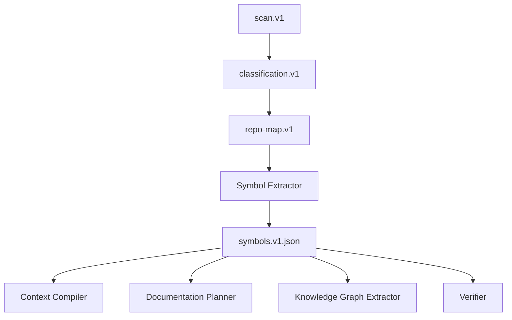
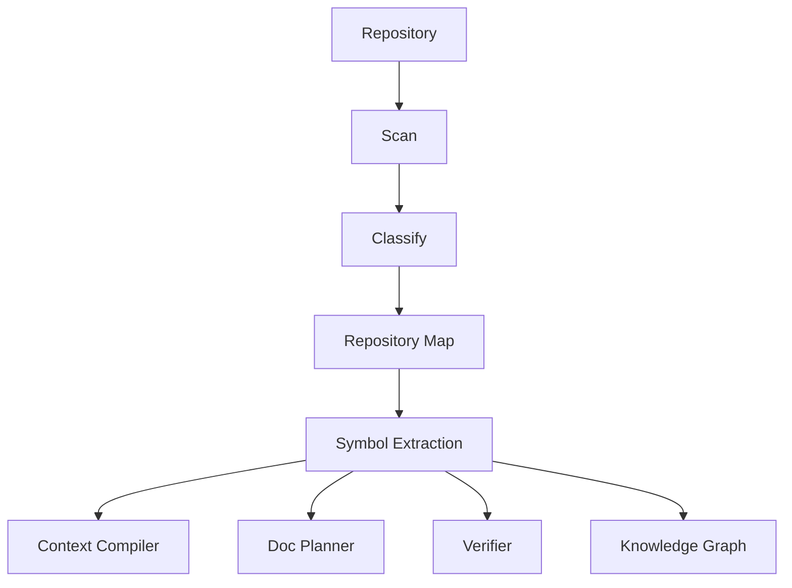

------
title: Build From Scratch: Mintlify-like AI-driven Documentation Generator CLI - Part 008
description: Membangun symbol extraction yang cukup kuat untuk AI documentation generator tanpa berubah menjadi IDE penuh atau language server yang terlalu kompleks.
series: learn-ai-docs-km-cli
seriesTitle: Build From Scratch: Mintlify-like AI-driven Documentation Generator CLI with Code2Prompt and Open-source Knowledge Management
order: 8
partTitle: Symbol Extraction Without Overengineering
tags:
- ai-docs
- documentation
- cli
- symbol-extraction
- ast
- tree-sitter
- repository-map
- code-intelligence
- mdx
date: 2026-07-04
---

# Part 008 — Symbol Extraction Without Overengineering

Part 007 membuat repository map.

Sekarang sistem tahu:

- struktur repo,
- package roots,
- entrypoints,
- contracts,
- docs roots,
- generated roots,
- directory importance.

Tetapi repository map masih bekerja di level **path** dan **directory**.

Untuk membuat dokumentasi yang berguna, kita perlu naik ke level **symbol**.

Symbol adalah unit bermakna di dalam source code:

- function,
- class,
- interface,
- type,
- enum,
- method,
- constant,
- route handler,
- CLI command,
- config key,
- event topic,
- database migration,
- exported module.

Namun ada jebakan besar:

> Jangan langsung membangun IDE, language server, atau static analyzer penuh.

Kita sedang membangun AI documentation generator.

Symbol extraction di sini harus cukup kuat untuk membantu dokumentasi, bukan sempurna seperti compiler.

---

## 1. Mental Model: Extract Enough Structure, Not All Semantics

Pertanyaan yang benar bukan:

> “Bagaimana kita memahami seluruh program secara sempurna?”

Pertanyaan yang lebih berguna:

> “Struktur apa yang perlu diketahui generator agar bisa menulis dokumentasi akurat, grounded, dan followable?”

Untuk dokumentasi, kita biasanya perlu tahu:

- public API apa yang tersedia,
- entrypoint apa yang dipakai user,
- command apa yang bisa dijalankan,
- endpoint apa yang ada,
- config apa yang dibaca,
- tipe/domain concept apa yang penting,
- contoh penggunaan mana yang relevan,
- hubungan kasar antar modul.

Kita tidak selalu perlu:

- full type inference,
- full control flow analysis,
- complete dataflow analysis,
- alias resolution sempurna,
- compile-time semantic correctness,
- exact runtime behavior.

Ini penting karena overengineering symbol extraction bisa menghabiskan seluruh project.

---

## 2. Symbol Extraction dalam Pipeline

Letak symbol extraction:



Artifact baru:

```txt
.aidocs/
  symbols/
    symbols.v1.json
    symbol-index.md
```

`symbols.v1.json` dipakai mesin.

`symbol-index.md` dipakai manusia untuk inspeksi.

---

## 3. Target Artifact: `symbols.v1.json`

Contoh:

```json
{
  "version": "symbols.v1",
  "repositoryHash": "sha256:...",
  "symbols": [
    {
      "id": "sym:ts:function:packages/cli/src/main.ts:runCli",
      "name": "runCli",
      "kind": "function",
      "language": "typescript",
      "path": "packages/cli/src/main.ts",
      "range": { "startLine": 12, "endLine": 44 },
      "visibility": "internal",
      "exported": false,
      "signature": "async function runCli(argv: string[]): Promise<void>",
      "docComment": null,
      "confidence": 0.88,
      "extractionMethod": "tree-sitter"
    },
    {
      "id": "sym:cli-command:init",
      "name": "init",
      "kind": "cli-command",
      "language": "typescript",
      "path": "packages/cli/src/commands/init.ts",
      "publicSurface": true,
      "descriptionSource": "command-builder",
      "confidence": 0.82
    }
  ],
  "relations": [
    {
      "from": "sym:ts:function:packages/cli/src/main.ts:runCli",
      "to": "sym:cli-command:init",
      "kind": "registers-command",
      "confidence": 0.72
    }
  ]
}
```

Symbol extraction harus menyimpan:

- identity,
- location,
- kind,
- signature,
- visibility,
- confidence,
- extraction method,
- provenance.

Tanpa provenance, symbol index tidak bisa dipercaya.

---

## 4. Minimal Symbol Model

Kita mulai dengan model umum.

```ts
export type SymbolKind =
  | "module"
  | "function"
  | "class"
  | "interface"
  | "type"
  | "enum"
  | "method"
  | "constant"
  | "variable"
  | "cli-command"
  | "http-endpoint"
  | "graphql-operation"
  | "config-key"
  | "event-topic"
  | "database-table"
  | "database-migration"
  | "openapi-operation"
  | "unknown";

export interface CodeSymbol {
  id: string;
  name: string;
  kind: SymbolKind;
  language?: string;
  path: string;
  range?: SourceRange;
  signature?: string;
  visibility?: "public" | "internal" | "private" | "unknown";
  exported?: boolean;
  publicSurface?: boolean;
  docComment?: string | null;
  annotations?: string[];
  confidence: number;
  extractionMethod: "regex" | "tree-sitter" | "manifest" | "contract" | "heuristic";
  evidence?: string[];
}

export interface SourceRange {
  startLine: number;
  endLine: number;
  startColumn?: number;
  endColumn?: number;
}
```

This model is intentionally not language-specific.

Language-specific information can be stored in `metadata` later.

---

## 5. The Three Extraction Levels

Kita gunakan tiga level ekstraksi.

### Level 1: Manifest and Contract Extraction

Tidak perlu parsing code.

Sources:

- `package.json`,
- `pom.xml`,
- `Cargo.toml`,
- `go.mod`,
- `openapi.yaml`,
- `schema.graphql`,
- Kubernetes manifests,
- config files.

Good for:

- CLI bin,
- exported package entrypoint,
- OpenAPI operations,
- package metadata,
- scripts,
- service names.

### Level 2: Heuristic/Regex Extraction

Cepat, murah, cukup untuk banyak kasus.

Good for:

- simple function declarations,
- route patterns,
- environment variable access,
- command registration,
- annotations,
- comments.

Risk:

- false positives,
- language quirks,
- multiline syntax,
- comments/string literals.

### Level 3: AST/CST Extraction

Lebih kuat.

Use Tree-sitter or language-specific parser.

Good for:

- function/class/type extraction,
- range accuracy,
- import/export extraction,
- nested symbol detection,
- robust syntax handling.

Risk:

- parser availability,
- grammar mismatch,
- build complexity,
- language-specific implementation effort.

Rule:

> Start with manifest + heuristic. Add AST where it clearly improves output quality.

---

## 6. Why Tree-sitter Is a Good Fit

Tree-sitter is useful because it is designed as a parser generator and incremental parsing library that builds concrete syntax trees for source files. That makes it attractive for editor tooling and code analysis where you need robust syntax structure without implementing each parser manually.

For our use case, Tree-sitter helps with:

- extracting functions/classes/types across languages,
- getting stable source ranges,
- supporting incomplete code better than many strict compilers,
- using query patterns per language,
- avoiding full project compilation.

But Tree-sitter does not magically solve everything.

It generally gives syntax structure, not complete semantic understanding.

It may not know:

- resolved imports,
- inferred types,
- runtime dependency injection,
- framework-specific conventions,
- build-time generated symbols.

So we use Tree-sitter as a syntax extraction layer, not as the entire intelligence engine.

---

## 7. Symbol Extraction Strategy by Source Type

| Source Type | Preferred Method | Output |
|---|---|---|
| `package.json` | manifest parser | CLI bins, exports, scripts |
| `openapi.yaml` | contract parser | operations, schemas, auth |
| TypeScript source | Tree-sitter or TS parser | functions, classes, exports |
| Java source | Tree-sitter or Java parser | classes, methods, annotations |
| Go source | Tree-sitter or Go parser | funcs, structs, interfaces |
| Rust source | Tree-sitter or Rust parser | functions, structs, traits |
| Python source | Tree-sitter or ast module | functions, classes |
| YAML config | heuristic/schema-aware parser | config keys, service definitions |
| SQL migration | heuristic/parser | tables, indexes, migration ids |
| Markdown docs | heading parser | docs sections, concepts |

This is the pragmatic architecture.

Do not force one parser to solve all formats.

---

## 8. Manifest Extraction Example: CLI Commands from `package.json`

Input:

```json
{
  "name": "@acme/aidocs-cli",
  "bin": {
    "aidocs": "dist/main.js"
  },
  "exports": {
    ".": "./dist/index.js"
  },
  "scripts": {
    "build": "tsup src/index.ts",
    "test": "vitest"
  }
}
```

Extracted symbols:

```json
[
  {
    "id": "sym:package:@acme/aidocs-cli",
    "name": "@acme/aidocs-cli",
    "kind": "module",
    "path": "packages/cli/package.json",
    "publicSurface": true,
    "extractionMethod": "manifest",
    "confidence": 0.98
  },
  {
    "id": "sym:cli-bin:aidocs",
    "name": "aidocs",
    "kind": "cli-command",
    "path": "packages/cli/package.json",
    "publicSurface": true,
    "evidence": ["package.json:bin.aidocs"],
    "extractionMethod": "manifest",
    "confidence": 0.95
  }
]
```

This is highly reliable because it comes from package metadata.

---

## 9. Contract Extraction Example: OpenAPI Operations

Input:

```yaml
paths:
  /users/{id}:
    get:
      operationId: getUser
      summary: Get a user
```

Extracted symbol:

```json
{
  "id": "sym:openapi-operation:getUser",
  "name": "getUser",
  "kind": "openapi-operation",
  "path": "openapi.yaml",
  "publicSurface": true,
  "signature": "GET /users/{id}",
  "evidence": ["openapi.yaml:paths./users/{id}.get"],
  "extractionMethod": "contract",
  "confidence": 0.97
}
```

This later feeds:

- API reference generation,
- endpoint docs,
- auth docs,
- SDK examples,
- drift detection.

---

## 10. Heuristic Extraction Example: Environment Variables

Environment variables are often not represented in a central schema.

Examples:

```ts
const apiKey = process.env.OPENAI_API_KEY;
const port = Number(process.env.PORT ?? 3000);
```

Heuristic regex:

```ts
const ENV_ACCESS_PATTERN = /process\.env\.([A-Z0-9_]+)/g;
```

Extracted symbols:

```json
[
  {
    "id": "sym:config-key:OPENAI_API_KEY",
    "name": "OPENAI_API_KEY",
    "kind": "config-key",
    "path": "src/config.ts",
    "publicSurface": true,
    "confidence": 0.78,
    "extractionMethod": "regex"
  },
  {
    "id": "sym:config-key:PORT",
    "name": "PORT",
    "kind": "config-key",
    "path": "src/config.ts",
    "publicSurface": true,
    "confidence": 0.78,
    "extractionMethod": "regex"
  }
]
```

Potential false negatives:

```ts
const key = "OPENAI_API_KEY";
process.env[key];
```

Potential false positives:

```ts
// process.env.OLD_KEY no longer used
```

So regex extraction should carry lower confidence.

---

## 11. Tree-sitter Extraction Example: TypeScript Functions

Conceptual query:

```scheme
(function_declaration
  name: (identifier) @function.name) @function.declaration

(class_declaration
  name: (type_identifier) @class.name) @class.declaration

(interface_declaration
  name: (type_identifier) @interface.name) @interface.declaration
```

Symbol output:

```json
{
  "id": "sym:ts:function:src/context/buildPromptBundle",
  "name": "buildPromptBundle",
  "kind": "function",
  "language": "typescript",
  "path": "src/context/buildPromptBundle.ts",
  "range": { "startLine": 14, "endLine": 88 },
  "signature": "export async function buildPromptBundle(input: PromptBundleInput): Promise<PromptBundle>",
  "visibility": "public",
  "exported": true,
  "publicSurface": true,
  "extractionMethod": "tree-sitter",
  "confidence": 0.9
}
```

Important distinction:

- `exported: true` means syntactically exported.
- `publicSurface: true` means relevant to external docs.

Not all exported symbols deserve public docs.

Internal packages often export implementation helpers.

---

## 12. Public Surface Heuristics

How to decide `publicSurface`?

Signals:

| Signal | Effect |
|---|---:|
| exported from package root | strong positive |
| listed in manifest exports | strong positive |
| CLI command | strong positive |
| OpenAPI operation | strong positive |
| GraphQL operation | strong positive |
| env/config key used by app startup | medium positive |
| route handler | strong positive for API service |
| class with `public` methods in internal folder | weak positive |
| symbol under `internal/` | negative |
| test-only symbol | negative |
| generated symbol | negative unless contract source missing |

Pseudo-code:

```ts
function inferPublicSurface(symbol: CodeSymbol, context: PublicSurfaceContext): boolean {
  if (symbol.kind === "cli-command") return true;
  if (symbol.kind === "openapi-operation") return true;
  if (symbol.kind === "http-endpoint") return true;
  if (symbol.kind === "config-key") return true;

  if (symbol.exported && context.exportedFromPackageRoot(symbol)) return true;
  if (symbol.path.includes("/internal/")) return false;
  if (context.isTestFile(symbol.path)) return false;
  if (context.isGeneratedFile(symbol.path)) return false;

  return false;
}
```

Do not overtrust export syntax.

Documentation relevance is not identical to programming language visibility.

---

## 13. Symbol Identity

Symbol IDs must be stable.

Bad ID:

```txt
UserService
```

Why bad?

Because many files can have `UserService`.

Better:

```txt
sym:java:class:services/user/src/main/java/com/acme/user/UserService.java:com.acme.user.UserService
```

For TypeScript:

```txt
sym:ts:function:packages/core/src/context.ts:buildContextBundle
```

For OpenAPI:

```txt
sym:openapi-operation:openapi.yaml:getUser
```

Stable IDs matter for:

- caching,
- diffing,
- drift detection,
- human review,
- note synchronization,
- cross-page links.

---

## 14. Symbol Relations

Symbols alone are useful.

Symbol relations are more useful.

Relation types:

```ts
export type SymbolRelationKind =
  | "imports"
  | "exports"
  | "calls"
  | "implements"
  | "extends"
  | "registers-command"
  | "handles-route"
  | "reads-config"
  | "emits-event"
  | "consumes-event"
  | "uses-schema"
  | "documented-by"
  | "tested-by";
```

Start simple.

Do not try to build perfect call graph first.

High-value early relations:

- file imports file,
- package exports symbol,
- command file registers command,
- route handler handles endpoint,
- source file tested by test file,
- docs page mentions symbol,
- config module reads env var.

Example:

```json
{
  "from": "sym:cli-command:init",
  "to": "sym:config-key:AIDOCS_MODEL",
  "kind": "reads-config",
  "confidence": 0.66,
  "evidence": ["packages/cli/src/commands/init.ts:process.env.AIDOCS_MODEL"]
}
```

---

## 15. Import Graph as Minimum Viable Relation Graph

Before call graph, build import graph.

Import graph is easier and valuable.

For each file:

- imports,
- exports,
- re-exports.

Output:

```json
{
  "files": [
    {
      "path": "packages/cli/src/main.ts",
      "imports": [
        "packages/cli/src/commands/init.ts",
        "packages/core/src/index.ts"
      ]
    }
  ]
}
```

Use cases:

- determine context relevance,
- find entrypoint dependency neighborhood,
- identify central modules,
- build architecture diagrams,
- detect package boundaries,
- support impact analysis.

Import graph is often enough for docs planning.

---

## 16. Symbol Index Markdown

Machine JSON is not enough.

Generate a human-readable index:

```md
# Symbol Index

## Public Surface

### CLI Commands

| Command | Source | Confidence |
|---|---|---:|
| aidocs | packages/cli/package.json | 0.95 |
| init | packages/cli/src/commands/init.ts | 0.82 |
| generate | packages/cli/src/commands/generate.ts | 0.82 |

### Library Exports

| Symbol | Kind | Source |
|---|---|---|
| buildPromptBundle | function | packages/core/src/context.ts |
| RepositoryScanner | class | packages/core/src/scanner.ts |

### Configuration Keys

| Key | Source | Confidence |
|---|---|---:|
| AIDOCS_MODEL | src/config.ts | 0.78 |
| AIDOCS_OUTPUT_DIR | src/config.ts | 0.78 |
```

This makes the tool inspectable.

Before generated docs are trusted, symbols should be inspectable.

---

## 17. Extraction Architecture

Use plugin-style extractors.

```ts
export interface SymbolExtractor {
  id: string;
  supports(file: ClassifiedFile, context: RepositoryMap): boolean;
  extract(file: SourceFile, context: ExtractionContext): Promise<SymbolExtractionResult>;
}

export interface SymbolExtractionResult {
  symbols: CodeSymbol[];
  relations: SymbolRelation[];
  diagnostics: ExtractionDiagnostic[];
}
```

Example extractors:

```txt
PackageJsonExtractor
OpenApiExtractor
TypeScriptTreeSitterExtractor
JavaTreeSitterExtractor
EnvVarHeuristicExtractor
MarkdownHeadingExtractor
SqlMigrationExtractor
DockerfileExtractor
```

Do not put all extraction logic in one file.

Symbol extraction needs extension points.

---

## 18. Extraction Orchestrator

```ts
export class SymbolExtractionOrchestrator {
  constructor(private readonly extractors: SymbolExtractor[]) {}

  async extract(input: SymbolExtractionInput): Promise<SymbolIndex> {
    const results: SymbolExtractionResult[] = [];

    for (const file of input.files) {
      if (!shouldExtractSymbols(file)) continue;

      const matchingExtractors = this.extractors.filter(extractor =>
        extractor.supports(file, input.repositoryMap)
      );

      for (const extractor of matchingExtractors) {
        const result = await extractor.extract(file, {
          repositoryMap: input.repositoryMap,
          classification: input.classification,
          readFile: input.readFile
        });
        results.push(result);
      }
    }

    return mergeExtractionResults(results);
  }
}
```

Important rules:

- skip binary files,
- skip vendor files,
- skip build output,
- summarize generated files,
- prefer contract extraction for API docs,
- do not fail entire run on one parser failure.

---

## 19. Diagnostics Instead of Silent Failure

Symbol extraction will fail sometimes.

Examples:

- parser not installed,
- unsupported language,
- invalid syntax,
- huge file skipped,
- OpenAPI invalid,
- ambiguous command registration.

Represent diagnostics explicitly:

```json
{
  "severity": "warning",
  "path": "src/legacy.js",
  "extractor": "javascript-tree-sitter",
  "message": "Failed to parse file; falling back to regex extraction",
  "code": "PARSER_FALLBACK"
}
```

Do not hide this.

Generated docs should later know that some source understanding was lower confidence.

---

## 20. Incremental Symbol Extraction

Symbol extraction can be cached per file hash.

Cache key:

```txt
symbol-cache-key = hash(fileContent + extractorVersion + extractorConfig)
```

Artifact:

```json
{
  "path": "packages/core/src/context.ts",
  "contentHash": "sha256:abc",
  "extractor": "typescript-tree-sitter@1.0.0",
  "symbols": [...],
  "relations": [...]
}
```

When file content unchanged and extractor version unchanged, reuse extracted symbols.

Do not rebuild entire symbol index for every run.

---

## 21. Symbol Extraction from Existing Docs

Docs also have symbols.

Markdown headings:

```md
# Configuration

## AIDOCS_MODEL

## AIDOCS_OUTPUT_DIR
```

Extracted symbols:

```json
[
  {
    "id": "sym:docs-section:docs/configuration.mdx:AIDOCS_MODEL",
    "name": "AIDOCS_MODEL",
    "kind": "config-key",
    "path": "docs/configuration.mdx",
    "extractionMethod": "heuristic",
    "confidence": 0.62
  }
]
```

Why useful?

Because later we can detect:

- docs mention config key that code no longer reads,
- code reads config key not documented,
- docs page is stale,
- existing docs can seed generated docs.

---

## 22. Symbol Extraction from Tests

Tests are documentation evidence.

From tests, extract:

- tested symbol,
- example usage,
- fixture data,
- expected behavior,
- edge cases.

Minimal relation:

```json
{
  "from": "test:packages/core/test/buildPromptBundle.test.ts",
  "to": "sym:ts:function:packages/core/src/context.ts:buildPromptBundle",
  "kind": "tested-by",
  "confidence": 0.74
}
```

How to infer?

- import statements,
- test name mentions,
- describe block names,
- direct function calls.

Example:

```ts
describe("buildPromptBundle", () => {
  it("includes selected source files", async () => {
    const bundle = await buildPromptBundle(input);
    expect(bundle.files).toHaveLength(3);
  });
});
```

Extracted:

- symbol: `buildPromptBundle`,
- behavior: includes selected source files,
- example evidence: test body.

Do not overdo behavior inference yet. Part 010 will handle example mining deeper.

---

## 23. Symbol Extraction from SQL Migrations

SQL migrations are important for backend docs.

Input:

```sql
CREATE TABLE document_generation_job (
  id UUID PRIMARY KEY,
  repository_id UUID NOT NULL,
  status TEXT NOT NULL,
  created_at TIMESTAMP NOT NULL
);
```

Extracted:

```json
{
  "id": "sym:db-table:document_generation_job",
  "name": "document_generation_job",
  "kind": "database-table",
  "path": "db/migrations/001_create_jobs.sql",
  "publicSurface": false,
  "confidence": 0.82,
  "extractionMethod": "heuristic"
}
```

For public docs, this may not matter.

For architecture docs or internal runbooks, it matters a lot.

---

## 24. Symbol Extraction from Dockerfile and Deployment Config

Operational docs need runtime symbols.

From Dockerfile:

```dockerfile
ENV PORT=3000
EXPOSE 3000
ENTRYPOINT ["node", "dist/main.js"]
```

Extract:

- config key `PORT`,
- exposed port `3000`,
- container entrypoint.

From Kubernetes manifest:

```yaml
env:
  - name: AIDOCS_MODEL
    valueFrom:
      secretKeyRef:
        name: aidocs-secrets
        key: model
```

Extract:

- env var,
- secret dependency,
- deployment relation.

This feeds operations docs and troubleshooting.

---

## 25. Avoiding Symbol Flood

Large repos can have tens of thousands of symbols.

Do not dump all into prompt.

Symbol index should support filtering:

```bash
aidocs symbols --public
```

```bash
aidocs symbols --kind cli-command
```

```bash
aidocs symbols --path packages/core
```

```bash
aidocs symbols --for-page quickstart
```

Prompt compiler should include only relevant symbols.

Docs planner might need high-level symbol summary, not all symbols.

---

## 26. Symbol Importance Scoring

Add `importance` to symbols.

Factors:

- public surface,
- exported from root,
- referenced by README,
- referenced by tests,
- central in import graph,
- part of entrypoint dependency neighborhood,
- contract-defined,
- has doc comment,
- used in examples.

Pseudo-code:

```ts
function scoreSymbol(symbol: CodeSymbol, graph: SymbolGraph): number {
  let score = 0;

  if (symbol.publicSurface) score += 0.35;
  if (symbol.exported) score += 0.15;
  if (graph.isReferencedByReadme(symbol)) score += 0.15;
  if (graph.hasTests(symbol)) score += 0.10;
  if (graph.isNearEntrypoint(symbol)) score += 0.15;
  if (symbol.kind === "openapi-operation") score += 0.20;
  if (symbol.kind === "config-key") score += 0.10;

  return clamp(score, 0, 1);
}
```

Again: explainable scoring beats opaque magic.

---

## 27. Relationship to Repository Map

Repository map and symbols should reinforce each other.

Example:

- repo map detects `packages/cli` as CLI package,
- manifest extractor detects `aidocs` bin,
- AST extractor detects command registration,
- heuristic extractor detects command names,
- final symbol graph confirms public CLI surface.

Better confidence through evidence convergence:

```json
{
  "symbol": "sym:cli-command:generate",
  "confidence": 0.9,
  "evidence": [
    "packages/cli/src/commands/generate.ts exports createGenerateCommand",
    "packages/cli/src/main.ts registers generate command",
    "README.md mentions aidocs generate"
  ]
}
```

This is stronger than any single signal.

---

## 28. Relationship to Context Compiler

The context compiler uses symbols to decide what to include.

For quickstart docs:

- include CLI command symbols,
- include config keys,
- include README snippets,
- include examples,
- omit internal helper classes.

For architecture docs:

- include package-level symbols,
- include entrypoint functions,
- include import graph summary,
- include key services/classes,
- include deployment/runtime symbols.

For API reference:

- include OpenAPI operations,
- include auth config,
- include error schemas,
- include implementation links only if needed.

Symbols make context selection precise.

---

## 29. Relationship to Documentation Verification

Verifier can use symbols to catch hallucinations.

Generated docs claim:

```md
Run `aidocs deploy` to publish the site.
```

Verifier checks symbol index.

If no CLI command `deploy` exists:

```txt
warning: undocumented or hallucinated command `aidocs deploy`
source: generated docs quickstart.mdx
reason: command not found in symbol index
```

Generated docs claim:

```md
Set `AIDOCS_API_TOKEN`.
```

Verifier checks config key symbols.

If code only reads `AIDOCS_MODEL` and `OPENAI_API_KEY`, flag it.

Symbol index is one of the main anti-hallucination tools.

---

## 30. CLI Commands for Symbols

Suggested commands:

```bash
aidocs symbols --write
```

Writes:

```txt
.aidocs/symbols/symbols.v1.json
.aidocs/symbols/symbol-index.md
```

Inspect public surface:

```bash
aidocs symbols --public
```

Inspect file:

```bash
aidocs symbols --path packages/cli/src/main.ts
```

Explain symbol:

```bash
aidocs symbols explain init
```

Example output:

```txt
Symbol: init
Kind: cli-command
Public surface: yes
Confidence: 0.84
Sources:
  - packages/cli/src/commands/init.ts
  - packages/cli/src/main.ts registers command
  - README.md mentions `aidocs init`
```

---

## 31. Testing Symbol Extraction

Build fixtures.

### Fixture 1: TypeScript CLI

Expected:

- package bin extracted,
- command files extracted,
- exported functions extracted,
- config keys extracted.

### Fixture 2: Java API Service

Expected:

- classes extracted,
- methods extracted,
- REST annotations detected,
- config properties detected.

### Fixture 3: Go Library

Expected:

- exported functions extracted,
- structs extracted,
- package docs extracted.

### Fixture 4: OpenAPI Contract

Expected:

- operations extracted,
- schemas extracted,
- auth schemes extracted.

### Fixture 5: Generated-heavy SDK

Expected:

- generated files summarized,
- generated symbols not treated as primary public docs unless source contract missing.

Golden test format:

```json
{
  "fixture": "typescript-cli",
  "expectedSymbols": [
    { "kind": "cli-command", "name": "aidocs" },
    { "kind": "config-key", "name": "AIDOCS_MODEL" }
  ],
  "forbiddenSymbols": [
    { "pathIncludes": "node_modules" },
    { "name": "__generated" }
  ]
}
```

---

## 32. Anti-patterns

### Anti-pattern 1: Full Semantic Analyzer Too Early

Building full semantic analysis first delays value.

Start with useful symbols and improve incrementally.

### Anti-pattern 2: Regex Everywhere Forever

Regex is fine for early extraction, but not for everything.

Use AST/CST when range accuracy and syntax correctness matter.

### Anti-pattern 3: No Confidence Score

A regex-detected env var and OpenAPI operation are not equally reliable.

Represent confidence.

### Anti-pattern 4: No Provenance

Symbol without source location is almost useless for docs verification.

### Anti-pattern 5: Treating Exported as Public

Exported syntax does not always mean public docs surface.

### Anti-pattern 6: Dumping All Symbols into Prompt

Symbol extraction is not prompt construction.

The context compiler still decides what matters.

---

## 33. Design Invariants

Hold these invariants:

1. Every symbol must have a stable ID.
2. Every symbol must have provenance.
3. Every extraction method must declare confidence.
4. Parser failure must produce diagnostics, not silent missing symbols.
5. Public surface must be inferred separately from language visibility.
6. Generated/vendor/build symbols must not dominate the index.
7. Import graph comes before complex call graph.
8. Symbol index must be inspectable by humans.
9. Context compiler must filter symbols by task.
10. Verifier must use symbol index to catch hallucinated commands, config keys, endpoints, and APIs.

---

## 34. Practical Exercise

Implement `aidocs symbols`.

Minimum target:

```bash
aidocs scan --write
aidocs classify --write
aidocs map --write
aidocs symbols --write
aidocs symbols --public
```

Required extractors:

```txt
PackageJsonExtractor
OpenApiExtractor
MarkdownHeadingExtractor
EnvVarHeuristicExtractor
TypeScriptRegexExtractor or TypeScriptTreeSitterExtractor
ImportGraphExtractor
```

Generated files:

```txt
.aidocs/
  symbols/
    symbols.v1.json
    symbol-index.md
```

Acceptance criteria:

- extracts CLI bin from `package.json`,
- extracts OpenAPI operations,
- extracts TypeScript functions/classes/interfaces at least basically,
- extracts env vars from common patterns,
- extracts Markdown headings from existing docs,
- creates stable symbol IDs,
- includes confidence and extraction method,
- includes diagnostics for skipped/failed files,
- supports cache by file hash,
- produces human-readable symbol index.

---

## 35. What We Have Built So Far

The system now has enough structure to stop being a naive file-dump generator.

Artifacts:

```txt
scan.v1.json
classification.v1.json
repo-map.v1.json
symbols.v1.json
```

Dataflow:



We now know:

- what files exist,
- what files mean,
- how repo is shaped,
- what public/internal symbols exist,
- where source evidence lives.

This is the minimal foundation for serious AI documentation.

---

## 36. Bridge to Part 009

Part 008 extracted general symbols.

Part 009 will focus specifically on **API and contract discovery**.

Why separate?

Because APIs and contracts deserve first-class treatment.

For API documentation, the source-of-truth is often not arbitrary code symbols. It may be:

- OpenAPI,
- GraphQL schema,
- Protobuf,
- Avro,
- JSON Schema,
- event definitions,
- route annotations,
- controller methods,
- SDK interfaces.

Part 009 will build the contract discovery layer that turns API surfaces into reliable docs input.

---

## References

- Tree-sitter documentation — parser generator and incremental parsing library for concrete syntax trees: `https://tree-sitter.github.io/`
- Tree-sitter GitHub repository: `https://github.com/tree-sitter/tree-sitter`
- Code2Prompt repository — source tree, prompt templating, and token counting inspiration: `https://github.com/mufeedvh/code2prompt`
