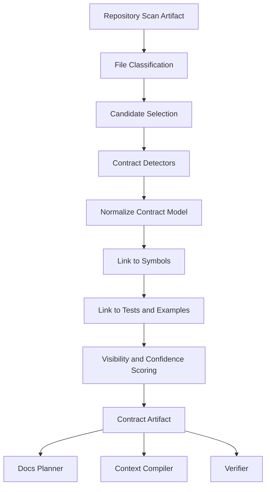
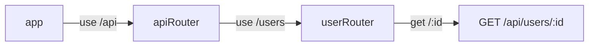

------
title: Build From Scratch: Mintlify-like AI-driven Documentation Generator CLI - Part 009
description: Membangun API and contract discovery engine untuk menemukan HTTP APIs, OpenAPI specs, GraphQL schemas, async/event contracts, CLI commands, database contracts, dan menghubungkannya ke dokumentasi yang source-grounded.
series: learn-ai-docs-km-cli
seriesTitle: Build From Scratch: Mintlify-like AI-driven Documentation Generator CLI with Code2Prompt and Open-source Knowledge Management
order: 9
partTitle: API and Contract Discovery
tags:
- ai-docs
- documentation
- cli
- api-discovery
- openapi
- graphql
- asyncapi
- contracts
- source-grounded
- mdx
date: 2026-07-04
---

# Part 009 — API and Contract Discovery

Di part sebelumnya kita sudah punya dua kemampuan penting:

1. **repository map**: sistem tahu struktur repo, project root, package, entrypoint, docs root, dan area kode yang kemungkinan penting.
2. **symbol extraction**: sistem bisa mengambil simbol minimal seperti class, function, endpoint candidate, exported module, config key, dan relasi dasar.

Sekarang kita naik satu level: **menemukan kontrak sistem**.

Kontrak adalah batas formal atau semi-formal yang dipakai pihak lain untuk berinteraksi dengan sistem. Dalam documentation generator, kontrak jauh lebih penting daripada file individual, karena dokumentasi developer biasanya menjawab pertanyaan seperti:

- API apa yang tersedia?
- Endpoint mana yang public?
- Event apa yang diterbitkan?
- Schema request/response seperti apa?
- CLI command apa yang bisa dipakai?
- Config key apa yang bisa diatur?
- Error apa yang bisa keluar?
- Behavior apa yang dijanjikan sistem kepada consumer?

Kalau scanner hanya membaca file, output-nya adalah daftar file. Kalau discovery engine membaca kontrak, output-nya adalah **surface area**.

Itulah perbedaan antara docs generator biasa dengan docs intelligence system.

---

## 1. Target Mental Model

API and contract discovery bukan proses “mencari file `openapi.yaml` saja”. Itu terlalu sempit.

Yang kita inginkan adalah engine yang bisa menjawab:

> “Dari repo ini, apa saja interface yang sengaja atau tidak sengaja menjadi janji kepada developer lain?”

Interface itu bisa berbentuk:

- HTTP endpoint,
- OpenAPI document,
- GraphQL schema,
- AsyncAPI/event spec,
- Protobuf service,
- Avro schema,
- JSON Schema,
- CLI command,
- environment variable,
- package export,
- database migration,
- message topic,
- webhook payload,
- SDK public method,
- config file shape,
- Kubernetes custom resource,
- Terraform module input/output.

Dalam seri ini, kita fokus ke yang paling berguna untuk Mintlify-like developer docs:

1. **HTTP API discovery**
2. **OpenAPI discovery**
3. **GraphQL discovery**
4. **Event/message contract discovery**
5. **CLI command discovery**
6. **Config contract discovery**
7. **Database and migration contract discovery**
8. **Implementation-to-contract linking**

Output-nya bukan halaman docs langsung. Output-nya adalah artifact:

```txt
.aidocs/artifacts/contracts/contracts.v1.json
```

Artifact ini akan dipakai oleh:

- documentation planner,
- context compiler,
- API reference generator,
- architecture doc generator,
- troubleshooting generator,
- drift detector,
- knowledge graph writer.

---

## 2. Kenapa Contract Discovery Wajib Ada

Tanpa contract discovery, AI docs generator akan bekerja seperti ini:

```txt
source files -> LLM -> docs
```

Itu terlihat sederhana, tetapi rapuh.

Masalahnya:

- LLM bisa salah menebak endpoint.
- LLM bisa mengira helper internal sebagai public API.
- LLM bisa membuat contoh request yang tidak valid.
- LLM bisa melewatkan error response penting.
- LLM bisa menulis docs berdasarkan nama function, bukan runtime route sebenarnya.
- LLM bisa menghasilkan dokumentasi yang bagus dibaca tetapi tidak cocok dengan kontrak produksi.

Yang lebih aman:

```txt
source files -> discovery engine -> contract artifact -> context compiler -> LLM -> verified docs
```

Dengan begitu, LLM tidak bertugas “menemukan kebenaran” dari awal. LLM bertugas menjelaskan kontrak yang sudah diekstrak.

Prinsipnya:

> Discovery first, generation second.

---

## 3. Contract as a First-class Artifact

Kita definisikan contract discovery output sebagai artifact yang bisa dibaca manusia dan mesin.

Minimal schema:

```json
{
  "schemaVersion": "contracts.v1",
  "repository": {
    "root": ".",
    "commit": "abc123",
    "scannedAt": "2026-07-04T10:00:00Z"
  },
  "contracts": [
    {
      "id": "http:GET:/v1/users/{id}",
      "kind": "http_endpoint",
      "visibility": "public",
      "confidence": 0.94,
      "source": {
        "path": "src/routes/users.ts",
        "lineStart": 42,
        "lineEnd": 58
      },
      "operation": {
        "method": "GET",
        "path": "/v1/users/{id}",
        "summary": "Get user by id"
      },
      "linkedSymbols": [
        "symbol:src/routes/users.ts#getUserById"
      ],
      "linkedTests": [
        "test:test/users.test.ts#returns user by id"
      ],
      "evidence": [
        {
          "type": "route_literal",
          "value": "router.get('/v1/users/:id', getUserById)",
          "path": "src/routes/users.ts"
        }
      ]
    }
  ],
  "diagnostics": []
}
```

Yang penting bukan field persisnya. Yang penting mental model-nya:

- contract punya **ID stabil**,
- contract punya **kind**,
- contract punya **visibility**,
- contract punya **confidence**,
- contract punya **source provenance**,
- contract punya **evidence**,
- contract bisa dihubungkan ke symbol, test, docs, dan generated pages.

Kalau tidak ada provenance, contract itu tidak boleh menjadi dasar docs publik.

---

## 4. Contract Discovery Pipeline

Kita susun pipeline yang deterministic.



Setiap stage punya tanggung jawab berbeda:

| Stage | Tanggung jawab |
|---|---|
| Candidate selection | memilih file yang relevan untuk contract detection |
| Contract detectors | mendeteksi OpenAPI, routes, GraphQL, events, CLI, config |
| Normalization | menyamakan format output lintas bahasa/framework |
| Linking | menghubungkan contract ke symbol/test/example |
| Scoring | menentukan confidence dan visibility |
| Artifact writing | menyimpan hasil yang reproducible |

Anti-pattern utama: satu function besar `discoverEverything()` yang melakukan traversal, parsing, scoring, dan writing sekaligus. Itu akan sulit diuji dan sulit diperluas.

---

## 5. Contract Taxonomy

Kita perlu taxonomy sebelum implementasi. Tanpa taxonomy, semua hasil discovery akan menjadi “candidate” yang tidak jelas statusnya.

Gunakan taxonomy berikut:

```ts
export type ContractKind =
  | "openapi_spec"
  | "http_endpoint"
  | "graphql_schema"
  | "graphql_operation"
  | "asyncapi_spec"
  | "message_topic"
  | "event_schema"
  | "protobuf_service"
  | "avro_schema"
  | "json_schema"
  | "cli_command"
  | "config_key"
  | "env_var"
  | "database_table"
  | "database_migration"
  | "package_export"
  | "webhook"
  | "sdk_method";
```

Setiap kind punya extraction strategy berbeda.

Contoh:

| Contract kind | Sumber umum | Discovery strategy |
|---|---|---|
| `openapi_spec` | `openapi.yaml`, `swagger.json` | parse YAML/JSON |
| `http_endpoint` | router files, annotations | AST/regex/framework detector |
| `graphql_schema` | `.graphql`, resolver config | schema parser / file heuristic |
| `message_topic` | Kafka constants, AsyncAPI | static constant extraction |
| `cli_command` | command registry | manifest/parser/AST |
| `config_key` | config schema, env loader | pattern matching + symbol refs |
| `database_table` | migrations | SQL parser/heuristic |

Taxonomy ini membuat pipeline kita eksplisit. Kalau ada jenis kontrak baru, tambahkan detector baru, bukan mengubah semua sistem.

---

## 6. Candidate Selection

Jangan parse seluruh repo untuk mencari kontrak. Gunakan hasil file classification dari Part 006.

Candidate selection bisa berbasis rules:

```ts
function selectContractCandidates(files: ClassifiedFile[]): ContractCandidate[] {
  return files
    .filter(file => file.isText)
    .filter(file => file.documentabilityScore > 0.35)
    .filter(file =>
      file.kind === "api_contract" ||
      file.kind === "source_code" ||
      file.kind === "config" ||
      file.kind === "database_migration" ||
      file.kind === "example" ||
      file.kind === "test"
    )
    .map(file => ({
      path: file.path,
      language: file.language,
      candidateKinds: inferCandidateKinds(file)
    }));
}
```

`inferCandidateKinds()` bisa melihat:

- filename,
- extension,
- directory,
- content snippets,
- package/framework hints,
- manifest dependencies.

Contoh heuristic:

```ts
function inferCandidateKinds(file: ClassifiedFile): ContractKind[] {
  const path = file.path.toLowerCase();
  const hints: ContractKind[] = [];

  if (path.includes("openapi") || path.includes("swagger")) {
    hints.push("openapi_spec");
  }

  if (path.endsWith(".graphql") || path.endsWith(".gql")) {
    hints.push("graphql_schema");
  }

  if (path.includes("routes") || path.includes("controller") || path.includes("handler")) {
    hints.push("http_endpoint");
  }

  if (path.includes("migration") || path.includes("db/migrate")) {
    hints.push("database_migration");
  }

  if (path.includes("command") || path.includes("cli")) {
    hints.push("cli_command");
  }

  if (path.includes("asyncapi") || path.includes("event") || path.includes("kafka")) {
    hints.push("asyncapi_spec", "message_topic", "event_schema");
  }

  return hints;
}
```

Ini bukan final truth. Ini hanya candidate selection agar detector tidak boros.

---

## 7. OpenAPI Discovery

OpenAPI adalah kontrak paling mudah dijadikan docs karena sudah formal.

OpenAPI Specification mendefinisikan format description untuk HTTP APIs yang language-agnostic dan bisa dipakai manusia maupun mesin untuk memahami capability service tanpa membaca source code langsung. Versi OpenAPI berubah seiring waktu, jadi discovery engine harus version-aware, bukan hardcode asumsi ke satu versi. Per 2025, spesifikasi OpenAPI 3.2.0 sudah tersedia sebagai versi specification resmi baru, sementara banyak ekosistem masih memakai 3.0.x atau 3.1.x.

Sumber discovery:

- `openapi.yaml`
- `openapi.yml`
- `openapi.json`
- `swagger.yaml`
- `swagger.json`
- `api/openapi.yaml`
- `docs/openapi.json`
- generated spec dari build output
- framework annotation yang menghasilkan OpenAPI

### 7.1 Detection Rule

```ts
function isOpenApiFile(file: ClassifiedFile): boolean {
  const name = basename(file.path).toLowerCase();
  if (![".yaml", ".yml", ".json"].some(ext => name.endsWith(ext))) {
    return false;
  }

  if (name.includes("openapi") || name.includes("swagger")) {
    return true;
  }

  return file.contentPreview.includes("openapi:") ||
         file.contentPreview.includes('"openapi"') ||
         file.contentPreview.includes('"swagger"');
}
```

### 7.2 Parse and Validate

Jangan hanya cek nama file. Parse dokumen.

Minimal:

```ts
type OpenApiContract = {
  id: string;
  kind: "openapi_spec";
  path: string;
  version: string;
  title?: string;
  servers: string[];
  operations: HttpOperationContract[];
  components: string[];
  diagnostics: ContractDiagnostic[];
};
```

Validation dasar:

- ada `openapi` atau `swagger`,
- ada `paths`,
- operation method valid,
- `$ref` bisa di-resolve,
- schema object minimal valid,
- operationId duplikat ditandai,
- path parameter sesuai template path,
- security schemes terbaca.

### 7.3 Normalize OpenAPI Operation

OpenAPI operation perlu diubah menjadi model internal:

```ts
type HttpOperationContract = {
  id: string;
  kind: "http_endpoint";
  sourceSpecId: string;
  method: "GET" | "POST" | "PUT" | "PATCH" | "DELETE" | "OPTIONS" | "HEAD";
  path: string;
  operationId?: string;
  summary?: string;
  description?: string;
  tags: string[];
  requestBody?: SchemaRef;
  responses: ResponseContract[];
  security: SecurityRequirement[];
  parameters: ParameterContract[];
  source: SourceLocation;
  confidence: number;
};
```

Kenapa normalize?

Karena docs planner tidak perlu tahu apakah endpoint ditemukan dari:

- OpenAPI,
- Express route,
- Spring annotation,
- JAX-RS annotation,
- FastAPI decorator,
- Go router.

Planner hanya perlu tahu: “ada HTTP operation dengan method/path/params/responses/source/evidence.”

### 7.4 OpenAPI as Source of Truth

Kalau repo punya OpenAPI yang valid, treat sebagai high-confidence contract.

Tetapi jangan langsung percaya 100%.

OpenAPI bisa stale.

Maka setiap operation punya status:

```ts
sourceTruthLevel:
  | "declared_contract"
  | "implementation_observed"
  | "test_observed"
  | "inferred"
```

OpenAPI operation biasanya:

```txt
sourceTruthLevel = declared_contract
confidence = 0.90 - 0.98
```

Kalau operation juga ditemukan di implementation dan test:

```txt
confidence = 0.99
```

Kalau OpenAPI mendeklarasikan endpoint tetapi implementation tidak ditemukan:

```txt
confidence = 0.75
warning = declared_but_not_linked_to_implementation
```

Ini penting untuk drift detection.

---

## 8. HTTP Endpoint Discovery from Code

Tidak semua repo punya OpenAPI. Banyak service hanya punya route definitions di kode.

Kita perlu framework-aware detector.

### 8.1 Route Pattern Families

Berbagai stack punya gaya berbeda:

```ts
// Express / Fastify-like
router.get("/users/:id", handler)
app.post("/orders", createOrder)
```

```java
// JAX-RS-like
@Path("/users")
public class UserResource {
  @GET
  @Path("/{id}")
  public Response getUser(@PathParam("id") String id) { ... }
}
```

```java
// Spring MVC-like
@RestController
@RequestMapping("/users")
class UserController {
  @GetMapping("/{id}")
  User getUser(@PathVariable String id) { ... }
}
```

```python
# FastAPI-like
@app.get("/users/{id}")
def get_user(id: str): ...
```

```go
// Go router-like
r.GET("/users/:id", getUser)
```

Kita tidak perlu mendukung semua framework di awal. Tapi architecture harus siap.

### 8.2 Detector Interface

```ts
export interface ContractDetector {
  id: string;
  supports(candidate: ContractCandidate): boolean;
  detect(input: DetectionInput): Promise<DetectedContract[]>;
}
```

Contoh detector:

```ts
export class ExpressRouteDetector implements ContractDetector {
  id = "http.express-routes";

  supports(candidate: ContractCandidate): boolean {
    return candidate.language === "typescript" || candidate.language === "javascript";
  }

  async detect(input: DetectionInput): Promise<DetectedContract[]> {
    // tahap awal: regex. tahap advanced: AST.
    return detectExpressRoutes(input.file);
  }
}
```

### 8.3 Regex First, AST Later

Untuk MVP, regex route detector bisa cukup berguna.

```ts
const routePattern = /(?:app|router)\.(get|post|put|patch|delete|head|options)\s*\(\s*['"`]([^'"`]+)['"`]/g;
```

Output:

```json
{
  "kind": "http_endpoint",
  "method": "GET",
  "path": "/users/:id",
  "confidence": 0.72,
  "evidence": [
    {
      "type": "regex_route_match",
      "value": "router.get('/users/:id'",
      "path": "src/routes/users.ts",
      "lineStart": 12
    }
  ]
}
```

Regex cukup untuk:

- route literal sederhana,
- quick discovery,
- low-cost scan,
- debugging awal.

Tapi regex gagal untuk:

- composed router,
- route prefix,
- imported constants,
- framework decorator,
- nested route groups,
- conditional registration,
- generated routes.

Maka confidence-nya jangan terlalu tinggi.

### 8.4 Prefix Composition

Salah satu masalah tersulit dalam endpoint discovery adalah path composition.

Contoh:

```ts
const api = express.Router();
api.use("/users", userRouter);

userRouter.get("/:id", getUser);
```

Endpoint sebenarnya:

```txt
GET /users/:id
```

Kalau scanner hanya baca `userRouter.get`, hasilnya kurang lengkap.

Solusi bertahap:

1. detect route literal,
2. detect router mount,
3. build route composition graph,
4. resolve final path jika confidence cukup.



Route composition model:

```ts
type RouteMount = {
  parentRouter: string;
  childRouter: string;
  prefix: string;
  source: SourceLocation;
};

type RouteLeaf = {
  router: string;
  method: string;
  localPath: string;
  handlerRef?: string;
  source: SourceLocation;
};
```

Final endpoint:

```ts
resolveRoutePath(mounts, leaf): ResolvedRoute[]
```

Jika path tidak bisa di-resolve:

```json
{
  "path": "/:id",
  "pathResolution": "partial",
  "diagnostics": ["Could not resolve parent router prefix"]
}
```

Jangan mengarang prefix.

---

## 9. Annotation-based HTTP Discovery

Java, Kotlin, C#, Python, dan beberapa framework lain sering memakai annotations/decorators.

Contoh JAX-RS:

```java
@Path("/accounts")
public class AccountResource {
  @GET
  @Path("/{accountId}")
  public Account getAccount(@PathParam("accountId") String accountId) {
    ...
  }
}
```

Endpoint final:

```txt
GET /accounts/{accountId}
```

Detector harus membaca dua level:

- class-level path,
- method-level path.

Model:

```ts
type AnnotationRoute = {
  classPath?: string;
  methodPath?: string;
  method: string;
  handlerSymbol: string;
  params: ParameterContract[];
  source: SourceLocation;
};
```

Pseudo-code:

```ts
function detectJaxRsRoutes(javaFile: ParsedJavaFile): HttpOperationContract[] {
  const result: HttpOperationContract[] = [];

  for (const clazz of javaFile.classes) {
    const basePath = clazz.annotations.find(a => a.name === "Path")?.value ?? "";

    for (const method of clazz.methods) {
      const httpMethod = findHttpMethodAnnotation(method.annotations);
      if (!httpMethod) continue;

      const methodPath = method.annotations.find(a => a.name === "Path")?.value ?? "";

      result.push({
        id: makeHttpId(httpMethod, joinPaths(basePath, methodPath)),
        kind: "http_endpoint",
        method: httpMethod,
        path: joinPaths(basePath, methodPath),
        linkedSymbols: [method.symbolId],
        parameters: extractJaxRsParams(method),
        source: method.source,
        confidence: 0.88
      });
    }
  }

  return result;
}
```

Annotation discovery cocok dengan AST/parser. Regex masih bisa, tetapi rentan untuk multi-line annotation dan nested class.

---

## 10. GraphQL Discovery

GraphQL docs biasanya punya dua sisi:

1. **schema docs**: type, query, mutation, subscription, input, enum.
2. **operation docs**: query/mutation yang dipakai client atau test.

GraphQL Specification punya rilis versioned dan working draft yang terus berkembang. Karena itu, detector jangan mengasumsikan satu file atau satu edition saja. Untuk docs generator, yang paling penting adalah membaca schema dan operation aktual yang ada di repo.

Sumber umum:

- `schema.graphql`
- `*.graphql`
- `*.gql`
- code-first schema builder,
- resolver files,
- Apollo/GraphQL config,
- client operation files,
- test queries,
- introspection JSON.

### 10.1 GraphQL Schema Contract

```ts
type GraphQlSchemaContract = {
  id: string;
  kind: "graphql_schema";
  source: SourceLocation;
  types: GraphQlTypeContract[];
  operations: GraphQlRootOperation[];
  directives: GraphQlDirectiveContract[];
  confidence: number;
};
```

Type model:

```ts
type GraphQlTypeContract = {
  name: string;
  kind: "object" | "input" | "interface" | "union" | "enum" | "scalar";
  fields: GraphQlFieldContract[];
  description?: string;
  source: SourceLocation;
};
```

### 10.2 Detect `.graphql` Files

```ts
function isGraphQlFile(file: ClassifiedFile): boolean {
  return file.path.endsWith(".graphql") || file.path.endsWith(".gql");
}
```

Parse schema dengan library parser jika memungkinkan. Untuk MVP, bisa mulai dari syntax-level detection:

```graphql
schema {
  query: Query
  mutation: Mutation
}

type Query {
  user(id: ID!): User
}

type User {
  id: ID!
  name: String!
}
```

Output docs candidate:

```json
{
  "kind": "graphql_schema",
  "rootOperations": ["Query", "Mutation"],
  "types": ["Query", "User"],
  "source": {
    "path": "schema.graphql"
  }
}
```

### 10.3 Operation Mining

GraphQL operation files bisa menunjukkan real usage.

```graphql
query GetUser($id: ID!) {
  user(id: $id) {
    id
    name
  }
}
```

Discovery output:

```json
{
  "id": "graphql_operation:GetUser",
  "kind": "graphql_operation",
  "operationType": "query",
  "name": "GetUser",
  "variables": ["id"],
  "selectionRoots": ["user"],
  "source": {
    "path": "src/client/queries/get-user.graphql"
  }
}
```

Kenapa operation mining penting?

Karena public schema menjawab: “apa yang mungkin?”

Operation usage menjawab: “apa yang benar-benar dipakai?”

Untuk docs generator, real usage sering lebih baik sebagai contoh.

---

## 11. Async and Event Contract Discovery

Banyak sistem modern tidak hanya punya HTTP API. Mereka punya event streams.

Contoh:

- Kafka topic,
- RabbitMQ exchange,
- NATS subject,
- MQTT topic,
- webhook event,
- outbox event,
- domain event,
- CDC stream.

AsyncAPI Specification menyediakan format machine-readable untuk message-driven APIs dan bersifat protocol-agnostic, sehingga dapat menggambarkan API berbasis Kafka, WebSocket, MQTT, AMQP, dan protokol lain. Karena event-driven architecture sering sulit dipahami dari kode saja, event contract discovery sangat berharga untuk documentation generator.

### 11.1 Event Contract Kinds

```ts
type EventContract = {
  id: string;
  kind: "message_topic" | "event_schema" | "asyncapi_spec";
  name: string;
  direction: "publishes" | "subscribes" | "both" | "unknown";
  protocol?: "kafka" | "amqp" | "nats" | "mqtt" | "webhook" | "unknown";
  payloadSchema?: SchemaRef;
  source: SourceLocation;
  linkedSymbols: string[];
  confidence: number;
};
```

### 11.2 AsyncAPI Discovery

Files:

- `asyncapi.yaml`
- `asyncapi.yml`
- `asyncapi.json`
- `events/asyncapi.yaml`

Detection:

```ts
function isAsyncApiFile(file: ClassifiedFile): boolean {
  const name = basename(file.path).toLowerCase();
  return name.includes("asyncapi") ||
    file.contentPreview.includes("asyncapi:") ||
    file.contentPreview.includes('"asyncapi"');
}
```

Normalize channels/messages:

```ts
function normalizeAsyncApi(spec: AsyncApiDocument): EventContract[] {
  const contracts: EventContract[] = [];

  for (const [channelName, channel] of Object.entries(spec.channels ?? {})) {
    contracts.push({
      id: `event:${channelName}`,
      kind: "message_topic",
      name: channelName,
      direction: inferDirection(channel),
      protocol: inferProtocol(spec),
      payloadSchema: inferPayloadSchema(channel, spec),
      source: locateChannel(channelName),
      linkedSymbols: [],
      confidence: 0.92
    });
  }

  return contracts;
}
```

### 11.3 Topic Constants Discovery

Banyak repo tidak punya AsyncAPI. Topic sering muncul sebagai constant.

```java
public static final String ORDER_CREATED_TOPIC = "orders.created.v1";
```

```ts
export const TOPICS = {
  ORDER_CREATED: "orders.created.v1",
  PAYMENT_FAILED: "payments.failed.v1"
};
```

Heuristic:

- string literal mengandung pattern topic,
- identifier mengandung `TOPIC`, `EVENT`, `CHANNEL`, `SUBJECT`,
- file berada di `messaging`, `events`, `kafka`, `pubsub`, `outbox`,
- digunakan oleh producer/consumer API.

Output:

```json
{
  "kind": "message_topic",
  "name": "orders.created.v1",
  "direction": "unknown",
  "confidence": 0.66,
  "evidence": [
    {
      "type": "topic_constant",
      "value": "ORDER_CREATED_TOPIC = orders.created.v1"
    }
  ]
}
```

Kalau topic constant dipakai di producer:

```ts
producer.send({ topic: ORDER_CREATED_TOPIC, messages: [...] })
```

Confidence naik dan direction menjadi `publishes`.

Kalau dipakai di consumer:

```ts
consumer.subscribe({ topic: ORDER_CREATED_TOPIC })
```

Direction menjadi `subscribes`.

---

## 12. Schema Discovery

Contract tidak lengkap tanpa payload schema.

Schema bisa muncul sebagai:

- JSON Schema,
- Avro,
- Protobuf,
- OpenAPI components schema,
- TypeScript type,
- Java DTO,
- Kotlin data class,
- C# record,
- database table,
- validation schema seperti Zod/Joi/Yup,
- Pydantic model.

Untuk docs generator, schema extraction punya dua tujuan:

1. menjelaskan input/output kepada developer,
2. memverifikasi contoh request/response.

### 12.1 JSON Schema

Detection:

- file `.schema.json`,
- contains `$schema`,
- contains `type`, `properties`, `required`,
- referenced by OpenAPI or config.

Output:

```json
{
  "kind": "json_schema",
  "id": "schema:CreateUserRequest",
  "name": "CreateUserRequest",
  "source": {
    "path": "schemas/create-user-request.schema.json"
  },
  "fields": [
    { "name": "email", "type": "string", "required": true },
    { "name": "name", "type": "string", "required": true }
  ]
}
```

### 12.2 Protobuf

Detection:

- `.proto` files,
- `service` declarations,
- `message` declarations,
- `rpc` methods.

```proto
service UserService {
  rpc GetUser(GetUserRequest) returns (User);
}

message GetUserRequest {
  string id = 1;
}
```

Output:

```json
{
  "kind": "protobuf_service",
  "name": "UserService",
  "methods": [
    {
      "name": "GetUser",
      "request": "GetUserRequest",
      "response": "User"
    }
  ]
}
```

### 12.3 Avro

Detection:

- `.avsc`,
- Avro `record`,
- schema registry path,
- Kafka/event module.

```json
{
  "type": "record",
  "name": "OrderCreated",
  "fields": [
    { "name": "orderId", "type": "string" }
  ]
}
```

Output:

```json
{
  "kind": "avro_schema",
  "name": "OrderCreated",
  "fields": ["orderId"],
  "source": { "path": "events/order-created.avsc" }
}
```

---

## 13. CLI Command Discovery

Karena produk kita sendiri adalah CLI, kita juga harus bisa mendokumentasikan CLI command dari repo lain.

CLI command bisa muncul di:

- commander.js,
- yargs,
- oclif,
- cobra,
- picocli,
- clap,
- argparse,
- custom command registry.

Contoh TypeScript:

```ts
program
  .command("scan")
  .description("Scan repository and produce repository artifacts")
  .option("--json", "Print JSON output")
  .action(runScan);
```

Output:

```json
{
  "kind": "cli_command",
  "name": "scan",
  "description": "Scan repository and produce repository artifacts",
  "options": [
    { "name": "--json", "type": "boolean" }
  ],
  "handler": "runScan",
  "source": {
    "path": "src/cli.ts",
    "lineStart": 12
  }
}
```

CLI docs generator bisa memakai contract ini untuk membuat:

- command reference,
- usage guide,
- options table,
- exit code docs,
- examples.

Untuk Part 039 nanti, kita akan balik memakai prinsip ini untuk mendokumentasikan CLI yang kita bangun sendiri.

---

## 14. Config Contract Discovery

Config adalah API juga.

Developer sering lebih butuh docs config daripada docs internal class.

Sumber config contract:

- `.env.example`,
- `config/default.yaml`,
- `aidocs.config.ts`,
- JSON Schema,
- Zod/Joi validation,
- Spring `@ConfigurationProperties`,
- Kubernetes values.yaml,
- Terraform variables,
- Helm chart values.

### 14.1 Environment Variables

Example:

```env
DATABASE_URL=postgres://localhost:5432/app
OPENAI_API_KEY=
AIDOCS_LOG_LEVEL=info
```

Output:

```json
{
  "kind": "env_var",
  "name": "DATABASE_URL",
  "required": true,
  "defaultValue": null,
  "source": {
    "path": ".env.example"
  },
  "confidence": 0.82
}
```

### 14.2 Typed Config

Example with Zod:

```ts
const ConfigSchema = z.object({
  port: z.number().default(3000),
  databaseUrl: z.string().url(),
  logLevel: z.enum(["debug", "info", "warn", "error"]).default("info")
});
```

Output:

```json
{
  "kind": "config_key",
  "name": "databaseUrl",
  "type": "string:url",
  "required": true,
  "source": {
    "path": "src/config.ts"
  },
  "confidence": 0.90
}
```

Config docs harus menjawab:

- key apa saja,
- required atau optional,
- default value,
- accepted values,
- secret atau non-secret,
- runtime effect,
- related command/deployment env.

---

## 15. Database Contract Discovery

Database schema bukan public API untuk semua project. Tapi untuk internal docs, platform docs, migration docs, dan architecture docs, database contract sangat penting.

Sumber:

- SQL migrations,
- ORM model,
- Prisma schema,
- Liquibase/Flyway migration,
- JPA entity,
- MyBatis mapper,
- SQL DDL.

Example migration:

```sql
CREATE TABLE orders (
  id UUID PRIMARY KEY,
  customer_id UUID NOT NULL,
  status TEXT NOT NULL,
  created_at TIMESTAMP NOT NULL
);
```

Output:

```json
{
  "kind": "database_table",
  "name": "orders",
  "columns": [
    { "name": "id", "type": "UUID", "nullable": false, "primaryKey": true },
    { "name": "customer_id", "type": "UUID", "nullable": false },
    { "name": "status", "type": "TEXT", "nullable": false },
    { "name": "created_at", "type": "TIMESTAMP", "nullable": false }
  ],
  "source": {
    "path": "db/migrations/001_create_orders.sql"
  },
  "confidence": 0.86
}
```

Yang harus hati-hati:

- migration historis bisa tidak merepresentasikan state final,
- rollback migration bisa membingungkan,
- ORM model bisa berbeda dari DB aktual,
- generated migration bisa terlalu noisy,
- DB contract bisa bersifat internal dan tidak boleh masuk public docs.

Maka setiap database contract perlu field:

```json
{
  "visibility": "internal"
}
```

Jangan otomatis publish database schema ke docs publik.

---

## 16. Visibility Scoring

Contract discovery harus membedakan public, internal, private, dan unknown.

```ts
type Visibility = "public" | "internal" | "private" | "unknown";
```

Signals public:

- berada di OpenAPI public spec,
- berada di docs/public,
- package export,
- route prefix `/api`, `/v1`, `/public`,
- README menyebut endpoint,
- published package manifest.

Signals internal:

- path mengandung `internal`, `admin`, `ops`, `debug`,
- endpoint butuh internal auth scheme,
- file ada di service-private module,
- database migration,
- event internal topic.

Signals private:

- function tidak exported,
- test helper,
- dev-only route,
- debug endpoint,
- local script.

Visibility scorer:

```ts
function scoreVisibility(contract: DetectedContract, repo: RepoEvidence): VisibilityScore {
  let publicScore = 0;
  let internalScore = 0;
  let privateScore = 0;

  if (contract.kind === "openapi_spec") publicScore += 4;
  if (contract.source.path.includes("public")) publicScore += 2;
  if (contract.source.path.includes("internal")) internalScore += 3;
  if (contract.operation?.path?.includes("/admin")) internalScore += 2;
  if (contract.source.path.includes("test")) privateScore += 2;

  return normalizeVisibility(publicScore, internalScore, privateScore);
}
```

Jangan treat visibility sebagai boolean. Banyak kontrak berada di zona abu-abu.

Docs generator harus bisa menerima policy:

```yaml
publish:
  includeVisibility:
    - public
  excludeTags:
    - internal
    - admin
```

---

## 17. Confidence Scoring

Confidence menjawab:

> “Seberapa yakin sistem bahwa kontrak ini benar-benar ada dan bisa dijadikan basis dokumentasi?”

Contoh scoring:

| Evidence | Confidence impact |
|---|---:|
| Valid OpenAPI operation | +0.90 |
| Route annotation parsed by AST | +0.85 |
| Regex route match | +0.60 |
| Linked to handler symbol | +0.08 |
| Linked to test | +0.05 |
| Linked to README docs | +0.03 |
| Route prefix unresolved | -0.15 |
| Dynamic path expression | -0.20 |
| Generated file | -0.10 |
| Conflicting method/path | -0.20 |

Score formula sederhana:

```ts
function computeConfidence(evidence: Evidence[]): number {
  let score = 0;

  for (const item of evidence) {
    score += evidenceWeight(item);
  }

  return clamp(score, 0, 0.99);
}
```

Lebih penting dari formula adalah explainability.

CLI harus bisa menampilkan:

```txt
GET /users/{id} confidence=0.94
  + OpenAPI operation found in openapi.yaml
  + Handler symbol linked: getUserById
  + Integration test found: users.test.ts
```

Atau:

```txt
POST /orders confidence=0.61
  + Regex route found in routes/orders.ts
  - Parent router prefix unresolved
  - No test/example linked
```

---

## 18. Contract Linking

Discovery contract harus dihubungkan ke:

- symbols,
- tests,
- examples,
- docs pages,
- knowledge notes,
- owners.

### 18.1 Link to Symbols

For endpoint:

```txt
GET /users/{id} -> handler function getUserById
```

For CLI:

```txt
aidocs scan -> runScan command handler
```

For event:

```txt
orders.created.v1 -> OrderCreatedEvent class
```

Linking rules:

- direct handler reference,
- annotation method owner,
- import graph relation,
- naming similarity,
- test reference.

### 18.2 Link to Tests

Test linking signals:

- test file imports handler,
- test calls endpoint path,
- test uses operationId,
- test references schema name,
- test publishes/consumes topic.

Example:

```ts
await request(app)
  .get("/users/123")
  .expect(200);
```

This links to:

```txt
GET /users/{id}
```

Path matching needs normalization:

```txt
/users/123 -> /users/{id}
/users/:id -> /users/{id}
/users/{id} -> /users/{id}
```

### 18.3 Link to Existing Docs

Existing docs are valuable but not authoritative by default.

If README says:

```md
GET /users/:id returns a user by id.
```

Link it as evidence:

```json
{
  "type": "existing_docs_mention",
  "path": "README.md",
  "value": "GET /users/:id"
}
```

But if code disagrees with docs, code/contract wins and drift detector warns.

---

## 19. Contract Conflict Detection

Conflict examples:

1. OpenAPI says `GET /users/{id}`, code has `GET /api/users/:id`.
2. OpenAPI says response `200`, tests expect `204`.
3. AsyncAPI says topic `orders.created`, code publishes `order.created`.
4. Config schema says `LOG_LEVEL` enum includes `trace`, docs say only `debug/info/warn/error`.
5. Migration creates `orders.status` nullable, ORM marks non-null.

Conflict model:

```ts
 type ContractConflict = {
  id: string;
  kind:
    | "declared_missing_implementation"
    | "implementation_missing_declared_contract"
    | "schema_mismatch"
    | "path_mismatch"
    | "response_mismatch"
    | "visibility_conflict";
  severity: "info" | "warning" | "error";
  contracts: string[];
  evidence: Evidence[];
  recommendation: string;
};
```

Docs generator should not hide conflicts. It should surface them.

```txt
warning: OpenAPI declares POST /orders but no implementation route was found.
```

In docs generation, page spec can include:

```yaml
forbiddenClaims:
  - do not state that POST /orders is implemented unless verifier confirms implementation evidence
```

---

## 20. Contract Artifact Example

A realistic small output:

```json
{
  "schemaVersion": "contracts.v1",
  "repository": {
    "commit": "abc123"
  },
  "contracts": [
    {
      "id": "openapi:docs/openapi.yaml",
      "kind": "openapi_spec",
      "name": "Acme API",
      "version": "3.1.0",
      "source": { "path": "docs/openapi.yaml" },
      "confidence": 0.97
    },
    {
      "id": "http:GET:/v1/users/{id}",
      "kind": "http_endpoint",
      "method": "GET",
      "path": "/v1/users/{id}",
      "visibility": "public",
      "sourceTruthLevel": "declared_contract",
      "source": { "path": "docs/openapi.yaml" },
      "linkedSymbols": ["symbol:src/users/user.controller.ts#getUser"],
      "linkedTests": ["test:test/users.test.ts#get user by id"],
      "confidence": 0.98
    },
    {
      "id": "event:orders.created.v1",
      "kind": "message_topic",
      "name": "orders.created.v1",
      "direction": "publishes",
      "visibility": "internal",
      "source": { "path": "src/events/topics.ts" },
      "linkedSymbols": ["symbol:src/events/order-publisher.ts#publishOrderCreated"],
      "confidence": 0.81
    },
    {
      "id": "env:DATABASE_URL",
      "kind": "env_var",
      "name": "DATABASE_URL",
      "visibility": "internal",
      "required": true,
      "secret": true,
      "source": { "path": ".env.example" },
      "confidence": 0.84
    }
  ],
  "conflicts": [],
  "diagnostics": []
}
```

---

## 21. CLI UX for Contract Discovery

Command:

```bash
aidocs contracts
```

Output default:

```txt
Contracts discovered

HTTP endpoints:      24
OpenAPI specs:        1
GraphQL schemas:      0
Event topics:         6
CLI commands:         8
Config keys:         17
DB tables:           12

Warnings:
  - 3 endpoints found in implementation but missing from OpenAPI
  - 2 OpenAPI operations not linked to implementation
  - 1 topic has unknown publish/subscribe direction
```

JSON mode:

```bash
aidocs contracts --json > .aidocs/artifacts/contracts/contracts.v1.json
```

Explain one contract:

```bash
aidocs contracts explain http:GET:/v1/users/{id}
```

Output:

```txt
GET /v1/users/{id}
visibility: public
confidence: 0.98

Evidence:
  + OpenAPI operation in docs/openapi.yaml:52
  + Handler symbol src/users/user.controller.ts#getUser
  + Test test/users.test.ts:21 calls /v1/users/123

Generated docs candidates:
  - api-reference/users/get-user.mdx
  - guides/users/fetch-user.mdx
```

This command is not a nice-to-have. It is how developers trust the generator.

---

## 22. Implementation Skeleton

```ts
export async function discoverContracts(ctx: DiscoveryContext): Promise<ContractArtifact> {
  const candidates = selectContractCandidates(ctx.classifiedFiles);
  const detectors = loadContractDetectors(ctx.config);
  const detected: DetectedContract[] = [];

  for (const candidate of candidates) {
    for (const detector of detectors) {
      if (!detector.supports(candidate)) continue;

      const result = await detector.detect({
        candidate,
        file: await ctx.fileStore.read(candidate.path),
        repoMap: ctx.repoMap,
        symbols: ctx.symbols,
        config: ctx.config
      });

      detected.push(...result);
    }
  }

  const normalized = normalizeContracts(detected);
  const linkedToSymbols = linkContractsToSymbols(normalized, ctx.symbols);
  const linkedToTests = linkContractsToTests(linkedToSymbols, ctx.testIndex);
  const scored = scoreContracts(linkedToTests, ctx.repoEvidence);
  const conflicts = detectContractConflicts(scored);

  return {
    schemaVersion: "contracts.v1",
    repository: ctx.repositoryInfo,
    contracts: scored,
    conflicts,
    diagnostics: collectDiagnostics(scored, conflicts)
  };
}
```

---

## 23. Testing Strategy

Contract discovery must be tested with fixtures.

Directory:

```txt
test-fixtures/
  contracts/
    express-basic/
    express-nested-router/
    jaxrs-basic/
    openapi-basic/
    openapi-with-ref/
    graphql-schema/
    asyncapi-basic/
    kafka-constants/
    cli-commander/
    env-example/
    sql-migration/
```

Each fixture has:

```txt
input repo files
expected contracts.v1.json
expected diagnostics
```

Test types:

1. **golden artifact test**: output exactly matches expected JSON.
2. **confidence test**: score within expected range.
3. **conflict test**: drift/conflict detected.
4. **source location test**: line numbers are correct enough.
5. **negative test**: internal helper not detected as public contract.

Example:

```ts
it("detects nested express route prefix", async () => {
  const artifact = await runFixture("express-nested-router");

  expect(artifact.contracts).toContainContract({
    kind: "http_endpoint",
    method: "GET",
    path: "/api/users/{id}"
  });
});
```

---

## 24. Common Mistakes

### Mistake 1: Treating OpenAPI as always correct

OpenAPI is a declared contract, not guaranteed implementation truth. Link it to code/tests.

### Mistake 2: Publishing every discovered endpoint

Discovery is not publishing. Visibility policy decides publishing.

### Mistake 3: Hiding uncertainty

Confidence and diagnostics must be visible.

### Mistake 4: Generating docs from regex matches alone

Regex match can seed a candidate. It should not produce high-confidence public docs without extra evidence.

### Mistake 5: Ignoring events and config

Developer experience is not only HTTP docs. Many real onboarding failures come from undocumented env vars, topics, and config.

### Mistake 6: Not preserving source location

Without path/line provenance, review becomes slow and trust collapses.

---

## 25. What This Part Enables

After Part 009, our system can produce an explicit view of the repo's external and internal interfaces.

We now have:

```txt
scan.v1.json
classification.v1.json
repo-map.v1.json
symbols.v1.json
contracts.v1.json
```

This is the first point where the generator starts to look like a serious documentation intelligence tool.

The next part will use tests and examples as another high-value source of truth. Contract discovery tells us **what the system exposes**. Test and example mining tells us **how the system is actually used**.

---

## References

- OpenAPI Specification v3.2.0: https://spec.openapis.org/oas/v3.2.0.html
- OpenAPI Initiative overview: https://www.openapis.org/
- AsyncAPI Specification repository and latest references: https://github.com/asyncapi/spec
- AsyncAPI 3.0.0 reference: https://www.asyncapi.com/docs/reference/specification/v3.0.0
- GraphQL Specification versions: https://spec.graphql.org/
- GraphQL Working Draft: https://spec.graphql.org/draft/
