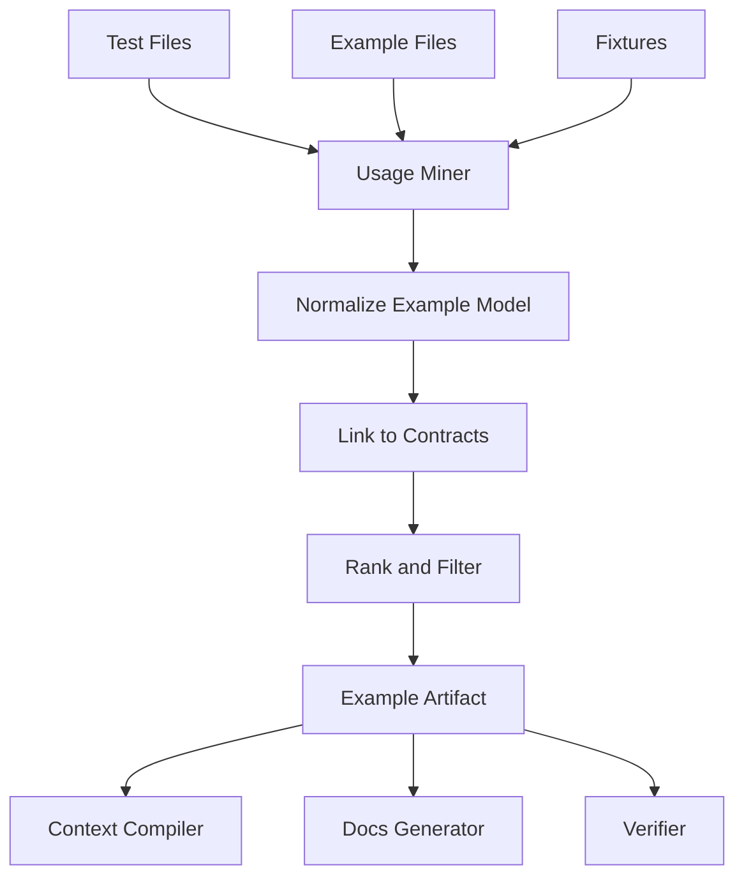

------
title: Build From Scratch: Mintlify-like AI-driven Documentation Generator CLI - Part 010
description: Membangun test and example mining engine untuk mengekstrak usage examples, happy paths, edge cases, setup flows, fixtures, assertions, dan runnable snippets sebagai sumber dokumentasi yang lebih grounded.
series: learn-ai-docs-km-cli
seriesTitle: Build From Scratch: Mintlify-like AI-driven Documentation Generator CLI with Code2Prompt and Open-source Knowledge Management
order: 10
partTitle: Test and Example Mining
tags:
- ai-docs
- documentation
- cli
- test-mining
- examples
- fixtures
- usage-extraction
- source-grounded
- mdx
date: 2026-07-04
---

# Part 010 — Test and Example Mining

Part 009 memberi kita contract discovery: endpoint, schema, event, CLI command, config key, dan database contract.

Tapi contract hanya menjawab:

> “Apa interface yang tersedia?”

Untuk dokumentasi developer, itu belum cukup.

Developer juga butuh jawaban:

- bagaimana cara memanggilnya,
- setup minimalnya apa,
- input contoh yang valid seperti apa,
- output yang seharusnya seperti apa,
- error case yang umum apa,
- bagaimana behavior-nya ketika edge case terjadi,
- apa contoh pemakaian yang benar-benar digunakan di repo.

Sumber terbaik untuk itu sering bukan README. Sumber terbaiknya adalah:

- tests,
- fixtures,
- examples directory,
- sample apps,
- integration specs,
- snapshot tests,
- CI workflows,
- smoke scripts,
- demo configs.

Maka kita perlu **test and example mining engine**.

Tujuan part ini: membangun artifact baru:

```txt
.aidocs/artifacts/examples/examples.v1.json
```

Artifact ini akan menghubungkan contract dengan real usage.

---

## 1. Core Mental Model

Tests adalah executable documentation.

Bukan karena test selalu bagus. Banyak test buruk. Banyak test terlalu internal. Banyak test flaky. Tapi dibandingkan prose docs, test punya satu keunggulan besar:

> Test biasanya harus mengikuti behavior aktual agar build tetap hijau.

Artinya, test dan example punya nilai grounding tinggi.

Kita tidak akan langsung menyalin semua test ke docs. Itu juga salah.

Yang kita lakukan:

```txt
source tests/examples -> mine usage signals -> normalize example artifact -> rank -> link to contracts -> generate docs examples
```

Diagram:



Yang kita mining bukan “test sebagai file”, tetapi “usage episode”.

Usage episode adalah potongan perilaku yang punya:

- setup,
- action,
- expected result,
- source location,
- related contract,
- confidence,
- suitability untuk docs.

---

## 2. Apa Itu Example Artifact?

Minimal model:

```json
{
  "schemaVersion": "examples.v1",
  "repository": {
    "commit": "abc123"
  },
  "examples": [
    {
      "id": "example:http:get-user:happy-path",
      "kind": "http_usage",
      "title": "Fetch a user by id",
      "source": {
        "path": "test/users.test.ts",
        "lineStart": 14,
        "lineEnd": 28
      },
      "linkedContracts": ["http:GET:/v1/users/{id}"],
      "scenario": "happy_path",
      "setup": [
        "create user fixture"
      ],
      "action": {
        "type": "http_request",
        "method": "GET",
        "path": "/v1/users/123"
      },
      "expected": {
        "status": 200,
        "bodyShape": {
          "id": "string",
          "name": "string"
        }
      },
      "snippet": "await request(app).get('/v1/users/123').expect(200)",
      "docSuitability": 0.86,
      "confidence": 0.91
    }
  ],
  "diagnostics": []
}
```

Perhatikan field penting:

- `kind`: jenis example,
- `linkedContracts`: hubungan ke contract discovery,
- `scenario`: happy path / error path / edge case,
- `setup/action/expected`: struktur test behavior,
- `docSuitability`: apakah layak masuk docs,
- `confidence`: apakah mining-nya bisa dipercaya.

Docs generator tidak perlu membaca semua test lagi. Ia membaca artifact yang sudah bersih dan terstruktur.

---

## 3. Example Taxonomy

Kita perlu taxonomy agar mining tidak campur aduk.

```ts
export type ExampleKind =
  | "http_usage"
  | "graphql_usage"
  | "cli_usage"
  | "sdk_usage"
  | "event_usage"
  | "config_usage"
  | "database_usage"
  | "workflow_usage"
  | "error_case"
  | "setup_script"
  | "fixture";
```

Scenario:

```ts
export type ExampleScenario =
  | "happy_path"
  | "error_path"
  | "edge_case"
  | "setup"
  | "teardown"
  | "migration"
  | "auth"
  | "pagination"
  | "validation"
  | "idempotency"
  | "retry"
  | "unknown";
```

Doc suitability bukan sama dengan correctness.

Test bisa benar tetapi buruk untuk docs.

Contoh test yang benar tetapi jelek untuk docs:

```ts
it("works", async () => {
  const x = await svc.doThing({ a: 1, b: null, c: "lol" });
  expect(x).toBeTruthy();
});
```

Kenapa kurang layak?

- title tidak informatif,
- input tidak realistik,
- assertion terlalu lemah,
- tidak jelas contract yang diuji,
- tidak mengajarkan user.

Contoh lebih baik:

```ts
it("returns 404 when user id does not exist", async () => {
  await request(app)
    .get("/v1/users/missing-user")
    .expect(404)
    .expect(res => {
      expect(res.body.code).toBe("USER_NOT_FOUND");
    });
});
```

Ini bagus untuk troubleshooting/error docs.

---

## 4. Candidate Selection for Tests and Examples

Gunakan output file classification.

Candidate file kinds:

- `test`,
- `example`,
- `fixture`,
- `docs`,
- `script`,
- `ci_config`,
- `source_code` tertentu untuk sample apps.

Candidate path patterns:

```txt
__tests__/
test/
tests/
spec/
examples/
samples/
demo/
fixtures/
mock/
stubs/
e2e/
integration/
acceptance/
.postman/
.http
*.test.ts
*.spec.ts
*_test.go
*Test.java
*.feature
```

Selection function:

```ts
function selectExampleCandidates(files: ClassifiedFile[]): ExampleCandidate[] {
  return files
    .filter(file => file.isText)
    .filter(file =>
      file.kind === "test" ||
      file.kind === "example" ||
      file.kind === "fixture" ||
      file.kind === "script" ||
      file.kind === "ci_config"
    )
    .map(file => ({
      path: file.path,
      language: file.language,
      candidateKinds: inferExampleKinds(file),
      score: initialExampleCandidateScore(file)
    }));
}
```

Candidate score signals:

| Signal | Meaning |
|---|---|
| path contains `examples` | high doc suitability |
| path contains `e2e` | high behavior value |
| path contains `fixtures` | useful input/output data |
| test imports app/server/client | likely usage example |
| test uses HTTP request library | likely API example |
| test has snapshot | likely output example |
| test name descriptive | higher doc suitability |
| test is internal unit helper | lower doc suitability |

---

## 5. Usage Episode Model

A usage episode is the smallest useful documentation unit extracted from tests/examples.

```ts
export type UsageEpisode = {
  id: string;
  kind: ExampleKind;
  scenario: ExampleScenario;
  title?: string;
  source: SourceLocation;
  linkedContracts: string[];
  setup: UsageStep[];
  action: UsageAction;
  expected?: UsageExpected;
  snippet?: string;
  fixtures: FixtureRef[];
  evidence: Evidence[];
  docSuitability: number;
  confidence: number;
};
```

Step model:

```ts
export type UsageStep = {
  type:
    | "create_fixture"
    | "configure_env"
    | "start_server"
    | "authenticate"
    | "seed_database"
    | "mock_dependency"
    | "run_command"
    | "unknown";
  text: string;
  source?: SourceLocation;
};
```

Action model:

```ts
export type UsageAction =
  | HttpUsageAction
  | GraphQlUsageAction
  | CliUsageAction
  | SdkUsageAction
  | EventUsageAction
  | ConfigUsageAction
  | UnknownUsageAction;
```

HTTP action:

```ts
export type HttpUsageAction = {
  type: "http_request";
  method: string;
  path: string;
  headers?: Record<string, string>;
  query?: Record<string, string>;
  body?: unknown;
};
```

Expected model:

```ts
export type UsageExpected = {
  status?: number;
  bodyShape?: unknown;
  stdout?: string;
  stderr?: string;
  eventPublished?: string;
  dbRowsChanged?: number;
  errorCode?: string;
  assertions: AssertionSummary[];
};
```

This model is deliberately not tied to one language or framework.

---

## 6. Mining HTTP Usage from Tests

HTTP tests are the easiest high-value source.

Common patterns:

```ts
await request(app)
  .get("/v1/users/123")
  .expect(200);
```

```ts
await fetch("http://localhost:3000/v1/users/123", {
  method: "GET",
  headers: { Authorization: `Bearer ${token}` }
});
```

```java
mockMvc.perform(get("/v1/users/{id}", "123"))
  .andExpect(status().isOk());
```

```python
response = client.get("/v1/users/123")
assert response.status_code == 200
```

### 6.1 Regex-based Detection

MVP detector for JS/TS Supertest-like tests:

```ts
const supertestPattern = /\.\s*(get|post|put|patch|delete)\s*\(\s*['"`]([^'"`]+)['"`]\s*\)/g;
const expectStatusPattern = /\.expect\s*\(\s*(\d{3})\s*\)/g;
```

Output:

```json
{
  "kind": "http_usage",
  "scenario": "happy_path",
  "action": {
    "type": "http_request",
    "method": "GET",
    "path": "/v1/users/123"
  },
  "expected": {
    "status": 200
  },
  "confidence": 0.75
}
```

Confidence is moderate because regex may miss setup/body/assertion.

### 6.2 AST-based Detection

AST detector improves:

- chain call parsing,
- request body extraction,
- header extraction,
- variable resolution,
- test title extraction,
- assertion extraction.

Example:

```ts
it("creates a user", async () => {
  await request(app)
    .post("/v1/users")
    .set("Authorization", `Bearer ${token}`)
    .send({ email: "ada@example.com", name: "Ada" })
    .expect(201)
    .expect(res => {
      expect(res.body.email).toBe("ada@example.com");
    });
});
```

Extracted episode:

```json
{
  "title": "creates a user",
  "kind": "http_usage",
  "scenario": "happy_path",
  "action": {
    "type": "http_request",
    "method": "POST",
    "path": "/v1/users",
    "headers": {
      "Authorization": "Bearer <token>"
    },
    "body": {
      "email": "ada@example.com",
      "name": "Ada"
    }
  },
  "expected": {
    "status": 201,
    "bodyShape": {
      "email": "string"
    }
  }
}
```

Notice token redaction. We never expose real secrets.

---

## 7. Path Normalization and Contract Linking

Test path often uses concrete values:

```txt
/v1/users/123
```

Contract path uses template:

```txt
/v1/users/{id}
```

We need path matching.

Normalize variants:

```txt
/users/:id       -> /users/{id}
/users/{id}      -> /users/{id}
/users/<id>      -> /users/{id}
/users/123       -> /users/{param}
```

Matching algorithm:

```ts
function matchHttpUsageToContract(
  usage: HttpUsageAction,
  contracts: HttpOperationContract[]
): ContractMatch[] {
  return contracts
    .filter(c => c.method === usage.method)
    .map(c => ({ contract: c, score: scorePathMatch(usage.path, c.path) }))
    .filter(match => match.score > 0.70)
    .sort((a, b) => b.score - a.score);
}
```

Path match scoring:

| Match type | Score |
|---|---:|
| exact path | 1.00 |
| template matches concrete path | 0.92 |
| same segment count with param match | 0.85 |
| prefix match only | 0.55 |
| method mismatch | 0.00 |

Example:

```txt
GET /v1/users/123
GET /v1/users/{id}
score = 0.92
```

---

## 8. Scenario Classification

Docs need different example categories.

Rules:

```ts
function classifyScenario(episode: UsageEpisode): ExampleScenario {
  const title = episode.title?.toLowerCase() ?? "";
  const status = episode.expected?.status;

  if (status && status >= 200 && status < 300) return "happy_path";
  if (status && status >= 400) return "error_path";
  if (title.includes("validation")) return "validation";
  if (title.includes("pagination")) return "pagination";
  if (title.includes("auth") || status === 401 || status === 403) return "auth";
  if (title.includes("retry")) return "retry";
  if (title.includes("idempotent")) return "idempotency";

  return "unknown";
}
```

But avoid overconfidence.

Better output:

```json
{
  "scenario": "error_path",
  "scenarioConfidence": 0.83,
  "evidence": [
    "expected status 404",
    "test title includes 'does not exist'"
  ]
}
```

---

## 9. Mining GraphQL Usage

GraphQL operation examples are excellent docs material.

Source:

- `.graphql` files,
- test query strings,
- client query documents,
- snapshots,
- mocked GraphQL responses.

Example:

```graphql
query GetUser($id: ID!) {
  user(id: $id) {
    id
    name
  }
}
```

Episode:

```json
{
  "kind": "graphql_usage",
  "title": "GetUser",
  "action": {
    "type": "graphql_operation",
    "operationType": "query",
    "operationName": "GetUser",
    "variables": {
      "id": "usr_123"
    },
    "selectionRoots": ["user"]
  },
  "linkedContracts": ["graphql_operation:GetUser"]
}
```

Variable examples may be found in tests:

```ts
await graphql({
  schema,
  source: GetUserDocument,
  variableValues: { id: "usr_123" }
});
```

If variables are not available, docs can still show the operation with placeholder values.

Do not invent real sample data if fixtures exist.

---

## 10. Mining CLI Usage

For CLI tools, tests and README examples often reveal canonical usage.

Sources:

- shell scripts,
- README code fences,
- integration tests,
- snapshot tests,
- `execa` tests,
- `child_process.exec` tests,
- `bats` tests,
- CI workflows.

Example:

```ts
const result = await execa("aidocs", ["scan", "--json"], {
  cwd: fixtureRepo
});

expect(JSON.parse(result.stdout).schemaVersion).toBe("scan.v1");
```

Episode:

```json
{
  "kind": "cli_usage",
  "title": "Run scan in JSON mode",
  "action": {
    "type": "run_command",
    "command": "aidocs scan --json"
  },
  "expected": {
    "stdoutShape": {
      "schemaVersion": "scan.v1"
    },
    "exitCode": 0
  },
  "linkedContracts": ["cli:aidocs scan"]
}
```

CLI examples can generate:

```mdx
```bash
aidocs scan --json
```

Expected output:

```json
{
  "schemaVersion": "scan.v1",
  "files": []
}
```
```

But beware: test output may include machine-specific paths. Redact before docs.

---

## 11. Mining SDK Usage

For libraries/SDKs, tests expose usage patterns.

Example:

```ts
const client = new AcmeClient({ apiKey: "test-key" });
const user = await client.users.get("usr_123");
expect(user.id).toBe("usr_123");
```

Episode:

```json
{
  "kind": "sdk_usage",
  "title": "Fetch a user with the SDK",
  "setup": [
    {
      "type": "configure_env",
      "text": "Create AcmeClient with apiKey"
    }
  ],
  "action": {
    "type": "sdk_call",
    "receiver": "client.users",
    "method": "get",
    "arguments": ["usr_123"]
  },
  "expected": {
    "bodyShape": {
      "id": "string"
    }
  }
}
```

SDK mining is harder than HTTP mining because public method boundaries are language-specific.

Useful signals:

- package exports,
- public class names,
- test imports from package root,
- examples directory,
- README snippets,
- method names matching API operations.

---

## 12. Mining Event Usage

Event examples are often hidden in tests.

Producer example:

```ts
await publisher.publishOrderCreated({
  orderId: "ord_123",
  customerId: "cus_123"
});

expect(kafkaMock.sentTopic).toBe("orders.created.v1");
```

Consumer example:

```ts
await consumer.handle({
  topic: "orders.created.v1",
  value: JSON.stringify({ orderId: "ord_123" })
});

expect(orderProjection.exists("ord_123")).toBe(true);
```

Episode:

```json
{
  "kind": "event_usage",
  "scenario": "happy_path",
  "action": {
    "type": "publish_event",
    "topic": "orders.created.v1",
    "payload": {
      "orderId": "ord_123",
      "customerId": "cus_123"
    }
  },
  "expected": {
    "eventPublished": "orders.created.v1"
  },
  "linkedContracts": ["event:orders.created.v1"]
}
```

Event docs generated from this can explain:

- event name,
- when it is emitted,
- payload fields,
- consumers,
- retry/idempotency expectation,
- ordering caveats.

But do not claim ordering/idempotency unless evidence exists.

---

## 13. Mining Fixtures

Fixtures are not examples by themselves. They are example data.

Sources:

- JSON fixture files,
- YAML fixture files,
- factory functions,
- test builders,
- seed SQL,
- snapshot files.

Example fixture:

```json
{
  "id": "usr_123",
  "email": "ada@example.com",
  "name": "Ada Lovelace"
}
```

Fixture artifact:

```json
{
  "kind": "fixture",
  "name": "user fixture",
  "source": {
    "path": "test/fixtures/user.json"
  },
  "shape": {
    "id": "string",
    "email": "string",
    "name": "string"
  },
  "sample": {
    "id": "usr_123",
    "email": "ada@example.com",
    "name": "Ada Lovelace"
  }
}
```

Fixtures are useful for:

- request examples,
- response examples,
- event payload examples,
- config examples,
- sample data in tutorials.

But fixture data may contain real-looking PII. Apply redaction.

---

## 14. Redaction and Safety

Never blindly publish values from tests.

Potential leaks:

- API keys,
- tokens,
- passwords,
- internal hostnames,
- production URLs,
- customer IDs,
- personal email addresses,
- private IPs,
- proprietary business terms.

Redaction function:

```ts
function redactExampleValue(value: unknown): unknown {
  if (typeof value !== "string") return value;

  if (looksLikeSecret(value)) return "<redacted>";
  if (looksLikeBearerToken(value)) return "Bearer <token>";
  if (looksLikeEmail(value)) return normalizeExampleEmail(value);
  if (looksLikeUuid(value)) return "00000000-0000-0000-0000-000000000000";
  if (looksLikeInternalHost(value)) return "https://api.example.com";

  return value;
}
```

Prefer stable documentation placeholders:

```txt
usr_123
ord_123
cus_123
sk_test_xxx
Bearer <token>
https://api.example.com
ada@example.com
```

Redaction must preserve semantic shape.

Bad redaction:

```json
{ "email": "<redacted>" }
```

Better:

```json
{ "email": "ada@example.com" }
```

The second preserves that the field expects an email-like string.

---

## 15. From Test Code to Documentation Snippet

Raw test code is often too noisy.

Raw:

```ts
it("creates a user", async () => {
  const token = await loginAsAdmin(app);
  await db.user.deleteMany();

  await request(app)
    .post("/v1/users")
    .set("Authorization", `Bearer ${token}`)
    .send({ email: "ada@example.com", name: "Ada" })
    .expect(201)
    .expect(res => {
      expect(res.body.id).toBeDefined();
    });
});
```

Docs-ready snippet:

```ts
const response = await fetch("https://api.example.com/v1/users", {
  method: "POST",
  headers: {
    "Authorization": "Bearer <token>",
    "Content-Type": "application/json"
  },
  body: JSON.stringify({
    email: "ada@example.com",
    name: "Ada"
  })
});

if (!response.ok) {
  throw new Error(`Request failed: ${response.status}`);
}

const user = await response.json();
```

Important: this transformation should be marked as transformed.

Artifact:

```json
{
  "snippet": {
    "sourceSnippet": "await request(app).post(...)",
    "docsSnippet": "const response = await fetch(...)",
    "transformation": "supertest_to_fetch",
    "requiresReview": true
  }
}
```

Why review?

Because transformed snippets may become subtly wrong.

Verifier must check against contract:

- method matches,
- path matches,
- body fields match schema,
- response status is valid,
- auth requirement matches.

---

## 16. Example Ranking

Not every mined example should appear in docs.

Ranking factors:

| Signal | Why it matters |
|---|---|
| linked to public contract | useful for public docs |
| descriptive test name | easier to turn into docs |
| simple setup | easier to follow |
| realistic input | better developer learning |
| strong assertions | clearer expected behavior |
| covers common path | good for quickstart/guides |
| covers important error | good for troubleshooting |
| no internal dependencies | safer to publish |
| redaction needed | lower suitability |
| flaky/skip test | lower suitability |
| deeply mocked internals | lower suitability |

Score:

```ts
function computeDocSuitability(example: UsageEpisode): number {
  let score = 0.5;

  if (example.linkedContracts.length > 0) score += 0.15;
  if (example.title && example.title.length > 10) score += 0.08;
  if (example.scenario === "happy_path") score += 0.08;
  if (example.expected?.assertions?.length) score += 0.06;
  if (example.setup.length <= 2) score += 0.05;
  if (example.evidence.some(e => e.type === "fixture_sample")) score += 0.04;

  if (example.requiresHeavyMocking) score -= 0.12;
  if (example.requiresRedaction) score -= 0.08;
  if (example.source.path.includes("internal")) score -= 0.10;
  if (example.isSkippedOrFlaky) score -= 0.20;

  return clamp(score, 0, 1);
}
```

Selection policy:

```yaml
examples:
  publicDocs:
    minDocSuitability: 0.75
    includeScenarios:
      - happy_path
      - validation
      - auth
      - pagination
      - error_path
    maxExamplesPerContract: 3
```

---

## 17. Example Catalog

The output should support browsing.

CLI:

```bash
aidocs examples
```

Output:

```txt
Examples discovered

HTTP usage:       42
GraphQL usage:     7
CLI usage:         9
SDK usage:        18
Event usage:       6
Fixtures:         31

Top docs-ready examples:
  0.94  POST /v1/users creates a user
  0.91  GET /v1/users/{id} returns 404 for missing user
  0.89  aidocs scan --json emits scan.v1 artifact

Warnings:
  - 5 examples require redaction
  - 3 examples reference contracts not found in contracts.v1
  - 2 skipped tests were ignored
```

Explain example:

```bash
aidocs examples explain example:http:create-user:happy-path
```

Output:

```txt
Create a user
source: test/users.test.ts:12-31
contract: http:POST:/v1/users
scenario: happy_path
doc suitability: 0.88
confidence: 0.91

Evidence:
  + test title: creates a user
  + request method/path: POST /v1/users
  + expected status: 201
  + request body fields: email, name
  + linked to OpenAPI operation createUser

Warnings:
  - Authorization token redacted
```

---

## 18. Mining README and Existing Docs Examples

Existing docs can provide code fences.

Example:

````md
```bash
aidocs scan --json
```
````

Extract:

```json
{
  "kind": "cli_usage",
  "source": {
    "path": "README.md"
  },
  "action": {
    "type": "run_command",
    "command": "aidocs scan --json"
  },
  "confidence": 0.68,
  "docSuitability": 0.82
}
```

Existing docs examples have high doc suitability but lower correctness confidence until verified.

Why?

README can be stale.

So treat them as:

```txt
sourceTruthLevel = existing_docs_claim
```

Then link to contract and verify.

---

## 19. Mining CI Workflows

CI workflow reveals real commands.

Example GitHub Actions:

```yaml
- name: Generate docs
  run: aidocs generate --check
```

Episode:

```json
{
  "kind": "cli_usage",
  "scenario": "ci",
  "action": {
    "type": "run_command",
    "command": "aidocs generate --check"
  },
  "source": {
    "path": ".github/workflows/docs.yml"
  },
  "docSuitability": 0.70
}
```

This is useful for:

- CI integration docs,
- install/setup docs,
- governance docs.

But CI commands often include internal flags and secrets. Redact.

---

## 20. Snapshot Mining

Snapshot tests can reveal expected output shape.

Example:

```txt
exports[`scan emits artifact 1`] = `
{
  "schemaVersion": "scan.v1",
  "files": [
    { "path": "src/index.ts" }
  ]
}
`;
```

Potential docs output:

```json
{
  "schemaVersion": "scan.v1",
  "files": [
    { "path": "src/index.ts" }
  ]
}
```

But snapshot output can be huge. Apply compression:

```json
{
  "schemaVersion": "scan.v1",
  "files": [
    { "path": "src/index.ts" }
  ]
}
```

Rules:

- cap output length,
- preserve important keys,
- remove volatile paths,
- replace hashes/timestamps with placeholders,
- mark as derived from snapshot.

---

## 21. Gherkin / Feature File Mining

BDD feature files are documentation gold when well-written.

Example:

```gherkin
Feature: User registration

  Scenario: Create a user with a valid email
    Given I am authenticated as an admin
    When I send a POST request to /v1/users
    Then the response status should be 201
    And the response should contain the created user's id
```

Episode:

```json
{
  "kind": "workflow_usage",
  "title": "Create a user with a valid email",
  "scenario": "happy_path",
  "setup": [
    { "type": "authenticate", "text": "authenticated as an admin" }
  ],
  "action": {
    "type": "http_request",
    "method": "POST",
    "path": "/v1/users"
  },
  "expected": {
    "status": 201,
    "assertions": [
      { "text": "response should contain the created user's id" }
    ]
  }
}
```

Feature files are already human-readable. Docs generator may preserve wording with minimal transformation.

---

## 22. Example-to-Contract Matrix

After linking, build matrix:

```txt
contract -> examples
```

Example:

| Contract | Happy path | Error | Auth | Pagination | Missing |
|---|---:|---:|---:|---:|---:|
| `GET /v1/users/{id}` | 1 | 2 | 1 | 0 | no |
| `POST /v1/users` | 1 | 3 | 1 | 0 | no |
| `GET /v1/users` | 1 | 1 | 1 | 1 | no |
| `DELETE /v1/users/{id}` | 0 | 1 | 1 | 0 | happy path missing |

This matrix helps docs planner decide:

- which endpoints deserve examples,
- which docs pages lack usage evidence,
- which tests could be added,
- which examples need human review.

CLI:

```bash
aidocs examples matrix
```

Output:

```txt
GET /v1/users/{id}
  ✓ happy_path: test/users.test.ts:14
  ✓ error_path: test/users.test.ts:44
  ✓ auth: test/users-auth.test.ts:20

DELETE /v1/users/{id}
  ✗ no happy path example found
  ✓ error_path: test/users-delete.test.ts:51
```

---

## 23. Using Examples in Context Compiler

Example artifact improves prompt bundle.

Instead of stuffing raw tests:

```txt
include test/users.test.ts full content
```

Use compact structured example:

```md
## Source-backed Usage Example

Contract: POST /v1/users
Source: test/users.test.ts:12-31
Scenario: happy_path

Request:
POST /v1/users
Authorization: Bearer <token>
Content-Type: application/json

Body:
{
  "email": "ada@example.com",
  "name": "Ada"
}

Expected:
- HTTP 201
- response body contains generated id
```

This gives LLM the useful signal without forcing it to read noisy test setup.

Prompt rule:

```txt
Use the examples below only when they are linked to the target contract.
Do not invent examples when no source-backed example exists.
If transforming test code into public docs code, preserve method/path/body/status exactly.
```

---

## 24. Verifying Generated Examples

Generated docs examples must be verified against artifacts.

Verifier checks:

- code fence language valid,
- endpoint exists in contracts,
- method/path match,
- request body fields match schema,
- response status is declared or observed,
- CLI command exists,
- config keys exist,
- event topic exists,
- no secrets leaked,
- placeholders are safe,
- examples have source provenance.

Example violation:

```txt
Generated docs mention POST /v1/user but contract is POST /v1/users.
```

Verifier output:

```json
{
  "severity": "error",
  "kind": "example_contract_mismatch",
  "page": "api/users/create-user.mdx",
  "message": "Example path POST /v1/user does not match any discovered contract.",
  "suggestion": "Use POST /v1/users from http:POST:/v1/users."
}
```

This is how we stop hallucinated examples.

---

## 25. Implementation Skeleton

```ts
export async function mineExamples(ctx: ExampleMiningContext): Promise<ExampleArtifact> {
  const candidates = selectExampleCandidates(ctx.classifiedFiles);
  const miners = loadExampleMiners(ctx.config);
  const episodes: UsageEpisode[] = [];

  for (const candidate of candidates) {
    for (const miner of miners) {
      if (!miner.supports(candidate)) continue;

      const file = await ctx.fileStore.read(candidate.path);
      const mined = await miner.mine({
        candidate,
        file,
        contracts: ctx.contracts,
        symbols: ctx.symbols,
        repoMap: ctx.repoMap,
        config: ctx.config
      });

      episodes.push(...mined);
    }
  }

  const normalized = normalizeEpisodes(episodes);
  const redacted = redactEpisodes(normalized, ctx.redactionPolicy);
  const linked = linkExamplesToContracts(redacted, ctx.contracts);
  const ranked = rankExamples(linked);
  const diagnostics = collectExampleDiagnostics(ranked, ctx.contracts);

  return {
    schemaVersion: "examples.v1",
    repository: ctx.repositoryInfo,
    examples: ranked,
    diagnostics
  };
}
```

Miner interface:

```ts
export interface ExampleMiner {
  id: string;
  supports(candidate: ExampleCandidate): boolean;
  mine(input: ExampleMiningInput): Promise<UsageEpisode[]>;
}
```

Example miners:

```txt
http.supertest
http.fetch
http.mockmvc
graphql.operation-files
cli.shell
cli.execa
sdk.import-usage
event.kafka
fixture.json
fixture.yaml
docs.markdown-code-fence
ci.github-actions
bdd.gherkin
```

---

## 26. Golden Fixture Tests

Testing example mining is mandatory because false examples are dangerous.

Fixture layout:

```txt
test-fixtures/
  examples/
    http-supertest-basic/
    http-supertest-auth/
    http-fetch/
    graphql-operation/
    cli-execa/
    event-kafka-publish/
    fixtures-json/
    markdown-code-fence/
    github-actions/
    gherkin-feature/
```

Each fixture has:

```txt
repo files
contracts.v1.json
expected examples.v1.json
```

Test:

```ts
it("mines supertest request body and status", async () => {
  const artifact = await runExampleFixture("http-supertest-basic");

  expect(artifact.examples).toContainExample({
    kind: "http_usage",
    action: {
      method: "POST",
      path: "/v1/users"
    },
    expected: {
      status: 201
    }
  });
});
```

Negative test:

```ts
it("does not publish skipped flaky test as docs-ready", async () => {
  const artifact = await runExampleFixture("skipped-test");
  const example = artifact.examples[0];

  expect(example.docSuitability).toBeLessThan(0.5);
});
```

---

## 27. Common Mistakes

### Mistake 1: Copy-pasting test code directly into docs

Test code includes mocks, internals, setup noise, and local assumptions. Transform carefully and verify.

### Mistake 2: Treating examples as proof of public API

A test may call internal endpoints. Contract visibility still matters.

### Mistake 3: Ignoring redaction

Fixtures and snapshots can leak sensitive-looking values. Redaction must happen before generation.

### Mistake 4: Using only happy path examples

Good docs include auth failure, validation failure, pagination, idempotency, and common error cases when source-backed examples exist.

### Mistake 5: Not linking examples to contracts

Unlinked examples become random snippets. Linked examples become reliable documentation evidence.

### Mistake 6: Overfitting to one test framework

Start with one framework, but design miner interfaces so more can be added.

---

## 28. What This Part Enables

We now have artifact set:

```txt
scan.v1.json
classification.v1.json
repo-map.v1.json
symbols.v1.json
contracts.v1.json
examples.v1.json
```

The system can now answer:

- What APIs/contracts exist?
- Which source file proves them?
- Which tests/examples show real usage?
- Which examples are docs-ready?
- Which contracts lack examples?
- Which examples need redaction or review?

This is the moment where AI generation becomes much safer.

Instead of asking LLM:

```txt
Write docs for this repo.
```

We will ask:

```txt
Write docs for these source-backed contracts using these source-backed examples.
Do not add claims outside the provided evidence.
```

That difference is enormous.

Next, we enter Phase 3: **Code2Prompt-style Context Compiler**. Part 011 will define the mental model for compiled context as a deterministic build artifact, not a random pile of files.

---

## References

- Code2Prompt repository: https://github.com/mufeedvh/code2prompt
- OpenAPI Specification v3.2.0: https://spec.openapis.org/oas/v3.2.0.html
- GraphQL Specification versions: https://spec.graphql.org/
- AsyncAPI Specification repository: https://github.com/asyncapi/spec
