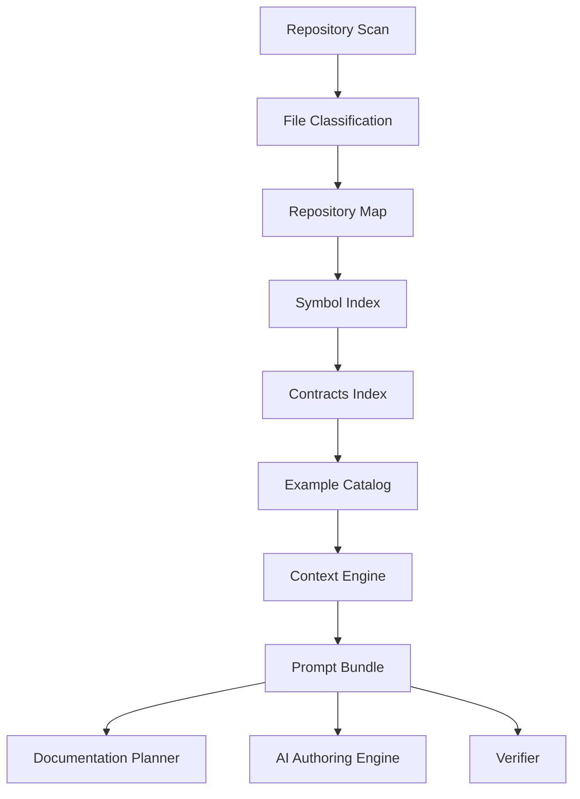
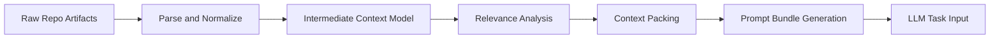
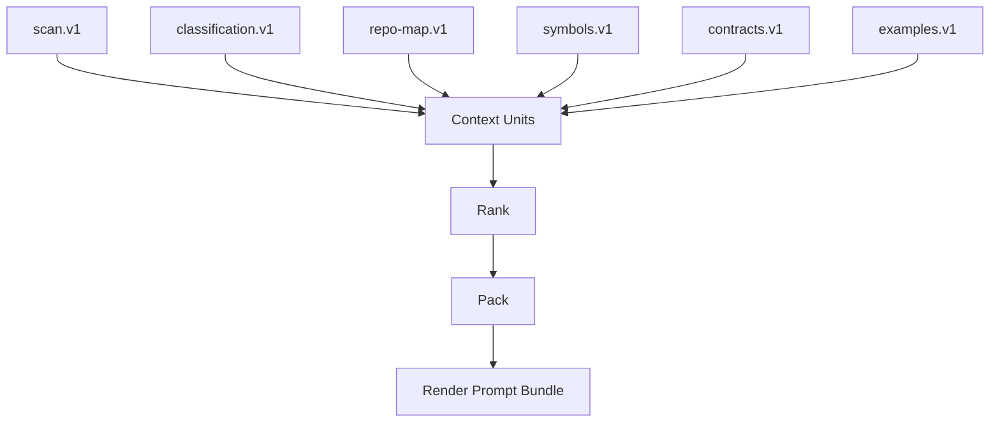
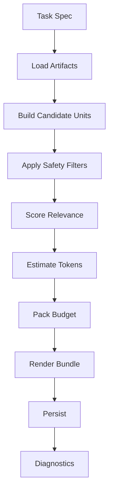

------
title: Build From Scratch: Mintlify-like AI-driven Documentation Generator CLI - Part 011
description: Membangun mental model context engine sebagai compiler, bukan prompt string builder, untuk menghasilkan dokumentasi AI yang deterministic, source-grounded, dan bisa diverifikasi.
series: learn-ai-docs-km-cli
seriesTitle: Build From Scratch: Mintlify-like AI-driven Documentation Generator CLI with Code2Prompt and Open-source Knowledge Management
order: 11
partTitle: Context Engine Mental Model
tags:
- ai-docs
- documentation
- cli
- context-engine
- code2prompt
- prompt-engineering
- source-grounded
- mdx
date: 2026-07-04
---

# Part 011 — Context Engine Mental Model

Kita sudah membangun fondasi repository understanding: scanner, classifier, repository map, symbol extraction, contract discovery, dan example mining. Sekarang kita masuk ke bagian yang membuat sistem ini berbeda dari generator dokumentasi biasa: **context engine**.

Context engine adalah komponen yang mengubah fakta dari repository menjadi **context artifact** yang bisa dipakai oleh LLM untuk menulis dokumentasi. Namun cara berpikirnya tidak boleh seperti ini:

> “Gabungkan semua file jadi satu prompt besar, lalu minta AI menulis docs.”

Itu pendekatan yang rapuh. Ia mahal, lambat, sulit di-debug, rentan hallucination, dan tidak scalable untuk monorepo. Context engine yang baik harus diperlakukan seperti **compiler**.

Ia menerima input terstruktur dari repository, melakukan seleksi, normalisasi, ranking, packing, dan menghasilkan output deterministic yang bisa direview.



Tujuan part ini adalah membangun mental model yang benar sebelum kita mendesain format prompt bundle di Part 012.

---

## 1. Context Engine Bukan Prompt Concatenator

Tool seperti Code2Prompt populer karena memberi workflow praktis: codebase bisa diubah menjadi prompt terstruktur dengan source tree, template prompt, dan token counting. Pendekatan itu berguna sebagai baseline karena ia menunjukkan bahwa LLM sering membutuhkan konteks eksplisit dari repository, bukan hanya instruksi natural language.

Namun untuk sistem production-grade, kita perlu naik satu level.

Context engine kita tidak hanya melakukan:

```txt
read files → concatenate → send to LLM
```

Tetapi melakukan:

```txt
read artifacts → rank relevance → compress safely → preserve provenance → emit context bundle
```

Perbedaannya besar.

| Pendekatan | Cocok untuk | Kelemahan |
|---|---|---|
| Raw concatenation | eksperimen kecil | boros token, noisy, tidak punya provenance granular |
| File selection manual | task ad hoc | sulit direproduksi, bergantung intuisi developer |
| Context compiler | docs generation pipeline | butuh model data dan scoring lebih matang |

Mental model yang kita pakai:

> Context engine adalah compiler dari repository knowledge ke LLM-readable task context.

Artinya, ia punya input formal, intermediate representation, optimization step, dan output artifact.

---

## 2. Analogi Compiler

Sebuah compiler tidak langsung mengubah source text menjadi machine code dalam satu langkah. Ia biasanya melakukan lexical analysis, parsing, semantic analysis, intermediate representation, optimization, dan code generation.

Context engine juga seharusnya begitu.



Mapping-nya:

| Compiler concept | Context engine equivalent |
|---|---|
| Source file | repository artifact |
| AST | symbol/contract/example model |
| Semantic analysis | relation extraction and source-of-truth scoring |
| IR | intermediate context model |
| Optimization | token budgeting and relevance ranking |
| Code generation | prompt bundle generation |
| Debug info | provenance and source ranges |

Kenapa analogi ini penting?

Karena ia memaksa kita untuk berhenti memperlakukan prompt sebagai string biasa. Prompt adalah output dari proses engineering.

---

## 3. Input Context Engine

Context engine tidak membaca repository dari nol. Ia menerima artifact dari stage sebelumnya.

Minimal input:

```txt
.aidocs/
  scans/
    scan.v1.json
  classification/
    classification.v1.json
  maps/
    repo-map.v1.json
  symbols/
    symbols.v1.json
  contracts/
    contracts.v1.json
  examples/
    examples.v1.json
```

Setiap input punya peran berbeda.

| Artifact | Peran dalam context engine |
|---|---|
| `scan.v1.json` | daftar file, hash, size, metadata |
| `classification.v1.json` | menentukan jenis file dan risiko inclusion |
| `repo-map.v1.json` | memberi gambaran struktur repo |
| `symbols.v1.json` | menjelaskan public/programmatic surface |
| `contracts.v1.json` | menjelaskan API/schema/config/event contracts |
| `examples.v1.json` | memberi usage evidence dari test/fixtures |

Context engine tidak boleh hanya memilih file berdasarkan ekstensi. Ia harus memilih berdasarkan **peran file terhadap task dokumentasi**.

Contoh:

| Task | Context yang paling penting |
|---|---|
| Generate quickstart | README, package manifest, install config, examples, minimal entrypoint |
| Generate API reference | OpenAPI spec, handlers, request/response schema, auth config, examples |
| Generate architecture docs | repo map, module graph, dependency graph, deployment config |
| Generate troubleshooting docs | error classes, logs, config, tests covering failure, issue templates |
| Generate CLI docs | command definitions, help text, examples, package metadata |

---

## 4. Output Context Engine

Output context engine bukan final docs. Outputnya adalah **prompt bundle**.

Prompt bundle adalah artifact yang menjawab pertanyaan:

> “Apa saja yang akan dilihat model, dalam urutan apa, untuk menulis atau memverifikasi dokumen tertentu?”

Prompt bundle harus berisi:

1. metadata,
2. task objective,
3. repository summary,
4. selected source tree,
5. selected source excerpts,
6. extracted symbols,
7. extracted contracts,
8. mined examples,
9. constraints,
10. output schema,
11. provenance map,
12. token accounting.

Contoh ringkas:

```json
{
  "schemaVersion": "prompt-bundle.v1",
  "task": {
    "kind": "generate_page",
    "targetPage": "docs/getting-started/quickstart.mdx",
    "audience": "developer integrating this CLI into an existing repository"
  },
  "context": {
    "repoMapRef": "repo-map.v1.json#root",
    "files": [
      {
        "path": "package.json",
        "reason": "installation and command metadata",
        "includeMode": "full"
      },
      {
        "path": "src/commands/init.ts",
        "reason": "quickstart command behavior",
        "includeMode": "excerpt"
      }
    ]
  },
  "budget": {
    "maxInputTokens": 24000,
    "estimatedInputTokens": 18320
  }
}
```

Part 012 akan mendesain format ini secara detail.

---

## 5. Context Sebagai Artifact, Bukan Efek Samping

Kesalahan umum AI tooling: prompt hanya ada di memory runtime. Setelah hasil keluar, kita tidak tahu lagi apa yang dilihat model.

Untuk documentation generator yang harus dipercaya, ini tidak cukup.

Kita harus menyimpan context bundle sebagai artifact:

```txt
.aidocs/context/
  bundles/
    quickstart.prompt-bundle.json
    api-auth.prompt-bundle.json
    architecture-overview.prompt-bundle.json
  rendered/
    quickstart.prompt.md
    api-auth.prompt.md
    architecture-overview.prompt.md
```

Kenapa disimpan?

Karena kita perlu:

- mengaudit claim dokumentasi,
- membandingkan hasil antar model,
- mengulang generation secara deterministic,
- debugging ketika output salah,
- melihat apakah source penting terlewat,
- menjalankan verifier terhadap source yang sama,
- cache untuk mengurangi biaya.

Invariant:

> Tidak boleh ada generated documentation tanpa context bundle yang bisa ditelusuri.

---

## 6. Context Engine Harus Menjawab Tiga Pertanyaan

Setiap kali sistem akan menulis halaman docs, context engine harus menjawab tiga pertanyaan:

1. **Apa yang perlu diketahui model?**
2. **Dari mana fakta itu berasal?**
3. **Apa yang tidak boleh diasumsikan model?**

Banyak prompt gagal karena hanya menjawab pertanyaan pertama.

Contoh prompt buruk:

```txt
Write a quickstart guide for this repository.
```

Prompt lebih baik:

```txt
Write a quickstart guide using only the selected files, package metadata,
CLI command definitions, and examples below. Do not invent flags, commands,
configuration keys, or behavior not present in the sources.
```

Prompt production-grade harus lebih eksplisit lagi:

```txt
Task: Generate docs/getting-started/quickstart.mdx.
Audience: developer using this CLI in an existing TypeScript repository.
Sources: package.json, src/commands/init.ts, src/commands/scan.ts, examples/basic.
Forbidden: do not describe cloud deployment, auth, OpenAPI, or Logseq integration.
Required examples: init command, scan command, generated output path.
Verification: every command flag must appear in command source or manifest.
```

Context engine bertugas menyiapkan semua itu secara sistematis.

---

## 7. Intermediate Context Model

Kita perlu membedakan antara **raw input artifact** dan **prompt-ready text**.

Raw input:

```json
{
  "path": "src/commands/scan.ts",
  "kind": "source_code",
  "language": "typescript",
  "hash": "..."
}
```

Prompt-ready text:

```md
<file path="src/commands/scan.ts" language="typescript" reason="defines scan command behavior">
...
</file>
```

Di antaranya perlu ada intermediate context model:

```ts
export type ContextUnit = {
  id: string;
  kind:
    | "repo_summary"
    | "source_tree"
    | "file_excerpt"
    | "symbol_summary"
    | "contract_summary"
    | "example"
    | "constraint"
    | "output_schema";
  title: string;
  sourceRefs: SourceRef[];
  priority: number;
  estimatedTokens: number;
  content: string;
  includeMode: "full" | "excerpt" | "summary" | "metadata_only";
  rationale: string;
};

export type SourceRef = {
  artifact: string;
  path?: string;
  startLine?: number;
  endLine?: number;
  hash?: string;
};
```

Dengan model ini, context engine bisa di-debug sebelum rendering prompt.



---

## 8. Context Unit

Context unit adalah blok terkecil yang bisa dipilih, diurutkan, diringkas, atau dibuang.

Contoh context units:

| Unit | Contoh |
|---|---|
| repository summary | “This repo is a Node.js CLI package using Commander.” |
| source tree | compressed tree of relevant directories |
| file excerpt | `src/commands/generate.ts` lines 20-140 |
| symbol summary | `GenerateCommand`, `scanRepository`, `writeMdxPage` |
| contract summary | OpenAPI file location and endpoint groups |
| example | test showing `aidocs generate --page quickstart` |
| constraint | “Do not document experimental commands.” |
| output schema | MDX frontmatter + required sections |

Context unit harus punya:

- stable ID,
- source reference,
- priority,
- estimated token cost,
- reason for inclusion,
- include mode,
- risk flags.

Contoh:

```json
{
  "id": "ctx:file:src/commands/generate.ts:excerpt:main-handler",
  "kind": "file_excerpt",
  "title": "generate command handler",
  "sourceRefs": [
    {
      "artifact": "scan.v1.json",
      "path": "src/commands/generate.ts",
      "startLine": 18,
      "endLine": 156,
      "hash": "sha256:..."
    }
  ],
  "priority": 0.91,
  "estimatedTokens": 1820,
  "includeMode": "excerpt",
  "rationale": "Defines command flags and generated page behavior for the target guide.",
  "riskFlags": []
}
```

---

## 9. Task-specific Context

Tidak ada “satu context terbaik” untuk seluruh repo. Context selalu bergantung pada task.

Task object minimal:

```ts
export type ContextTask = {
  kind:
    | "generate_docs_plan"
    | "generate_page"
    | "review_page"
    | "verify_page"
    | "generate_knowledge_notes"
    | "answer_docs_question";
  target?: string;
  audience?: string;
  pageType?:
    | "overview"
    | "quickstart"
    | "concept"
    | "guide"
    | "api_reference"
    | "architecture"
    | "troubleshooting";
  constraints: string[];
  maxInputTokens: number;
};
```

Task memengaruhi semua keputusan context.

Contoh:

```json
{
  "kind": "generate_page",
  "target": "docs/concepts/context-engine.mdx",
  "audience": "maintainer extending the CLI",
  "pageType": "concept",
  "constraints": [
    "Use only repository-backed claims",
    "Include a Mermaid diagram",
    "Do not include deployment instructions"
  ],
  "maxInputTokens": 32000
}
```

Untuk task ini, context engine akan lebih memilih:

- source file context engine,
- context artifact schema,
- tests untuk packing/ranking,
- existing docs concepts,
- architecture notes.

Ia tidak perlu memasukkan:

- OpenAPI playground code,
- unrelated publisher code,
- CI configs kecuali relevan.

---

## 10. Context Pipeline

Pipeline context engine:

```txt
1. Load task
2. Load repository artifacts
3. Build candidate context units
4. Score candidates
5. Apply hard inclusion/exclusion rules
6. Estimate token cost
7. Pack within token budget
8. Render prompt bundle
9. Persist artifact
10. Emit diagnostics
```

Diagram:



Hal penting: safety filter harus berjalan sebelum context dikirim ke model.

---

## 11. Hard Rules vs Soft Ranking

Context selection punya dua jenis keputusan:

1. **Hard rule**: wajib include atau wajib exclude.
2. **Soft ranking**: dipilih berdasarkan skor.

Hard include contoh:

- target source file untuk API page,
- OpenAPI spec untuk API reference,
- package manifest untuk install guide,
- selected page contract,
- output schema.

Hard exclude contoh:

- file berisi secret,
- binary file,
- generated vendor file,
- minified bundle,
- lock file untuk docs generation umum,
- large snapshot test output.

Soft ranking contoh:

- tests yang mereferensikan target symbol,
- examples yang paling sederhana,
- configs yang dekat dengan command,
- README section terkait.

Aturan:

> Hard exclusion selalu menang atas soft ranking.

Jika file tinggi relevance tapi punya secret risk, file itu tidak boleh masuk prompt mentah. Ia harus di-redact atau diwakili metadata saja.

---

## 12. Relevance Tidak Sama Dengan Importance

Sebuah file bisa penting untuk sistem tetapi tidak relevan untuk halaman tertentu.

Contoh:

| File | Importance global | Relevance untuk quickstart |
|---|---:|---:|
| `src/core/planner.ts` | tinggi | sedang |
| `src/commands/init.ts` | tinggi | tinggi |
| `src/security/redactor.ts` | tinggi | rendah |
| `README.md` | sedang | tinggi |
| `docs/architecture/security.mdx` | sedang | rendah |

Context engine harus membedakan:

- **global importance**: seberapa sentral file terhadap repo,
- **task relevance**: seberapa berguna file untuk target output,
- **source authority**: seberapa bisa dipercaya sebagai sumber fakta,
- **prompt cost**: berapa mahal file dimasukkan.

Formula sederhana:

```txt
context_score =
  task_relevance * 0.45 +
  source_authority * 0.25 +
  example_value * 0.15 +
  recency_signal * 0.05 -
  token_cost_penalty * 0.10
```

Formula ini bukan dogma. Ini starting point yang bisa diuji.

---

## 13. Source Authority

Tidak semua sumber punya bobot yang sama.

Hierarchy umum:

```txt
1. Contract files: OpenAPI, schema, config manifest
2. Runtime source code
3. Tests and examples
4. Existing docs
5. Comments
6. Issue templates / changelogs
7. Commit messages
```

Namun hierarchy bisa berubah tergantung jenis docs.

Untuk API reference:

```txt
OpenAPI spec > server handlers > tests > docs
```

Untuk architecture docs:

```txt
runtime source > deployment config > module graph > ADRs > README
```

Untuk troubleshooting docs:

```txt
error classes > logs/test failures > config > runbooks > README
```

Context engine harus menyimpan `sourceAuthority` agar LLM bisa diarahkan:

```json
{
  "path": "openapi.yaml",
  "sourceAuthority": "contract",
  "authorityScore": 0.95,
  "rationale": "Defines public API contract used for endpoint reference generation."
}
```

---

## 14. Context Compression

Context window besar bukan alasan untuk memasukkan semuanya. Long context sering membuat model kehilangan fokus, menaikkan biaya, dan menambah noise.

Context compression punya beberapa bentuk:

| Compression type | Contoh |
|---|---|
| tree compression | hanya tampilkan subtree relevan |
| file excerpting | hanya lines sekitar symbol penting |
| symbol summarization | ringkas function/class signature |
| contract summarization | endpoint table, bukan seluruh YAML |
| example distillation | test kompleks menjadi runnable snippet |
| duplicate removal | hilangkan repeated generated code |

Kuncinya: compression tidak boleh menghilangkan fakta yang dibutuhkan verifier.

Contoh file excerpt:

```md
<file path="src/commands/init.ts" lines="12-86" reason="defines init command options">
```ts
export const initCommand = new Command("init")
  .option("--docs-dir <path>", "Directory for generated docs")
  .option("--km <target>", "Knowledge management sink")
```
</file>
```

Model tidak perlu seluruh file jika hanya flags yang relevan.

---

## 15. Prompt Cache Awareness

Provider LLM modern dapat memiliki mekanisme prompt caching yang mengurangi latency dan/atau biaya untuk prefix prompt yang berulang. OpenAI misalnya mendokumentasikan prompt caching sebagai fitur otomatis untuk request API tertentu, dengan potensi pengurangan latency dan biaya input token.

Context engine bisa dirancang agar cache-friendly.

Prinsipnya:

1. Letakkan bagian statis di awal prompt.
2. Letakkan bagian dinamis di akhir prompt.
3. Jangan mengacak urutan context unit tanpa alasan.
4. Gunakan stable formatting.
5. Pisahkan template instructions dari task-specific source excerpts.

Prompt layout cache-friendly:

```txt
[Stable system/developer instructions]
[Stable output rules]
[Stable documentation style guide]
[Stable schema definitions]
[Repository summary]
[Task-specific selected files]
[Task-specific constraints]
[Final instruction]
```

Namun jangan optimasi caching sampai mengorbankan correctness. Cache optimization adalah concern sekunder setelah source grounding.

---

## 16. Provenance sebagai Debug Info

Sama seperti compiler bisa menghasilkan debug symbols, context engine harus menghasilkan provenance.

Provenance menjawab:

- unit ini berasal dari file mana,
- line berapa,
- hash apa,
- artifact mana,
- kenapa dipilih,
- apakah di-redact,
- apakah diringkas.

Contoh:

```json
{
  "contextUnitId": "ctx:example:quickstart:init-basic",
  "sourceRefs": [
    {
      "artifact": "examples.v1.json",
      "path": "tests/cli/init.test.ts",
      "startLine": 31,
      "endLine": 52,
      "hash": "sha256:..."
    }
  ],
  "transformations": [
    "test_to_docs_example",
    "redact_temp_path",
    "normalize_prompt"
  ]
}
```

Nanti ketika generated docs berisi command tertentu, verifier bisa menelusuri apakah command itu memang ada dalam context/source.

---

## 17. Context Diagnostics

CLI harus bisa menjelaskan context decision.

Command:

```bash
aidocs context explain docs/getting-started/quickstart.mdx
```

Output:

```txt
Context bundle: quickstart.prompt-bundle.json
Estimated tokens: 18,320 / 24,000

Included:
  ✓ package.json
    reason: package metadata and CLI binary name
    mode: full
    tokens: 420

  ✓ src/commands/init.ts
    reason: init command flags and output behavior
    mode: excerpt lines 12-86
    tokens: 1,240

  ✓ tests/cli/init.test.ts
    reason: runnable usage examples
    mode: distilled example
    tokens: 860

Excluded:
  ✗ pnpm-lock.yaml
    reason: lockfile not relevant to quickstart

  ✗ dist/index.js
    reason: generated build artifact

Warnings:
  ! README.md mentions --force flag but no matching command source found
```

Diagnostics adalah bagian dari UX trust.

Jika developer tidak bisa memahami kenapa model melihat context tertentu, ia tidak akan percaya hasil docs.

---

## 18. Context Engine Failure Modes

Mari buat daftar failure mode sejak awal.

### Failure 1: Missing Critical Source

Context tidak menyertakan file yang menentukan behavior utama.

Gejala:

- docs salah menjelaskan command,
- API example tidak valid,
- flag hilang,
- config key salah.

Mitigasi:

- hard include untuk target contract,
- relevance tests,
- verifier claim-to-source,
- diagnostics.

### Failure 2: Context Overload

Prompt terlalu besar dan noisy.

Gejala:

- docs jadi generik,
- model mengambil detail dari file tidak relevan,
- output tidak fokus.

Mitigasi:

- budget-aware packing,
- ranking,
- compression,
- task-specific context.

### Failure 3: Source Authority Inversion

Model lebih percaya README lama daripada source code terbaru.

Mitigasi:

- source authority tags,
- conflict detection,
- explicit instruction hierarchy.

### Failure 4: Secret Leakage

File sensitif masuk prompt.

Mitigasi:

- secret scan sebelum prompt rendering,
- redaction,
- hard exclude,
- audit log.

### Failure 5: Non-deterministic Context

Context berubah karena urutan filesystem, timestamp, atau randomness.

Mitigasi:

- stable sorting,
- content hash,
- deterministic scoring,
- stored bundle.

### Failure 6: Compression Removes Semantics

Ringkasan menghilangkan nuance penting.

Mitigasi:

- preserve source excerpts untuk high-authority facts,
- mark summaries as lower authority,
- include line references.

---

## 19. Context Engine Contract

Sebelum implementasi, kita definisikan contract.

```ts
export interface ContextEngine {
  buildBundle(input: BuildContextBundleInput): Promise<PromptBundle>;
  explain(bundleId: string): Promise<ContextExplanation>;
  render(bundle: PromptBundle, format: "markdown" | "json"): Promise<string>;
}

export type BuildContextBundleInput = {
  repoRoot: string;
  task: ContextTask;
  artifacts: {
    scan: string;
    classification: string;
    repoMap: string;
    symbols?: string;
    contracts?: string;
    examples?: string;
  };
  options: {
    maxInputTokens: number;
    allowSummaries: boolean;
    allowRedactedContent: boolean;
    deterministic: boolean;
  };
};
```

Output:

```ts
export type PromptBundle = {
  schemaVersion: "prompt-bundle.v1";
  id: string;
  createdAt: string;
  repo: RepoIdentity;
  task: ContextTask;
  units: ContextUnit[];
  budget: TokenBudget;
  diagnostics: ContextDiagnostic[];
  provenance: ProvenanceEntry[];
};
```

Important invariant:

> `PromptBundle` harus bisa dirender ulang tanpa membaca ulang repository, selama source excerpts sudah disimpan atau direferensikan dengan hash yang valid.

---

## 20. Practical Example: Quickstart Page

Misalkan repo memiliki struktur:

```txt
repo/
  package.json
  README.md
  src/
    cli.ts
    commands/
      init.ts
      scan.ts
      generate.ts
  tests/
    cli/
      init.test.ts
      generate.test.ts
  examples/
    basic/
      package.json
      src/index.ts
```

Task:

```json
{
  "kind": "generate_page",
  "target": "docs/getting-started/quickstart.mdx",
  "pageType": "quickstart",
  "audience": "developer installing and running the CLI locally",
  "maxInputTokens": 24000
}
```

Candidate context units:

| Unit | Priority | Mode |
|---|---:|---|
| package manifest | 0.95 | full |
| CLI entrypoint | 0.90 | excerpt |
| init command | 0.92 | excerpt |
| scan command | 0.88 | excerpt |
| generate command | 0.86 | excerpt |
| basic example | 0.84 | full |
| init test | 0.81 | distilled |
| generate test | 0.76 | distilled |
| README | 0.65 | excerpt |
| internal planner code | 0.40 | summary |

Packed prompt output:

```txt
[task]
Generate docs/getting-started/quickstart.mdx.

[repo-summary]
This repository implements a developer-facing CLI named aidocs...

[source-tree]
...

[package-manifest]
...

[command:init]
...

[command:scan]
...

[command:generate]
...

[examples]
...

[constraints]
Do not invent command flags.
Do not describe cloud publishing.
Do not mention APIs unless present in source.

[output]
Return valid MDX with the required frontmatter.
```

---

## 21. Minimal Implementation Plan

Untuk implementasi awal, jangan langsung membuat embedding/RAG kompleks. Mulai dari deterministic context engine.

Tahap 1:

- load artifacts,
- build context units,
- rank with rules,
- estimate tokens roughly,
- pack under budget,
- render Markdown prompt,
- write bundle JSON.

Tahap 2:

- add exact tokenizer per provider,
- add source excerpts,
- add diagnostics,
- add verifier integration.

Tahap 3:

- add semantic retrieval,
- add prompt caching optimization,
- add multi-page context planning,
- add knowledge graph enrichment.

Jangan mulai dari vector database. Untuk docs generation dari repo, deterministic source selection biasanya lebih penting daripada semantic search di awal.

---

## 22. Testing the Context Engine

Testing context engine harus memeriksa keputusan, bukan hanya snapshot string.

Test categories:

### 22.1 Golden Context Test

Input repo fixture → expected included files.

```ts
it("includes CLI command source for quickstart generation", async () => {
  const bundle = await contextEngine.buildBundle({
    repoRoot: fixture("cli-basic"),
    task: quickstartTask,
    options: { maxInputTokens: 12000 }
  });

  expect(bundle.units.map(u => u.id)).toContain("ctx:file:package.json");
  expect(bundle.units.map(u => u.id)).toContain("ctx:file:src/commands/init.ts");
});
```

### 22.2 Exclusion Test

```ts
it("excludes generated dist files", async () => {
  const bundle = await contextEngine.buildBundle(...);
  expect(bundle.units.some(u => u.sourceRefs.some(r => r.path?.startsWith("dist/"))))
    .toBe(false);
});
```

### 22.3 Budget Test

```ts
it("does not exceed token budget", async () => {
  const bundle = await contextEngine.buildBundle({
    options: { maxInputTokens: 8000 }
  });

  expect(bundle.budget.estimatedInputTokens).toBeLessThanOrEqual(8000);
});
```

### 22.4 Determinism Test

```ts
it("is deterministic for unchanged repository", async () => {
  const first = await contextEngine.buildBundle(input);
  const second = await contextEngine.buildBundle(input);

  expect(stripRuntimeFields(first)).toEqual(stripRuntimeFields(second));
});
```

---

## 23. CLI Commands for Context Engine

Command surface:

```bash
aidocs context build --page docs/getting-started/quickstart.mdx
```

```bash
aidocs context render --bundle .aidocs/context/bundles/quickstart.prompt-bundle.json
```

```bash
aidocs context explain --bundle .aidocs/context/bundles/quickstart.prompt-bundle.json
```

```bash
aidocs context diff --left old.prompt-bundle.json --right new.prompt-bundle.json
```

`context diff` penting untuk PR review.

Output contoh:

```diff
+ included src/commands/publish.ts
  reason: quickstart now references publish command

- excluded src/commands/legacy-generate.ts
  reason: command marked deprecated

~ package.json hash changed
  old: sha256:abc
  new: sha256:def
```

---

## 24. Design Invariants

Context engine harus menjaga invariant berikut:

1. **No hidden context**: semua yang dikirim ke model harus bisa dilihat.
2. **No untracked source**: setiap source punya path/hash/provenance.
3. **No unsafe inclusion**: secrets dan sensitive files tidak boleh lolos.
4. **No random ordering**: urutan context deterministic.
5. **No unlimited prompt**: semua bundle punya budget.
6. **No authority ambiguity**: source authority harus jelas.
7. **No generated claim without source**: claim docs harus bisa diverifikasi.
8. **No manual-edit overwrite without review**: context generation tidak boleh otomatis menghancurkan human docs.

Jika satu invariant dilanggar, sistem mungkin masih berjalan, tetapi trust-nya rusak.

---

## 25. Kesimpulan

Context engine adalah pusat dari AI-driven documentation generator.

Ia bukan fitur kecil. Ia adalah lapisan yang menentukan apakah output AI:

- grounded atau hallucinated,
- reproducible atau random,
- auditable atau opaque,
- murah atau boros,
- usable atau noisy.

Mental model paling penting:

> Treat context as a compiled artifact.

Jangan berpikir “prompt string”. Pikirkan:

```txt
repository artifacts → context units → ranked bundle → rendered prompt → generated docs → verified claims
```

Di part berikutnya, kita akan mendesain **Prompt Bundle Format** secara detail: schema, section layout, metadata, token accounting, source references, render format, dan bagaimana artifact ini menjadi jembatan antara repo understanding engine dan AI authoring engine.

---

## References

- Code2Prompt describes itself as a CLI tool for turning a codebase into a single LLM prompt with source tree, prompt templating, and token counting: https://github.com/mufeedvh/code2prompt
- Code2Prompt website describes structured prompts, Rust implementation, and Handlebars-powered templates: https://code2prompt.dev/
- OpenAI documents prompt caching as a mechanism that can reduce latency and input token costs for repeated prompt prefixes: https://developers.openai.com/api/docs/guides/prompt-caching
- Mintlify documents `docs.json` as the configuration file for documentation site settings and navigation: https://www.mintlify.com/docs/organize/settings
