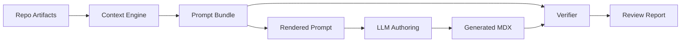

------
title: Build From Scratch: Mintlify-like AI-driven Documentation Generator CLI - Part 012
description: Mendesain prompt bundle format sebagai artifact production-grade untuk AI documentation generation, lengkap dengan metadata, context units, token accounting, provenance, constraints, dan render strategy.
series: learn-ai-docs-km-cli
seriesTitle: Build From Scratch: Mintlify-like AI-driven Documentation Generator CLI with Code2Prompt and Open-source Knowledge Management
order: 12
partTitle: Prompt Bundle Format
tags:
- ai-docs
- documentation
- cli
- prompt-bundle
- context-engine
- code2prompt
- mdx
- source-grounded
date: 2026-07-04
---

# Part 012 — Prompt Bundle Format

Di Part 011 kita membangun mental model bahwa context engine adalah compiler. Sekarang kita perlu mendesain output compilernya: **prompt bundle**.

Prompt bundle adalah artifact yang menjembatani repository understanding engine dan AI authoring engine.

Ia bukan hanya prompt final. Ia adalah struktur lengkap yang menjawab:

- model diminta melakukan apa,
- sumber apa yang diberikan,
- kenapa sumber itu dipilih,
- bagaimana sumber itu boleh digunakan,
- apa output yang wajib dihasilkan,
- batas token berapa,
- bagian mana yang bisa diverifikasi,
- claim apa yang tidak boleh dibuat.

Kalau context engine adalah compiler, maka prompt bundle adalah kombinasi antara:

- intermediate representation,
- build artifact,
- debug info,
- execution input,
- audit record.

---

## 1. Kenapa Prompt Bundle Perlu Format Formal

Banyak AI tooling gagal karena prompt diperlakukan sebagai string yang tumbuh organik.

Awalnya sederhana:

```txt
Write documentation for this project.
```

Lalu ditambah:

```txt
Use this README.
```

Lalu ditambah lagi:

```txt
Do not hallucinate.
```

Lalu ditempel source tree, beberapa file, schema output, instruksi gaya, dan constraints. Dalam beberapa minggu, prompt menjadi monolit yang sulit diubah tanpa memecahkan behavior lain.

Prompt bundle mencegah ini dengan memisahkan concern:

| Concern | Diwakili oleh |
|---|---|
| task | `task` |
| repository identity | `repo` |
| selected context | `units` |
| output rules | `outputContract` |
| safety rules | `constraints` and `riskPolicy` |
| token budget | `budget` |
| provenance | `provenance` |
| diagnostics | `diagnostics` |
| render target | `rendering` |

Dengan format formal, prompt menjadi artifact yang bisa:

- disimpan,
- di-diff,
- di-cache,
- di-review,
- di-render ulang,
- di-test,
- dihubungkan ke verifier.

---

## 2. Prompt Bundle Design Goals

Format prompt bundle harus memenuhi beberapa design goals.

### 2.1 Deterministic

Jika repository dan task tidak berubah, bundle tidak boleh berubah secara semantik.

Ini berarti:

- urutan unit stabil,
- timestamp runtime dipisahkan dari hash content,
- ID stabil,
- formatting konsisten,
- random sampling tidak dipakai kecuali explicit.

### 2.2 Auditable

Developer harus bisa melihat:

- file apa yang dimasukkan,
- file apa yang dikeluarkan,
- kenapa,
- line mana yang digunakan,
- apakah ada redaction,
- apakah ada warning.

### 2.3 Source-grounded

Setiap context unit harus punya source reference atau dinyatakan sebagai generated instruction.

### 2.4 Budget-aware

Prompt bundle harus tahu estimasi token, bukan baru gagal saat request ke provider.

### 2.5 Renderable

Bundle harus bisa dirender menjadi format provider-specific prompt.

### 2.6 Verifier-friendly

Bundle harus menyimpan provenance sehingga verifier bisa memeriksa generated docs terhadap source.

### 2.7 Cache-friendly

Bagian statis dan dinamis harus bisa dipisahkan agar provider prompt caching atau local cache bekerja lebih efektif.

---

## 3. High-level Schema

Kita mulai dengan schema high-level.

```ts
export type PromptBundle = {
  schemaVersion: "prompt-bundle.v1";
  id: string;
  contentHash: string;

  repo: RepoIdentity;
  task: PromptTask;

  rendering: RenderingProfile;
  budget: TokenBudget;

  instructionBlocks: InstructionBlock[];
  units: ContextUnit[];

  outputContract: OutputContract;
  constraints: Constraint[];
  riskPolicy: RiskPolicy;

  provenance: ProvenanceEntry[];
  diagnostics: Diagnostic[];
};
```

In JSON:

```json
{
  "schemaVersion": "prompt-bundle.v1",
  "id": "pb:repo-main:docs-getting-started-quickstart",
  "contentHash": "sha256:...",
  "repo": {},
  "task": {},
  "rendering": {},
  "budget": {},
  "instructionBlocks": [],
  "units": [],
  "outputContract": {},
  "constraints": [],
  "riskPolicy": {},
  "provenance": [],
  "diagnostics": []
}
```

Ini terlihat panjang, tetapi setiap bagian punya tugas jelas.

---

## 4. Repository Identity

Prompt bundle harus tahu repository mana yang menjadi sumber.

```ts
export type RepoIdentity = {
  rootName: string;
  rootPath?: string;
  vcs?: {
    type: "git";
    branch?: string;
    commit?: string;
    dirty?: boolean;
    remoteUrlHash?: string;
  };
  workspace?: {
    kind: "single" | "monorepo";
    packageName?: string;
    packagePath?: string;
  };
  scanRefs: {
    scan: ArtifactRef;
    classification: ArtifactRef;
    repoMap: ArtifactRef;
    symbols?: ArtifactRef;
    contracts?: ArtifactRef;
    examples?: ArtifactRef;
  };
};

export type ArtifactRef = {
  path: string;
  hash: string;
  schemaVersion: string;
};
```

Contoh:

```json
{
  "rootName": "aidocs-cli",
  "vcs": {
    "type": "git",
    "branch": "main",
    "commit": "91f3a2c",
    "dirty": false,
    "remoteUrlHash": "sha256:..."
  },
  "workspace": {
    "kind": "single",
    "packageName": "@acme/aidocs",
    "packagePath": "."
  },
  "scanRefs": {
    "scan": {
      "path": ".aidocs/scans/scan.v1.json",
      "hash": "sha256:...",
      "schemaVersion": "scan.v1"
    }
  }
}
```

Kenapa `remoteUrlHash`, bukan raw remote URL?

Karena remote URL bisa mengandung organisasi/private project information. Untuk audit internal raw URL mungkin boleh, tetapi default artifact sebaiknya minimal dan privacy-aware.

---

## 5. Prompt Task

Task menjelaskan pekerjaan yang akan dilakukan LLM.

```ts
export type PromptTask = {
  kind:
    | "generate_docs_plan"
    | "generate_page"
    | "rewrite_page"
    | "review_page"
    | "verify_page"
    | "generate_km_notes"
    | "summarize_repository";

  target?: {
    path?: string;
    title?: string;
    pageType?: PageType;
  };

  audience: string;
  intent: string;
  successCriteria: string[];
  forbiddenOutcomes: string[];
};

export type PageType =
  | "overview"
  | "quickstart"
  | "installation"
  | "concept"
  | "guide"
  | "api_reference"
  | "architecture"
  | "troubleshooting"
  | "runbook"
  | "migration";
```

Contoh:

```json
{
  "kind": "generate_page",
  "target": {
    "path": "docs/getting-started/quickstart.mdx",
    "title": "Quickstart",
    "pageType": "quickstart"
  },
  "audience": "developer installing and running the CLI locally in an existing repository",
  "intent": "Produce a followable quickstart guide grounded in package metadata, command source, and examples.",
  "successCriteria": [
    "Explains installation path supported by the repository",
    "Shows the first three commands a user should run",
    "Uses only command flags found in source or manifest",
    "Includes expected generated files"
  ],
  "forbiddenOutcomes": [
    "Invented command flags",
    "Cloud deployment instructions",
    "Unverified API integrations",
    "Claims about Logseq or OpenNote unless supported by source"
  ]
}
```

Task harus eksplisit karena “write docs” terlalu lebar.

---

## 6. Rendering Profile

Prompt bundle bisa dirender ke berbagai bentuk:

- Markdown prompt untuk debugging,
- chat messages untuk provider API,
- JSON payload untuk internal agent,
- split prompt untuk cache-friendly provider.

```ts
export type RenderingProfile = {
  format: "markdown" | "chat_messages" | "json";
  provider?: "openai" | "anthropic" | "local" | "generic";
  modelHint?: string;
  layout: "single_prompt" | "system_user_split" | "cache_friendly_split";
  includeDebugMarkers: boolean;
  includeProvenanceInline: boolean;
};
```

Contoh:

```json
{
  "format": "chat_messages",
  "provider": "openai",
  "modelHint": "large-context-reasoning-model",
  "layout": "cache_friendly_split",
  "includeDebugMarkers": true,
  "includeProvenanceInline": true
}
```

Pemisahan ini penting agar format bundle tidak terkunci ke satu provider.

---

## 7. Token Budget

Token budget tidak boleh menjadi afterthought.

```ts
export type TokenBudget = {
  maxInputTokens: number;
  reservedOutputTokens: number;
  estimatedInputTokens: number;
  estimator: {
    kind: "rough_chars" | "provider_tokenizer";
    provider?: string;
    model?: string;
    version?: string;
  };
  breakdown: TokenBudgetBreakdown[];
  overflowPolicy: "fail" | "summarize" | "drop_low_priority";
};

export type TokenBudgetBreakdown = {
  section: string;
  estimatedTokens: number;
};
```

Contoh:

```json
{
  "maxInputTokens": 24000,
  "reservedOutputTokens": 4000,
  "estimatedInputTokens": 18320,
  "estimator": {
    "kind": "rough_chars",
    "version": "chars_div_4"
  },
  "breakdown": [
    { "section": "instructions", "estimatedTokens": 2200 },
    { "section": "repo_summary", "estimatedTokens": 780 },
    { "section": "source_tree", "estimatedTokens": 960 },
    { "section": "files", "estimatedTokens": 10800 },
    { "section": "examples", "estimatedTokens": 2200 },
    { "section": "output_contract", "estimatedTokens": 1380 }
  ],
  "overflowPolicy": "summarize"
}
```

Untuk versi awal, estimasi `characters / 4` cukup untuk guardrail kasar. Untuk production, gunakan tokenizer provider atau library tokenization yang kompatibel dengan model target.

---

## 8. Instruction Blocks

Instruction blocks berisi instruksi stabil yang tidak berasal dari repository.

```ts
export type InstructionBlock = {
  id: string;
  role: "system" | "developer" | "task";
  stability: "stable" | "task_specific";
  title: string;
  content: string;
  priority: number;
};
```

Contoh:

```json
{
  "id": "inst:source-grounding",
  "role": "developer",
  "stability": "stable",
  "title": "Source Grounding Rules",
  "priority": 1.0,
  "content": "Use only the provided source context. Do not invent commands, flags, APIs, configuration keys, file paths, runtime behavior, or dependency relationships."
}
```

Instruction blocks yang stabil bisa diletakkan di awal prompt agar cache-friendly.

Kategori instruction blocks:

| Block | Tujuan |
|---|---|
| role definition | menjelaskan model sebagai docs engineer |
| source grounding | melarang hallucinated claims |
| writing style | gaya penulisan docs |
| output schema | format yang harus dipatuhi |
| safety | secret/privacy constraints |
| verification hints | cara menghasilkan output yang mudah diverifikasi |

---

## 9. Context Units

Context unit adalah isi utama bundle.

```ts
export type ContextUnit = {
  id: string;
  kind: ContextUnitKind;
  title: string;
  content: string;

  sourceRefs: SourceRef[];
  authority: SourceAuthority;
  priority: number;

  includeMode: "full" | "excerpt" | "summary" | "metadata_only";
  estimatedTokens: number;
  rationale: string;

  transformations: Transformation[];
  riskFlags: RiskFlag[];
};

export type ContextUnitKind =
  | "repository_summary"
  | "source_tree"
  | "file_content"
  | "file_excerpt"
  | "symbol_summary"
  | "contract_summary"
  | "example"
  | "existing_docs"
  | "knowledge_note"
  | "constraint"
  | "glossary";
```

Contoh file excerpt:

```json
{
  "id": "ctx:file:src/commands/init.ts:main",
  "kind": "file_excerpt",
  "title": "init command definition",
  "content": "export const initCommand = new Command('init')...",
  "sourceRefs": [
    {
      "artifact": "scan.v1.json",
      "path": "src/commands/init.ts",
      "startLine": 12,
      "endLine": 88,
      "hash": "sha256:..."
    }
  ],
  "authority": {
    "kind": "runtime_source",
    "score": 0.9
  },
  "priority": 0.94,
  "includeMode": "excerpt",
  "estimatedTokens": 1240,
  "rationale": "Defines init command flags used by the quickstart page.",
  "transformations": [
    {
      "kind": "excerpt",
      "description": "Selected lines around exported command definition."
    }
  ],
  "riskFlags": []
}
```

---

## 10. Source References

Source references harus cukup detail untuk audit.

```ts
export type SourceRef = {
  artifact: string;
  artifactHash?: string;
  path?: string;
  startLine?: number;
  endLine?: number;
  symbolId?: string;
  contractId?: string;
  exampleId?: string;
  contentHash?: string;
};
```

Contoh:

```json
{
  "artifact": ".aidocs/symbols/symbols.v1.json",
  "artifactHash": "sha256:...",
  "path": "src/commands/generate.ts",
  "startLine": 21,
  "endLine": 119,
  "symbolId": "ts:function:src/commands/generate.ts#registerGenerateCommand",
  "contentHash": "sha256:..."
}
```

Line number membantu human review. Hash membantu reproducibility. Symbol ID membantu verifier.

---

## 11. Source Authority

Authority menjelaskan tingkat kepercayaan context unit.

```ts
export type SourceAuthority = {
  kind:
    | "contract"
    | "runtime_source"
    | "test"
    | "example"
    | "generated_summary"
    | "existing_docs"
    | "comment"
    | "knowledge_note";
  score: number;
  notes?: string;
};
```

Contoh:

```json
{
  "kind": "contract",
  "score": 0.95,
  "notes": "OpenAPI document is treated as public API source of truth."
}
```

Prompt renderer bisa memakai authority untuk memberi instruksi:

```txt
When sources conflict, prefer contract and runtime_source units over existing_docs units.
```

---

## 12. Transformations

Context unit bisa berasal dari source yang ditransformasi.

```ts
export type Transformation = {
  kind:
    | "none"
    | "excerpt"
    | "summary"
    | "redaction"
    | "test_to_example"
    | "tree_compression"
    | "deduplication";
  description: string;
  inputHash?: string;
  outputHash?: string;
};
```

Transformasi harus dicatat karena memengaruhi authority.

Contoh:

```json
{
  "kind": "test_to_example",
  "description": "Converted integration test setup into a simplified documentation example, preserving command and expected output.",
  "inputHash": "sha256:...",
  "outputHash": "sha256:..."
}
```

Rule:

> Summary dan transformed examples tidak boleh dianggap setara dengan raw contract/source.

---

## 13. Risk Flags

Risk flags membantu mencegah context yang tidak aman.

```ts
export type RiskFlag =
  | "possible_secret"
  | "possible_pii"
  | "large_file"
  | "generated_file"
  | "low_confidence_parse"
  | "stale_existing_docs"
  | "source_conflict"
  | "redacted";
```

Contoh:

```json
{
  "riskFlags": ["redacted", "possible_secret"],
  "includeMode": "metadata_only",
  "rationale": "File appears relevant but contains possible credentials. Raw content was excluded."
}
```

Risk flag bukan hanya internal. Ia harus muncul di diagnostics agar developer tahu kenapa output kurang lengkap.

---

## 14. Output Contract

Output contract menentukan bentuk jawaban model.

```ts
export type OutputContract = {
  format: "mdx" | "json" | "markdown";
  targetPath?: string;
  frontmatter?: FrontmatterContract;
  requiredSections: SectionContract[];
  forbiddenSections: string[];
  linkPolicy: LinkPolicy;
  codeBlockPolicy: CodeBlockPolicy;
  diagramPolicy: DiagramPolicy;
};
```

Contoh untuk MDX page:

```json
{
  "format": "mdx",
  "targetPath": "docs/getting-started/quickstart.mdx",
  "frontmatter": {
    "required": ["title", "description"],
    "seriesFields": false
  },
  "requiredSections": [
    {
      "heading": "What you will build",
      "purpose": "Set user expectation before commands."
    },
    {
      "heading": "Install",
      "purpose": "Show repository-supported installation path."
    },
    {
      "heading": "Run your first scan",
      "purpose": "Show the first CLI command and expected output."
    },
    {
      "heading": "Generate docs",
      "purpose": "Show generation command and output path."
    }
  ],
  "forbiddenSections": ["Cloud deployment", "Enterprise SSO"],
  "linkPolicy": {
    "allowExternalLinks": false,
    "allowUnverifiedInternalLinks": false
  },
  "codeBlockPolicy": {
    "requireLanguageTags": true,
    "allowPseudoCode": false
  },
  "diagramPolicy": {
    "allowMermaid": true,
    "requireSourceBackedNodes": true
  }
}
```

Output contract membuat model menulis dalam pagar yang jelas.

---

## 15. Constraints

Constraints adalah aturan yang berlaku pada task.

```ts
export type Constraint = {
  id: string;
  severity: "must" | "should" | "must_not";
  category:
    | "source_grounding"
    | "style"
    | "security"
    | "format"
    | "scope"
    | "verification";
  statement: string;
  rationale?: string;
};
```

Contoh:

```json
[
  {
    "id": "c:no-invented-flags",
    "severity": "must_not",
    "category": "source_grounding",
    "statement": "Do not mention command flags unless they appear in command source, package manifest, or extracted examples.",
    "rationale": "CLI documentation becomes dangerous when flags are invented."
  },
  {
    "id": "c:mdx-only",
    "severity": "must",
    "category": "format",
    "statement": "Return only valid MDX content for the target page."
  }
]
```

Jangan membuat constraint terlalu banyak. Constraint yang terlalu panjang akan menurunkan clarity. Lebih baik 10 aturan tajam daripada 60 aturan generik.

---

## 16. Risk Policy

Risk policy menjelaskan bagaimana context engine memperlakukan data sensitif.

```ts
export type RiskPolicy = {
  secretHandling: "exclude" | "redact" | "allow_with_warning";
  piiHandling: "exclude" | "redact" | "allow_with_warning";
  proprietaryCodeHandling: "local_only" | "provider_allowed";
  allowBinaryContent: false;
  allowGeneratedFiles: boolean;
  redactionMarkers: boolean;
};
```

Default production-safe:

```json
{
  "secretHandling": "redact",
  "piiHandling": "redact",
  "proprietaryCodeHandling": "local_only",
  "allowBinaryContent": false,
  "allowGeneratedFiles": false,
  "redactionMarkers": true
}
```

Untuk OSS repo, policy bisa lebih longgar. Untuk enterprise repo, policy harus ketat.

---

## 17. Provenance Entries

Provenance entries menghubungkan context unit dengan artifact asal dan transformasi.

```ts
export type ProvenanceEntry = {
  contextUnitId: string;
  sourceRefs: SourceRef[];
  transformations: Transformation[];
  includedBecause: string[];
  excludedAlternatives?: ExcludedAlternative[];
};

export type ExcludedAlternative = {
  path: string;
  reason: string;
  score?: number;
};
```

Contoh:

```json
{
  "contextUnitId": "ctx:file:src/commands/init.ts:main",
  "sourceRefs": [
    {
      "artifact": ".aidocs/scans/scan.v1.json",
      "path": "src/commands/init.ts",
      "startLine": 12,
      "endLine": 88,
      "contentHash": "sha256:..."
    }
  ],
  "transformations": [
    {
      "kind": "excerpt",
      "description": "Selected command definition and option declarations."
    }
  ],
  "includedBecause": [
    "target page is quickstart",
    "file defines init command",
    "init command appears in package CLI workflow"
  ],
  "excludedAlternatives": [
    {
      "path": "dist/commands/init.js",
      "reason": "generated build output",
      "score": 0.61
    }
  ]
}
```

Provenance membuat bundle bisa dijelaskan.

---

## 18. Diagnostics

Diagnostics memberi warning dan error.

```ts
export type Diagnostic = {
  level: "info" | "warning" | "error";
  code: string;
  message: string;
  relatedPaths?: string[];
  recommendation?: string;
};
```

Contoh:

```json
{
  "level": "warning",
  "code": "CONTEXT_CONFLICT_README_FLAG",
  "message": "README mentions --force but no matching command flag was found in extracted command definitions.",
  "relatedPaths": ["README.md", "src/commands/init.ts"],
  "recommendation": "Verify whether README is stale or command extraction missed dynamic flag registration."
}
```

Diagnostics tidak boleh diabaikan. Ia akan dipakai oleh:

- CLI output,
- PR comments,
- verifier,
- human review.

---

## 19. Rendered Markdown Prompt Layout

Bundle JSON bagus untuk machine. Tetapi developer perlu melihat prompt dalam bentuk Markdown.

Layout yang direkomendasikan:

```md
# AI Documentation Generation Task

## Task
...

## Source Grounding Rules
...

## Repository Summary
...

## Source Tree
...

## Context Units

### Unit: init command definition

<source path="src/commands/init.ts" lines="12-88" authority="runtime_source">
```ts
...
```
</source>

## Examples
...

## Output Contract
...

## Constraints
...

## Return Format
Return only MDX.
```

Gunakan marker eksplisit. Jangan hanya menempel file satu per satu tanpa boundary.

Boundary yang baik:

```md
<source path="src/commands/init.ts" language="typescript" authority="runtime_source" lines="12-88">
...
</source>
```

Boundary buruk:

```md
src/commands/init.ts
...
```

Kenapa? Karena model lebih mudah mencampur isi jika boundary tidak tegas, dan verifier lebih sulit memetakan output ke source.

---

## 20. Chat Messages Layout

Untuk provider chat API, kita bisa render bundle menjadi messages.

```ts
export type ChatMessage = {
  role: "system" | "developer" | "user";
  content: string;
};
```

Layout:

```txt
system:
  You are a documentation engineer...

developer:
  Source grounding rules...
  Output contract...
  Style rules...

user:
  Task...
  Repository summary...
  Source context...
  Examples...
  Constraints...
```

Cache-friendly variant:

```txt
system:
  Stable role and style instructions

developer:
  Stable source grounding and output schema

user:
  Dynamic task and selected repository context
```

Prinsipnya: stable prefix lebih awal, dynamic content lebih akhir.

---

## 21. Rendered Prompt Example

Contoh prompt pendek untuk quickstart:

````md
# AI Documentation Generation Task

You are generating developer documentation for a repository.
Use only the provided source context.
Do not invent commands, flags, file paths, APIs, configuration keys, or behavior.

## Task

Generate: `docs/getting-started/quickstart.mdx`
Page type: `quickstart`
Audience: developer installing and running the CLI locally in an existing repository.

## Repository Summary

This repository contains a Node.js CLI package named `@acme/aidocs`.
The CLI binary is `aidocs`.

## Source Tree

```txt
.
├── package.json
├── src
│   ├── cli.ts
│   └── commands
│       ├── init.ts
│       ├── scan.ts
│       └── generate.ts
└── tests
    └── cli
        ├── init.test.ts
        └── generate.test.ts
```

## Source Context

<source path="package.json" authority="contract" reason="package metadata and CLI binary">
```json
{
  "name": "@acme/aidocs",
  "bin": {
    "aidocs": "dist/cli.js"
  }
}
```
</source>

<source path="src/commands/init.ts" lines="12-88" authority="runtime_source" reason="defines init command flags">
```ts
export const initCommand = new Command("init")
  .option("--docs-dir <path>", "Directory for generated docs")
  .option("--km <target>", "Knowledge management sink")
```
</source>

## Output Contract

Return valid MDX only.
Required sections:
1. What you will build
2. Install
3. Initialize the docs project
4. Run your first scan
5. Generate docs
6. Next steps

## Forbidden

- Do not mention cloud publishing.
- Do not mention flags not present in source.
- Do not invent OpenAPI integration.
````

Prompt ini jauh lebih kuat daripada “write quickstart docs”.

---

## 22. Bundle File Layout

Simpan bundle di `.aidocs/context`.

```txt
.aidocs/
  context/
    bundles/
      docs-getting-started-quickstart.prompt-bundle.json
    rendered/
      docs-getting-started-quickstart.prompt.md
    explanations/
      docs-getting-started-quickstart.context-explain.txt
```

Naming rule:

```txt
<target-path-with-slashes-replaced>.prompt-bundle.json
```

Contoh:

```txt
docs-getting-started-quickstart.prompt-bundle.json
```

Bundle ID:

```txt
pb:<repo-name>:<normalized-target-path>:<short-hash>
```

Contoh:

```txt
pb:aidocs-cli:docs-getting-started-quickstart:91f3a2c
```

---

## 23. Bundle Hashing

Prompt bundle perlu `contentHash`.

Jangan hash seluruh JSON mentah jika field runtime seperti `createdAt` ikut berubah. Pisahkan metadata runtime dari content semantic.

Semantic hash input:

- schemaVersion,
- repo commit/hash,
- task,
- instruction block content,
- context unit IDs and content hashes,
- output contract,
- constraints,
- risk policy.

Exclude:

- createdAt,
- wall-clock duration,
- absolute local path,
- machine-specific temp path.

Pseudo-code:

```ts
function computePromptBundleHash(bundle: PromptBundle): string {
  const semantic = {
    schemaVersion: bundle.schemaVersion,
    repo: normalizeRepoIdentity(bundle.repo),
    task: bundle.task,
    instructionBlocks: bundle.instructionBlocks.map(stableInstructionHashInput),
    units: bundle.units.map(stableContextUnitHashInput),
    outputContract: bundle.outputContract,
    constraints: bundle.constraints,
    riskPolicy: bundle.riskPolicy
  };

  return sha256(canonicalJson(semantic));
}
```

Hash ini dipakai untuk:

- cache,
- diff,
- reproducibility,
- generated docs provenance.

---

## 24. Canonical JSON

Untuk deterministic hash, JSON harus canonical.

Rule sederhana:

- sort object keys,
- preserve array order only when semantically meaningful,
- normalize line endings to `\n`,
- trim trailing whitespace in generated content,
- use stable number formatting,
- avoid locale-dependent formatting.

Pseudo-code:

```ts
function canonicalJson(value: unknown): string {
  return JSON.stringify(sortKeysRecursively(value));
}
```

Jangan bergantung pada default object iteration jika runtime/language tidak menjamin urutan.

---

## 25. Prompt Bundle Diff

Prompt bundle harus mudah di-diff.

Command:

```bash
aidocs context diff \
  --left .aidocs/context/bundles/quickstart.old.prompt-bundle.json \
  --right .aidocs/context/bundles/quickstart.new.prompt-bundle.json
```

Output:

```txt
Bundle diff: docs/getting-started/quickstart.mdx

Task:
  unchanged

Budget:
  estimated tokens: 18,320 → 19,104

Context units added:
  + ctx:file:src/commands/config.ts:main
    reason: new config command appears in quickstart examples

Context units removed:
  - ctx:file:src/commands/legacy-init.ts:main
    reason: file deleted

Context units changed:
  ~ ctx:file:package.json
    hash changed
    package version changed: 0.4.1 → 0.5.0

Diagnostics:
  + warning CONTEXT_CONFLICT_README_FLAG
```

Diff ini sangat berguna untuk PR:

- reviewer bisa lihat kenapa docs berubah,
- CI bisa mendeteksi context drift,
- generated docs bisa ditolak jika context berubah tanpa review.

---

## 26. Bundle and Generated Page Linkage

Generated MDX page harus menyimpan metadata ke bundle.

Contoh frontmatter generated page:

```mdx
---
title: Quickstart
description: Install and run the aidocs CLI in an existing repository.
generated:
  by: aidocs
  promptBundle: pb:aidocs-cli:docs-getting-started-quickstart:91f3a2c
  promptBundleHash: sha256:...
  sourceCommit: 91f3a2c
  generatedAt: 2026-07-04T00:00:00Z
---
```

Namun jangan terlalu banyak metadata jika docs akan dipublikasikan ke public site. Metadata internal bisa dipisah:

```txt
.aidocs/generated/
  docs-getting-started-quickstart.generated-meta.json
```

Public docs sebaiknya bersih. Internal provenance tetap tersimpan.

---

## 27. Bundle Validation

Sebelum dipakai, bundle harus divalidasi.

Validation rules:

1. `schemaVersion` valid.
2. `id` valid.
3. `task.kind` sesuai target.
4. `units` tidak kosong kecuali task tertentu.
5. Semua `sourceRefs` punya artifact/path/hash yang valid.
6. `estimatedInputTokens <= maxInputTokens` kecuali overflow policy explicit.
7. Tidak ada `riskFlags` fatal yang tetap dikirim raw.
8. Output contract lengkap.
9. Constraint conflict tidak ada.
10. Context unit ID unik.

Pseudo-code:

```ts
function validatePromptBundle(bundle: PromptBundle): ValidationResult {
  const errors: Diagnostic[] = [];

  if (bundle.schemaVersion !== "prompt-bundle.v1") {
    errors.push(error("BUNDLE_SCHEMA_UNSUPPORTED", "Unsupported prompt bundle schema."));
  }

  if (bundle.budget.estimatedInputTokens > bundle.budget.maxInputTokens) {
    errors.push(error("BUNDLE_TOKEN_BUDGET_EXCEEDED", "Estimated input tokens exceed max budget."));
  }

  for (const unit of bundle.units) {
    if (unit.riskFlags.includes("possible_secret") && unit.includeMode === "full") {
      errors.push(error("BUNDLE_SECRET_RISK", `Unit ${unit.id} may contain secret and is included in full.`));
    }
  }

  return { ok: errors.length === 0, diagnostics: errors };
}
```

---

## 28. Minimal TypeScript Implementation

Kita buat struktur direktori:

```txt
src/
  context/
    prompt-bundle.ts
    bundle-builder.ts
    bundle-renderer.ts
    bundle-validator.ts
    token-estimator.ts
    context-diff.ts
```

`prompt-bundle.ts`:

```ts
export type PromptBundle = {
  schemaVersion: "prompt-bundle.v1";
  id: string;
  contentHash: string;
  repo: RepoIdentity;
  task: PromptTask;
  rendering: RenderingProfile;
  budget: TokenBudget;
  instructionBlocks: InstructionBlock[];
  units: ContextUnit[];
  outputContract: OutputContract;
  constraints: Constraint[];
  riskPolicy: RiskPolicy;
  provenance: ProvenanceEntry[];
  diagnostics: Diagnostic[];
};
```

`token-estimator.ts`:

```ts
export function estimateTokensRough(text: string): number {
  // Conservative enough for early implementation.
  return Math.ceil(text.length / 4);
}

export function estimateBundleTokens(bundle: PromptBundle): number {
  const instructions = bundle.instructionBlocks
    .map(block => block.content)
    .join("\n\n");

  const units = bundle.units
    .map(unit => unit.content)
    .join("\n\n");

  const contract = JSON.stringify(bundle.outputContract);
  const constraints = bundle.constraints.map(c => c.statement).join("\n");

  return estimateTokensRough(`${instructions}\n${units}\n${contract}\n${constraints}`);
}
```

`bundle-renderer.ts`:

```ts
export function renderPromptBundleMarkdown(bundle: PromptBundle): string {
  const lines: string[] = [];

  lines.push("# AI Documentation Generation Task");
  lines.push("");

  lines.push("## Task");
  lines.push(`Kind: ${bundle.task.kind}`);
  lines.push(`Audience: ${bundle.task.audience}`);
  lines.push(`Intent: ${bundle.task.intent}`);
  lines.push("");

  lines.push("## Instructions");
  for (const block of bundle.instructionBlocks) {
    lines.push(`### ${block.title}`);
    lines.push(block.content);
    lines.push("");
  }

  lines.push("## Context Units");
  for (const unit of bundle.units) {
    lines.push(`### ${unit.title}`);
    lines.push(``);
    lines.push(`<context-unit id="${unit.id}" kind="${unit.kind}" authority="${unit.authority.kind}" mode="${unit.includeMode}">`);
    lines.push(unit.content);
    lines.push(`</context-unit>`);
    lines.push("");
  }

  lines.push("## Output Contract");
  lines.push("```json");
  lines.push(JSON.stringify(bundle.outputContract, null, 2));
  lines.push("```");
  lines.push("");

  lines.push("## Constraints");
  for (const constraint of bundle.constraints) {
    lines.push(`- [${constraint.severity}] ${constraint.statement}`);
  }

  return lines.join("\n");
}
```

---

## 29. Common Mistakes

### Mistake 1: No Provenance

Generated docs may look good, but nobody can tell whether claims came from source.

Fix:

- require `sourceRefs`,
- include bundle hash in generated metadata,
- run verifier.

### Mistake 2: Prompt Bundle Too Provider-specific

If bundle format assumes one vendor API, migration becomes expensive.

Fix:

- store provider-neutral bundle,
- render provider-specific messages later.

### Mistake 3: No Token Accounting

Prompt works on small repo and fails on real monorepo.

Fix:

- estimate tokens before provider call,
- enforce overflow policy,
- log breakdown.

### Mistake 4: Mixing Static and Dynamic Instructions

Prompt caching becomes ineffective and diffs become noisy.

Fix:

- separate stable instruction blocks from task-specific context.

### Mistake 5: Using Existing Docs as Highest Authority

Generated docs inherit stale docs mistakes.

Fix:

- authority hierarchy,
- conflict diagnostics,
- prefer contract/runtime source.

### Mistake 6: No Human-readable Render

Bundle JSON exists, but developers cannot inspect it.

Fix:

- always render `.prompt.md`,
- implement `aidocs context explain`.

---

## 30. CLI Commands

Commands for prompt bundle lifecycle:

```bash
aidocs context build --page docs/getting-started/quickstart.mdx
```

Build bundle and rendered prompt.

```bash
aidocs context render --bundle .aidocs/context/bundles/quickstart.prompt-bundle.json
```

Render bundle to Markdown prompt.

```bash
aidocs context validate --bundle .aidocs/context/bundles/quickstart.prompt-bundle.json
```

Validate schema, budget, safety, and source refs.

```bash
aidocs context explain --bundle .aidocs/context/bundles/quickstart.prompt-bundle.json
```

Explain included/excluded context.

```bash
aidocs context diff --left old.json --right new.json
```

Diff context changes.

---

## 31. Acceptance Criteria

Part ini selesai jika sistem bisa:

- menghasilkan `prompt-bundle.v1.json`,
- merender `.prompt.md`,
- menyimpan source refs,
- menghitung token estimate,
- memvalidasi risk flags,
- menjelaskan inclusion rationale,
- menghasilkan stable content hash,
- menolak bundle yang melebihi budget,
- menolak raw secret-risk context,
- menghubungkan bundle ke generated docs.

Minimal working output:

```txt
.aidocs/context/
  bundles/
    docs-getting-started-quickstart.prompt-bundle.json
  rendered/
    docs-getting-started-quickstart.prompt.md
```

---

## 32. Kesimpulan

Prompt bundle adalah artifact inti dalam AI documentation generator.

Ia membuat proses generation menjadi:

- inspectable,
- deterministic,
- source-grounded,
- budget-aware,
- provider-neutral,
- verifier-friendly,
- cache-friendly.

Tanpa prompt bundle formal, sistem akan berubah menjadi kumpulan prompt ad hoc yang sulit diuji dan sulit dipercaya.

Dengan prompt bundle formal, kita bisa membangun pipeline berikut:



Di part berikutnya, kita akan masuk ke **Token Budgeting and Context Packing**: bagaimana memilih context units ketika budget terbatas, bagaimana menyusun prioritas, bagaimana melakukan compression, dan bagaimana mencegah prompt menjadi long-context junk drawer.

---

## References

- Code2Prompt describes a practical baseline for converting codebases into LLM prompts with source tree, prompt templating, and token counting: https://github.com/mufeedvh/code2prompt
- Code2Prompt website describes structured prompts and Handlebars-powered prompt generation: https://code2prompt.dev/
- OpenAI documents prompt caching as an API behavior that can reduce latency and input token costs for repeated prompt prefixes: https://developers.openai.com/api/docs/guides/prompt-caching
- Mintlify documents `docs.json` as the required configuration file controlling documentation site settings and navigation: https://www.mintlify.com/docs/organize/settings
- Mintlify navigation docs describe groups, pages, dropdowns, tabs, and anchors in `docs.json`: https://www.mintlify.com/docs/organize/navigation
