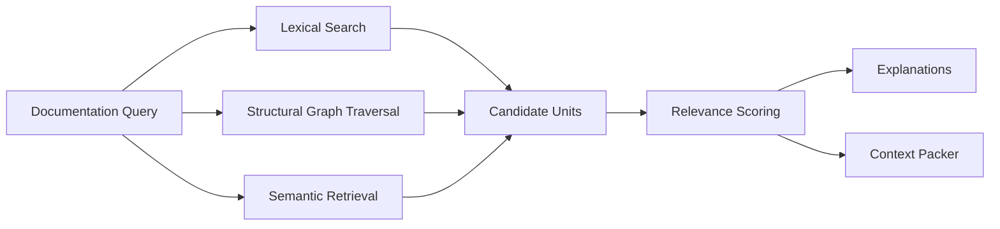

------
title: Build From Scratch: Mintlify-like AI-driven Documentation Generator CLI - Part 014
description: Mendesain relevance ranking engine untuk memilih evidence paling tepat bagi setiap task dokumentasi menggunakan signal dari source tree, symbol graph, contracts, tests, docs, dan knowledge notes.
series: learn-ai-docs-km-cli
seriesTitle: Build From Scratch: Mintlify-like AI-driven Documentation Generator CLI with Code2Prompt and Open-source Knowledge Management
order: 14
partTitle: Relevance Ranking for Documentation Generation
tags:
- ai-docs
- documentation
- cli
- relevance-ranking
- context-engine
- source-grounded
- code-intelligence
- knowledge-graph
- mdx
date: 2026-07-04
---

# Part 014 — Relevance Ranking for Documentation Generation

Di Part 013 kita membangun token budgeting dan context packing. Kita sudah tahu bahwa context harus dipilih, dibatasi, dikompresi, dan diberi provenance.

Sekarang kita masuk ke pertanyaan yang lebih sulit:

> Dari ribuan file, symbol, test, contract, config, dan notes, bagaimana sistem tahu mana yang relevan untuk satu halaman dokumentasi tertentu?

Jawaban yang lemah:

```txt
Cari keyword yang mirip dengan judul halaman.
```

Jawaban yang lebih baik:

```txt
Gabungkan signal dari kontrak, source tree, symbol graph, import graph, tests, existing docs, ownership, runtime config, dan knowledge graph. Beri skor, jelaskan alasannya, lalu gunakan hasilnya sebagai input context packer.
```

Relevance ranking adalah jembatan antara **repository understanding** dan **context packing**. Tanpa ranking yang bagus, token budget sebesar apa pun tetap bisa diisi dengan context yang salah.

---

## 1. Relevance Bukan Importance

Sebelum membuat ranking engine, pisahkan dua konsep:

| Konsep | Pertanyaan | Contoh |
|---|---|---|
| Importance | Seberapa penting file ini untuk project? | `src/main.ts`, `pom.xml`, `openapi.yaml` |
| Relevance | Seberapa membantu file ini untuk task saat ini? | `users.controller.ts` untuk halaman `GET /users/{id}` |

File `pom.xml` penting secara global, tetapi mungkin tidak relevan untuk halaman endpoint tertentu. Sebaliknya, test kecil `users-not-found.test.ts` tidak penting secara global, tetapi sangat relevan untuk bagian error response halaman `GET /users/{id}`.

Kesalahan banyak AI docs tool adalah memakai importance sebagai relevance.

Untuk overview docs, global importance memang berguna. Untuk page-level docs, relevance harus task-specific.

---

## 2. Target Dokumentasi sebagai Query Terstruktur

Ranking tidak boleh dimulai dari string mentah seperti:

```txt
Write docs for users API.
```

Ubah target menjadi **DocumentationQuery**.

```ts
export interface DocumentationQuery {
  id: string;
  taskType:
    | "project_overview"
    | "quickstart"
    | "api_reference"
    | "concept_page"
    | "architecture_page"
    | "troubleshooting_page"
    | "migration_guide"
    | "km_note";
  title: string;
  targetEntities: TargetEntity[];
  audience: "new_user" | "developer" | "operator" | "maintainer" | "architect";
  requiredCoverage: CoverageDimension[];
  sourcePolicy: SourcePolicy;
  outputFormat: "mdx" | "logseq_markdown" | "opennote_markdown";
}

export interface TargetEntity {
  kind:
    | "endpoint"
    | "module"
    | "symbol"
    | "package"
    | "cli_command"
    | "config_key"
    | "event"
    | "database_table"
    | "concept";
  id: string;
  aliases: string[];
  sourceRefs: SourceRef[];
}
```

Contoh query:

```json
{
  "id": "page:api:users:get-user",
  "taskType": "api_reference",
  "title": "Get User",
  "targetEntities": [
    {
      "kind": "endpoint",
      "id": "http:GET:/users/{id}",
      "aliases": ["get user", "find user by id", "users.show"],
      "sourceRefs": [{ "path": "openapi.yaml", "startLine": 41, "endLine": 88 }]
    }
  ],
  "audience": "developer",
  "requiredCoverage": [
    "auth",
    "path_params",
    "success_response",
    "error_response",
    "examples"
  ],
  "outputFormat": "mdx"
}
```

Dengan query terstruktur, ranking engine tidak menebak dari judul. Ia tahu target entity-nya.

---

## 3. Relevance Signal Catalog

Ranking engine mengumpulkan signal. Signal adalah bukti bahwa sebuah context unit relevan dengan query.

### 3.1 Name Match Signal

Signal paling sederhana:

- filename mengandung `user`,
- class bernama `UserController`,
- test bernama `getUserReturns404`,
- operationId `getUser`.

Name match berguna, tetapi tidak cukup.

Problem:

- nama bisa ambigu,
- terminology bisa berbeda,
- abbreviation bisa muncul,
- generated code bisa punya banyak nama yang cocok tapi tidak authoritative.

### 3.2 Path Proximity Signal

File dalam directory yang sama atau package yang sama lebih mungkin relevan.

Contoh:

```txt
src/users/users.controller.ts
src/users/users.service.ts
src/users/users.repository.ts
src/users/users.types.ts
```

Path proximity membantu module-level docs.

### 3.3 Symbol Reference Signal

Jika symbol target memanggil atau dipanggil oleh symbol lain, relasi itu relevan.

Contoh:

```txt
getUserHandler -> userService.getById -> userRepository.findById
```

Untuk API reference, handler dan DTO lebih relevan daripada repository internal. Untuk architecture docs, repository dan persistence boundary juga relevan.

### 3.4 Contract Link Signal

Jika file atau symbol terhubung dengan OpenAPI operation, GraphQL field, event schema, config schema, atau CLI command, relevance meningkat.

Contoh:

```txt
GET /users/{id}
  ↔ operationId getUser
  ↔ getUserHandler
  ↔ UserResponse schema
  ↔ get-user.integration.test.ts
```

Contract link biasanya signal yang sangat kuat.

### 3.5 Test Reference Signal

Tests menunjukkan behavior yang benar-benar diharapkan.

Relevant tests:

- success path,
- validation error,
- permission error,
- not found,
- idempotency,
- pagination,
- rate limit,
- retry behavior.

Test reference signal sangat penting untuk examples dan troubleshooting.

### 3.6 Existing Docs Link Signal

Existing docs bisa menunjukkan istilah dan style. Tetapi authority-nya harus hati-hati karena docs bisa stale.

Signal ini berguna untuk:

- preserving human-written terminology,
- avoiding broken cross-links,
- maintaining navigation continuity,
- detecting drift.

### 3.7 Runtime Config Signal

Untuk docs tertentu, config sangat relevan.

Contoh:

- authentication docs butuh auth config,
- deployment docs butuh Docker/Kubernetes manifests,
- troubleshooting docs butuh logging config,
- quickstart butuh env vars.

### 3.8 Ownership Signal

CODEOWNERS, module ownership, package maintainer, atau team label bisa membantu menentukan docs ownership.

Ini bukan signal correctness utama, tetapi penting untuk review workflow.

### 3.9 Knowledge Graph Signal

Logseq/OpenNote notes bisa punya concept relation:

```txt
[[User API]] references [[Authentication]], [[Pagination]], [[UserResponse]], [[ErrorResponse]]
```

Knowledge graph signal membantu menemukan conceptual context yang tidak eksplisit di kode.

Namun notes harus diberi authority lebih rendah daripada code/contract untuk factual behavior.

---

## 4. Relevance Graph

Daripada ranking file secara flat, bangun graph.

Node:

- file,
- symbol,
- endpoint,
- schema,
- test case,
- config key,
- doc page,
- note,
- package,
- module.

Edge:

- declares,
- imports,
- calls,
- implements,
- tests,
- documents,
- configures,
- emits,
- consumes,
- references,
- owns,
- belongs_to.

Mermaid model:

```mermaid
graph TD
  Q[Documentation Query: GET /users/{id}]
  E[Endpoint: GET /users/{id}]
  O[OpenAPI Operation]
  H[Handler: getUserHandler]
  S[Service: userService.getById]
  R[Repository: userRepository.findById]
  T1[Test: get user success]
  T2[Test: get user not found]
  D[Existing Docs: users.mdx]
  A[Auth Config]

  Q --> E
  E --> O
  E --> H
  H --> S
  S --> R
  T1 --> H
  T2 --> H
  D --> E
  A --> H
```

Ranking engine melakukan traversal dari target entity.

Traversal tidak sama untuk semua task.

Untuk `api_reference`:

```txt
endpoint -> contract -> handler -> request/response schemas -> relevant tests -> auth config -> existing docs
```

Untuk `architecture_page`:

```txt
module -> dependencies -> runtime config -> persistence -> events -> deployment -> ADR/notes
```

Untuk `troubleshooting_page`:

```txt
error type -> logs -> config -> tests -> runbook notes -> incident docs
```

---

## 5. Relevance Score Formula

Mulai dengan score explainable.

```txt
relevanceScore =
  0.25 * directTargetMatch +
  0.20 * graphProximity +
  0.15 * contractLink +
  0.15 * testBehaviorLink +
  0.10 * pathProximity +
  0.05 * existingDocsLink +
  0.05 * knowledgeGraphLink +
  0.05 * coverageContribution
```

Formula ini harus configurable per task type.

Untuk `api_reference`, contractLink tinggi.

```yaml
api_reference:
  directTargetMatch: 0.25
  graphProximity: 0.15
  contractLink: 0.25
  testBehaviorLink: 0.15
  pathProximity: 0.05
  existingDocsLink: 0.05
  knowledgeGraphLink: 0.02
  coverageContribution: 0.08
```

Untuk `architecture_page`, graphProximity dan deployment/config lebih tinggi.

```yaml
architecture_page:
  directTargetMatch: 0.15
  graphProximity: 0.25
  contractLink: 0.05
  testBehaviorLink: 0.05
  pathProximity: 0.10
  runtimeConfigLink: 0.20
  knowledgeGraphLink: 0.10
  coverageContribution: 0.10
```

Untuk `quickstart`, examples dan README lebih tinggi.

```yaml
quickstart:
  directTargetMatch: 0.10
  graphProximity: 0.05
  contractLink: 0.10
  exampleLink: 0.25
  readmeLink: 0.20
  configLink: 0.15
  coverageContribution: 0.15
```

---

## 6. Graph Proximity

Graph proximity menjawab: **berapa dekat unit ini dari target entity dalam relevance graph?**

Simple scoring:

| Distance | Score |
|---:|---:|
| 0 | 1.00 |
| 1 | 0.85 |
| 2 | 0.65 |
| 3 | 0.35 |
| >3 | 0.10 |

Tetapi edge type memengaruhi decay.

| Edge type | Strength |
|---|---:|
| implements | sangat kuat |
| tests | sangat kuat |
| declares | sangat kuat |
| calls | sedang/kuat |
| imports | sedang |
| references | sedang/lemah |
| same_directory | lemah/sedang |
| mentions | lemah |

Contoh:

```txt
endpoint --implements--> handler
```

lebih kuat daripada:

```txt
endpoint --mentioned_by--> README
```

Pseudo-code:

```ts
function graphProximityScore(query: DocumentationQuery, unit: ContextUnit, graph: RelevanceGraph) {
  const targetNodes = query.targetEntities.map(e => e.id);
  const unitNodes = unit.graphNodes;

  let best = 0;

  for (const target of targetNodes) {
    for (const node of unitNodes) {
      const paths = graph.shortestWeightedPaths(target, node, { maxDepth: 4 });
      for (const path of paths) {
        const score = scorePath(path);
        best = Math.max(best, score);
      }
    }
  }

  return best;
}

function scorePath(path: GraphPath) {
  let score = 1.0;
  for (const edge of path.edges) {
    score *= edgeStrength(edge.kind);
  }
  return score;
}
```

Weighted graph traversal memberi hasil lebih baik daripada keyword search.

---

## 7. Coverage-aware Ranking

Ranking tidak boleh hanya memilih top score. Ia harus memastikan required coverage terpenuhi.

Misalnya target page butuh:

```txt
auth, path_params, success_response, error_response, examples
```

Unit ranking awal:

| Unit | Score | Coverage |
|---|---:|---|
| OpenAPI operation | 0.96 | path_params, success_response, error_response |
| Handler excerpt | 0.90 | auth, success_response, error_response |
| Success test | 0.84 | success_response, examples |
| Another success test | 0.80 | success_response, examples |
| Not found test | 0.77 | error_response, examples |
| Auth config | 0.68 | auth |

Tanpa coverage adjustment, packer bisa mengambil dua success tests dan melewatkan auth config. Dengan coverage adjustment, unit yang menutup gap naik prioritasnya.

```ts
function rankWithCoverage(units: ContextUnit[], required: CoverageDimension[]) {
  const selected: ContextUnit[] = [];
  const covered = new Set<CoverageDimension>();
  const remaining = [...units];

  while (remaining.length > 0) {
    remaining.sort((a, b) => {
      const av = relevanceValue(a, covered, required);
      const bv = relevanceValue(b, covered, required);
      return bv - av;
    });

    const next = remaining.shift()!;
    selected.push(next);
    for (const c of next.coverage) covered.add(c);
  }

  return selected;
}

function relevanceValue(unit: ContextUnit, covered: Set<string>, required: string[]) {
  const uncoveredGain = unit.coverage.filter(c => required.includes(c) && !covered.has(c)).length;
  return unit.relevanceScore + 0.08 * uncoveredGain;
}
```

Ini sederhana tetapi efektif.

---

## 8. Ranking by Task Type

### 8.1 Project Overview

Relevant context:

- root manifest,
- source tree,
- README,
- package/module map,
- entrypoints,
- public API/contracts,
- deployment files,
- examples.

Avoid:

- full implementation files,
- deep tests,
- generated files,
- old docs that conflict with current structure.

### 8.2 Quickstart

Relevant context:

- install instructions,
- dependency manifest,
- sample config,
- runnable examples,
- minimal API usage,
- environment variables,
- Docker Compose/dev container.

Avoid:

- internal architecture details,
- rare edge cases,
- huge API reference,
- theoretical concept notes.

### 8.3 API Reference

Relevant context:

- OpenAPI/GraphQL/event contract,
- operation schema,
- auth requirement,
- request/response examples,
- validation tests,
- handler excerpt,
- error model.

Avoid:

- unrelated endpoints,
- full service internals unless behavior is undocumented elsewhere,
- generated SDK if not documenting SDK.

### 8.4 Architecture Page

Relevant context:

- module map,
- dependency graph,
- runtime config,
- deployment manifests,
- data stores,
- event flows,
- ADR/notes,
- public boundaries.

Avoid:

- individual endpoint examples unless they illustrate architecture,
- line-by-line implementation,
- stale diagrams without provenance.

### 8.5 Troubleshooting Page

Relevant context:

- error classes,
- log messages,
- config keys,
- operational scripts,
- integration tests for failure behavior,
- runbook notes,
- issue templates.

Avoid:

- generic explanation,
- success-only examples,
- unsafe commands without guards.

### 8.6 KM Note

Relevant context:

- concept-linked symbols,
- docs pages,
- ADRs,
- module summaries,
- related notes,
- glossary terms.

Avoid:

- overly long raw source,
- private secrets,
- unstable generated docs.

---

## 9. Relevance Explanation

Ranking yang tidak bisa dijelaskan akan sulit dipercaya.

Setiap ranked unit harus punya explanation.

```json
{
  "unitId": "test:users:get-user-not-found",
  "relevanceScore": 0.77,
  "rank": 5,
  "signals": [
    {
      "type": "test_behavior_link",
      "score": 0.92,
      "reason": "test calls GET /users/{id} and asserts 404 response"
    },
    {
      "type": "name_match",
      "score": 0.74,
      "reason": "test name contains get-user and not-found"
    },
    {
      "type": "coverage_contribution",
      "score": 0.81,
      "reason": "covers error_response and example coverage gaps"
    }
  ],
  "sourceRefs": [
    { "path": "tests/users.test.ts", "startLine": 58, "endLine": 74 }
  ]
}
```

CLI:

```bash
aidocs rank explain --task page:api:users:get-user --unit tests/users.test.ts
```

Output:

```txt
tests/users.test.ts relevance: 0.77 rank #5

Signals
  + test behavior link: calls GET /users/{id} and asserts 404
  + coverage gain: fills error_response and examples
  + name match: get user, not found
  - lower authority than OpenAPI contract

Decision
  include excerpt lines 58-74, not full file
```

Explanation adalah bagian dari product quality, bukan bonus.

---

## 10. Ranking Artifact

Hasil ranking harus disimpan.

File:

```txt
.aidocs/context/relevance-ranking.v1.json
```

Schema:

```json
{
  "schemaVersion": "relevance-ranking.v1",
  "queryId": "page:api:users:get-user",
  "targetEntities": ["http:GET:/users/{id}"],
  "rankedUnits": [
    {
      "rank": 1,
      "unitId": "contract:openapi:users:get-user",
      "score": 0.96,
      "authorityScore": 0.97,
      "relevanceScore": 0.96,
      "coverage": ["path_params", "success_response", "error_response"],
      "signals": [
        { "type": "direct_target_match", "score": 1.0 },
        { "type": "contract_link", "score": 1.0 }
      ]
    }
  ],
  "coverageReport": {
    "auth": "partial",
    "path_params": "covered",
    "success_response": "covered",
    "error_response": "covered",
    "examples": "partial"
  },
  "diagnostics": [
    {
      "severity": "warning",
      "message": "Auth coverage is partial; no explicit security scheme found for this operation."
    }
  ]
}
```

Ranking artifact digunakan oleh:

- context packer,
- verifier,
- review UI,
- drift detector,
- debugging command.

---

## 11. Hybrid Retrieval: Lexical + Structural + Semantic

Ranking engine idealnya tidak hanya satu metode.

### Lexical Retrieval

Bagus untuk:

- exact endpoint path,
- symbol names,
- config keys,
- error codes,
- command names.

Contoh:

```txt
GET /users/{id}
USER_NOT_FOUND
DATABASE_URL
--output
```

### Structural Retrieval

Bagus untuk:

- symbol relations,
- import graph,
- call graph,
- route ownership,
- test-to-handler links.

Ini yang membedakan docs generator berbasis code intelligence dari prompt concatenator.

### Semantic Retrieval

Bagus untuk:

- concept docs,
- troubleshooting notes,
- knowledge graph notes,
- related architecture decisions,
- terminology bridging.

Tetapi semantic retrieval bisa berbahaya jika dipakai sebagai sumber factual behavior tanpa verifikasi.

Policy:

```txt
Use semantic retrieval to discover candidates.
Use structural and source-backed evidence to validate factual claims.
```

Mermaid:



---

## 12. Handling Ambiguity

A query can be ambiguous.

Examples:

- `users` may refer to module, endpoint group, database table, or UI concept.
- `auth` may refer to authentication, authorization, OAuth provider, or internal middleware.
- `sync` may refer to CLI command, background job, or KM sync.

Ranking engine should detect ambiguity.

```json
{
  "diagnostics": [
    {
      "severity": "warning",
      "code": "AMBIGUOUS_TARGET",
      "message": "The target 'sync' matched 3 entities: cli:sync, job:syncNotes, module:sync-engine.",
      "candidates": [
        "cli:aidocs km sync",
        "symbol:syncNotes",
        "module:sync-engine"
      ]
    }
  ]
}
```

For batch generation, do not stop everything. Generate lower-confidence docs with explicit review requirement.

```txt
Status: generated_with_low_confidence
Review required: target ambiguity
```

For interactive CLI, ask user to select.

```bash
aidocs generate page sync
```

```txt
Target 'sync' is ambiguous.

1. CLI command: aidocs km sync
2. Module: sync-engine
3. Function: syncNotes()

Choose target: 1
```

---

## 13. Negative Signals

Ranking also needs negative signals.

| Negative signal | Meaning |
|---|---|
| generated file | likely redundant or low authority |
| stale docs | may mislead generation |
| deprecated symbol | should not be primary evidence unless documenting deprecation |
| test fixture only | useful as example but not authoritative API contract |
| vendor code | usually not relevant |
| unrelated same-name symbol | lexical false positive |
| high risk file | exclude or redact |
| low confidence parse | lower relevance |

Example:

```json
{
  "unitId": "file:vendor/users.js",
  "negativeSignals": [
    {
      "type": "vendor_code",
      "penalty": 0.45,
      "reason": "file is under vendor directory"
    },
    {
      "type": "lexical_false_positive",
      "penalty": 0.20,
      "reason": "contains user string but no relation to target endpoint"
    }
  ]
}
```

Do not rank only by positive evidence. False positives kill context quality.

---

## 14. Dependency-aware Ranking

Some units need dependencies.

Example:

- handler excerpt references `UserResponse` type,
- test uses fixture `userFixture`,
- docs page references glossary term,
- config references schema.

If a unit is included, dependencies may need inclusion or summary.

```json
{
  "unitId": "test:users:create-user-success",
  "dependsOn": [
    "fixture:users:valid-create-user-request",
    "contract:openapi:users:create-user"
  ],
  "dependencyPolicy": "include_summary"
}
```

Dependency policies:

| Policy | Meaning |
|---|---|
| include_full | dependency must be included raw/full |
| include_excerpt | include focused excerpt |
| include_summary | include generated summary |
| require_existing | fail if dependency missing |
| ignore | dependency not needed for current task |

This prevents examples from becoming mysterious.

Bad context:

```ts
await request(app).post('/users').send(validUser)
```

But `validUser` is never shown.

Better context:

```ts
const validUser = {
  email: "ada@example.com",
  name: "Ada Lovelace"
};

await request(app).post('/users').send(validUser)
```

---

## 15. Ranking for Existing Docs Update

When updating existing docs, relevance ranking changes.

Inputs:

- existing page,
- source refs from old generation,
- current source graph,
- changed files,
- drift report.

Goal:

```txt
Select context needed to update only stale sections while preserving human edits.
```

Signals:

| Signal | Use |
|---|---|
| changed source ref | high relevance |
| section provenance | tells which source backed old text |
| broken link | relevant docs/navigation files |
| changed OpenAPI operation | relevant API section |
| manual edit marker | preserve section unless conflict |

Ranking artifact should include update intent:

```json
{
  "queryId": "update:docs/api/users/get-user.mdx",
  "taskType": "docs_update",
  "changedSources": ["openapi.yaml:41-88"],
  "affectedSections": ["Response", "Errors"],
  "rankedUnits": []
}
```

This is how the system avoids rewriting entire docs pages unnecessarily.

---

## 16. Ranking for Knowledge Notes

For Logseq/OpenNote-compatible notes, relevance is more conceptual.

Example target:

```txt
Create a knowledge note for User Authentication Flow.
```

Relevant units:

- auth middleware,
- config keys,
- login endpoint,
- token verification function,
- security scheme in OpenAPI,
- architecture note about auth provider,
- troubleshooting note about expired tokens.

But for KM notes, avoid overloading the note with implementation detail. The point is durable knowledge.

Ranking should prefer:

- concept relations,
- stable boundaries,
- source-backed definitions,
- high-level architecture,
- related docs pages.

Not:

- every helper function,
- temporary test fixture,
- line-by-line implementation.

Output note should say:

```md
- [[User Authentication Flow]]
  - Type:: Concept
  - Source:: `src/auth/middleware.ts`, `openapi.yaml`
  - Related:: [[JWT]], [[Authorization]], [[User API]]
  - Summary:: ...
```

Ranking engine provides the source evidence and related nodes.

---

## 17. Relevance Evaluation

You cannot improve ranking without evaluation.

Create fixtures with expected relevant units.

```txt
fixtures/
  users-api/
    repo/
    query.json
    expected-ranking.json
```

Metrics:

| Metric | Meaning |
|---|---|
| precision@k | dari top-k, berapa yang benar-benar relevan |
| recall@k | berapa relevant units yang berhasil ditemukan |
| coverage completeness | apakah required coverage terpenuhi |
| false positive rate | berapa irrelevant unit masuk tinggi |
| explanation completeness | apakah setiap top unit punya reason |
| stability | apakah ranking berubah tanpa perubahan source |

For documentation generation, coverage completeness may matter more than pure precision.

A ranking with slightly lower precision but covers auth, errors, and examples is better than ranking highly precise but only covers happy path.

---

## 18. Common Failure Modes

### 18.1 Lexical Trap

File contains same word but unrelated.

Mitigation:

- combine lexical with graph proximity,
- penalize vendor/generated paths,
- require target entity relation for high score.

### 18.2 Deep Internal Dominance

Call graph pulls too many internals.

Mitigation:

- cap traversal depth,
- task-specific edge weights,
- prefer boundary symbols for API docs.

### 18.3 Stale Docs Override Source

Existing docs have matching title and high lexical score.

Mitigation:

- stale penalty,
- authority hierarchy,
- drift detection,
- use old docs for style, not truth.

### 18.4 Tests Without Fixture Context

Test selected but fixture omitted.

Mitigation:

- dependency-aware ranking,
- include fixture summary,
- snippet normalization.

### 18.5 Semantic Retrieval Hallucination

Semantic search returns conceptually similar note but source behavior differs.

Mitigation:

- semantic result as candidate only,
- require source-backed verification for factual claims,
- lower authority for notes.

---

## 19. Implementation Roadmap

Build relevance ranking in layers.

### Layer 1 — Candidate Collection

- exact path/name search,
- target entity lookup,
- contract link lookup,
- symbol index lookup,
- test index lookup.

### Layer 2 — Structural Graph

- file-symbol graph,
- import graph,
- endpoint-handler links,
- test-target links,
- config-target links.

### Layer 3 — Scoring

- direct match,
- graph proximity,
- path proximity,
- contract link,
- test link,
- coverage contribution,
- negative signals.

### Layer 4 — Explanations

- signal-level reasons,
- inclusion recommendation,
- excerpt recommendation.

### Layer 5 — Evaluation

- golden ranking fixtures,
- precision/recall/coverage metrics,
- regression cases.

### Layer 6 — Semantic Enhancement

- embeddings for docs/notes,
- concept aliases,
- KM graph retrieval,
- hybrid scoring.

Do not start with embeddings. Start with source-grounded structural ranking. Semantic retrieval is useful, but it should not be the foundation of correctness.

---

## 20. CLI Commands

Minimum commands:

```bash
aidocs rank --task page:api:users:get-user
```

```bash
aidocs rank explain --task page:api:users:get-user --top 10
```

```bash
aidocs rank coverage --task page:api:users:get-user
```

```bash
aidocs rank debug --task page:api:users:get-user --unit src/users/users.service.ts
```

Example output:

```txt
Ranked context units for page:api:users:get-user

#1 contract:openapi:users:get-user        0.96  required  path_params, responses
#2 file:src/users/users.controller.ts     0.90  include   handler behavior
#3 test:users:get-user-success            0.84  include   success example
#4 test:users:get-user-not-found          0.77  include   error example
#5 config:auth/security-scheme            0.72  include   auth coverage
#6 docs:api/users.mdx                     0.61  style     existing terminology

Coverage
  auth              covered
  path_params       covered
  success_response  covered
  error_response    covered
  examples          covered

Warnings
  none
```

---

## 21. Production Checklist

A relevance ranking engine is production-ready when:

- [ ] target docs query is structured,
- [ ] ranking is task-specific,
- [ ] signals are visible,
- [ ] graph proximity exists,
- [ ] contract links boost correctly,
- [ ] tests are linked to behavior,
- [ ] config/deployment files can be ranked when relevant,
- [ ] stale docs are penalized,
- [ ] generated/vendor files are penalized,
- [ ] coverage-aware ranking exists,
- [ ] dependency-aware ranking exists,
- [ ] ambiguity is detected,
- [ ] ranking artifact is persisted,
- [ ] explanations are available through CLI,
- [ ] golden tests exist,
- [ ] false positives are tracked,
- [ ] semantic retrieval is not blindly trusted.

---

## 22. Ringkasan

Relevance ranking adalah mekanisme yang menentukan kualitas context sebelum token packing terjadi.

Prinsip utamanya:

1. Relevance berbeda dari importance.
2. Target dokumentasi harus berupa query terstruktur.
3. Ranking harus menggabungkan lexical, structural, contract, test, config, docs, dan KM signals.
4. Graph proximity lebih kuat daripada keyword matching saja.
5. Coverage-aware ranking mencegah context hanya berisi happy path.
6. Negative signals sama pentingnya dengan positive signals.
7. Ranking harus explainable.
8. Semantic retrieval berguna untuk discovery, bukan sumber kebenaran tunggal.
9. Every high-ranked unit needs a reason.
10. Every docs task deserves its own ranking policy.

Setelah part ini, pipeline kita sudah punya dua kemampuan penting:

- memilih evidence yang relevan,
- mengemas evidence tersebut dalam batas token.

Part berikutnya akan masuk ke **prompt template system**: bagaimana mengubah query, packed context, output contract, dan style policy menjadi prompt yang konsisten, bisa dites, dan tidak berubah liar saat sistem berkembang.

---

## References

- Code2Prompt repository: https://github.com/mufeedvh/code2prompt
- Tree-sitter documentation: https://tree-sitter.github.io/tree-sitter/
- Tree-sitter repository: https://github.com/tree-sitter/tree-sitter
- OpenAI tiktoken repository: https://github.com/openai/tiktoken
