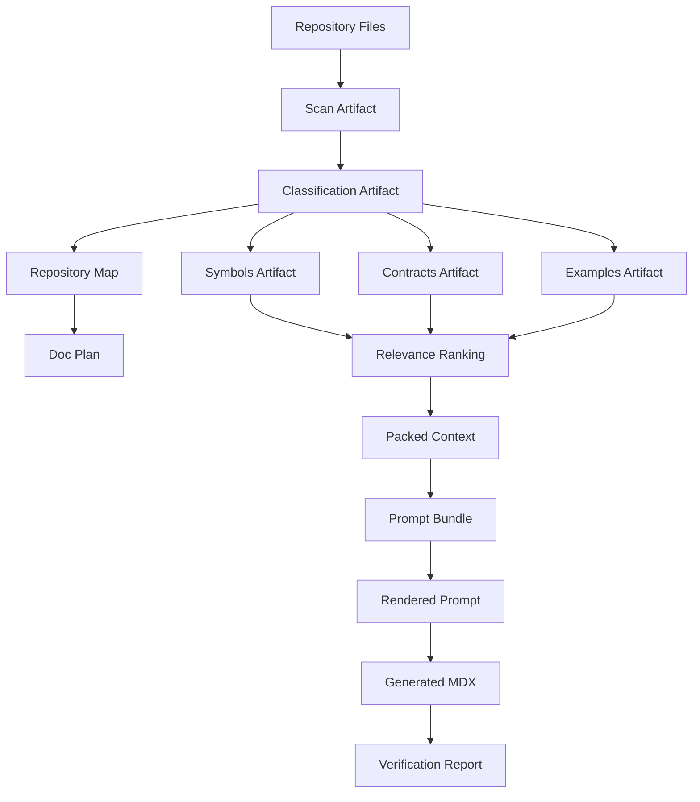
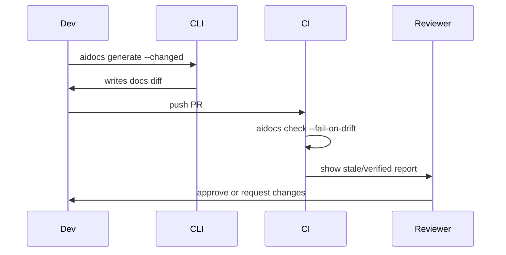
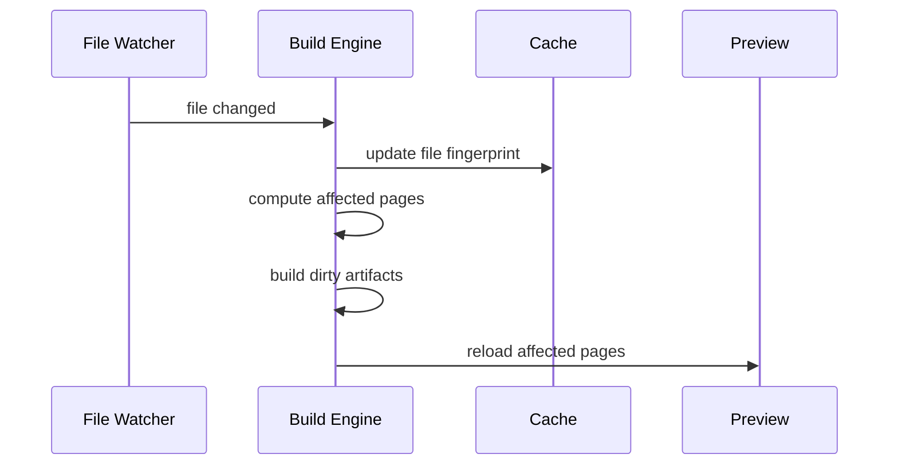

------
title: Build From Scratch: Mintlify-like AI-driven Documentation Generator CLI - Part 016
description: Mendesain context cache dan incremental build engine agar AI documentation generator tidak selalu scan, pack, render, generate, dan verify semuanya dari nol.
series: learn-ai-docs-km-cli
seriesTitle: Build From Scratch: Mintlify-like AI-driven Documentation Generator CLI with Code2Prompt and Open-source Knowledge Management
order: 16
partTitle: Context Cache and Incremental Builds
tags:
- ai-docs
- documentation
- cli
- incremental-build
- cache
- build-system
- context-engine
- prompt-cache
- mdx
- software-architecture
date: 2026-07-04
---

# Part 016 — Context Cache and Incremental Builds

Di Part 015 kita mendesain prompt template system sebagai compiler backend.

Sekarang kita masuk ke masalah yang langsung muncul ketika repository mulai besar:

> Apakah setiap kali satu file berubah, kita harus scan ulang seluruh repo, ekstrak ulang semua symbol, rebuild semua context, render semua prompt, call LLM untuk semua halaman, lalu verify seluruh docs site?

Jawaban untuk prototype:

```txt
Ya, full regenerate saja.
```

Jawaban untuk production-grade CLI:

```txt
Tidak. Bangun context cache dan incremental build engine berbasis artifact graph, content hash, dependency tracking, dan invalidation rules.
```

AI docs generator yang selalu full rebuild akan lambat, mahal, noisy, dan sulit dipercaya.

Incremental build adalah perbedaan antara toy generator dan developer tool yang dipakai setiap hari.

---

## 1. Mental Model: AI Docs Generator sebagai Build System

Jangan pikirkan docs generator sebagai command tunggal:

```bash
aidocs generate
```

Pikirkan sebagai build system:

```txt
source files + config + templates + model profile
→ intermediate artifacts
→ generated docs
→ verification reports
```

Mirip compiler atau static site generator, tetapi dengan satu tambahan penting:

```txt
LLM call mahal dan non-deterministic.
```

Karena itu, kita harus lebih hati-hati daripada build system biasa.

Pipeline kita:



Setiap node adalah artifact.

Setiap edge adalah dependency.

Incremental build berarti:

```txt
Jika input node berubah, rebuild hanya node yang bergantung padanya.
```

---

## 2. Kenapa Cache di AI Docs Lebih Sulit daripada Cache Biasa

Pada build biasa, cache key sering cukup:

```txt
hash(input files + compiler version + flags)
```

Pada AI docs, cache key harus memasukkan:

- source content hash,
- ignore rules,
- scanner version,
- classifier version,
- extractor version,
- relevance algorithm version,
- context packer version,
- template pack version,
- renderer version,
- model provider,
- model name,
- generation parameters,
- output schema version,
- verifier version,
- style profile,
- policy config.

Kalau salah satu berubah, output bisa berubah.

Itu sebabnya cache harus artifact-aware, bukan sekadar “file timestamp”.

---

## 3. Timestamp Cache vs Content Hash Cache

Timestamp cache:

```txt
If modified time changed, rebuild.
```

Masalah:

- timestamp bisa berubah tanpa content berubah,
- checkout Git bisa mengubah timestamp,
- timezone/filesystem behavior berbeda,
- CI cache bisa misleading,
- generated files bisa restore timestamp aneh.

Content hash cache:

```txt
If content hash changed, rebuild.
```

Lebih kuat.

Untuk file:

```ts
export interface FileFingerprint {
  path: string;
  size: number;
  sha256: string;
  executable?: boolean;
  symlinkTarget?: string;
}
```

Untuk config:

```ts
export interface ConfigFingerprint {
  aidocsConfigHash: string;
  ignoreRulesHash: string;
  templatePackHash: string;
  pluginManifestHash: string;
}
```

Untuk artifact:

```ts
export interface ArtifactFingerprint {
  artifactId: string;
  artifactType: string;
  schemaVersion: string;
  producerVersion: string;
  inputHashes: string[];
  contentHash: string;
}
```

Rule:

```txt
Cache key = hash(stable JSON of all semantic inputs)
```

---

## 4. Artifact Graph

Kita butuh dependency graph antar artifact.

```ts
export interface ArtifactNode {
  id: string;
  type:
    | "scan"
    | "classification"
    | "repo_map"
    | "symbols"
    | "contracts"
    | "examples"
    | "doc_plan"
    | "relevance"
    | "packed_context"
    | "prompt_bundle"
    | "rendered_prompt"
    | "generated_page"
    | "verification_report";
  schemaVersion: string;
  producer: ProducerIdentity;
  contentHash: string;
  inputs: ArtifactInputRef[];
  outputPath: string;
  createdAt: string;
}

export interface ArtifactInputRef {
  kind: "file" | "artifact" | "config" | "template" | "model_profile";
  id: string;
  hash: string;
}
```

The graph:

```ts
export interface ArtifactGraph {
  schemaVersion: "artifact-graph.v1";
  repositoryRoot: string;
  nodes: ArtifactNode[];
  edges: Array<{ from: string; to: string; reason: string }>;
}
```

Example edge:

```json
{
  "from": "file:src/routes/users.ts",
  "to": "artifact:symbols.v1",
  "reason": "symbol extractor reads source files"
}
```

The build engine uses this graph to decide what is dirty.

---

## 5. Dirty Checking

A node is dirty if:

1. its output artifact is missing,
2. its producer version changed,
3. its schema version changed,
4. one of its input hashes changed,
5. one of its dependency nodes is dirty,
6. config affecting it changed,
7. template affecting it changed,
8. model profile affecting generated output changed.

Pseudo-code:

```ts
function isDirty(node: ArtifactNode, currentInputs: InputSnapshot): DirtyReason[] {
  const reasons: DirtyReason[] = [];

  if (!exists(node.outputPath)) {
    reasons.push({ type: "missing_output" });
  }

  if (node.producer.version !== currentProducerVersion(node.type)) {
    reasons.push({ type: "producer_changed" });
  }

  for (const input of node.inputs) {
    const currentHash = currentInputs.getHash(input.kind, input.id);
    if (currentHash !== input.hash) {
      reasons.push({
        type: "input_hash_changed",
        inputId: input.id,
        previous: input.hash,
        current: currentHash
      });
    }
  }

  return reasons;
}
```

Dirty reasons should be visible in CLI.

```bash
aidocs build --explain-dirty
```

Output:

```txt
Dirty artifacts:

symbols.v1
  reason: input_hash_changed
  file: src/routes/users.ts

prompt-bundle:api-users-get
  reason: dependency_dirty
  dependency: symbols.v1

generated-page:docs/api/users/get-user.mdx
  reason: dependency_dirty
  dependency: rendered-prompt:api-users-get
```

This turns cache behavior into something developers can understand.

---

## 6. Dependency Granularity

The easiest graph is coarse:

```txt
All source files → all symbols → all pages
```

But this causes too much rebuild.

Better:

```txt
File-level and page-level dependencies
```

Example:

```txt
src/routes/users.ts
  → symbol:UsersController.getUser
  → contract:GET /users/{id}
  → page:docs/api/users/get-user.mdx
```

If `src/routes/orders.ts` changes, `get-user.mdx` should not rebuild.

Granularity levels:

| Level | Simpler | More precise |
|---|---:|---:|
| Repository | yes | no |
| Directory | medium | medium |
| File | good | good |
| Symbol | harder | better |
| Section | hardest | best |

Recommended strategy:

```txt
Start with file-level dependencies. Add symbol-level dependencies for API docs and architecture docs later.
```

File-level incremental build already gives large wins.

---

## 7. Page Dependency Manifest

Each generated page should have a dependency manifest.

```json
{
  "schemaVersion": "page-deps.v1",
  "pageId": "api-users-get",
  "pagePath": "docs/api/users/get-user.mdx",
  "dependencies": {
    "files": [
      {
        "path": "openapi.yaml",
        "sha256": "...",
        "reason": "defines operation GET /users/{id}"
      },
      {
        "path": "src/routes/users.ts",
        "sha256": "...",
        "reason": "implements route handler"
      },
      {
        "path": "test/users.not-found.test.ts",
        "sha256": "...",
        "reason": "documents 404 behavior"
      }
    ],
    "artifacts": [
      {
        "id": "contracts.v1",
        "sha256": "..."
      },
      {
        "id": "examples.v1",
        "sha256": "..."
      },
      {
        "id": "prompt-bundle:api-users-get",
        "sha256": "..."
      }
    ],
    "templates": [
      {
        "id": "api-reference@1.0.0",
        "sha256": "..."
      }
    ],
    "model": {
      "provider": "openai",
      "model": "...",
      "parametersHash": "..."
    }
  }
}
```

When a file changes, we can query:

```txt
Which pages depend on this file?
```

CLI:

```bash
aidocs deps why docs/api/users/get-user.mdx
```

Output:

```txt
docs/api/users/get-user.mdx depends on:

openapi.yaml
  because: defines operation GET /users/{id}

src/routes/users.ts
  because: implements route handler

test/users.not-found.test.ts
  because: documents 404 behavior
```

This is crucial for trust.

---

## 8. Cache Layers

We need multiple cache layers.

```txt
.aidocs/cache/
  files/
  scans/
  classification/
  symbols/
  contracts/
  examples/
  repo-map/
  relevance/
  packed-context/
  prompt-bundles/
  rendered-prompts/
  llm-responses/
  verification/
```

Each layer has different invalidation rules.

### 8.1 File Fingerprint Cache

Stores path, size, hash, mode, binary flag.

Invalidated by file content/mode changes.

### 8.2 Scan Cache

Stores traversal result.

Invalidated by:

- file changes,
- ignore rules changes,
- scanner version changes.

### 8.3 Classification Cache

Stores file kind and documentability.

Invalidated by:

- file content changes,
- classifier rules changes,
- language detector version changes.

### 8.4 Symbol Cache

Stores extracted symbols.

Invalidated by:

- source file changes,
- extractor version changes,
- parser version changes.

### 8.5 Contract Cache

Stores API/schema/config/event/database contracts.

Invalidated by:

- contract file changes,
- source files that expose contracts,
- parser/extractor version changes.

### 8.6 Example Cache

Stores mined examples.

Invalidated by:

- test file changes,
- fixture changes,
- example directory changes,
- redaction policy changes.

### 8.7 Context Cache

Stores packed context for a page.

Invalidated by:

- relevant evidence changes,
- ranking algorithm changes,
- token budget changes,
- compression strategy changes,
- page spec changes.

### 8.8 Rendered Prompt Cache

Stores rendered prompt.

Invalidated by:

- prompt bundle changes,
- template pack changes,
- renderer version changes,
- model profile token layout changes.

### 8.9 LLM Response Cache

Stores raw LLM output.

Invalidated by:

- rendered prompt changes,
- model changes,
- generation parameters changes,
- output schema changes.

Be careful with LLM response cache because generation may be intentionally non-deterministic.

### 8.10 Verification Cache

Stores verification report.

Invalidated by:

- page content changes,
- verifier version changes,
- docs config changes,
- link graph changes,
- source provenance changes.

---

## 9. Cache Directory Layout

Use content-addressed storage.

```txt
.aidocs/cache/
  cas/
    sha256/
      ab/
        ab12cd...
  index/
    file-fingerprints.json
    artifacts.json
    page-deps.json
    reverse-deps.json
```

Why content-addressed storage?

- deduplication,
- easy integrity check,
- stable identity,
- safe sharing across CI cache,
- simple garbage collection.

Artifact index:

```json
{
  "schemaVersion": "cache-index.v1",
  "entries": [
    {
      "cacheKey": "scan:sha256:...",
      "artifactType": "scan",
      "contentHash": "sha256:...",
      "path": ".aidocs/cache/cas/sha256/ab/ab12...json",
      "createdAt": "2026-07-04T00:00:00Z",
      "lastAccessedAt": "2026-07-04T00:10:00Z",
      "sizeBytes": 128403,
      "producerVersion": "0.1.0"
    }
  ]
}
```

---

## 10. Cache Key Design

A good cache key includes semantic inputs.

Example for rendered prompt:

```ts
export interface RenderedPromptCacheKeyInput {
  promptBundleHash: string;
  templatePackHash: string;
  templateId: string;
  rendererVersion: string;
  renderMode: "text" | "chat";
  modelProfileHash: string;
}
```

Stable key:

```ts
const cacheKey = sha256(stableJson({
  kind: "rendered_prompt.v1",
  promptBundleHash,
  templatePackHash,
  templateId,
  rendererVersion,
  renderMode,
  modelProfileHash
}));
```

Do not include irrelevant fields.

Bad:

```ts
cacheKey = sha256(JSON.stringify({ ...input, generatedAt: new Date() }));
```

This guarantees cache miss every time.

---

## 11. Context Cache Is Page-specific

Context cache should not be only repository-wide.

Bad:

```txt
repo-context.md
```

Better:

```txt
packed-context/project-overview.json
packed-context/api-users-get.json
packed-context/architecture-runtime.json
```

Each page has different context.

Example:

| Page | Context units |
|---|---|
| Overview | README, manifests, root tree, major modules |
| API reference | OpenAPI operation, route handler, tests, schemas |
| Architecture | repo map, dependency graph, config, deployments |
| Troubleshooting | errors, logs, tests, config docs |

A change in one endpoint should not invalidate every page.

---

## 12. Incremental Build Planning

Build planner receives:

- current file snapshot,
- previous artifact graph,
- config snapshot,
- requested target.

It outputs build plan:

```ts
export interface BuildPlan {
  id: string;
  target: BuildTarget;
  steps: BuildStep[];
  skipped: SkippedStep[];
  dirtyReasons: DirtyReason[];
}

export interface BuildStep {
  id: string;
  type: string;
  inputs: string[];
  outputs: string[];
  reason: "missing" | "dirty" | "forced" | "dependency_dirty";
}
```

Example:

```txt
Build target: docs/api/users/get-user.mdx

Steps:
1. scan changed files                  dirty: src/routes/users.ts changed
2. update classification               dirty: scan changed
3. update symbols for users.ts         dirty: source changed
4. update contracts for users route    dirty: symbols changed
5. update relevance for get-user page  dirty: contract changed
6. rebuild packed context              dirty: relevance changed
7. render prompt                       dirty: prompt bundle changed
8. call LLM                            dirty: rendered prompt changed
9. verify page                         dirty: page changed

Skipped:
- examples unchanged
- project overview page unchanged
- order API pages unchanged
```

This output is gold for developer trust.

---

## 13. Target Selection

`aidocs build` should support targets.

```bash
aidocs build
```

Build all dirty docs.

```bash
aidocs build docs/api/users/get-user.mdx
```

Build one page.

```bash
aidocs build --changed
```

Build docs affected by changed Git files.

```bash
aidocs build --since main
```

Build docs affected by diff from `main`.

```bash
aidocs build --plan
```

Print plan only. No writes. No LLM calls.

This is important for CI.

---

## 14. Git-aware Incrementality

In local mode, file snapshot is enough.

In PR mode, Git diff is more useful.

```bash
git diff --name-only origin/main...HEAD
```

Changed files can map to affected pages using reverse deps.

```ts
export interface ReverseDependencyIndex {
  byFile: Record<string, string[]>;
  byArtifact: Record<string, string[]>;
  bySymbol: Record<string, string[]>;
  byContract: Record<string, string[]>;
}
```

Example:

```json
{
  "byFile": {
    "src/routes/users.ts": [
      "docs/api/users/get-user.mdx",
      "docs/architecture/runtime-flow.mdx"
    ]
  }
}
```

CI command:

```bash
aidocs check --since origin/main --fail-on-drift
```

Output:

```txt
Changed files:
- src/routes/users.ts

Affected docs:
- docs/api/users/get-user.mdx
- docs/architecture/runtime-flow.mdx

Drift detected:
- docs/api/users/get-user.mdx is stale because route handler changed.
```

This is better than rebuilding all docs every PR.

---

## 15. Drift Detection vs Regeneration

Do not automatically regenerate docs in every CI run.

Separate:

```txt
check drift
```

from:

```txt
rewrite docs
```

CI should often run:

```bash
aidocs check --fail-on-drift
```

Local developer can run:

```bash
aidocs generate --changed
```

Why separate?

- CI should be deterministic,
- LLM calls in CI may be expensive,
- automatic AI commits can be risky,
- humans should review generated changes.

Workflow:



---

## 16. Cache and Non-deterministic LLM Output

Even with same prompt, model output can vary.

So what does it mean to cache LLM responses?

There are three modes.

### 16.1 Strict Cache Mode

```txt
If rendered prompt hash is same, reuse previous LLM output.
```

Good for:

- local repeat builds,
- tests,
- offline preview,
- cost control.

Risk:

- may reuse output from older model behavior if model changed but name did not.

### 16.2 Refresh Mode

```txt
Call LLM even if prompt hash unchanged.
```

Good for:

- improving generated prose,
- comparing model versions,
- repair attempts.

Risk:

- noisy diffs.

### 16.3 Verify-only Mode

```txt
Do not call LLM. Only check whether existing docs are stale or invalid.
```

Good for CI.

CLI flags:

```bash
aidocs generate --cache=strict
aidocs generate --cache=refresh
aidocs check --no-llm
```

Default recommendation:

```txt
Local generate: strict cache unless --refresh.
CI check: no LLM by default.
```

---

## 17. LLM Response Cache Key

Cache key must include model parameters.

```ts
export interface LlmCacheKeyInput {
  renderedPromptHash: string;
  provider: string;
  model: string;
  modelRevision?: string;
  temperature: number;
  topP?: number;
  maxOutputTokens?: number;
  responseFormatHash?: string;
  toolConfigHash?: string;
  safetyPolicyHash?: string;
}
```

Do not cache across different temperature values.

Do not cache across different output schema.

Do not cache across different provider adapters.

---

## 18. Prompt Cache vs Local Cache

There are two different concepts.

| Concept | Owner | Purpose |
|---|---|---|
| Local artifact cache | our CLI | skip local computation and avoid repeated LLM calls |
| Provider prompt cache | LLM provider | reduce latency/cost for repeated prompt prefixes |

Local cache is explicit.

Provider prompt cache is usually provider behavior.

Our design should help both:

- stable prompt prefix,
- deterministic rendered prompt,
- repeated source policy/output contract,
- dynamic evidence later.

But do not rely on provider prompt caching for correctness.

Correctness comes from local artifact graph and verifier.

---

## 19. Cache Invalidation Rules by Change Type

### 19.1 Source File Changed

If source file changed:

- file fingerprint dirty,
- scan maybe dirty,
- classification dirty for that file,
- symbol/contract/example dirty if relevant,
- affected pages dirty,
- affected prompt bundles dirty,
- affected generated pages stale.

### 19.2 README Changed

README can affect:

- project overview,
- quickstart,
- installation docs,
- examples,
- knowledge notes.

But it should not necessarily affect every API endpoint page.

### 19.3 OpenAPI Changed

OpenAPI affects:

- API reference pages,
- quickstart examples if linked,
- SDK usage docs,
- knowledge graph API notes.

### 19.4 Template Changed

Template affects rendered prompts and generated pages for that template type.

But scanner, classifier, symbols, contracts do not need rebuild.

### 19.5 Style Profile Changed

Style profile affects rendered prompt and generated output.

It does not affect context selection unless configured to do so.

### 19.6 Token Budget Changed

Token budget affects context packing.

It can change evidence selection/compression, so prompt bundle and generated output become dirty.

### 19.7 Verifier Changed

Verifier change does not require regenerating docs.

It requires rerunning verification.

### 19.8 Model Changed

Model change affects generated output but not rendered prompt.

Depending on policy, existing generated pages may be considered stale or merely “generated with previous model”.

Recommended:

```txt
Model change does not automatically stale docs in CI. It only stales LLM response cache.
```

Otherwise changing model config would require rewriting all docs.

---

## 20. Build Modes

Define explicit modes.

### 20.1 Plan Mode

```bash
aidocs build --plan
```

No writes. No LLM calls.

### 20.2 Check Mode

```bash
aidocs check
```

Detect drift and validation issues. No generation.

### 20.3 Generate Mode

```bash
aidocs generate
```

Generate or update pages.

### 20.4 Repair Mode

```bash
aidocs repair
```

Fix verifier findings with minimal diffs.

### 20.5 Force Mode

```bash
aidocs generate --force
```

Ignore cache and rebuild selected target.

### 20.6 Refresh LLM Mode

```bash
aidocs generate --refresh-llm
```

Reuse local scan/context cache but call model again.

Force mode and refresh mode are different.

---

## 21. Build Engine Design

Core interface:

```ts
export interface BuildEngine {
  plan(request: BuildRequest): Promise<BuildPlan>;
  execute(plan: BuildPlan): Promise<BuildResult>;
}
```

Build request:

```ts
export interface BuildRequest {
  repositoryRoot: string;
  target: BuildTarget;
  mode: "plan" | "check" | "generate" | "repair";
  since?: string;
  force?: boolean;
  refreshLlm?: boolean;
  noLlm?: boolean;
  profile: "local" | "ci" | "enterprise";
}
```

Build step:

```ts
export interface BuildStepExecutor<I, O> {
  type: string;
  computeKey(input: I): Promise<string>;
  readFromCache(key: string): Promise<O | null>;
  execute(input: I): Promise<O>;
  writeToCache(key: string, output: O): Promise<void>;
}
```

Pattern:

```ts
async function runStep<I, O>(executor: BuildStepExecutor<I, O>, input: I): Promise<O> {
  const key = await executor.computeKey(input);
  const cached = await executor.readFromCache(key);
  if (cached) return cached;

  const output = await executor.execute(input);
  await executor.writeToCache(key, output);
  return output;
}
```

This works for deterministic steps.

For LLM step, policy decides whether to reuse cache.

---

## 22. Deterministic Step vs Effectful Step

Classify steps.

| Step | Deterministic? | Effectful? | Cache policy |
|---|---:|---:|---|
| scan | mostly | no | strong cache |
| classify | yes | no | strong cache |
| extract symbols | yes | no | strong cache |
| rank relevance | yes | no | strong cache |
| pack context | yes | no | strong cache |
| render prompt | yes | no | strong cache |
| call LLM | no/mostly no | yes | policy cache |
| write page | yes | yes | guarded |
| verify page | yes | sometimes network for links | cache with mode |

Avoid mixing effectful and deterministic steps.

Bad:

```ts
generatePage() {
  scanRepo();
  callLlm();
  writeFile();
  verifyLinksOverNetwork();
}
```

Better:

```ts
scan -> context -> render -> llm -> write -> verify
```

Each step can be planned, cached, retried, explained.

---

## 23. Concurrency

Large repos need parallelism.

But avoid uncontrolled parallel LLM calls.

Concurrency classes:

```txt
CPU-bound deterministic: parallel allowed
I/O-bound local: parallel with limit
LLM calls: strict rate-limited
writes: serialized per file
```

Executor config:

```json
{
  "concurrency": {
    "scan": 16,
    "extract": 8,
    "render": 8,
    "llm": 2,
    "write": 1,
    "verify": 4
  }
}
```

LLM calls need rate limit and retry.

Do not fire 200 page generations at once.

---

## 24. Partial Failure and Resume

Build should be resumable.

If generation fails after 30 pages, do not start over.

Store build session:

```json
{
  "schemaVersion": "build-session.v1",
  "sessionId": "build_01HX...",
  "startedAt": "2026-07-04T00:00:00Z",
  "target": "all",
  "steps": [
    {
      "id": "render:api-users-get",
      "status": "success",
      "outputHash": "sha256:..."
    },
    {
      "id": "llm:api-users-get",
      "status": "failed",
      "error": "rate_limit"
    }
  ]
}
```

Resume:

```bash
aidocs build --resume build_01HX...
```

This is especially important when LLM calls are expensive.

---

## 25. Atomic Writes

Never write generated docs directly to final path partially.

Bad:

```ts
fs.writeFileSync("docs/api/users/get-user.mdx", generated);
```

If process crashes, file can be truncated.

Use atomic write:

```ts
async function atomicWrite(path: string, content: string) {
  const tmp = `${path}.tmp-${process.pid}`;
  await fs.promises.writeFile(tmp, content, "utf8");
  await fs.promises.rename(tmp, path);
}
```

Also create backup or rely on Git diff.

For human-edited pages, use merge strategy instead of full overwrite.

---

## 26. Section-level Incrementality

Page-level rebuild is good.

Section-level rebuild is better but harder.

Example generated page:

```mdx
<!-- aidocs:start section="auth" hash="sha256:..." -->
...
<!-- aidocs:end -->

<!-- aidocs:start section="responses" hash="sha256:..." -->
...
<!-- aidocs:end -->
```

If only error response changed, regenerate `responses` section.

Section dependency manifest:

```json
{
  "pageId": "api-users-get",
  "sections": [
    {
      "id": "auth",
      "dependencies": ["src/middleware/auth.ts"]
    },
    {
      "id": "responses",
      "dependencies": ["openapi.yaml", "test/users.not-found.test.ts"]
    }
  ]
}
```

But do not implement section-level regeneration too early.

Recommended path:

1. file-level cache,
2. page-level dependency,
3. section-level only for large pages or enterprise mode.

---

## 27. Cache Validation

Cache can corrupt.

Add validation:

```bash
aidocs cache verify
```

Checks:

- CAS object exists,
- content hash matches,
- artifact schema valid,
- index points to existing object,
- no orphan lock files,
- no invalid JSON,
- page deps refer to known files/artifacts.

Output:

```txt
Cache verification:
✓ 1,284 CAS objects valid
✓ 312 artifact index entries valid
✗ 2 missing CAS objects
✗ 1 invalid artifact schema
```

Repair:

```bash
aidocs cache repair
```

Should remove invalid entries, not invent missing artifacts.

---

## 28. Garbage Collection

Cache grows.

GC policy:

```json
{
  "cache": {
    "maxSizeMb": 2048,
    "maxAgeDays": 30,
    "keepLastBuilds": 10,
    "keepPinned": true
  }
}
```

Pinned artifacts:

- current build graph,
- latest successful generation,
- latest CI baseline,
- artifacts referenced by generated pages.

GC algorithm:

1. mark reachable artifacts,
2. keep pinned,
3. delete old unreferenced CAS objects,
4. compact index.

Command:

```bash
aidocs cache gc
```

---

## 29. CI Cache Strategy

CI caches should be safe and useful.

Cache these:

- file fingerprints,
- scan artifacts,
- classification,
- symbols,
- contracts,
- examples,
- rendered prompts,
- verification results.

Be careful caching:

- rendered prompts containing proprietary code,
- LLM responses,
- secret redaction artifacts,
- provider logs.

CI profiles:

```json
{
  "profiles": {
    "ci": {
      "llm": {
        "enabled": false
      },
      "cache": {
        "restore": true,
        "save": true,
        "includeRenderedPrompts": false,
        "includeLlmResponses": false
      }
    }
  }
}
```

Enterprise mode may require encrypted cache.

---

## 30. Remote Cache

Remote cache is tempting.

Benefits:

- faster CI,
- shared team cache,
- less repeated extraction.

Risks:

- source leakage,
- prompt leakage,
- stale artifacts,
- cross-branch contamination,
- permission issues.

If implementing remote cache, classify artifacts by sensitivity.

```ts
export type Sensitivity = "public" | "internal" | "source" | "secret-risk";
```

Default:

```txt
Do not upload source-containing artifacts unless explicitly configured.
```

Safe remote cache candidates:

- schema metadata,
- file hashes,
- non-source build plan,
- verification summary.

Risky:

- packed context,
- rendered prompt,
- LLM response,
- source snippets,
- generated internal notes.

---

## 31. Secret-aware Cache

If redaction happens, cache must know.

Example:

```json
{
  "redactionPolicyHash": "sha256:...",
  "redacted": true,
  "redactionFindings": 3
}
```

If redaction policy changes, context cache and rendered prompt cache must invalidate.

Otherwise old unredacted prompts could remain.

Commands:

```bash
aidocs cache purge --sensitive
aidocs cache purge --rendered-prompts
aidocs cache purge --llm-responses
```

Security part will go deeper later, but cache design must account for this now.

---

## 32. Locking

Parallel commands can corrupt cache.

Example:

```bash
aidocs generate
```

and another terminal:

```bash
aidocs cache gc
```

Need locks.

Lock types:

- global cache write lock,
- per-artifact lock,
- build session lock,
- page write lock.

Simple file lock:

```txt
.aidocs/locks/cache.lock
.aidocs/locks/page-docs-api-users-get.lock
```

Rules:

- readers can run concurrently,
- writers require lock,
- GC requires exclusive cache lock,
- page writes are serialized per page.

Do not overcomplicate initially, but do not ignore concurrency.

---

## 33. Watch Mode

Watch mode depends on incremental build.

```bash
aidocs dev --watch
```

File change event:

```txt
src/routes/users.ts changed
```

Flow:



Debounce file changes.

```json
{
  "watch": {
    "debounceMs": 300,
    "batchWindowMs": 1000
  }
}
```

In watch mode, avoid immediate LLM calls unless user opts in.

Recommended:

```txt
Watch mode detects drift and updates preview diagnostics. Generation requires explicit command or hotkey.
```

---

## 34. Build Plan UX

Developers need concise output.

Good output:

```txt
aidocs build --changed

Changed files: 2
Affected pages: 3

Plan:
✓ reuse scan cache
✓ update symbols for src/routes/users.ts
✓ update contracts for GET /users/{id}
✓ rebuild context for docs/api/users/get-user.mdx
✓ render prompt for docs/api/users/get-user.mdx
→ generate docs/api/users/get-user.mdx
→ verify docs/api/users/get-user.mdx

Estimated LLM calls: 1
Estimated prompt tokens: 18,420
Estimated output tokens: 2,000
```

Bad output:

```txt
Generating docs...
Done.
```

Developer tools should explain cost and consequence before expensive operations.

---

## 35. Drift Report Artifact

`aidocs check` should produce machine-readable report.

```json
{
  "schemaVersion": "drift-report.v1",
  "status": "drift_detected",
  "changedFiles": ["src/routes/users.ts"],
  "affectedPages": [
    {
      "path": "docs/api/users/get-user.mdx",
      "reason": "depends on changed route handler",
      "severity": "high",
      "recommendedCommand": "aidocs generate docs/api/users/get-user.mdx"
    }
  ]
}
```

Human output:

```txt
Documentation drift detected.

High severity:
- docs/api/users/get-user.mdx
  reason: src/routes/users.ts changed and this page depends on it
  fix: aidocs generate docs/api/users/get-user.mdx
```

CI can annotate PR with this.

---

## 36. Incremental Verification

Verification also should be incremental.

If one page changed, do not rebuild full link graph unless necessary.

Verification layers:

| Check | Scope |
|---|---|
| frontmatter schema | page |
| required sections | page |
| source refs | page + artifact graph |
| code fence syntax | page |
| Mermaid syntax | page |
| internal links | page + docs index |
| navigation | docs config + all pages |
| external links | optional network |
| OpenAPI consistency | page + contract artifact |

If `docs.json` changes, navigation check may require all pages.

If a page body changes, page-level checks are enough plus link index update.

---

## 37. Navigation Incrementality

Mintlify-like project model has docs config/navigation.

Navigation depends on:

- docs config,
- page paths,
- page titles,
- generated API reference pages,
- groups/tabs.

If page title changes, navigation may be stale.

Navigation artifact:

```json
{
  "schemaVersion": "navigation-index.v1",
  "pages": [
    {
      "path": "docs/api/users/get-user.mdx",
      "title": "Get User",
      "navGroup": "API Reference",
      "frontmatterHash": "sha256:..."
    }
  ],
  "configHash": "sha256:..."
}
```

Navigation generation is Part 029, but cache needs to anticipate it.

---

## 38. Knowledge Sync Incrementality

Logseq/OpenNote sync also needs dependency tracking.

A knowledge note might depend on:

- one module,
- several endpoints,
- architecture page,
- glossary terms.

Knowledge note dependency manifest:

```json
{
  "noteId": "concept:user-api",
  "sink": "logseq",
  "outputPath": "logseq/pages/User API.md",
  "dependencies": {
    "contracts": ["GET /users/{id}", "POST /users"],
    "files": ["openapi.yaml", "src/routes/users.ts"],
    "docsPages": ["docs/api/users/get-user.mdx"]
  }
}
```

If `GET /users/{id}` changes, update relevant note, not the whole graph.

---

## 39. Cache Observability

Add metrics.

```txt
Cache hit rate:
  scan: 100%
  classification: 98%
  symbols: 91%
  contracts: 88%
  context: 76%
  rendered prompts: 76%
  llm responses: 40%
  verification: 82%

Time saved estimate: 42s
LLM calls avoided: 7
Tokens avoided: 132,000
```

CLI:

```bash
aidocs cache stats
```

This helps teams tune the system.

---

## 40. Testing Incremental Builds

Test cases:

### 40.1 No Change

Run build twice.

Expected:

- second run uses cache,
- no LLM calls,
- no file writes.

### 40.2 Unrelated File Change

Change `src/routes/orders.ts`.

Expected:

- users API page not dirty,
- orders pages dirty.

### 40.3 Template Change

Change `api-reference` template.

Expected:

- API rendered prompts dirty,
- scanner/symbols/contracts unchanged.

### 40.4 Token Budget Change

Lower token budget.

Expected:

- context packing dirty,
- rendered prompt dirty,
- generated pages stale.

### 40.5 Verifier Change

Change verifier version.

Expected:

- verification reports dirty,
- generated pages not automatically dirty.

### 40.6 Human Edit

Edit human-owned section.

Expected:

- generator does not overwrite it,
- page metadata updates if needed,
- verifier respects protected region.

### 40.7 Cache Corruption

Delete a CAS object.

Expected:

- cache verify detects it,
- build recomputes or errors cleanly.

---

## 41. Minimal Implementation Plan

Do not build everything at once.

### Step 1 — File Fingerprints

Implement:

```bash
aidocs scan
```

Output:

```txt
.aidocs/artifacts/scan/scan.v1.json
```

Include file hashes.

### Step 2 — Artifact Index

Create:

```txt
.aidocs/cache/index/artifacts.json
```

Track scan artifact.

### Step 3 — Page Dependency Manifest

When generating a page, write:

```txt
.aidocs/artifacts/deps/<page-id>.page-deps.json
```

### Step 4 — Dirty Check

Implement:

```bash
aidocs build --plan
```

No LLM.

### Step 5 — Context Cache

Cache packed context by page.

### Step 6 — Rendered Prompt Cache

Cache rendered prompt by prompt bundle + template.

### Step 7 — LLM Response Cache

Add strict local cache.

### Step 8 — Incremental Verify

Only verify changed pages plus affected navigation.

This sequence keeps the system followable.

---

## 42. Example: One File Change

Initial generated page dependencies:

```txt
docs/api/users/get-user.mdx
  depends on:
    openapi.yaml
    src/routes/users.ts
    test/users.not-found.test.ts
```

User changes:

```txt
src/routes/users.ts
```

Build plan:

```txt
Dirty:
- file fingerprint: src/routes/users.ts
- symbols: users route symbols
- contracts: GET /users/{id}
- relevance: api-users-get
- packed context: api-users-get
- prompt bundle: api-users-get
- rendered prompt: api-users-get
- generated page: docs/api/users/get-user.mdx
- verification report: docs/api/users/get-user.mdx

Clean:
- examples: unchanged
- project overview: not affected
- order API docs: not affected
```

This is the behavior we want.

---

## 43. Example: Template Change

User edits:

```txt
.aidocs/templates/default/pages/api-reference.md.hbs
```

Build plan:

```txt
Dirty:
- template pack hash
- rendered prompts using api-reference template
- generated API pages if regeneration requested

Clean:
- scan
- classification
- repo map
- symbols
- contracts
- examples
- packed context
```

If running `aidocs check`, report:

```txt
Template changed since last generation.
Affected pages may need regeneration:
- docs/api/users/get-user.mdx
- docs/api/orders/create-order.mdx
```

Do not pretend docs are source-stale. They are template-stale.

Different stale reasons matter.

---

## 44. Example: Verifier Change

CLI upgraded from verifier `0.3.0` to `0.4.0`.

Build plan:

```txt
Dirty:
- verification reports

Clean:
- generated pages
- rendered prompts
- LLM responses
```

This means new verifier may find issues, but docs are not automatically regenerated.

Developer can run:

```bash
aidocs verify --all
```

Then:

```bash
aidocs repair --findings .aidocs/artifacts/verify/report.json
```

---

## 45. Avoiding Noisy Diffs

Incremental build should reduce diff noise.

Practices:

- stable ordering,
- stable template rendering,
- deterministic frontmatter,
- avoid timestamps in generated page body,
- avoid changing wording unless source/context changed,
- use repair mode for small fixes,
- preserve human edits,
- avoid random model temperature for docs.

Bad generated frontmatter:

```yaml
generatedAt: 2026-07-04T10:32:43Z
```

This changes every run.

Better sidecar metadata:

```json
{
  "generatedAt": "2026-07-04T10:32:43Z"
}
```

Keep public docs stable.

---

## 46. Reproducibility Limits

Even with perfect local cache, reproducibility has limits:

- provider model may change behind same model name,
- LLM output may vary,
- external links may change,
- dependency parser behavior may change after upgrade,
- OS path behavior may differ,
- line endings may differ.

So use realistic language:

```txt
Reproducible build for deterministic stages.
Traceable generation for LLM stages.
```

Do not claim perfect reproducibility for remote model output unless you control the model version and decoding determinism.

---

## 47. Failure Modes

### 47.1 Cache Poisoning

Wrong artifact stored for key.

Mitigation:

- content hash verification,
- schema validation,
- producer identity,
- cache verify command.

### 47.2 Under-invalidation

Source changes but docs not marked dirty.

Mitigation:

- conservative dependency tracking,
- reverse deps tests,
- drift detection,
- include extractor version in keys.

### 47.3 Over-invalidation

Everything rebuilds too often.

Mitigation:

- page-level deps,
- avoid repo-wide dependency edges,
- separate template/config/model invalidation.

### 47.4 Stale LLM Response Reuse

Old response reused when model/policy changed.

Mitigation:

- include model/profile/policy in cache key.

### 47.5 Sensitive Prompt Persisted

Rendered prompt with secrets saved.

Mitigation:

- redaction before prompt render,
- sensitive cache purge,
- no remote upload by default.

### 47.6 Cache Race

Parallel build corrupts index.

Mitigation:

- locks,
- atomic writes,
- CAS write-then-rename.

### 47.7 Hidden Non-determinism

Generated files change even when inputs do not.

Mitigation:

- no timestamps in content,
- stable sorting,
- stable JSON,
- deterministic template renderer,
- strict LLM cache mode.

---

## 48. CLI Surface

Commands:

```bash
aidocs cache stats
```

```bash
aidocs cache verify
```

```bash
aidocs cache gc
```

```bash
aidocs cache purge --llm-responses
```

```bash
aidocs build --plan
```

```bash
aidocs build --changed
```

```bash
aidocs check --since origin/main --fail-on-drift
```

```bash
aidocs deps why docs/api/users/get-user.mdx
```

```bash
aidocs deps affected src/routes/users.ts
```

Good CLI output should answer:

1. What changed?
2. What is affected?
3. What will be rebuilt?
4. What will be skipped?
5. How many LLM calls?
6. Why is this page dirty?
7. How do I fix drift?

---

## 49. Implementation Sketch: Cache Store

```ts
export interface CacheStore {
  get<T>(key: CacheKey): Promise<CacheEntry<T> | null>;
  put<T>(key: CacheKey, value: T, metadata: CacheMetadata): Promise<void>;
  has(key: CacheKey): Promise<boolean>;
  delete(key: CacheKey): Promise<void>;
  verify(): Promise<CacheVerificationReport>;
  gc(policy: CacheGcPolicy): Promise<CacheGcReport>;
}
```

CAS implementation:

```ts
export class FileSystemCasCache implements CacheStore {
  constructor(private readonly root: string) {}

  async put<T>(key: CacheKey, value: T, metadata: CacheMetadata): Promise<void> {
    const bytes = Buffer.from(stableJson(value), "utf8");
    const contentHash = sha256(bytes);
    const casPath = this.pathForHash(contentHash);

    await atomicWrite(casPath, bytes);
    await this.updateIndex(key, {
      ...metadata,
      contentHash,
      path: casPath,
      sizeBytes: bytes.length
    });
  }
}
```

Index update must be locked.

---

## 50. Implementation Sketch: Dirty Planner

```ts
export class DirtyPlanner {
  constructor(
    private readonly graph: ArtifactGraph,
    private readonly current: CurrentSnapshot
  ) {}

  plan(target: BuildTarget): BuildPlan {
    const nodes = this.resolveTargetNodes(target);
    const dirty = new Map<string, DirtyReason[]>();

    for (const node of topologicalSort(nodes)) {
      const ownReasons = this.checkOwnDirty(node);
      const dependencyReasons = this.checkDependencies(node, dirty);
      const reasons = [...ownReasons, ...dependencyReasons];

      if (reasons.length > 0) {
        dirty.set(node.id, reasons);
      }
    }

    return this.toBuildPlan(nodes, dirty);
  }
}
```

Need topological order because dependencies must be evaluated before dependents.

---

## 51. Implementation Sketch: Reverse Dependency Lookup

```ts
export class ReverseDeps {
  private byFile = new Map<string, Set<string>>();

  addFileDependency(file: string, pageId: string) {
    if (!this.byFile.has(file)) this.byFile.set(file, new Set());
    this.byFile.get(file)!.add(pageId);
  }

  affectedByFiles(files: string[]): string[] {
    const result = new Set<string>();
    for (const file of files) {
      for (const page of this.byFile.get(file) ?? []) {
        result.add(page);
      }
    }
    return [...result].sort();
  }
}
```

This is enough for first version.

---

## 52. Exercise: Build a Tiny Incremental Engine

Repository:

```txt
repo/
  openapi.yaml
  src/routes/users.ts
  src/routes/orders.ts
  test/users.test.ts
  docs/api/users/get-user.mdx
```

Task:

1. fingerprint files,
2. create page deps for `get-user.mdx`,
3. change `orders.ts`,
4. confirm `get-user.mdx` is clean,
5. change `users.ts`,
6. confirm `get-user.mdx` is dirty,
7. change template,
8. confirm scanner remains clean but rendered prompt is dirty.

This exercise proves you understand incremental build boundaries.

---

## 53. Exercise: Cache Key Inspection

Implement:

```bash
aidocs cache key --target docs/api/users/get-user.mdx --stage rendered_prompt
```

Output:

```json
{
  "stage": "rendered_prompt",
  "key": "sha256:...",
  "inputs": {
    "promptBundleHash": "sha256:...",
    "templatePackHash": "sha256:...",
    "templateId": "api-reference",
    "rendererVersion": "0.1.0",
    "modelProfileHash": "sha256:..."
  }
}
```

This makes cache transparent.

---

## 54. Exercise: No-op Build Guarantee

Run:

```bash
aidocs generate docs/api/users/get-user.mdx
```

Then run again:

```bash
aidocs generate docs/api/users/get-user.mdx
```

Expected second output:

```txt
No changes.
0 LLM calls.
0 files written.
All artifacts reused from cache.
```

If second run rewrites file, find the nondeterministic input.

Common causes:

- generated timestamp,
- unstable JSON key order,
- unordered directory traversal,
- random IDs in content,
- model called again despite cache,
- template includes current time.

---

## 55. Production Checklist

Before calling the cache production-ready:

- [ ] stable file hashing,
- [ ] stable JSON serialization,
- [ ] artifact graph persisted,
- [ ] page dependency manifest,
- [ ] reverse dependency index,
- [ ] dirty reason reporting,
- [ ] plan mode,
- [ ] no-LLM check mode,
- [ ] strict LLM cache mode,
- [ ] cache stats,
- [ ] cache verify,
- [ ] cache GC,
- [ ] atomic writes,
- [ ] lock files,
- [ ] sensitive artifact purge,
- [ ] CI-safe cache profile,
- [ ] tests for under-invalidation,
- [ ] tests for over-invalidation,
- [ ] no-op build test.

---

## 56. Mental Model Recap

Context cache and incremental builds are not performance sugar.

They are core trust infrastructure.

A production-grade AI docs CLI must answer:

```txt
Why did this page regenerate?
Why did this page not regenerate?
Which source files does this page depend on?
How many LLM calls will this command make?
Can I run this in CI without surprise rewrites?
Can I resume after failure?
Can I audit what prompt produced this page?
Can I purge sensitive cached prompts?
```

Core invariants:

1. Every artifact has a content hash.
2. Every generated page has dependency metadata.
3. Every dirty decision has an explanation.
4. Deterministic stages are strongly cached.
5. LLM stages are cached by explicit policy.
6. CI check should not require LLM by default.
7. Cache must never hide drift.
8. Cache must never leak secrets by default.
9. No-op builds should produce no diffs.
10. Incremental behavior must be tested as seriously as generation quality.

With this, Phase 3 is complete.

Next, we move into Phase 4: the AI documentation generation pipeline, starting with the documentation planner.

---

## References

- Code2Prompt repository: https://github.com/mufeedvh/code2prompt
- Code2Prompt website: https://code2prompt.dev/
- OpenAI prompt caching documentation: https://developers.openai.com/api/docs/guides/prompt-caching
- Git documentation for diff workflows: https://git-scm.com/docs/git-diff
