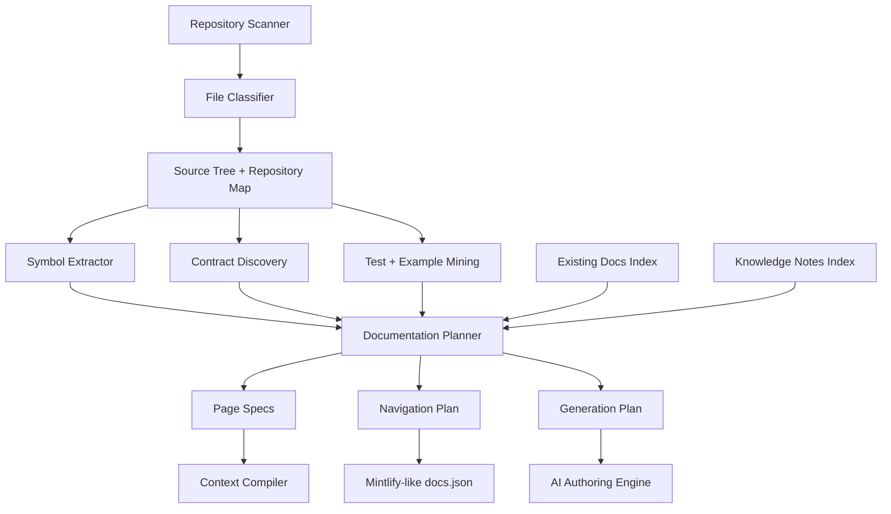
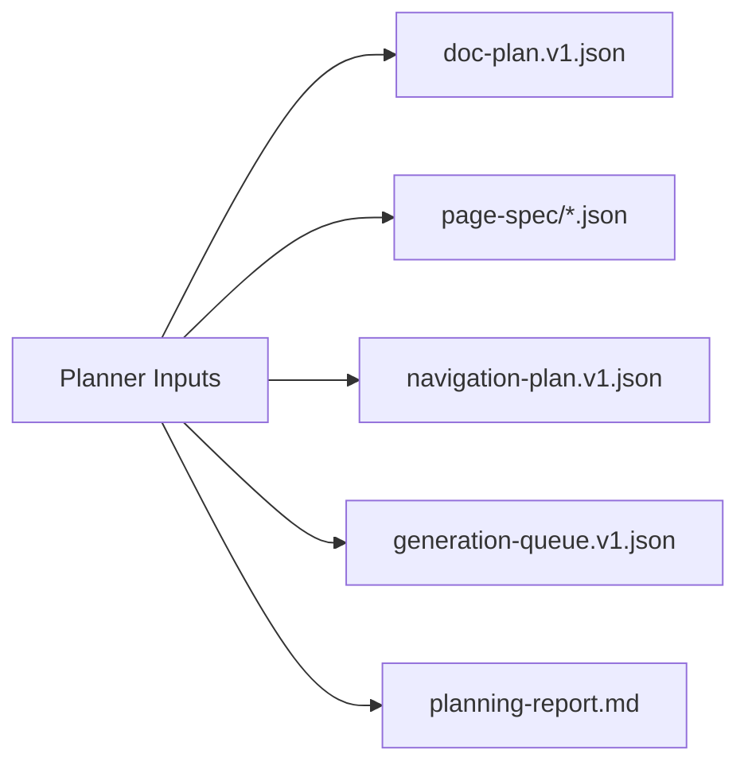

------
title: Build From Scratch: Mintlify-like AI-driven Documentation Generator CLI - Part 017
description: Membangun documentation planner sebagai otak sistem: dari repository map, contract, symbol, examples, dan existing docs menjadi rencana dokumentasi yang terstruktur, explainable, incremental, dan siap dieksekusi oleh AI authoring engine.
series: learn-ai-docs-km-cli
seriesTitle: Build From Scratch: Mintlify-like AI-driven Documentation Generator CLI with Code2Prompt and Open-source Knowledge Management
order: 17
partTitle: Documentation Planner
tags:
- ai-docs
- documentation
- cli
- documentation-planner
- docs-as-code
- mdx
- mintlify
- code2prompt
- knowledge-management
date: 2026-07-04
---

# Part 017 — Documentation Planner

Kita sudah membangun fondasi sampai **context cache dan incremental build**. Sekarang kita masuk ke komponen yang menentukan apakah sistem dokumentasi ini akan terasa seperti alat serius atau hanya wrapper LLM: **documentation planner**.

Planner adalah tahap yang menjawab pertanyaan:

> “Dari codebase ini, halaman dokumentasi apa yang seharusnya ada, apa urutannya, apa sumber kebenarannya, dan halaman mana yang boleh dibuat, diubah, atau dibiarkan?”

Tanpa planner, pipeline akan cenderung seperti ini:

```txt
scan repo → kirim banyak file ke LLM → minta "buat dokumentasi" → dapat markdown panjang → bingung menaruhnya di mana
```

Itu bukan sistem. Itu hanya prompt besar.

Dengan planner, pipeline menjadi seperti ini:

```txt
scan repo
  → classify files
  → extract symbols/contracts/examples
  → build repository map
  → decide documentation inventory
  → generate page specs
  → generate context bundle per page
  → author page
  → verify page
  → review/apply
```

Planner adalah **compiler pass** yang mengubah pemahaman repo menjadi **rencana dokumentasi yang eksplisit**.

---

## 1. Posisi Planner di Arsitektur

Planner duduk setelah repository understanding engine dan sebelum prompt bundle generation.



Planner tidak menulis isi halaman. Planner menulis **keputusan**.

Keputusannya berupa:

- halaman apa yang dibutuhkan,
- kenapa halaman itu dibutuhkan,
- sumber mana yang mendukung halaman itu,
- tipe halaman apa yang cocok,
- halaman mana yang harus dibuat dari nol,
- halaman mana yang harus di-update,
- halaman mana yang harus dipertahankan,
- halaman mana yang sebaiknya dihapus atau ditandai stale,
- bagaimana navigasi disusun,
- dependency antar halaman,
- risk level dari setiap halaman.

Prinsipnya sederhana:

> LLM boleh membantu menulis, tetapi sistem harus tahu apa yang sedang diminta untuk ditulis.

---

## 2. Kenapa Planner Wajib Ada

Banyak sistem AI docs gagal karena menganggap masalah dokumentasi adalah masalah menulis. Padahal pada sistem production-grade, masalah utamanya adalah **perencanaan, pemilihan, dan pemeliharaan**.

### 2.1 Tanpa Planner, Output Menjadi Tidak Stabil

Jika kita langsung meminta LLM membuat dokumentasi dari repo, hasilnya akan berubah-ubah:

- hari ini menghasilkan `Getting Started`, besok `Quickstart`,
- hari ini endpoint dikelompokkan berdasarkan path, besok berdasarkan resource,
- hari ini setup Docker disebut penting, besok diabaikan,
- halaman lama bisa ditimpa tanpa alasan,
- navigasi bisa berubah total hanya karena perubahan kecil di repo.

Planner bertugas membuat keputusan struktural menjadi deterministic.

### 2.2 Tanpa Planner, Tidak Ada Unit Review yang Jelas

Reviewer manusia tidak ingin meninjau “semua dokumentasi”. Reviewer ingin meninjau unit kecil:

- halaman ini dibuat karena file ini,
- bagian ini berubah karena endpoint ini berubah,
- contoh ini berasal dari test ini,
- klaim ini berasal dari config ini.

Planner menciptakan unit review berupa **page spec** dan **generation task**.

### 2.3 Tanpa Planner, Context Compiler Tidak Tahu Target

Context compiler membutuhkan target. “Buat dokumentasi repo” terlalu luas. “Buat halaman quickstart untuk package `@acme/sdk`, dengan sumber `README.md`, `examples/basic.ts`, `package.json`, dan test `basic.test.ts`” jauh lebih bisa dikontrol.

Planner mengubah repo besar menjadi daftar target yang sempit.

---

## 3. Dokumentasi Adalah Inventory, Bukan Teks Acak

Mental model yang kita pakai:

> Sebuah docs site adalah inventory halaman yang punya tujuan, audience, sumber, status, owner, dan hubungan.

Maka artifact utama planner bukan markdown, tetapi **documentation inventory**.

Contoh inventory sederhana:

```json
{
  "schema": "doc-plan.v1",
  "project": {
    "name": "payments-sdk",
    "root": ".",
    "docsRoot": "docs"
  },
  "pages": [
    {
      "id": "page.quickstart",
      "path": "quickstart.mdx",
      "title": "Quickstart",
      "type": "tutorial",
      "operation": "update",
      "priority": 100,
      "sources": [
        "file:README.md",
        "file:package.json",
        "file:examples/basic.ts",
        "symbol:npm.package.payments-sdk"
      ],
      "reason": "Repository exposes an installable SDK with a README and runnable basic example."
    }
  ]
}
```

Inventory ini adalah bahan untuk:

- navigation generator,
- prompt bundle generator,
- review UI,
- CI check,
- drift detector,
- knowledge graph sync.

---

## 4. Input Planner

Planner tidak boleh membuat keputusan dari satu sumber saja. Ia harus menggabungkan beberapa artifact yang sudah kita bangun di part sebelumnya.

### 4.1 Repository Map

Dari Part 007:

```txt
repo-map.v1.json
```

Berisi:

- struktur direktori,
- project/workspace/package,
- entrypoint,
- docs root,
- public surface,
- build system,
- framework hints,
- generated code hints.

Planner memakai repository map untuk menjawab:

- ini library, app, service, CLI, SDK, atau monorepo?
- dokumentasi apa yang lazim dibutuhkan?
- package mana yang public?
- folder mana yang harus menjadi docs group?

### 4.2 Symbol Index

Dari Part 008:

```txt
symbols.v1.json
```

Berisi:

- class,
- function,
- exported module,
- CLI command,
- endpoint handler,
- config key,
- data type,
- public API symbol.

Planner memakai symbol index untuk menentukan halaman reference, konsep, dan API surface.

### 4.3 Contract Index

Dari Part 009:

```txt
contracts.v1.json
```

Berisi:

- OpenAPI specs,
- GraphQL schemas,
- AsyncAPI specs,
- JSON Schema,
- Protobuf,
- Avro,
- config contract,
- CLI contract,
- database migration signal.

Planner memakai contract index untuk membangun:

- API reference,
- auth docs,
- error docs,
- request/response guide,
- event docs,
- schema docs.

### 4.4 Example Index

Dari Part 010:

```txt
examples.v1.json
```

Berisi:

- usage episode,
- runnable examples,
- test-derived examples,
- fixture-based examples,
- sample request/response,
- CLI invocation,
- SDK usage.

Planner memakai example index untuk menentukan apakah halaman tutorial/how-to bisa dibuat secara grounded.

### 4.5 Existing Docs Index

Sistem juga harus membaca dokumentasi yang sudah ada.

```txt
existing-docs.v1.json
```

Berisi:

- page path,
- title,
- frontmatter,
- headings,
- links,
- code fences,
- source refs,
- generated markers,
- manual sections,
- last known source hashes.

Planner memakai ini untuk memutuskan operasi:

- `create`,
- `update`,
- `keep`,
- `split`,
- `merge`,
- `deprecate`,
- `deleteCandidate`.

### 4.6 Knowledge Notes Index

Dari integrasi Logseq/OpenNote nanti:

```txt
knowledge-notes.v1.json
```

Berisi:

- concept notes,
- ADR-like notes,
- glossary,
- troubleshooting notes,
- backlinks,
- source references,
- confidence.

Planner memakai notes bukan sebagai source final, tetapi sebagai enrichment.

Aturan penting:

> Source code dan formal contract punya authority lebih tinggi daripada notes. Notes membantu menjelaskan, bukan membatalkan fakta dari repo.

---

## 5. Output Planner

Planner menghasilkan beberapa artifact.



### 5.1 `doc-plan.v1.json`

Artifact utama. Berisi inventory halaman dan keputusan tingkat site.

### 5.2 `page-spec/*.json`

Satu contract per halaman. Ini akan dibahas lebih dalam di Part 018.

### 5.3 `navigation-plan.v1.json`

Struktur navigasi sebelum dirender menjadi `docs.json` atau format site lain.

### 5.4 `generation-queue.v1.json`

Daftar task yang akan dikerjakan AI authoring engine.

### 5.5 `planning-report.md`

Laporan manusia:

- halaman baru,
- halaman berubah,
- halaman stale,
- missing docs,
- ambiguous docs,
- risk warnings,
- source coverage.

---

## 6. Page Taxonomy

Planner harus punya taxonomy halaman. Tanpa taxonomy, semua halaman akan menjadi “overview” atau “guide” yang kabur.

Kita pakai taxonomy praktis yang kompatibel dengan pendekatan dokumentasi modern seperti Diátaxis: tutorial, how-to guide, reference, dan explanation. Dalam sistem kita, taxonomy ini diperluas untuk kebutuhan docs-as-code dan platform engineering.

### 6.1 Core Page Types

| Type | Tujuan | Sumber utama | Contoh |
|---|---|---|---|
| `overview` | Menjelaskan apa project ini dan kapan dipakai | README, package metadata, repo map | `overview.mdx` |
| `quickstart` | Membawa user ke hasil pertama secepat mungkin | README, example, package manager config | `quickstart.mdx` |
| `installation` | Cara install dan setup awal | package config, Dockerfile, build file | `installation.mdx` |
| `concept` | Menjelaskan mental model domain/arsitektur | symbols, notes, README, ADR | `concepts/routing.mdx` |
| `howTo` | Menyelesaikan task spesifik | examples, tests, APIs | `guides/add-webhook.mdx` |
| `tutorial` | Walkthrough belajar step-by-step | runnable examples | `tutorials/build-first-app.mdx` |
| `reference` | Fakta lengkap dan terstruktur | contracts, exported symbols | `reference/client.mdx` |
| `apiReference` | Endpoint/schema/API formal | OpenAPI, GraphQL, AsyncAPI | `api-reference/users/list.mdx` |
| `architecture` | Komponen, dependency, runtime view | repo map, imports, deployment config | `architecture/overview.mdx` |
| `troubleshooting` | Symptom/cause/fix | tests, issues, error classes, logs | `troubleshooting/auth-errors.mdx` |
| `runbook` | Operasi produksi | scripts, deployment config, alerts | `runbooks/restart-worker.mdx` |
| `migration` | Perubahan versi/upgrade | changelog, diff, deprecation metadata | `migration/v1-to-v2.mdx` |
| `releaseNote` | Ringkasan perubahan | git diff, changelog | `releases/2026-07.mdx` |

### 6.2 Jangan Campur Tipe Halaman

Halaman reference tidak boleh menjadi tutorial panjang. Tutorial tidak boleh berubah menjadi daftar semua opsi config. Troubleshooting tidak boleh menjadi explanation abstrak.

Ini penting karena setiap tipe halaman punya:

- struktur section berbeda,
- source requirement berbeda,
- verification berbeda,
- prompt template berbeda,
- review expectation berbeda.

---

## 7. Site Shape Detection

Planner pertama-tama harus memahami bentuk project. Kita tidak bisa memakai rencana dokumentasi yang sama untuk semua repo.

### 7.1 Library / SDK

Sinyal:

- package manifest,
- exported modules,
- examples folder,
- tests yang memakai public API,
- README installation.

Docs minimum:

```txt
overview
quickstart
installation
concepts
usage guides
API reference
examples
troubleshooting
```

### 7.2 HTTP API Service

Sinyal:

- OpenAPI spec,
- route handlers,
- auth middleware,
- controller files,
- request/response DTO,
- integration tests.

Docs minimum:

```txt
overview
authentication
quickstart
API reference
errors
pagination/filtering
webhooks/events if any
troubleshooting
```

### 7.3 CLI Tool

Sinyal:

- command parser,
- `bin` field in package manifest,
- Cobra/Click/Commander/Clap usage,
- shell scripts,
- README commands.

Docs minimum:

```txt
overview
installation
quickstart
commands reference
configuration
recipes
troubleshooting
```

### 7.4 Platform / Internal Service

Sinyal:

- Kubernetes manifests,
- Terraform,
- Helm,
- service configs,
- runbooks,
- CI/CD workflows,
- infra dependencies.

Docs minimum:

```txt
overview
architecture
local development
deployment
configuration
runbooks
troubleshooting
ownership
```

### 7.5 Monorepo

Sinyal:

- multiple packages/services,
- workspace config,
- nested manifests,
- shared libs,
- apps/packages/services directories.

Docs minimum:

```txt
root overview
getting started
workspace architecture
per-package docs
shared concepts
development workflow
release workflow
```

---

## 8. Planning Algorithm Level 0: Rule-Based First

Jangan langsung membuat planner berbasis LLM. Untuk production-grade system, mulai dari deterministic rules.

Pseudo-flow:

```txt
load repo map
load symbols
load contracts
load examples
load existing docs
classify project shape
create baseline page candidates
augment candidates from contracts
augment candidates from examples
augment candidates from public symbols
match candidates with existing docs
assign operation per page
score priority and risk
build navigation plan
emit page specs
emit planning report
```

Kenapa rule-based dulu?

- mudah dites,
- mudah di-debug,
- repeatable,
- bisa dijalankan di CI,
- tidak butuh token,
- mengurangi keputusan struktural yang berubah-ubah.

LLM boleh dipakai nanti untuk:

- menyarankan grouping halaman,
- memberi nama title yang lebih baik,
- mendeteksi missing conceptual docs,
- meringkas alasan planning.

Tetapi keputusan dasar harus deterministic.

---

## 9. Page Candidate Model

Planner tidak langsung membuat halaman final. Ia membuat **candidate** dulu.

```ts
export type PageCandidate = {
  id: string;
  proposedPath: string;
  proposedTitle: string;
  type: PageType;
  sourceRefs: SourceRef[];
  evidence: Evidence[];
  reason: string;
  audience: Audience;
  priority: number;
  risk: RiskLevel;
  confidence: number;
  operationHint?: PageOperation;
};
```

Contoh:

```json
{
  "id": "candidate.api.auth",
  "proposedPath": "api-reference/authentication.mdx",
  "proposedTitle": "Authentication",
  "type": "concept",
  "sourceRefs": [
    "contract:openapi.securitySchemes.bearerAuth",
    "file:src/middleware/auth.ts",
    "file:tests/auth.integration.test.ts"
  ],
  "reason": "OpenAPI defines bearerAuth and route middleware enforces Authorization header.",
  "audience": "apiConsumer",
  "priority": 95,
  "risk": "medium",
  "confidence": 0.88
}
```

Candidate harus explainable. Kalau developer bertanya “kenapa halaman ini dibuat?”, CLI harus bisa menjawab.

---

## 10. Candidate Sources

Candidate bisa lahir dari beberapa sumber.

### 10.1 README-Derived Candidates

README biasanya memberi sinyal halaman awal:

- overview,
- installation,
- quickstart,
- examples,
- configuration,
- contributing.

Tetapi README tidak boleh dipercaya sepenuhnya. README sering stale.

Aturan:

```txt
README can suggest page topics.
README cannot override current contracts/code.
```

### 10.2 Contract-Derived Candidates

OpenAPI, GraphQL, AsyncAPI, JSON Schema, dan CLI contract punya authority tinggi.

Jika ada OpenAPI:

- auth page candidate,
- errors page candidate,
- API reference group,
- endpoint pages,
- schema reference.

Jika ada CLI contract:

- commands reference,
- global options,
- config file docs,
- recipes.

### 10.3 Symbol-Derived Candidates

Jika public symbols banyak:

- API reference,
- module docs,
- concept docs,
- migration docs if deprecated symbols exist.

### 10.4 Example-Derived Candidates

Jika ada contoh nyata:

- quickstart,
- how-to guides,
- tutorials,
- recipes.

Contoh yang kuat sering lebih baik daripada abstraksi.

### 10.5 Architecture-Derived Candidates

Dari import graph, service topology, Docker/Kubernetes/Terraform:

- architecture overview,
- deployment view,
- runtime view,
- data flow,
- local development.

### 10.6 Existing-Docs-Derived Candidates

Jika halaman sudah ada, planner harus mempertahankan identitasnya sebisa mungkin.

Aturan:

```txt
Prefer updating existing page over creating duplicate page.
Prefer preserving human-owned path over generated path.
```

---

## 11. Matching Candidate ke Existing Page

Ini bagian penting. Banyak generator AI menghasilkan duplikasi:

```txt
quickstart.mdx
getting-started.mdx
start-here.mdx
installation-and-quickstart.mdx
```

Semua membahas hal mirip.

Planner harus melakukan matching.

### 11.1 Matching Signals

- exact path match,
- title similarity,
- frontmatter `docId`,
- generated marker,
- headings similarity,
- source refs overlap,
- internal links,
- page type,
- navigation position.

### 11.2 Stable Page ID

Setiap halaman perlu stable ID.

```mdx
------
docId: page.quickstart
sourceRefs:
- file:README.md
- file:examples/basic.ts
---
```

Path bisa berubah, title bisa berubah, tetapi `docId` mempertahankan identitas.

### 11.3 Match Result

```ts
type PageMatch = {
  candidateId: string;
  existingPageId?: string;
  matchScore: number;
  decision: "create" | "update" | "keep" | "split" | "merge" | "deprecate";
  explanation: string[];
};
```

---

## 12. Page Operation Model

Planner harus menghasilkan operasi eksplisit.

| Operation | Arti | Contoh |
|---|---|---|
| `create` | Halaman belum ada dan perlu dibuat | Ada OpenAPI baru, belum ada API reference |
| `update` | Halaman ada dan source berubah | Endpoint berubah |
| `keep` | Halaman masih valid | Tidak ada source change |
| `review` | Perlu human decision | Source ambiguous |
| `split` | Halaman terlalu besar/mencampur tipe | README-style giant page |
| `merge` | Dua halaman overlap | `getting-started` dan `quickstart` |
| `deprecate` | Halaman masih ada tapi tidak relevan | API v1 deprecated |
| `deleteCandidate` | Kandidat hapus, jangan otomatis delete | File lama tanpa source |

Jangan otomatis menghapus halaman. Deletion harus conservative.

Rule:

```txt
AI docs CLI may propose deletion.
It should not delete human-authored docs without explicit approval.
```

---

## 13. Priority Scoring

Tidak semua halaman sama penting.

Priority dipakai untuk:

- generation queue,
- review order,
- CI reporting,
- token budget allocation,
- incremental rebuild.

Contoh formula awal:

```txt
priority =
  public_surface_weight
+ source_authority_weight
+ user_journey_weight
+ freshness_weight
+ missing_docs_weight
+ risk_weight
- duplication_penalty
```

### 13.1 Priority Signals

| Signal | Naik jika |
|---|---|
| public surface | symbol/endpoint/package public |
| user journey | halaman membantu first success |
| source authority | didukung contract formal |
| freshness | source baru berubah |
| missing docs | belum ada halaman |
| risk | auth/payment/security behavior |
| examples | ada runnable example |

### 13.2 Priority Contoh

```json
{
  "pageId": "page.quickstart",
  "priority": 100,
  "components": {
    "userJourney": 30,
    "publicSurface": 20,
    "examples": 20,
    "missingDocs": 20,
    "risk": 10
  }
}
```

Priority harus explainable. Angka tanpa alasan tidak berguna.

---

## 14. Risk Scoring

Risk bukan berarti halaman buruk. Risk berarti halaman perlu verifikasi lebih ketat.

### 14.1 Risk Categories

| Risk | Contoh |
|---|---|
| `low` | Overview package sederhana |
| `medium` | Setup config, CLI command, API usage |
| `high` | Auth, payment, security, data deletion, migration |
| `critical` | Production runbook, incident response, destructive command |

### 14.2 Risk Influences Generation

Halaman high-risk harus:

- punya source refs kuat,
- tidak boleh mengarang default value,
- tidak boleh membuat command destruktif tanpa sumber,
- perlu human review,
- perlu verifier tambahan.

Contoh:

```json
{
  "pageId": "page.troubleshooting.database-reset",
  "risk": "critical",
  "requiresHumanReview": true,
  "forbiddenClaims": [
    "Do not claim a reset command is safe unless source explicitly states it.",
    "Do not invent production database commands."
  ]
}
```

---

## 15. Navigation Planning

Planner tidak hanya membuat daftar halaman. Ia juga merancang navigasi.

Mintlify modern menggunakan `docs.json` untuk mengatur groups, pages, dropdowns, tabs, dan anchors. Kita tidak harus mengimplementasikan Mintlify 1:1, tetapi model navigasi kita harus bisa dirender ke format serupa.

### 15.1 Navigation Intermediate Model

```json
{
  "schema": "navigation-plan.v1",
  "tabs": [
    {
      "id": "tab.docs",
      "label": "Docs",
      "groups": [
        {
          "id": "group.getting-started",
          "label": "Getting Started",
          "pages": ["page.overview", "page.quickstart", "page.installation"]
        },
        {
          "id": "group.guides",
          "label": "Guides",
          "pages": ["page.guides.webhooks", "page.guides.pagination"]
        },
        {
          "id": "group.reference",
          "label": "Reference",
          "pages": ["page.api.reference", "page.cli.reference"]
        }
      ]
    }
  ]
}
```

### 15.2 Navigation Rules

- Overview sebelum quickstart.
- Quickstart sebelum deep concepts.
- Concepts sebelum advanced guides jika konsep wajib dipahami.
- Reference setelah guides.
- Troubleshooting dekat dengan operational docs.
- Deprecated docs dipisahkan.
- Generated API reference jangan mencemari guide utama.

### 15.3 Navigation Anti-Patterns

```txt
❌ 80 endpoint pages langsung di root sidebar
❌ Architecture page sebelum user tahu produk apa ini
❌ Reference menjadi halaman pertama
❌ Internal runbook masuk public docs
❌ Duplicate groups: Guides, How-to, Recipes tanpa perbedaan
```

---

## 16. Dependency Antar Halaman

Halaman punya dependency.

Contoh:

- `quickstart` depends on `installation`,
- `webhooks guide` depends on `authentication`,
- `API reference` depends on OpenAPI contract,
- `architecture runtime view` depends on repo map and deployment config,
- `migration guide` depends on changelog/diff.

Model:

```json
{
  "pageId": "page.guides.webhooks",
  "dependsOnPages": ["page.authentication", "page.api.reference.webhooks"],
  "dependsOnSources": [
    "contract:openapi.paths./webhooks",
    "file:tests/webhooks.integration.test.ts"
  ]
}
```

Dependency dipakai untuk:

- ordering generation,
- detecting stale downstream pages,
- navigation ordering,
- link validation,
- context selection.

---

## 17. Planning with Existing Docs

Jika repo sudah punya dokumentasi, planner harus hormat terhadap human work.

### 17.1 Generated Marker

Generated halaman bisa punya marker:

```mdx
<!-- aidocs:generated:start section="api-summary" sourceHash="abc123" -->
Generated content here.
<!-- aidocs:generated:end -->
```

Planner bisa update bagian generated tanpa menyentuh bagian manual.

### 17.2 Human-Owned Sections

Bagian manual harus dianggap protected.

```mdx
<!-- aidocs:manual:start -->
This section is maintained by the platform team.
<!-- aidocs:manual:end -->
```

### 17.3 Merge Strategy

Planner harus memutuskan:

```txt
update generated block only
append new generated block
create sibling page
propose split
require human review
```

Jangan rewrite seluruh halaman hanya karena satu endpoint berubah.

---

## 18. Missing Docs Detection

Planner juga bertugas mendeteksi lubang dokumentasi.

Contoh missing docs:

- OpenAPI punya security scheme tetapi tidak ada auth page.
- CLI punya config file tetapi tidak ada config reference.
- SDK punya public methods tetapi tidak ada reference.
- Tests menunjukkan pagination tetapi docs tidak menjelaskan pagination.
- Error codes ada di contract tetapi tidak ada error guide.
- Deployment manifests ada tetapi tidak ada local development/deployment docs.

Output:

```json
{
  "missingDocs": [
    {
      "kind": "authDocsMissing",
      "severity": "high",
      "evidence": ["contract:openapi.components.securitySchemes.bearerAuth"],
      "recommendedPage": "page.authentication"
    }
  ]
}
```

Missing docs detection membuat CLI terasa seperti reviewer, bukan hanya writer.

---

## 19. Overdocumentation Detection

Tidak semua hal perlu halaman.

Planner juga harus mencegah dokumentasi berlebihan.

Contoh:

- internal helper function dibuat halaman reference,
- generated client code didokumentasikan detail,
- private config didorong ke public docs,
- fixture internal masuk guide,
- setiap test case menjadi tutorial.

Rule:

```txt
Document public behavior, not every implementation detail.
Document internal details only if target audience is maintainers/operators.
```

Overdocumentation buruk karena:

- sidebar penuh noise,
- docs makin sulit dirawat,
- drift makin sering,
- user sulit menemukan first success path.

---

## 20. Planner Artifact Schema

Kita desain schema `doc-plan.v1`.

```ts
export type DocPlan = {
  schema: "doc-plan.v1";
  generatedAt: string;
  project: ProjectIdentity;
  inputs: PlannerInputRefs;
  siteShape: SiteShape;
  pages: PlannedPage[];
  navigation: NavigationPlanRef;
  generationQueue: GenerationTaskRef[];
  missingDocs: MissingDocFinding[];
  staleDocs: StaleDocFinding[];
  duplicateDocs: DuplicateDocFinding[];
  risks: PlanningRisk[];
  diagnostics: PlanningDiagnostic[];
};
```

`PlannedPage`:

```ts
export type PlannedPage = {
  id: string;
  path: string;
  title: string;
  type: PageType;
  operation: PageOperation;
  audience: Audience;
  priority: number;
  risk: RiskLevel;
  confidence: number;
  sourceRefs: SourceRef[];
  evidence: Evidence[];
  dependsOnPages: string[];
  dependsOnSources: SourceRef[];
  ownerHints: OwnerHint[];
  reviewPolicy: ReviewPolicy;
  generationPolicy: GenerationPolicy;
  verificationPolicy: VerificationPolicy;
  explanation: string;
};
```

---

## 21. Example `doc-plan.v1.json`

```json
{
  "schema": "doc-plan.v1",
  "generatedAt": "2026-07-04T00:00:00Z",
  "project": {
    "name": "payments-sdk",
    "root": ".",
    "docsRoot": "docs"
  },
  "siteShape": {
    "primary": "sdk",
    "secondary": ["http-api-client"],
    "confidence": 0.91,
    "evidence": [
      "file:package.json has library entrypoints",
      "file:examples/basic.ts exists",
      "symbol:PaymentClient exported"
    ]
  },
  "pages": [
    {
      "id": "page.overview",
      "path": "index.mdx",
      "title": "Overview",
      "type": "overview",
      "operation": "update",
      "audience": "developer",
      "priority": 100,
      "risk": "low",
      "confidence": 0.94,
      "sourceRefs": ["file:README.md", "file:package.json"],
      "dependsOnPages": [],
      "dependsOnSources": ["file:README.md"],
      "reviewPolicy": { "requiresHumanReview": false },
      "generationPolicy": { "allowNewPage": true, "allowRewrite": false },
      "verificationPolicy": { "requireSourceBackedClaims": true },
      "explanation": "Existing overview page should be updated because README and package metadata changed."
    },
    {
      "id": "page.quickstart",
      "path": "quickstart.mdx",
      "title": "Quickstart",
      "type": "quickstart",
      "operation": "create",
      "audience": "developer",
      "priority": 98,
      "risk": "medium",
      "confidence": 0.89,
      "sourceRefs": [
        "file:examples/basic.ts",
        "file:tests/basic.integration.test.ts",
        "file:package.json"
      ],
      "dependsOnPages": ["page.installation"],
      "dependsOnSources": ["file:examples/basic.ts"],
      "reviewPolicy": { "requiresHumanReview": true },
      "generationPolicy": { "allowNewPage": true, "allowRewrite": false },
      "verificationPolicy": {
        "requireRunnableExamples": true,
        "requireSourceBackedClaims": true
      },
      "explanation": "A runnable basic example exists but no dedicated quickstart page exists."
    }
  ]
}
```

---

## 22. Planning Report untuk Manusia

JSON bagus untuk mesin, tapi developer butuh laporan yang enak dibaca.

Contoh `planning-report.md`:

```md
# Documentation Plan Report

## Summary

- Project shape: SDK / HTTP API client
- Existing docs: 4 pages
- Planned pages: 11 pages
- Create: 5
- Update: 3
- Keep: 2
- Review required: 1

## New Pages

### quickstart.mdx

Reason: Runnable example exists in `examples/basic.ts`, but no quickstart page exists.

Sources:
- `examples/basic.ts`
- `tests/basic.integration.test.ts`
- `package.json`

Risk: medium
Review: required

## Missing Docs

- Authentication docs missing, but OpenAPI security scheme exists.
- Error code reference missing, but error responses exist in OpenAPI.
```

Laporan ini penting untuk trust. User harus bisa melihat **kenapa** sistem ingin menulis sesuatu.

---

## 23. CLI Commands untuk Planner

Command minimal:

```bash
aidocs plan
```

Output:

```txt
✓ Loaded repo map
✓ Loaded 248 symbols
✓ Loaded 37 contracts
✓ Loaded 19 examples
✓ Indexed 8 existing docs pages
✓ Detected project shape: sdk + http-api-client
✓ Planned 14 pages

Create: 5
Update: 4
Keep: 3
Review: 2

Artifacts:
  .aidocs/plans/doc-plan.v1.json
  .aidocs/plans/navigation-plan.v1.json
  .aidocs/plans/page-specs/*.json
  .aidocs/reports/planning-report.md
```

Debug command:

```bash
aidocs plan explain page.quickstart
```

Output:

```txt
page.quickstart
  operation: create
  priority: 98
  risk: medium
  confidence: 0.89

Why:
  - examples/basic.ts contains runnable SDK usage
  - tests/basic.integration.test.ts validates same flow
  - no existing page matched quickstart intent
  - package.json exposes installable package

Sources:
  - examples/basic.ts
  - tests/basic.integration.test.ts
  - package.json
```

Diff command:

```bash
aidocs plan diff --base .aidocs/plans/previous-doc-plan.v1.json
```

---

## 24. Planner Test Strategy

Planner harus sangat dites karena ia membuat keputusan struktural.

### 24.1 Golden Fixture Tests

Buat fixture repo:

```txt
fixtures/
  sdk-basic/
  api-openapi/
  cli-tool/
  monorepo-mixed/
  stale-docs/
  duplicate-docs/
```

Test:

```txt
input artifacts → planner → expected doc-plan snapshot
```

### 24.2 Property-Like Tests

Invariant:

- setiap page ID unique,
- setiap planned page punya sourceRefs kecuali manual page,
- page path tidak duplicate,
- navigation hanya refer page yang ada,
- high-risk page requires review,
- deleteCandidate tidak boleh menjadi destructive operation otomatis.

### 24.3 Regression Tests

Setiap bug planner harus menjadi fixture.

Contoh bug:

```txt
Bug: README and quickstart generated duplicate pages.
Fixture: existing docs have getting-started.mdx with sourceRefs to examples/basic.ts.
Expected: update existing page, not create quickstart.mdx.
```

---

## 25. Failure Modes Planner

### 25.1 Duplicate Page Explosion

Gejala:

```txt
quickstart.mdx
getting-started.mdx
installation-guide.mdx
setup.mdx
```

Penyebab:

- matching existing docs lemah,
- taxonomy tidak jelas,
- title similarity saja tidak cukup.

Mitigasi:

- stable doc ID,
- sourceRefs overlap,
- page type matching,
- duplicate detection.

### 25.2 Missing Critical Page

Gejala:

- API punya auth tetapi docs tidak menjelaskan auth.

Penyebab:

- contract discovery tidak masuk planner,
- security scheme tidak diberi priority tinggi.

Mitigasi:

- contract-derived candidate rules,
- missing docs checks,
- high-risk domain rules.

### 25.3 Overdocumentation

Gejala:

- semua internal helper jadi halaman.

Penyebab:

- public/private boundary buruk,
- symbol extraction terlalu agresif.

Mitigasi:

- public surface score,
- audience policy,
- generated code filter.

### 25.4 Random Navigation

Gejala:

- sidebar berubah drastis walau source change kecil.

Penyebab:

- LLM menentukan navigation bebas.

Mitigasi:

- deterministic navigation plan,
- stable group IDs,
- sorted page priority,
- navigation diff.

### 25.5 Unsafe Update

Gejala:

- halaman manual ditimpa.

Penyebab:

- planner tidak mengenali manual/generated section.

Mitigasi:

- ownership markers,
- update only generated blocks,
- human review gate.

---

## 26. Minimal Implementation Plan

Kita implement planner secara bertahap.

### Step 1 — Load Inputs

```ts
const repoMap = loadJson<RepoMap>(paths.repoMap);
const symbols = loadJson<SymbolIndex>(paths.symbols);
const contracts = loadJson<ContractIndex>(paths.contracts);
const examples = loadJson<ExampleIndex>(paths.examples);
const existingDocs = loadExistingDocs(paths.docsRoot);
```

### Step 2 — Detect Site Shape

```ts
const siteShape = detectSiteShape({ repoMap, symbols, contracts, examples });
```

### Step 3 — Generate Candidates

```ts
const candidates = [
  ...baselineCandidates(siteShape),
  ...contractCandidates(contracts),
  ...symbolCandidates(symbols),
  ...exampleCandidates(examples),
  ...architectureCandidates(repoMap),
];
```

### Step 4 — Match Existing Docs

```ts
const matches = matchCandidatesToExistingPages(candidates, existingDocs);
```

### Step 5 — Decide Operations

```ts
const pages = candidates.map(candidate =>
  decidePlannedPage(candidate, matches, existingDocs)
);
```

### Step 6 — Build Navigation

```ts
const navigation = buildNavigationPlan(pages, siteShape);
```

### Step 7 — Validate Invariants

```ts
validateDocPlan({ pages, navigation });
```

### Step 8 — Write Artifacts

```ts
writeJson('.aidocs/plans/doc-plan.v1.json', plan);
writeJson('.aidocs/plans/navigation-plan.v1.json', navigation);
writeMarkdown('.aidocs/reports/planning-report.md', renderReport(plan));
```

---

## 27. Planner as Architecture Control Point

Planner adalah tempat kita menjaga kualitas sistem.

Bukan AI authoring engine.

AI authoring engine hanya menjalankan page spec. Kalau planner salah, authoring engine akan menulis halaman yang salah dengan sangat meyakinkan.

Jadi invariant paling penting:

```txt
Bad plan → good prose → bad documentation.
Good plan → imperfect prose → reviewable documentation.
```

Planner membuat sistem ini bisa tumbuh dari eksperimen menjadi tool production-grade.

---

## 28. Apa yang Harus Kamu Kuasai Setelah Part Ini

Setelah part ini, kamu seharusnya bisa menjelaskan:

- kenapa docs generator membutuhkan planner,
- bagaimana membedakan inventory dokumentasi dari teks dokumentasi,
- bagaimana page candidate dibuat,
- bagaimana existing docs dicocokkan,
- bagaimana operasi `create/update/keep/review/split/merge/deprecate` diputuskan,
- bagaimana priority dan risk scoring memengaruhi generation queue,
- bagaimana navigation plan dibangun sebelum `docs.json`,
- bagaimana planner membantu anti-hallucination dan human review,
- bagaimana membuat planner deterministic dan testable.

Part berikutnya akan memperdalam unit terpenting dari output planner: **page generation contract**.

---

## References

- Diátaxis documentation framework: https://diataxis.fr/
- Diátaxis in five minutes: https://diataxis.fr/start-here/
- Mintlify navigation with `docs.json`: https://www.mintlify.com/docs/organize/navigation
- Mintlify global settings and `docs.json`: https://www.mintlify.com/docs/organize/settings
