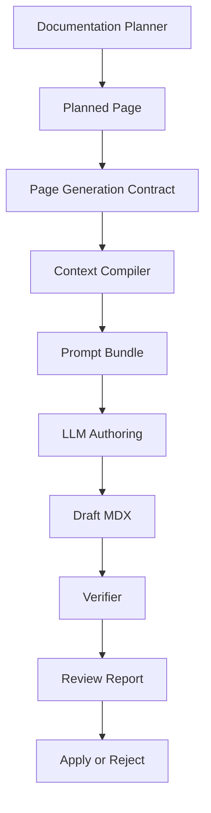
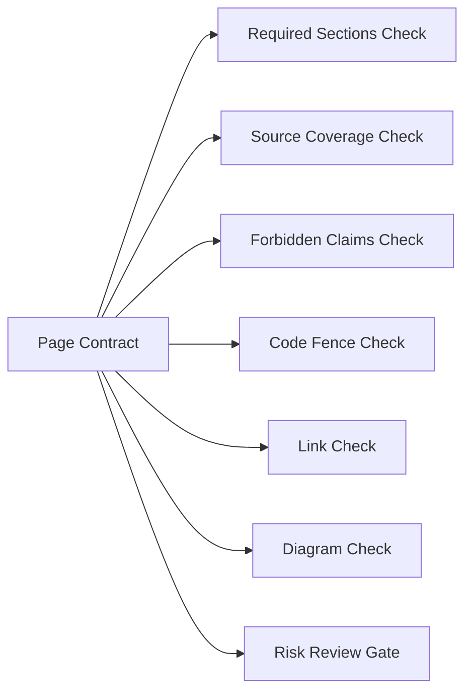
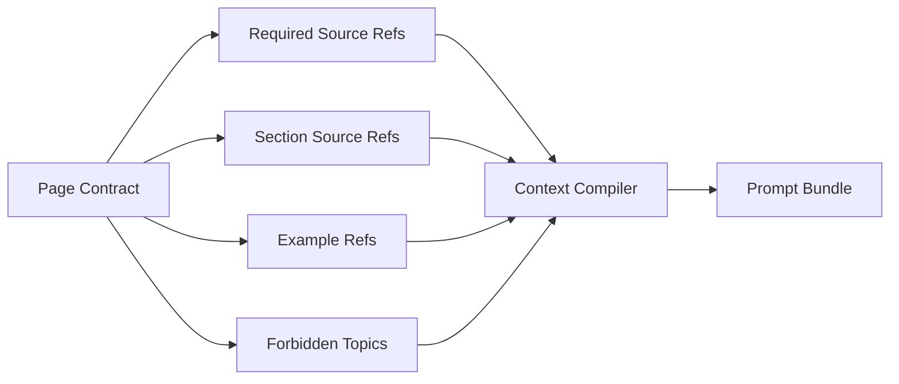
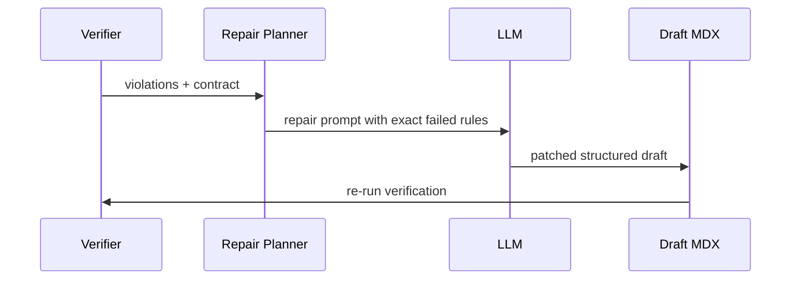

------
title: Build From Scratch: Mintlify-like AI-driven Documentation Generator CLI - Part 018
description: Mendesain page generation contract agar setiap halaman AI-generated punya objective, audience, source refs, section plan, forbidden claims, output schema, review policy, dan verification rules yang eksplisit.
series: learn-ai-docs-km-cli
seriesTitle: Build From Scratch: Mintlify-like AI-driven Documentation Generator CLI with Code2Prompt and Open-source Knowledge Management
order: 18
partTitle: Page Generation Contract
tags:
- ai-docs
- documentation
- cli
- page-contract
- structured-output
- mdx
- source-grounded-generation
- verifier
- code2prompt
date: 2026-07-04
---

# Part 018 — Page Generation Contract

Di Part 017 kita membangun **documentation planner**. Planner menghasilkan daftar halaman dan keputusan struktural. Sekarang kita masuk ke unit kerja paling penting sebelum LLM menulis apa pun: **page generation contract**.

Kontrak ini menjawab:

> “Untuk halaman ini, apa tujuan tepatnya, siapa pembacanya, sumber mana yang boleh dipakai, struktur apa yang wajib ada, klaim apa yang dilarang, output harus berbentuk apa, dan bagaimana hasilnya diverifikasi?”

Tanpa contract, kita akan mengirim prompt seperti:

```txt
Buat halaman quickstart berdasarkan repo ini.
```

Itu terlalu longgar.

Dengan contract, kita mengirim sesuatu seperti:

```txt
Buat halaman Quickstart untuk developer baru.
Gunakan hanya sumber berikut.
Wajib jelaskan install, minimal example, expected output, next steps.
Jangan mengarang environment variable.
Jangan menyebut fitur yang tidak ada di source.
Output harus MDX dengan frontmatter tertentu.
Semua code snippet harus berasal dari example/test atau jelas ditandai generated dan diverifikasi.
```

Contract membuat AI authoring menjadi **bounded generation**, bukan free writing.

---

## 1. Posisi Page Contract dalam Pipeline



Planner memutuskan halaman apa yang perlu ada. Page contract menentukan **cara halaman itu boleh ditulis**.

Contract menjadi boundary antara sistem deterministic dan LLM.

---

## 2. Kenapa Page Contract Wajib Ada

### 2.1 LLM Butuh Batas yang Spesifik

LLM sangat bagus menulis teks yang terdengar benar. Itu justru berbahaya untuk dokumentasi developer.

Developer docs harus:

- akurat,
- source-backed,
- runnable,
- jelas batas versinya,
- tidak mengarang fitur,
- tidak menyembunyikan risiko,
- mudah diverifikasi.

Prompt umum tidak cukup untuk menjamin itu.

### 2.2 Contract Membuat Output Bisa Diverifikasi

Verifier tidak bisa bekerja kalau tidak tahu ekspektasi halaman.

Misalnya, halaman quickstart harus punya:

- installation step,
- minimal usage,
- expected result,
- next step.

Jika contract menyebut section wajib, verifier bisa memeriksa apakah section ada.

### 2.3 Contract Membuat Human Review Lebih Ringan

Reviewer tidak perlu menebak maksud generator. Mereka bisa melihat:

- halaman ini dibuat dari source mana,
- section mana wajib,
- bagian mana high-risk,
- klaim apa yang perlu dicek,
- contoh mana yang harus runnable.

Review menjadi structured.

---

## 3. Mental Model: Contract Bukan Prompt

Jangan samakan contract dengan prompt template.

| Elemen | Tugas |
|---|---|
| Page contract | Menyatakan intent, source, constraint, output, verification |
| Prompt template | Merender contract + context menjadi instruksi LLM |
| Context bundle | Menyediakan source material yang dipilih |
| Verifier | Memeriksa draft terhadap contract |

Contract harus bisa dibaca oleh:

- prompt renderer,
- context compiler,
- verifier,
- review UI,
- CI checker,
- human reviewer.

Maka contract sebaiknya berupa structured artifact, bukan paragraph prompt mentah.

---

## 4. Contract sebagai Artifact

Nama artifact:

```txt
.aidocs/plans/page-specs/page.quickstart.json
```

Schema:

```txt
page-spec.v1
```

Contoh minimal:

```json
{
  "schema": "page-spec.v1",
  "pageId": "page.quickstart",
  "path": "quickstart.mdx",
  "title": "Quickstart",
  "type": "quickstart",
  "audience": "developer",
  "objective": "Help a new developer install the SDK and run the smallest working example.",
  "sourceRefs": [
    "file:package.json",
    "file:examples/basic.ts",
    "file:tests/basic.integration.test.ts"
  ],
  "requiredSections": [
    "What you will build",
    "Prerequisites",
    "Install",
    "Configure",
    "Run the example",
    "Expected result",
    "Next steps"
  ],
  "forbiddenClaims": [
    "Do not claim a default API key environment variable unless present in source.",
    "Do not mention browser support unless source or package metadata confirms it."
  ],
  "output": {
    "format": "mdx",
    "frontmatterRequired": true
  },
  "verification": {
    "requireSourceBackedClaims": true,
    "requireRunnableCodeFences": true,
    "requireInternalLinksValid": true
  }
}
```

---

## 5. Contract Field: Identity

Identity menjaga halaman tetap stabil.

```ts
export type PageIdentity = {
  pageId: string;
  path: string;
  title: string;
  slug: string;
  type: PageType;
  operation: PageOperation;
};
```

### 5.1 `pageId`

Stable ID halaman.

```txt
page.quickstart
page.authentication
page.api.users.list
page.architecture.runtime
```

Jangan bergantung hanya pada path. Path bisa berubah saat reorganisasi docs.

### 5.2 `path`

Target output MDX.

```txt
quickstart.mdx
guides/webhooks.mdx
api-reference/users/list.mdx
```

### 5.3 `type`

Tipe halaman menentukan template, section, dan verifier.

```ts
type PageType =
  | "overview"
  | "quickstart"
  | "installation"
  | "concept"
  | "tutorial"
  | "howTo"
  | "reference"
  | "apiReference"
  | "architecture"
  | "troubleshooting"
  | "runbook"
  | "migration";
```

---

## 6. Contract Field: Objective

Objective harus spesifik. Jangan tulis:

```txt
Explain the project.
```

Tulis:

```txt
Help a backend developer understand how this service receives payment events, validates signatures, stores them, and exposes query endpoints.
```

Objective yang baik menyebut:

- audience,
- task/understanding target,
- boundary,
- expected outcome.

Contoh:

```json
{
  "objective": "Help a first-time API consumer authenticate requests using the supported bearer token scheme and understand common authentication failures."
}
```

Objective buruk:

```json
{
  "objective": "Write authentication docs."
}
```

Kenapa buruk?

- tidak menyebut user,
- tidak menyebut source boundary,
- tidak menyebut hasil yang diinginkan,
- tidak memberi batas fitur.

---

## 7. Contract Field: Audience

Audience mengubah cara menulis.

```ts
type Audience =
  | "newDeveloper"
  | "apiConsumer"
  | "sdkUser"
  | "maintainer"
  | "operator"
  | "platformEngineer"
  | "securityReviewer";
```

### 7.1 Audience Examples

| Audience | Style | Avoid |
|---|---|---|
| `newDeveloper` | step-by-step, minimal jargon | internals too early |
| `apiConsumer` | requests, auth, errors, examples | implementation internals |
| `sdkUser` | import, instantiate, call, handle errors | server deployment details |
| `maintainer` | architecture, code boundaries, tests | marketing tone |
| `operator` | runbook, symptoms, commands, rollback | vague explanations |
| `securityReviewer` | threat, auth, permission, data flow | unverified security claims |

Audience harus memengaruhi:

- section order,
- terminology,
- examples,
- risk warnings,
- depth.

---

## 8. Contract Field: Source References

Source refs adalah daftar sumber yang boleh dipakai.

```json
{
  "sourceRefs": [
    {
      "id": "file:src/auth/middleware.ts",
      "role": "primary",
      "authority": "implementation"
    },
    {
      "id": "contract:openapi.components.securitySchemes.bearerAuth",
      "role": "primary",
      "authority": "contract"
    },
    {
      "id": "file:tests/auth.integration.test.ts",
      "role": "supporting",
      "authority": "test"
    }
  ]
}
```

### 8.1 Source Role

| Role | Arti |
|---|---|
| `primary` | Sumber utama yang wajib dipakai |
| `supporting` | Sumber pendukung untuk contoh/edge case |
| `context` | Latar belakang, bukan sumber klaim utama |
| `negative` | Sumber yang menunjukkan hal tidak didukung |

### 8.2 Source Authority

| Authority | Contoh | Kekuatan |
|---|---|---|
| `contract` | OpenAPI, schema, CLI spec | sangat kuat |
| `implementation` | source code | kuat |
| `test` | integration test | kuat untuk behavior contoh |
| `config` | package/Docker/K8s config | kuat untuk setup |
| `existingDocs` | README/docs lama | sedang, bisa stale |
| `knowledgeNote` | Logseq/OpenNote note | rendah-sedang, perlu cross-check |

Rule:

```txt
A generated claim must be traceable to at least one source ref.
For high-risk claims, require primary source refs.
```

---

## 9. Contract Field: Allowed Claims and Forbidden Claims

Ini bagian anti-hallucination yang sangat penting.

### 9.1 Allowed Claims

Allowed claims membantu generator tetap fokus.

```json
{
  "allowedClaims": [
    "The SDK can be installed with npm if package.json contains a package name.",
    "The basic payment flow can be described using examples/basic.ts.",
    "Authentication uses bearer tokens if OpenAPI securitySchemes defines bearerAuth."
  ]
}
```

Allowed claims bukan daftar semua kalimat. Ia adalah batas konseptual.

### 9.2 Forbidden Claims

Forbidden claims mencegah pola halusinasi umum.

```json
{
  "forbiddenClaims": [
    "Do not claim OAuth support unless OpenAPI or implementation shows OAuth.",
    "Do not invent environment variable names.",
    "Do not claim retry behavior unless source contains retry logic or docs.",
    "Do not mention production readiness unless deployment/runbook sources support it.",
    "Do not create destructive commands."
  ]
}
```

### 9.3 Negative Capability

Dokumentasi yang bagus kadang harus berkata “tidak diketahui” atau “tidak tersedia”.

Contoh:

```mdx
The repository does not define a retry policy in the inspected source files. If your integration needs retries, implement them at the caller level or confirm the behavior with the maintainers.
```

Itu lebih defensible daripada mengarang exponential backoff.

---

## 10. Contract Field: Section Plan

Section plan adalah outline wajib.

```json
{
  "sections": [
    {
      "id": "what-you-will-build",
      "heading": "What you will build",
      "required": true,
      "purpose": "Set user expectation before commands."
    },
    {
      "id": "install",
      "heading": "Install",
      "required": true,
      "sourceRefs": ["file:package.json"]
    },
    {
      "id": "run-example",
      "heading": "Run the example",
      "required": true,
      "sourceRefs": ["file:examples/basic.ts"]
    }
  ]
}
```

### 10.1 Section Types

```ts
type SectionType =
  | "intro"
  | "prerequisites"
  | "steps"
  | "concept"
  | "example"
  | "referenceTable"
  | "warning"
  | "troubleshooting"
  | "nextSteps";
```

### 10.2 Section-Level Source Refs

Jangan hanya beri source refs di tingkat halaman. Verifier lebih kuat kalau source refs ada di tingkat section.

```json
{
  "id": "authentication-header",
  "heading": "Send the Authorization header",
  "sourceRefs": [
    "contract:openapi.components.securitySchemes.bearerAuth",
    "file:tests/auth.integration.test.ts"
  ]
}
```

---

## 11. Contract Field: Example Requirements

Docs developer tanpa contoh sering tidak cukup. Tetapi contoh yang salah lebih buruk daripada tidak ada contoh.

```json
{
  "examples": [
    {
      "id": "example.basic-sdk-usage",
      "sourceRef": "file:examples/basic.ts",
      "required": true,
      "runnable": true,
      "language": "ts",
      "expectedOutputSourceRef": "file:tests/basic.integration.test.ts",
      "redactionPolicy": "default"
    }
  ]
}
```

### 11.1 Example Policy

| Policy | Arti |
|---|---|
| `sourceOnly` | Hanya boleh memakai contoh dari source/test |
| `adaptedFromSource` | Boleh menyederhanakan contoh dengan tetap menyebut asalnya |
| `generatedAllowed` | Boleh membuat contoh baru, tetapi harus diverifikasi |
| `noExamples` | Tidak boleh menambahkan contoh |

Untuk high-risk docs, gunakan `sourceOnly` atau `adaptedFromSource`.

### 11.2 Example Transformation Rules

Contoh test sering mengandung noise:

```ts
it('creates payment', async () => {
  const client = new PaymentClient({ apiKey: 'test_key' });
  const result = await client.payments.create({ amount: 1000, currency: 'USD' });
  expect(result.status).toBe('created');
});
```

Docs-ready version:

```ts
const client = new PaymentClient({ apiKey: process.env.PAYMENTS_API_KEY });

const payment = await client.payments.create({
  amount: 1000,
  currency: 'USD',
});

console.log(payment.status);
```

Tetapi environment variable `PAYMENTS_API_KEY` hanya boleh dipakai jika:

- ada di README,
- ada di `.env.example`,
- ada di config docs,
- atau contract mengizinkan placeholder generic.

Kalau tidak ada, gunakan placeholder jelas:

```ts
const client = new PaymentClient({ apiKey: '<your-api-key>' });
```

---

## 12. Contract Field: MDX Output Requirements

Karena output kita MDX, contract harus mendefinisikan format.

```json
{
  "output": {
    "format": "mdx",
    "frontmatter": {
      "required": true,
      "fields": {
        "title": "Quickstart",
        "description": "Install the SDK and run your first working example.",
        "sourceRefs": ["file:package.json", "file:examples/basic.ts"]
      }
    },
    "allowedComponents": ["Card", "CardGroup", "Accordion", "Tabs", "Steps", "Warning", "Note"],
    "allowMermaid": true,
    "codeFencePolicy": {
      "languageRequired": true,
      "noUnlabeledShellCommands": true
    }
  }
}
```

### 12.1 MDX Rules

- Frontmatter wajib valid.
- Heading dimulai dari `#` sekali saja.
- Code fence harus punya language tag.
- Mermaid block harus valid syntax dasar.
- Internal links harus memakai target existing/planned page.
- Komponen custom harus masuk allowlist.
- Jangan menyisipkan JSX yang tidak didukung renderer.

### 12.2 Human Edit Markers

Jika halaman sudah ada, output contract harus menjaga bagian manual.

```json
{
  "editing": {
    "mode": "patchGeneratedSectionsOnly",
    "preserveManualSections": true,
    "generatedMarkers": true
  }
}
```

---

## 13. Contract Field: Link Requirements

Docs site adalah graph. Page contract harus tahu link yang wajib ada.

```json
{
  "links": {
    "requiredOutgoing": [
      { "targetPageId": "page.installation", "reason": "Quickstart depends on install." },
      { "targetPageId": "page.authentication", "reason": "Example requires API key." }
    ],
    "allowedExternalDomains": ["docs.npmjs.com"],
    "forbiddenExternalLinks": ["unofficial-random-blog.example"]
  }
}
```

Internal links sebaiknya berbasis page ID dulu, lalu renderer mengubah ke path.

```txt
[[page.installation]] → /installation
```

Ini mencegah link rusak saat path berubah.

---

## 14. Contract Field: Diagram Requirements

Untuk architecture atau flow docs, contract bisa meminta Mermaid.

```json
{
  "diagrams": [
    {
      "id": "runtime-flow",
      "type": "mermaid.sequenceDiagram",
      "required": true,
      "sourceRefs": [
        "file:src/routes/payments.ts",
        "file:src/services/payment-service.ts",
        "file:src/db/payment-repository.ts"
      ],
      "rules": [
        "Only include components visible in source refs.",
        "Do not invent queues or caches."
      ]
    }
  ]
}
```

Rule penting:

```txt
A diagram is a claim.
Every node and edge needs source support.
```

Diagram yang indah tetapi mengarang topology adalah bug serius.

---

## 15. Contract Field: Verification Policy

Verifier membaca contract dan draft MDX.

```json
{
  "verification": {
    "requireSourceBackedClaims": true,
    "requireSectionCoverage": true,
    "requireRunnableCodeFences": true,
    "requireValidFrontmatter": true,
    "requireValidInternalLinks": true,
    "requireNoForbiddenClaims": true,
    "requireMermaidParse": true,
    "minimumSourceCoverage": 0.8
  }
}
```

### 15.1 Verification Levels

```ts
type VerificationLevel = "basic" | "standard" | "strict" | "critical";
```

| Level | Cocok untuk | Checks |
|---|---|---|
| `basic` | overview low-risk | frontmatter, links, sections |
| `standard` | guides/reference umum | source claims, code fences, links |
| `strict` | auth/payment/config | stronger provenance, examples, forbidden claims |
| `critical` | runbook/destructive ops | human review, command safety, explicit evidence |

### 15.2 Contract to Verifier Mapping



---

## 16. Contract Field: Review Policy

Tidak semua generated page bisa langsung apply.

```json
{
  "review": {
    "requiresHumanReview": true,
    "requiredReviewers": ["codeowners:src/auth/**"],
    "reviewReasons": [
      "Page documents authentication behavior.",
      "Bearer token handling is security-sensitive."
    ],
    "autoApplyAllowed": false
  }
}
```

### 16.1 Auto-Apply Rules

Auto-apply hanya masuk akal untuk perubahan rendah risiko:

- generated reference dari contract formal,
- typo/link fix,
- regenerated table dari schema,
- page yang sepenuhnya generated dan verifier lulus.

Jangan auto-apply untuk:

- auth/security,
- destructive commands,
- migration steps,
- production runbooks,
- human-authored sections,
- ambiguous source.

---

## 17. Contract Field: Generation Policy

Generation policy mengatur apa yang boleh dilakukan authoring engine.

```json
{
  "generation": {
    "mode": "createNewPage",
    "allowNewSections": false,
    "allowRewriteWholePage": false,
    "allowPatchGeneratedSections": true,
    "allowInventedExamples": false,
    "allowUnverifiedClaims": false,
    "tone": "clear-technical",
    "style": "step-by-step"
  }
}
```

### 17.1 Generation Modes

| Mode | Arti |
|---|---|
| `createNewPage` | Buat halaman baru |
| `patchGeneratedSectionsOnly` | Update bagian generated saja |
| `proposePatch` | Buat diff, jangan apply |
| `outlineOnly` | Buat outline untuk review |
| `repairExistingDraft` | Perbaiki draft yang gagal verifier |

Mode harus eksplisit. Jangan biarkan LLM memutuskan sendiri apakah ia akan rewrite atau patch.

---

## 18. Contract Field: Style and Voice

Style matters, tetapi jangan jadikan style sebagai pengganti fakta.

```json
{
  "style": {
    "voice": "direct-technical",
    "verbosity": "dense-but-followable",
    "avoid": [
      "marketing fluff",
      "unsupported claims",
      "overly broad introductions",
      "generic AI phrasing"
    ],
    "prefer": [
      "short explanations followed by concrete steps",
      "source-backed examples",
      "explicit assumptions",
      "clear failure cases"
    ]
  }
}
```

Untuk seri ini, style mirip buku build-from-scratch:

- mulai dari masalah nyata,
- bangun mental model,
- desain data model,
- tulis algorithm,
- bahas failure mode,
- baru masuk implementasi.

---

## 19. Structured Output dari LLM

Agar authoring engine lebih mudah dikontrol, kita bisa meminta LLM menghasilkan structured draft object, bukan langsung raw MDX.

Contoh output schema:

```json
{
  "type": "object",
  "required": ["frontmatter", "sections", "sourceClaims"],
  "properties": {
    "frontmatter": {
      "type": "object",
      "required": ["title", "description"],
      "properties": {
        "title": { "type": "string" },
        "description": { "type": "string" }
      }
    },
    "sections": {
      "type": "array",
      "items": {
        "type": "object",
        "required": ["id", "heading", "bodyMdx"],
        "properties": {
          "id": { "type": "string" },
          "heading": { "type": "string" },
          "bodyMdx": { "type": "string" },
          "sourceRefs": {
            "type": "array",
            "items": { "type": "string" }
          }
        }
      }
    },
    "sourceClaims": {
      "type": "array",
      "items": {
        "type": "object",
        "required": ["claim", "sourceRefs"],
        "properties": {
          "claim": { "type": "string" },
          "sourceRefs": {
            "type": "array",
            "items": { "type": "string" }
          }
        }
      }
    }
  }
}
```

Structured output membantu karena:

- renderer bisa membangun MDX final,
- verifier bisa membaca claims,
- source refs bisa dipetakan,
- repair loop lebih mudah.

Tetapi structured output bukan silver bullet. Output bisa valid secara schema tetapi tetap salah secara fakta. Karena itu tetap perlu verifier.

---

## 20. Page Contract Full Example

Berikut contoh contract yang lebih lengkap.

```json
{
  "schema": "page-spec.v1",
  "pageId": "page.authentication",
  "path": "concepts/authentication.mdx",
  "title": "Authentication",
  "type": "concept",
  "operation": "create",
  "audience": "apiConsumer",
  "objective": "Explain how API consumers authenticate requests using the supported bearer token scheme and how common authentication failures are represented.",
  "risk": "high",
  "priority": 96,
  "sourceRefs": [
    {
      "id": "contract:openapi.components.securitySchemes.bearerAuth",
      "role": "primary",
      "authority": "contract"
    },
    {
      "id": "file:src/middleware/auth.ts",
      "role": "primary",
      "authority": "implementation"
    },
    {
      "id": "file:tests/auth.integration.test.ts",
      "role": "supporting",
      "authority": "test"
    }
  ],
  "sections": [
    {
      "id": "overview",
      "heading": "How authentication works",
      "required": true,
      "type": "concept",
      "sourceRefs": [
        "contract:openapi.components.securitySchemes.bearerAuth",
        "file:src/middleware/auth.ts"
      ]
    },
    {
      "id": "authorization-header",
      "heading": "Send the Authorization header",
      "required": true,
      "type": "example",
      "sourceRefs": [
        "contract:openapi.components.securitySchemes.bearerAuth",
        "file:tests/auth.integration.test.ts"
      ]
    },
    {
      "id": "common-failures",
      "heading": "Common authentication failures",
      "required": true,
      "type": "troubleshooting",
      "sourceRefs": [
        "file:tests/auth.integration.test.ts",
        "contract:openapi.components.responses.UnauthorizedError"
      ]
    }
  ],
  "allowedClaims": [
    "Requests use bearer token authentication if supported by the OpenAPI security scheme.",
    "Authentication failures may be described only if they appear in OpenAPI responses or tests."
  ],
  "forbiddenClaims": [
    "Do not claim OAuth, refresh tokens, sessions, cookies, or API key authentication unless source refs show them.",
    "Do not invent token expiration behavior.",
    "Do not claim retry behavior for authentication failures."
  ],
  "examples": [
    {
      "id": "example.authorization-header",
      "policy": "adaptedFromSource",
      "sourceRef": "file:tests/auth.integration.test.ts",
      "language": "bash",
      "runnable": false,
      "notes": "Use placeholder token. Do not include real secrets."
    }
  ],
  "links": {
    "requiredOutgoing": [
      {
        "targetPageId": "page.api.reference",
        "reason": "Authentication applies to API endpoints."
      },
      {
        "targetPageId": "page.troubleshooting.auth-errors",
        "reason": "Auth failures need troubleshooting detail if separate page exists."
      }
    ]
  },
  "output": {
    "format": "mdx",
    "frontmatterRequired": true,
    "allowMermaid": false,
    "allowedComponents": ["Note", "Warning", "CodeGroup", "Tabs"],
    "codeFencePolicy": {
      "languageRequired": true,
      "shellCommandsMustBeNonDestructive": true
    }
  },
  "generation": {
    "mode": "createNewPage",
    "allowInventedExamples": false,
    "allowUnverifiedClaims": false,
    "allowRewriteWholePage": false,
    "tone": "direct-technical"
  },
  "verification": {
    "level": "strict",
    "requireSourceBackedClaims": true,
    "requireSectionCoverage": true,
    "requireNoForbiddenClaims": true,
    "requireValidInternalLinks": true,
    "minimumSourceCoverage": 0.9
  },
  "review": {
    "requiresHumanReview": true,
    "autoApplyAllowed": false,
    "reviewReasons": [
      "Authentication behavior is security-sensitive.",
      "The page explains failure behavior that must match implementation and API contract."
    ]
  }
}
```

---

## 21. Rendering Contract ke Prompt

Prompt template tidak boleh menghilangkan struktur contract.

Rendered prompt outline:

```txt
# Task
Generate MDX documentation for page.authentication.

# Objective
Explain how API consumers authenticate requests using the supported bearer token scheme...

# Audience
apiConsumer

# Allowed Sources
[Source blocks inserted here]

# Required Sections
1. How authentication works
2. Send the Authorization header
3. Common authentication failures

# Forbidden Claims
- Do not claim OAuth...
- Do not invent token expiration behavior...

# Output Requirements
Return structured JSON matching this schema...

# Verification Expectations
The draft will be checked for source-backed claims, forbidden claims, valid links...
```

Notice: prompt renderer memakai contract. Prompt bukan ditulis manual setiap kali.

---

## 22. Contract and Context Compiler

Page contract menentukan context selection.



Jika contract menyebut source primary, context compiler wajib memasukkan source itu atau gagal.

Rule:

```txt
If primary source refs cannot be loaded, do not generate the page.
```

Lebih baik gagal daripada membuat halaman dari context yang tidak cukup.

---

## 23. Contract and Repair Loop

Jika verifier gagal, contract dipakai untuk memperbaiki draft.

Flow:



Contoh failure:

```json
{
  "violation": "missingRequiredSection",
  "sectionId": "common-failures",
  "contractRef": "sections[2]"
}
```

Repair prompt:

```txt
The draft is missing required section `Common authentication failures`.
Add only that section.
Use these source refs only:
- file:tests/auth.integration.test.ts
- contract:openapi.components.responses.UnauthorizedError
Do not change other sections.
```

Repair harus sempit. Jangan generate ulang seluruh halaman.

---

## 24. Contract Versioning

Schema contract akan berubah.

Gunakan version field:

```json
{
  "schema": "page-spec.v1"
}
```

Jika nanti berubah:

```json
{
  "schema": "page-spec.v2"
}
```

Jangan silently interpret schema lama sebagai baru. Buat migrator:

```bash
aidocs migrate page-specs --from v1 --to v2
```

Contract versioning penting karena page spec akan masuk cache, CI, dan review artifact.

---

## 25. Contract Validation

Sebelum generation, contract harus divalidasi.

Checks:

- `pageId` valid,
- `path` valid,
- `type` valid,
- required sections tidak duplicate,
- primary source refs tersedia,
- risk level valid,
- high-risk page punya human review,
- output format valid,
- verification policy valid,
- forbidden claims tidak kosong untuk high-risk page,
- required links mengarah ke planned/existing page.

CLI:

```bash
aidocs page-spec validate .aidocs/plans/page-specs/page.authentication.json
```

Output:

```txt
✓ pageId valid
✓ path valid
✓ 3 required sections
✓ 3 source refs resolved
✓ high-risk review policy present
✓ verification level strict

Result: valid
```

Jika gagal:

```txt
✗ primary source ref not found: file:src/middleware/auth.ts
✗ high-risk page requires human review

Result: invalid
```

---

## 26. Contract Lint Rules

Validator memeriksa correctness. Linter memeriksa quality.

Contoh lint rule:

```txt
PAGE_SPEC_OBJECTIVE_TOO_GENERIC
PAGE_SPEC_NO_FORBIDDEN_CLAIMS_FOR_HIGH_RISK
PAGE_SPEC_TOO_MANY_REQUIRED_SECTIONS
PAGE_SPEC_SOURCE_REFS_TOO_WEAK
PAGE_SPEC_EXAMPLE_REQUIRED_BUT_NO_EXAMPLE_SOURCE
PAGE_SPEC_REFERENCE_PAGE_WITH_TUTORIAL_SECTIONS
PAGE_SPEC_CRITICAL_PAGE_AUTO_APPLY_ENABLED
```

Lint output:

```txt
warning PAGE_SPEC_OBJECTIVE_TOO_GENERIC
  page: page.overview
  objective: "Explain the project"
  suggestion: Mention target audience and expected outcome.
```

---

## 27. Testing Page Contracts

### 27.1 Snapshot Test

Input planned page → expected page spec.

```txt
fixtures/sdk-basic/doc-plan.json
→ generate page specs
→ compare snapshots
```

### 27.2 Invariant Test

```ts
for (const spec of pageSpecs) {
  assertUniqueSectionIds(spec);
  assertPrimarySourcesExist(spec);
  assertHighRiskRequiresReview(spec);
  assertNoAutoApplyForCritical(spec);
  assertOutputFormatSupported(spec);
}
```

### 27.3 Prompt Rendering Test

Contract → prompt bundle → snapshot.

Tujuan:

- memastikan forbidden claims tidak hilang,
- required sections muncul,
- source refs masuk,
- output schema masuk.

### 27.4 Verifier Integration Test

Contract + bad draft → expected violations.

Contoh:

```txt
Given authentication contract
And draft claims OAuth support
Verifier should emit forbidden claim violation
```

---

## 28. Failure Modes Page Contract

### 28.1 Contract Terlalu Longgar

Gejala:

- LLM menulis generic page,
- klaim tidak bisa dilacak,
- verifier tidak tahu harus cek apa.

Mitigasi:

- wajib objective spesifik,
- wajib source refs,
- wajib required sections,
- wajib forbidden claims untuk medium/high risk.

### 28.2 Contract Terlalu Ketat

Gejala:

- generation sering gagal,
- output kaku,
- halaman tidak natural dibaca.

Mitigasi:

- bedakan required vs optional sections,
- gunakan style guidance bukan exact paragraph,
- izinkan repair loop,
- jangan mengunci wording.

### 28.3 Source Refs Tidak Cukup

Gejala:

- halaman penting gagal dibuat,
- LLM kekurangan informasi.

Mitigasi:

- planner menandai `needsMoreSources`,
- context compiler mencari supporting source,
- human review request.

### 28.4 Contract Tidak Sinkron dengan Plan

Gejala:

- doc plan bilang `quickstart`, page spec bilang `reference`, navigation bingung.

Mitigasi:

- validate page spec against doc plan,
- stable IDs,
- generated spec tidak diedit manual tanpa lint.

### 28.5 Verifier Tidak Menggunakan Contract

Gejala:

- contract bagus tapi tidak berdampak.

Mitigasi:

- setiap verification rule harus punya mapping dari contract,
- test violation per rule,
- report contractRef untuk setiap finding.

---

## 29. Minimal Implementation Plan

### Step 1 — Define Types

```ts
export type PageSpec = {
  schema: "page-spec.v1";
  pageId: string;
  path: string;
  title: string;
  type: PageType;
  operation: PageOperation;
  audience: Audience;
  objective: string;
  risk: RiskLevel;
  priority: number;
  sourceRefs: SourceRefSpec[];
  sections: SectionSpec[];
  allowedClaims?: string[];
  forbiddenClaims: string[];
  examples?: ExampleRequirement[];
  links?: LinkRequirements;
  diagrams?: DiagramRequirement[];
  output: OutputRequirements;
  generation: GenerationPolicy;
  verification: VerificationPolicy;
  review: ReviewPolicy;
};
```

### Step 2 — Generate From Planned Page

```ts
export function createPageSpec(input: {
  plannedPage: PlannedPage;
  repoMap: RepoMap;
  symbols: SymbolIndex;
  contracts: ContractIndex;
  examples: ExampleIndex;
}): PageSpec {
  const base = baseSpecFromPlannedPage(input.plannedPage);
  const sections = sectionPlanForPage(input.plannedPage, input);
  const forbiddenClaims = forbiddenClaimsForRisk(input.plannedPage, input);
  const verification = verificationForRisk(input.plannedPage.risk);
  const review = reviewForRisk(input.plannedPage.risk);

  return {
    ...base,
    sections,
    forbiddenClaims,
    verification,
    review,
    output: mdxOutputRequirements(input.plannedPage),
    generation: generationPolicy(input.plannedPage),
  };
}
```

### Step 3 — Validate

```ts
const validation = validatePageSpec(spec, availableSources, docPlan);
if (!validation.ok) {
  throw new PageSpecValidationError(validation.findings);
}
```

### Step 4 — Write Artifact

```ts
writeJson(
  `.aidocs/plans/page-specs/${spec.pageId}.json`,
  spec
);
```

### Step 5 — Render Prompt Bundle

```ts
const bundle = renderPromptBundle({ spec, context });
```

---

## 30. CLI Commands

```bash
aidocs page-spec list
```

```txt
page.overview                  update   low      valid
page.quickstart                create   medium   valid
page.authentication            create   high     valid review-required
page.troubleshooting.auth      create   high     warning: examples missing
```

Explain:

```bash
aidocs page-spec explain page.authentication
```

Output:

```txt
Page: Authentication
Type: concept
Risk: high
Review: required

Objective:
  Explain how API consumers authenticate requests using the supported bearer token scheme...

Primary sources:
  - contract:openapi.components.securitySchemes.bearerAuth
  - file:src/middleware/auth.ts

Required sections:
  - How authentication works
  - Send the Authorization header
  - Common authentication failures

Forbidden claims:
  - Do not claim OAuth...
  - Do not invent token expiration behavior...
```

Validate all:

```bash
aidocs page-spec validate --all
```

Render prompt preview:

```bash
aidocs page-spec render-prompt page.authentication --preview
```

---

## 31. Design Invariants

Simpan invariant ini. Ini akan dipakai terus sampai verifier dan authoring engine.

```txt
Every generated page must have a page spec.
Every page spec must have a stable pageId.
Every page spec must declare audience and objective.
Every non-manual page spec must have source refs.
Every high-risk page must require human review.
Every required section must have a purpose.
Every example must have a policy.
Every diagram must be treated as a claim.
Every generated claim should be verifiable against source refs.
```

Invariant ini membuat sistem bisa dipercaya.

---

## 32. Apa yang Harus Kamu Kuasai Setelah Part Ini

Setelah part ini, kamu seharusnya bisa:

- menjelaskan perbedaan page contract, prompt template, dan context bundle,
- mendesain `page-spec.v1` untuk halaman MDX,
- membuat source refs dan authority model,
- menentukan required sections berdasarkan page type,
- menulis forbidden claims untuk mencegah hallucination,
- mengatur example policy,
- menentukan verification policy berdasarkan risk,
- membuat review policy untuk high-risk docs,
- merender contract menjadi prompt bundle,
- memakai contract sebagai basis repair loop,
- menguji page contract dengan snapshot, invariant, dan verifier tests.

Part berikutnya akan masuk ke **MDX authoring engine**: bagaimana draft structured output dirender menjadi MDX yang valid, preserve human edits, mendukung components, code fences, callouts, links, dan Mermaid.

---

## References

- Diátaxis documentation framework: https://diataxis.fr/
- Mintlify navigation with `docs.json`: https://www.mintlify.com/docs/organize/navigation
- Mintlify global settings and `docs.json`: https://www.mintlify.com/docs/organize/settings
- OpenAI Structured Outputs documentation: https://developers.openai.com/api/docs/guides/structured-outputs
