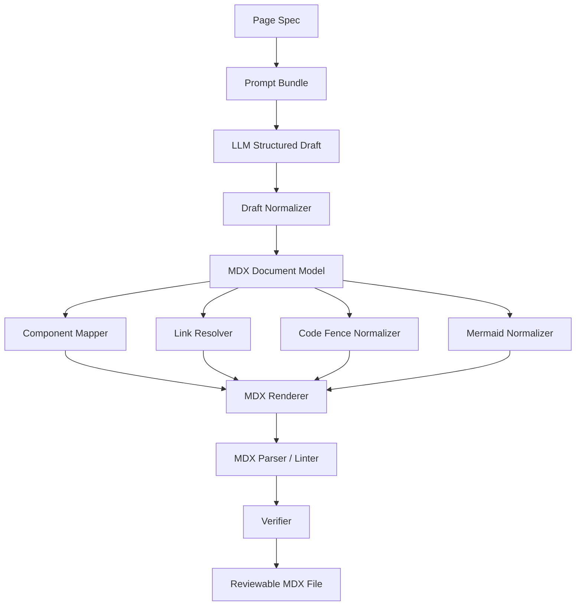
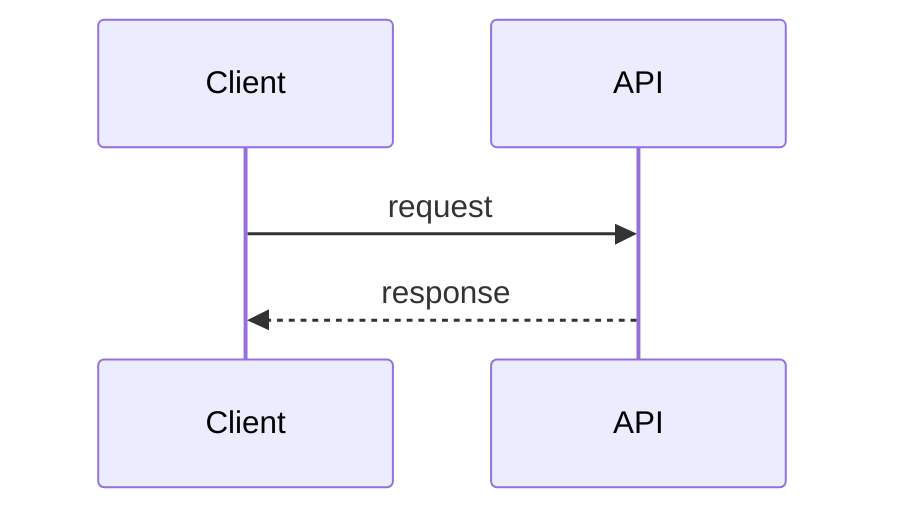
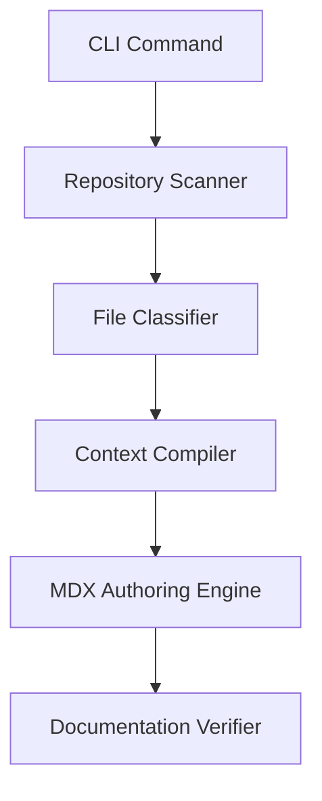
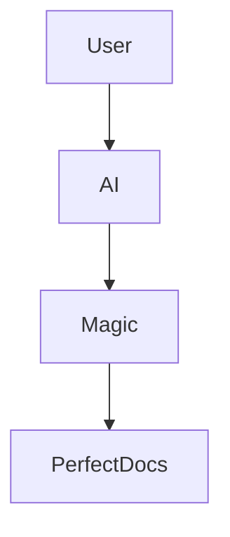
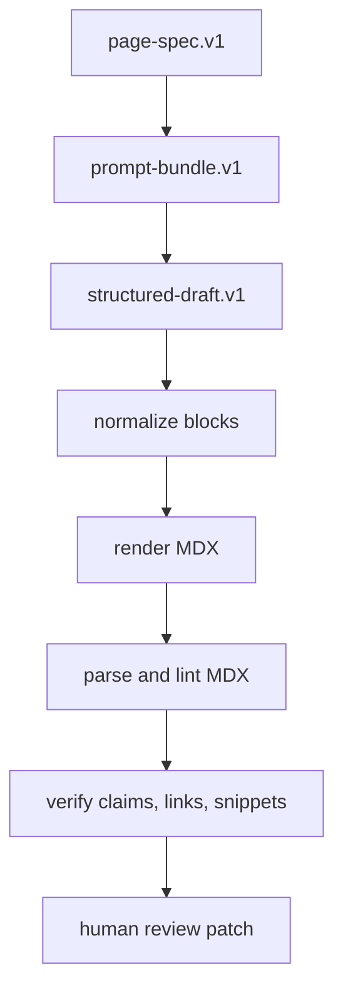

------
title: Build From Scratch: Mintlify-like AI-driven Documentation Generator CLI - Part 019
description: Membangun MDX authoring engine yang source-grounded, stabil, reviewable, dan aman untuk generated documentation pipeline.
series: learn-ai-docs-km-cli
seriesTitle: Build From Scratch: Mintlify-like AI-driven Documentation Generator CLI with Code2Prompt and Open-source Knowledge Management
order: 19
partTitle: MDX Authoring Engine
tags:
- ai-docs
- documentation
- cli
- mdx
- mintlify
- mermaid
- authoring-engine
- source-grounded-generation
date: 2026-07-04
---

# Part 019 — MDX Authoring Engine

Pada part sebelumnya kita sudah membuat **page generation contract**. Contract itu menjawab pertanyaan:

> Halaman apa yang perlu dibuat, untuk siapa, berdasarkan source apa, dengan section apa, dan aturan verifikasi apa?

Sekarang kita masuk ke tahap berikutnya:

> Bagaimana contract itu diubah menjadi file `.mdx` yang valid, stabil, mudah direview, aman diedit manusia, dan tidak rusak ketika digenerate ulang?

Inilah tugas **MDX authoring engine**.

Jangan anggap authoring engine sebagai fungsi sederhana seperti ini:

```ts
const mdx = llmResponse.text;
fs.writeFileSync(pagePath, mdx);
```

Itu bukan authoring engine. Itu hanya menyalin output model ke file.

Authoring engine production-grade harus menjadi **compiler stage** yang menerima structured draft, menormalkan struktur, menjaga provenance, memvalidasi MDX, menyelesaikan link, mengamankan komponen, dan menghasilkan artifact yang bisa diverifikasi.

---

## 1. Fakta Dasar yang Perlu Dipegang

MDX adalah format authoring yang menggabungkan Markdown dengan JSX/component usage. Dokumentasi resmi MDX menjelaskan MDX sebagai Markdown untuk era komponen, karena penulis dapat memakai JSX di dalam dokumen Markdown dan mengimpor komponen seperti chart atau alert. MDX core sendiri mengikuti CommonMark dan **frontmatter tidak otomatis menjadi fitur bawaan MDX core**; frontmatter biasanya ditambahkan oleh toolchain atau framework di atasnya.

Mintlify memakai MDX untuk halaman dokumentasinya dan menyediakan komponen bawaan untuk struktur konten, callout, navigasi, dan dokumentasi API. Mintlify juga memiliki callout seperti note, tip, warning, danger, dan sejenisnya. Untuk code block, praktik umum Markdown memakai fenced code block dengan triple backtick dan language hint. GitHub Docs juga merekomendasikan fenced code block dengan blank line sebelum dan sesudah block. Mermaid menyediakan syntax text-based untuk diagram seperti flowchart dan sequence diagram.

Referensi:

- MDX official site: https://mdxjs.com/
- MDX frontmatter guide: https://mdxjs.com/guides/frontmatter/
- Mintlify components: https://www.mintlify.com/docs/components
- Mintlify callouts: https://www.mintlify.com/docs/components/callouts
- GitHub fenced code blocks: https://docs.github.com/en/get-started/writing-on-github/working-with-advanced-formatting/creating-and-highlighting-code-blocks
- Mermaid flowchart syntax: https://mermaid.ai/open-source/syntax/flowchart.html
- Mermaid sequence diagram syntax: https://mermaid.ai/open-source/syntax/sequenceDiagram.html

Dari fakta ini ada konsekuensi penting:

1. Generated docs tidak boleh mengandalkan “MDX kira-kira valid”.
2. Frontmatter harus diperlakukan sebagai bagian dari docs framework contract, bukan semata fitur MDX universal.
3. JSX/component usage harus dibatasi supaya output aman, portable, dan bisa dilint.
4. Mermaid harus dianggap sebagai code artifact yang juga perlu divalidasi, bukan hanya hiasan.
5. Code fence harus diberi language hint dan source/provenance agar bisa dites.

---

## 2. Tujuan MDX Authoring Engine

Authoring engine bertanggung jawab menghasilkan file seperti:

```txt
learn-ai-docs-km-cli-part-019-mdx-authoring-engine.mdx
```

Tetapi secara internal dia tidak berpikir dalam bentuk string mentah. Dia berpikir dalam bentuk **document model**.

Input utama:

```txt
page-spec.v1
prompt-bundle.v1
source refs
example catalog
LLM structured draft
existing human-edited page
navigation context
style guide
```

Output utama:

```txt
page-draft.v1.json
page.mdx
page.provenance.json
page.verify.json
page.diff.patch
```

Mental modelnya:



Kuncinya: **LLM tidak langsung menulis file final**. LLM menghasilkan draft terstruktur. Authoring engine yang menjadikannya MDX final.

---

## 3. Kenapa Tidak Langsung Minta LLM Menghasilkan MDX?

Karena MDX adalah format yang terlihat sederhana tetapi punya banyak edge case.

Contoh masalah:

```mdx
Use <User> as the generic type.
```

Di Markdown biasa ini aman. Di MDX, `<User>` bisa dianggap JSX tag. Kalau tidak di-escape, build bisa gagal.

Contoh lain:

```mdx
The config value is {enabled: true}
```

Di MDX, `{...}` bisa masuk ke ekspresi JSX. Jika tidak valid, parser bisa error.

Contoh lain:

```mdx
<Note>
This is a note.
```

Komponen tidak ditutup. Build gagal.

Contoh lain:

````mdx

````

Diagram terlihat valid, tetapi bisa mengandung flow yang tidak ada di source. Secara syntax valid, secara fakta salah.

Karena itu authoring engine perlu melakukan beberapa hal:

- escape teks yang berisiko dibaca sebagai JSX,
- batasi komponen yang boleh digunakan,
- validasi struktur heading,
- validasi frontmatter,
- validasi internal links,
- validasi code fences,
- validasi Mermaid syntax,
- validasi claim provenance,
- preserve human edits.

---

## 4. Core Invariant

Authoring engine harus menjaga invariant berikut:

| Invariant | Maksud |
|---|---|
| Valid MDX | File harus bisa diparse oleh target renderer. |
| Source-grounded | Klaim penting harus memiliki source reference. |
| Reviewable diff | Perubahan harus kecil, jelas, dan stabil. |
| Human-safe | Edit manusia tidak hilang saat regenerate. |
| Component-safe | Hanya komponen yang diizinkan boleh muncul. |
| Link-safe | Internal link harus resolvable. |
| Example-safe | Snippet harus berasal dari source atau example catalog. |
| Diagram-safe | Diagram tidak boleh mengarang relasi. |
| Idempotent | Generate ulang tanpa perubahan input tidak boleh menghasilkan diff acak. |

Kalau satu invariant dilanggar, engine harus gagal dengan diagnostic yang jelas.

---

## 5. Document Model, Bukan String Model

Kita definisikan document model sederhana.

```ts
export type MdxDocument = {
  id: string;
  filePath: string;
  frontmatter: Frontmatter;
  body: MdxBlock[];
  provenance: DocumentProvenance;
  ownership: OwnershipPolicy;
  renderProfile: RenderProfile;
};

export type MdxBlock =
  | HeadingBlock
  | ParagraphBlock
  | ListBlock
  | CodeBlock
  | MermaidBlock
  | CalloutBlock
  | TabsBlock
  | StepsBlock
  | TableBlock
  | LinkBlock
  | GeneratedRegionBlock
  | ManualRegionBlock;
```

Kenapa harus block model?

Karena kita butuh operasi tingkat tinggi:

- memindahkan section,
- mengganti hanya section generated,
- mempertahankan section manual,
- menambah provenance per section,
- mengecek heading order,
- memvalidasi code block,
- menyelesaikan link internal,
- menghasilkan diff yang stabil.

Kalau semua hanya string, operasi di atas akan menjadi fragile.

---

## 6. Frontmatter Policy

Format seri ini memakai frontmatter seperti berikut:

```mdx
------
title: Build From Scratch: Mintlify-like AI-driven Documentation Generator CLI - Part 019
description: ...
series: learn-ai-docs-km-cli
seriesTitle: Build From Scratch: Mintlify-like AI-driven Documentation Generator CLI with Code2Prompt and Open-source Knowledge Management
order: 19
partTitle: MDX Authoring Engine
tags:
- ai-docs
- documentation
- cli
date: 2026-07-04
---
```

Dalam engine, frontmatter tidak boleh dihasilkan bebas oleh LLM. Frontmatter harus berasal dari `page-spec.v1` dan `docs project config`.

Contoh schema:

```ts
export type Frontmatter = {
  title: string;
  description: string;
  series?: string;
  seriesTitle?: string;
  order?: number;
  partTitle?: string;
  tags: string[];
  date: string;
};
```

Aturan:

1. `title` wajib unik dalam project.
2. `description` harus ringkas dan tidak mengandung klaim teknis yang tidak diverifikasi.
3. `order` harus konsisten dengan navigation.
4. `tags` harus berasal dari controlled vocabulary.
5. `date` harus ditentukan oleh build context, bukan oleh LLM.
6. LLM tidak boleh membuat field frontmatter baru kecuali schema mengizinkan.

Frontmatter adalah metadata operasional. Jangan perlakukan sebagai dekorasi.

---

## 7. Heading Policy

Generated page perlu heading yang stabil.

Aturan yang baik:

```txt
# H1 hanya satu
## H2 untuk section utama
### H3 untuk subsection
#### H4 hanya jika benar-benar perlu
```

Authoring engine harus menolak output seperti:

```mdx
# Page Title
### Langsung H3 tanpa H2
```

Atau:

```mdx
# Page Title
# Page Title Lagi
```

Heading bukan hanya style. Heading menentukan:

- table of contents,
- anchor link,
- search chunking,
- retrieval unit,
- review diff readability,
- downstream knowledge graph node.

Kita bisa menyimpan heading tree:

```ts
export type HeadingNode = {
  level: 1 | 2 | 3 | 4;
  text: string;
  slug: string;
  sourceRefs: SourceRef[];
  children: HeadingNode[];
};
```

Slug harus deterministic.

```txt
"MDX Authoring Engine" -> mdx-authoring-engine
"Code Fence Policy" -> code-fence-policy
```

Jika heading berubah sedikit, anchor berubah. Itu bisa merusak link internal. Karena itu heading harus dianggap sebagai API kecil dari dokumentasi.

---

## 8. Generated Region dan Manual Region

Salah satu masalah terbesar AI docs adalah overwrite edit manusia.

Solusinya: bedakan section generated dan section manual.

Contoh marker:

```mdx
{/* aidocs:start section="overview" mode="generated" hash="sha256:abc123" */}

## Overview

This page explains ...

{/* aidocs:end */}
```

Manual region:

```mdx
{/* aidocs:start section="team-notes" mode="manual" */}

## Team Notes

This part is maintained by humans.

{/* aidocs:end */}
```

Aturan:

1. Generated region boleh diganti oleh engine jika input hash berubah.
2. Manual region tidak boleh diganti otomatis.
3. Mixed region hanya boleh diubah dengan explicit approval.
4. Region marker harus valid MDX comment.
5. Region hash dipakai untuk mendeteksi edit manual di generated block.

Region model:

```ts
export type RegionPolicy = {
  id: string;
  mode: "generated" | "manual" | "mixed";
  inputHash?: string;
  lastGeneratedAt?: string;
  allowOverwrite: boolean;
};
```

Ini membuat regenerate aman.

---

## 9. Component Policy

MDX memungkinkan JSX. Itu powerful, tetapi berbahaya jika output dihasilkan model tanpa batas.

Kita harus membuat allowlist.

Contoh allowlist:

```ts
export const allowedComponents = {
  Note: {
    children: "markdown",
    props: {},
  },
  Tip: {
    children: "markdown",
    props: {},
  },
  Warning: {
    children: "markdown",
    props: {},
  },
  Danger: {
    children: "markdown",
    props: {},
  },
  Steps: {
    children: "Step[]",
    props: {},
  },
  Step: {
    children: "markdown",
    props: { title: "string" },
  },
  Tabs: {
    children: "Tab[]",
    props: {},
  },
  Tab: {
    children: "markdown",
    props: { title: "string" },
  },
};
```

Engine harus menolak:

```mdx
<script>alert('x')</script>
```

Atau:

```mdx
<MyCustomDangerousComponent eval="..." />
```

Atau:

```mdx
import fs from 'fs'
```

Untuk generated docs, default policy sebaiknya:

```txt
No imports.
No arbitrary JSX.
Only allowlisted components.
No raw HTML unless explicitly allowed.
No JavaScript expressions except safe literal props.
```

Kenapa seketat ini?

Karena docs adalah supply-chain surface. Build docs sering berjalan di CI, preview environment, dan website publik. Generated MDX yang tidak dibatasi bisa menjadi sumber build break, XSS risk, atau data leak.

---

## 10. Callout Mapping

LLM sering memakai kata seperti:

```txt
Important:
Warning:
Note:
Be careful:
```

Authoring engine bisa mengubahnya menjadi callout terstruktur.

Contoh input structured draft:

```json
{
  "type": "callout",
  "kind": "warning",
  "content": "Do not send source files containing secrets to a remote model provider."
}
```

Rendered MDX:

```mdx
<Warning>
Do not send source files containing secrets to a remote model provider.
</Warning>
```

Policy:

| Kind | Use case |
|---|---|
| `Note` | Informasi tambahan yang netral. |
| `Tip` | Praktik yang membantu. |
| `Warning` | Risiko operasional atau correctness. |
| `Danger` | Risiko destructive, secret leak, data loss. |
| `Check` | Verifikasi berhasil atau checklist. |

Jangan overuse callout. Terlalu banyak callout membuat halaman terasa seperti alarm terus-menerus.

---

## 11. Code Fence Policy

Code fence adalah bagian paling sensitif dari docs.

Code fence harus memiliki metadata:

```ts
export type CodeBlock = {
  language: string;
  code: string;
  sourceRefs: SourceRef[];
  runnable: boolean;
  command?: boolean;
  expectedOutput?: string;
  redactionStatus: "clean" | "redacted" | "unknown";
};
```

Aturan rendering:

````mdx
```bash
npx aidocs scan
```
````

Lebih baik daripada:

````mdx
```
npx aidocs scan
```
````

Language hint penting untuk:

- syntax highlighting,
- snippet extraction,
- runnable validation,
- docs search indexing,
- reader comprehension.

Untuk command destructive, beri explicit warning.

Buruk:

````mdx
```bash
rm -rf .aidocs
```
````

Lebih baik:

````mdx
<Warning>
The following command deletes the generated artifact cache. Do not run it if you need to inspect previous generation outputs.
</Warning>

```bash
rm -rf .aidocs
```
````

Tetapi lebih baik lagi adalah menyediakan command aman:

````mdx
```bash
npx aidocs cache clean --dry-run
```
````

Dan baru setelah itu:

````mdx
```bash
npx aidocs cache clean --confirm
```
````

---

## 12. Escaping Policy untuk MDX

Authoring engine harus escape konten yang dapat diparse sebagai JSX.

Kasus umum:

| Raw text | Risiko | Output aman |
|---|---|---|
| `<User>` | dianggap JSX tag | `` `<User>` `` atau `&lt;User&gt;` |
| `{enabled: true}` | dianggap expression | `` `{enabled: true}` `` |
| `Map<String, User>` | angle brackets | `` `Map<String, User>` `` |
| `a < b` | JSX parsing ambiguity | `a &lt; b` atau code span |
| `{{value}}` | expression/template ambiguity | code span |

Rule sederhana:

```ts
function escapeInlineMdx(text: string): string {
  return text
    .replace(/</g, "&lt;")
    .replace(/>/g, "&gt;");
}
```

Tapi rule ini terlalu kasar. Lebih baik context-aware:

- Di paragraph biasa, escape angle bracket yang bukan HTML/component allowlist.
- Di code span, biarkan apa adanya.
- Di fenced code block, biarkan apa adanya.
- Di JSX prop, escape quote dan brace dengan benar.
- Di Mermaid block, validasi syntax sendiri.

Dengan kata lain: jangan escape setelah semua menjadi string. Escape saat render block berdasarkan tipe block.

---

## 13. Table Policy

Table berguna untuk ringkasan, tetapi sering rusak jika cell mengandung pipe `|`.

Contoh raw yang rusak:

```mdx
| Field | Meaning |
|---|---|
| mode | generated | manual |
```

Cell `generated | manual` membuat kolom bertambah.

Authoring engine harus escape pipe:

```mdx
| Field | Meaning |
|---|---|
| mode | generated \| manual |
```

Aturan:

1. Table hanya untuk data yang benar-benar tabular.
2. Cell tidak boleh terlalu panjang.
3. Code dalam cell harus dibungkus backtick.
4. Pipe dalam cell harus di-escape.
5. Link dalam cell harus divalidasi.

Untuk content panjang, gunakan list, bukan table.

---

## 14. Link Resolver

Generated docs sering membuat link seperti:

```mdx
See [Context Engine](./context-engine.md)
```

Tetapi file sebenarnya:

```txt
learn-ai-docs-km-cli-part-011-context-engine-mental-model.mdx
```

Link resolver harus menyelesaikan link berdasarkan page registry.

Page registry:

```json
{
  "pages": [
    {
      "id": "context-engine-mental-model",
      "title": "Context Engine Mental Model",
      "path": "learn-ai-docs-km-cli-part-011-context-engine-mental-model.mdx",
      "anchors": ["context-engine-mental-model", "context-as-compiler"]
    }
  ]
}
```

Link request dari draft:

```json
{
  "text": "Context Engine Mental Model",
  "targetPageId": "context-engine-mental-model",
  "targetAnchor": "context-as-compiler"
}
```

Rendered:

```mdx
[Context Engine Mental Model](./learn-ai-docs-km-cli-part-011-context-engine-mental-model.mdx#context-as-compiler)
```

Generated docs sebaiknya tidak membuat raw path sendiri. Ia membuat semantic link request. Resolver yang menentukan path final.

---

## 15. Mermaid Block Policy

Diagram sangat membantu, tetapi diagram juga mudah mengarang.

Untuk generated Mermaid, engine harus menyimpan:

```ts
export type MermaidBlock = {
  kind: "flowchart" | "sequence" | "state" | "class";
  code: string;
  sourceRefs: SourceRef[];
  claims: DiagramClaim[];
  validation: MermaidValidation;
};
```

Contoh diagram source-grounded:

````mdx

````

Setiap edge harus punya alasan:

```json
{
  "edge": "Scanner -> Classifier",
  "evidence": ["part-005 scanner artifact feeds file classification", "part-006 classification consumes scan result"]
}
```

Aturan:

1. Jangan generate diagram jika source tidak cukup.
2. Diagram harus punya judul atau kalimat pengantar.
3. Edge harus berdasarkan artifact/dataflow nyata.
4. Jangan campur terlalu banyak concern dalam satu diagram.
5. Diagram harus bisa dirender oleh Mermaid parser target.

Diagram buruk:



Kenapa buruk?

- Tidak ada boundary.
- Tidak ada artifact.
- Tidak ada failure path.
- Tidak membantu developer membangun sistem.

Diagram yang lebih baik:



---

## 16. MDX Renderer

Renderer mengubah document model menjadi string MDX.

Pseudo-implementation:

```ts
export class MdxRenderer {
  render(doc: MdxDocument): string {
    return [
      this.renderFrontmatter(doc.frontmatter),
      ...doc.body.map((block) => this.renderBlock(block)),
    ].join("\n\n").trimEnd() + "\n";
  }

  private renderBlock(block: MdxBlock): string {
    switch (block.type) {
      case "heading": return this.renderHeading(block);
      case "paragraph": return this.renderParagraph(block);
      case "code": return this.renderCode(block);
      case "mermaid": return this.renderMermaid(block);
      case "callout": return this.renderCallout(block);
      case "table": return this.renderTable(block);
      default: return assertNever(block);
    }
  }
}
```

Renderer harus deterministic.

Artinya:

- ordering stabil,
- spacing stabil,
- newline stabil,
- quote style stabil,
- tag closing stabil,
- frontmatter ordering stabil,
- table formatting stabil.

Diff yang stabil adalah salah satu fitur paling penting untuk developer trust.

---

## 17. Structured Draft dari LLM

Jangan minta model langsung:

```txt
Write the MDX file.
```

Lebih baik minta model menghasilkan JSON sesuai schema:

```json
{
  "pageId": "mdx-authoring-engine",
  "sections": [
    {
      "id": "mental-model",
      "heading": "Mental Model",
      "purpose": "Explain why MDX authoring is a compiler stage",
      "blocks": [
        {
          "type": "paragraph",
          "text": "The authoring engine should not copy model output directly into files."
        }
      ],
      "sourceRefs": ["page-spec:019", "architecture:authoring-engine"]
    }
  ]
}
```

Lalu engine yang render ke MDX.

Keuntungan:

1. Parser bisa validasi struktur sebelum render.
2. Link bisa berupa semantic link, bukan path bebas.
3. Komponen bisa berupa type-safe block.
4. Code fence bisa diberi metadata.
5. Provenance bisa disimpan per block.
6. Repair loop lebih mudah.

---

## 18. Output Contract untuk LLM

Contoh contract:

```json
{
  "type": "object",
  "required": ["pageId", "sections"],
  "properties": {
    "pageId": { "type": "string" },
    "sections": {
      "type": "array",
      "items": {
        "type": "object",
        "required": ["id", "heading", "blocks", "sourceRefs"],
        "properties": {
          "id": { "type": "string" },
          "heading": { "type": "string" },
          "blocks": { "type": "array" },
          "sourceRefs": {
            "type": "array",
            "items": { "type": "string" }
          }
        }
      }
    }
  }
}
```

Tetapi schema saja belum cukup. Prompt juga harus mengandung rule:

```txt
Do not invent file paths.
Do not invent commands.
Do not invent API endpoints.
Do not create examples unless they are present in the supplied example catalog.
Represent links as targetPageId, not raw markdown URLs.
Represent code as code blocks with language and sourceRefs.
```

Authoring engine tetap harus memverifikasi setelah itu.

---

## 19. Provenance per Block

Provenance tidak cukup di level halaman. Harus bisa turun ke section atau block.

Contoh:

```json
{
  "blockId": "code-fence-policy.p3",
  "type": "paragraph",
  "claimRefs": ["claim:code-fence-language-required"],
  "sourceRefs": [
    {
      "kind": "external-doc",
      "url": "https://docs.github.com/en/get-started/writing-on-github/working-with-advanced-formatting/creating-and-highlighting-code-blocks",
      "note": "Fenced code blocks and language hints"
    }
  ]
}
```

Untuk source repo:

```json
{
  "blockId": "scanner-artifact.example",
  "sourceRefs": [
    {
      "kind": "repo-file",
      "path": "src/scanner/scan.ts",
      "hash": "sha256:...",
      "lines": [12, 48]
    }
  ]
}
```

Dengan ini verifier bisa bertanya:

> Klaim ini berasal dari mana?

Jika tidak ada jawaban, klaim harus diturunkan menjadi asumsi, dihapus, atau diberi warning.

---

## 20. Human Edit Preservation

Generated docs harus ramah terhadap edit manusia.

Ada tiga strategi.

### 20.1 Full generated file

Semua isi file dikontrol engine.

Cocok untuk:

- API reference generated dari OpenAPI,
- command reference generated dari CLI manifest,
- schema reference.

Risiko:

- human edit hilang.

### 20.2 Section-level ownership

Hanya section tertentu yang generated.

Cocok untuk:

- tutorial,
- guide,
- architecture docs.

### 20.3 Suggestion patch only

Engine tidak menulis file langsung. Ia menghasilkan patch.

Cocok untuk:

- repo enterprise,
- docs sensitif,
- human-review wajib.

Default yang aman:

```txt
local dev: write generated sections, keep manual sections
CI: produce diff/report, do not commit automatically
enterprise: suggestion patch only unless explicitly approved
```

---

## 21. Diff Model

Authoring engine harus menghasilkan diff yang bisa dibaca.

Buruk:

```txt
Regenerate entire file every time.
```

Baik:

```txt
Only update section whose input changed.
```

Diff artifact:

```json
{
  "pageId": "mdx-authoring-engine",
  "filePath": "docs/authoring/mdx-authoring-engine.mdx",
  "changes": [
    {
      "sectionId": "code-fence-policy",
      "changeType": "updated",
      "reason": "example-catalog hash changed",
      "risk": "low"
    }
  ]
}
```

CLI output:

```bash
npx aidocs generate --page mdx-authoring-engine --diff
```

Expected:

```txt
Page: mdx-authoring-engine
Changed sections:
  ~ code-fence-policy    because example-catalog changed
  + mermaid-policy       because page-spec requires diagram policy

No manual sections overwritten.
```

---

## 22. MDX Validation Pipeline

Validation minimal:

```txt
1. Parse frontmatter
2. Parse MDX
3. Validate heading tree
4. Validate allowed components
5. Validate code fence language
6. Validate internal links
7. Validate Mermaid syntax
8. Validate generated region markers
9. Validate provenance coverage
10. Validate output file path
```

Mermaid validation bisa dilakukan bertahap:

- syntax lint,
- render smoke test,
- diagram claim verification.

Code block validation bisa dilakukan bertahap:

- syntax highlighting language recognized,
- command safe check,
- compile/run check jika enabled,
- expected output check jika tersedia.

Jangan memaksa semua validasi berat berjalan setiap kali. Gunakan mode:

```txt
aidocs verify --fast
aidocs verify --full
aidocs verify --ci
```

---

## 23. File Layout

Contoh layout artifact:

```txt
.aidocs/
  pages/
    mdx-authoring-engine/
      page-spec.v1.json
      prompt-bundle.v1.json
      structured-draft.v1.json
      page-draft.v1.json
      provenance.v1.json
      verify.v1.json
      diff.patch

docs/
  architecture/
    mdx-authoring-engine.mdx
```

Kenapa artifact internal disimpan?

Agar developer bisa debug:

- kenapa section ini dibuat,
- source mana yang dipakai,
- prompt apa yang diberikan,
- output model apa sebelum dinormalisasi,
- verifier menolak bagian mana,
- patch final seperti apa.

AI docs yang tidak debuggable akan cepat kehilangan trust.

---

## 24. CLI Commands

Minimal command surface:

```bash
npx aidocs render --page mdx-authoring-engine
```

```bash
npx aidocs render --page mdx-authoring-engine --dry-run
```

```bash
npx aidocs render --page mdx-authoring-engine --explain
```

```bash
npx aidocs render --page mdx-authoring-engine --show-provenance
```

```bash
npx aidocs render --all --mode patch
```

Output explain:

```txt
Rendering page: mdx-authoring-engine

Inputs:
  page-spec: .aidocs/pages/mdx-authoring-engine/page-spec.v1.json
  draft:     .aidocs/pages/mdx-authoring-engine/structured-draft.v1.json
  examples:  .aidocs/examples/examples.v1.json

Policies:
  components: strict allowlist
  links: semantic resolver
  code blocks: language required
  mermaid: syntax + source edge verification

Result:
  valid MDX: yes
  broken links: 0
  ungrounded claims: 0
  manual sections overwritten: 0
```

---

## 25. Failure Modes

| Failure | Cause | Mitigation |
|---|---|---|
| Build fails | Invalid MDX/JSX syntax | Parse before write. |
| Human edits disappear | Full file overwrite | Region ownership. |
| Broken internal links | Model invented paths | Semantic link resolver. |
| Fake examples | LLM invented snippets | Example catalog only. |
| Fake diagrams | Model invented architecture | Diagram claim verification. |
| Noisy diffs | Non-deterministic render ordering | Stable renderer. |
| Component mismatch | Unsupported MDX component | Component allowlist. |
| Frontmatter drift | Model modifies metadata | Frontmatter generated from spec. |
| Escaping bugs | `<T>` parsed as JSX | Context-aware escaping. |
| Stale snippets | Code changed after generation | Snippet source hash + verifier. |

Failure model harus muncul di CLI, bukan hanya log debug.

---

## 26. Testing Strategy

Test authoring engine dengan beberapa level.

### 26.1 Snapshot rendering test

Input document model → output MDX harus stabil.

```ts
it("renders a warning callout deterministically", () => {
  const doc = fixture("warning-callout-doc");
  expect(render(doc)).toMatchSnapshot();
});
```

### 26.2 Parser round-trip test

Rendered MDX harus bisa diparse.

```ts
const mdx = render(doc);
expect(() => parseMdx(mdx)).not.toThrow();
```

### 26.3 Escape test

```ts
expect(renderParagraph("Use <User> as type parameter"))
  .toContain("&lt;User&gt;");
```

### 26.4 Link resolver test

```ts
const link = resolveLink({ targetPageId: "context-engine" });
expect(link.href).toBe("./context-engine.mdx");
```

### 26.5 Region preservation test

```ts
const existing = readFixture("manual-region.mdx");
const next = updateGeneratedRegion(existing, newRegion);
expect(next).toContain("This part is maintained by humans.");
```

### 26.6 Mermaid validation test

```ts
const block = mermaidFixture("invalid-edge");
expect(validateMermaid(block).ok).toBe(false);
```

---

## 27. Minimal Implementation Plan

Urutan implementasi yang masuk akal:

1. Buat `MdxDocument` model.
2. Buat renderer deterministic untuk heading, paragraph, list, code block.
3. Tambahkan frontmatter renderer.
4. Tambahkan parser/linter smoke test.
5. Tambahkan semantic link resolver.
6. Tambahkan code fence normalizer.
7. Tambahkan component allowlist.
8. Tambahkan region ownership marker.
9. Tambahkan provenance model.
10. Tambahkan Mermaid block dan validation.
11. Tambahkan diff artifact.
12. Integrasikan dengan page generation contract.

Jangan mulai dari komponen visual kompleks. Mulai dari plain MDX yang benar, stabil, dan bisa diverifikasi.

---

## 28. Practical Rule: Generated Docs Should Be Boring Internally

Dokumentasi final boleh terasa enak dibaca. Tetapi pipeline internalnya harus membosankan:

```txt
spec -> structured draft -> normalized blocks -> rendered MDX -> validated artifact -> review patch
```

Semakin sedikit magic di authoring layer, semakin mudah sistem ini dipercaya.

Authoring engine yang baik bukan yang paling kreatif. Authoring engine yang baik adalah yang:

- tidak merusak file,
- tidak menghilangkan edit manusia,
- tidak membuat link palsu,
- tidak membiarkan JSX liar,
- tidak menulis contoh palsu,
- menghasilkan diff kecil,
- bisa menjelaskan semua keputusan render.

---

## 29. Checklist Part 019

Setelah part ini, kamu harus memahami:

- kenapa MDX authoring engine harus berupa compiler stage,
- kenapa LLM tidak boleh langsung menulis final MDX tanpa normalisasi,
- bagaimana membuat document model untuk MDX,
- bagaimana menjaga frontmatter, heading, link, code fence, Mermaid, dan component safety,
- bagaimana preserve human edits,
- bagaimana membuat diff yang reviewable,
- bagaimana memvalidasi generated MDX sebelum ditulis.

Di part berikutnya, kita akan masuk ke **example-aware documentation generation**: bagaimana sistem menggunakan tests, fixtures, contracts, dan real usage episode sebagai bahan utama agar docs tidak berisi contoh karangan.
