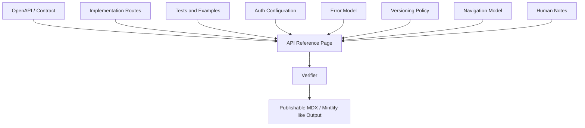
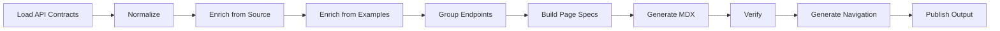
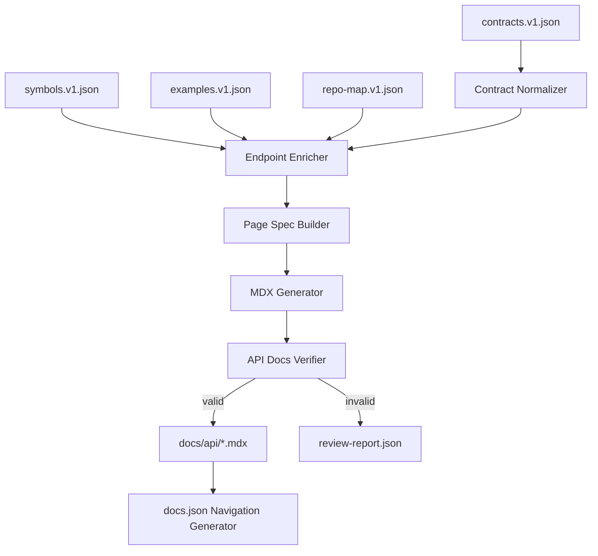
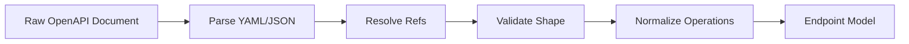

------
title: Build From Scratch: Mintlify-like AI-driven Documentation Generator CLI - Part 021
description: Build a production-grade API reference generator from OpenAPI, discovered routes, examples, schemas, auth models, errors, and navigation contracts.
series: learn-ai-docs-km-cli
seriesTitle: Build From Scratch: Mintlify-like AI-driven Documentation Generator CLI with Code2Prompt and Open-source Knowledge Management
order: 21
partTitle: API Reference Generation
tags:
- ai-docs
- documentation
- cli
- api-reference
- openapi
- contracts
- mdx
- mintlify
- source-grounded-generation
date: 2026-07-04
---

# Part 021 — API Reference Generation

Pada part sebelumnya kita sudah membangun **MDX authoring engine** dan **example-aware documentation generation**. Sekarang kita masuk ke salah satu output paling bernilai dari sistem ini: **API reference generation**.

Target kita bukan sekadar membuat halaman endpoint dari `openapi.yaml`.

Targetnya lebih tajam:

> Kita ingin membangun generator yang mampu membaca kontrak API, source code, tests, examples, auth model, error model, dan konfigurasi publishing, lalu menghasilkan API reference yang benar, navigable, source-grounded, reviewable, dan tidak cepat basi.

API reference yang buruk biasanya punya pola yang sama:

- endpoint ada, tetapi tidak ada konteks penggunaan;
- schema lengkap, tetapi tidak membantu developer memahami flow;
- auth disebut sekilas, tetapi tidak jelas kapan token diperlukan;
- error response tidak lengkap;
- examples tidak runnable;
- OpenAPI berubah, tetapi docs tidak ikut berubah;
- docs menjelaskan behavior yang tidak lagi ada di kode;
- navigation berantakan karena endpoint hanya diurutkan mentah berdasarkan path;
- generated docs menimpa penjelasan manual yang sebenarnya penting.

Sistem yang kita bangun harus menghindari semua itu.

---

## 1. Mental Model: API Reference Is a Contract View, Not a Blog Post

API reference berbeda dari guide.

Guide menjawab:

> “Bagaimana saya mencapai satu tujuan?”

API reference menjawab:

> “Apa persisnya surface area API ini, bagaimana request/response-nya, constraint-nya, error-nya, dan bagaimana cara memanggilnya dengan benar?”

Namun, API reference juga tidak boleh hanya menjadi dump schema.

API reference production-grade adalah gabungan dari beberapa lapisan:



Setiap halaman endpoint harus menjawab:

1. endpoint ini untuk apa;
2. siapa yang boleh memanggil;
3. method dan path;
4. path/query/header/body parameters;
5. request body;
6. response body;
7. error response;
8. contoh request yang valid;
9. contoh response yang realistis;
10. constraints, idempotency, pagination, rate limit, atau side effect;
11. source/provenance dari klaim penting;
12. relasi dengan guide atau workflow lain.

---

## 2. Input Artifact yang Dibutuhkan

Generator API reference tidak boleh langsung membaca file mentah secara acak.

Ia harus membaca artifact yang sudah kita desain sebelumnya:

```text
.aidocs/
  scans/
    scan.v1.json
  maps/
    repo-map.v1.json
  symbols/
    symbols.v1.json
  contracts/
    contracts.v1.json
  examples/
    examples.v1.json
  plans/
    doc-plan.v1.json
  pages/
    page-specs/
      api-reference-users-get.v1.json
```

Minimal input:

| Artifact | Peran |
|---|---|
| `contracts.v1.json` | daftar API contract, endpoint, schema, auth, examples dari OpenAPI/route discovery |
| `examples.v1.json` | usage example dari test, fixture, README, SDK sample |
| `symbols.v1.json` | hubungan endpoint dengan handler/function/class |
| `repo-map.v1.json` | konteks project, framework, API roots, docs root |
| `doc-plan.v1.json` | daftar halaman API reference yang harus dibuat |
| `page-spec.v1.json` | contract halaman tertentu |
| existing MDX | human notes yang perlu dipertahankan |

Kenapa perlu sebanyak ini?

Karena OpenAPI saja sering tidak cukup.

OpenAPI bisa mendeskripsikan surface. Tetapi source code dan tests sering menyimpan real behavior:

- status code tambahan;
- auth middleware;
- validation rule;
- idempotency key;
- rate-limit header;
- pagination convention;
- default value;
- error envelope;
- example payload yang benar-benar dipakai.

---

## 3. Baseline Faktual: OpenAPI dan Mintlify-like Output

OpenAPI Specification mendefinisikan interface description yang language-agnostic untuk HTTP API, sehingga manusia dan komputer dapat memahami capability service tanpa membaca source code atau traffic langsung. Pada 2026, versi OAS 3.2.0 sudah tersedia, tetapi banyak tool docs masih memprioritaskan 3.0 dan 3.1, sehingga generator kita harus version-aware dan tidak mengasumsikan semua renderer mendukung fitur terbaru.

Mintlify sendiri mendokumentasikan bahwa API pages dapat di-auto-populate dari dokumen OpenAPI dengan menambahkan field `openapi` pada elemen navigation di `docs.json`, dan dokumentasi Mintlify saat ini menyebut dukungan OpenAPI 3.0 dan 3.1 untuk setup tersebut.

Rujukan:

- OpenAPI Specification v3.2.0: https://spec.openapis.org/oas/v3.2.0.html
- OpenAPI Initiative announcement for v3.2: https://www.openapis.org/blog/2025/09/23/announcing-openapi-v3-2
- Mintlify OpenAPI setup: https://www.mintlify.com/docs/api-playground/openapi-setup
- Mintlify navigation docs: https://www.mintlify.com/docs/organize/navigation

Implikasi untuk sistem kita:

1. internal parser boleh mendukung OAS 3.0, 3.1, dan 3.2;
2. publisher adapter harus tahu target renderer mendukung versi apa;
3. jika target Mintlify-like adapter hanya kompatibel dengan subset tertentu, generator harus melakukan downgrade/normalization atau memberi diagnostic;
4. docs tidak boleh diam-diam publish schema yang tidak dapat dirender.

---

## 4. API Reference Generator Pipeline

Pipeline utama:



Lebih detail:



---

## 5. Contract Normalization

API sources bisa datang dari banyak tempat:

- `openapi.yaml`;
- `openapi.json`;
- generated OpenAPI dari framework;
- route annotations;
- controller definitions;
- GraphQL schema;
- AsyncAPI;
- hand-written route table;
- CLI command descriptors;
- gRPC/protobuf HTTP transcoding.

Pada part ini kita fokus pada **HTTP API reference** berbasis OpenAPI + discovered route.

Kita perlu normalize semua endpoint ke model internal.

Contoh model:

```ts
type HttpApiEndpoint = {
  id: string
  source: ContractSource
  method: HttpMethod
  path: string
  operationId?: string
  summary?: string
  description?: string
  tags: string[]
  stability?: "experimental" | "beta" | "stable" | "deprecated"
  auth: AuthRequirement[]
  parameters: ApiParameter[]
  requestBody?: ApiRequestBody
  responses: ApiResponse[]
  errors: ApiError[]
  examples: ApiExampleRef[]
  implementationRefs: SourceRef[]
  testRefs: SourceRef[]
  provenance: Provenance[]
  diagnostics: Diagnostic[]
}
```

Endpoint ID harus stable.

Jangan memakai index array.

Gunakan:

```text
http:<method>:<normalized-path>
```

Contoh:

```text
http:get:/v1/users/{userId}
http:post:/v1/orders
http:delete:/v1/sessions/{sessionId}
```

Jika ada version:

```text
http:v1:get:/users/{userId}
```

Tetapi hati-hati: version bisa sudah ada di path `/v1`. Jangan menggandakan tanpa rule jelas.

---

## 6. OpenAPI Parser Design

OpenAPI memiliki struktur besar:

```yaml
openapi: 3.1.0
info:
  title: Example API
  version: 1.0.0
servers:
  - url: https://api.example.com
paths:
  /users/{userId}:
    get:
      operationId: getUser
      tags:
        - Users
      parameters:
        - name: userId
          in: path
          required: true
          schema:
            type: string
      responses:
        "200":
          description: OK
components:
  schemas:
    User:
      type: object
```

Generator harus memahami minimal:

- `info`;
- `servers`;
- `paths`;
- methods;
- `operationId`;
- `tags`;
- `summary`;
- `description`;
- `parameters`;
- `requestBody`;
- `responses`;
- `security`;
- `components.securitySchemes`;
- `components.schemas`;
- `$ref`.

Parser sebaiknya dipisah menjadi dua tahap:



Jangan membuat generator MDX langsung membaca YAML raw.

Kenapa?

Karena `$ref`, inherited security, global parameters, reusable responses, dan component schemas membuat data mentah tidak nyaman untuk docs generation.

---

## 7. `$ref` Resolution Strategy

`$ref` bisa menunjuk ke:

- local component;
- local path;
- external file;
- remote URL;
- JSON Pointer.

Contoh:

```yaml
responses:
  "200":
    description: OK
    content:
      application/json:
        schema:
          $ref: "#/components/schemas/User"
```

Model internal harus menyimpan dua bentuk:

1. resolved view untuk generation;
2. original ref untuk provenance.

```ts
type ResolvedSchema = {
  ref?: string
  name?: string
  schema: JsonSchemaLike
  sourceRef: SourceRef
}
```

Kenapa original ref penting?

Karena saat docs berubah, kita ingin tahu bahwa response `User` berasal dari `#/components/schemas/User`, bukan dari LLM.

---

## 8. Schema Rendering Policy

Schema rendering adalah tempat banyak docs menjadi tidak terbaca.

Jangan dump JSON Schema mentah tanpa hierarki.

Gunakan policy:

1. tampilkan nama schema;
2. tampilkan deskripsi singkat;
3. tampilkan required fields;
4. tampilkan field table;
5. tampilkan nested object secukupnya;
6. tampilkan example;
7. link ke schema reference jika terlalu panjang.

Contoh field table:

| Field | Type | Required | Description |
|---|---:|---:|---|
| `id` | `string` | yes | Unique user identifier |
| `email` | `string` | yes | User email address |
| `createdAt` | `string(date-time)` | yes | Creation timestamp |

Internal renderer:

```ts
type SchemaView = {
  title: string
  description?: string
  required: string[]
  fields: SchemaFieldView[]
  examples: unknown[]
  nestedSchemas: SchemaView[]
  sourceRefs: SourceRef[]
}
```

Rule penting:

- jangan flatten object terlalu agresif;
- jangan expand recursive schema tanpa depth limit;
- jangan mengarang description field jika tidak ada sumber;
- jika description kosong, tulis type dan constraint saja;
- jika enum ada, tampilkan enum values;
- jika format ada, tampilkan format;
- jika nullable ada, tampilkan;
- jika deprecated ada, tampilkan.

---

## 9. Endpoint Page Structure

Halaman endpoint yang baik punya struktur stabil.

Contoh MDX target:

```mdx
------
title: Get User
description: Retrieve a user by ID.
api: GET /v1/users/{userId}
---

# Get User

Retrieve a user by ID.

## Endpoint

`GET /v1/users/{userId}`

## Authentication

Requires a bearer token with `users:read`.

## Path Parameters

| Name | Type | Required | Description |
|---|---:|---:|---|
| `userId` | `string` | yes | User identifier. |

## Query Parameters

No query parameters.

## Request Body

This endpoint does not accept a request body.

## Responses

### `200 OK`

Returns the user.

### `404 Not Found`

The user does not exist.

## Example Request

```bash
curl -X GET "https://api.example.com/v1/users/usr_123" \
  -H "Authorization: Bearer $TOKEN"
```

## Example Response

```json
{
  "id": "usr_123",
  "email": "alice@example.com"
}
```
```

Namun untuk sistem kita, MDX page juga harus menyimpan provenance.

Contoh metadata internal di komentar:

```mdx
{/* aidocs:source contract=openapi.yaml#/paths/~1v1~1users~1{userId}/get */}
{/* aidocs:generated section=responses hash=abc123 */}
```

---

## 10. Page Types untuk API Reference

Tidak semua API docs harus satu halaman per endpoint.

Kita butuh beberapa jenis halaman:

| Page Type | Tujuan |
|---|---|
| API overview | menjelaskan API product secara umum |
| Authentication | menjelaskan auth schemes |
| Errors | menjelaskan error envelope |
| Pagination | menjelaskan pagination convention |
| Rate limits | menjelaskan quota dan headers |
| Webhooks/events | menjelaskan async callbacks |
| Endpoint group landing | landing page per resource/domain |
| Endpoint page | detail satu operation |
| Schema reference | model/schema reusable |
| Changelog/versioning | breaking changes, deprecation |

Banyak generator hanya membuat endpoint pages. Itu tidak cukup.

Developer sering butuh halaman konseptual:

- “How authentication works”
- “How pagination works”
- “How errors are structured”
- “How idempotency works”
- “How webhooks are signed”

Kalau semua dimasukkan ke tiap endpoint, docs menjadi repetitive.

---

## 11. Grouping Endpoints

Endpoint grouping tidak boleh hanya berdasarkan tag mentah.

OpenAPI `tags` berguna, tetapi sering tidak konsisten.

Gunakan kombinasi:

1. explicit OpenAPI tags;
2. path prefix;
3. controller/package ownership;
4. domain nouns;
5. navigation config override;
6. operationId pattern.

Contoh:

```text
GET /v1/users
POST /v1/users
GET /v1/users/{id}
PATCH /v1/users/{id}
DELETE /v1/users/{id}
```

Group:

```text
Users
```

Tapi contoh ini:

```text
POST /v1/auth/login
POST /v1/auth/logout
POST /v1/sessions
DELETE /v1/sessions/{id}
```

Bisa jadi group:

```text
Authentication
```

atau:

```text
Sessions
```

Tergantung product language. Generator harus bisa menerima override.

Config:

```yaml
api:
  groups:
    - name: Authentication
      match:
        paths:
          - /v1/auth/**
          - /v1/sessions/**
    - name: Users
      match:
        tags:
          - Users
```

---

## 12. Operation Naming

Nama halaman endpoint harus human-friendly.

Sumber naming:

1. `summary`;
2. `operationId`;
3. method + path;
4. handler name;
5. generated verb+noun.

Contoh:

| Raw | Generated Title |
|---|---|
| `getUser` | Get User |
| `POST /v1/users` | Create User |
| `PATCH /v1/orders/{orderId}/cancel` | Cancel Order |
| `DELETE /v1/sessions/{sessionId}` | Delete Session |

Naming rule sederhana:

```text
GET collection -> List <Resources>
GET item -> Get <Resource>
POST collection -> Create <Resource>
PUT item -> Replace <Resource>
PATCH item -> Update <Resource>
DELETE item -> Delete <Resource>
POST action -> <Action Verb> <Resource>
```

Tapi jangan paksa jika `summary` sudah jelas.

---

## 13. Authentication Section Generation

Auth harus dijelaskan di dua level:

1. global auth docs;
2. endpoint-level requirement.

OpenAPI security scheme bisa berupa:

- HTTP bearer;
- HTTP basic;
- API key;
- OAuth2;
- OpenID Connect;
- mutual TLS;
- custom headers.

Model internal:

```ts
type AuthRequirement = {
  schemeId: string
  type: "bearer" | "basic" | "apiKey" | "oauth2" | "openid" | "mutualTLS" | "custom"
  scopes: string[]
  required: boolean
  sourceRefs: SourceRef[]
}
```

Endpoint page harus menjawab:

- apakah auth required;
- scheme apa;
- scope/permission apa;
- header apa;
- apakah endpoint public;
- error apa jika auth gagal.

Contoh:

```mdx
## Authentication

Requires a bearer token with the `users:read` scope.

Send the token in the `Authorization` header:

```http
Authorization: Bearer <token>
```
```

Jika tidak ada sumber untuk scope:

```mdx
## Authentication

Requires bearer authentication.

The source contract does not specify a scope.
```

Itu lebih jujur daripada mengarang `users:read`.

---

## 14. Error Model Generation

Error docs sering paling lemah.

Endpoint tidak cukup hanya menampilkan:

```yaml
"400":
  description: Bad Request
```

Kita perlu error model:

```ts
type ApiError = {
  status: number
  code?: string
  title?: string
  description?: string
  schemaRef?: string
  example?: unknown
  sourceRefs: SourceRef[]
}
```

Sources:

- OpenAPI responses;
- error classes;
- exception handlers;
- tests;
- fixtures;
- README docs;
- handler code.

Output minimum:

```mdx
## Errors

| Status | Code | Meaning |
|---:|---|---|
| `400` | `invalid_request` | Request validation failed. |
| `401` | `unauthorized` | Missing or invalid authentication. |
| `404` | `user_not_found` | No user exists for the given ID. |
```

Jika error envelope global:

```json
{
  "error": {
    "code": "user_not_found",
    "message": "User not found",
    "requestId": "req_123"
  }
}
```

Maka buat halaman:

```text
api/errors.mdx
```

dan endpoint pages cukup link ke sana.

---

## 15. Pagination, Filtering, Sorting, and Idempotency

Banyak API docs gagal karena hanya mendeskripsikan parameter, tetapi tidak menjelaskan convention.

Cari convention dari:

- repeated query parameters;
- schema names;
- tests;
- common parameter refs;
- middleware;
- helper functions.

Contoh detection:

```yaml
parameters:
  - $ref: "#/components/parameters/Page"
  - $ref: "#/components/parameters/Limit"
```

atau source:

```ts
const page = parseInt(req.query.page ?? "1")
const limit = Math.min(parseInt(req.query.limit ?? "20"), 100)
```

Jika ditemukan:

- buat konsep `Pagination`;
- hubungkan endpoint list ke konsep itu;
- tampilkan ringkasan di endpoint page;
- jangan duplikasi semua detail.

Endpoint page:

```mdx
## Pagination

This endpoint uses page-based pagination.

See [Pagination](/api/pagination) for common response fields and limits.
```

Halaman pagination:

```mdx
# Pagination

List endpoints use `page` and `limit`.

The default `limit` is `20`.
The maximum `limit` is `100`.
```

Klaim default/max harus punya source. Jika hanya inferensi dari code, tandai sebagai inferred.

---

## 16. Request Example Generation

Example request harus berasal dari sumber nyata.

Priority:

1. explicit OpenAPI example;
2. test fixture;
3. integration test;
4. SDK example;
5. generated from schema with clear marker;
6. LLM-generated fallback only if allowed.

Policy:

```yaml
examples:
  request:
    preferredSources:
      - openapi
      - tests
      - fixtures
    allowSynthetic: false
```

Jika fallback synthetic diizinkan, docs harus jelas:

```mdx
{/* aidocs:example synthetic=true reason="no source example found" */}
```

Tapi default production-grade harus:

```text
No verified request example found.
```

Lebih baik kosong daripada menipu.

---

## 17. Response Example Generation

Response example lebih berbahaya daripada request example.

Kalau kita mengarang response, developer bisa membangun client berdasarkan field palsu.

Gunakan:

1. OpenAPI response example;
2. captured fixture;
3. contract test snapshot;
4. schema-derived minimal example dengan marker;
5. no example.

Schema-derived example harus deterministic.

Contoh generator:

```ts
function exampleForSchema(schema: Schema): unknown {
  if (schema.example !== undefined) return schema.example
  if (schema.default !== undefined) return schema.default
  if (schema.enum?.length) return schema.enum[0]
  if (schema.type === "string") return "string"
  if (schema.type === "integer") return 0
  if (schema.type === "boolean") return true
  if (schema.type === "array") return [exampleForSchema(schema.items)]
  if (schema.type === "object") return exampleObject(schema)
  return null
}
```

Tapi output harus diberi label:

```mdx
{/* aidocs:example generatedFromSchema=true */}
```

---

## 18. API Reference as MDX + Structured Metadata

Kita ingin output bisa dibaca manusia dan diproses mesin.

File MDX:

```text
docs/api/users/get-user.mdx
```

Metadata:

```yaml
------
title: Get User
description: Retrieve a user by ID.
api:
  method: GET
  path: /v1/users/{userId}
  operationId: getUser
  source: openapi.yaml#/paths/~1v1~1users~1{userId}/get
generated:
  by: aidocs
  artifact: api-reference-page.v1
  endpointId: http:get:/v1/users/{userId}
  contentHash: sha256:...
---
```

MDX content:

```mdx
# Get User

Retrieve a user by ID.

<Endpoint method="GET" path="/v1/users/{userId}" />

## Authentication

Requires bearer authentication.

## Parameters

...
```

Jika target renderer tidak support custom component, renderer adapter bisa menurunkan ke Markdown biasa.

---

## 19. Mintlify-like Navigation Output

Mintlify memakai `docs.json` untuk konfigurasi navigation.

Kita tidak harus mengunci semua output hanya untuk Mintlify, tetapi adapter Mintlify-like harus bisa menghasilkan:

```json
{
  "navigation": {
    "tabs": [
      {
        "tab": "API Reference",
        "groups": [
          {
            "group": "Users",
            "pages": [
              "api/users/list-users",
              "api/users/create-user",
              "api/users/get-user"
            ]
          }
        ]
      }
    ]
  }
}
```

Untuk auto-populated OpenAPI pages, Mintlify mendokumentasikan penggunaan field `openapi` pada navigation element. Tetapi karena kita membangun generator sendiri, ada dua mode:

### Mode A — Delegate to renderer

```json
{
  "group": "API Reference",
  "openapi": "openapi.yaml"
}
```

Kelebihan:

- simple;
- renderer menangani endpoint pages;
- lebih dekat dengan Mintlify native behavior.

Kekurangan:

- sulit memasukkan provenance per section;
- sulit preserve human edits per endpoint;
- sulit enforce custom anti-hallucination policy;
- tergantung capability renderer.

### Mode B — Generate explicit MDX pages

```json
{
  "group": "Users",
  "pages": [
    "api/users/list-users",
    "api/users/get-user"
  ]
}
```

Kelebihan:

- full control;
- bisa source-grounded;
- bisa human review;
- bisa custom examples;
- bisa merge notes dan generated sections.

Kekurangan:

- lebih banyak file;
- lebih banyak logic generator;
- harus maintain compatibility sendiri.

Untuk seri ini, kita gunakan **Mode B sebagai primary**, dan **Mode A sebagai optional adapter**.

---

## 20. Endpoint Page Generation Algorithm

Pseudocode:

```ts
function generateApiReference(project: ProjectArtifacts): ApiReferenceOutput {
  const contracts = loadContracts(project)
  const examples = loadExamples(project)
  const symbols = loadSymbols(project)
  const plan = loadDocPlan(project)

  const normalized = normalizeContracts(contracts)
  const enriched = normalized.endpoints.map(endpoint =>
    enrichEndpoint(endpoint, { examples, symbols, contracts })
  )

  const groups = groupEndpoints(enriched, project.config.api.grouping)
  const pages = []

  for (const group of groups) {
    pages.push(generateGroupLandingPage(group))

    for (const endpoint of group.endpoints) {
      const pageSpec = buildEndpointPageSpec(endpoint, group)
      const mdx = renderEndpointPage(pageSpec)
      const report = verifyEndpointPage(mdx, pageSpec)

      pages.push({ pageSpec, mdx, report })
    }
  }

  const nav = generateApiNavigation(groups, pages)
  return { pages, nav, reports }
}
```

Perhatikan urutannya:

1. normalize;
2. enrich;
3. group;
4. build page spec;
5. render;
6. verify;
7. navigation.

Jangan generate dulu lalu coba rapikan navigation belakangan. Itu membuat struktur docs tidak stabil.

---

## 21. Building `api-reference.v1.json`

Selain MDX, buat artifact intermediate:

```json
{
  "schemaVersion": "api-reference.v1",
  "generatedAt": "2026-07-04T00:00:00Z",
  "sourceContracts": [
    "openapi.yaml"
  ],
  "groups": [
    {
      "id": "users",
      "title": "Users",
      "description": "Manage users.",
      "endpoints": [
        "http:get:/v1/users",
        "http:post:/v1/users",
        "http:get:/v1/users/{userId}"
      ],
      "page": "api/users/overview"
    }
  ],
  "pages": [
    {
      "id": "api.users.get-user",
      "path": "api/users/get-user.mdx",
      "endpointId": "http:get:/v1/users/{userId}",
      "operationId": "getUser",
      "sourceRefs": [
        "openapi.yaml#/paths/~1v1~1users~1{userId}/get"
      ],
      "contentHash": "sha256:..."
    }
  ],
  "diagnostics": []
}
```

Kenapa perlu?

- preview UI bisa membaca artifact tanpa parsing MDX;
- verifier bisa diff API reference antar build;
- CI bisa mendeteksi endpoint ditambahkan/dihapus;
- KM sink bisa membuat note untuk endpoint;
- navigation generator bisa idempotent.

---

## 22. Versioning Strategy

API reference harus mendukung versioning.

Tiga pola umum:

### Path versioning

```text
/v1/users
/v2/users
```

### Header versioning

```http
Accept: application/vnd.example.v2+json
```

### Docs versioning

```text
docs/v1/api/users
docs/v2/api/users
```

Generator harus memisahkan:

- API version;
- docs version;
- product version;
- package version.

Jangan campur.

Config:

```yaml
api:
  versions:
    - id: v1
      source: openapi-v1.yaml
      output: api/v1
    - id: v2
      source: openapi-v2.yaml
      output: api/v2
```

Endpoint ID:

```text
http:v1:get:/users
http:v2:get:/users
```

Navigation:

```json
{
  "tabs": [
    {
      "tab": "API v1",
      "groups": []
    },
    {
      "tab": "API v2",
      "groups": []
    }
  ]
}
```

---

## 23. Deprecation Handling

OpenAPI operation can mark operation as deprecated.

Example:

```yaml
get:
  deprecated: true
```

Output:

```mdx
<Warning>
This endpoint is deprecated.
</Warning>
```

But production-grade docs should also answer:

- since when deprecated;
- replacement endpoint;
- removal date;
- migration guide;
- behavior differences.

Sources might include:

- OpenAPI extension fields;
- changelog;
- release notes;
- comments;
- manually maintained docs.

Custom extension:

```yaml
x-aidocs-deprecation:
  since: "2026-06-01"
  replacement: "GET /v2/users/{userId}"
  removal: "2027-01-01"
  migrationGuide: "/api/migration/v1-to-v2"
```

Do not invent removal date.

---

## 24. Extension Fields

OpenAPI supports extension fields that begin with `x-`.

We can use them carefully.

Examples:

```yaml
x-aidocs-group: Users
x-aidocs-page-title: Retrieve User
x-aidocs-hide: false
x-aidocs-stability: beta
x-aidocs-owner: team-identity
x-aidocs-examples:
  - tests/users/get-user.test.ts
```

Rules:

- extension fields must be optional;
- generator should work without them;
- extension fields should override heuristics;
- invalid extension field should produce diagnostic;
- never pollute external contract unless team agrees.

---

## 25. API Reference Verification

Verifier harus mengecek:

| Check | Purpose |
|---|---|
| endpoint exists | generated page maps to real contract |
| method/path correct | prevent wrong endpoint |
| params complete | prevent missing required params |
| request body matches | prevent fake payload |
| responses complete | prevent missing status codes |
| auth matches | prevent public/private confusion |
| examples valid | prevent broken snippets |
| links valid | prevent broken navigation |
| frontmatter valid | prevent renderer failure |
| stale hash | detect drift |

Example verification result:

```json
{
  "page": "api/users/get-user.mdx",
  "endpointId": "http:get:/v1/users/{userId}",
  "status": "failed",
  "errors": [
    {
      "code": "missing-required-parameter",
      "message": "Required path parameter userId is missing from Path Parameters section.",
      "source": "openapi.yaml#/paths/~1v1~1users~1{userId}/get/parameters/0"
    }
  ]
}
```

Important invariant:

> Generated API reference is not publishable until verifier passes or human explicitly accepts exceptions.

---

## 26. OpenAPI Drift Detection

If OpenAPI changes, endpoint pages must be checked.

Drift examples:

- endpoint removed;
- path changed;
- request body field added;
- required field changed;
- response schema changed;
- auth changed;
- status code changed;
- operation deprecated;
- new endpoint added.

Drift artifact:

```json
{
  "schemaVersion": "api-drift.v1",
  "oldContractHash": "sha256:old",
  "newContractHash": "sha256:new",
  "changes": [
    {
      "type": "response-schema-changed",
      "endpointId": "http:get:/v1/users/{userId}",
      "status": 200,
      "severity": "high",
      "affectedPages": [
        "api/users/get-user.mdx"
      ]
    }
  ]
}
```

CI behavior:

- non-breaking docs drift can warn;
- breaking API drift should fail unless docs updated;
- removed endpoint should require deprecation/removal docs.

---

## 27. Handling Multiple Specs

Monorepo may have:

```text
services/
  billing/openapi.yaml
  identity/openapi.yaml
  notification/openapi.yaml
```

Generator should support:

```yaml
api:
  specs:
    - id: identity
      title: Identity API
      path: services/identity/openapi.yaml
      output: api/identity
    - id: billing
      title: Billing API
      path: services/billing/openapi.yaml
      output: api/billing
```

Problems:

- duplicate schema names;
- duplicate operation IDs;
- inconsistent auth docs;
- shared components;
- cross-service examples;
- different API maturity.

Solution:

- namespace endpoint IDs by spec ID;
- namespace schema IDs by spec ID;
- allow shared auth docs;
- allow per-spec navigation group.

Endpoint ID:

```text
http:identity:get:/v1/users/{userId}
http:billing:get:/v1/invoices/{invoiceId}
```

---

## 28. Integrating Human Notes

Generated endpoint pages need human-owned regions.

Example:

```mdx
## Notes

{/* aidocs:manual:start */}
This endpoint is used by the onboarding flow and should not be called directly by internal batch jobs.
{/* aidocs:manual:end */}
```

When regenerating:

- preserve manual regions;
- move them if section still exists;
- warn if endpoint removed;
- never silently delete manual notes.

Human notes can also live in separate files:

```text
docs/api/users/get-user.notes.md
```

or Logseq page:

```text
pages/API - Get User.md
```

Part 037 will go deep into bidirectional sync.

For API reference generation, just define the merge boundary.

---

## 29. API Reference and Knowledge Graph

Every endpoint can become a knowledge node:

```text
[[API Endpoint: GET /v1/users/{userId}]]
```

Properties:

```markdown
type:: api-endpoint
method:: GET
path:: /v1/users/{userId}
operationId:: getUser
service:: identity
auth:: bearer
owner:: team-identity
docs:: [[Get User]]
source:: openapi.yaml
```

Relations:

```text
GET /v1/users/{userId} -> returns -> User
GET /v1/users/{userId} -> implemented-by -> getUserHandler
GET /v1/users/{userId} -> tested-by -> get-user.test.ts
GET /v1/users/{userId} -> uses-auth -> BearerAuth
```

This is why API generation must produce structured artifact, not just MDX.

---

## 30. CLI Commands

Minimal commands:

```bash
aidocs api scan
aidocs api build
aidocs api verify
aidocs api diff
aidocs api nav
aidocs api preview
```

Examples:

```bash
aidocs api build --spec openapi.yaml --out docs/api
```

```bash
aidocs api diff --base main --head HEAD
```

```bash
aidocs api verify --strict
```

```bash
aidocs api build --spec services/*/openapi.yaml --mode explicit-mdx
```

Diagnostic output:

```text
API Reference Build

Specs:
  ✓ openapi.yaml 3.1.0

Endpoints:
  ✓ 42 endpoints discovered
  ✓ 38 endpoints have examples
  ! 4 endpoints missing verified examples

Pages:
  ✓ 42 endpoint pages generated
  ✓ 6 concept pages generated
  ✓ docs.json navigation updated

Verification:
  ✓ method/path consistency
  ✓ required parameters
  ✓ response schemas
  ! 2 endpoints missing 401 docs
```

---

## 31. Testing Strategy

Test layers:

### Unit tests

- OpenAPI parse;
- `$ref` resolution;
- schema rendering;
- title generation;
- grouping;
- example selection;
- auth inheritance;
- response rendering.

### Golden tests

Input:

```text
fixtures/api/simple-openapi.yaml
```

Expected:

```text
expected/docs/api/users/get-user.mdx
expected/api-reference.v1.json
expected/docs.json
```

### Drift tests

- add endpoint;
- remove endpoint;
- add required field;
- change response type;
- mark endpoint deprecated.

### Integration tests

- run `aidocs api build`;
- run verifier;
- render docs;
- validate links.

### Mutation tests

- corrupt path param;
- remove required field;
- change status code;
- remove auth section;
- ensure verifier catches it.

---

## 32. Common Failure Modes

### Failure Mode 1 — Schema dump disguised as docs

Symptom:

- page is technically complete but unusable.

Fix:

- separate overview, endpoint detail, schema reference;
- use field tables;
- include examples.

### Failure Mode 2 — Invented examples

Symptom:

- response example has fields not in schema.

Fix:

- source examples from OpenAPI/tests/fixtures;
- label synthetic examples;
- verifier checks example schema compatibility.

### Failure Mode 3 — Auth confusion

Symptom:

- endpoint docs say public, but middleware requires auth.

Fix:

- merge OpenAPI security with implementation middleware clues;
- produce warning on mismatch.

### Failure Mode 4 — Navigation chaos

Symptom:

- 200 endpoint pages in one flat sidebar.

Fix:

- group by domain;
- create landing pages;
- hide low-value endpoints if configured;
- use navigation linting.

### Failure Mode 5 — Stale reference

Symptom:

- OpenAPI changed, docs did not.

Fix:

- endpoint source hash;
- drift detection;
- CI gate.

---

## 33. Minimal Implementation Plan

Build in this order:

1. parse OpenAPI YAML/JSON;
2. normalize endpoints;
3. resolve local `$ref`;
4. render endpoint page skeleton;
5. render params/request/responses;
6. render examples;
7. render auth;
8. generate navigation;
9. verify generated page;
10. add drift detection;
11. add human region preservation;
12. add multi-spec support.

Do not start with LLM.

Most API reference generation can be deterministic.

LLM is useful for:

- summarizing endpoint purpose;
- writing friendly guide text;
- explaining complex schemas;
- generating group landing pages;
- rewriting raw descriptions;
- making troubleshooting notes.

But the core reference surface must come from contracts and source artifacts.

---

## 34. Exercise: Implement `aidocs api build`

Create a fixture:

```text
fixtures/sample-api/openapi.yaml
```

With:

- 2 resources;
- 5 endpoints;
- bearer auth;
- one list endpoint with pagination;
- one create endpoint with request body;
- one deprecated endpoint;
- one reusable error schema.

Implement output:

```text
docs/api/index.mdx
docs/api/authentication.mdx
docs/api/errors.mdx
docs/api/users/list-users.mdx
docs/api/users/create-user.mdx
docs/api/users/get-user.mdx
docs/api/orders/list-orders.mdx
docs/api/orders/get-order.mdx
docs.json
.aidocs/api-reference/api-reference.v1.json
.aidocs/reports/api-reference.verify.json
```

Acceptance criteria:

- every endpoint page has method/path;
- every required path parameter is documented;
- every request body field is rendered;
- every response status has a section;
- auth page exists;
- error page exists;
- `docs.json` navigation is stable;
- verifier passes.

---

## 35. What You Should Understand Now

Setelah part ini, kamu harus memiliki mental model berikut:

1. API reference bukan hasil LLM bebas.
2. API reference adalah rendered view dari contract + source + example + review policy.
3. OpenAPI adalah sumber utama, tetapi bukan satu-satunya sumber.
4. Examples harus sourced, bukan dikarang.
5. Navigation harus dirancang, bukan efek samping sorting path.
6. Drift detection adalah bagian dari API docs, bukan fitur tambahan.
7. MDX output harus punya provenance.
8. Publisher adapter tidak boleh menghilangkan safety invariant.

Pada part berikutnya, kita naik dari endpoint-level docs ke **architecture documentation generation**: bagaimana sistem mengekstrak component view, runtime view, dependency view, sequence diagram, deployment view, dan dataflow view dari repo tanpa mengarang arsitektur palsu.
