------
title: Build From Scratch: Mintlify-like AI-driven Documentation Generator CLI - Part 022
description: Generate source-grounded architecture documentation from repository maps, symbol graphs, contracts, runtime hints, deployment manifests, and examples.
series: learn-ai-docs-km-cli
seriesTitle: Build From Scratch: Mintlify-like AI-driven Documentation Generator CLI with Code2Prompt and Open-source Knowledge Management
order: 22
partTitle: Architecture Documentation Generation
tags:
- ai-docs
- documentation
- cli
- architecture
- mermaid
- diagrams
- source-grounded-generation
- software-architecture
- mdx
date: 2026-07-04
---

# Part 022 — Architecture Documentation Generation

Pada part sebelumnya kita membuat **API reference generator**. Sekarang kita membangun kemampuan yang lebih sulit: **architecture documentation generation**.

API reference relatif jelas karena input utamanya adalah contract.

Architecture docs lebih berbahaya.

Kenapa?

Karena banyak architecture docs yang tampak meyakinkan, tetapi sebenarnya hasil interpretasi longgar, naming yang ambigu, atau diagram yang dibuat agar terlihat rapi. Dalam sistem AI-driven documentation generator, ini adalah area paling rawan hallucination.

Target part ini:

> Membangun generator architecture docs yang source-grounded, eksplisit tentang confidence, bisa menjelaskan boundary sistem, dan tidak mengarang runtime architecture yang tidak bisa dibuktikan dari repo.

Architecture documentation yang baik bukan sekadar diagram. Ia harus membantu developer menjawab:

- sistem ini terdiri dari komponen apa;
- bagaimana komponen berinteraksi;
- apa boundary antara module/service;
- data mengalir lewat mana;
- endpoint mana masuk ke handler mana;
- event apa dipublish/consume;
- database apa disentuh;
- deployment unit-nya apa;
- config apa yang menentukan runtime behavior;
- failure point utama ada di mana;
- apa yang diketahui pasti dan apa yang hanya inferred.

---

## 1. Baseline Faktual: Mermaid sebagai Diagram-as-Code

Karena seri ini memakai MDX dan docs-as-code, diagram sebaiknya berbentuk teks yang bisa versioned. Mermaid adalah tool diagramming berbasis teks yang umum dipakai untuk membuat flowchart, sequence diagram, class diagram, dan beberapa tipe diagram lain.

Mermaid menyediakan syntax untuk sequence diagram, flowchart, dan sejak versi modern juga memiliki syntax `architecture-beta` untuk architecture diagram. Namun syntax architecture masih disebut beta, sehingga untuk docs production, kita harus punya fallback ke flowchart jika target renderer belum mendukungnya.

Rujukan:

- Mermaid main docs: https://mermaid.js.org/
- Mermaid sequence diagrams: https://mermaid.ai/open-source/syntax/sequenceDiagram.html
- Mermaid architecture diagrams: https://mermaid.ai/open-source/syntax/architecture.html
- Mermaid GitHub repository: https://github.com/mermaid-js/mermaid

Implikasi desain:

1. diagram harus valid secara syntax;
2. diagram harus punya source provenance;
3. diagram harus bisa difallback;
4. diagram harus tidak terlalu besar;
5. diagram harus disertai narasi yang menjelaskan batas confidence.

---

## 2. Architecture Docs Is a Set of Views

Jangan mencoba membuat satu diagram besar untuk semuanya.

Gunakan view.

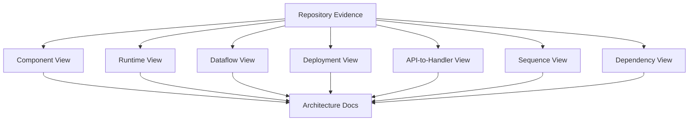

Setiap view menjawab pertanyaan berbeda.

| View | Pertanyaan |
|---|---|
| Component view | Komponen/module utama apa? |
| Runtime view | Proses/service apa yang berjalan? |
| Dependency view | Siapa bergantung pada siapa? |
| API-to-handler view | Request masuk ke code path mana? |
| Dataflow view | Data bergerak dari input ke storage/event/output lewat mana? |
| Deployment view | Unit deployment dan infrastructure manifest apa? |
| Sequence view | Urutan interaksi pada skenario penting bagaimana? |
| Failure view | Titik gagal dan recovery path apa? |

Satu repo bisa punya beberapa architecture pages:

```text
docs/architecture/overview.mdx
docs/architecture/components.mdx
docs/architecture/runtime.mdx
docs/architecture/dataflow.mdx
docs/architecture/deployment.mdx
docs/architecture/request-lifecycle.mdx
docs/architecture/events.mdx
docs/architecture/failure-modes.mdx
```

---

## 3. Input Artifact untuk Architecture Generation

Architecture docs harus mengambil evidence dari artifact sebelumnya:

```text
.aidocs/
  scans/scan.v1.json
  maps/repo-map.v1.json
  symbols/symbols.v1.json
  contracts/contracts.v1.json
  examples/examples.v1.json
  api-reference/api-reference.v1.json
  plans/doc-plan.v1.json
```

Tambahan artifact yang akan kita bentuk:

```text
.aidocs/architecture/
  architecture-model.v1.json
  architecture-views.v1.json
  diagrams/
    components.mmd
    request-lifecycle.mmd
    deployment.mmd
  reports/
    architecture.verify.json
```

Evidence sources:

| Source | Evidence |
|---|---|
| repository tree | modules, packages, service boundaries |
| manifest files | project type, dependency list, commands |
| source symbols | classes, functions, handlers, imports |
| API contracts | inbound API surface |
| tests/examples | real flows and behavior |
| Dockerfile/Compose/K8s | deployment/runtime units |
| config files | env vars, ports, external systems |
| DB migrations/schema | storage model |
| CI files | build/test/deploy path |
| README/existing docs | human-declared architecture |

Important rule:

> Existing human architecture docs can be used as input, but generated output must still mark which claims come from source and which come from prior docs.

---

## 4. Architecture Model

Sebelum membuat MDX, buat model internal.

```ts
type ArchitectureModel = {
  schemaVersion: "architecture-model.v1"
  project: ProjectIdentity
  components: ComponentNode[]
  relations: ArchitectureRelation[]
  runtimeUnits: RuntimeUnit[]
  dataStores: DataStore[]
  externalSystems: ExternalSystem[]
  entrypoints: Entrypoint[]
  flows: ArchitectureFlow[]
  deployment: DeploymentModel
  evidence: EvidenceIndex
  diagnostics: Diagnostic[]
}
```

Component:

```ts
type ComponentNode = {
  id: string
  name: string
  kind:
    | "service"
    | "module"
    | "package"
    | "library"
    | "controller"
    | "repository"
    | "worker"
    | "job"
    | "adapter"
    | "database"
    | "message-broker"
    | "external-system"
  pathRefs: string[]
  symbolRefs: string[]
  responsibilities: string[]
  confidence: number
  evidenceRefs: SourceRef[]
}
```

Relation:

```ts
type ArchitectureRelation = {
  from: string
  to: string
  kind:
    | "imports"
    | "calls"
    | "routes-to"
    | "reads-from"
    | "writes-to"
    | "publishes"
    | "subscribes"
    | "depends-on"
    | "configured-by"
    | "deploys-as"
  confidence: number
  evidenceRefs: SourceRef[]
}
```

Architecture model adalah fakta terstruktur. MDX hanya view.

---

## 5. Component Detection

Component detection tidak boleh hanya berdasarkan folder.

Folder bisa misleading.

Gunakan banyak signal:

| Signal | Contoh |
|---|---|
| directory boundary | `src/api`, `src/domain`, `src/infra` |
| manifest boundary | `package.json`, `pom.xml`, `go.mod` |
| deployment boundary | `Dockerfile`, `k8s/deployment.yaml` |
| framework convention | `controllers`, `routes`, `handlers`, `repositories` |
| imports | package dependency graph |
| API contracts | endpoint ownership |
| config | service name, port |
| README/docs | declared module names |
| tests | integration boundary |

Scoring:

```ts
componentScore =
  directorySignal * 0.20 +
  manifestSignal * 0.20 +
  frameworkSignal * 0.15 +
  importClusterSignal * 0.15 +
  deploymentSignal * 0.15 +
  contractSignal * 0.10 +
  docsSignal * 0.05
```

Confidence:

- high: manifest + deployment + source references agree;
- medium: folder + imports agree;
- low: name inferred from folder only.

Output should say:

```mdx
The generator identified `identity-service` as a runtime service because it has a service manifest, Dockerfile, Kubernetes Deployment, and HTTP routes under `services/identity`.
```

Not:

```mdx
The Identity Service is a microservice.
```

unless evidence supports it.

---

## 6. Repository-to-Component Mapping

Example repo:

```text
services/
  identity/
    package.json
    Dockerfile
    src/
      routes/
      handlers/
      db/
    openapi.yaml
  billing/
    package.json
    Dockerfile
    src/
      routes/
      handlers/
      kafka/
infra/
  k8s/
    identity-deployment.yaml
    billing-deployment.yaml
```

Generated component view:

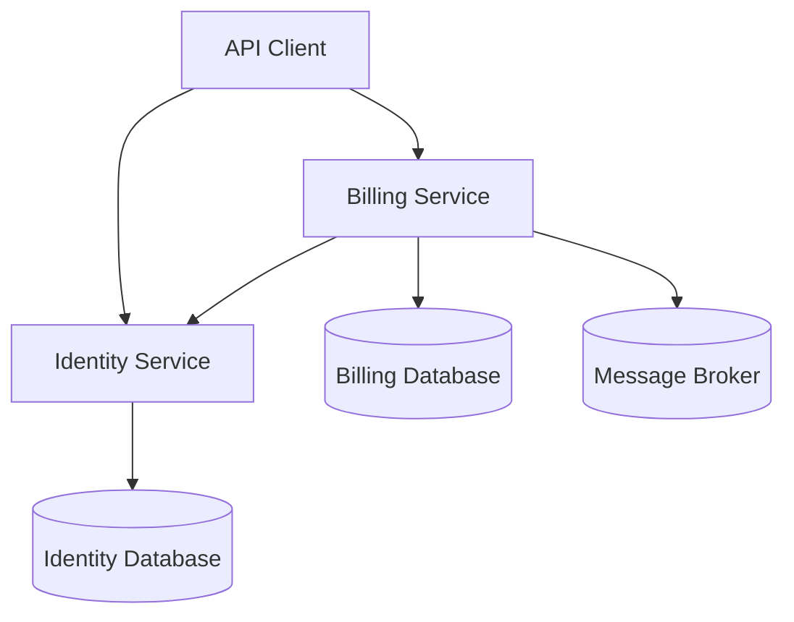

But every edge needs source:

| Edge | Evidence |
|---|---|
| Client -> Identity | `services/identity/openapi.yaml` |
| Identity -> IdentityDB | DB config/migration |
| Billing -> Broker | Kafka producer code/config |
| Billing -> Identity | HTTP client import/config |

If edge has weak evidence, either omit it or mark as inferred.

---

## 7. Avoiding False Architecture

Architecture generator must be conservative.

Dangerous assumptions:

| Weak Input | Bad Generated Claim |
|---|---|
| folder named `services` | “This is a microservices architecture.” |
| dependency on Kafka client | “The system is event-driven.” |
| `Dockerfile` exists | “The service runs in Kubernetes.” |
| `repository` class exists | “This follows DDD.” |
| `src/domain` folder exists | “This uses clean architecture.” |
| one OpenAPI file exists | “Public REST API is complete.” |

Correct language:

- “The repository contains a `services/` directory with separate manifests.”
- “The code imports Kafka client libraries and defines producer-related modules.”
- “A Dockerfile exists for this module.”
- “The naming suggests a repository layer, but the generator does not infer full DDD compliance.”

This style is less flashy, but much more trustworthy.

---

## 8. Architecture Views Artifact

Define `architecture-views.v1.json`:

```json
{
  "schemaVersion": "architecture-views.v1",
  "views": [
    {
      "id": "architecture.overview",
      "title": "Architecture Overview",
      "kind": "component",
      "description": "High-level component view of the repository.",
      "nodes": ["component.identity", "component.billing", "datastore.identity-db"],
      "edges": ["edge.client.identity", "edge.identity.db"],
      "diagram": {
        "type": "mermaid-flowchart",
        "path": ".aidocs/architecture/diagrams/overview.mmd"
      },
      "confidence": 0.82,
      "sourceRefs": [
        "services/identity/package.json",
        "services/identity/openapi.yaml",
        "infra/k8s/identity-deployment.yaml"
      ]
    }
  ]
}
```

This artifact decouples:

- model extraction;
- view selection;
- diagram rendering;
- MDX writing.

---

## 9. Diagram Generation Rules

Mermaid diagram generation should follow strict rules:

1. stable node IDs;
2. human-readable labels;
3. max node count per diagram;
4. max edge count per diagram;
5. no unsupported syntax for target renderer;
6. include only source-backed nodes/edges;
7. prefer multiple diagrams over one giant diagram;
8. do not embed secrets/env values;
9. validate rendered syntax;
10. store generated `.mmd` for debugging.

Node ID:

```text
svc_identity
db_identity
broker_kafka
ext_stripe
```

Label:

```text
Identity Service
Identity Database
Kafka Broker
Stripe API
```

Mermaid:

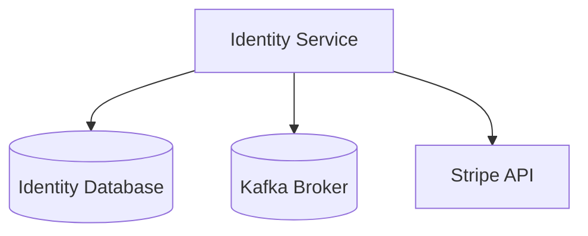

---

## 10. Component View Generation

Component view answers:

> What are the main parts of the system?

Input:

- repo-map;
- manifests;
- deployment files;
- symbols;
- contracts.

Output page:

```text
docs/architecture/components.mdx
```

Suggested structure:

```mdx
# Components

This page describes the main components detected in the repository.

## Component Diagram

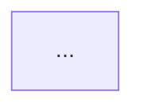

## Components

### Identity Service

Responsible for authentication and user identity endpoints.

Evidence:
- `services/identity/openapi.yaml`
- `services/identity/Dockerfile`
- `services/identity/src/routes`

### Billing Service

...
```

Source-grounded rule:

- responsibility can be generated from endpoint groups, package names, README;
- if inferred, mark inferred;
- never overstate.

Example wording:

```mdx
The generator identifies this as a component because it has a separate package manifest and deployment artifact.
```

---

## 11. Dependency View Generation

Dependency view answers:

> Which modules depend on which other modules?

Data sources:

- import graph;
- package manifests;
- build config;
- DI container config;
- module declarations.

Example:

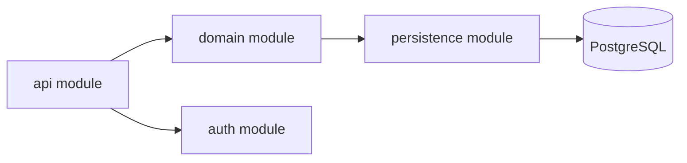

There are two different dependency views:

### Static dependency

Based on imports/build dependencies.

```text
api imports domain
domain imports shared
infra imports postgres client
```

### Runtime dependency

Based on actual calls/config/runtime integration.

```text
identity service calls billing service
billing service publishes invoice events
worker consumes invoice events
```

Do not mix them without labeling.

Page sections:

```mdx
## Static Dependencies

Derived from import and build manifests.

## Runtime Dependencies

Derived from config, clients, contracts, and deployment manifests.
```

---

## 12. API-to-Handler View

This view connects Part 021 to architecture docs.

Question:

> When a request hits an endpoint, which code handles it?

Example:

```mermaid
flowchart LR
  A[GET /v1/users/{userId}] --> B[getUserHandler]
  B --> C[UserService.getUser]
  C --> D[UserRepository.findById]
  D --> E[(users table)]
```

Sources:

- route file;
- handler symbol;
- service import;
- repository call;
- SQL query/migration.

Artifact:

```json
{
  "flowId": "flow.get-user",
  "entrypoint": "http:get:/v1/users/{userId}",
  "steps": [
    {
      "kind": "handler",
      "symbolRef": "symbol:services/identity/src/handlers/users.ts#getUserHandler"
    },
    {
      "kind": "service",
      "symbolRef": "symbol:services/identity/src/domain/user-service.ts#getUser"
    },
    {
      "kind": "datastore",
      "target": "users"
    }
  ],
  "confidence": 0.74
}
```

Confidence is lower if call graph is heuristic.

---

## 13. Request Lifecycle Page

A request lifecycle page is one of the most useful architecture docs.

Structure:

```mdx
# Request Lifecycle

This page describes how a typical authenticated request flows through the system.

## Flow

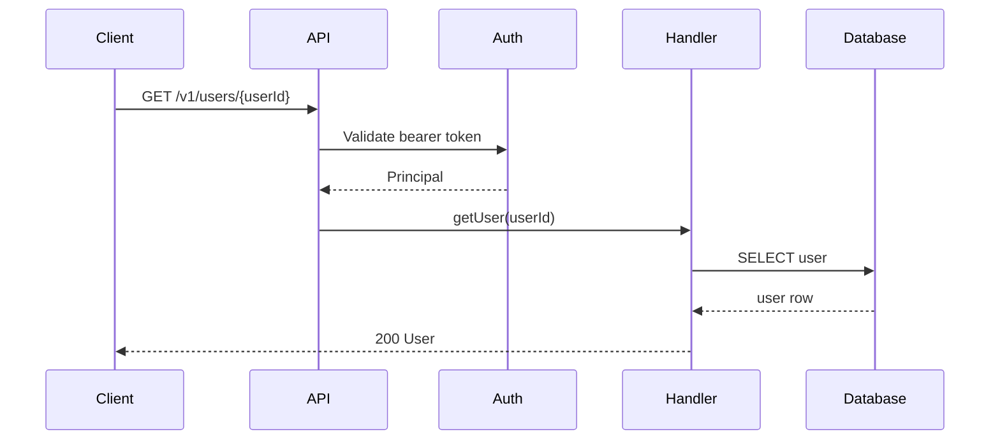

## Notes

- Authentication is handled before the handler.
- The handler reads from the users datastore.
```

But sequence diagrams require strong evidence.

If exact call sequence is uncertain, use flowchart instead:

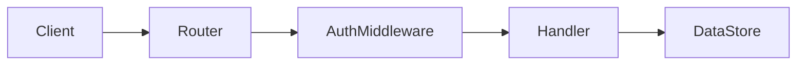

A flowchart is often safer than fake precise sequence.

---

## 14. Dataflow View

Dataflow answers:

> Where does data enter, transform, persist, and leave?

Data sources:

- API request/response;
- DB migrations;
- ORM models;
- SQL queries;
- event producers/consumers;
- file writes;
- external API clients.

Example:

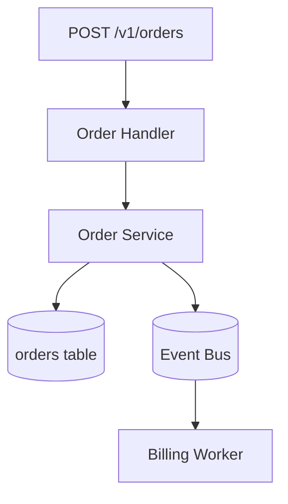

Dataflow should mark:

- input;
- transformation;
- persistence;
- output;
- side effects.

Page sections:

```mdx
## Data Inputs

## Transformations

## Persistence

## Events and Side Effects

## Sensitive Data

## Known Gaps
```

Sensitive data detection must be conservative:

- `email`;
- `phone`;
- `password`;
- `token`;
- `ssn`;
- `address`;
- custom config.

Do not publish sensitive examples.

---

## 15. Deployment View

Deployment docs come from:

- Dockerfile;
- docker-compose;
- Kubernetes manifests;
- Helm charts;
- Terraform;
- GitHub Actions;
- cloud config;
- Procfile;
- service manifests.

Generated page:

```mdx
# Deployment View

This page summarizes deployment units detected in the repository.

## Deployment Diagram

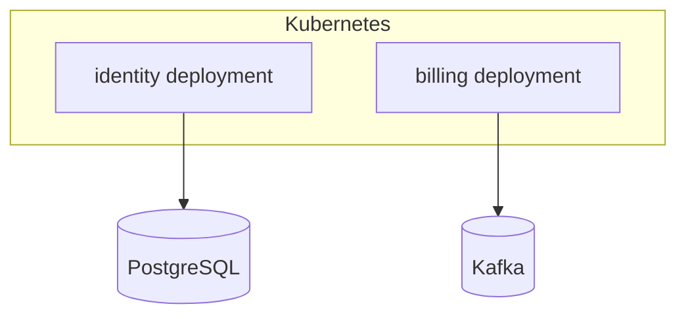

## Runtime Units

| Unit | Source | Image/Command | Port |
|---|---|---|---|
| identity | `infra/k8s/identity-deployment.yaml` | `identity-service` | `8080` |
```

Rules:

- do not infer cloud provider unless manifest says so;
- do not expose secret values;
- environment variable names can be shown if not sensitive;
- secret names may be shown only if policy allows;
- actual secret values must never be included.

---

## 16. External System Detection

External systems can be inferred from:

- SDK dependencies;
- env var names;
- HTTP client base URLs;
- config keys;
- README;
- OpenAPI server refs;
- Terraform resources;
- mock servers in tests.

Examples:

| Signal | External system |
|---|---|
| `STRIPE_API_KEY` | Stripe |
| dependency `@aws-sdk/client-s3` | AWS S3 |
| config `KAFKA_BROKERS` | Kafka |
| JDBC URL | Database |
| `SENDGRID_API_KEY` | SendGrid |

But confidence varies.

```ts
externalSystemConfidence =
  explicitConfigName ? 0.8 :
  sdkDependencyOnly ? 0.5 :
  readmeMentionOnly ? 0.4 :
  low
```

Output should say:

```mdx
The repository contains configuration for `KAFKA_BROKERS`, so the generator identifies Kafka as an external/runtime dependency.
```

Not:

```mdx
The platform is built on Kafka.
```

---

## 17. Event Architecture View

If repo contains event contracts or Kafka/Rabbit/SQS clients, generate events view.

Sources:

- AsyncAPI;
- event schema files;
- producer code;
- consumer code;
- topic config;
- tests.

Model:

```ts
type EventFlow = {
  id: string
  topic: string
  eventType?: string
  producerRefs: SourceRef[]
  consumerRefs: SourceRef[]
  schemaRefs: SourceRef[]
  confidence: number
}
```

Diagram:

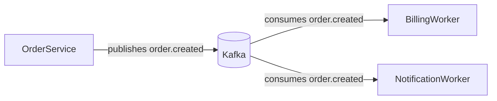

Page:

```mdx
# Event Architecture

## Topics

| Topic | Producers | Consumers | Schema |
|---|---|---|---|
| `order.created` | Order Service | Billing Worker, Notification Worker | `schemas/order-created.avsc` |
```

If topic name is inferred from code constants, cite source ref in provenance.

---

## 18. Database and Persistence View

Sources:

- migrations;
- ORM models;
- SQL files;
- repository classes;
- config;
- Docker compose;
- K8s stateful dependencies.

Generated persistence view:

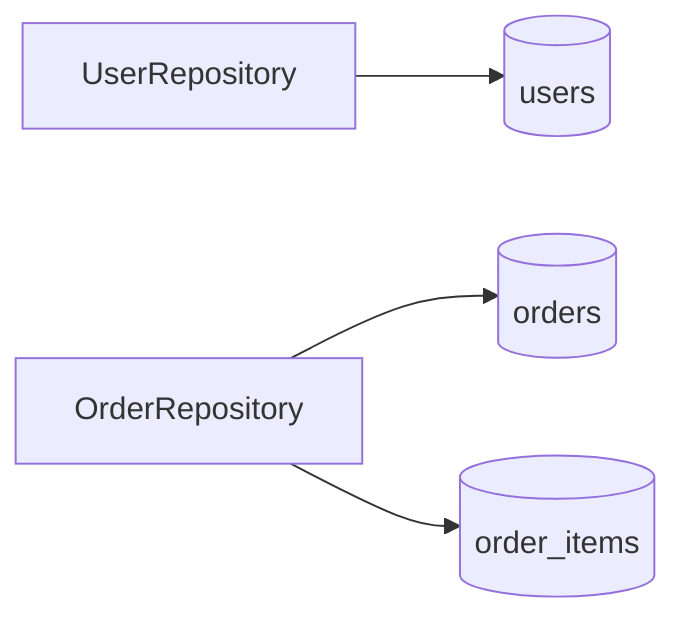

But be careful:

- table relation may require schema analysis;
- repository name may not map exactly to table;
- SQL query may reference views;
- migrations may not represent current DB if partial.

Recommended page sections:

```mdx
# Persistence

## Detected Data Stores

## Tables and Collections

## Repository-to-Table Mapping

## Migration Sources

## Known Gaps
```

Example wording:

```mdx
The generator detected a `users` table from migration files and found query references in `UserRepository`.
```

---

## 19. Architecture Decision Notes

Architecture docs should not only describe current shape.

They should capture decisions.

But decisions cannot be invented from code.

Sources:

- ADR files;
- README;
- docs/architecture;
- issue/PR references if available;
- comments with decision rationale.

If no decision source exists, output:

```mdx
## Architecture Decisions

No source-backed architecture decision records were found.
```

Do not fabricate:

```mdx
The team chose Kafka for scalability.
```

unless there is an ADR or comment that says that.

Generated ADR index:

```text
docs/architecture/decisions.mdx
```

Example:

```mdx
# Architecture Decisions

| Decision | Status | Source |
|---|---|---|
| Use PostgreSQL for primary storage | accepted | `docs/adr/0001-postgresql.md` |
```

---

## 20. Failure Mode Architecture Docs

This is highly valuable for senior engineers.

Generate failure views from:

- retry config;
- circuit breaker config;
- queue config;
- timeout config;
- health checks;
- readiness probes;
- error handlers;
- runbooks;
- tests;
- comments.

Page:

```mdx
# Architecture Failure Modes

## External API Timeout

Evidence:
- HTTP client timeout configuration in `src/clients/payment.ts`
- retry policy in `src/retry.ts`

Impact:
- payment creation may fail before order finalization

Recovery:
- see `docs/runbooks/payment-timeout.mdx`
```

If recovery source is missing, say so.

Failure mode docs should separate:

- source-backed facts;
- inferred risks;
- recommended mitigations.

Example:

```mdx
The following risk is inferred from the dependency graph and should be reviewed by the service owner.
```

---

## 21. Architecture Page Generation Contract

Architecture page needs stricter contract than API page.

```json
{
  "schemaVersion": "page-spec.v1",
  "pageType": "architecture",
  "title": "Component Architecture",
  "allowedClaims": [
    {
      "claim": "identity-service is a runtime unit",
      "evidenceRefs": [
        "services/identity/Dockerfile",
        "infra/k8s/identity-deployment.yaml"
      ]
    }
  ],
  "forbiddenClaims": [
    "Do not claim microservices architecture unless deployment manifests show independently deployed services.",
    "Do not claim event-driven architecture unless event producers/consumers are detected."
  ],
  "diagramPolicy": {
    "type": "mermaid-flowchart",
    "maxNodes": 20,
    "maxEdges": 30,
    "requireSourceBackedEdges": true
  }
}
```

Architecture generation is not “write a nice architecture summary”.

It is:

1. build model;
2. select view;
3. render diagram;
4. write evidence-backed explanation;
5. verify.

---

## 22. Architecture MDX Structure

Example:

```mdx
------
title: Architecture Overview
description: Source-grounded overview of the repository architecture.
generated:
  by: aidocs
  artifact: architecture-page.v1
  view: architecture.overview
  confidence: 0.82
---

# Architecture Overview

This page summarizes the architecture detected from repository artifacts.

## Evidence Summary

The generator used package manifests, OpenAPI contracts, deployment manifests, and source imports.

## Component Diagram


## Components

### Identity Service

The generator identifies this as a runtime service because it has a package manifest, Dockerfile, and deployment manifest.

Sources:
- `services/identity/package.json`
- `services/identity/Dockerfile`
- `infra/k8s/identity-deployment.yaml`

## Known Gaps

The repository does not contain Terraform or production environment manifests, so this page does not describe cloud infrastructure.
```

---

## 23. Diagram Verification

Generated diagrams must be verified.

Checks:

1. Mermaid syntax parses;
2. every node maps to component/external/datastore;
3. every edge maps to relation;
4. no node uses secret value;
5. diagram size under limit;
6. unsupported diagram type rejected for target renderer;
7. labels are readable;
8. duplicate nodes eliminated.

Verifier result:

```json
{
  "diagram": "architecture/overview.mmd",
  "status": "failed",
  "errors": [
    {
      "code": "edge-without-evidence",
      "message": "Edge billing-service -> identity-service has no source-backed relation."
    }
  ]
}
```

Do not publish architecture diagrams that fail edge evidence verification.

---

## 24. Confidence and Uncertainty

Architecture docs must expose uncertainty.

Use confidence levels:

| Confidence | Meaning |
|---:|---|
| 0.90-1.00 | multiple strong evidence sources agree |
| 0.70-0.89 | strong source evidence but partial view |
| 0.50-0.69 | inferred from naming/imports/config |
| 0.00-0.49 | weak inference, should not be published as fact |

MDX wording:

```mdx
The generator identified three likely components. Two have strong deployment evidence; one is inferred from directory structure only.
```

This is not weakness. This is professional honesty.

---

## 25. Architecture Review Workflow

Architecture docs should go through human review.

Review report:

```json
{
  "page": "docs/architecture/overview.mdx",
  "reviewItems": [
    {
      "type": "low-confidence-component",
      "component": "component.shared",
      "message": "`shared` may be a library rather than a runtime component."
    },
    {
      "type": "inferred-external-system",
      "system": "Stripe",
      "message": "Detected from env var `STRIPE_API_KEY`; confirm whether this integration is active."
    }
  ]
}
```

CLI:

```bash
aidocs arch generate
aidocs arch verify
aidocs arch review
```

Review UX:

```text
Architecture Review

Components:
  ✓ identity-service   confidence 0.94
  ✓ billing-service    confidence 0.91
  ? shared             confidence 0.52  inferred from folder only

Relations:
  ✓ billing-service -> kafka      producer config found
  ? billing-service -> identity   HTTP client name found, no endpoint match

Diagrams:
  ✓ overview.mmd
  ! runtime.mmd has 1 inferred edge
```

---

## 26. Architecture Generation Algorithm

Pseudocode:

```ts
function generateArchitectureDocs(project: ProjectArtifacts): ArchitectureOutput {
  const repoMap = loadRepoMap(project)
  const symbols = loadSymbols(project)
  const contracts = loadContracts(project)
  const examples = loadExamples(project)
  const existingDocs = loadExistingArchitectureDocs(project)

  const components = detectComponents(repoMap, symbols, contracts)
  const relations = detectRelations(components, symbols, contracts, examples)
  const runtimeUnits = detectRuntimeUnits(repoMap)
  const dataStores = detectDataStores(repoMap, symbols)
  const externalSystems = detectExternalSystems(repoMap, symbols)

  const model = buildArchitectureModel({
    components,
    relations,
    runtimeUnits,
    dataStores,
    externalSystems
  })

  const views = selectArchitectureViews(model, project.config.architecture)
  const diagrams = renderDiagrams(views, model)
  const pages = renderArchitecturePages(views, diagrams, model)

  const report = verifyArchitectureOutput({ model, views, diagrams, pages })

  return { model, views, diagrams, pages, report }
}
```

Important:

- detect first;
- model second;
- render after;
- verify last.

Do not let the LLM invent the model.

---

## 27. Where LLM Helps and Where It Must Not

LLM is useful for:

- turning source-backed facts into readable explanation;
- summarizing responsibilities from endpoint lists;
- writing concise component descriptions;
- explaining tradeoffs from ADR source;
- generating first-draft narrative;
- making diagram labels friendlier.

LLM must not be trusted to:

- discover architecture without evidence;
- invent component boundaries;
- infer deployment topology from generic code;
- claim scalability/security properties;
- claim design patterns;
- invent failure recovery paths;
- invent business rationale.

Rule:

> LLM can phrase architecture evidence. It cannot create architecture evidence.

---

## 28. Architecture Prompt Bundle

Architecture prompt should include:

```text
TASK
Write architecture overview from source-backed model only.

EVIDENCE
- architecture-model.v1.json
- selected source refs
- existing architecture notes

DIAGRAM
- pre-rendered Mermaid diagram
- do not change edges unless asked

RULES
- do not introduce new components
- do not introduce new edges
- mark inferred items
- include known gaps
- avoid design-pattern claims unless source-backed

OUTPUT
- MDX page
- no unsupported components
```

Do not send the entire repository to the LLM.

Send the architecture model plus source excerpts for ambiguous areas.

---

## 29. Architecture as Knowledge Graph

Every component becomes a note node.

Example Logseq-style note:

```markdown
- type:: component
- kind:: service
- path:: services/identity
- docs:: [[Architecture Overview]]
- source:: [[services/identity/package.json]]
- source:: [[infra/k8s/identity-deployment.yaml]]

## Responsibilities
- Handles identity-related API endpoints.
- Provides user lookup behavior.

## Relations
- writes-to:: [[Identity Database]]
- exposes:: [[GET /v1/users/{userId}]]
```

Architecture relations can feed:

- impact analysis;
- onboarding;
- incident response;
- code review;
- docs navigation;
- RAG retrieval.

This is why architecture model should be structured.

---

## 30. Architecture Navigation

Generated docs navigation:

```json
{
  "group": "Architecture",
  "pages": [
    "architecture/overview",
    "architecture/components",
    "architecture/request-lifecycle",
    "architecture/dataflow",
    "architecture/deployment",
    "architecture/events",
    "architecture/persistence",
    "architecture/failure-modes",
    "architecture/decisions"
  ]
}
```

Do not create pages with no useful content.

If no event evidence exists, do not generate `architecture/events.mdx`.

Instead, include in overview:

```mdx
No source-backed event producers or consumers were detected.
```

---

## 31. Practical Heuristics by Project Type

### Node.js / TypeScript

Signals:

- `package.json`;
- framework routes;
- `src/routes`;
- `src/controllers`;
- `express`, `fastify`, `nestjs`;
- `typeorm`, `prisma`;
- `kafkajs`, `amqplib`;
- Docker/K8s manifests.

### Java

Signals:

- `pom.xml`, `build.gradle`;
- `@RestController`, `@Path`;
- package boundaries;
- Spring config;
- JAX-RS resources;
- repository/service classes;
- Kafka/JMS config;
- Flyway/Liquibase migrations;
- Docker/K8s.

### Go

Signals:

- `go.mod`;
- `cmd/*`;
- `internal/*`;
- route registration;
- interface boundaries;
- DB clients;
- Docker/K8s.

### Python

Signals:

- `pyproject.toml`;
- FastAPI/Flask route decorators;
- SQLAlchemy models;
- Celery workers;
- config files.

Heuristics must be plugin-based. Do not hardcode everything into core.

---

## 32. Example: Architecture Model from Small Repo

Repo:

```text
apps/api/
  package.json
  Dockerfile
  src/routes/users.ts
  src/services/user-service.ts
  src/db/user-repository.ts
  openapi.yaml
infra/k8s/api-deployment.yaml
migrations/001_users.sql
```

Detected model:

```json
{
  "components": [
    {
      "id": "component.api",
      "name": "API Service",
      "kind": "service",
      "pathRefs": ["apps/api"],
      "confidence": 0.92
    },
    {
      "id": "datastore.postgres",
      "name": "PostgreSQL",
      "kind": "database",
      "pathRefs": ["migrations/001_users.sql"],
      "confidence": 0.78
    }
  ],
  "relations": [
    {
      "from": "component.api",
      "to": "datastore.postgres",
      "kind": "writes-to",
      "confidence": 0.71
    }
  ]
}
```

Generated page should say:

```mdx
The repository appears to expose an API service under `apps/api`. This is source-backed by a package manifest, Dockerfile, OpenAPI contract, and Kubernetes Deployment manifest.

The repository also contains SQL migrations for a `users` table. Query references in `user-repository.ts` indicate the API service reads from or writes to this datastore.
```

Notice wording:

- “appears to expose” if evidence is strong but not complete runtime proof;
- “indicate” for relation from repository/query;
- not “the production system definitely runs on PostgreSQL” unless deployment config proves it.

---

## 33. Exercise: Build `aidocs arch generate`

Input fixture:

```text
fixtures/architecture-sample/
  services/identity/
    package.json
    Dockerfile
    openapi.yaml
    src/routes/users.ts
    src/handlers/get-user.ts
    src/db/user-repository.ts
  services/billing/
    package.json
    Dockerfile
    openapi.yaml
    src/routes/invoices.ts
    src/events/invoice-created-producer.ts
  infra/k8s/
    identity-deployment.yaml
    billing-deployment.yaml
  migrations/
    identity/001_users.sql
    billing/001_invoices.sql
```

Expected output:

```text
docs/architecture/overview.mdx
docs/architecture/components.mdx
docs/architecture/request-lifecycle.mdx
docs/architecture/dataflow.mdx
docs/architecture/deployment.mdx
docs/architecture/events.mdx
.aidocs/architecture/architecture-model.v1.json
.aidocs/architecture/architecture-views.v1.json
.aidocs/architecture/reports/architecture.verify.json
```

Acceptance criteria:

- overview has component diagram;
- component list has evidence;
- deployment page uses Docker/K8s evidence;
- request lifecycle includes at least one endpoint flow;
- event page only appears if producer/consumer evidence exists;
- every diagram edge maps to relation in model;
- verifier passes.

---

## 34. Common Failure Modes

### Failure Mode 1 — Pretty but fake diagrams

Symptom:

- diagram looks clean but edges are invented.

Fix:

- require relation evidence for every edge;
- fail verifier on unsupported edge.

### Failure Mode 2 — Overclaiming architecture style

Symptom:

- docs claim microservices, DDD, CQRS, event-driven architecture without proof.

Fix:

- use evidence-based language;
- require explicit pattern evidence;
- allow human review.

### Failure Mode 3 — One giant diagram

Symptom:

- diagram impossible to read.

Fix:

- split by view;
- limit nodes/edges;
- use group landing pages.

### Failure Mode 4 — Confusing static and runtime dependency

Symptom:

- import dependency shown as service call.

Fix:

- separate static dependency view and runtime dependency view.

### Failure Mode 5 — Leaking sensitive config

Symptom:

- env values, hostnames, tokens, internal addresses appear in docs.

Fix:

- secret redaction;
- config value policy;
- show variable names only if safe.

### Failure Mode 6 — Missing known gaps

Symptom:

- architecture docs look complete when source is partial.

Fix:

- always include known gaps section;
- include evidence summary.

---

## 35. Testing Strategy

### Unit tests

- component detection;
- relation detection;
- external system detection;
- datastore detection;
- diagram rendering;
- confidence scoring.

### Golden tests

Input repo fixture → expected architecture model and MDX.

### Diagram tests

- render Mermaid syntax;
- detect unknown node;
- detect unsupported edge;
- validate max size.

### Mutation tests

- remove Dockerfile;
- remove deployment manifest;
- remove DB migration;
- rename route;
- remove event producer;
- ensure confidence changes and pages update.

### Review tests

- low-confidence component generates review item;
- inferred external system generates review item;
- unsupported design pattern claim fails verifier.

---

## 36. Minimal Implementation Order

Implement this order:

1. detect component candidates from repo map;
2. detect runtime units from Docker/K8s/compose;
3. detect entrypoints from API contracts;
4. detect datastores from migrations/config/imports;
5. detect external systems from config/dependencies;
6. build relation graph from imports/contracts/examples;
7. render component diagram;
8. render overview page;
9. add verifier;
10. add request lifecycle view;
11. add deployment view;
12. add events/dataflow view;
13. add knowledge graph export.

Avoid starting with the LLM.

The LLM should receive the architecture model and write a clear page, not invent the model.

---

## 37. What You Should Understand Now

Setelah part ini, kamu harus memahami:

1. Architecture docs harus view-based, bukan satu diagram besar.
2. Diagram harus dihasilkan dari model dan evidence.
3. Component detection perlu multi-signal scoring.
4. Runtime dependency dan static dependency adalah hal berbeda.
5. Sequence diagram hanya aman jika call flow cukup jelas.
6. Mermaid membantu docs-as-code, tetapi syntax support harus divalidasi.
7. Architecture docs harus menampilkan confidence dan known gaps.
8. LLM hanya membantu menjelaskan, bukan menciptakan fakta arsitektur.

Pada part berikutnya kita masuk ke **troubleshooting and runbook generation**: bagaimana menambang error, logs, tests, config, dan operational clues untuk menghasilkan runbook yang benar-benar membantu saat sistem bermasalah.
