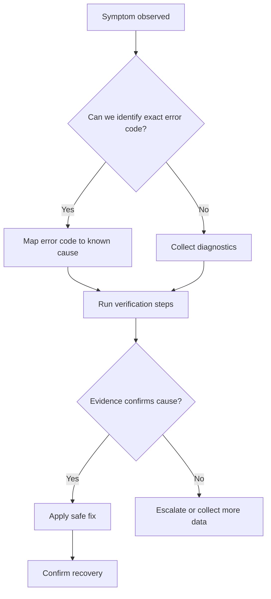
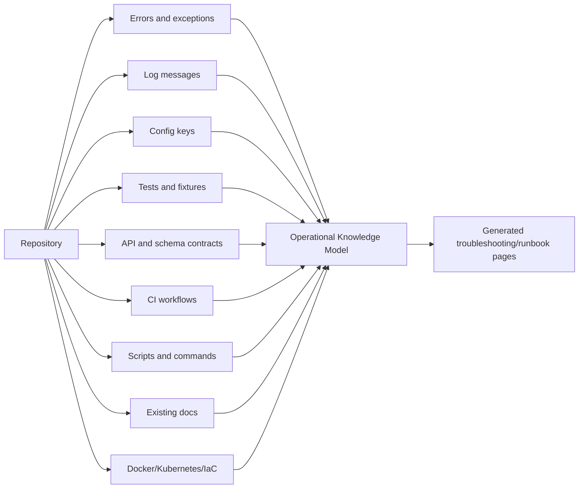
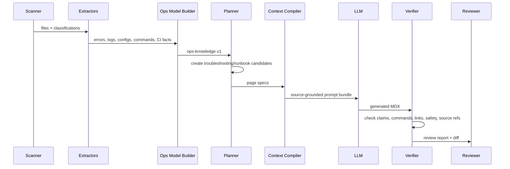

------
title: Build From Scratch: Mintlify-like AI-driven Documentation Generator CLI - Part 023
description: Build a source-grounded troubleshooting and runbook generation pipeline that mines logs, errors, config, tests, contracts, CI files, and operational clues without inventing production behavior.
series: learn-ai-docs-km-cli
seriesTitle: Build From Scratch: Mintlify-like AI-driven Documentation Generator CLI with Code2Prompt and Open-source Knowledge Management
order: 23
partTitle: Troubleshooting and Runbook Generation
tags:
- ai-docs
- documentation
- cli
- runbook
- troubleshooting
- sre
- observability
- mdx
date: 2026-07-04
---

# Part 023 — Troubleshooting and Runbook Generation

A good documentation generator does not only explain the happy path.

For developer tools, infrastructure projects, API platforms, and internal systems, the most valuable docs often answer questions like these:

- “Why is this command failing?”
- “Why does this endpoint return 401?”
- “Why does this worker keep retrying?”
- “Why does local setup fail on macOS?”
- “Why does CI pass locally but fail in GitHub Actions?”
- “What should I check before rolling back?”
- “What is safe to restart?”
- “Which config value controls this behavior?”

This part designs the **troubleshooting and runbook generation pipeline**.

The goal is not to ask an LLM to write generic operational advice. The goal is to mine real signals from the repository and generate docs that are:

- source-grounded,
- operationally useful,
- safe by default,
- reviewable,
- testable,
- tied to real errors, commands, configs, endpoints, and runtime assumptions.

We are building documentation that helps a developer move from **symptom** to **cause** to **verification** to **fix**.

---

## 1. Why Troubleshooting Docs Are Different

Most generated docs follow this shape:

```txt
What is this?
How do I install it?
How do I use it?
What APIs exist?
```

Troubleshooting docs follow a different shape:

```txt
Something is broken.
How do I identify the failure?
What caused it?
What evidence confirms it?
What is the safest next action?
What must I avoid doing?
```

That changes the whole generation model.

A tutorial can tolerate incomplete coverage. A troubleshooting page cannot casually invent causes or commands. A bad runbook can waste hours, hide the real problem, or cause damage.

So the invariant is stricter:

> A troubleshooting section must be generated from observable evidence: error strings, exception classes, logs, config keys, health checks, tests, CI steps, contracts, or existing operational notes.

If the repo does not contain evidence, the generator may still create a placeholder, but it must mark it as `needs-human-input`, not pretend the cause is known.

---

## 2. Mental Model: Troubleshooting as a Decision Tree

A troubleshooting document is not just prose. It is a lightweight decision model.

A useful entry looks like this:

```txt
Symptom:
  The CLI exits with `CONFIG_NOT_FOUND`.

Likely causes:
  1. The project has not been initialized.
  2. The config path is overridden incorrectly.
  3. The command is running from a nested workspace.

Verification:
  - Run `aidocs config inspect`.
  - Check whether `.aidocs/config.yml` exists.
  - Check the resolved workspace root.

Fix:
  - Run `aidocs init` from the repository root.
  - Or pass `--config <path>`.

Do not:
  - Delete `.aidocs/cache` unless cache corruption is confirmed.
```

Structurally, it is a graph:



That graph is the actual target. The MDX page is only the rendered form.

---

## 3. Runbook vs Troubleshooting Guide

We should distinguish these two artifacts.

### 3.1 Troubleshooting Guide

A troubleshooting guide helps a developer debug a known class of problem.

Examples:

- “Generated docs are missing pages.”
- “OpenAPI routes are not detected.”
- “Logseq sync creates duplicate pages.”
- “Prompt bundle exceeds token budget.”
- “MDX preview fails to compile.”

It is usually symptom-first.

### 3.2 Runbook

A runbook helps an operator perform a repeatable operational procedure.

Examples:

- “Regenerate docs after API contract change.”
- “Recover from corrupted context cache.”
- “Rotate LLM provider credentials used in CI.”
- “Rollback generated docs in production.”
- “Validate docs before release.”

It is usually procedure-first.

### 3.3 Why This Distinction Matters

Troubleshooting guides need diagnostic branching.

Runbooks need ordered execution, preconditions, rollback steps, and safety warnings.

Bad generator design mixes both into vague advice.

Our generator should produce different page contracts:

```ts
export type OperationalDocKind =
  | "troubleshooting-guide"
  | "runbook"
  | "diagnostic-reference"
  | "error-reference"
  | "faq";
```

---

## 4. Sources for Troubleshooting Knowledge

The pipeline should mine many repository signals.



Each source has different authority.

| Source | What it reveals | Reliability |
|---|---|---:|
| Error classes/enums | Named failure conditions | High |
| Log statements | Runtime symptoms and context fields | Medium to high |
| Tests | Confirmed expected behavior | High |
| CI workflows | Build/test/deploy failure modes | High |
| Existing docs | Human explanation | Medium to high |
| Config schema | Valid/invalid setup | High |
| Docker/Kubernetes files | Runtime assumptions | Medium |
| Issue templates | Known user-reported problems | Medium |
| Comments/TODOs | Hints, not truth | Low |

The generator must not treat all evidence equally.

---

## 5. Operational Knowledge Model

Before generating MDX, build an intermediate model.

Call it `ops-knowledge.v1.json`.

```ts
export interface OpsKnowledgeArtifact {
  schemaVersion: "ops-knowledge.v1";
  repo: RepoIdentity;
  generatedAt: string;
  errors: ErrorFact[];
  logEvents: LogEventFact[];
  diagnostics: DiagnosticFact[];
  configFacts: ConfigOperationalFact[];
  commandFacts: CommandOperationalFact[];
  ciFacts: CiOperationalFact[];
  runtimeFacts: RuntimeOperationalFact[];
  runbookCandidates: RunbookCandidate[];
  troubleshootingCandidates: TroubleshootingCandidate[];
  gaps: OperationalKnowledgeGap[];
}
```

This artifact prevents the LLM from being the first component that “understands” the operational surface.

The deterministic extractor first says:

```txt
These are the known errors.
These are the known commands.
These are the known configs.
These are the known checks.
These are the known risky operations.
These are the gaps.
```

Then the LLM writes docs from that model.

---

## 6. Error Mining

Errors are the most reliable source for troubleshooting docs.

Look for:

- exception classes,
- error enums,
- error codes,
- HTTP status mapping,
- CLI exit codes,
- validation errors,
- domain-specific failure classes,
- GraphQL error extensions,
- problem detail responses,
- retryable/non-retryable errors.

Example TypeScript extraction target:

```ts
export class ConfigNotFoundError extends Error {
  code = "CONFIG_NOT_FOUND";

  constructor(path: string) {
    super(`Config file not found: ${path}`);
  }
}
```

Extract:

```json
{
  "kind": "error",
  "id": "error:CONFIG_NOT_FOUND",
  "name": "ConfigNotFoundError",
  "code": "CONFIG_NOT_FOUND",
  "messageTemplate": "Config file not found: {path}",
  "sourceRef": {
    "path": "src/config/errors.ts",
    "lineStart": 1,
    "lineEnd": 8
  },
  "likelyLayer": "configuration",
  "userVisible": true
}
```

For Java:

```java
public final class ContractDiscoveryException extends RuntimeException {
    public ContractDiscoveryException(String message, Throwable cause) {
        super(message, cause);
    }
}
```

For Go:

```go
var ErrWorkspaceNotFound = errors.New("workspace not found")
```

For REST APIs:

```yaml
responses:
  '401':
    description: Missing or invalid bearer token
```

The extractor should normalize these into one error model.

---

## 7. Error Classification

Every error should be classified along practical axes.

```ts
export interface ErrorFact {
  id: string;
  code?: string;
  name: string;
  messageTemplate?: string;
  sourceRefs: SourceRef[];
  layer: ErrorLayer;
  visibility: "user-visible" | "internal" | "unknown";
  severityHint: "low" | "medium" | "high" | "unknown";
  retryability: "retryable" | "not-retryable" | "unknown";
  recoverability: "user-action" | "operator-action" | "developer-fix" | "unknown";
  relatedConfigKeys: string[];
  relatedCommands: string[];
  relatedEndpoints: string[];
  relatedTests: string[];
}
```

Possible layers:

```ts
export type ErrorLayer =
  | "configuration"
  | "authentication"
  | "authorization"
  | "validation"
  | "network"
  | "database"
  | "filesystem"
  | "cache"
  | "llm-provider"
  | "parser"
  | "renderer"
  | "ci"
  | "deployment"
  | "unknown";
```

Classification lets the planner group pages naturally:

```txt
Troubleshooting
  - Configuration problems
  - Authentication and provider errors
  - Repository scanning problems
  - MDX rendering problems
  - CI and publishing problems
```

---

## 8. Log Mining

Logs are useful because they reveal runtime symptoms and diagnostic fields.

Search for patterns such as:

```ts
logger.warn("OpenAPI file could not be parsed", { path, reason });
logger.error("Prompt bundle exceeded token budget", { budget, actualTokens });
logger.info("Skipping generated file", { path, reason: "ignored_by_policy" });
```

Extract:

```json
{
  "kind": "log-event",
  "id": "log:prompt_bundle_exceeded_token_budget",
  "level": "error",
  "messageTemplate": "Prompt bundle exceeded token budget",
  "fields": ["budget", "actualTokens"],
  "sourceRefs": [
    {
      "path": "src/context/budget.ts",
      "lineStart": 72,
      "lineEnd": 76
    }
  ],
  "relatedErrorCodes": ["TOKEN_BUDGET_EXCEEDED"],
  "diagnosticValue": "high"
}
```

A good troubleshooting page can then say:

```mdx
If the log contains `Prompt bundle exceeded token budget`, inspect the context packing report and check which units consumed the most tokens.
```

But it should only say that if the log event exists.

---

## 9. Observability Fields as Documentation Inputs

Modern systems often expose structured telemetry through logs, metrics, and traces. OpenTelemetry defines traces, metrics, and logs as telemetry signals, and the logs specification discusses correlation with resource context and other telemetry signals.

For our docs generator, this matters because fields like these are documentation material:

```txt
trace_id
span_id
request_id
workspace_id
repo_path
provider
model
token_budget
cache_key
page_id
contract_id
```

If the code logs `page_id` and `source_ref`, the troubleshooting page should tell users to include those values in bug reports.

Example generated section:

```mdx
## What to include in a bug report

Include:

- the command you ran,
- the generated `page_id`,
- the `prompt_bundle_id`,
- the relevant `source_ref`,
- whether the command was run with `--ci`,
- the verifier report path.
```

This is more useful than “check the logs.”

---

## 10. Config-driven Failure Modes

Many failures are config failures.

Mine config from:

- JSON Schema,
- Zod schemas,
- TypeScript interfaces,
- Java config classes,
- YAML examples,
- `.env.example`,
- CLI flags,
- documentation config files,
- provider configuration.

Example config fact:

```json
{
  "kind": "config-operational-fact",
  "key": "llm.provider",
  "type": "string",
  "required": true,
  "allowedValues": ["openai", "anthropic", "local"],
  "defaultValue": null,
  "sourceRefs": [
    {
      "path": "src/config/schema.ts",
      "lineStart": 18,
      "lineEnd": 25
    }
  ],
  "failureIfMissing": "LLM provider cannot be resolved"
}
```

Generated troubleshooting:

```mdx
### `llm.provider` is missing

The generator cannot create AI-authored pages without a resolved provider. Check `llm.provider` in `.aidocs/config.yml` or pass the provider through your CI profile.
```

Again, this is grounded in config schema, not invented.

---

## 11. CI Failure Mining

CI workflows are operational docs hiding in YAML.

Mine:

- job names,
- steps,
- commands,
- environment variables,
- required secrets,
- cache keys,
- artifact upload paths,
- branch filters,
- pull request triggers,
- deployment steps.

Example:

```yaml
- name: Verify generated docs
  run: aidocs verify --ci --fail-on drift,broken-link,invalid-frontmatter
```

This tells us:

- there is a CI verification mode,
- drift can fail the build,
- broken links can fail the build,
- invalid frontmatter can fail the build.

Generated troubleshooting can include:

```mdx
## CI fails on `drift`

This means the generated docs no longer match the source repository state. Run:

```bash
aidocs plan --explain
aidocs generate --dry-run
aidocs verify --ci
```

Review the verifier report before committing regenerated docs.
```

But the command names should be extracted from actual package scripts, CLI definitions, or docs, not guessed.

---

## 12. Script and Command Mining

Mine commands from:

- `package.json` scripts,
- `Makefile`,
- `Taskfile.yml`,
- shell scripts,
- CLI parser definitions,
- README command examples,
- CI steps.

Example command fact:

```json
{
  "kind": "command",
  "id": "command:aidocs:verify",
  "name": "aidocs verify",
  "flags": ["--ci", "--fail-on", "--report"],
  "sourceRefs": [
    {
      "path": "src/cli/commands/verify.ts",
      "lineStart": 10,
      "lineEnd": 57
    }
  ],
  "safeToRun": true,
  "mutatesRepository": false
}
```

Command safety is important.

A generated runbook should distinguish:

```txt
Safe inspection commands:
  aidocs scan --explain
  aidocs verify --report

Mutating commands:
  aidocs generate --apply
  aidocs km sync --write

Destructive commands:
  aidocs cache clear --all
```

Never flatten all commands into “run these.”

---

## 13. Runtime and Deployment Clue Mining

For deployment-aware projects, mine:

- `Dockerfile`,
- `docker-compose.yml`,
- Kubernetes manifests,
- Helm charts,
- Terraform,
- environment variables,
- health endpoints,
- readiness probes,
- liveness probes,
- mounted volumes,
- ports,
- resource limits.

A docs generator should not pretend it knows production if the repo only contains a local CLI.

But if it sees:

```yaml
readinessProbe:
  httpGet:
    path: /healthz
    port: 8080
```

Then a runbook can safely say:

```mdx
Check readiness with the `/healthz` endpoint if the service is deployed with the Kubernetes manifest in `deploy/k8s/service.yaml`.
```

The phrase “if the service is deployed with...” matters. It preserves the source boundary.

---

## 14. Candidate Generation

After extraction, create candidate pages.

```ts
export interface TroubleshootingCandidate {
  id: string;
  title: string;
  symptoms: SymptomFact[];
  likelyCauses: CauseCandidate[];
  verificationSteps: VerificationStepCandidate[];
  fixSteps: FixStepCandidate[];
  sourceRefs: SourceRef[];
  confidence: number;
  risk: "low" | "medium" | "high";
  gaps: string[];
}
```

Example candidate:

```json
{
  "id": "troubleshooting:prompt-bundle-token-budget",
  "title": "Prompt bundle exceeds token budget",
  "symptoms": [
    {
      "text": "The generator fails before calling the LLM because the compiled context is too large.",
      "evidence": ["error:TOKEN_BUDGET_EXCEEDED", "log:prompt_bundle_exceeded_token_budget"]
    }
  ],
  "likelyCauses": [
    {
      "text": "The target page pulls too many high-relevance files into context.",
      "evidence": ["source:src/context/packer.ts"]
    },
    {
      "text": "Compression policy is disabled or too conservative.",
      "evidence": ["config:context.compression.mode"]
    }
  ],
  "verificationSteps": [
    {
      "command": "aidocs context explain --page <page-id>",
      "safeToRun": true
    }
  ],
  "fixSteps": [
    {
      "text": "Tune context selection or enable stronger compression for low-authority files.",
      "mutatesRepository": false
    }
  ],
  "confidence": 0.86,
  "risk": "low",
  "gaps": []
}
```

---

## 15. Symptom Extraction

A symptom is what the user sees.

Sources:

- error messages,
- CLI output,
- HTTP response status,
- failed test output,
- CI job names,
- log messages,
- rendered MDX errors,
- missing generated artifacts.

Do not describe symptoms from internal cause only.

Bad:

```txt
The context selection algorithm has poor entropy.
```

Better:

```txt
The generated page omits important source files, or the context explanation report shows low-relevance files consuming most of the token budget.
```

User-visible symptoms should be written in the language of the user’s experience.

---

## 16. Cause Candidate Extraction

A cause must be tied to evidence.

Example mapping:

| Evidence | Possible cause |
|---|---|
| Missing config error | Project not initialized or wrong config path |
| 401 response in OpenAPI | Missing/invalid auth token |
| CI `docs verify` step fails | Drift, broken links, invalid frontmatter |
| MDX parser error | Unescaped JSX, invalid import, malformed frontmatter |
| Cache hash mismatch | stale/corrupted cache or changed source artifact |

Each cause candidate should include:

```ts
export interface CauseCandidate {
  text: string;
  evidenceRefs: string[];
  confidence: number;
  alternativeCauses: string[];
  unsafeToAutoFix?: boolean;
}
```

Why `alternativeCauses`?

Because a troubleshooting guide should not overfit to one explanation. Real debugging often starts with ambiguity.

---

## 17. Verification Step Design

A verification step answers:

> How do we confirm this is the real cause?

Good verification is:

- observable,
- safe,
- specific,
- reversible,
- cheap when possible,
- tied to source evidence.

Bad verification:

```txt
Check your setup.
```

Good verification:

```txt
Run `aidocs config inspect --json` and confirm that `llm.provider` resolves to one of the configured provider adapters.
```

Verification steps should be typed:

```ts
export type VerificationStepKind =
  | "command"
  | "file-check"
  | "config-check"
  | "log-query"
  | "http-request"
  | "database-query"
  | "ci-artifact-check"
  | "manual-inspection";
```

And safety-scored:

```ts
export interface VerificationStepCandidate {
  kind: VerificationStepKind;
  instruction: string;
  command?: string;
  sourceRefs: SourceRef[];
  safeToRun: boolean;
  requiresCredential: boolean;
  mutatesState: boolean;
}
```

---

## 18. Fix Step Design

A fix step changes something.

That means it needs stronger safety language.

Classify fix steps:

```ts
export type FixRisk =
  | "no-risk"
  | "local-only"
  | "repository-change"
  | "environment-change"
  | "credential-change"
  | "deployment-change"
  | "destructive";
```

Example:

```json
{
  "instruction": "Regenerate the docs plan after adding a new OpenAPI spec.",
  "command": "aidocs plan --include contracts",
  "risk": "local-only",
  "requiresReview": false,
  "rollback": "Discard generated artifacts if the plan is incorrect."
}
```

A destructive command should not be auto-generated unless found in a trusted source and marked with a warning.

Bad:

```mdx
Run `rm -rf .aidocs`.
```

Better:

```mdx
Only clear the cache if the verifier report indicates cache corruption. Prefer:

```bash
aidocs cache clear --scope context
```

Avoid deleting the entire `.aidocs` directory unless you are intentionally removing generated state and review metadata.
```

---

## 19. Runbook Page Contract

A runbook page should have a stricter structure than a normal guide.

```ts
export interface RunbookPageSpec {
  id: string;
  title: string;
  purpose: string;
  whenToUse: string[];
  whenNotToUse: string[];
  prerequisites: RunbookPrerequisite[];
  requiredAccess: string[];
  safetyWarnings: string[];
  procedure: RunbookStep[];
  verification: RunbookStep[];
  rollback: RunbookStep[];
  escalation: EscalationInstruction[];
  sourceRefs: SourceRef[];
}
```

Rendered MDX shape:

```mdx
# Recover from corrupted context cache

## When to use this runbook

## When not to use this runbook

## Preconditions

## Safety warnings

## Procedure

## Verify recovery

## Rollback

## Escalation notes

## Source evidence
```

This structure prevents vague operational prose.

---

## 20. Troubleshooting Page Contract

A troubleshooting page should be symptom-first.

```ts
export interface TroubleshootingPageSpec {
  id: string;
  title: string;
  symptoms: SymptomFact[];
  quickChecks: VerificationStepCandidate[];
  causeMatrix: CauseMatrixRow[];
  fixes: FixStepCandidate[];
  escalation: EscalationInstruction[];
  relatedDocs: string[];
  sourceRefs: SourceRef[];
}
```

Rendered MDX shape:

```mdx
# Prompt bundle exceeds token budget

## Symptoms

## Quick checks

## Cause matrix

| Cause | How to confirm | Fix | Risk |
|---|---|---|---|

## Detailed diagnosis

## Safe fixes

## What not to do

## Related docs

## Source evidence
```

The cause matrix is the most valuable part.

---

## 21. Cause Matrix

A cause matrix compresses debugging logic.

Example:

```mdx
| Cause | How to confirm | Fix | Risk |
|---|---|---|---|
| Too many files selected for context | Run `aidocs context explain --page <id>` and inspect the top token consumers | Adjust include/exclude rules or compression policy | Local-only |
| Large generated files included | Check whether `generated: true` files appear in the context report | Add generated path to `.aidocsignore` | Repository-change |
| Wrong page target | Compare the page spec source refs with the intended topic | Regenerate the page spec | Local-only |
```

A cause matrix is more efficient than paragraphs because it supports rapid scanning during stress.

---

## 22. Escalation Instructions

Escalation is not only for production incidents. It is also useful for developer tooling.

Generated escalation should say what evidence to collect.

Example:

```mdx
## Escalation notes

If this issue persists, include:

- the command you ran,
- the relevant `prompt_bundle_id`,
- the generated `context-report.json`,
- the verifier report,
- the page spec ID,
- the source refs listed in the failed section.
```

This makes bug reports actionable.

---

## 23. Safety Model

Runbook generation needs a safety model.

```ts
export interface OperationalSafetyPolicy {
  allowDestructiveCommands: boolean;
  requireHumanReviewForDeploymentChanges: boolean;
  requireHumanReviewForCredentialChanges: boolean;
  redactSecretsInExamples: boolean;
  blockCommandsMatching: string[];
  warnCommandsMatching: string[];
}
```

Default policy:

```yaml
runbooks:
  safety:
    allowDestructiveCommands: false
    requireHumanReviewForDeploymentChanges: true
    requireHumanReviewForCredentialChanges: true
    redactSecretsInExamples: true
    blockCommandsMatching:
      - "rm -rf /"
      - "kubectl delete namespace"
      - "terraform destroy"
    warnCommandsMatching:
      - "rm -rf"
      - "drop database"
      - "delete from"
      - "kubectl delete"
```

A documentation generator must not be an accidental incident generator.

---

## 24. Redaction

Operational docs often expose sensitive values.

Redact:

- API keys,
- bearer tokens,
- passwords,
- private keys,
- database URLs,
- internal hostnames if configured,
- customer identifiers,
- emails if policy requires.

Example:

```txt
Authorization: Bearer sk-live-123456
```

Should become:

```txt
Authorization: Bearer <TOKEN>
```

Redaction must happen before:

- prompt bundle creation,
- generated docs rendering,
- knowledge graph sync,
- debug artifact storage.

---

## 25. Generation Pipeline

The full pipeline:



Notice that the LLM is not responsible for discovering all facts. It is responsible for turning verified facts into usable docs.

---

## 26. Prompt Contract for Troubleshooting

Prompt instruction should be strict.

```txt
Write a troubleshooting page from the provided operational facts only.

Rules:
- Do not invent commands.
- Do not invent environment variables.
- Do not invent production topology.
- Do not claim a cause unless evidence is provided.
- Mark uncertain causes as "Possible cause".
- Every fix must include risk level.
- Every destructive or mutating action must require review.
- Include a source evidence section.
```

Give the LLM a structured output target:

```json
{
  "title": "string",
  "symptoms": ["string"],
  "quickChecks": [
    {
      "instruction": "string",
      "risk": "no-risk | local-only | ...",
      "sourceRefs": ["string"]
    }
  ],
  "causeMatrix": [
    {
      "cause": "string",
      "howToConfirm": "string",
      "fix": "string",
      "risk": "string",
      "sourceRefs": ["string"]
    }
  ],
  "unknowns": ["string"]
}
```

Then render to MDX deterministically.

---

## 27. Verifier Rules for Runbooks

Runbooks need custom verification.

Checks:

1. Every command must be known, extracted, or explicitly marked human-provided.
2. Every mutating command must include risk level.
3. Every destructive command must be blocked or require manual approval.
4. Every cause must have evidence refs.
5. Every “fix” must have verification or rollback where relevant.
6. Every secret-like token must be redacted.
7. Every production claim must be backed by deployment/config evidence.
8. Every source ref must resolve.
9. Every internal link must resolve.
10. Every code fence must have a language.

Example verifier finding:

```json
{
  "severity": "error",
  "code": "RUNBOOK_COMMAND_NOT_SOURCED",
  "message": "The generated runbook includes `kubectl rollout restart` but no source command or deployment file supports it.",
  "path": "docs/troubleshooting/deployment-restart.mdx",
  "section": "Procedure"
}
```

---

## 28. Page Examples

### 28.1 Troubleshooting Page Example

```mdx
------
title: Prompt Bundle Exceeds Token Budget
description: Diagnose and fix context packing failures when the generated prompt bundle is too large.
---

# Prompt Bundle Exceeds Token Budget

## Symptoms

You may see an error similar to `TOKEN_BUDGET_EXCEEDED`, or the context report may show that the selected context is larger than the configured model budget.

## Quick checks

```bash
aidocs context explain --page <page-id>
```

Check:

- top token-consuming files,
- number of included context units,
- whether generated files were included,
- whether compression was applied.

## Cause matrix

| Cause | How to confirm | Fix | Risk |
|---|---|---|---|
| Too many source files selected | Inspect context report token distribution | Adjust relevance rules or page scope | Local-only |
| Generated files included | Check context units marked `generated: true` | Add generated paths to `.aidocsignore` | Repository-change |
| Compression disabled | Inspect `context.compression.mode` | Enable compression for low-authority units | Repository-change |

## What not to do

Do not manually remove source refs from the generated page. Fix the context selection policy instead.
```

### 28.2 Runbook Example

```mdx
------
title: Regenerate Docs After API Contract Change
description: Safely regenerate API docs when an OpenAPI file changes.
---

# Regenerate Docs After API Contract Change

## When to use this runbook

Use this when an OpenAPI file has changed and the docs verifier reports API drift.

## Preconditions

- The changed OpenAPI file is committed or available in the working tree.
- You can run the docs CLI locally.
- You can inspect generated diffs before applying them.

## Procedure

```bash
aidocs scan
aidocs contracts discover
aidocs plan --include api
aidocs generate --dry-run
aidocs verify
```

Review the generated diff before applying changes.

## Verify recovery

```bash
aidocs verify --fail-on drift,broken-link,invalid-frontmatter
```

## Rollback

Discard generated docs changes if the new API reference does not match the intended contract update.
```

---

## 29. Knowledge Graph Export

Troubleshooting and runbook pages are excellent knowledge graph nodes.

Logseq-style generated note:

```md
- type:: [[Troubleshooting Guide]]
- system:: [[AI Docs CLI]]
- symptom:: [[Prompt bundle exceeds token budget]]
- related-error:: [[TOKEN_BUDGET_EXCEEDED]]
- related-command:: [[aidocs context explain]]
- source:: `src/context/packer.ts`

## Cause matrix
- [[Too many source files selected]]
- [[Generated files included]]
- [[Compression disabled]]
```

Knowledge graph relationships:

```ts
export type OpsKnowledgeEdge =
  | "symptom-caused-by"
  | "cause-confirmed-by"
  | "cause-fixed-by"
  | "runbook-uses-command"
  | "runbook-modifies-config"
  | "error-documented-by"
  | "page-derived-from-source";
```

This allows later retrieval:

```txt
Find all troubleshooting pages related to token budget.
Find all runbooks that use a mutating command.
Find all errors without troubleshooting coverage.
```

---

## 30. CLI Commands

Add commands:

```bash
aidocs ops extract
```

Build `ops-knowledge.v1.json`.

```bash
aidocs ops candidates
```

Generate troubleshooting/runbook candidates.

```bash
aidocs runbook generate --id recover-context-cache
```

Generate one runbook.

```bash
aidocs troubleshoot generate --id prompt-bundle-token-budget
```

Generate one troubleshooting page.

```bash
aidocs ops coverage
```

Show known operational facts without docs coverage.

Example output:

```txt
Operational documentation coverage

Errors discovered:             42
User-visible errors:           19
Errors with troubleshooting:   11
Errors without troubleshooting: 8
Runbook candidates:            6
High-risk runbooks:            2
Commands with safety metadata: 27/31
```

---

## 31. Testing Strategy

Test the pipeline with fixtures.

### 31.1 Error Extraction Fixture

Input:

```ts
throw new ConfigNotFoundError(configPath);
```

Expected:

```json
{
  "code": "CONFIG_NOT_FOUND",
  "layer": "configuration"
}
```

### 31.2 Log Extraction Fixture

Input:

```ts
logger.error("OpenAPI parsing failed", { path, reason });
```

Expected:

```json
{
  "messageTemplate": "OpenAPI parsing failed",
  "fields": ["path", "reason"]
}
```

### 31.3 Unsafe Command Fixture

Input generated MDX:

```mdx
Run `rm -rf .aidocs`.
```

Expected verifier finding:

```json
{
  "code": "RUNBOOK_DESTRUCTIVE_COMMAND_REQUIRES_REVIEW",
  "severity": "error"
}
```

### 31.4 Source Boundary Fixture

If no Kubernetes files exist, generated docs must not mention `kubectl` unless the command is found in trusted existing docs or config.

---

## 32. Failure Modes

### 32.1 Generic Advice

Symptom:

```txt
The generated docs say “check your logs” everywhere.
```

Cause:

The generator has no structured operational model.

Fix:

Require log event extraction and field-aware diagnostics.

### 32.2 Invented Production Topology

Symptom:

```txt
The runbook mentions Kubernetes even though the repo has no Kubernetes deployment.
```

Cause:

The LLM used generic cloud-native assumptions.

Fix:

Block production topology claims unless backed by deployment source refs.

### 32.3 Unsafe Fixes

Symptom:

```txt
The generated runbook suggests destructive cleanup.
```

Cause:

No command safety classifier.

Fix:

Classify commands and require manual review for destructive or mutating actions.

### 32.4 Cause Overconfidence

Symptom:

```txt
The troubleshooting page states one cause as definite when multiple causes are possible.
```

Cause:

Cause confidence not represented.

Fix:

Use `possible cause`, evidence refs, and alternative causes.

---

## 33. Implementation Slice

Minimum useful implementation:

1. Extract error classes/codes.
2. Extract log messages.
3. Extract config keys.
4. Extract package scripts and CLI commands.
5. Build `ops-knowledge.v1.json`.
6. Generate candidate troubleshooting pages.
7. Render one page type: symptom → cause matrix → fixes.
8. Verify commands, source refs, and unsafe actions.

Do not start with a giant “AI runbook writer.”

Start with operational facts.

---

## 34. Design Invariants

Keep these invariants:

1. A cause must have evidence.
2. A fix must have a risk level.
3. A mutating command must be marked as mutating.
4. A destructive command must require review or be blocked.
5. A production claim must cite production/deployment evidence.
6. A generated runbook must include preconditions.
7. A troubleshooting guide must start from user-visible symptoms.
8. A verifier must be able to reject unsafe generated operational docs.
9. Unknowns must be explicit.
10. Human operators must not be tricked into trusting invented procedures.

---

## 35. References

- Google SRE Book, “Emergency Response”: https://sre.google/sre-book/emergency-response/
- Google SRE Workbook, “Incident Response”: https://sre.google/workbook/incident-response/
- Google SRE Book, “Managing Incidents”: https://sre.google/sre-book/managing-incidents/
- OpenTelemetry Documentation: https://opentelemetry.io/docs/
- OpenTelemetry Logs Specification: https://opentelemetry.io/docs/specs/otel/logs/
- OpenAPI Specification: https://spec.openapis.org/oas/v3.2.0.html
- MDX Documentation: https://mdxjs.com/

---

## 36. What You Should Have Now

You should now have a clear model for generating operational documentation safely:

```txt
repository evidence
  -> operational facts
  -> troubleshooting/runbook candidates
  -> page contracts
  -> source-grounded MDX
  -> safety verification
  -> human review
```

The important shift is this:

> Runbooks are not generated from vibes. They are compiled from operational evidence.

In the next part, we build the verifier core that checks generated docs before they are trusted.
