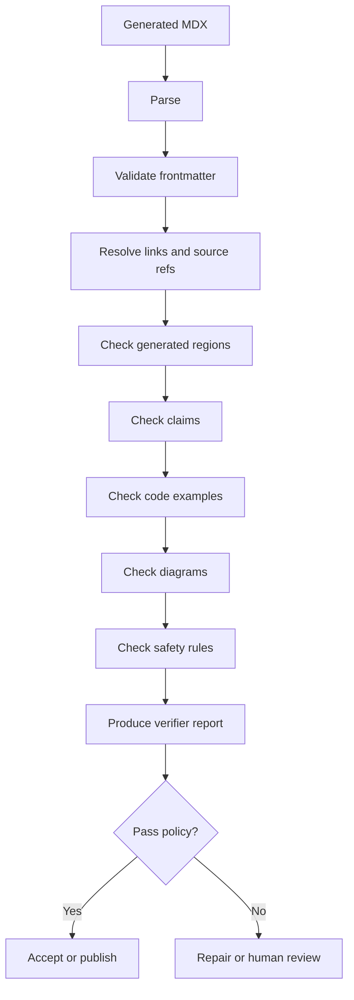
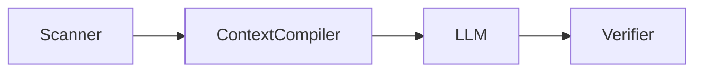
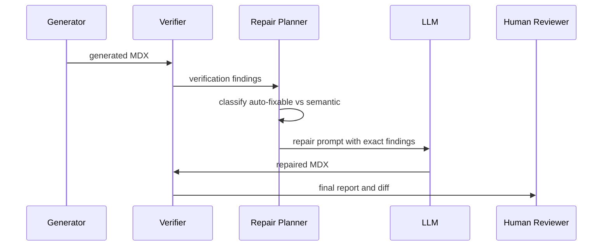

------
title: Build From Scratch: Mintlify-like AI-driven Documentation Generator CLI - Part 024
description: Build the core documentation verifier that checks generated MDX, links, source refs, claims, commands, frontmatter, examples, diagrams, and safety rules before docs are accepted.
series: learn-ai-docs-km-cli
seriesTitle: Build From Scratch: Mintlify-like AI-driven Documentation Generator CLI with Code2Prompt and Open-source Knowledge Management
order: 24
partTitle: Documentation Verifier Core
tags:
- ai-docs
- documentation
- verifier
- mdx
- linting
- hallucination
- provenance
- cli
date: 2026-07-04
---

# Part 024 — Documentation Verifier Core

Generation is not the end of the pipeline.

For an AI-driven documentation generator, generation is only a proposal. The verifier decides whether the proposal is safe enough to show, commit, publish, or sync into knowledge management.

This part designs the **documentation verifier core**.

The verifier checks:

- MDX syntax,
- frontmatter validity,
- navigation consistency,
- internal links,
- external links,
- code fences,
- examples,
- Mermaid diagrams,
- source references,
- claim grounding,
- command safety,
- generated/manual region boundaries,
- stale docs drift,
- knowledge graph consistency.

The main principle:

> AI output must not be trusted because it reads well. It must be accepted because it passes explicit checks.

---

## 1. Why Verification Is a First-class System

A documentation generator without verification creates a dangerous illusion.

The docs may look polished while containing:

- imaginary commands,
- wrong flags,
- invalid MDX,
- broken links,
- stale API examples,
- incorrect config names,
- invented architecture diagrams,
- examples that do not compile,
- missing source provenance,
- unsafe runbook instructions.

A human reviewer may not catch all of this. The generated output is often large, and polished prose can hide errors.

So the verifier must be a core engine, not a nice-to-have lint step.

---

## 2. Mental Model: Verification as Compilation

Think of generated docs as source code.

```txt
Generated MDX
  -> parse
  -> validate structure
  -> resolve references
  -> check claims
  -> check examples
  -> check safety
  -> produce report
```

The verifier is like a compiler plus static analyzer plus test runner.



The verifier should not only say “failed.” It should tell us:

- what failed,
- where it failed,
- why it matters,
- whether it can be repaired automatically,
- which source artifact is involved,
- whether it blocks publishing.

---

## 3. Verifier Artifact

Every verification run should produce a durable artifact.

Call it `verification-report.v1.json`.

```ts
export interface VerificationReport {
  schemaVersion: "verification-report.v1";
  runId: string;
  generatedAt: string;
  repo: RepoIdentity;
  target: VerificationTarget;
  policy: VerificationPolicySummary;
  summary: VerificationSummary;
  findings: VerificationFinding[];
  pageResults: PageVerificationResult[];
  artifactRefs: VerificationArtifactRefs;
}
```

Summary:

```ts
export interface VerificationSummary {
  status: "passed" | "failed" | "passed-with-warnings";
  pagesChecked: number;
  errors: number;
  warnings: number;
  infos: number;
  autoFixable: number;
  blockedByPolicy: boolean;
}
```

Finding:

```ts
export interface VerificationFinding {
  id: string;
  severity: "error" | "warning" | "info";
  code: string;
  message: string;
  path?: string;
  line?: number;
  column?: number;
  section?: string;
  sourceRefs?: SourceRef[];
  relatedArtifacts?: string[];
  autoFix?: AutoFixSuggestion;
  blocksPublish: boolean;
}
```

The report should be machine-readable and human-readable.

---

## 4. Verification Policy

Different environments need different strictness.

Local generation can be permissive. CI publishing should be strict.

```yaml
verify:
  mode: strict
  failOn:
    - invalid-mdx
    - invalid-frontmatter
    - broken-internal-link
    - unresolved-source-ref
    - unsupported-claim
    - unsafe-command
    - stale-api-reference
  warnOn:
    - broken-external-link
    - low-confidence-claim
    - missing-related-doc
    - missing-alt-text
  allowExternalLinkNetworkCheck: true
  requireSourceRefsForGeneratedSections: true
  requireExampleValidation: true
```

Profiles:

```ts
export type VerificationProfile =
  | "local-fast"
  | "local-strict"
  | "ci"
  | "publish"
  | "enterprise";
```

Suggested behavior:

| Profile | Purpose | Network checks | Example execution | Claim verification | Blocks publish |
|---|---|---:|---:|---:|---:|
| `local-fast` | fast feedback | No | Partial | Basic | No |
| `local-strict` | pre-commit confidence | Optional | Yes | Yes | No |
| `ci` | PR gate | Yes | Yes | Yes | Yes |
| `publish` | production docs | Yes | Yes | Strict | Yes |
| `enterprise` | regulated/internal control | Configured | Configured | Strict + audit | Yes |

---

## 5. Parsing MDX

The first check is basic: can the file be parsed?

MDX allows JSX inside Markdown. That is powerful, but it also means documentation can fail for reasons normal Markdown would not catch.

Checks:

- frontmatter delimiters,
- heading structure,
- JSX syntax,
- unclosed components,
- invalid expressions,
- malformed code fences,
- invalid imports if imports are allowed,
- unsupported components.

Example finding:

```json
{
  "severity": "error",
  "code": "INVALID_MDX",
  "message": "MDX parser failed near an unclosed <Note> component.",
  "path": "docs/guides/context-packing.mdx",
  "line": 42,
  "column": 1,
  "blocksPublish": true
}
```

The verifier should parse generated MDX using the same parser family as the renderer when possible. Otherwise, the CLI may accept files that the docs site later rejects.

---

## 6. Frontmatter Validation

Frontmatter is metadata contract.

For this series, every generated page uses:

```yaml
title: string
description: string
series: string
seriesTitle: string
order: number
partTitle: string
tags:
  - string
date: YYYY-MM-DD
```

For product docs, we may use:

```yaml
title: string
description: string
owner: string
sourceRefs:
  - string
generated: true
lastVerifiedAt: string
```

Validation rules:

1. Required fields exist.
2. Types are correct.
3. `title` is not empty.
4. `description` is not empty.
5. `order` is numeric where required.
6. Date is valid ISO date.
7. Tags are normalized.
8. Generated pages include provenance fields.
9. Human-owned pages are not overwritten.

Example finding:

```json
{
  "severity": "error",
  "code": "INVALID_FRONTMATTER_TYPE",
  "message": "Field `order` must be a number, got string.",
  "path": "docs/concepts/repository-map.mdx",
  "blocksPublish": true
}
```

---

## 7. Navigation Validation

Mintlify-like docs projects separate page content from navigation config.

For modern Mintlify projects, navigation is configured through `docs.json`. Our generated site model follows that separation.

The verifier checks:

- every page in `docs.json` exists,
- every generated page is reachable or intentionally hidden,
- groups are not empty,
- ordering is stable,
- duplicate page entries do not exist,
- API reference pages match OpenAPI sources,
- navigation titles match page titles unless overridden,
- moved pages have redirects if configured.

Example finding:

```json
{
  "severity": "error",
  "code": "NAV_PAGE_MISSING",
  "message": "Navigation references `guides/context-packing` but no matching MDX file exists.",
  "path": "docs.json",
  "blocksPublish": true
}
```

Navigation verification prevents generated docs from becoming unreachable pages.

---

## 8. Internal Link Validation

Internal links are deterministic.

Check:

- relative links,
- absolute docs links,
- anchor links,
- generated slug links,
- cross-page references,
- image references,
- downloadable artifact references,
- links to API reference pages.

Example:

```mdx
See [Context Packing](../concepts/context-packing.mdx).
```

Verifier resolves:

```txt
current file: docs/guides/generate-docs.mdx
link target: docs/concepts/context-packing.mdx
exists: yes/no
```

Anchor check:

```mdx
See [Token Budgeting](./context-packing#token-budgeting).
```

Verifier must compute generated heading IDs the same way renderer does.

---

## 9. External Link Validation

External links are trickier.

They can fail because:

- network unavailable,
- site blocks automated requests,
- redirect changed,
- page removed,
- TLS error,
- temporary outage.

So external link failures should often be warnings unless publish policy says otherwise.

Result model:

```ts
export interface ExternalLinkCheckResult {
  url: string;
  status: "ok" | "redirect" | "broken" | "timeout" | "skipped";
  statusCode?: number;
  finalUrl?: string;
  sourcePath: string;
  line: number;
}
```

Policy example:

```yaml
externalLinks:
  check: true
  timeoutMs: 5000
  failOnStatus:
    - 404
    - 410
  warnOnTimeout: true
  allowDomains:
    - docs.github.com
    - spec.openapis.org
    - mdxjs.com
```

---

## 10. Code Fence Validation

Code fences are often where docs lie.

Basic checks:

- code fence has language,
- shell blocks do not contain dangerous commands unless allowed,
- JSON/YAML parses,
- TypeScript snippets parse if configured,
- Java snippets compile if configured,
- HTTP examples match known API contracts,
- environment variables are documented,
- placeholders are explicit.

Example finding:

```json
{
  "severity": "error",
  "code": "INVALID_JSON_SNIPPET",
  "message": "JSON code fence is not valid JSON: trailing comma at line 5.",
  "path": "docs/api/create-page.mdx",
  "line": 88,
  "blocksPublish": true
}
```

For shell blocks, classify commands:

```ts
export interface ShellCommandCheck {
  command: string;
  knownCommand: boolean;
  mutatesState: boolean;
  destructive: boolean;
  requiresCredential: boolean;
  sourceRefs: SourceRef[];
}
```

---

## 11. Example Validation

Generated examples should be checked against their source.

For examples mined in Part 020, each example has an ID:

```json
{
  "exampleId": "example:http:create-doc-page:happy-path",
  "sourceRefs": ["test/api/create-page.test.ts:12-48"],
  "targetDocs": ["docs/api/create-page.mdx"]
}
```

The verifier checks:

1. The example ID exists.
2. The docs snippet matches or intentionally transforms the source example.
3. Transformations are allowed.
4. Required placeholders are redacted.
5. Contract response shape still matches OpenAPI/schema.
6. The example is not stale.

Example finding:

```json
{
  "severity": "error",
  "code": "EXAMPLE_NOT_BACKED_BY_SOURCE",
  "message": "The HTTP example does not map to any mined example or contract example.",
  "path": "docs/api/create-doc-page.mdx",
  "section": "Example request",
  "blocksPublish": true
}
```

---

## 12. Mermaid Diagram Validation

Mermaid diagrams are code.

Basic checks:

- valid Mermaid syntax,
- diagram type allowed,
- node count not excessive,
- generated architecture claims have source refs,
- no unsupported renderer features,
- no accidental secrets in labels.

Architecture diagrams need extra grounding checks.

Example generated diagram:



Verifier should check that `Scanner`, `ContextCompiler`, and `Verifier` are known components from `repo-map.v1`, `symbols.v1`, or architecture model.

If the diagram includes `Kubernetes Cluster` but no deployment evidence exists, it should fail or warn.

---

## 13. Source Reference Validation

Source refs are the backbone of source-grounded docs.

A source ref should resolve to a real artifact location.

```ts
export interface SourceRef {
  id: string;
  path: string;
  lineStart?: number;
  lineEnd?: number;
  hash?: string;
  artifact?: "scan" | "symbols" | "contracts" | "examples" | "ops";
}
```

Checks:

- path exists,
- line range valid,
- content hash matches if provided,
- artifact ID exists,
- referenced symbol/contract/example still exists,
- generated section source refs are non-empty where required.

Example finding:

```json
{
  "severity": "error",
  "code": "UNRESOLVED_SOURCE_REF",
  "message": "Source ref `src/context/packer.ts:120-145` no longer exists or line range is invalid.",
  "path": "docs/concepts/context-packing.mdx",
  "section": "Compression ladder",
  "blocksPublish": true
}
```

---

## 14. Claim Extraction

Claim verification starts by extracting claims from generated docs.

A claim is a statement that may be true or false relative to the repo.

Examples:

```txt
The CLI supports `aidocs scan --explain`.
The scanner respects `.gitignore`.
The docs project uses `docs.json` for navigation.
The system generates Logseq-compatible Markdown pages.
The verifier blocks unsafe runbook commands.
```

Not all prose needs verification.

Non-claim:

```txt
This part builds intuition for context packing.
```

Claim types:

```ts
export type ClaimType =
  | "command-exists"
  | "flag-exists"
  | "config-key-exists"
  | "file-exists"
  | "symbol-exists"
  | "api-endpoint-exists"
  | "schema-field-exists"
  | "behavior"
  | "architecture"
  | "dependency"
  | "operational-procedure"
  | "external-fact";
```

The verifier can use deterministic extractors first, then optionally use an LLM for claim extraction, not final truth.

---

## 15. Claim Grounding

Each generated section should carry provenance.

Example MDX with hidden metadata comment:

```mdx
{/* @generated-section id="context-compression" sourceRefs="src/context/packer.ts:30-92,src/config/schema.ts:44-51" */}

## Compression ladder

The context compiler can progressively compress low-authority context units before dropping them from the prompt bundle.
```

Verifier checks:

1. The section has source refs.
2. Claims in the section are compatible with source refs.
3. Unsupported claims are reported.

A strict verifier cannot fully prove every semantic statement. But it can catch many dangerous classes:

- command not found,
- flag not found,
- config key not found,
- endpoint not found,
- architecture node not found,
- source ref missing,
- external fact uncited,
- claim uses “always” or “guarantees” without evidence.

---

## 16. Confidence Model

Not all checks have binary certainty.

Use confidence:

```ts
export interface ClaimCheckResult {
  claim: string;
  claimType: ClaimType;
  status: "supported" | "unsupported" | "partially-supported" | "unknown";
  confidence: number;
  evidenceRefs: SourceRef[];
  explanation: string;
}
```

Policy:

```yaml
claims:
  requireSourceRefs: true
  failOnUnsupported: true
  warnOnUnknown: true
  minimumConfidenceForBehaviorClaims: 0.75
  failOnArchitectureClaimsWithoutEvidence: true
```

Important: low confidence should not be silently accepted.

---

## 17. Command Safety Verification

From Part 023, operational docs require command safety checks.

Check every shell command.

Classify:

- inspection command,
- local generation command,
- repository mutation,
- environment mutation,
- network operation,
- credential operation,
- deployment operation,
- destructive operation.

Example policy:

```yaml
commands:
  failOnUnknownMutatingCommand: true
  blockDestructiveWithoutWarning: true
  requireSourceForCommands: true
  allowedInspectionCommands:
    - aidocs scan
    - aidocs verify
    - aidocs context explain
```

Example finding:

```json
{
  "severity": "error",
  "code": "UNSAFE_COMMAND_WITHOUT_REVIEW_WARNING",
  "message": "Command `terraform destroy` appears in generated docs without a required human review warning.",
  "path": "docs/runbooks/reset-environment.mdx",
  "line": 73,
  "blocksPublish": true
}
```

---

## 18. Generated Region Verification

We must protect human edits.

Generated docs can use region markers:

```mdx
{/* @aidocs:start generated id="api-example" hash="abc123" */}

Generated content here.

{/* @aidocs:end */}
```

Verifier checks:

- markers are balanced,
- nested markers are valid or disallowed,
- generated region hash matches last generation if expected,
- human-owned region is not overwritten,
- regenerated content stays inside allowed regions.

Example finding:

```json
{
  "severity": "error",
  "code": "GENERATED_REGION_BOUNDARY_VIOLATION",
  "message": "Generated content modified text outside an allowed generated region.",
  "path": "docs/guides/quickstart.mdx",
  "blocksPublish": true
}
```

This makes AI generation compatible with human-maintained docs.

---

## 19. Drift Verification

Drift means docs no longer match source.

Drift types:

```ts
export type DriftType =
  | "source-ref-hash-changed"
  | "api-contract-changed"
  | "example-source-changed"
  | "command-surface-changed"
  | "config-schema-changed"
  | "navigation-changed"
  | "architecture-model-changed";
```

Example:

```json
{
  "severity": "error",
  "code": "API_REFERENCE_DRIFT",
  "message": "OpenAPI operation `POST /pages` changed after docs generation.",
  "path": "docs/api/create-page.mdx",
  "sourceRefs": [
    {
      "path": "openapi.yml",
      "lineStart": 102,
      "lineEnd": 184
    }
  ],
  "blocksPublish": true
}
```

Drift detection should compare generated page provenance against current artifacts.

---

## 20. Knowledge Graph Verification

If docs sync into Logseq/OpenNote-style knowledge stores, verify those artifacts too.

Checks:

- note IDs stable,
- backlinks valid,
- source refs preserved,
- generated notes do not overwrite human notes,
- tags are normalized,
- pages do not duplicate existing concepts,
- deleted source artifacts create tombstones or warnings,
- unsafe operational notes are marked.

Example finding:

```json
{
  "severity": "warning",
  "code": "KM_DUPLICATE_CONCEPT_NODE",
  "message": "Generated concept `Context Compiler` appears to duplicate existing note `Prompt Context Compiler`.",
  "blocksPublish": false
}
```

---

## 21. Verifier Architecture

Use a modular verifier.

```ts
export interface VerifierRule {
  id: string;
  description: string;
  category: VerificationCategory;
  severityDefault: "error" | "warning" | "info";
  run(input: VerificationInput): Promise<VerificationFinding[]>;
}
```

Categories:

```ts
export type VerificationCategory =
  | "syntax"
  | "frontmatter"
  | "navigation"
  | "links"
  | "examples"
  | "diagrams"
  | "source-refs"
  | "claims"
  | "commands"
  | "safety"
  | "drift"
  | "km";
```

Verifier input:

```ts
export interface VerificationInput {
  repoRoot: string;
  docsRoot: string;
  files: DocsFile[];
  navigation?: NavigationModel;
  scan?: ScanArtifact;
  symbols?: SymbolsArtifact;
  contracts?: ContractsArtifact;
  examples?: ExamplesArtifact;
  opsKnowledge?: OpsKnowledgeArtifact;
  pageSpecs?: PageSpecArtifact[];
  policy: VerificationPolicy;
}
```

This architecture lets us add rules without rewriting the verifier.

---

## 22. Rule Execution Model

Some rules are cheap. Some are expensive.

Cheap:

- frontmatter validation,
- link path resolution,
- marker balance,
- JSON/YAML parsing.

Medium:

- MDX parsing,
- Mermaid parsing,
- command classification,
- source ref resolution.

Expensive:

- external link checks,
- example execution,
- claim extraction,
- semantic claim verification.

Use phases:

```ts
export type VerificationPhase =
  | "parse"
  | "structure"
  | "reference"
  | "semantic"
  | "execution"
  | "network";
```

Run cheap blocking checks first. If MDX cannot parse, skip downstream semantic checks for that page.

---

## 23. Auto-fix Model

Some findings can be automatically repaired.

Auto-fix examples:

- add missing language to code fence if inferable,
- normalize tags,
- update navigation title,
- remove trailing spaces,
- fix heading level jump,
- replace stale generated region with regenerated content,
- escape unsupported MDX characters.

Do not auto-fix:

- unsupported claims,
- unsafe commands,
- ambiguous architecture,
- missing source evidence,
- destructive runbook steps,
- semantic API mismatch.

Auto-fix model:

```ts
export interface AutoFixSuggestion {
  kind: "replace-range" | "insert" | "delete" | "regenerate-section";
  confidence: number;
  description: string;
  patch?: TextPatch;
  requiresReview: boolean;
}
```

CLI:

```bash
aidocs verify --fix
```

Should only apply safe fixes.

```bash
aidocs verify --fix --require-review
```

Can produce a patch but not apply risky changes.

---

## 24. Human-readable Report

The JSON report is for machines. Humans need a concise summary.

Example:

```txt
Verification failed

Pages checked: 24
Errors:        3
Warnings:      7

Blocking errors:

1. INVALID_MDX
   docs/guides/context-packing.mdx:42
   Unclosed <Note> component.

2. UNSUPPORTED_CLAIM
   docs/concepts/repository-map.mdx:88
   Claim says scanner supports Bazel workspace detection, but no extractor or source ref supports this.

3. NAV_PAGE_MISSING
   docs.json
   Navigation references `api/create-page` but the file does not exist.

Next actions:

- Run `aidocs verify --fix` for safe formatting fixes.
- Regenerate `docs/concepts/repository-map.mdx` with stricter source refs.
- Rebuild navigation with `aidocs plan --navigation`.
```

The report should be direct and operational.

---

## 25. CI Output

In CI, output should be compact and actionable.

```bash
aidocs verify --ci --report .aidocs/reports/verify.json
```

Exit codes:

```ts
export enum VerifyExitCode {
  Passed = 0,
  Failed = 1,
  InvalidConfig = 2,
  InternalError = 3,
  NetworkCheckFailed = 4
}
```

CI should upload report artifacts.

Example GitHub Actions summary:

```md
## AI Docs Verification Failed

| Severity | Count |
|---|---:|
| Error | 3 |
| Warning | 7 |

Blocking files:

- `docs/guides/context-packing.mdx`
- `docs/concepts/repository-map.mdx`
- `docs.json`
```

---

## 26. Repair Loop

The verifier enables a repair loop.



Repair prompt should include exact findings, not vague “fix the docs.”

Example:

```txt
Repair only the `Cause matrix` section.

Verifier finding:
- code: UNSUPPORTED_COMMAND
- command: `aidocs refresh --all`
- reason: command does not exist in command index

Allowed commands:
- `aidocs scan`
- `aidocs plan`
- `aidocs generate`
- `aidocs verify`
```

---

## 27. Deterministic Checks vs LLM-assisted Checks

Use deterministic checks whenever possible.

Deterministic:

- file exists,
- link resolves,
- frontmatter schema valid,
- JSON/YAML parses,
- command exists in command index,
- OpenAPI operation exists,
- source ref resolves.

LLM-assisted:

- extracting natural language claims,
- checking whether prose overstates evidence,
- identifying vague troubleshooting steps,
- detecting invented architecture from prose.

But LLM-assisted checks should produce findings for review, not silently determine truth.

---

## 28. Testing the Verifier

Use golden fixtures.

Directory:

```txt
test/fixtures/verifier/
  valid-docs/
  invalid-mdx/
  broken-links/
  unsupported-claims/
  unsafe-commands/
  stale-api/
  generated-region-violation/
```

Each fixture has:

```txt
input docs
input artifacts
policy
expected findings
```

Example expected finding snapshot:

```json
[
  {
    "code": "BROKEN_INTERNAL_LINK",
    "severity": "error",
    "path": "docs/guides/install.mdx"
  }
]
```

Do not snapshot entire messages if they are too brittle. Snapshot codes, severity, path, and stable metadata.

---

## 29. Performance Design

Verification can become expensive.

Optimize with:

- file hashing,
- page-level cache,
- artifact-level cache,
- parallel rule execution,
- skip external links in local-fast mode,
- only re-check changed pages plus dependents,
- cache successful external link checks for a short TTL,
- reuse parsed ASTs.

Cache key:

```txt
verify:<rule-id>:<file-hash>:<policy-hash>:<artifact-hash>
```

But do not cache safety findings too aggressively if policy changes.

---

## 30. Security Considerations

The verifier itself handles untrusted content.

Risks:

- malicious MDX expressions,
- shell command injection in examples,
- path traversal in links,
- external link SSRF-style behavior,
- secrets inside docs,
- unsafe auto-fix patch,
- prompt injection hidden in source docs.

Mitigations:

- parse without executing arbitrary MDX code,
- never run shell examples by default,
- sandbox example execution,
- restrict external link checking,
- redact secrets before reports,
- block dangerous auto-fixes,
- treat source comments as data, not instructions.

---

## 31. Minimum Implementation Slice

Start with these rules:

1. `MDX_PARSE_VALID`
2. `FRONTMATTER_SCHEMA_VALID`
3. `INTERNAL_LINK_RESOLVES`
4. `NAVIGATION_PAGE_EXISTS`
5. `SOURCE_REF_RESOLVES`
6. `CODE_FENCE_LANGUAGE_PRESENT`
7. `JSON_YAML_SNIPPET_PARSEABLE`
8. `SHELL_COMMAND_SAFETY`
9. `GENERATED_REGION_BOUNDARY_VALID`
10. `EXAMPLE_ID_RESOLVES`

This gives high value before attempting semantic claim verification.

---

## 32. Example Rule Implementation

```ts
export class SourceRefResolvesRule implements VerifierRule {
  id = "source-ref-resolves";
  description = "Every generated source reference must resolve to a current source artifact.";
  category: VerificationCategory = "source-refs";
  severityDefault = "error" as const;

  async run(input: VerificationInput): Promise<VerificationFinding[]> {
    const findings: VerificationFinding[] = [];

    for (const file of input.files) {
      for (const ref of file.sourceRefs) {
        const resolved = await input.sourceResolver.resolve(ref);

        if (!resolved.ok) {
          findings.push({
            id: `finding:${file.path}:${ref.id}`,
            severity: "error",
            code: "UNRESOLVED_SOURCE_REF",
            message: `Source ref ${ref.id} could not be resolved.`,
            path: file.path,
            sourceRefs: [ref],
            blocksPublish: true
          });
        }
      }
    }

    return findings;
  }
}
```

The real implementation must also validate line range, hash, and artifact identity.

---

## 33. Verifier CLI

Commands:

```bash
aidocs verify
```

Default local verification.

```bash
aidocs verify --ci
```

Strict CI verification.

```bash
aidocs verify --profile publish
```

Publishing profile.

```bash
aidocs verify --page docs/guides/context-packing.mdx
```

Single-page verification.

```bash
aidocs verify --since main
```

Verify changed pages plus affected dependents.

```bash
aidocs verify --report .aidocs/reports/verify.json
```

Write machine-readable report.

```bash
aidocs verify --fix
```

Apply safe auto-fixes.

---

## 34. Design Invariants

Keep these invariants:

1. Generated docs are proposals until verified.
2. Verification must produce durable artifacts.
3. Blocking findings must prevent publishing.
4. Source refs must resolve.
5. Claims about code, commands, APIs, and config must be grounded.
6. Human-owned regions must not be overwritten.
7. Unsafe operational instructions must be blocked or require review.
8. Verification policy must be explicit.
9. CI verification must be deterministic enough to trust.
10. The verifier must explain failures in developer-actionable language.

---

## 35. References

- MDX Documentation: https://mdxjs.com/
- Mintlify Navigation Documentation: https://www.mintlify.com/docs/organize/navigation
- Mintlify OpenAPI Setup Documentation: https://www.mintlify.com/docs/api-playground/openapi-setup
- markdownlint: https://github.com/DavidAnson/markdownlint
- GitHub Docs, Markdown fenced code blocks: https://docs.github.com/en/get-started/writing-on-github/working-with-advanced-formatting/creating-and-highlighting-code-blocks
- Mermaid Documentation: https://mermaid.js.org/
- OpenAPI Specification: https://spec.openapis.org/oas/v3.2.0.html

---

## 36. What You Should Have Now

You should now have the verifier mental model:

```txt
generated docs
  -> syntax checks
  -> structure checks
  -> reference checks
  -> semantic/source checks
  -> safety checks
  -> report
  -> repair/review/publish decision
```

This is the turning point of the system.

Before this part, the generator could write plausible docs.

After this part, the platform starts becoming trustworthy.

In the next part, we go deeper into **source-grounded generation**: how to force generated claims to stay tied to repository evidence instead of model memory or generic assumptions.
