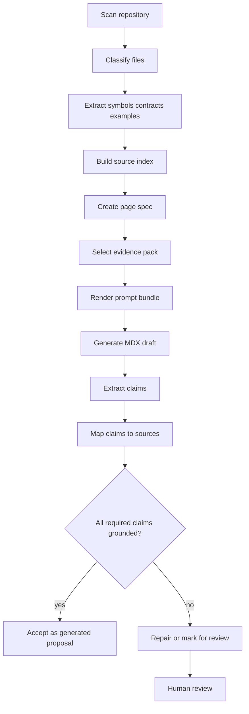
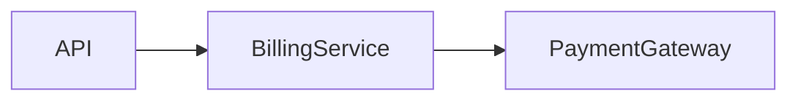
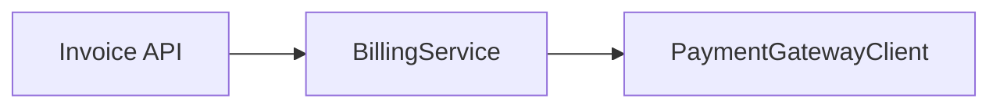
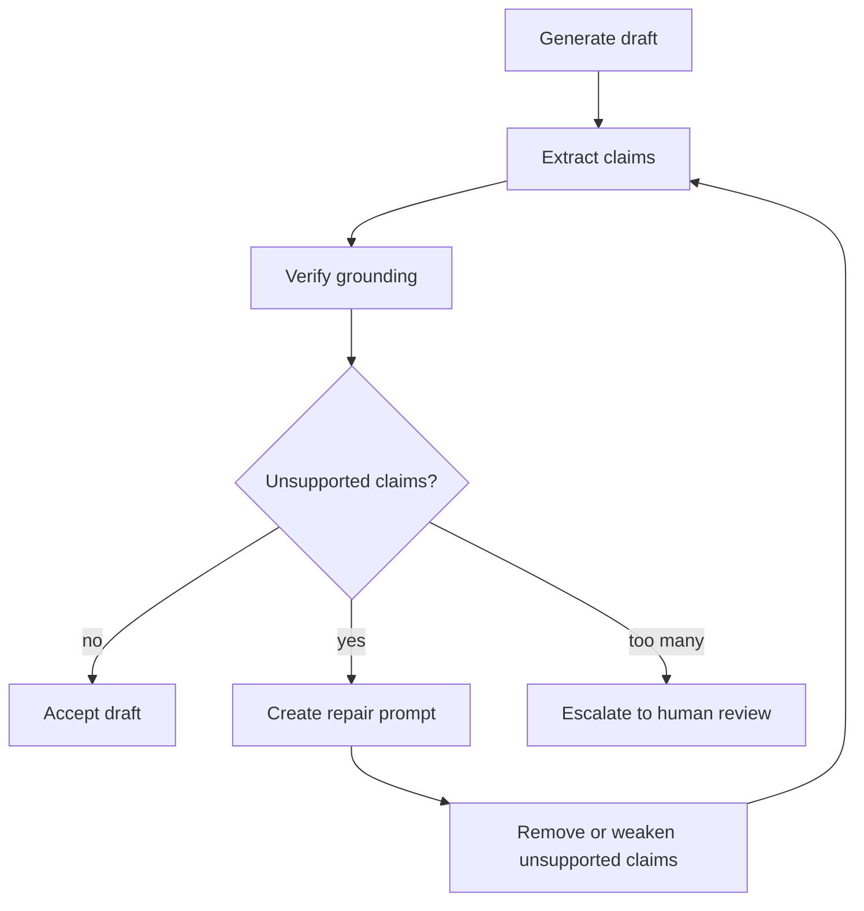

------
title: Build From Scratch: Mintlify-like AI-driven Documentation Generator CLI - Part 025
description: Design source-grounded generation so every generated documentation claim can be traced back to code, contracts, tests, configuration, or approved human notes.
series: learn-ai-docs-km-cli
seriesTitle: Build From Scratch: Mintlify-like AI-driven Documentation Generator CLI with Code2Prompt and Open-source Knowledge Management
order: 25
partTitle: Source-grounded Generation
tags:
- ai-docs
- documentation
- source-grounding
- hallucination
- provenance
- verification
- cli
- mdx
date: 2026-07-04
---

# Part 025 — Source-grounded Generation

In the previous part, we built the **documentation verifier core**.

Now we need to make generation itself safer.

The core rule of this part is simple:

> If the system cannot point to a source, the system should not present the statement as a fact.

That rule sounds obvious. In practice, most AI documentation tools violate it constantly.

They generate confident docs from incomplete context, invent missing behavior, smooth over contradictions, create fake examples, and produce architecture narratives that sound plausible but are not actually supported by the repository.

A Mintlify-like AI docs CLI must not behave like that.

It must behave more like a compiler:

1. collect source material,
2. build a grounded context,
3. ask for constrained output,
4. extract claims,
5. map claims to evidence,
6. reject unsupported claims,
7. preserve provenance in artifacts,
8. make uncertainty visible.

This part designs that pipeline.

We are not trying to make a perfect truth machine. We are building a system with explicit limits.

The goal is not:

> “The AI is always correct.”

The goal is:

> “The system can explain what each generated claim is based on, detect when evidence is missing, and force review before unsupported content enters the docs.”

That is a realistic production target.

---

## 1. Why source-grounding is non-negotiable

Developer documentation has a special property: most of its truth lives close to the repository.

A generated page may describe:

- exported functions,
- API endpoints,
- configuration keys,
- environment variables,
- CLI commands,
- database migrations,
- event schemas,
- authentication behavior,
- deployment topology,
- error responses,
- examples,
- operational procedures.

These facts are not stable essays. They are coupled to code.

When code changes, docs can become wrong.

When generated docs are wrong, the damage is practical:

- users call nonexistent endpoints,
- developers copy invalid examples,
- operators run obsolete commands,
- customers misunderstand behavior,
- support teams debug using stale assumptions,
- AI agents retrieve bad documentation and amplify the error.

This is why generated docs need source-grounding.

Source-grounding means:

> The generator may only produce factual claims that are either directly supported by repository evidence, supported by approved human-authored notes, or explicitly marked as assumption / unknown / recommendation.

This is not only an LLM prompt trick. It is a system design constraint.

---

## 2. Mental model: documentation as claims over evidence

A documentation page is not just prose.

It is a collection of claims.

Example:

```mdx
The `/v1/invoices` endpoint creates an invoice and returns `201 Created` with the created invoice object.
```

This sentence contains several claims:

1. there is an endpoint `/v1/invoices`,
2. it creates an invoice,
3. successful creation returns status `201`,
4. the response contains an invoice object.

Each claim may have different evidence:

| Claim | Possible evidence |
|---|---|
| Endpoint exists | OpenAPI path, router definition, controller annotation |
| It creates invoice | handler name, OpenAPI operation summary, test behavior |
| Returns 201 | OpenAPI response, integration test assertion |
| Response object shape | schema definition, test fixture, serializer |

The system should reason at this level.

A page is therefore:

```txt
Page = sections + claims + examples + links + source references + verification report
```

The generator writes prose.

The verifier extracts claims.

The provenance layer maps claims to evidence.

The review layer shows unsupported claims to humans.

---

## 3. Grounding levels

Not all claims are grounded equally.

We need a vocabulary.

### Level 0 — Unsupported

The claim has no known source.

Example:

```txt
This SDK is highly scalable and battle-tested in production.
```

Unless this exists in approved marketing copy, benchmark notes, or production evidence, it is unsupported.

Default action: reject or mark as human-authored recommendation.

### Level 1 — Weakly inferred

The claim is inferred from names, directory structure, or conventions.

Example:

```txt
The `billing` module likely handles payment and invoice workflows.
```

Evidence:

- directory name `src/billing`,
- classes named `InvoiceService`, `PaymentGatewayClient`.

Default action: allowed only if phrased as an inference or converted into a more precise source-backed statement.

### Level 2 — Source-backed

The claim is directly supported by source files.

Example:

```txt
The CLI exposes a `scan` command.
```

Evidence:

- command registry includes `scan`,
- tests invoke `aidocs scan`.

Default action: allowed.

### Level 3 — Contract-backed

The claim is supported by formal contract or schema.

Example:

```txt
`GET /users/{id}` returns a `User` response on status `200`.
```

Evidence:

- OpenAPI spec,
- GraphQL schema,
- JSON Schema,
- Protobuf definition.

Default action: allowed, but still check implementation drift when possible.

### Level 4 — Behavior-backed

The claim is supported by executable test, fixture, or verified example.

Example:

```txt
When the token is missing, the API returns `401 Unauthorized`.
```

Evidence:

- integration test assertion,
- contract test,
- executable example.

Default action: strongest evidence for behavior.

### Level 5 — Human-approved

The claim was approved by an owner.

Example:

```txt
This feature is intended for enterprise audit workflows.
```

Evidence:

- architecture decision record,
- owner-approved note,
- manually reviewed docs block.

Default action: allowed, but must preserve ownership/provenance.

---

## 4. Source authority model

A source-grounded generator needs to know which sources are more authoritative.

For example, if the OpenAPI file says one thing but tests say another, which one wins?

There is no universal answer. The CLI must define a source authority model.

A practical default:

| Source type | Authority for |
|---|---|
| OpenAPI / GraphQL / Protobuf / JSON Schema | public contract shape |
| Tests | observed behavior and examples |
| Source code | implementation details, commands, symbols |
| Config files | configuration names, defaults, deployment hints |
| Migrations | database schema evolution |
| Existing docs | intent, explanation, terminology |
| ADRs / human notes | design rationale, ownership, constraints |
| README | entry-level project usage and conventions |

The point is not to declare one source always superior.

The point is to classify claims by topic.

Example:

- For HTTP response schema, OpenAPI is usually authoritative.
- For actual observed behavior, integration tests may be stronger.
- For design rationale, ADRs are stronger than code names.
- For command syntax, CLI parser and command tests are stronger than README prose.

This belongs in configuration:

```yaml
sourceAuthority:
  api_contract:
    - openapi
    - source_route
    - integration_test
    - existing_docs
  behavior:
    - integration_test
    - unit_test
    - source_code
    - existing_docs
  rationale:
    - adr
    - human_note
    - existing_docs
    - source_code
```

The generator should not hide conflicts. It should surface them.

---

## 5. Grounded generation pipeline

Here is the pipeline we want.



Notice the key design choice:

> Source-grounding happens before and after generation.

Before generation, the prompt only contains selected evidence.

After generation, claims are checked against source references.

This dual strategy matters because LLMs can still ignore or misread context.

---

## 6. Evidence pack

The evidence pack is the subset of context provided for a specific page.

It is narrower than the full prompt bundle.

A prompt bundle may include task instructions, output schema, style rules, and context units.

An evidence pack is the factual base for claims.

Example:

```json
{
  "schemaVersion": "evidence-pack.v1",
  "pageId": "api.invoices.create",
  "topic": "Create invoice API endpoint",
  "sources": [
    {
      "sourceRef": "src:openapi.yaml#paths./v1/invoices.post",
      "type": "openapi_operation",
      "authority": "contract",
      "supports": ["endpoint", "method", "request_schema", "response_schema"]
    },
    {
      "sourceRef": "src:tests/invoices/create-invoice.test.ts#L12-L58",
      "type": "integration_test",
      "authority": "behavior",
      "supports": ["happy_path", "status_201", "example_request"]
    },
    {
      "sourceRef": "src:src/routes/invoices.ts#L20-L43",
      "type": "source_code",
      "authority": "implementation",
      "supports": ["handler", "route_binding"]
    }
  ],
  "knownFacts": [
    {
      "factId": "fact.endpoint.create_invoice",
      "text": "POST /v1/invoices exists in the OpenAPI contract.",
      "sourceRefs": ["src:openapi.yaml#paths./v1/invoices.post"],
      "groundingLevel": 3
    },
    {
      "factId": "fact.create_invoice.returns_201",
      "text": "The integration test expects a 201 response when an invoice is created successfully.",
      "sourceRefs": ["src:tests/invoices/create-invoice.test.ts#L31-L35"],
      "groundingLevel": 4
    }
  ],
  "unknowns": [
    "No source describes rate limiting for this endpoint.",
    "No test covers idempotency behavior."
  ],
  "forbiddenClaims": [
    "Do not claim rate limits exist.",
    "Do not claim idempotency support unless a source is added."
  ]
}
```

The evidence pack has two jobs:

1. give the model the facts it may use,
2. give the verifier a checklist of what output is allowed to claim.

---

## 7. Claim ledger

The claim ledger is the post-generation artifact.

It records every extracted factual claim and its support.

Example:

```json
{
  "schemaVersion": "claim-ledger.v1",
  "pageId": "api.invoices.create",
  "generatedFile": "docs/api/invoices/create.mdx",
  "claims": [
    {
      "claimId": "claim.001",
      "text": "Use POST /v1/invoices to create an invoice.",
      "claimType": "api_operation",
      "groundingStatus": "supported",
      "groundingLevel": 3,
      "sourceRefs": ["src:openapi.yaml#paths./v1/invoices.post"],
      "confidence": 0.96
    },
    {
      "claimId": "claim.002",
      "text": "The endpoint is idempotent when an Idempotency-Key header is supplied.",
      "claimType": "behavior",
      "groundingStatus": "unsupported",
      "groundingLevel": 0,
      "sourceRefs": [],
      "confidence": 0.18,
      "action": "remove_or_request_source"
    }
  ]
}
```

The claim ledger becomes useful for:

- review UI,
- CI reports,
- drift detection,
- auditability,
- incremental regeneration,
- human approval,
- knowledge graph sync.

This is the artifact that turns “AI wrote it” into “AI proposed it and the system checked it.”

---

## 8. Claim types

A claim extractor should classify claims.

Useful claim types:

```ts
export type ClaimType =
  | 'api_operation'
  | 'api_schema'
  | 'http_status'
  | 'auth_requirement'
  | 'config_key'
  | 'cli_command'
  | 'code_symbol'
  | 'module_responsibility'
  | 'architecture_relation'
  | 'runtime_behavior'
  | 'error_condition'
  | 'database_schema'
  | 'event_contract'
  | 'example_behavior'
  | 'installation_step'
  | 'version_requirement'
  | 'performance_claim'
  | 'security_claim'
  | 'recommendation'
  | 'rationale'
  | 'unknown_statement';
```

Different claim types require different evidence.

| Claim type | Minimum acceptable grounding |
|---|---|
| API operation | OpenAPI, router source, contract test |
| HTTP status | OpenAPI response or integration test |
| Config key | config schema, env parser, config docs |
| CLI command | command registry or command parser test |
| Architecture relation | import graph, deployment config, ADR, owner note |
| Runtime behavior | integration test, source path, runbook evidence |
| Performance claim | benchmark or production metric note |
| Security claim | auth code, policy config, security docs, tests |
| Recommendation | must be labeled as recommendation |

The stricter the claim, the stronger the evidence should be.

Security and performance claims should never be casually generated.

---

## 9. Source references

A source reference should be stable, precise, and readable.

Bad source reference:

```txt
invoice code
```

Better:

```txt
src:src/routes/invoices.ts#L20-L43
```

Better when available:

```txt
symbol:typescript:src/routes/invoices.ts#createInvoiceHandler
```

Best when tied to artifact hash:

```json
{
  "ref": "symbol:typescript:src/routes/invoices.ts#createInvoiceHandler",
  "fileHash": "sha256:9a2c...",
  "lineRange": [20, 43],
  "commit": "abc1234"
}
```

A production-grade reference should support:

- file path,
- line range,
- symbol ID,
- source artifact hash,
- optional commit SHA,
- optional contract JSON pointer,
- optional test case ID.

For OpenAPI:

```txt
src:openapi.yaml#/paths/~1v1~1invoices/post/responses/201
```

For JSON Schema:

```txt
src:schemas/invoice.schema.json#/$defs/Invoice/properties/status
```

For GraphQL:

```txt
graphql:schema.graphql#type.Query.field.invoice
```

For Logseq/OpenNote human notes:

```txt
note:logseq/pages/Billing Architecture.md#block-64f2
```

The reference format matters because doc drift detection will later depend on it.

---

## 10. Generated prose should expose provenance selectively

Do not pollute every public docs paragraph with internal source references.

Public docs should be readable.

But the artifact should preserve provenance.

Recommended pattern:

```mdx
<!-- aidocs:section id="create-invoice" sources="src:openapi.yaml#/paths/~1v1~1invoices/post,src:tests/invoices/create.test.ts#L12-L58" -->

## Create an invoice

Use `POST /v1/invoices` to create an invoice.

```bash
curl -X POST https://api.example.com/v1/invoices \
  -H 'Authorization: Bearer <token>' \
  -H 'Content-Type: application/json' \
  -d '{"customerId":"cus_123","amount":25000}'
```

<!-- /aidocs:section -->
```

This gives you both:

- clean docs for users,
- source mapping for tools.

For internal docs, you may also render visible source notes:

```mdx
> Source: `openapi.yaml`, `tests/invoices/create.test.ts`
```

For external public docs, hidden metadata is usually better.

---

## 11. Prompt design for source-grounded generation

The prompt must not say:

```txt
Write documentation for this code.
```

That is too open.

It should say something closer to:

```txt
You are generating documentation from a bounded evidence pack.
Use only the facts in the evidence pack.
Do not infer unsupported behavior.
When evidence is missing, write an "Unknowns" note in the generation report, not in the public page.
Every factual section must map to at least one sourceRef.
Do not create examples unless they are derived from supplied examples or contracts.
Return MDX plus a claim ledger.
```

The important instruction is not tone.

The important instruction is the output contract.

Example output contract:

```json
{
  "mdx": "string",
  "claimLedger": [
    {
      "claimText": "string",
      "claimType": "api_operation | config_key | runtime_behavior | ...",
      "sourceRefs": ["string"],
      "groundingLevel": 0,
      "uncertainty": "string | null"
    }
  ],
  "unknowns": ["string"],
  "removedClaims": ["string"],
  "questionsForReviewer": ["string"]
}
```

This forces the model to participate in auditability.

The verifier must still check the output independently.

---

## 12. The “unknowns” channel

A source-grounded system needs a place for missing knowledge.

Otherwise the model fills gaps.

The unknowns channel is separate from the generated page.

Example:

```json
{
  "unknowns": [
    {
      "topic": "rate_limiting",
      "reason": "No rate limit config, OpenAPI extension, or docs source was found.",
      "suggestedAction": "Ask API owner or add source note."
    },
    {
      "topic": "idempotency",
      "reason": "Request header parser supports Idempotency-Key but no test or docs confirm semantics.",
      "suggestedAction": "Add integration test or ADR."
    }
  ]
}
```

Unknowns are not failures by themselves.

Unknowns are healthy.

A system that admits unknowns is safer than a system that invents answers.

---

## 13. Handling contradictions

Contradictions are normal in real repositories.

Example:

- OpenAPI says `401`,
- integration test expects `403`,
- README says “unauthorized requests fail”.

The generator must not silently choose one.

It should emit a conflict report:

```json
{
  "conflicts": [
    {
      "conflictId": "conflict.auth.invoice.create.status",
      "claimTopic": "missing token response status",
      "sources": [
        {
          "sourceRef": "src:openapi.yaml#/paths/~1v1~1invoices/post/responses/401",
          "value": "401"
        },
        {
          "sourceRef": "src:tests/auth/invoice-auth.test.ts#L44-L49",
          "value": "403"
        }
      ],
      "severity": "major",
      "recommendedAction": "Do not generate exact status claim until owner resolves contract drift."
    }
  ]
}
```

The page can still be generated with a weaker statement:

```mdx
Requests without valid authorization fail.
```

But exact status code should not be claimed until resolved.

---

## 14. Grounding policy by documentation type

Different page types need different strictness.

### API reference

Strict.

Allowed claims should come from:

- OpenAPI / GraphQL / Protobuf,
- route source,
- schema files,
- integration tests,
- approved human notes.

Do not generate behavior that is not in contract or tests.

### Tutorial

Moderately strict.

Tutorials may include narrative, but commands and examples must be verified.

Allowed sources:

- real examples,
- integration tests,
- quickstart scripts,
- README,
- package metadata.

### How-to guide

Strict for steps and commands.

Every command should be linked to:

- CLI command registry,
- package scripts,
- Docker Compose service,
- Makefile target,
- verified shell example.

### Architecture explanation

Careful.

Architecture docs often require synthesis.

Generated claims must distinguish:

- observed structure,
- inferred responsibility,
- owner-approved rationale,
- recommended interpretation.

### Troubleshooting / runbook

Very strict.

Commands must be safe, scoped, and sourced.

Do not invent operational remediation steps.

### Concept page

Moderately strict.

Conceptual writing may explain relationships, but repository-specific facts still need sources.

---

## 15. Source-grounded Mermaid diagrams

Diagrams are claims too.

A diagram edge like this:



contains at least two claims:

1. API depends on BillingService,
2. BillingService depends on PaymentGateway.

Each edge needs evidence.

Better diagram metadata:

```mdx
<!-- aidocs:diagram id="billing-flow" sources="symbol:api#InvoiceController,symbol:billing#BillingService,symbol:payments#PaymentGatewayClient" -->



<!-- /aidocs:diagram -->
```

The verifier should parse diagram nodes/edges and compare them against relation graph evidence.

Diagrams should not become fiction with arrows.

---

## 16. Source-grounded examples

Examples are dangerous because they are copied.

Rules:

1. Prefer examples mined from tests.
2. Prefer examples derived from formal contracts.
3. Never invent auth tokens, IDs, hostnames, or config names without placeholders.
4. Mark placeholders clearly.
5. Validate code fences where possible.
6. Link examples to source evidence.

Example metadata:

```mdx
<!-- aidocs:example id="create-invoice-curl" source="example:http:tests/invoices/create.test.ts#createInvoiceHappyPath" verified="true" -->

```bash
curl -X POST "$API_BASE_URL/v1/invoices" \
  -H "Authorization: Bearer $API_TOKEN" \
  -H "Content-Type: application/json" \
  -d '{"customerId":"cus_123","amount":25000}'
```

<!-- /aidocs:example -->
```

The example is allowed because it came from a test episode or contract.

---

## 17. Grounding and human-authored sections

Not every section should be AI-owned.

A production docs system must preserve human-authored knowledge.

Example:

```mdx
<!-- aidocs:manual id="product-positioning" owner="docs-team" -->

## When to use this product

Use this product when your team needs auditable invoice workflows across multiple approval stages.

<!-- /aidocs:manual -->
```

Manual sections can contain business context that code cannot prove.

But they should still have ownership.

Recommended metadata:

```yaml
manualSections:
  - id: product-positioning
    owner: docs-team
    lastReviewed: 2026-07-01
    reviewCadence: quarterly
```

This keeps human knowledge accountable.

---

## 18. Confidence score is not enough

Do not rely on model confidence.

Confidence is useful only when combined with evidence.

Bad:

```json
{
  "claim": "This endpoint is idempotent.",
  "confidence": 0.91
}
```

Good:

```json
{
  "claim": "This endpoint is idempotent.",
  "groundingStatus": "unsupported",
  "confidence": 0.91,
  "action": "reject",
  "reason": "High model confidence without evidence is not acceptable."
}
```

The invariant:

> Evidence beats confidence.

---

## 19. Implementation model

A minimal implementation can use these modules:

```txt
src/
  grounding/
    EvidencePackBuilder.ts
    ClaimExtractor.ts
    ClaimMatcher.ts
    ConflictDetector.ts
    GroundingPolicy.ts
    ClaimLedgerWriter.ts
  generation/
    GroundedPageGenerator.ts
  verifier/
    SourceGroundingVerifier.ts
```

### EvidencePackBuilder

Input:

- page spec,
- repo map,
- symbols,
- contracts,
- examples,
- existing docs,
- human notes.

Output:

- `evidence-pack.v1.json`.

### ClaimExtractor

Input:

- generated MDX.

Output:

- candidate claims.

Can be implemented in phases:

1. rule-based extraction for code spans, endpoints, config names,
2. LLM structured extraction for prose claims,
3. hybrid extraction with verifier checks.

### ClaimMatcher

Input:

- candidate claims,
- evidence pack,
- source index.

Output:

- claim ledger.

### ConflictDetector

Input:

- competing evidence values.

Output:

- conflict report.

### SourceGroundingVerifier

Input:

- generated MDX,
- claim ledger,
- page spec,
- evidence pack.

Output:

- pass/fail report.

---

## 20. Claim extraction strategy

You do not need perfect NLP on day one.

Start with high-signal patterns.

### Pattern 1 — API endpoints

Regex:

```txt
\b(GET|POST|PUT|PATCH|DELETE)\s+(/[^\s`]+)
```

Candidate claim:

```json
{
  "claimType": "api_operation",
  "method": "POST",
  "path": "/v1/invoices"
}
```

### Pattern 2 — HTTP status codes

Regex:

```txt
\b(200|201|204|400|401|403|404|409|422|429|500)\b
```

Then inspect nearby sentence.

### Pattern 3 — Config keys

Patterns:

```txt
`[A-Z][A-Z0-9_]+`
`[a-z][a-zA-Z0-9_.-]+`
```

Then match against config schema, env parser, or docs config.

### Pattern 4 — CLI commands

Patterns:

```txt
```bash
<command>
```
```

Then parse command name and subcommand.

### Pattern 5 — Architecture edges

Extract Mermaid edges:

```txt
A --> B
A -.-> B
A -- label --> B
```

Then match nodes/edges against relation graph.

### Pattern 6 — Strong adjectives

Flag unsupported marketing-like claims:

```txt
scalable
secure
production-ready
enterprise-grade
high-performance
battle-tested
fault-tolerant
zero-downtime
```

These are not always false, but they require strong evidence.

---

## 21. Matching claims to sources

Matching can be exact or semantic.

### Exact matching

Good for:

- endpoint method/path,
- config key,
- CLI command,
- schema field,
- status code,
- file path,
- symbol name.

### Structural matching

Good for:

- method + path + status,
- function + exported module,
- config key + default value,
- migration table + column.

### Semantic matching

Good for:

- module responsibility,
- architecture explanation,
- design rationale,
- troubleshooting cause.

Use semantic matching carefully.

For high-risk claims, semantic similarity is not enough.

Example:

```txt
Claim: The service retries payment gateway calls.
```

A semantic match to a file named `PaymentGatewayClient` is not enough.

You need evidence like:

- retry policy config,
- retry library usage,
- test asserting retry,
- runbook describing retry behavior.

---

## 22. Grounding policy as code

Do not hardcode all rules in prose.

Represent grounding policy as data.

```yaml
groundingPolicy:
  default:
    unsupported: fail
    weaklyInferred: warn
  claimTypes:
    api_operation:
      minLevel: contract_backed
      allowedSources:
        - openapi
        - route_source
        - contract_test
    http_status:
      minLevel: contract_backed
      allowedSources:
        - openapi_response
        - integration_test
    runtime_behavior:
      minLevel: behavior_backed
      allowedSources:
        - integration_test
        - source_code
        - runbook
    performance_claim:
      minLevel: human_approved
      allowedSources:
        - benchmark
        - production_metric_note
        - approved_docs
    security_claim:
      minLevel: source_backed
      allowedSources:
        - auth_source
        - security_config
        - security_test
        - approved_security_note
```

This enables:

- stricter enterprise profiles,
- OSS-friendly defaults,
- project-specific exceptions,
- CI enforcement.

---

## 23. Generated MDX block metadata

Every generated block should carry machine-readable metadata.

Example:

```mdx
<!-- aidocs:block
id="auth-requirements"
type="generated"
sourceRefs="src:openapi.yaml#/components/securitySchemes/BearerAuth,src:src/middleware/auth.ts#L10-L48"
grounding="contract_backed"
lastGenerated="2026-07-04T00:00:00Z"
-->

## Authentication

Requests require a bearer token using the `Authorization` header.

<!-- /aidocs:block -->
```

Why block metadata matters:

- drift detector knows what source a paragraph depends on,
- human editor can preserve manual blocks,
- verifier can target only changed sections,
- review UI can show evidence per section,
- regeneration can be surgical.

---

## 24. Source-grounded generation with repair loop

Generation will fail sometimes.

Repair loop:



Repair prompt should not ask the model to “try harder”.

It should provide concrete violations:

```txt
The previous draft contains unsupported claims:

1. "The endpoint is idempotent." No sourceRef supports idempotency.
2. "The API retries failed payments." No retry evidence found.

Revise the MDX by removing unsupported claims or rewriting them as unknowns in the generation report.
Do not add new factual claims.
```

The system should limit repair attempts.

After two failed repairs, escalate.

---

## 25. Grounding report

The generated report should be easy to inspect.

Example CLI output:

```txt
$ aidocs generate docs/api/invoices/create.mdx --grounded

Generated: docs/api/invoices/create.mdx
Grounding: failed

Claims:
  supported:    18
  weak:          3
  unsupported:  2
  conflicts:    1

Unsupported:
  - "The endpoint is idempotent when Idempotency-Key is supplied."
    reason: no source found
    action: remove or add source

Conflict:
  - Missing auth status: OpenAPI says 401, test says 403
    action: avoid exact status claim

Next:
  aidocs review docs/api/invoices/create.mdx
  aidocs repair docs/api/invoices/create.mdx
```

The report should be blunt.

Do not hide unsupported content behind green checkmarks.

---

## 26. Knowledge graph integration

Source-grounded generation should feed the knowledge graph.

Example concept node:

```json
{
  "nodeId": "api.POST./v1/invoices",
  "type": "ApiOperation",
  "label": "Create invoice",
  "sourceRefs": ["src:openapi.yaml#/paths/~1v1~1invoices/post"],
  "documentedBy": ["docs/api/invoices/create.mdx#create-invoice"],
  "claims": ["claim.001", "claim.003"],
  "confidence": 0.96
}
```

This enables:

- backlink from Logseq note to docs page,
- OpenNote semantic search result with provenance,
- “what docs depend on this endpoint?” queries,
- drift analysis.

Generated knowledge should not be a disconnected note dump.

It should be linked to claims and sources.

---

## 27. CLI commands

Recommended commands:

```bash
aidocs evidence build docs/api/invoices/create.mdx
```

Build the evidence pack for a target page.

```bash
aidocs claims extract docs/api/invoices/create.mdx
```

Extract claims from an MDX file.

```bash
aidocs claims verify docs/api/invoices/create.mdx
```

Map claims to sources and emit a claim ledger.

```bash
aidocs generate docs/api/invoices/create.mdx --grounded
```

Generate with evidence pack and grounding policy.

```bash
aidocs review --unsupported
```

Show unsupported claims across generated docs.

```bash
aidocs explain-claim claim.001
```

Explain why a claim passed or failed.

---

## 28. Testing source-grounded generation

Test the system with fixtures.

### Fixture 1 — supported endpoint

Input:

- OpenAPI endpoint exists,
- test confirms status,
- generated page claims endpoint/status.

Expected:

- claim supported.

### Fixture 2 — hallucinated endpoint

Input:

- generated page mentions nonexistent endpoint.

Expected:

- claim unsupported.

### Fixture 3 — status conflict

Input:

- OpenAPI says `401`,
- test says `403`.

Expected:

- conflict detected.

### Fixture 4 — fake architecture edge

Input:

- Mermaid diagram says `API --> Redis`,
- no dependency or config evidence.

Expected:

- edge unsupported.

### Fixture 5 — manual section

Input:

- human-owned paragraph has owner metadata.

Expected:

- not overwritten,
- review date checked.

### Fixture 6 — unsupported performance claim

Input:

- generated page says “high-performance”.

Expected:

- rejected unless benchmark evidence exists.

---

## 29. Failure modes

### Failure mode: evidence overload

Too much source context makes the model less reliable.

Fix:

- evidence pack must be page-specific,
- context packing must rank and compress.

### Failure mode: source laundering

The model cites a source that does not actually support the claim.

Fix:

- verifier checks citation-content alignment.

### Failure mode: weak inference presented as fact

The model infers module purpose from names and writes it as certain.

Fix:

- weakly inferred claims must be phrased cautiously or reviewed.

### Failure mode: stale human notes

Approved notes can become stale.

Fix:

- review cadence,
- source dependency,
- drift detection.

### Failure mode: exactness where only generality is supported

Evidence supports “auth fails”, but not “auth fails with 401”.

Fix:

- claim granularity matching.

### Failure mode: diagram hallucination

Architecture diagram contains invented edges.

Fix:

- parse diagrams as claims.

---

## 30. Design invariant checklist

Before accepting generated docs, check:

- Does every factual generated block have source references?
- Does every API claim map to contract/source/test evidence?
- Does every example map to a real test, fixture, or contract?
- Are unsupported claims removed or marked for review?
- Are conflicts reported instead of hidden?
- Are human-owned sections preserved?
- Are risky claims like security/performance treated strictly?
- Does the claim ledger exist?
- Can a reviewer inspect why a claim passed?
- Can drift detection later find dependent pages?

If yes, the system is becoming trustworthy.

---

## 31. References

- Code2Prompt repository: https://github.com/mufeedvh/code2prompt
- OpenAI, “Why language models hallucinate”: https://openai.com/index/why-language-models-hallucinate/
- Diátaxis documentation framework: https://diataxis.fr/
- OpenAPI Specification: https://spec.openapis.org/oas/latest.html
- Mermaid documentation: https://mermaid.js.org/
- Google SRE Workbook, on-call/playbooks: https://sre.google/workbook/on-call/

---

## 32. What we have now

We now have a source-grounding layer.

The system can:

- build an evidence pack,
- constrain generation to evidence,
- extract claims from MDX,
- map claims to source references,
- detect unsupported claims,
- report conflicts,
- preserve provenance,
- feed the knowledge graph.

The next part builds on this directly.

If every generated claim has source references, then every generated claim can also become stale when its sources change.

That brings us to **documentation drift detection**.
