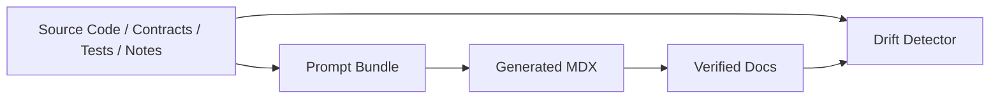
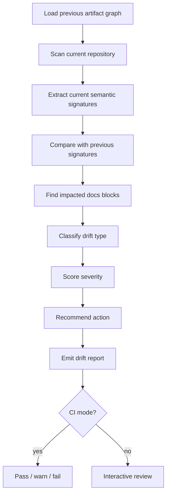
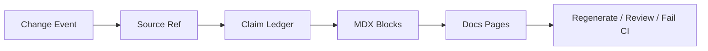
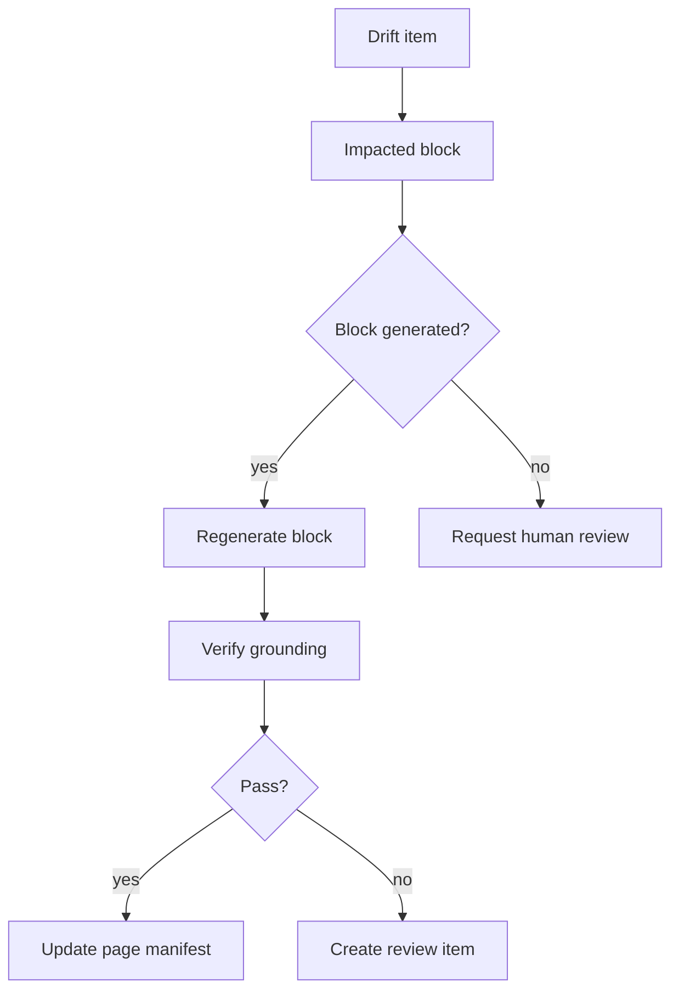

------
title: Build From Scratch: Mintlify-like AI-driven Documentation Generator CLI - Part 026
description: Build documentation drift detection for generated docs, examples, API references, architecture pages, runbooks, and knowledge graph notes as source code evolves.
series: learn-ai-docs-km-cli
seriesTitle: Build From Scratch: Mintlify-like AI-driven Documentation Generator CLI with Code2Prompt and Open-source Knowledge Management
order: 26
partTitle: Doc Drift Detection
tags:
- ai-docs
- documentation
- drift-detection
- ci
- provenance
- verification
- knowledge-graph
- cli
date: 2026-07-04
---

# Part 026 — Doc Drift Detection

In the previous part, we made generated documentation source-grounded.

Every factual claim now has evidence.

That creates the next problem:

> If the evidence changes, the claim may become stale.

This is documentation drift.

Documentation drift is not only “README is old”.

In an AI-driven docs system, drift can happen across:

- API references,
- examples,
- diagrams,
- troubleshooting docs,
- configuration pages,
- generated knowledge notes,
- prompt bundles,
- AI context files,
- internal architecture explanations.

If we ignore drift, we build a system that generates beautiful docs once and then slowly becomes dangerous.

This part designs drift detection as a first-class subsystem.

---

## 1. What is documentation drift?

Documentation drift means:

> A documentation artifact no longer accurately represents the source material it claims to describe.

The key phrase is **claims to describe**.

If a page has no declared source relationship, drift is hard to detect.

But after Part 025, every generated block has source references.

That lets us ask precise questions:

- Has a source file changed?
- Has an API schema changed?
- Has an example test changed?
- Has a config default changed?
- Has a dependency edge disappeared?
- Has a command been renamed?
- Has a runbook command become unsafe?
- Has a knowledge graph note become inconsistent with code?

Drift detection is therefore dependency analysis for documentation.

---

## 2. Mental model: docs as derived artifacts

Generated docs are derived artifacts.

They are like compiled binaries, generated clients, or build outputs.



If source changes, derived artifacts may need regeneration or review.

This is the same mental model as build systems:

```txt
input changed -> dependent output may be stale
```

But documentation has an extra complexity:

> Not every source change invalidates every dependent claim.

A whitespace change should not invalidate docs.

A renamed endpoint should.

So we need semantic change signatures, not only file hashes.

---

## 3. Drift types

A useful drift detector classifies drift.

### 3.1 API drift

API docs no longer match API contract or implementation.

Examples:

- endpoint removed,
- path changed,
- method changed,
- response status changed,
- request field renamed,
- schema field became required,
- auth scheme changed,
- pagination parameters changed.

### 3.2 Example drift

Examples no longer work.

Examples:

- command option renamed,
- response body changed,
- package import changed,
- test fixture updated,
- environment variable renamed,
- example references deleted symbol.

### 3.3 Configuration drift

Config docs no longer match config schema or parser.

Examples:

- env var removed,
- default value changed,
- allowed values changed,
- config file structure changed,
- secret handling changed.

### 3.4 Architecture drift

Architecture page no longer matches component graph.

Examples:

- service no longer imports dependency,
- Redis removed from runtime path,
- module responsibility moved,
- database table ownership changed,
- event publisher/consumer relationship changed.

### 3.5 Runbook drift

Operational docs no longer match system behavior or tooling.

Examples:

- script renamed,
- dashboard link changed,
- alert name changed,
- remediation command changed,
- service name changed,
- escalation owner changed.

### 3.6 Knowledge graph drift

Logseq/OpenNote notes no longer match code/docs.

Examples:

- note links to removed endpoint,
- concept page describes old architecture,
- backlink graph references deleted module,
- semantic note still says old config key.

### 3.7 Context drift / context rot

AI context files become stale.

Examples:

- `AGENTS.md` describes old build command,
- prompt template mentions old repo layout,
- persistent AI instructions reference removed modules,
- generated knowledge notes pollute retrieval with obsolete facts.

This is increasingly important because AI coding agents depend on persistent repository context.

---

## 4. Drift detector pipeline

High-level pipeline:



The pipeline requires historical state.

That state lives in `.aidocs/`.

Example layout:

```txt
.aidocs/
  scans/
    scan-2026-07-04.json
  signatures/
    api-signatures.v1.json
    symbol-signatures.v1.json
    config-signatures.v1.json
    example-signatures.v1.json
  generated/
    docs-page-manifest.v1.json
  claims/
    claim-ledger.v1.json
  drift/
    drift-report.v1.json
```

---

## 5. The page dependency manifest

Drift detection starts with knowing what each page depends on.

Example:

```json
{
  "schemaVersion": "docs-page-manifest.v1",
  "pages": [
    {
      "pageId": "api.invoices.create",
      "file": "docs/api/invoices/create.mdx",
      "generatedHash": "sha256:page...",
      "blocks": [
        {
          "blockId": "create-invoice-overview",
          "sourceRefs": [
            "src:openapi.yaml#/paths/~1v1~1invoices/post",
            "src:tests/invoices/create.test.ts#L12-L58"
          ],
          "claimIds": ["claim.001", "claim.002", "claim.003"]
        }
      ]
    }
  ]
}
```

This manifest answers:

- which docs depend on this source file?
- which block depends on this OpenAPI operation?
- which claims depend on this test?
- which pages should be regenerated after a change?

Without this manifest, drift detection becomes a full-text guessing problem.

---

## 6. Semantic signatures

A file hash tells us that a file changed.

A semantic signature tells us what changed.

Example OpenAPI operation signature:

```json
{
  "signatureId": "openapi:POST:/v1/invoices",
  "type": "api_operation",
  "method": "POST",
  "path": "/v1/invoices",
  "operationId": "createInvoice",
  "requestSchemaHash": "sha256:req...",
  "responseSchemaHashes": {
    "201": "sha256:res201...",
    "400": "sha256:res400..."
  },
  "securityHash": "sha256:security...",
  "parameterHash": "sha256:params..."
}
```

Example config signature:

```json
{
  "signatureId": "config:env:INVOICE_MAX_AMOUNT",
  "type": "config_key",
  "name": "INVOICE_MAX_AMOUNT",
  "defaultValue": "100000",
  "required": false,
  "allowedValuesHash": null,
  "sourceRef": "src:src/config.ts#L20-L27"
}
```

Example symbol signature:

```json
{
  "signatureId": "symbol:typescript:src/cli.ts#scanCommand",
  "type": "cli_command",
  "name": "scan",
  "optionsHash": "sha256:options...",
  "descriptionHash": "sha256:desc...",
  "sourceRef": "src:src/cli.ts#L10-L35"
}
```

Semantic signatures reduce noise.

A changed comment may not affect docs.

A changed response schema does.

---

## 7. Change event model

The drift detector should convert raw diffs into change events.

```ts
export type ChangeEvent = {
  id: string;
  type:
    | 'api_operation_added'
    | 'api_operation_removed'
    | 'api_schema_changed'
    | 'http_status_changed'
    | 'config_key_added'
    | 'config_key_removed'
    | 'config_default_changed'
    | 'cli_command_changed'
    | 'symbol_removed'
    | 'example_changed'
    | 'architecture_edge_changed'
    | 'runbook_source_changed'
    | 'note_source_changed';
  sourceRef: string;
  before?: unknown;
  after?: unknown;
  severityHint: 'info' | 'minor' | 'major' | 'critical';
};
```

This lets the system reason about impact.

Example:

```json
{
  "id": "change.api.invoice.response.201",
  "type": "api_schema_changed",
  "sourceRef": "src:openapi.yaml#/paths/~1v1~1invoices/post/responses/201",
  "before": "sha256:old-response",
  "after": "sha256:new-response",
  "severityHint": "major"
}
```

---

## 8. Impact analysis

Impact analysis maps change events to docs.



Example query:

```txt
Which docs claims depend on src:openapi.yaml#/paths/~1v1/invoices/post/responses/201?
```

Answer:

```json
{
  "impactedClaims": ["claim.001", "claim.004"],
  "impactedBlocks": ["create-invoice-response"],
  "impactedPages": ["docs/api/invoices/create.mdx"],
  "recommendedAction": "regenerate_block_and_verify"
}
```

This is why Part 025 required claim ledgers and block metadata.

---

## 9. Drift severity

Not all drift should fail CI.

Severity model:

| Severity | Meaning | Default action |
|---|---|---|
| info | Source changed but docs likely unaffected | report only |
| minor | Wording/example may need refresh | warn |
| major | Factual docs may be stale | fail in strict CI |
| critical | Security/operation/API breaking docs likely wrong | fail CI |

Examples:

| Change | Severity |
|---|---|
| README wording changed | minor |
| endpoint summary changed | minor |
| response schema changed | major |
| auth requirement changed | critical |
| runbook remediation command changed | critical |
| config default changed | major |
| optional response field added | minor/major depending docs claim |
| endpoint removed | critical |

Severity should be configurable.

Enterprise docs may use strict mode.

OSS docs may use warning mode initially.

---

## 10. API drift detection

API drift should be formal because contracts are structured.

Input:

- old OpenAPI signature,
- new OpenAPI signature,
- claim ledger,
- generated API pages.

Detect:

- operation added,
- operation removed,
- method/path changed,
- request schema changed,
- response schema changed,
- status code changed,
- auth scheme changed,
- parameter changed,
- examples changed.

Example report:

```json
{
  "driftId": "drift.api.invoices.create.response",
  "type": "api_schema_changed",
  "severity": "major",
  "sourceRef": "src:openapi.yaml#/paths/~1v1~1invoices/post/responses/201",
  "impactedDocs": [
    {
      "file": "docs/api/invoices/create.mdx",
      "blockId": "response-schema",
      "claimIds": ["claim.004", "claim.005"]
    }
  ],
  "recommendedAction": "regenerate_api_reference_block"
}
```

For API docs, it is reasonable to fail CI on major/critical drift.

---

## 11. Example drift detection

Examples must not silently rot.

Detection strategies:

1. source example changed,
2. mined test changed,
3. command no longer parses,
4. referenced symbol removed,
5. code fence no longer compiles,
6. expected output no longer matches fixture,
7. OpenAPI schema no longer matches request/response example.

Example signature:

```json
{
  "exampleId": "example:http:create-invoice-happy-path",
  "sourceRef": "src:tests/invoices/create.test.ts#test:createInvoiceHappyPath",
  "requestHash": "sha256:req...",
  "responseHash": "sha256:res...",
  "snippetHash": "sha256:snippet...",
  "verifiedAt": "2026-07-04T00:00:00Z"
}
```

If the source test changes but the docs snippet does not, mark the example as stale.

If the docs snippet changes manually but verification still passes, update signature after review.

---

## 12. Config drift detection

Config docs are high-risk because wrong config causes failed deployments.

Detect:

- env var renamed,
- default changed,
- required flag changed,
- config file key moved,
- allowed values changed,
- deprecated key removed,
- secret/non-secret classification changed.

Example:

```json
{
  "driftId": "drift.config.invoice.max_amount.default",
  "type": "config_default_changed",
  "severity": "major",
  "before": "100000",
  "after": "50000",
  "impactedDocs": ["docs/configuration/invoices.mdx"],
  "recommendedAction": "update_config_table"
}
```

Generated config tables should always depend on config signatures.

---

## 13. Architecture drift detection

Architecture docs are harder because they contain synthesis.

Use relation graph signatures.

Example relation signature:

```json
{
  "relationId": "rel:InvoiceController->BillingService",
  "type": "calls",
  "from": "symbol:InvoiceController",
  "to": "symbol:BillingService",
  "evidenceRefs": ["src:src/routes/invoices.ts#L10-L29"],
  "confidence": 0.91
}
```

Detect:

- relation removed,
- relation added,
- component renamed,
- dependency direction changed,
- source confidence changed significantly,
- component ownership changed,
- runtime service removed.

Architecture drift does not always mean page is wrong.

If an edge was added, docs may still be correct but incomplete.

If an edge was removed and the diagram still shows it, docs are stale.

Recommended action:

- removed documented edge → major drift,
- new undocumented edge → minor/major depending page scope,
- component rename → major,
- deployment/runtime change → major/critical.

---

## 14. Runbook drift detection

Runbook drift is operationally dangerous.

Detect:

- command target changed,
- script missing,
- service name changed,
- alert name changed,
- dashboard link broken,
- escalation owner missing,
- config key changed,
- remediation command becomes unsafe,
- kubectl namespace changed,
- Terraform resource path changed.

Runbook docs should have stricter policy.

Example:

```json
{
  "driftId": "drift.runbook.restart-worker.script-missing",
  "type": "runbook_command_source_removed",
  "severity": "critical",
  "command": "./scripts/restart-worker.sh",
  "sourceRef": "src:scripts/restart-worker.sh",
  "impactedDocs": ["docs/runbooks/restart-worker.mdx"],
  "recommendedAction": "block_publish_until_reviewed"
}
```

A stale runbook can worsen an incident.

Fail CI aggressively for critical operational drift.

---

## 15. Knowledge graph drift detection

Generated Logseq/OpenNote notes can become stale too.

Example generated note:

```md
- [[Create Invoice API]]
  - source:: src:openapi.yaml#/paths/~1v1~1invoices/post
  - docs:: [[docs/api/invoices/create]]
  - status:: generated
```

If the OpenAPI operation is removed, the note becomes stale.

Drift detector should mark:

```json
{
  "driftId": "drift.km.invoice-api.removed-source",
  "type": "note_source_removed",
  "severity": "major",
  "note": "logseq/pages/Create Invoice API.md",
  "sourceRef": "src:openapi.yaml#/paths/~1v1~1invoices/post",
  "recommendedAction": "mark_note_stale_or_delete_after_review"
}
```

Do not automatically delete human-edited notes.

Instead:

- mark generated notes stale,
- preserve manual notes,
- create review task,
- update backlinks after approval.

---

## 16. Context drift detection

AI context files are documentation too.

Examples:

- `AGENTS.md`,
- `CLAUDE.md`,
- `.cursorrules`,
- prompt template packs,
- repository overview notes,
- generated “architecture summary” context files.

They guide future AI behavior.

If stale, they cause AI agents to make wrong changes.

Drift checks:

- mentioned files still exist,
- mentioned commands still work,
- mentioned modules still exist,
- architecture summary edges still valid,
- build/test instructions still match package scripts,
- coding conventions still match repo patterns.

Treat these files as first-class docs.

They deserve claim ledgers too.

---

## 17. Drift report artifact

The drift detector emits a report.

```json
{
  "schemaVersion": "drift-report.v1",
  "generatedAt": "2026-07-04T00:00:00Z",
  "baseRevision": "abc123",
  "headRevision": "def456",
  "summary": {
    "total": 7,
    "critical": 1,
    "major": 3,
    "minor": 2,
    "info": 1
  },
  "items": [
    {
      "driftId": "drift.api.invoices.create.response",
      "type": "api_schema_changed",
      "severity": "major",
      "sourceRef": "src:openapi.yaml#/paths/~1v1~1invoices/post/responses/201",
      "impactedPages": ["docs/api/invoices/create.mdx"],
      "impactedBlocks": ["response-schema"],
      "claimIds": ["claim.004"],
      "recommendedAction": "regenerate_block_and_verify",
      "ciPolicy": "fail"
    }
  ]
}
```

The report is not just for humans.

Other commands consume it:

- `aidocs repair`,
- `aidocs generate --changed-only`,
- `aidocs review`,
- `aidocs ci`,
- `aidocs km sync`.

---

## 18. CLI UX

Recommended commands:

```bash
aidocs drift check
```

Detect drift against the last accepted artifact state.

```bash
aidocs drift check --base main --head HEAD
```

Detect drift in a pull request.

```bash
aidocs drift explain drift.api.invoices.create.response
```

Show why drift was detected.

```bash
aidocs drift impacted src/openapi.yaml
```

Show docs impacted by a source file.

```bash
aidocs generate --changed-only
```

Regenerate impacted pages only.

```bash
aidocs review --drift
```

Open drift-driven review list.

```bash
aidocs ci
```

Run verifier + drift policy for CI.

---

## 19. CI policy

CI should be explicit.

Example config:

```yaml
ci:
  drift:
    failOn:
      - critical
      - major
    warnOn:
      - minor
    ignore:
      - type: documentation_wording_changed
    strictPaths:
      - docs/api/**
      - docs/runbooks/**
    lenientPaths:
      - docs/concepts/**
```

Recommended defaults:

- fail critical drift,
- fail major drift for API/runbook/config docs,
- warn minor drift,
- report info drift,
- never auto-publish stale generated docs.

CI output should be actionable.

Bad:

```txt
Docs drift detected.
```

Good:

```txt
Major docs drift detected:

1. docs/api/invoices/create.mdx#response-schema
   Source changed: openapi.yaml POST /v1/invoices 201 response schema
   Action: run `aidocs generate --changed-only` or update docs manually.
```

---

## 20. PR comment generation

A good drift system comments on pull requests.

Example:

```md
## Documentation drift detected

This PR changes source material used by generated docs.

| Severity | Docs page | Reason | Suggested action |
|---|---|---|---|
| Major | `docs/api/invoices/create.mdx` | `201` response schema changed | Regenerate response section |
| Critical | `docs/runbooks/restart-worker.mdx` | referenced script was removed | Review runbook before merge |

Run:

```bash
aidocs generate --changed-only
aidocs verify
```
```

This turns docs maintenance into normal engineering workflow.

---

## 21. Regeneration strategy

When drift is detected, do not regenerate everything.

Use targeted regeneration.



Rules:

- generated block + source changed → regenerate block,
- manual block + source changed → request review,
- generated page + major structural change → regenerate page,
- navigation drift → regenerate navigation,
- KM note drift → mark stale or regenerate generated note.

Never overwrite manual sections automatically.

---

## 22. Drift suppression and expiry

Some drift is intentional.

Example:

- docs intentionally omit internal endpoint,
- architecture page intentionally abstracts a dependency,
- concept page does not need every new config key.

Allow suppressions, but make them expire.

```yaml
driftSuppressions:
  - driftId: drift.arch.billing.new-internal-cache
    reason: Internal cache not documented publicly.
    owner: platform-docs
    expires: 2026-10-01
```

No permanent silent ignore.

A suppression is a decision artifact.

---

## 23. Drift and versioned documentation

Versioned docs complicate drift.

If docs describe version `1.2`, source changes for `main` may not invalidate old docs.

Drift detector needs version context.

```yaml
versions:
  current: next
  docs:
    - version: v1.2
      sourceRef: git:tag:v1.2.0
    - version: next
      sourceRef: git:branch:main
```

Rules:

- current docs compare against current source,
- versioned docs compare against tagged source,
- archived docs may skip drift checks,
- security runbooks may still need review even if versioned.

---

## 24. Drift and generated navigation

Navigation can drift too.

Examples:

- page removed but still referenced,
- new API group exists but no nav entry,
- page title changed but navigation label old,
- generated OpenAPI route removed but nav still has endpoint,
- duplicate nav entries after regeneration.

Navigation drift detector checks:

- `docs.json`,
- filesystem pages,
- generated page manifest,
- API operation inventory.

Example:

```json
{
  "driftId": "drift.nav.deleted-page",
  "type": "navigation_references_missing_page",
  "severity": "major",
  "navRef": "docs.json:navigation[2].pages[4]",
  "missingFile": "docs/api/invoices/delete.mdx"
}
```

---

## 25. Drift and search index

If generated docs update but search index is stale, users still retrieve old content.

Search drift checks:

- index timestamp older than docs build,
- indexed page hash differs from page hash,
- removed page still in index,
- stale OpenNote semantic embedding references old note,
- Logseq page backlink index stale.

For semantic stores, track chunk hashes:

```json
{
  "chunkId": "docs/api/invoices/create.mdx#response-schema:chunk1",
  "contentHash": "sha256:chunk...",
  "embeddingHash": "sha256:embedding-input...",
  "indexedAt": "2026-07-04T00:00:00Z"
}
```

If content hash changes, embedding is stale.

---

## 26. Implementation modules

Suggested internal modules:

```txt
src/
  drift/
    DriftDetector.ts
    SignatureStore.ts
    ChangeEventBuilder.ts
    ImpactAnalyzer.ts
    DriftClassifier.ts
    DriftPolicy.ts
    DriftReportWriter.ts
    DriftSuppressions.ts
  signatures/
    ApiSignatureExtractor.ts
    ConfigSignatureExtractor.ts
    SymbolSignatureExtractor.ts
    ExampleSignatureExtractor.ts
    ArchitectureSignatureExtractor.ts
    KnowledgeSignatureExtractor.ts
```

### SignatureStore

Stores previous and current semantic signatures.

### ChangeEventBuilder

Compares signatures and emits change events.

### ImpactAnalyzer

Maps change events to claim ledgers and docs blocks.

### DriftClassifier

Turns impact into drift items.

### DriftPolicy

Decides pass/warn/fail.

### DriftReportWriter

Writes machine-readable and human-readable reports.

---

## 27. Testing drift detection

Use fixture repositories.

### Fixture 1 — response schema changed

Expected:

- API drift major,
- impacted API page detected.

### Fixture 2 — comment-only source change

Expected:

- no major drift.

### Fixture 3 — config default changed

Expected:

- config docs major drift.

### Fixture 4 — test example changed

Expected:

- example stale.

### Fixture 5 — architecture edge removed

Expected:

- architecture diagram major drift if edge documented.

### Fixture 6 — runbook script deleted

Expected:

- critical runbook drift.

### Fixture 7 — generated Logseq note source removed

Expected:

- KM note stale.

### Fixture 8 — suppression expired

Expected:

- drift item returns after expiry.

---

## 28. Performance considerations

Drift checks must be fast enough for CI.

Strategies:

- reuse scanner cache,
- compute semantic signatures incrementally,
- only diff changed source refs,
- avoid full LLM calls for routine drift,
- use LLM only for ambiguous semantic changes,
- cache impact graph,
- parallelize signature extraction,
- separate quick mode from strict mode.

Modes:

```bash
aidocs drift check --quick
```

For local pre-commit.

```bash
aidocs drift check --strict
```

For CI/main branch.

---

## 29. LLM usage in drift detection

Most drift detection should not need LLMs.

Use deterministic checks first.

LLM can help with:

- semantic summarization of changed behavior,
- comparing prose claim to source diff,
- generating human-readable drift explanations,
- proposing doc repair patches.

Do not use LLM as the only detector for:

- endpoint existence,
- schema diffs,
- config key changes,
- command existence,
- file deletion,
- link validity.

Those are deterministic.

Production rule:

> Use deterministic detection for facts. Use LLM for explanation and repair proposal.

---

## 30. Failure modes

### Failure mode: hash-only drift noise

Every file change marks docs stale.

Fix:

- semantic signatures,
- claim-level dependencies.

### Failure mode: missed semantic drift

File changed but signature extractor missed behavior change.

Fix:

- expand extractors,
- add tests,
- use conservative fallback for high-risk files.

### Failure mode: stale knowledge notes pollute retrieval

Old notes remain in semantic index.

Fix:

- chunk hash tracking,
- stale marker,
- re-index after note changes.

### Failure mode: auto-regeneration overwrites human knowledge

Generated repair removes manual context.

Fix:

- manual/generated block boundaries,
- human review for manual sections.

### Failure mode: suppression becomes permanent

Teams suppress drift forever.

Fix:

- owner,
- reason,
- expiry.

### Failure mode: drift report is too vague

Developers ignore it.

Fix:

- source ref,
- impacted block,
- suggested command,
- severity.

---

## 31. Design invariant checklist

A good drift detector should answer:

- What changed?
- Which semantic fact changed?
- Which docs claim depended on it?
- Which block/page is impacted?
- How severe is the drift?
- Should CI fail?
- Can it be regenerated automatically?
- Does a human need to review it?
- Is there an intentional suppression?
- Is the knowledge graph/search index stale too?

If the system cannot answer those questions, it does not really understand doc drift.

---

## 32. References

- OpenAPI Specification: https://spec.openapis.org/oas/latest.html
- Diátaxis documentation framework: https://diataxis.fr/
- Google SRE Workbook, on-call/playbooks: https://sre.google/workbook/on-call/
- Treude and Baltes, “Context Rot in AI-Assisted Software Development”: https://arxiv.org/abs/2606.09090
- Mermaid documentation: https://mermaid.js.org/
- Mintlify docs navigation: https://www.mintlify.com/docs/organize/navigation

---

## 33. What we have now

We now have drift detection.

The system can:

- track docs as derived artifacts,
- compute semantic signatures,
- compare source changes,
- map changes to docs claims,
- classify drift type,
- score severity,
- fail CI when needed,
- regenerate impacted blocks,
- preserve manual sections,
- mark stale knowledge graph notes,
- avoid stale AI context.

At this point, generated documentation is no longer a one-time output.

It has a lifecycle.

The next part introduces the **human-in-the-loop review workflow** so developers can inspect, approve, reject, and safely merge generated documentation changes.
