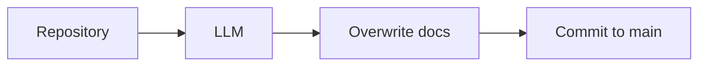
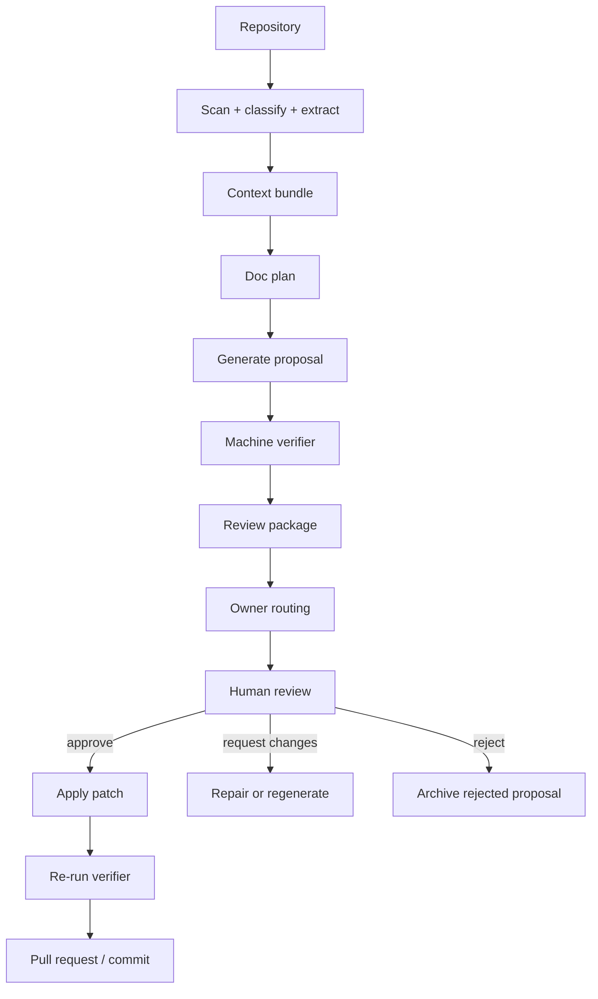
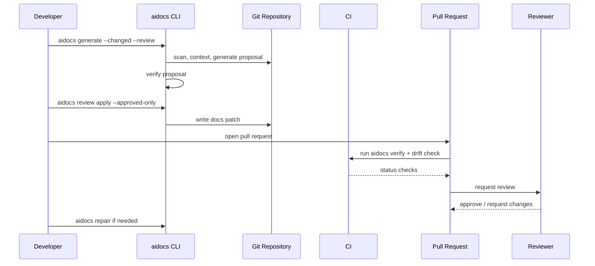

------
title: Build From Scratch: Mintlify-like AI-driven Documentation Generator CLI - Part 027
description: Build a human-in-the-loop review workflow for AI-generated documentation so every generated page, section, claim, example, and navigation change is reviewable, attributable, and safe to merge.
series: learn-ai-docs-km-cli
seriesTitle: Build From Scratch: Mintlify-like AI-driven Documentation Generator CLI with Code2Prompt and Open-source Knowledge Management
order: 27
partTitle: Human-in-the-loop Review Workflow
tags:
- ai-docs
- documentation
- cli
- review-workflow
- code-review
- docs-governance
- mdx
- ci
- codeowners
date: 2026-07-04
---

# Part 027 — Human-in-the-loop Review Workflow

Di part sebelumnya kita membangun verifier: MDX dicek, link dicek, example dicek, frontmatter dicek, source reference dicek, dan claim dicek terhadap evidence. Tetapi verifier tetap bukan pengganti reviewer manusia.

Verifier menjawab pertanyaan seperti:

- Apakah file valid secara struktur?
- Apakah link internal resolve?
- Apakah code fence punya language?
- Apakah claim punya source reference?
- Apakah contoh tampak masih cocok dengan contract?

Reviewer manusia menjawab pertanyaan yang lebih tinggi:

- Apakah dokumentasi ini benar-benar membantu user?
- Apakah framing-nya sesuai product intent?
- Apakah ada implication yang tidak boleh dipublikasikan?
- Apakah halaman ini terlalu menjanjikan sesuatu yang belum stabil?
- Apakah contoh ini aman untuk diikuti?
- Apakah istilah yang dipakai sesuai vocabulary tim?
- Apakah generated change ini layak masuk branch utama?

AI documentation generator yang production-grade tidak boleh langsung menulis ke docs tanpa review path. Sistem harus memperlakukan AI output sebagai **proposal**, bukan sebagai truth.

Mental model utama part ini:

> AI generates a reviewable proposal. Humans approve meaning. Machines verify structure. Git records accountability.

Kita akan membangun workflow review yang:

- diff-first,
- source-grounded,
- owner-aware,
- resumable,
- auditable,
- CI-friendly,
- safe terhadap overwrite human edits,
- cocok untuk local CLI maupun pull request workflow.

---

## 1. Kenapa Human-in-the-loop adalah Core Architecture, Bukan Add-on

Banyak AI docs tool gagal bukan karena modelnya buruk, tetapi karena workflow-nya salah.

Workflow yang salah biasanya seperti ini:



Masalahnya:

- tidak ada proposal stage,
- tidak ada review unit,
- tidak ada source ledger,
- tidak ada owner assignment,
- tidak ada policy gate,
- tidak ada diff explanation,
- tidak ada cara membedakan generated vs human-owned content,
- tidak ada rollback semantics.

Workflow yang benar:



Di sini AI output tidak pernah menjadi final hanya karena berhasil dibuat. Output melewati dua kelas pemeriksaan:

1. **Machine gate**: validitas mekanis, struktur, link, source refs, lint, drift, snippets.
2. **Human gate**: correctness, usefulness, positioning, trust, ownership, release timing.

---

## 2. Review Unit: Jangan Review File Raksasa Secara Mentah

Unit review yang terlalu besar membuat reviewer lelah dan melewatkan error. Untuk AI-generated docs, unit review harus lebih granular daripada file.

Kita definisikan beberapa unit:

| Unit | Contoh | Dipakai Untuk |
|---|---|---|
| `page` | `docs/getting-started.mdx` | Approve/reject halaman penuh |
| `section` | `## Authentication` | Review claim/flow spesifik |
| `claim` | “The API supports idempotency keys” | Grounding dan factual check |
| `example` | cURL request, SDK snippet | Executability dan safety |
| `diagram` | Mermaid architecture diagram | Validity dan representasi sistem |
| `nav` | Sidebar group/order | Information architecture |
| `frontmatter` | title, description, tags | Metadata, SEO, discovery |
| `km-note` | Logseq/OpenNote note | Internal knowledge sync |

Prinsipnya:

> Review unit harus cukup kecil untuk dinilai, tetapi cukup besar untuk punya meaning.

Claim tunggal terlalu kecil untuk user flow. Page penuh terlalu besar untuk factual correction. Section biasanya menjadi unit paling efektif.

---

## 3. Proposal Artifact

Sebelum menyentuh file docs final, generator membuat proposal artifact.

Nama artifact:

```txt
.aidocs/reviews/review-2026-07-04T10-30-00Z/
```

Struktur:

```txt
.aidocs/reviews/review-2026-07-04T10-30-00Z/
  review-manifest.v1.json
  summary.md
  proposed/
    docs/getting-started.mdx
    docs/api/authentication.mdx
  patches/
    docs_getting-started.patch
    docs_api_authentication.patch
  evidence/
    claim-ledger.v1.json
    source-refs.v1.json
    examples.v1.json
  verification/
    verifier-report.v1.json
    link-report.v1.json
    snippet-report.v1.json
  review-state.v1.json
  reviewer-notes.md
```

Kenapa harus artifact folder?

Karena review workflow harus:

- bisa dibuka ulang,
- bisa dibandingkan,
- bisa diarsipkan,
- bisa dilampirkan ke PR,
- bisa diregenerasi parsial,
- bisa dipakai untuk audit.

AI output yang hanya muncul di terminal sulit dipercaya. AI output yang punya manifest, evidence, verifier report, dan patch bisa dievaluasi.

---

## 4. Review Manifest

Review manifest adalah contract antara generator, reviewer, CLI, CI, dan PR bot.

Contoh minimal:

```json
{
  "schema": "review-manifest.v1",
  "reviewId": "review-2026-07-04T10-30-00Z",
  "repository": {
    "root": ".",
    "branch": "feature/auth-docs",
    "baseBranch": "main",
    "headCommit": "b7a91f2",
    "scanId": "scan-7f3c"
  },
  "intent": {
    "command": "aidocs generate --changed --review",
    "reason": "Generate docs affected by authentication module changes",
    "mode": "proposal"
  },
  "changes": [
    {
      "changeId": "chg-001",
      "type": "modify-page",
      "path": "docs/guides/authentication.mdx",
      "risk": "high",
      "ownerCandidates": ["@platform-security", "@docs-core"],
      "status": "pending-review",
      "sourceRefs": ["src/auth/AuthFilter.java", "openapi/auth.yaml"],
      "verification": {
        "status": "passed-with-warnings",
        "reportPath": "verification/verifier-report.v1.json"
      }
    }
  ]
}
```

Field penting:

- `reviewId`: stable handle untuk proposal.
- `baseBranch`: penting untuk CODEOWNERS dan diff.
- `headCommit`: mencegah apply proposal ke commit yang salah.
- `intent`: kenapa proposal dibuat.
- `changes`: daftar unit perubahan.
- `risk`: menentukan reviewer dan gate.
- `ownerCandidates`: reviewer yang disarankan.
- `verification`: status machine checks.

Invariant:

> Proposal yang tidak punya manifest tidak boleh di-apply.

---

## 5. Review State

Manifest menjelaskan proposal. Review state menjelaskan keputusan manusia.

Contoh:

```json
{
  "schema": "review-state.v1",
  "reviewId": "review-2026-07-04T10-30-00Z",
  "decisions": [
    {
      "unitId": "docs/guides/authentication.mdx#authentication-flow",
      "unitType": "section",
      "decision": "approved",
      "reviewer": "alice@example.com",
      "timestamp": "2026-07-04T10:45:00Z",
      "notes": "Flow matches current AuthFilter behavior."
    },
    {
      "unitId": "docs/guides/authentication.mdx#refresh-token-example",
      "unitType": "example",
      "decision": "request-changes",
      "reviewer": "bob@example.com",
      "timestamp": "2026-07-04T10:48:00Z",
      "notes": "Example uses deprecated token endpoint."
    }
  ]
}
```

Status yang kita dukung:

| Status | Meaning |
|---|---|
| `pending-review` | Belum dilihat manusia |
| `approved` | Boleh di-apply jika machine checks pass |
| `request-changes` | Perlu repair/regenerate/manual edit |
| `rejected` | Proposal tidak boleh masuk |
| `superseded` | Ada proposal baru menggantikan proposal lama |
| `applied` | Patch sudah diterapkan |

Jangan campur status verifier dengan status reviewer. Mereka menjawab pertanyaan berbeda.

---

## 6. Review Workflow End-to-end

Workflow local:

```bash
$ aidocs generate --changed --review
$ aidocs review list
$ aidocs review show review-2026-07-04T10-30-00Z
$ aidocs review open review-2026-07-04T10-30-00Z
$ aidocs review approve docs/guides/authentication.mdx#authentication-flow
$ aidocs review request-changes docs/guides/authentication.mdx#refresh-token-example \
    --note "Deprecated endpoint"
$ aidocs repair review-2026-07-04T10-30-00Z --unit refresh-token-example
$ aidocs review approve --all-safe
$ aidocs review apply review-2026-07-04T10-30-00Z
$ aidocs verify
```

Workflow PR:

```bash
$ aidocs generate --changed --review --format pr
$ aidocs review apply --approved-only
$ git checkout -b docs/ai-generated-auth
$ git add docs .aidocs
$ git commit -m "docs: update authentication guide"
$ gh pr create
```

Di CI:

```bash
$ aidocs verify --ci
$ aidocs drift check --ci
$ aidocs review check --require-approval high-risk
```

---

## 7. Human Review Modes

Tidak semua perubahan butuh review level yang sama.

Kita definisikan mode:

| Mode | Kapan Dipakai | Gate |
|---|---|---|
| `auto-safe` | Link fix, typo, metadata minor | verifier pass cukup |
| `review-required` | New section, changed examples, API docs | owner approval |
| `strict` | Security, auth, billing, compliance, runbook | owner + senior approval |
| `manual-only` | Claim tidak punya source kuat | tidak boleh auto-apply |

Contoh policy:

```yaml
reviewPolicy:
  defaultMode: review-required
  autoSafe:
    allowedChangeTypes:
      - fix-link
      - format-mdx
      - update-generated-timestamp
  strict:
    paths:
      - docs/security/**
      - docs/api/authentication/**
      - docs/runbooks/**
    claimTypes:
      - security
      - auth
      - pricing
      - compliance
  manualOnly:
    when:
      - verifier.hasUngroundedClaims
      - sourceConfidenceBelow: 0.75
```

Rule penting:

> Semakin besar consequence of being wrong, semakin kuat review gate.

---

## 8. Ownership Routing

Review workflow harus bisa menentukan siapa yang perlu melihat proposal.

Sumber ownership:

1. `CODEOWNERS`
2. docs ownership config
3. page frontmatter owner
4. package/module owner
5. API spec owner
6. fallback docs team

Contoh config:

```yaml
owners:
  fallback:
    - "@docs-core"
  rules:
    - match: "docs/security/**"
      reviewers:
        - "@platform-security"
      mode: strict
    - match: "openapi/billing.yaml"
      reviewers:
        - "@billing-api"
    - match: "packages/auth/**"
      reviewers:
        - "@identity-platform"
```

CODEOWNERS integration harus realistis. GitHub menggunakan file `CODEOWNERS` dari base branch pull request untuk menentukan request review otomatis. Artinya, proposal docs yang dibuat di branch feature harus dievaluasi terhadap ownership rules yang berlaku di base branch, bukan rules baru yang mungkin diubah di branch yang sama.

Routing algorithm:

```txt
for each change:
  owners = []
  owners += match_docs_owner_rules(change.path)
  owners += match_codeowners(change.path, base_branch)
  owners += owners_from_source_refs(change.sourceRefs)
  owners += owners_from_api_contract(change.contractRefs)
  if owners empty:
      owners += fallbackOwners
  change.ownerCandidates = deduplicate(owners)
```

---

## 9. Diff-first UX

Reviewer tidak mau membaca generated page dari nol. Mereka mau tahu:

- apa berubah,
- kenapa berubah,
- source mana yang mendukung perubahan,
- risiko apa,
- verifier menemukan apa,
- bagian mana butuh perhatian.

Review summary harus seperti ini:

```md
# AI Docs Review: Authentication Guide

## Summary

Generated proposal updates `docs/guides/authentication.mdx` because files under `src/auth/**` and `openapi/auth.yaml` changed.

## Change Risk

High: authentication behavior and token lifecycle.

## Proposed Changes

| Unit | Type | Risk | Verifier | Reviewer |
|---|---|---:|---|---|
| Authentication flow | section | high | passed | pending |
| Refresh token example | example | high | warning | pending |
| Error response table | table | medium | passed | pending |

## Warnings

- Refresh token example was inferred from tests, but OpenAPI contract does not include one response example.
- One claim about token expiry is supported only by config default, not public API contract.

## Suggested Review Order

1. Authentication flow
2. Refresh token example
3. Error response table
```

Diff-first berarti reviewer harus bisa membuka:

```bash
$ aidocs review diff review-2026-07-04T10-30-00Z
$ aidocs review diff review-2026-07-04T10-30-00Z --unit refresh-token-example
$ aidocs review evidence review-2026-07-04T10-30-00Z --unit refresh-token-example
```

---

## 10. Review Order

Urutan review penting. Jangan paksa reviewer membaca alfabetis.

Untuk docs proposal, gunakan order berikut:

1. High-risk pages.
2. Public API behavior changes.
3. Examples/snippets.
4. Security/auth/billing/compliance claims.
5. Architecture diagrams.
6. Navigation changes.
7. Low-risk metadata/formatting.

Heuristic:

```txt
reviewPriority =
  riskWeight
+ publicSurfaceWeight
+ ungroundedWarningWeight
+ exampleExecutionWeight
+ ownerCriticalityWeight
+ navigationImpactWeight
```

Output:

```json
{
  "reviewOrder": [
    {
      "unitId": "docs/guides/authentication.mdx#refresh-token-example",
      "reason": "high risk example with verifier warning"
    },
    {
      "unitId": "docs/guides/authentication.mdx#authentication-flow",
      "reason": "high risk auth behavior section"
    }
  ]
}
```

---

## 11. Applying Patches Safely

`aidocs review apply` tidak boleh sekadar copy file dari `proposed/` ke `docs/`.

Apply harus memeriksa:

- base commit masih sama atau compatible,
- file belum diubah manusia sejak proposal dibuat,
- generated regions masih intact,
- patch masih apply cleanly,
- approval status cukup,
- verifier status cukup,
- risk policy terpenuhi.

Pseudo-code:

```ts
function applyReview(reviewId: string) {
  const review = loadReview(reviewId)
  assertManifestValid(review.manifest)
  assertNoRejectedUnits(review.state)
  assertRequiredApprovals(review)
  assertVerificationPolicy(review)

  for (const patch of review.patches) {
    const current = readFile(patch.targetPath)
    const base = readArtifact(patch.basePath)

    if (!patchAppliesCleanly(base, current, patch)) {
      markConflict(patch)
      continue
    }

    const next = applyPatch(current, patch)
    assertHumanRegionsPreserved(current, next)
    writeFileAtomic(patch.targetPath, next)
  }

  writeApplyReceipt(reviewId)
}
```

Apply receipt:

```json
{
  "schema": "apply-receipt.v1",
  "reviewId": "review-2026-07-04T10-30-00Z",
  "appliedAt": "2026-07-04T11:05:00Z",
  "appliedBy": "alice@example.com",
  "files": [
    {
      "path": "docs/guides/authentication.mdx",
      "status": "applied",
      "newHash": "sha256:..."
    }
  ]
}
```

---

## 12. Generated Regions and Human-owned Regions

Generated docs sering gagal karena AI overwrite catatan manusia.

Kita gunakan region markers:

```mdx
<!-- aidocs:generated:start id="auth-flow" source="src/auth/AuthFilter.java" -->
## Authentication flow

Generated content here.
<!-- aidocs:generated:end -->

<!-- aidocs:manual:start id="security-note" -->
> Internal note from security team: do not document partner-only bypass behavior.
<!-- aidocs:manual:end -->
```

Rules:

- Generator boleh update generated region yang dia miliki.
- Generator tidak boleh menulis manual region.
- Generator boleh propose change dekat manual region, tetapi harus mark as conflict-risk.
- Reviewer bisa convert generated region menjadi manual region.
- Manual region selalu menang.

Command:

```bash
$ aidocs ownership mark-manual docs/guides/authentication.mdx#security-note
$ aidocs ownership mark-generated docs/guides/authentication.mdx#auth-flow --source src/auth/AuthFilter.java
```

---

## 13. Reviewer Comments as Structured Feedback

Reviewer feedback tidak boleh hilang sebagai free text saja. Ia bisa dipakai untuk repair.

Komentar:

```json
{
  "schema": "review-comment.v1",
  "commentId": "cmt-001",
  "unitId": "docs/guides/authentication.mdx#refresh-token-example",
  "kind": "correction",
  "severity": "blocking",
  "text": "Do not use /v1/token/refresh. The current endpoint is /v2/sessions/refresh.",
  "suggestedSources": [
    "openapi/auth.yaml#/paths/~1v2~1sessions~1refresh"
  ]
}
```

Jenis komentar:

| Kind | Meaning |
|---|---|
| `correction` | Konten salah |
| `missing-context` | Kurang penjelasan |
| `tone` | Gaya/positioning tidak cocok |
| `unsafe-command` | Contoh command berisiko |
| `stale-source` | Source yang dipakai sudah tidak relevan |
| `ownership` | Reviewer salah/kurang |
| `navigation` | IA/sidebar perlu diubah |

Repair prompt bisa memuat komentar ini, tapi tetap harus source-grounded.

---

## 14. Repair Loop

Repair loop bukan regenerate all.

Salah:

```bash
$ aidocs generate --force-all
```

Benar:

```bash
$ aidocs repair review-2026-07-04T10-30-00Z \
    --unit docs/guides/authentication.mdx#refresh-token-example
```

Repair input:

- original page spec,
- original context bundle,
- reviewer comment,
- current source refs,
- verifier warnings,
- allowed patch scope.

Repair output:

- new proposal revision,
- changed diff only for target unit,
- updated evidence,
- updated verifier report.

Revision model:

```txt
review-2026-07-04T10-30-00Z
  revision-001/
  revision-002/
  revision-003/
```

Setiap revision harus punya:

- patch,
- evidence,
- verifier report,
- reason.

---

## 15. PR Bot Behavior

Jika sistem dipakai di GitHub/GitLab, bot jangan spam komentar per baris tanpa ringkasan.

Bot comment yang baik:

```md
## AI Docs Proposal Review

Generated docs proposal for 4 changed files.

### Required Review

- `docs/guides/authentication.mdx` — high risk, requires `@platform-security`
- `docs/api/authentication.mdx` — public API behavior, requires `@api-platform`

### Verification

- MDX: passed
- Links: passed
- Examples: 1 warning
- Claim grounding: 2 warnings

### Suggested Review Order

1. Refresh token example
2. Authentication flow
3. Error response table

Run locally:

```bash
aidocs review open review-2026-07-04T10-30-00Z
```
```

Bot harus:

- update satu sticky comment,
- tidak membuat komentar duplikat tiap push,
- menyertakan artifact link,
- menyertakan command reproduksi lokal,
- menandai blocking warnings secara jelas,
- tidak menyembunyikan verifier failures.

---

## 16. Integration with Pull Request Reviews

GitHub pull request review adalah mekanisme sosial dan teknis. GitHub mendukung request review dari orang/team, dan CODEOWNERS dapat otomatis meminta reviewer saat PR mengubah file yang mereka miliki.

Untuk CLI kita, integrasi praktisnya:

1. Generate review package.
2. Apply approved or proposed patch to branch.
3. Create PR.
4. Attach review summary as PR comment.
5. Request owners based on docs/code ownership.
6. CI runs verifier and drift check.
7. Human reviewers approve/request changes.
8. Repair loop updates PR.
9. Merge only after policy pass.

Mermaid:



---

## 17. Risk Model

Risk should drive review depth.

Risk signals:

| Signal | Reason |
|---|---|
| Public API page changed | External user impact |
| Auth/security docs changed | High consequence if wrong |
| Billing/pricing docs changed | Commercial/legal risk |
| Compliance docs changed | Regulatory risk |
| Runbook command added | Operational risk |
| Example command mutates state | Safety risk |
| Claim confidence low | Factual risk |
| Source conflict found | Reliability risk |
| Navigation moved major page | Discoverability risk |
| Human-owned region touched | Ownership risk |

Example risk computation:

```ts
function computeRisk(change: DocChange): RiskLevel {
  let score = 0

  if (change.path.includes('/security/')) score += 40
  if (change.claims.some(c => c.type === 'auth')) score += 30
  if (change.examples.some(e => e.mutatesState)) score += 20
  if (change.verification.hasWarnings) score += 15
  if (change.touchesManualRegion) score += 50
  if (change.publicSurface) score += 25

  if (score >= 70) return 'critical'
  if (score >= 40) return 'high'
  if (score >= 20) return 'medium'
  return 'low'
}
```

---

## 18. Review Policy as Code

Review policy harus versioned.

Contoh `.aidocs/review-policy.yaml`:

```yaml
schema: review-policy.v1

approval:
  defaultRequired: 1
  byRisk:
    low: 0
    medium: 1
    high: 1
    critical: 2

paths:
  - match: "docs/security/**"
    risk: critical
    requiredReviewers:
      - "@platform-security"
  - match: "docs/runbooks/**"
    risk: high
    requiredReviewers:
      - "@sre"
  - match: "docs/api/**"
    risk: medium
    requiredReviewers:
      - "@api-docs"

blockingVerifierRules:
  - mdx-invalid
  - broken-internal-link
  - ungrounded-critical-claim
  - unsafe-command
  - missing-openapi-source

allowAutoApply:
  changeTypes:
    - fix-broken-link
    - normalize-frontmatter
  maxRisk: low
```

Ini membuat review workflow reproducible. Tanpa policy-as-code, setiap reviewer punya standar berbeda.

---

## 19. Review CLI Design

Command group:

```txt
aidocs review
  list
  show <review-id>
  open <review-id>
  diff <review-id>
  evidence <review-id>
  approve <unit-id>
  request-changes <unit-id>
  reject <unit-id>
  apply <review-id>
  check <review-id>
  archive <review-id>
```

Examples:

```bash
$ aidocs review list

ID                              Status           Risk   Changes
review-2026-07-04T10-30-00Z     pending-review   high   4
review-2026-07-04T09-10-00Z     applied          low    2
```

```bash
$ aidocs review show review-2026-07-04T10-30-00Z

Review: review-2026-07-04T10-30-00Z
Status: pending-review
Risk: high
Verifier: passed-with-warnings
Required approvals: @platform-security

Changes:
  [pending] docs/guides/authentication.mdx#authentication-flow
  [warning] docs/guides/authentication.mdx#refresh-token-example
```

```bash
$ aidocs review evidence review-2026-07-04T10-30-00Z \
    --unit docs/guides/authentication.mdx#refresh-token-example
```

Output:

```txt
Unit: refresh-token-example
Source refs:
  - openapi/auth.yaml#/paths/~1v2~1sessions~1refresh
  - tests/auth/refresh-token.test.ts
Verifier warnings:
  - example response body missing from OpenAPI examples
Claims:
  - supported: endpoint path
  - supported: HTTP method
  - weak: token expiry description
```

---

## 20. Review UI Without Building a Web App

Kita bisa membuat review efektif tanpa web UI besar.

Minimum viable UX:

- terminal summary,
- generated `summary.md`,
- patch files,
- local browser preview,
- PR comment,
- HTML report optional.

Command:

```bash
$ aidocs review open review-2026-07-04T10-30-00Z
```

Bisa membuka static HTML:

```txt
.aidocs/reviews/review-2026-07-04T10-30-00Z/report/index.html
```

Report sections:

- Overview
- Changed pages
- Risk
- Verification status
- Review order
- Diff viewer
- Evidence viewer
- Claim ledger
- Example report
- Apply instructions

Tetap ingat: web report hanya visualization. Source of truth tetap artifact JSON + patch.

---

## 21. Conflict Handling

Conflict terjadi ketika:

- file berubah setelah proposal dibuat,
- human edits menyentuh generated region,
- source refs berubah,
- verifier status berubah,
- review sudah approve revision lama,
- CODEOWNERS berubah di base branch.

Conflict policy:

| Conflict | Action |
|---|---|
| Patch tidak apply | block apply, request regenerate |
| Human manual region touched | block apply |
| Generated region changed manually | require reviewer decision |
| Source hash changed | re-run verifier |
| High-risk unit regenerated | approval reset |
| Low-risk formatting regenerated | approval may remain |

Approval invalidation:

```txt
if unit content hash changes:
  reset approval for that unit
if evidence hash changes for high-risk unit:
  reset approval
if only whitespace changed and verifier pass:
  keep approval if policy allows
```

---

## 22. Audit Trail

Audit trail harus menjawab:

- siapa membuat proposal,
- command apa yang dipakai,
- source commit apa,
- model/provider apa,
- context bundle apa,
- file apa berubah,
- verifier hasilnya apa,
- siapa approve,
- kapan apply,
- apakah ada warning yang di-waive,
- kenapa warning di-waive.

Audit event:

```json
{
  "schema": "audit-event.v1",
  "event": "review.unit.approved",
  "reviewId": "review-2026-07-04T10-30-00Z",
  "unitId": "docs/guides/authentication.mdx#authentication-flow",
  "actor": "alice@example.com",
  "timestamp": "2026-07-04T10:45:00Z",
  "metadata": {
    "risk": "high",
    "verifierStatus": "passed"
  }
}
```

Audit log append-only:

```txt
.aidocs/audit/audit-2026-07.jsonl
```

Jangan simpan secrets, full prompt sensitif, atau code proprietary di audit log shared. Simpan reference hash jika perlu.

---

## 23. Waiver Model

Kadang verifier warning valid untuk di-waive.

Contoh:

- External link timeout sementara.
- Mermaid warning visual minor.
- Claim grounded ke source internal yang tidak boleh dipublikasikan.
- Example tidak executable di CI karena butuh credentials.

Waiver harus eksplisit dan expire.

```yaml
waivers:
  - rule: external-link-timeout
    path: docs/integrations/slack.mdx
    reason: "Vendor docs intermittently returns 503 from CI region"
    approvedBy: "@docs-core"
    expires: "2026-08-04"
```

Rules:

- Tidak ada permanent waiver default.
- Waiver untuk critical claim harus punya owner.
- Waiver expiry wajib.
- Waiver muncul di review summary.

---

## 24. Testing Review Workflow

Test cases:

1. Approve low-risk link fix.
2. Block high-risk auth docs without owner approval.
3. Reset approval after repair changes content hash.
4. Preserve manual region during apply.
5. Block apply if verifier fails.
6. Assign owners from docs ownership config.
7. Assign owners from source refs.
8. Detect patch conflict.
9. Generate sticky PR comment.
10. Archive rejected proposal.
11. Apply approved-only subset.
12. Reject proposal with ungrounded critical claim.
13. Expire waiver.
14. Re-run verifier after source hash change.

Example test fixture:

```txt
fixtures/review-workflow/
  repo-before/
  proposal/
  expected-review-manifest.json
  expected-review-state-after-approval.json
  expected-files-after-apply/
```

---

## 25. Implementation Skeleton

Domain model:

```ts
type ReviewDecision =
  | 'pending-review'
  | 'approved'
  | 'request-changes'
  | 'rejected'
  | 'superseded'
  | 'applied'

type ReviewUnitType =
  | 'page'
  | 'section'
  | 'claim'
  | 'example'
  | 'diagram'
  | 'nav'
  | 'frontmatter'
  | 'km-note'

interface ReviewUnit {
  id: string
  type: ReviewUnitType
  path: string
  title?: string
  risk: 'low' | 'medium' | 'high' | 'critical'
  sourceRefs: string[]
  verifierStatus: 'passed' | 'passed-with-warnings' | 'failed'
  ownerCandidates: string[]
  decision: ReviewDecision
}

interface ReviewManifest {
  schema: 'review-manifest.v1'
  reviewId: string
  repository: RepositorySnapshot
  intent: ReviewIntent
  units: ReviewUnit[]
  patches: PatchRef[]
  evidence: EvidenceRef[]
  verification: VerificationRef[]
}
```

Service boundaries:

```txt
ReviewPlanner
  creates review units and risk scores

OwnerResolver
  finds reviewer candidates

ReviewStore
  persists manifest/state/audit events

PatchManager
  computes and applies patches safely

ReviewPolicyEngine
  evaluates required approvals and blocking rules

ReviewReporter
  renders terminal, markdown, HTML, PR comment

RepairCoordinator
  creates targeted repair tasks
```

---

## 26. Failure Modes

| Failure | Cause | Prevention |
|---|---|---|
| AI docs merged without human approval | No review gate | Require review state for high-risk changes |
| Reviewer misses critical change | Poor review ordering | Risk-based review order |
| Human notes overwritten | No ownership markers | Manual/generated region model |
| Approval applied to changed content | No hash binding | Approval tied to unit hash |
| Bot spams PR | New comment per run | Sticky comment update |
| Wrong reviewer assigned | Ownership only from docs path | Include source refs and contract owners |
| Verifier warnings ignored silently | No waiver model | Explicit expiring waivers |
| Proposal impossible to reproduce | No artifact manifest | Persist context, plan, evidence, patch |
| Full regenerate after small feedback | Coarse repair loop | Unit-level repair |

---

## 27. Minimal Acceptance Criteria

Untuk menyelesaikan part ini secara implementatif, sistem minimal harus bisa:

- membuat review package,
- menyimpan review manifest,
- menampilkan diff,
- menampilkan evidence per unit,
- menerima approve/request-changes/reject,
- menerapkan approved patches secara aman,
- menolak apply jika verifier gagal,
- menjaga manual regions,
- menghasilkan review summary markdown,
- menjalankan policy check di CI.

Command minimal:

```bash
aidocs generate --review
aidocs review list
aidocs review show <id>
aidocs review diff <id>
aidocs review approve <unit>
aidocs review request-changes <unit>
aidocs review apply <id>
aidocs review check <id> --ci
```

---

## 28. Key Takeaways

Human-in-the-loop bukan sekadar “minta orang baca”. Ia adalah workflow arsitektural:

- AI output adalah proposal.
- Proposal harus punya manifest.
- Review unit harus granular.
- Risk menentukan gate.
- Reviewer harus melihat diff, evidence, warning, dan source refs.
- Approval harus terikat ke content hash.
- Manual region harus dilindungi.
- Repair harus targeted.
- Waiver harus explicit dan expire.
- CI harus bisa enforce review policy.

Setelah part ini, pipeline kita berubah dari:

```txt
Generate docs -> hope it is correct
```

menjadi:

```txt
Generate proposal -> verify -> review -> repair -> apply -> verify -> merge
```

Itulah bedanya AI docs toy dengan AI docs system yang bisa dipakai tim serius.

---

## References

- GitHub Docs — About code owners: https://docs.github.com/repositories/managing-your-repositorys-settings-and-features/customizing-your-repository/about-code-owners
- GitHub Docs — About pull request reviews: https://docs.github.com/pull-requests/collaborating-with-pull-requests/reviewing-changes-in-pull-requests/about-pull-request-reviews
- GitHub Docs — Reviewing proposed changes in a pull request: https://docs.github.com/pull-requests/collaborating-with-pull-requests/reviewing-changes-in-pull-requests
- OpenAI — Why language models hallucinate: https://openai.com/index/why-language-models-hallucinate/
