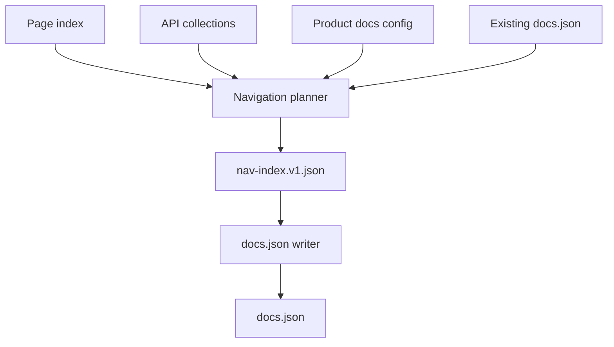
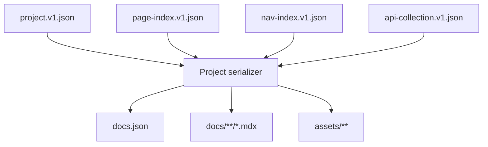
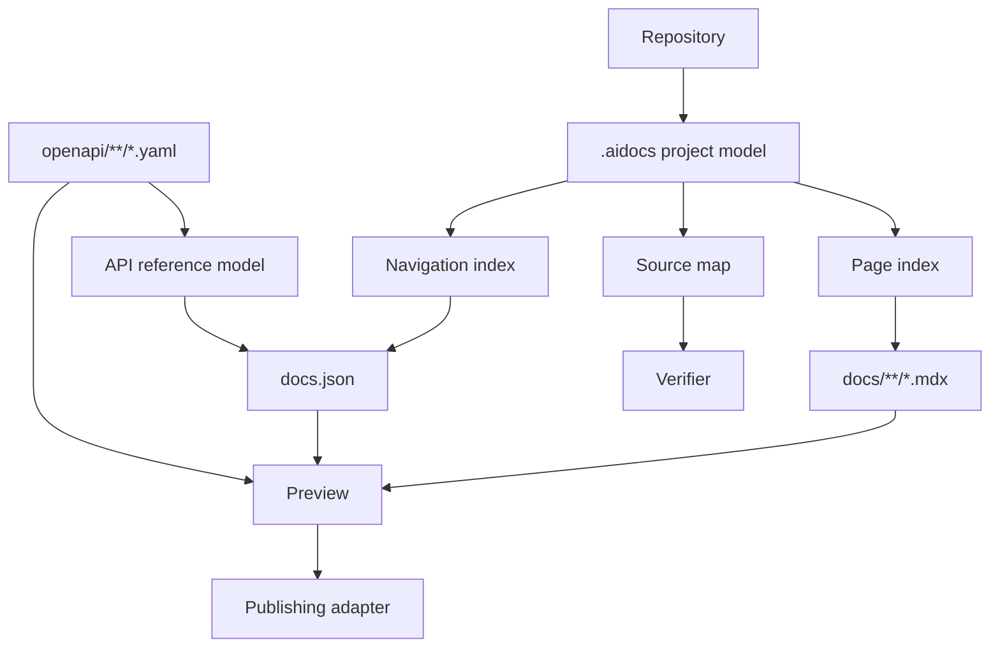

------
title: Build From Scratch: Mintlify-like AI-driven Documentation Generator CLI - Part 028
description: Design a Mintlify-like documentation project model for an AI-driven docs generator, including docs.json-compatible navigation, MDX content layout, API references, generated/manual ownership, and publishing boundaries.
series: learn-ai-docs-km-cli
seriesTitle: Build From Scratch: Mintlify-like AI-driven Documentation Generator CLI with Code2Prompt and Open-source Knowledge Management
order: 28
partTitle: Mintlify-like Docs Project Model
tags:
- ai-docs
- documentation
- cli
- mintlify
- mdx
- docs-json
- static-site
- publishing
- openapi
date: 2026-07-04
---

# Part 028 — Mintlify-like Docs Project Model

Sekarang kita masuk Phase 6: publishing system.

Sampai Part 027, kita sudah punya pipeline internal:

```txt
repo -> scan -> classify -> extract -> context -> plan -> generate -> verify -> review -> apply
```

Tetapi apply ke mana?

Jawaban sederhananya: ke folder docs.

Jawaban production-grade-nya: ke sebuah **docs project model** yang punya struktur, navigation, config, content ownership, API reference integration, generated/manual boundaries, preview behavior, dan publish target.

Part ini membangun model tersebut dengan inspirasi Mintlify modern, tetapi kita tidak sedang membuat clone Mintlify. Kita sedang membuat **Mintlify-like output contract**: struktur docs yang familiar untuk developer, MDX-first, navigation-as-config, API-reference-friendly, dan cocok untuk AI generation.

Fakta penting: Mintlify sekarang menggunakan `docs.json` sebagai file konfigurasi utama untuk navigation, appearance, integrations, dan site settings. Dokumentasi Mintlify juga menjelaskan bahwa navigation dapat dikonfigurasi dengan groups, pages, dropdowns, tabs, dan anchors di `docs.json`.

Jadi target kita bukan model lama yang terlalu sederhana. Target kita adalah project model yang bisa menghasilkan:

- MDX pages,
- `docs.json`-like navigation,
- OpenAPI-driven API reference,
- local preview,
- generated/manual ownership,
- provenance metadata,
- docs build artifact,
- publishing adapter.

---

## 1. Apa Itu Docs Project Model?

Docs project model adalah representasi internal dari dokumentasi sebagai sistem.

Bukan hanya:

```txt
docs/*.mdx
```

Tetapi:

```txt
content + navigation + config + assets + API contracts + generated metadata + review state + build output
```

Model ini menjawab:

- halaman apa saja ada,
- halaman mana yang generated,
- halaman mana yang manual,
- halaman mana masuk sidebar,
- group/tabs/anchors apa yang ada,
- OpenAPI spec mana menghasilkan API pages,
- docs mana public/internal,
- asset mana dipakai,
- page mana stale,
- navigation mana broken,
- source mana mendukung page,
- publish target apa.

Tanpa docs project model, generator akan menulis file MDX secara scattered. Hasilnya bisa valid per file, tetapi buruk sebagai website.

---

## 2. Goals

Kita ingin project model yang:

1. **Human-readable** — developer bisa edit manual.
2. **Machine-readable** — generator bisa parse dan update deterministically.
3. **Navigation-first** — docs site mudah dijelajahi.
4. **MDX-first** — content kaya tetapi tetap text-based.
5. **API-reference-aware** — OpenAPI tidak diperlakukan sebagai markdown biasa.
6. **AI-safe** — generated dan manual region jelas.
7. **Reviewable** — perubahan config/nav/content bisa di-diff.
8. **Portable** — bisa publish ke Mintlify-like renderer atau static renderer sendiri.
9. **Incremental** — perubahan kecil tidak rebuild semuanya.
10. **Governable** — ownership, visibility, and release state bisa dikontrol.

---

## 3. Non-goals

Agar boundary jelas, part ini tidak membangun:

- full hosted docs platform,
- search engine hosted,
- auth portal,
- analytics platform,
- visual editor lengkap,
- proprietary Mintlify feature parity,
- billing/customer-facing SaaS layer.

Kita membangun project model dan file layout yang bisa menjadi fondasi publishing adapter.

---

## 4. High-level Structure

Rekomendasi layout:

```txt
repo/
  docs.json
  docs/
    index.mdx
    quickstart.mdx
    concepts/
      architecture.mdx
      authentication.mdx
    guides/
      install.mdx
      deploy.mdx
    api/
      overview.mdx
    runbooks/
      incident-response.mdx
  openapi/
    public-api.yaml
  assets/
    logo.svg
    diagrams/
      architecture.mmd
  .aidocs/
    project.v1.json
    page-index.v1.json
    nav-index.v1.json
    source-map.v1.json
    build/
    cache/
    reviews/
```

Separation:

| Path | Purpose |
|---|---|
| `docs.json` | Public docs configuration/navigation |
| `docs/**` | Human-readable MDX content |
| `openapi/**` | API contracts |
| `assets/**` | Images, diagrams, static files |
| `.aidocs/**` | Internal AI docs artifacts |

Rule:

> Public docs files must remain understandable without reading `.aidocs`, but `.aidocs` makes them traceable, reviewable, and regenerable.

---

## 5. Internal vs External Model

Kita pisahkan dua model:

1. **External project format** — file yang developer lihat dan docs renderer pakai.
2. **Internal project model** — artifact kaya untuk generator.

External:

```txt
docs.json
docs/**/*.mdx
openapi/**/*.yaml
assets/**/*
```

Internal:

```txt
.aidocs/project.v1.json
.aidocs/page-index.v1.json
.aidocs/nav-index.v1.json
.aidocs/source-map.v1.json
.aidocs/ownership.v1.json
```

Kenapa tidak taruh semua metadata di `docs.json`?

Karena `docs.json` harus tetap menjadi docs site config, bukan dumping ground untuk AI metadata.

AI metadata seperti claim ledger, source hashes, context bundle IDs, and review status terlalu noisy untuk public config.

---

## 6. Project Artifact: `project.v1.json`

Contoh internal project artifact:

```json
{
  "schema": "aidocs-project.v1",
  "project": {
    "name": "acme-platform-docs",
    "root": ".",
    "docsRoot": "docs",
    "configFile": "docs.json",
    "assetsRoot": "assets",
    "openapiRoot": "openapi"
  },
  "site": {
    "title": "Acme Platform",
    "description": "Developer documentation for Acme Platform",
    "visibility": "public",
    "baseUrl": "https://docs.acme.dev"
  },
  "renderer": {
    "kind": "mintlify-like",
    "compatibility": {
      "docsJson": true,
      "mdx": true,
      "openapiNavigation": true
    }
  },
  "content": {
    "pages": 42,
    "generatedPages": 18,
    "manualPages": 24
  },
  "contracts": {
    "openapi": [
      {
        "id": "public-api",
        "path": "openapi/public-api.yaml"
      }
    ]
  }
}
```

Ini bukan pengganti `docs.json`. Ini adalah internal normalized view.

---

## 7. `docs.json`-like Config

Contoh minimal:

```json
{
  "$schema": "https://mintlify.com/docs.json",
  "theme": "mint",
  "name": "Acme Platform",
  "colors": {
    "primary": "#16A34A"
  },
  "navigation": {
    "groups": [
      {
        "group": "Get started",
        "pages": [
          "docs/index",
          "docs/quickstart"
        ]
      },
      {
        "group": "Concepts",
        "pages": [
          "docs/concepts/architecture",
          "docs/concepts/authentication"
        ]
      },
      {
        "group": "Guides",
        "pages": [
          "docs/guides/install",
          "docs/guides/deploy"
        ]
      }
    ]
  }
}
```

Important: kita tidak harus mengimplementasikan semua property Mintlify. Tetapi kita harus punya model yang bisa memetakan konsep inti:

- site identity,
- appearance/theme,
- navigation,
- pages,
- groups,
- tabs,
- anchors,
- dropdowns,
- OpenAPI references,
- integrations.

---

## 8. Navigation Concepts

Navigation bukan list file. Navigation adalah information architecture.

Concepts:

| Concept | Meaning |
|---|---|
| Page | Single MDX document |
| Group | Sidebar grouping |
| Tab | Top-level product/area partition |
| Anchor | Page/section anchor in nav context |
| Dropdown | Menu grouping, often top nav |
| API group | Generated API reference section |
| Hidden page | File exists but not in nav |
| Redirect | Old path points to new path |

Example navigation object:

```json
{
  "tabs": [
    {
      "tab": "Guides",
      "groups": [
        {
          "group": "Get started",
          "pages": ["docs/index", "docs/quickstart"]
        },
        {
          "group": "Core concepts",
          "pages": [
            "docs/concepts/architecture",
            "docs/concepts/authentication"
          ]
        }
      ]
    },
    {
      "tab": "API Reference",
      "groups": [
        {
          "group": "Public API",
          "openapi": "openapi/public-api.yaml"
        }
      ]
    }
  ]
}
```

---

## 9. Page Model

Internal page model:

```json
{
  "schema": "page-index.v1",
  "pages": [
    {
      "id": "page:docs/concepts/authentication",
      "path": "docs/concepts/authentication.mdx",
      "route": "/concepts/authentication",
      "title": "Authentication",
      "description": "Understand how authentication works in Acme Platform.",
      "kind": "concept",
      "ownership": "generated-with-manual-regions",
      "visibility": "public",
      "nav": {
        "included": true,
        "group": "Core concepts",
        "order": 20
      },
      "sourceRefs": [
        "src/auth/AuthFilter.java",
        "openapi/public-api.yaml#/components/securitySchemes"
      ],
      "lastGenerated": {
        "reviewId": "review-2026-07-04T10-30-00Z",
        "sourceHash": "sha256:...",
        "pageHash": "sha256:..."
      }
    }
  ]
}
```

Fields:

- `kind`: overview, quickstart, concept, guide, reference, runbook, changelog.
- `ownership`: manual, generated, generated-with-manual-regions.
- `visibility`: public, internal, private.
- `sourceRefs`: traceability.
- `nav`: navigation placement.
- `lastGenerated`: drift detection.

---

## 10. Page Kinds

Page taxonomy:

| Kind | Role | AI Strategy |
|---|---|---|
| `overview` | Landing/context | synthesize from repo map + product config |
| `quickstart` | shortest successful path | example-aware generation |
| `concept` | mental model | source-grounded narrative |
| `guide` | task-oriented steps | use tests/examples/contracts |
| `api-reference` | endpoint/schema reference | OpenAPI-driven |
| `architecture` | system structure | graph/diagram generation |
| `runbook` | operational response | logs/config/error mining |
| `troubleshooting` | symptom-cause-fix | error mining + verifier |
| `changelog` | release changes | release notes/commits |
| `glossary` | vocabulary | knowledge graph extraction |

Navigation should not blindly mirror taxonomy. Sometimes a `concept` page belongs under “Get started” if user needs it early.

---

## 11. MDX Page Contract

Every generated page should include frontmatter.

```mdx
---
title: Authentication
description: Understand how authentication works in Acme Platform.
---

# Authentication

<!-- aidocs:generated:start id="auth-overview" -->
...
<!-- aidocs:generated:end -->
```

Internal source map links sections to source.

```json
{
  "schema": "source-map.v1",
  "sections": [
    {
      "page": "docs/concepts/authentication.mdx",
      "sectionId": "auth-overview",
      "sourceRefs": [
        "src/auth/AuthFilter.java#class:AuthFilter",
        "openapi/public-api.yaml#/components/securitySchemes/BearerAuth"
      ],
      "claimIds": ["claim-001", "claim-002"]
    }
  ]
}
```

Do not overload MDX with huge metadata. Keep source map internal.

---

## 12. Generated and Manual Pages

Ownership modes:

| Mode | Meaning | Generator Can |
|---|---|---|
| `manual` | Human-owned page | suggest patch only |
| `generated` | Fully generated page | regenerate whole page after review |
| `hybrid` | Generated regions + manual regions | update owned regions only |
| `frozen` | Historical/release docs | no changes unless explicit |

Recommended frontmatter extension:

```yaml
aiDocs:
  ownership: hybrid
  sourceMap: .aidocs/source-map.v1.json
  lastGeneratedReview: review-2026-07-04T10-30-00Z
```

But keep it minimal. If frontmatter becomes too noisy, move details into `.aidocs`.

---

## 13. API Reference Model

Mintlify supports generating interactive API documentation from OpenAPI 3.0 and 3.1 specs. In our Mintlify-like system, OpenAPI should be treated as a first-class contract, not converted to arbitrary prose first.

Internal API collection:

```json
{
  "schema": "api-collection.v1",
  "collections": [
    {
      "id": "public-api",
      "title": "Public API",
      "specPath": "openapi/public-api.yaml",
      "version": "v1",
      "navigation": {
        "tab": "API Reference",
        "group": "Public API"
      },
      "generation": {
        "mode": "delegated-openapi",
        "includeNarrativeOverview": true,
        "includeAuthGuide": true
      }
    }
  ]
}
```

Modes:

| Mode | Meaning |
|---|---|
| `delegated-openapi` | Renderer reads OpenAPI directly |
| `explicit-mdx` | CLI generates endpoint MDX pages |
| `hybrid` | Renderer handles reference, CLI writes guides/examples |

Recommended default:

```txt
OpenAPI reference: delegated
API guides: generated MDX
Examples: source/test grounded
```

Why? Because endpoint reference should stay close to contract. Narrative guides need more synthesis.

---

## 14. Navigation Generation Boundary

Part 029 akan membahas navigation generation detail. Di part ini kita definisikan boundary.

The project model owns:

- nav entity types,
- page inclusion state,
- group/tab/anchor schema,
- route mapping,
- hidden page rules,
- validation expectations.

The planner owns:

- page candidates,
- taxonomy,
- missing pages,
- priority.

The navigation generator owns:

- final grouping,
- ordering,
- sidebar shape,
- docs.json serialization.

Flow:



---

## 15. `nav-index.v1.json`

Before writing `docs.json`, create normalized nav index.

```json
{
  "schema": "nav-index.v1",
  "navigation": {
    "tabs": [
      {
        "id": "tab-guides",
        "label": "Guides",
        "groups": [
          {
            "id": "group-get-started",
            "label": "Get started",
            "items": [
              {
                "type": "page",
                "pageId": "page:docs/index"
              },
              {
                "type": "page",
                "pageId": "page:docs/quickstart"
              }
            ]
          }
        ]
      }
    ]
  },
  "diagnostics": [
    {
      "level": "warning",
      "message": "docs/concepts/authentication.mdx is public but not included in navigation"
    }
  ]
}
```

Why separate from `docs.json`?

- easier testing,
- easier diffing,
- easier validation,
- renderer-independent,
- can support multiple publishing targets.

---

## 16. Static Asset Model

Assets are part of docs project.

Asset types:

- images,
- logos,
- diagrams,
- generated Mermaid source,
- screenshots,
- downloadable schemas,
- sample config files.

Asset index:

```json
{
  "schema": "asset-index.v1",
  "assets": [
    {
      "id": "asset:architecture-diagram",
      "path": "assets/diagrams/architecture.mmd",
      "kind": "mermaid-source",
      "generated": true,
      "usedBy": ["docs/concepts/architecture.mdx"],
      "sourceRefs": [".aidocs/architecture-model.v1.json"]
    }
  ]
}
```

Rules:

- Do not generate screenshots unless source is known.
- Prefer Mermaid source for generated architecture diagrams.
- Keep generated diagrams reviewable as text.
- Validate asset references.
- Detect orphan assets.

---

## 17. Public vs Internal Docs

AI docs generator often sees internal repo details. Not all should be published.

Visibility levels:

| Visibility | Meaning |
|---|---|
| `public` | Safe for external docs |
| `internal` | Team/company only |
| `private` | Local reviewer only, not published |
| `sensitive` | Should not be generated into docs |

Example config:

```yaml
visibility:
  default: internal
  publicPaths:
    - docs/index.mdx
    - docs/quickstart.mdx
    - docs/api/**
  internalPaths:
    - docs/runbooks/**
    - docs/architecture/internal/**
  sensitiveSourcePatterns:
    - "**/.env*"
    - "**/secrets/**"
    - "**/*credential*"
```

Generation rule:

> A public page may use internal source as evidence, but must not reveal internal-only facts unless explicitly allowed.

Example:

- Safe: “Requests require a bearer token.”
- Unsafe: “The bearer token is validated by internal class `PartnerBypassAuthFilter` with bypass mode.”

---

## 18. Monorepo Project Model

Monorepo docs can be structured by product/package.

Layout:

```txt
repo/
  apps/
    console/
    api/
  packages/
    sdk-js/
    sdk-python/
  services/
    billing/
    identity/
  docs/
    console/
    api/
    sdks/
    platform/
```

Internal workspace model:

```json
{
  "schema": "workspace-docs.v1",
  "workspaces": [
    {
      "id": "service:identity",
      "root": "services/identity",
      "docsNamespace": "docs/platform/identity",
      "owners": ["@identity-platform"]
    },
    {
      "id": "package:sdk-js",
      "root": "packages/sdk-js",
      "docsNamespace": "docs/sdks/javascript",
      "owners": ["@sdk-team"]
    }
  ]
}
```

Rules:

- Each workspace may contribute pages.
- Global navigation must avoid duplicate quickstarts.
- Shared concepts should be promoted to platform docs.
- Package-specific details should stay under package docs.
- API specs can be workspace-local but published globally.

---

## 19. Versioned Docs

For production documentation, versioning matters.

Versioning models:

| Model | Layout | Use Case |
|---|---|---|
| Branch-based | docs from release branch | OSS/library versions |
| Directory-based | `docs/v1`, `docs/v2` | API versions |
| Contract-based | OpenAPI version groups | API references |
| Tag snapshot | generated static snapshot | release archive |

Internal model:

```json
{
  "schema": "version-index.v1",
  "versions": [
    {
      "id": "v1",
      "label": "v1",
      "status": "stable",
      "docsRoot": "docs/v1",
      "openapiSpecs": ["openapi/v1.yaml"]
    },
    {
      "id": "v2-beta",
      "label": "v2 beta",
      "status": "beta",
      "docsRoot": "docs/v2",
      "openapiSpecs": ["openapi/v2.yaml"]
    }
  ]
}
```

Rule:

> Never let generator silently rewrite archived docs. Versioned historical docs should be frozen unless explicitly targeted.

---

## 20. Docs Project Initialization

Command:

```bash
$ aidocs init
```

Interactive minimal:

```txt
Project name: Acme Platform
Docs root: docs
Config format: docs.json
OpenAPI root: openapi
Knowledge sink: logseq, opennote, none
Visibility default: internal
```

Non-interactive:

```bash
$ aidocs init \
  --name "Acme Platform" \
  --docs-root docs \
  --config docs.json \
  --openapi-root openapi \
  --visibility internal
```

Creates:

```txt
docs.json
docs/index.mdx
.aidocs/project.v1.json
.aidocs/review-policy.yaml
.aidocs/visibility.yaml
```

Initial `docs/index.mdx` should be human-editable and minimal.

---

## 21. Project Detection

If docs already exist, `aidocs init` should not overwrite blindly.

Detection steps:

1. Look for `docs.json`.
2. Look for existing `mint.json` or other docs config.
3. Look for `docs/`, `documentation/`, `website/docs/`.
4. Look for MDX/Markdown files.
5. Look for OpenAPI files.
6. Look for static site config.
7. Build project inventory.
8. Suggest migration/import.

Command:

```bash
$ aidocs init --detect
```

Output:

```txt
Detected existing docs project:
  config: docs.json
  docs root: docs
  pages: 28
  openapi specs: 2
  generated markers: none

Recommended next step:
  aidocs project import --safe
```

Never assume empty project.

---

## 22. Migration from Existing Docs

Import existing docs:

```bash
$ aidocs project import --safe
```

Safe import should:

- parse `docs.json`,
- index pages,
- infer page kinds,
- mark all existing pages as manual by default,
- build nav index,
- detect orphan pages,
- detect broken links,
- detect OpenAPI specs,
- not rewrite content unless requested.

Generated ownership should only be added after reviewer consent.

```bash
$ aidocs ownership adopt docs/concepts/authentication.mdx --mode hybrid
```

---

## 23. Serialization Strategy

The CLI writes external files from internal model.



Serialization rules:

- preserve unknown fields in `docs.json` when possible,
- avoid reordering manually curated nav unnecessarily,
- stable formatting,
- deterministic output,
- minimal diff,
- write through proposal/review workflow.

---

## 24. Preserving Human Edits in `docs.json`

`docs.json` is human-editable. Generator must not reformat entire file on every run.

Strategies:

1. Use stable JSON formatter.
2. Preserve unknown fields.
3. Update only managed navigation blocks.
4. Add comments? JSON does not support comments; avoid relying on comments.
5. Use `.aidocs/nav-index.v1.json` for explanations.
6. Produce diff for review.

Managed block pattern in pure JSON is awkward. Better approach:

- treat entire `docs.json` as external config,
- parse into AST-like object preserving unknown fields,
- write deterministic JSON,
- require review for nav changes.

---

## 25. Validation Rules

Project validation:

```bash
$ aidocs project validate
```

Checks:

- `docs.json` exists and parses.
- Navigation references existing pages/specs.
- Public pages have title/description.
- Routes are unique.
- Page IDs are stable.
- OpenAPI specs exist and parse.
- Assets referenced by pages exist.
- Generated pages have source map.
- Manual regions are not inside generated-only pages incorrectly.
- Internal pages are not included in public navigation.
- Hidden pages are either intentional or warned.
- Versioned docs do not mix source refs across versions.

Example report:

```txt
Project validation: failed

Errors:
  - docs.json references docs/guides/deploy but file does not exist
  - public page docs/api/authentication.mdx references internal-only source without allowed-public claim

Warnings:
  - docs/concepts/rate-limits.mdx exists but is not in navigation
  - assets/diagrams/old-architecture.png is unused
```

---

## 26. Build Model

Build converts project to previewable/publishable output.

Build stages:

1. Load project config.
2. Load page index.
3. Validate MDX.
4. Validate navigation.
5. Validate OpenAPI refs.
6. Render MDX or pass to compatible renderer.
7. Build search index.
8. Copy assets.
9. Write build manifest.

Build manifest:

```json
{
  "schema": "docs-build.v1",
  "buildId": "build-2026-07-04T12-00-00Z",
  "inputHash": "sha256:...",
  "pages": 42,
  "routes": 42,
  "assets": 12,
  "openapiSpecs": 2,
  "warnings": 3
}
```

---

## 27. Preview Model

Command:

```bash
$ aidocs preview
```

Preview should:

- watch docs files,
- watch `docs.json`,
- watch OpenAPI files,
- show validation errors clearly,
- support generated proposal preview,
- support current working tree preview.

Modes:

```bash
$ aidocs preview
$ aidocs preview --review review-2026-07-04T10-30-00Z
$ aidocs preview --internal
$ aidocs preview --public-only
```

Proposal preview is powerful:

```txt
Preview docs as if proposal were applied, without writing to docs directory.
```

---

## 28. Publishing Adapter Boundary

The project model should not care whether final publishing target is:

- Mintlify,
- custom static site generator,
- Next.js docs app,
- GitHub Pages,
- internal docs portal,
- artifact bundle.

Adapter interface:

```ts
interface DocsPublisher {
  name: string
  validate(project: DocsProject): Promise<ValidationReport>
  build(project: DocsProject): Promise<BuildResult>
  preview(project: DocsProject): Promise<PreviewHandle>
  publish(project: DocsProject, target: PublishTarget): Promise<PublishResult>
}
```

Mintlify-like adapter:

```txt
input: docs.json + docs/**/*.mdx + openapi/**/*.yaml + assets/**
output: compatible docs project folder
```

Custom static adapter:

```txt
input: internal project model
output: static HTML
```

---

## 29. Mermaid Overview



---

## 30. CLI Commands

Project commands:

```txt
aidocs project
  init
  detect
  import
  validate
  inspect
  index
  build
  preview
```

Examples:

```bash
$ aidocs project detect
$ aidocs project import --safe
$ aidocs project validate
$ aidocs project inspect --page docs/concepts/authentication.mdx
$ aidocs project build
$ aidocs preview
```

Inspection output:

```txt
Page: docs/concepts/authentication.mdx
Kind: concept
Ownership: hybrid
Visibility: public
Navigation: Concepts > Authentication
Source refs:
  - src/auth/AuthFilter.java
  - openapi/public-api.yaml#/components/securitySchemes
Generated sections:
  - auth-overview
  - token-lifecycle
Manual sections:
  - security-team-note
Drift: clean
```

---

## 31. Testing Project Model

Test fixtures:

```txt
fixtures/project-model/
  empty-repo/
  existing-mintlify-docs/
  docs-with-openapi/
  monorepo-docs/
  broken-nav/
  hybrid-pages/
  versioned-docs/
```

Tests:

1. Initialize empty project.
2. Detect existing `docs.json`.
3. Import existing MDX pages as manual.
4. Preserve unknown `docs.json` fields.
5. Generate nav index from page index.
6. Reject nav references to missing files.
7. Detect orphan public pages.
8. Validate OpenAPI spec references.
9. Prevent internal page from public nav.
10. Build proposal preview.
11. Preserve manual pages on generate.
12. Freeze versioned docs.
13. Validate asset references.
14. Produce stable `docs.json` formatting.

---

## 32. Failure Modes

| Failure | Cause | Prevention |
|---|---|---|
| Generated pages exist but are not navigable | No nav model | Page index + nav validation |
| Navigation references deleted pages | No validation | project validate |
| AI overwrites manual docs | No ownership model | manual/generated/hybrid modes |
| API reference duplicates narrative docs | Bad API mode | delegated reference + narrative guides |
| Internal facts published | No visibility model | public/internal policy |
| Existing docs destroyed on init | Unsafe init | detect/import safe mode |
| Huge noisy diffs in `docs.json` | unstable serializer | deterministic formatting + preserve unknowns |
| Monorepo docs become chaotic | no workspace model | workspace docs namespace |
| Versioned docs rewritten | no freeze policy | version status + explicit target |
| Search/build output stale | no build manifest | input hash + incremental build |

---

## 33. Minimal Acceptance Criteria

By the end of this part, implementation should support:

- `aidocs init`,
- `docs.json` creation,
- docs root creation,
- project artifact creation,
- safe project detection,
- page index,
- nav index,
- OpenAPI collection index,
- project validation,
- generated/manual/hybrid ownership,
- public/internal visibility,
- preview/build boundary,
- no overwrite of existing docs without review.

---

## 34. Key Takeaways

A Mintlify-like docs project model is not “some MDX files plus sidebar”. It is a structured publishing system:

- `docs.json` defines site/navigation-level behavior.
- MDX files define readable content.
- OpenAPI specs define API reference truth.
- `.aidocs` defines traceability, generation state, and review metadata.
- Page index gives the generator a stable view of content.
- Navigation index lets the system reason before writing config.
- Ownership and visibility prevent dangerous automation.
- Preview and build make docs tangible before publish.

The next part will go deeper into navigation generation: how to create sidebar/tabs/groups automatically without producing information architecture chaos.

---

## References

- Mintlify Docs — Navigation: https://www.mintlify.com/docs/organize/navigation
- Mintlify Docs — Global settings: https://www.mintlify.com/docs/organize/settings
- Mintlify Docs — docs.json schema reference: https://www.mintlify.com/docs/organize/settings-reference
- Mintlify Blog — Refactoring mint.json into docs.json: https://www.mintlify.com/blog/refactoring-mint-json-into-docs-json
- Mintlify Docs — OpenAPI setup: https://www.mintlify.com/docs/api-playground/openapi-setup
- MDX Documentation: https://mdxjs.com/
- OpenAPI Specification: https://spec.openapis.org/oas/latest.html
