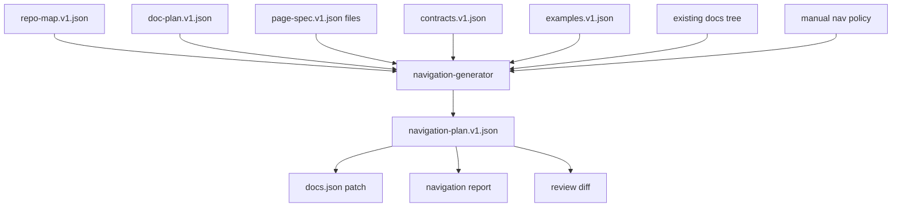
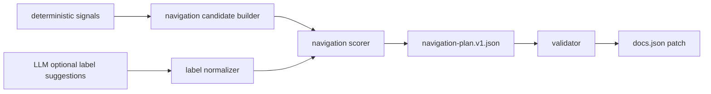
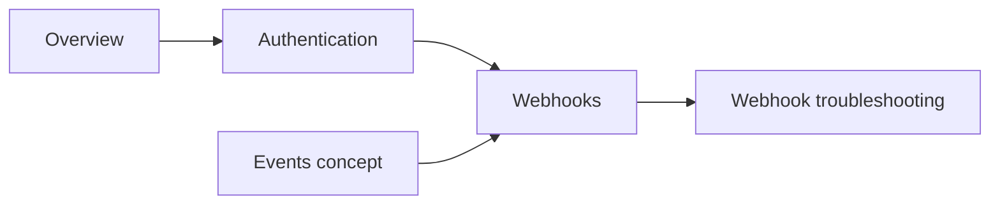

------
title: Build From Scratch: Mintlify-like AI-driven Documentation Generator CLI - Part 029
description: Build a deterministic, reviewable, source-grounded documentation navigation generator that turns page inventory, contracts, repository shape, and API specs into a clean Mintlify-like docs.json navigation model.
series: learn-ai-docs-km-cli
seriesTitle: Build From Scratch: Mintlify-like AI-driven Documentation Generator CLI with Code2Prompt and Open-source Knowledge Management
order: 29
partTitle: Navigation Generation
tags:
- ai-docs
- documentation
- cli
- navigation
- mintlify
- docs-json
- mdx
- information-architecture
date: 2026-07-04
---

# Part 029 — Navigation Generation

Navigation generation is where the documentation system stops being a pile of generated pages and becomes a usable product.

A weak documentation generator can create pages. A strong one can decide **where each page belongs**, **which page should be visible first**, **which pages should be grouped**, **which concepts need landing pages**, and **which generated page should stay hidden until it becomes trustworthy**.

In this part we build the navigation generator for our Mintlify-like documentation system.

The important distinction:

- page generation answers: “what should this page say?”
- navigation generation answers: “how should a developer move through this knowledge?”

If the navigation is wrong, the docs feel broken even when individual pages are accurate.

---

## 1. The Real Problem

Most auto-generated documentation fails because it treats navigation as a file tree.

That is almost always wrong.

A repository tree is optimized for maintainers and build systems:

```txt
src/
  handlers/
  services/
  repositories/
  schemas/
  utils/
openapi/
examples/
tests/
```

A docs navigation is optimized for readers:

```txt
Get started
  Overview
  Quickstart
  Installation

Guides
  Authentication
  Create a workspace
  Configure webhooks

API Reference
  Users
  Workspaces
  Webhooks

Concepts
  Projects
  Environments
  Permissions

Troubleshooting
  Common errors
  Deployment issues
```

The source tree describes **implementation ownership**.

The navigation describes **learning order and task order**.

A generator that mirrors `src/` into docs has already lost.

---

## 2. Navigation Is an Information Architecture Artifact

In this system, navigation is not an incidental JSON file. It is a first-class artifact produced from multiple sources:



The generator does not directly overwrite `docs.json` blindly.

It produces a proposed navigation plan first.

That plan is reviewed, validated, and then applied.

The invariant:

> Navigation generation must be deterministic, explainable, and reversible.

---

## 3. Target Output: Mintlify-like Navigation

Mintlify currently organizes documentation navigation in `docs.json` using structures such as groups, pages, dropdowns, tabs, and anchors. In our system, we will target a compatible mental model without making our internal engine dependent on one vendor-specific shape.

A simplified output might look like this:

```json
{
  "navigation": {
    "tabs": [
      {
        "tab": "Documentation",
        "groups": [
          {
            "group": "Get Started",
            "pages": [
              "overview",
              "quickstart",
              "installation"
            ]
          },
          {
            "group": "Guides",
            "pages": [
              "guides/authentication",
              "guides/webhooks",
              "guides/deployments"
            ]
          }
        ]
      },
      {
        "tab": "API Reference",
        "groups": [
          {
            "group": "Core API",
            "pages": [
              "api/users",
              "api/workspaces",
              "api/webhooks"
            ]
          }
        ]
      }
    ]
  }
}
```

But our internal navigation artifact is richer:

```json
{
  "schema": "navigation-plan.v1",
  "generatedAt": "2026-07-04T00:00:00Z",
  "strategy": "task-first",
  "siteKind": "developer-docs",
  "items": [
    {
      "id": "nav.get-started.quickstart",
      "type": "page",
      "title": "Quickstart",
      "path": "quickstart",
      "targetFile": "docs/quickstart.mdx",
      "section": "Get Started",
      "sourcePageSpec": ".aidocs/pages/quickstart.page-spec.json",
      "confidence": 0.93,
      "reason": [
        "page type is quickstart",
        "high priority in doc plan",
        "contains verified installation and first-success example"
      ],
      "visibility": "public",
      "ownership": "generated-with-human-review"
    }
  ],
  "diagnostics": []
}
```

`docs.json` is the rendered target.

`navigation-plan.v1.json` is the truth we can debug.

---

## 4. Why Not Ask the LLM to Generate the Navigation?

We can ask an LLM to suggest navigation, but the final navigation should not be raw model output.

Navigation has deterministic constraints:

- every listed page must exist,
- every visible page must pass verification,
- every API endpoint page must match a contract,
- every manual page must be preserved unless explicitly moved,
- every group must have a purpose,
- every page should appear once unless intentionally duplicated,
- every hidden page must have a reason.

LLMs are useful for naming and explaining.

They are dangerous as the sole source of structural truth.

So our design is hybrid:



The LLM can propose:

- better group names,
- concise page titles,
- reader-friendly ordering hints,
- missing landing page suggestions.

The deterministic engine decides:

- page existence,
- ordering rules,
- visibility,
- duplicates,
- safety,
- final application.

---

## 5. Inputs to the Navigation Generator

The navigation generator consumes the artifacts we built earlier.

### 5.1 `repo-map.v1.json`

Used to understand the repository shape:

- monorepo or single package,
- library or application,
- API service or SDK,
- CLI tool or UI app,
- package boundaries,
- examples directory,
- OpenAPI files,
- existing docs directory.

### 5.2 `doc-plan.v1.json`

Used to understand planned pages:

- page title,
- page type,
- intended audience,
- priority,
- dependency between pages,
- generation status,
- review status.

### 5.3 `page-spec.v1.json`

Used to determine whether a page is eligible for navigation:

- required sections,
- source refs,
- verification policy,
- visibility,
- manual/generated ownership,
- allowed claims.

### 5.4 `contracts.v1.json`

Used for API reference navigation:

- OpenAPI tags,
- endpoint groups,
- security schemes,
- schema groups,
- API versions.

### 5.5 Existing docs tree

Used to avoid destructive rewrites.

Existing docs might already have human-curated navigation. We preserve it unless the user explicitly chooses aggressive regeneration.

### 5.6 Manual policy

A project can provide navigation policy:

```yaml
navigation:
  strategy: task-first
  preserveManualOrder: true
  requireLandingPages: true
  maxGroupSize: 8
  hiddenPatterns:
    - "internal/**"
  preferredGroups:
    - Get Started
    - Guides
    - Concepts
    - API Reference
    - Troubleshooting
```

This lets teams keep editorial control.

---

## 6. Navigation Strategies

Different projects need different navigation strategies.

Do not hardcode one.

### 6.1 Task-first navigation

Best for products, APIs, platforms, and tools.

The reader thinks:

> I want to accomplish something.

Typical structure:

```txt
Get Started
Guides
Concepts
API Reference
Examples
Troubleshooting
```

This is usually the best default for developer products.

### 6.2 Concept-first navigation

Best for frameworks, protocols, libraries with deep mental models.

The reader thinks:

> I need to understand the model before using the tool.

Typical structure:

```txt
Introduction
Core Concepts
Architecture
Guides
Reference
Advanced Topics
```

### 6.3 API-first navigation

Best for API-only products.

The reader thinks:

> I need the endpoint, schema, or auth behavior.

Typical structure:

```txt
Overview
Authentication
API Reference
Webhooks
Errors
SDKs
```

### 6.4 Package-first navigation

Best for monorepos and SDK suites.

The reader thinks:

> I use this package or component.

Typical structure:

```txt
Packages
  Java SDK
  Node SDK
  CLI
  Terraform Provider
```

### 6.5 Operator-first navigation

Best for infrastructure and operational platforms.

The reader thinks:

> I need to deploy, configure, monitor, or fix it.

Typical structure:

```txt
Install
Configure
Deploy
Operate
Troubleshoot
Reference
```

---

## 7. Page Taxonomy Mapping

Each planned page has a type. Navigation generation maps page types into reader-facing sections.

Example mapping:

```json
{
  "overview": "Get Started",
  "quickstart": "Get Started",
  "installation": "Get Started",
  "concept": "Concepts",
  "guide": "Guides",
  "tutorial": "Tutorials",
  "api-reference": "API Reference",
  "cli-reference": "CLI Reference",
  "architecture": "Architecture",
  "troubleshooting": "Troubleshooting",
  "runbook": "Operations",
  "migration": "Migration",
  "release-note": "Releases"
}
```

But mapping alone is not enough.

Some pages behave differently depending on project type.

For a CLI project:

```txt
Commands
Configuration
Shell completion
Exit codes
```

might be more important than API reference.

For a hosted SaaS API:

```txt
Authentication
Pagination
Errors
Rate limits
Webhooks
```

must be first-class.

So mapping is strategy-aware.

---

## 8. The Navigation Candidate Model

A navigation candidate is a page or group that might appear in the sidebar.

```ts
type NavigationCandidate = {
  id: string;
  kind: "page" | "group" | "tab" | "anchor" | "dropdown";
  title: string;
  slug?: string;
  targetFile?: string;
  pageType?: string;
  priority: number;
  confidence: number;
  visibility: "public" | "internal" | "hidden";
  ownership: "manual" | "generated" | "hybrid";
  sources: SourceRef[];
  reasons: string[];
  risks: NavigationRisk[];
};
```

Examples:

```json
{
  "id": "candidate.page.quickstart",
  "kind": "page",
  "title": "Quickstart",
  "slug": "quickstart",
  "targetFile": "docs/quickstart.mdx",
  "pageType": "quickstart",
  "priority": 98,
  "confidence": 0.96,
  "visibility": "public",
  "ownership": "generated",
  "sources": [
    {
      "artifact": "doc-plan.v1.json",
      "id": "page.quickstart"
    }
  ],
  "reasons": [
    "quickstart page exists",
    "verified first success path",
    "required by default site skeleton"
  ],
  "risks": []
}
```

Candidates are not final. They are scored, grouped, sorted, validated, and possibly hidden.

---

## 9. Candidate Discovery Algorithm

The generator discovers candidates from all available artifacts.

Pseudo-code:

```ts
function discoverCandidates(input: NavigationInput): NavigationCandidate[] {
  const candidates: NavigationCandidate[] = [];

  for (const page of input.docPlan.pages) {
    candidates.push(candidateFromPagePlan(page));
  }

  for (const pageSpec of input.pageSpecs) {
    candidates.push(candidateFromPageSpec(pageSpec));
  }

  for (const apiGroup of input.contracts.apiGroups) {
    candidates.push(candidateFromApiGroup(apiGroup));
  }

  for (const existingPage of input.existingDocs.pages) {
    candidates.push(candidateFromExistingPage(existingPage));
  }

  return mergeEquivalentCandidates(candidates);
}
```

The merge step is important.

The same page can be discovered from multiple sources:

- `doc-plan.v1.json`,
- actual `docs/quickstart.mdx`,
- previous `docs.json`,
- generated page spec.

These should become one candidate with stronger confidence, not four duplicates.

---

## 10. Stable Navigation IDs

Navigation items need stable IDs independent from current title.

Bad ID:

```txt
Get Started / Quickstart
```

If title changes from “Quickstart” to “Start here”, the ID changes.

Better ID:

```txt
nav.page.quickstart
```

Or derived from the page stable ID:

```txt
page.quickstart
```

For API endpoints:

```txt
endpoint.GET./v1/users/{id}
```

For conceptual pages:

```txt
concept.authentication
```

Stable IDs are needed for:

- review decisions,
- conflict handling,
- historical drift tracking,
- manual overrides,
- navigation diff,
- ownership mapping.

---

## 11. Group Generation

Groups should represent reader intent, not implementation folders.

A group is valid if it passes at least one of these tests:

1. It represents a task cluster.
2. It represents a concept cluster.
3. It represents an API domain.
4. It represents a product/package boundary.
5. It represents an operational lifecycle stage.
6. It has enough pages to justify itself.
7. It improves scanability.

A group is suspicious if:

- it has only one weak page,
- it mirrors an internal folder name,
- it mixes unrelated page types,
- it uses implementation jargon,
- it becomes too large.

Example group sizing rule:

```yaml
navigation:
  minGroupPages: 2
  maxGroupPages: 8
  splitGroupWhenAbove: 10
```

Large group before splitting:

```txt
Guides
  Authentication
  Users
  Workspaces
  Projects
  Deployments
  Webhooks
  Environments
  Permissions
  Rate limits
  Error handling
  Pagination
  SDK setup
```

Better:

```txt
Guides
  Authentication
  Permissions
  Webhooks
  Error handling

Resources
  Users
  Workspaces
  Projects
  Environments

API Patterns
  Pagination
  Rate limits
```

---

## 12. Landing Page Detection

A section with multiple important children often needs a landing page.

Example:

```txt
Guides
  Authentication
  Webhooks
  Deployments
```

This is acceptable but weaker than:

```txt
Guides
  Overview
  Authentication
  Webhooks
  Deployments
```

The landing page explains:

- what the section covers,
- who should read it,
- recommended reading order,
- common tasks,
- links to child pages.

Landing page generation rule:

```ts
function needsLandingPage(group: NavGroup): boolean {
  return group.pages.length >= 3
    && group.importance >= 0.7
    && !group.hasOverviewPage
    && group.visibility === "public";
}
```

The generator should not silently invent the page. It should emit a proposed page operation:

```json
{
  "operation": "create-page",
  "pageType": "section-overview",
  "title": "Guides overview",
  "path": "guides/overview",
  "reason": "Guides contains 5 public pages and no landing page"
}
```

---

## 13. Ordering Strategy

Navigation order is a product decision.

A good default order follows the reader journey:

```txt
1. Why this exists
2. Install it
3. Get first success
4. Learn the mental model
5. Perform common tasks
6. Use the reference
7. Solve problems
8. Migrate or operate advanced cases
```

For developer docs:

```txt
Overview
Quickstart
Installation
Concepts
Guides
API Reference
Examples
Troubleshooting
Changelog
```

But some pages must override generic order.

`Authentication` often belongs before endpoint details.

`Errors` often belongs near API reference.

`Configuration` often belongs near installation for CLI/tools.

We encode this as ordered page roles:

```json
{
  "roleOrder": [
    "overview",
    "quickstart",
    "installation",
    "authentication",
    "configuration",
    "concept",
    "guide",
    "api-reference",
    "example",
    "troubleshooting",
    "migration",
    "changelog"
  ]
}
```

Final ordering score:

```txt
orderScore =
  roleWeight
  + priorityWeight
  + dependencyWeight
  + manualOrderWeight
  + popularityWeight
  - riskPenalty
```

---

## 14. Dependency-aware Ordering

Some pages should come before others because they define prerequisite concepts.

Example dependencies:

```json
{
  "page": "guides/webhooks",
  "dependsOn": [
    "concepts/events",
    "guides/authentication"
  ]
}
```

This creates an ordering graph:



Ordering must respect dependencies where possible.

If dependencies conflict with manual order, the generator should warn, not silently reorder everything.

Diagnostic example:

```json
{
  "severity": "warning",
  "code": "NAV_DEPENDENCY_AFTER_DEPENDENT",
  "message": "guides/webhooks appears before concepts/events, but webhooks depends on events",
  "suggestion": "Move concepts/events earlier or add inline concept summary to webhooks"
}
```

---

## 15. Navigation Scoring

Each candidate receives several scores.

### 15.1 Importance score

How important is the page for readers?

Signals:

- page priority in doc plan,
- referenced by many pages,
- covers public API,
- covers installation/auth/errors,
- appears in README,
- has examples,
- maps to high-traffic endpoint or command.

### 15.2 Readiness score

Is the page safe to show?

Signals:

- file exists,
- frontmatter valid,
- verifier passed,
- source refs valid,
- examples verified,
- links valid,
- no high-risk diagnostics.

### 15.3 Confidence score

How confident are we that this page belongs in this group?

Signals:

- page type mapping,
- manual override,
- previous nav location,
- title similarity,
- contract tag,
- semantic cluster.

### 15.4 Risk score

What can go wrong if we expose this page?

Signals:

- generated but unreviewed,
- contains low-grounding claims,
- incomplete examples,
- internal-only content,
- experimental endpoint,
- outdated drift status.

Visibility decision:

```ts
function decideVisibility(page: PageCandidate): Visibility {
  if (page.policy.hidden) return "hidden";
  if (page.riskScore > 0.8) return "hidden";
  if (page.readinessScore < 0.6) return "draft";
  if (page.visibility === "internal") return "internal";
  return "public";
}
```

---

## 16. Manual Overrides

Human editorial control is essential.

Manual policy can pin pages:

```yaml
navigation:
  pinned:
    - path: overview
      group: Get Started
      order: 1
    - path: quickstart
      group: Get Started
      order: 2
  hidden:
    - path: internal/*
  aliases:
    "Authentication and authorization": "Authentication"
```

Manual overrides should be explicit and auditable.

Do not hide them inside generated JSON.

Recommended files:

```txt
docs.json
.aidocs/navigation-policy.yml
.aidocs/navigation-plan.v1.json
.aidocs/navigation-review.v1.json
```

The policy file belongs to humans.

The plan file belongs to the generator.

---

## 17. Existing Navigation Preservation

If the project already has `docs.json`, the generator should preserve it unless told otherwise.

Modes:

```txt
conservative  preserve existing groups and only add missing pages
balanced      preserve manual groups but allow generated additions and warnings
aggressive    regenerate navigation from doc plan and repo signals
```

Default should be conservative or balanced.

Never default to aggressive.

Preservation algorithm:

```ts
function mergeWithExistingNav(existing: NavTree, proposed: NavTree): NavTree {
  const result = clone(existing);

  for (const proposedItem of proposed.items) {
    if (existing.containsStableId(proposedItem.id)) {
      result.updateMetadataOnly(proposedItem);
      continue;
    }

    const insertionPoint = findBestInsertionPoint(result, proposedItem);
    result.insert(insertionPoint, proposedItem);
  }

  return result;
}
```

Important: “metadata only” means do not randomly rename or move a human-curated page.

---

## 18. Duplicate Detection

Duplicate navigation entries confuse users.

Examples:

```txt
API Reference
  Users
Resources
  Users
Guides
  Users API
```

Some duplication is valid if one page is a guide and one page is reference.

Bad duplication:

```txt
API Reference / Users
API / User endpoints
```

where both point to the same reference content.

Duplicate signals:

- same target file,
- same canonical page ID,
- same endpoint group,
- high title similarity,
- same source contract,
- same content hash.

Diagnostic:

```json
{
  "severity": "error",
  "code": "NAV_DUPLICATE_CANONICAL_PAGE",
  "message": "Page api/users appears twice in navigation",
  "locations": [
    "API Reference > Users",
    "Resources > Users"
  ]
}
```

---

## 19. Orphan Detection

An orphan page exists but is not reachable from navigation.

Orphans are not always bad.

Valid hidden pages:

- redirect targets,
- draft pages,
- internal pages,
- generated fragments,
- private runbooks,
- versioned legacy pages.

Suspicious orphans:

- public guide page,
- generated quickstart,
- API reference page,
- troubleshooting page with high importance,
- concept page referenced by multiple pages.

Orphan report:

```json
{
  "orphans": [
    {
      "path": "guides/webhooks",
      "targetFile": "docs/guides/webhooks.mdx",
      "importance": 0.83,
      "reason": "public guide page not present in navigation",
      "suggestion": "Add to Guides group after Authentication"
    }
  ]
}
```

Orphan detection is one of the highest-value checks in docs automation.

---

## 20. Broken Navigation Detection

A navigation entry is broken if it points to a missing page.

Example:

```json
{
  "pages": [
    "guides/authentication",
    "guides/webhooks"
  ]
}
```

But file missing:

```txt
docs/guides/webhooks.mdx does not exist
```

The generator should catch this before preview/build.

Rules:

- Every page path must resolve to exactly one file.
- Every file extension must be supported.
- Case must match exactly for case-sensitive file systems.
- Redirects must be explicit.
- Generated API pages delegated to OpenAPI must be resolved differently from MDX pages.

Diagnostic:

```json
{
  "severity": "error",
  "code": "NAV_TARGET_NOT_FOUND",
  "path": "guides/webhooks",
  "expected": "docs/guides/webhooks.mdx"
}
```

---

## 21. API Reference Navigation

API reference navigation needs special handling.

For OpenAPI, endpoints are often tagged:

```yaml
paths:
  /users:
    get:
      tags:
        - Users
  /workspaces:
    get:
      tags:
        - Workspaces
```

The tag can map to nav groups:

```txt
API Reference
  Users
  Workspaces
```

But tags are not always reader-friendly.

Bad tags:

```txt
user-controller
internal-controller-v2
misc
```

So the generator should normalize tags:

```ts
function normalizeApiTag(tag: string): string {
  return tag
    .replace(/controller$/i, "")
    .replace(/[-_]/g, " ")
    .trim()
    .replace(/\b\w/g, c => c.toUpperCase());
}
```

Better:

```txt
user-controller -> Users
internal-controller-v2 -> Internal V2 or hidden, depending policy
```

API grouping can be based on:

- OpenAPI tags,
- path prefixes,
- resource nouns,
- security schemes,
- version prefixes,
- bounded contexts.

Ranking rule:

```txt
OpenAPI tag > explicit policy > path prefix > inferred resource noun
```

---

## 22. CLI Reference Navigation

For CLI projects, command hierarchy drives navigation.

Example command tree:

```txt
aidocs
  init
  scan
  context
  plan
  generate
  verify
  review
  publish
  km sync
```

Possible navigation:

```txt
CLI Reference
  init
  scan
  context
  plan
  generate
  verify
  review
  publish
  km sync
```

But for human reading, we often want lifecycle grouping:

```txt
CLI Reference
  Project setup
    init
  Repository analysis
    scan
    map
    symbols
  AI generation
    context
    plan
    generate
  Quality
    verify
    review
  Publishing
    preview
    publish
  Knowledge management
    km sync
```

This is better because it teaches workflow, not just command list.

---

## 23. Monorepo Navigation

Monorepos need careful navigation.

Bad:

```txt
packages
  api
  web
  sdk-js
  sdk-java
  cli
```

Better:

```txt
Products
  API Service
  Web App
  JavaScript SDK
  Java SDK
  CLI
```

Or for platform teams:

```txt
Platform
  Overview
  Architecture
  Services
  Shared Libraries
  Deployment
  Runbooks
```

Monorepo grouping dimensions:

- product,
- package,
- service,
- team ownership,
- runtime layer,
- user journey,
- API surface.

Do not assume `packages/*` is the right public structure.

Use repo-map signals and docs policy.

---

## 24. Versioned Documentation Navigation

Versioned docs introduce a second dimension.

Example:

```txt
v2
  Get Started
  Guides
  API Reference
v1
  Get Started
  Guides
  API Reference
```

Versioned navigation rules:

- current version should be default,
- legacy versions should be clearly marked,
- pages should not cross-link to wrong version unless intentional,
- API specs should map to matching version,
- generated pages should include version provenance.

Version artifact:

```json
{
  "versions": [
    {
      "id": "v2",
      "label": "v2",
      "status": "current",
      "docsRoot": "docs/v2",
      "openapi": "openapi/v2.yaml"
    },
    {
      "id": "v1",
      "label": "v1",
      "status": "legacy",
      "docsRoot": "docs/v1",
      "openapi": "openapi/v1.yaml"
    }
  ]
}
```

Navigation generation becomes version-aware.

---

## 25. Internal vs Public Navigation

Our system has two knowledge surfaces:

1. public documentation,
2. internal knowledge notes.

Do not leak internal knowledge into public nav.

Each page must have visibility:

```ts
type Visibility = "public" | "internal" | "private" | "draft" | "hidden";
```

Rules:

- `public` can appear in external docs navigation.
- `internal` can appear in internal docs navigation.
- `private` should not be rendered to docs site.
- `draft` can appear only in preview mode.
- `hidden` exists as an artifact but is not linked.

Visibility is especially important when syncing with Logseq/OpenNote.

Internal architecture notes are useful.

They are not always publishable.

---

## 26. Navigation Lint Rules

Navigation should be linted before application.

Core rules:

```txt
NAV001 every page target exists
NAV002 every public page is reachable
NAV003 no duplicate canonical page unless allowed
NAV004 group size within threshold
NAV005 top-level sections follow policy order
NAV006 no internal page in public navigation
NAV007 every API reference entry maps to known contract
NAV008 every generated page in public nav passed verifier
NAV009 every group with many pages has landing page or suppression
NAV010 no empty group
NAV011 no broken case-sensitive path
NAV012 no title collision in same group
NAV013 no stale page with blocking drift
NAV014 no draft page in production navigation
```

Lint output:

```txt
aidocs nav lint

error NAV001: guides/webhooks points to missing file docs/guides/webhooks.mdx
warning NAV009: Guides has 7 pages and no landing page
warning NAV012: Two pages titled "Authentication" under Guides
```

Lint rules convert vague docs quality into enforceable checks.

---

## 27. Navigation Plan Schema

A practical schema:

```json
{
  "schema": "navigation-plan.v1",
  "site": {
    "kind": "developer-docs",
    "strategy": "task-first",
    "visibility": "public"
  },
  "sources": {
    "docPlanHash": "sha256:...",
    "pageIndexHash": "sha256:...",
    "contractHash": "sha256:...",
    "existingDocsJsonHash": "sha256:..."
  },
  "tree": {
    "kind": "root",
    "children": [
      {
        "kind": "group",
        "id": "group.get-started",
        "title": "Get Started",
        "children": [
          {
            "kind": "page",
            "id": "page.overview",
            "title": "Overview",
            "path": "overview",
            "targetFile": "docs/overview.mdx"
          }
        ]
      }
    ]
  },
  "operations": [],
  "diagnostics": []
}
```

The navigation plan is not just a tree. It also contains operations.

Example operations:

```json
{
  "operations": [
    {
      "type": "insert-page",
      "page": "guides/webhooks",
      "group": "Guides",
      "after": "guides/authentication",
      "reason": "public guide page exists but is not reachable"
    },
    {
      "type": "create-landing-page",
      "page": "guides/overview",
      "group": "Guides",
      "reason": "group has 6 pages and no overview"
    }
  ]
}
```

Operations are useful for review.

A reviewer wants to know what changed, not just see the final JSON.

---

## 28. Rendering to `docs.json`

The internal nav tree must be rendered to the target docs config.

Simplified renderer:

```ts
function renderDocsJson(plan: NavigationPlan, existing: DocsJson): DocsJson {
  const output = structuredClone(existing);
  output.navigation = renderNavigationNode(plan.tree);
  return output;
}
```

Renderer rules:

- preserve unrelated settings,
- preserve manual comments if possible when using comment-preserving parser,
- avoid reformatting entire file unnecessarily,
- output stable key order,
- keep diff small,
- never delete unknown top-level settings.

Bad renderer:

```ts
writeFile("docs.json", JSON.stringify(newDocsJson, null, 2));
```

This can rewrite the whole file and destroy human formatting.

Better:

- parse,
- patch only `navigation`,
- preserve unknown keys,
- stable sort generated sections,
- show diff before apply.

---

## 29. Review UX

Command:

```bash
aidocs nav plan
```

Output:

```txt
Navigation plan generated

Strategy: task-first
Existing docs.json: detected
Mode: balanced

Proposed changes:
  + Add guides/webhooks to Guides after guides/authentication
  + Add api/webhooks to API Reference > Webhooks
  ! Guides has 6 pages and no landing page
  ! concepts/events is referenced but not in navigation

Run:
  aidocs nav diff
  aidocs nav apply
```

Diff:

```diff
 {
   "navigation": {
     "groups": [
       {
         "group": "Guides",
         "pages": [
           "guides/authentication",
+          "guides/webhooks",
           "guides/deployments"
         ]
       }
     ]
   }
 }
```

Apply:

```bash
aidocs nav apply --mode balanced
```

Human review remains the default path.

---

## 30. CLI Commands

Recommended commands:

```bash
# Build navigation plan without modifying docs.json
aidocs nav plan

# Show proposed changes
aidocs nav diff

# Validate existing docs.json and generated nav plan
aidocs nav lint

# Apply proposed changes
aidocs nav apply

# Explain why a page is placed somewhere
aidocs nav explain guides/webhooks

# List orphan pages
aidocs nav orphans

# List duplicate/suspicious pages
aidocs nav duplicates
```

`explain` is especially important.

Example:

```bash
aidocs nav explain guides/webhooks
```

Output:

```txt
guides/webhooks

Placement:
  Guides > Webhooks

Reasons:
  - page type: guide
  - source contract: webhook events detected
  - depends on authentication, placed after Authentication
  - verified examples: 2
  - existing docs group: none

Confidence: 0.88
Risk: low
```

This is how the tool becomes trustworthy.

---

## 31. Minimal Implementation

A minimal implementation can be surprisingly small if earlier artifacts are good.

```ts
export async function generateNavigation(input: NavigationInput): Promise<NavigationPlan> {
  const candidates = discoverCandidates(input);
  const scored = candidates.map(candidate => scoreCandidate(candidate, input.policy));
  const visible = scored.filter(candidate => isNavigable(candidate, input.policy));
  const grouped = groupCandidates(visible, input.policy);
  const ordered = orderGroupsAndPages(grouped, input.policy);
  const merged = mergeWithExistingNavigation(ordered, input.existingNavigation, input.policy);
  const diagnostics = lintNavigation(merged, input);

  return {
    schema: "navigation-plan.v1",
    site: inferSiteMetadata(input),
    sources: buildSourceHashes(input),
    tree: merged,
    diagnostics,
    operations: deriveOperations(input.existingNavigation, merged)
  };
}
```

The implementation only works well if each function is explainable.

Avoid black-box scoring.

---

## 32. Testing Navigation Generation

Test fixtures should cover:

### 32.1 Empty docs project

Input:

```txt
README.md
src/index.ts
```

Expected:

```txt
Overview
Quickstart or Installation suggestion
```

### 32.2 Existing docs project

Ensure manual nav is preserved.

### 32.3 OpenAPI project

Ensure API groups map from tags/path prefixes.

### 32.4 CLI project

Ensure command docs go under CLI Reference.

### 32.5 Monorepo project

Ensure packages do not blindly mirror folder names.

### 32.6 Broken nav

Ensure missing page is error.

### 32.7 Internal content

Ensure internal pages do not appear in public nav.

Snapshot tests are useful, but do not only snapshot raw JSON. Also assert diagnostics and operations.

---

## 33. Common Failure Modes

### Failure 1: File tree becomes navigation

Symptom:

```txt
src
handlers
services
repositories
```

Fix:

Use reader journey, page taxonomy, and task-first grouping.

### Failure 2: Every generated page is public

Symptom:

Incomplete or low-confidence pages appear in sidebar.

Fix:

Use readiness score and review status.

### Failure 3: API docs are duplicated

Symptom:

Same endpoint appears as guide, reference, and generated page.

Fix:

Separate narrative guide from API reference.

### Failure 4: Human navigation gets overwritten

Symptom:

Developers stop trusting the tool.

Fix:

Default to conservative merge and review-first apply.

### Failure 5: Group names reflect implementation jargon

Symptom:

Users see `UserController`, `CoreModule`, `services`, `utils`.

Fix:

Normalize labels and prefer product language.

### Failure 6: No orphan detection

Symptom:

Important pages exist but nobody can find them.

Fix:

Run `aidocs nav orphans` in CI.

---

## 34. Production Invariants

Navigation generation should obey these invariants:

1. No public nav entry points to a missing page.
2. No unreviewed high-risk generated page appears in production nav.
3. No internal/private page appears in public nav.
4. Existing manual navigation is preserved unless policy allows changes.
5. Every proposed move is explainable.
6. Every orphan public page is reported.
7. Every duplicate canonical page is reported.
8. Every large group has a landing page or suppression.
9. API reference pages map to known contracts.
10. `docs.json` changes are diffable and minimal.

These are not style preferences. They are trust guarantees.

---

## 35. How This Fits the Bigger System

By the end of this part, we have a proper bridge from generated content to published documentation structure.

Previous artifacts:

```txt
repo-map.v1.json
symbols.v1.json
contracts.v1.json
examples.v1.json
doc-plan.v1.json
page-spec.v1.json
verify-report.v1.json
```

New artifacts:

```txt
navigation-plan.v1.json
navigation-policy.yml
navigation-report.v1.json
docs.json patch
```

The system can now answer:

- What pages exist?
- Which pages should be public?
- Which pages belong together?
- Which pages are missing from navigation?
- Which groups are too large?
- Which manual choices must be preserved?
- Which pages are unsafe to expose?

That is the difference between generating text and building documentation infrastructure.

---

## 36. References

- Mintlify documentation, navigation and `docs.json`: https://www.mintlify.com/docs/organize/navigation
- Mintlify `docs.json` settings reference: https://www.mintlify.com/docs/organize/settings-reference
- Diátaxis documentation framework: https://diataxis.fr/
- Mermaid documentation: https://mermaid.js.org/

---

## 37. What Comes Next

Part 030 builds the rendering and static output layer.

Navigation generation produces the map.

Rendering turns MDX pages, diagrams, assets, search indexes, and docs config into a previewable and publishable site artifact.
