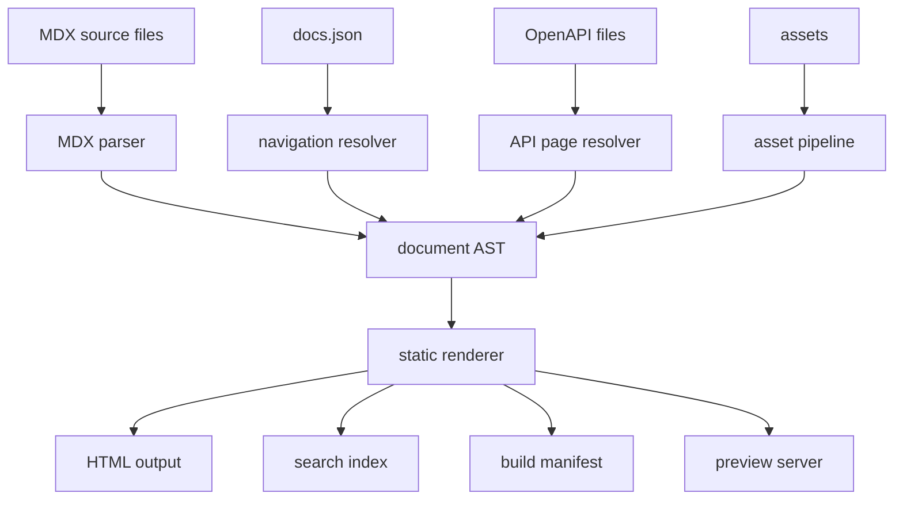
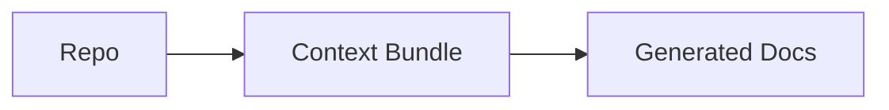

------
title: Build From Scratch: Mintlify-like AI-driven Documentation Generator CLI - Part 030
description: Build the MDX rendering and static site output layer for an AI-generated documentation system, including rendering pipeline, validation, assets, diagrams, search index, preview server, and build artifacts.
series: learn-ai-docs-km-cli
seriesTitle: Build From Scratch: Mintlify-like AI-driven Documentation Generator CLI with Code2Prompt and Open-source Knowledge Management
order: 30
partTitle: MDX Rendering and Static Site Output
tags:
- ai-docs
- documentation
- cli
- mdx
- static-site
- rendering
- mermaid
- search
- mintlify
date: 2026-07-04
---

# Part 030 — MDX Rendering and Static Site Output

At this point the system can understand a repository, create context bundles, plan docs, generate MDX pages, verify them, and produce navigation.

Now we need to render the documentation into something developers can actually inspect.

This part builds the rendering and static output layer.

The key idea:

> AI writes proposed source artifacts. The renderer builds deterministic site artifacts.

Do not let the LLM be responsible for final rendering behavior.

Rendering must be boring, strict, repeatable, and testable.

---

## 1. What the Renderer Does

The renderer consumes docs source artifacts:

```txt
docs/**/*.mdx
docs.json
openapi/**/*.yaml
assets/**/*
.aidocs/navigation-plan.v1.json
.aidocs/verify-report.v1.json
```

and produces build artifacts:

```txt
.aidocs/build/
  html/
  assets/
  search/
  manifests/
  reports/
```

A simplified flow:



The renderer does not decide what the docs should say. That was already decided by the authoring pipeline.

The renderer decides whether the docs can be converted into a site reliably.

---

## 2. Source Artifacts vs Build Artifacts

Separate source from output.

Source artifacts are reviewed and committed:

```txt
docs/overview.mdx
docs/guides/authentication.mdx
docs.json
openapi/public.yaml
```

Build artifacts are generated and usually not committed:

```txt
.aidocs/build/html/index.html
.aidocs/build/search/pagefind/
.aidocs/build/manifests/build-manifest.json
```

This separation matters because:

- source artifacts need human review,
- build artifacts need reproducibility,
- CI needs deterministic outputs,
- preview needs fast incremental rebuilds,
- generated HTML should not become the editing surface.

Invariant:

> The canonical editable documentation remains MDX plus config, not generated HTML.

---

## 3. Why MDX Rendering Is Harder Than Markdown Rendering

Plain Markdown is mostly content.

MDX is content plus components.

MDX allows JSX inside Markdown. That gives power, but also complexity:

```mdx
# Quickstart

<Warning>
This feature is experimental.
</Warning>

<Tabs>
  <Tab title="npm">
    ```bash
    npm install @acme/sdk
    ```
  </Tab>
  <Tab title="pnpm">
    ```bash
    pnpm add @acme/sdk
    ```
  </Tab>
</Tabs>
```

Rendering this requires:

- parsing Markdown,
- parsing JSX,
- resolving components,
- validating component props,
- transforming code fences,
- rendering safely,
- producing static HTML or framework-compatible output.

The authoring engine from Part 019 restricted allowed components. The renderer enforces that restriction.

---

## 4. Renderer Design Options

There are three practical rendering modes.

### 4.1 Delegated rendering mode

The CLI validates and prepares docs, then delegates actual preview/build to an existing platform such as Mintlify or another docs framework.

Pros:

- less implementation work,
- closer to production platform,
- uses mature renderer.

Cons:

- less control,
- harder to inspect internals,
- platform behavior can change,
- not fully portable.

### 4.2 Embedded static renderer mode

The CLI ships its own renderer.

Pros:

- deterministic,
- portable,
- easy to test,
- works offline.

Cons:

- more work,
- must implement components/search/navigation,
- may not match external platform exactly.

### 4.3 Hybrid mode

The CLI has a strict local renderer for validation and preview, but can also export compatible docs for Mintlify-like publishing.

This is the best design for our system.

```txt
aidocs preview   -> local renderer
aidocs build     -> local deterministic static output
aidocs export    -> Mintlify-like docs project
aidocs publish   -> configured publisher adapter
```

---

## 5. Build Pipeline Stages

A production-grade renderer should be staged.

```mermaid
flowchart LR
    A[load project] --> B[validate config]
    B --> C[resolve navigation]
    C --> D[parse MDX]
    D --> E[validate components]
    E --> F[transform AST]
    F --> G[render pages]
    G --> H[copy assets]
    H --> I[render diagrams]
    I --> J[build search index]
    J --> K[write manifest]
    K --> L[emit report]
```



Each stage produces diagnostics.

Do not collapse this into “build failed.”

A developer needs to know whether the failure came from:

- invalid frontmatter,
- broken JSX,
- unknown component,
- broken internal link,
- Mermaid syntax error,
- missing asset,
- search index failure,
- bad `docs.json`,
- OpenAPI rendering error.

---

## 6. Project Loader

The project loader resolves the documentation root.

Input:

```bash
aidocs build
```

Resolution order:

1. explicit `--root`,
2. current directory with `docs.json`,
3. current directory with `docs/`,
4. repository root detected from Git,
5. configured docs root in `.aidocs/config.yml`.

Project model:

```ts
type DocsProject = {
  rootDir: string;
  docsDir: string;
  configPath: string;
  openapiDir?: string;
  assetsDir?: string;
  internalDir: string;
  buildDir: string;
};
```

The loader should not search endlessly.

It should explain what it detected.

```txt
Detected docs project
  root: /repo
  config: /repo/docs.json
  docs: /repo/docs
  build: /repo/.aidocs/build
```

---

## 7. Config Validation

Before parsing pages, validate the site config.

Example checks:

- `docs.json` exists,
- JSON is valid,
- navigation structure is valid,
- referenced pages exist,
- duplicate paths are reported,
- unknown top-level fields are preserved but warned if suspicious,
- OpenAPI references resolve.

Minimal config schema:

```ts
type DocsJson = {
  name?: string;
  navigation?: NavigationConfig;
  openapi?: string | string[];
  theme?: Record<string, unknown>;
  redirects?: Redirect[];
  [unknown: string]: unknown;
};
```

Never reject unknown fields too aggressively if targeting compatibility with an external platform.

Validation should distinguish:

```txt
error    cannot build
warning  can build but likely wrong
info     useful context
```

---

## 8. MDX Parse Stage

Each MDX file is parsed into an AST-like document model.

Internal model:

```ts
type MdxDocument = {
  id: string;
  sourcePath: string;
  routePath: string;
  frontmatter: Frontmatter;
  headings: Heading[];
  imports: ImportNode[];
  exports: ExportNode[];
  components: ComponentUsage[];
  codeBlocks: CodeBlock[];
  links: LinkRef[];
  mermaidBlocks: MermaidBlock[];
  ast: unknown;
  diagnostics: Diagnostic[];
};
```

We do not need to expose the raw AST everywhere.

Most downstream stages need normalized facts:

- headings,
- links,
- code blocks,
- component usages,
- route path,
- source map.

---

## 9. Frontmatter Validation

Every page should have frontmatter.

For this series, our generated pages use:

```yaml
------
title: ...
description: ...
series: ...
seriesTitle: ...
order: ...
partTitle: ...
tags:
- ...
date: 2026-07-04
---
```

In a real docs product, fields may be:

```yaml
---
title: Authentication
description: Learn how authentication works.
visibility: public
owner: platform-auth
sourceRefs:
  - contracts.openapi.public
---
```

Validation rules:

- title required,
- description recommended,
- visibility required for generated docs,
- owner recommended,
- date parseable,
- tags must be array,
- no secret-like values,
- no unsupported object unless allowed.

Frontmatter controls navigation, search, and preview metadata. Treat it as structured data, not decoration.

---

## 10. Component Allowlist

Because MDX can execute JSX in many environments, our renderer must enforce a component allowlist.

Example allowlist:

```yaml
components:
  allowed:
    - Note
    - Warning
    - Tip
    - Tabs
    - Tab
    - Card
    - CardGroup
    - Accordion
    - Steps
    - CodeGroup
```

Unknown component:

```mdx
<DeleteProductionDatabase />
```

Diagnostic:

```json
{
  "severity": "error",
  "code": "MDX_UNKNOWN_COMPONENT",
  "message": "Component DeleteProductionDatabase is not allowed",
  "file": "docs/guide.mdx"
}
```

Do not execute arbitrary components in local preview.

A docs renderer should not become an arbitrary code execution surface.

---

## 11. Component Normalization

Different documentation platforms use different component names.

The authoring layer may produce generic components:

```mdx
<Callout type="warning">
Be careful when rotating keys.
</Callout>
```

The Mintlify-like export layer may render:

```mdx
<Warning>
Be careful when rotating keys.
</Warning>
```

The local renderer may render:

```html
<div class="callout callout-warning">...</div>
```

So we define a component IR:

```ts
type ComponentIR = {
  kind: "callout" | "tabs" | "card" | "steps" | "accordion";
  variant?: string;
  props: Record<string, unknown>;
  children: RenderNode[];
};
```

This prevents the system from coupling internal docs semantics to one platform’s component syntax.

---

## 12. Code Fence Transformation

Code fences need more than syntax highlighting.

We need metadata:

```mdx
```bash title="Install"
npm install @acme/sdk
```
```

Internal model:

```ts
{
  "language": "bash",
  "title": "Install",
  "contentHash": "sha256:...",
  "source": "generated",
  "verified": true,
  "exampleId": "example.cli.install"
}
```

Renderer responsibilities:

- syntax highlighting,
- title rendering,
- copy button,
- line wrapping policy,
- optional line highlighting,
- verified/unverified badge in preview mode,
- link back to example artifact.

Never let generated snippets appear identical to verified snippets in review mode.

---

## 13. Mermaid Rendering

Mermaid diagrams are plain text definitions rendered into diagrams. That makes them excellent for version-controlled docs.

Example:

````mdx

````

Renderer options:

1. client-side render with Mermaid JS,
2. build-time render to SVG,
3. preview-time render only,
4. hybrid.

For deterministic builds, prefer build-time validation even if rendering happens client-side.

Mermaid block model:

```ts
type MermaidBlock = {
  id: string;
  diagramType: "flowchart" | "sequenceDiagram" | "classDiagram" | "stateDiagram" | "unknown";
  source: string;
  sourceMap: SourceLocation;
  validation: "passed" | "failed" | "skipped";
};
```

Validation rules:

- diagram type recognized,
- syntax parseable,
- no obviously fake nodes from low-grounding source,
- diagram does not contain internal/private names if public page,
- diagram length within threshold.

---

## 14. Internal Link Resolution

Internal links are a major source of docs rot.

Example links:

```mdx
See [Authentication](../guides/authentication).
See [API errors](/api/errors).
```

Resolver responsibilities:

- normalize relative paths,
- resolve route paths,
- resolve anchors,
- detect missing targets,
- detect case mismatch,
- detect links to private pages from public pages,
- update links after generated moves.

Route model:

```ts
{
  "file": "docs/guides/webhooks.mdx",
  "route": "/guides/webhooks",
  "anchors": [
    "overview",
    "configure-webhooks",
    "verify-signatures"
  ]
}
```

Anchor generation must be stable.

If heading changes, the anchor may change. To reduce breakage, support explicit anchors:

```mdx
## Verify signatures {#verify-signatures}
```

or maintain redirect/alias metadata.

---

## 15. External Link Handling

External links should be checked, but carefully.

Problems:

- rate limits,
- flaky networks,
- sites blocking bots,
- private docs requiring auth,
- CI without internet,
- temporary outages.

Modes:

```txt
none      do not check external links
fast      validate URL format only
online    perform network checks
cached    reuse previous status when fresh
```

Default local mode can be `fast`.

CI can use `cached` or `online` depending on policy.

Do not make every build fail because one vendor page returned transient `503`.

Use severity policy.

---

## 16. Asset Pipeline

Docs pages may reference assets:

```mdx

```

Asset pipeline responsibilities:

- verify file exists,
- copy to build output,
- fingerprint when needed,
- enforce size limits,
- warn on huge images,
- validate alt text,
- detect unused assets,
- prevent path traversal.

Asset manifest:

```json
{
  "assets": [
    {
      "source": "docs/images/architecture.png",
      "output": "assets/architecture.8df31.png",
      "sizeBytes": 182341,
      "referencedBy": ["docs/architecture/overview.mdx"],
      "altTextPresent": true
    }
  ]
}
```

Security rule:

> A docs build should never read or copy files outside the project boundary unless explicitly configured.

---

## 17. Search Index Generation

A documentation site without search becomes painful as it grows.

For static sites, one strong option is to build a static search index. Pagefind is an example of a static search library designed to work with static HTML output without requiring hosted infrastructure.

Our renderer should expose a search indexing stage, even if the default implementation is simple.

Search document model:

```ts
type SearchDocument = {
  id: string;
  title: string;
  description?: string;
  route: string;
  headings: string[];
  bodyText: string;
  tags: string[];
  visibility: "public" | "internal";
  sourceFile: string;
};
```

Indexing rules:

- exclude private pages,
- exclude draft pages in production build,
- strip code blocks if too noisy or index them separately,
- include headings with higher weight,
- include tags,
- include API endpoint method/path as searchable text,
- include synonyms from knowledge graph where available.

Example:

```json
{
  "title": "Create a workspace",
  "route": "/guides/create-workspace",
  "headings": ["Overview", "Request", "Response", "Errors"],
  "tags": ["workspace", "api", "guide"]
}
```

Search is not just UX. It is also a quality signal. If search results are bad, page titles and headings are probably bad.

---

## 18. Page Rendering

The renderer turns document IR into HTML.

A simple HTML page template:

```html
<!doctype html>
<html lang="en">
  <head>
    <meta charset="utf-8" />
    <title>{{title}}</title>
    <meta name="description" content="{{description}}" />
    <link rel="stylesheet" href="/assets/site.css" />
  </head>
  <body>
    <aside>{{navigation}}</aside>
    <main>{{content}}</main>
    <script src="/assets/site.js"></script>
  </body>
</html>
```

Local renderer does not need to be beautiful first.

It needs to be correct, inspectable, and fast.

Minimum viable page features:

- title,
- description,
- sidebar navigation,
- table of contents,
- headings,
- paragraphs,
- code blocks,
- callouts,
- tabs,
- internal links,
- Mermaid diagrams,
- previous/next links,
- build diagnostics overlay in preview mode.

---

## 19. Table of Contents Generation

Each page should have a local table of contents based on headings.

Rules:

- `h1` comes from page title,
- include `h2` and optionally `h3`,
- ignore headings inside tabs if policy says so,
- stable slug generation,
- detect duplicate headings,
- support explicit anchors.

TOC model:

```json
{
  "page": "guides/authentication",
  "items": [
    {
      "level": 2,
      "title": "Authentication model",
      "anchor": "authentication-model"
    },
    {
      "level": 2,
      "title": "API keys",
      "anchor": "api-keys"
    }
  ]
}
```

Duplicate heading diagnostic:

```json
{
  "severity": "warning",
  "code": "DUPLICATE_HEADING_ANCHOR",
  "message": "Two headings produce anchor #configuration"
}
```

---

## 20. Build Manifest

Every build should produce a manifest.

```json
{
  "schema": "build-manifest.v1",
  "builtAt": "2026-07-04T00:00:00Z",
  "inputHashes": {
    "docsJson": "sha256:...",
    "navigationPlan": "sha256:...",
    "pageIndex": "sha256:..."
  },
  "pages": [
    {
      "source": "docs/quickstart.mdx",
      "route": "/quickstart",
      "output": ".aidocs/build/html/quickstart/index.html",
      "hash": "sha256:...",
      "diagnostics": []
    }
  ],
  "assets": [],
  "search": {
    "enabled": true,
    "documents": 42
  },
  "diagnostics": []
}
```

The manifest enables:

- incremental builds,
- reproducibility checks,
- CI reports,
- preview debugging,
- publish diffing,
- cache invalidation.

---

## 21. Incremental Rendering

Rendering everything on every change becomes slow.

Incremental renderer input:

- file content hash,
- dependency graph,
- navigation hash,
- theme/component hash,
- build options.

A page must rebuild if:

- the page file changed,
- navigation changed and affects sidebar/prev-next,
- linked page anchors changed,
- shared component changed,
- theme changed,
- asset it uses changed,
- search indexing options changed.

Dependency model:

```json
{
  "docs/guides/webhooks.mdx": {
    "dependsOn": [
      "docs.json",
      "docs/guides/authentication.mdx#anchors",
      "assets/site.css",
      "components/Callout"
    ]
  }
}
```

Do not only hash the MDX file. The rendered page depends on more than the file content.

---

## 22. Preview Server

Preview server is the developer feedback loop.

Command:

```bash
aidocs preview
```

Expected behavior:

```txt
Docs preview running at http://localhost:4321

Watching:
  docs/**
  docs.json
  openapi/**
  .aidocs/navigation-plan.v1.json
```

Features:

- local static server,
- file watcher,
- incremental rebuild,
- browser reload,
- diagnostics panel,
- route fallback,
- source link from rendered page to MDX file,
- preview draft pages if enabled.

Preview mode can show extra debugging metadata:

```txt
Generated: yes
Verifier: passed
Source refs: 8
Examples verified: 3/3
Drift status: clean
```

Production build should not show these unless configured.

---

## 23. Diagnostics Overlay

A local preview should surface build issues without forcing developers to parse terminal logs.

Examples:

- unknown component,
- broken link,
- missing asset,
- invalid Mermaid diagram,
- unverified generated snippet,
- stale source ref,
- page hidden from production nav.

Overlay model:

```json
{
  "page": "/guides/webhooks",
  "diagnostics": [
    {
      "severity": "warning",
      "code": "UNVERIFIED_CODE_BLOCK",
      "message": "This code block is generated but not linked to a verified example",
      "line": 42
    }
  ]
}
```

This makes docs quality visible while writing.

---

## 24. OpenAPI Rendering Modes

API reference can be rendered in two ways.

### 24.1 Delegated mode

The docs config points to OpenAPI spec and the platform generates endpoint pages.

Pros:

- less duplicate content,
- platform can provide playground,
- spec remains source of truth.

Cons:

- limited local renderer fidelity,
- harder to customize generated endpoint pages.

### 24.2 Explicit MDX mode

The system generates MDX pages for endpoints.

Pros:

- full control,
- easy to verify as pages,
- portable.

Cons:

- risk of duplication,
- more drift surface,
- requires careful regeneration.

Our renderer should support both by defining API page descriptors:

```ts
type ApiPageDescriptor =
  | { mode: "delegated"; openapi: string; tag?: string; operationId?: string }
  | { mode: "explicit-mdx"; sourceFile: string; operationId: string };
```

---

## 25. Static Output Layout

Recommended build layout:

```txt
.aidocs/build/
  html/
    index.html
    quickstart/
      index.html
    guides/
      authentication/
        index.html
  assets/
    site.css
    site.js
    architecture.8df31.png
  search/
    index.json
  manifests/
    build-manifest.v1.json
    route-manifest.v1.json
    asset-manifest.v1.json
  reports/
    build-report.v1.json
```

Route mapping:

```txt
docs/quickstart.mdx -> /quickstart -> html/quickstart/index.html
```

Why directory-style output?

It avoids `.html` suffixes in public URLs and resembles common static site conventions.

---

## 26. Route Manifest

Route manifest:

```json
{
  "schema": "route-manifest.v1",
  "routes": [
    {
      "route": "/quickstart",
      "sourceFile": "docs/quickstart.mdx",
      "outputFile": ".aidocs/build/html/quickstart/index.html",
      "title": "Quickstart",
      "visibility": "public",
      "anchors": ["install", "first-run", "next-steps"]
    }
  ],
  "redirects": []
}
```

The route manifest powers:

- link checking,
- preview routing,
- publishing,
- redirect generation,
- search index,
- external sitemap generation.

---

## 27. Sitemap and Robots Output

For public docs, renderer can emit:

```txt
sitemap.xml
robots.txt
```

But only for public pages.

Sitemap generation should exclude:

- private pages,
- internal pages,
- draft pages,
- hidden pages,
- pages blocked by policy.

Simple sitemap item:

```xml
<url>
  <loc>https://docs.example.com/quickstart</loc>
  <lastmod>2026-07-04</lastmod>
</url>
```

This is optional for local preview, useful for production publishing.

---

## 28. Build Report

Every build should end with a clear report.

```txt
aidocs build

Build completed with warnings

Pages:      42
Assets:     13
Search docs: 39
Errors:     0
Warnings:   4
Output:     .aidocs/build/html

Warnings:
  - docs/guides/webhooks.mdx: unverified generated code block
  - docs/api/errors.mdx: duplicate heading "Error response"
```

Machine-readable report:

```json
{
  "schema": "build-report.v1",
  "status": "warning",
  "pagesRendered": 42,
  "errors": 0,
  "warnings": 4,
  "outputDir": ".aidocs/build/html"
}
```

A build command should be useful to both humans and CI.

---

## 29. CI Behavior

CI mode should be stricter than local preview.

Command:

```bash
aidocs build --ci
```

CI mode differences:

- no draft pages in public output,
- warnings can be escalated to errors,
- external link mode can use cache or configured online checks,
- build must be deterministic,
- no interactive prompts,
- full manifest emitted,
- stable exit codes.

Exit codes:

```txt
0 success
1 build errors
2 verification errors
3 configuration errors
4 policy violation
5 internal tool error
```

CI needs predictable failure categories.

---

## 30. Security Boundaries

Rendering must be treated as a security-sensitive operation.

Risks:

- arbitrary MDX component execution,
- path traversal in assets,
- leaking private files into build output,
- embedding secrets from generated docs,
- unsafe HTML injection,
- malicious Mermaid/HTML content depending on renderer,
- remote image tracking pixels,
- private pages included in public search index.

Core mitigations:

1. component allowlist,
2. sanitize or reject raw HTML depending policy,
3. restrict filesystem access to docs root and allowed asset roots,
4. run secret scan before build,
5. enforce visibility at route/search/sitemap layer,
6. avoid executing arbitrary user code in preview,
7. make external embeds opt-in.

Rendering is not just presentation.

It is a publication boundary.

---

## 31. Deterministic Rendering

Build determinism means the same input produces the same output.

Sources of nondeterminism:

- current timestamps in rendered pages,
- random IDs,
- unordered object iteration,
- environment-dependent paths,
- network fetches,
- non-pinned component versions,
- generated Mermaid IDs,
- search index order.

Rules:

- sort routes and assets,
- use content hashes,
- avoid embedding current time unless build metadata requires it,
- use normalized POSIX paths in manifests,
- cache network data or disable network in deterministic mode,
- keep renderer version in manifest.

Determinism enables reliable CI diffs.

---

## 32. Snapshot Testing Rendered Output

Renderer tests should include snapshot tests.

But avoid brittle snapshots for entire HTML files if formatting changes often.

Better snapshots:

- route manifest,
- navigation render model,
- extracted headings,
- diagnostics,
- normalized HTML body,
- component IR,
- search document model.

Example test:

```ts
it("renders warning callout", async () => {
  const result = await renderMdx(`
# Test

<Warning>Rotate keys carefully.</Warning>
`);

  expect(result.componentIR).toMatchSnapshot();
  expect(result.diagnostics).toEqual([]);
});
```

Also test failure cases:

- invalid MDX,
- unknown component,
- broken link,
- missing asset,
- invalid Mermaid,
- private page in public nav.

---

## 33. Performance Model

Rendering performance matters for watch mode.

Hot path:

```txt
file changed -> parse -> validate -> render page -> update search doc -> reload browser
```

Optimizations:

- cache parsed MDX by content hash,
- cache syntax-highlighted code blocks,
- only rebuild affected pages,
- defer search rebuild or debounce it,
- validate external links asynchronously,
- precompute route map,
- avoid full navigation recomputation on page content edit unless frontmatter/headings changed.

Watch mode does not need full CI validation every keystroke.

Use two levels:

```txt
fast preview validation
full production build validation
```

---

## 34. Minimal Renderer Implementation

Pseudo-code:

```ts
export async function buildDocs(projectRoot: string, options: BuildOptions): Promise<BuildReport> {
  const project = await loadProject(projectRoot, options);
  const config = await loadAndValidateDocsJson(project);
  const routes = await resolveRoutes(project, config);
  const documents = await parseMdxDocuments(routes);

  const componentDiagnostics = validateComponents(documents, options.componentPolicy);
  const linkDiagnostics = validateLinks(documents, routes);
  const assetManifest = await processAssets(project, documents);
  const renderedPages = await renderPages(documents, routes, config, options);
  const searchManifest = await buildSearchIndex(renderedPages, options.search);
  const buildManifest = await writeBuildManifest({
    project,
    config,
    routes,
    renderedPages,
    assetManifest,
    searchManifest
  });

  return buildReportFromDiagnostics([
    ...componentDiagnostics,
    ...linkDiagnostics,
    ...assetManifest.diagnostics,
    ...renderedPages.flatMap(page => page.diagnostics)
  ], buildManifest);
}
```

The function is straightforward because each stage is explicit.

---

## 35. CLI Commands

Recommended commands:

```bash
# Render local static output
aidocs build

# Strict CI build
aidocs build --ci

# Start local preview server
aidocs preview

# Build only route/search manifests
aidocs render manifest

# Validate MDX rendering only
aidocs render lint

# Explain why a page renders a certain route
aidocs render explain docs/guides/authentication.mdx
```

Example `explain` output:

```txt
docs/guides/authentication.mdx

Route:
  /guides/authentication

Sources:
  - docs.json navigation entry: Guides > Authentication
  - frontmatter title: Authentication

Components:
  - Warning: allowed
  - Tabs: allowed

Links:
  - /api/auth-tokens: resolved
  - /guides/webhooks: resolved

Search:
  indexed: yes
  visibility: public
```

Again, explainability is a product feature.

---

## 36. Failure Modes

### Failure 1: Renderer accepts everything

Symptom:

Unknown components, raw HTML, and unsafe embeds silently pass.

Fix:

Use allowlist and strict mode.

### Failure 2: Preview differs from production

Symptom:

Docs look fine locally but break after publish.

Fix:

Keep local renderer compatible with target platform and add export validation.

### Failure 3: Search leaks internal pages

Symptom:

Private runbook appears in public search.

Fix:

Visibility must be enforced at route, nav, search, and sitemap layers.

### Failure 4: Full rebuild is too slow

Symptom:

Watch mode becomes unusable.

Fix:

Use dependency-aware incremental rendering.

### Failure 5: HTML becomes the source of truth

Symptom:

Developers edit build output.

Fix:

Make build output disposable and clearly generated.

### Failure 6: Mermaid diagrams break silently

Symptom:

A page renders but diagram is blank.

Fix:

Validate Mermaid at build time and surface diagnostics.

---

## 37. Production Invariants

A production-grade renderer should guarantee:

1. Every public route comes from a known source file or known API descriptor.
2. Every public route is reachable or intentionally hidden.
3. No private page is included in public nav, search, sitemap, or static output.
4. Every MDX component is known and allowed.
5. Every internal link resolves or fails build in CI.
6. Every missing asset is reported.
7. Every Mermaid diagram is validated or explicitly skipped with warning.
8. Build output is reproducible for the same input.
9. Build manifest records input hashes and renderer version.
10. Local preview surfaces diagnostics close to the page that caused them.

These invariants turn rendering from a fragile last step into a reliable publication boundary.

---

## 38. How This Fits the Bigger System

We now have a complete publishing foundation:

```txt
Generated MDX pages
        ↓
Verifier
        ↓
Navigation plan
        ↓
Renderer
        ↓
Static output + search + preview + build manifest
```

The renderer is intentionally deterministic.

The AI can help write and repair docs, but the renderer decides whether the generated docs are structurally publishable.

New artifacts from this part:

```txt
build-manifest.v1.json
route-manifest.v1.json
asset-manifest.v1.json
search-manifest.v1.json
build-report.v1.json
```

These artifacts will be reused by later parts for local preview, publishing, CI, and governance.

---

## 39. References

- MDX documentation: https://mdxjs.com/
- Mintlify documentation navigation: https://www.mintlify.com/docs/organize/navigation
- Mintlify `docs.json` settings reference: https://www.mintlify.com/docs/organize/settings-reference
- Mermaid documentation: https://mermaid.js.org/
- Pagefind static search: https://pagefind.app/

---

## 40. What Comes Next

Part 031 focuses on OpenAPI playground and reference pages.

We already discussed API reference generation in Part 021, but Part 031 goes deeper into the publishing surface:

- OpenAPI playground behavior,
- endpoint interaction model,
- request builder,
- auth schemes,
- multi-spec setup,
- versioned API reference,
- API page integration with navigation and renderer.
