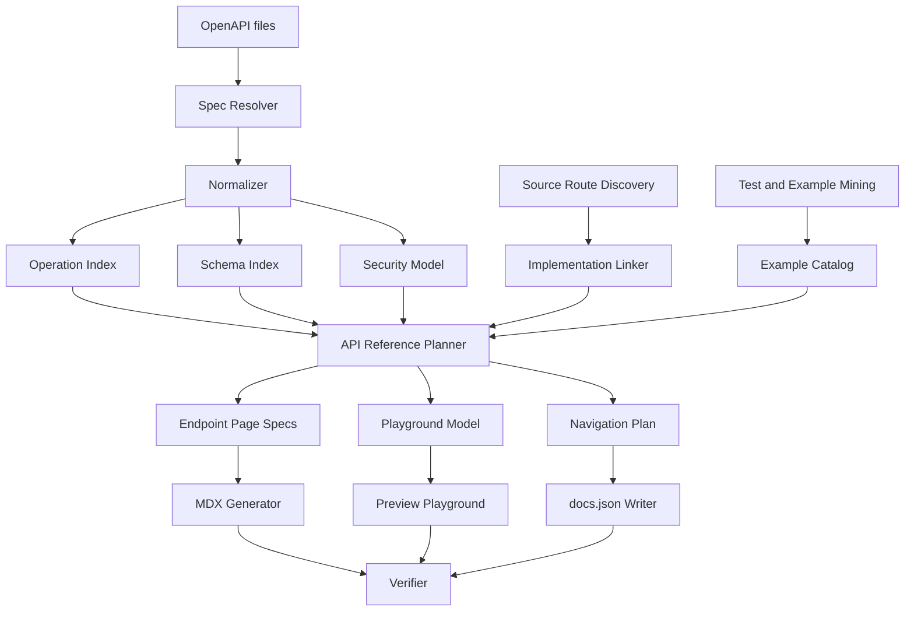

------
title: Build From Scratch: Mintlify-like AI-driven Documentation Generator CLI - Part 031
description: Build an OpenAPI-driven API playground and reference-page generator that can normalize specs, generate stable endpoint pages, wire Mintlify-like navigation, and keep API docs source-grounded.
series: learn-ai-docs-km-cli
seriesTitle: Build From Scratch: Mintlify-like AI-driven Documentation Generator CLI with Code2Prompt and Open-source Knowledge Management
order: 31
partTitle: OpenAPI Playground and Reference Pages
tags:
- ai-docs
- documentation
- cli
- openapi
- api-reference
- api-playground
- mdx
- mintlify
- source-grounded-generation
date: 2026-07-04
---

# Part 031 — OpenAPI Playground and Reference Pages

By this point, we can scan a repository, classify files, discover contracts, generate docs plans, write MDX, verify output, generate navigation, and render a static documentation site.

Now we build one of the highest-value features in a developer documentation platform:

> API reference pages and an interactive playground generated from real API contracts.

This is where many documentation systems fail.

They either generate shallow endpoint pages that merely restate the OpenAPI file, or they create beautiful pages that drift away from the actual API contract.

Our goal is different.

We want an API reference subsystem that is:

- contract-first,
- source-grounded,
- stable across regeneration,
- navigation-aware,
- example-aware,
- safe for public documentation,
- useful for humans,
- usable by AI agents,
- compatible with a Mintlify-like documentation model.

The reference architecture in this part is not just "parse OpenAPI and print Markdown".

It is a pipeline:

```txt
OpenAPI / source routes / tests / examples
  -> contract normalization
  -> operation index
  -> endpoint page specs
  -> examples and auth enrichment
  -> playground request model
  -> generated MDX or renderer-delegated API pages
  -> docs.json navigation
  -> verification report
```

The invariant:

> The API docs must describe the contract that consumers can actually call, not what the model thinks the API probably does.

---

## 1. What We Are Building

The CLI will support commands like this:

```bash
aidocs api scan
aidocs api normalize
aidocs api plan
aidocs api generate
aidocs api verify
aidocs api playground
aidocs api diff
```

Given a repository like this:

```txt
repo/
  openapi/
    public-api.yaml
  src/
    routes/
    controllers/
  tests/
    api/
  docs/
    api/
  docs.json
```

we want to produce artifacts like this:

```txt
.aidocs/
  api/
    specs/
      public-api.normalized.json
    indexes/
      operations.v1.json
      schemas.v1.json
      auth.v1.json
    plans/
      api-reference-plan.v1.json
    playground/
      playground-model.v1.json
    reports/
      api-verify-report.v1.json

docs/
  api/
    introduction.mdx
    authentication.mdx
    errors.mdx
    pagination.mdx
    users/
      list-users.mdx
      get-user.mdx
      create-user.mdx
```

Depending on the target renderer, we may not always emit one MDX file per endpoint. A Mintlify-like system can support two modes:

1. **delegated OpenAPI mode** — navigation points directly to OpenAPI operations and the renderer creates endpoint pages;
2. **materialized MDX mode** — the CLI writes explicit endpoint MDX files;
3. **hybrid mode** — contract details are delegated, while human-authored guides and AI-generated explanations live in MDX.

Do not treat these as styling choices. They have different governance and drift properties.

---

## 2. The Three API Documentation Modes

### 2.1 Delegated OpenAPI Mode

In delegated mode, the docs project stores the OpenAPI file and configures navigation to expose endpoints.

The generated docs source may look like this:

```txt
openapi/public-api.yaml
docs/api/introduction.mdx
docs/api/authentication.mdx
docs/api/errors.mdx
docs.json
```

The navigation tells the renderer:

```json
{
  "navigation": {
    "groups": [
      {
        "group": "API Reference",
        "openapi": "openapi/public-api.yaml"
      }
    ]
  }
}
```

In this mode, the API reference remains close to the contract.

Advantages:

- less generated MDX to maintain;
- less chance of stale endpoint pages;
- easier to update when the spec changes;
- consistent endpoint rendering;
- better for large APIs.

Trade-offs:

- less per-endpoint customization;
- more dependence on renderer capabilities;
- harder to add source-grounded implementation notes per operation;
- harder to preserve manual edits inside endpoint pages.

Delegated mode is ideal when the OpenAPI spec is high quality.

### 2.2 Materialized MDX Mode

In materialized mode, the CLI writes endpoint pages as MDX.

Example:

```mdx
------
title: Create User
description: Create a new user account.
api: POST /users
openapi: openapi/public-api.yaml POST /users
---

# Create User

Creates a new user account.

## Request

...

## Response

...
```

Advantages:

- maximum control over prose;
- easy to attach implementation notes;
- easy to insert examples from tests;
- easy to review each endpoint as a file diff;
- useful for internal enterprise APIs where docs require policy notes.

Trade-offs:

- high drift risk;
- more files;
- more navigation maintenance;
- harder to keep schema rendering consistent;
- more generated content to review.

Materialized mode is appropriate when the contract is incomplete, or when endpoint docs require additional source-grounded context.

### 2.3 Hybrid Mode

Hybrid mode is usually the best default.

Use delegated OpenAPI rendering for the mechanical details:

- path,
- method,
- request parameters,
- request body schema,
- response schema,
- security schemes.

Use MDX for narrative docs:

- authentication overview,
- error handling guide,
- pagination guide,
- rate limit guide,
- webhook guide,
- migration guide,
- cookbook examples,
- architecture and operational notes.

The key rule:

> Do not generate long prose where the contract can be rendered deterministically.

Use the LLM where it adds understanding, not where it merely copies structure.

---

## 3. API Reference System Architecture

The subsystem has these components:



Notice what is missing: the LLM is not the parser.

The LLM may help explain an endpoint, but parsing OpenAPI, resolving `$ref`, calculating security requirements, and generating playground request forms must be deterministic.

---

## 4. Contract Normalization

OpenAPI documents can be messy.

They may use:

- YAML or JSON;
- remote `$ref`;
- internal `$ref`;
- shared components;
- multiple tags;
- inconsistent operation IDs;
- missing examples;
- ambiguous descriptions;
- generated server URLs;
- incomplete security declarations;
- vendor extensions.

The first serious artifact is a normalized spec.

```txt
openapi/public-api.yaml
  -> .aidocs/api/specs/public-api.normalized.json
```

A normalized spec should be:

- fully dereferenceable;
- stable in ordering;
- canonicalized for hashing;
- annotated with source locations;
- version-aware;
- safe to diff;
- easier to consume than raw YAML.

### 4.1 Normalized Spec Shape

```json
{
  "schemaVersion": "normalized-openapi.v1",
  "source": {
    "path": "openapi/public-api.yaml",
    "sha256": "...",
    "format": "yaml",
    "openapiVersion": "3.1.0"
  },
  "info": {
    "title": "Public API",
    "version": "2026-07-04"
  },
  "servers": [],
  "operations": [],
  "schemas": [],
  "securitySchemes": [],
  "diagnostics": []
}
```

Do not discard source locations. They are needed for precise diagnostics:

```json
{
  "operationId": "createUser",
  "method": "post",
  "path": "/users",
  "sourceRef": {
    "path": "openapi/public-api.yaml",
    "jsonPointer": "/paths/~1users/post"
  }
}
```

Without `jsonPointer`, verification reports become vague.

Bad diagnostic:

```txt
Invalid example in OpenAPI file.
```

Good diagnostic:

```txt
openapi/public-api.yaml#/paths/~1users/post/responses/201/content/application~1json/examples/success
Example response is missing required property: id
```

### 4.2 Normalization Steps

A practical normalizer performs these steps:

1. load spec;
2. parse YAML/JSON;
3. validate OpenAPI version;
4. resolve internal refs;
5. resolve allowed local refs;
6. optionally resolve remote refs;
7. canonicalize object order;
8. extract operations;
9. extract schemas;
10. extract security schemes;
11. extract tags;
12. extract examples;
13. preserve extensions;
14. emit diagnostics.

Remote refs deserve a policy.

Default behavior should be conservative:

```yaml
api:
  openapi:
    remoteRefs: deny
```

Enterprise users may enable pinned remote refs:

```yaml
api:
  openapi:
    remoteRefs: allow-pinned
    lockfile: .aidocs/api/openapi-refs.lock
```

The lockfile stores fetched URL, content hash, and timestamp.

---

## 5. Operation Index

The operation index is the heart of the API reference subsystem.

One operation is not merely a path and method. It is a documentation unit.

```json
{
  "id": "op_public_api_post_users",
  "operationId": "createUser",
  "method": "POST",
  "path": "/users",
  "summary": "Create a user",
  "description": "Creates a new user account.",
  "tags": ["Users"],
  "stability": "public",
  "sourceRef": {
    "path": "openapi/public-api.yaml",
    "jsonPointer": "/paths/~1users/post"
  },
  "request": {
    "parameters": [],
    "bodySchemaRef": "schema_CreateUserRequest",
    "examples": []
  },
  "responses": [
    {
      "status": "201",
      "schemaRef": "schema_User",
      "examples": []
    }
  ],
  "security": [
    { "scheme": "bearerAuth", "scopes": [] }
  ],
  "implementationRefs": [],
  "testRefs": [],
  "docRefs": [],
  "diagnostics": []
}
```

Use stable IDs. Avoid raw operationId as the only identifier because operation IDs can be missing or renamed.

A stable operation ID can be derived from:

```txt
spec slug + method + canonical path
```

Example:

```txt
public-api POST /users/{userId}
  -> op_public_api_post_users_userid
```

### 5.1 Operation Fingerprint

Each operation needs a fingerprint to detect drift.

```json
{
  "operationId": "op_public_api_post_users",
  "fingerprint": {
    "contractHash": "sha256:...",
    "requestHash": "sha256:...",
    "responseHash": "sha256:...",
    "securityHash": "sha256:...",
    "exampleHash": "sha256:..."
  }
}
```

This lets us detect targeted changes.

If only the description changes, we may not need to rerun example verification.

If the response schema changes, endpoint examples and pages are dirty.

---

## 6. Schema Index

Schemas should be indexed separately from operations.

Why?

Because schemas are reused.

If `User` changes, many endpoints may be affected.

```json
{
  "id": "schema_User",
  "name": "User",
  "sourceRef": {
    "path": "openapi/public-api.yaml",
    "jsonPointer": "/components/schemas/User"
  },
  "kind": "object",
  "required": ["id", "email"],
  "properties": {
    "id": { "type": "string", "format": "uuid" },
    "email": { "type": "string", "format": "email" }
  },
  "usedByOperations": [
    "op_public_api_get_users_userid",
    "op_public_api_post_users"
  ],
  "fingerprint": "sha256:..."
}
```

This enables:

- schema docs pages;
- operation impact analysis;
- example validation;
- changelog generation;
- knowledge graph export.

---

## 7. Security Model

Do not bury authentication inside endpoint prose.

Extract it into a formal model.

```json
{
  "schemaVersion": "api-security.v1",
  "schemes": [
    {
      "id": "bearerAuth",
      "type": "http",
      "scheme": "bearer",
      "bearerFormat": "JWT",
      "sourceRef": {
        "path": "openapi/public-api.yaml",
        "jsonPointer": "/components/securitySchemes/bearerAuth"
      }
    }
  ],
  "operationRequirements": [
    {
      "operationId": "op_public_api_post_users",
      "requirements": [
        { "scheme": "bearerAuth", "scopes": [] }
      ]
    }
  ]
}
```

This model feeds:

- authentication overview page;
- endpoint badges;
- playground auth UI;
- verification;
- generated examples;
- CLI diagnostics.

### Security Documentation Rule

A generated endpoint page may say:

```txt
Requires bearer token authentication.
```

only if that requirement exists in the contract or verified implementation metadata.

It must not infer authentication from naming alone.

---

## 8. Playground Model

The playground is not just UI.

It is a structured request builder.

```json
{
  "schemaVersion": "playground-model.v1",
  "operations": [
    {
      "operationId": "op_public_api_post_users",
      "method": "POST",
      "pathTemplate": "/users",
      "servers": [
        { "url": "https://api.example.com" }
      ],
      "parameters": [],
      "requestBody": {
        "contentType": "application/json",
        "schemaRef": "schema_CreateUserRequest",
        "defaultExample": {
          "email": "user@example.com",
          "name": "Jane Doe"
        }
      },
      "auth": {
        "scheme": "bearerAuth",
        "inputPolicy": "user-provided"
      },
      "responseExamples": []
    }
  ]
}
```

The playground model should answer:

- which server URL can be used?
- which path parameters are required?
- which query parameters are optional?
- which headers are required?
- what content types are supported?
- what request body schema is expected?
- which example should be prefilled?
- what authentication input is needed?
- should the request be executable in public docs?

### 8.1 Executable vs Non-executable Playground

Not every endpoint should be executable from public docs.

Consider:

- destructive operations;
- payment operations;
- admin-only endpoints;
- internal APIs;
- production environment APIs;
- endpoints with side effects;
- endpoints that expose sensitive data.

The playground needs an execution policy.

```yaml
api:
  playground:
    defaultExecution: disabled
    allowlist:
      - GET /health
      - GET /public/products
    denylist:
      - DELETE /**
      - POST /payments/**
```

Per operation:

```json
{
  "operationId": "op_public_api_delete_user",
  "playground": {
    "visible": true,
    "executable": false,
    "reason": "destructive-operation"
  }
}
```

The invariant:

> Interactive docs must not make dangerous production calls easy by accident.

---

## 9. Endpoint Page Specification

Endpoint pages are generated from page specs, not directly from the OpenAPI object.

```json
{
  "schemaVersion": "endpoint-page-spec.v1",
  "pageId": "api.users.create-user",
  "title": "Create User",
  "route": "docs/api/users/create-user.mdx",
  "operationRef": "op_public_api_post_users",
  "mode": "materialized-mdx",
  "sections": [
    "summary",
    "authentication",
    "request",
    "responses",
    "examples",
    "errors",
    "implementationNotes"
  ],
  "sources": [
    {
      "path": "openapi/public-api.yaml",
      "jsonPointer": "/paths/~1users/post",
      "authority": "contract"
    },
    {
      "path": "tests/api/users.test.ts",
      "lines": [42, 88],
      "authority": "example"
    }
  ],
  "forbiddenClaims": [
    "Do not claim the endpoint sends email unless source evidence exists."
  ],
  "verification": {
    "requireOpenAPIBackref": true,
    "requireExampleValidation": true,
    "requireNoUnbackedBehaviorClaims": true
  }
}
```

This mirrors the page generation contract from Part 018, but specializes it for API endpoints.

---

## 10. Generating Endpoint MDX

A generated endpoint MDX file should be structured and boring.

Example:

````mdx
------
title: Create User
description: Create a new user account.
series: learn-ai-docs-km-cli
api: POST /users
openapi: openapi/public-api.yaml POST /users
---

# Create User

Creates a new user account.

<EndpointBadge method="POST" path="/users" />

## Authentication

Requires bearer token authentication.

## Request Body

```json
{
  "email": "user@example.com",
  "name": "Jane Doe"
}
```

## Response

Returns `201 Created` with a `User` object.

## Example

```bash
curl -X POST "https://api.example.com/users" \
  -H "Authorization: Bearer $TOKEN" \
  -H "Content-Type: application/json" \
  -d '{"email":"user@example.com","name":"Jane Doe"}'
```

## Source

Generated from `openapi/public-api.yaml` operation `POST /users`.
````

But the MDX generator must not invent:

- undocumented rate limits;
- undocumented side effects;
- undocumented authorization scopes;
- undocumented eventual consistency;
- undocumented default values;
- undocumented error causes.

If the source is missing, write a gap note:

```mdx
<Warning>
This operation does not define response examples in the OpenAPI contract yet.
</Warning>
```

Gaps are better than fiction.

---

## 11. Request and Response Example Selection

Examples can come from:

- OpenAPI `examples`;
- OpenAPI `example`;
- JSON Schema examples;
- tests;
- fixtures;
- recorded HTTP interactions;
- README snippets;
- manually curated docs examples.

Rank examples by authority:

```txt
contract example > verified integration test > fixture used by test > human curated docs example > generated synthetic example
```

Synthetic examples should be clearly marked internally.

In public docs, avoid publishing synthetic examples unless they pass schema validation and policy checks.

### 11.1 Example Artifact

```json
{
  "id": "ex_create_user_success_001",
  "operationId": "op_public_api_post_users",
  "kind": "http-request-response",
  "source": {
    "path": "tests/api/users.test.ts",
    "lines": [42, 88]
  },
  "request": {
    "method": "POST",
    "path": "/users",
    "headers": {
      "Content-Type": "application/json"
    },
    "body": {
      "email": "user@example.com",
      "name": "Jane Doe"
    }
  },
  "response": {
    "status": 201,
    "body": {
      "id": "usr_123",
      "email": "user@example.com"
    }
  },
  "validation": {
    "requestValid": true,
    "responseValid": true,
    "redacted": true
  }
}
```

The docs generator should never blindly copy test values.

Redact:

- real emails;
- tokens;
- phone numbers;
- addresses;
- internal IDs;
- hostnames;
- customer names;
- API keys;
- session cookies.

---

## 12. Auth Guide Generation

Authentication deserves a dedicated page.

The generator should create:

```txt
docs/api/authentication.mdx
```

from:

- OpenAPI security schemes;
- existing README docs;
- environment examples;
- SDK config examples;
- tests that attach auth headers.

A good auth page includes:

- supported auth schemes;
- how to obtain credentials;
- how to pass credentials;
- token format if documented;
- environment variable convention;
- common auth errors;
- playground auth behavior;
- security warnings.

But do not invent credential acquisition flow.

If the repo only shows bearer auth but not where tokens come from, say:

```mdx
The API contract requires bearer authentication. This repository does not include enough source evidence to document the token issuance flow.
```

This is not a weakness. It is honest documentation.

---

## 13. Error Model Generation

Most API docs under-document errors.

Build an error model from:

- OpenAPI responses;
- shared error schemas;
- exception classes;
- controller error handlers;
- tests;
- problem details format;
- existing troubleshooting docs.

Artifact:

```json
{
  "schemaVersion": "api-errors.v1",
  "errors": [
    {
      "status": 400,
      "code": "VALIDATION_ERROR",
      "message": "Request validation failed.",
      "schemaRef": "schema_ErrorResponse",
      "sourceRefs": []
    }
  ],
  "operationErrors": [
    {
      "operationId": "op_public_api_post_users",
      "errors": ["VALIDATION_ERROR", "UNAUTHORIZED"]
    }
  ]
}
```

Generate:

```txt
docs/api/errors.mdx
```

and endpoint-level error summaries.

Good endpoint error docs are not long. They are precise:

```mdx
## Errors

| Status | Code | Meaning |
| --- | --- | --- |
| `400` | `VALIDATION_ERROR` | The request body does not match the schema. |
| `401` | `UNAUTHORIZED` | The bearer token is missing or invalid. |
```

If the API has no explicit error codes, avoid manufacturing them.

---

## 14. Pagination, Filtering, Sorting, and Idempotency

These behaviors often span multiple endpoints.

Detect them from:

- query parameters:
  - `page`, `limit`, `offset`, `cursor`, `next_cursor`;
- response fields:
  - `next`, `previous`, `total`, `has_more`;
- headers:
  - `Idempotency-Key`, `RateLimit-*`;
- shared schemas;
- examples;
- tests.

Generate shared guide pages only when there is enough repeated evidence.

```txt
docs/api/pagination.mdx
docs/api/filtering.mdx
docs/api/idempotency.mdx
```

Do not create a pagination guide because one endpoint happens to have `limit`.

Use a threshold:

```yaml
api:
  guides:
    pagination:
      minOperations: 3
      requireResponseEvidence: true
```

---

## 15. Grouping Endpoints

Endpoint grouping affects usability more than people expect.

Possible grouping strategies:

- OpenAPI tags;
- path prefix;
- bounded context;
- resource type;
- source package;
- existing navigation;
- manual override.

Default strategy:

```txt
manual override > OpenAPI tags > path prefix > inferred resource
```

Example:

```json
{
  "groups": [
    {
      "groupId": "api.users",
      "title": "Users",
      "operations": [
        "op_public_api_get_users",
        "op_public_api_post_users",
        "op_public_api_get_users_userid"
      ]
    }
  ]
}
```

Do not blindly trust tags. Generated OpenAPI specs often contain inconsistent tags.

Add diagnostics:

```txt
WARNING api-tag-fragmentation
The following operations use similar tags: User, Users, users.
Suggested canonical group: Users.
```

---

## 16. Navigation Output

In delegated mode, `docs.json` may point to the spec:

```json
{
  "navigation": {
    "groups": [
      {
        "group": "API Reference",
        "openapi": "openapi/public-api.yaml"
      }
    ]
  }
}
```

In materialized mode:

```json
{
  "navigation": {
    "groups": [
      {
        "group": "API Reference",
        "pages": [
          "api/introduction",
          "api/authentication",
          {
            "group": "Users",
            "pages": [
              "api/users/list-users",
              "api/users/create-user",
              "api/users/get-user"
            ]
          },
          "api/errors"
        ]
      }
    ]
  }
}
```

The navigation generator must preserve manual groups.

Human-authored docs should not disappear because the API regenerated.

---

## 17. Implementation Linking

OpenAPI tells consumers what the API should do. Source code tells maintainers where behavior lives.

Create links from operations to implementation symbols:

```json
{
  "operationId": "op_public_api_post_users",
  "implementationRefs": [
    {
      "path": "src/controllers/users.ts",
      "symbol": "createUser",
      "confidence": 0.91,
      "evidence": [
        "route decorator POST /users",
        "operationId createUser"
      ]
    }
  ]
}
```

Use this for:

- internal docs;
- implementation notes;
- source-grounded troubleshooting;
- owner routing;
- drift detection.

Public docs should usually not expose repository internals.

Internal docs can show:

```mdx
<InternalOnly>
Implemented by `src/controllers/users.ts#createUser`.
</InternalOnly>
```

---

## 18. API Drift Detection

For each generated endpoint page, store a back-reference:

```yaml
_generated:
  sourceOperation: op_public_api_post_users
  contractHash: sha256:abc
  schemaHash: sha256:def
  exampleHash: sha256:ghi
```

When the spec changes:

```txt
old contractHash != new contractHash
```

mark the page dirty.

Drift categories:

| Drift | Example | Action |
| --- | --- | --- |
| path drift | `/users/{id}` -> `/v2/users/{id}` | regenerate endpoint + navigation |
| request schema drift | required field added | regenerate request docs + examples |
| response schema drift | field removed | regenerate response docs + examples |
| auth drift | bearer -> OAuth scope | regenerate auth docs |
| error drift | `409` added | update errors section |
| example drift | example invalid | repair or remove example |

Do not regenerate the whole API docs if only one operation changed.

Targeted regeneration keeps review diffs small.

---

## 19. Verifier Rules for API Reference

The verifier checks:

- every endpoint page has a valid operation back-reference;
- every path/method in MDX matches OpenAPI;
- every request example validates against request schema;
- every response example validates against response schema;
- every documented status code exists in contract or verified implementation evidence;
- every documented auth scheme exists in security model;
- every navigation endpoint exists;
- no orphan operation is left undocumented unless intentionally suppressed;
- no endpoint page describes a deleted operation;
- no playground operation violates execution policy;
- no public page exposes internal source paths unless allowed.

Verifier output:

```json
{
  "schemaVersion": "api-verify-report.v1",
  "status": "failed",
  "findings": [
    {
      "severity": "error",
      "code": "api-example-invalid-response",
      "operationId": "op_public_api_post_users",
      "file": "docs/api/users/create-user.mdx",
      "message": "Example response is missing required property: id"
    }
  ]
}
```

Verification is not optional.

An API reference generated without verification is a liability.

---

## 20. CLI UX

### 20.1 `aidocs api scan`

```bash
aidocs api scan
```

Output:

```txt
API discovery complete

Specs:
  openapi/public-api.yaml       OpenAPI 3.1.0   48 operations

Source routes:
  src/routes/users.ts           8 routes
  src/routes/orders.ts          11 routes

Examples:
  tests/api                     33 request/response examples
```

### 20.2 `aidocs api normalize`

```bash
aidocs api normalize openapi/public-api.yaml
```

Output:

```txt
Normalized openapi/public-api.yaml
  operations: 48
  schemas: 72
  security schemes: 2
  warnings: 5

Wrote .aidocs/api/specs/public-api.normalized.json
```

### 20.3 `aidocs api plan`

```bash
aidocs api plan
```

Output:

```txt
API reference plan

Mode: hybrid
Generated guide pages:
  docs/api/introduction.mdx
  docs/api/authentication.mdx
  docs/api/errors.mdx

Delegated OpenAPI groups:
  Users       12 operations
  Orders      18 operations
  Billing     9 operations
  Webhooks    9 operations
```

### 20.4 `aidocs api generate`

```bash
aidocs api generate --mode hybrid
```

Output:

```txt
Generated API docs
  changed: 4
  unchanged: 22
  skipped: 1

Run `aidocs api verify` before publishing.
```

### 20.5 `aidocs api playground`

```bash
aidocs api playground
```

Output:

```txt
Playground model generated
  executable operations: 14
  visible non-executable operations: 34
  blocked destructive operations: 6
```

---

## 21. A Minimal Implementation Plan

### Step 1 — Spec Loader

Implement:

```ts
interface OpenApiLoader {
  load(path: string): Promise<LoadedSpec>;
}
```

Return parsed data plus source metadata.

### Step 2 — Normalizer

Implement:

```ts
interface OpenApiNormalizer {
  normalize(spec: LoadedSpec, options: NormalizeOptions): Promise<NormalizedSpec>;
}
```

Do not call the LLM here.

### Step 3 — Operation Indexer

```ts
interface OperationIndexer {
  index(spec: NormalizedSpec): OperationIndex;
}
```

Include stable IDs and fingerprints.

### Step 4 — Schema Indexer

```ts
interface SchemaIndexer {
  index(spec: NormalizedSpec): SchemaIndex;
}
```

Track schema usage.

### Step 5 — Example Matcher

```ts
interface ApiExampleMatcher {
  match(operationIndex: OperationIndex, examples: ExampleCatalog): OperationExampleMap;
}
```

### Step 6 — API Planner

```ts
interface ApiReferencePlanner {
  plan(input: ApiPlanningInput): ApiReferencePlan;
}
```

### Step 7 — Playground Builder

```ts
interface PlaygroundBuilder {
  build(plan: ApiReferencePlan): PlaygroundModel;
}
```

### Step 8 — Writer

```ts
interface ApiDocsWriter {
  write(plan: ApiReferencePlan): Promise<WriteReport>;
}
```

### Step 9 — Verifier

```ts
interface ApiDocsVerifier {
  verify(input: ApiVerifyInput): ApiVerifyReport;
}
```

This boundary keeps the system testable.

---

## 22. Testing Strategy

Create fixture APIs:

```txt
fixtures/api/
  simple-openapi/
  multiple-tags/
  missing-operation-ids/
  shared-schemas/
  auth-required/
  oauth-scopes/
  invalid-examples/
  destructive-operations/
  remote-refs/
  monorepo-multiple-specs/
```

Test cases:

- normalization is deterministic;
- operation IDs are stable;
- `$ref` resolution preserves source refs;
- endpoint grouping is stable;
- examples validate;
- destructive operations are not executable;
- deleted operations remove or mark stale pages;
- manual navigation sections are preserved;
- generated MDX contains operation back-reference;
- verifier catches contract/page mismatch.

Golden files are useful here.

Commit expected outputs:

```txt
fixtures/api/simple-openapi/expected/
  normalized.json
  operations.v1.json
  playground-model.v1.json
  docs.json
```

Then compare output exactly.

---

## 23. Common Failure Modes

### Failure Mode 1 — Endpoint Prose Drifts from Contract

Symptom:

```txt
Docs say `email` is optional, OpenAPI says required.
```

Fix:

- render schema fields deterministically;
- verify docs against schema;
- reduce free prose in endpoint pages.

### Failure Mode 2 — Tags Create Bad Navigation

Symptom:

```txt
Sidebar has User, Users, users, Account Users.
```

Fix:

- canonicalize tags;
- support manual group overrides;
- emit diagnostics.

### Failure Mode 3 — Playground Sends Dangerous Requests

Symptom:

```txt
Public docs allow executing DELETE /accounts/{id}.
```

Fix:

- default execution disabled;
- deny destructive methods unless explicitly allowlisted;
- require environment gating.

### Failure Mode 4 — Generated Examples Leak Secrets

Symptom:

```txt
Example includes real bearer token from test fixture.
```

Fix:

- secret scanning;
- redaction pipeline;
- verifier rule for token-like values.

### Failure Mode 5 — API Reference Regenerates Too Much

Symptom:

```txt
One schema description changed; 200 endpoint pages changed.
```

Fix:

- stable formatting;
- operation-level fingerprints;
- targeted regeneration;
- deterministic ordering.

---

## 24. Knowledge Graph Export

API references should feed the knowledge graph.

Generate nodes:

```txt
[[API Operation: POST /users]]
[[API Schema: User]]
[[Auth Scheme: bearerAuth]]
[[API Error: VALIDATION_ERROR]]
[[API Guide: Authentication]]
```

Relationships:

```txt
POST /users -> consumes -> CreateUserRequest
POST /users -> returns -> User
POST /users -> requires -> bearerAuth
POST /users -> documented-by -> docs/api/users/create-user.mdx
POST /users -> tested-by -> tests/api/users.test.ts
```

This matters later when we integrate Logseq and OpenNote.

The docs site is for readers. The graph is for retrieval, learning, impact analysis, and AI context.

---

## 25. What Good Looks Like

A good API reference subsystem has these properties:

- it can regenerate from source;
- it can explain why an endpoint exists in navigation;
- it can show which operation changed;
- it can validate examples;
- it can prevent dangerous playground execution;
- it can preserve human-authored guides;
- it can distinguish public docs from internal notes;
- it can fail loudly when the contract is incomplete;
- it can produce small diffs;
- it can feed a knowledge graph.

The core mental model:

> API reference generation is not writing. It is contract compilation plus source-grounded explanation.

---

## 26. References

- OpenAPI Specification v3.2.0: https://spec.openapis.org/oas/v3.2.0.html
- OpenAPI Initiative announcement for v3.2: https://www.openapis.org/blog/2025/09/23/announcing-openapi-v3-2
- Mintlify OpenAPI setup: https://www.mintlify.com/docs/api-playground/openapi-setup
- Mintlify API playground overview: https://www.mintlify.com/docs/api-playground/overview
- Mintlify navigation configuration: https://www.mintlify.com/docs/organize/navigation
- MDX official documentation: https://mdxjs.com/

---

## 27. Completion Checklist

You understand this part when you can explain:

- why endpoint pages should be generated from operation indexes, not raw YAML;
- why playground execution needs a policy;
- why hybrid mode is often better than fully materialized endpoint docs;
- how operation fingerprints enable targeted regeneration;
- how examples are selected, redacted, and validated;
- how API docs connect to navigation, verification, and knowledge graph output.

Next, we build the local preview and developer feedback loop.
