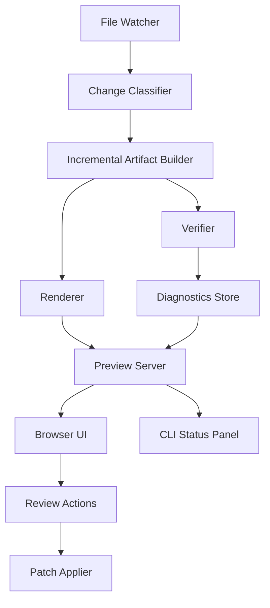
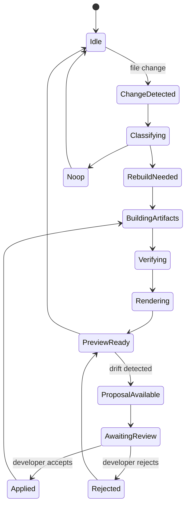
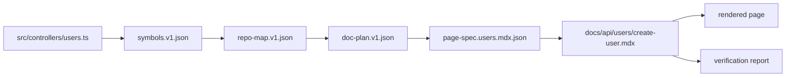
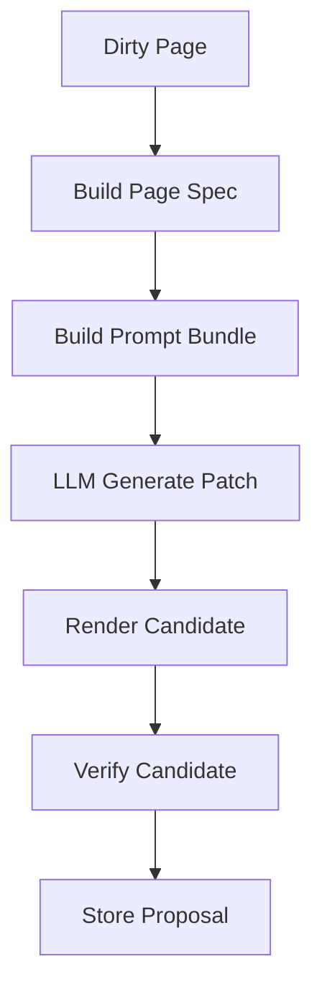

------
title: Build From Scratch: Mintlify-like AI-driven Documentation Generator CLI - Part 032
description: Build a local preview and developer feedback loop for AI-generated documentation, including watch mode, incremental rebuilds, diagnostics overlay, review UX, and safe apply workflow.
series: learn-ai-docs-km-cli
seriesTitle: Build From Scratch: Mintlify-like AI-driven Documentation Generator CLI with Code2Prompt and Open-source Knowledge Management
order: 32
partTitle: Local Preview and Developer Feedback Loop
tags:
- ai-docs
- documentation
- cli
- preview-server
- watch-mode
- developer-experience
- mdx
- incremental-build
- diagnostics
- mintlify
date: 2026-07-04
---

# Part 032 — Local Preview and Developer Feedback Loop

A documentation generator is not useful if the developer only sees the result after CI fails.

The local loop must be fast, honest, and safe.

This part builds the developer feedback loop around our Mintlify-like AI documentation CLI.

The loop is:

```txt
edit code/docs/config
  -> watch detects change
  -> scanner updates affected artifacts
  -> planner detects affected pages
  -> renderer rebuilds minimal output
  -> verifier reports issues
  -> preview shows docs + diagnostics
  -> developer accepts, edits, or rejects changes
```

The important part is not the preview server itself.

The important part is the trust loop.

> Developers must see what changed, why it changed, whether it is verified, and what remains uncertain.

A local preview is not a toy. It is the first governance layer before CI.

---

## 1. Why Local Preview Matters

AI-generated docs introduce a new risk:

```txt
The generated page looks polished, but nobody knows whether it is true.
```

Local preview must make truthfulness inspectable.

It should answer:

- which pages were generated?
- which source files caused the change?
- which claims are source-backed?
- which examples were verified?
- which links are broken?
- which pages are stale?
- which changes are safe to apply?
- which generated sections need human review?

A typical static-site preview answers only:

```txt
Does the page render?
```

Our preview must answer:

```txt
Can this documentation be trusted enough to commit?
```

---

## 2. Preview System Architecture

The local preview system has six major components:



The key design choice:

> The preview server reads artifacts. It should not secretly generate or mutate source files behind the developer's back.

Generation is an explicit command or an explicit review action.

---

## 3. Modes of Operation

The CLI should support multiple local modes.

### 3.1 Render-only Preview

```bash
aidocs preview
```

Behavior:

- load current docs;
- render MDX;
- validate navigation;
- run lightweight verification;
- start local server.

No AI calls. No generated changes.

Use this when reviewing manually edited docs.

### 3.2 Watch Mode

```bash
aidocs preview --watch
```

Behavior:

- watch docs, source, config, OpenAPI files;
- rebuild affected artifacts;
- refresh browser;
- update diagnostics.

Still no AI generation by default.

### 3.3 Proposal Mode

```bash
aidocs preview --propose
```

Behavior:

- detect docs drift;
- build prompt bundles;
- generate proposed patches;
- show proposals in preview;
- require explicit apply.

This is the right default for AI-assisted local work.

### 3.4 Full Regeneration Mode

```bash
aidocs preview --propose --regen dirty
```

or:

```bash
aidocs generate --dirty && aidocs preview
```

Behavior:

- regenerate dirty pages;
- run verification;
- show diffs;
- allow developer review.

Avoid automatic full regeneration on every save.

LLM calls are slow, costly, and noisy.

---

## 4. The Local Feedback Loop as a State Machine

Preview state can be modeled explicitly.



This state machine prevents hidden behavior.

The developer can always know where the system is:

```txt
Preview ready
Docs: 42 pages
Diagnostics: 2 errors, 5 warnings
Proposals: 3 pending
Last rebuild: 412ms
AI calls: none
```

---

## 5. Change Classification

Not every file change requires the same work.

| Changed file | Required action |
| --- | --- |
| `docs/**/*.mdx` | re-render page, verify links/frontmatter |
| `docs.json` | validate navigation, rebuild route manifest |
| `openapi/**/*.yaml` | normalize spec, update API index, detect endpoint drift |
| source file | rescan file, update symbols, detect affected pages |
| test file | re-mine examples, validate affected snippets |
| config file | reload config, invalidate affected pipeline stages |
| template file | rerender affected generated pages |

The preview loop should produce a change plan:

```json
{
  "schemaVersion": "preview-change-plan.v1",
  "changes": [
    {
      "path": "openapi/public-api.yaml",
      "kind": "api-contract",
      "actions": [
        "normalize-openapi",
        "reindex-operations",
        "detect-api-drift",
        "verify-api-pages"
      ],
      "affectedPages": [
        "docs/api/users/create-user.mdx"
      ]
    }
  ]
}
```

This artifact is useful for debugging and CI.

---

## 6. Incremental Rebuild Loop

A naive preview rebuilds everything.

That becomes slow and noisy.

A production-grade preview uses the artifact graph from Part 016.



When `src/controllers/users.ts` changes, the system does not automatically regenerate every page.

It asks:

- did public symbols change?
- did route behavior change?
- did examples change?
- did existing docs claims depend on changed lines?
- did page fingerprints change?

If not, it may only update diagnostics.

### 6.1 Dirty Reasons

Every dirty page needs a reason.

```json
{
  "page": "docs/api/users/create-user.mdx",
  "dirty": true,
  "reasons": [
    {
      "kind": "contract-hash-changed",
      "source": "openapi/public-api.yaml#/paths/~1users/post",
      "oldHash": "sha256:aaa",
      "newHash": "sha256:bbb"
    }
  ]
}
```

Bad UX:

```txt
10 pages need update.
```

Good UX:

```txt
10 pages need update:
  6 because OpenAPI schemas changed
  3 because examples changed
  1 because navigation changed
```

---

## 7. Preview Server Responsibilities

The preview server should provide:

- static page serving;
- route manifest serving;
- diagnostics API;
- build status API;
- proposal diff API;
- search index API;
- websocket or server-sent event updates;
- local-only review actions.

Example endpoints:

```txt
GET /__aidocs/status
GET /__aidocs/diagnostics
GET /__aidocs/routes
GET /__aidocs/proposals
GET /__aidocs/proposals/:id/diff
POST /__aidocs/proposals/:id/apply
POST /__aidocs/proposals/:id/reject
```

Keep these local-only.

Bind to localhost by default:

```txt
127.0.0.1:3333
```

Do not expose review actions on `0.0.0.0` unless explicitly configured.

---

## 8. Diagnostics Overlay

A normal docs preview shows rendered content.

Our preview also shows diagnostics.

Useful overlays:

- broken link indicators;
- stale page badge;
- unverified example badge;
- source-backed claim indicator;
- generated/manual section boundaries;
- API contract mismatch warning;
- dangerous command warning;
- missing navigation warning;
- MDX component error.

Example UI concept:

```txt
[Verified] [Generated] [Source-backed: 12/14 claims] [2 warnings]

Warning: This page documents POST /users but the OpenAPI response schema changed.
Source: openapi/public-api.yaml#/paths/~1users/post/responses/201
Action: Regenerate response section
```

This is where the system earns trust.

---

## 9. CLI Status Panel

Not every developer wants to use a browser overlay.

The terminal should show a useful status panel.

```txt
aidocs preview running at http://localhost:3333

Build
  pages:       42 rendered
  changed:     3
  duration:    684ms

Verification
  errors:      1
  warnings:    4
  stale:       3

AI proposals
  pending:     2
  estimated:   8.4k input tokens
  applied:     0

Press r to rebuild, d to show diagnostics, q to quit.
```

The CLI should avoid fake precision.

If token estimation is approximate, label it as estimated.

---

## 10. Review UX for AI Proposals

Generated changes should be proposals before they become files.

Artifact layout:

```txt
.aidocs/proposals/
  prop_20260704_001/
    metadata.json
    patch.diff
    pages/
      docs/api/users/create-user.mdx
    verification.json
```

Proposal metadata:

```json
{
  "id": "prop_20260704_001",
  "createdAt": "2026-07-04T10:22:00+07:00",
  "reason": "api-contract-drift",
  "affectedPages": ["docs/api/users/create-user.mdx"],
  "sourceChanges": ["openapi/public-api.yaml"],
  "verification": {
    "status": "warning",
    "errors": 0,
    "warnings": 2
  },
  "llm": {
    "provider": "configured-provider",
    "model": "configured-model",
    "promptBundleHash": "sha256:..."
  }
}
```

Review actions:

```bash
aidocs review list
aidocs review show prop_20260704_001
aidocs review apply prop_20260704_001
aidocs review reject prop_20260704_001
```

Browser actions mirror the CLI.

The rule:

> Preview may propose. Only review may apply.

---

## 11. Safe Patch Apply

Patch application must protect human edits.

Before applying a proposal, check:

- target file still has expected base hash;
- generated region boundaries still match;
- manual regions will not be overwritten;
- verifier result is acceptable under policy;
- file path is inside docs root;
- symlink traversal is impossible;
- generated diff is reviewable.

If base hash changed:

```txt
Cannot apply proposal prop_20260704_001.
The target file changed after proposal generation.
Run `aidocs review rebase prop_20260704_001`.
```

Do not silently reapply stale patches.

---

## 12. Watch Mode Design

File watching is deceptively tricky.

Issues:

- editors write temp files;
- save events fire multiple times;
- generated files trigger more events;
- large monorepos produce huge event streams;
- symlinked directories can loop;
- OS file watcher behavior differs;
- network filesystems behave poorly.

Use debouncing.

```txt
file change detected
wait 100-300ms
coalesce changes
classify batch
build once
```

Ignore generated build output:

```yaml
preview:
  watch:
    ignore:
      - .aidocs/build/**
      - .aidocs/cache/**
      - node_modules/**
      - .git/**
```

Avoid watch loops.

If the generator writes `docs/api/users/create-user.mdx`, the watcher should process it as a docs change, but not trigger another AI generation unless explicitly requested.

---

## 13. Fast Verification vs Full Verification

Local preview needs layered verification.

### Fast Verification

Run on every save:

- MDX parse;
- frontmatter validation;
- internal link check;
- navigation route check;
- generated region check;
- obvious secret patterns;
- changed examples only.

### Full Verification

Run on demand or before apply:

- all links;
- all examples;
- all API schemas;
- all Mermaid diagrams;
- source claim ledger;
- external links;
- search index;
- full drift report.

CLI:

```bash
aidocs preview --verify fast
aidocs verify --full
```

The preview UI should show which verification level is active.

```txt
Verification: fast
Some checks are deferred. Run `aidocs verify --full` before publishing.
```

---

## 14. Local Search and AI Assistant Preview

A Mintlify-like platform may include local search and AI assistant preview.

Our CLI can support a local search index:

```txt
.aidocs/build/search/index.json
```

For local AI assistant behavior, do not send the entire docs site on every query.

Use retrieval:

```txt
user question
  -> local search / vector search
  -> top docs chunks
  -> answer with citations to local docs
```

But treat this as a preview feature.

The assistant preview should reveal:

- which chunks were retrieved;
- which page answered the question;
- whether the answer used stale pages;
- whether docs have verification errors.

Bad local AI preview:

```txt
Answer: This API supports OAuth.
```

Good local AI preview:

```txt
Answer: The docs currently describe bearer token authentication.
Sources:
  docs/api/authentication.mdx
  openapi/public-api.yaml#/components/securitySchemes/bearerAuth
```

This reinforces the same source-grounded discipline.

---

## 15. Preview Build Manifest

Every preview build should produce a manifest.

```json
{
  "schemaVersion": "preview-build.v1",
  "buildId": "build_20260704_102400",
  "startedAt": "2026-07-04T10:24:00+07:00",
  "durationMs": 684,
  "mode": "watch",
  "changedFiles": ["openapi/public-api.yaml"],
  "renderedPages": [
    {
      "path": "docs/api/users/create-user.mdx",
      "route": "/api/users/create-user",
      "status": "rendered",
      "durationMs": 32
    }
  ],
  "diagnostics": {
    "errors": 1,
    "warnings": 4
  },
  "proposals": {
    "pending": 2
  }
}
```

This artifact supports:

- debugging;
- CI comparison;
- performance analysis;
- user support;
- local dashboard.

---

## 16. Route Manifest

The preview server should not infer routes on every request.

Generate a route manifest:

```json
{
  "schemaVersion": "route-manifest.v1",
  "routes": [
    {
      "route": "/api/users/create-user",
      "source": "docs/api/users/create-user.mdx",
      "title": "Create User",
      "navGroup": "API Reference / Users",
      "status": "ok"
    }
  ]
}
```

This powers:

- server routing;
- internal link validation;
- preview sidebar;
- diagnostics links;
- search indexing.

---

## 17. Error Handling in Preview

Render errors must be useful.

Bad error:

```txt
Build failed.
```

Good error:

```txt
MDX parse error in docs/api/users/create-user.mdx:42:7
Unexpected closing tag `Card`.

Generated region:
  <!-- aidocs:generated:start section=request -->

Suggested action:
  Run `aidocs repair docs/api/users/create-user.mdx`
```

Error categories:

- config error;
- MDX syntax error;
- component allowlist error;
- navigation error;
- route conflict;
- OpenAPI validation error;
- link error;
- verifier error;
- proposal apply error;
- provider error;
- file watcher error.

Each error should include:

- severity;
- file;
- location;
- explanation;
- source artifact;
- suggested action;
- whether auto-repair is possible.

---

## 18. No Hidden AI Calls

This is a critical UX and trust rule.

Local preview must disclose AI calls.

If proposal mode is active:

```txt
AI proposal generation enabled.
Provider: configured-provider
Model: configured-model
Mode: source-grounded
Files allowed in prompt: 18
Estimated input tokens: 42.1k
```

Before making calls, the CLI can either:

- require explicit command;
- or run automatically only if the user enabled `preview.propose.auto`.

Default:

```yaml
preview:
  propose:
    auto: false
```

Do not surprise developers with API cost, latency, or code exposure.

---

## 19. Preview Configuration

Example config:

```yaml
preview:
  host: 127.0.0.1
  port: 3333
  openBrowser: true
  verify: fast
  watch:
    enabled: true
    debounceMs: 200
    ignore:
      - node_modules/**
      - .git/**
      - .aidocs/build/**
  propose:
    enabled: true
    auto: false
    dirtyOnly: true
  playground:
    allowExecution: false
  diagnostics:
    overlay: true
    terminal: true
```

This config belongs to project config, not hardcoded CLI behavior.

---

## 20. Implementation: Preview Server Boundary

Define a server interface:

```ts
interface PreviewServer {
  start(input: PreviewServerInput): Promise<PreviewServerHandle>;
}

interface PreviewServerInput {
  host: string;
  port: number;
  buildDir: string;
  diagnosticsStore: DiagnosticsStore;
  proposalStore: ProposalStore;
  routeManifest: RouteManifest;
}
```

The server should not know how to scan repositories or call LLMs.

It serves artifacts and receives review actions.

Generation belongs to application services.

---

## 21. Implementation: Watch Controller

```ts
interface WatchController {
  start(input: WatchInput): Promise<void>;
}

interface WatchInput {
  roots: string[];
  ignore: string[];
  debounceMs: number;
  onBatch: (changes: FileChange[]) => Promise<void>;
}
```

Batch processing:

```ts
async function onChangeBatch(changes: FileChange[]) {
  const plan = await changeClassifier.classify(changes);
  const build = await incrementalBuilder.build(plan);
  const verify = await verifier.verify(build);
  await previewState.update({ plan, build, verify });
  await liveReload.notify();
}
```

Keep the code path explicit.

---

## 22. Implementation: Proposal Controller

```ts
interface ProposalController {
  createForDirtyPages(input: DirtyPagesInput): Promise<Proposal[]>;
  apply(proposalId: string): Promise<ApplyResult>;
  reject(proposalId: string): Promise<RejectResult>;
}
```

Proposal generation pipeline:



A proposal is not valid merely because the LLM returned text.

It must render and verify.

---

## 23. Browser UI Model

Minimum local UI:

```txt
+---------------------------------------------------+
| Sidebar                                           |
| - Introduction                                    |
| - API Reference                                   |
|   - Users                                         |
|                                                   |
+---------------------+-----------------------------+
| Rendered Page        | Diagnostics                 |
|                      | - stale section             |
|                      | - broken link               |
|                      | - proposal available        |
+---------------------+-----------------------------+
```

Page-level controls:

- show source refs;
- show generated sections;
- show diff;
- apply proposal;
- reject proposal;
- copy diagnostic;
- open source file;
- run full verify.

The UI should stay local and simple.

Do not turn the preview server into a full SaaS control plane.

---

## 24. Developer Ergonomics

A strong preview loop feels like this:

```bash
$ aidocs preview --watch
✓ Loaded docs project
✓ Rendered 42 pages
✓ Verified 42 pages with fast checks
✓ Preview ready at http://localhost:3333

changed openapi/public-api.yaml
→ normalized API spec
→ detected drift in 3 endpoint pages
→ created 2 proposals, 1 requires manual review
```

A weak loop feels like this:

```txt
Generating...
Error.
```

Do not hide the pipeline.

Show enough structure for developers to trust it.

---

## 25. Performance Budget

Local preview should feel fast.

Suggested targets:

| Operation | Target |
| --- | --- |
| render changed MDX page | < 100ms |
| update route manifest | < 200ms |
| fast verify changed docs | < 500ms |
| rebuild search index small site | < 1s |
| classify source change | < 1s |
| OpenAPI normalize small spec | < 1s |
| proposal generation | explicitly slower, shown separately |

Do not block rendering on AI proposal generation.

Preview can show:

```txt
Page rendered. Proposal still generating.
```

This keeps the developer in flow.

---

## 26. Security Boundary

Local preview often feels harmless. It is not always harmless.

Risks:

- exposing internal docs on LAN;
- executing playground requests;
- leaking source snippets into browser UI;
- accepting malicious local requests that apply patches;
- rendering unsafe MDX components;
- opening untrusted links;
- reading files outside project root.

Default policies:

```yaml
preview:
  host: 127.0.0.1
  reviewActions:
    requireLocalhost: true
  playground:
    allowExecution: false
  mdx:
    allowUnsafeComponents: false
  files:
    restrictToProjectRoot: true
```

For browser review actions, use a local CSRF token.

Do not expose `POST /__aidocs/proposals/:id/apply` without protection.

---

## 27. Common Failure Modes

### Failure Mode 1 — Watch Loop Regenerates Forever

Cause:

```txt
Generator writes file -> watcher sees file -> generator writes file again.
```

Fix:

- distinguish user changes from generated changes;
- debounce events;
- do not auto-generate unless explicitly enabled;
- compare content before writing.

### Failure Mode 2 — Preview Shows Stale Diagnostics

Cause:

```txt
Verifier result from previous build remains visible.
```

Fix:

- tie diagnostics to build ID;
- clear stale diagnostics on rebuild start;
- show pending status.

### Failure Mode 3 — AI Proposal Overwrites Manual Edit

Cause:

```txt
Proposal created before human edit, applied after human edit.
```

Fix:

- base hash check;
- generated/manual region protection;
- proposal rebase flow.

### Failure Mode 4 — Local Server Exposed Publicly

Cause:

```txt
Preview binds to 0.0.0.0 by default.
```

Fix:

- bind to localhost;
- require explicit `--host 0.0.0.0`;
- disable review actions when public.

### Failure Mode 5 — Fast Mode Gives False Confidence

Cause:

```txt
Fast verification passes, but full verification would fail.
```

Fix:

- label verification mode;
- require full verify before publish;
- block apply for high-risk proposals unless full checks pass.

---

## 28. Testing Strategy

Test preview behavior with fixtures:

```txt
fixtures/preview/
  mdx-edit/
  docs-json-change/
  openapi-drift/
  source-symbol-change/
  generated-region-change/
  manual-region-conflict/
  broken-link/
  invalid-mdx/
  dangerous-playground/
```

Test cases:

- changed MDX triggers only page render;
- changed `docs.json` updates route manifest;
- changed OpenAPI spec marks affected endpoint pages dirty;
- source change updates symbols without full regenerate;
- proposal cannot apply after base hash changes;
- preview server binds to localhost by default;
- review actions require token;
- diagnostics are tied to build ID;
- fast verification clearly reports deferred checks;
- generated output does not trigger infinite watch loop.

Use integration tests.

A preview loop is mostly behavior, not pure functions.

---

## 29. How This Compares to Existing Docs CLI Behavior

Modern docs CLIs commonly provide:

- local preview;
- live reload;
- build validation;
- command references;
- deployment preview.

That is necessary but insufficient for AI-generated docs.

Our preview adds:

- source provenance;
- generated/manual region awareness;
- AI proposal review;
- verifier diagnostics;
- docs drift visibility;
- safe patch apply;
- playground execution policy;
- context/prompt transparency.

The goal is not to clone a preview command.

The goal is to create a local trust loop.

---

## 30. What Good Looks Like

A good local preview system should make these statements true:

- a developer can see docs changes within seconds;
- AI calls never happen invisibly;
- generated changes are proposals before patches;
- stale docs are visible before CI;
- verifier errors are tied to source locations;
- manual edits are protected;
- dangerous playground operations are disabled by default;
- route and navigation errors are caught locally;
- the same artifacts can be used in CI;
- the preview server is secure by default.

The core mental model:

> Local preview is not just rendering. It is the developer-facing control surface for trust, drift, and review.

---

## 31. References

- Mintlify CLI overview: https://www.mintlify.com/docs/cli
- Mintlify CLI install: https://www.mintlify.com/docs/cli/install
- Mintlify CLI commands: https://www.mintlify.com/docs/cli/commands
- Mintlify preview deployments: https://www.mintlify.com/docs/deploy/preview-deployments
- MDX official documentation: https://mdxjs.com/
- Mintlify navigation configuration: https://www.mintlify.com/docs/organize/navigation

---

## 32. Completion Checklist

You understand this part when you can explain:

- why preview should not secretly mutate files;
- why AI generation belongs behind proposal/review flow;
- how watch mode classifies changes;
- how dirty reasons improve trust;
- why fast verification and full verification must be separated;
- how preview server security can fail;
- how local preview prepares the system for CI.

Next, we move into open-source knowledge management integration.
