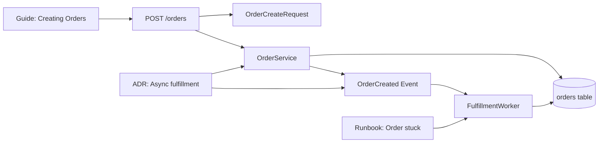
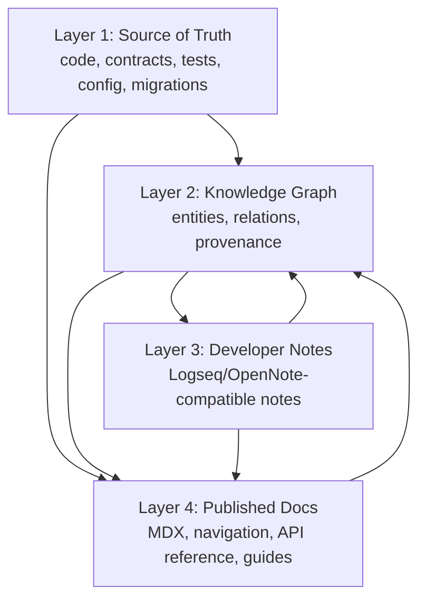
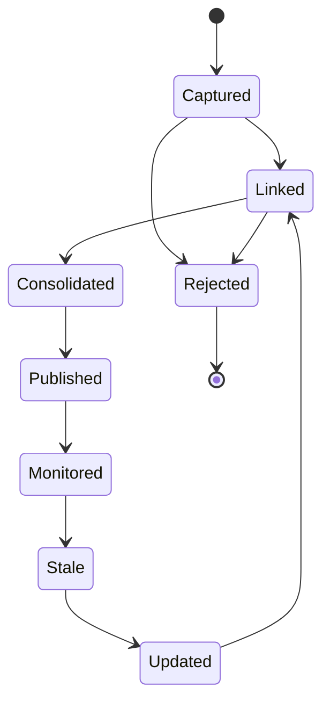
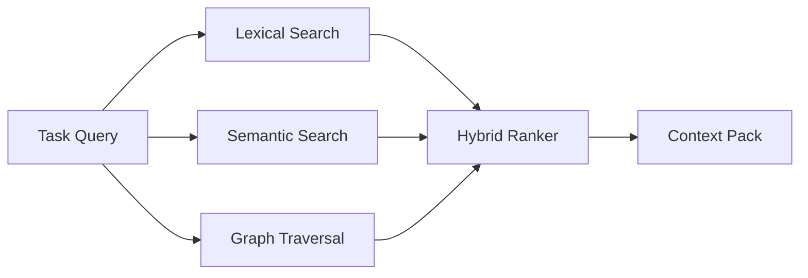
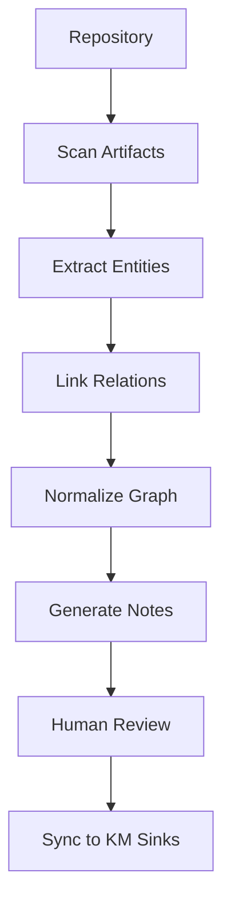

------
title: Build From Scratch: Mintlify-like AI-driven Documentation Generator CLI - Part 033
description: Build the mental model for developer knowledge management: docs, notes, graph, retrieval, provenance, and lifecycle.
series: learn-ai-docs-km-cli
seriesTitle: Build From Scratch: Mintlify-like AI-driven Documentation Generator CLI with Code2Prompt and Open-source Knowledge Management
order: 33
partTitle: Knowledge Management Mental Model for Developers
tags:
- ai-docs
- documentation
- cli
- knowledge-management
- pkm
- graph
- retrieval
- source-grounding
date: 2026-07-04
---

# Part 033 — Knowledge Management Mental Model for Developers

Pada part sebelumnya, sistem kita sudah bisa melakukan banyak hal yang biasanya dianggap “cukup” untuk AI documentation tooling:

- scan repository,
- classify files,
- extract symbols,
- mine examples,
- compile context,
- plan docs,
- generate MDX,
- verify output,
- detect drift,
- preview locally,
- publish Mintlify-like docs.

Kalau berhenti di sana, kita punya documentation generator yang kuat. Tetapi target seri ini lebih tinggi: membangun **developer documentation intelligence system**.

Perbedaan utamanya sederhana:

> Documentation generator menghasilkan halaman. Knowledge system menjaga pemahaman lintas halaman, lintas repo, lintas waktu, dan lintas keputusan.

Sistem dokumentasi yang bagus menjawab:

> “Bagaimana cara memakai API ini?”

Sistem knowledge management yang bagus juga menjawab:

> “Kenapa API ini bentuknya seperti ini?”
>
> “Konsep apa yang terkait?”
>
> “Keputusan desain mana yang membuat module ini begini?”
>
> “Kalau endpoint ini berubah, notes, guides, runbooks, examples, dan konsep apa yang ikut terdampak?”

Itulah fokus part ini.

Kita tidak akan membahas PKM secara lifestyle. Kita akan membahas knowledge management sebagai **engineering subsystem** untuk AI-driven documentation CLI.

---

## 1. Problem: Docs Itu Linear, Sistem Software Itu Graph

Dokumentasi publik biasanya berbentuk tree:

```txt
docs/
  introduction.mdx
  quickstart.mdx
  guides/
    authentication.mdx
    webhooks.mdx
  api-reference/
    users.mdx
    orders.mdx
```

Tree bagus untuk pembaca manusia. Tetapi software system jarang berbentuk tree. Software berbentuk graph:

- endpoint memakai schema,
- schema dipakai event,
- event dikonsumsi worker,
- worker menulis table,
- table berubah karena migration,
- migration mempengaruhi runbook,
- runbook mengacu ke alert,
- alert terkait SLO,
- SLO terkait architecture decision.

Kalau generator hanya melihat halaman, ia kehilangan relasi.

Mari lihat contoh.



Kalau `OrderCreated` berubah, halaman mana yang harus dicek?

Jawaban tree-based:

> Cari manual.

Jawaban knowledge-based:

> Traverse graph dari node `OrderCreated` ke docs, examples, runbooks, ADR, dan downstream consumers.

Itulah mental model inti.

---

## 2. Documentation vs Notes vs Knowledge Graph vs Retrieval

Empat hal ini sering dicampur. Untuk membangun sistem yang benar, kita harus memisahkan perannya.

### 2.1 Documentation

Documentation adalah artifact yang sengaja ditulis untuk pembaca.

Ciri-cirinya:

- curated,
- navigable,
- publishable,
- versioned,
- punya audience jelas,
- punya struktur editorial,
- bisa menjadi public-facing.

Contoh:

```txt
docs/guides/authentication.mdx
docs/api-reference/users.mdx
docs/troubleshooting/rate-limit-errors.mdx
```

Documentation harus enak dibaca. Ia bukan database internal.

### 2.2 Notes

Notes adalah capture unit untuk pengetahuan yang belum tentu siap publish.

Ciri-cirinya:

- lebih atomic,
- lebih internal,
- lebih cepat dibuat,
- bisa berisi observation, decision, todo, question, uncertainty,
- sering punya backlinks.

Contoh:

```txt
pages/OrderCreated.md
pages/Auth Boundary.md
pages/ADR 004 - Use async fulfillment.md
pages/Rate Limit Error.md
```

Notes tidak harus sempurna. Justru notes berguna karena bisa menangkap pengetahuan sebelum berubah menjadi dokumentasi formal.

### 2.3 Knowledge Graph

Knowledge graph adalah struktur eksplisit yang menyimpan entity dan relation.

Ciri-cirinya:

- typed nodes,
- typed edges,
- stable IDs,
- provenance,
- confidence,
- queryable,
- bisa dibuat dari code, docs, tests, dan notes.

Contoh entity:

```json
{
  "id": "endpoint:POST:/orders",
  "type": "api.endpoint",
  "name": "POST /orders",
  "sourceRefs": ["openapi.yaml#/paths/~1orders/post"]
}
```

Contoh relation:

```json
{
  "from": "endpoint:POST:/orders",
  "type": "uses_schema",
  "to": "schema:OrderCreateRequest",
  "sourceRefs": ["openapi.yaml#/paths/~1orders/post/requestBody"],
  "confidence": 1.0
}
```

Knowledge graph tidak harus dibaca langsung oleh manusia, tetapi harus bisa diekspor menjadi notes atau dipakai retrieval.

### 2.4 Retrieval

Retrieval adalah proses mengambil potongan informasi yang relevan untuk task tertentu.

Ciri-cirinya:

- task-specific,
- bisa lexical, semantic, graph-based, atau hybrid,
- dipakai untuk context compiler,
- harus punya scoring dan provenance,
- tidak boleh dianggap kebenaran final tanpa source authority.

Retrieval menjawab:

> “Untuk menulis halaman `Troubleshooting order fulfillment`, source, notes, examples, dan runbooks mana yang paling relevan?”

---

## 3. The Four-Layer Model

Kita akan memakai model empat layer.



Setiap layer punya fungsi berbeda.

| Layer | Fungsi | Boleh generated? | Boleh manual? | Dipublish? |
|---|---|---:|---:|---:|
| Source of Truth | Kebenaran teknis utama | Tidak | Ya | Tidak langsung |
| Knowledge Graph | Relasi dan indeks pengetahuan | Ya | Terbatas | Biasanya tidak |
| Developer Notes | Capture dan reasoning internal | Ya | Ya | Biasanya internal |
| Published Docs | Materi konsumsi pembaca | Ya, setelah review | Ya | Ya |

Invariant utama:

> Source of truth tetap code/contract/test/config. Graph, notes, dan docs adalah derived atau curated artifacts.

---

## 4. Mengapa Documentation Generator Butuh Knowledge Management

Tanpa knowledge management, generator kita punya beberapa blind spot.

### 4.1 Ia Tidak Ingat Keputusan

Kode bisa menunjukkan `OrderService` publish event async. Tetapi kode tidak selalu menjelaskan kenapa.

Alasannya mungkin ada di:

- ADR,
- PR discussion,
- incident postmortem,
- internal note,
- architecture page.

Jika generator hanya membaca source code, ia bisa mendokumentasikan “apa”, tetapi lemah pada “kenapa”.

### 4.2 Ia Tidak Tahu Konsep Lintas File

Konsep “tenant isolation” mungkin tersebar di:

- middleware,
- database policy,
- config,
- docs,
- tests,
- deployment manifests.

Tanpa graph, sistem melihat banyak file. Dengan graph, sistem melihat satu konsep dengan banyak evidence.

### 4.3 Ia Sulit Menangani Drift Lintas Artifact

Misal field `tenant_id` berubah menjadi `organization_id`.

Dampaknya bisa menyentuh:

- API reference,
- auth guide,
- database docs,
- troubleshooting guide,
- Logseq concept note,
- search index,
- prompt bundle cache.

Knowledge graph membantu impact analysis.

### 4.4 Ia Tidak Bisa Menjadi Learning System

Kalau reviewer berkali-kali mengoreksi hal yang sama, sistem harus bisa menyimpan pola itu sebagai knowledge:

```txt
When documenting internal billing APIs, do not call customers "users".
Use "account holder" for legal-facing flows.
```

Ini bukan source code. Ini editorial/domain knowledge.

---

## 5. Knowledge Artifact Types

Kita akan membuat beberapa tipe artifact. Jangan semua disimpan sebagai markdown bebas. Sistem perlu struktur.

### 5.1 Concept Note

Menjelaskan konsep domain atau technical concept.

Contoh:

```md
# [[Idempotency Key]]

type:: concept
source:: generated
confidence:: high
related:: [[POST /orders]], [[Duplicate Request]], [[Payment Capture]]

- Idempotency key prevents duplicate processing of retryable write requests.
- Used by [[POST /orders]] and [[POST /payments]].
- Verified from:
  - `openapi.yaml#/components/parameters/IdempotencyKey`
  - `OrderControllerTest.shouldRejectDuplicateKey`
```

### 5.2 Entity Note

Mewakili entity teknis.

Contoh:

```md
# [[OrderService]]

type:: code.entity
language:: java
source_path:: services/order/src/main/java/com/acme/order/OrderService.java
ownership:: generated

- Coordinates order creation.
- Emits [[OrderCreated]].
- Persists to [[orders table]].
- Public methods:
  - `createOrder`
  - `cancelOrder`
```

### 5.3 Decision Note

Menjelaskan keputusan dan trade-off.

Contoh:

```md
# [[ADR 004 - Async Fulfillment]]

type:: decision
status:: accepted
source:: manual
related:: [[OrderCreated]], [[FulfillmentWorker]]

- Decision: fulfillment runs asynchronously after order creation.
- Reason: checkout latency should not depend on downstream warehouse availability.
- Consequence: docs must explain eventual consistency.
```

### 5.4 Runbook Note

Mewakili operational knowledge.

Contoh:

```md
# [[Order stuck in fulfillment]]

type:: runbook
severity:: high
related:: [[FulfillmentWorker]], [[OrderCreated]]

- Symptom: order status remains `PENDING_FULFILLMENT` for more than 30 minutes.
- Check: worker lag, dead letter queue, warehouse API status.
- Fix: replay event after verifying idempotency.
```

### 5.5 Glossary Note

Menyelaraskan bahasa domain.

Contoh:

```md
# [[Account Holder]]

type:: glossary
preferred_term:: true
avoid:: user, customer

- Legal-facing term for the entity that owns the account.
- In API implementation this may map to `user_id`, but public docs should say account holder.
```

---

## 6. Source Authority Model

Tidak semua knowledge punya bobot sama.

Kita butuh authority ranking.

```txt
1. Contract files: OpenAPI, GraphQL schema, Protobuf, Avro, JSON Schema
2. Source code: implementation and public API
3. Tests: expected behavior and examples
4. Migrations/config: deployment/runtime truth
5. Existing reviewed docs
6. ADR/manual notes
7. Generated notes
8. LLM inference
```

Rule penting:

> Generated notes cannot override source code or contracts.

Jika generated note bilang endpoint butuh auth, tetapi OpenAPI security scheme tidak menunjukkan itu dan middleware juga tidak mendukung, sistem harus memberi warning, bukan menulis klaim percaya diri.

---

## 7. Knowledge Lifecycle

Knowledge tidak lahir langsung menjadi docs final.

Kita pakai lifecycle berikut.



### 7.1 Captured

Sistem menemukan fakta atau kandidat pengetahuan.

Contoh:

- function public baru,
- endpoint baru,
- config key baru,
- error class baru,
- reviewer note.

### 7.2 Linked

Sistem menghubungkan kandidat ke entity lain.

Contoh:

- `PaymentTimeoutException` linked ke `PaymentService`, `POST /payments`, dan runbook pembayaran.

### 7.3 Consolidated

Pengetahuan digabung, deduplicated, dan diberi struktur.

Contoh:

- tiga notes tentang retry disatukan menjadi concept note `[[Retry Policy]]`.

### 7.4 Published

Sebagian knowledge dipromosikan menjadi docs formal.

Contoh:

- concept note `[[Idempotency Key]]` menjadi section di guide `Handling retries safely`.

### 7.5 Monitored

Sistem melacak source refs dan drift.

Contoh:

- jika parameter idempotency dihapus dari OpenAPI, note dan docs terkait ditandai stale.

---

## 8. Developer Knowledge Graph Schema

Kita butuh schema internal yang lebih formal dari markdown notes.

Minimal graph model:

```ts
type KnowledgeNode = {
  id: string;
  type:
    | "code.module"
    | "code.symbol"
    | "api.endpoint"
    | "schema"
    | "event"
    | "database.table"
    | "config.key"
    | "concept"
    | "decision"
    | "runbook"
    | "doc.page"
    | "example"
    | "glossary.term";
  name: string;
  aliases: string[];
  summary?: string;
  sourceRefs: SourceRef[];
  ownership: "source" | "generated" | "manual" | "hybrid";
  confidence: number;
  visibility: "public" | "internal" | "restricted";
  tags: string[];
  updatedAt: string;
};

type KnowledgeEdge = {
  id: string;
  from: string;
  type:
    | "uses"
    | "owns"
    | "calls"
    | "emits"
    | "consumes"
    | "persists_to"
    | "configured_by"
    | "documented_by"
    | "tested_by"
    | "explained_by"
    | "decided_by"
    | "troubleshooted_by"
    | "supersedes"
    | "contradicts";
  to: string;
  sourceRefs: SourceRef[];
  confidence: number;
  createdBy: "scanner" | "extractor" | "llm" | "human";
};
```

This schema is intentionally boring. Boring schemas survive.

---

## 9. Stable IDs Are More Important Than Pretty Names

A knowledge system breaks when IDs are unstable.

Bad ID:

```txt
Order Service
```

Why bad?

- spacing changes,
- casing changes,
- ambiguous across repos,
- not safe for relations.

Better ID:

```txt
code-symbol:repo=checkout:path=src/order/OrderService.java:symbol=OrderService
```

Even better for persisted artifacts:

```txt
ksym_01JZ7R6D9PPF0E5HJ2BX7T1PNW
```

But human-facing names remain clean:

```txt
name: OrderService
pageTitle: [[OrderService]]
```

The internal graph needs stable IDs. The notes need readable names. Do not confuse them.

---

## 10. Knowledge Graph Is Not a Vector Database

This is a common architectural mistake.

A vector database can answer:

> “What text chunks are semantically similar to this question?”

A knowledge graph can answer:

> “Which runbooks are connected to endpoints that use schemas changed in this PR?”

These are different operations.

Use both.



For docs generation, graph traversal is often more reliable than pure semantic search because relation types carry intent.

Example:

```txt
endpoint:POST:/orders --emits--> event:OrderCreated --consumed_by--> worker:FulfillmentWorker --troubleshooted_by--> runbook:Order stuck
```

No embedding is needed to know this path matters.

---

## 11. Knowledge Capture Pipeline

The pipeline should be deterministic before it is intelligent.



Stages:

1. scan source files,
2. extract entities,
3. infer safe relations,
4. generate graph artifact,
5. render notes from graph,
6. review generated notes,
7. sync to Logseq/OpenNote-compatible targets,
8. use notes back as retrieval input.

The important part: **notes are output, not the primary system of record**.

The primary system of record is:

```txt
source code + contracts + graph artifact + manual review decisions
```

---

## 12. Knowledge Artifact Layout

Inside `.aidocs/`, add knowledge artifacts.

```txt
.aidocs/
  knowledge/
    graph.v1.json
    nodes/
      api.endpoint.jsonl
      code.symbol.jsonl
      concept.jsonl
      decision.jsonl
      runbook.jsonl
    edges/
      uses.jsonl
      documented_by.jsonl
      tested_by.jsonl
      decided_by.jsonl
    notes-plan.v1.json
    sync-state.v1.json
    diagnostics.v1.json
```

Export targets:

```txt
knowledge-sinks/
  logseq/
    pages/
      OrderService.md
      Idempotency Key.md
      ADR 004 - Async Fulfillment.md
  opennote/
    notes/
      ...
```

Published docs remain separate:

```txt
docs/
  guides/
  api-reference/
  troubleshooting/
```

This separation prevents internal notes from accidentally becoming public docs.

---

## 13. Knowledge Ownership

Ownership determines who can change what.

| Artifact | Owner | Generated edits allowed? | Human edits allowed? |
|---|---|---:|---:|
| Source-derived entity node | Scanner/extractor | Yes | No direct edit |
| LLM-generated concept note | AI proposal | Yes | Yes after review |
| Manual ADR note | Human | No overwrite | Yes |
| Public docs page | Docs owner | Yes, proposal only | Yes |
| Glossary term | Domain owner | Proposal only | Yes |
| Runbook | Ops owner | Proposal only | Yes |

Rule:

> The system may suggest edits to human-owned knowledge, but it must not silently overwrite it.

---

## 14. A Practical Example: From Endpoint to Knowledge Notes

Suppose scanner finds:

```yaml
paths:
  /orders:
    post:
      operationId: createOrder
      parameters:
        - name: Idempotency-Key
          in: header
```

And tests show:

```java
@Test
void duplicateIdempotencyKeyReturnsExistingOrder() {
  // ...
}
```

The graph extractor creates:

```json
{"id":"endpoint:POST:/orders","type":"api.endpoint","name":"POST /orders"}
{"id":"concept:idempotency-key","type":"concept","name":"Idempotency Key"}
{"id":"example:duplicate-idempotency-key","type":"example","name":"Duplicate idempotency key returns existing order"}
```

Edges:

```json
{"from":"endpoint:POST:/orders","type":"uses","to":"concept:idempotency-key"}
{"from":"example:duplicate-idempotency-key","type":"tests","to":"concept:idempotency-key"}
{"from":"example:duplicate-idempotency-key","type":"tests","to":"endpoint:POST:/orders"}
```

Generated Logseq-compatible note:

```md
# [[Idempotency Key]]

type:: concept
source:: generated
confidence:: high
related:: [[POST /orders]]

- The `Idempotency-Key` header is used by [[POST /orders]].
- Verified by example [[Duplicate idempotency key returns existing order]].
- Source references:
  - `openapi.yaml#/paths/~1orders/post/parameters/Idempotency-Key`
  - `OrderControllerTest.duplicateIdempotencyKeyReturnsExistingOrder`
```

This is not a polished public guide yet. It is a structured knowledge note that can later feed one.

---

## 15. Retrieval From Knowledge

Once the graph exists, context compiler can ask better questions.

Instead of:

```txt
Find files relevant to POST /orders.
```

Ask:

```txt
Find all nodes within distance <= 2 from endpoint:POST:/orders
where relation type in [uses, tested_by, documented_by, decided_by, troubleshooted_by]
and visibility is public or internal-safe.
```

Example result:

```txt
endpoint:POST:/orders
schema:OrderCreateRequest
concept:Idempotency Key
example:duplicate-idempotency-key
runbook:Order stuck in fulfillment
decision:ADR 004 - Async Fulfillment
doc:guides/create-order
```

Then context compiler can assemble a better prompt bundle.

---

## 16. Avoiding Knowledge Pollution

Generated knowledge can become garbage fast.

Common pollution patterns:

### 16.1 Duplicate Concept Explosion

Bad:

```txt
[[Idempotency]]
[[Idempotency Key]]
[[Idempotent Request]]
[[Idempotency Header]]
[[Duplicate Request Prevention]]
```

Better:

```md
# [[Idempotency Key]]

aliases:: Idempotency, Idempotent Request, Idempotency Header, Duplicate Request Prevention
```

### 16.2 Inferred Relations Without Evidence

Bad:

```txt
PaymentService depends on FraudService
```

because their names are semantically related.

Better:

```txt
PaymentService calls FraudClient.reviewPayment
```

because source code shows an import/call/reference.

### 16.3 Notes That Rewrite Docs Poorly

Bad generated note:

```md
# [[Authentication]]

- This system uses OAuth, JWT, API keys, SAML, and RBAC.
```

If source only proves JWT, the rest is hallucination.

Better:

```md
# [[Authentication]]

- Source-backed: JWT bearer authentication is used by public API endpoints.
- Unknown: SAML support is not found in source refs.
```

### 16.4 Internal Knowledge Leaks Into Public Docs

A runbook might mention internal queue names, dashboards, secret paths, or escalation channels. The graph must track visibility.

```json
{
  "id": "runbook:payment-replay",
  "visibility": "restricted"
}
```

Context compiler must not include restricted nodes in public docs tasks.

---

## 17. Visibility Model

Use explicit visibility.

```ts
type Visibility = "public" | "internal" | "restricted";
```

Meaning:

- `public`: safe for public docs,
- `internal`: safe for internal docs and developer notes,
- `restricted`: never sent to external LLM provider unless allowed by policy.

Examples:

| Artifact | Visibility |
|---|---|
| OpenAPI public endpoint | public |
| Internal worker topology | internal |
| Production incident runbook | internal/restricted |
| Secret rotation command | restricted |
| Customer-specific incident detail | restricted |

Rule:

> Visibility must travel with the node, edge, prompt bundle, and generated page.

---

## 18. Confidence Model

Confidence is not truth. It is a signal for review.

Suggested levels:

```txt
1.0  Direct contract/source evidence
0.8  Direct test/example evidence
0.7  Existing reviewed docs
0.6  Manual note without source ref
0.4  LLM-inferred relation with weak evidence
0.0  Unsupported claim
```

Use confidence to decide:

- include automatically,
- include with caveat,
- ask for review,
- reject.

Example policy:

```yaml
knowledgePolicy:
  publicDocs:
    minConfidence: 0.75
    requireSourceRefs: true
  internalNotes:
    minConfidence: 0.5
    allowQuestions: true
  graphEdges:
    llmInferred:
      requireHumanReview: true
```

---

## 19. How Knowledge Feeds Documentation

There are three safe ways to use notes/graph in docs generation.

### 19.1 Evidence Source

Graph node points to source refs, and generator uses the source refs.

Best for factual claims.

### 19.2 Context Source

Note gives background language, naming, or domain framing.

Best for concepts and glossary.

### 19.3 Review Hint

Note says “be careful with this”.

Best for policy and editorial constraints.

Example:

```md
# [[Billing Language Policy]]

type:: editorial-policy
visibility:: internal

- In public billing docs, prefer "account holder" over "user".
- Do not mention internal ledger table names.
```

This should influence generation, but not necessarily appear in generated docs.

---

## 20. CLI Commands for Knowledge Management

Initial command surface:

```bash
aidocs knowledge extract
```

Build graph from scan, symbols, contracts, examples, docs.

```bash
aidocs knowledge inspect OrderService
```

Show node, edges, source refs, confidence, visibility.

```bash
aidocs knowledge path endpoint:POST:/orders runbook:order-stuck
```

Show relation path.

```bash
aidocs knowledge notes plan --sink logseq
```

Plan generated notes.

```bash
aidocs knowledge notes write --sink logseq --review
```

Write notes as proposals.

```bash
aidocs knowledge sync --sink opennote
```

Sync to another knowledge target.

```bash
aidocs knowledge drift
```

Check stale graph/notes.

---

## 21. Knowledge Diagnostics

Every graph build should produce diagnostics.

Example:

```txt
Knowledge graph summary
-----------------------
Nodes: 1,482
Edges: 4,913
Source-backed edges: 4,121
LLM-inferred edges: 216
Human-reviewed edges: 89
Low-confidence nodes: 34
Restricted nodes: 17
Potential duplicate concepts: 12
Stale notes: 8
Public docs using internal nodes: 0
```

Diagnostics should be visible before sync.

Never write hundreds of generated notes silently.

---

## 22. Design Invariants

Keep these invariants stable for the rest of the series.

### Invariant 1: Source Beats Notes

If notes conflict with source, source wins.

### Invariant 2: Graph Edges Need Provenance

Every edge must answer:

> “Why do we believe this relation exists?”

### Invariant 3: Generated Notes Are Proposals

Generated notes are not automatically trusted.

### Invariant 4: Visibility Is Contagious

If a node is restricted, derived context is restricted unless explicitly sanitized.

### Invariant 5: Published Docs Are Curated

Do not dump graph notes into public docs.

### Invariant 6: Human Edits Must Survive Regeneration

Regeneration must not destroy manual notes or reviewed docs.

### Invariant 7: Retrieval Must Explain Itself

When knowledge is retrieved into a prompt bundle, the system must explain why.

---

## 23. Minimal Implementation Plan

We can implement knowledge management in layers.

### Step 1: Build `graph.v1.json`

Use deterministic nodes and edges from artifacts we already have:

- `repo-map.v1.json`,
- `symbols.v1.json`,
- `contracts.v1.json`,
- `examples.v1.json`,
- `doc-plan.v1.json`,
- `verification-report.v1.json`.

### Step 2: Add Stable IDs

Create stable IDs for nodes and edges.

### Step 3: Add Source Refs

Attach source refs to every node and edge.

### Step 4: Add Visibility

Default to internal unless proven public.

### Step 5: Render Notes

Generate Logseq-compatible markdown notes from selected node types.

### Step 6: Review Before Sync

Show note diff before writing.

### Step 7: Use Graph in Retrieval

Context compiler can include graph-selected context units.

---

## 24. What Not to Build Yet

Do not start with:

- distributed graph database,
- complex ontology editor,
- full semantic search platform,
- custom note-taking application,
- autonomous agent that edits notes freely,
- enterprise knowledge portal.

Start with files.

```txt
.aidocs/knowledge/graph.v1.json
knowledge-sinks/logseq/pages/*.md
```

Files are inspectable, diffable, reviewable, and CI-friendly.

---

## 25. End State of This Phase

At the end of Phase 7, our CLI should be able to:

1. extract knowledge nodes from code, contracts, tests, docs, and notes,
2. create source-backed graph relations,
3. generate Logseq-compatible notes,
4. generate OpenNote-compatible semantic notes,
5. sync notes safely,
6. retrieve knowledge for docs generation,
7. detect stale notes and stale graph edges,
8. prevent internal knowledge leaks into public docs.

---

## 26. References

- Logseq GitHub repository describes Logseq as a privacy-first, open-source platform for knowledge management and collaboration with Markdown and Org-mode support: https://github.com/logseq/logseq
- Logseq website: https://logseq.com/
- Logseq block reference discussion explains page references with `[[double brackets]]` and block references with `((double parenthesis))`: https://discuss.logseq.com/t/the-basics-of-logseq-block-references/8458
- Open Notebook GitHub repository describes Open Notebook as an open-source, privacy-focused NotebookLM alternative with full-text/vector search and contextual chat: https://github.com/lfnovo/open-notebook

---

## 27. Checkpoint

You should now have the mental model for why this system needs knowledge management.

The key idea:

> Documentation is the readable surface. Knowledge graph is the relational memory. Notes are the human-editable workspace. Retrieval is how the system selects the right memory for the next task.

In the next part, we will make this concrete by designing a **Logseq-compatible knowledge graph export**.
