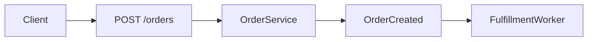
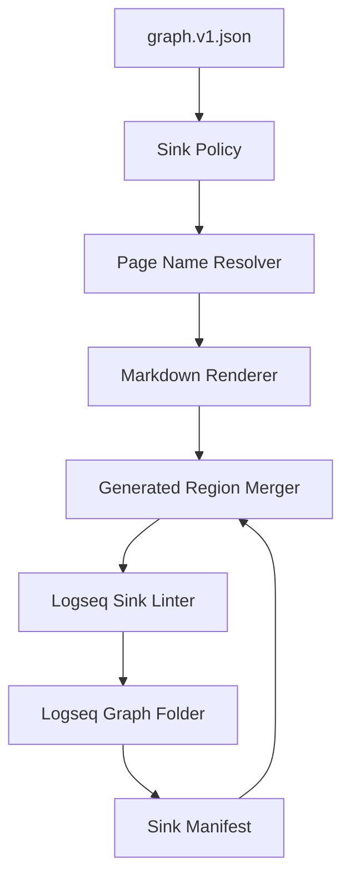

------
title: Build From Scratch: Mintlify-like AI-driven Documentation Generator CLI - Part 034
description: Design and implement a Logseq-compatible knowledge graph export layer for AI-generated developer documentation systems.
series: learn-ai-docs-km-cli
seriesTitle: Build From Scratch: Mintlify-like AI-driven Documentation Generator CLI with Code2Prompt and Open-source Knowledge Management
order: 34
partTitle: Logseq-compatible Knowledge Graph
tags:
- ai-docs
- documentation
- cli
- knowledge-management
- logseq
- markdown
- graph
- backlinks
date: 2026-07-04
---

# Part 034 — Logseq-compatible Knowledge Graph

Pada part sebelumnya kita membangun mental model:

- docs adalah surface yang dibaca manusia,
- knowledge graph adalah relational memory,
- notes adalah workspace yang bisa diedit manusia,
- retrieval adalah cara sistem mengambil knowledge yang relevan.

Sekarang kita akan membuat export target pertama: **Logseq-compatible knowledge graph**.

Tujuannya bukan membuat clone Logseq. Tujuannya membuat output markdown yang:

1. bisa dibuka sebagai Logseq graph,
2. tetap readable di editor biasa,
3. punya backlinks melalui page references,
4. punya metadata yang cukup untuk sync dan drift detection,
5. tidak mengunci sistem kita ke Logseq internals yang bisa berubah.

Logseq cocok untuk target ini karena ia open-source, privacy-first, berfokus pada knowledge management/collaboration, dan mendukung Markdown serta Org-mode. Untuk seri ini kita akan memilih Markdown karena lebih mudah dihasilkan, di-diff, dan di-review di Git.

---

## 1. Design Goal

Kita ingin command seperti ini:

```bash
aidocs knowledge notes write --sink logseq
```

menghasilkan folder seperti ini:

```txt
knowledge-sinks/logseq/
  pages/
    OrderService.md
    POST orders.md
    Idempotency Key.md
    ADR 004 - Async Fulfillment.md
    FulfillmentWorker.md
  journals/
    2026_07_04.md
  assets/
  logseq/
    config.edn
  aidocs-sync-state.json
```

Logseq umum memakai graph folder berbasis file lokal. Ketika membuat graph dari Markdown existing, Logseq dapat membuat folder seperti `journals`, `pages`, dan `assets`; beberapa struktur juga memakai folder `logseq` untuk konfigurasi. Kita tidak akan bergantung pada semua behavior internal Logseq, tetapi layout ini cukup familiar dan aman untuk target Markdown graph.

---

## 2. Logseq Concepts We Need

Kita hanya butuh subset kecil.

### 2.1 Page

Page adalah unit utama yang kita tulis sebagai file Markdown.

Contoh:

```md
# [[OrderService]]

- type:: code.symbol
- source:: generated
- visibility:: internal
```

Dalam praktik Logseq, page dapat direferensikan menggunakan `[[Page Name]]`.

### 2.2 Block

Logseq adalah outliner. Banyak konten ditulis sebagai nested blocks.

Contoh:

```md
- Summary
  - Coordinates order creation.
  - Emits [[OrderCreated]].
- Source references
  - `src/order/OrderService.java`
```

Ini tetap Markdown biasa, tetapi struktur indentasinya membawa outline hierarchy.

### 2.3 Page Reference

Page reference adalah cara kita membuat graph edge yang human-readable.

```md
- Related concepts: [[Idempotency Key]], [[Order Lifecycle]]
```

Ini membuat backlink di Logseq.

### 2.4 Block Reference

Logseq juga mendukung block references. Page reference memakai `[[...]]`, sedangkan block reference memakai `((...))` dengan alamat block. Untuk generated knowledge system, kita sebaiknya menghindari block reference di awal karena UUID block lebih fragile untuk sinkronisasi lintas tool.

Rule awal:

> Use page references aggressively. Use block references only after we own stable block IDs and sync semantics.

### 2.5 Properties

Logseq-flavored Markdown sering memakai property lines seperti:

```md
type:: concept
source:: generated
confidence:: high
```

Kita akan menggunakan property lines untuk metadata yang perlu dibaca manusia dan tool.

---

## 3. Compatibility Strategy

Jangan mengejar 100% Logseq feature coverage.

Yang kita butuhkan adalah **compatible enough**.

| Feature | Gunakan? | Alasan |
|---|---:|---|
| Markdown pages | Ya | Diffable dan portable |
| Page references `[[...]]` | Ya | Backlink graph utama |
| Block references `((...))` | Tidak dulu | Butuh stable block identity |
| Properties `key:: value` | Ya | Metadata ringan |
| Queries | Tidak dulu | Terlalu Logseq-specific |
| Tasks/TODO | Opsional | Berguna untuk review items |
| Journals | Opsional | Berguna untuk sync log |
| Assets | Ya, jika diagram/image | Standard local graph pattern |
| Plugins | Tidak | Hindari lock-in |

Target:

> The generated notes should remain useful even outside Logseq.

Kalau dibuka di VS Code, GitHub, atau static markdown viewer, kontennya tetap masuk akal.

---

## 4. Mapping Internal Graph to Logseq Pages

Internal graph kita punya nodes dan edges.

```json
{
  "nodes": [
    {"id": "endpoint:POST:/orders", "type": "api.endpoint", "name": "POST /orders"},
    {"id": "concept:idempotency-key", "type": "concept", "name": "Idempotency Key"}
  ],
  "edges": [
    {"from": "endpoint:POST:/orders", "type": "uses", "to": "concept:idempotency-key"}
  ]
}
```

Logseq pages should be generated from nodes.

Edges become links.

```md
# [[POST /orders]]

type:: api.endpoint
node_id:: endpoint:POST:/orders
source:: generated
visibility:: public

- Summary
  - Creates a new order.
- Uses
  - [[Idempotency Key]]
```

And the target page:

```md
# [[Idempotency Key]]

type:: concept
node_id:: concept:idempotency-key
source:: generated
visibility:: public

- Related endpoints
  - [[POST /orders]]
```

In Logseq, the explicit forward links also create discoverable backlinks.

---

## 5. Page Naming Policy

Page names are user-facing, so be careful.

Bad names:

```txt
endpoint:POST:/orders
src/main/java/com/acme/order/OrderService.java::OrderService
concept:idempotency-key
```

Good names:

```txt
POST /orders
OrderService
Idempotency Key
```

But names can collide.

Example:

```txt
UserService in billing repo
UserService in identity repo
```

Use disambiguation only when needed.

```txt
UserService (billing)
UserService (identity)
```

Page naming algorithm:

```ts
type PageNameCandidate = {
  nodeId: string;
  preferredName: string;
  aliases: string[];
  namespace?: string;
  collisionGroup?: string[];
};

function choosePageName(candidate: PageNameCandidate): string {
  if (!hasCollision(candidate.preferredName)) return candidate.preferredName;
  if (candidate.namespace) return `${candidate.preferredName} (${candidate.namespace})`;
  return `${candidate.preferredName} (${shortHash(candidate.nodeId)})`;
}
```

Invariant:

> `node_id` is stable. Page title can be renamed with redirect/alias support.

---

## 6. Filename Policy

Page title and filename are related but not identical.

Examples:

| Page Title | Filename |
|---|---|
| `POST /orders` | `POST orders.md` |
| `OrderService` | `OrderService.md` |
| `ADR 004 - Async Fulfillment` | `ADR 004 - Async Fulfillment.md` |
| `orders table` | `orders table.md` |

Rules:

1. preserve human readability,
2. replace path separators,
3. avoid unsafe characters,
4. keep a mapping file,
5. do not infer node ID from filename.

Mapping file:

```json
{
  "pages": [
    {
      "nodeId": "endpoint:POST:/orders",
      "pageName": "POST /orders",
      "filePath": "pages/POST orders.md"
    }
  ]
}
```

This prevents rename chaos.

---

## 7. Page Template by Node Type

Different nodes need different page structure.

### 7.1 Concept Page

```md
# [[Idempotency Key]]

type:: concept
node_id:: concept:idempotency-key
ownership:: generated
visibility:: public
confidence:: high
aliases:: Idempotency, Idempotent request

- Summary
  - Idempotency keys help prevent duplicate processing of retryable write requests.
- Used by
  - [[POST /orders]]
  - [[POST /payments]]
- Verified from
  - `openapi.yaml#/components/parameters/IdempotencyKey`
  - `OrderControllerTest.duplicateIdempotencyKeyReturnsExistingOrder`
- Notes
  - This concept should appear in public retry guides.
```

### 7.2 API Endpoint Page

```md
# [[POST /orders]]

type:: api.endpoint
node_id:: endpoint:POST:/orders
method:: POST
path:: /orders
visibility:: public
ownership:: generated

- Summary
  - Creates a new order.
- Request
  - Uses [[OrderCreateRequest]].
  - Supports [[Idempotency Key]].
- Response
  - Returns [[Order]].
- Examples
  - [[Create order successfully]]
- Documentation
  - [[Guide - Creating orders]]
- Source references
  - `openapi.yaml#/paths/~1orders/post`
```

### 7.3 Code Symbol Page

```md
# [[OrderService]]

type:: code.symbol
node_id:: code-symbol:checkout:OrderService
language:: java
visibility:: internal
ownership:: generated

- Summary
  - Coordinates order creation and cancellation.
- Responsibilities
  - Persists [[orders table]].
  - Emits [[OrderCreated]].
- Public methods
  - `createOrder`
  - `cancelOrder`
- Related docs
  - [[Guide - Creating orders]]
- Source references
  - `services/order/src/main/java/com/acme/order/OrderService.java`
```

### 7.4 ADR / Decision Page

```md
# [[ADR 004 - Async Fulfillment]]

type:: decision
node_id:: decision:adr-004-async-fulfillment
status:: accepted
visibility:: internal
ownership:: manual

- Decision
  - Fulfillment is processed asynchronously after order creation.
- Context
  - Checkout latency must not depend on warehouse API availability.
- Consequences
  - [[POST /orders]] can return before fulfillment completes.
  - [[Order stuck in fulfillment]] runbook is required.
- Related
  - [[OrderCreated]]
  - [[FulfillmentWorker]]
```

### 7.5 Runbook Page

```md
# [[Order stuck in fulfillment]]

type:: runbook
node_id:: runbook:order-stuck-in-fulfillment
visibility:: internal
ownership:: hybrid
severity:: high

- Symptom
  - Order remains in `PENDING_FULFILLMENT` for more than 30 minutes.
- Related components
  - [[FulfillmentWorker]]
  - [[OrderCreated]]
- Checks
  - Verify event consumer lag.
  - Verify dead letter queue.
- Safe fix
  - Replay the event only after verifying idempotency.
- Source references
  - `runbooks/order-fulfillment.md`
```

---

## 8. Rendering Edges as Blocks

Given graph edge:

```json
{
  "from": "endpoint:POST:/orders",
  "type": "uses",
  "to": "concept:idempotency-key"
}
```

Render under a relationship group:

```md
- Uses
  - [[Idempotency Key]]
```

Relation grouping table:

| Edge Type | Logseq Section |
|---|---|
| `uses` | Uses |
| `calls` | Calls |
| `emits` | Emits |
| `consumes` | Consumes |
| `persists_to` | Persists to |
| `tested_by` | Verified by examples/tests |
| `documented_by` | Documentation |
| `decided_by` | Decisions |
| `troubleshooted_by` | Runbooks |
| `configured_by` | Configuration |
| `contradicts` | Conflicts / review required |

Do not dump all edges blindly. Page should stay readable.

Use priority.

```ts
const relationPriority = [
  "uses",
  "emits",
  "consumes",
  "persists_to",
  "tested_by",
  "documented_by",
  "decided_by",
  "troubleshooted_by",
  "configured_by",
  "contradicts"
];
```

---

## 9. Generated Region Policy

Human edits must survive sync.

Use generated regions.

```md
# [[OrderService]]

type:: code.symbol
node_id:: code-symbol:checkout:OrderService
ownership:: hybrid

<!-- aidocs:generated:start section="summary" hash="abc123" -->
- Summary
  - Coordinates order creation and cancellation.
<!-- aidocs:generated:end -->

- Human notes
  - This service is being refactored in Q3.
  - Be careful with checkout latency assumptions.

<!-- aidocs:generated:start section="relations" hash="def456" -->
- Emits
  - [[OrderCreated]]
- Persists to
  - [[orders table]]
<!-- aidocs:generated:end -->
```

Sync rule:

- update generated regions if source hash changed,
- preserve unmarked human regions,
- never delete human content automatically,
- show conflict if human edits inside generated region.

---

## 10. Logseq Sink Manifest

Create a manifest.

```json
{
  "version": "logseq-sink.v1",
  "graphRoot": "knowledge-sinks/logseq",
  "pages": [
    {
      "nodeId": "endpoint:POST:/orders",
      "pageName": "POST /orders",
      "filePath": "pages/POST orders.md",
      "contentHash": "sha256:...",
      "sourceGraphHash": "sha256:...",
      "ownership": "generated",
      "lastWrittenAt": "2026-07-04T00:00:00Z"
    }
  ]
}
```

This is critical for:

- idempotent writes,
- rename tracking,
- stale note detection,
- conflict detection,
- deletion/tombstone handling.

---

## 11. Tombstones and Deletions

If a source node disappears, do not immediately delete the page.

Example:

```json
{
  "nodeId": "endpoint:POST:/legacy-orders",
  "pageName": "POST /legacy-orders",
  "status": "orphaned",
  "reason": "source node missing from graph.v1.json",
  "firstDetectedAt": "2026-07-04T00:00:00Z"
}
```

Options:

```bash
aidocs knowledge notes prune --sink logseq --dry-run
aidocs knowledge notes prune --sink logseq --archive
aidocs knowledge notes prune --sink logseq --delete-reviewed
```

Default behavior:

> Mark stale/orphaned. Do not delete.

Generated docs and generated notes should be conservative with deletion.

---

## 12. Collision Handling

Two nodes can want the same page name.

Example:

```txt
schema:Order
class:Order
```

Possible output:

```txt
Order
Order (schema)
```

But that may be ugly. Alternative: merge if semantically same.

Merge policy:

```yaml
pageMergePolicy:
  allowMerge:
    - schema + code.symbol when sourceRefs are linked by contract implementation
  requireSeparate:
    - api.endpoint
    - decision
    - runbook
  collisionSuffix:
    schema: schema
    code.symbol: code
    database.table: table
```

A page can represent multiple nodes only if the relation is explicit.

```md
# [[Order]]

type:: concept
node_ids:: schema:Order, code-symbol:Order

- Represents
  - [[Order schema]] in API contracts.
  - [[Order entity]] in implementation.
```

For advanced systems, separate them. For beginner-friendly notes, merge carefully.

---

## 13. Aliases and Renames

Use aliases to keep old names searchable.

```md
# [[Account Holder]]

aliases:: User, Customer, Account owner
```

Rename flow:

```bash
aidocs knowledge notes rename \
  --node concept:account-holder \
  --from "Customer" \
  --to "Account Holder" \
  --sink logseq
```

The command should:

1. update manifest,
2. move file,
3. add old name to aliases,
4. update generated links,
5. preserve manual content,
6. emit review diff.

---

## 14. Visibility-safe Export

Not every node should be exported to every graph.

You may want multiple Logseq sinks:

```yaml
knowledgeSinks:
  logseq-public:
    root: knowledge-sinks/logseq-public
    includeVisibility: [public]
  logseq-internal:
    root: knowledge-sinks/logseq-internal
    includeVisibility: [public, internal]
  logseq-restricted:
    root: knowledge-sinks/logseq-restricted
    includeVisibility: [restricted]
    requireExplicitCommand: true
```

This prevents restricted runbooks from being synced into a graph used for public docs drafting.

Export filter:

```ts
function canExport(node: KnowledgeNode, sink: SinkPolicy): boolean {
  return sink.includeVisibility.includes(node.visibility);
}
```

Do not rely on folder name as security boundary. Visibility must be enforced before rendering.

---

## 15. Generated Daily Journal

A journal entry can summarize sync changes.

```md
# 2026-07-04

- Aidocs sync
  - Created pages
    - [[POST /orders]]
    - [[Idempotency Key]]
  - Updated pages
    - [[OrderService]]
  - Stale pages
    - [[POST /legacy-orders]]
  - Review required
    - [[Authentication Boundary]] has low-confidence relation to [[Admin API]]
```

This is useful because Logseq users often work from journals.

But make it optional.

```yaml
logseq:
  journals:
    writeSyncJournal: true
```

---

## 16. Avoiding Over-Linking

A bad generated graph is unreadable.

Bad page:

```md
- Related
  - [[Order]]
  - [[OrderService]]
  - [[OrderController]]
  - [[OrderRepository]]
  - [[OrderDTO]]
  - [[OrderMapper]]
  - [[OrderCreated]]
  - [[OrderCancelled]]
  - [[OrderFailed]]
  - [[PaymentService]]
  - [[UserService]]
  - [[TenantService]]
```

Better:

```md
- Core relations
  - Uses [[OrderCreateRequest]].
  - Emits [[OrderCreated]].
  - Documented by [[Guide - Creating orders]].
- More relations
  - See `aidocs knowledge inspect endpoint:POST:/orders --depth 2`.
```

Use relation caps:

```yaml
logseq:
  maxLinksPerSection: 8
  maxSectionsPerPage: 10
  collapseLowPriorityRelations: true
```

---

## 17. Note Generation Algorithm

High-level algorithm:

```ts
function writeLogseqNotes(graph: KnowledgeGraph, sink: LogseqSink): WritePlan {
  const nodes = selectExportableNodes(graph, sink.policy);
  const pageNames = assignPageNames(nodes);
  const files = [];

  for (const node of nodes) {
    const edges = selectRenderableEdges(graph, node, sink.policy);
    const page = renderPage(node, edges, pageNames, sink.templates);
    const merged = mergeWithExistingPage(page, sink.existingFiles[node.id]);
    files.push(merged);
  }

  return buildWritePlan(files);
}
```

The implementation should produce a dry-run diff first.

```bash
aidocs knowledge notes write --sink logseq --dry-run
```

Only write with explicit apply:

```bash
aidocs knowledge notes write --sink logseq --apply
```

---

## 18. Write Plan Format

```json
{
  "version": "logseq-write-plan.v1",
  "sink": "logseq-internal",
  "summary": {
    "create": 12,
    "update": 8,
    "unchanged": 91,
    "stale": 3,
    "conflict": 1
  },
  "operations": [
    {
      "type": "create",
      "nodeId": "concept:idempotency-key",
      "filePath": "pages/Idempotency Key.md",
      "risk": "low"
    },
    {
      "type": "update",
      "nodeId": "code-symbol:OrderService",
      "filePath": "pages/OrderService.md",
      "risk": "medium",
      "reason": "generated relation section changed"
    }
  ]
}
```

This mirrors the human-in-the-loop philosophy from earlier parts.

---

## 19. Conflict Model

Conflict happens when:

1. generated region changed manually,
2. page was renamed outside CLI,
3. same page name maps to different node,
4. visibility changed from public to restricted,
5. source node disappeared but page has human content.

Conflict example:

```txt
CONFLICT: pages/OrderService.md
Reason: generated section "relations" was manually edited.
Options:
  1. keep human edits
  2. regenerate section
  3. create side-by-side proposal
```

CLI command:

```bash
aidocs knowledge notes conflicts --sink logseq
```

Resolve:

```bash
aidocs knowledge notes resolve pages/OrderService.md --keep-human
aidocs knowledge notes resolve pages/OrderService.md --regenerate
aidocs knowledge notes resolve pages/OrderService.md --proposal
```

---

## 20. Source References in Notes

Always include source references, but keep them readable.

```md
- Source references
  - `openapi.yaml#/paths/~1orders/post`
  - `services/order/src/main/java/com/acme/order/OrderService.java:42-91`
  - `services/order/src/test/java/com/acme/order/OrderControllerTest.java:120-151`
```

Do not include giant source excerpts by default. Notes are navigation and memory, not code dumps.

For source-grounding, the note can point to the artifact:

```md
- Evidence
  - `sourceRef:src_01JZ7R...`
  - `claimLedger:claim_01JZ7T...`
```

---

## 21. Mermaid Diagram Per Concept

For important concepts, generate small diagrams.

```md
- Flow
  ```mermaid
  flowchart LR
    Client --> Endpoint[POST /orders]
    Endpoint --> Service[OrderService]
    Service --> Event[OrderCreated]
    Event --> Worker[FulfillmentWorker]
  ```
```

But be careful: nested fenced code blocks inside list indentation can render differently across Markdown tools.

Safer output:

````md
## Flow


````

For Logseq compatibility, keep diagrams as top-level sections unless tested otherwise.

---

## 22. `aidocs logseq lint`

Add a linter.

Checks:

- every generated page has `node_id`,
- every generated page has `type`,
- no restricted node appears in public sink,
- no broken `[[Page Reference]]`,
- no duplicate page names,
- no page name maps to multiple unrelated nodes,
- generated regions are balanced,
- source references are valid,
- page length is below threshold,
- aliases do not create cycles/confusion.

Example output:

```txt
Logseq sink lint
----------------
Pages: 147
Broken refs: 2
Duplicate page names: 0
Restricted leaks: 0
Generated region conflicts: 1
Orphaned pages: 3

Broken refs:
  pages/OrderService.md -> [[OrderCreatedEvent]] not found
  pages/FulfillmentWorker.md -> [[Warehouse API]] not found
```

---

## 23. How Logseq Notes Feed Back Into Docs

Once humans edit notes, we may want to use notes as input.

But not every note is trustworthy.

Classify note sections:

```md
# [[Idempotency Key]]

- Human notes
  - Public docs should explain retries before idempotency.
- Open questions
  - Does payment capture use the same key or a different key?
- Generated source-backed facts
  - The `Idempotency-Key` header is used by [[POST /orders]].
```

When retrieving notes for docs generation:

| Section | Use as source? | Use as hint? |
|---|---:|---:|
| Source-backed facts | Yes, with refs | Yes |
| Human notes | Not factual by default | Yes |
| Open questions | No | Yes, as uncertainty |
| Generated low-confidence | No | Maybe |
| Editorial policy | No | Yes |

Prompt compiler should tag note content:

```txt
[HUMAN_NOTE]
Public docs should explain retries before idempotency.

[OPEN_QUESTION]
Does payment capture use the same key or a different key?

[SOURCE_BACKED]
The Idempotency-Key header is used by POST /orders.
Source: openapi.yaml#/paths/~1orders/post
```

---

## 24. Example End-to-End

Input graph:

```json
{
  "nodes": [
    {"id":"endpoint:POST:/orders","type":"api.endpoint","name":"POST /orders","visibility":"public"},
    {"id":"schema:OrderCreateRequest","type":"schema","name":"OrderCreateRequest","visibility":"public"},
    {"id":"concept:idempotency-key","type":"concept","name":"Idempotency Key","visibility":"public"},
    {"id":"code-symbol:OrderService","type":"code.symbol","name":"OrderService","visibility":"internal"}
  ],
  "edges": [
    {"from":"endpoint:POST:/orders","type":"uses","to":"schema:OrderCreateRequest"},
    {"from":"endpoint:POST:/orders","type":"uses","to":"concept:idempotency-key"},
    {"from":"code-symbol:OrderService","type":"implements","to":"endpoint:POST:/orders"}
  ]
}
```

Public sink output includes:

```txt
POST orders.md
OrderCreateRequest.md
Idempotency Key.md
```

Internal sink output includes:

```txt
POST orders.md
OrderCreateRequest.md
Idempotency Key.md
OrderService.md
```

Public page should not link to internal `OrderService` unless the link is sanitized or omitted.

---

## 25. Minimal Config

```yaml
knowledge:
  sinks:
    logseqInternal:
      type: logseq
      root: knowledge-sinks/logseq-internal
      format: markdown
      includeVisibility:
        - public
        - internal
      generatedRegions: true
      writeSyncJournal: true
      maxLinksPerSection: 8
      pageTypes:
        - concept
        - api.endpoint
        - schema
        - code.symbol
        - decision
        - runbook
    logseqPublic:
      type: logseq
      root: knowledge-sinks/logseq-public
      format: markdown
      includeVisibility:
        - public
      generatedRegions: true
      writeSyncJournal: false
```

---

## 26. Testing Strategy

Test the sink like a compiler backend.

### 26.1 Snapshot Tests

Given graph fixture, output markdown must match expected.

```txt
fixtures/logseq/basic-graph/input/graph.v1.json
fixtures/logseq/basic-graph/expected/pages/Idempotency Key.md
```

### 26.2 Round-trip Tests

Write notes, modify human section, write again. Human section must survive.

### 26.3 Link Tests

Every `[[Page]]` reference resolves to an existing page or intentional alias.

### 26.4 Visibility Tests

Restricted nodes must not appear in public graph.

### 26.5 Collision Tests

Two nodes with same preferred name should be disambiguated deterministically.

### 26.6 Drift Tests

When source node changes, generated region updates and stale status is reported.

---

## 27. Failure Modes

### Failure Mode 1: Graph Spam

Too many pages, too many links, too much noise.

Mitigation:

- page type filters,
- relation priority,
- link caps,
- summary pages.

### Failure Mode 2: Broken Backlinks

Generated links point to pages that do not exist.

Mitigation:

- link resolver,
- linter,
- alias index.

### Failure Mode 3: Human Notes Overwritten

Generated sync destroys useful human edits.

Mitigation:

- generated regions,
- manifest,
- conflict detection,
- dry-run before apply.

### Failure Mode 4: Sensitive Knowledge Leaks

Internal runbooks appear in public sink.

Mitigation:

- visibility filter,
- restricted-node lint,
- source redaction,
- CI gate.

### Failure Mode 5: Tool Lock-in

Notes become unusable outside Logseq.

Mitigation:

- stay close to Markdown,
- avoid queries/plugins/block refs initially,
- keep graph artifact independent.

---

## 28. Implementation Skeleton

```ts
type LogseqSinkConfig = {
  root: string;
  includeVisibility: Visibility[];
  generatedRegions: boolean;
  writeSyncJournal: boolean;
  maxLinksPerSection: number;
};

class LogseqSink {
  constructor(
    private graph: KnowledgeGraph,
    private config: LogseqSinkConfig,
    private fs: FileSystem
  ) {}

  plan(): LogseqWritePlan {
    const nodes = this.selectNodes();
    const names = assignPageNames(nodes);
    const operations = nodes.map(node => this.planPage(node, names));
    return summarize(operations);
  }

  apply(plan: LogseqWritePlan): void {
    for (const op of plan.operations) {
      if (op.type === "create" || op.type === "update") {
        this.fs.writeFile(op.filePath, op.content);
      }
    }
    this.writeManifest(plan);
    if (this.config.writeSyncJournal) this.writeJournal(plan);
  }
}
```

Keep it simple. Complexity should live in explicit policies, not hidden magic.

---

## 29. CLI UX

```bash
aidocs knowledge notes plan --sink logseq-internal
```

Output:

```txt
Logseq write plan
-----------------
Create: 18
Update: 7
Unchanged: 112
Stale: 3
Conflicts: 0
Restricted leaks: 0

Review plan: .aidocs/knowledge/logseq-write-plan.v1.json
```

Dry run:

```bash
aidocs knowledge notes write --sink logseq-internal --dry-run
```

Apply:

```bash
aidocs knowledge notes write --sink logseq-internal --apply
```

Inspect page:

```bash
aidocs knowledge notes inspect "POST /orders" --sink logseq-internal
```

Lint:

```bash
aidocs logseq lint --sink logseq-internal
```

---

## 30. Final Architecture for Logseq Sink



The important part is the feedback loop:

- manifest remembers what we wrote,
- merger preserves what humans changed,
- linter prevents broken graph output,
- source graph remains independent from Logseq markdown.

---

## 31. References

- Logseq GitHub repository describes Logseq as a privacy-first, open-source platform for knowledge management and collaboration with Markdown and Org-mode support: https://github.com/logseq/logseq
- Logseq discussion on using existing Markdown files explains creating a graph from a directory and mentions folders such as `journals`, `pages`, and `assets`: https://discuss.logseq.com/t/how-to-create-a-logseq-graph-using-existing-markdown-files/8431
- Logseq block reference documentation explains page references using `[[double brackets]]` and block references using `((double parenthesis))`: https://discuss.logseq.com/t/the-basics-of-logseq-block-references/8458

---

## 32. Checkpoint

You should now be able to design a Logseq-compatible export that is:

- graph-aware,
- markdown-first,
- source-grounded,
- visibility-safe,
- human-edit preserving,
- reviewable,
- lintable,
- not tightly coupled to Logseq internals.

In the next part, we will design the second knowledge sink: **OpenNote-compatible semantic knowledge store**.
