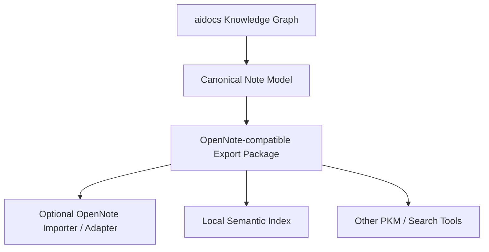
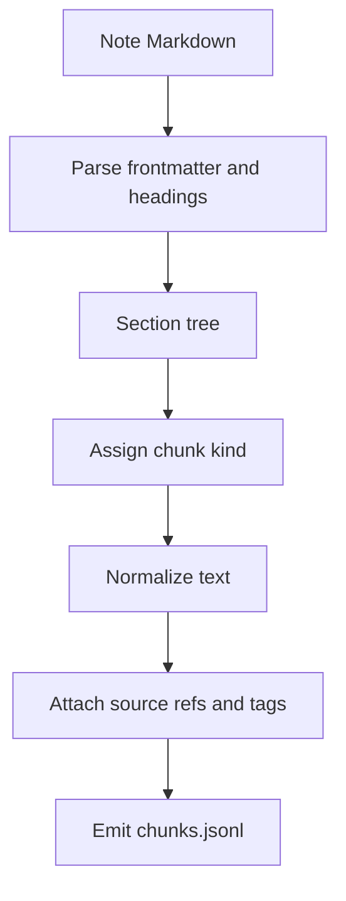
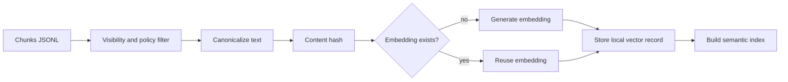
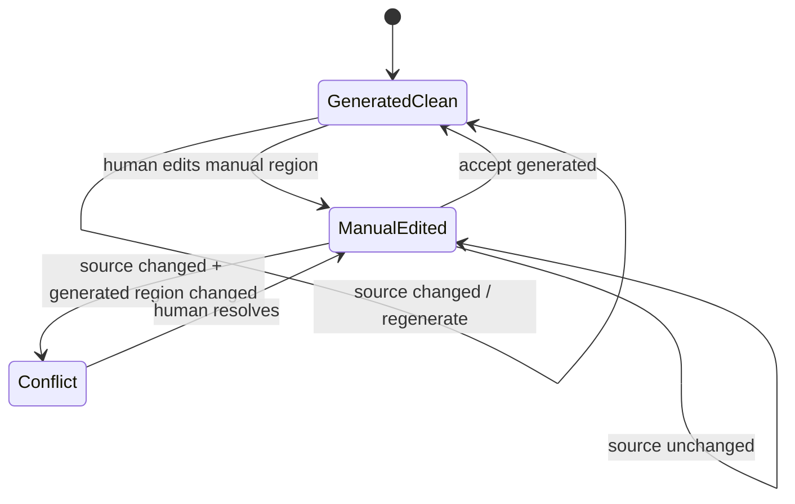
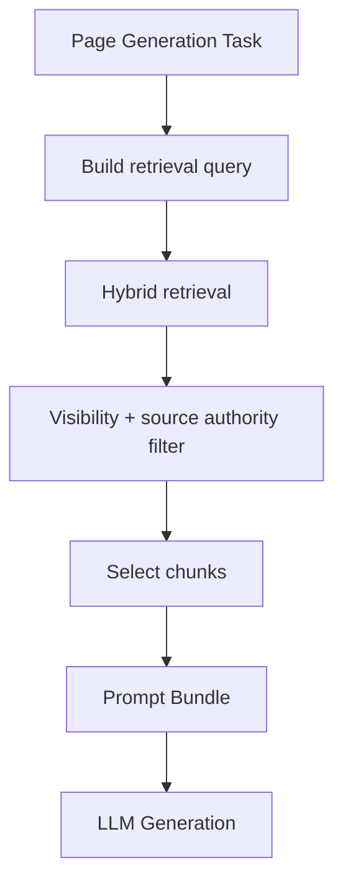

------
title: Build From Scratch: Mintlify-like AI-driven Documentation Generator CLI - Part 035
description: Design an OpenNote-compatible semantic knowledge store adapter for local-first developer documentation intelligence.
series: learn-ai-docs-km-cli
seriesTitle: Build From Scratch: Mintlify-like AI-driven Documentation Generator CLI with Code2Prompt and Open-source Knowledge Management
order: 35
partTitle: OpenNote-compatible Semantic Knowledge Store
tags:
- ai-docs
- documentation
- cli
- knowledge-management
- opennote
- semantic-search
- local-first
- embeddings
- retrieval
date: 2026-07-04
---

# Part 035 — OpenNote-compatible Semantic Knowledge Store

Pada part sebelumnya kita membuat export target untuk **Logseq-compatible knowledge graph**.

Logseq cocok untuk linked notes, backlinks, block references, dan graph navigation. Tetapi untuk documentation generator modern, linked notes saja belum cukup. Sistem juga perlu bisa menjawab pertanyaan seperti:

- “Di mana konsep idempotency dijelaskan?”
- “Bagian mana dari codebase yang paling relevan dengan endpoint `POST /orders`?”
- “Apa catatan internal yang menjelaskan kenapa modul fulfillment dibuat asynchronous?”
- “Dokumentasi mana yang kemungkinan terdampak oleh perubahan schema `OrderStatus`?”
- “Apa runbook yang berhubungan dengan error `PaymentProviderTimeout`?”

Pertanyaan seperti ini membutuhkan **semantic knowledge store**.

Target kita di part ini adalah mendesain adapter yang kompatibel dengan gaya **OpenNote-compatible local semantic notebook**: knowledge ditulis sebagai artifact lokal, bisa disinkronkan, bisa diindeks secara semantic, dan tidak membuat sistem kita bergantung buta pada internal database tool tertentu.

OpenNote yang relevan untuk seri ini adalah proyek `opennote-org/opennote`, yaitu notebook app yang dapat dijalankan lokal, dibangun dengan Rust, dan mendukung semantic search secara native. Karena project semacam ini masih berkembang, strategi yang benar bukan “hard-code internal storage OpenNote”, tetapi membuat **interchange layer** yang aman, stabil, dan mudah dipetakan ke OpenNote atau semantic notebook lain.

> Prinsip desain part ini: **export knowledge secara lokal dan semantic-friendly, tetapi jangan kunci domain model kita ke format internal tool yang belum menjadi standard.**

---

## 1. Target Outcome

Setelah part ini, command seperti ini:

```bash
aidocs knowledge notes write --sink opennote
```

akan menghasilkan output seperti ini:

```txt
knowledge-sinks/opennote/
  notebook.json
  notes/
    component-order-service.note.md
    api-post-orders.note.md
    concept-idempotency-key.note.md
    runbook-payment-provider-timeout.note.md
    adr-async-fulfillment.note.md
  chunks/
    component-order-service.chunks.jsonl
    api-post-orders.chunks.jsonl
  embeddings/
    manifest.json
    local-index.jsonl
  relations/
    graph.edges.jsonl
  aidocs-sync-state.json
```

Output ini sengaja tidak diasumsikan sebagai internal database OpenNote. Ini adalah **adapter output** yang:

1. local-first,
2. Git-reviewable,
3. semantic-search-ready,
4. source-grounded,
5. dapat diimpor atau diadaptasi ke OpenNote,
6. tetap berguna walaupun target tool berubah.

---

## 2. Mengapa Kita Butuh Semantic Store, Bukan Hanya Markdown Notes

Markdown notes bagus untuk manusia. Semantic store bagus untuk mesin dan retrieval.

Perbedaannya:

| Aspek | Markdown/Logseq-style Notes | Semantic Knowledge Store |
|---|---|---|
| Unit utama | Page/block | Note/chunk/vector/metadata |
| Navigasi | Link dan backlink | Search, similarity, metadata filter |
| Query | Manual browsing | Retrieval otomatis |
| Kekuatan | Human-readable graph | Context selection untuk AI |
| Risiko | Hubungan terlalu manual | Retrieval bisa salah relevansi |
| Cocok untuk | PKM, notes, concept graph | RAG, docs assistant, context compiler |

Dalam sistem kita, semantic store dipakai oleh tiga consumer:

1. **Documentation generator**  
   Untuk menemukan catatan internal yang relevan saat membuat halaman docs.

2. **Context compiler**  
   Untuk memperkaya prompt bundle dengan knowledge yang relevan, bukan hanya source code.

3. **Developer knowledge assistant**  
   Untuk menjawab pertanyaan berdasarkan docs, notes, runbooks, ADR, examples, dan source-derived concepts.

Tetapi semantic store bukan source of truth tertinggi.

Hierarchy tetap:

```txt
source code / contracts / tests / configs
  > generated verified docs
  > human-reviewed notes
  > generated semantic chunks
  > LLM output
```

Semantic store hanya mempercepat retrieval. Ia tidak boleh menggantikan source-backed verification.

---

## 3. OpenNote-compatible Does Not Mean OpenNote-internal

Ini penting.

Kalau kita terlalu cepat menulis langsung ke internal database sebuah app, kita membuat sistem rapuh. Tool bisa mengubah schema, storage layout, indexing strategy, atau API.

Maka kita memakai tiga lapisan:



Lapisan canonical kita kontrol. Lapisan export kita desain stabil. Lapisan importer boleh berubah mengikuti OpenNote.

Invariant:

- domain model tidak bergantung pada internal OpenNote,
- generated notes tetap readable sebagai Markdown,
- chunk metadata tetap tersedia sebagai JSONL,
- embedding/index bisa dibangun ulang dari note source,
- sync state eksplisit dan bisa di-debug.

---

## 4. Core Concepts

Kita akan pakai model berikut.

### 4.1 Notebook

Notebook adalah container knowledge.

Contoh:

```json
{
  "schema": "opennote-export.v1",
  "notebookId": "repo:acme/order-platform",
  "title": "ACME Order Platform Knowledge",
  "createdBy": "aidocs",
  "sourceRepository": {
    "remote": "git@github.com:acme/order-platform.git",
    "commit": "8d31a12"
  }
}
```

Notebook tidak harus satu repo. Untuk monorepo, kita bisa punya:

- satu notebook untuk seluruh workspace,
- satu notebook per product,
- satu notebook per service,
- satu notebook internal-only untuk ops/security.

Rekomendasi awal: **satu notebook per docs project**, bukan per repository fisik.

Alasannya: docs project adalah boundary pembaca. Repository fisik bisa terlalu luas atau terlalu sempit.

---

### 4.2 Note

Note adalah unit pengetahuan utama.

Satu note bisa mewakili:

- component,
- endpoint,
- schema,
- configuration key,
- event,
- database table,
- runbook,
- concept,
- ADR,
- glossary entry,
- troubleshooting item.

Contoh file:

```md
---
schema: note-card.v1
id: note:api:post-orders
type: api-operation
title: POST /orders
visibility: public
confidence: 0.91
sourceRefs:
  - source://openapi/openapi.yaml#/paths/~1orders/post
  - source://src/routes/orders.ts#L24-L89
relations:
  - type: uses-schema
    target: note:schema:CreateOrderRequest
  - type: documented-by
    target: doc://docs/api/orders/create-order.mdx
---

# POST /orders

Creates a new order request.

## What this operation does

This operation accepts a create-order payload, validates customer and line item data, then creates an order in pending fulfillment state.

## Important behavior

- Idempotency is controlled by the `Idempotency-Key` header.
- Validation errors return a structured error response.
- Fulfillment is not completed synchronously.
```

Note harus bisa dibaca manusia, tetapi metadata-nya cukup untuk retrieval dan sync.

---

### 4.3 Chunk

Chunk adalah potongan note yang siap masuk semantic search.

Jangan langsung embed seluruh note panjang. Kita butuh chunk karena retrieval perlu unit kecil yang relevan.

Contoh `chunks/api-post-orders.chunks.jsonl`:

```jsonl
{"chunkId":"chunk:api:post-orders:summary","noteId":"note:api:post-orders","kind":"summary","text":"POST /orders creates a pending order and relies on Idempotency-Key for safe retries.","sourceRefs":["source://openapi/openapi.yaml#/paths/~1orders/post"],"tags":["api","orders","idempotency"]}
{"chunkId":"chunk:api:post-orders:errors","noteId":"note:api:post-orders","kind":"error-model","text":"Validation errors return a structured error response when customer or line item data is invalid.","sourceRefs":["source://openapi/openapi.yaml#/components/schemas/ErrorResponse"],"tags":["api","errors","validation"]}
```

Chunk harus punya:

- stable ID,
- parent note ID,
- chunk kind,
- text canonical,
- source references,
- tags,
- visibility,
- confidence,
- optional embedding metadata.

---

### 4.4 Embedding Record

Embedding adalah derived artifact.

Ia tidak boleh menjadi satu-satunya source. Kalau embedding hilang, kita bisa rebuild dari chunks.

Contoh:

```json
{
  "embeddingId": "emb:chunk:api:post-orders:summary:v1",
  "chunkId": "chunk:api:post-orders:summary",
  "model": "text-embedding-local-small",
  "dimension": 384,
  "contentHash": "sha256:...",
  "createdAt": "2026-07-04T00:00:00Z"
}
```

Jangan simpan vector mentah di Markdown. Simpan di index file atau database lokal.

---

### 4.5 Relation

Relation menghubungkan note.

Contoh:

```jsonl
{"from":"note:api:post-orders","type":"uses-schema","to":"note:schema:CreateOrderRequest","confidence":0.96,"sourceRefs":["source://openapi/openapi.yaml#/paths/~1orders/post/requestBody"]}
{"from":"note:component:OrderService","type":"emits-event","to":"note:event:OrderCreated","confidence":0.84,"sourceRefs":["source://src/orders/OrderService.java#L120-L139"]}
```

Relation ini bisa dipakai oleh:

- Logseq backlinks,
- OpenNote semantic navigation,
- docs impact analysis,
- prompt context expansion,
- dependency-aware drift detection.

---

## 5. Canonical Note Model

Kita definisikan model canonical dulu.

```ts
export type NoteType =
  | "component"
  | "api-operation"
  | "schema"
  | "event"
  | "config-key"
  | "cli-command"
  | "database-table"
  | "runbook"
  | "concept"
  | "adr"
  | "doc-page"
  | "example";

export interface SourceRef {
  uri: string;
  kind: "file" | "symbol" | "openapi" | "schema" | "test" | "doc" | "config";
  lines?: { start: number; end: number };
  selector?: string;
  contentHash?: string;
}

export interface KnowledgeRelation {
  type: string;
  targetId: string;
  confidence: number;
  sourceRefs: SourceRef[];
}

export interface NoteCard {
  schema: "note-card.v1";
  id: string;
  type: NoteType;
  title: string;
  slug: string;
  visibility: "public" | "internal" | "restricted";
  owner?: string;
  confidence: number;
  summary: string;
  body: string;
  tags: string[];
  aliases: string[];
  sourceRefs: SourceRef[];
  relations: KnowledgeRelation[];
  generated: {
    by: "aidocs";
    at: string;
    commit?: string;
    inputHash: string;
  };
}
```

Model ini tidak menyebut OpenNote. Itu disengaja.

Adapter OpenNote hanya mengubah `NoteCard` menjadi format export.

---

## 6. Note Type Design

Tidak semua knowledge sama. Kalau semua note diperlakukan generik, retrieval akan bising.

### 6.1 Component Note

Untuk module/service/class/package penting.

Template:

```md
# OrderService

## Role

Explains the role of this component in the system.

## Responsibilities

- ...

## Public Surface

- ...

## Dependencies

- ...

## Emits / Consumes

- ...

## Source Evidence

- `src/orders/OrderService.java`
```

Chunk yang dihasilkan:

- role chunk,
- responsibility chunk,
- dependency chunk,
- public surface chunk,
- operational risk chunk.

---

### 6.2 API Operation Note

Untuk endpoint atau operation.

Template:

```md
# POST /orders

## Purpose

## Request Contract

## Response Contract

## Behavior

## Errors

## Examples

## Related Notes
```

Chunk yang dihasilkan:

- operation summary,
- request schema,
- response schema,
- error behavior,
- example usage.

---

### 6.3 Concept Note

Untuk konsep lintas source.

Contoh:

- Idempotency Key,
- Fulfillment State Machine,
- Retry Policy,
- Tenant Isolation,
- Price Calculation Rule.

Concept note tidak boleh mengarang definisi abstrak tanpa source. Kalau konsep tidak punya evidence, statusnya harus `draft` atau `low-confidence`.

---

### 6.4 Runbook Note

Untuk operational knowledge.

Template:

```md
# Payment Provider Timeout

## Symptom

## Likely Causes

## Verification Steps

## Safe Remediation

## Escalation

## Source Evidence
```

Runbook note harus punya safety policy lebih ketat karena bisa berisi command operasional.

---

## 7. Export Package Layout

Kita akan menghasilkan directory export seperti ini:

```txt
knowledge-sinks/opennote/
  notebook.json
  notes/
    <note-slug>.note.md
  chunks/
    <note-slug>.chunks.jsonl
  relations/
    graph.edges.jsonl
    graph.nodes.jsonl
  embeddings/
    manifest.json
    vectors.jsonl       # optional, local-only
  indexes/
    lexical.jsonl       # optional
    semantic.jsonl      # optional
  aidocs-sync-state.json
```

### 7.1 `notebook.json`

```json
{
  "schema": "opennote-export.v1",
  "notebookId": "repo:acme/order-platform",
  "title": "Order Platform Knowledge",
  "description": "Generated developer knowledge notebook for ACME Order Platform.",
  "source": {
    "type": "git",
    "remote": "git@github.com:acme/order-platform.git",
    "commit": "8d31a12"
  },
  "createdBy": "aidocs",
  "createdAt": "2026-07-04T00:00:00Z",
  "formatVersion": 1
}
```

### 7.2 `graph.nodes.jsonl`

```jsonl
{"id":"note:component:OrderService","type":"component","title":"OrderService","slug":"component-order-service","visibility":"internal","confidence":0.92}
{"id":"note:api:post-orders","type":"api-operation","title":"POST /orders","slug":"api-post-orders","visibility":"public","confidence":0.91}
```

### 7.3 `graph.edges.jsonl`

```jsonl
{"from":"note:api:post-orders","type":"handled-by","to":"note:component:OrderService","confidence":0.87,"sourceRefs":["source://src/routes/orders.ts#L24-L89"]}
```

### 7.4 `aidocs-sync-state.json`

```json
{
  "schema": "knowledge-sync-state.v1",
  "sink": "opennote",
  "lastSyncCommit": "8d31a12",
  "notes": {
    "note:api:post-orders": {
      "path": "notes/api-post-orders.note.md",
      "sourceHash": "sha256:...",
      "contentHash": "sha256:...",
      "status": "synced"
    }
  }
}
```

Sync state penting untuk incremental update dan conflict detection.

---

## 8. Markdown Note Format

Setiap note tetap Markdown.

Contoh:

```md
---
schema: note-card.v1
id: note:concept:idempotency-key
type: concept
title: Idempotency Key
slug: concept-idempotency-key
visibility: public
confidence: 0.88
tags:
  - api
  - reliability
  - retry
sourceRefs:
  - source://openapi/openapi.yaml#/components/parameters/IdempotencyKey
  - source://src/middleware/idempotency.ts#L1-L80
---

# Idempotency Key

<!-- aidocs:generated:start hash="sha256:..." -->

An idempotency key allows clients to safely retry create-style operations without accidentally creating duplicate resources.

## Where it appears

- `POST /orders`
- `POST /payments`

## Implementation notes

The middleware stores request fingerprints and response records for create operations.

## Source evidence

- `openapi/openapi.yaml#/components/parameters/IdempotencyKey`
- `src/middleware/idempotency.ts`

<!-- aidocs:generated:end -->

<!-- aidocs:manual:start -->

Team notes can be written here.

<!-- aidocs:manual:end -->
```

Generated/manual region tetap dipakai seperti di MDX authoring engine.

Kenapa?

Karena user mungkin ingin menambah catatan manual tanpa dihancurkan oleh sync berikutnya.

---

## 9. Semantic Chunking Strategy

Chunking adalah desain paling penting di semantic store.

Chunk terlalu besar:

- retrieval tidak presisi,
- prompt bundle boros,
- jawaban assistant terlalu umum.

Chunk terlalu kecil:

- konteks hilang,
- relation sulit dipahami,
- search menghasilkan potongan noise.

Kita pakai chunk berdasarkan semantic section, bukan fixed character split.



### 9.1 Chunk Kinds

```ts
export type ChunkKind =
  | "summary"
  | "role"
  | "responsibility"
  | "contract"
  | "behavior"
  | "example"
  | "error-model"
  | "configuration"
  | "dependency"
  | "runbook-step"
  | "decision-rationale"
  | "source-evidence";
```

### 9.2 Chunk Rules

Rule praktis:

1. `summary` selalu dibuat.
2. Heading level 2 biasanya menjadi chunk boundary.
3. Code block panjang dipisah dari narasi.
4. Source evidence tidak di-embed sebagai chunk utama, tetapi disimpan sebagai metadata.
5. Manual notes bisa di-embed, tetapi ditandai `origin: manual`.
6. Restricted notes tidak masuk public retrieval index.

Contoh chunk:

```json
{
  "schema": "knowledge-chunk.v1",
  "chunkId": "chunk:concept:idempotency-key:summary",
  "noteId": "note:concept:idempotency-key",
  "kind": "summary",
  "visibility": "public",
  "origin": "generated",
  "text": "An idempotency key allows clients to retry create-style operations without accidentally creating duplicate resources.",
  "tags": ["api", "reliability", "retry"],
  "sourceRefs": [
    "source://openapi/openapi.yaml#/components/parameters/IdempotencyKey"
  ],
  "confidence": 0.88,
  "contentHash": "sha256:..."
}
```

---

## 10. Embedding Pipeline

Embedding pipeline harus deterministic sejauh mungkin.



### 10.1 Canonical Text

Jangan embed Markdown mentah secara asal.

Gunakan canonical text:

```txt
Title: Idempotency Key
Type: concept
Tags: api, reliability, retry
Summary: An idempotency key allows clients to retry create-style operations without accidentally creating duplicate resources.
Source evidence: openapi/openapi.yaml#/components/parameters/IdempotencyKey
```

Kenapa title/type/tags ikut?

Karena embedding dari kalimat pendek bisa terlalu ambigu. Metadata membantu semantic matching.

### 10.2 Embedding Cache Key

```txt
sha256(
  embeddingModel + "\n" +
  embeddingProfile + "\n" +
  canonicalTextHash
)
```

Kalau content sama dan model sama, embedding bisa dipakai ulang.

### 10.3 Local vs Remote Embedding

Dua mode:

```yaml
knowledge:
  embedding:
    mode: local
    model: text-embedding-local-small
```

atau:

```yaml
knowledge:
  embedding:
    mode: provider
    provider: openai
    model: text-embedding-3-small
```

Untuk enterprise atau proprietary repo, local mode sering lebih aman.

Tetapi local model bisa punya kualitas retrieval berbeda. Maka sistem harus mengevaluasi retrieval, bukan hanya percaya pada embedding.

---

## 11. Semantic Index Model

Untuk seri ini, kita tidak memaksakan satu vector database.

Adapter semantic store bisa memakai:

- JSONL vector file untuk prototype,
- SQLite extension,
- embedded vector index,
- external vector DB,
- native OpenNote index jika tersedia dan stabil.

Canonical index record:

```ts
export interface SemanticIndexRecord {
  schema: "semantic-index-record.v1";
  embeddingId: string;
  chunkId: string;
  noteId: string;
  vectorRef: string;
  model: string;
  dimension: number;
  visibility: "public" | "internal" | "restricted";
  tags: string[];
  sourceRefs: string[];
  contentHash: string;
}
```

Vector bisa disimpan inline untuk local-only:

```json
{
  "embeddingId": "emb:chunk:concept:idempotency-key:summary:v1",
  "chunkId": "chunk:concept:idempotency-key:summary",
  "vector": [0.012, -0.031, 0.114],
  "dimension": 384
}
```

Untuk Git repository, sebaiknya vector besar tidak selalu di-commit. Commit:

- notes,
- chunks,
- relation graph,
- sync state,
- manifest.

Jangan selalu commit:

- full vector index,
- provider-specific cache,
- local search DB.

---

## 12. Retrieval Query Model

Semantic store bukan hanya menyimpan. Ia harus bisa query.

Command:

```bash
aidocs knowledge search "idempotent order creation" --sink opennote --top-k 5
```

Output:

```txt
1. concept-idempotency-key.note.md#summary
   score: 0.91
   source: openapi/openapi.yaml#/components/parameters/IdempotencyKey

2. api-post-orders.note.md#behavior
   score: 0.87
   source: openapi/openapi.yaml#/paths/~1orders/post

3. runbook-duplicate-order.note.md#safe-remediation
   score: 0.79
   source: docs/runbooks/duplicate-order.mdx
```

### 12.1 Hybrid Retrieval

Jangan hanya semantic.

Gunakan hybrid retrieval:

```txt
finalScore =
  semanticScore * 0.45 +
  lexicalScore * 0.25 +
  graphProximityScore * 0.20 +
  authorityScore * 0.10
```

Kenapa lexical tetap penting?

Karena query developer sering berisi exact symbol:

- `OrderService`,
- `POST /orders`,
- `PAYMENT_TIMEOUT`,
- `CreateOrderRequest`,
- `idempotency_key`.

Pure semantic search bisa melewatkan exact symbol karena dianggap mirip dengan konsep lain.

### 12.2 Retrieval Filter

Filter wajib:

```yaml
retrieval:
  visibility: internal
  sourceAuthorityAtLeast: medium
  excludeLowConfidence: true
  maxAgeDays: 180
```

Filtering sama pentingnya dengan scoring.

Retrieval yang relevan tapi restricted tidak boleh masuk prompt public docs.

---

## 13. Sync Model

Sync harus incremental dan aman.

Ada tiga status note:

1. `generated-clean`  
   Note sepenuhnya generated, aman ditimpa.

2. `manual-edited`  
   Ada perubahan manusia, butuh merge.

3. `conflicted`  
   Source berubah dan manual edit juga berubah.



### 13.1 Sync Algorithm

```ts
function syncNote(next: NoteCard, state: SyncState): SyncResult {
  const previous = state.notes[next.id];

  if (!previous) {
    return createNewNote(next);
  }

  const currentFile = readNote(previous.path);
  const currentGeneratedHash = extractGeneratedHash(currentFile);
  const currentManualHash = hash(extractManualRegion(currentFile));

  if (currentGeneratedHash === previous.generatedHash) {
    return replaceGeneratedRegionPreservingManual(next, currentFile);
  }

  if (currentManualHash !== previous.manualHash) {
    return markConflict(next, currentFile);
  }

  return replaceGeneratedRegionPreservingManual(next, currentFile);
}
```

Kunci desain:

- generated region boleh diganti,
- manual region dipertahankan,
- konflik terlihat eksplisit,
- tidak ada silent overwrite.

---

## 14. Conflict Format

Jika konflik terjadi, jangan diam-diam memilih salah satu.

Tulis file seperti:

```md
# POST /orders

> [!WARNING]
> aidocs detected a conflict between generated content and local edits.

<!-- aidocs:conflict:start id="note:api:post-orders" -->

## Current generated region

...

## New generated proposal

...

## Manual region

...

<!-- aidocs:conflict:end -->
```

Command resolve:

```bash
aidocs knowledge sync resolve note:api:post-orders --use proposed
aidocs knowledge sync resolve note:api:post-orders --keep current
aidocs knowledge sync resolve note:api:post-orders --manual
```

---

## 15. Privacy and Visibility Boundary

Semantic store sering lebih berisiko daripada docs biasa karena ia mengumpulkan knowledge lintas file.

Risk:

- secret masuk chunk,
- internal note masuk public index,
- restricted source ikut prompt generation,
- vector index disalin ke tempat yang tidak aman,
- retrieval menjawab berdasarkan catatan lama.

Maka tiap record harus punya visibility.

```ts
export type Visibility = "public" | "internal" | "restricted";
```

Rule:

| Source | Default Visibility |
|---|---|
| Public docs | public |
| OpenAPI public spec | public |
| README | public or internal depending repo config |
| Source code | internal |
| Tests | internal |
| Incident notes | restricted |
| Secrets/config samples | restricted |
| Security docs | restricted |

Retrieval harus melakukan policy check sebelum chunk masuk hasil.

```ts
function canRetrieve(chunk: Chunk, request: RetrievalRequest): boolean {
  if (chunk.visibility === "restricted" && !request.allowRestricted) return false;
  if (chunk.visibility === "internal" && request.surface === "public-docs") return false;
  return true;
}
```

---

## 16. Source Grounding in Semantic Store

Semantic search bisa menemukan note yang tampak relevan tetapi lemah sumber.

Karena itu setiap chunk harus punya `sourceRefs`.

Bad chunk:

```json
{
  "text": "The order service guarantees exactly-once fulfillment."
}
```

Good chunk:

```json
{
  "text": "The order service attempts idempotent order creation using the Idempotency-Key header; this is not the same as exactly-once fulfillment.",
  "sourceRefs": [
    "source://openapi/openapi.yaml#/components/parameters/IdempotencyKey",
    "source://src/middleware/idempotency.ts#L1-L80"
  ],
  "confidence": 0.86
}
```

Semantic store tidak boleh menaikkan confidence hanya karena text terdengar bagus.

Confidence berasal dari:

- source authority,
- extractor reliability,
- agreement antar source,
- freshness,
- verification result.

---

## 17. Adapter Implementation Structure

Struktur modul:

```txt
src/
  knowledge/
    model/
      NoteCard.ts
      Chunk.ts
      Relation.ts
    sinks/
      logseq/
        LogseqSink.ts
      opennote/
        OpenNoteSink.ts
        OpenNoteExporter.ts
        ChunkWriter.ts
        EmbeddingManifestWriter.ts
        SyncStateStore.ts
        ConflictResolver.ts
    retrieval/
      LexicalIndex.ts
      SemanticIndex.ts
      HybridRetriever.ts
```

Interface:

```ts
export interface KnowledgeSink {
  name(): string;
  prepare(target: SinkTarget): Promise<void>;
  writeNotebook(notebook: NotebookManifest): Promise<void>;
  writeNote(note: NoteCard): Promise<WriteResult>;
  writeChunks(noteId: string, chunks: KnowledgeChunk[]): Promise<void>;
  writeRelations(relations: KnowledgeRelation[]): Promise<void>;
  finalize(): Promise<SinkReport>;
}
```

OpenNote sink:

```ts
export class OpenNoteSink implements KnowledgeSink {
  constructor(
    private readonly exporter: OpenNoteExporter,
    private readonly syncState: SyncStateStore,
    private readonly chunker: SemanticChunker,
    private readonly indexer: OptionalSemanticIndexer,
  ) {}

  name() {
    return "opennote";
  }

  async writeNote(note: NoteCard): Promise<WriteResult> {
    const existing = await this.syncState.get(note.id);
    const markdown = this.exporter.renderNote(note);
    const result = await this.exporter.safeWrite(markdown, existing);

    const chunks = this.chunker.chunk(note, markdown);
    await this.writeChunks(note.id, chunks);

    return result;
  }
}
```

---

## 18. CLI Commands

### 18.1 Initialize Sink

```bash
aidocs knowledge sink init opennote
```

Creates:

```txt
knowledge-sinks/opennote/
  notebook.json
  notes/
  chunks/
  relations/
  embeddings/
  indexes/
  aidocs-sync-state.json
```

### 18.2 Write Notes

```bash
aidocs knowledge notes write --sink opennote
```

### 18.3 Build Chunks

```bash
aidocs knowledge chunks build --sink opennote
```

### 18.4 Build Semantic Index

```bash
aidocs knowledge index build --sink opennote --embedding local
```

### 18.5 Search

```bash
aidocs knowledge search "retry duplicate order creation" --sink opennote --top-k 10
```

### 18.6 Explain Search

```bash
aidocs knowledge search "retry duplicate order creation" \
  --sink opennote \
  --top-k 5 \
  --explain
```

Output harus menjawab:

- chunk mana yang ditemukan,
- kenapa relevan,
- source apa yang mendukung,
- apakah restricted/internal,
- apakah stale.

---

## 19. Retrieval Explainability

Search result tanpa explanation tidak cukup untuk developer tooling.

Contoh explanation:

```txt
Result: concept-idempotency-key.note.md#summary
Final score: 0.91

Breakdown:
- semantic similarity: 0.88
- lexical match: 0.95  (matched: idempotency, retry)
- graph proximity: 0.87 (connected to POST /orders)
- authority: 0.94      (source: OpenAPI parameter + middleware source)

Visibility: public
Freshness: current at commit 8d31a12
Source refs:
- openapi/openapi.yaml#/components/parameters/IdempotencyKey
- src/middleware/idempotency.ts#L1-L80
```

Explainability membantu debugging:

- kenapa result muncul,
- kenapa result tidak muncul,
- apakah retrieval terlalu semantic,
- apakah lexical matcher salah,
- apakah graph proximity terlalu kuat.

---

## 20. Using Semantic Store in Prompt Bundle

Context compiler bisa mengambil semantic chunks.



Contoh prompt bundle section:

```md
## Relevant Knowledge Notes

### Idempotency Key

Source-backed summary:
An idempotency key allows clients to safely retry create-style operations without accidentally creating duplicate resources.

Source refs:
- openapi/openapi.yaml#/components/parameters/IdempotencyKey
- src/middleware/idempotency.ts#L1-L80

Confidence: 0.88
```

Rule penting:

- semantic note boleh membantu narasi,
- source refs tetap harus dibawa,
- generated docs tidak boleh mengutip note sebagai satu-satunya bukti jika source primer tersedia.

---

## 21. Quality Metrics

Semantic store harus diukur.

### 21.1 Coverage Metrics

```txt
notes_total
chunks_total
notes_without_source_refs
chunks_without_source_refs
public_chunks
internal_chunks
restricted_chunks
```

### 21.2 Retrieval Metrics

Gunakan golden queries.

Contoh:

```yaml
queries:
  - query: "how to retry create order safely"
    expected:
      - note:concept:idempotency-key
      - note:api:post-orders
  - query: "payment provider timeout runbook"
    expected:
      - note:runbook:payment-provider-timeout
```

Metrics:

- recall@k,
- precision@k,
- mean reciprocal rank,
- stale result rate,
- restricted leakage rate.

### 21.3 Drift Metrics

```txt
stale_notes_total
stale_chunks_total
stale_embeddings_total
notes_changed_since_last_index
source_refs_missing
```

Retrieval yang cepat tapi stale tetap berbahaya.

---

## 22. Testing Strategy

### 22.1 Golden Export Test

Input knowledge graph kecil → expected files.

```txt
fixtures/opennote/simple-input/
  knowledge-graph.v1.json
expected/opennote/simple-output/
  notebook.json
  notes/component-order-service.note.md
  chunks/component-order-service.chunks.jsonl
```

Test:

```bash
aidocs test fixture opennote-simple
```

### 22.2 Sync Preservation Test

Pastikan manual region tidak terhapus.

Scenario:

1. generate note,
2. user menambah manual note,
3. source berubah,
4. sync lagi,
5. manual region tetap ada.

### 22.3 Retrieval Test

Golden query harus menemukan expected chunk.

```ts
it("retrieves idempotency note for retry query", async () => {
  const results = await retriever.search("retry create order safely", { topK: 3 });
  expect(results.map(r => r.noteId)).toContain("note:concept:idempotency-key");
});
```

### 22.4 Policy Test

Restricted chunk tidak boleh muncul untuk public docs.

```ts
it("does not return restricted chunks for public docs generation", async () => {
  const results = await retriever.search("security incident", {
    surface: "public-docs",
  });

  expect(results.every(r => r.visibility !== "restricted")).toBe(true);
});
```

---

## 23. Common Failure Modes

### 23.1 Semantic Junk Drawer

Semua hal dimasukkan ke semantic store.

Akibat:

- retrieval bising,
- chunk terlalu banyak,
- AI mengutip note yang tidak penting,
- indexing mahal.

Solusi:

- documentability threshold,
- confidence threshold,
- visibility filter,
- source authority scoring.

---

### 23.2 Stale Knowledge Looks Relevant

Chunk lama masih sangat mirip dengan query.

Solusi:

- freshness score,
- source hash check,
- drift status in retrieval filter,
- stale badge in result.

---

### 23.3 Manual Notes Override Source Truth

Developer menulis catatan manual yang bertentangan dengan source.

Solusi:

- note origin tracking,
- conflict relation,
- source authority model,
- verifier warning.

---

### 23.4 Embedding Leakage

Vector index berisi internal/restricted content dan ikut dipublish.

Solusi:

- separate public/internal/restricted indexes,
- `.gitignore` vector cache by default,
- export policy lint,
- CI check.

---

### 23.5 Tool Lock-in

Sistem terlalu bergantung pada internal OpenNote.

Solusi:

- canonical model tetap milik kita,
- adapter output berbasis Markdown + JSONL,
- importer opsional,
- migration command.

---

## 24. Minimal Implementation Plan

Urutan implementasi yang efektif:

1. Define `NoteCard`, `KnowledgeChunk`, `KnowledgeRelation`.
2. Implement Markdown note renderer.
3. Implement chunker berbasis heading.
4. Implement sync state.
5. Implement safe writer preserving manual region.
6. Implement JSONL chunk writer.
7. Implement relation writer.
8. Implement lexical search.
9. Implement optional embedding provider.
10. Implement hybrid search.
11. Add CLI commands.
12. Add fixture tests.

Jangan mulai dari vector database.

Mulai dari format artifact yang benar.

---

## 25. Capstone Exercise

Ambil sample repo dengan:

- satu service,
- satu OpenAPI file,
- satu config file,
- satu test file,
- satu troubleshooting note.

Lalu generate:

```bash
aidocs scan
aidocs contracts discover
aidocs knowledge extract
aidocs knowledge sink init opennote
aidocs knowledge notes write --sink opennote
aidocs knowledge chunks build --sink opennote
aidocs knowledge index build --sink opennote --embedding local
aidocs knowledge search "safe retry order creation" --sink opennote --explain
```

Expected output:

- note untuk API operation,
- note untuk component,
- note untuk concept idempotency,
- chunk summary,
- relation graph,
- search result dengan source refs.

---

## 26. What We Have Built in This Part

Kita sudah mendesain OpenNote-compatible semantic knowledge store sebagai adapter, bukan hard dependency.

Core idea:

```txt
knowledge graph
  -> canonical note cards
  -> markdown notes
  -> semantic chunks
  -> optional embeddings
  -> hybrid retrieval
  -> prompt/context enrichment
```

Part ini penting karena AI documentation generator yang baik tidak hanya membaca source code saat ini. Ia juga membutuhkan memory yang:

- local-first,
- inspectable,
- source-grounded,
- searchable,
- safe untuk CI dan enterprise.

Pada part berikutnya kita akan mundur satu lapis ke hulu: bagaimana knowledge graph itu diekstrak dari codebase.

Kita akan membangun **Knowledge Extraction from Codebase**: node types, relation types, extractor pipeline, confidence scoring, dan graph artifact yang menjadi sumber untuk Logseq/OpenNote/docs/retrieval.

---

## References

- OpenNote repository: `https://github.com/opennote-org/opennote`
- OpenNote organization overview: `https://github.com/opennote-org`
- Logseq repository: `https://github.com/logseq/logseq`
- Code2Prompt repository: `https://github.com/mufeedvh/code2prompt`
