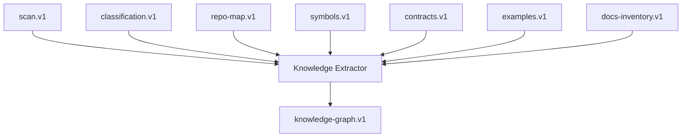
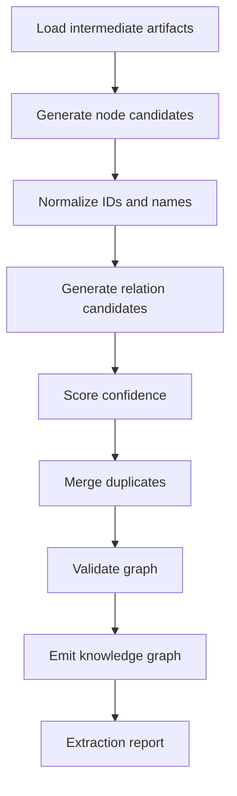
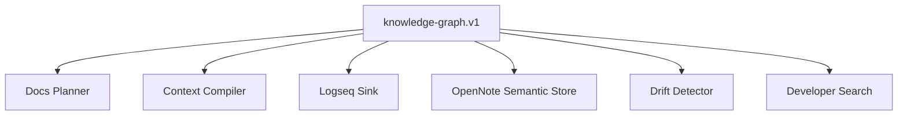
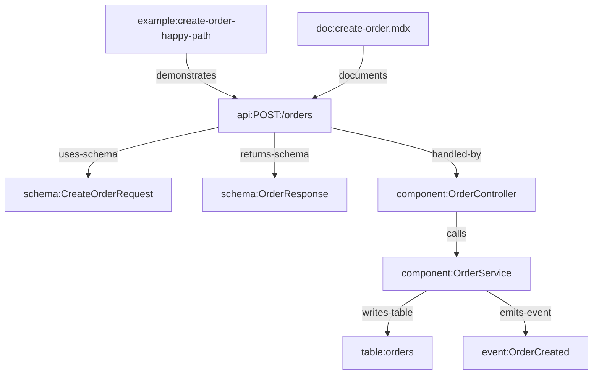

------
title: Build From Scratch: Mintlify-like AI-driven Documentation Generator CLI - Part 036
description: Extract a source-grounded developer knowledge graph from code, contracts, tests, configs, docs, and operational artifacts.
series: learn-ai-docs-km-cli
seriesTitle: Build From Scratch: Mintlify-like AI-driven Documentation Generator CLI with Code2Prompt and Open-source Knowledge Management
order: 36
partTitle: Knowledge Extraction from Codebase
tags:
- ai-docs
- documentation
- cli
- knowledge-graph
- code-analysis
- source-grounding
- retrieval
- graph
- architecture
date: 2026-07-04
---

# Part 036 — Knowledge Extraction from Codebase

Pada part sebelumnya kita mendesain **OpenNote-compatible semantic knowledge store**.

Tetapi semantic store hanya berguna kalau isinya bagus. Sekarang kita masuk ke pertanyaan hulu:

> Dari mana knowledge graph itu berasal?

Jawaban pendeknya: dari codebase.

Jawaban yang lebih tepat:

```txt
repository scan
  + file classification
  + source tree model
  + symbol extraction
  + contract discovery
  + test/example mining
  + docs inventory
  + config/migration/CI analysis
  -> source-grounded knowledge graph
```

Part ini membahas cara membangun extractor yang mengubah repo menjadi graph pengetahuan yang bisa dipakai oleh:

- docs planner,
- context compiler,
- page generator,
- verifier,
- drift detector,
- Logseq-compatible graph,
- OpenNote-compatible semantic store,
- developer search/assistant.

Kita tidak sedang membuat graph yang “terlihat keren”. Kita sedang membuat graph yang **berguna secara operasional**.

---

## 1. Mental Model: Knowledge Extraction Is Not Summarization

Kesalahan paling umum: menganggap knowledge extraction = “suruh LLM merangkum repo”.

Itu salah.

Summarization menghasilkan paragraph.

Knowledge extraction menghasilkan:

- node,
- relation,
- source reference,
- confidence,
- ownership,
- visibility,
- drift signature,
- downstream impact.

Perbedaannya:

| Aspek | Summarization | Knowledge Extraction |
|---|---|---|
| Output | Text | Graph + metadata |
| Verifiable | Sulit | Bisa diverifikasi per source ref |
| Incremental | Sulit | Bisa incremental via hash |
| Queryable | Lemah | Kuat |
| Drift detection | Lemah | Kuat |
| Docs planning | Terbatas | Langsung berguna |
| AI safety | Rentan hallucination | Bisa source-grounded |

Rule:

> Jangan minta AI “memahami repo” sebelum sistem sendiri mengekstrak struktur yang bisa diverifikasi.

LLM boleh membantu menamai, menjelaskan, atau mengklasifikasi. Tetapi graph dasar harus berasal dari deterministic extraction sebanyak mungkin.

---

## 2. Target Artifact

Command:

```bash
aidocs knowledge extract
```

menghasilkan:

```txt
.aidocs/
  knowledge/
    knowledge-graph.v1.json
    nodes.jsonl
    edges.jsonl
    extraction-report.json
    diagnostics.jsonl
```

Minimal `knowledge-graph.v1.json`:

```json
{
  "schema": "knowledge-graph.v1",
  "repo": {
    "id": "repo:acme/order-platform",
    "commit": "8d31a12"
  },
  "nodes": [
    {
      "id": "component:OrderService",
      "type": "component",
      "title": "OrderService",
      "visibility": "internal",
      "confidence": 0.92,
      "sourceRefs": [
        "source://src/orders/OrderService.java#L1-L220"
      ]
    }
  ],
  "edges": [
    {
      "from": "api:POST:/orders",
      "type": "handled-by",
      "to": "component:OrderService",
      "confidence": 0.87,
      "sourceRefs": [
        "source://src/routes/orders.ts#L24-L89"
      ]
    }
  ]
}
```

Untuk repo besar, JSONL lebih scalable:

```txt
nodes.jsonl
edges.jsonl
```

---

## 3. Source Inputs

Extractor tidak mulai dari nol. Ia memakai artifact yang sudah kita bangun di part sebelumnya.



Input utama:

| Input | Fungsi |
|---|---|
| `scan.v1` | daftar file, hash, metadata |
| `classification.v1` | jenis file dan documentability |
| `repo-map.v1` | struktur repo dan semantic directory |
| `symbols.v1` | classes, functions, modules, routes, exports |
| `contracts.v1` | OpenAPI, GraphQL, events, schemas, CLI commands |
| `examples.v1` | usage episodes dari tests/examples |
| docs inventory | existing docs dan source mappings |
| git metadata | ownership, recency, change history |

Extractor yang baik tidak membaca file mentah lagi kecuali perlu. Ia mengonsumsi artifact intermediate.

Kenapa?

- lebih cepat,
- lebih testable,
- lebih reproducible,
- lebih mudah debug,
- lebih mudah incremental.

---

## 4. Node Types

Kita perlu taxonomy node yang cukup ekspresif tapi tidak terlalu akademik.

### 4.1 Core Node Types

```ts
export type KnowledgeNodeType =
  | "repository"
  | "workspace"
  | "package"
  | "module"
  | "component"
  | "symbol"
  | "api-operation"
  | "schema"
  | "event"
  | "config-key"
  | "cli-command"
  | "database-table"
  | "migration"
  | "job"
  | "queue"
  | "topic"
  | "external-service"
  | "error"
  | "example"
  | "test"
  | "doc-page"
  | "concept"
  | "runbook"
  | "adr";
```

Tidak semua repo memakai semua node.

Sistem harus mampu menghasilkan graph parsial.

---

### 4.2 Repository / Workspace Node

Root graph.

```json
{
  "id": "repo:acme/order-platform",
  "type": "repository",
  "title": "order-platform",
  "sourceRefs": ["source://."],
  "confidence": 1.0
}
```

Monorepo bisa punya workspace/product nodes:

```json
{
  "id": "workspace:checkout",
  "type": "workspace",
  "title": "Checkout",
  "sourceRefs": ["source://services/checkout"],
  "confidence": 0.93
}
```

---

### 4.3 Package / Module Node

Dari manifest dan directory structure.

Examples:

- Maven module,
- Gradle subproject,
- npm package,
- Go module,
- Python package,
- Rust crate.

```json
{
  "id": "package:maven:order-service",
  "type": "package",
  "title": "order-service",
  "language": "java",
  "sourceRefs": ["source://services/order-service/pom.xml"],
  "confidence": 0.98
}
```

---

### 4.4 Component Node

Component adalah unit arsitektur yang bermakna.

Contoh:

- `OrderService`,
- `PaymentClient`,
- `FulfillmentWorker`,
- `IdempotencyMiddleware`,
- `PricingEngine`.

Component bisa berasal dari:

- class public penting,
- service registration,
- route handler,
- package boundary,
- framework annotations,
- dependency injection container,
- naming convention.

Component tidak harus sama dengan class.

Kadang satu component terdiri dari beberapa file.

```json
{
  "id": "component:OrderService",
  "type": "component",
  "title": "OrderService",
  "kind": "domain-service",
  "visibility": "internal",
  "confidence": 0.91,
  "sourceRefs": [
    "source://src/main/java/acme/orders/OrderService.java#L1-L220",
    "source://src/test/java/acme/orders/OrderServiceTest.java#L1-L180"
  ]
}
```

---

### 4.5 API Operation Node

Dari OpenAPI atau route extraction.

```json
{
  "id": "api:POST:/orders",
  "type": "api-operation",
  "title": "POST /orders",
  "method": "POST",
  "path": "/orders",
  "visibility": "public",
  "sourceRefs": [
    "source://openapi/openapi.yaml#/paths/~1orders/post"
  ],
  "confidence": 0.98
}
```

Kalau operation ditemukan dari route source tapi tidak ada OpenAPI, confidence lebih rendah.

---

### 4.6 Schema Node

Dari:

- OpenAPI components,
- JSON Schema,
- Avro,
- Protobuf,
- DTO class,
- database migration.

```json
{
  "id": "schema:CreateOrderRequest",
  "type": "schema",
  "title": "CreateOrderRequest",
  "format": "openapi-schema",
  "sourceRefs": [
    "source://openapi/openapi.yaml#/components/schemas/CreateOrderRequest"
  ],
  "confidence": 0.97
}
```

---

### 4.7 Event Node

Dari AsyncAPI, schema registry, topic naming, producer/consumer code.

```json
{
  "id": "event:OrderCreated",
  "type": "event",
  "title": "OrderCreated",
  "sourceRefs": [
    "source://schemas/events/order-created.avsc",
    "source://src/orders/OrderEventPublisher.java#L33-L62"
  ],
  "confidence": 0.88
}
```

---

### 4.8 Config Key Node

Config keys penting untuk docs/runbook.

```json
{
  "id": "config:payment.timeout.ms",
  "type": "config-key",
  "title": "payment.timeout.ms",
  "defaultValue": "3000",
  "sourceRefs": [
    "source://config/application.yaml#L12-L12"
  ],
  "confidence": 0.92
}
```

---

### 4.9 Error Node

Dari exception classes, error codes, OpenAPI error schemas, logs.

```json
{
  "id": "error:PaymentProviderTimeout",
  "type": "error",
  "title": "PaymentProviderTimeout",
  "sourceRefs": [
    "source://src/payments/PaymentProviderTimeout.java#L1-L32"
  ],
  "confidence": 0.89
}
```

---

### 4.10 Concept Node

Concept lebih abstrak dan harus hati-hati.

Contoh:

- idempotency,
- fulfillment state machine,
- tenant isolation,
- optimistic locking,
- retry policy.

Concept node harus punya evidence dari beberapa source atau explicit docs.

```json
{
  "id": "concept:idempotency-key",
  "type": "concept",
  "title": "Idempotency Key",
  "aliases": ["idempotency", "safe retry"],
  "sourceRefs": [
    "source://openapi/openapi.yaml#/components/parameters/IdempotencyKey",
    "source://src/middleware/idempotency.ts#L1-L80"
  ],
  "confidence": 0.86
}
```

Rule:

> Concept tanpa source evidence jangan dipromosikan ke official docs.

---

## 5. Relation Types

Node tanpa relation hanyalah katalog.

Graph menjadi berguna karena relation.

### 5.1 Core Relations

```ts
export type KnowledgeRelationType =
  | "contains"
  | "declares"
  | "exports"
  | "imports"
  | "depends-on"
  | "calls"
  | "handled-by"
  | "implements"
  | "uses-schema"
  | "returns-schema"
  | "emits-event"
  | "consumes-event"
  | "reads-config"
  | "writes-table"
  | "reads-table"
  | "raises-error"
  | "tested-by"
  | "demonstrated-by"
  | "documented-by"
  | "explained-by"
  | "related-to"
  | "contradicts"
  | "supersedes";
```

---

### 5.2 Relation Record

```ts
export interface KnowledgeEdge {
  id: string;
  from: string;
  type: KnowledgeRelationType;
  to: string;
  confidence: number;
  sourceRefs: SourceRef[];
  extractor: string;
  evidence: Evidence[];
}
```

Example:

```json
{
  "id": "edge:api:POST:/orders:handled-by:component:OrderService",
  "from": "api:POST:/orders",
  "type": "handled-by",
  "to": "component:OrderService",
  "confidence": 0.87,
  "extractor": "route-handler-linker.v1",
  "sourceRefs": [
    "source://src/routes/orders.ts#L24-L89"
  ]
}
```

---

## 6. Extraction Pipeline

High-level pipeline:



Kita pisahkan node extraction dan edge extraction.

Kenapa?

Karena relation sering membutuhkan dua node sudah ada.

---

## 7. Stable ID Design

Stable ID adalah fondasi sync.

Bad ID:

```txt
node-123
```

Good ID:

```txt
api:POST:/orders
schema:CreateOrderRequest
component:java:acme.orders.OrderService
config:payment.timeout.ms
event:OrderCreated
```

Rule:

1. ID harus deterministic.
2. ID tidak boleh bergantung pada urutan scan.
3. ID harus cukup stable walau file berpindah.
4. ID boleh berubah jika semantic identity berubah.
5. ID harus bisa di-map ke note slug.

Untuk symbol:

```txt
symbol:<language>:<fully-qualified-name>
```

Untuk API:

```txt
api:<method>:<normalized-path>
```

Untuk schema:

```txt
schema:<namespace>:<schema-name>
```

Untuk config:

```txt
config:<canonical-key>
```

---

## 8. Node Candidate Extraction

### 8.1 From Repository Map

Repo map menghasilkan:

- repository node,
- workspace node,
- package node,
- module node,
- docs root node.

Pseudo:

```ts
function extractRepoNodes(repoMap: RepoMap): KnowledgeNode[] {
  const nodes = [];

  nodes.push({
    id: `repo:${repoMap.name}`,
    type: "repository",
    title: repoMap.name,
    confidence: 1.0,
    sourceRefs: [{ uri: "source://." }],
  });

  for (const workspace of repoMap.workspaces) {
    nodes.push({
      id: `workspace:${workspace.slug}`,
      type: "workspace",
      title: workspace.name,
      confidence: workspace.confidence,
      sourceRefs: workspace.sourceRefs,
    });
  }

  return nodes;
}
```

---

### 8.2 From Symbol Index

Symbol index menghasilkan:

- component candidates,
- public symbol nodes,
- command handlers,
- route handlers,
- error classes.

Heuristic:

```txt
if symbol is exported/public and has high fan-in or route binding:
  component candidate
else if symbol is public API surface:
  symbol node
else:
  keep as source detail, not graph node
```

Jangan semua function jadi node.

Graph akan meledak.

Node yang baik adalah node yang membantu docs, retrieval, drift, atau ownership.

---

### 8.3 From Contracts

Contracts menghasilkan high-authority nodes.

- OpenAPI operation → `api-operation`
- OpenAPI schema → `schema`
- AsyncAPI message → `event`
- GraphQL type/query/mutation → `api-operation` atau `schema`
- CLI manifest → `cli-command`
- JSON Schema → `schema`

Contracts biasanya punya confidence tinggi karena mereka adalah explicit external surface.

---

### 8.4 From Tests and Examples

Tests menghasilkan:

- example nodes,
- tested-by relation,
- demonstrated-by relation,
- behavior evidence,
- edge case evidence.

Test tidak selalu menjadi official behavior, tetapi sangat berguna untuk docs examples.

```json
{
  "id": "example:test:create-order-happy-path",
  "type": "example",
  "title": "Create order happy path",
  "sourceRefs": [
    "source://src/test/orders/create-order.test.ts#L10-L45"
  ],
  "confidence": 0.83
}
```

---

### 8.5 From Config and Deployment Files

Configs menghasilkan:

- config-key nodes,
- external-service nodes,
- queue/topic nodes,
- deployment environment nodes.

Source:

- `application.yaml`,
- `.env.example`,
- Helm values,
- Kubernetes manifests,
- Terraform outputs,
- Docker Compose,
- CI variables.

Rule safety:

- jangan mengekstrak actual secret value,
- redaksi value sensitif,
- mark visibility restricted jika meragukan.

---

### 8.6 From Database Migrations

Migrations menghasilkan:

- database-table nodes,
- column concepts,
- index notes,
- persistence relation.

Contoh:

```json
{
  "id": "table:orders",
  "type": "database-table",
  "title": "orders",
  "sourceRefs": [
    "source://db/migrations/V001__create_orders.sql#L1-L42"
  ],
  "confidence": 0.94
}
```

Relation:

```json
{
  "from": "component:OrderRepository",
  "type": "writes-table",
  "to": "table:orders",
  "confidence": 0.82
}
```

---

### 8.7 From Existing Docs

Existing docs menghasilkan:

- doc-page nodes,
- documented-by relations,
- concept candidates,
- ADR nodes,
- runbook nodes.

Tetapi docs bukan selalu benar. Mereka harus dibandingkan dengan source.

Existing docs adalah source untuk “what humans intended”, bukan otomatis source untuk “what system does now”.

---

## 9. Relation Extraction Algorithms

### 9.1 Contains Relation

Dari structure.

```txt
repository contains workspace
workspace contains package
package contains module
module contains component
```

Confidence tinggi.

---

### 9.2 API handled-by Component

Sources:

- OpenAPI `operationId`,
- route definitions,
- annotations,
- controller methods,
- handler registration.

Algorithm:

```ts
function linkApiToHandler(operation: ApiOperation, symbols: SymbolIndex): EdgeCandidate[] {
  const candidates = [];

  if (operation.operationId) {
    candidates.push(...symbols.findByNameSimilarity(operation.operationId));
  }

  candidates.push(...symbols.findRoutes(operation.method, operation.path));

  return candidates.map(candidate => ({
    from: operation.id,
    type: "handled-by",
    to: candidate.componentId,
    confidence: scoreApiHandlerCandidate(operation, candidate),
    sourceRefs: [...operation.sourceRefs, ...candidate.sourceRefs],
  }));
}
```

Scoring signals:

- exact route match,
- method match,
- operationId match,
- framework annotation match,
- file path match,
- test reference match.

---

### 9.3 API uses-schema / returns-schema

Dari contract.

```txt
api-operation -> uses-schema -> request schema
api-operation -> returns-schema -> response schema
```

High confidence jika dari OpenAPI `$ref`.

---

### 9.4 Component depends-on Component

Dari import graph, DI config, constructor injection, module dependencies.

Jangan semua imports dianggap architecture dependency.

Filter:

- internal package imports,
- constructor fields,
- dependency injection bindings,
- service clients,
- repository dependencies,
- framework config.

Ignore:

- standard library,
- test helper imports,
- logging imports,
- annotation-only imports.

---

### 9.5 Component emits-event / consumes-event

Sources:

- AsyncAPI,
- topic constants,
- Kafka producer/consumer code,
- message schema references,
- queue config.

Example:

```json
{
  "from": "component:OrderService",
  "type": "emits-event",
  "to": "event:OrderCreated",
  "confidence": 0.84,
  "sourceRefs": [
    "source://src/orders/OrderEventPublisher.java#L33-L62"
  ]
}
```

---

### 9.6 Component reads-config

Sources:

- environment variable access,
- config binding classes,
- Spring `@ConfigurationProperties`,
- Node `process.env`,
- Kubernetes env vars,
- Helm values.

Example:

```json
{
  "from": "component:PaymentClient",
  "type": "reads-config",
  "to": "config:payment.timeout.ms",
  "confidence": 0.79,
  "sourceRefs": [
    "source://src/payments/PaymentClient.java#L18-L30"
  ]
}
```

---

### 9.7 Component raises-error

Sources:

- exception throw sites,
- error response construction,
- OpenAPI error schemas,
- error code enum.

```json
{
  "from": "component:PaymentClient",
  "type": "raises-error",
  "to": "error:PaymentProviderTimeout",
  "confidence": 0.88,
  "sourceRefs": [
    "source://src/payments/PaymentClient.java#L81-L94"
  ]
}
```

---

### 9.8 tested-by and demonstrated-by

From examples/tests.

```txt
api-operation tested-by test
component tested-by test
api-operation demonstrated-by example
concept demonstrated-by example
```

This is critical for example-aware docs.

---

### 9.9 documented-by

From docs inventory and source mapping.

```json
{
  "from": "api:POST:/orders",
  "type": "documented-by",
  "to": "doc:docs/api/orders/create-order.mdx",
  "confidence": 0.93,
  "sourceRefs": [
    "source://docs/api/orders/create-order.mdx"
  ]
}
```

Used by drift detector.

---

## 10. Confidence Scoring

Confidence is not probability in a mathematical sense. It is an engineering score that drives review.

### 10.1 Node Confidence

```txt
nodeConfidence =
  sourceAuthority * 0.35 +
  extractorReliability * 0.25 +
  evidenceSpecificity * 0.20 +
  corroboration * 0.15 +
  freshness * 0.05
```

Example source authority:

| Source | Authority |
|---|---:|
| OpenAPI spec | 0.95 |
| schema file | 0.92 |
| source annotation | 0.88 |
| manifest | 0.86 |
| test | 0.78 |
| existing docs | 0.70 |
| LLM-inferred concept | 0.45 |

### 10.2 Edge Confidence

```txt
edgeConfidence =
  relationEvidenceStrength * 0.40 +
  nodeConfidenceAverage * 0.20 +
  extractorReliability * 0.20 +
  corroboration * 0.15 +
  freshness * 0.05
```

High confidence relation:

- OpenAPI operation `$ref` to schema.
- Controller annotation exact path/method.
- Maven module manifest.

Low confidence relation:

- name similarity only,
- LLM inferred concept relation,
- docs mention without source.

---

## 11. Evidence Model

Do not store only confidence. Store why.

```ts
export interface Evidence {
  kind:
    | "exact-match"
    | "manifest"
    | "annotation"
    | "contract-ref"
    | "import"
    | "call-site"
    | "test-reference"
    | "docs-link"
    | "name-similarity"
    | "llm-classification";
  description: string;
  sourceRef: SourceRef;
  weight: number;
}
```

Example:

```json
{
  "kind": "contract-ref",
  "description": "OpenAPI request body references CreateOrderRequest schema",
  "sourceRef": {
    "uri": "source://openapi/openapi.yaml#/paths/~1orders/post/requestBody"
  },
  "weight": 0.95
}
```

Evidence makes graph explainable.

---

## 12. Duplicate and Alias Handling

Same concept can appear under many names:

- `OrderService`,
- `OrderApplicationService`,
- `order-service`,
- `orders module`.

Same endpoint can appear in:

- OpenAPI,
- route file,
- test file,
- docs page.

We need merge logic.

### 12.1 Node Merge Rules

Merge if:

- same canonical ID,
- same contract pointer,
- exact FQN,
- exact API method/path,
- exact schema namespace/name.

Do not merge if only fuzzy name similarity.

Fuzzy match creates `related-to` or `alias-candidate` diagnostic, not automatic merge.

---

## 13. Visibility Classification

Every node and edge needs visibility.

```ts
export type Visibility = "public" | "internal" | "restricted";
```

Propagation rule:

```txt
edge visibility = maxSensitivity(from.visibility, to.visibility, evidence.visibility)
```

Examples:

- Public API operation from public OpenAPI → `public`.
- Handler component from source code → `internal`.
- Incident runbook → `restricted`.
- Relation public endpoint handled by internal component → relation likely `internal`.

This prevents accidental leakage to public docs.

---

## 14. Graph Artifact Schema

### 14.1 Node Schema

```ts
export interface KnowledgeNode {
  schema: "knowledge-node.v1";
  id: string;
  type: KnowledgeNodeType;
  title: string;
  aliases: string[];
  visibility: Visibility;
  confidence: number;
  sourceRefs: SourceRef[];
  attributes: Record<string, unknown>;
  fingerprints: {
    sourceHash: string;
    semanticHash: string;
  };
  createdBy: string;
}
```

### 14.2 Edge Schema

```ts
export interface KnowledgeEdge {
  schema: "knowledge-edge.v1";
  id: string;
  from: string;
  type: KnowledgeRelationType;
  to: string;
  visibility: Visibility;
  confidence: number;
  sourceRefs: SourceRef[];
  evidence: Evidence[];
  fingerprints: {
    sourceHash: string;
    semanticHash: string;
  };
  createdBy: string;
}
```

### 14.3 Graph Manifest

```json
{
  "schema": "knowledge-graph.v1",
  "createdAt": "2026-07-04T00:00:00Z",
  "repo": {
    "id": "repo:acme/order-platform",
    "commit": "8d31a12"
  },
  "inputs": {
    "scan": "sha256:...",
    "classification": "sha256:...",
    "symbols": "sha256:...",
    "contracts": "sha256:...",
    "examples": "sha256:..."
  },
  "nodeCount": 182,
  "edgeCount": 417,
  "diagnosticCount": 23
}
```

---

## 15. Graph Queries We Need

Graph is not useful until it answers real questions.

### 15.1 What docs pages are impacted by this source file?

```txt
source file -> symbols/components -> API/events/config -> documented-by -> doc pages
```

Used by drift detection.

---

### 15.2 What public surfaces are undocumented?

```txt
api-operation where not exists documented-by
schema where used by public api and not documented
cli-command where visibility public and not documented
```

Used by docs planner.

---

### 15.3 What examples support this page?

```txt
doc-page -> documents -> api-operation/component/concept -> demonstrated-by -> example
```

Used by example-aware generation.

---

### 15.4 What config keys affect this component?

```txt
component -> reads-config -> config-key
```

Used by runbook generation.

---

### 15.5 What runbook applies to this error?

```txt
error -> explained-by/runbook -> runbook note
component -> raises-error -> error -> runbook
```

Used by troubleshooting docs.

---

## 16. Projectors

Knowledge graph is canonical. Different outputs are projections.



### 16.1 Docs Projector

Creates:

- missing page candidates,
- source refs for page specs,
- navigation hints,
- related pages.

### 16.2 Logseq Projector

Creates:

- graph pages,
- backlinks,
- relation bullets,
- source evidence blocks.

### 16.3 OpenNote Projector

Creates:

- note cards,
- chunks,
- semantic metadata,
- relation files.

### 16.4 Context Projector

Creates:

- relevant context units,
- graph neighborhoods,
- source-backed summaries,
- retrieval expansion hints.

---

## 17. Knowledge Graph Neighborhoods

For docs generation, we rarely need the whole graph. We need a neighborhood.

Example target: `api:POST:/orders`

Neighborhood:

```txt
api:POST:/orders
  uses-schema -> schema:CreateOrderRequest
  returns-schema -> schema:OrderResponse
  handled-by -> component:OrderController
  calls -> component:OrderService
  reads-config -> config:orders.maxLineItems
  raises-error -> error:ValidationError
  demonstrated-by -> example:create-order-happy-path
  documented-by -> doc:docs/api/orders/create-order.mdx
```

This becomes context input.

```bash
aidocs knowledge neighborhood api:POST:/orders --depth 2
```

Output should be readable:

```txt
api:POST:/orders
  handled-by component:OrderController confidence=0.91
  uses-schema schema:CreateOrderRequest confidence=0.98
  demonstrated-by example:create-order-happy-path confidence=0.83
```

---

## 18. LLM-assisted Extraction: Where It Is Allowed

LLM can help, but only in constrained places.

Good uses:

- classify whether a component is “domain-service” vs “adapter”,
- generate human-readable title,
- infer concept candidate from repeated symbols/docs,
- summarize node role from source-backed snippets,
- propose relation label when deterministic evidence already exists.

Bad uses:

- invent architecture dependencies,
- assert runtime behavior without source,
- infer security guarantees,
- merge nodes based on vague similarity,
- create API contract from memory.

LLM extraction output must be treated as low/medium confidence unless corroborated.

Structured prompt output:

```json
{
  "conceptCandidates": [
    {
      "title": "Idempotency Key",
      "evidenceRefs": [
        "source://openapi/openapi.yaml#/components/parameters/IdempotencyKey",
        "source://src/middleware/idempotency.ts#L1-L80"
      ],
      "confidenceReason": "The same header and middleware behavior are referenced in contract and source."
    }
  ]
}
```

Verifier must reject candidate without evidence refs.

---

## 19. Incremental Extraction

Extraction should not rebuild the entire graph for every file change.

Use dependency between artifacts:

```txt
changed file
  -> affected scan entry
  -> affected classification
  -> affected symbols/contracts/examples
  -> affected graph nodes/edges
  -> affected notes/docs/chunks
```

Each node has fingerprints:

```json
{
  "fingerprints": {
    "sourceHash": "sha256:...",
    "semanticHash": "sha256:..."
  }
}
```

If source hash unchanged, reuse node.

If source changed but semantic hash unchanged, maybe no downstream docs update needed.

Example:

- comment formatting changed → source hash changed, semantic hash unchanged.
- API request schema changed → semantic hash changed, docs impacted.

---

## 20. Diagnostics

Extractor should emit diagnostics, not hide uncertainty.

Examples:

```jsonl
{"level":"warning","code":"LOW_CONFIDENCE_ROUTE_HANDLER","message":"Could not confidently link POST /orders to handler component","sources":["openapi/openapi.yaml#/paths/~1orders/post"]}
{"level":"warning","code":"PUBLIC_API_UNDOCUMENTED","message":"GET /orders/{id} has no documented-by relation","node":"api:GET:/orders/{id}"}
{"level":"error","code":"RESTRICTED_SOURCE_IN_PUBLIC_NODE","message":"Public node references restricted source","node":"api:POST:/admin/export"}
```

Diagnostic categories:

- low confidence,
- duplicate candidate,
- missing source ref,
- visibility conflict,
- orphan node,
- undocumented public surface,
- stale source ref,
- invalid relation target,
- possible contradiction.

---

## 21. Validation Rules

Graph validation should run after extraction.

Rules:

1. Every node has ID, type, title, sourceRefs, confidence.
2. Every edge references existing nodes.
3. Every public node has only allowed source refs or explicit visibility override.
4. No edge has confidence outside `0..1`.
5. No node ID collision with different semantic identity.
6. No generated concept node without evidence.
7. Every doc-page relation points to existing docs file.
8. Every source ref can be resolved.
9. Every restricted node is excluded from public projector.

Command:

```bash
aidocs knowledge validate
```

---

## 22. Example: Full Mini Graph

Source:

```txt
openapi.yaml
src/orders/OrderController.java
src/orders/OrderService.java
src/orders/OrderRepository.java
src/orders/OrderCreatedPublisher.java
src/test/orders/CreateOrderTest.java
db/migrations/V001__create_orders.sql
```

Graph:



Important: this diagram is not generated from imagination. Every edge must have source refs.

---

## 23. CLI UX

### 23.1 Extract

```bash
aidocs knowledge extract
```

Output:

```txt
Knowledge extraction complete.

Nodes: 182
Edges: 417
Diagnostics: 23
Low confidence edges: 18
Undocumented public surfaces: 7
Output: .aidocs/knowledge/knowledge-graph.v1.json
```

### 23.2 Explain Node

```bash
aidocs knowledge explain api:POST:/orders
```

Output:

```txt
api:POST:/orders
Type: api-operation
Confidence: 0.98
Visibility: public

Source refs:
- openapi/openapi.yaml#/paths/~1orders/post

Outgoing relations:
- uses-schema -> schema:CreateOrderRequest confidence=0.98
- returns-schema -> schema:OrderResponse confidence=0.98
- handled-by -> component:OrderController confidence=0.91
- demonstrated-by -> example:create-order-happy-path confidence=0.84
```

### 23.3 Explain Edge

```bash
aidocs knowledge explain-edge api:POST:/orders handled-by component:OrderController
```

Output:

```txt
Edge: api:POST:/orders --handled-by--> component:OrderController
Confidence: 0.91

Evidence:
- exact route match in OrderController.java
- method annotation POST
- path annotation /orders
- OpenAPI operationId createOrder matched controller method createOrder
```

### 23.4 Query

```bash
aidocs knowledge query "public APIs without docs"
```

Human-readable query can be mapped to internal graph query later. For first implementation, provide explicit flags:

```bash
aidocs knowledge find --type api-operation --visibility public --missing documented-by
```

---

## 24. Testing Strategy

### 24.1 Fixture Repositories

Create small fixture repos:

```txt
fixtures/repos/java-spring-order-service/
fixtures/repos/node-express-api/
fixtures/repos/go-cli-tool/
fixtures/repos/python-fastapi-service/
fixtures/repos/monorepo-mixed/
```

Each fixture has expected graph snapshot.

### 24.2 Golden Graph Test

```ts
it("extracts POST /orders handled-by OrderController", async () => {
  const graph = await extractFixture("java-spring-order-service");

  expect(graph.hasNode("api:POST:/orders")).toBe(true);
  expect(graph.hasEdge(
    "api:POST:/orders",
    "handled-by",
    "component:OrderController"
  )).toBe(true);
});
```

### 24.3 Confidence Regression Test

Confidence should not randomly change.

```ts
expect(edge.confidence).toBeGreaterThan(0.85);
```

If confidence drops after extractor change, review whether algorithm regressed or fixture changed.

### 24.4 Visibility Test

```ts
expect(publicProjector.includesRestrictedNode()).toBe(false);
```

### 24.5 Source Ref Test

```ts
for (const node of graph.nodes) {
  expect(node.sourceRefs.length).toBeGreaterThan(0);
  expect(allSourceRefsResolve(node.sourceRefs)).toBe(true);
}
```

---

## 25. Failure Modes

### 25.1 Graph Explosion

Every function/class becomes node.

Symptoms:

- thousands of low-value nodes,
- poor retrieval,
- slow graph queries,
- useless notes.

Fix:

- only promote documentable/public/architectural concepts,
- keep low-level symbols in symbol index,
- create graph node only if downstream needs it.

---

### 25.2 False Architecture

Extractor turns file imports into architecture claims.

Example bad edge:

```txt
OrderService depends-on Logger
```

This is technically true but useless.

Fix:

- filter standard library/framework/util imports,
- weight constructor/service dependencies higher,
- use architecture categories.

---

### 25.3 Concept Hallucination

LLM invents concepts.

Fix:

- concept must have evidence refs,
- low-confidence concept stays internal/draft,
- no source, no official note.

---

### 25.4 Wrong Merge

`Order` domain object merged with `Order` API response schema incorrectly.

Fix:

- include namespace/type in ID,
- don't merge by name only,
- preserve alias candidates as diagnostics.

---

### 25.5 Visibility Leak

Internal component relation appears in public docs.

Fix:

- visibility propagation,
- public projector filter,
- CI leakage check.

---

### 25.6 Stale Graph

Code changed but graph reused incorrectly.

Fix:

- artifact input hashes,
- source ref hash checks,
- incremental invalidation tests.

---

## 26. Implementation Roadmap

Build in this order:

1. Define graph schema.
2. Implement node ID canonicalizer.
3. Build repo/package/module node extractor.
4. Build contract node extractor.
5. Build symbol-to-component extractor.
6. Build edge extraction from contracts.
7. Build API-to-handler linker.
8. Build test/example relation extractor.
9. Build config and migration extractor.
10. Build confidence scorer.
11. Build graph validator.
12. Build diagnostics reporter.
13. Build graph query CLI.
14. Build projectors to docs/Logseq/OpenNote.
15. Build incremental extraction.

Do not start with LLM concept extraction.

Start with deterministic graph.

---

## 27. What We Have Built in This Part

Kita sudah mendesain **knowledge extraction engine**.

Output utamanya adalah graph:

```txt
nodes + edges + source refs + confidence + visibility + fingerprints
```

Graph ini menjadi canonical memory layer untuk:

- docs planning,
- docs generation,
- semantic retrieval,
- Logseq notes,
- OpenNote chunks,
- drift detection,
- CI governance.

Mental model penting:

> Knowledge graph bukan dekorasi. Knowledge graph adalah dependency graph untuk dokumentasi dan developer understanding.

Pada part berikutnya kita akan membahas **Bidirectional Docs and Notes Sync**: bagaimana generated docs dan knowledge notes bisa saling memperkaya tanpa saling merusak, bagaimana conflict ditangani, dan bagaimana stable IDs menjaga sinkronisasi jangka panjang.

---

## References

- Code2Prompt repository: `https://github.com/mufeedvh/code2prompt`
- Logseq repository: `https://github.com/logseq/logseq`
- OpenNote repository: `https://github.com/opennote-org/opennote`
- Tree-sitter: `https://tree-sitter.github.io/tree-sitter/`
- OpenAPI Specification: `https://spec.openapis.org/oas/latest.html`
