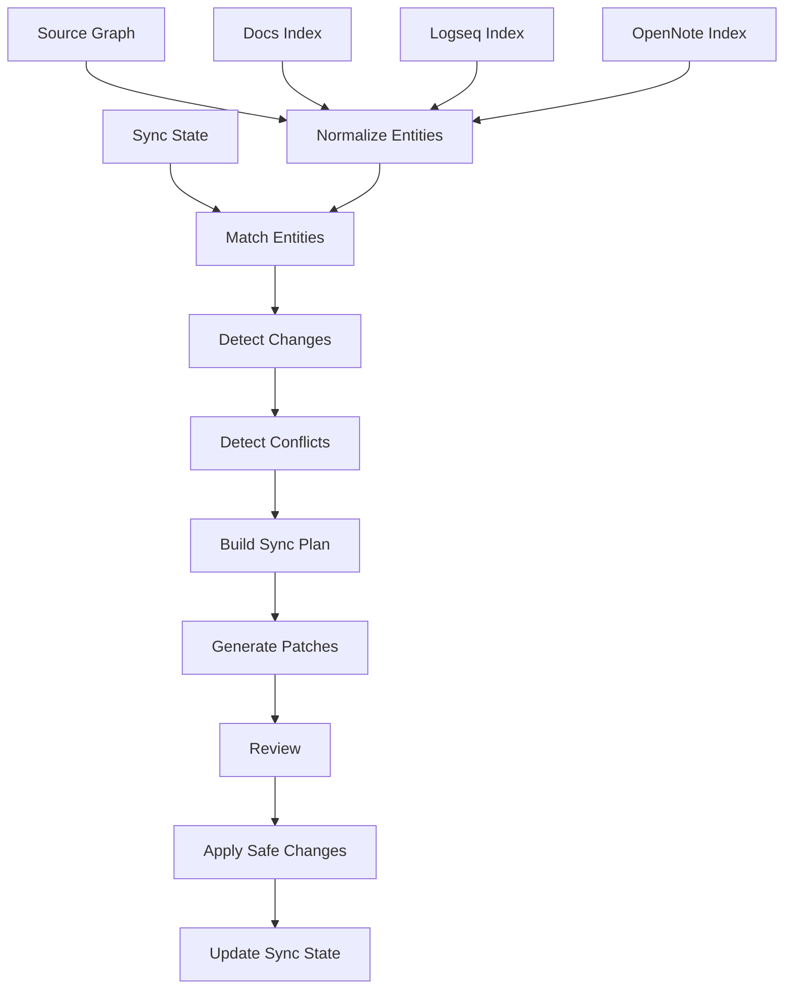

------
title: Build From Scratch: Mintlify-like AI-driven Documentation Generator CLI - Part 037
description: Design bidirectional synchronization between generated docs, developer notes, Logseq-compatible graphs, OpenNote-compatible semantic stores, and source-grounded repository knowledge.
series: learn-ai-docs-km-cli
seriesTitle: Build From Scratch: Mintlify-like AI-driven Documentation Generator CLI with Code2Prompt and Open-source Knowledge Management
order: 37
partTitle: Bidirectional Docs and Notes Sync
tags:
- ai-docs
- documentation
- cli
- knowledge-management
- logseq
- opennote
- sync
- mdx
- source-grounding
date: 2026-07-04
---

# Part 037 — Bidirectional Docs and Notes Sync

Pada part sebelumnya kita membangun **knowledge extraction engine** dari codebase.

Sekarang kita masuk ke problem yang lebih sulit secara operasional:

> Bagaimana docs dan notes bisa saling memperkaya tanpa saling merusak?

Dalam sistem yang kita bangun, ada beberapa tempat knowledge hidup:

```txt
source code
contracts
examples
tests
configs
existing docs
Logseq-compatible notes
OpenNote-compatible semantic notes
generated MDX docs
review comments
```

Kalau semuanya ditulis manual, sinkronisasi menjadi beban manusia.

Kalau semuanya digenerate otomatis, trust runtuh karena AI bisa menimpa keputusan manusia.

Solusi yang kita butuhkan bukan “sync semua ke semua”. Solusi yang kita butuhkan adalah **controlled bidirectional synchronization**.

Artinya:

- docs bisa menghasilkan notes,
- notes bisa mengusulkan perbaikan docs,
- source tetap otoritas utama,
- human edit tidak boleh diam-diam hilang,
- generated artifact harus punya provenance,
- conflict harus terlihat eksplisit,
- sinkronisasi harus idempotent dan reversible.

Part ini membahas desain sync engine untuk menghubungkan:

- `docs/**/*.mdx`,
- `logseq/pages/**/*.md`,
- `opennote/export/**/*.jsonl`,
- `.aidocs/knowledge/graph.v1.json`,
- `.aidocs/review/*.json`,
- `.aidocs/sync/*.json`.

---

## 1. Mental Model: Sync Is a Merge Problem, Not a Copy Problem

Kesalahan umum adalah menganggap sync berarti:

```txt
copy generated docs -> notes
copy notes -> generated docs
```

Ini berbahaya.

Karena docs dan notes punya tujuan berbeda.

Docs biasanya:

- public-facing atau team-facing,
- curated,
- navigable,
- versioned,
- reviewable,
- stable.

Notes biasanya:

- exploratory,
- messy,
- personal/team internal,
- penuh context mentah,
- belum tentu siap publish,
- bisa berisi asumsi atau working theory.

Jadi sync bukan copy.

Sync adalah proses merge dengan aturan:

```txt
source of truth + generated artifact + human annotation + sink state -> proposed patch
```

Kita tidak ingin notes otomatis menjadi docs official.

Kita ingin notes menjadi **candidate knowledge**.

---

## 2. Source Authority Hierarchy

Sebelum bicara sync, kita harus menetapkan hirarki otoritas.

Urutan default:

```txt
1. code / contracts / tests / configs
2. human-reviewed docs
3. human-authored architecture notes / ADRs
4. generated docs with accepted review
5. generated knowledge notes
6. unreviewed AI summaries
```

Rule penting:

> Notes boleh memperkaya docs, tetapi tidak boleh mengalahkan source code tanpa bukti.

Contoh:

Logseq note berkata:

```md
[[Billing API]] uses cursor pagination.
```

Tetapi OpenAPI spec menunjukkan:

```yaml
parameters:
  - name: page
  - name: limit
```

Maka sync engine tidak boleh otomatis memasukkan “cursor pagination” ke public docs.

Ia harus menghasilkan conflict:

```txt
note claims cursor pagination
contract shows page/limit pagination
status: needs-human-review
```

---

## 3. Artifact yang Terlibat

Bidirectional sync memakai beberapa artifact.

```txt
.aidocs/
  knowledge/
    graph.v1.json
  docs/
    page-index.v1.json
  km/
    logseq-export.v1.json
    opennote-export.v1.jsonl
  sync/
    sync-state.v1.json
    sync-plan.v1.json
    conflicts.v1.json
    patches/
      docs.patch
      logseq.patch
      opennote.patch
```

Docs project:

```txt
docs/
  index.mdx
  quickstart.mdx
  guides/
    authentication.mdx
```

Logseq graph:

```txt
logseq/
  pages/
    API___Authentication.md
    Module___Auth_Service.md
  journals/
  assets/
```

OpenNote export:

```txt
opennote-export/
  notes.jsonl
  chunks.jsonl
  relations.jsonl
  embeddings.jsonl
```

Kuncinya: sync engine tidak bekerja dari file mentah saja. Ia bekerja dari **indexed artifact**.

---

## 4. Canonical Sync Model

Kita butuh model internal yang netral terhadap target.

```ts
type SyncEntity = {
  id: string;
  kind:
    | "doc_page"
    | "doc_section"
    | "knowledge_note"
    | "knowledge_block"
    | "concept_node"
    | "relation"
    | "example"
    | "decision"
    | "todo";

  title?: string;
  body?: string;
  sourceRefs: SourceRef[];
  origin: EntityOrigin;
  visibility: "public" | "internal" | "private";
  ownership: "generated" | "human" | "hybrid";
  confidence: number;
  reviewStatus: "unreviewed" | "accepted" | "rejected" | "needs_review";
  fingerprints: EntityFingerprint;
  links: EntityLink[];
};
```

`EntityOrigin`:

```ts
type EntityOrigin =
  | { type: "source"; path: string; hash: string }
  | { type: "doc"; path: string; sectionId?: string; hash: string }
  | { type: "logseq"; page: string; blockId?: string; hash: string }
  | { type: "opennote"; noteId: string; chunkId?: string; hash: string }
  | { type: "ai"; bundleId: string; model?: string; hash: string };
```

Mental modelnya:

> Sync engine tidak menyinkronkan file. Ia menyinkronkan entity yang punya identity, origin, ownership, dan fingerprint.

---

## 5. Stable ID Is Non-negotiable

Tanpa stable ID, sync akan kacau.

Contoh buruk:

```txt
id = title slug
```

Kalau title berubah, sync mengira entity baru.

Lebih baik:

```txt
id = kind + namespace + canonical source identity
```

Contoh:

```txt
concept:api:billing:create-invoice
section:docs:guides/billing.mdx#creating-invoices
note:logseq:Concept___Billing_API
relation:api:billing:create-invoice->schema:InvoiceRequest
```

Untuk generated section, kita bisa menanam marker:

```mdx
{/* aidocs:section id="section:docs:guides/billing.mdx#creating-invoices" ownership="hybrid" */}

## Creating invoices

...

{/* /aidocs:section */}
```

Untuk Logseq page:

```md
alias:: Billing API
aidocs-id:: concept:api:billing
source-refs:: openapi/billing.yaml#paths./invoices.post
visibility:: public
ownership:: generated

- # Generated Summary
  id:: block-aidocs-generated-summary
  aidocs-section-id:: note:logseq:concept:api:billing#summary
```

Untuk OpenNote JSONL:

```json
{"id":"note:concept:api:billing","canonical_id":"concept:api:billing","title":"Billing API","visibility":"public","ownership":"generated"}
```

Stable ID menjaga sync tetap bisa mengenali entity meskipun body/title berubah.

---

## 6. Sync Direction

Ada empat direction utama.

```txt
source graph -> docs
source graph -> notes
docs -> notes
notes -> docs proposals
```

Bukan semuanya equal.

### 6.1 Source Graph → Docs

Ini dipakai untuk generated docs.

Input:

- contracts,
- symbols,
- examples,
- graph,
- page spec.

Output:

- MDX page,
- section markers,
- source refs,
- review manifest.

Authority: tinggi.

### 6.2 Source Graph → Notes

Ini dipakai untuk generated knowledge notes.

Output:

- Logseq pages,
- OpenNote notes/chunks,
- relations,
- aliases,
- backlinks.

Authority: sedang-tinggi kalau source refs jelas.

### 6.3 Docs → Notes

Docs yang sudah human-reviewed bisa menjadi knowledge source.

Contoh:

- tutorial section menjadi concept explanation note,
- troubleshooting page menjadi runbook note,
- API guide menjadi knowledge card.

Authority: tergantung review status.

### 6.4 Notes → Docs Proposal

Notes tidak langsung mengubah docs.

Notes menghasilkan proposal:

```txt
note-derived patch proposal
  -> requires verification
  -> requires human review
  -> may update docs
```

Authority: rendah sampai diterima.

---

## 7. Sync Policy

Kita butuh policy eksplisit.

Contoh `aidocs.config.ts`:

```ts
export default {
  km: {
    sync: {
      docsToNotes: true,
      notesToDocs: "proposal-only",
      sourceToNotes: true,
      sourceToDocs: true,
      allowPrivateToPublic: false,
      requireReviewForNotesToDocs: true,
      preserveHumanSections: true,
      deleteMode: "tombstone",
    },
  },
};
```

Policy harus menjawab:

- direction apa yang aktif,
- apakah write langsung atau proposal,
- visibility boundary,
- conflict strategy,
- deletion strategy,
- review requirement,
- owner preservation,
- generated region behavior.

---

## 8. Sync State File

Sync harus stateful.

Tanpa state, kita tidak bisa membedakan:

- file baru,
- file hasil rename,
- file yang dihapus manual,
- generated artifact yang stale,
- human edit di generated section,
- conflict yang pernah di-waive.

Contoh `.aidocs/sync/sync-state.v1.json`:

```json
{
  "version": 1,
  "project_id": "repo:github.com/acme/billing-service",
  "last_sync_at": "2026-07-04T10:00:00Z",
  "entities": {
    "concept:api:billing": {
      "canonical_id": "concept:api:billing",
      "targets": [
        {
          "target": "docs",
          "path": "docs/api/billing.mdx",
          "section_id": "section:billing-overview",
          "hash": "sha256:...",
          "ownership": "hybrid",
          "last_written_by": "aidocs"
        },
        {
          "target": "logseq",
          "path": "logseq/pages/API___Billing.md",
          "hash": "sha256:...",
          "ownership": "generated"
        }
      ]
    }
  }
}
```

Sync state bukan source of truth domain. Ia adalah memory operational untuk merge.

---

## 9. Three-way Merge

Sync engine harus memakai three-way merge.

```txt
base version     = last synced content
current version  = content currently in target file
desired version  = newly generated/proposed content
```

Kasus:

```txt
base == current
```

Aman overwrite dengan desired.

```txt
base != current
```

Ada human edit.

Maka:

- jangan overwrite otomatis,
- buat conflict/proposal,
- preserve current,
- tampilkan diff.

Pseudocode:

```ts
function mergeEntity(base, current, desired, policy) {
  if (hash(base.body) === hash(current.body)) {
    return { action: "replace", body: desired.body };
  }

  if (policy.preserveHumanSections) {
    return {
      action: "conflict",
      reason: "target_changed_since_last_sync",
      base,
      current,
      desired,
    };
  }

  return { action: "proposal", patch: diff(current.body, desired.body) };
}
```

Rule ini sederhana tapi sangat penting.

---

## 10. Ownership Regions

MDX docs perlu region markers.

```mdx
{/* aidocs:region id="overview" ownership="generated" */}

## Overview

Generated content.

{/* /aidocs:region */}

{/* aidocs:region id="design-notes" ownership="human" */}

## Design notes

Human-curated content.

{/* /aidocs:region */}
```

Ownership values:

```txt
generated = tool may update if base unchanged
human     = tool must not edit
hybrid    = tool may propose patch, never silent overwrite
locked    = immutable unless explicit unlock
```

Untuk Logseq, ownership bisa ditempatkan di page properties atau block properties.

```md
ownership:: hybrid

- ## API behavior
  aidocs-region:: generated
  source-refs:: openapi/billing.yaml#/paths/~1invoices/post
```

Untuk OpenNote, ownership ada di note/chunk metadata.

---

## 11. Visibility Boundary

Visibility adalah safety boundary.

```txt
private -> internal -> public
```

Default rule:

- private tidak boleh naik ke internal/public otomatis,
- internal tidak boleh naik ke public otomatis,
- public boleh turun ke internal/private,
- visibility upgrade butuh explicit review.

Contoh conflict:

```json
{
  "type": "visibility_violation",
  "entity_id": "note:incident:db-failover-2026-06",
  "source_visibility": "internal",
  "target_visibility": "public",
  "action": "blocked"
}
```

Ini penting karena notes sering mengandung:

- internal hostname,
- vendor account detail,
- incident detail,
- customer-specific detail,
- partial security reasoning,
- unreleased roadmap.

---

## 12. Tombstone, Not Blind Delete

Kalau source entity hilang, jangan langsung hapus target.

Contoh:

- endpoint dihapus dari OpenAPI,
- docs page masih ada,
- Logseq note masih punya human comments.

Sync harus menghasilkan tombstone:

```json
{
  "entity_id": "api:endpoint:delete-invoice",
  "status": "source_missing",
  "first_detected_at": "2026-07-04T10:10:00Z",
  "targets": [
    "docs/api/delete-invoice.mdx",
    "logseq/pages/API___Delete_Invoice.md"
  ],
  "recommended_action": "deprecate_or_delete_after_review"
}
```

Deletion strategy:

```txt
soft-delete    = mark stale/deprecated
archive        = move to docs/archive or notes/archive
hard-delete    = remove only after explicit review
keep-human     = keep if human-owned content exists
```

Docs deletion harus hati-hati karena external links mungkin masih menunjuk ke halaman itu.

---

## 13. Docs → Notes Projection

Docs bisa diproyeksikan menjadi notes.

Contoh MDX:

```mdx
## Authentication Flow

The API uses bearer tokens. Clients call `/oauth/token`, then include the token in the `Authorization` header.
```

Menjadi Logseq:

```md
alias:: Authentication Flow
source-page:: docs/guides/authentication.mdx#authentication-flow
visibility:: public
ownership:: generated

- The API uses bearer tokens.
- Clients call `/oauth/token`.
- Clients include token in the `Authorization` header.
- Related:
  - [[API Endpoint___POST oauth token]]
  - [[Concept___Bearer Token]]
```

Menjadi OpenNote chunks:

```json
{"chunk_id":"chunk:docs:authentication-flow:1","text":"The API uses bearer tokens...","source_ref":"docs/guides/authentication.mdx#authentication-flow","visibility":"public"}
```

Projection rule:

- docs heading becomes note title/candidate concept,
- source refs preserved,
- internal links become graph relations,
- code examples become example chunks,
- callouts become warning/tip annotations,
- frontmatter tags become note tags.

---

## 14. Notes → Docs Proposal

Notes can improve docs, but only as proposal.

Example Logseq note:

```md
alias:: Invoice retry behavior
source-refs:: tests/invoice-retry.test.ts:42-88
visibility:: internal
review-status:: accepted

- Important: retry is not automatic for validation errors.
- Retry only applies to transient gateway errors.
```

The sync engine can propose a docs patch:

```diff
 ## Retry behavior

+ Retry is only applied to transient gateway errors.
+ Validation errors are not retried automatically because the request is considered invalid.
```

But it must also attach:

```txt
source: tests/invoice-retry.test.ts:42-88
visibility: internal -> target public? requires review
confidence: 0.82
review required: yes
```

If note visibility is internal and target page is public, this patch is blocked unless explicitly approved.

---

## 15. Conflict Types

A good sync engine has typed conflicts.

```ts
type SyncConflictType =
  | "target_changed_since_last_sync"
  | "source_missing"
  | "visibility_violation"
  | "ownership_violation"
  | "contradictory_claim"
  | "duplicate_entity"
  | "rename_uncertain"
  | "source_ref_missing"
  | "stale_note"
  | "manual_lock"
  | "format_error";
```

Conflict example:

```json
{
  "type": "contradictory_claim",
  "entity_id": "concept:pagination:billing-api",
  "claims": [
    {
      "from": "docs/api/billing.mdx#pagination",
      "text": "Billing API uses cursor pagination.",
      "evidence": "none"
    },
    {
      "from": "openapi/billing.yaml#/paths/~1invoices/get/parameters",
      "text": "Billing API uses page and limit parameters.",
      "evidence": "contract"
    }
  ],
  "recommended_action": "update_docs_to_match_contract"
}
```

Typed conflict membuat CLI bisa memberi output yang actionable.

---

## 16. Sync Plan

Sebelum menulis file, sync engine harus menghasilkan plan.

```json
{
  "version": 1,
  "summary": {
    "create": 12,
    "update": 9,
    "delete": 0,
    "archive": 2,
    "conflicts": 3,
    "blocked": 1
  },
  "operations": [
    {
      "op": "update",
      "target": "docs",
      "path": "docs/guides/authentication.mdx",
      "region_id": "authentication-flow",
      "reason": "source graph changed",
      "risk": "medium",
      "requires_review": true
    }
  ]
}
```

CLI:

```bash
aidocs km sync --plan
```

Output:

```txt
Sync plan

Docs:
  update  docs/guides/authentication.mdx#authentication-flow
  create  docs/reference/oauth-token.mdx

Logseq:
  update  pages/API___Authentication.md
  create  pages/Endpoint___POST_oauth_token.md

OpenNote:
  upsert  18 notes
  upsert  64 chunks

Conflicts:
  2 target changed since last sync
  1 visibility violation
```

Plan-first design prevents surprise writes.

---

## 17. Patch Generation

Patch generation harus target-specific.

Docs patch:

```diff
--- docs/guides/authentication.mdx
+++ docs/guides/authentication.mdx
@@
 ## Token refresh

+ Refresh tokens expire after 30 days according to `auth.config.ts`.
```

Logseq patch:

```diff
--- logseq/pages/API___Authentication.md
+++ logseq/pages/API___Authentication.md
@@
 - [[Concept___Token Refresh]]
+  - refresh token TTL: 30 days
+  - source:: `auth.config.ts`
```

OpenNote patch can be JSONL replacement/upsert:

```json
{"op":"upsert","type":"chunk","id":"chunk:concept:token-refresh:ttl","text":"Refresh tokens expire after 30 days.","source_refs":["auth.config.ts"]}
```

Do not use the same patch model for all sinks.

---

## 18. Sync CLI Surface

Command surface:

```bash
aidocs km sync --plan
```

Build sync plan only.

```bash
aidocs km sync --apply
```

Apply safe operations.

```bash
aidocs km sync --target logseq
```

Sync only one sink.

```bash
aidocs km sync --direction docs-to-notes
```

Control direction.

```bash
aidocs km conflicts
```

List conflicts.

```bash
aidocs km resolve <conflict-id> --accept-source
```

Resolve conflict.

```bash
aidocs km resolve <conflict-id> --keep-target
```

Preserve current target.

```bash
aidocs km diff
```

Show pending changes.

```bash
aidocs km status
```

Show sync state.

---

## 19. Sync Pipeline

End-to-end pipeline:

```txt
load config
  -> load source graph
  -> load docs index
  -> load Logseq index
  -> load OpenNote index
  -> load sync state
  -> normalize entities
  -> match entities
  -> detect changes
  -> detect conflicts
  -> create sync plan
  -> generate patches
  -> optionally apply patches
  -> update sync state
  -> emit report
```

Mermaid:



---

## 20. Entity Matching

Entity matching is hard.

Signals:

- stable ID,
- canonical source ref,
- title similarity,
- alias match,
- path match,
- link neighborhood,
- content fingerprint,
- source hash lineage.

Scoring:

```ts
type MatchCandidate = {
  leftId: string;
  rightId: string;
  score: number;
  reasons: string[];
  risk: "low" | "medium" | "high";
};
```

Example:

```json
{
  "leftId": "concept:api:billing",
  "rightId": "logseq:page:API___Billing_Service",
  "score": 0.91,
  "reasons": [
    "same source ref openapi/billing.yaml",
    "alias contains Billing API",
    "same outgoing endpoint relations"
  ],
  "risk": "low"
}
```

High-risk matches become proposals.

Never merge entities by title alone.

---

## 21. Handling Renames

Rename detection:

```txt
old entity disappeared
new entity appeared
same source refs or high content similarity
```

Example:

```txt
API___Payments.md -> API___Billing.md
```

Could be rename, could be semantic change.

Policy:

- if stable ID exists, rename is safe,
- if source ref same and body mostly same, likely rename,
- if source refs differ, require review,
- if visibility changes, require review.

Sync plan:

```json
{
  "op": "rename",
  "from": "logseq/pages/API___Payments.md",
  "to": "logseq/pages/API___Billing.md",
  "confidence": 0.88,
  "requires_review": true
}
```

---

## 22. Human Edit Preservation

Generated docs are not sacred.

Human edits matter.

Rules:

1. Never overwrite human-owned region.
2. Never overwrite hybrid region if changed since base.
3. Generated region can be updated only if unchanged since last sync.
4. Human comments inside generated region are promoted to conflict.
5. If human edit conflicts with source, source wins only through review, not silent update.

This protects developer trust.

Once the tool destroys human edits, the team stops using it.

---

## 23. Notes Quality Gate

Notes are messy. That is fine.

But notes-to-docs must pass a quality gate.

A note-derived proposal must have:

- stable note ID,
- source refs or accepted human review,
- visibility compatible with target,
- no unresolved TODO as official claim,
- no private tags,
- no contradiction with source graph,
- sufficient confidence,
- reviewer or owner.

Rejected note patterns:

```txt
- "I think this maybe uses Redis"
- "TODO verify this"
- "Customer X had this issue"
- "Probably safe to retry"
- "Temporary hack"
```

These may remain internal notes but must not become official docs.

---

## 24. Relation Sync

Docs and notes both contain relations.

Examples:

```txt
Auth Guide -> references -> Token Refresh
Endpoint POST /oauth/token -> returns -> TokenResponse
Module AuthService -> implements -> Authentication API
Runbook DB Failover -> mitigates -> Database Outage
```

Relations can be represented differently:

MDX:

```mdx
See [Token refresh](./token-refresh.mdx).
```

Logseq:

```md
- Related: [[Concept___Token Refresh]]
```

OpenNote:

```json
{"from":"concept:auth","to":"concept:token-refresh","type":"related_to"}
```

Sync engine should normalize relations into canonical graph edges, then project them back.

---

## 25. Backlink Generation

Backlinks are useful in knowledge tools, but bad in public docs if overused.

Policy:

```txt
Logseq: generate rich backlinks
OpenNote: generate relation records
Docs: generate only curated links
```

Example source graph relation:

```json
{"from":"endpoint:post-oauth-token","to":"concept:token-refresh","type":"enables"}
```

Logseq output:

```md
- Related endpoints
  - [[Endpoint___POST oauth token]]
```

Docs output:

```mdx
For token renewal behavior, see [Token refresh](../concepts/token-refresh.mdx).
```

Public docs need readability. Knowledge graph notes can be denser.

---

## 26. Sync Report

Every sync produces a report.

```json
{
  "version": 1,
  "started_at": "2026-07-04T10:00:00Z",
  "completed_at": "2026-07-04T10:00:12Z",
  "summary": {
    "docs_updated": 4,
    "docs_proposed": 3,
    "logseq_updated": 18,
    "opennote_chunks_upserted": 92,
    "conflicts": 2,
    "blocked": 1
  },
  "artifacts": {
    "plan": ".aidocs/sync/sync-plan.v1.json",
    "conflicts": ".aidocs/sync/conflicts.v1.json"
  }
}
```

Human-readable report:

```txt
KM Sync complete

Applied:
  18 Logseq pages updated
  92 OpenNote chunks upserted
  4 docs generated regions updated

Needs review:
  3 docs proposals
  2 conflicts

Blocked:
  1 private note attempted to sync into public docs
```

---

## 27. CI Mode

In CI, sync should usually be check-only.

```bash
aidocs km sync --check
```

CI should fail when:

- generated notes are stale,
- docs-to-notes projection changed but not committed,
- notes-to-docs proposal exists for high-priority docs,
- visibility violation exists,
- conflict unresolved beyond threshold,
- sync state inconsistent.

CI should not silently commit generated changes unless your organization explicitly accepts bot commits.

Safer model:

```txt
CI detects drift -> bot opens PR -> human reviews patch
```

---

## 28. Security and Privacy

Bidirectional sync creates leakage risk.

Dangerous path:

```txt
private incident note -> generated OpenNote chunk -> retrieval -> public docs patch
```

Mitigations:

- visibility metadata is mandatory,
- source refs carry visibility,
- redaction runs before projection,
- notes-to-docs is proposal-only,
- public docs generator excludes private/internal notes by default,
- CI checks `private -> public` edges,
- sync report lists blocked leaks.

Visibility propagation:

```ts
function mergeVisibility(values: Visibility[]): Visibility {
  if (values.includes("private")) return "private";
  if (values.includes("internal")) return "internal";
  return "public";
}
```

Conservative visibility is safer.

---

## 29. Testing the Sync Engine

Test cases:

### 29.1 Idempotency

Run sync twice.

Expected:

```txt
first run: writes changes
second run: no changes
```

### 29.2 Human Edit Preservation

Modify generated section manually.

Expected:

```txt
conflict, no overwrite
```

### 29.3 Visibility Violation

Internal note proposes public docs patch.

Expected:

```txt
blocked
```

### 29.4 Tombstone

Remove source endpoint.

Expected:

```txt
tombstone, no hard delete
```

### 29.5 Rename

Rename note page while stable ID remains.

Expected:

```txt
safe rename/update
```

### 29.6 Contradictory Claim

Note contradicts OpenAPI.

Expected:

```txt
conflict, source-backed claim preferred
```

---

## 30. Anti-patterns

### 30.1 Sync Everything

This creates noise.

Sync only useful knowledge.

### 30.2 Notes Become Source of Truth

Notes are valuable but not automatically authoritative.

### 30.3 One File Format to Rule Them All

Docs, Logseq, and OpenNote need different projections.

### 30.4 Silent AI Rewrite

Never let AI rewrite human docs without review.

### 30.5 No Sync State

Without sync state, every run becomes guesswork.

### 30.6 Delete on Missing Source

Missing source may mean rename, refactor, branch difference, or parser failure.

Tombstone first.

---

## 31. Minimal Implementation Roadmap

Build in this order:

1. Parse docs into sections with stable markers.
2. Parse Logseq pages into page/block entities.
3. Parse OpenNote export into note/chunk entities.
4. Define canonical sync entity model.
5. Implement sync state load/save.
6. Implement source graph → Logseq projection.
7. Implement source graph → OpenNote projection.
8. Implement docs → notes projection.
9. Implement three-way merge.
10. Implement conflict detection.
11. Implement sync plan output.
12. Implement patch generation.
13. Implement `--check`, `--plan`, and `--apply`.
14. Add visibility checks.
15. Add CI check mode.
16. Add notes-to-docs proposal mode.

Do not start with bidirectional AI writing.

Start with deterministic sync.

---

## 32. What We Have Built in This Part

Kita sudah mendesain **bidirectional docs and notes sync engine**.

Komponen utamanya:

```txt
canonical sync entity
stable ID
sync state
three-way merge
ownership regions
visibility boundary
conflict model
sync plan
patch generation
CI check mode
```

Mental model terpenting:

> Sync is not copying. Sync is controlled, source-aware, human-preserving merge.

Dengan ini, docs, Logseq graph, dan OpenNote semantic store bisa hidup bersama tanpa berubah menjadi sistem yang saling menimpa.

Pada part berikutnya kita akan membahas **Retrieval Layer for Docs and Notes**: bagaimana docs, notes, graph, examples, dan source snippets diindeks agar generator bisa mengambil context yang tepat, bukan context paling banyak.

---

## References

- Logseq repository: `https://github.com/logseq/logseq`
- OpenNote repository: `https://github.com/opennote-org/opennote`
- Code2Prompt repository: `https://github.com/mufeedvh/code2prompt`
- OpenAPI Specification: `https://spec.openapis.org/oas/latest.html`
- Git documentation on three-way merge concepts: `https://git-scm.com/docs/git-merge`
