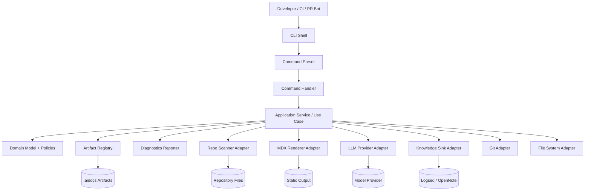
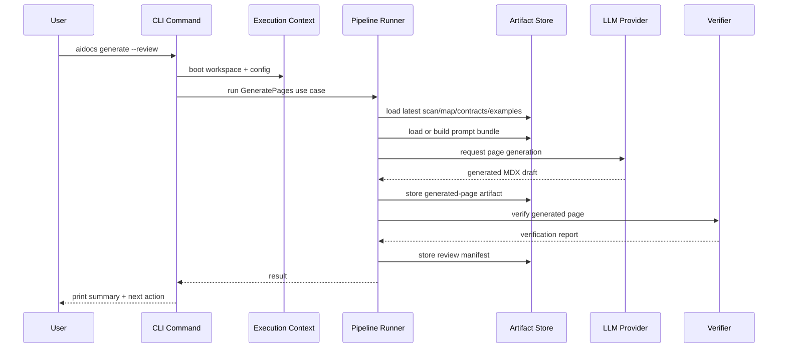

------
title: Build From Scratch: Mintlify-like AI-driven Documentation Generator CLI - Part 039
description: Design the internal architecture of a production-grade AI documentation CLI: command layer, application services, domain model, infrastructure adapters, artifact registry, diagnostics, errors, concurrency, and testing boundaries.
series: learn-ai-docs-km-cli
seriesTitle: Build From Scratch: Mintlify-like AI-driven Documentation Generator CLI with Code2Prompt and Open-source Knowledge Management
order: 39
partTitle: CLI Application Architecture
tags:
- ai-docs
- documentation
- cli
- architecture
- application-design
- clean-architecture
- diagnostics
- developer-tools
date: 2026-07-04
---

# Part 039 — CLI Application Architecture

Pada part sebelumnya kita sudah membangun retrieval layer untuk docs dan notes.

Sekarang kita masuk ke Phase 8: **implementasi internal CLI**.

Part ini menjawab pertanyaan yang sering diremehkan saat membangun developer tool:

> Bagaimana membuat CLI yang bukan hanya kumpulan script, tetapi aplikasi production-grade yang bisa discan, dites, di-debug, di-extend, dan dipercaya oleh developer?

Kita tidak sedang membangun command kecil seperti:

```bash
ai-docs generate
```

yang langsung membaca semua file, memanggil LLM, lalu menimpa folder docs.

Itu bukan sistem. Itu risiko.

CLI kita harus menjadi orchestrator untuk pipeline yang sudah kita desain:

```txt
scan -> classify -> map -> symbols -> contracts -> examples
     -> context -> plan -> generate -> verify -> review -> apply
     -> render -> preview -> publish -> km sync
```

Karena itu, arsitektur CLI harus memisahkan:

- command parsing,
- user interaction,
- application workflow,
- domain rules,
- infrastructure adapters,
- artifact storage,
- diagnostics,
- verification,
- provider integration,
- exit code,
- test boundaries.

Jika boundary ini kacau, sistem akan menjadi sulit dirawat setelah beberapa command pertama.

---

## 1. Core Thesis: CLI Is an Application, Not a Thin Script

CLI production-grade punya karakter berbeda dari script pribadi.

Script pribadi boleh punya bentuk seperti ini:

```txt
parse args
read files
call API
write output
print done
```

CLI production-grade harus punya bentuk seperti ini:

```txt
parse args
load config
resolve workspace
build execution context
run use case
emit diagnostics
write artifacts atomically
return stable exit code
```

Perbedaannya bukan gaya coding.

Perbedaannya adalah **operational trust**.

Developer akan menjalankan CLI ini di:

- laptop pribadi,
- monorepo besar,
- CI pipeline,
- PR bot,
- release pipeline,
- repo internal yang mengandung rahasia,
- repo open-source yang menerima contributor eksternal.

Maka CLI harus punya invariant berikut:

1. **Tidak diam-diam mengubah file penting.**
2. **Setiap output punya artifact yang bisa diinspeksi.**
3. **Setiap error punya diagnosis yang actionable.**
4. **Setiap command punya exit code yang stabil.**
5. **Setiap side effect bisa diprediksi.**
6. **Setiap integrasi eksternal bisa dimock dalam test.**
7. **Setiap generated docs bisa dilacak ke source/provenance.**

---

## 2. High-level Layering

Arsitektur internal CLI kita memakai layering berikut:

```txt
CLI Shell
  -> Command Layer
  -> Application Layer
  -> Domain Layer
  -> Infrastructure Layer
  -> Artifact Store
```

Diagramnya:



Layering ini bukan dogma.

Ini cara agar command seperti `aidocs generate` tidak menjadi fungsi raksasa 2.000 baris.

---

## 3. Package Layout

Kita gunakan struktur package yang eksplisit.

Contoh layout:

```txt
aidocs-cli/
  src/
    cli/
      main.ts
      commands/
        init.command.ts
        scan.command.ts
        map.command.ts
        context.command.ts
        plan.command.ts
        generate.command.ts
        verify.command.ts
        review.command.ts
        apply.command.ts
        render.command.ts
        preview.command.ts
        km.command.ts
      options/
        global-options.ts
        output-options.ts
        provider-options.ts
      help/
        examples.ts
        usage.ts

    app/
      use-cases/
        init-project.ts
        scan-repository.ts
        build-repository-map.ts
        compile-context.ts
        plan-documentation.ts
        generate-pages.ts
        verify-documentation.ts
        review-proposals.ts
        apply-patches.ts
        render-site.ts
        preview-site.ts
        sync-knowledge.ts
      workflow/
        pipeline-runner.ts
        step-runner.ts
        execution-context.ts
      ports/
        file-system.port.ts
        git.port.ts
        llm-provider.port.ts
        mdx-renderer.port.ts
        knowledge-sink.port.ts
        token-counter.port.ts
        process-runner.port.ts
        clock.port.ts

    domain/
      artifacts/
        artifact-id.ts
        artifact-manifest.ts
        artifact-kind.ts
      repo/
        repository-scan.ts
        repository-map.ts
        file-classification.ts
      context/
        context-unit.ts
        prompt-bundle.ts
        token-budget.ts
      docs/
        page-spec.ts
        doc-plan.ts
        mdx-page.ts
        navigation-plan.ts
      verification/
        verification-report.ts
        diagnostic.ts
        severity.ts
      review/
        review-manifest.ts
        patch.ts
      km/
        knowledge-node.ts
        knowledge-relation.ts

    infra/
      fs/
        node-file-system.ts
        atomic-writer.ts
      git/
        git-cli-adapter.ts
      llm/
        openai-provider.ts
        local-model-provider.ts
        fake-provider.ts
      renderer/
        mdx-renderer.ts
      km/
        logseq-sink.ts
        opennote-export-sink.ts
      tokens/
        tiktoken-counter.ts
        approximate-token-counter.ts
      config/
        config-loader.ts
        config-schema.ts
      logging/
        logger.ts
        progress.ts

    testing/
      fixtures/
      harness/
      golden/
```

Mental modelnya:

- `cli/` hanya tahu command, flags, output UX.
- `app/` tahu workflow dan orchestration.
- `domain/` tahu rules dan artifact model.
- `infra/` tahu file system, Git, provider, renderer, external tools.
- `testing/` menyediakan harness lintas layer.

Command layer tidak boleh tahu detail OpenAI API.

Domain layer tidak boleh tahu path absolut laptop user.

Infrastructure adapter tidak boleh mengarang business rule.

---

## 4. Command Layer: Thin, Boring, Stable

Command layer bertugas:

- parse argumen,
- parse flags,
- resolve output mode,
- panggil use case,
- format hasil,
- return exit code.

Command layer tidak boleh:

- melakukan scanning sendiri,
- membuat prompt sendiri,
- memanggil LLM langsung,
- menulis artifact manual,
- menyimpan state tersembunyi,
- memutuskan policy domain.

Contoh pseudo-code:

```ts
export async function generateCommand(args: GenerateArgs): Promise<number> {
  const shell = await CliShell.boot(args.globalOptions);

  const result = await shell.useCases.generatePages.execute({
    target: args.target,
    dryRun: args.dryRun,
    profile: args.profile,
    changedOnly: args.changedOnly,
    reviewMode: args.review,
  });

  shell.output.render(result);

  return result.exitCode;
}
```

Perhatikan: command ini tidak tahu cara generate docs.

Ia hanya menerjemahkan user intent ke use case input.

---

## 5. Global Options as Execution Context

Hampir semua command butuh option global.

Contoh:

```bash
aidocs generate --profile ci --json --no-color --workspace ./services/billing
```

Global options sebaiknya dinormalisasi menjadi `ExecutionContext`.

```ts
export interface ExecutionContext {
  cwd: AbsolutePath;
  workspaceRoot: AbsolutePath;
  profile: string;
  outputMode: 'human' | 'json' | 'ndjson';
  color: boolean;
  interactive: boolean;
  ci: boolean;
  dryRun: boolean;
  config: ResolvedConfig;
  logger: Logger;
  diagnostics: DiagnosticSink;
  artifactStore: ArtifactStore;
  cancellation: CancellationToken;
}
```

`ExecutionContext` adalah object yang mengikat satu run CLI.

Ia bukan global singleton.

Kenapa?

Karena test perlu menjalankan banyak context dalam satu process.

CI bot juga bisa menjalankan sub-workflow berbeda dalam satu orchestrator.

---

## 6. Application Layer: Use Cases, Not God Services

Application layer adalah tempat workflow berada.

Setiap command besar sebaiknya punya use case eksplisit:

```txt
ScanRepository
BuildRepositoryMap
CompileContext
PlanDocumentation
GeneratePages
VerifyDocumentation
ReviewProposals
ApplyPatches
RenderSite
SyncKnowledge
```

Use case menerima input yang sudah dinormalisasi, menjalankan port/adapters, lalu menghasilkan result.

Contoh:

```ts
export interface GeneratePagesInput {
  target?: PageTarget;
  changedOnly: boolean;
  dryRun: boolean;
  reviewMode: 'proposal' | 'apply' | 'none';
}

export interface GeneratePagesResult {
  generatedPages: GeneratedPageSummary[];
  skippedPages: SkippedPageSummary[];
  verificationReportId?: ArtifactId;
  reviewManifestId?: ArtifactId;
  diagnostics: Diagnostic[];
  exitCode: ExitCode;
}
```

Use case yang baik:

- punya input jelas,
- punya output jelas,
- tidak print langsung ke terminal,
- tidak baca env var langsung,
- tidak pakai file path mentah tanpa resolver,
- tidak memanggil command lain lewat shell jika bisa pakai service langsung,
- mudah dites dengan fake adapter.

---

## 7. Domain Layer: Rules That Must Stay True

Domain layer memuat aturan inti.

Contoh rule:

```txt
A generated page cannot claim behavior unless supported by source refs.
```

Ini bukan rule UI.

Ini rule domain.

Maka tempatnya bukan di command, bukan di provider, bukan di renderer.

Contoh domain object:

```ts
export class PageSpec {
  constructor(
    readonly id: PageId,
    readonly title: string,
    readonly audience: Audience,
    readonly sourceRefs: SourceRef[],
    readonly allowedClaimTypes: ClaimType[],
    readonly forbiddenClaims: ForbiddenClaim[],
    readonly requiredSections: SectionSpec[],
  ) {}

  validate(): DomainViolation[] {
    const violations: DomainViolation[] = [];

    if (this.sourceRefs.length === 0) {
      violations.push({
        code: 'PAGE_SPEC_WITHOUT_SOURCE_REFS',
        message: 'Page spec must include at least one source ref.',
      });
    }

    return violations;
  }
}
```

Domain layer harus tetap kecil tetapi keras.

Ia tidak boleh mengandung banyak framework glue.

---

## 8. Infrastructure Layer: Adapters Are Replaceable

Infrastructure layer berisi integrasi dunia luar.

Contoh adapter:

```txt
FileSystemAdapter
GitAdapter
LLMProvider
TokenCounter
MDXRenderer
KnowledgeSink
ProcessRunner
SecretScanner
OpenAPILoader
```

Setiap adapter harus lewat port interface.

Contoh:

```ts
export interface LlmProvider {
  complete(input: LlmRequest): Promise<LlmResponse>;
  stream?(input: LlmRequest): AsyncIterable<LlmEvent>;
  estimateCost?(input: LlmRequest): Promise<CostEstimate>;
}
```

Implementasi bisa berbeda:

```txt
OpenAIProvider
AnthropicProvider
LocalModelProvider
ReplayProvider
FakeProvider
```

Kenapa penting?

Karena kita perlu:

- test tanpa API call,
- replay generation dari fixture,
- switch provider,
- run local-only mode,
- audit request/response,
- enforce redaction sebelum provider call.

---

## 9. Artifact Registry as the Spine of the CLI

Artifact registry adalah tulang punggung sistem.

Setiap stage menghasilkan artifact:

```txt
scan.v1.json
classification.v1.json
repo-map.v1.json
symbols.v1.json
contracts.v1.json
examples.v1.json
knowledge-graph.v1.json
retrieval-index.v1.json
prompt-bundle.v1.json
page-spec.v1.json
doc-plan.v1.json
generated-page.v1.mdx
verification-report.v1.json
review-manifest.v1.json
navigation-plan.v1.json
render-manifest.v1.json
```

Tanpa registry, CLI hanya punya folder output acak.

Dengan registry, kita bisa menjawab:

```bash
aidocs artifacts list
```

```txt
KIND                    ID                 CREATED               STATUS
scan.v1                 scan_8f21          2026-07-04 10:22      ok
repo-map.v1             map_c612           2026-07-04 10:22      ok
prompt-bundle.v1        pb_7119            2026-07-04 10:23      ok
generated-page.v1       page_991a          2026-07-04 10:24      needs-review
verification-report.v1  ver_12ac           2026-07-04 10:25      failed
```

Artifact registry minimal:

```ts
export interface ArtifactRegistry {
  put<T extends Artifact>(artifact: T): Promise<ArtifactRef<T>>;
  get<T extends Artifact>(ref: ArtifactRef<T>): Promise<T>;
  find(query: ArtifactQuery): Promise<ArtifactRef<Artifact>[]>;
  latest(kind: ArtifactKind, scope?: ArtifactScope): Promise<ArtifactRef<Artifact> | null>;
}
```

Artifact registry harus mendukung:

- stable ID,
- content hash,
- parent artifact refs,
- schema version,
- status,
- diagnostics,
- source refs,
- visibility.

---

## 10. Execution Pipeline

Command seperti `aidocs generate` sebenarnya pipeline.



Pipeline runner harus mendukung:

- step name,
- timing,
- cancellation,
- retry policy,
- artifact dependency,
- progress reporting,
- fail-fast vs continue-on-error,
- dry-run,
- trace output.

Contoh model step:

```ts
export interface PipelineStep<I, O> {
  id: string;
  name: string;
  run(input: I, ctx: ExecutionContext): Promise<O>;
  cacheKey?(input: I, ctx: ExecutionContext): Promise<string>;
  canSkip?(input: I, ctx: ExecutionContext): Promise<SkipReason | null>;
}
```

---

## 11. Diagnostics System

Developer tool yang bagus tidak hanya berkata:

```txt
Error: failed
```

Ia harus berkata:

```txt
✘ API reference generation failed

Reason:
  OpenAPI document contains duplicate operationId: createUser

Where:
  openapi/public.yaml#/paths/~1users/post
  openapi/admin.yaml#/paths/~1users/post

Impact:
  Cannot generate stable endpoint page IDs.

Fix:
  Rename one operationId or configure operationIdConflictStrategy.

Docs:
  aidocs explain OPERATION_ID_CONFLICT
```

Diagnostics model:

```ts
export interface Diagnostic {
  code: string;
  severity: 'info' | 'warning' | 'error' | 'fatal';
  message: string;
  location?: DiagnosticLocation;
  impact?: string;
  suggestion?: string;
  sourceRefs?: SourceRef[];
  docsUrl?: string;
}
```

Diagnostics harus bisa dirender sebagai:

- human terminal output,
- JSON,
- NDJSON streaming,
- CI annotation,
- PR comment,
- verification report.

Jangan campur diagnostics dengan log debug.

Diagnostics adalah product surface.

Log adalah operational trace.

---

## 12. Error Model and Exit Codes

Exit code harus stabil karena CI bergantung padanya.

Contoh:

```ts
export enum ExitCode {
  Ok = 0,
  UsageError = 2,
  ConfigError = 3,
  WorkspaceError = 4,
  VerificationFailed = 10,
  DriftDetected = 11,
  ReviewRequired = 12,
  GenerationFailed = 20,
  ProviderUnavailable = 21,
  SecurityViolation = 30,
  InternalError = 70,
}
```

Mapping:

| Situation | Exit code | CI behavior |
|---|---:|---|
| Command valid and no issue | 0 | pass |
| Invalid CLI args | 2 | fail immediately |
| Config invalid | 3 | fail, show config path |
| Workspace not found | 4 | fail |
| Verification failed | 10 | fail PR check |
| Drift detected | 11 | fail or warn depending policy |
| Review required | 12 | neutral/fail depending CI config |
| Provider error | 21 | retry possible |
| Secret leak detected | 30 | hard fail |
| Unexpected bug | 70 | hard fail with trace ID |

Jangan gunakan exit code `1` untuk semua hal.

Itu membuat automation bodoh.

---

## 13. Output Modes

CLI harus punya minimal tiga output mode:

```txt
human
json
ndjson
```

Human mode untuk developer lokal.

```bash
aidocs verify
```

Output:

```txt
Verification failed: 3 errors, 5 warnings

Errors:
  DOC-LINK-001  Broken internal link: /api/users/create
  MDX-003       Invalid MDX component: <UnknownCallout>
  SRC-009       Claim has no source ref: docs/guides/auth.mdx:42

Next:
  aidocs verify --fix
  aidocs explain SRC-009
```

JSON mode untuk CI.

```bash
aidocs verify --json
```

NDJSON mode untuk streaming UI.

```bash
aidocs generate --ndjson
```

Contoh event:

```json
{"type":"step.started","step":"compile-context","time":"2026-07-04T10:00:00Z"}
{"type":"diagnostic","severity":"warning","code":"CTX-LOW-COVERAGE","message":"Only 42% of required source refs were included."}
{"type":"step.finished","step":"compile-context","durationMs":1820}
```

---

## 14. Interactive vs Non-interactive Mode

CLI harus tahu apakah sedang berjalan interaktif.

Interaktif:

```bash
aidocs review
```

Boleh menampilkan prompt:

```txt
Apply 3 safe patches? [y/N]
```

Non-interaktif:

```bash
aidocs review --apply --ci
```

Tidak boleh prompt user.

Jika butuh keputusan, command harus gagal dengan diagnostic:

```txt
REVIEW_DECISION_REQUIRED
```

Rule:

```txt
CI mode must never wait for stdin.
```

Ini penting untuk pipeline.

---

## 15. Workspace Detection

CLI harus bisa menentukan workspace root.

Candidate markers:

```txt
.aidocs/
aidocs.config.yaml
docs.json
.git/
package.json
pom.xml
go.mod
Cargo.toml
```

Algorithm sederhana:

```txt
start from cwd
walk upward
if aidocs.config.yaml found -> workspace root
else if docs.json + .git found -> docs workspace
else if .git found -> repo root
else fail with WORKSPACE_NOT_FOUND
```

Untuk monorepo, workspace bisa berbeda dari repo root.

Contoh:

```txt
repo/
  aidocs.config.yaml
  services/
    billing/
      aidocs.config.yaml
    identity/
      aidocs.config.yaml
  docs/
    docs.json
```

CLI harus bisa:

```bash
aidocs scan --workspace services/billing
```

Dan tetap tahu parent repo.

---

## 16. File System Boundary

Jangan pakai `fs.writeFile` langsung di seluruh codebase.

Semua file operation lewat port:

```ts
export interface FileSystemPort {
  readText(path: AbsolutePath): Promise<string>;
  writeText(path: AbsolutePath, content: string): Promise<void>;
  writeTextAtomic(path: AbsolutePath, content: string): Promise<void>;
  exists(path: AbsolutePath): Promise<boolean>;
  list(path: AbsolutePath): Promise<DirEntry[]>;
  stat(path: AbsolutePath): Promise<FileStat>;
}
```

Kenapa?

Karena kita butuh:

- atomic write,
- path sandboxing,
- fake file system untuk test,
- dry-run,
- permission-aware diagnostics,
- write audit.

Atomic write pattern:

```txt
write temp file in same directory
fsync if needed
rename temp -> final
```

Ini mengurangi risiko file rusak saat process mati.

---

## 17. Git Boundary

Git integration tidak boleh tersebar.

Port:

```ts
export interface GitPort {
  root(cwd: AbsolutePath): Promise<AbsolutePath | null>;
  status(): Promise<GitStatus>;
  changedFiles(base?: string): Promise<RepoPath[]>;
  diff(paths?: RepoPath[]): Promise<string>;
  blame(path: RepoPath): Promise<BlameInfo[]>;
  currentBranch(): Promise<string | null>;
}
```

Kita butuh Git untuk:

- changed-only scan,
- drift detection di PR,
- review patch,
- ownership routing,
- provenance,
- docs change summary.

Rule penting:

```txt
CLI may read Git state by default, but must not commit or push unless explicitly requested.
```

---

## 18. LLM Boundary

LLM provider adalah adapter paling berbahaya karena:

- biaya,
- latency,
- rate limit,
- privacy,
- non-determinism,
- output invalid,
- provider-specific behavior.

Port minimal:

```ts
export interface LlmProvider {
  id: string;
  capabilities(): LlmCapabilities;
  complete(request: LlmRequest): Promise<LlmResponse>;
}

export interface LlmRequest {
  model: string;
  messages: LlmMessage[];
  temperature: number;
  maxOutputTokens?: number;
  responseFormat?: ResponseFormat;
  metadata: RequestMetadata;
}
```

Sebelum request dikirim, pipeline wajib melewati:

```txt
prompt bundle validation
secret redaction
visibility check
cost estimate
rate-limit policy
request audit
```

Setelah response diterima:

```txt
schema validation
MDX parse
claim extraction
source ref check
verification
artifact persistence
```

Jangan pernah langsung menulis response LLM ke `docs/`.

---

## 19. Cancellation and Signals

CLI harus menangani `Ctrl+C` dengan aman.

Rule:

```txt
On cancellation, finish current atomic write or rollback temp files, then emit cancellation report.
```

Implementation model:

```ts
export interface CancellationToken {
  readonly cancelled: boolean;
  throwIfCancelled(): void;
  onCancel(handler: () => Promise<void> | void): void;
}
```

Stage yang panjang harus cek cancellation:

```ts
for await (const file of scanner.walk(root)) {
  ctx.cancellation.throwIfCancelled();
  await processFile(file);
}
```

Jangan biarkan cancel menghasilkan `.aidocs` corrupt.

---

## 20. Concurrency Model

Beberapa stage bisa paralel:

- hashing files,
- classifying files,
- parsing symbols,
- validating links,
- rendering pages,
- indexing chunks.

Beberapa stage tidak boleh paralel sembarangan:

- writing same artifact manifest,
- updating review state,
- applying patches,
- writing docs navigation,
- provider calls under strict rate limit.

Gunakan worker pool dengan limit.

```ts
export interface ConcurrencyPolicy {
  fileWorkers: number;
  parserWorkers: number;
  providerRequests: number;
  renderWorkers: number;
}
```

Default harus konservatif.

CLI yang membuat laptop developer freeze bukan CLI yang bagus.

---

## 21. Progress Reporting

Progress report harus jujur.

Jangan tampilkan fake progress `99%` selama 5 menit.

Gunakan step-based progress:

```txt
✓ scan repository                 1.2s   1,842 files
✓ classify files                  0.6s   412 documentable
✓ build repo map                  0.2s   12 modules
✓ compile context                 1.8s   42k tokens
⠼ generate API guide                    provider call 2/5
```

Untuk CI, jangan gunakan spinner.

Untuk `--json`, jangan gunakan human progress.

---

## 22. Logging vs Diagnostics vs Artifacts

Tiga hal ini sering dicampur.

Pisahkan:

| Concern | Audience | Example |
|---|---|---|
| Logging | maintainer CLI | `Loaded config from ...` |
| Diagnostics | user/developer | `OpenAPI operationId conflict` |
| Artifact | pipeline/system | `verification-report.v1.json` |

Rule:

```txt
A user-facing problem must be diagnostic, not only log.
A reproducible pipeline result must be artifact, not only terminal output.
```

---

## 23. Plugin Boundary Preview

Part 042 akan membahas plugin system detail.

Namun arsitektur CLI harus dari awal siap menerima plugin.

Contoh extension point:

```ts
export interface AnalyzerPlugin {
  id: string;
  supports(file: ClassifiedFile): boolean;
  extract(input: AnalyzerInput): Promise<AnalyzerOutput>;
}
```

Plugin tidak boleh bebas mengakses seluruh `ExecutionContext`.

Berikan capability minimal:

```txt
read selected files
emit diagnostics
emit artifacts
access config namespace plugin.<id>
```

Ini mencegah plugin menjadi backdoor global.

---

## 24. Command Surface Mapping

Berikut mapping command ke use case.

| Command | Use case | Primary artifact |
|---|---|---|
| `aidocs init` | `InitProject` | `aidocs.config.yaml`, `.aidocs/manifest.json` |
| `aidocs scan` | `ScanRepository` | `scan.v1.json` |
| `aidocs classify` | `ClassifyFiles` | `classification.v1.json` |
| `aidocs map` | `BuildRepositoryMap` | `repo-map.v1.json` |
| `aidocs symbols` | `ExtractSymbols` | `symbols.v1.json` |
| `aidocs contracts` | `DiscoverContracts` | `contracts.v1.json` |
| `aidocs examples` | `MineExamples` | `examples.v1.json` |
| `aidocs context` | `CompileContext` | `prompt-bundle.v1.json` |
| `aidocs plan` | `PlanDocumentation` | `doc-plan.v1.json` |
| `aidocs generate` | `GeneratePages` | `generated-page.v1`, `review-manifest.v1` |
| `aidocs verify` | `VerifyDocumentation` | `verification-report.v1.json` |
| `aidocs review` | `ReviewProposals` | `review-manifest.v1.json` |
| `aidocs apply` | `ApplyPatches` | changed docs files |
| `aidocs render` | `RenderSite` | `render-manifest.v1.json` |
| `aidocs preview` | `PreviewSite` | local preview server |
| `aidocs km sync` | `SyncKnowledge` | `km-sync-report.v1.json` |
| `aidocs explain` | `ExplainDiagnostic` | none |

This mapping is documentation for your architecture.

Jika sebuah command tidak punya use case jelas, berarti desainnya belum matang.

---

## 25. `aidocs doctor`

Setiap CLI kompleks butuh command diagnostic lingkungan.

```bash
aidocs doctor
```

Output:

```txt
Workspace
  root: /repo
  config: aidocs.config.yaml
  docs: docs/

Tools
  git: ok 2.45.0
  node: ok 22.x
  mermaid: missing optional

Providers
  openai: configured via env OPENAI_API_KEY
  local: disabled

Security
  secret scanning: enabled
  provider logging: redacted

Docs
  docs.json: ok
  mdx pages: 42
  broken links: 0
```

`doctor` mengurangi support burden.

Developer tidak perlu menebak kenapa command gagal.

---

## 26. `aidocs explain`

Diagnostics code harus bisa dijelaskan.

```bash
aidocs explain SRC-009
```

Output:

```txt
SRC-009: Claim has no source reference

Meaning:
  A generated documentation claim was not linked to any known source artifact.

Why it matters:
  Ungrounded claims can become hallucinated documentation.

Fix:
  Add source refs to the page spec, remove the claim, or mark it as human-authored.

Related:
  aidocs verify --grounding
  aidocs review --show-claims
```

Ini membuat CLI terasa seperti product, bukan compiler kasar.

---

## 27. Test Strategy by Layer

Testing harus mengikuti boundary.

```txt
Command tests
  -> args/flags/output/exit code

Application tests
  -> workflow behavior with fake ports

Domain tests
  -> rules, validation, scoring, artifact invariants

Infrastructure tests
  -> real FS/Git/provider contract tests

Golden tests
  -> generated prompt bundle, MDX output, diagnostics output

End-to-end tests
  -> sample repo -> docs output
```

Contoh test:

```ts
test('generate does not write docs when review mode is proposal', async () => {
  const harness = await createCliHarness({ fixture: 'simple-api' });

  const result = await harness.run([
    'generate',
    '--page',
    'api/users',
    '--review',
  ]);

  expect(result.exitCode).toBe(ExitCode.ReviewRequired);
  expect(await harness.fs.exists('docs/api/users.mdx')).toBe(false);
  expect(await harness.artifacts.find({ kind: 'review-manifest.v1' })).toHaveLength(1);
});
```

Ini test behavior, bukan implementasi internal.

---

## 28. Golden Files

Untuk CLI docs generator, golden files sangat berguna.

Contoh:

```txt
tests/golden/
  simple-api/
    expected/
      scan.v1.json
      repo-map.v1.json
      doc-plan.v1.json
      docs/
        quickstart.mdx
        api/users.mdx
```

Namun golden file bisa membuat test rapuh.

Gunakan aturan:

- golden untuk output deterministic,
- jangan golden untuk raw LLM response,
- normalisasi timestamp/path,
- compare semantic sections jika perlu,
- review golden changes dengan hati-hati.

---

## 29. Replay Provider

LLM output tidak deterministic.

Maka test butuh replay provider.

```ts
export class ReplayProvider implements LlmProvider {
  constructor(private cassetteDir: AbsolutePath) {}

  async complete(request: LlmRequest): Promise<LlmResponse> {
    const key = hashStableRequest(request);
    return await readCassette(this.cassetteDir, key);
  }
}
```

Mode:

```bash
aidocs generate --provider replay --cassette tests/cassettes/simple-api
```

Ini membuat end-to-end test stabil.

---

## 30. Security Boundary in Architecture

Security tidak boleh hanya menjadi part terpisah.

Security harus masuk ke architecture boundary.

Minimal gates:

```txt
before scanning:
  path sandboxing
  ignore unsafe directories

before prompt bundle:
  file visibility classification
  secret redaction
  token budget

before provider call:
  provider policy check
  audit log
  cost/rate limit check

before writing docs:
  generated region check
  verification
  review policy

before km sync:
  visibility downgrade prevention
```

Rule paling penting:

```txt
No external provider call may happen before the prompt bundle passes security validation.
```

---

## 31. Minimal Implementation Skeleton

Jika kita membuat skeleton awal, command flow-nya seperti ini:

```ts
async function main(argv: string[]): Promise<void> {
  const parsed = parseCli(argv);
  const shell = await CliShell.boot(parsed.globalOptions);

  try {
    const exitCode = await dispatch(parsed, shell);
    process.exitCode = exitCode;
  } catch (error) {
    const diagnostic = shell.errors.toDiagnostic(error);
    shell.output.renderDiagnostic(diagnostic);
    process.exitCode = diagnosticToExitCode(diagnostic);
  } finally {
    await shell.shutdown();
  }
}
```

`CliShell.boot` melakukan:

```txt
resolve cwd
load env
load config
resolve workspace
create logger
create diagnostics sink
create artifact store
wire ports
wire use cases
install signal handlers
```

Jangan membuat semua ini di `main`.

---

## 32. Anti-patterns

### Anti-pattern 1: Command Does Everything

```txt
commands/generate.ts
  scan repo
  build prompt
  call LLM
  parse MDX
  write file
  verify links
```

Ini cepat di awal, hancur di tengah.

### Anti-pattern 2: Global Mutable Config

```ts
GlobalConfig.provider = 'openai';
```

Sulit dites, sulit parallel, sulit reasoning.

### Anti-pattern 3: Hidden Side Effects

```bash
aidocs verify
```

tiba-tiba mengubah docs.

Verifier harus read-only kecuali user eksplisit minta `--fix`.

### Anti-pattern 4: Provider Coupling

Domain object berisi field provider-specific seperti:

```ts
openAiResponseId: string
```

Itu bocor.

Simpan provider metadata di artifact metadata, bukan domain core.

### Anti-pattern 5: No Artifact Trail

Jika user bertanya:

```txt
Kenapa halaman ini berubah?
```

CLI harus bisa menjawab.

Jika tidak bisa, arsitekturnya belum cukup.

---

## 33. Practical Build Order

Urutan implementasi yang masuk akal:

```txt
1. CLI shell + global options
2. config loader minimal
3. workspace detection
4. artifact store
5. diagnostics model
6. scan command
7. classify/map commands
8. context command with fake provider
9. generate command with replay provider
10. verify command
11. review/apply workflow
12. render/preview
13. km sync
14. provider abstraction production
15. plugin system
```

Jangan mulai dari LLM provider.

Mulai dari artifact dan diagnostics.

LLM hanya salah satu adapter.

---

## 34. Invariants for This Part

Pegang invariant berikut:

```txt
CLI command is thin.
Use case owns workflow.
Domain owns rules.
Infrastructure owns external systems.
Artifact registry owns reproducibility.
Diagnostics own user-facing failure explanation.
Provider response is never applied without verification.
CI mode never waits for input.
Exit codes are stable API.
```

Jika invariant ini dijaga, CLI akan tetap bisa tumbuh sampai puluhan command tanpa menjadi lump of scripts.

---

## 35. What We Have Built Conceptually

Sampai part ini, kita punya blueprint internal untuk CLI:

```txt
aidocs
  command parser
  execution context
  config loader
  artifact registry
  use cases
  domain rules
  adapters
  diagnostics
  exit code contract
  testing harness
```

Ini adalah fondasi untuk part berikutnya.

Part 040 akan membahas **Configuration System**.

Configuration system penting karena semua behavior production-grade harus bisa dikendalikan secara eksplisit:

- scanner ignore policy,
- provider mode,
- docs output,
- review policy,
- verification strictness,
- security settings,
- KM sink,
- CI behavior,
- profiles.

Tanpa config model yang baik, CLI akan berubah menjadi kumpulan flags yang tidak konsisten.

---

## References

- Picocli — command line framework with subcommands, options, help, and reusable command features: https://picocli.info/
- Clap — Rust command-line argument parser with derive and builder APIs: https://docs.rs/clap/latest/clap/
- XDG Base Directory Specification — standard locations for user-specific configuration/data/cache directories: https://specifications.freedesktop.org/basedir-spec/latest/
- The Twelve-Factor App, Config — guidance to store deploy-specific config in environment variables: https://12factor.net/config
