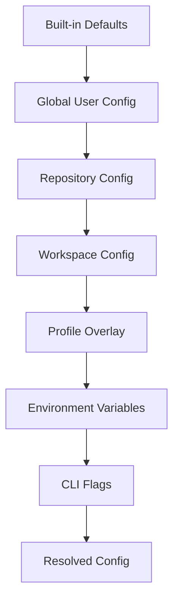
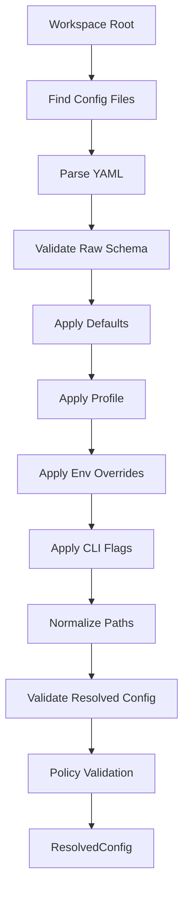

------
title: Build From Scratch: Mintlify-like AI-driven Documentation Generator CLI - Part 040
description: Build a production-grade configuration system for an AI documentation CLI: defaults, project config, profiles, environment variables, CLI overrides, schema validation, provider settings, security policy, CI behavior, and explainable resolution.
series: learn-ai-docs-km-cli
seriesTitle: Build From Scratch: Mintlify-like AI-driven Documentation Generator CLI with Code2Prompt and Open-source Knowledge Management
order: 40
partTitle: Configuration System
tags:
- ai-docs
- documentation
- cli
- configuration
- schema
- yaml
- ci
- security
- provider-config
date: 2026-07-04
---

# Part 040 — Configuration System

Pada part sebelumnya kita membangun arsitektur internal CLI.

Sekarang kita membahas sistem yang mengontrol semua behavior CLI:

> Configuration system.

Ini kelihatan sederhana.

Padahal untuk CLI AI documentation generator, config adalah salah satu komponen paling kritis.

Kenapa?

Karena CLI ini melakukan banyak hal berisiko:

- membaca repo,
- memilih file untuk prompt,
- mengirim context ke provider LLM,
- menulis docs,
- mengubah navigation,
- membuat notes knowledge graph,
- berjalan di CI,
- memutuskan apakah drift harus menggagalkan PR,
- mengatur visibility public/internal/private,
- mengatur review gate.

Jika semua behavior dikendalikan lewat flags acak, sistem akan sulit dipakai.

Jika semua behavior hardcoded, sistem tidak bisa beradaptasi.

Maka kita butuh config system yang:

- explicit,
- versioned,
- schema-validated,
- explainable,
- profile-aware,
- safe by default,
- CI-friendly,
- monorepo-friendly,
- secret-safe,
- deterministic.

---

## 1. Core Thesis: Config Is an Operational Contract

Config bukan hanya file setting.

Config adalah kontrak antara:

```txt
repository
  <-> docs generator
  <-> developer workflow
  <-> CI policy
  <-> model provider
  <-> security boundary
  <-> publishing target
  <-> knowledge management sink
```

Config menjawab pertanyaan:

- folder mana yang boleh discan?
- file mana yang harus diabaikan?
- provider LLM mana yang boleh digunakan?
- apakah kode boleh dikirim ke provider remote?
- halaman mana yang generated, manual, atau hybrid?
- apakah docs drift menggagalkan CI?
- apakah generated output langsung ditulis atau harus review?
- Logseq/OpenNote sink aktif atau tidak?
- target docs public atau internal?
- berapa token budget per task?
- apakah API reference dimaterialisasi ke MDX atau didelegasikan ke OpenAPI renderer?

Tanpa config, user harus mengingat ratusan flags.

Itu buruk.

---

## 2. Configuration Sources

Config tidak hanya berasal dari satu file.

CLI harus menyelesaikan config dari beberapa source:

```txt
built-in defaults
  -> global user config
  -> repository config
  -> workspace config
  -> profile overlay
  -> environment variables
  -> CLI flags
```

Precedence final:

```txt
CLI flags win over env vars
env vars win over profile config
profile config wins over workspace config
workspace config wins over repo config
repo config wins over global config
global config wins over built-in defaults
```

Diagram:



Jangan buat precedence ambigu.

Ambiguity dalam config adalah sumber bug paling mahal.

---

## 3. File Names and Locations

Project config utama:

```txt
aidocs.config.yaml
```

Kenapa YAML?

- readable,
- mendukung komentar,
- umum untuk tooling infra/docs,
- cocok untuk config declarative.

Global user config mengikuti platform convention.

Contoh:

```txt
Linux/macOS:
  $XDG_CONFIG_HOME/aidocs/config.yaml
  fallback: ~/.config/aidocs/config.yaml

Windows:
  %APPDATA%\aidocs\config.yaml
```

Cache/data sebaiknya tidak dicampur dengan config.

Contoh:

```txt
Project artifacts:
  .aidocs/

User cache:
  $XDG_CACHE_HOME/aidocs/

User config:
  $XDG_CONFIG_HOME/aidocs/config.yaml
```

Rule:

```txt
Project behavior belongs in repository config.
Machine-specific preferences belong in global user config.
Secrets belong in environment variables or secret manager.
Generated artifacts belong in .aidocs/ or configured artifact directory.
```

---

## 4. Minimal Config Shape

Config awal harus cukup lengkap tapi tidak terlalu rumit.

```yaml
version: 1

project:
  name: billing-service
  visibility: internal
  root: .

docs:
  root: docs
  configFile: docs.json
  output: .aidocs/site
  mode: mintlify-like

scan:
  include:
    - src/**
    - openapi/**
    - docs/**
    - README.md
  exclude:
    - node_modules/**
    - target/**
    - build/**
    - dist/**
    - .git/**
  respectGitignore: true
  maxFileBytes: 200000

context:
  tokenBudget:
    default: 60000
    page: 30000
    architecture: 80000
  includeTests: true
  includeExamples: true
  includeExistingDocs: true

generation:
  enabled: true
  defaultMode: proposal
  temperature: 0.1
  maxOutputTokens: 8000
  protectManualEdits: true

verification:
  strict: true
  requireSourceRefs: true
  checkLinks: true
  checkMdx: true
  checkExamples: true
  failOnWarnings: false

review:
  required: true
  applySafePatches: false

providers:
  default: openai
  openai:
    model: gpt-5.5-thinking
    apiKeyEnv: OPENAI_API_KEY

km:
  enabled: true
  sinks:
    logseq:
      enabled: true
      graphPath: ../knowledge/logseq
    opennote:
      enabled: false
      exportPath: .aidocs/opennote-export

security:
  remoteProviderAllowed: false
  secretScanning: true
  redactBeforeProvider: true
  allowPrivateSourcesInPrompt: false

ci:
  driftPolicy: fail
  reviewPolicy: require
  output: json
```

Ini bukan config final semua fitur.

Ini baseline yang mengikat semua part sebelumnya.

---

## 5. Config Schema Must Be Versioned

Selalu masukkan version.

```yaml
version: 1
```

Kenapa?

Karena config akan berubah.

Tanpa version, kita tidak bisa migrate.

Schema version memungkinkan:

- validation eksplisit,
- migration command,
- deprecation warning,
- backward compatibility,
- CI fail jika config terlalu lama.

Contoh:

```bash
aidocs config migrate --from 1 --to 2
```

Output:

```txt
Updated aidocs.config.yaml
  renamed generation.defaultMode -> generation.writeMode
  added verification.claimPolicy.requireEvidence: true
```

---

## 6. Config Loader Pipeline

Config loader bukan `readYaml()` saja.

Pipeline:

```txt
resolve workspace
find config files
parse config files
validate raw schema
apply defaults
apply profile overlay
apply environment overrides
apply CLI flag overrides
normalize paths
validate resolved schema
run policy validation
return ResolvedConfig
```

Diagram:



Pseudo-code:

```ts
export async function loadConfig(input: LoadConfigInput): Promise<ResolvedConfig> {
  const sources = await discoverConfigSources(input.cwd, input.workspace);
  const raw = await parseAndMerge(sources);
  validateRawConfig(raw);

  const withDefaults = applyDefaults(raw);
  const withProfile = applyProfile(withDefaults, input.profile);
  const withEnv = applyEnvOverrides(withProfile, input.env);
  const withFlags = applyFlagOverrides(withEnv, input.flags);

  const normalized = normalizeConfigPaths(withFlags, input.workspaceRoot);
  validateResolvedConfig(normalized);
  validatePolicies(normalized);

  return normalized;
}
```

---

## 7. Raw Config vs Resolved Config

Pisahkan raw config dan resolved config.

Raw config adalah yang ditulis user.

```yaml
docs:
  root: docs
```

Resolved config adalah hasil final.

```json
{
  "docs": {
    "root": "/repo/docs",
    "configFile": "/repo/docs/docs.json",
    "output": "/repo/.aidocs/site",
    "mode": "mintlify-like"
  }
}
```

Jangan gunakan raw config di application layer.

Application layer hanya menerima `ResolvedConfig`.

---

## 8. Explainable Config Resolution

CLI harus bisa menjelaskan config.

```bash
aidocs config explain generation.defaultMode
```

Output:

```txt
generation.defaultMode = proposal

Resolved from:
  aidocs.config.yaml:42

Precedence:
  CLI flag: not set
  env: AIDOCS_GENERATION_DEFAULT_MODE not set
  profile(ci): not active
  project config: proposal
  default: proposal
```

Command penting:

```bash
aidocs config show
```

```bash
aidocs config show --resolved
```

```bash
aidocs config sources
```

```bash
aidocs config validate
```

```bash
aidocs config explain security.remoteProviderAllowed
```

Ini sangat membantu debugging.

---

## 9. Profiles

Profiles menghindari config duplikasi.

Contoh:

```yaml
profiles:
  local:
    generation:
      defaultMode: proposal
    verification:
      failOnWarnings: false
    security:
      remoteProviderAllowed: false

  ci:
    generation:
      enabled: false
    verification:
      strict: true
      failOnWarnings: true
    ci:
      driftPolicy: fail
      output: json

  enterprise:
    security:
      remoteProviderAllowed: false
      allowPrivateSourcesInPrompt: false
      redactBeforeProvider: true
    review:
      required: true
```

Usage:

```bash
aidocs verify --profile ci
```

Rule:

```txt
Profile is an overlay, not a separate config universe.
```

Jangan buat file config berbeda yang tidak bisa dibandingkan.

---

## 10. Environment Variables

Environment variables cocok untuk:

- secret,
- CI context,
- temporary override,
- provider credential,
- machine-specific values.

Contoh:

```txt
AIDOCS_PROFILE=ci
AIDOCS_OUTPUT=json
AIDOCS_PROVIDER=openai
OPENAI_API_KEY=...
AIDOCS_REMOTE_PROVIDER_ALLOWED=false
```

Jangan simpan API key di `aidocs.config.yaml`.

Gunakan reference:

```yaml
providers:
  openai:
    model: gpt-5.5-thinking
    apiKeyEnv: OPENAI_API_KEY
```

Config loader hanya tahu nama env var.

Provider adapter membaca secret dari secret provider setelah policy validation.

---

## 11. CLI Flag Overrides

CLI flags untuk override sesaat.

Contoh:

```bash
aidocs generate --page guides/auth --dry-run --provider local --token-budget 20000
```

Flag tidak boleh mengubah config file otomatis.

Jika user ingin persist:

```bash
aidocs config set context.tokenBudget.page 20000
```

Atau edit manual.

Rule:

```txt
Flags override runtime behavior, not repository policy permanently.
```

---

## 12. Path Resolution

Path di config harus relatif terhadap workspace root, kecuali eksplisit absolut.

```yaml
docs:
  root: docs
scan:
  include:
    - src/**
```

Resolved:

```txt
/repo/docs
/repo/src/**
```

Rule path:

```txt
Relative project paths resolve from workspace root.
Global config paths resolve from global config directory unless marked workspace-relative.
No resolved path may escape workspace for write operations unless explicitly allowed.
```

Ini mencegah config berbahaya seperti:

```yaml
docs:
  root: ../../somewhere-else
```

Default harus menolak write path yang keluar workspace.

---

## 13. Scan Config

Scanner config menentukan source universe.

```yaml
scan:
  include:
    - src/**
    - packages/**/src/**
    - openapi/**
    - docs/**
    - README.md
  exclude:
    - '**/node_modules/**'
    - '**/target/**'
    - '**/build/**'
    - '**/dist/**'
    - '**/.next/**'
    - '**/.turbo/**'
  respectGitignore: true
  respectAidocsIgnore: true
  followSymlinks: false
  maxFileBytes: 200000
  binaryDetection: true
```

Config scanner harus aman.

Default exclude harus agresif untuk:

- dependency directories,
- generated output,
- cache,
- binary artifacts,
- vendor blobs,
- lock-heavy irrelevant files jika tidak diperlukan.

Namun jangan exclude lock file secara absolut.

Kadang lock file relevan untuk installation docs.

Gunakan classification, bukan hard ignore, jika file masih punya metadata penting.

---

## 14. Classification Config

File classification bisa di-tune.

```yaml
classification:
  rules:
    - pattern: '**/*.generated.ts'
      kind: generated_source
      promptEligible: false
    - pattern: 'openapi/**/*.yaml'
      kind: api_contract
      authority: high
    - pattern: 'docs/internal/**'
      visibility: internal
    - pattern: 'examples/**'
      kind: example
      authority: medium
```

Rule harus explainable.

```bash
aidocs classify --explain src/generated/client.ts
```

Output:

```txt
src/generated/client.ts
  kind: generated_source
  promptEligible: false

Matched rules:
  aidocs.config.yaml:18 pattern '**/*.generated.ts'
```

---

## 15. Context Config

Context config mengatur token budget dan source selection.

```yaml
context:
  tokenBudget:
    default: 60000
    overview: 30000
    guide: 45000
    apiReference: 50000
    architecture: 80000
    troubleshooting: 50000
  packing:
    redundancyLimit: 0.2
    minSourceCoverage: 0.75
    preferContractsOverImplementation: true
    preferExamplesOverInventedSnippets: true
  compression:
    enabled: true
    maxCompressionLevel: summary_with_symbols
  retrieval:
    hybrid: true
    semantic: true
    lexical: true
    graphExpansion: true
    maxGraphHops: 2
```

Rule penting:

```txt
Context config controls selection, not truth.
Truth still comes from source authority and verification.
```

---

## 16. Generation Config

Generation config mengontrol LLM authoring.

```yaml
generation:
  enabled: true
  defaultMode: proposal
  pageTypes:
    guide:
      template: guide.v1
      temperature: 0.1
      maxOutputTokens: 9000
    apiReference:
      template: api-reference.v1
      temperature: 0.0
      maxOutputTokens: 7000
    architecture:
      template: architecture.v1
      temperature: 0.1
      maxOutputTokens: 12000
  protectManualEdits: true
  requireVerificationBeforeApply: true
  allowOverwrite: false
```

`defaultMode` options:

```txt
proposal  -> generate review patch only
apply     -> write if verifier passes and policy allows
stdout    -> print generated output only
none      -> disabled
```

Default harus `proposal`.

AI-generated docs sebaiknya tidak langsung menimpa file tanpa review.

---

## 17. Verification Config

Verifier harus configurable, tapi safe default.

```yaml
verification:
  strict: true
  requireSourceRefs: true
  requireClaimLedger: true
  checkMdx: true
  checkLinks: true
  checkNavigation: true
  checkExamples: true
  checkMermaid: true
  checkOpenApiRefs: true
  checkVisibility: true
  failOnWarnings: false
  waivers:
    allow: true
    requireReason: true
    maxAgeDays: 30
```

Policy per environment:

```yaml
profiles:
  local:
    verification:
      failOnWarnings: false
  ci:
    verification:
      failOnWarnings: true
```

Rule:

```txt
Verification can be relaxed locally, but CI should be stricter.
```

---

## 18. Review Config

Review config menentukan human-in-the-loop behavior.

```yaml
review:
  required: true
  defaultReviewerMode: codeowners
  applySafePatches: false
  preserveManualRegions: true
  requireApprovalFor:
    - public_docs
    - api_reference
    - architecture
    - runbook
  autoAccept:
    enabled: false
```

Review config harus bisa membedakan:

- low-risk link fixes,
- generated new guide,
- public API docs changes,
- internal note sync,
- runbook command changes.

Tidak semua patch punya risiko sama.

---

## 19. Provider Config

Provider config harus memisahkan:

- model identity,
- credential source,
- rate limit,
- cost limit,
- data policy,
- capability.

Contoh:

```yaml
providers:
  default: openai

  openai:
    type: openai
    model: gpt-5.5-thinking
    apiKeyEnv: OPENAI_API_KEY
    maxRequestsPerMinute: 30
    maxInputTokens: 120000
    maxOutputTokens: 16000
    dataPolicy:
      allowSourceCode: false
      allowInternalDocs: false
      redactSecrets: true

  local:
    type: local
    endpoint: http://localhost:11434
    model: qwen-coder
    maxInputTokens: 32000
    dataPolicy:
      allowSourceCode: true
      allowInternalDocs: true
```

Rule:

```txt
Provider data policy must be checked before prompt bundle is sent.
```

Jika provider remote tidak boleh menerima source code, command harus gagal atau memakai local provider.

---

## 20. Security Config

Security config adalah first-class.

```yaml
security:
  remoteProviderAllowed: false
  secretScanning: true
  redactBeforeProvider: true
  failOnSecretDetection: true
  allowPrivateSourcesInPrompt: false
  visibilityPolicy:
    publicDocsMayUse:
      - public
      - internal_summary
    internalDocsMayUse:
      - public
      - internal
    privateSourcesMayUse:
      - private
  audit:
    enabled: true
    logPromptMetadata: true
    logPromptContent: false
```

Jangan jadikan security sekadar flag provider.

Security memengaruhi:

- scan,
- context packing,
- retrieval,
- generation,
- review,
- KM sync,
- publishing.

---

## 21. Docs Config

Docs config mengatur output docs.

```yaml
docs:
  root: docs
  configFile: docs.json
  mode: mintlify-like
  generatedMarker: '<!-- generated by aidocs -->'
  pages:
    generatedDir: docs/generated
    apiDir: docs/api-reference
    guidesDir: docs/guides
  navigation:
    strategy: task-first
    preserveManualGroups: true
    autoCreateLandingPages: true
  mdx:
    components:
      allow:
        - Note
        - Warning
        - Tip
        - CodeGroup
        - Tabs
    mermaid: true
```

Docs config harus sinkron dengan renderer dan verifier.

Jika `Warning` tidak ada di allowlist, generator tidak boleh mengeluarkan `<Warning>`.

---

## 22. KM Config

Knowledge management config mengatur sink notes.

```yaml
km:
  enabled: true
  visibility: internal
  syncMode: proposal
  sinks:
    logseq:
      enabled: true
      graphPath: ../knowledge/logseq
      namespace: aidocs
      writeJournals: false
    opennote:
      enabled: false
      exportPath: .aidocs/opennote-export
  extraction:
    concepts: true
    relations: true
    glossary: true
    architectureNotes: true
  sync:
    bidirectional: false
    requireReviewForNotesToDocs: true
```

Default `bidirectional` sebaiknya false.

Kenapa?

Karena notes sering interpretatif.

Source code dan contract tetap lebih authoritative daripada notes.

---

## 23. CI Config

CI config mengatur automation behavior.

```yaml
ci:
  enabled: true
  output: json
  driftPolicy: fail
  reviewPolicy: require
  annotatePr: true
  maxChangedPages: 20
  requireCleanWorkingTree: true
  allowedCommands:
    - scan
    - verify
    - drift
    - render
  forbiddenCommands:
    - apply
    - publish
```

CI mode invariant:

```txt
No interactive prompt.
No hidden write outside configured output.
No remote provider unless explicitly allowed.
Stable exit code.
Machine-readable report.
```

---

## 24. Policy Config vs Preference Config

Pisahkan policy dan preference.

Preference:

```yaml
output:
  color: auto
  verbosity: normal
```

Policy:

```yaml
security:
  remoteProviderAllowed: false
verification:
  requireSourceRefs: true
review:
  required: true
```

Policy tidak boleh mudah dioverride oleh developer lokal jika organisasi melarang.

Untuk enterprise mode, bisa ada locked policy file:

```txt
.aidocs/policy.yaml
```

Atau config dari CI.

Rule:

```txt
Preference can be overridden freely.
Policy requires explicit authority.
```

---

## 25. Config Validation

Validasi harus punya dua lapis.

### 25.1 Schema Validation

Contoh error:

```txt
CONFIG_SCHEMA_ERROR
  field: generation.temperature
  expected: number between 0 and 2
  actual: "low"
```

### 25.2 Semantic Validation

Contoh error:

```txt
CONFIG_POLICY_CONFLICT
  security.remoteProviderAllowed=false
  providers.default=openai
  generation.enabled=true

Impact:
  The configured default provider cannot be used for generation.

Fix:
  Use a local provider, enable remoteProviderAllowed, or disable generation.
```

Schema validation mengatakan bentuknya benar atau tidak.

Semantic validation mengatakan kombinasinya masuk akal atau tidak.

---

## 26. Config Lint Rules

Config linter membantu mencegah footgun.

Contoh rules:

| Rule | Severity | Meaning |
|---|---|---|
| `CFG-REMOTE-001` | error | Remote provider enabled while private sources allowed |
| `CFG-SCAN-002` | warning | Include pattern too broad |
| `CFG-DOCS-003` | error | docs.root overlaps `.aidocs` artifact dir |
| `CFG-KM-004` | warning | Bidirectional sync enabled without review |
| `CFG-CI-005` | error | CI allows `apply` command without approval |
| `CFG-TOKEN-006` | warning | Token budget exceeds provider max input tokens |

Command:

```bash
aidocs config lint
```

---

## 27. Config Diff

Config diff penting untuk review.

```bash
aidocs config diff --profile local --profile ci
```

Output:

```txt
generation.enabled
  local: true
  ci: false

verification.failOnWarnings
  local: false
  ci: true

ci.driftPolicy
  local: warn
  ci: fail
```

Ini membantu team memahami perbedaan local dan CI.

---

## 28. Monorepo Configuration

Monorepo butuh inheritance.

Contoh:

```txt
repo/
  aidocs.config.yaml
  services/
    billing/
      aidocs.config.yaml
    identity/
      aidocs.config.yaml
  packages/
    sdk/
      aidocs.config.yaml
```

Root config:

```yaml
version: 1
project:
  name: platform

workspaces:
  - path: services/billing
  - path: services/identity
  - path: packages/sdk

security:
  remoteProviderAllowed: false
```

Workspace config:

```yaml
version: 1
extends: ../../aidocs.config.yaml

project:
  name: billing-service

docs:
  root: ../../docs/billing

scan:
  include:
    - src/**
    - openapi/**
```

Rule:

```txt
Child config may narrow security policy but may not weaken locked parent policy.
```

---

## 29. Config Locking

Enterprise/team environments butuh locked settings.

Contoh:

```yaml
policy:
  locked:
    - security.remoteProviderAllowed
    - security.allowPrivateSourcesInPrompt
    - review.required
```

Jika child workspace mencoba override:

```yaml
security:
  remoteProviderAllowed: true
```

CLI harus gagal:

```txt
CONFIG_LOCK_VIOLATION
  field: security.remoteProviderAllowed
  parent locked value: false
  child attempted value: true
```

---

## 30. Secret Handling in Config

Jangan dukung ini:

```yaml
providers:
  openai:
    apiKey: sk-...
```

Dukung ini:

```yaml
providers:
  openai:
    apiKeyEnv: OPENAI_API_KEY
```

Atau secret reference:

```yaml
providers:
  openai:
    apiKeySecretRef: vault://team/docs/openai-api-key
```

Config validator harus mendeteksi credential literal:

```txt
CONFIG_SECRET_LITERAL_DETECTED
  field: providers.openai.apiKey
  fix: use apiKeyEnv or apiKeySecretRef
```

---

## 31. Config and Artifact Reproducibility

Setiap artifact harus menyimpan config hash.

Contoh artifact metadata:

```json
{
  "kind": "prompt-bundle.v1",
  "id": "pb_123",
  "configHash": "sha256:...",
  "profile": "ci",
  "workspace": "services/billing"
}
```

Kenapa?

Karena output bisa berubah bukan hanya karena source file berubah, tetapi karena config berubah.

Dirty checking harus mempertimbangkan:

```txt
source hash
config hash
template hash
provider profile hash
schema version
```

---

## 32. Config-aware Cache Invalidation

Jika user mengubah:

```yaml
context.tokenBudget.page
```

Maka artifact yang affected:

```txt
prompt-bundle
retrieval result
possibly generated page
verification report
```

Jika user mengubah:

```yaml
docs.navigation.strategy
```

Maka artifact yang affected:

```txt
navigation-plan
render-manifest
site output
```

Kita butuh config dependency map.

```yaml
configDependencies:
  context.tokenBudget.*:
    invalidates:
      - prompt-bundle.v1
      - generated-page.v1
  docs.navigation.*:
    invalidates:
      - navigation-plan.v1
      - render-manifest.v1
```

Ini tidak harus user-facing di awal, tapi internal modelnya penting.

---

## 33. Config Commands

Command set:

```bash
aidocs config show
aidocs config show --resolved
aidocs config sources
aidocs config validate
aidocs config lint
aidocs config explain <path>
aidocs config diff --profile local --profile ci
aidocs config migrate
aidocs config set <path> <value>
```

Untuk `config set`, hati-hati.

Ia harus preserve komentar jika mungkin, atau minimal membuat patch review.

Default lebih aman:

```bash
aidocs config set verification.failOnWarnings true --review
```

---

## 34. Example: Local Developer Config

```yaml
version: 1

project:
  name: local-sandbox
  visibility: internal

docs:
  root: docs
  configFile: docs.json

scan:
  respectGitignore: true
  exclude:
    - '**/node_modules/**'
    - '**/target/**'
    - '**/dist/**'

providers:
  default: local
  local:
    type: local
    endpoint: http://localhost:11434
    model: qwen-coder

security:
  remoteProviderAllowed: false
  secretScanning: true

generation:
  defaultMode: proposal

review:
  required: false

verification:
  strict: false
  requireSourceRefs: true
```

Cocok untuk experimentation.

Tetap source-grounded, tetapi tidak terlalu keras.

---

## 35. Example: CI Config Profile

```yaml
profiles:
  ci:
    generation:
      enabled: false

    verification:
      strict: true
      requireSourceRefs: true
      checkLinks: true
      checkExamples: true
      failOnWarnings: true

    ci:
      output: json
      driftPolicy: fail
      reviewPolicy: require
      requireCleanWorkingTree: true

    security:
      remoteProviderAllowed: false
      secretScanning: true
      failOnSecretDetection: true
```

CI tidak harus generate docs.

CI sering lebih baik untuk:

```txt
verify existing docs
detect drift
validate navigation
validate examples
ensure no unsafe generated changes
```

Generation bisa dijalankan sebagai manual workflow atau PR bot terkontrol.

---

## 36. Example: OSS Project Config

```yaml
version: 1

project:
  name: awesome-lib
  visibility: public

docs:
  root: docs
  mode: mintlify-like

scan:
  include:
    - src/**
    - examples/**
    - README.md
    - docs/**
  exclude:
    - '**/node_modules/**'
    - '**/dist/**'

security:
  remoteProviderAllowed: true
  allowPrivateSourcesInPrompt: false
  redactBeforeProvider: true

generation:
  defaultMode: proposal

verification:
  strict: true
  requireSourceRefs: true

review:
  required: true
```

Untuk OSS, public source boleh dikirim ke remote provider jika maintainer setuju.

Namun secrets tetap harus discan dan redacted.

---

## 37. Example: Enterprise Config

```yaml
version: 1

project:
  name: enterprise-platform
  visibility: internal

policy:
  locked:
    - security.remoteProviderAllowed
    - security.allowPrivateSourcesInPrompt
    - review.required

security:
  remoteProviderAllowed: false
  allowPrivateSourcesInPrompt: false
  redactBeforeProvider: true
  failOnSecretDetection: true
  audit:
    enabled: true
    logPromptMetadata: true
    logPromptContent: false

providers:
  default: local
  local:
    type: local
    endpoint: http://internal-llm-gateway.local
    model: enterprise-code-model

review:
  required: true
  defaultReviewerMode: codeowners

verification:
  strict: true
  failOnWarnings: true

km:
  enabled: true
  visibility: internal
  syncMode: proposal
```

Enterprise config menekankan:

- no remote provider by default,
- review required,
- audit metadata,
- locked security policy,
- source grounding mandatory.

---

## 38. Common Config Failure Modes

### Failure 1: Too Many Flags, No Project Policy

Jika user harus menjalankan:

```bash
aidocs generate --include src --exclude node_modules --provider openai --model x --docs docs --review --verify ...
```

setiap kali, desain config gagal.

### Failure 2: Hidden Defaults

Hidden default berbahaya:

```txt
remoteProviderAllowed defaults to true
```

Untuk tool yang membaca source code, default harus konservatif.

### Failure 3: Config Cannot Explain Itself

Jika user tidak tahu kenapa provider `openai` dipilih, CLI harus bisa menjelaskan.

### Failure 4: Local and CI Behave Differently Without Profile

Jika local pass tapi CI fail tanpa alasan jelas, config resolution buruk.

### Failure 5: Secret in Config

Credential literal di repo adalah hard failure.

---

## 39. Minimal Config Schema Sketch

Schema pseudo-TypeScript:

```ts
export interface AidocsConfigV1 {
  version: 1;
  project?: ProjectConfig;
  docs?: DocsConfig;
  scan?: ScanConfig;
  classification?: ClassificationConfig;
  context?: ContextConfig;
  generation?: GenerationConfig;
  verification?: VerificationConfig;
  review?: ReviewConfig;
  providers?: ProviderConfigMap;
  km?: KnowledgeManagementConfig;
  security?: SecurityConfig;
  ci?: CiConfig;
  profiles?: Record<string, Partial<AidocsConfigV1>>;
  policy?: PolicyConfig;
}
```

Resolved config:

```ts
export interface ResolvedConfig {
  version: 1;
  workspaceRoot: AbsolutePath;
  activeProfile: string;
  project: ResolvedProjectConfig;
  docs: ResolvedDocsConfig;
  scan: ResolvedScanConfig;
  context: ResolvedContextConfig;
  generation: ResolvedGenerationConfig;
  verification: ResolvedVerificationConfig;
  review: ResolvedReviewConfig;
  providers: ResolvedProviderConfigMap;
  km: ResolvedKnowledgeManagementConfig;
  security: ResolvedSecurityConfig;
  ci: ResolvedCiConfig;
  sourceMap: ConfigSourceMap;
  configHash: string;
}
```

`sourceMap` penting untuk `config explain`.

---

## 40. Implementation Order

Bangun config system dalam urutan ini:

```txt
1. Define config schema v1
2. Add built-in defaults
3. Parse aidocs.config.yaml
4. Resolve workspace root
5. Normalize paths
6. Validate schema
7. Add profile overlay
8. Add env overrides
9. Add CLI flag overrides
10. Add config source map
11. Add config show/explain/validate commands
12. Add semantic policy validation
13. Add config hash to artifacts
14. Add monorepo extends
15. Add config migration
```

Jangan mulai dengan fitur migration.

Mulai dari schema + validation + explain.

---

## 41. Invariants for This Part

Pegang invariant ini:

```txt
Config is versioned.
Resolved config is what application layer uses.
Secrets do not live in repository config.
CLI flags are runtime overrides, not persistent policy.
Environment variables are for secrets and deployment context.
Profile is an overlay, not a separate universe.
Every resolved value can be explained.
Policy is stricter than preference.
Config hash participates in artifact reproducibility.
Unsafe config combinations fail early.
```

---

## 42. What We Have Built Conceptually

Sampai part ini, kita punya configuration system untuk seluruh AI docs CLI:

```txt
aidocs.config.yaml
  + built-in defaults
  + profiles
  + env overrides
  + CLI flags
  + schema validation
  + semantic validation
  + source map
  + config hash
  + monorepo inheritance
  + security policy
```

Ini membuat CLI bisa dikendalikan tanpa mengubah code.

Part berikutnya, Part 041, akan membahas **Provider Abstraction for LLMs**.

Kita akan membangun boundary provider yang mendukung:

- remote provider,
- local model,
- replay provider,
- fake provider,
- structured output,
- streaming,
- retry,
- rate limit,
- cost tracking,
- capability registry,
- safety policy.

---

## References

- The Twelve-Factor App, Config — recommends separating config from code and using environment variables for deploy-varying config: https://12factor.net/config
- XDG Base Directory Specification — standard for user-specific config, data, cache, and runtime directories on Unix-like systems: https://specifications.freedesktop.org/basedir-spec/latest/
- Mintlify navigation and `docs.json` model: https://www.mintlify.com/docs/organize/navigation
- OpenAPI Specification v3.2.0 — reference for API contract inputs commonly configured in documentation generators: https://spec.openapis.org/oas/v3.2.0.html
