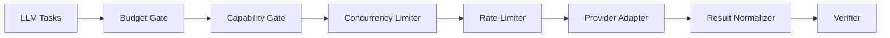
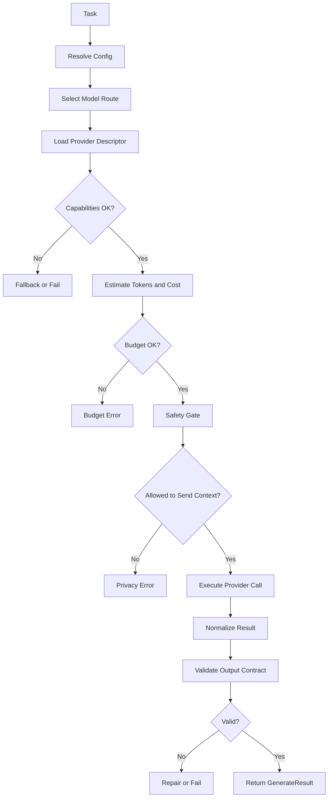

------
title: Build From Scratch: Mintlify-like AI-driven Documentation Generator CLI - Part 041
description: Build a production-grade LLM provider abstraction for an AI documentation CLI: capability registry, structured output, streaming, retries, rate limits, local models, cost tracking, prompt caching, test doubles, and provider-specific behavior without leaking provider chaos into the core system.
series: learn-ai-docs-km-cli
seriesTitle: Build From Scratch: Mintlify-like AI-driven Documentation Generator CLI with Code2Prompt and Open-source Knowledge Management
order: 41
partTitle: Provider Abstraction for LLMs
tags:
- ai-docs
- documentation
- cli
- llm
- provider-abstraction
- structured-output
- streaming
- retries
- cost-tracking
- local-models
date: 2026-07-04
---

# Part 041 — Provider Abstraction for LLMs

Pada part sebelumnya kita membangun configuration system.

Config menentukan provider mana yang dipakai, model mana yang dipakai, apakah generation boleh berjalan di CI, apakah context boleh keluar dari mesin lokal, dan bagaimana verifier harus memperlakukan output.

Sekarang kita masuk ke boundary paling tidak stabil dalam sistem ini:

> LLM provider.

Ini bukan sekadar wrapper API.

Untuk AI documentation generator, LLM provider adalah backend compiler yang:

- mahal,
- lambat dibanding operasi lokal,
- bisa rate-limited,
- bisa berubah behavior antar model,
- bisa gagal sebagian saat streaming,
- bisa menghasilkan output tidak valid,
- bisa tidak mendukung fitur tertentu,
- bisa punya semantic contract berbeda antar vendor,
- bisa tidak boleh menerima source code tertentu karena policy perusahaan.

Kalau abstraction-nya buruk, seluruh sistem akan rapuh.

Kalau abstraction-nya terlalu tipis, provider-specific chaos bocor ke planner, context compiler, verifier, dan authoring engine.

Kalau abstraction-nya terlalu tebal, kita jatuh ke lowest common denominator dan kehilangan fitur penting seperti structured output, prompt caching, tool use, atau local model mode.

Part ini membangun provider abstraction yang production-grade.

Bukan abstraction yang indah di diagram, tetapi bisa dipakai untuk menjalankan pipeline dokumentasi yang repeatable, auditable, dan cost-aware.

---

## 1. Core Thesis: LLM Provider Is a Volatile Execution Backend

Mental model yang tepat:

```txt
Prompt bundle + page contract
  -> provider adapter
  -> model execution
  -> raw model response
  -> normalized response
  -> schema validation
  -> verifier
  -> MDX patch proposal
```

Jangan perlakukan LLM seperti function biasa:

```txt
generate(prompt) -> string
```

Itu terlalu naif.

Dalam sistem kita, provider harus diperlakukan seperti remote execution backend dengan contract eksplisit.

Remote execution backend memiliki masalah klasik:

- network failure,
- timeout,
- partial result,
- authentication failure,
- quota exhaustion,
- incompatible capability,
- nondeterministic output,
- version drift,
- latency variance,
- cost variance,
- audit requirement.

Provider abstraction harus membuat masalah itu terlihat, bukan disembunyikan.

Prinsipnya:

> Hide transport details. Do not hide semantic differences.

---

## 2. Apa yang Tidak Boleh Dilakukan

Sebelum desain, kita buang beberapa pendekatan buruk.

### 2.1 Membuat interface terlalu kecil

Contoh buruk:

```ts
interface LlmClient {
  complete(prompt: string): Promise<string>;
}
```

Masalahnya:

- tidak ada structured output,
- tidak ada token usage,
- tidak ada streaming,
- tidak ada provider metadata,
- tidak ada finish reason,
- tidak ada retry semantics,
- tidak ada safety signal,
- tidak ada cost estimate,
- tidak ada schema validation,
- tidak ada provenance dari prompt bundle,
- tidak bisa dibedakan antara model refusal, timeout, atau invalid JSON.

Untuk playground ini cukup.

Untuk CLI production-grade, ini merusak architecture.

### 2.2 Membuat abstraction lowest common denominator

Contoh buruk:

```txt
Karena tidak semua provider punya structured output,
kita jangan expose structured output.
```

Ini salah.

Fitur provider tidak perlu dipaksakan seragam.

Yang dibutuhkan adalah capability-aware abstraction.

Jika provider mendukung structured output, sistem bisa memakai jalur kuat.

Jika provider tidak mendukung structured output, sistem bisa fallback ke JSON-in-text + validator + repair.

Jadi abstraction harus memiliki:

- common contract,
- capability registry,
- fallback policy,
- explicit degradation.

### 2.3 Menganggap local model sama dengan hosted model

Local model via Ollama atau runtime lain penting untuk privacy/local-first mode.

Namun local model sering berbeda dalam:

- context window,
- output stability,
- structured output support,
- latency,
- hardware constraint,
- model availability,
- token accounting,
- concurrent request handling,
- quality untuk long-context code reasoning.

Jangan pura-pura semua provider sama.

Abstraction harus menyimpan perbedaan itu sebagai capability.

---

## 3. Provider Requirements untuk AI Docs CLI

Provider abstraction kita harus mendukung use case berikut.

| Use case | Dibutuhkan untuk |
|---|---|
| Generate structured page plan | `aidocs plan` |
| Generate MDX page draft | `aidocs generate` |
| Repair invalid output | verifier repair loop |
| Summarize source unit | context compression |
| Extract claims | source-grounding verifier |
| Generate knowledge note | KM sync |
| Generate embeddings | semantic retrieval |
| Stream output | interactive CLI preview |
| Estimate token/cost | planning and budget guard |
| Enforce max cost | CI safety |
| Use local model | private repo mode |
| Replay response | deterministic test |
| Record trace metadata | audit/debug |

Ini berarti provider bukan satu method.

Kita butuh beberapa capability.

---

## 4. Capability Registry

Provider capability harus first-class.

Contoh artifact:

```json
{
  "provider": "openai",
  "model": "example-model",
  "capabilities": {
    "chat": true,
    "structuredOutput": true,
    "jsonMode": true,
    "streaming": true,
    "embeddings": true,
    "toolUse": true,
    "promptCaching": true,
    "inputTokenLimit": 200000,
    "outputTokenLimit": 16000,
    "supportsReasoningEffort": true,
    "supportsSeed": false,
    "supportsSystemMessage": true
  },
  "limits": {
    "requestsPerMinute": null,
    "tokensPerMinute": null,
    "maxConcurrentRequests": 4
  }
}
```

Capability registry menjawab pertanyaan:

```txt
Apakah task ini boleh dijalankan dengan model ini?
Jika boleh, jalur mana yang dipakai?
Jika tidak ideal, fallback apa yang aman?
Jika tidak boleh, error apa yang diberikan?
```

Contoh decision:

```txt
Task: generate page spec as JSON
Preferred: structured output
Fallback: JSON mode + schema validator + repair
Forbidden: plain text without validation
```

---

## 5. Provider Interface: High-level Contract

Kita pecah interface berdasarkan capability, bukan berdasarkan vendor.

```ts
interface LlmProvider {
  id(): ProviderId;
  describe(): ProviderDescriptor;
  capabilities(model: ModelId): Promise<ModelCapabilities>;

  generate(request: GenerateRequest): Promise<GenerateResult>;
  stream(request: GenerateRequest): AsyncIterable<GenerateEvent>;

  embed?(request: EmbeddingRequest): Promise<EmbeddingResult>;
  estimateTokens?(request: TokenEstimateRequest): Promise<TokenEstimate>;

  close?(): Promise<void>;
}
```

Provider harus memberi descriptor:

```ts
type ProviderDescriptor = {
  providerId: string;
  displayName: string;
  mode: "hosted" | "local" | "mock" | "replay";
  auth: {
    required: boolean;
    envVars: string[];
  };
  supports: string[];
};
```

Provider tidak boleh langsung menulis file.

Provider tidak boleh tahu struktur `docs/`.

Provider tidak boleh tahu Logseq, OpenNote, Mintlify, atau scanner.

Provider hanya menjalankan model request.

---

## 6. Generate Request Model

Request harus membawa semua data yang dibutuhkan untuk audit.

```ts
type GenerateRequest = {
  requestId: string;
  task: LlmTask;
  provider: ProviderSelection;
  messages: LlmMessage[];
  inputArtifacts: InputArtifactRef[];
  outputContract: OutputContract;
  options: GenerationOptions;
  safety: SafetyOptions;
  budget: BudgetOptions;
  trace: TraceContext;
};
```

Task enum:

```ts
type LlmTask =
  | "context.summarize"
  | "docs.plan"
  | "docs.generate-page"
  | "docs.repair-page"
  | "docs.extract-claims"
  | "docs.generate-runbook"
  | "km.generate-note"
  | "retrieval.query-rewrite"
  | "verification.explain-failure";
```

Mengapa task harus eksplisit?

Karena setiap task punya:

- model preference,
- temperature default,
- schema requirement,
- cost ceiling,
- retry policy,
- logging policy,
- safety policy,
- structured output requirement.

Contoh:

```yaml
tasks:
  docs.plan:
    model: high-reasoning
    structuredOutput: required
    maxCostUsd: 0.50
    temperature: 0.1

  docs.generate-page:
    model: writer
    structuredOutput: preferred
    maxCostUsd: 1.50
    temperature: 0.2

  context.summarize:
    model: cheap-fast
    structuredOutput: required
    maxCostUsd: 0.10
```

---

## 7. Message Model

Jangan kirim raw string tanpa struktur.

```ts
type LlmMessage = {
  role: "system" | "developer" | "user" | "assistant" | "tool";
  content: MessageContent[];
};

type MessageContent =
  | { type: "text"; text: string }
  | { type: "fileRef"; artifactId: string; mediaType: string }
  | { type: "json"; value: unknown };
```

Walaupun tidak semua provider mendukung role/content yang sama, internal model tetap harus kaya.

Adapter bertugas menurunkan internal model ke provider-specific payload.

```txt
Internal rich message
  -> OpenAI payload
  -> Anthropic payload
  -> Ollama payload
  -> Replay payload
```

Kalau provider tidak mendukung fitur tertentu, adapter harus:

- degrade secara eksplisit,
- mencatat diagnostic,
- atau menolak request jika policy mengharuskan fitur itu.

---

## 8. Output Contract

Provider request harus membawa output contract.

```ts
type OutputContract = {
  kind: "text" | "json" | "mdx" | "json-plus-mdx";
  schema?: JsonSchema;
  schemaName?: string;
  validationMode: "none" | "parse" | "schema" | "schema-strict";
  repairPolicy: "none" | "single-repair" | "bounded-repair";
  maxRepairAttempts: number;
};
```

Untuk `docs.plan`, output contract wajib JSON schema.

Untuk `docs.generate-page`, ada dua opsi:

1. model mengembalikan object JSON dengan field `frontmatter`, `body`, `sourceRefs`, `claims`, atau
2. model mengembalikan MDX langsung, lalu parser/verifier memvalidasi.

Untuk production-grade, opsi pertama biasanya lebih aman.

Contoh schema ringkas:

```json
{
  "type": "object",
  "required": ["frontmatter", "body", "sourceRefs"],
  "properties": {
    "frontmatter": { "type": "object" },
    "body": { "type": "string" },
    "sourceRefs": {
      "type": "array",
      "items": { "type": "string" }
    }
  },
  "additionalProperties": false
}
```

OpenAI mendokumentasikan Structured Outputs sebagai fitur untuk memastikan model menghasilkan response yang mengikuti JSON Schema yang diberikan. Anthropic juga menyediakan pola tool use dan structured-output-oriented workflows melalui Messages API, tetapi detail kemampuan dan syntax provider tetap berbeda. Karena itu abstraction kita tidak boleh menganggap satu vendor sebagai bentuk universal.

---

## 9. Generate Result Model

Response harus normalized.

```ts
type GenerateResult = {
  requestId: string;
  provider: ProviderId;
  model: ModelId;
  task: LlmTask;
  status: "ok" | "refused" | "invalid" | "timeout" | "rate_limited" | "failed";

  output: NormalizedOutput;
  raw?: unknown;

  usage?: TokenUsage;
  cost?: CostEstimate;
  timings: TimingInfo;
  finishReason?: string;

  diagnostics: Diagnostic[];
  trace: TraceContext;
};
```

Normalized output:

```ts
type NormalizedOutput =
  | { kind: "text"; text: string }
  | { kind: "json"; value: unknown; rawText?: string }
  | { kind: "mdx"; frontmatter?: unknown; body: string }
  | { kind: "empty" };
```

`raw` boleh disimpan hanya jika config mengizinkan.

Untuk private repo, raw prompt/response logging sering harus dimatikan atau direduksi.

---

## 10. Streaming Event Model

Streaming berguna untuk local preview, tetapi tidak boleh membuat pipeline state corrupt.

Jangan langsung menulis file dari stream.

Stream harus masuk buffer/event collector dulu.

```ts
type GenerateEvent =
  | { type: "started"; requestId: string }
  | { type: "token"; text: string }
  | { type: "json.delta"; path: string; value: unknown }
  | { type: "warning"; diagnostic: Diagnostic }
  | { type: "usage"; usage: TokenUsage }
  | { type: "completed"; result: GenerateResult }
  | { type: "failed"; error: ProviderError };
```

Rule penting:

```txt
Streaming is a presentation optimization.
It is not the source of truth.
```

Source of truth tetap `GenerateResult` final.

Kalau stream gagal di tengah:

- jangan tulis partial MDX ke docs,
- simpan partial hanya sebagai debug artifact jika diizinkan,
- beri diagnostic yang jelas,
- izinkan retry dari request yang sama.

---

## 11. Provider Error Model

Error harus typed.

```ts
type ProviderErrorCode =
  | "AUTH_MISSING"
  | "AUTH_INVALID"
  | "MODEL_NOT_FOUND"
  | "CAPABILITY_UNSUPPORTED"
  | "RATE_LIMITED"
  | "QUOTA_EXCEEDED"
  | "TIMEOUT"
  | "NETWORK_ERROR"
  | "INVALID_REQUEST"
  | "INVALID_RESPONSE"
  | "REFUSAL"
  | "CONTENT_FILTERED"
  | "BUDGET_EXCEEDED"
  | "UNKNOWN";
```

Provider adapter harus menerjemahkan vendor-specific error ke domain error.

Contoh:

```txt
HTTP 401 -> AUTH_INVALID
HTTP 429 -> RATE_LIMITED atau QUOTA_EXCEEDED
schema parse failure -> INVALID_RESPONSE
task requires structured output but model lacks it -> CAPABILITY_UNSUPPORTED
estimated cost over policy -> BUDGET_EXCEEDED
```

CLI harus menampilkan error yang actionable:

```txt
Provider error: CAPABILITY_UNSUPPORTED
Task: docs.plan
Model: local-small
Reason: task requires schema-strict JSON output.
Suggestion: choose a model with structured output support or set fallback.jsonRepair=true.
```

---

## 12. Retry Policy

Tidak semua failure boleh retry.

| Error | Retry? | Catatan |
|---|---:|---|
| Network timeout | yes | exponential backoff |
| Rate limit | yes | respect retry-after jika ada |
| Auth invalid | no | user action required |
| Model not found | no | config salah |
| Invalid JSON | maybe | repair loop, bukan blind retry |
| Refusal | no | perlu task/prompt/safety review |
| Budget exceeded | no | policy gate |
| Provider 5xx | yes | bounded retry |

Retry harus idempotent dari perspektif artifact.

Artinya:

- request punya `requestId`,
- output tidak langsung apply ke file,
- retry menghasilkan proposal baru,
- final write tetap atomic.

Policy:

```yaml
providers:
  default:
    retry:
      maxAttempts: 3
      initialDelayMs: 500
      maxDelayMs: 8000
      jitter: true
      retryableErrors:
        - NETWORK_ERROR
        - TIMEOUT
        - RATE_LIMITED
        - UNKNOWN_TRANSIENT
```

---

## 13. Rate Limit and Concurrency Control

AI docs pipeline bisa memicu banyak request:

- summarize file chunks,
- generate page specs,
- generate pages,
- repair pages,
- generate KM notes,
- create embeddings.

Tanpa limiter, CLI bisa langsung menabrak rate limit.

Buat provider execution scheduler:

```txt
Task queue
  -> budget gate
  -> concurrency limiter
  -> rate limiter
  -> provider adapter
  -> result collector
```

Mermaid:



Concurrency bisa beda per provider/model.

```yaml
providers:
  openai:
    maxConcurrentRequests: 4
  anthropic:
    maxConcurrentRequests: 2
  ollama:
    maxConcurrentRequests: 1
```

Local model sering harus lebih konservatif karena CPU/GPU lokal bisa saturate.

---

## 14. Cost Tracking

Cost bukan afterthought.

Cost harus diketahui sebelum dan sesudah request.

```ts
type BudgetOptions = {
  maxInputTokens?: number;
  maxOutputTokens?: number;
  maxCostUsd?: number;
  costPolicy: "warn" | "block";
};
```

Pipeline:

```txt
prompt bundle
  -> token estimate
  -> cost estimate
  -> budget gate
  -> provider call
  -> actual usage
  -> cost ledger
```

Cost ledger artifact:

```json
{
  "runId": "run_20260704_001",
  "items": [
    {
      "task": "docs.generate-page",
      "pageId": "guide.quickstart",
      "provider": "openai",
      "model": "example-model",
      "estimatedInputTokens": 24000,
      "actualInputTokens": 23891,
      "actualOutputTokens": 2190,
      "estimatedCostUsd": 0.41,
      "actualCostUsd": 0.39
    }
  ],
  "totalActualCostUsd": 0.39
}
```

CLI UX:

```bash
aidocs generate --plan

Estimated tasks: 12
Estimated input tokens: 312,000
Estimated output tokens: 44,000
Estimated cost: $4.80
Policy: requires confirmation above $2.00
```

Di CI, jangan pakai interactive confirmation.

CI harus memakai policy:

```yaml
ci:
  maxRunCostUsd: 5.00
  onCostExceeded: fail
```

---

## 15. Prompt Caching

Prompt caching adalah fitur penting untuk docs generator karena banyak request punya prefix sama:

- system/developer instruction,
- template rules,
- repo summary,
- source tree,
- project policy,
- shared glossary.

Namun cache provider bukan pengganti local cache.

Bedakan:

| Cache | Lokasi | Fungsi |
|---|---|---|
| Local context cache | filesystem `.aidocs/cache` | avoid recomputing scan/context |
| LLM response cache | local artifact | avoid repeated paid generation in tests/dry-run |
| Provider prompt cache | provider side | reduce cost/latency for repeated prompt prefix |

Prompt caching harus didesain lewat stable prefix.

Contoh rendered prompt layout:

```txt
[stable system rules]
[stable project policy]
[stable repo map]
[stable shared glossary]
--- dynamic page-specific context ---
[target page contract]
```

Kalau stable prefix berubah sedikit, cache miss bisa terjadi.

Jadi template renderer harus menjaga urutan dan formatting stabil.

---

## 16. Structured Output Strategy

Untuk task yang menghasilkan machine-readable artifact, structured output harus menjadi jalur utama.

Task wajib structured:

- docs plan,
- page spec,
- claim ledger,
- drift report,
- review manifest,
- KM graph node extraction,
- navigation plan.

Task yang boleh MDX/text:

- final page body,
- explanation for reviewer,
- human-facing summary.

Strategi fallback:

```txt
1. provider native structured output
2. provider JSON mode if available
3. fenced JSON with strict parser
4. repair prompt with schema error
5. fail with invalid response
```

Jangan langsung parse bebas dengan regex.

Validasi minimal:

- JSON parse,
- schema validate,
- semantic validate,
- source ref validate,
- no extra properties for strict schema,
- known enum values only.

---

## 17. Provider Adapter Examples

### 17.1 OpenAI adapter

OpenAI adapter biasanya mendukung jalur seperti:

- structured output,
- streaming,
- embeddings,
- prompt caching behavior,
- tool/function style integration tergantung API yang dipakai.

Adapter internal:

```ts
class OpenAiProvider implements LlmProvider {
  async generate(request: GenerateRequest): Promise<GenerateResult> {
    const payload = this.mapToOpenAiPayload(request);
    const raw = await this.client.responses.create(payload);
    return this.normalize(raw, request);
  }
}
```

Hal penting:

- jangan expose OpenAI response object ke domain layer,
- jangan hardcode model behavior di planner,
- jangan menulis OpenAI-specific options di semua tempat,
- map provider-specific fields via `providerOptions`.

```yaml
providers:
  openai:
    defaultModel: "example-model"
    providerOptions:
      reasoningEffort: "medium"
```

Domain layer hanya melihat:

```ts
GenerationOptions
```

Provider adapter yang menerjemahkan.

### 17.2 Anthropic adapter

Anthropic adapter mungkin punya format Messages API, tool use, streaming, dan prompt caching semantics sendiri.

Internal model tetap sama.

```ts
class AnthropicProvider implements LlmProvider {
  async generate(request: GenerateRequest): Promise<GenerateResult> {
    const payload = this.mapToAnthropicMessages(request);
    const raw = await this.client.messages.create(payload);
    return this.normalize(raw, request);
  }
}
```

Kunci desain:

- support tool use hanya jika task memang butuh,
- normalize stop/finish reason,
- normalize token usage,
- normalize refusal/content-filter signal,
- structured output tetap lewat contract internal.

### 17.3 Ollama/local adapter

Ollama berguna untuk local-first mode.

Ollama menyediakan API lokal seperti `/api/generate`, `/api/chat`, dan embedding capabilities. Namun local model capability harus dideteksi, bukan diasumsikan.

```ts
class OllamaProvider implements LlmProvider {
  async generate(request: GenerateRequest): Promise<GenerateResult> {
    const payload = this.mapToOllamaChat(request);
    const raw = await this.http.post("/api/chat", payload);
    return this.normalize(raw, request);
  }
}
```

Policy local mode:

```yaml
providers:
  local:
    type: ollama
    baseUrl: http://localhost:11434
    defaultModel: "local-docs-model"
    maxConcurrentRequests: 1

security:
  allowHostedProviders: false
```

Jika `allowHostedProviders=false`, hosted provider harus ditolak sebelum prompt dibangun.

Karena jika prompt sudah dirender dan dilog, source code bisa bocor ke artifact yang tidak diinginkan.

---

## 18. Model Selection Strategy

Tidak semua task butuh model terbaik.

Buat task routing:

```yaml
models:
  cheap-fast:
    provider: openai
    model: small-model

  writer:
    provider: openai
    model: doc-writing-model

  high-reasoning:
    provider: anthropic
    model: reasoning-model

  private-local:
    provider: ollama
    model: local-model

taskRouting:
  context.summarize: cheap-fast
  docs.plan: high-reasoning
  docs.generate-page: writer
  docs.extract-claims: cheap-fast
  km.generate-note: writer
```

Task routing harus bisa menjawab:

- apakah source code boleh dikirim ke hosted model?
- apakah task perlu structured output?
- apakah task perlu long context?
- apakah task latency-sensitive?
- apakah task cost-sensitive?
- apakah output masuk public docs?

---

## 19. Determinism Model

LLM tidak deterministic secara sempurna.

Namun pipeline tetap bisa dibuat controlled.

Layer determinism:

| Layer | Deterministic? | Cara kontrol |
|---|---:|---|
| scan | yes | sorted traversal + hashes |
| context bundle | yes | stable ordering |
| prompt rendering | yes | snapshot tests |
| provider output | not fully | low temperature + schema + verifier |
| MDX apply | yes | patch manifest |
| verifier | yes | strict rules |

Untuk generation:

```yaml
generation:
  temperature: 0.1
  topP: 1.0
  maxOutputTokens: 8000
  structuredOutput: required
```

Jangan menjanjikan byte-for-byte identical output dari model.

Yang bisa dijanjikan:

- input deterministic,
- output validated,
- patch reviewable,
- failures explicit,
- accepted docs versioned.

---

## 20. Safety and Privacy Boundary

Provider adapter harus menerima safety options.

```ts
type SafetyOptions = {
  allowSourceCodeUpload: boolean;
  allowSecretsInPrompt: false;
  redactBeforeSend: true;
  logPrompt: "none" | "redacted" | "full";
  logResponse: "none" | "redacted" | "full";
  dataClassification: "public" | "internal" | "confidential" | "restricted";
};
```

Rules:

- secret scan sebelum request,
- prompt logging default redacted atau off,
- hosted provider blocked for restricted repo unless explicitly allowed,
- generated artifacts should include provider/model metadata but not necessarily raw prompt,
- local mode must still run verifier.

Do not assume local model means safe.

Local model still can:

- hallucinate,
- generate unsafe commands,
- leak from previous context if runtime is badly managed,
- produce invalid schemas,
- consume too much memory.

---

## 21. Trace and Audit

Setiap LLM call harus traceable.

Artifact:

```json
{
  "llmCallId": "llm_01",
  "runId": "run_20260704_001",
  "task": "docs.generate-page",
  "provider": "openai",
  "model": "example-model",
  "promptBundleId": "pb_abc123",
  "pageSpecId": "page_quickstart",
  "inputArtifactHashes": ["sha256:..."],
  "outputArtifactHash": "sha256:...",
  "startedAt": "2026-07-04T10:00:00Z",
  "completedAt": "2026-07-04T10:00:21Z",
  "status": "ok",
  "usage": {
    "inputTokens": 23891,
    "outputTokens": 2190
  },
  "promptLogged": "redacted",
  "responseLogged": "redacted"
}
```

Tujuannya bukan surveillance.

Tujuannya:

- debugging,
- cost accounting,
- reproducibility,
- compliance,
- incident analysis,
- review trust.

---

## 22. Testing Without Real API Calls

Provider abstraction harus testable tanpa API key.

Jenis test:

### 22.1 Fake provider

```ts
class FakeProvider implements LlmProvider {
  async generate(request: GenerateRequest): Promise<GenerateResult> {
    return fakeResultForTask(request.task);
  }
}
```

Dipakai untuk unit test planner/generator.

### 22.2 Replay provider

Replay provider membaca cassette:

```json
{
  "requestHash": "sha256:abc",
  "result": {
    "status": "ok",
    "output": {
      "kind": "json",
      "value": { "pages": [] }
    }
  }
}
```

Dipakai untuk integration test deterministic.

### 22.3 Chaos provider

Chaos provider mensimulasikan:

- timeout,
- rate limit,
- invalid JSON,
- partial stream,
- refusal,
- over-budget,
- slow response.

Ini penting karena banyak bug provider abstraction tidak muncul saat semua response sukses.

---

## 23. CLI Commands

Provider subsystem perlu commands sendiri.

```bash
# List configured providers
aidocs provider list

# Show model capabilities
aidocs provider describe openai --model example-model

# Test credentials and basic generation
aidocs provider test openai

# Estimate cost for a plan
aidocs provider estimate --plan .aidocs/plans/doc-plan.v1.json

# Show cost ledger
aidocs provider costs --run latest

# Run with fake/replay provider
aidocs generate --provider replay --cassette tests/cassettes/quickstart.json

# Validate task routing
aidocs provider route --task docs.generate-page
```

`provider test` tidak boleh mengirim source code.

Gunakan prompt kecil yang aman.

---

## 24. Provider Selection Flow



---

## 25. Implementation Roadmap

Bangun bertahap.

### Step 1 — Domain types

Implementasikan:

- `GenerateRequest`,
- `GenerateResult`,
- `ModelCapabilities`,
- `ProviderError`,
- `OutputContract`,
- `TokenUsage`,
- `CostEstimate`.

### Step 2 — Fake provider

Sebelum hosted provider, buat fake provider.

Kalau core generator tidak bisa dites dengan fake provider, architecture masih salah.

### Step 3 — Replay provider

Buat request hashing dan cassette playback.

Ini membuat integration tests stabil.

### Step 4 — One hosted provider

Tambahkan satu hosted provider.

Jangan langsung banyak provider.

Buktikan dulu:

- auth,
- generation,
- structured output,
- streaming,
- usage normalization,
- error mapping,
- retry.

### Step 5 — Local provider

Tambahkan Ollama/local provider.

Ini memaksa abstraction menghadapi provider dengan capability berbeda.

### Step 6 — Cost and budget gate

Sebelum scale ke banyak page, aktifkan cost ledger.

### Step 7 — Capability routing

Baru aktifkan routing per task/model.

---

## 26. Failure Modes

| Failure | Penyebab | Mitigasi |
|---|---|---|
| Invalid JSON | model tidak patuh schema | structured output, validator, repair loop |
| Silent provider drift | model behavior berubah | snapshot eval, provider descriptor, pinned config |
| Cost spike | prompt terlalu besar | token budget, cost gate, context packing |
| Rate limit storm | parallel generation tanpa limiter | queue + limiter |
| Raw prompt leakage | logging full prompt | redacted/off logging default |
| Hosted provider used for restricted repo | config lemah | privacy gate before prompt render |
| Local model low quality | weak reasoning/context | capability routing + verifier |
| Partial stream written to file | stream treated as source of truth | buffer stream, final result only |
| Retry duplicates output | non-idempotent writes | proposal artifact + atomic apply |
| Provider-specific option leaks everywhere | bad abstraction | providerOptions localized in adapter |

---

## 27. Final Shape

Setelah part ini, sistem punya provider layer yang:

- capability-aware,
- structured-output-aware,
- streaming-aware,
- retry-aware,
- budget-aware,
- privacy-aware,
- local-model-aware,
- testable tanpa API key,
- tidak mencampur provider detail dengan docs domain.

Ingat invariants utama:

```txt
The provider generates proposals.
The verifier decides validity.
The review workflow decides adoption.
The repository remains the source of truth.
```

LLM provider itu penting.

Tetapi dalam sistem production-grade, provider tidak boleh menjadi pusat arsitektur.

Provider hanya salah satu backend execution.

Yang menjadi pusat adalah artifact, source grounding, verification, review, dan reproducibility.

---

## References

- OpenAI API documentation — Structured Outputs: https://developers.openai.com/api/docs/guides/structured-outputs
- Anthropic Claude API documentation — Tool use overview: https://platform.claude.com/docs/en/agents-and-tools/tool-use/overview
- Ollama documentation — API introduction and chat API: https://docs.ollama.com/api/introduction
- Ollama documentation — Embeddings: https://docs.ollama.com/capabilities/embeddings
