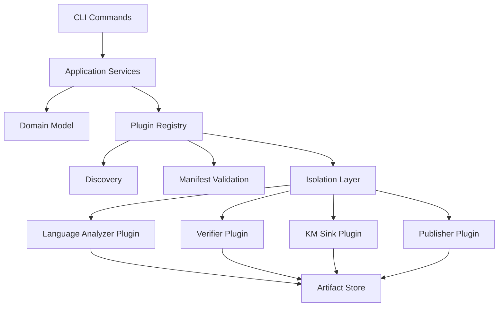
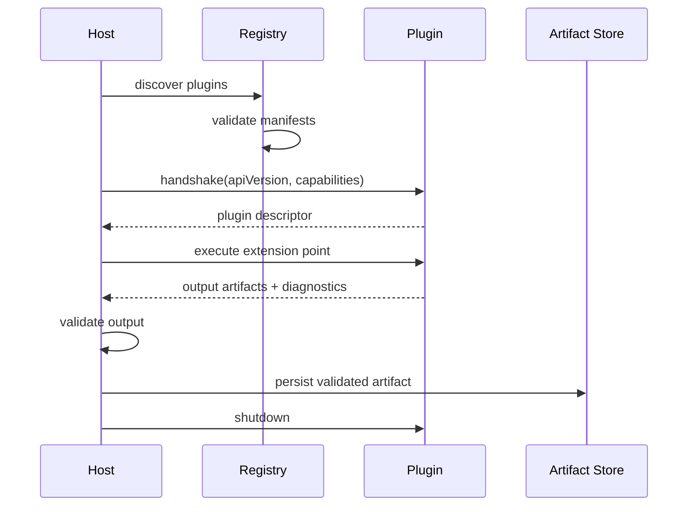

------
title: Build From Scratch: Mintlify-like AI-driven Documentation Generator CLI - Part 042
description: Build a safe plugin system for an AI documentation generator CLI: extension points, plugin manifests, language analyzers, prompt packs, verifiers, renderers, knowledge sinks, publishers, sandboxing, version compatibility, permissions, conformance tests, and failure isolation.
series: learn-ai-docs-km-cli
seriesTitle: Build From Scratch: Mintlify-like AI-driven Documentation Generator CLI with Code2Prompt and Open-source Knowledge Management
order: 42
partTitle: Plugin System and Extension Points
tags:
- ai-docs
- documentation
- cli
- plugin-system
- extension-points
- sandboxing
- manifests
- language-analyzer
- verifier
- publisher
date: 2026-07-04
---

# Part 042 — Plugin System and Extension Points

Pada part sebelumnya kita membangun provider abstraction untuk LLM.

Sekarang kita membahas plugin system.

Kenapa butuh plugin system?

Karena AI documentation generator yang serius tidak bisa hardcode semua hal:

- semua bahasa pemrograman,
- semua framework,
- semua contract format,
- semua style docs,
- semua renderer,
- semua knowledge sink,
- semua publisher,
- semua verifier,
- semua enterprise policy.

Hari ini repo mungkin Java + OpenAPI.

Besok bisa Go + gRPC + Terraform.

Lusa bisa Python + FastAPI + notebooks.

Minggu depan bisa internal framework yang tidak pernah muncul di internet.

Kalau semua extension harus masuk core, core akan menjadi monster.

Kalau extension terlalu bebas, sistem menjadi tidak aman dan tidak bisa dipercaya.

Maka kita butuh plugin system yang:

- explicit,
- typed,
- capability-based,
- permissioned,
- versioned,
- testable,
- failure-isolated,
- deterministic enough,
- safe by default.

---

## 1. Core Thesis: Plugin Is a Bounded Capability, Not Arbitrary Code

Plugin bukan “jalankan script user kapan saja”.

Plugin adalah capability yang dipasang ke extension point tertentu.

Contoh:

```txt
Java analyzer plugin
  can analyze Java files
  can emit symbols/contracts/examples
  cannot call LLM provider directly
  cannot write docs directly
  cannot access secrets unless permitted
```

Atau:

```txt
Logseq sink plugin
  can receive canonical knowledge graph projection
  can write into configured Logseq graph path
  cannot scan arbitrary filesystem
  cannot mutate source files
```

Prinsipnya:

> The host owns workflow. Plugins contribute bounded behavior.

Core tetap mengontrol:

- pipeline order,
- artifact schema,
- source authority,
- verification,
- review workflow,
- security policy,
- file writes,
- provider access,
- CI behavior.

Plugin hanya memberi fungsi pada titik tertentu.

---

## 2. Why Plugin System Matters Here

AI docs CLI punya domain yang sangat luas.

Tanpa plugin, core harus tahu semua ini:

```txt
Java annotations
Spring routes
JAX-RS routes
Go exported symbols
TypeScript package exports
Python decorators
OpenAPI variations
GraphQL schemas
AsyncAPI contracts
Terraform modules
Kubernetes CRDs
Mermaid rendering
Mintlify components
Logseq markdown conventions
OpenNote export format
internal publisher APIs
enterprise security policy
```

Itu tidak sustain.

Dengan plugin system:

```txt
core pipeline tetap kecil
extension behavior bisa bertambah
enterprise team bisa menambah internal knowledge
OSS community bisa menambah analyzers
publisher bisa diganti
verifier bisa diperketat
```

Namun plugin system membawa risiko:

- arbitrary code execution,
- nondeterministic output,
- dependency conflict,
- supply chain attack,
- broken compatibility,
- slow plugin blocking pipeline,
- plugin writing invalid artifacts,
- plugin leaking source code,
- plugin silently changing docs semantics.

Jadi desain harus defensif.

---

## 3. Extension Point Catalog

Mulai dari extension point yang jelas.

| Extension point | Input | Output | Example |
|---|---|---|---|
| `scanner.ignoreRule` | file path + metadata | include/exclude decision | custom generated files |
| `classifier.fileKind` | file metadata/content sample | classification patch | detect internal schema files |
| `analyzer.language` | files by language | symbols/contracts/examples | Java analyzer |
| `analyzer.framework` | symbols + config | framework semantics | JAX-RS, Spring, FastAPI |
| `contract.importer` | contract files | normalized contracts | OpenAPI, AsyncAPI, Protobuf |
| `context.ranker` | doc task + units | ranked units | enterprise relevance rule |
| `prompt.templatePack` | page spec | rendered prompt parts | house style prompt pack |
| `verifier.rule` | generated artifact | diagnostics | command safety rule |
| `renderer.mdxComponent` | normalized block | MDX output | custom callout component |
| `diagram.renderer` | diagram source | rendered asset | Mermaid, PlantUML |
| `km.sink` | knowledge projection | written notes/index | Logseq, OpenNote |
| `publisher.target` | static output | deploy result | S3, GitHub Pages, internal portal |
| `policy.guard` | run context | allow/deny | restricted repo policy |

Jangan expose extension point terlalu awal.

Extension point harus muncul saat ada kebutuhan nyata dan schema-nya sudah cukup stabil.

---

## 4. Host Architecture

Plugin host berada di infrastructure boundary.



Important:

- plugin registry knows plugins,
- application services call extension points,
- domain model does not import plugin implementation,
- artifact store validates plugin output,
- verifier checks plugin-generated artifacts too.

---

## 5. Plugin Manifest

Setiap plugin harus punya manifest.

```yaml
plugin:
  id: aidocs.java-analyzer
  name: Java Analyzer
  version: 1.2.0
  apiVersion: 1
  description: Extracts Java packages, classes, methods, annotations, and JAX-RS endpoints.
  publisher: aidocs-core

runtime:
  kind: process
  command: aidocs-plugin-java-analyzer
  protocol: json-rpc

extensionPoints:
  - type: analyzer.language
    id: java
    languages:
      - java
    outputs:
      - symbols.v1
      - contracts.v1
      - examples.v1

permissions:
  filesystem:
    read:
      - repo
    write: []
  network: false
  env: []
  providerAccess: false

compatibility:
  minHostVersion: 0.12.0
  maxHostVersion: 0.x
  artifactSchemas:
    symbols: v1
    contracts: v1

integrity:
  checksum: sha256:...
  signature: optional
```

Manifest bukan dokumentasi.

Manifest adalah contract.

Host harus menolak plugin jika:

- `apiVersion` tidak kompatibel,
- extension point tidak dikenal,
- permission melebihi policy,
- checksum/signature gagal saat required,
- runtime tidak tersedia,
- output schema tidak didukung.

---

## 6. Plugin Runtime Options

Ada beberapa model runtime.

### 6.1 In-process plugin

Plugin diload dalam process yang sama.

Kelebihan:

- cepat,
- sederhana,
- mudah debug,
- cocok untuk built-in plugin.

Kekurangan:

- tidak aman untuk third-party plugin,
- bisa crash host,
- dependency conflict,
- sulit limit resource,
- bisa akses memory/process host.

Cocok untuk:

- core plugins,
- trusted internal plugin,
- language analyzer ringan yang bundled.

### 6.2 Subprocess/RPC plugin

Host menjalankan plugin sebagai process terpisah.

Kelebihan:

- failure isolation lebih baik,
- dependency conflict berkurang,
- bisa timeout/kill,
- bisa lint protocol.

Kekurangan:

- overhead IPC,
- packaging lebih kompleks,
- protocol versioning harus serius.

HashiCorp `go-plugin` adalah contoh nyata pendekatan plugin berbasis subprocess dan RPC/gRPC. Pola ini kuat untuk toolchain yang butuh isolation lebih baik daripada in-process plugin.

### 6.3 WebAssembly/WASI plugin

Plugin dikompilasi ke WebAssembly dan berjalan di sandbox.

Kelebihan:

- sandbox kuat,
- portable,
- permission boundary jelas,
- cocok untuk untrusted extension tertentu.

Kekurangan:

- ecosystem dan debugging bisa lebih kompleks,
- access ke parser/native library bisa terbatas,
- host bindings harus didesain.

WASI didefinisikan sebagai kumpulan standard-track API untuk software yang dikompilasi ke WebAssembly, dengan tujuan memberi interface sistem yang lebih aman dan portable.

### 6.4 External executable plugin

Plugin berupa executable dengan protocol stdin/stdout.

Kelebihan:

- sangat portable,
- language-agnostic,
- mudah dibuat oleh enterprise team.

Kekurangan:

- protocol harus robust,
- performance bisa bervariasi,
- discovery/installation harus jelas.

Untuk CLI ini, default bagus:

```txt
built-in trusted plugins -> in-process
third-party analyzers -> subprocess/RPC
untrusted lightweight transforms -> WASI when available
publisher/enterprise integrations -> subprocess/RPC
```

---

## 7. Protocol Design

Untuk subprocess plugin, gunakan protocol eksplisit.

Minimal JSON-RPC-like:

```json
{
  "jsonrpc": "2.0",
  "id": "req_001",
  "method": "analyzer.language.analyze",
  "params": {
    "runId": "run_001",
    "workspaceRoot": "/repo",
    "files": [
      {
        "path": "src/main/java/App.java",
        "hash": "sha256:...",
        "language": "java"
      }
    ],
    "outputSchemas": ["symbols.v1", "contracts.v1"]
  }
}
```

Response:

```json
{
  "jsonrpc": "2.0",
  "id": "req_001",
  "result": {
    "artifacts": [
      {
        "kind": "symbols.v1",
        "content": { "symbols": [] }
      }
    ],
    "diagnostics": []
  }
}
```

Error:

```json
{
  "jsonrpc": "2.0",
  "id": "req_001",
  "error": {
    "code": "PLUGIN_ANALYSIS_FAILED",
    "message": "Failed to parse Java file",
    "details": {
      "path": "src/main/java/App.java",
      "line": 42
    }
  }
}
```

Rules:

- plugin output must validate against artifact schema,
- plugin cannot write artifacts directly unless extension point allows it,
- plugin diagnostics must be typed,
- host owns final artifact persistence.

---

## 8. Extension Point Contracts

### 8.1 Language analyzer

Input:

```ts
type LanguageAnalyzerInput = {
  workspace: WorkspaceRef;
  files: FileRecord[];
  repoMap: RepoMap;
  config: AnalyzerConfig;
};
```

Output:

```ts
type LanguageAnalyzerOutput = {
  symbols?: SymbolsArtifact;
  contracts?: ContractsArtifact;
  examples?: ExamplesArtifact;
  diagnostics: Diagnostic[];
};
```

Invariant:

```txt
Analyzer may infer symbols from source.
Analyzer may not invent behavior not present in source.
```

### 8.2 Framework analyzer

Framework analyzer consumes low-level symbols and emits semantic relationships.

Example:

```txt
JAX-RS analyzer:
  @Path("/users") class UsersResource
  @GET method listUsers
  -> endpoint GET /users
```

Input:

- symbols,
- annotations,
- config files,
- dependency manifests.

Output:

- contracts,
- runtime components,
- route ownership,
- relation edges.

### 8.3 Prompt template pack

Prompt template pack contributes templates.

It should not call the model.

Input:

- page spec,
- context bundle,
- style policy.

Output:

- rendered prompt sections,
- required output schema,
- diagnostics.

Template pack manifest:

```yaml
extensionPoints:
  - type: prompt.templatePack
    id: baledung-style
    pageTypes:
      - overview
      - guide
      - api-reference
      - troubleshooting
```

### 8.4 Verifier rule

Verifier plugin adds checks.

Input:

- generated MDX,
- source refs,
- artifacts,
- config.

Output:

- diagnostics.

Rules:

- verifier plugin cannot auto-fix by default,
- if it proposes fix, fix must be patch artifact,
- severity must be mapped to host severity.

### 8.5 KM sink

KM sink writes knowledge projection into external format.

Input:

- canonical knowledge graph,
- visibility-filtered projection,
- sync state.

Output:

- sync result,
- written files list,
- conflicts,
- diagnostics.

KM sink must never receive restricted nodes unless policy allows it.

### 8.6 Publisher target

Publisher plugin deploys built docs.

Input:

- static site output,
- build manifest,
- deploy config.

Output:

- URL,
- deployment ID,
- diagnostics.

Publisher plugin needs strong permission boundary because it may access credentials.

---

## 9. Plugin Discovery

Discovery sources:

```txt
built-in plugins
project plugins
user plugins
workspace plugins
enterprise registry plugins
```

Config:

```yaml
plugins:
  enabled:
    - aidocs.java-analyzer
    - aidocs.openapi-importer
    - aidocs.logseq-sink
  paths:
    - .aidocs/plugins
    - ~/.config/aidocs/plugins
  allowProjectPlugins: true
  allowUserPlugins: true
  requireSignaturesInCI: true
```

Discovery order matters but must be deterministic.

Recommended priority:

```txt
1. built-in plugins
2. project-pinned plugins
3. workspace plugins
4. user plugins
5. registry plugins
```

But extension conflict resolution must be explicit.

If two plugins claim the same extension point with same ID:

```txt
fail unless config selects one
```

Do not silently choose based on file order.

---

## 10. Plugin Registry Artifact

Every run should produce registry snapshot.

```json
{
  "schema": "plugin-registry.v1",
  "hostVersion": "0.12.0",
  "plugins": [
    {
      "id": "aidocs.java-analyzer",
      "version": "1.2.0",
      "source": "builtin",
      "runtime": "in-process",
      "extensionPoints": ["analyzer.language:java"],
      "permissionsGranted": {
        "filesystem.read": ["repo"],
        "filesystem.write": [],
        "network": false
      },
      "checksum": "sha256:...",
      "status": "loaded"
    }
  ],
  "conflicts": [],
  "diagnostics": []
}
```

Kenapa artifact ini penting?

Karena generated docs bisa berubah karena plugin berubah.

Jika Java analyzer plugin upgrade, symbols bisa berubah, route discovery bisa berubah, docs bisa berubah.

Plugin registry snapshot menjadi bagian dari build provenance.

---

## 11. Permission Model

Plugin permission harus granular.

```yaml
permissions:
  filesystem:
    read:
      - repo
      - artifactStore
    write:
      - artifactStore:km-output
  network:
    allowed: false
  env:
    allowedVars: []
  providerAccess: false
  secrets:
    allowed: false
```

Permission categories:

| Permission | Meaning |
|---|---|
| `filesystem.read.repo` | read repository files selected by host |
| `filesystem.read.artifactStore` | read `.aidocs` artifacts |
| `filesystem.write.artifactStore` | propose artifacts through host |
| `filesystem.write.external` | write to configured external path |
| `network` | outbound network access |
| `env` | access specific environment vars |
| `providerAccess` | call LLM provider through host |
| `secretAccess` | receive secret values |

Default:

```txt
network = false
providerAccess = false
secretAccess = false
write external = false
```

Plugin should receive file contents from host only if needed.

Alternative:

- plugin receives paths and reads repo directly,
- or host sends content.

Safer model:

```txt
host sends selected files/content to plugin
plugin does not get arbitrary filesystem access
```

But for large repos, sending content may be expensive.

Use mode per plugin trust level.

---

## 12. Trust Levels

Define trust levels.

```yaml
trustLevels:
  builtin:
    network: allowed-by-extension
    inProcess: allowed
  projectPinned:
    signatureRequired: true
    inProcess: false
  userLocal:
    signatureRequired: false
    ciAllowed: false
  thirdParty:
    signatureRequired: true
    network: false
    inProcess: false
```

CI should be stricter than local.

Example:

```yaml
ci:
  plugins:
    allowUserPlugins: false
    requirePinnedVersions: true
    requireSignatures: true
    disallowNetworkByDefault: true
```

This prevents:

```txt
Developer has local plugin installed
CI does not
Generated docs differ
```

or worse:

```txt
Unreviewed plugin runs in CI with secrets
```

---

## 13. Version Compatibility

Plugin API must be versioned.

Use semantic-ish compatibility policy:

```txt
host plugin API v1
  artifact schemas: symbols.v1, contracts.v1, examples.v1
  protocol: plugin-rpc.v1
```

Manifest:

```yaml
compatibility:
  pluginApi: "^1.0.0"
  host: ">=0.12.0 <0.13.0"
  schemas:
    symbols: v1
    contracts: v1
```

Host checks:

- protocol version,
- extension point version,
- artifact schema version,
- host range,
- plugin checksum.

If incompatible:

```txt
Do not run plugin.
Fail with actionable diagnostic.
```

Migration support:

```bash
aidocs plugin check
aidocs plugin migrate-manifest
aidocs artifact migrate --from symbols.v1 --to symbols.v2
```

---

## 14. Plugin Output Validation

Never trust plugin output blindly.

Even trusted plugin can have bugs.

Every plugin output goes through:

```txt
schema validation
semantic validation
source ref validation
permission validation
diagnostic normalization
artifact hashing
```

Example validation for `symbols.v1`:

- every symbol has stable ID,
- every source ref points to known file hash,
- line ranges are valid,
- visibility is known enum,
- relation target exists or marked external,
- plugin ID recorded as producer.

Artifact producer metadata:

```json
{
  "producer": {
    "pluginId": "aidocs.java-analyzer",
    "pluginVersion": "1.2.0",
    "hostVersion": "0.12.0"
  }
}
```

---

## 15. Plugin Lifecycle

Lifecycle:

```txt
discover
  -> load manifest
  -> validate compatibility
  -> resolve permissions
  -> initialize runtime
  -> handshake
  -> execute extension point
  -> validate output
  -> collect diagnostics
  -> teardown
```

Mermaid:



Handshake example:

```json
{
  "method": "plugin.handshake",
  "params": {
    "hostVersion": "0.12.0",
    "pluginApiVersion": 1,
    "extensionPointVersions": {
      "analyzer.language": 1
    }
  }
}
```

Plugin response:

```json
{
  "result": {
    "pluginId": "aidocs.java-analyzer",
    "version": "1.2.0",
    "capabilities": ["analyzer.language:java"]
  }
}
```

---

## 16. Built-in Plugin Packs

Core distribution should ship with built-in plugins.

Recommended built-ins:

```txt
aidocs.core.markdown
  - MDX parser helpers
  - link verifier
  - frontmatter verifier

aidocs.core.openapi
  - OpenAPI importer
  - API reference planner

aidocs.core.mermaid
  - Mermaid syntax validator/renderer wrapper

aidocs.core.logseq
  - Logseq-compatible sink

aidocs.core.opennote
  - OpenNote-compatible export adapter

aidocs.core.mintlify
  - docs.json renderer
  - navigation validator
```

Language analyzers can be built-in or optional:

```txt
aidocs.lang.java
aidocs.lang.typescript
aidocs.lang.python
aidocs.lang.go
```

Do not ship too many low-quality analyzers as core.

Bad analyzer is worse than no analyzer because it creates false confidence.

---

## 17. Extension Point: Language Analyzer Example

Java analyzer plugin manifest:

```yaml
plugin:
  id: aidocs.lang.java
  version: 0.1.0
runtime:
  kind: process
  command: aidocs-plugin-java
extensionPoints:
  - type: analyzer.language
    id: java
    languages: [java]
permissions:
  filesystem:
    read: [repo]
    write: []
  network: false
```

Request:

```json
{
  "method": "analyzer.language.analyze",
  "params": {
    "language": "java",
    "files": [
      {
        "path": "src/main/java/com/acme/UserResource.java",
        "hash": "sha256:...",
        "contentRef": "artifact://content/abc"
      }
    ],
    "hints": {
      "frameworks": ["jax-rs"],
      "buildFiles": ["pom.xml"]
    }
  }
}
```

Output:

```json
{
  "symbols": [
    {
      "id": "java:com.acme.UserResource",
      "kind": "class",
      "name": "UserResource",
      "visibility": "public",
      "sourceRef": {
        "path": "src/main/java/com/acme/UserResource.java",
        "startLine": 12,
        "endLine": 80,
        "hash": "sha256:..."
      }
    }
  ],
  "contracts": [
    {
      "id": "http:get:/users",
      "kind": "http-endpoint",
      "method": "GET",
      "path": "/users",
      "ownerSymbolId": "java:com.acme.UserResource"
    }
  ],
  "diagnostics": []
}
```

---

## 18. Extension Point: Verifier Rule Example

Custom verifier plugin:

```yaml
plugin:
  id: acme.docs-policy
  version: 1.0.0
extensionPoints:
  - type: verifier.rule
    id: acme-no-internal-hostnames
permissions:
  filesystem:
    read: [artifactStore]
    write: []
  network: false
```

Rule:

```txt
Public docs must not contain internal hostnames ending with .corp.local
```

Input:

```json
{
  "pageId": "guide.quickstart",
  "visibility": "public",
  "mdx": "...",
  "sourceRefs": []
}
```

Output:

```json
{
  "diagnostics": [
    {
      "severity": "error",
      "code": "ACME_INTERNAL_HOSTNAME_PUBLIC",
      "message": "Public docs contain internal hostname api.corp.local",
      "location": {
        "path": "docs/quickstart.mdx",
        "line": 42
      }
    }
  ]
}
```

Core verifier decides whether this fails CI.

Plugin does not decide global policy alone.

---

## 19. Extension Point: Publisher Example

Publisher plugin deploys static output.

Manifest:

```yaml
plugin:
  id: acme.internal-docs-publisher
  version: 2.0.0
extensionPoints:
  - type: publisher.target
    id: acme-internal-portal
permissions:
  filesystem:
    read: [buildOutput]
  network: true
  env:
    - ACME_DOCS_TOKEN
```

Request:

```json
{
  "method": "publisher.target.publish",
  "params": {
    "buildOutputPath": ".aidocs/build/site",
    "buildManifest": ".aidocs/build/build-manifest.v1.json",
    "target": "staging"
  }
}
```

Output:

```json
{
  "deployment": {
    "id": "dep_123",
    "url": "https://docs-staging.acme.example/project",
    "target": "staging"
  },
  "diagnostics": []
}
```

Publisher plugin is high risk.

Require:

- pinned version,
- explicit config,
- credential scope,
- CI approval for production target,
- audit log.

---

## 20. Plugin Configuration

Plugin config belongs in main config but scoped by plugin ID.

```yaml
plugins:
  enabled:
    - aidocs.lang.java
    - aidocs.core.openapi
    - acme.docs-policy

  config:
    aidocs.lang.java:
      frameworks:
        - jax-rs
        - spring
      parseMode: ast

    acme.docs-policy:
      publicForbiddenPatterns:
        - ".corp.local"
        - "internal-only"
```

Rules:

- plugin config schema must be declared by plugin,
- host validates plugin config before run,
- unknown keys should warn or fail depending strictness,
- plugin config must be included in config hash.

---

## 21. Plugin Conflict Resolution

Conflict examples:

```txt
Two plugins both claim language analyzer for java.
Two plugins both render Mintlify docs.json.
Two plugins both publish target production.
Two verifier plugins emit same diagnostic code.
```

Resolution policy:

```yaml
plugins:
  resolution:
    analyzer.language.java: aidocs.lang.java
    publisher.target.production: acme.internal-docs-publisher
```

If unresolved conflict:

```txt
fail early
```

Do not silently choose last loaded plugin.

Nondeterministic plugin resolution is a subtle source of doc drift.

---

## 22. Plugin Installation

Possible install modes:

```bash
# Install from registry
aidocs plugin install aidocs.lang.java@1.2.0

# Install from local path
aidocs plugin install ./plugins/acme-policy

# Pin plugin into project config
aidocs plugin pin aidocs.lang.java@1.2.0

# Verify signatures/checksums
aidocs plugin verify

# List loaded plugins
aidocs plugin list

# Explain why plugin was loaded or skipped
aidocs plugin explain aidocs.lang.java
```

Project should commit plugin lockfile.

```yaml
# aidocs.plugins.lock.yaml
plugins:
  - id: aidocs.lang.java
    version: 1.2.0
    checksum: sha256:...
    source: registry
```

Lockfile makes CI reproducible.

---

## 23. Plugin Security Model

Threat model:

| Threat | Mitigation |
|---|---|
| Plugin reads secrets | permission boundary, env allowlist |
| Plugin exfiltrates source | network off by default |
| Plugin corrupts docs | patch/proposal model, output validation |
| Plugin crashes host | subprocess isolation |
| Plugin consumes too much CPU | timeout/resource limits |
| Plugin changes behavior after update | lockfile/checksum |
| Plugin emits fake source refs | source ref validation |
| Plugin bypasses verifier | host-controlled pipeline |
| Plugin writes outside allowed path | host-mediated writes |

Policy for third-party plugin:

```txt
No network.
No secrets.
No direct writes.
Subprocess or sandbox only.
Pinned version.
Checksum required.
```

For built-in plugin, relax where necessary.

But even built-in plugin output still validates.

---

## 24. Lessons from Existing Ecosystems

Several mature systems show useful patterns.

- Java `ServiceLoader` defines a provider-loading mechanism where a service is represented by known interfaces/classes and providers supply implementations.
- VS Code uses extension manifests with contribution points declared in `package.json`, making extensions discoverable through structured declarations.
- HashiCorp `go-plugin` uses subprocesses and RPC/gRPC, which is useful when isolation and cross-language plugins matter.
- WASI aims to give WebAssembly modules a secure and portable system interface, making it relevant for sandboxed plugin execution.

Do not copy any of these blindly.

Extract the patterns:

```txt
ServiceLoader -> typed service contracts
VS Code -> declarative contribution manifest
HashiCorp go-plugin -> process isolation + RPC
WASI -> sandboxed portable execution
```

Then adapt them to AI docs constraints:

- source code privacy,
- generated artifact validation,
- provenance,
- CI reproducibility,
- provider access control,
- source-grounded docs.

---

## 25. Testing Plugins

Plugin system needs test layers.

### 25.1 Manifest validation tests

Input invalid manifests:

- missing ID,
- invalid version,
- unknown extension point,
- forbidden permission,
- incompatible API version.

Expected:

- clear diagnostic,
- no plugin loaded.

### 25.2 Protocol conformance tests

Every plugin runtime must pass protocol tests:

- handshake,
- timeout,
- invalid request,
- invalid response,
- unknown method,
- cancellation.

### 25.3 Artifact schema tests

Plugin output is validated with fixtures.

### 25.4 Golden repo tests

For analyzer plugins:

```txt
fixture repo -> expected symbols/contracts/examples
```

### 25.5 Security tests

Try to violate permissions:

- read outside repo,
- write outside output path,
- access forbidden env var,
- call network when denied.

### 25.6 Chaos tests

Simulate plugin:

- hangs,
- crashes,
- emits invalid JSON,
- emits huge output,
- emits diagnostics only,
- emits partial response.

Host must remain stable.

---

## 26. CLI Commands

Plugin commands:

```bash
# List discovered plugins
aidocs plugin list

# Show full manifest and status
aidocs plugin describe aidocs.lang.java

# Explain plugin resolution
aidocs plugin explain analyzer.language.java

# Validate all plugin manifests
aidocs plugin check

# Run conformance test for a plugin
aidocs plugin test aidocs.lang.java

# Install and pin plugin
aidocs plugin install aidocs.lang.java@1.2.0
aidocs plugin pin aidocs.lang.java@1.2.0

# Audit permissions
aidocs plugin permissions

# Disable plugin for a run
aidocs scan --disable-plugin aidocs.lang.java
```

Good plugin UX is not optional.

When plugin output changes docs, developer must know why.

---

## 27. Step-by-step Implementation Roadmap

### Step 1 — Define extension point IDs

Start with only a few:

```txt
analyzer.language
contract.importer
verifier.rule
km.sink
publisher.target
prompt.templatePack
```

Do not over-design 30 extension points immediately.

### Step 2 — Define manifest schema

Implement JSON Schema or equivalent validation.

### Step 3 — Build plugin registry

Registry should load built-ins first.

Then project plugins.

Then optional user plugins.

### Step 4 — Add built-in plugin interface

Built-in plugins can be simple in-process classes.

### Step 5 — Add subprocess protocol

Only after built-ins work.

Implement handshake, execute, diagnostics, timeout, cancellation.

### Step 6 — Add permission model

Even if not perfect initially, define permissions early.

Retrofitting security later is painful.

### Step 7 — Validate plugin output

No plugin output reaches artifact store without validation.

### Step 8 — Add lockfile

Required for CI reproducibility.

### Step 9 — Add conformance test kit

Plugin authors need a way to test plugins outside core repo.

---

## 28. Failure Modes

| Failure | Cause | Mitigation |
|---|---|---|
| Plugin crashes host | in-process untrusted plugin | subprocess isolation |
| Analyzer invents endpoints | weak extraction | source refs + confidence + verifier |
| Docs differ between machines | user plugins not pinned | lockfile + CI policy |
| Plugin leaks source | network permission too broad | network false by default |
| Plugin breaks after host upgrade | unversioned API | API/version compatibility checks |
| Plugin emits invalid artifact | no output validation | schema + semantic validation |
| Plugin conflict hidden | ambiguous extension resolution | fail on unresolved conflict |
| Slow plugin blocks run | no timeout | execution deadline |
| Publisher deploys wrong target | weak config | explicit target + confirmation/policy |
| KM sink exports restricted nodes | missing visibility filter | host-side projection before sink |

---

## 29. Final Shape

Setelah part ini, sistem punya plugin architecture yang:

- menjaga core tetap kecil,
- memungkinkan extension bahasa/framework/publisher/KM,
- memakai manifest deklaratif,
- memiliki permission model,
- mendukung runtime in-process/subprocess/sandbox,
- memvalidasi semua output,
- menjaga CI reproducibility,
- menghindari plugin mengambil alih workflow utama.

Invariant utama:

```txt
Plugins extend the system.
Plugins do not own the system.
```

Untuk AI documentation generator, ini penting sekali.

Karena begitu plugin boleh menulis docs, memanggil provider, membaca secrets, dan publish tanpa host control, sistem berubah dari documentation platform menjadi remote code execution hazard.

Plugin system yang baik bukan yang paling fleksibel.

Plugin system yang baik adalah yang memberi extension power tanpa kehilangan trust boundary.

---

## References

- Oracle Java documentation — `java.util.ServiceLoader`: https://docs.oracle.com/javase/8/docs/api/java/util/ServiceLoader.html
- Visual Studio Code Extension API — Contribution Points: https://code.visualstudio.com/api/references/contribution-points
- Visual Studio Code Extension API — Extension Manifest: https://code.visualstudio.com/api/references/extension-manifest
- HashiCorp `go-plugin`: https://github.com/hashicorp/go-plugin
- WASI.dev — Introduction: https://wasi.dev/
