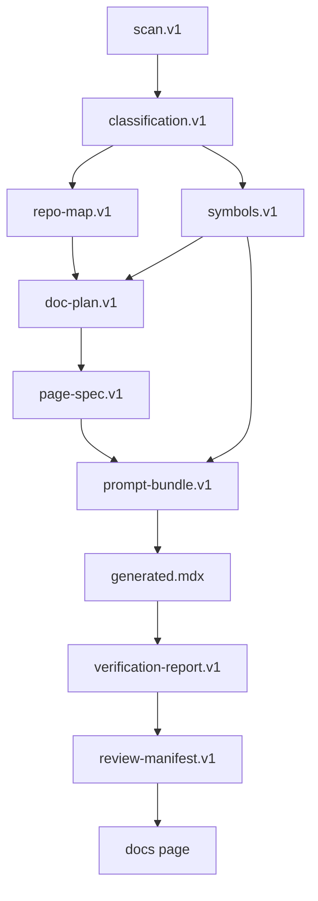

------
title: Build From Scratch: Mintlify-like AI-driven Documentation Generator CLI - Part 043
description: Mendesain storage model dan artifact layout untuk AI documentation generator CLI agar semua scan, context, plan, output, review, cache, dan sync state dapat direproduksi, diaudit, dan di-debug.
series: learn-ai-docs-km-cli
seriesTitle: Build From Scratch: Mintlify-like AI-driven Documentation Generator CLI with Code2Prompt and Open-source Knowledge Management
order: 43
partTitle: Storage Model and Artifact Layout
tags:
- ai-docs
- documentation
- cli
- artifact-layout
- cache
- storage-model
- reproducible-builds
- mdx
- knowledge-management
date: 2026-07-04
---

# Part 043 — Storage Model and Artifact Layout

Pada part sebelumnya kita sudah membangun arsitektur CLI, configuration system, provider abstraction, dan plugin system. Sekarang kita perlu menjawab pertanyaan yang sering diabaikan ketika membuat tool AI:

> Di mana semua hasil kerja sistem disimpan, bagaimana formatnya, bagaimana cara men-debug-nya, dan bagaimana memastikan output hari ini bisa direproduksi besok?

Kalau storage model buruk, sistem akan cepat menjadi black box. Developer akan melihat folder penuh file acak: prompt lama, hasil LLM, cache setengah valid, file sync yang tidak jelas, dan generated docs yang tidak bisa dilacak ke sumbernya.

Pada level top engineer, storage bukan detail implementasi. Storage adalah **contract of trust**.

Sistem AI docs generator harus bisa menjawab:

- scan repo mana yang dipakai?
- file mana yang masuk context?
- prompt mana yang dikirim ke model?
- model mana yang dipakai?
- output mana yang diterima manusia?
- bagian mana yang ditolak?
- halaman mana yang stale?
- notes mana yang berasal dari source code?
- artifact mana yang boleh dihapus?
- artifact mana yang harus disimpan untuk audit?

Jika pertanyaan itu tidak bisa dijawab dari artifact lokal, sistem belum production-grade.

---

## 1. Mental Model: Artifact-first System

CLI ini bukan sekadar command yang langsung menghasilkan MDX. CLI ini adalah pipeline compiler.

Input mentahnya adalah repository. Output akhirnya adalah docs site dan knowledge notes. Di antara keduanya ada banyak intermediate artifact.

```mermaid
flowchart LR
  Repo[Repository] --> Scan[scan.v1]
  Scan --> Class[classification.v1]
  Class --> Map[repo-map.v1]
  Map --> Symbols[symbols.v1]
  Symbols --> Contracts[contracts.v1]
  Contracts --> Examples[examples.v1]
  Examples --> Knowledge[knowledge-graph.v1]
  Knowledge --> Retrieval[retrieval-index.v1]
  Retrieval --> Context[prompt-bundle.v1]
  Context --> Plan[doc-plan.v1]
  Plan --> PageSpec[page-spec.v1]
  PageSpec --> Draft[generated-mdx]
  Draft --> Verify[verification-report.v1]
  Verify --> Review[review-manifest.v1]
  Review --> Docs[docs/]
  Review --> KM[knowledge-sinks]
```



Setiap node di diagram harus punya representasi file yang jelas.

Prinsipnya:

1. **Every important decision leaves an artifact.**
2. **Every generated artifact has provenance.**
3. **Every artifact can be invalidated by content hash.**
4. **Every human decision is recorded separately from generated output.**
5. **Every cache entry can be deleted without losing source of truth.**

Ini membedakan tool engineering dari script AI biasa.

---

## 2. Storage Categories

Kita bagi storage menjadi beberapa kategori:

| Category | Purpose | Can delete? | Should commit? |
|---|---|---:|---:|
| Source docs | Human-visible documentation | No | Yes |
| Generated proposals | AI-generated candidate output | Sometimes | Usually no |
| Pipeline artifacts | Scan/context/plan/verify state | Sometimes | Usually no |
| Review state | Human approval/rejection decisions | Carefully | Sometimes |
| Cache | Performance optimization | Yes | No |
| Audit logs | Traceability and compliance | Depends | Usually no |
| KM export | Logseq/OpenNote-compatible notes | Depends | Optional |
| Lockfiles | Reproducibility | No | Yes |

The critical distinction:

> A cache accelerates the system. An artifact explains the system. A lockfile freezes the system.

Do not mix them.

---

## 3. Proposed Project Layout

A clean repository using this CLI may look like this:

```txt
repo-root/
  docs/
    index.mdx
    quickstart.mdx
    concepts/
    guides/
    api/
  openapi/
    public-api.yaml
  .aidocs/
    config/
    artifacts/
    cache/
    review/
    state/
    logs/
    tmp/
    locks/
  aidocs.config.yaml
  aidocs.lock.json
```

Recommended `.gitignore` defaults:

```gitignore
.aidocs/cache/
.aidocs/tmp/
.aidocs/logs/
.aidocs/artifacts/runs/
.aidocs/artifacts/prompts/rendered/
.aidocs/artifacts/llm-responses/
```

Recommended committed files:

```txt
docs/**
openapi/**
aidocs.config.yaml
aidocs.lock.json
.aidocs/review/policy.yaml
.aidocs/review/ownership.yaml
.aidocs/state/manual-regions.json
```

Optional committed files:

```txt
.aidocs/artifacts/baseline/doc-plan.v1.json
.aidocs/artifacts/baseline/knowledge-graph.v1.json
.aidocs/review/decisions/**
knowledge/logseq/**
knowledge/opennote-export/**
```

Why optional? Some teams want full auditability in Git. Others treat generated intermediate artifacts as CI outputs.

Both are valid, but the policy must be explicit.

---

## 4. `.aidocs/` Directory Contract

The `.aidocs/` directory is the internal workspace of the tool.

Suggested shape:

```txt
.aidocs/
  config/
    resolved-config.v1.json
    schema/
  artifacts/
    current/
    baseline/
    runs/
  cache/
    scan/
    context/
    retrieval/
    llm/
    render/
  review/
    policy.yaml
    ownership.yaml
    decisions/
    pending/
  state/
    workspace.v1.json
    sync-state.v1.json
    manual-regions.v1.json
    tombstones.v1.json
  locks/
    provider-capabilities.lock.json
    plugin.lock.json
  logs/
    aidocs.log
    traces/
  tmp/
```

Each folder has a role.

### `config/`

Contains resolved config snapshots and schemas.

This is useful because a bug report should not say only:

> The generator created the wrong docs.

It should include:

> The generator used this resolved configuration, this plugin set, this provider capability matrix, and this page contract.

### `artifacts/`

Contains durable pipeline outputs.

Recommended subfolders:

```txt
artifacts/
  current/
    scan.v1.json
    classification.v1.json
    repo-map.v1.json
    symbols.v1.json
    contracts.v1.json
    examples.v1.json
    knowledge-graph.v1.json
    retrieval-index-manifest.v1.json
    doc-plan.v1.json
    verification-report.v1.json
  baseline/
    doc-plan.v1.json
    signatures.v1.json
    navigation.v1.json
  runs/
    2026-07-04T10-14-52Z-7f91ab/
      manifest.v1.json
      prompt-bundles/
      page-specs/
      generated/
      verification/
```

### `cache/`

Contains delete-safe data.

If removing `.aidocs/cache/` breaks correctness, your architecture is wrong.

### `review/`

Contains human decisions, policies, and pending review state.

This must be treated more carefully than cache.

### `state/`

Contains state required to reconcile generated content with manual edits and external sinks.

Examples:

- manual section IDs,
- sync cursors,
- tombstones,
- generated region ownership,
- last known external note ID.

### `locks/`

Contains reproducibility files.

Example:

- plugin versions,
- provider capabilities,
- schema versions,
- template pack versions.

### `logs/`

Contains operational logs, not source of truth.

Never put full prompt content here by default if the repo may contain proprietary code.

### `tmp/`

Contains temporary files.

Everything in this folder can be deleted.

---

## 5. Artifact Naming Rules

Artifact names should be boring and stable.

Bad:

```txt
final-result.json
scan-latest.json
new-prompt.json
output-2.json
```

Good:

```txt
scan.v1.json
classification.v1.json
repo-map.v1.json
symbols.v1.json
prompt-bundle.v1.json
page-spec.v1.json
verification-report.v1.json
review-manifest.v1.json
```

Pattern:

```txt
<artifact-name>.v<schema-major>.json
```

For per-page artifacts:

```txt
page-specs/
  guides__authentication.page-spec.v1.json
  api__users__create-user.page-spec.v1.json
```

For run-scoped artifacts:

```txt
runs/<timestamp>-<short-hash>/
  manifest.v1.json
  prompt-bundles/<page-id>.prompt-bundle.v1.json
  generated/<page-id>.generated.mdx
  verification/<page-id>.verification-report.v1.json
```

Use stable page IDs, not raw titles.

Example:

```txt
page_id = "guides/authentication"
file_safe_id = "guides__authentication"
```

---

## 6. Run Manifest

Every non-trivial command should produce a run manifest.

Example:

```json
{
  "schema": "aidocs.run-manifest.v1",
  "run_id": "2026-07-04T10-14-52Z-7f91ab",
  "command": "generate",
  "started_at": "2026-07-04T10:14:52Z",
  "completed_at": "2026-07-04T10:15:34Z",
  "workspace_root": "/repo",
  "git": {
    "commit": "9f31c2a",
    "branch": "feature/docs",
    "dirty": true
  },
  "config_hash": "sha256:...",
  "plugin_lock_hash": "sha256:...",
  "provider_capability_hash": "sha256:...",
  "input_artifacts": [
    {
      "name": "scan.v1.json",
      "hash": "sha256:..."
    },
    {
      "name": "doc-plan.v1.json",
      "hash": "sha256:..."
    }
  ],
  "output_artifacts": [
    {
      "name": "generated/guides__auth.generated.mdx",
      "hash": "sha256:..."
    }
  ],
  "model_calls": [
    {
      "provider": "openai",
      "model": "example-model",
      "request_hash": "sha256:...",
      "response_hash": "sha256:...",
      "usage": {
        "input_tokens": 12000,
        "output_tokens": 2200
      }
    }
  ],
  "status": "success"
}
```

This is what lets you debug.

Without run manifest, a generated MDX file is just a mysterious artifact.

---

## 7. Current vs Run-scoped Artifacts

You need both:

### Current artifacts

Stored at:

```txt
.aidocs/artifacts/current/
```

These represent the latest known state.

Used by fast commands:

```bash
aidocs explain page docs/guides/authentication.mdx
aidocs verify --changed
aidocs drift
```

### Run-scoped artifacts

Stored at:

```txt
.aidocs/artifacts/runs/<run-id>/
```

These represent an immutable execution snapshot.

Used for:

- debugging,
- audit,
- replay,
- CI artifacts,
- comparing two runs.

A command may update `current/` after writing a run directory successfully.

Never update `current/` first.

Correct flow:

```txt
write tmp -> write run artifacts -> validate -> atomically promote to current
```

---

## 8. Atomic Writes

AI docs tooling often writes many files. Partial writes create confusing failure states.

Use atomic write pattern:

1. write to temp file,
2. flush,
3. fsync when needed,
4. rename to target,
5. update manifest last.

Pseudo-code:

```ts
async function writeArtifactAtomic(path: string, bytes: Uint8Array) {
  const tmp = `${path}.${process.pid}.tmp`;
  await fs.writeFile(tmp, bytes);
  await fs.rename(tmp, path);
}
```

For multi-file operations:

```txt
.tmp/run-123/
  generated files
  manifest
```

Then promote:

```txt
runs/run-123/
```

If the process crashes halfway, stale tmp folder can be garbage-collected safely.

---

## 9. Artifact Hashing

Each artifact should have a content hash.

Recommended:

```txt
sha256(canonical_json(artifact))
```

For text files:

```txt
sha256(normalized_bytes(file))
```

Canonical JSON matters. Otherwise different whitespace/key order can produce different hashes for the same semantic artifact.

A simple canonicalization rule:

- UTF-8 encoding,
- sorted object keys,
- no insignificant whitespace,
- normalized line endings,
- stable number formatting.

Example artifact reference:

```json
{
  "artifact": "symbols.v1.json",
  "schema": "aidocs.symbols.v1",
  "hash": "sha256:7c6e...",
  "created_at": "2026-07-04T10:00:00Z"
}
```

Hashing enables:

- cache invalidation,
- provenance,
- build reproducibility,
- drift detection,
- audit.

---

## 10. Stable IDs

Generated docs systems fail when IDs depend on title text or file path alone.

We need stable IDs for:

- files,
- symbols,
- contracts,
- pages,
- sections,
- examples,
- notes,
- claims,
- review decisions.

Recommended ID model:

```txt
<kind>:<namespace>:<stable-path-or-signature>
```

Examples:

```txt
file:src:src/api/users.ts
symbol:ts:src/api/users.ts#createUser
endpoint:openapi:public-api.yaml#POST /users
page:docs:guides/authentication
section:docs:guides/authentication#token-refresh
example:test:tests/users/create-user.test.ts#case:create-user-success
claim:docs:guides/authentication#claim:8f31
note:logseq:Module__UserService
```

Do not use random UUID as primary identity for source-derived objects. UUIDs are useful for events, not stable source entities.

---

## 11. Page Artifact Layout

For each page, keep related artifacts together in run-scoped folders.

```txt
runs/<run-id>/pages/guides__authentication/
  page-spec.v1.json
  prompt-bundle.v1.json
  rendered-prompt.txt
  raw-response.json
  structured-response.json
  generated.mdx
  claim-ledger.v1.json
  verification-report.v1.json
  review-patch.v1.json
```

This layout makes debugging straightforward:

```bash
aidocs inspect run <run-id> --page guides/authentication
```

The command can show:

- page spec,
- sources,
- prompt,
- model response,
- generated MDX,
- verifier output,
- review patch.

This is the difference between a production tool and a demo.

---

## 12. Prompt and Response Storage

Prompts are sensitive because they may include proprietary code.

Default policy:

| Artifact | Store by default? | Notes |
|---|---:|---|
| Prompt bundle structured JSON | Yes | May include source excerpts; respect security policy |
| Rendered prompt text | No in secure mode | Useful for debugging but sensitive |
| Raw LLM response | No in secure mode | Can contain copied source |
| Structured parsed response | Yes | Prefer redacted/provenance-preserving form |
| Token usage | Yes | Safe enough if no content |
| Provider request IDs | Yes | Useful for support |

Configuration:

```yaml
security:
  promptStorage:
    structuredBundle: true
    renderedPrompt: false
    rawResponse: false
    redactSecrets: true
    maxStoredSourceBytes: 200000
```

Never assume prompt logs are harmless.

---

## 13. Generated Region State

To preserve human edits, generated regions need stable markers.

Example MDX:

```mdx
<!-- aidocs:generated:start id="section:install" source="page-spec:sha256:..." -->
## Installation

...
<!-- aidocs:generated:end -->
```

Manual region state:

```json
{
  "schema": "aidocs.manual-regions.v1",
  "pages": {
    "page:docs:guides/authentication": {
      "manual_regions": [
        {
          "id": "manual:security-note",
          "heading": "Internal Security Note",
          "hash": "sha256:...",
          "last_seen_at": "2026-07-04T10:00:00Z"
        }
      ]
    }
  }
}
```

The generator should update generated regions, preserve manual regions, and report conflicts.

---

## 14. Review Decision Storage

Human review decisions should be first-class artifacts.

Example:

```json
{
  "schema": "aidocs.review-decision.v1",
  "decision_id": "review:2026-07-04:guides/authentication:001",
  "page_id": "page:docs:guides/authentication",
  "proposal_hash": "sha256:...",
  "reviewer": "alice",
  "decision": "accepted_with_edits",
  "edits": [
    {
      "section_id": "section:token-refresh",
      "type": "replace_text",
      "reason": "Clarify refresh token behavior"
    }
  ],
  "created_at": "2026-07-04T10:20:00Z"
}
```

Why store review decisions separately?

Because docs output alone cannot tell you:

- what AI proposed,
- what humans changed,
- what was rejected,
- why a risky claim was allowed,
- whether future regeneration should preserve the reviewer’s intent.

---

## 15. Knowledge Sync State

Logseq/OpenNote sync needs state.

Example:

```json
{
  "schema": "aidocs.sync-state.v1",
  "sinks": {
    "logseq:default": {
      "root": "knowledge/logseq",
      "last_sync_at": "2026-07-04T10:30:00Z",
      "entities": {
        "symbol:ts:src/api/users.ts#createUser": {
          "target_path": "pages/API Create User.md",
          "target_hash": "sha256:...",
          "source_hash": "sha256:...",
          "ownership": "generated"
        }
      }
    },
    "opennote:default": {
      "export_root": "knowledge/opennote-export",
      "last_export_at": "2026-07-04T10:31:00Z"
    }
  }
}
```

Sync state prevents duplicate notes and supports tombstones.

Without sync state, every run risks creating:

```txt
User Service.md
User Service 1.md
User Service 2.md
User Service final.md
```

---

## 16. Tombstones

Deletion is a real state.

If a generated note or docs page is removed, the system must remember why.

Example:

```json
{
  "schema": "aidocs.tombstones.v1",
  "items": [
    {
      "entity_id": "page:docs:guides/legacy-auth",
      "deleted_at": "2026-07-04T11:00:00Z",
      "reason": "source_removed",
      "source_hash": "sha256:...",
      "replacement": "page:docs:guides/authentication"
    }
  ]
}
```

Tombstones prevent resurrection.

Without tombstones, a future scan may recreate deleted artifacts because old cache or stale source references still exist.

---

## 17. Lockfiles

The lockfile freezes the operational environment.

Example `aidocs.lock.json`:

```json
{
  "schema": "aidocs.lock.v1",
  "created_at": "2026-07-04T10:00:00Z",
  "cli": {
    "version": "0.8.0"
  },
  "template_packs": [
    {
      "name": "default-docs",
      "version": "1.4.2",
      "hash": "sha256:..."
    }
  ],
  "plugins": [
    {
      "name": "typescript-analyzer",
      "version": "0.3.1",
      "hash": "sha256:..."
    }
  ],
  "providers": {
    "openai": {
      "capability_snapshot": "sha256:..."
    }
  },
  "schemas": {
    "prompt-bundle": "v1",
    "page-spec": "v1"
  }
}
```

Config says what you want. Lockfile says what you actually used.

---

## 18. Cache Layout

Cache should be content-addressed where possible.

```txt
.aidocs/cache/
  scan/
    <file-hash>.json
  context/
    <context-key>.json
  retrieval/
    chunks/
    embeddings/
    index/
  llm/
    <provider>/<model>/<request-hash>.json
  render/
    <page-hash>.html
```

A cache key should include all correctness-relevant inputs.

For context cache:

```txt
hash(
  page_spec_hash,
  source_hashes,
  template_hash,
  config_hash,
  tokenizer_version,
  provider_capability_hash
)
```

For LLM response cache:

```txt
hash(
  provider,
  model,
  structured_request,
  rendered_prompt_hash,
  output_schema_hash,
  temperature,
  safety_settings
)
```

Never cache LLM output using only page ID.

---

## 19. Cache Invalidation Rules

Cache invalidation must be explicit.

| Change | Invalidate |
|---|---|
| Source file content changes | scan, symbols, contracts, examples, context, generated pages |
| Config changes | resolved config, context, verification, publish artifacts |
| Template changes | prompt bundles, generated pages |
| Provider capability changes | structured generation outputs, validation assumptions |
| Verifier rule changes | verification reports |
| Navigation policy changes | navigation plan, docs.json |
| KM sync config changes | sync plan, external export |
| Manual page edit | page state, generated region merge, verification |

A useful command:

```bash
aidocs cache explain docs/guides/authentication.mdx
```

Output:

```txt
Page: docs/guides/authentication.mdx
Context cache: stale
Reason: source file src/auth/token.ts changed
Generated page cache: stale
Reason: page-spec hash changed
Verification cache: stale
Reason: generated page hash changed
```

This explanation is more valuable than raw speed.

---

## 20. Artifact Registry

The CLI should have a central artifact registry.

Pseudo-model:

```ts
type ArtifactKind =
  | "scan"
  | "classification"
  | "repo-map"
  | "symbols"
  | "contracts"
  | "examples"
  | "knowledge-graph"
  | "retrieval-index"
  | "doc-plan"
  | "page-spec"
  | "prompt-bundle"
  | "generated-page"
  | "verification-report"
  | "review-manifest";

interface ArtifactDescriptor {
  kind: ArtifactKind;
  schema: string;
  path: string;
  hash: string;
  createdAt: string;
  inputs: ArtifactRef[];
}
```

The registry enables commands like:

```bash
aidocs artifacts list
aidocs artifacts show prompt-bundle --page guides/authentication
aidocs artifacts graph --page guides/authentication
aidocs artifacts diff --from run-a --to run-b
```

---

## 21. Artifact Dependency Graph

A dependency graph makes invalidation, debugging, and replay easier.



For each page, the CLI should be able to show:

```bash
aidocs explain artifact docs/guides/authentication.mdx
```

Example output:

```txt
docs/guides/authentication.mdx
  generated from: page-spec sha256:...
  prompt bundle: sha256:...
  source files:
    src/auth/token.ts sha256:...
    tests/auth/token-refresh.test.ts sha256:...
  verified by: verification-report sha256:...
  last accepted by: alice at 2026-07-04T10:20:00Z
```

That is trust engineering.

---

## 22. Garbage Collection

Artifacts grow quickly.

A healthy storage model needs garbage collection.

Policy example:

```yaml
storage:
  retention:
    runs:
      keepLast: 20
      keepFailed: 10
      keepTagged: true
    prompts:
      keepRendered: false
    llmResponses:
      keepRaw: false
    cache:
      maxSizeMb: 2048
      maxAgeDays: 30
```

Garbage collection must never delete:

- committed docs,
- lockfiles,
- review decisions required by policy,
- sync state,
- manual region state,
- tombstones unless retention explicitly allows it.

Command:

```bash
aidocs gc --dry-run
```

Example output:

```txt
Would delete:
  13 old successful runs
  428 context cache entries
  92 render cache entries
Would keep:
  4 failed runs
  2 tagged audit runs
  review decisions
  sync state
```

---

## 23. Security Boundary

Storage design must assume sensitive data exists.

Risky artifacts:

- raw prompts,
- raw responses,
- full source excerpts,
- semantic chunks,
- embeddings,
- logs,
- provider traces,
- generated notes containing internal architecture.

Security controls:

```yaml
security:
  storage:
    redactSecrets: true
    storeRawPrompts: false
    storeRawResponses: false
    encryptSensitiveCache: false
    forbidSourceInLogs: true
    maxPromptRetentionDays: 0
```

For enterprise mode, consider:

- local-only provider,
- encrypted cache,
- no raw prompt persistence,
- audit event only,
- no external link checking against private URLs,
- no embedding export outside machine.

The invariant:

> The storage layer must not silently become a second copy of the private codebase.

---

## 24. Observability Without Data Leakage

Useful logs:

```json
{
  "event": "page_generated",
  "page_id": "page:docs:guides/authentication",
  "run_id": "2026-07-04T10-14-52Z-7f91ab",
  "input_artifact_hash": "sha256:...",
  "output_hash": "sha256:...",
  "duration_ms": 8821,
  "token_usage": {
    "input": 12000,
    "output": 2200
  },
  "status": "verified"
}
```

Bad logs:

```txt
Sending prompt: <entire private source code here>
```

The log should identify artifacts by hash and path, not dump sensitive contents.

---

## 25. Replay Mode

Replay mode is one of the most powerful debugging tools.

Command:

```bash
aidocs replay run 2026-07-04T10-14-52Z-7f91ab --offline
```

Replay modes:

| Mode | Behavior |
|---|---|
| `--offline` | Use stored structured responses; no provider calls |
| `--same-provider` | Re-run against same provider/model |
| `--new-provider` | Re-run with another provider for comparison |
| `--verify-only` | Re-run verifier without generation |
| `--render-only` | Re-render docs from generated MDX |

Replay requires run manifests and artifact hashes.

Without them, you cannot tell if a behavior changed because of:

- source change,
- config change,
- template change,
- provider change,
- verifier change,
- model randomness.

---

## 26. CI Artifact Strategy

In CI, do not commit every intermediate artifact by default.

Instead:

- upload run artifact bundle,
- publish verification report,
- comment summary on PR,
- optionally attach generated diff.

CI output example:

```txt
.aidocs-ci/
  run-manifest.v1.json
  verification-report.v1.json
  drift-report.v1.json
  generated-diff.patch
  diagnostics.md
```

A PR comment should summarize:

```txt
AI Docs Check

Status: failed
Changed docs required: 3
Broken links: 1
Ungrounded claims: 2
Stale examples: 1
Run artifact: uploaded to CI artifacts
```

Do not paste full private prompt content into PR comments.

---

## 27. Artifact Schemas and Migration

Every artifact schema will evolve.

Need schema registry:

```txt
.aidocs/config/schema/
  scan.v1.schema.json
  scan.v2.schema.json
  page-spec.v1.schema.json
  prompt-bundle.v1.schema.json
```

Migration command:

```bash
aidocs artifacts migrate --from v1 --to v2
```

Migration policy:

- major version changes require explicit migration,
- minor additive fields should be backward compatible,
- unknown fields should be preserved where possible,
- generated artifacts can be regenerated instead of migrated,
- review decisions and sync state require careful migration.

---

## 28. Minimal Storage Implementation Plan

Do not implement everything at once.

Build in this order:

1. `.aidocs/artifacts/current/`
2. `scan.v1.json`
3. `classification.v1.json`
4. `repo-map.v1.json`
5. `run-manifest.v1.json`
6. atomic artifact writer
7. hash utility
8. `aidocs artifacts list`
9. `aidocs artifacts show`
10. `.aidocs/cache/`
11. page-scoped run layout
12. review state
13. sync state
14. garbage collection
15. replay mode

This sequence gives value early and avoids overbuilding.

---

## 29. Implementation Sketch

A simple TypeScript-like interface:

```ts
interface ArtifactStore {
  write<T>(descriptor: ArtifactWrite<T>): Promise<ArtifactRef>;
  read<T>(ref: ArtifactRef): Promise<T>;
  exists(ref: ArtifactRef): Promise<boolean>;
  list(query: ArtifactQuery): Promise<ArtifactRef[]>;
  promoteRun(runId: string): Promise<void>;
}

interface ArtifactWrite<T> {
  kind: ArtifactKind;
  schema: string;
  scope: "current" | "run";
  runId?: string;
  pageId?: string;
  value: T;
  inputs: ArtifactRef[];
}
```

Artifact store responsibilities:

- path resolution,
- canonical serialization,
- hashing,
- atomic writes,
- manifest update,
- schema validation,
- redaction policy,
- retention metadata.

Do not let every module write files directly.

---

## 30. Common Mistakes

### Mistake 1: Treating `.aidocs/` as random temp storage

Temporary storage is not the same as artifact storage.

### Mistake 2: Not hashing generated outputs

Without hashes, drift detection becomes guesswork.

### Mistake 3: Logging full prompts

This creates data leakage risk.

### Mistake 4: No distinction between proposal and accepted docs

AI-generated candidate output should not be confused with approved documentation.

### Mistake 5: No tombstones

Deleted generated pages reappear.

### Mistake 6: No run manifest

Bugs become irreproducible.

### Mistake 7: Cache correctness depends on file timestamps

Timestamps are not reliable correctness boundaries. Use content hash.

---

## 31. Practical Exercises

Implement these in a small repo:

1. Create `.aidocs/artifacts/current/scan.v1.json`.
2. Add content hashing for every scanned file.
3. Add `run-manifest.v1.json` for `aidocs scan`.
4. Implement `aidocs artifacts list`.
5. Implement `aidocs artifacts graph` for scan → classification → repo-map.
6. Implement `aidocs gc --dry-run`.
7. Add a policy that disables raw prompt persistence.
8. Add a failing test that ensures cache deletion does not affect correctness.

---

## 32. Part 043 Summary

The storage model is the trust foundation of the whole system.

A strong design gives you:

- reproducibility,
- debuggability,
- auditability,
- safe incremental builds,
- review traceability,
- sync correctness,
- cache control,
- security boundaries.

The key mental model:

> Generated docs are not just files. They are the final projection of a chain of source-backed artifacts.

If the chain is invisible, trust is impossible.

In the next part, we move this artifact model into CI. We will design a pipeline that detects docs drift, verifies generated docs, protects secrets, uploads diagnostics, and prevents AI-generated documentation from bypassing engineering review.

---

## References

- GitHub Actions workflow syntax: https://docs.github.com/actions/using-workflows/workflow-syntax-for-github-actions
- GitHub Actions dependency caching: https://docs.github.com/en/actions/reference/workflows-and-actions/dependency-caching
- Mintlify GitHub deployment documentation: https://www.mintlify.com/docs/deploy/github
- OpenSSF Scorecard repository: https://github.com/ossf/scorecard
