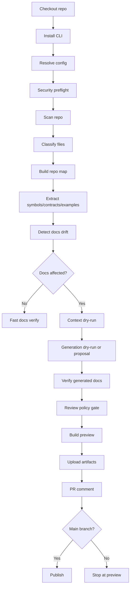

------
title: Build From Scratch: Mintlify-like AI-driven Documentation Generator CLI - Part 044
description: Mendesain CI pipeline untuk AI-generated docs agar scan, drift detection, generation dry-run, verification, preview, policy gate, PR comment, dan publish berjalan aman dan dapat diaudit.
series: learn-ai-docs-km-cli
seriesTitle: Build From Scratch: Mintlify-like AI-driven Documentation Generator CLI with Code2Prompt and Open-source Knowledge Management
order: 44
partTitle: CI Pipeline for AI-generated Docs
tags:
- ai-docs
- documentation
- cli
- ci-cd
- github-actions
- docs-as-code
- verification
- drift-detection
- mdx
date: 2026-07-04
---

# Part 044 — CI Pipeline for AI-generated Docs

AI-generated docs tidak boleh langsung dipercaya hanya karena output-nya terlihat rapi.

Di local development, CLI membantu developer membuat, memverifikasi, dan me-review docs. Di CI, sistem harus menjadi gatekeeper:

- apakah docs berubah sesuai perubahan kode?
- apakah API reference sesuai OpenAPI?
- apakah examples masih valid?
- apakah ada ungrounded claims?
- apakah generated docs melanggar policy?
- apakah navigation rusak?
- apakah ada secret yang masuk prompt atau output?
- apakah publikasi aman dilakukan?

Part ini membangun pipeline CI untuk AI docs generator yang production-grade.

Mental model utama:

> CI untuk AI docs bukan “generate and commit”. CI untuk AI docs adalah “detect, verify, explain, and gate”.

---

## 1. Why CI for AI-generated Docs Is Different

CI biasa untuk docs mungkin hanya melakukan:

```bash
npm run build
markdownlint docs
link-check docs
```

AI-generated docs perlu lebih banyak tahap karena ada risiko tambahan:

| Risk | Why normal docs CI is insufficient |
|---|---|
| Hallucinated claims | Markdown build tetap sukses |
| Stale API behavior | Link checker tidak tahu behavior berubah |
| Unsafe commands | Static build tidak paham command risk |
| Secret leakage | Generated text bisa menyebarkan secret |
| Prompt leakage | CI logs bisa menyimpan source code |
| Broken provenance | Docs terlihat benar tapi tidak punya source backing |
| Unreviewed AI output | PR bisa merge tanpa approval manusia |
| Expensive generation | CI bisa boros token kalau tidak dikendalikan |

Karena itu pipeline harus punya tahapan eksplisit:

```txt
scan -> classify -> plan -> drift -> context dry-run -> generate dry-run -> verify -> review gate -> preview -> publish
```

---

## 2. CI Pipeline Shape

Reference flow:



This pipeline should be deterministic except the optional LLM generation stage.

Even generation stage should be bounded by:

- page specs,
- prompt bundles,
- output schemas,
- token budgets,
- provider policy,
- review gate.

---

## 3. CI Modes

Not every CI run should call an LLM.

Define modes:

| Mode | Purpose | LLM calls? | Typical trigger |
|---|---|---:|---|
| `verify` | Check existing docs | No | Every PR |
| `drift` | Detect docs affected by code changes | No | Every PR |
| `plan` | Produce docs update plan | Optional no | PR with source changes |
| `generate-dry-run` | Generate proposal, do not commit | Yes | Label/manual trigger |
| `repair-dry-run` | Generate fixes for failed docs | Yes | Label/manual trigger |
| `publish-preview` | Build docs preview | No | PR touching docs |
| `publish-prod` | Deploy docs | No/controlled | Main branch after approval |

Default should be cheap and safe:

```bash
aidocs ci --mode verify
```

Generation should usually be explicit:

```bash
aidocs ci --mode generate-dry-run
```

---

## 4. Trigger Policy

Recommended GitHub Actions triggers:

```yaml
on:
  pull_request:
    paths:
      - "src/**"
      - "docs/**"
      - "openapi/**"
      - "aidocs.config.yaml"
      - ".aidocs/review/**"
  push:
    branches:
      - main
  workflow_dispatch:
    inputs:
      mode:
        description: "AI docs CI mode"
        required: true
        default: "verify"
```

Why include source paths?

Because docs can drift when code changes even if no docs file changed.

Why include config paths?

Because generator/verifier behavior can change when policy changes.

Why include manual dispatch?

Because AI generation may be expensive or policy-sensitive.

---

## 5. Minimal CI Workflow

A first useful workflow:

```yaml
name: AI Docs Check

on:
  pull_request:
    paths:
      - "src/**"
      - "docs/**"
      - "openapi/**"
      - "aidocs.config.yaml"
      - ".aidocs/**"
  workflow_dispatch:

permissions:
  contents: read
  pull-requests: write

jobs:
  docs-check:
    runs-on: ubuntu-latest
    steps:
      - name: Checkout
        uses: actions/checkout@v4
        with:
          fetch-depth: 0

      - name: Setup Node
        uses: actions/setup-node@v4
        with:
          node-version: 22

      - name: Install dependencies
        run: npm ci

      - name: Run AI docs verification
        run: npx aidocs ci --mode verify --format github

      - name: Upload diagnostics
        if: always()
        uses: actions/upload-artifact@v4
        with:
          name: aidocs-diagnostics
          path: .aidocs-ci/
```

This does not yet call an LLM. It only verifies, detects drift, and uploads diagnostics.

That is a good default.

---

## 6. CI Output Contract

CI should produce a predictable output folder:

```txt
.aidocs-ci/
  run-manifest.v1.json
  resolved-config.v1.json
  drift-report.v1.json
  verification-report.v1.json
  review-gate-report.v1.json
  diagnostics.md
  generated-diff.patch
  summary.json
```

### `summary.json`

```json
{
  "schema": "aidocs.ci-summary.v1",
  "status": "failed",
  "mode": "verify",
  "changed_files": 18,
  "affected_pages": 4,
  "drift": {
    "required_updates": 3,
    "severity": "high"
  },
  "verification": {
    "errors": 2,
    "warnings": 7
  },
  "review_gate": {
    "required": true,
    "missing_approvals": 1
  },
  "artifacts": {
    "diagnostics": ".aidocs-ci/diagnostics.md"
  }
}
```

CI result should be machine-readable and human-readable.

---

## 7. Security Preflight

Before scanning and prompt generation, CI must run security preflight.

Checks:

- secret scanning on changed files,
- disallow prompt generation if high-risk secret detected,
- verify provider credentials are only available in allowed modes,
- redact logs,
- ensure raw prompt persistence policy is respected,
- verify no untrusted PR has access to write tokens or model secrets.

Pseudo-command:

```bash
aidocs security preflight --ci
```

Policy:

```yaml
security:
  ci:
    allowLLMOnForkPR: false
    storeRenderedPrompts: false
    storeRawResponses: false
    redactSecrets: true
    failOnSecretRisk: true
```

Important invariant:

> Never expose model provider secrets to untrusted pull requests.

This matters because a malicious PR can modify scripts and exfiltrate environment variables if CI is misconfigured.

---

## 8. Drift Detection Gate

Drift detection should run even when docs were not modified.

Command:

```bash
aidocs drift --base origin/main --head HEAD --ci
```

Output example:

```txt
Docs drift detected

Affected docs:
  docs/api/users/create-user.mdx
    reason: OpenAPI operation POST /users changed
    severity: high
  docs/guides/authentication.mdx
    reason: src/auth/token.ts changed and page cites symbol createToken
    severity: medium
  docs/runbooks/login-failures.mdx
    reason: error code AUTH_401 changed
    severity: medium
```

Drift policy:

```yaml
drift:
  failOn:
    - api_contract_changed_without_docs
    - example_invalid
    - high_confidence_stale_claim
  warnOn:
    - architecture_relation_changed
    - low_confidence_page_impact
```

CI should not always fail on every possible drift. It should fail on policy-relevant drift.

---

## 9. Generation Dry-run

Generation dry-run creates proposals but does not commit them.

Command:

```bash
aidocs generate --changed --dry-run --ci
```

Outputs:

```txt
.aidocs-ci/
  generated/
    docs__guides__authentication.generated.mdx
  generated-diff.patch
  prompt-bundles/
  verification/
  diagnostics.md
```

Dry-run purpose:

- show what the AI would change,
- verify proposal before human applies it,
- avoid hidden commits,
- avoid bot overwriting manual work.

A PR comment should say:

```txt
AI Docs Proposal Available

3 pages appear stale.
A generated patch is attached to CI artifacts.
Run locally:
  aidocs review apply .aidocs-ci/generated-diff.patch
```

Do not auto-commit by default.

---

## 10. Auto-commit Policy

Auto-commit is tempting. It is also dangerous.

Recommended default:

| Branch type | Auto-generate? | Auto-commit? |
|---|---:|---:|
| Fork PR | No | No |
| Internal PR | Manual trigger only | No by default |
| Bot maintenance branch | Yes | Yes if policy allows |
| Main branch | No | No |
| Scheduled docs refresh branch | Yes | Yes to generated branch |

If auto-commit is enabled, commit to a bot branch, not directly to the developer’s PR unless explicitly allowed.

Example:

```yaml
review:
  ci:
    autoCommit:
      enabled: false
      allowedBranches:
        - "aidocs/generated/**"
```

---

## 11. Verification Gate

Verification must run after generation and on existing docs.

Command:

```bash
aidocs verify --ci --strict
```

Checks:

- MDX parse,
- frontmatter schema,
- navigation validity,
- internal links,
- external links if allowed,
- code fences,
- Mermaid syntax,
- OpenAPI references,
- example validity,
- source refs,
- claim ledger,
- command safety,
- generated/manual region boundaries,
- visibility policy,
- KM sync conflicts.

Verification severities:

```txt
error   blocks merge
warning visible but does not block
info    diagnostic only
```

Policy example:

```yaml
verification:
  ci:
    failOn:
      - mdx_parse_error
      - navigation_missing_page
      - broken_internal_link
      - ungrounded_high_risk_claim
      - invalid_openapi_operation
      - stale_required_example
      - secret_leakage
```

---

## 12. Review Gate

Generated docs should not bypass humans.

Review gate checks:

- changed generated regions approved,
- high-risk pages have owner approval,
- API reference changes have API owner approval,
- runbooks have operations owner approval,
- security docs have security owner approval,
- ungrounded claims are rejected or waived,
- waiver expiry is valid.

Command:

```bash
aidocs review gate --ci
```

Output:

```txt
Review gate failed

Missing approvals:
  docs/guides/authentication.mdx
    required owner: @security-team
    reason: auth behavior changed

Expired waivers:
  docs/architecture/session-model.mdx
    waiver expired: 2026-06-30
```

Review gate should read from:

- CODEOWNERS or equivalent,
- `.aidocs/review/ownership.yaml`,
- review decisions,
- generated diff,
- page risk model.

---

## 13. PR Comment Design

A good PR comment should be short, actionable, and not leak data.

Example:

```md
## AI Docs Check

Status: ❌ Failed

### Summary

- Affected docs pages: 4
- Required docs updates: 3
- Broken internal links: 1
- Ungrounded high-risk claims: 2
- Stale examples: 1

### Most important actions

1. Update `docs/api/users/create-user.mdx` because `POST /users` changed.
2. Fix broken link from `docs/guides/authentication.mdx` to `docs/concepts/tokens.mdx`.
3. Review generated proposal in CI artifact `aidocs-diagnostics`.

### Local commands

```bash
aidocs drift --base origin/main --head HEAD
aidocs generate --changed --dry-run
aidocs verify --strict
```
```

Avoid:

- full prompt content,
- full source excerpts,
- raw model response,
- sensitive internal URLs,
- massive logs.

---

## 14. Caching in CI

CI can be slow without cache.

Cache candidates:

- package manager dependencies,
- `.aidocs/cache/scan`,
- `.aidocs/cache/retrieval`,
- rendered docs cache,
- tokenizer/model metadata,
- downloaded schemas.

Do not blindly cache everything.

Recommended cache key:

```yaml
- name: Cache AI docs artifacts
  uses: actions/cache@v4
  with:
    path: |
      .aidocs/cache/scan
      .aidocs/cache/retrieval
      .aidocs/cache/render
    key: aidocs-${{ runner.os }}-${{ hashFiles('aidocs.config.yaml', 'package-lock.json') }}-${{ github.base_ref }}
    restore-keys: |
      aidocs-${{ runner.os }}-
```

Remember: cache improves speed, not correctness.

The pipeline must be correct even if cache is empty.

---

## 15. Parallelization

Docs generation can be parallelized per page.

But not every stage should be parallel.

| Stage | Parallel? | Notes |
|---|---:|---|
| scan | Partially | Directory traversal can be concurrent |
| classify | Yes | Per file |
| symbol extraction | Yes | Per file/language plugin |
| contract normalization | Limited | Some specs need global resolution |
| doc plan | No/limited | Needs global view |
| page spec generation | Yes | Per page after plan |
| prompt bundle creation | Yes | Per page |
| LLM generation | Yes with rate limit | Respect provider quotas |
| verification | Yes | Per page plus global nav checks |
| review gate | Limited | Needs global ownership decision |

Use a concurrency budget:

```yaml
ci:
  concurrency:
    fileAnalysis: 8
    pageGeneration: 3
    verification: 8
    llmCalls: 2
```

Never let CI accidentally launch 100 expensive model calls.

---

## 16. Cost Control

AI generation in CI needs budgets.

Policy:

```yaml
provider:
  budgets:
    ci:
      maxInputTokens: 250000
      maxOutputTokens: 60000
      maxCostUsd: 5.00
      maxPagesGenerated: 10
      requireManualTriggerAbovePages: 3
```

Behavior:

```txt
Generation skipped
Reason: estimated cost exceeds CI budget
Affected pages: 18
Allowed pages: 10
Suggested command: aidocs generate --changed --max-pages 10
```

Cost refusal is a valid CI result.

It is better than silently spending too much or generating partial docs without saying so.

---

## 17. Provider Credentials in CI

Provider credentials should only be available in jobs that need generation.

Separate jobs:

```yaml
jobs:
  verify:
    permissions:
      contents: read
    steps:
      - run: npx aidocs ci --mode verify

  generate-proposal:
    if: contains(github.event.pull_request.labels.*.name, 'ai-docs-generate')
    permissions:
      contents: read
      pull-requests: write
    env:
      OPENAI_API_KEY: ${{ secrets.OPENAI_API_KEY }}
    steps:
      - run: npx aidocs ci --mode generate-dry-run
```

Do not expose provider secrets in the default PR job if not required.

---

## 18. Fork PR Policy

Fork PRs are high risk because workflow code may be attacker-controlled.

Recommended behavior:

```yaml
security:
  ci:
    forkPullRequests:
      allowLLM: false
      allowWriteToken: false
      allowExternalLinkCheck: false
      allowPreviewDeploy: false
```

CI should still run safe checks:

- MDX parse,
- navigation validation,
- internal link validation,
- scan/classify without secret export,
- drift estimation without LLM.

For generation, maintainers can run manual workflow after review.

---

## 19. Preview Builds

Preview builds let reviewers inspect docs as a site.

Pipeline:

```bash
aidocs render --ci --out .aidocs-ci/site
aidocs preview package --out .aidocs-ci/preview.zip
```

Preview should include:

- generated docs,
- navigation,
- API reference,
- search index,
- verification overlay if enabled,
- diagnostics page if internal.

For Mintlify-like deployment, the system can either:

- build local static preview,
- rely on platform preview deployment,
- upload docs artifact to deployment provider,
- generate a PR preview URL.

The publisher stage should be separate from verifier stage.

---

## 20. Publishing Policy

Production publishing should happen only after merge to protected branch.

Example:

```yaml
on:
  push:
    branches:
      - main

jobs:
  publish-docs:
    runs-on: ubuntu-latest
    steps:
      - uses: actions/checkout@v4
      - run: npm ci
      - run: npx aidocs verify --strict
      - run: npx aidocs render --out dist/docs
      - run: npx aidocs publish --target production
```

Publishing preconditions:

- no blocking verification errors,
- review gate satisfied,
- generated docs already committed or generated from approved source,
- no uncommitted generated diff,
- current branch allowed,
- deployment credential available.

---

## 21. GitHub Actions End-to-end Example

A more complete workflow:

```yaml
name: AI Docs CI

on:
  pull_request:
    paths:
      - "src/**"
      - "docs/**"
      - "openapi/**"
      - "aidocs.config.yaml"
      - ".aidocs/**"
  workflow_dispatch:
    inputs:
      mode:
        description: "Mode: verify, drift, generate-dry-run"
        required: true
        default: "verify"

permissions:
  contents: read
  pull-requests: write

concurrency:
  group: aidocs-${{ github.workflow }}-${{ github.ref }}
  cancel-in-progress: true

jobs:
  aidocs:
    runs-on: ubuntu-latest
    steps:
      - name: Checkout
        uses: actions/checkout@v4
        with:
          fetch-depth: 0

      - name: Setup Node
        uses: actions/setup-node@v4
        with:
          node-version: 22
          cache: npm

      - name: Install dependencies
        run: npm ci

      - name: Cache aidocs
        uses: actions/cache@v4
        with:
          path: |
            .aidocs/cache/scan
            .aidocs/cache/retrieval
            .aidocs/cache/render
          key: aidocs-${{ runner.os }}-${{ hashFiles('aidocs.config.yaml', 'package-lock.json') }}
          restore-keys: |
            aidocs-${{ runner.os }}-

      - name: Security preflight
        run: npx aidocs security preflight --ci

      - name: Verify docs
        run: npx aidocs ci --mode verify --format github

      - name: Generate proposal
        if: github.event_name == 'workflow_dispatch' && github.event.inputs.mode == 'generate-dry-run'
        env:
          OPENAI_API_KEY: ${{ secrets.OPENAI_API_KEY }}
        run: npx aidocs ci --mode generate-dry-run --format github

      - name: Upload diagnostics
        if: always()
        uses: actions/upload-artifact@v4
        with:
          name: aidocs-diagnostics
          path: .aidocs-ci/
```

Notice that model credentials are only used in generation mode.

---

## 22. CI Exit Codes

Exit codes should be meaningful.

| Exit code | Meaning |
|---:|---|
| 0 | Success |
| 1 | General failure |
| 2 | Verification failed |
| 3 | Drift detected and policy says fail |
| 4 | Security preflight failed |
| 5 | Review gate failed |
| 6 | Budget exceeded |
| 7 | Config invalid |
| 8 | Provider unavailable |
| 9 | Internal tool error |

This lets CI distinguish:

- docs are wrong,
- config is wrong,
- secrets are at risk,
- provider is down,
- tool crashed.

Different failures need different responses.

---

## 23. CI Diagnostics Markdown

The CLI should write `.aidocs-ci/diagnostics.md`.

Example structure:

```md
# AI Docs CI Diagnostics

## Summary

Status: failed
Mode: verify
Run ID: 2026-07-04T10-14-52Z-7f91ab

## Drift

| Page | Reason | Severity |
|---|---|---|
| docs/api/users/create-user.mdx | POST /users changed | high |

## Verification Errors

| File | Rule | Message |
|---|---|---|
| docs/guides/authentication.mdx | broken_internal_link | Missing target docs/concepts/tokens.mdx |

## Suggested Commands

```bash
aidocs drift --base origin/main --head HEAD
aidocs generate --changed --dry-run
aidocs verify --strict
```
```

Diagnostics should be usable offline.

---

## 24. Policy as Code

CI must not rely on tribal knowledge.

Put policy in repo:

```yaml
ci:
  failOnDrift: true
  allowLLMOnPullRequest: false
  requireReviewForGeneratedDocs: true
  requireOwners:
    api: true
    security: true
    operations: true

verification:
  failOn:
    - mdx_parse_error
    - broken_internal_link
    - ungrounded_high_risk_claim
    - invalid_openapi_operation

review:
  highRiskPages:
    - "docs/security/**"
    - "docs/runbooks/**"
    - "docs/api/**"
```

Policy should be versioned, reviewed, and owned.

---

## 25. Scheduled Docs Health Check

Not all drift comes from code changes in the same PR.

Scheduled checks catch:

- external links rot,
- dependency docs changes,
- OpenAPI remote schema changes,
- provider capability changes,
- stale generated notes,
- expired waivers,
- old TODOs,
- outdated examples.

Example:

```yaml
on:
  schedule:
    - cron: "0 3 * * 1"
```

Command:

```bash
aidocs ci --mode health-check
```

Scheduled checks should open issues or reports, not silently rewrite docs.

---

## 26. Monorepo CI

For monorepos, avoid checking everything on every PR.

Use workspace impact analysis:

```bash
aidocs ci --mode verify --changed-workspaces
```

Workspace model:

```yaml
workspaces:
  api:
    roots:
      - services/api
    docs:
      - docs/api
  web:
    roots:
      - apps/web
    docs:
      - docs/web
```

CI should compute:

```txt
changed source -> affected workspace -> affected docs pages -> required checks
```

But global docs still need checks when shared contracts/configs change.

---

## 27. Build Matrix

For multi-version docs:

```yaml
strategy:
  matrix:
    docs-version:
      - latest
      - v2
      - v1
```

Command:

```bash
aidocs verify --version ${{ matrix.docs-version }}
```

Versioned docs require version-specific:

- OpenAPI specs,
- examples,
- navigation,
- base URLs,
- deprecation policy,
- generated claims.

Never let latest docs silently overwrite older version docs.

---

## 28. Failure Taxonomy

CI failures should be classified.

| Category | Example | Owner |
|---|---|---|
| Source drift | API changed, docs stale | Code owner + docs owner |
| Docs syntax | Invalid MDX | Docs owner |
| Contract mismatch | OpenAPI invalid | API owner |
| Example failure | Test snippet stale | Feature owner |
| Security | Secret in generated output | Security owner |
| Policy | Missing approval | Reviewer/owner |
| Provider | Model API unavailable | Tool owner |
| Tool bug | Internal exception | Platform owner |

This classification matters because otherwise every failure becomes “docs CI failed”.

---

## 29. Anti-patterns

### Anti-pattern 1: CI auto-generates and commits without review

This creates documentation churn and weakens trust.

### Anti-pattern 2: CI stores full prompts as artifacts by default

This can leak source code.

### Anti-pattern 3: CI fails on every low-confidence drift signal

This creates alert fatigue.

### Anti-pattern 4: CI hides diagnostics

A failed job without actionable explanation wastes developer time.

### Anti-pattern 5: LLM generation on every PR

This is expensive, slow, and risky.

### Anti-pattern 6: Build success treated as correctness

A beautiful docs site can still contain false claims.

---

## 30. Implementation Roadmap

Build CI support incrementally:

1. `aidocs verify --ci`
2. `.aidocs-ci/summary.json`
3. `.aidocs-ci/diagnostics.md`
4. GitHub Actions workflow for verify mode
5. drift detection against base branch
6. PR comment generation
7. artifact upload
8. generation dry-run manual trigger
9. review gate
10. preview build
11. publish on main
12. scheduled health check
13. monorepo impact analysis
14. budget enforcement
15. provider failure fallback

Do not start with auto-generation.

Start with verification and drift detection.

---

## 31. Testing the CI Pipeline

Test cases:

1. PR changes API contract without docs update → drift fails.
2. PR changes docs only → MDX/link/nav verify runs.
3. PR introduces broken internal link → verify fails.
4. PR changes source file referenced by page → affected page detected.
5. Fork PR tries generation → generation blocked.
6. Provider key missing in verify mode → CI still passes if no generation needed.
7. Provider key missing in generation mode → clear provider error.
8. Generated output contains ungrounded claim → verify fails.
9. Generated proposal lacks owner approval → review gate fails.
10. Cache directory deleted → CI still correct.
11. Budget exceeded → generation skipped with exit code 6.
12. Raw prompt storage disabled → no rendered prompt artifact uploaded.

Use fixture repos for CI testing.

---

## 32. Part 044 Summary

CI is where the AI docs generator becomes trustworthy.

The right CI design:

- does not generate by default,
- detects drift on source changes,
- verifies docs as structured artifacts,
- protects secrets and prompts,
- uploads diagnostics,
- gates risky output on human approval,
- builds previews,
- publishes only after protected-branch merge,
- controls token cost,
- treats failures as actionable categories.

The most important invariant:

> AI can propose documentation changes, but CI must verify, explain, and enforce policy before those changes become trusted documentation.

In the next part, we will go deeper into security, privacy, redaction, secret handling, and threat modeling for AI documentation systems.

---

## References

- GitHub Actions workflow syntax: https://docs.github.com/actions/using-workflows/workflow-syntax-for-github-actions
- GitHub Actions dependency caching reference: https://docs.github.com/en/actions/reference/workflows-and-actions/dependency-caching
- Mintlify GitHub deployment documentation: https://www.mintlify.com/docs/deploy/github
- OpenSSF Scorecard GitHub repository: https://github.com/ossf/scorecard
