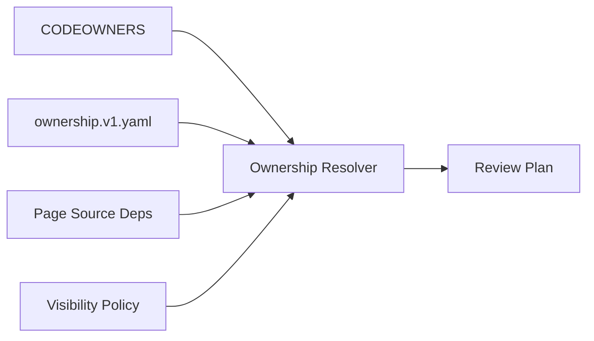
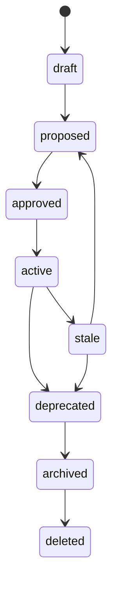
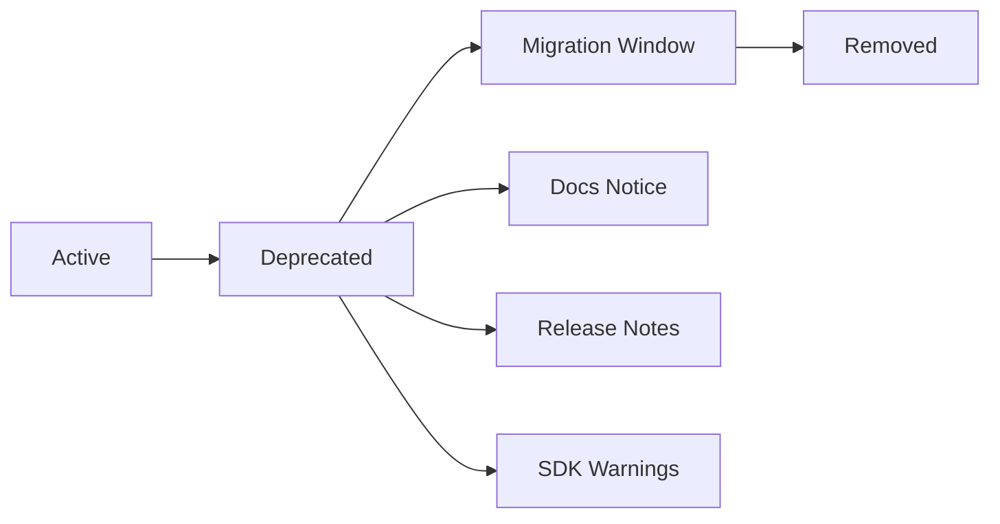
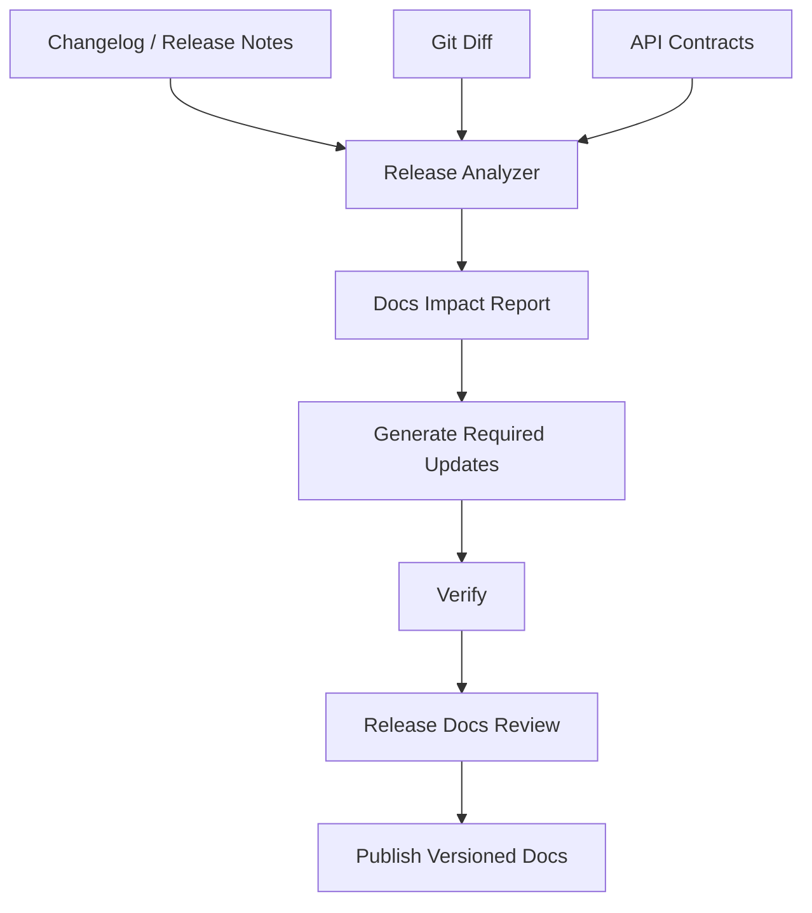
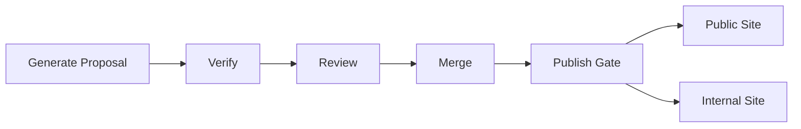
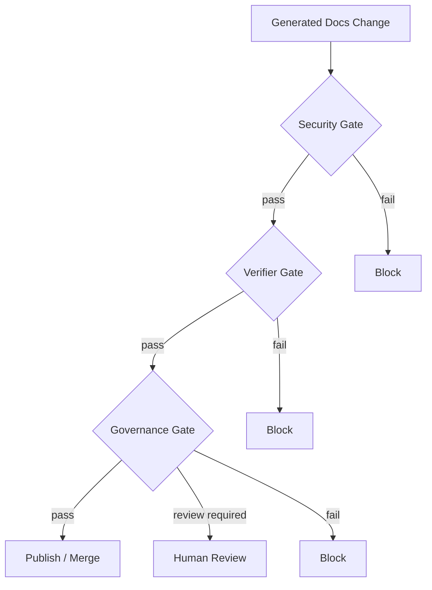
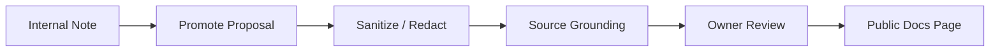
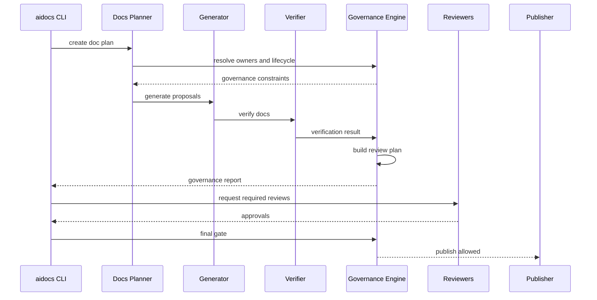

------
title: Build From Scratch: Mintlify-like AI-driven Documentation Generator CLI - Part 046
description: Mendesain governance, versioning, documentation ownership, lifecycle policy, generated content policy, deprecation model, release integration, review responsibility, dan enterprise operating model untuk AI-generated docs.
series: learn-ai-docs-km-cli
seriesTitle: Build From Scratch: Mintlify-like AI-driven Documentation Generator CLI with Code2Prompt and Open-source Knowledge Management
order: 46
partTitle: Governance, Versioning, and Doc Ownership
tags:
- ai-docs
- documentation
- cli
- governance
- ownership
- versioning
- docs-as-code
- release-management
- mdx
date: 2026-07-04
---

# Part 046 — Governance, Versioning, and Doc Ownership

Part 045 membuat pipeline aman dari sisi security, privacy, secret handling, provider policy, artifact handling, dan publish visibility. Tetapi sistem yang aman secara teknis tetap bisa gagal secara organisasi.

Contoh kegagalan:

- tidak ada owner untuk generated docs,
- docs berubah tanpa review subject matter expert,
- AI-generated page lama tetap tampil meski API sudah deprecated,
- internal note tersinkron ke public docs karena tidak ada lifecycle policy,
- versioned docs tidak cocok dengan versioned API,
- release note tidak mengubah docs,
- docs CI merah tetapi tim mengabaikannya,
- semua orang mengira “AI yang bertanggung jawab”.

AI tidak bisa menjadi pemilik dokumentasi.

Mental model utama:

> AI can generate proposals. Humans and teams own published truth.

Governance bukan birokrasi tambahan. Governance adalah mekanisme agar docs tetap benar, dapat diaudit, dan punya pemilik ketika sistem tumbuh.

---

## 1. Problem Governance yang Sebenarnya

Documentation generator biasanya dianggap selesai ketika bisa menghasilkan Markdown.

Untuk production-grade system, itu baru 30%.

Pertanyaan governance yang lebih penting:

- siapa yang boleh generate docs?
- siapa yang boleh approve generated docs?
- siapa pemilik page tertentu?
- apa yang terjadi jika source berubah tetapi docs tidak?
- bagaimana docs mengikuti release/version?
- kapan page deprecated?
- bagaimana public/internal boundary dijaga?
- bagaimana AI-generated content diberi label/provenance?
- bagaimana reviewer tahu bagian mana yang AI-generated?
- bagaimana compliance/security mengecek audit trail?
- bagaimana knowledge graph tidak berubah menjadi landfill?

Jika jawaban pertanyaan ini tidak ada, sistem akan rusak pelan-pelan.

---

## 2. Governance as Operating System

Governance bukan satu file. Ia adalah operating system untuk docs lifecycle.

```mermaid
flowchart TD
  Source[Source of Truth] --> Plan[Docs Plan]
  Plan --> Generate[AI Proposal]
  Generate --> Verify[Verification]
  Verify --> Owner[Owner Review]
  Owner --> Publish[Publish]
  Publish --> Observe[Usage / Feedback]
  Observe --> Drift[Drift Detection]
  Drift --> Plan

  Policy[(Governance Policy)] --> Plan
  Policy --> Generate
  Policy --> Verify
  Policy --> Owner
  Policy --> Publish

  Audit[(Audit Trail)] <-- Generate
  Audit <-- Verify
  Audit <-- Owner
  Audit <-- Publish
```

Governance mengatur:

- source ownership,
- page ownership,
- review responsibility,
- versioning,
- publishing authority,
- deprecation,
- exceptions,
- audit,
- lifecycle.

---

## 3. Core Governance Invariants

Kita mulai dari invariant.

1. **Every published page has an owner.**
2. **Every generated page has provenance.**
3. **Every public page has a visibility decision.**
4. **Every API version has matching documentation version policy.**
5. **Every generated change is reviewable as a diff.**
6. **Every stale page has a drift signal or suppression.**
7. **Every suppression expires.**
8. **Every manual override is auditable.**
9. **Every page lifecycle state is explicit.**
10. **AI never owns final truth.**

Jika invariant ini dipenuhi, docs bisa berkembang tanpa berubah menjadi chaos.

---

## 4. Governance Model

Buat artifact governance.

```ts
export interface GovernancePolicy {
  version: "governance-policy.v1";
  ownership: OwnershipPolicy;
  review: ReviewPolicy;
  versioning: VersioningPolicy;
  lifecycle: LifecyclePolicy;
  generatedContent: GeneratedContentPolicy;
  publishing: PublishingGovernance;
  exceptions: ExceptionPolicy;
}
```

Config:

```yaml
governance:
  requireOwnerForPublishedPages: true
  requireHumanReviewForGeneratedContent: true
  requireSecurityReviewForPublicArchitecture: true
  requireApiOwnerForApiReference: true
  requireExpiryForSuppressions: true

  generatedContent:
    labelGeneratedSections: true
    preserveManualEdits: true
    allowFullPageRegeneration: false

  lifecycle:
    defaultState: draft
    staleAfterDays: 90
    requireDeprecationNotice: true
```

Governance policy harus versioned bersama repo.

---

## 5. Ownership Model

Ownership harus dipisahkan menjadi beberapa jenis.

| Ownership | Meaning | Example |
|---|---|---|
| source owner | pemilik kode/contract | `CODEOWNERS` untuk `src/payments/**` |
| docs owner | pemilik page docs | `docs/payments/**` |
| API owner | pemilik public API | platform API team |
| security owner | reviewer security/privacy | AppSec team |
| product owner | menentukan public messaging | product/platform lead |
| KM owner | menjaga internal knowledge graph | tech lead/team |

Jangan asumsikan source owner otomatis docs owner. Sering benar, tetapi tidak selalu.

Contoh:

- `src/auth/**` dimiliki security platform team,
- docs public auth guide dimiliki developer experience team,
- runbook internal auth incident dimiliki SRE/security team.

---

## 6. Ownership Manifest

Tambahkan `ownership.v1.yaml`.

```yaml
ownership:
  defaults:
    docsOwner: devex
    reviewRequired: true

  rules:
    - match:
        sourcePaths:
          - src/auth/**
          - openapi/auth.yaml
      owners:
        source: security-platform
        docs: devex-auth
        api: identity-api
        security: appsec
      review:
        required:
          - source
          - docs
          - security

    - match:
        docsPaths:
          - docs/runbooks/**
      owners:
        docs: sre
        security: appsec
      visibility: internal
      review:
        required:
          - docs
```

Resolution output:

```json
{
  "page": "docs/auth/token-rotation.mdx",
  "owners": {
    "source": ["security-platform"],
    "docs": ["devex-auth"],
    "security": ["appsec"]
  },
  "requiredReviews": ["docs", "security"],
  "reason": "matches src/auth/** and docs/auth/**"
}
```

---

## 7. Integrating CODEOWNERS

Jika repo memakai GitHub, `CODEOWNERS` bisa dipakai sebagai signal ownership. GitHub mendokumentasikan bahwa CODEOWNERS dapat otomatis meminta review dari pemilik ketika pull request mengubah file yang dimiliki.

Tetapi `CODEOWNERS` saja tidak cukup.

Kenapa?

- Ia file-path based.
- Ia tidak tahu generated vs manual content.
- Ia tidak tahu source-to-doc dependency.
- Ia tidak tahu API lifecycle.
- Ia tidak tahu visibility/security classification.

Gunakan CODEOWNERS sebagai input, bukan satu-satunya policy.



---

## 8. Page Lifecycle State

Setiap page butuh lifecycle state.

```yaml
lifecycle: draft
```

States:

| State | Meaning | Publish? |
|---|---|---:|
| draft | belum siap | no/public no |
| proposed | AI/user proposal siap review | no |
| approved | siap merge/publish | yes |
| active | current docs | yes |
| stale | source berubah / belum diperbarui | maybe with warning |
| deprecated | masih ada tetapi akan hilang | yes with notice |
| archived | historical only | internal or versioned |
| deleted | tombstoned | no |

State transition:



Transition harus dikontrol policy.

---

## 9. Page Metadata Contract

Frontmatter harus mengandung governance metadata.

```yaml
aidocs:
  generated: true
  generatedBy: aidocs-cli
  generationRun: run_20260704_102000
  sourceRefs:
    - src/auth/TokenService.java#L20-L140
    - openapi/auth.yaml#/paths/~1tokens~1rotate
  owner:
    docs: devex-auth
    source: security-platform
  lifecycle: active
  visibility: public
  confidence: 0.86
  lastVerifiedAt: 2026-07-04
  review:
    required:
      - docs
      - security
    approvedBy:
      - devex-auth
      - appsec
```

Untuk MDX frontmatter publik, jangan expose internal owner jika tidak diinginkan. Bisa dipisahkan:

- public frontmatter minimal,
- internal `.aidocs/page-index.v1.json` lengkap.

---

## 10. Generated Content Policy

AI-generated content harus punya policy.

Pertanyaan:

- apakah full page boleh generated?
- apakah generated sections harus diberi marker?
- apakah manual edits boleh ditimpa?
- apakah generated content boleh masuk public docs tanpa review?
- apakah AI boleh membuat claim baru tanpa source?

Policy:

```yaml
generatedContent:
  fullPageGeneration: proposal-only
  sectionGeneration: allowed
  overwriteManualSections: false
  requireGeneratedRegionMarkers: true
  requireProvenance: true
  requireHumanReviewBeforePublish: true
  allowUngroundedClaims: false
```

Generated region:

```mdx
{/* aidocs:generated:start id="section-install" sourceHash="sha256:abc" */}
## Installation

...
{/* aidocs:generated:end */}
```

Manual region:

```mdx
{/* aidocs:manual:start id="maintainer-note" */}
<Note>
This section is maintained manually by the platform team.
</Note>
{/* aidocs:manual:end */}
```

---

## 11. Review Responsibility

Review tidak boleh “siapa saja approve”.

Buat review plan.

```json
{
  "page": "docs/api/token-rotation.mdx",
  "changeType": "generated-update",
  "risk": "high",
  "requiredReviewRoles": ["api-owner", "security-owner", "docs-owner"],
  "suggestedReviewers": ["@identity-api", "@appsec", "@devex-auth"],
  "blockingFindings": [],
  "warnings": ["public docs generated from confidential-redacted source"]
}
```

Risk-based review:

| Change | Required review |
|---|---|
| typo in internal docs | docs owner |
| quickstart public page | docs owner |
| API auth docs | API owner + security |
| runbook destructive command | SRE owner + security |
| public architecture page | architecture owner + security |
| deprecation notice | product/API owner |
| versioned API docs change | API owner |

---

## 12. Diff-first Governance

AI-generated docs harus direview sebagai diff.

Jangan tampilkan hanya final page. Reviewer perlu tahu:

- apa yang berubah,
- sumber perubahan,
- kenapa berubah,
- confidence/verifier status,
- affected versions,
- owner required.

Diff metadata:

```json
{
  "sectionId": "auth-token-rotation.installation",
  "operation": "replace",
  "oldHash": "sha256:111",
  "newHash": "sha256:222",
  "sourceChange": "openapi/auth.yaml path /tokens/rotate changed request body",
  "verification": "pass",
  "reviewRequired": true
}
```

---

## 13. Versioning Problem

Docs versioning memiliki beberapa dimensi:

- product version,
- API version,
- CLI version,
- library package version,
- docs site version,
- knowledge graph snapshot,
- model/prompt version.

Jangan mencampur semuanya.

Contoh buruk:

```txt
/docs/v2
```

Tapi v2 apa?

- API v2?
- product v2?
- docs v2?
- CLI v2?

Buat explicit model:

```yaml
versioning:
  productVersion: 2.4
  apiVersions:
    - v1
    - v2
  docsVersion: 2026.07
  generatorVersion: 0.18.0
```

---

## 14. Versioned Docs Model

```ts
export interface DocsVersion {
  id: string;
  label: string;
  status: "current" | "previous" | "deprecated" | "archived";
  sourceRef: string;
  apiVersions: string[];
  packageVersions: string[];
  releaseRange?: string;
}
```

Config:

```yaml
versions:
  - id: current
    label: Latest
    status: current
    branch: main
    apiVersions: [v2]

  - id: v1
    label: API v1
    status: deprecated
    branch: release/v1
    apiVersions: [v1]
    deprecation:
      date: 2026-06-01
      removalDate: 2027-06-01
```

---

## 15. Source-to-Version Mapping

Setiap docs page harus tahu source version.

```json
{
  "page": "docs/v2/api/projects.mdx",
  "docsVersion": "current",
  "sourceRefs": [
    {
      "path": "openapi/v2.yaml",
      "gitRef": "main",
      "hash": "sha256:abc"
    }
  ],
  "apiVersion": "v2"
}
```

Versioned docs generation:

```bash
aidocs generate --version current
aidocs generate --version v1
```

Verifier:

```bash
aidocs verify --version current --api-version v2
```

---

## 16. Deprecation Governance

Deprecation harus terdokumentasi sebagai lifecycle, bukan hanya teks bebas.

```yaml
deprecation:
  status: deprecated
  deprecatedAt: 2026-06-01
  removalAt: 2027-06-01
  replacement: /api/v2/projects
  migrationGuide: /migration/v1-to-v2
  owner: api-platform
```

Docs generator harus menghasilkan:

- deprecation notice,
- replacement link,
- migration guide,
- compatibility notes,
- timeline,
- affected endpoints/features,
- examples before/after.

Mermaid lifecycle:



---

## 17. Release Integration

Docs harus terhubung ke release process.

Release event:

```json
{
  "release": "2.4.0",
  "date": "2026-07-04",
  "changedContracts": ["openapi/v2.yaml"],
  "changedPackages": ["@acme/sdk-js"],
  "breakingChanges": ["project.status enum changed"],
  "docsRequired": ["api-reference", "migration-guide", "changelog"]
}
```

Pipeline:



Command:

```bash
aidocs release analyze --from v2.3.0 --to v2.4.0
aidocs release docs --version 2.4.0
aidocs release verify --version 2.4.0
```

---

## 18. Changelog vs Docs

Changelog menjawab “apa berubah”.

Docs menjawab “bagaimana memakai sistem sekarang”.

Migration guide menjawab “bagaimana berpindah”.

Jangan mencampur semuanya.

| Artifact | Audience | Time orientation |
|---|---|---|
| changelog | existing users | past changes |
| release note | users/operators | release impact |
| docs page | all users | current truth |
| migration guide | upgrading users | transition |
| runbook | operators | operational response |

AI generator harus tahu artifact type.

---

## 19. API Lifecycle Policy

Untuk API docs, lifecycle lebih ketat.

```yaml
apiLifecycle:
  statuses:
    - experimental
    - beta
    - stable
    - deprecated
    - removed
  requireStatusInOpenAPI: true
  requireDeprecatedFieldMapping: true
  requireMigrationGuideForBreakingChange: true
```

OpenAPI mendukung field seperti `deprecated` pada operations/parameters/schemas di berbagai konteks. Generator bisa membaca signal ini, tetapi governance tetap harus menentukan policy publikasinya.

Docs page untuk endpoint deprecated harus otomatis punya warning.

```mdx
<Warning>
This endpoint is deprecated and will be removed on 2027-06-01. Use `/v2/projects` instead.
</Warning>
```

---

## 20. Knowledge Graph Governance

Knowledge graph juga butuh lifecycle.

Node state:

```ts
export type KnowledgeState =
  | "active"
  | "stale"
  | "needs-review"
  | "deprecated"
  | "archived";
```

KM note frontmatter:

```yaml
aidocs:
  nodeId: concept:project-status
  state: active
  owner: api-platform
  visibility: internal
  sourceRefs:
    - openapi/v2.yaml#/components/schemas/ProjectStatus
  lastVerifiedAt: 2026-07-04
```

Policy:

- source-derived notes become stale when source changes,
- manually authored notes require owner,
- internal-only notes cannot feed public generation unless explicitly allowed,
- archived notes excluded from retrieval by default,
- concept aliases need owner approval.

---

## 21. Documentation Ownership Resolution Algorithm

Pseudo-code:

```ts
function resolveOwnership(page, pageDeps, policy) {
  const matches = [];

  matches.push(matchDocsPath(page.path, policy.rules));
  for (const dep of pageDeps.sourceRefs) {
    matches.push(matchSourcePath(dep.path, policy.rules));
    matches.push(matchContractPath(dep.path, policy.rules));
  }

  matches.push(matchVisibility(page.visibility, policy.rules));
  matches.push(matchLifecycle(page.lifecycle, policy.rules));

  return mergeOwners(matches, policy.defaults);
}
```

Merge rules:

- explicit docs owner beats default owner,
- security owner added for public/security-sensitive content,
- API owner added for API reference/migration guide,
- SRE owner added for runbook/destructive command,
- product owner added for public messaging/deprecation timeline.

---

## 22. Review Plan Artifact

`review-plan.v1.json`:

```json
{
  "version": "review-plan.v1",
  "runId": "run_20260704_102000",
  "changes": [
    {
      "page": "docs/api/projects.mdx",
      "risk": "medium",
      "owners": {
        "docs": ["devex"],
        "api": ["api-platform"]
      },
      "requiredApprovals": ["docs", "api"],
      "reason": [
        "API reference page changed",
        "OpenAPI operation schema changed"
      ]
    }
  ]
}
```

CLI:

```bash
aidocs review plan
aidocs review explain docs/api/projects.mdx
```

---

## 23. Governance Report

Setiap CI run menghasilkan governance report.

```json
{
  "version": "governance-report.v1",
  "summary": {
    "decision": "blocked",
    "pagesWithoutOwner": 1,
    "unapprovedGeneratedChanges": 3,
    "expiredSuppressions": 2,
    "stalePages": 5
  },
  "findings": [
    {
      "ruleId": "missing-owner",
      "severity": "high",
      "page": "docs/experimental/new-api.mdx",
      "message": "Published page has no resolved owner."
    }
  ]
}
```

Human-readable:

```txt
Governance report

BLOCKED

Required actions:
  - assign owner for docs/experimental/new-api.mdx
  - approve generated update in docs/api/projects.mdx by api-platform
  - renew or remove expired suppression docs/auth/token-rotation.mdx#stale
```

---

## 24. Suppression Governance

Suppression berguna untuk false positive atau intentional drift.

Tetapi suppression harus controlled.

```yaml
suppressions:
  - id: sup_20260704_001
    rule: doc-drift
    target: docs/api/legacy-projects.mdx
    reason: "Legacy v1 docs frozen until v1 removal."
    owner: api-platform
    expires: 2026-10-01
```

Rules:

- every suppression has owner,
- every suppression has reason,
- every suppression expires,
- expired suppression blocks CI,
- suppression cannot silence secret leak,
- suppression cannot silence public/internal visibility violation unless security-approved.

---

## 25. Policy for Auto-generated PRs

Generated PR title:

```txt
docs: update API reference and quickstart from OpenAPI changes
```

PR body must include:

- generated by CLI version,
- source changes,
- generated pages,
- verifier status,
- security report summary,
- governance report summary,
- required reviewers,
- manual action needed.

Example:

```md
## AI docs proposal

Generated by `aidocs-cli 0.18.0` from run `run_20260704_102000`.

### Source changes
- `openapi/v2.yaml`: 3 operations changed
- `src/sdk/projects.ts`: examples changed

### Generated pages
- `docs/api/projects.mdx`
- `docs/guides/project-status.mdx`

### Gates
- Verification: PASS
- Security: PASS WITH WARNINGS
- Governance: REVIEW REQUIRED

### Required reviews
- `api-platform`
- `devex`
```

---

## 26. Publishing Governance

Publishing should be a separate decision from generation.



Publishing gate checks:

- branch/tag allowed,
- version allowed,
- visibility allowed,
- security pass,
- governance pass,
- owners approved,
- no expired suppression,
- no stale blocker,
- no preview-only marker.

---

## 27. Docs Freeze

During release freeze or incident, docs generation may need restriction.

```yaml
freeze:
  enabled: true
  reason: "Release 2.4 documentation freeze"
  startsAt: 2026-07-01
  endsAt: 2026-07-07
  allowedChanges:
    - security-fix
    - typo
    - release-blocker
```

Freeze policy should block large AI regeneration unless explicitly approved.

---

## 28. Metrics and Governance Health

Track metrics that reveal docs health.

Useful metrics:

- percentage pages with owner,
- stale pages count,
- average time to update docs after source change,
- verification failure rate,
- generated proposal acceptance rate,
- reviewer turnaround time,
- public/internal visibility violations,
- expired suppression count,
- docs build failure rate,
- broken link count,
- API docs drift count,
- search zero-result queries,
- page feedback negative rate.

DORA metrics focus on delivery performance dimensions such as deployment frequency, lead time, change failure rate, and recovery time. We can adapt the same style of thinking to docs operations: not as a copy-paste metric set, but as a governance signal for docs delivery throughput and quality.

---

## 29. Documentation SLOs

Docs SLO examples:

```yaml
slos:
  apiDocsFreshness:
    objective: "Public API docs updated within 24h of OpenAPI change"
    target: 0.95

  brokenLinks:
    objective: "No broken internal links on protected branch"
    target: 1.0

  ownershipCoverage:
    objective: "All published pages have owner"
    target: 1.0

  driftResolution:
    objective: "High-risk drift resolved within 3 business days"
    target: 0.9
```

Docs governance becomes operational when SLOs exist.

---

## 30. Governance and Security Relationship

Security gate answers:

> Is this safe to process/publish?

Governance gate answers:

> Is this owned, reviewed, versioned, and lifecycle-correct?

Verifier answers:

> Is this structurally and factually valid enough?

They overlap but are not the same.

```mermaid
venn
```

Mermaid does not support true Venn in all renderers, so use flow:



---

## 31. Model and Prompt Governance

AI behavior changes when model, prompt template, retrieval index, or provider changes.

Track:

- model ID,
- provider,
- prompt template version,
- template pack hash,
- retrieval index version,
- context compiler version,
- verifier version,
- generator CLI version.

Generation manifest:

```json
{
  "generator": "aidocs-cli@0.18.0",
  "provider": "openai-enterprise-zdr",
  "model": "gpt-x-docs",
  "templatePack": "default@3.2.1",
  "templateHash": "sha256:abc",
  "contextCompiler": "context-v1.9",
  "verifier": "verifier-v2.1"
}
```

If model/template changes, high-risk pages may require re-review.

---

## 32. Generated Content Labeling

Internal docs may label generated sections clearly.

Public docs may not need to say “AI-generated” to end users, but internally we need provenance.

Options:

1. visible label,
2. hidden MDX comment,
3. internal page index only,
4. Git metadata only.

Recommended:

- internal docs: visible/inspectable label acceptable,
- public docs: hidden provenance + review metadata,
- enterprise regulated docs: visible generated/provenance statement if policy requires.

---

## 33. Manual Edit Preservation Governance

Manual edits are not noise. They often encode product nuance.

Policy:

```yaml
generatedContent:
  preserveManualRegions: true
  conflictOnManualRegionOverlap: true
  requireReviewerForManualRegionDeletion: true
```

If AI tries to replace manual region:

```txt
BLOCKED: generated patch overlaps manual region `maintainer-warning`.
Required: docs owner approval.
```

---

## 34. Ownership of Knowledge Notes

Docs and KM notes have different ownership.

Example:

| Artifact | Owner |
|---|---|
| public quickstart | DevEx |
| API reference | API team |
| internal architecture note | platform tech lead |
| incident runbook | SRE |
| concept glossary | shared docs owner |
| generated Logseq page | source owner + KM owner |

KM governance config:

```yaml
knowledge:
  requireOwnerForPromotedNotes: true
  generatedNotesDefaultState: needs-review
  allowGeneratedNotesInRetrieval: true
  allowUnreviewedNotesForPublicGeneration: false
```

---

## 35. Promotion Workflow: Notes to Docs

Internal notes can become public docs, but only via promotion.



Command:

```bash
aidocs km promote logseq/pages/Auth_Token_Rotation.md \
  --target docs/guides/token-rotation.mdx
```

Promotion is not sync. Promotion is controlled transformation.

---

## 36. Docs Debt

Docs debt is not just missing pages.

Types:

- stale docs,
- unowned docs,
- duplicated docs,
- deprecated docs without notice,
- hidden internal assumptions,
- examples not verified,
- architecture diagram not grounded,
- public docs missing migration path,
- KM notes disconnected from source.

CLI command:

```bash
aidocs governance debt
```

Output:

```txt
Docs debt summary

High:
  - 3 public API pages have stale OpenAPI source refs
  - 1 migration guide missing for breaking change

Medium:
  - 8 pages have no lastVerifiedAt within 90 days
  - 5 generated notes are unreviewed but included in retrieval

Low:
  - 12 pages missing owner alias normalization
```

---

## 37. Lifecycle Automation

Automation rules:

```yaml
lifecycleRules:
  - when: sourceDeleted
    then: markPageStale

  - when: openapiOperationDeprecated
    then: requireDeprecationNotice

  - when: pageUnverifiedForDays
    days: 90
    then: markNeedsReview

  - when: docsVersionArchived
    then: excludeFromDefaultSearch
```

Automation proposes state transitions. It should not silently delete important docs.

---

## 38. Archive and Tombstone Policy

Deletion is dangerous.

Use tombstone:

```json
{
  "pageId": "api:legacy-projects",
  "oldPath": "docs/api/legacy-projects.mdx",
  "state": "deleted",
  "deletedAt": "2026-07-04",
  "reason": "API v1 removed",
  "replacement": "docs/api/projects.mdx"
}
```

Tombstone helps:

- avoid resurrecting deleted generated pages,
- redirect links,
- preserve audit trail,
- explain why page disappeared.

---

## 39. Enterprise Policy Profiles

Profiles:

```yaml
governanceProfiles:
  oss:
    requireOwnerForPublishedPages: true
    requireHumanReviewForGeneratedContent: true
    publicByDefault: true

  internal-platform:
    requireOwnerForPublishedPages: true
    requireSecurityReviewForRunbooks: true
    publicByDefault: false

  regulated:
    requireOwnerForPublishedPages: true
    requireTwoApprovalsForPublic: true
    requireAuditExport: true
    requireManualReleaseApproval: true
```

Profiles simplify adoption while allowing stricter teams to override.

---

## 40. Governance Testing

Fixtures:

```txt
fixtures/governance/
  missing-owner/
  generated-without-review/
  expired-suppression/
  deprecated-without-notice/
  public-page-from-confidential-source/
  version-mismatch/
  manual-region-overwrite/
```

Test cases:

- page without owner blocks publish,
- generated public page requires review,
- expired suppression blocks CI,
- deprecated API endpoint requires deprecation notice,
- public docs cannot use confidential source without approval,
- versioned docs must match API version,
- manual region overwrite requires owner approval.

---

## 41. Governance CLI Commands

```bash
# Show governance health
aidocs governance check

# Explain owner resolution
aidocs governance owner docs/api/projects.mdx

# Generate review plan
aidocs review plan

# Show docs debt
aidocs governance debt

# Validate version mapping
aidocs versions check

# Analyze release impact
aidocs release analyze --from v2.3.0 --to v2.4.0

# Mark page deprecated
aidocs lifecycle deprecate docs/api/legacy-projects.mdx \
  --replacement docs/api/projects.mdx \
  --removal-date 2027-06-01
```

---

## 42. Minimal Governance Implementation Roadmap

Implementasi bertahap:

1. add page IDs,
2. add owner resolver,
3. add lifecycle state,
4. add generated/manual region protection,
5. add review plan artifact,
6. add governance report,
7. add version mapping,
8. add deprecation metadata,
9. add suppression expiry,
10. add release impact analyzer,
11. add docs debt report,
12. add KM promotion workflow.

Jangan mulai dengan approval bureaucracy terlalu kompleks. Mulai dari ownership + review + lifecycle.

---

## 43. Example Governance Policy

```yaml
governance:
  requireOwnerForPublishedPages: true
  requireHumanReviewForGeneratedContent: true
  requireExpiryForSuppressions: true

  ownership:
    defaults:
      docsOwner: devex
    rules:
      - match:
          docsPaths: ["docs/api/**"]
        owners:
          docs: devex-api
          api: api-platform
        review:
          required: [docs, api]

      - match:
          docsPaths: ["docs/runbooks/**"]
        owners:
          docs: sre
          security: appsec
        visibility: internal
        review:
          required: [docs]

  generatedContent:
    fullPageGeneration: proposal-only
    overwriteManualSections: false
    requireProvenance: true

  lifecycle:
    staleAfterDays: 90
    requireDeprecationNotice: true

  publishing:
    public:
      requireSecurityPass: true
      requireGovernancePass: true
      requireReviewRoles: [docs]
```

---

## 44. Final Governance Flow



---

## 45. Anti-patterns

### Anti-pattern 1 — “Docs generated by AI, so nobody owns them”

Wrong. AI-generated docs need stronger ownership, not weaker.

### Anti-pattern 2 — Using CODEOWNERS as complete governance

CODEOWNERS is useful, but it does not encode lifecycle, visibility, generated content, source dependencies, or deprecation policy.

### Anti-pattern 3 — Versioning only by folder name

`/v2` without explicit mapping to API/product/source version is ambiguous.

### Anti-pattern 4 — Suppression without expiry

Permanent suppression hides real drift.

### Anti-pattern 5 — Auto-publish after generation

Generation and publishing are separate decisions.

### Anti-pattern 6 — Treating internal notes as public source

Notes are interpretive unless grounded and promoted.

### Anti-pattern 7 — Deleting stale pages silently

Use tombstones and replacement links.

---

## 46. Final Invariants

Governance layer harus menjaga:

1. Published page has owner.
2. Generated change has review plan.
3. Human approval is required before public generated content.
4. Source refs and provenance are preserved.
5. Manual edits are not silently overwritten.
6. Lifecycle state is explicit.
7. Deprecated APIs have notices and migration path.
8. Versioned docs map to source/API version.
9. Suppressions expire.
10. Governance report is produced in CI.
11. KM notes have owner/state/visibility.
12. Publishing is blocked if governance fails.

---

## 47. What You Should Be Able to Build Now

Setelah part ini, kamu harus bisa membangun:

- `ownership.v1.yaml`,
- owner resolver,
- page lifecycle model,
- generated content policy,
- review plan artifact,
- governance report,
- versioned docs mapping,
- API deprecation workflow,
- release impact analyzer,
- suppression expiry mechanism,
- docs debt report,
- KM note governance,
- publish governance gate.

Yang paling penting: kamu sekarang punya mental model bahwa documentation system bukan hanya renderer. Ia adalah operating model untuk menjaga published knowledge tetap benar, punya pemilik, aman, dan sinkron dengan software lifecycle.

---

## References

- GitHub CODEOWNERS: https://docs.github.com/repositories/managing-your-repositorys-settings-and-features/customizing-your-repository/about-code-owners
- DORA software delivery performance metrics: https://dora.dev/guides/dora-metrics/
- OpenAPI Specification v3.2.0: https://spec.openapis.org/oas/v3.2.0.html
- SLSA — Supply-chain Levels for Software Artifacts: https://slsa.dev/
- Mintlify Navigation: https://www.mintlify.com/docs/organize/navigation
- Diátaxis documentation framework: https://diataxis.fr/
