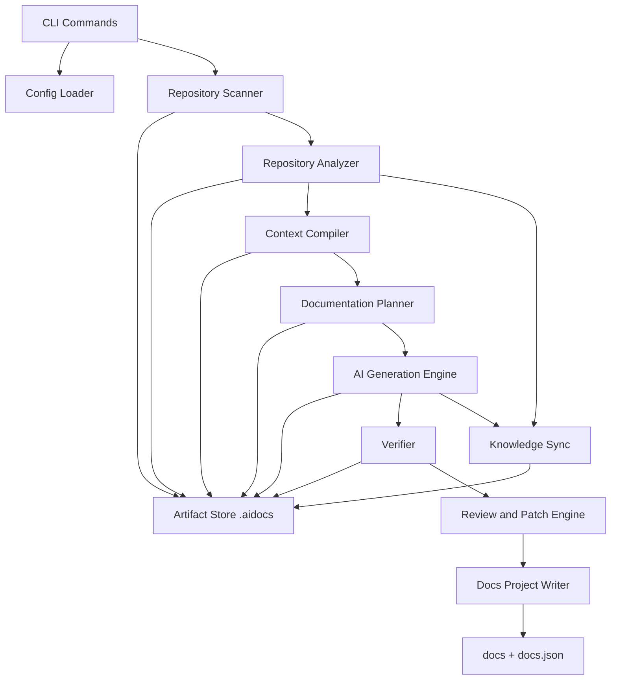
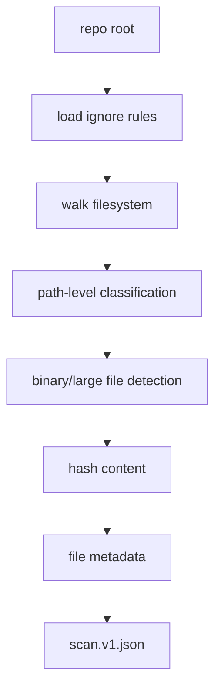
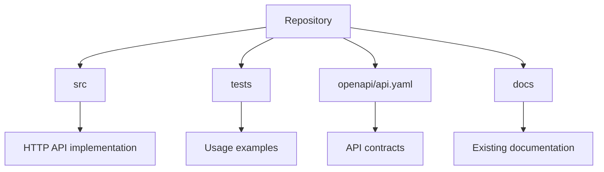
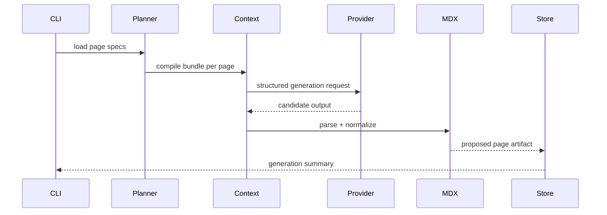
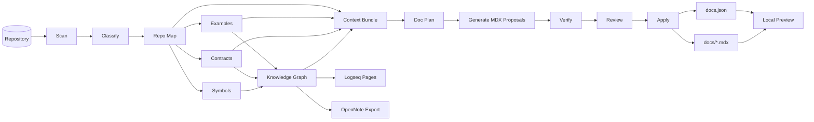

------
title: Build From Scratch: Mintlify-like AI-driven Documentation Generator CLI - Part 047
description: Build the minimal complete system end-to-end: repo scan, classification, repo map, symbols, contracts, examples, context bundles, documentation plan, generation, verification, review, docs output, and knowledge sync.
series: learn-ai-docs-km-cli
seriesTitle: Build From Scratch: Mintlify-like AI-driven Documentation Generator CLI with Code2Prompt and Open-source Knowledge Management
order: 47
partTitle: Capstone: Building the Minimal Complete System
tags:
- ai-docs
- documentation
- cli
- code2prompt
- knowledge-management
- logseq
- opennote
- mdx
- capstone
date: 2026-07-04
---

# Part 047 — Capstone: Building the Minimal Complete System

Pada titik ini kita sudah membangun hampir semua mental model: scanner, classifier, repo map, symbol extraction, contract discovery, context compiler, planner, MDX authoring, verification, review workflow, Mintlify-like publishing model, Logseq/OpenNote-compatible knowledge sink, provider abstraction, plugin system, storage model, CI, security, dan governance.

Part ini menyatukan semuanya menjadi **minimal complete system**.

Bukan toy CLI.

Bukan wrapper LLM.

Bukan script yang hanya membaca `README.md` lalu meminta model menulis ulang.

Yang kita bangun di sini adalah sistem kecil tetapi utuh:

1. bisa membaca repo,
2. bisa memahami struktur repo secara cukup baik,
3. bisa memilih context secara explainable,
4. bisa membuat rencana dokumentasi,
5. bisa menghasilkan MDX yang source-grounded,
6. bisa memverifikasi output,
7. bisa menyiapkan review patch,
8. bisa menghasilkan struktur docs Mintlify-like,
9. bisa menyinkronkan knowledge graph ke Logseq/OpenNote-compatible output,
10. bisa dijalankan ulang secara incremental.

Targetnya bukan menyelesaikan semua edge case enterprise. Targetnya adalah **sistem minimum yang benar secara arsitektural**.

---

## 1. Bentuk Akhir Minimal Complete System

Kita akan membangun CLI bernama sementara:

```bash
adoc
```

Command minimum:

```bash
adoc init
adoc scan
adoc map
adoc symbols
adoc contracts
adoc examples
adoc context
adoc plan
adoc generate
adoc verify
adoc review
adoc apply
adoc km sync
adoc preview
adoc doctor
```

Sistem ini menghasilkan project layout seperti berikut:

```txt
my-project/
├── src/
├── tests/
├── openapi/
│   └── api.yaml
├── docs/
│   ├── index.mdx
│   ├── quickstart.mdx
│   ├── concepts/
│   ├── guides/
│   ├── api-reference/
│   └── architecture/
├── docs.json
├── aidocs.config.yaml
├── .aidocsignore
└── .aidocs/
    ├── current/
    │   ├── scan.v1.json
    │   ├── classification.v1.json
    │   ├── repo-map.v1.json
    │   ├── symbols.v1.json
    │   ├── contracts.v1.json
    │   ├── examples.v1.json
    │   ├── graph.v1.json
    │   ├── doc-plan.v1.json
    │   ├── review-plan.v1.json
    │   ├── verification-report.v1.json
    │   └── sync-state.v1.json
    ├── prompts/
    ├── responses/
    ├── patches/
    ├── km/
    │   ├── logseq/
    │   └── opennote-export/
    ├── cache/
    └── runs/
```

Mental model penting:

> `docs/**` dan `docs.json` adalah output manusia bisa baca. `.aidocs/**` adalah ledger sistem agar output tersebut bisa dijelaskan, direproduksi, diverifikasi, dan direview.

---

## 2. Minimal Architecture

Sistem minimum punya 9 komponen.



Boundary-nya jelas:

| Layer | Tanggung Jawab | Tidak Boleh Melakukan |
|---|---|---|
| CLI | Parse command, output UX, exit code | Memuat business logic berat |
| Config | Resolve config final | Membaca source code secara langsung |
| Scanner | Membaca filesystem dan Git metadata | Menafsirkan arsitektur |
| Analyzer | Klasifikasi, symbol, contract, graph | Memanggil LLM |
| Context compiler | Membuat prompt bundle deterministic | Menulis docs langsung |
| Planner | Membuat rencana halaman | Menghasilkan final MDX |
| Generator | Memanggil provider LLM | Apply patch otomatis tanpa review |
| Verifier | Validasi docs | Mengarang perbaikan tanpa source |
| Review engine | Patch, diff, approval | Mengubah source tanpa policy |
| Publisher | Menulis docs project | Menentukan kebenaran klaim |
| KM sync | Export/import knowledge | Mengalahkan source code sebagai authority |

Rule desain:

> Setiap layer boleh gagal secara eksplisit. Tidak boleh gagal diam-diam lalu menghasilkan dokumentasi yang terlihat benar.

---

## 3. Project Skeleton

Implementasi bisa memakai bahasa apa pun. Karena seri ini untuk engineer yang nyaman dengan Java/Node/Go/Rust, kita gunakan desain yang portable.

Contoh skeleton TypeScript/Node karena cepat untuk CLI dan MDX tooling:

```txt
adoc/
├── package.json
├── tsconfig.json
├── src/
│   ├── main.ts
│   ├── cli/
│   │   ├── commands.ts
│   │   ├── output.ts
│   │   └── exit-codes.ts
│   ├── config/
│   │   ├── config-loader.ts
│   │   ├── schema.ts
│   │   └── resolver.ts
│   ├── domain/
│   │   ├── artifact.ts
│   │   ├── source-ref.ts
│   │   ├── diagnostic.ts
│   │   ├── page-spec.ts
│   │   └── review.ts
│   ├── scanner/
│   ├── analyzer/
│   │   ├── classifier.ts
│   │   ├── repo-map.ts
│   │   ├── symbols.ts
│   │   ├── contracts.ts
│   │   ├── examples.ts
│   │   └── graph.ts
│   ├── context/
│   │   ├── context-unit.ts
│   │   ├── ranker.ts
│   │   ├── packer.ts
│   │   └── renderer.ts
│   ├── planner/
│   ├── generator/
│   │   ├── provider.ts
│   │   ├── fake-provider.ts
│   │   ├── openai-provider.ts
│   │   └── structured-output.ts
│   ├── mdx/
│   │   ├── authoring.ts
│   │   ├── frontmatter.ts
│   │   ├── regions.ts
│   │   └── links.ts
│   ├── verifier/
│   ├── review/
│   ├── publisher/
│   ├── km/
│   │   ├── graph-projector.ts
│   │   ├── logseq-sink.ts
│   │   └── opennote-sink.ts
│   └── store/
│       ├── artifact-store.ts
│       ├── hashing.ts
│       └── run-manifest.ts
└── test/
```

Kalau memakai Go/Rust/Java, strukturnya tetap sama. Yang penting adalah boundary, bukan framework.

---

## 4. Minimal Domain Model

Sistem ini akan kacau kalau langsung dimulai dari command implementation. Mulai dari domain model.

### 4.1 SourceRef

Semua klaim, contoh, symbol, contract, dan page harus bisa menunjuk balik ke source.

```ts
export type SourceRef = {
  repoRoot: string;
  path: string;
  startLine?: number;
  endLine?: number;
  hash: string;
  kind: "file" | "range" | "symbol" | "contract" | "example";
};
```

Invariant:

- `path` harus relative dari repo root.
- `hash` harus berasal dari content yang dikutip atau file yang menjadi dasar.
- Untuk generated docs, source ref kosong hanya boleh untuk kalimat transisional, bukan klaim behavior.

### 4.2 Diagnostic

Semua stage mengeluarkan diagnostic.

```ts
export type DiagnosticLevel = "info" | "warning" | "error" | "fatal";

export type Diagnostic = {
  code: string;
  level: DiagnosticLevel;
  message: string;
  path?: string;
  sourceRef?: SourceRef;
  stage: string;
  remediation?: string;
};
```

Contoh:

```json
{
  "code": "CONTEXT_OMITTED_HIGH_AUTHORITY_FILE",
  "level": "warning",
  "stage": "context",
  "path": "openapi/api.yaml",
  "message": "High authority API contract was not included in prompt bundle due to token budget.",
  "remediation": "Increase context.maxTokens or generate delegated OpenAPI docs."
}
```

### 4.3 Artifact Envelope

Semua artifact `.aidocs/current/*.json` memakai envelope.

```ts
export type ArtifactEnvelope<T> = {
  schema: string;
  version: number;
  runId: string;
  generatedAt: string;
  repo: {
    root: string;
    headSha?: string;
    dirty: boolean;
  };
  inputHashes: Record<string, string>;
  diagnostics: Diagnostic[];
  data: T;
};
```

Kenapa pakai envelope?

Karena artifact bukan sekadar JSON data. Artifact adalah bukti bahwa stage tertentu berjalan dengan input tertentu, pada repo state tertentu, dengan diagnostic tertentu.

---

## 5. `adoc init`

`init` membuat project docs tanpa memaksa user memahami seluruh sistem.

Command:

```bash
adoc init
```

Output minimum:

```txt
Created:
  aidocs.config.yaml
  .aidocsignore
  docs/index.mdx
  docs.json
  .aidocs/

Next:
  adoc scan
  adoc plan
  adoc generate --dry-run
```

### 5.1 `aidocs.config.yaml`

Minimal config:

```yaml
project:
  name: my-project
  visibility: internal

scan:
  include:
    - "src/**"
    - "tests/**"
    - "openapi/**"
    - "README.md"
    - "package.json"
    - "pom.xml"
    - "build.gradle"
  exclude:
    - "node_modules/**"
    - "target/**"
    - "dist/**"
    - "build/**"
    - ".git/**"

context:
  maxInputTokens: 120000
  includeTests: true
  includeExamples: true
  includeContracts: true

llm:
  provider: fake
  model: fake-doc-writer
  temperature: 0

output:
  docsDir: docs
  configFile: docs.json
  format: mdx

verification:
  failOnUngroundedClaims: true
  failOnBrokenLinks: true
  failOnInvalidFrontmatter: true

review:
  mode: patch
  requireHumanApply: true

knowledge:
  logseq:
    enabled: true
    outputDir: .aidocs/km/logseq
  opennote:
    enabled: true
    outputDir: .aidocs/km/opennote-export
```

### 5.2 `.aidocsignore`

```gitignore
.git/**
node_modules/**
target/**
build/**
dist/**
coverage/**
*.lock
*.png
*.jpg
*.jpeg
*.gif
*.pdf
.env
.env.*
*.pem
*.key
```

Catatan: lock file tidak selalu harus diabaikan. Untuk package/dependency docs, lock file bisa berguna. Minimal system boleh mengabaikannya untuk menekan noise, tetapi production system harus bisa mengonfigurasi ini.

### 5.3 `docs.json`

Mintlify-like minimal config:

```json
{
  "$schema": "https://mintlify.com/docs.json",
  "theme": "mint",
  "name": "my-project",
  "navigation": {
    "groups": [
      {
        "group": "Getting Started",
        "pages": ["index"]
      }
    ]
  }
}
```

Mintlify modern memakai `docs.json` sebagai file konfigurasi global untuk navigation, appearance, integrations, dan lainnya. Dalam sistem kita, `docs.json` adalah target kompatibilitas, bukan hard dependency ke platform tertentu.

---

## 6. `adoc scan`

Scanner menghasilkan `scan.v1.json`.

Pipeline minimum:



Minimal record:

```ts
export type ScannedFile = {
  path: string;
  sizeBytes: number;
  extension?: string;
  detectedLanguage?: string;
  contentHash: string;
  isBinary: boolean;
  isGeneratedCandidate: boolean;
  ignored: boolean;
  ignoreReason?: string;
  modifiedTime?: string;
};
```

Rules:

- Jangan baca file binary sebagai text.
- Jangan masukkan file terlalu besar tanpa sampling policy.
- Jangan ikuti symlink tanpa policy.
- Jangan mengirim content ke LLM di stage scan.
- Jangan menghapus file user.

Pseudo-code:

```ts
async function scanRepo(root: string, config: ResolvedConfig): Promise<ScanArtifact> {
  const ignore = await loadIgnoreRules(root, config.scan);
  const files: ScannedFile[] = [];

  for await (const entry of walk(root)) {
    const rel = relative(root, entry.path);

    if (ignore.matches(rel)) {
      files.push({
        path: rel,
        sizeBytes: entry.size,
        contentHash: "",
        isBinary: false,
        isGeneratedCandidate: false,
        ignored: true,
        ignoreReason: "ignore-rule"
      });
      continue;
    }

    if (!entry.isFile) continue;

    const sample = await readSample(entry.path, 8192);
    const binary = looksBinary(sample);
    const hash = binary ? await hashFile(entry.path) : await hashTextFile(entry.path);

    files.push({
      path: rel,
      sizeBytes: entry.size,
      extension: extname(rel),
      detectedLanguage: detectLanguage(rel, sample),
      contentHash: hash,
      isBinary: binary,
      isGeneratedCandidate: looksGenerated(rel, sample),
      ignored: false
    });
  }

  return artifact("scan.v1", { files });
}
```

---

## 7. `adoc map`

`map` mengubah hasil scan menjadi repository map.

Scanner menjawab: “file apa saja yang ada?”

Repo map menjawab: “bentuk sistem ini seperti apa?”

Minimal `repo-map.v1.json`:

```ts
export type RepoMap = {
  rootKind: "single-package" | "monorepo" | "unknown";
  workspaces: Workspace[];
  directories: DirectoryNode[];
  entrypoints: Entrypoint[];
  docsRoots: string[];
  contractRoots: string[];
  testRoots: string[];
  buildFiles: string[];
};
```

Example output:

```json
{
  "rootKind": "single-package",
  "workspaces": [
    {
      "id": "root",
      "root": ".",
      "languages": ["typescript"],
      "frameworks": ["express"],
      "buildFiles": ["package.json"],
      "sourceRoots": ["src"],
      "testRoots": ["tests"],
      "contractRoots": ["openapi"]
    }
  ],
  "entrypoints": [
    {
      "kind": "http-server",
      "path": "src/server.ts",
      "confidence": 0.82
    }
  ]
}
```

Minimal heuristics:

| Signal | Meaning |
|---|---|
| `package.json` | Node/TypeScript/JavaScript project |
| `pom.xml` | Maven/Java project |
| `build.gradle` | Gradle/JVM project |
| `go.mod` | Go module |
| `Cargo.toml` | Rust crate/workspace |
| `openapi.yaml` | API contract root |
| `proto/**/*.proto` | Protobuf contract root |
| `src/**` | likely implementation |
| `test/**`, `tests/**`, `__tests__/**` | tests/examples source |
| `docs/**` | docs source |

Mermaid output for human:



---

## 8. `adoc symbols`

Minimal symbol extraction tidak perlu perfect. Ia harus cukup membantu planner dan context compiler.

Symbol types:

```ts
export type SymbolKind =
  | "class"
  | "interface"
  | "function"
  | "method"
  | "endpoint"
  | "command"
  | "config-key"
  | "schema"
  | "event"
  | "database-table";
```

Symbol record:

```ts
export type SymbolRecord = {
  id: string;
  kind: SymbolKind;
  name: string;
  path: string;
  sourceRef: SourceRef;
  exported: boolean;
  visibility: "public" | "internal" | "private" | "unknown";
  confidence: number;
  relations: SymbolRelation[];
};
```

Minimal extractor strategy:

1. Manifest extractor.
2. Contract extractor.
3. Regex extractor.
4. Optional AST extractor.

For capstone, implement the first three.

Example regex extractor for TypeScript functions:

```ts
const functionPattern = /export\s+(async\s+)?function\s+([A-Za-z0-9_]+)/g;

function extractTsFunctions(path: string, text: string): SymbolRecord[] {
  const records: SymbolRecord[] = [];
  for (const match of text.matchAll(functionPattern)) {
    const name = match[2];
    const line = lineOfOffset(text, match.index ?? 0);
    records.push({
      id: stableId("symbol", path, name, line),
      kind: "function",
      name,
      path,
      sourceRef: rangeRef(path, text, line, line),
      exported: true,
      visibility: "public",
      confidence: 0.72,
      relations: []
    });
  }
  return records;
}
```

Production system boleh memakai Tree-sitter. Capstone minimal boleh mulai dari heuristic, asal setiap hasil punya `confidence` dan `sourceRef`.

---

## 9. `adoc contracts`

Contract discovery mencari interface formal sistem.

Minimal support:

- OpenAPI YAML/JSON,
- package scripts as CLI commands,
- config keys from known config files,
- environment variables from `.env.example` or schema file,
- simple route detection from source.

Contract model:

```ts
export type ContractRecord = {
  id: string;
  kind: "openapi-operation" | "cli-command" | "config-key" | "event" | "schema";
  name: string;
  sourceRef: SourceRef;
  visibility: "public" | "internal" | "private" | "unknown";
  authority: "canonical" | "derived" | "inferred";
  confidence: number;
  data: unknown;
};
```

OpenAPI operation extraction:

```ts
function extractOpenApiOperations(specPath: string, spec: any): ContractRecord[] {
  const operations: ContractRecord[] = [];
  for (const [pathTemplate, pathItem] of Object.entries<any>(spec.paths ?? {})) {
    for (const method of ["get", "post", "put", "patch", "delete"]) {
      const op = pathItem[method];
      if (!op) continue;

      operations.push({
        id: stableId("openapi-operation", method, pathTemplate, op.operationId ?? ""),
        kind: "openapi-operation",
        name: op.operationId ?? `${method.toUpperCase()} ${pathTemplate}`,
        sourceRef: fileRef(specPath),
        visibility: "public",
        authority: "canonical",
        confidence: 0.95,
        data: {
          method: method.toUpperCase(),
          path: pathTemplate,
          summary: op.summary,
          tags: op.tags ?? [],
          operationId: op.operationId
        }
      });
    }
  }
  return operations;
}
```

Important invariant:

> Contract file beats source inference for public API docs. Source inference helps detect drift and implementation gaps, but canonical API behavior should come from the contract when a contract exists.

---

## 10. `adoc examples`

Example mining mengambil evidence dari tests dan examples.

Minimal example model:

```ts
export type UsageExample = {
  id: string;
  kind: "http" | "cli" | "sdk" | "config" | "event";
  title: string;
  sourceRef: SourceRef;
  targetContractIds: string[];
  snippet: string;
  language: string;
  confidence: number;
  redactionApplied: boolean;
};
```

Example ranking:

```ts
function scoreExample(example: UsageExample): number {
  let score = 0;

  if (example.sourceRef.path.includes("test")) score += 20;
  if (example.sourceRef.path.includes("example")) score += 20;
  if (example.targetContractIds.length > 0) score += 30;
  if (example.redactionApplied) score -= 5;
  if (example.snippet.length > 2000) score -= 10;

  return score + example.confidence * 30;
}
```

Bad example:

```mdx
To create a user, send some data to the API.
```

Good example:

````mdx
```bash
curl -X POST http://localhost:3000/users \
  -H 'Content-Type: application/json' \
  -d '{"email":"dev@example.com","name":"Dev User"}'
```
````

Even better if source-grounded:

```txt
Source: tests/users/create-user.test.ts:18-42
Contract: POST /users
Verified: request body matches OpenAPI schema
```

---

## 11. `adoc context`

Context compiler menyusun prompt bundle.

Input:

- `scan.v1.json`,
- `classification.v1.json`,
- `repo-map.v1.json`,
- `symbols.v1.json`,
- `contracts.v1.json`,
- `examples.v1.json`,
- existing docs,
- page/task request.

Output:

```txt
.aidocs/prompts/<bundle-id>.prompt.md
.aidocs/prompts/<bundle-id>.prompt-bundle.v1.json
```

Prompt bundle schema simplified:

```ts
export type PromptBundle = {
  id: string;
  task: {
    kind: "plan-docs" | "generate-page" | "repair-page";
    targetPage?: string;
  };
  budget: {
    maxInputTokens: number;
    estimatedInputTokens: number;
  };
  contextUnits: ContextUnit[];
  outputContract: unknown;
  constraints: string[];
};
```

Context unit:

```ts
export type ContextUnit = {
  id: string;
  kind: "repo-map" | "file" | "symbol" | "contract" | "example" | "existing-doc" | "knowledge-note";
  title: string;
  sourceRefs: SourceRef[];
  authority: "canonical" | "strong" | "supporting" | "weak";
  relevance: number;
  content: string;
  estimatedTokens: number;
};
```

Rendering pattern:

```md
# Task
Generate the Quickstart page for this repository.

# Non-negotiable rules
- Do not invent commands, endpoints, environment variables, or behavior.
- Every behavior claim must be supported by provided source context.
- If information is missing, write a short "Known gaps" section.
- Output valid MDX only.

# Repository map
...

# Canonical contracts
...

# Relevant examples
...

# Existing docs
...

# Output contract
...
```

This is the Code2Prompt-style idea upgraded into a production artifact: source tree/context rendering, templating, and token accounting are explicit, but our system adds provenance, authority, page contracts, verification hooks, and review artifacts.

---

## 12. `adoc plan`

Planner creates `doc-plan.v1.json`.

Plan shape:

```ts
export type DocPlan = {
  pages: PagePlan[];
  navigation: NavigationPlan;
  operations: DocOperation[];
  diagnostics: Diagnostic[];
};

export type PagePlan = {
  id: string;
  path: string;
  title: string;
  kind: "overview" | "quickstart" | "concept" | "guide" | "api-reference" | "architecture" | "troubleshooting";
  owner: "generated" | "manual" | "hybrid";
  priority: number;
  sourceRefs: SourceRef[];
  requiredContracts: string[];
  requiredExamples: string[];
  status: "create" | "update" | "keep" | "review";
};
```

Minimal pages:

```txt
docs/index.mdx
docs/quickstart.mdx
docs/concepts/overview.mdx
docs/guides/configuration.mdx
docs/api-reference/overview.mdx
docs/architecture/system-overview.mdx
docs/troubleshooting/common-issues.mdx
```

Navigation generated:

```json
{
  "groups": [
    {
      "group": "Getting Started",
      "pages": ["index", "quickstart"]
    },
    {
      "group": "Concepts",
      "pages": ["concepts/overview"]
    },
    {
      "group": "Guides",
      "pages": ["guides/configuration"]
    },
    {
      "group": "API Reference",
      "pages": ["api-reference/overview"]
    },
    {
      "group": "Architecture",
      "pages": ["architecture/system-overview"]
    },
    {
      "group": "Operations",
      "pages": ["troubleshooting/common-issues"]
    }
  ]
}
```

Planner rule:

> The planner does not write final prose. It creates a bounded set of page contracts.

---

## 13. `adoc generate`

Generation converts page specs into proposed MDX files.



Generation output does **not** directly overwrite docs by default.

It writes proposals:

```txt
.aidocs/patches/run-20260704-001/
├── docs/index.mdx.proposed
├── docs/quickstart.mdx.proposed
├── docs/concepts/overview.mdx.proposed
├── docs/guides/configuration.mdx.proposed
├── docs/api-reference/overview.mdx.proposed
├── docs/architecture/system-overview.mdx.proposed
└── docs/troubleshooting/common-issues.mdx.proposed
```

Minimum fake provider for tests:

```ts
export class FakeProvider implements LlmProvider {
  async generate(request: LlmRequest): Promise<LlmResult> {
    const page = request.metadata?.targetPage ?? "unknown";
    return {
      id: stableId("fake-response", page, request.promptHash),
      model: "fake-doc-writer",
      text: fakeMdxForPage(page, request),
      usage: {
        inputTokens: request.estimatedInputTokens,
        outputTokens: 1200
      },
      finishReason: "stop"
    };
  }
}
```

Why fake provider matters:

- unit tests become deterministic,
- CI can test pipeline without spending model budget,
- review workflow can be developed before provider integration,
- verifier can be hardened against known bad output.

### 13.1 Generated MDX Region Policy

Generated page should include regions:

```mdx
------
title: Quickstart
description: Get started with this project.
---

<!-- aidocs:generated:start id="quickstart-intro" source="page-spec:quickstart" -->
# Quickstart

This page shows the fastest source-backed path to run the project locally.
<!-- aidocs:generated:end -->

<!-- aidocs:manual:start id="team-notes" -->
<!-- Add team-specific notes here. This region is preserved by adoc. -->
<!-- aidocs:manual:end -->
```

Rule:

> The generator owns generated regions. Humans own manual regions. Hybrid pages can contain both.

---

## 14. `adoc verify`

Verifier checks proposed docs before apply.

Minimum verifier rules:

| Rule | Purpose |
|---|---|
| `MDX_PARSE` | Output is syntactically valid enough for build |
| `FRONTMATTER_REQUIRED` | Required frontmatter exists |
| `NO_UNSUPPORTED_COMPONENTS` | MDX cannot execute arbitrary JSX |
| `INTERNAL_LINK_EXISTS` | Internal docs links resolve |
| `SOURCE_REF_VALID` | Provenance references exist |
| `NO_UNGROUNDED_BEHAVIOR_CLAIM` | Behavior claims need evidence |
| `CODE_FENCE_LANGUAGE` | Code fences have language labels |
| `MERMAID_PARSE` | Mermaid diagrams parse |
| `EXAMPLE_MATCHES_CONTRACT` | HTTP examples match OpenAPI where available |
| `SECRET_NOT_PRESENT` | Output does not expose detected secrets |

Verification report:

```json
{
  "summary": {
    "status": "failed",
    "pagesChecked": 7,
    "errors": 2,
    "warnings": 5
  },
  "findings": [
    {
      "rule": "NO_UNGROUNDED_BEHAVIOR_CLAIM",
      "level": "error",
      "path": "docs/quickstart.mdx",
      "message": "Claim mentions Docker Compose, but no compose file or run script was found.",
      "suggestion": "Remove the claim or cite an existing source file."
    }
  ]
}
```

Fail closed policy:

```bash
adoc verify --strict
```

Should fail on:

- invalid MDX,
- broken internal links,
- leaked secrets,
- ungrounded behavior claims,
- invalid navigation,
- invalid generated region boundaries.

---

## 15. `adoc review`

Review mode gives developer a diff-first workflow.

Command:

```bash
adoc review
```

Output:

```txt
Review proposals:

CREATE docs/quickstart.mdx
  status: verification passed
  sources: package.json, README.md, tests/startup.test.ts
  risk: low

UPDATE docs/index.mdx
  status: warning
  warning: 1 unverified conceptual claim

CREATE docs/architecture/system-overview.mdx
  status: needs review
  warning: inferred component relation with confidence 0.61

Run:
  adoc review --page docs/quickstart.mdx
  adoc apply --page docs/quickstart.mdx
```

Review artifact:

```ts
export type ReviewItem = {
  id: string;
  targetPath: string;
  operation: "create" | "update" | "delete";
  proposedPath: string;
  verificationStatus: "passed" | "warning" | "failed";
  risk: "low" | "medium" | "high";
  owner?: string;
  sourceRefs: SourceRef[];
  decision?: "pending" | "accepted" | "rejected" | "needs-repair";
};
```

No silent apply.

This is critical.

An AI docs tool that overwrites human docs without review will eventually destroy trust.

---

## 16. `adoc apply`

Apply copies accepted proposals into `docs/**` and updates `docs.json`.

Command examples:

```bash
adoc apply --page docs/quickstart.mdx
adoc apply --all --only-passed
adoc apply --all --allow-warnings
```

Rules:

- Failed verification cannot be applied unless `--force` and policy allows it.
- Manual regions are preserved.
- Existing files are patched, not blindly replaced.
- `docs.json` changes are separated from page changes.
- Apply writes an audit record.

Apply manifest:

```json
{
  "appliedAt": "2026-07-04T10:00:00+07:00",
  "runId": "run-20260704-001",
  "items": [
    {
      "path": "docs/quickstart.mdx",
      "operation": "create",
      "verificationStatus": "passed"
    }
  ]
}
```

---

## 17. `adoc km sync`

Knowledge sync exports codebase knowledge into Logseq/OpenNote-compatible outputs.

Command:

```bash
adoc km sync
```

Minimum generated Logseq layout:

```txt
.aidocs/km/logseq/
├── pages/
│   ├── Project___my-project.md
│   ├── Module___src-api.md
│   ├── API Endpoint___POST_users.md
│   ├── Concept___Authentication.md
│   └── Runbook___Common Issues.md
├── journals/
│   └── 2026_07_04.md
└── assets/
```

Example Logseq page:

```md
# API Endpoint: POST /users

- type:: [[API Endpoint]]
- project:: [[Project/my-project]]
- visibility:: public
- authority:: canonical
- source:: openapi/api.yaml
- confidence:: 0.95

## Summary

- Creates a user resource.

## Related

- implemented-by:: [[Module/src-api]]
- documented-by:: [[docs/api-reference/overview]]
- tested-by:: tests/users/create-user.test.ts

<!-- aidocs:generated:start id="relations" -->
- consumes:: [[Schema/CreateUserRequest]]
- returns:: [[Schema/UserResponse]]
<!-- aidocs:generated:end -->
```

OpenNote-compatible export:

```txt
.aidocs/km/opennote-export/
├── manifest.json
├── notes.jsonl
├── chunks.jsonl
├── relations.jsonl
└── embeddings.jsonl
```

Example note record:

```json
{
  "id": "note:api-endpoint:post-users",
  "title": "API Endpoint: POST /users",
  "type": "api-endpoint",
  "bodyMarkdown": "Creates a user resource...",
  "sourceRefs": [
    {
      "path": "openapi/api.yaml",
      "kind": "file"
    }
  ],
  "relations": [
    {
      "type": "implemented-by",
      "targetId": "module:src-api"
    }
  ]
}
```

Invariant:

> KM sync should not make notes more authoritative than source. Notes help retrieval and reasoning; they do not override contracts/code.

---

## 18. `adoc preview`

Minimal preview does not need a full production docs platform.

It needs:

- route index,
- MDX parse check,
- static HTML render or simple Markdown preview,
- link checking,
- diagnostics panel,
- local search optional.

Command:

```bash
adoc preview
```

Output:

```txt
Preview running:
  http://localhost:4173

Loaded:
  7 docs pages
  1 docs.json
  0 broken links
  2 warnings
```

Preview UX should show:

- page content,
- navigation,
- warnings,
- source refs,
- generated/manual region boundaries,
- last verification status.

Do not hide warnings behind terminal noise.

The developer feedback loop matters more than visual polish at this stage.

---

## 19. End-to-End Walkthrough

Assume repository:

```txt
sample-api/
├── package.json
├── src/
│   ├── server.ts
│   ├── routes/users.ts
│   └── config.ts
├── tests/
│   └── users.test.ts
├── openapi/
│   └── api.yaml
└── README.md
```

Run:

```bash
adoc init
adoc scan
adoc map
adoc symbols
adoc contracts
adoc examples
adoc plan
adoc generate --dry-run
adoc verify
adoc review
adoc apply --all --only-passed
adoc km sync
adoc preview
```

Expected artifacts:

```txt
.aidocs/current/scan.v1.json
.aidocs/current/repo-map.v1.json
.aidocs/current/symbols.v1.json
.aidocs/current/contracts.v1.json
.aidocs/current/examples.v1.json
.aidocs/current/doc-plan.v1.json
.aidocs/current/verification-report.v1.json
.aidocs/km/logseq/pages/*.md
.aidocs/km/opennote-export/*.jsonl
docs/index.mdx
docs/quickstart.mdx
docs/api-reference/overview.mdx
docs/architecture/system-overview.mdx
docs.json
```

Expected developer experience:

```txt
✓ Scanned 64 files
✓ Classified 51 documentable files
✓ Found 18 symbols
✓ Found 7 API operations
✓ Mined 5 usage examples
✓ Planned 7 docs pages
✓ Generated 7 proposals
✓ Verified 6 passed, 1 warning
✓ Applied 6 pages
✓ Synced 22 knowledge nodes
✓ Preview available at http://localhost:4173
```

---

## 20. Minimal Test Matrix

Do not ship even the capstone without tests.

### 20.1 Scanner tests

- ignores `.git/**`,
- ignores binary files,
- detects generated files,
- hashes content consistently,
- handles empty repo,
- handles symlink according to policy.

### 20.2 Classifier tests

- detects source files,
- detects tests,
- detects contracts,
- detects existing docs,
- detects generated artifacts,
- explains classification.

### 20.3 Context tests

- includes canonical contracts for API docs,
- includes examples for quickstart,
- omits low-value files under budget,
- emits diagnostics when critical context omitted,
- deterministic rendering for same input.

### 20.4 Planner tests

- creates expected page set for sample API,
- does not duplicate existing pages,
- generates stable navigation,
- creates missing landing pages.

### 20.5 Generator tests

- fake provider returns stable output,
- provider output parsed as MDX,
- invalid structured output is rejected,
- generated/manual regions preserved.

### 20.6 Verifier tests

- catches invalid MDX,
- catches broken links,
- catches missing frontmatter,
- catches leaked secret fixture,
- catches unsupported JSX,
- catches ungrounded claim fixture.

### 20.7 Apply tests

- creates new file,
- patches generated region only,
- preserves manual region,
- refuses failed proposal,
- updates docs.json atomically.

### 20.8 KM sync tests

- generates Logseq-compatible Markdown page,
- generates OpenNote-compatible JSONL records,
- preserves stable IDs,
- handles deleted nodes with tombstones,
- avoids exporting private nodes to public sink.

---

## 21. Minimal Failure Scenarios to Simulate

A top-tier engineer does not only implement happy path. Simulate failure.

### 21.1 Missing OpenAPI file

Expected behavior:

- scanner succeeds,
- contracts stage warns,
- planner creates narrative docs but not delegated API reference,
- generator writes known gap,
- verifier does not fail unless policy requires API contract.

### 21.2 Huge repository

Expected behavior:

- scanner succeeds,
- context compiler packs selected files only,
- omitted high-authority files produce diagnostics,
- planner can still generate partial docs,
- CLI tells user what was skipped.

### 21.3 Secret in test fixture

Expected behavior:

- preflight detects secret,
- context compiler redacts or blocks,
- generated docs do not include secret,
- security report records finding.

### 21.4 Existing human docs

Expected behavior:

- planner marks existing docs as update/keep/review,
- generator writes proposal only,
- manual regions preserved,
- review diff is clear.

### 21.5 Hallucinated provider output

Expected behavior:

- verifier flags ungrounded claims,
- failed pages not applied,
- repair mode can ask provider to remove unsupported claims,
- audit trail records failure.

---

## 22. Minimal Quality Bar

The capstone is complete only when these commands work together:

```bash
adoc init
adoc scan
adoc map
adoc symbols
adoc contracts
adoc examples
adoc context --page docs/quickstart.mdx
adoc plan
adoc generate --dry-run
adoc verify
adoc review
adoc apply --all --only-passed
adoc km sync
adoc preview
```

And these invariants hold:

1. Every generated page has provenance.
2. Every page proposal is verifiable before apply.
3. Human-owned regions are not overwritten.
4. Navigation is deterministic.
5. Context bundles are inspectable.
6. Secrets are not sent to provider by default.
7. KM notes are derived from source-backed graph.
8. Failed verification blocks apply unless explicitly overridden.
9. Re-running the same input produces stable artifacts.
10. The system can explain why it generated, skipped, or warned.

---

## 23. What We Deliberately Do Not Build Yet

Minimal complete does not mean complete enterprise system.

Not required yet:

- full AST support for every language,
- perfect semantic retrieval,
- hosted docs platform,
- multi-tenant SaaS control plane,
- enterprise RBAC,
- collaborative web UI,
- live PR bot,
- all Mintlify component compatibility,
- full OpenAPI playground implementation,
- production-grade embedding pipeline,
- deep runtime tracing integration.

These come in production hardening.

The key is that the minimal system already has the right shape.

---

## 24. Final Capstone Diagram



This is the smallest version of the real product.

---

## 25. Part 047 Completion Checklist

You understand this part if you can explain:

- why scanner and analyzer must be separate,
- why context bundle is an artifact,
- why planner must exist before generator,
- why generation should produce proposals, not overwrite docs,
- why verifier must run before apply,
- why KM sync must not outrank source code,
- why fake provider is mandatory for tests,
- why stable IDs and hashes are more important than clever prompts,
- why minimal complete system must have `review` and `apply`, not only `generate`.

You can implement this part if you can build:

- `adoc init`,
- `adoc scan`,
- `adoc plan`,
- `adoc generate --dry-run`,
- `adoc verify`,
- `adoc apply`,
- and prove generated docs are source-grounded.

That is enough to call the capstone minimal but complete.

Next part is the final part of the series: production readiness, operating model, and final capstone hardening.

---

## References

- Code2Prompt: https://code2prompt.dev/
- Code2Prompt GitHub: https://github.com/mufeedvh/code2prompt
- Mintlify global settings and `docs.json`: https://www.mintlify.com/docs/organize/settings
- Mintlify navigation: https://www.mintlify.com/docs/organize/navigation
- Mintlify OpenAPI setup: https://www.mintlify.com/docs/api-playground/openapi-setup
- Logseq GitHub: https://github.com/logseq/logseq
- OpenNote GitHub: https://github.com/opennote-org/opennote
