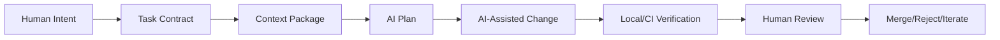
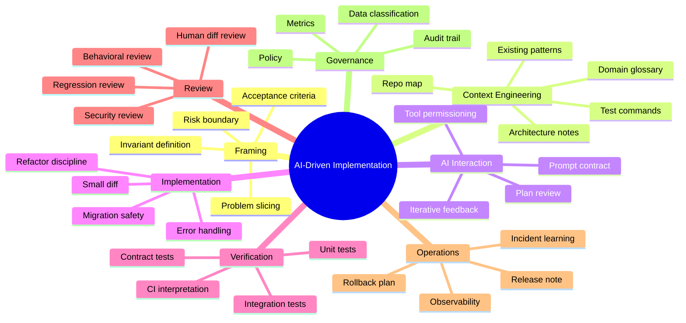
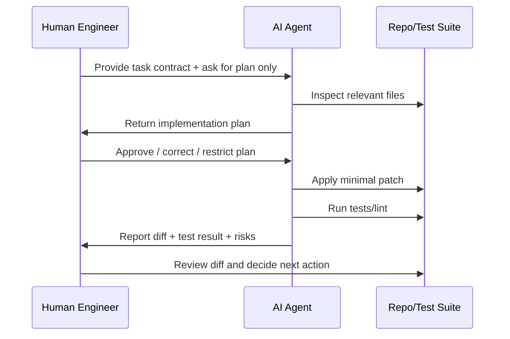
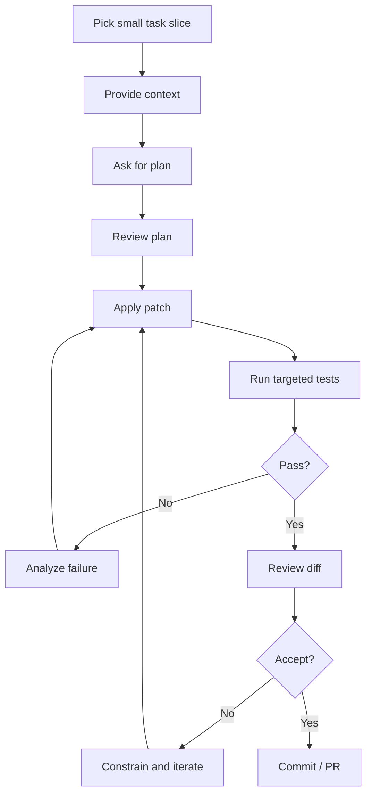
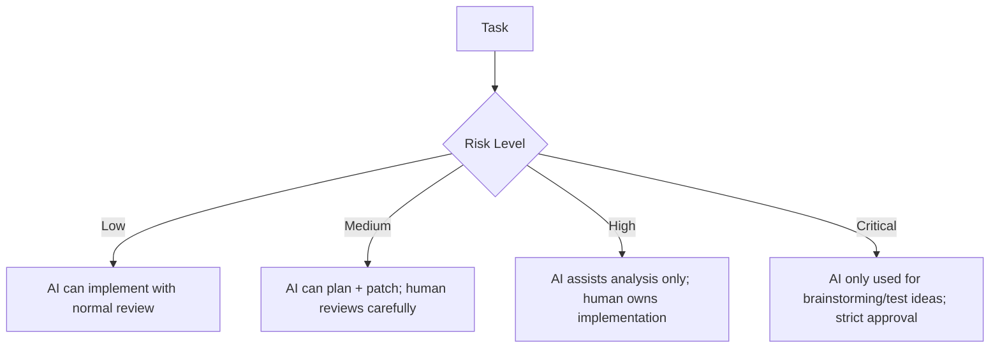
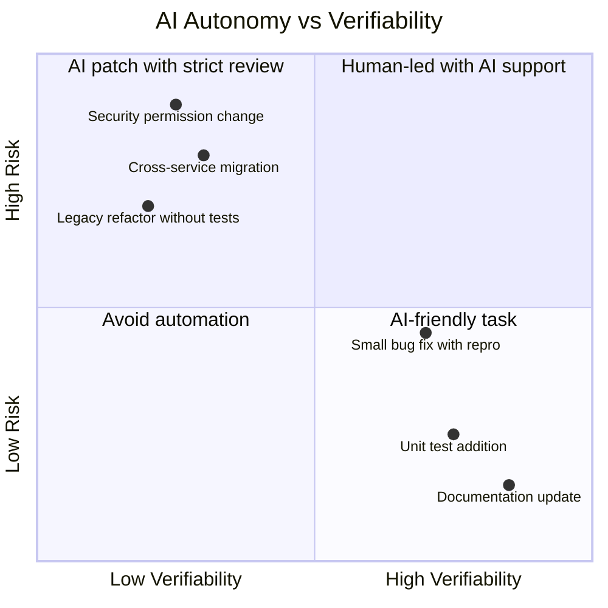

------
title: Learn AI Development Driven Implementation and Usage - Part 001
description: Kaufman Skill Map untuk menguasai AI-driven implementation secara praktis, defensible, dan terukur bagi software engineer senior.
series: learn-ai-development-driven-implementation-usage
seriesTitle: Learn AI Development Driven Implementation and Usage
order: 1
partTitle: Kaufman Skill Map
tags:
- ai
- software-engineering
- ai-driven-development
- implementation
- kaufman
- engineering-handbook
date: 2026-06-30
---

# Part 001 — Kaufman Skill Map

## 1. Tujuan Part Ini

Part ini adalah fondasi seluruh seri. Kita belum membahas tool tertentu secara dalam. Fokusnya adalah membangun **peta keterampilan** supaya AI tidak dipakai sebagai gimmick, autocomplete mahal, atau “junior developer yang selalu benar”.

Target kita lebih ketat:

> Menjadikan AI sebagai bagian dari sistem kerja implementasi software yang cepat, aman, reviewable, reproducible, dan tetap berada di bawah akuntabilitas engineer manusia.

Dalam konteks software engineering profesional, AI-driven implementation bukan berarti:

- menyerahkan requirement mentah lalu berharap AI menghasilkan sistem production-ready;
- menerima diff tanpa memahami konsekuensi;
- mengganti proses engineering dengan prompt panjang;
- mengukur produktivitas dari jumlah baris kode yang dibuat;
- memperlakukan output AI sebagai truth source.

AI-driven implementation berarti:

- engineer mampu menerjemahkan intent menjadi task contract yang jelas;
- AI diberi konteks yang cukup, batas yang jelas, dan feedback loop yang pendek;
- perubahan dibatasi menjadi unit yang bisa diuji, direview, dan di-rollback;
- manusia tetap bertanggung jawab atas design, correctness, security, dan delivery decision;
- organisasi memiliki operating model agar AI mempercepat flow tanpa menurunkan kualitas.

## 2. Framework Kaufman yang Kita Pakai

Josh Kaufman dalam *The First 20 Hours* mempopulerkan pendekatan rapid skill acquisition: pecah skill menjadi sub-skill kecil, pelajari cukup untuk dapat memperbaiki diri, singkirkan penghalang latihan, lalu lakukan latihan sengaja dengan jam terbatas namun intensif.

Untuk seri ini, framework tersebut kita adaptasi menjadi empat langkah engineering:

| Langkah Kaufman | Adaptasi untuk AI-driven implementation | Output Konkret |
|---|---|---|
| Deconstruct the skill | Pecah AI-driven development menjadi sub-skill delivery | Skill map, workflow taxonomy, risk model |
| Learn enough to self-correct | Pahami cukup teori, failure mode, dan signal kualitas | Checklist, rubric, test oracle, review pattern |
| Remove practice barriers | Siapkan repo, toolchain, sandbox, prompt template, test scripts | AI-readable repository dan workflow siap latihan |
| Practice deliberately | Latihan task realistis dengan feedback cepat | Diff kecil, PR review, CI, postmortem, improvement loop |

Kaufman bukan framework untuk “belajar semua teori dulu”. Justru kebalikannya: kita mencari **minimum useful theory** yang membuat latihan menjadi tajam.

Dalam domain AI-assisted software engineering, minimum useful theory mencakup:

- apa yang AI bisa dan tidak bisa lakukan;
- bagaimana model menggunakan konteks;
- bagaimana agent menjalankan tool;
- bagaimana error muncul dari ambiguity, stale context, missing invariant, atau permission yang terlalu luas;
- bagaimana membuat perubahan kecil yang mudah diverifikasi;
- bagaimana mengukur bahwa AI benar-benar mempercepat delivery, bukan sekadar menghasilkan aktivitas.

## 3. Definisi Kerja

Sebelum masuk ke roadmap, kita perlu definisi yang presisi.

### 3.1 AI-Assisted Development

AI-assisted development adalah penggunaan AI untuk membantu aktivitas engineering seperti memahami kode, membuat snippet, menjelaskan error, menulis test, atau membuat dokumentasi. Biasanya interaksinya masih berbentuk percakapan atau IDE completion.

Contoh:

- “Jelaskan class ini.”
- “Buat unit test untuk function ini.”
- “Kenapa query ini lambat?”
- “Refactor method ini agar lebih readable.”

### 3.2 AI-Driven Implementation

AI-driven implementation adalah penggunaan AI sebagai bagian dari **implementation loop**: memahami task, merencanakan perubahan, mengedit file, menjalankan command, membaca hasil test, memperbaiki error, dan menghasilkan diff yang bisa direview.

Perbedaannya bukan sekadar tool lebih canggih, tetapi **model kerja**:



AI-driven implementation masih membutuhkan manusia. Bedanya, manusia tidak lagi mengetik setiap perubahan secara manual. Manusia menjadi:

- problem framer;
- constraint setter;
- reviewer;
- risk owner;
- system designer;
- quality gatekeeper.

### 3.3 Agentic Coding

Agentic coding adalah mode ketika AI dapat melakukan beberapa langkah sendiri: membaca file, memilih file relevan, mengedit, menjalankan command, menganalisis output, dan mengulang sampai target tercapai.

Contoh kapabilitas agent modern:

- membaca repository;
- membuat implementation plan;
- mengubah branch;
- menjalankan test/linter;
- membuat commit atau PR;
- memakai tool eksternal melalui protokol seperti MCP;
- menjalankan task di cloud environment atau worktree terisolasi.

Namun semakin agentic sebuah sistem, semakin besar kebutuhan terhadap:

- permission boundary;
- sandboxing;
- audit trail;
- reviewable diff;
- test oracle;
- rollback path;
- human approval.

## 4. Target Skill: Top 1% Engineering Use of AI

Top 1% di sini bukan orang yang hafal semua tool AI, melainkan engineer yang bisa menggunakan AI untuk meningkatkan **delivery capability** tanpa kehilangan engineering rigor.

Kita definisikan target performanya sebagai berikut.

### 4.1 Capability Target

Setelah menyelesaikan seri ini, engineer harus mampu:

1. Mengubah requirement ambigu menjadi task contract yang AI-readable.
2. Menentukan apakah task cocok untuk AI pair programming, local agent, cloud agent, atau harus dikerjakan manual.
3. Menyiapkan konteks repo agar AI tidak perlu menebak arsitektur.
4. Memecah pekerjaan menjadi diff kecil yang bisa diverifikasi.
5. Menggunakan AI untuk design exploration tanpa membiarkan AI mengambil keputusan arsitektural secara diam-diam.
6. Menggunakan AI untuk implementasi, debugging, test generation, refactoring, dan documentation update.
7. Mendesain guardrail: sandbox, permission, test, branch protection, code owner, secret boundary.
8. Mendeteksi output AI yang plausible namun salah.
9. Mengukur dampak AI pada lead time, quality, review burden, rework, dan defect escape.
10. Mengoperasikan AI dalam konteks enterprise/regulatory dengan auditability dan defensibility.

### 4.2 Non-Goal

Seri ini tidak bertujuan menjadikan pembaca:

- researcher LLM;
- builder model foundation;
- prompt influencer;
- vendor-specific tool operator saja;
- engineer yang tergantung pada AI untuk memahami kode sendiri.

Kita fokus pada **implementation capability**.

## 5. Deconstruct the Skill

AI-driven implementation terdiri dari beberapa sub-skill. Bila salah satu hilang, workflow biasanya menjadi rapuh.



Mari kita uraikan satu per satu.

## 6. Sub-Skill 1 — Problem Framing

AI sangat sensitif terhadap framing. Requirement yang buruk akan menghasilkan implementasi yang tampak benar tetapi menyimpang.

Problem framing adalah kemampuan mengubah “apa yang diinginkan” menjadi “apa yang harus berubah di sistem”.

### 6.1 Dari Request ke Task Contract

Request mentah:

> Tambahkan validasi supaya user tidak bisa submit data yang salah.

Task contract yang lebih AI-readable:

```md
Goal:
Prevent submission of enforcement case updates when required transition evidence is missing.

Scope:
- Backend validation only.
- Endpoint: PATCH /cases/{caseId}/status.
- Applies to transition: INVESTIGATION -> ENFORCEMENT_RECOMMENDED.

Business invariant:
A case cannot move to ENFORCEMENT_RECOMMENDED unless at least one evidence document is attached and marked as VERIFIED.

Expected behavior:
- Return HTTP 422 with machine-readable error code MISSING_VERIFIED_EVIDENCE.
- Do not change status.
- Do not create audit event for successful transition.
- Create failed-transition audit event with reason.

Out of scope:
- UI changes.
- Migration.
- Permission model change.

Verification:
- Add unit test for validator.
- Add integration test for PATCH endpoint.
- Existing transition tests must pass.
```

Perhatikan bahwa task contract tidak hanya menyebut “validasi”. Ia menyebut invariant, endpoint, transition, error semantics, audit behavior, out-of-scope, dan test expectation.

### 6.2 Checklist Problem Framing

Sebelum meminta AI mengimplementasikan sesuatu, jawab pertanyaan ini:

| Pertanyaan | Kenapa Penting |
|---|---|
| Entitas apa yang berubah? | Menghindari AI mengubah layer yang salah. |
| State atau lifecycle apa yang terdampak? | Mencegah regression di transition lain. |
| Invariant bisnis apa yang wajib benar? | Membuat correctness bisa diuji. |
| Failure behavior apa yang diharapkan? | Mencegah error handling default yang salah. |
| Apa yang out of scope? | Mencegah diff melebar. |
| Test apa yang harus membuktikan perubahan? | Mengubah prompt menjadi verifiable task. |
| Risiko produksi apa yang mungkin muncul? | Memaksa desain rollback/observability. |

## 7. Sub-Skill 2 — Context Engineering

Prompt bagus tanpa konteks tetap lemah. Context engineering adalah seni membuat AI memahami sistem dengan biaya kognitif minimum.

AI tidak memiliki ingatan magis atas repo Anda kecuali tool diberi akses dan konteksnya relevan. Bahkan ketika agent bisa membaca repo, ia tetap perlu diarahkan: file mana penting, pola mana harus diikuti, command mana valid, dan keputusan arsitektur mana tidak boleh dilanggar.

### 7.1 Context Package

Untuk task implementasi, context package ideal berisi:

```md
# Context Package

## Business Context
- Domain glossary
- State machine / lifecycle
- Critical invariants

## Technical Context
- Relevant modules
- Existing patterns to follow
- Anti-patterns to avoid
- Architecture decision records

## Task Context
- Goal
- Scope
- Non-goals
- Acceptance criteria
- Test commands

## Risk Context
- Security boundaries
- Data classification
- Performance constraints
- Backward compatibility constraints
```

### 7.2 AI-Readable Repository

Repo yang baik untuk manusia belum tentu baik untuk AI. Repo yang AI-readable memiliki:

- struktur modul konsisten;
- nama package/file yang domain-revealing;
- test command mudah ditemukan;
- README development yang akurat;
- ADR untuk keputusan penting;
- contoh pattern yang canonical;
- error code registry;
- API contract/schema yang machine-readable;
- script `test`, `lint`, `format`, `typecheck` yang stabil;
- file instruksi seperti `AGENTS.md`, `CLAUDE.md`, atau equivalent yang menjelaskan conventions.

Kita akan bahas khusus di Part 005 dan Part 007.

## 8. Sub-Skill 3 — Prompt as Engineering Control Surface

Prompt bukan sekadar kalimat. Dalam AI-driven implementation, prompt adalah **control surface** untuk mengatur:

- scope;
- autonomy;
- verification;
- risk;
- output format;
- escalation condition.

Prompt yang baik bukan panjang, tetapi lengkap secara engineering.

### 8.1 Prompt Buruk

```md
Fix the bug in case status update.
```

Masalah:

- bug tidak jelas;
- expected behavior tidak jelas;
- test tidak disebut;
- file boundary tidak disebut;
- AI bisa menebak dan mengubah terlalu banyak.

### 8.2 Prompt Lebih Baik

```md
You are working in the case-management backend.

Goal:
Fix the bug where PATCH /cases/{id}/status allows transition from INVESTIGATION to ENFORCEMENT_RECOMMENDED without verified evidence.

Constraints:
- Do not change public API shape except adding the existing error format with code MISSING_VERIFIED_EVIDENCE.
- Follow the existing transition validation pattern in CaseStatusTransitionValidator.
- Keep the diff minimal.
- Do not modify unrelated status transitions.

Verification:
- Add one unit test for the validator.
- Add one integration test for the endpoint.
- Run: ./gradlew test --tests '*CaseStatus*'

Before editing:
- Inspect existing transition validators.
- Summarize the intended change in 5 bullets.

After editing:
- Summarize files changed, tests added, and remaining risks.
```

Ini adalah prompt sebagai task contract.

## 9. Sub-Skill 4 — AI Planning Review

Jangan langsung meminta AI menulis kode untuk task non-trivial. Minta plan dulu.

Plan review adalah gate penting karena banyak kesalahan AI muncul sebelum kode dibuat:

- memilih layer yang salah;
- mengabaikan invariant;
- membuat generalisasi berlebihan;
- mengubah contract publik tanpa izin;
- menambah dependency tidak perlu;
- memperluas scope.

### 9.1 Rubric Review Plan

| Area | Pertanyaan Review |
|---|---|
| Scope | Apakah plan hanya menyentuh area yang diminta? |
| Architecture | Apakah mengikuti boundary dan pattern repo? |
| Data | Apakah ada perubahan schema/data? Aman? |
| Contract | Apakah API/event/schema berubah? Backward compatible? |
| Tests | Apakah test membuktikan invariant, bukan hanya coverage? |
| Failure | Apakah error behavior eksplisit? |
| Rollback | Apakah perubahan mudah dibalik? |
| Observability | Apakah dampak produksi bisa diamati? |

### 9.2 Pattern: Plan → Critique → Patch



## 10. Sub-Skill 5 — Implementation Loop

AI implementation yang sehat berbentuk loop kecil, bukan big bang.

### 10.1 Inner Loop



### 10.2 Prinsip Diff Kecil

AI cenderung lebih berhasil pada task yang:

- memiliki scope kecil;
- acceptance criteria eksplisit;
- file relevan jelas;
- test oracle jelas;
- tidak membutuhkan banyak keputusan produk;
- tidak menyentuh banyak boundary sekaligus.

Sebaliknya, AI cenderung lebih berisiko pada task yang:

- requirement ambigu;
- domain penuh exception tersembunyi;
- perubahan cross-cutting;
- migration data besar;
- performance-critical;
- security-critical;
- tidak ada test yang bisa dipercaya;
- reviewer manusia tidak punya waktu memahami diff.

## 11. Sub-Skill 6 — Verification Thinking

AI bisa menghasilkan kode yang tampak benar. Karena itu, skill utama bukan “meminta kode”, tetapi **mendesain bukti bahwa kode benar**.

Verification thinking bertanya:

- behavior apa yang harus dibuktikan?
- invariant apa yang tidak boleh rusak?
- edge case apa yang paling mungkin dilewatkan?
- test mana yang akan gagal jika implementasi salah?
- apakah test hanya mengunci implementasi, atau benar-benar mengunci behavior?

### 11.1 Test Oracle

Test oracle adalah sumber kebenaran untuk menentukan apakah output benar.

Dalam software bisnis, oracle bisa berupa:

- state machine rule;
- API contract;
- regulatory requirement;
- existing behavior;
- customer-visible acceptance criteria;
- formal invariant;
- reconciliation rule;
- audit rule.

Tanpa oracle, AI hanya mengoptimalkan plausibility.

### 11.2 Verification Matrix

| Jenis Perubahan | Bukti Minimal |
|---|---|
| Validasi domain | Unit test rule + integration test failure response |
| API change | Contract test + backward compatibility check |
| Refactor | Characterization test + no public behavior change |
| Performance fix | Benchmark/reproduction + regression threshold |
| Security fix | Negative test + exploit reproduction prevented |
| Migration | Dry run + rollback + data invariant check |
| UI behavior | Component test + accessibility/basic e2e path |

## 12. Sub-Skill 7 — Review AI Output

Review output AI berbeda dari review kode manusia biasa karena failure mode-nya berbeda.

AI sering menghasilkan:

- kode plausible tapi salah semantik;
- test yang menguji implementasi sendiri, bukan requirement;
- error handling yang tampak elegan tapi melanggar contract;
- abstraction prematur;
- dependency baru tanpa alasan kuat;
- perubahan formatting besar yang menyembunyikan logic change;
- hallucinated API/internal helper;
- solusi yang pass test tetapi salah untuk production edge case.

### 12.1 AI Diff Review Checklist

```md
# AI Diff Review Checklist

## Scope
- [ ] Diff hanya menyentuh file yang relevan.
- [ ] Tidak ada perubahan opportunistic/refactor tidak diminta.
- [ ] Tidak ada dependency baru tanpa justification.

## Behavior
- [ ] Acceptance criteria terpenuhi.
- [ ] Failure behavior eksplisit.
- [ ] Edge case penting ditangani.
- [ ] Backward compatibility dijaga.

## Tests
- [ ] Test gagal pada bug lama.
- [ ] Test pass setelah fix.
- [ ] Test menguji behavior, bukan detail implementasi.
- [ ] Tidak ada snapshot/test update yang mencurigakan.

## Security
- [ ] Tidak ada secret/log sensitive data.
- [ ] Input/output validation benar.
- [ ] Permission boundary tidak diperluas.
- [ ] Generated code tidak menambah injection surface.

## Maintainability
- [ ] Mengikuti pattern existing.
- [ ] Nama jelas.
- [ ] Complexity tidak naik tanpa alasan.
- [ ] Dokumentasi/ADR diperbarui jika perlu.
```

## 13. Sub-Skill 8 — Risk Boundary

AI mempercepat pekerjaan, tetapi juga mempercepat kesalahan. Karena itu setiap task perlu risk boundary.

### 13.1 Risk Categories

| Risiko | Contoh | Mitigasi |
|---|---|---|
| Correctness | Validasi salah, edge case hilang | Acceptance criteria, invariant test |
| Security | Secret leakage, injection, permission expansion | Sandbox, secret scanning, security review |
| Data | Migration destructive, corrupt state | Dry run, backup, rollback, invariant query |
| Contract | API/event breaking change | Contract test, compatibility check |
| Operational | Observability hilang, rollback sulit | Runbook, metrics, feature flag |
| Governance | Tidak ada audit trail penggunaan AI | PR summary, prompt/task record, review note |
| Socio-technical | Reviewer overload, blind trust | Diff limit, review rubric, escalation rule |

### 13.2 Risk-Based Autonomy

Tidak semua task boleh diberi autonomy yang sama.



Contoh:

| Task | Autonomy yang Masuk Akal |
|---|---|
| Update README | Agent boleh patch langsung, review ringan |
| Tambah unit test | Agent boleh implement, human review test oracle |
| Bug fix kecil dengan repro test | Agent boleh patch setelah plan disetujui |
| Refactor payment authorization | AI untuk analysis dan test gap, human implement/review ketat |
| Database migration customer data | AI bantu checklist dan script draft, human design + dry run + approval |
| Security boundary change | AI bantu threat model, patch harus direview security owner |

## 14. Skill Tree Seri Ini

Seri ini dibangun dari foundational skill menuju capstone.

```mermaid
graph TD
    P001[001 Skill Map] --> P002[002 Operating Model]
    P002 --> P003[003 Workflow Taxonomy]
    P003 --> P004[004 Toolchain Selection]
    P004 --> P005[005 Context Engineering]
    P005 --> P006[006 Prompt Control Surface]
    P006 --> P007[007 AI-Readable Repo]
    P007 --> P008[008 Requirement Translation]
    P008 --> P009[009 Technical Design]
    P009 --> P010[010 Task Slicing]
    P010 --> P011[011 Pair Programming]
    P011 --> P012[012 Cloud Agent]
    P012 --> P013[013 Legacy Code]
    P013 --> P014[014 Debugging]
    P014 --> P015[015 Refactoring]
    P015 --> P016[016 Testing Strategy]
    P016 --> P017[017 Test Generation]
    P017 --> P018[018 Code Review]
    P018 --> P019[019 Security]
    P019 --> P020[020 MCP & Tools]
    P020 --> P021[021 Guardrails]
    P021 --> P022[022 API Contract]
    P022 --> P023[023 DB Migration]
    P023 --> P024[024 DevOps]
    P024 --> P025[025 Documentation]
    P025 --> P026[026 Collaboration]
    P026 --> P027[027 Metrics]
    P027 --> P028[028 Governance]
    P028 --> P029[029 Adoption]
    P029 --> P030[030 Capstone]
```



## 15. The First 20 Hours Practice Plan

Bagian ini adalah adaptasi paling praktis dari Kaufman. Kita tidak menunggu semua part selesai untuk mulai latihan. Kita rancang 20 jam latihan terstruktur.

### 15.1 Prinsip Latihan

1. Latihan harus memakai repo nyata atau repo simulasi yang cukup realistis.
2. Setiap latihan harus menghasilkan diff, test, atau decision artifact.
3. Setiap latihan harus memiliki review checklist.
4. Setiap latihan harus mencatat failure mode AI.
5. Setiap latihan harus ditutup dengan improvement rule.

### 15.2 20-Hour Plan

| Jam | Fokus | Output |
|---:|---|---|
| 1 | Baseline skill audit | AI readiness self-assessment |
| 2 | Tool setup dan sandbox | Local/IDE/cloud agent ready dengan permission aman |
| 3 | Repo exploration dengan AI | Repo map + risk areas |
| 4 | Context package | Task context template + repo instruction draft |
| 5 | Prompt contract practice | 5 task prompts dengan acceptance criteria |
| 6 | Plan review practice | 3 AI plans dikritik memakai rubric |
| 7 | Small bug fix | Diff kecil + test |
| 8 | Test generation | Unit/integration tests untuk behavior existing |
| 9 | Debugging | Reproduce bug + hypothesis tree |
| 10 | Refactoring safe slice | Characterization test + semantic-preserving refactor |
| 11 | API contract task | Contract-aware implementation plan |
| 12 | Database/migration analysis | Safe migration checklist, bukan production migration |
| 13 | CI failure repair | Analyze failing build/log + minimal fix |
| 14 | Documentation sync | ADR/runbook/README update from diff |
| 15 | AI code review | Review AI-generated PR using checklist |
| 16 | Security review | Prompt injection/secret/output handling risk checklist |
| 17 | Cloud agent delegation | One background task with branch isolation |
| 18 | Metrics baseline | Measure lead time, rework, review notes |
| 19 | Team workflow design | Operating model draft untuk team |
| 20 | Capstone mini | Issue → plan → diff → test → review → PR summary |

### 15.3 Practice Rule

Untuk setiap sesi, gunakan format log ini:

```md
# AI Development Practice Log

Date:
Repo/Module:
Task:
AI mode used: chat / IDE pair / local agent / cloud agent

Goal:

Context provided:

AI plan quality:
- Correct:
- Incorrect:
- Missing:

Diff summary:

Verification:
- Tests run:
- Tests added:
- Result:

Human review findings:

Failure modes observed:

Rule learned:
```

Tujuannya bukan dokumentasi berlebihan. Tujuannya membangun loop belajar. Tanpa log, engineer akan mengulang kesalahan prompt dan review yang sama.

## 16. Skill Audit Awal

Sebelum lanjut ke part berikutnya, lakukan audit mandiri.

Nilai dari 1 sampai 5:

| Skill | 1 | 3 | 5 | Score |
|---|---|---|---|---:|
| Problem framing | Request masih ambigu | Bisa tulis acceptance criteria | Bisa tulis invariant dan failure behavior |  |
| Context engineering | Prompt tanpa konteks | Bisa tunjuk file relevan | Bisa buat context package reusable |  |
| Prompt contract | Prompt ad hoc | Ada scope dan test | Ada constraints, risk, escalation |  |
| Plan review | Langsung terima plan | Bisa koreksi obvious issue | Bisa deteksi architectural drift |  |
| Implementation loop | Big-bang prompt | Iterasi kecil | Diff kecil + test + review discipline |  |
| Verification | Mengandalkan AI explanation | Run test existing | Mendesain test oracle yang kuat |  |
| Security | Tidak cek risiko AI | Cek secret/dependency | Threat-model generated code |  |
| Metrics | Merasa lebih cepat | Hitung task time | Ukur quality, rework, review burden |  |

Interpretasi:

- Total 8–16: gunakan AI hanya untuk support kecil dulu.
- Total 17–28: siap memakai AI pair programming dengan review kuat.
- Total 29–36: siap mencoba local/cloud agent untuk task rendah-sedang.
- Total 37–40: siap mendesain operating model team.

## 17. Mental Model Utama

### 17.1 AI Bukan Sumber Kebenaran

AI adalah mesin proposal. Ia mengusulkan:

- penjelasan;
- plan;
- kode;
- test;
- review comment;
- dokumentasi.

Tetapi kebenaran tetap berasal dari:

- requirement;
- domain invariant;
- contract;
- test;
- runtime behavior;
- reviewer manusia;
- production evidence.

### 17.2 Context Is a Budget

Context window bukan tempat membuang semua informasi. Konteks yang terlalu sedikit membuat AI menebak. Konteks yang terlalu banyak membuat sinyal penting tenggelam.

Context engineering yang baik adalah memilih informasi dengan rasio signal-to-noise tinggi.

### 17.3 Autonomy Must Follow Verifiability

Semakin mudah sebuah task diverifikasi, semakin besar autonomy yang bisa diberikan.



### 17.4 Output Quality Is Workflow Quality

Banyak engineer menyalahkan model ketika hasilnya buruk. Kadang benar. Tetapi dalam praktik, hasil buruk sering berasal dari workflow buruk:

- requirement kabur;
- konteks salah;
- scope terlalu besar;
- tidak ada test;
- permission terlalu luas;
- review lemah;
- tidak ada rollback path.

AI memperbesar kualitas sistem kerja yang sudah ada. Jika workflow engineering buruk, AI mempercepat chaos.

## 18. Anti-Patterns Awal

### 18.1 “One Prompt to Build It All”

Meminta AI membuat fitur besar sekaligus biasanya menghasilkan diff besar, keputusan tersembunyi, dan review mahal.

Solusi: pecah menjadi plan, skeleton, test, implementation, docs, cleanup.

### 18.2 “Looks Good, Ship It”

Output AI sering terlihat rapi. Kerapihan bukan correctness.

Solusi: review invariant, test oracle, contract, failure behavior.

### 18.3 “Generate Tests After Code Without Repro”

AI bisa menulis test yang hanya membuktikan implementasinya sendiri.

Solusi: untuk bug fix, buat failing test/repro lebih dulu bila memungkinkan.

### 18.4 “AI as Architecture Authority”

AI bisa membuat architecture diagram yang meyakinkan tetapi tidak sesuai constraints organisasi.

Solusi: AI boleh mengusulkan opsi; manusia memutuskan berdasarkan context, constraints, dan trade-off.

### 18.5 “Unlimited Tool Access”

Agent dengan akses filesystem, network, shell, secrets, dan production endpoint adalah risiko serius.

Solusi: sandbox, least privilege, approval per action, no production secret, branch isolation.

## 19. Minimum Viable Skill for Part 001

Anda siap lanjut ke Part 002 jika bisa menghasilkan tiga artifact berikut:

### 19.1 AI Task Contract Template

```md
# AI Task Contract

Goal:

Scope:

Non-goals:

Relevant files/modules:

Business/technical invariants:

Expected behavior:

Failure behavior:

Constraints:

Verification:

Risk level:

Escalation rule:
```

### 19.2 AI Plan Review Rubric

```md
# AI Plan Review Rubric

- Scope controlled?
- Architecture respected?
- Contract compatibility preserved?
- Data migration risk identified?
- Error behavior explicit?
- Tests meaningful?
- Security boundary unchanged or reviewed?
- Rollback possible?
```

### 19.3 Practice Log

Gunakan practice log dari bagian 15.3 untuk setiap latihan.

## 20. Latihan Part 001

### Exercise 1 — Rewrite a Bad Task

Ambil task nyata dari backlog. Ubah menjadi AI task contract. Pastikan mencakup:

- goal;
- scope;
- non-goal;
- invariant;
- expected behavior;
- verification;
- risk level.

### Exercise 2 — Ask AI for Plan Only

Berikan task contract ke AI, tetapi larang edit kode. Minta plan. Review plan dengan rubric.

Output:

```md
Plan accepted? yes/no
Corrections needed:
Risk discovered:
Missing context:
```

### Exercise 3 — Classify Autonomy

Pilih 10 task dari backlog. Klasifikasikan:

| Task | Risk | Verifiability | Suggested AI Mode |
|---|---|---|---|
|  | Low/Medium/High/Critical | Low/Medium/High | Chat/Pair/Local Agent/Cloud Agent/Human-led |

## 21. Ringkasan

Part ini menetapkan fondasi:

- AI-driven implementation adalah sistem kerja, bukan sekadar tool;
- Kaufman membantu kita memecah skill menjadi sub-skill yang bisa dilatih;
- target skill bukan “menghasilkan kode cepat”, tetapi “menghasilkan perubahan yang benar, aman, dan reviewable lebih cepat”;
- autonomy harus mengikuti risk dan verifiability;
- skill inti adalah framing, context, prompt contract, plan review, implementation loop, verification, review, dan governance.

Part berikutnya membahas **AI Development Operating Model**: bagaimana mengubah skill individu ini menjadi cara kerja delivery yang bisa dipakai di team engineering.

## 22. Referensi

- Josh Kaufman, *The First 20 Hours: How to Learn Anything ... Fast*.
- Josh Kaufman TEDx Talk, “The first 20 hours — how to learn anything”: https://www.youtube.com/watch?v=5MgBikgcWnY
- OpenAI Codex overview: https://openai.com/codex/
- OpenAI Help, Using Codex with your ChatGPT plan: https://help.openai.com/en/articles/11369540-using-codex-with-your-chatgpt-plan
- GitHub Docs, About Copilot cloud agent: https://docs.github.com/en/copilot/concepts/agents/cloud-agent/about-cloud-agent
- Claude Code Docs, Agent SDK overview: https://code.claude.com/docs/en/agent-sdk/overview
- Model Context Protocol introduction: https://modelcontextprotocol.io/docs/getting-started/intro
- OWASP Top 10 for Large Language Model Applications: https://owasp.org/www-project-top-10-for-large-language-model-applications/
- NIST AI Risk Management Framework: https://www.nist.gov/itl/ai-risk-management-framework
