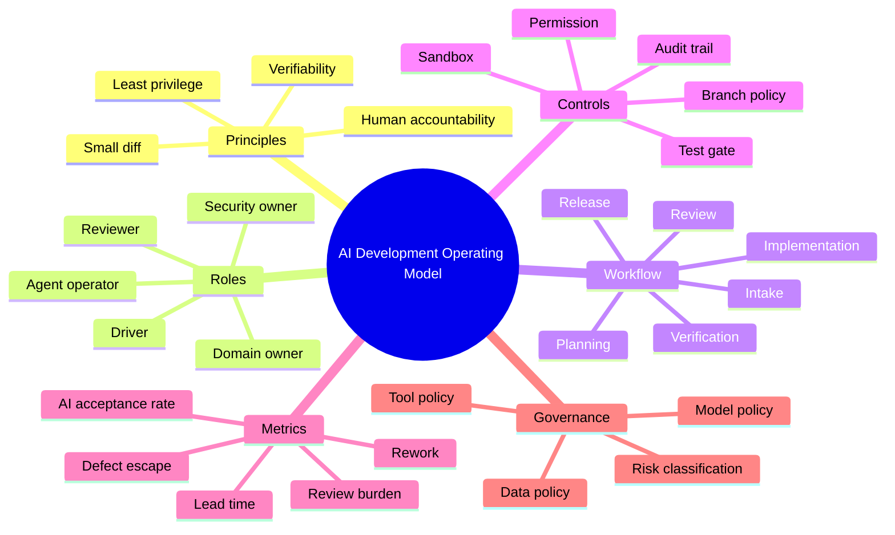
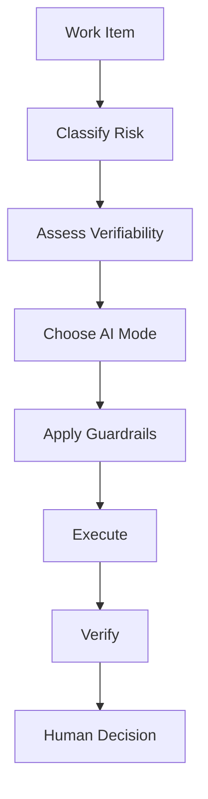
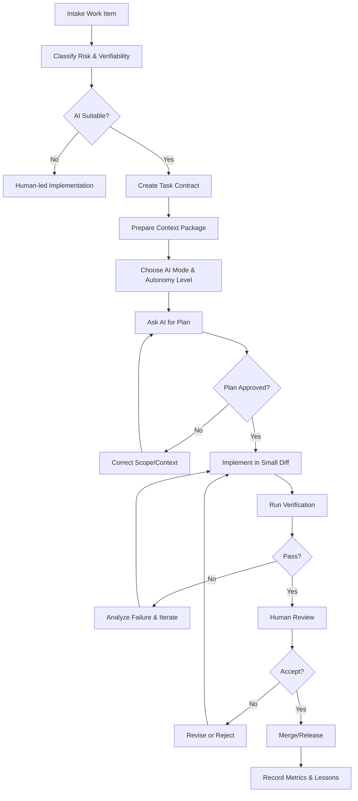
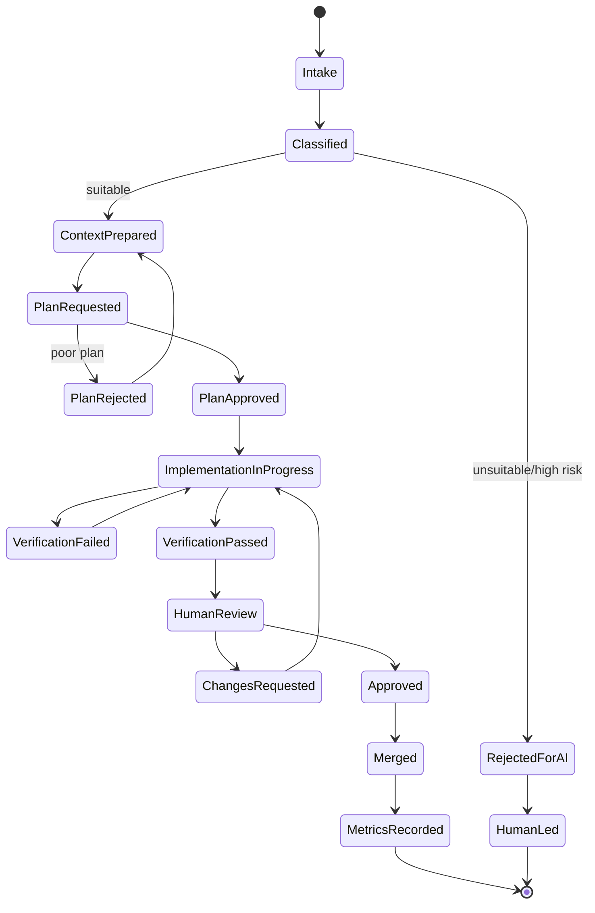
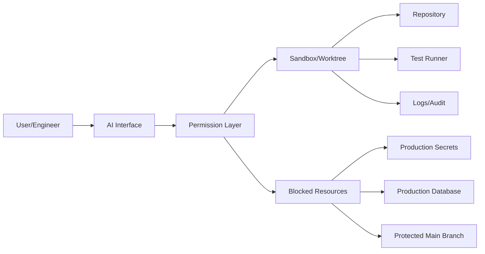
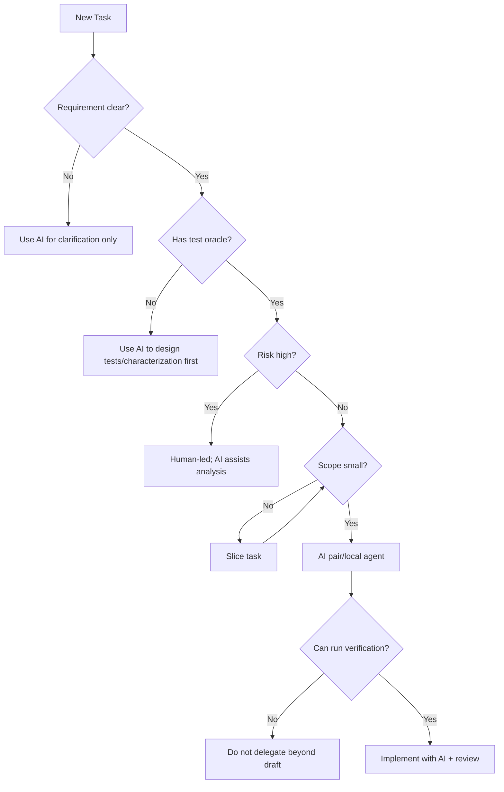
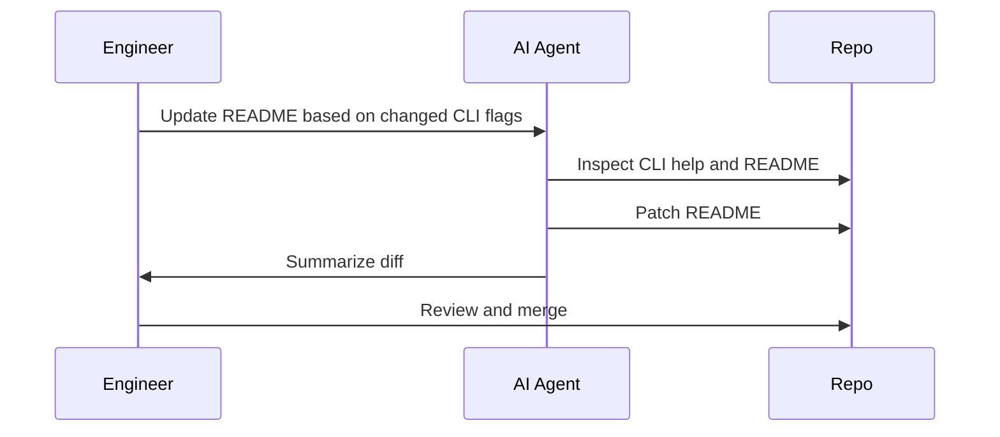
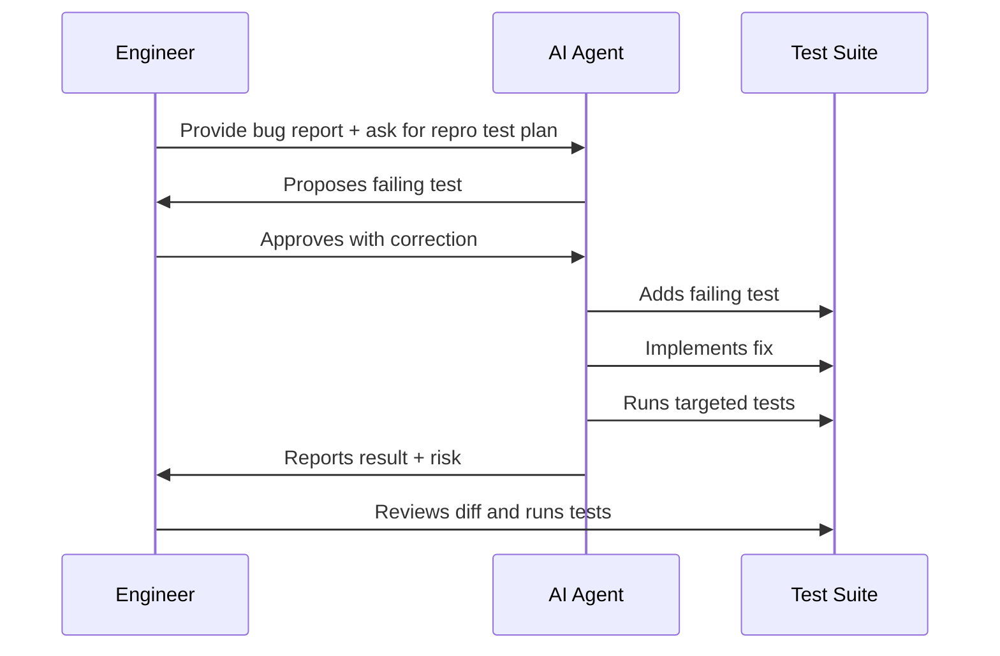

------
title: Learn AI Development Driven Implementation and Usage - Part 002
description: Operating model untuk memakai AI dalam software delivery: peran, workflow, guardrail, autonomy level, governance, dan quality gate.
series: learn-ai-development-driven-implementation-usage
seriesTitle: Learn AI Development Driven Implementation and Usage
order: 2
partTitle: AI Development Operating Model
tags:
- ai
- software-engineering
- delivery
- operating-model
- governance
- ai-driven-development
date: 2026-06-30
---

# Part 002 — AI Development Operating Model

## 1. Tujuan Part Ini

Part 001 membangun skill map individu. Part ini naik satu level: bagaimana AI-driven implementation dijadikan **operating model** untuk delivery software.

Operating model menjawab:

- kapan AI boleh digunakan;
- siapa yang bertanggung jawab;
- jenis task apa yang cocok untuk AI;
- bagaimana task disiapkan;
- bagaimana hasil AI diverifikasi;
- bagaimana risiko dikendalikan;
- bagaimana team mengukur dampaknya;
- bagaimana workflow tetap defensible di lingkungan enterprise atau regulated.

Tanpa operating model, penggunaan AI biasanya menjadi sporadis:

- satu engineer memakai AI dengan sangat agresif;
- engineer lain tidak percaya sama sekali;
- reviewer kewalahan membaca diff besar;
- security team khawatir secret dan data bocor;
- manager melihat demo cepat tetapi tidak tahu dampak produksi;
- organisasi tidak punya bukti apakah AI meningkatkan delivery atau hanya menambah rework.

Operating model mengubah AI dari eksperimen personal menjadi sistem kerja engineering.

## 2. Definisi Operating Model

Dalam konteks seri ini, operating model adalah kumpulan keputusan eksplisit tentang:



Operating model bukan birokrasi tambahan. Operating model adalah cara menjaga agar AI mempercepat flow tanpa merusak correctness, maintainability, dan trust.

## 3. Prinsip Utama

### 3.1 Human Owns the Outcome

AI boleh membuat plan, patch, test, summary, atau documentation. Tetapi ownership tetap manusia.

Artinya:

- manusia bertanggung jawab atas perubahan yang di-merge;
- manusia wajib memahami diff yang disetujui;
- manusia tidak boleh menyalahkan AI untuk bug production;
- reviewer tetap memvalidasi behavior, bukan hanya membaca summary AI;
- decision record harus menunjukkan alasan engineering, bukan “AI suggested it”.

Prinsip ini penting karena AI output bersifat probabilistik dan dapat plausible namun salah.

### 3.2 AI Autonomy Follows Verifiability

AI boleh lebih autonomous ketika hasilnya mudah diverifikasi.

Contoh:

- update dokumentasi: high autonomy;
- tambah unit test untuk function jelas: medium-high autonomy;
- refactor internal dengan test kuat: medium autonomy;
- perubahan authorization: low autonomy;
- destructive migration: very low autonomy;
- incident production live: AI sebagai analysis assistant, bukan operator bebas.



### 3.3 Small Diff Beats Big Automation

AI yang menghasilkan diff kecil lebih mudah direview, diuji, dan di-rollback. Banyak kegagalan agentic coding muncul bukan karena model tidak mampu menulis kode, tetapi karena task terlalu besar, context tidak cukup, atau reviewer tidak bisa mengevaluasi konsekuensi perubahan.

Prinsip operasional:

- satu task = satu intent;
- satu branch = satu change reason;
- satu PR = satu reviewable unit;
- hindari campuran feature + refactor + formatting + dependency update;
- jika AI menghasilkan perubahan melebar, hentikan dan constrain ulang.

### 3.4 Tests Are Control Gates, Not Decorations

Testing dalam AI-driven implementation bukan aktivitas setelah kode selesai. Testing adalah gate utama untuk mengendalikan autonomy.

AI boleh diberi ruang lebih besar jika:

- test suite cepat dijalankan;
- test relevan terhadap behavior;
- regression suite dapat dipercaya;
- contract test tersedia;
- CI output mudah dibaca;
- flaky test diketahui dan dipisahkan.

Sebaliknya, repo tanpa test adalah lingkungan berisiko tinggi untuk agentic coding.

### 3.5 Least Privilege for Tools

Agent yang bisa menjalankan command, membaca file, mengakses network, atau memanggil tool eksternal harus diberi permission minimum.

Prinsipnya sama dengan sistem terdistribusi:

- jangan beri akses production secret;
- jangan beri write access ke branch utama;
- jangan beri akses database production;
- jangan beri tool destructive tanpa approval;
- log semua aksi penting;
- isolasi environment;
- gunakan branch/worktree/sandbox.

## 4. Mode Penggunaan AI

Operating model perlu membedakan mode penggunaan AI. Semua mode tidak sama.

### 4.1 Mode 1 — Conversational Assistant

AI digunakan untuk tanya jawab, brainstorming, explanation, review checklist, atau draft design.

Karakteristik:

- tidak mengedit file langsung;
- risiko relatif rendah;
- sangat bergantung pada konteks yang diberikan user;
- cocok untuk eksplorasi awal.

Cocok untuk:

- memahami konsep;
- membuat opsi design;
- membuat checklist;
- menganalisis error message;
- merangkum trade-off.

Tidak cocok untuk:

- memastikan kebenaran repo tanpa akses repo;
- mengubah kode secara otomatis;
- mengambil keputusan arsitektur final.

### 4.2 Mode 2 — IDE Pair Programming

AI bekerja di IDE sebagai pair programmer. Bisa melihat file terbuka, memberi suggestion, atau mengedit selected scope.

Karakteristik:

- feedback cepat;
- cocok untuk inner loop;
- manusia masih mengarahkan langkah demi langkah;
- risiko tergantung seberapa besar edit yang diterima.

Cocok untuk:

- method-level implementation;
- unit test generation;
- small refactor;
- boilerplate reduction;
- error handling consistent pattern.

### 4.3 Mode 3 — Local Agent

Agent berjalan lokal, bisa membaca repo, mengedit file, dan menjalankan command dengan approval tertentu.

Karakteristik:

- lebih autonomous;
- butuh sandbox dan command approval;
- cocok untuk task kecil-menengah dengan test jelas;
- perlu discipline terhadap diff.

Cocok untuk:

- memperbaiki failing test;
- menambah validation rule;
- update call sites setelah rename;
- generate tests across small module;
- documentation sync dari kode.

### 4.4 Mode 4 — Cloud Agent

Agent bekerja di cloud environment atau branch terisolasi. Ia bisa research repo, membuat plan, melakukan perubahan, menjalankan check, lalu menghasilkan branch atau PR.

Karakteristik:

- cocok untuk background implementation;
- perlu branch isolation;
- perlu review gate kuat;
- cocok untuk parallelizable tasks;
- perlu audit trail.

Cocok untuk:

- backlog cleanup;
- dependency minor upgrade;
- documentation improvement;
- test expansion;
- isolated bug fix;
- low-risk refactor.

### 4.5 Mode 5 — AI Review/QA Agent

AI tidak menulis fitur utama, tetapi memeriksa diff, mencari edge case, menulis test tambahan, atau membuat review comment.

Karakteristik:

- sangat berguna sebagai second reviewer;
- tidak menggantikan reviewer manusia;
- perlu rubric agar komentar tidak noisy;
- cocok untuk quality improvement.

Cocok untuk:

- PR risk classification;
- missing test detection;
- security smell detection;
- API compatibility review;
- release note draft.

## 5. AI Autonomy Levels

Gunakan level autonomy untuk menyamakan ekspektasi team.

| Level | Nama | AI Boleh | AI Tidak Boleh | Contoh Task |
|---:|---|---|---|---|
| 0 | No AI | Tidak digunakan | Semua | Highly sensitive task, legal constraint |
| 1 | Explain | Menjelaskan, merangkum, memberi opsi | Mengedit kode | Legacy code understanding |
| 2 | Draft | Membuat draft plan/kode/test | Commit/PR tanpa manusia | Design option, unit test draft |
| 3 | Patch with Approval | Mengedit file setelah plan disetujui | Merge, production action | Bug fix kecil |
| 4 | Agentic Branch | Membuat branch, patch, test, PR draft | Merge sendiri, akses secret | Docs/test/refactor isolated |
| 5 | Controlled Automation | Menjalankan workflow rutin dengan guardrail | Keluar dari policy/scope | Bulk mechanical migration terkontrol |

Rekomendasi default:

- engineer baru memakai AI: Level 1–2;
- engineer senior pada repo yang dikenal: Level 2–3;
- team dengan test kuat dan sandbox: Level 3–4;
- regulated/high-risk system: default Level 1–3, naik hanya dengan policy jelas;
- production operation: AI boleh bantu analysis, tetapi action destructive harus human-approved.

## 6. Work Item Classification

Sebelum memakai AI, klasifikasikan task.

### 6.1 Classification Dimensions

| Dimensi | Pertanyaan |
|---|---|
| Risk | Apa dampak jika salah? |
| Verifiability | Apakah benar/salah mudah dibuktikan? |
| Scope | Berapa banyak file/service yang tersentuh? |
| Domain ambiguity | Apakah requirement jelas? |
| Test coverage | Apakah ada test relevan? |
| Data sensitivity | Apakah menyentuh data sensitif? |
| Contract impact | Apakah API/event/schema berubah? |
| Operational impact | Apakah memengaruhi deploy/runtime/observability? |

### 6.2 Task Class Matrix

| Class | Deskripsi | AI Mode Default | Gate Wajib |
|---|---|---|---|
| A | Low-risk mechanical | Local/cloud agent | Test/lint + light review |
| B | Isolated implementation | IDE/local agent | Plan review + targeted test |
| C | Cross-module feature | Pair + human-led design | Design review + integration test |
| D | Security/data/contract sensitive | AI analysis only or tightly scoped patch | Owner review + threat/test evidence |
| E | Production-critical/destructive | Human-led | Formal approval, dry run, rollback |

Contoh:

| Task | Class | Alasan |
|---|---|---|
| Rename internal DTO field with tests | A/B | Mechanical, verifiable |
| Add validation rule to one endpoint | B | Isolated, testable |
| Implement new case escalation lifecycle | C | Domain/state heavy |
| Change authorization policy | D | Security boundary |
| Backfill enforcement history table | E | Data destructive/irreversible risk |

## 7. End-to-End Workflow

Operating model utama untuk AI-driven implementation:



## 8. Workflow State Machine

Untuk enterprise team, flow ini bisa dimodelkan sebagai state machine.



State machine ini berguna karena AI workflow sering gagal saat state tidak eksplisit. Misalnya agent mulai implementasi sebelum plan disetujui, atau PR dibuat sebelum test relevan dijalankan.

## 9. Role Model

AI development operating model memerlukan peran yang jelas.

### 9.1 Human Driver

Human driver adalah engineer yang memegang task.

Tanggung jawab:

- menulis task contract;
- memilih AI mode;
- menyediakan context;
- menyetujui plan;
- memeriksa diff;
- memastikan test dan review cukup;
- bertanggung jawab atas hasil akhir.

### 9.2 AI Agent

AI agent adalah tool yang membantu reasoning, planning, editing, testing, atau review.

Batas:

- tidak memiliki accountability;
- tidak boleh menjadi final authority;
- tidak boleh melewati permission;
- tidak boleh membuat keputusan produk/arsitektur tanpa review.

### 9.3 Human Reviewer

Reviewer memeriksa diff dan bukti correctness.

Dalam AI-generated work, reviewer harus lebih fokus pada:

- hidden behavior changes;
- over-broad changes;
- weak tests;
- invented assumptions;
- security/data boundary;
- consistency with architecture.

### 9.4 Domain Owner

Domain owner memastikan rule bisnis benar.

Penting ketika task menyentuh:

- lifecycle;
- state transition;
- regulatory interpretation;
- audit semantics;
- user journey;
- enforcement/escalation logic;
- policy rules.

### 9.5 Security/Platform Owner

Dilibatkan ketika task menyentuh:

- auth/authz;
- secrets;
- infrastructure;
- CI/CD;
- data access;
- model/tool permission;
- external integration.

## 10. RACI Sederhana

| Aktivitas | Driver | AI | Reviewer | Domain Owner | Security/Platform |
|---|---|---|---|---|---|
| Task framing | A/R | C | C | C | C |
| Context package | A/R | C | C | C | C |
| Plan generation | A | R | C | C | C |
| Plan approval | A/R | C | C | C | C |
| Code patch | A | R | C | C | C |
| Test generation | A | R | C | C | C |
| Diff review | C | C | A/R | C | C |
| Security-sensitive review | C | C | C | C | A/R |
| Merge decision | A/R | I | C | C | C |
| Production release | A/R | I | C | C | C |

Keterangan:

- A = Accountable
- R = Responsible
- C = Consulted
- I = Informed

AI tidak pernah Accountable.

## 11. Intake Template

Agar AI usage tidak liar, setiap work item yang akan didelegasikan ke AI minimal punya intake berikut:

```md
# AI Work Item Intake

## Summary

## Why now?

## Risk class
A / B / C / D / E

## Suggested AI mode
Conversational / IDE Pair / Local Agent / Cloud Agent / Review Agent

## Autonomy level
0 / 1 / 2 / 3 / 4 / 5

## Scope

## Non-goals

## Relevant modules/files

## Domain invariants

## Acceptance criteria

## Verification command

## Required reviewers

## Security/data concerns

## Rollback note
```

Team bisa menaruh template ini di issue tracker, PR template, atau agent instruction file.

## 12. Context Handoff Protocol

AI sering gagal bukan karena tidak bisa coding, tetapi karena context handoff buruk. Untuk setiap task, gunakan context handoff.

### 12.1 Minimal Context Handoff

```md
You are working on: <repo/module>

Task:
<one paragraph>

Follow these existing patterns:
- <file/class/function>

Do not change:
- <explicit non-goals>

Business rules:
- <invariants>

Run these checks:
- <commands>

Before editing:
- inspect <files>
- produce a plan

After editing:
- summarize changed files
- summarize tests run
- list risks/assumptions
```

### 12.2 Context Quality Rubric

| Level | Context Quality | Result Bias |
|---:|---|---|
| 1 | “Fix this” | AI guesses, high hallucination risk |
| 2 | Goal only | AI may edit wrong layer |
| 3 | Goal + file hints | Useful for small task |
| 4 | Goal + constraints + tests | Good default |
| 5 | Full task contract + context package + risk | Best for non-trivial implementation |

## 13. Guardrail Architecture

Operating model harus punya guardrail. Guardrail bukan hanya policy dokumen; harus tercermin dalam toolchain.



### 13.1 Guardrail Minimum

Untuk local/cloud agent:

- gunakan branch atau worktree terisolasi;
- blokir production credentials;
- require approval untuk command destructive;
- batasi network access jika tidak perlu;
- require test/lint sebelum PR;
- require human review sebelum merge;
- gunakan secret scanning;
- log tool actions;
- pisahkan task low-risk dan high-risk.

### 13.2 Command Risk Policy

| Command Type | Contoh | Policy |
|---|---|---|
| Read-only | `ls`, `cat`, `grep`, `git diff` | Allow |
| Local build/test | `npm test`, `mvn test`, `gradle test` | Allow/approve once |
| Formatting | `npm run format`, `spotlessApply` | Allow if scoped |
| Package install | `npm install`, `pip install` | Require approval |
| Git write | `git commit`, `git push` | Require approval |
| File delete | `rm`, `git clean` | Require approval or block |
| Network call | `curl external`, package download | Require approval |
| Production access | DB/prod API/secret read | Block by default |

## 14. Quality Gates

AI-generated changes harus melewati gate yang eksplisit.

### 14.1 Gate by Change Type

| Change Type | Gate Minimal |
|---|---|
| Documentation | Review accuracy, link validity |
| Unit test | Test fails for wrong behavior if applicable |
| Bug fix | Reproduction + targeted test + regression test |
| Feature | Acceptance test + integration path |
| API contract | Contract compatibility + consumer impact |
| DB migration | Dry run + rollback + data invariant query |
| Security | Threat model + security owner review |
| CI/CD | Pipeline dry run + rollback path |

### 14.2 Definition of Done for AI-Assisted PR

```md
# Definition of Done: AI-Assisted PR

- [ ] Task contract is linked or summarized.
- [ ] AI-generated or AI-assisted scope is disclosed if team policy requires it.
- [ ] Diff is limited to intended scope.
- [ ] Tests were added or explicitly deemed unnecessary.
- [ ] Relevant test/lint commands passed or failures are explained.
- [ ] Security/data/contract risks are reviewed.
- [ ] AI assumptions are listed.
- [ ] Human reviewer understands the change.
- [ ] Rollback path is clear for risky changes.
```

## 15. PR Template

```md
## Summary

## Problem

## Solution

## AI Assistance
- Mode used: chat / IDE pair / local agent / cloud agent / review agent
- Scope of AI assistance:
- Human changes after AI output:

## Verification
- [ ] Unit tests
- [ ] Integration tests
- [ ] Contract tests
- [ ] Manual checks

Commands run:

```bash

```

## Risk
- Risk class: A/B/C/D/E
- Security/data impact:
- Rollback:

## Review Notes
- Areas needing careful review:
- AI assumptions to verify:
```

Catatan: tidak semua organisasi ingin atau wajib menandai “AI Assistance” di PR. Tetapi untuk team yang sedang membangun maturity, disclosure internal membantu learning dan audit.

## 16. AI Suitability Decision Tree



## 17. Operating Model by Team Maturity

### 17.1 Level 0 — Ad Hoc

Ciri:

- setiap engineer memakai AI sendiri-sendiri;
- tidak ada guideline;
- tidak ada risk classification;
- PR tidak menunjukkan verification yang konsisten;
- reviewer tidak tahu apakah AI dipakai.

Risiko:

- inconsistent quality;
- security concern;
- distrust;
- duplicated mistakes.

### 17.2 Level 1 — Assisted

Ciri:

- AI boleh untuk explanation, draft, dan small code assistance;
- ada guideline dasar;
- high-risk task dibatasi;
- engineer mulai memakai prompt templates.

Target:

- membangun literacy;
- menghindari misuse;
- mengumpulkan examples.

### 17.3 Level 2 — Structured

Ciri:

- ada task classification;
- ada PR template;
- ada review checklist;
- ada repo instruction file;
- AI digunakan untuk test, docs, bug fix kecil.

Target:

- repeatability;
- reviewable output;
- initial metrics.

### 17.4 Level 3 — Integrated

Ciri:

- AI masuk ke lifecycle issue → plan → PR;
- local/cloud agent digunakan untuk task tertentu;
- CI dan branch policy mendukung workflow;
- metrics dipakai untuk improvement.

Target:

- lead time turun;
- review burden terkendali;
- defect tidak naik.

### 17.5 Level 4 — Governed Automation

Ciri:

- controlled automation untuk task rutin;
- policy berdasarkan data classification;
- audit trail lengkap;
- tool permission diatur;
- governance, security, dan platform terlibat.

Target:

- scaling AI usage across organization;
- defensibility;
- safe autonomy.

## 18. Metrics Operating Model

Jangan hanya mengukur “berapa banyak kode dibuat AI”. Itu metric yang lemah.

### 18.1 Flow Metrics

| Metric | Makna |
|---|---|
| Lead time | Waktu dari task ready sampai merged |
| Cycle time | Waktu aktif pengerjaan |
| Review latency | Waktu menunggu review |
| CI repair time | Waktu memperbaiki pipeline failure |
| PR size | Jumlah file/line changed |

### 18.2 Quality Metrics

| Metric | Makna |
|---|---|
| Defect escape | Bug yang lolos ke staging/production |
| Rework rate | Perubahan ulang setelah review/QA |
| Review finding density | Jumlah finding per PR size |
| Test meaningfulness | Test membuktikan behavior atau hanya coverage |
| Rollback frequency | Perubahan yang perlu dibalik |

### 18.3 AI-Specific Metrics

| Metric | Makna |
|---|---|
| AI acceptance rate | Persentase output AI yang dipakai setelah review |
| AI rejection reason | Kenapa output ditolak |
| Prompt iteration count | Berapa kali prompt diperbaiki |
| Context missing incidents | Berapa kali AI salah karena konteks kurang |
| Autonomy violation | AI/tool melewati batas yang disepakati |
| Human correction effort | Waktu memperbaiki output AI |

### 18.4 Measurement Warning

AI bisa menurunkan cycle time tetapi menaikkan review burden. Bisa juga meningkatkan jumlah PR tetapi menurunkan kualitas design. Karena itu metric harus seimbang.

Gunakan scorecard:

```md
# AI Delivery Scorecard

Period:
Team:

Flow:
- Lead time:
- Cycle time:
- Review latency:

Quality:
- Defect escape:
- Rework rate:
- PR rollback:

AI usage:
- AI-assisted PR count:
- AI acceptance rate:
- Top rejection reasons:

Human impact:
- Review burden:
- Developer satisfaction:
- Learning/failure notes:

Decision:
- Continue / adjust / restrict / expand
```

## 19. Failure Modes

### 19.1 Over-Automation

Team memberi agent terlalu banyak scope terlalu cepat.

Gejala:

- PR besar;
- reviewer bingung;
- test pass tapi behavior salah;
- banyak correction round;
- trust turun.

Mitigasi:

- turunkan autonomy;
- batasi PR size;
- wajib plan approval;
- fokus task low-risk dulu.

### 19.2 Prompt Theater

Team membuat prompt template panjang tetapi tidak memperbaiki engineering signal.

Gejala:

- prompt verbose;
- acceptance criteria tetap ambigu;
- test tidak ada;
- AI tetap menebak.

Mitigasi:

- fokus pada invariant dan verification;
- gunakan examples dari repo;
- hapus instruksi yang tidak enforceable.

### 19.3 Reviewer Blindness

Reviewer percaya summary AI dan tidak membaca diff dengan serius.

Mitigasi:

- summary AI hanya navigational aid;
- review harus berbasis diff dan tests;
- gunakan checklist khusus AI diff.

### 19.4 Context Drift

AI menggunakan pola lama atau file yang tidak lagi canonical.

Mitigasi:

- maintain repo instruction;
- tunjuk canonical examples;
- update ADR;
- hapus dead code atau tandai deprecated.

### 19.5 Test Inflation

AI menambah banyak test tetapi signal rendah.

Mitigasi:

- review test oracle;
- wajib negative cases;
- hindari test yang hanya mengecek mock interaction tanpa behavior.

## 20. Governance Model

Untuk team enterprise, operating model harus memasukkan governance ringan namun nyata.

### 20.1 Policy Areas

| Area | Policy Question |
|---|---|
| Tool access | Tool AI apa yang boleh dipakai? |
| Data | Data apa yang boleh dimasukkan ke prompt/context? |
| Source code | Repo mana yang boleh diakses oleh tool AI? |
| Secrets | Bagaimana mencegah secret exposure? |
| Generated code | Bagaimana review dan ownership? |
| Audit | Bukti apa yang harus dicatat? |
| Vendor | Bagaimana evaluasi model/tool provider? |
| Incident | Apa yang dilakukan jika AI menyebabkan bug/security issue? |

### 20.2 Data Classification

| Data Class | AI Usage Default |
|---|---|
| Public | Allowed with normal review |
| Internal non-sensitive | Allowed in approved tools |
| Confidential code | Approved enterprise tools only |
| Customer data | Avoid unless explicitly approved/sanitized |
| Secrets/credentials | Never include |
| Regulated personal data | Strict policy, usually anonymized or blocked |
| Production incident data | Sanitized and access-controlled |

### 20.3 Audit Artifact

Untuk regulated system, minimal simpan:

- issue/task contract;
- AI mode yang digunakan;
- PR diff;
- human reviewer;
- tests run;
- risk classification;
- decision notes untuk high-risk change.

Audit bukan untuk menyalahkan AI. Audit untuk membuktikan bahwa perubahan mengikuti process yang reasonable.

## 21. Operating Model untuk Individual Engineer

Jika Anda bekerja sendiri atau belum ada policy team, gunakan operating model personal:

1. Jangan paste secret/customer data.
2. Gunakan AI untuk plan sebelum patch.
3. Batasi diff kecil.
4. Jalankan test sendiri.
5. Review diff manual.
6. Simpan prompt/task contract untuk task besar.
7. Catat failure mode.
8. Jangan gunakan AI untuk hal yang Anda tidak mampu review.

Rule terakhir sangat penting:

> Jangan merge output AI yang berada di luar kemampuan Anda untuk memahami dan mempertanggungjawabkan.

## 22. Operating Model untuk Engineering Team

Untuk team, mulai dengan 30 hari adoption plan.

### Minggu 1 — Baseline

- Pilih 1–2 repo pilot.
- Tentukan allowed tools.
- Buat data policy dasar.
- Buat AI task classification.
- Ambil baseline lead time, review latency, defect/rework.

### Minggu 2 — Structured Usage

- Tambahkan PR template AI-assisted.
- Tambahkan prompt/task contract template.
- Tambahkan repo instruction file.
- Mulai dengan task Class A/B.

### Minggu 3 — Review and Guardrails

- Terapkan AI diff review checklist.
- Tambahkan branch/sandbox policy.
- Review 10 PR AI-assisted.
- Catat rejection reasons.

### Minggu 4 — Expand or Restrict

- Evaluasi metric.
- Identifikasi task yang cocok untuk AI.
- Identifikasi task yang harus human-led.
- Update policy.
- Tentukan apakah cloud/local agent boleh diperluas.

## 23. Example Operating Policy

```md
# AI-Assisted Development Policy

## Purpose
AI tools may be used to improve engineering flow while preserving correctness, security, maintainability, and human accountability.

## Allowed Use
- Code explanation
- Draft implementation plan
- Small scoped implementation
- Unit/integration test generation
- Documentation updates
- PR summary and review assistance

## Restricted Use
- Authorization/security boundary changes require security owner review.
- Database migration requires migration plan, dry run, rollback, and owner approval.
- Production credentials must never be shared with AI tools.
- Customer personal data must not be pasted into AI tools unless approved and anonymized.

## Required Controls
- Human owns final diff.
- All code must pass relevant tests.
- AI-generated PRs must be reviewable and scoped.
- High-risk tasks require explicit risk classification.
- Tool permissions must follow least privilege.

## Review
Reviewers must inspect code and tests directly. AI summaries are not a substitute for review.
```

## 24. Operating Model Examples

### 24.1 Low-Risk Documentation Update



Gate:

- verify flags are correct;
- no code changes;
- link examples valid.

### 24.2 Bug Fix with Repro



Gate:

- failing test actually reproduces bug;
- fix minimal;
- no unrelated refactor.

### 24.3 High-Risk Authorization Change

AI role:

- summarize existing authorization flow;
- identify test gaps;
- draft threat model;
- propose plan.

Human role:

- approve design;
- implement or tightly supervise patch;
- request security review;
- verify negative cases.

Gate:

- security owner review;
- abuse case tests;
- no permission widening without explicit approval;
- audit behavior verified.

## 25. Templates

### 25.1 AI Mode Decision Template

```md
# AI Mode Decision

Task:

Risk class:

Verifiability:

Recommended mode:
- [ ] Conversational
- [ ] IDE pair
- [ ] Local agent
- [ ] Cloud agent
- [ ] Review agent
- [ ] Human-led

Reason:

Required guardrails:

Escalation condition:
```

### 25.2 AI Agent Instruction Template

```md
# Agent Instructions

You are assisting with implementation in this repository.

Principles:
- Keep changes minimal and scoped.
- Follow existing patterns before introducing new abstractions.
- Do not change public contracts unless explicitly asked.
- Do not add dependencies without approval.
- Do not access secrets or production systems.
- Ask for clarification when domain rules are ambiguous.

Before editing:
- Inspect relevant files.
- Summarize plan.
- Identify risks.

After editing:
- Run relevant tests if available.
- Summarize changed files.
- Explain verification result.
- List assumptions and remaining risks.
```

### 25.3 AI Review Prompt Template

```md
Review this diff as an AI-assisted code review.

Focus on:
- behavior correctness
- scope creep
- missing tests
- security/data risk
- contract compatibility
- error handling
- maintainability

Do not comment on style unless it affects correctness or maintainability.
Return findings grouped by severity:
- Blocker
- Major
- Minor
- Question
```

## 26. Practical Setup Checklist

Sebelum team memakai AI-driven implementation secara serius:

```md
# AI Development Setup Checklist

## Tooling
- [ ] Approved AI tools selected.
- [ ] IDE/local/cloud agent modes understood.
- [ ] Sandbox/worktree policy defined.
- [ ] Network/secret restrictions defined.

## Repository
- [ ] README development setup accurate.
- [ ] Test/lint commands documented.
- [ ] Architecture notes available.
- [ ] Canonical patterns identified.
- [ ] Deprecated modules marked.

## Workflow
- [ ] Task contract template available.
- [ ] PR template updated.
- [ ] Review checklist available.
- [ ] Risk classification agreed.
- [ ] Required reviewers mapped.

## Metrics
- [ ] Baseline lead time captured.
- [ ] Baseline review latency captured.
- [ ] Rework/defect tracking available.
- [ ] AI rejection reasons tracked.

## Governance
- [ ] Data classification policy exists.
- [ ] Secret handling rule explicit.
- [ ] High-risk task policy exists.
- [ ] Incident escalation path defined.
```

## 27. Latihan Part 002

### Exercise 1 — Classify 20 Backlog Items

Ambil 20 backlog item. Isi tabel:

| Item | Risk Class | Verifiability | AI Mode | Guardrail |
|---|---|---|---|---|
|  | A/B/C/D/E | Low/Medium/High |  |  |

Tujuan: menemukan task mana yang sebenarnya cocok untuk AI.

### Exercise 2 — Write Team Policy v0

Buat policy 1 halaman dengan:

- allowed uses;
- restricted uses;
- data rules;
- review rules;
- high-risk escalation.

### Exercise 3 — Create One AI-Assisted PR Template

Tambahkan field:

- AI mode used;
- verification;
- risk class;
- assumptions;
- review focus.

### Exercise 4 — Run One Low-Risk AI Workflow

Pilih task Class A/B. Jalankan:

1. task contract;
2. context package;
3. AI plan;
4. human plan review;
5. AI patch;
6. test;
7. human diff review;
8. PR summary.

Catat failure mode.

## 28. Ringkasan

Part ini menetapkan operating model:

- AI usage harus dikendalikan oleh risk, verifiability, dan scope;
- human tetap accountable;
- autonomy harus bertahap;
- small diff lebih penting daripada demo automation besar;
- guardrail harus masuk ke workflow, bukan hanya dokumen policy;
- metrics harus mengukur flow dan quality, bukan hanya output volume;
- governance perlu ringan tetapi nyata, terutama untuk enterprise/regulatory systems.

Operating model ini akan menjadi fondasi untuk Part 003, yaitu **Mental Models and Workflow Taxonomy**: membedakan chat, pair programming, local agent, cloud agent, review agent, dan automation loop secara lebih dalam.

## 29. Referensi

- Josh Kaufman, *The First 20 Hours: How to Learn Anything ... Fast*.
- OpenAI Codex overview: https://openai.com/codex/
- OpenAI Help, Using Codex with your ChatGPT plan: https://help.openai.com/en/articles/11369540-using-codex-with-your-chatgpt-plan
- GitHub Docs, About Copilot cloud agent: https://docs.github.com/en/copilot/concepts/agents/cloud-agent/about-cloud-agent
- Claude Code Docs, Agent SDK overview: https://code.claude.com/docs/en/agent-sdk/overview
- Model Context Protocol introduction: https://modelcontextprotocol.io/docs/getting-started/intro
- OWASP Top 10 for Large Language Model Applications: https://owasp.org/www-project-top-10-for-large-language-model-applications/
- NIST AI Risk Management Framework: https://www.nist.gov/itl/ai-risk-management-framework
- NIST AI RMF Generative AI Profile: https://www.nist.gov/publications/artificial-intelligence-risk-management-framework-generative-artificial-intelligence
