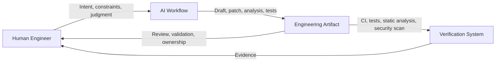
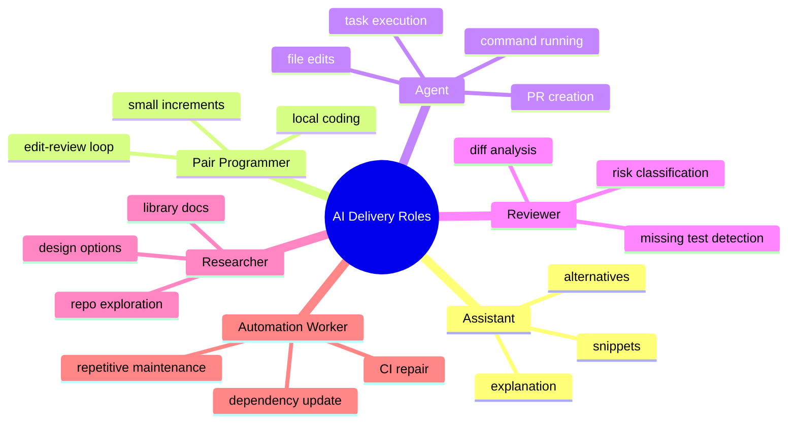
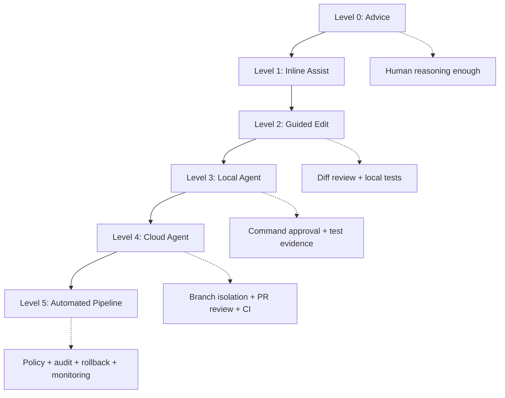
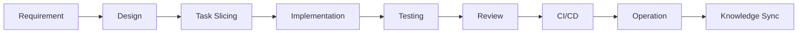
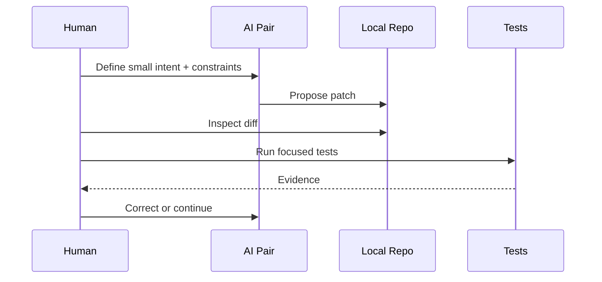
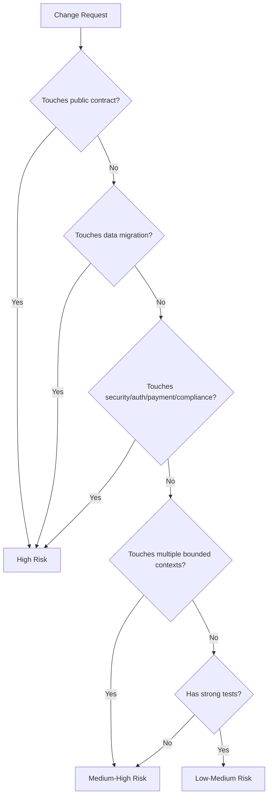
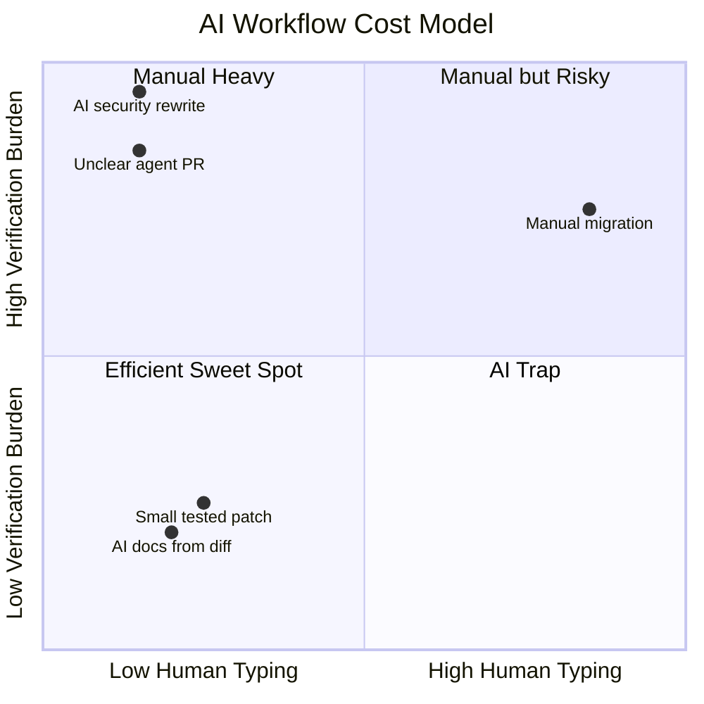
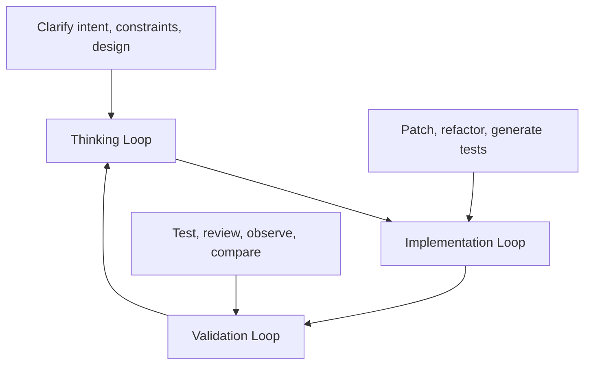
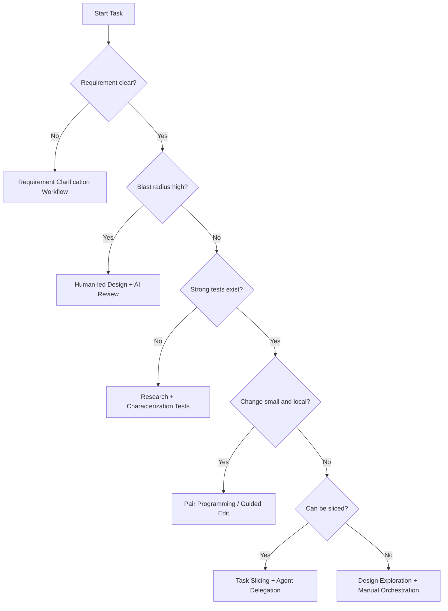

# Part 003 — Mental Models and Workflow Taxonomy

## 1. Tujuan Part Ini

Part ini menjawab satu pertanyaan praktis:

> Ketika software engineer memakai AI dalam delivery software, **workflow apa yang sedang terjadi**, kapan workflow itu cocok, kapan berbahaya, dan bagaimana mengendalikannya?

Banyak engineer gagal memanfaatkan AI bukan karena modelnya lemah, tetapi karena mereka memakai **satu mode berpikir untuk semua pekerjaan**. Mereka meminta AI menulis kode, menjelaskan error, membuat test, review PR, dan membaca legacy code dengan pola interaksi yang sama. Hasilnya sering tampak produktif, tetapi tidak selalu menghasilkan delivery yang benar.

Kita akan membangun taksonomi workflow agar AI tidak diperlakukan sebagai “magic autocomplete”, tetapi sebagai **komponen kerja engineering** dengan boundary, input, output, risiko, dan review gate yang jelas.

Setelah part ini, kamu harus bisa:

1. Membedakan AI sebagai **assistant**, **pair**, **agent**, **reviewer**, **researcher**, dan **automation worker**.
2. Memilih workflow yang tepat berdasarkan risiko task.
3. Mengontrol output AI melalui intent, context, acceptance criteria, dan validation loop.
4. Mencegah cognitive offloading: kondisi ketika engineer berhenti memahami sistem karena terlalu cepat menerima output AI.
5. Mendesain workflow AI yang cocok untuk tim engineering, bukan hanya untuk eksperimen pribadi.

---

## 2. Posisi Part Ini dalam Framework Kaufman

Dalam kerangka Josh Kaufman, kita sedang menjalankan fase:

1. **Deconstruct the skill**: memecah skill AI-driven implementation menjadi mode kerja kecil.
2. **Learn enough to self-correct**: membuat mekanisme untuk mengetahui kapan output AI salah.
3. **Remove practice barriers**: memilih workflow yang mengurangi friction.
4. **Practice deliberately**: memakai workflow yang sama berulang sampai decision-making menjadi natural.

Skill yang sedang kita pecah bukan “prompting”. Skill utamanya adalah:

> **Mengubah niat engineering menjadi perubahan software yang benar, aman, teruji, dan bisa dipertanggungjawabkan dengan bantuan AI.**

Prompt hanya salah satu control surface.

---

## 3. Mental Model Utama: AI Bukan Developer, AI Adalah Work Amplifier

AI coding tool modern bisa membaca repo, menulis file, menjalankan command, membuka PR, dan memperbaiki error. Namun dari sudut pandang engineering governance, AI tetap bukan pemilik keputusan.

Model mental yang lebih tepat:



AI memperbesar kapasitas kerja, tetapi juga memperbesar risiko jika input dan review lemah.

Prinsip dasarnya:

| Salah Kaprah | Model yang Lebih Benar |
|---|---|
| AI menulis kode, jadi engineer cukup approve | AI menghasilkan kandidat perubahan; engineer tetap accountable |
| Prompt bagus berarti hasil bagus | Prompt bagus hanya awal; validation loop menentukan kualitas |
| Semakin autonomous semakin baik | Semakin autonomous harus semakin ketat boundary dan evidence |
| AI cocok untuk semua task | AI paling efektif untuk task dengan context jelas, testable outcome, dan reviewable diff |
| Output yang terlihat rapi berarti benar | Output hanya benar jika memenuhi invariant, test, contract, dan operational constraint |

---

## 4. Enam Role AI dalam Software Delivery

AI bisa memainkan beberapa role. Setiap role punya bentuk input, output, dan risiko berbeda.



### 4.1 AI as Assistant

AI sebagai assistant adalah mode paling ringan. Ia membantu menjelaskan, memberi ide, membuat contoh, atau membantu memahami error.

Cocok untuk:

- memahami API atau library;
- membuat skeleton kecil;
- menjelaskan stack trace;
- menulis regex, query, atau helper function;
- membandingkan beberapa pendekatan desain;
- membuat checklist review.

Tidak cocok untuk:

- perubahan besar tanpa repo context;
- desain arsitektur dengan banyak constraint tersembunyi;
- migrasi data;
- security-sensitive code;
- perubahan state machine penting.

Failure mode utama:

- jawaban tampak meyakinkan tetapi tidak sesuai constraint codebase;
- AI memberi pattern generik yang tidak cocok dengan sistem;
- engineer terlalu cepat copy-paste.

Control rule:

> Pakai assistant mode untuk mempercepat berpikir, bukan menggantikan validasi.

### 4.2 AI as Pair Programmer

AI sebagai pair programmer bekerja dekat dengan engineer dalam inner loop. Engineer memberi intent kecil, AI membuat patch kecil, engineer membaca diff, lalu mengarahkan iterasi berikutnya.

Cocok untuk:

- implementasi function/method kecil;
- refactor lokal;
- menambahkan test case;
- memperbaiki bug dengan reproduksi jelas;
- membuat adapter atau mapper;
- memperbaiki readability.

Ciri workflow sehat:

1. Engineer tahu file mana yang sedang disentuh.
2. Change set kecil.
3. Diff dibaca sebelum lanjut.
4. Test dijalankan per increment.
5. AI tidak dibiarkan “melanjutkan sendiri” pada area yang belum dipahami.

Anti-pattern:

```text
"Implement feature X end-to-end. Jangan tanya."
```

Untuk pair programming, prompt lebih baik seperti:

```text
Kita akan ubah hanya service layer untuk menambahkan validation rule X.
Jangan ubah API contract atau schema database.
Tulis patch kecil dulu, lalu jelaskan file yang berubah dan test yang perlu ditambahkan.
```

### 4.3 AI as Agent

AI sebagai agent bukan hanya menjawab. Ia mengambil tindakan: membaca file, mengedit repo, menjalankan test, memperbaiki error, dan kadang membuka PR.

Cocok untuk:

- issue yang sudah disiapkan dengan acceptance criteria;
- dependency update dengan test suite kuat;
- bug fix dengan failing test jelas;
- dokumentasi dan runbook;
- refactor mekanis;
- migrasi kecil dengan rollback jelas.

Tidak cocok untuk:

- requirement ambigu;
- domain logic yang belum terdokumentasi;
- perubahan lintas bounded context tanpa design review;
- perubahan security policy;
- migrasi data irreversible;
- keputusan product atau compliance.

Agent mode membutuhkan boundary:

| Boundary | Contoh |
|---|---|
| Scope | “ubah hanya module billing-tax” |
| Files | “jangan ubah migration lama” |
| Commands | “boleh jalankan test, jangan deploy” |
| Branch | “kerjakan di branch terpisah” |
| Output | “buat PR dengan summary dan risk notes” |
| Stop condition | “berhenti jika test gagal karena environment” |

Agent mode bukan berarti engineer tidak bekerja. Engineer berpindah dari **typing work** menjadi **orchestration + review work**.

### 4.4 AI as Reviewer

AI sebagai reviewer membaca diff dan mencari risiko. Mode ini sangat berguna karena manusia sering bias terhadap solusi yang baru saja ia tulis.

Cocok untuk:

- menemukan missing tests;
- menilai backward compatibility;
- mencari edge case;
- mendeteksi dead code;
- mengecek consistency dengan style repo;
- membuat review checklist;
- klasifikasi risk level PR.

AI reviewer harus diberi instruksi yang berbeda dari AI implementer.

Prompt buruk:

```text
Review this PR.
```

Prompt lebih baik:

```text
Review diff ini sebagai senior backend engineer.
Fokus hanya pada correctness, concurrency, backward compatibility, data integrity, dan missing tests.
Abaikan formatting kecuali berdampak pada behavior.
Klasifikasikan temuan: must-fix, should-fix, question, nit.
```

Rule penting:

> Jangan minta AI reviewer yang sama untuk membela patch yang baru dibuatnya. Pakai independent review pass dengan konteks role berbeda.

### 4.5 AI as Researcher

AI sebagai researcher membantu menemukan fakta, constraint, dependency, call path, atau design precedent.

Dalam codebase besar, role ini sering lebih bernilai daripada code generation.

Cocok untuk:

- “di mana rule ini diterapkan?”;
- “siapa consumer event ini?”;
- “apa side effect method ini?”;
- “bagaimana request ini mengalir dari controller ke persistence?”;
- “test apa yang melindungi behavior ini?”;
- “apakah sudah ada pattern sejenis di repo?”

Output researcher idealnya bukan patch, tetapi **map**:

```text
Finding:
- Entry point: AController#create
- Domain service: CaseLifecycleService#escalate
- State transition: OPEN -> UNDER_REVIEW
- External side effect: NotificationPublisher
- Persistence: CaseRepository.save
- Existing tests: CaseLifecycleServiceTest
- Risk: no test for duplicate escalation
```

### 4.6 AI as Automation Worker

Automation worker cocok untuk pekerjaan repetitif dan low-to-medium risk.

Contoh:

- update dependency minor;
- memperbaiki lint warnings;
- generate migration template;
- update docs setelah API berubah;
- menambahkan missing nullability annotations;
- membuat test skeleton;
- memperbaiki CI failure yang deterministik.

Syarat agar aman:

1. Task bisa dijelaskan sebagai rule.
2. Output bisa divalidasi otomatis.
3. Ada rollback.
4. Review cost lebih rendah dari manual work.
5. Tidak menyentuh area high-risk tanpa approval.

---

## 5. Workflow Taxonomy Berdasarkan Level Autonomy

AI workflow dapat dikelompokkan berdasarkan seberapa banyak tindakan yang dilakukan AI tanpa intervensi manusia.

| Level | Nama | AI Melakukan | Human Melakukan | Risiko |
|---:|---|---|---|---|
| 0 | Manual with AI Advice | menjelaskan/menyarankan | semua perubahan manual | rendah |
| 1 | Inline Assist | autocomplete/snippet | memilih dan mengedit | rendah-menengah |
| 2 | Guided Edit | membuat patch lokal kecil | membaca diff per step | menengah |
| 3 | Local Agent | membaca repo, edit file, run test | approve command dan review diff | menengah-tinggi |
| 4 | Cloud Agent | kerja di branch/sandbox, PR | review hasil dan evidence | tinggi |
| 5 | Automated Agent Pipeline | triggered by issue/event/schedule | governance dan exception handling | sangat tinggi |

Kenaikan level autonomy harus dibayar dengan kenaikan quality gate.



Engineering rule:

> Jika autonomy naik tetapi validation tetap sama, risk exposure naik secara eksponensial.

---

## 6. Workflow Taxonomy Berdasarkan Phase Delivery

AI tidak hanya dipakai saat coding. Delivery software punya banyak phase.



### 6.1 Requirement Clarification Workflow

Tujuan: mengubah requirement ambigu menjadi task yang bisa diimplementasikan.

Input:

- ticket;
- user story;
- product note;
- bug report;
- incident summary;
- business rule.

Output:

- clarified intent;
- domain terms;
- assumptions;
- acceptance criteria;
- negative cases;
- non-goals;
- test scenarios.

Prompt pattern:

```text
Baca requirement ini sebagai staff engineer.
Pisahkan:
1. behavior yang eksplisit,
2. asumsi yang belum dibuktikan,
3. edge case,
4. acceptance criteria,
5. non-goals,
6. pertanyaan yang harus dijawab sebelum coding.
Jangan menulis kode.
```

Kapan dipakai:

- sebelum membuat issue untuk agent;
- sebelum delegasi ke cloud agent;
- saat bug report terlalu kabur;
- saat product requirement mencampur solusi dan masalah.

### 6.2 Design Exploration Workflow

Tujuan: membandingkan opsi desain sebelum implementasi.

Output ideal:

- opsi A/B/C;
- trade-off;
- failure mode;
- migration cost;
- testing strategy;
- backward compatibility risk;
- recommendation.

Prompt pattern:

```text
Kita perlu menambahkan behavior X pada sistem Y.
Bandingkan minimal 3 desain.
Evaluasi berdasarkan correctness, complexity, testability, migration risk, operational risk, dan reversibility.
Jangan pilih solusi hanya karena paling mudah diimplementasikan.
```

### 6.3 Repository Reconnaissance Workflow

Tujuan: memahami codebase sebelum menyentuh kode.

Pertanyaan yang harus dijawab:

1. Entry point-nya di mana?
2. State/domain object apa yang berubah?
3. Side effect apa yang terjadi?
4. Test apa yang relevan?
5. Pattern lokal apa yang harus diikuti?
6. Constraint apa yang tidak tertulis?

Output ideal:

```text
Repo Map
- Entry point:
- Domain/service layer:
- Persistence:
- External integration:
- Existing tests:
- Similar implementation:
- Risky files:
- Suggested first patch:
```

### 6.4 Guided Implementation Workflow

Tujuan: membuat perubahan kecil dengan review ketat.

Loop:



Rule:

- Satu prompt = satu intent.
- Satu patch = satu reason to change.
- Jangan gabungkan feature, refactor, test cleanup, dan formatting dalam satu diff.

### 6.5 Agent Delegation Workflow

Tujuan: memberi AI task end-to-end yang cukup kecil untuk dihasilkan sebagai PR.

Issue untuk agent harus berisi:

```md
## Intent

## Scope

## Non-goals

## Acceptance Criteria

## Relevant Files / Areas

## Test Command

## Constraints

## Risk Notes

## Expected PR Summary
```

Agent delegation cocok jika:

- acceptance criteria jelas;
- test command diketahui;
- task bisa selesai di branch sendiri;
- tidak membutuhkan keputusan product baru;
- risk level rendah-menengah.

### 6.6 AI Review Workflow

AI review bukan pengganti human review. AI review adalah **pre-review amplifier**.

Workflow sehat:

1. Author membuat PR.
2. AI reviewer melakukan risk scan.
3. Author memperbaiki must-fix obvious.
4. Human reviewer fokus pada judgment, domain, dan architecture.

AI reviewer checklist:

- correctness;
- missing negative tests;
- backward compatibility;
- error handling;
- concurrency;
- transaction boundary;
- data integrity;
- security;
- observability;
- rollout and rollback.

### 6.7 CI Repair Workflow

Tujuan: memperbaiki failure berdasarkan evidence, bukan tebak-tebakan.

Prompt pattern:

```text
Berikut log CI gagal.
Jangan langsung menulis patch.
Buat hypothesis tree:
1. kemungkinan penyebab,
2. evidence dari log,
3. file yang perlu dicek,
4. minimal fix,
5. test command untuk verifikasi.
```

Failure mode:

- AI memperbaiki test agar hijau tetapi merusak intent test;
- AI menghapus assertion penting;
- AI menambah retry/sleep sebagai solusi palsu;
- AI mengubah production code tanpa memahami contract.

### 6.8 Documentation Synchronization Workflow

AI sangat berguna untuk menyinkronkan knowledge artifact setelah perubahan.

Output:

- PR summary;
- release note;
- ADR update;
- API changelog;
- runbook;
- migration guide;
- onboarding note.

Rule:

> Dokumentasi yang ditulis AI harus berasal dari diff dan decision record, bukan dari imajinasi model.

---

## 7. Decision Matrix: Workflow Mana yang Dipilih?

Gunakan matriks berikut sebelum memilih mode AI.

| Task Type | Recommended Workflow | Autonomy | Required Evidence |
|---|---|---:|---|
| Explain unfamiliar code | Researcher | 0-1 | file references, call path |
| Add simple validation | Pair Programmer | 1-2 | unit tests |
| Fix bug with failing test | Pair/Local Agent | 2-3 | failing then passing test |
| Update docs from diff | Automation Worker | 2-4 | diff-based summary |
| Dependency minor update | Agent | 3-4 | CI green, changelog review |
| Refactor across module | Guided Edit | 2-3 | characterization tests |
| API contract change | Design + Pair | 1-2 | compatibility tests |
| Database migration | Design + Human-led | 0-2 | migration test, rollback plan |
| Security-sensitive code | Human-led + AI Review | 0-2 | threat model, security tests |
| Cross-service behavior | Design + Review | 0-2 | sequence diagram, integration tests |

Rule of thumb:

> Semakin besar blast radius, semakin kecil autonomy yang boleh diberikan.

---

## 8. Blast Radius Model

Sebelum memberi task ke AI, nilai blast radius.



### Low-risk AI tasks

- formatting;
- docs update;
- simple unit test addition;
- local helper extraction;
- static typing cleanup;
- obvious dead code removal with tests.

### Medium-risk AI tasks

- service-level behavior;
- non-public API change;
- test repair;
- small refactor;
- dependency update;
- CI repair.

### High-risk AI tasks

- authentication/authorization;
- encryption;
- payment;
- data migration;
- public API contract;
- regulatory decision logic;
- concurrency control;
- distributed transaction;
- deletion or irreversible operation.

High-risk bukan berarti AI tidak boleh dipakai. Artinya AI dipakai untuk analysis, design review, test generation, dan checklist — bukan sebagai autonomous implementer utama.

---

## 9. Cognitive Load Model

AI mengurangi beban mengetik, tetapi bisa menaikkan beban verifikasi.



Sweet spot AI workflow:

- mengurangi typing;
- tidak menaikkan verification cost secara ekstrem;
- menghasilkan diff kecil;
- punya test atau oracle;
- mudah di-rollback.

AI trap:

- output besar;
- context tidak lengkap;
- test lemah;
- reviewer perlu membaca semua dari nol;
- PR tampak selesai tetapi tidak memiliki evidence.

---

## 10. The Three-Loop Model

AI-driven implementation yang sehat berjalan dalam tiga loop.



### 10.1 Thinking Loop

Pertanyaan:

- Apa behavior yang harus berubah?
- Apa invariant yang tidak boleh rusak?
- Apa acceptance criteria?
- Apa non-goals?
- Apa risiko utama?

Output:

- task contract;
- design note;
- test plan.

### 10.2 Implementation Loop

Pertanyaan:

- Patch terkecil apa yang memenuhi intent?
- File apa yang boleh disentuh?
- Pattern lokal apa yang harus diikuti?
- Bagaimana menjaga diff reviewable?

Output:

- patch kecil;
- test update;
- PR summary.

### 10.3 Validation Loop

Pertanyaan:

- Test apa yang membuktikan behavior?
- Apa negative case?
- Apa regression risk?
- Apa evidence bahwa patch aman?
- Apa rollback plan?

Output:

- passing tests;
- review findings;
- risk note;
- release confidence.

---

## 11. Prompt Taxonomy Berdasarkan Workflow

Prompt bukan sekadar instruksi. Prompt adalah bentuk kontrak kerja.

### 11.1 Exploration Prompt

```text
Baca konteks berikut dan buat peta sistem.
Jangan menulis solusi dulu.
Fokus pada entry point, dependency, state transition, side effect, test coverage, dan risiko.
```

### 11.2 Design Prompt

```text
Usulkan 3 opsi desain untuk requirement ini.
Nilai dengan correctness, complexity, migration risk, testability, operational risk, dan reversibility.
Akhiri dengan rekomendasi dan alasan.
```

### 11.3 Implementation Prompt

```text
Implementasikan perubahan kecil berikut.
Batasan:
- jangan ubah public API,
- jangan ubah schema database,
- ikuti pattern di file X,
- tambahkan unit test untuk positive dan negative case.
Setelah patch, jelaskan diff dan test command.
```

### 11.4 Review Prompt

```text
Review diff ini sebagai reviewer independen.
Cari correctness bug, missing tests, backward compatibility issue, security risk, dan data integrity risk.
Kategorikan sebagai must-fix, should-fix, question, nit.
```

### 11.5 Debugging Prompt

```text
Analisis failure ini dengan hypothesis tree.
Jangan langsung patch.
Tunjukkan evidence dari log, kemungkinan root cause, file yang perlu dicek, dan minimal verification path.
```

### 11.6 Refactoring Prompt

```text
Refactor hanya untuk mengurangi duplication tanpa mengubah behavior.
Sebelum patch, identifikasi characterization tests yang harus ada.
Jangan rename public API.
Jangan campur perubahan behavior.
```

---

## 12. AI Workflow Smells

AI workflow smells adalah tanda bahwa prosesnya salah, meskipun output terlihat bagus.

| Smell | Tanda | Risiko | Perbaikan |
|---|---|---|---|
| Big Diff Syndrome | AI menghasilkan banyak file berubah | review fatigue | pecah task |
| Context Starvation | AI tidak diberi constraint repo | solusi generik | tambahkan repo map |
| Test Theater | test dibuat tetapi tidak membuktikan behavior | false confidence | review assertion quality |
| Prompt Gambling | prompt berulang berharap jawaban bagus | random walk | ubah task contract |
| Agent Drift | agent mengubah area di luar scope | blast radius | file boundary dan stop condition |
| Green CI Blindness | CI hijau tapi behavior salah | escaped defect | domain-specific tests |
| Reviewer Collapse | reviewer hanya membaca summary AI | missed bugs | baca diff dan evidence |
| Hidden Product Decision | AI memilih behavior product | misalignment | human decision gate |
| Security Delegation | AI implement auth/security sendiri | vulnerability | human-led threat model |
| Documentation Fiction | docs tidak sesuai code | stale/wrong knowledge | generate from diff only |

---

## 13. Workflow Selection Algorithm

Gunakan algoritma ini sebelum memulai task AI.



Decision rule:

1. Jika requirement tidak jelas, jangan coding.
2. Jika blast radius tinggi, jangan autonomous.
3. Jika test lemah, buat characterization test dulu.
4. Jika task besar, slice sebelum delegasi.
5. Jika AI output sulit direview, workflow salah.

---

## 14. Example: Dari Ticket Buruk ke Workflow yang Benar

Ticket awal:

```text
Please improve case escalation logic so urgent cases are handled faster.
```

Ini bukan task implementasi. Ini request ambigu.

### 14.1 Requirement Clarification

AI diminta mengurai:

```text
Pisahkan requirement ini menjadi behavior eksplisit, asumsi, pertanyaan, acceptance criteria, edge case, dan non-goals.
```

Output yang diharapkan:

```md
## Behavior eksplisit
- Sistem perlu membedakan urgent case.
- Urgent case harus diproses lebih cepat.

## Asumsi
- Ada field atau rule yang menentukan urgency.
- Ada existing escalation workflow.
- Ada SLA yang bisa dibandingkan.

## Pertanyaan
- Apa definisi urgent?
- Apakah SLA berubah untuk semua channel?
- Apakah case yang sudah escalated perlu reclassification?
- Apakah notification flow berubah?

## Acceptance criteria kandidat
- Given urgent case, when created, escalation deadline = X.
- Given non-urgent case, existing SLA tetap.
- Given urgent case already escalated, system does not duplicate escalation.
```

### 14.2 Repository Reconnaissance

Cari:

- state machine case;
- SLA service;
- escalation scheduler;
- existing tests;
- notification side effect.

### 14.3 Design Exploration

Bandingkan:

1. Tambah urgency rule di SLA calculator.
2. Tambah separate urgent escalation queue.
3. Tambah policy table configurable.

### 14.4 Guided Implementation

Patch kecil pertama:

- tambahkan test untuk urgent SLA calculation;
- ubah SLA calculator;
- jangan sentuh notification.

### 14.5 AI Review

Minta reviewer scan:

- duplicate escalation;
- state transition;
- backward compatibility;
- missing non-urgent regression test;
- timezone/deadline handling.

Inilah workflow engineering. AI membantu setiap phase, tetapi tidak mengambil keputusan domain secara diam-diam.

---

## 15. Team-Level Workflow Contracts

Di level tim, AI workflow harus distandarkan.

Minimal kontrak:

```md
# AI Usage Contract

## Allowed without review
- explanation
- draft docs
- test idea
- local helper generation

## Allowed with diff review
- unit test generation
- local refactor
- bug fix with failing test

## Requires design review
- public API change
- database migration
- auth/security
- distributed workflow
- regulatory decision logic

## Not allowed for autonomous agent
- production deploy
- secret handling
- destructive data changes
- policy decisions
```

Tujuannya bukan membatasi produktivitas, tetapi mengurangi ambiguity.

---

## 16. Practice Plan 2 Jam untuk Part Ini

Kaufman-style deliberate practice:

### Latihan 1 — Classify 10 Tasks (20 menit)

Ambil 10 issue dari backlog. Untuk tiap issue, tentukan:

- role AI yang cocok;
- autonomy level;
- blast radius;
- required evidence;
- review gate.

### Latihan 2 — Rewrite Bad Ticket (25 menit)

Ambil satu ticket ambigu. Ubah menjadi:

- intent;
- scope;
- non-goals;
- acceptance criteria;
- test plan;
- agent-ready prompt.

### Latihan 3 — Repo Recon Map (30 menit)

Pilih satu behavior di repo. Minta AI membuat repo map, lalu validasi manual.

Skor:

- 1 jika AI menemukan entry point benar;
- 1 jika menemukan domain service benar;
- 1 jika menemukan tests relevan;
- 1 jika menemukan side effect;
- 1 jika menemukan risiko yang benar.

### Latihan 4 — AI Review Drill (25 menit)

Ambil PR lama. Minta AI review dengan checklist risk. Bandingkan dengan review manusia.

### Latihan 5 — Workflow Retrospective (20 menit)

Jawab:

- Di mana AI mempercepat?
- Di mana AI menambah verification cost?
- Apakah diff terlalu besar?
- Apa workflow smell yang muncul?

---

## 17. Checklist Operational

Sebelum memakai AI:

- [ ] Apakah requirement jelas?
- [ ] Apakah blast radius diketahui?
- [ ] Apakah autonomy level sesuai risiko?
- [ ] Apakah ada test atau oracle?
- [ ] Apakah output akan reviewable?
- [ ] Apakah file boundary jelas?
- [ ] Apakah non-goals eksplisit?
- [ ] Apakah stop condition jelas?

Setelah AI menghasilkan output:

- [ ] Baca diff, bukan hanya summary.
- [ ] Jalankan test relevan.
- [ ] Cek negative case.
- [ ] Cek backward compatibility.
- [ ] Cek apakah AI mengubah area di luar scope.
- [ ] Cek apakah dokumentasi sesuai diff.
- [ ] Cek apakah PR summary menyebut risiko.

---

## 18. Kesimpulan

AI-driven implementation bukan satu workflow tunggal. Ia adalah kumpulan mode kerja dengan tingkat autonomy, risiko, dan validation gate yang berbeda.

Top 1% engineer tidak sekadar “jago prompt”. Mereka jago memilih workflow:

- kapan AI cukup menjadi assistant;
- kapan AI boleh menjadi pair;
- kapan AI boleh menjadi agent;
- kapan AI hanya boleh menjadi reviewer;
- kapan AI harus dilarang mengambil keputusan.

Mental model penting dari part ini:

> AI mempercepat delivery hanya jika workflow-nya membuat output lebih mudah diverifikasi daripada ditulis manual.

Jika AI membuat kamu mengetik lebih sedikit tetapi memahami lebih sedikit, itu bukan leverage. Itu debt.

---

## References

- OpenAI Codex: AI Coding Partner — https://openai.com/codex/
- OpenAI Introducing Codex — https://openai.com/index/introducing-codex/
- GitHub Copilot Cloud Agent Documentation — https://docs.github.com/en/copilot/concepts/agents/cloud-agent/about-cloud-agent
- GitHub Copilot Coding Agent Blog — https://github.blog/ai-and-ml/github-copilot/assigning-and-completing-issues-with-coding-agent-in-github-copilot/
- Anthropic Claude Code — https://claude.com/product/claude-code
- Model Context Protocol Introduction — https://modelcontextprotocol.io/docs/getting-started/intro
- OWASP Top 10 for LLM Applications — https://owasp.org/www-project-top-10-for-large-language-model-applications/
