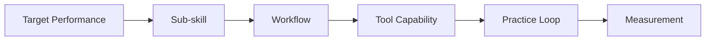
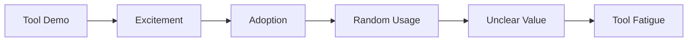
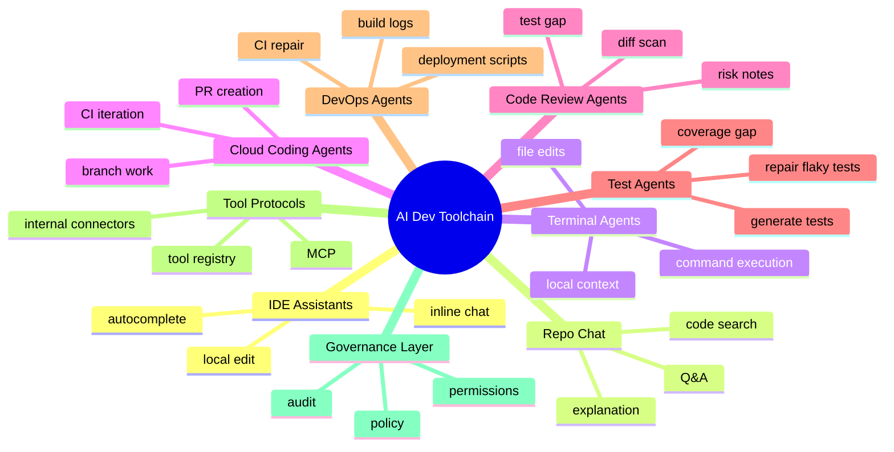
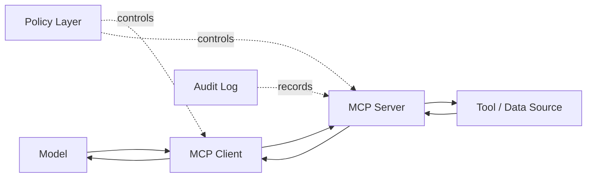
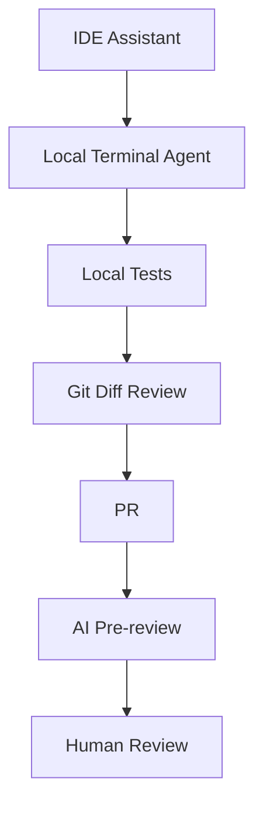
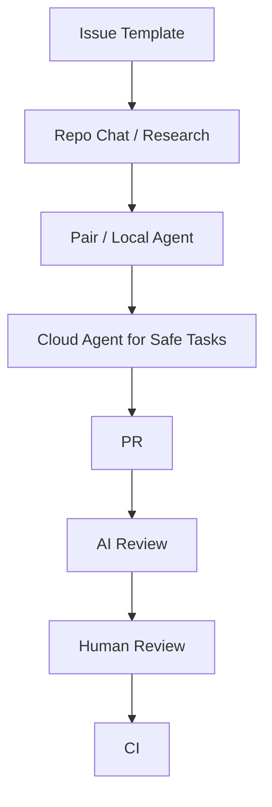
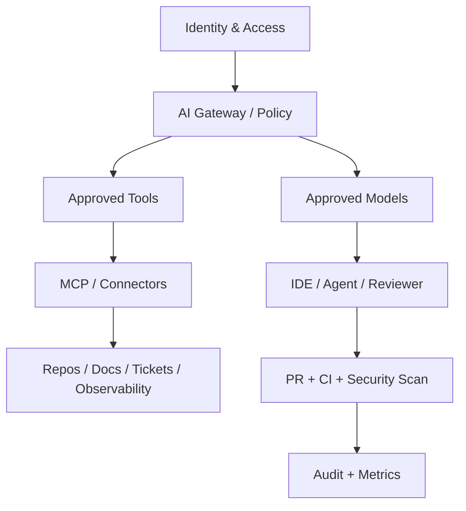
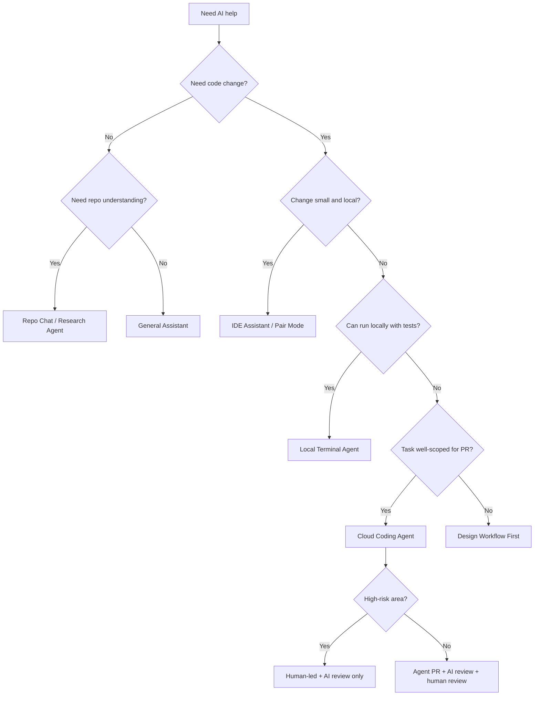
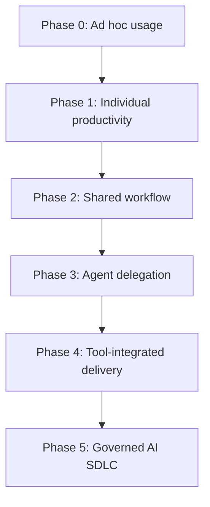

# Part 004 — Toolchain Landscape and Selection

## 1. Tujuan Part Ini

Part ini menjawab pertanyaan praktis:

> Tool AI development mana yang harus dipakai, untuk workflow apa, dengan guardrail apa, dan bagaimana menghindari pemilihan tool berdasarkan hype?

Toolchain AI development pada 2026 sudah tidak lagi sederhana. Ada autocomplete di IDE, chat di repository, terminal agent, cloud coding agent, issue-to-PR automation, AI reviewer, MCP-connected tools, dan internal agents. Banyak tim membeli tool, tetapi tidak punya operating model. Akibatnya, mereka melihat demo yang impresif namun tidak mendapatkan peningkatan delivery yang konsisten.

Part ini memberi kerangka seleksi toolchain untuk software engineer senior/staff:

1. Memahami kategori tool AI development.
2. Memetakan tool ke workflow dan risk profile.
3. Menilai tool dengan decision criteria engineering.
4. Mendesain minimal stack untuk individu, tim kecil, dan enterprise.
5. Membuat proof-of-value yang mengukur quality, bukan hanya speed.
6. Menetapkan guardrail agar tool tidak memperbesar risiko.

---

## 2. Prinsip Kaufman: Jangan Mulai dari Tool, Mulai dari Sub-Skill

Dalam kerangka Kaufman, tool adalah practice accelerator, bukan inti skill.

Urutan yang benar:



Urutan yang salah:



Pertanyaan seleksi utama bukan:

> “Tool mana yang paling pintar?”

Tetapi:

> “Workflow engineering mana yang ingin kita perbaiki, dan capability apa yang dibutuhkan untuk memperbaikinya secara aman?”

---

## 3. Landscape Toolchain AI Development

Secara praktis, tool AI development dapat dikelompokkan menjadi sembilan kategori.



Tidak semua tim butuh semua kategori. Toolchain yang terlalu kompleks justru membuat workflow sulit dikendalikan.

---

## 4. Category 1 — IDE Assistant

Contoh capability:

- autocomplete;
- inline suggestions;
- chat with current file;
- small edit command;
- test skeleton generation;
- quick explanation.

Cocok untuk:

- inner-loop coding;
- boilerplate;
- local refactor;
- syntax-heavy task;
- repetitive code pattern;
- quick test case generation.

Kelebihan:

- friction rendah;
- dekat dengan developer flow;
- mudah dikontrol karena diff kecil;
- bagus untuk learning API lokal.

Kelemahan:

- context sering sempit;
- mudah menghasilkan code yang hanya cocok untuk file saat ini;
- bisa membuat engineer menerima suggestion tanpa berpikir;
- tidak otomatis memahami architecture constraint.

Selection criteria:

| Criteria | Pertanyaan |
|---|---|
| Latency | Apakah suggestion cukup cepat untuk inner loop? |
| Context | Apakah bisa membaca workspace/repo relevan? |
| Edit Control | Apakah perubahan mudah direview sebelum diterima? |
| Language Support | Apakah stack utama didukung baik? |
| Policy | Apakah bisa dibatasi pada repo/data tertentu? |

Rule:

> IDE assistant ideal untuk mempercepat perubahan kecil, bukan untuk mengambil keputusan desain.

---

## 5. Category 2 — Repo Chat / Codebase Q&A

Repo chat membantu memahami codebase.

Cocok untuk:

- onboarding;
- mencari pattern lokal;
- menemukan entry point;
- memahami call path;
- menjelaskan dependency;
- mencari test relevan.

Kelebihan:

- menurunkan friction eksplorasi repo;
- membantu legacy code understanding;
- mempercepat impact analysis awal.

Kelemahan:

- dapat salah menyimpulkan jika indexing tidak lengkap;
- bisa melewatkan generated code, config, atau dynamic behavior;
- sering memberi jawaban abstrak tanpa file-level evidence.

Minimum requirement:

- jawaban harus menyebut file/symbol relevan;
- harus bisa dibuktikan dengan search/manual navigation;
- tidak boleh dijadikan satu-satunya sumber kebenaran untuk perubahan berisiko.

Prompt sehat:

```text
Cari alur request untuk endpoint X.
Berikan entry point, service utama, repository/persistence, external calls, existing tests, dan file references.
Jangan usulkan perubahan dulu.
```

---

## 6. Category 3 — Terminal / Local Agent

Terminal agent dapat membaca file, mengedit kode, dan menjalankan command lokal.

Contoh capability:

- inspect repo;
- edit multiple files;
- run tests;
- run linter;
- analyze logs;
- commit changes;
- integrate with MCP/tools.

Cocok untuk:

- guided implementation;
- debugging dengan logs;
- local refactor;
- test generation;
- dependency fix;
- CI failure reproduction.

Kelebihan:

- dekat dengan environment developer;
- bisa memakai test command aktual;
- dapat mengiterasi berdasarkan error nyata;
- cocok untuk codebase yang belum siap cloud agent.

Kelemahan:

- risiko command execution;
- risiko mengubah banyak file tanpa sadar;
- perlu permission model;
- sulit dipakai konsisten jika setiap engineer punya setup berbeda.

Guardrail minimum:

| Area | Guardrail |
|---|---|
| Command | Require approval untuk destructive/network command |
| Files | Batasi scope direktori jika memungkinkan |
| Git | Selalu kerja di branch bersih |
| Secrets | Jangan expose `.env`, credentials, token |
| Validation | Jalankan test spesifik sebelum general test |
| Review | Inspect diff sebelum commit |

---

## 7. Category 4 — Cloud Coding Agent

Cloud coding agent bekerja di environment terpisah, biasanya pada branch atau sandbox. Ia bisa menerima issue/task, membaca repo, membuat patch, menjalankan test, dan menghasilkan PR.

Cocok untuk:

- task yang sudah jelas;
- bug fix dengan failing test;
- docs update;
- dependency update;
- small feature;
- migration mekanis;
- cleanup rutin.

Kelebihan:

- paralelisasi kerja;
- tidak mengganggu local flow;
- dapat menghasilkan PR reviewable;
- cocok untuk batch task;
- bagus untuk delegated work.

Kelemahan:

- context environment bisa berbeda dari local/prod;
- agent bisa drift dari scope;
- PR bisa besar dan mahal direview;
- usage cost dapat sulit diprediksi;
- membutuhkan repo readiness tinggi.

Cloud agent readiness checklist:

- [ ] Build/test command terdokumentasi.
- [ ] CI stabil.
- [ ] Repo setup reproducible.
- [ ] Issue template jelas.
- [ ] Coding conventions terdokumentasi.
- [ ] Branch protection aktif.
- [ ] Secrets tidak diperlukan untuk test dasar.
- [ ] PR template meminta risk notes dan validation evidence.

Task yang cocok untuk cloud agent:

```md
## Good Cloud Agent Task

Add validation so invoice due date cannot be before issue date.

Scope:
- backend invoice domain only
- do not modify API schema
- add unit tests for valid, invalid, null due date

Validation:
- run ./gradlew test --tests InvoiceValidationTest
- run ./gradlew check if feasible

Non-goals:
- do not change invoice payment workflow
- do not change database schema
```

Task yang buruk:

```md
Improve invoice logic and make it more robust.
```

---

## 8. Category 5 — AI Code Review Agent

AI reviewer menilai diff, bukan membuat patch utama.

Cocok untuk:

- pre-review;
- checklist expansion;
- finding missing tests;
- consistency check;
- backward compatibility scan;
- security smell detection;
- PR summary.

Kelebihan:

- murah untuk first-pass feedback;
- membantu author memperbaiki obvious issue sebelum human review;
- bisa distandarkan dengan review rubric;
- mengurangi review toil.

Kelemahan:

- bisa noise;
- bisa terlalu fokus style;
- bisa melewatkan domain semantics;
- bisa memberi false confidence.

Review agent harus dikonfigurasi dengan rubric:

```md
Review priorities:
1. correctness
2. data integrity
3. backward compatibility
4. security
5. missing tests
6. operational risk
7. readability
8. style only if it affects maintainability
```

Jangan biarkan AI reviewer menjadi gate tunggal. Ia adalah filter tambahan.

---

## 9. Category 6 — Test Generation and Test Repair Agent

AI sangat kuat untuk brainstorming test, tetapi kualitas test tetap harus dievaluasi.

Cocok untuk:

- membuat test matrix;
- generate unit tests;
- menemukan missing edge cases;
- membuat characterization tests;
- memperbaiki flaky test dengan evidence;
- meningkatkan assertion quality.

Kelemahan umum:

- test terlalu mengikuti implementation detail;
- assertion lemah;
- mock berlebihan;
- test hanya mengejar coverage;
- memperbaiki test dengan menghapus behavior penting.

Test agent rubric:

| Dimension | Pertanyaan |
|---|---|
| Behavior | Apakah test membuktikan behavior, bukan detail internal? |
| Oracle | Apakah expected result jelas? |
| Negative Case | Apakah invalid path diuji? |
| Regression | Apakah test akan gagal jika bug lama kembali? |
| Maintainability | Apakah test mudah dibaca? |
| Isolation | Apakah mock tidak menutupi bug penting? |

---

## 10. Category 7 — DevOps / CI Agent

DevOps agent membantu memahami pipeline, log, dan environment.

Cocok untuk:

- build failure triage;
- dependency conflict;
- lint failure;
- test environment issue;
- Dockerfile fix;
- GitHub Actions workflow repair;
- release note generation.

Risiko:

- menambahkan workaround tanpa root cause;
- mengubah timeout/retry sembarangan;
- melemahkan checks;
- memperbaiki CI dengan mematikan test;
- membuka secret/config ke model.

Rule:

> CI agent tidak boleh melemahkan quality gate tanpa explicit human approval.

Forbidden automatic changes:

- disable test;
- remove failing assertion;
- increase timeout tanpa RCA;
- skip security scan;
- bypass branch protection;
- print secrets untuk debugging.

---

## 11. Category 8 — MCP and Tool Protocol Layer

MCP dan protocol sejenis memungkinkan AI terhubung ke external tools dan data source: file system, database, ticketing, documentation, observability, code search, dan internal APIs.

Manfaat:

- context lebih kaya;
- integrasi tools lebih standar;
- agent bisa menjalankan workflow lintas sistem;
- mengurangi custom integration yang terfragmentasi.

Risiko:

- permission terlalu luas;
- prompt injection melalui tool output;
- tool call yang tidak diharapkan;
- data exfiltration;
- audit trail lemah;
- supply chain risk dari connector.

MCP-style capability harus dipandang sebagai **privilege escalation surface**.



Minimum governance:

- least privilege per tool;
- read-only default;
- explicit approval for write actions;
- allowlist commands;
- log tool calls;
- classify data sensitivity;
- sanitize tool output;
- separate dev/test/prod access.

---

## 12. Category 9 — Governance and Observability Layer

AI toolchain tanpa governance akan sulit dipertahankan di enterprise.

Governance layer menjawab:

- siapa boleh memakai tool apa;
- data apa yang boleh dikirim;
- repo mana yang boleh diakses;
- action apa yang boleh dilakukan;
- bagaimana audit dilakukan;
- bagaimana incident ditangani;
- bagaimana nilai diukur.

Komponen governance minimal:

| Component | Fungsi |
|---|---|
| Policy | aturan penggunaan AI per risk class |
| Identity | mapping user, team, repo, permission |
| Audit | log prompt, tool call, PR, approval jika tersedia |
| Review Gate | human approval untuk high-risk changes |
| Data Classification | public/internal/confidential/restricted |
| Metrics | productivity, quality, cost, review burden |
| Incident Process | response jika output AI menyebabkan masalah |

---

## 13. Tool Selection Criteria

Gunakan criteria berikut untuk memilih tool.

### 13.1 Capability Fit

Pertanyaan:

- Apakah tool mendukung workflow target?
- Apakah ia bisa membaca repo dengan cukup baik?
- Apakah ia bisa menjalankan test?
- Apakah ia bisa bekerja di branch/PR?
- Apakah ia bisa memakai docs/internal context?

### 13.2 Control and Reviewability

Pertanyaan:

- Apakah setiap perubahan terlihat sebagai diff?
- Apakah command perlu approval?
- Apakah agent bisa dibatasi scope?
- Apakah ada logs?
- Apakah mudah rollback?

### 13.3 Security and Compliance

Pertanyaan:

- Data apa yang dikirim ke vendor/model?
- Apakah ada enterprise data controls?
- Apakah training on customer data bisa dimatikan?
- Apakah secrets terlindungi?
- Apakah akses repo bisa dibatasi?
- Apakah audit trail tersedia?

### 13.4 Integration Fit

Pertanyaan:

- Apakah tool terintegrasi dengan IDE utama?
- Apakah mendukung GitHub/GitLab/Bitbucket?
- Apakah mendukung CI system?
- Apakah mendukung ticketing system?
- Apakah bisa memakai MCP atau connector internal?

### 13.5 Model and Reasoning Quality

Pertanyaan:

- Apakah tool kuat di bahasa/framework utama?
- Apakah ia memahami codebase besar?
- Apakah ia stabil pada multi-file edits?
- Apakah ia bisa memperbaiki error berdasarkan test output?
- Apakah ia cenderung over-change?

### 13.6 Economics

Pertanyaan:

- Cost per engineer?
- Cost per agent run?
- Usage limit?
- Hidden cost dari review PR AI?
- Cost jika agent menghasilkan PR ditolak?
- Productivity gain yang bisa diukur?

### 13.7 Organizational Fit

Pertanyaan:

- Apakah tim siap dengan PR review discipline?
- Apakah test suite cukup kuat?
- Apakah repo setup reproducible?
- Apakah engineering policy jelas?
- Apakah ada champion dan support?

---

## 14. Weighted Scorecard

Contoh scorecard untuk memilih tool.

| Criteria | Weight | Tool A | Tool B | Tool C |
|---|---:|---:|---:|---:|
| Inner-loop coding | 10 |  |  |  |
| Repo understanding | 10 |  |  |  |
| Multi-file edit | 10 |  |  |  |
| Test execution | 10 |  |  |  |
| PR workflow | 10 |  |  |  |
| Security controls | 15 |  |  |  |
| Permission model | 10 |  |  |  |
| Auditability | 10 |  |  |  |
| Integration fit | 10 |  |  |  |
| Cost predictability | 5 |  |  |  |

Scoring:

- 1 = poor;
- 2 = usable with major limitation;
- 3 = acceptable;
- 4 = strong;
- 5 = excellent.

Decision rule:

> Jangan pilih tool dengan skor security/control rendah hanya karena coding demo-nya impresif.

---

## 15. Toolchain Architecture Patterns

### 15.1 Individual Engineer Stack

Cocok untuk personal productivity.



Minimum stack:

- IDE assistant;
- terminal/local agent;
- AI reviewer optional;
- strong local test command;
- clean git workflow.

### 15.2 Small Team Stack

Cocok untuk tim 5–15 engineer.



Tambahan penting:

- shared prompt templates;
- PR template with validation evidence;
- repo instruction file;
- team policy for high-risk changes;
- metric review setiap sprint.

### 15.3 Enterprise Stack

Cocok untuk regulated/system-critical organization.



Enterprise stack butuh:

- approved vendor/model list;
- data classification;
- central policy;
- auditability;
- secret scanning;
- branch protection;
- risk-based autonomy;
- exception process.

---

## 16. Matching Tool to Workflow

| Workflow | IDE Assistant | Repo Chat | Local Agent | Cloud Agent | AI Reviewer | MCP/Tools |
|---|---:|---:|---:|---:|---:|---:|
| Understand code | medium | high | high | medium | low | medium |
| Small implementation | high | medium | high | medium | medium | low |
| Large delegated task | low | medium | medium | high | high | medium |
| Debug CI | low | medium | high | medium | medium | high |
| Generate tests | high | medium | high | medium | high | low |
| Review PR | low | medium | low | low | high | medium |
| Update docs | medium | high | medium | high | medium | medium |
| Cross-system analysis | low | medium | medium | medium | medium | high |

Interpretasi:

- Gunakan IDE assistant untuk speed.
- Gunakan repo chat untuk understanding.
- Gunakan local agent untuk controlled edit-test loop.
- Gunakan cloud agent untuk delegated PR work.
- Gunakan AI reviewer untuk reduce review toil.
- Gunakan MCP/tools jika context tersebar lintas sistem.

---

## 17. Decision Tree Pemilihan Tool



---

## 18. Repository Readiness for AI Tools

Tool bagus tidak akan banyak membantu jika repo tidak readable dan tidak reproducible.

AI-ready repo memiliki:

1. Clear module boundaries.
2. Test commands documented.
3. Local setup reproducible.
4. CI deterministic.
5. PR template jelas.
6. Architecture notes tersedia.
7. Coding conventions tertulis.
8. Error messages meaningful.
9. Generated code dipisahkan.
10. Secrets tidak dibutuhkan untuk test dasar.

AI-unready repo biasanya punya:

- setup tribal knowledge;
- flaky CI;
- hidden environment dependency;
- unclear package boundaries;
- no tests;
- giant modules;
- inconsistent patterns;
- docs stale;
- manual deployment steps.

Rule:

> AI toolchain maturity dibatasi oleh engineering hygiene repo.

---

## 19. Proof-of-Value, Bukan Proof-of-Demo

Jangan menilai tool dari demo. Nilai dari task nyata.

### 19.1 PoV Design

Pilih 10–20 task dari backlog:

- 5 low-risk repetitive tasks;
- 5 bug fixes;
- 5 test/doc tasks;
- 3 medium complexity feature slices;
- 2 CI/debug tasks.

Untuk setiap task, ukur:

- time to first useful diff;
- total cycle time;
- review comments;
- rework count;
- tests added;
- CI pass rate;
- defect risk;
- subjective cognitive load;
- final merge rate.

### 19.2 Control Group

Bandingkan:

- manual baseline;
- IDE assistant only;
- local agent;
- cloud agent;
- AI review added.

Jangan hanya ukur “berapa cepat kode ditulis”. Ukur juga review burden.

### 19.3 Success Criteria

Tool dianggap bernilai jika:

- cycle time turun tanpa defect risk naik;
- review burden tidak naik signifikan;
- test quality membaik;
- PR lebih kecil atau sama;
- developer bisa menjelaskan perubahan;
- high-risk task tetap terkendali;
- cost masuk akal.

---

## 20. Metrics yang Harus Dihindari

Metrik yang menyesatkan:

| Metric | Masalah |
|---|---|
| Lines of code generated | lebih banyak kode bukan lebih baik |
| Number of prompts | tidak menunjukkan quality |
| Number of AI PRs | bisa menaikkan review load |
| Acceptance rate autocomplete | bisa mendorong blind acceptance |
| Coverage percentage only | coverage bisa shallow |
| Time saved self-report only | bias dan sulit diverifikasi |

Metrik yang lebih sehat:

| Metric | Kenapa Lebih Baik |
|---|---|
| Lead time per merged PR | mengukur delivery nyata |
| Rework count | mengukur kualitas awal |
| Defect escape | mengukur risiko |
| Review comments by severity | mengukur correctness |
| Test quality rubric | mengukur confidence |
| CI pass after first PR | mengukur readiness |
| PR size distribution | mengukur reviewability |
| Agent PR merge rate | mengukur delegation effectiveness |
| Cost per merged useful change | mengukur economics |

---

## 21. Risk-Based Tool Policy

Contoh policy sederhana:

| Risk Class | Area | AI Allowed | Required Gate |
|---|---|---|---|
| Low | docs, tests, formatting | assistant/agent | normal review |
| Medium | local business logic | pair/local agent | tests + human review |
| High | API contract, DB migration | design assist only or guided edit | design review + tests |
| Critical | auth, payment, compliance, irreversible data | analysis/review only by default | security/domain approval |

Policy harus jelas bahwa “AI allowed” bukan berarti “AI decides”.

---

## 22. Vendor and Model Evaluation Questions

Pertanyaan untuk vendor/tool:

### Data and Privacy

- Apakah prompt dan code digunakan untuk training?
- Bagaimana data retention?
- Apakah ada regional controls?
- Apakah bisa disable telemetry tertentu?
- Bagaimana handling secrets?

### Access Control

- Apakah bisa membatasi repo?
- Apakah bisa membatasi action?
- Apakah mendukung SSO/SCIM?
- Apakah ada role-based access?

### Audit

- Apakah tool call log tersedia?
- Apakah PR yang dibuat agent bisa diidentifikasi?
- Apakah prompt/session history bisa diekspor untuk audit?
- Apakah ada admin dashboard?

### Safety

- Apakah command execution butuh approval?
- Apakah network access bisa dibatasi?
- Apakah ada sandbox isolation?
- Apakah agent bisa mengakses secrets?

### Engineering Fit

- Apakah mendukung monorepo?
- Apakah bisa menjalankan test lama?
- Apakah bisa memahami generated code?
- Apakah bisa mengikuti repo instruction file?
- Apakah bisa membuat PR kecil?

---

## 23. Minimal Recommended Stack

### 23.1 Untuk Individual Senior Engineer

Minimum:

1. IDE assistant untuk inline help.
2. Local/terminal agent untuk edit-test loop.
3. AI reviewer prompt manual untuk diff review.
4. Personal prompt library.
5. Clean git branch discipline.

Jangan mulai dari cloud automation jika local workflow belum matang.

### 23.2 Untuk Tim Product Engineering

Minimum:

1. IDE assistant standar.
2. Repo instruction file.
3. Shared issue template untuk AI-ready task.
4. AI reviewer untuk PR pre-check.
5. Cloud agent hanya untuk low/medium risk tasks.
6. Metric dashboard sederhana.
7. Policy high-risk changes.

### 23.3 Untuk Enterprise/Regulated Engineering

Minimum:

1. Approved model/tool registry.
2. AI gateway atau admin control.
3. Data classification.
4. Permissioned tool access.
5. Audit log.
6. Secure sandbox.
7. PR and CI gates.
8. AI usage policy by risk class.
9. Incident response.
10. Periodic evaluation.

---

## 24. Migration Path: Dari Manual ke AI-Augmented Team



### Phase 0 — Ad hoc Usage

Ciri:

- engineer memakai tool masing-masing;
- tidak ada policy;
- tidak ada measurement;
- output tidak konsisten.

Target naik fase:

- buat baseline policy;
- sepakati risk boundary;
- kumpulkan use case.

### Phase 1 — Individual Productivity

Ciri:

- IDE assistant dan chat mulai dipakai;
- prompt masih personal;
- belum ada shared standard.

Target naik fase:

- buat prompt library;
- dokumentasikan workflow sukses;
- mulai track task examples.

### Phase 2 — Shared Workflow

Ciri:

- issue template jelas;
- PR template minta validation evidence;
- AI review mulai distandarkan.

Target naik fase:

- repo readiness improvement;
- cloud agent pilot;
- metrics ringan.

### Phase 3 — Agent Delegation

Ciri:

- cloud/local agent mengerjakan task tertentu;
- PR agent direview manusia;
- task selection semakin baik.

Target naik fase:

- risk-based policy;
- cost tracking;
- failure mode analysis.

### Phase 4 — Tool-Integrated Delivery

Ciri:

- AI terhubung ke repo, docs, ticket, CI;
- MCP/connectors mulai dipakai;
- workflow lintas sistem.

Target naik fase:

- stronger permission;
- audit trail;
- security review.

### Phase 5 — Governed AI SDLC

Ciri:

- AI menjadi bagian dari SDLC;
- policy, metrics, review, audit matang;
- improvement loop berjalan.

---

## 25. Common Toolchain Anti-Patterns

| Anti-Pattern | Contoh | Dampak | Perbaikan |
|---|---|---|---|
| Tool-first adoption | beli tool sebelum workflow jelas | value tidak terlihat | mulai dari use case |
| Autonomy inflation | semua task dikirim ke agent | PR noise | risk-based delegation |
| Review bypass | AI PR dianggap siap merge | defect risk | human review gate |
| Context dumping | semua docs dimasukkan ke prompt | noise dan leakage | curated context |
| No repo readiness | agent gagal setup project | wasted runs | document setup/test |
| Security afterthought | MCP tools diberi akses luas | data/action risk | least privilege |
| Metric vanity | ukur LOC generated | false productivity | ukur merged useful change |
| Tool sprawl | banyak tool tanpa standard | inconsistency | approved stack |
| Prompt tribalism | prompt bagus hanya di kepala senior | tidak scalable | prompt library |
| Cost blindness | agent run tidak dilacak | budget shock | cost per outcome |

---

## 26. Example Selection Scenario

### Context

Tim backend 12 engineer, Java/Kotlin services, GitHub, CI cukup stabil, banyak task bug fix dan test debt. Mereka ingin AI mempercepat delivery tanpa menaikkan defect.

### Recommended Stack

1. IDE assistant untuk semua engineer.
2. Repo chat untuk codebase understanding.
3. Local terminal agent untuk guided edits.
4. AI reviewer untuk PR pre-check.
5. Cloud agent pilot hanya untuk:
   - docs update;
   - test generation;
   - simple bug fix with reproduction;
   - dependency minor update.

### Tidak Direkomendasikan Dulu

- full autonomous issue-to-merge;
- MCP write access ke production tools;
- cloud agent untuk database migration;
- AI-generated auth/security changes tanpa design review.

### Measurement

Selama 4 minggu:

- compare cycle time;
- PR size;
- review comments;
- merge rate;
- escaped bugs;
- developer cognitive load;
- cost per merged PR.

### Expected Learning

Jika PR agent banyak ditolak, masalahnya mungkin bukan model saja. Bisa jadi:

- issue terlalu ambigu;
- tests lemah;
- repo setup tidak reproducible;
- task terlalu besar;
- acceptance criteria tidak jelas;
- reviewer rubric belum distandarkan.

---

## 27. Practice Plan 2 Jam untuk Part Ini

### Latihan 1 — Tool Inventory (20 menit)

Buat daftar tool AI yang dipakai pribadi/tim.

Untuk setiap tool, isi:

- category;
- workflow;
- data access;
- write capability;
- auditability;
- risk.

### Latihan 2 — Workflow-to-Tool Mapping (25 menit)

Ambil 10 task engineering. Tentukan tool terbaik untuk tiap task.

Kolom:

- task;
- risk class;
- workflow;
- tool;
- required evidence;
- human gate.

### Latihan 3 — Scorecard (30 menit)

Bandingkan 2–3 tool menggunakan weighted scorecard.

Jangan beri skor berdasarkan demo. Gunakan task nyata.

### Latihan 4 — Repo Readiness Audit (25 menit)

Nilai repo dengan checklist:

- setup;
- tests;
- docs;
- CI;
- PR template;
- module boundaries;
- secret handling.

### Latihan 5 — Policy Draft (20 menit)

Buat policy satu halaman:

- allowed use;
- restricted use;
- forbidden autonomous changes;
- review gates;
- data rules.

---

## 28. Checklist Pemilihan Tool

Sebelum memilih tool:

- [ ] Workflow target jelas.
- [ ] Risk class diketahui.
- [ ] Repo readiness dinilai.
- [ ] Data/privacy requirement jelas.
- [ ] Tool bisa menghasilkan reviewable diff.
- [ ] Command/action bisa dikontrol.
- [ ] CI/test integration tersedia.
- [ ] Audit atau session trace cukup.
- [ ] Cost model dipahami.
- [ ] Pilot success metric disepakati.

Sebelum rollout tim:

- [ ] Ada approved use case.
- [ ] Ada prompt/task template.
- [ ] Ada PR review rubric.
- [ ] Ada human gate untuk high-risk change.
- [ ] Ada metric baseline.
- [ ] Ada security review.
- [ ] Ada incident path.

---

## 29. Kesimpulan

Toolchain AI development harus dipilih seperti engineering platform, bukan seperti productivity gadget.

Prinsip utama:

1. Mulai dari workflow, bukan tool.
2. Cocokkan autonomy dengan risk.
3. Pastikan output reviewable.
4. Pastikan validation evidence tersedia.
5. Jangan membeli autonomy tanpa governance.
6. Ukur value dari merged useful change, bukan jumlah kode yang dihasilkan.
7. Kesiapan repo menentukan efektivitas tool.

Mental model yang harus dibawa:

> Tool AI terbaik bukan yang paling impresif saat demo, tetapi yang paling konsisten menghasilkan perubahan kecil, benar, teruji, aman, dan mudah direview dalam konteks repo nyata.

---

## References

- OpenAI Codex: AI Coding Partner — https://openai.com/codex/
- OpenAI Introducing Codex — https://openai.com/index/introducing-codex/
- GitHub Copilot Cloud Agent Documentation — https://docs.github.com/en/copilot/concepts/agents/cloud-agent/about-cloud-agent
- GitHub Copilot Sessions Documentation — https://docs.github.com/en/copilot/how-tos/use-copilot-agents/cloud-agent/start-copilot-sessions
- GitHub Blog: Assigning and completing issues with coding agent — https://github.blog/ai-and-ml/github-copilot/assigning-and-completing-issues-with-coding-agent-in-github-copilot/
- Anthropic Claude Code — https://claude.com/product/claude-code
- Anthropic Tool Use Documentation — https://platform.claude.com/docs/en/agents-and-tools/tool-use/overview
- Model Context Protocol Introduction — https://modelcontextprotocol.io/docs/getting-started/intro
- OWASP Top 10 for LLM Applications — https://owasp.org/www-project-top-10-for-large-language-model-applications/
- NIST AI Risk Management Framework — https://www.nist.gov/itl/ai-risk-management-framework
