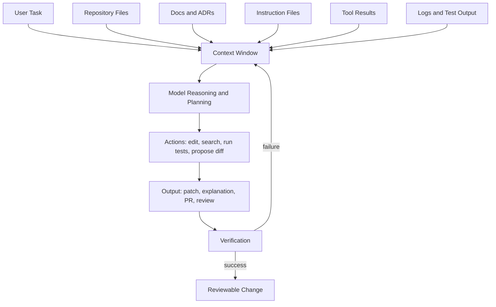
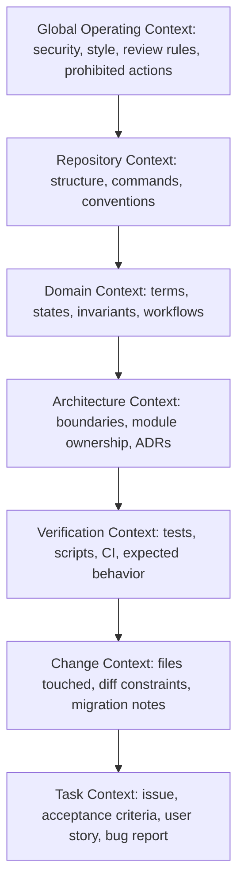
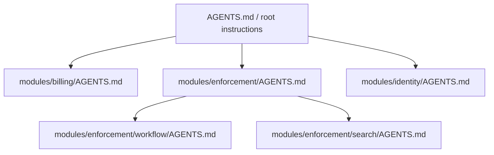

------
title: Learn AI Development Driven Implementation and Usage - Part 005
description: Context engineering for software delivery: how to design repository, task, architecture, and runtime context so AI coding assistants and agents produce reviewable, safe, and useful implementation work.
series: learn-ai-development-driven-implementation-usage
seriesTitle: Learn AI Development Driven Implementation and Usage
order: 5
partTitle: Context Engineering for Software Delivery
tags:
- ai
- software-engineering
- context-engineering
- coding-agents
- implementation
- delivery
- series
date: 2026-06-30
---

# Part 005 — Context Engineering for Software Delivery

> Goal: setelah bagian ini, kamu mampu mendesain context layer untuk AI-assisted delivery sehingga AI tidak hanya “menjawab dengan benar”, tetapi bekerja dalam batas arsitektur, coding convention, testing discipline, risk appetite, dan workflow repository yang benar.

AI-driven implementation sering gagal bukan karena modelnya “kurang pintar”, tetapi karena context yang diberikan membuat model menebak. Dalam software delivery, tebakan adalah sumber defect: salah memahami domain, salah memilih file, salah memakai pattern, salah mengubah public contract, salah memperbaiki symptom, atau membuat test yang hanya membuktikan implementasi barunya sendiri.

**Context engineering** adalah disiplin untuk membentuk informasi yang diterima AI agar tugas implementasi menjadi:

1. **Bounded** — jelas ruang kerja dan larangannya.
2. **Grounded** — berbasis fakta repo, bukan asumsi umum.
3. **Actionable** — cukup untuk membuat perubahan nyata.
4. **Verifiable** — ada command, test, acceptance criteria, dan review gate.
5. **Composable** — bisa dipakai ulang lintas issue, PR, dan agent.
6. **Cheap enough** — tidak membanjiri model dengan dokumen tidak relevan.

Bagian ini bukan prompt engineering generik. Ini adalah desain **software delivery context system**.

---

## 1. Kaufman Skill Deconstruction

Dalam kerangka Josh Kaufman, skill “AI-driven implementation” harus dipecah menjadi sub-skill yang bisa dilatih cepat. Untuk part ini, skill utamanya adalah:

> Membuat AI memahami pekerjaan implementasi dengan cukup benar sehingga output-nya bisa langsung masuk ke review engineering, bukan menjadi draft spekulatif.

Sub-skill yang perlu dikuasai:

| Sub-skill | Output yang terlihat | Failure mode jika lemah |
|---|---|---|
| Task context framing | AI tahu masalah, target behavior, dan batas scope | AI mengubah terlalu banyak file atau memperbaiki hal yang salah |
| Repository context design | AI tahu struktur repo, command, convention, dan module boundary | AI membuat pattern baru yang tidak konsisten |
| Domain context extraction | AI tahu istilah domain, state, actor, invariant, dan exception | AI menghasilkan logic yang syntactically valid tapi salah secara bisnis |
| Architectural context compression | AI tahu constraint arsitektur tanpa membaca semua dokumen | AI melanggar layering, ownership, atau data flow |
| Example selection | AI melihat contoh implementasi yang tepat | AI meniru contoh buruk atau obsolete |
| Test context definition | AI tahu test mana yang harus dibuat/dijalankan | AI membuat test kosmetik atau tidak menjalankan verifikasi relevan |
| Context minimization | AI tidak dibanjiri context noise | Token habis, model fokus pada instruksi tidak penting |
| Drift detection | Ada cara mengetahui AI keluar dari context | Perubahan menyimpang baru ketahuan saat review akhir |

Kaufman menekankan belajar cukup untuk self-correct. Dalam konteks ini, self-correction berarti kamu mampu melihat kapan output AI salah karena:

- prompt/task-nya kabur,
- context-nya kurang,
- context-nya terlalu banyak,
- contoh yang diberikan salah,
- repo tidak AI-readable,
- verifikasinya tidak jelas,
- atau task sebenarnya terlalu besar untuk satu agent pass.

---

## 2. Mental Model: Context Is the Runtime Environment of the AI Worker

AI coding agent bukan hanya menerima instruksi. Ia “bekerja” di atas representasi mental tentang repo. Representasi ini dibangun dari:



Untuk engineer manusia, context bisa tersebar di kepala, Slack, Jira, diagram lama, production incident, dan historical PR. Untuk AI, context hanya efektif jika tersedia dalam bentuk yang bisa dibaca, diprioritaskan, dan dipakai saat membuat keputusan.

Maka prinsip dasarnya:

> Jangan berharap AI “paham repo”. Buat repo dan task menjadi bisa dipahami oleh worker yang hanya melihat potongan informasi tertentu dalam waktu terbatas.

---

## 3. Context Engineering vs Prompt Engineering

Prompt engineering sering dipahami sebagai “menulis instruksi yang bagus”. Context engineering lebih luas.

| Dimensi | Prompt Engineering | Context Engineering |
|---|---|---|
| Unit utama | Satu instruksi | Sistem informasi kerja |
| Fokus | Cara bertanya | Apa yang perlu diketahui AI untuk bekerja benar |
| Scope | Chat/task | Repo, docs, tests, tools, policies, examples |
| Output | Jawaban lebih baik | Delivery workflow lebih reliable |
| Failure yang ditangani | Jawaban tidak sesuai | Implementasi salah, diff tidak reviewable, policy violation |
| Artefak | Prompt template | AGENTS.md, CLAUDE.md, custom instructions, issue template, ADR, scripts, tests, guardrails |

Prompt adalah salah satu control surface. Context engineering mencakup semua hal yang membuat prompt itu grounded.

---

## 4. The Context Stack

Untuk software delivery, context bisa disusun sebagai stack.



Setiap layer menjawab pertanyaan berbeda:

| Layer | Pertanyaan yang dijawab |
|---|---|
| Global operating context | Bagaimana AI boleh bekerja? Apa yang tidak boleh dilakukan? |
| Repository context | Repo ini dibangun, dites, dan dijalankan dengan cara apa? |
| Domain context | Konsep bisnis apa yang tidak boleh salah dipahami? |
| Architecture context | Boundary apa yang harus dipertahankan? |
| Verification context | Bagaimana tahu perubahan benar? |
| Change context | Perubahan mana yang sedang dibuat dan risiko apa yang ada? |
| Task context | Apa target pekerjaan saat ini? |

Semakin atas layer-nya, semakin spesifik terhadap task. Semakin bawah, semakin reusable.

---

## 5. Golden Rule: Context Must Reduce Search Space

Context yang baik bukan context yang banyak. Context yang baik mengurangi ruang kemungkinan.

Buruk:

```text
Implement this feature. Follow best practices. Make sure it is clean.
```

Lebih baik:

```text
Implement the new enforcement escalation reason filter in the case search API.

Scope:
- Only modify search request parsing, repository predicate construction, and API-level tests.
- Do not change database schema.
- Do not change public response shape.
- Use the existing enum EnforcementEscalationReason.

Expected behavior:
- When escalationReason is absent, current behavior is unchanged.
- When escalationReason is present, return only cases with matching escalation reason.
- Invalid enum values must return the same validation error format used by status filters.

Verification:
- Add API tests mirroring CaseSearchStatusFilterTest.
- Run ./gradlew test --tests '*CaseSearch*'.
```

Yang berubah bukan sekadar panjang instruksi. Yang berubah adalah **entropy**. AI tidak perlu menebak:

- layer mana yang diubah,
- response contract boleh berubah atau tidak,
- enum mana yang canonical,
- error behavior mengikuti pattern apa,
- test mana yang relevan,
- command verifikasi apa.

---

## 6. Types of Context in AI-Driven Implementation

### 6.1 Intent Context

Intent context menjawab: “Kenapa perubahan ini ada?”

Contoh:

```text
We need to expose escalationReason as a search filter because compliance analysts currently export all escalated cases and filter manually. The filter must preserve existing default search behavior.
```

Intent penting karena AI sering memilih solusi berbeda tergantung alasan bisnisnya. Jika intent adalah “membuat analyst lebih cepat”, solusi mungkin menambah filter. Jika intent adalah “membuat audit defensible”, solusi mungkin membutuhkan event log, immutable reason, atau migration.

### 6.2 Behavioral Context

Behavioral context menjawab: “Apa behavior yang harus benar?”

Contoh:

```text
Rules:
- Closed cases are still searchable.
- Soft-deleted cases are never returned.
- Case visibility still follows jurisdiction access rules.
- escalationReason filter is applied after jurisdiction restriction, not before.
```

Ini lebih kuat daripada “implement filter”. Ia menyatakan invariant.

### 6.3 Structural Context

Structural context menjawab: “Di mana perubahan seharusnya terjadi?”

Contoh:

```text
Relevant code areas:
- API request DTO: CaseSearchRequest
- Query builder: CaseSearchPredicateBuilder
- Repository adapter: JpaCaseSearchRepository
- Existing tests: CaseSearchStatusFilterTest, CaseSearchDateRangeTest
```

Tanpa structural context, agent bisa membuat service baru, helper baru, mapper baru, atau query path baru yang sebenarnya tidak perlu.

### 6.4 Constraint Context

Constraint context menjawab: “Apa yang tidak boleh dilanggar?”

Contoh:

```text
Constraints:
- Do not add a new endpoint.
- Do not alter search pagination semantics.
- Do not bypass CaseVisibilityPolicy.
- Do not introduce raw SQL unless existing query builder cannot express the predicate.
- Do not update generated OpenAPI manually; use ./gradlew generateOpenApi.
```

Constraint yang baik harus spesifik. “Jangan merusak behavior existing” terlalu umum.

### 6.5 Example Context

Example context menjawab: “Pattern existing mana yang harus ditiru?”

Contoh:

```text
Use CaseSearchStatusFilterTest as the closest implementation example. It already covers enum parsing, validation error shape, and repository predicate verification.
```

Contoh adalah context paling kuat sekaligus paling berbahaya. Jika contoh yang diberikan buruk, agent akan meniru keburukannya dengan sangat konsisten.

### 6.6 Verification Context

Verification context menjawab: “Bagaimana output akan dibuktikan?”

Contoh:

```text
Verification commands:
- ./gradlew test --tests 'CaseSearchStatusFilterTest'
- ./gradlew test --tests 'CaseSearchEscalationReasonFilterTest'
- ./gradlew checkstyleMain checkstyleTest

Expected result:
- All existing CaseSearch tests remain green.
- New test fails before implementation and passes after implementation.
```

AI harus diberi tahu bukan hanya membuat code, tetapi juga bagaimana mendemonstrasikan kebenaran.

---

## 7. Repository-Level Context Files

Banyak coding agent modern mendukung file instruksi repository seperti `AGENTS.md`, `CLAUDE.md`, atau custom instruction file lain. Tujuannya sama: memberikan context dan aturan kerja yang selalu tersedia untuk agent.

Namun, file seperti ini tidak boleh menjadi dumping ground. Jika terlalu panjang atau terlalu normative, agent akan menghabiskan perhatian pada aturan yang tidak relevan, bahkan dapat menurunkan task success rate. Gunakan sebagai **minimal operating manual**, bukan buku arsitektur lengkap.

### 7.1 Isi Minimal yang Bernilai Tinggi

File repository instruction yang efektif biasanya mencakup:

```text
# Repository Instructions

## Project Purpose
One paragraph explaining what this system does and who depends on it.

## Architecture Boundaries
- API layer must not access persistence entities directly.
- Domain services own state transition rules.
- Repository adapters translate domain query objects into persistence queries.

## Common Commands
- Build: ./gradlew build
- Unit tests: ./gradlew test
- Integration tests: ./gradlew integrationTest
- Format: ./gradlew spotlessApply

## Testing Rules
- Add or update tests for behavior changes.
- Prefer existing test patterns in the same module.
- Do not remove failing tests unless the user explicitly asks and explains why.

## Change Safety
- Keep diffs small and scoped.
- Do not change public API contracts without updating contract tests and docs.
- Do not introduce new dependencies without justification.

## Security Rules
- Do not log secrets, tokens, PII, or raw authorization headers.
- Do not disable authentication or authorization checks to make tests pass.
```

Ini cukup untuk mengarahkan agent tanpa membebaninya.

### 7.2 Apa yang Tidak Cocok Masuk Repository Instruction

Hindari memasukkan:

- sejarah panjang project,
- semua ADR penuh,
- style preference minor yang tidak enforceable,
- daftar ratusan command,
- guideline abstrak seperti “write clean code”,
- aturan yang saling konflik,
- policy yang tidak pernah diverifikasi,
- detail domain yang hanya relevan untuk satu bounded context.

Prinsipnya:

> Repository instruction harus berisi aturan yang sering dipakai, lintas task, dan berdampak besar jika dilanggar.

### 7.3 Hierarchical Context

Untuk monorepo, satu file root jarang cukup. Gunakan hierarchy.



Root instructions berisi operating rule umum. Module instructions berisi boundary dan command spesifik. Submodule instructions hanya untuk area yang sangat berbeda.

### 7.4 Instruction Precedence

Jika beberapa context layer bertabrakan, agent membutuhkan precedence rule.

Contoh:

```text
Instruction precedence:
1. Explicit user task instruction in the current conversation.
2. Security and compliance rules in this file.
3. Module-level AGENTS.md rules.
4. Existing code patterns in the same module.
5. General language/framework conventions.

If instructions conflict, stop and explain the conflict before editing code.
```

Tanpa precedence, AI akan memilih aturan yang terdengar paling kuat, bukan yang paling benar.

---

## 8. Task-Level Context Template

Untuk setiap issue yang didelegasikan ke AI, gunakan task context template.

```md
# Task
Implement ...

# Why
...

# Scope
Allowed:
- ...

Not allowed:
- ...

# Current Behavior
...

# Expected Behavior
...

# Relevant Files
- ...

# Existing Patterns to Follow
- ...

# Invariants
- ...

# Edge Cases
- ...

# Verification
Commands:
- ...

Expected checks:
- ...

# Output Required
- Brief plan before editing.
- Small scoped diff.
- Summary of changed files.
- Tests added/updated.
- Known risks or follow-ups.
```

Template ini tidak harus selalu lengkap. Tetapi untuk task non-trivial, bagian `Scope`, `Expected Behavior`, `Invariants`, dan `Verification` hampir selalu wajib.

---

## 9. Context Compression

Software repo nyata terlalu besar untuk dimasukkan penuh. Context harus dikompresi.

Compression yang buruk:

```text
This is a Spring Boot app using JPA and Kafka. Follow best practices.
```

Compression yang baik:

```text
This module implements case lifecycle transitions.
The domain layer owns transition validity.
Persistence stores current state and transition history.
Kafka events are emitted only after transaction commit.
Do not emit events directly from controllers.
Use CaseTransitionService as the entry point for state changes.
```

Perbedaannya: compression yang baik mempertahankan **decision-relevant facts**.

### 9.1 Context Compression Formula

Gunakan formula:

```text
Context = Purpose + Boundary + Canonical Path + Invariants + Verification
```

Contoh untuk module enforcement workflow:

```text
Purpose:
- Manages enforcement case state transitions from intake to closure.

Boundary:
- Controllers translate HTTP to commands.
- Domain services validate transitions.
- Repositories persist state and history.
- Event publishers emit post-commit lifecycle events.

Canonical path:
- CaseWorkflowController -> CaseWorkflowApplicationService -> CaseTransitionService -> CaseRepository -> CaseLifecycleEventPublisher

Invariants:
- A closed case cannot re-enter investigation without explicit reopen command.
- Every state transition must append transition history.
- Every externally visible transition must produce an audit event.

Verification:
- Run CaseTransitionServiceTest and CaseWorkflowControllerIT.
```

---

## 10. Context as Invariants, Not Just Documentation

AI lebih mudah mematuhi aturan yang berbentuk invariant daripada esai.

Kurang efektif:

```text
The workflow module is important and must maintain auditability.
```

Lebih efektif:

```text
Workflow invariants:
- Every state transition must be persisted with actor, timestamp, previous state, next state, reason, and correlation id.
- Transition persistence and current-state update must occur in the same transaction.
- Event publication must happen after transaction commit.
- API responses must never expose internal reviewer notes.
```

Invariant membuat AI punya guardrail konkret. Untuk sistem regulasi, enforcement, finance, telecom, health, dan domain high-accountability lain, invariant adalah bentuk context paling penting.

---

## 11. Context for Regulatory and Defensible Systems

Dalam sistem regulasi dan enforcement lifecycle, AI tidak boleh hanya “membuat code jalan”. Ia harus menjaga defensibility.

Context harus memasukkan:

| Area | Context yang perlu diberikan |
|---|---|
| Case state | Allowed states, transition rule, terminal states, reopen rule |
| Actor authority | Role, delegation, jurisdiction, approval threshold |
| Evidence | Mutability, chain of custody, redaction rule, retention rule |
| Audit | Event completeness, timestamp source, correlation id, actor identity |
| Decision | Decision reason, policy basis, appeal path, explainability boundary |
| Notification | Who is notified, when, what data is allowed |
| SLA | Deadline calculation, pause/resume rule, escalation trigger |
| Data access | Jurisdiction restriction, role-based visibility, PII masking |

Contoh context untuk AI:

```text
Regulatory defensibility invariants:
- Do not overwrite enforcement decision reasons; append corrections as separate audit entries.
- Do not infer user authority from UI route; use AuthorizationPolicy.
- Do not expose redacted evidence fields through search indexes.
- Every escalation must record triggering rule, actor/system origin, and effective timestamp.
```

Ini jauh lebih berguna daripada “be careful, this is a regulatory system”.

---

## 12. Context Retrieval Strategy

Saat agent bekerja, ada dua model context:

1. **Preloaded context** — instruksi dan dokumen yang selalu tersedia.
2. **Retrieved context** — file, test, log, atau docs yang dicari sesuai task.

Preloaded context harus kecil. Retrieved context bisa lebih luas, tetapi harus diarahkan.

### 12.1 Retrieval Prompt

Alih-alih langsung meminta implementasi, mulai dengan retrieval phase:

```text
Before editing code:
1. Identify the existing implementation path for case search filters.
2. Find the closest tests for enum-based filters.
3. Find validation error formatting patterns.
4. Summarize the files you plan to modify and why.
Do not edit files yet.
```

Ini membuat agent membangun context dari repo sebelum membuat diff.

### 12.2 Retrieval Output yang Baik

Output retrieval yang baik harus berisi:

```text
Found:
- CaseSearchRequest handles status and date range filters.
- CaseSearchPredicateBuilder maps request fields into JPA predicates.
- CaseSearchStatusFilterTest covers enum validation and no-filter behavior.
- ApiErrorFactory is used for validation error response shape.

Likely changes:
- Add escalationReason to CaseSearchRequest.
- Add predicate builder branch.
- Add tests mirroring status filter behavior.

Risks:
- Need to confirm if escalation reason lives on current case table or transition history.
```

Perhatikan bagian “Risks”. Agent yang baik tidak hanya menemukan file; ia menyatakan asumsi yang belum pasti.

---

## 13. Context Windows and Attention Budget

Model modern memiliki context window besar, tetapi bukan berarti semua token dipakai sama efektifnya. Ada beberapa risiko:

1. **Attention dilution** — informasi penting tenggelam.
2. **Instruction conflict** — aturan lama dan baru bertabrakan.
3. **Stale context** — docs tidak sesuai code sekarang.
4. **False authority** — AI memperlakukan dokumen obsolete sebagai kebenaran.
5. **Cost inflation** — task sederhana menjadi mahal.
6. **Exploration drift** — agent menjelajah terlalu luas dan mengubah area tidak perlu.

Karena itu context harus diprioritaskan.

### 13.1 Priority Order

Gunakan prioritas berikut:

```text
1. Current task acceptance criteria
2. Current failing test or bug reproduction
3. Closest existing implementation pattern
4. Closest existing test pattern
5. Module boundary rules
6. Public contract / API schema
7. Architecture decision records
8. General style guide
9. Historical explanation
```

Style guide kalah penting dari acceptance criteria. ADR kalah penting dari code aktual jika ADR stale, tetapi ADR tetap penting untuk memahami intent.

---

## 14. Context Smells

Context smell adalah tanda bahwa informasi yang diberikan ke AI kemungkinan menurunkan kualitas output.

| Smell | Contoh | Dampak | Perbaikan |
|---|---|---|---|
| Vague excellence | “Make it production ready” | AI mengisi standar sendiri | Ubah menjadi checklist konkret |
| Too broad | “Refactor the payment module” | Diff besar dan sulit review | Slice menjadi behavior-preserving steps |
| No negative scope | Hanya menjelaskan apa yang boleh | AI mengubah area berbahaya | Tambah “do not change” |
| Missing invariant | Requirement hanya UI/API | Logic bisnis bisa salah | Tambahkan domain rules |
| No verification | Tidak ada command test | Output tidak terbukti | Tambahkan test command dan expected result |
| Stale example | Memberi contoh lama | AI meniru pattern usang | Pilih contoh terbaru atau authoritative |
| Conflicting docs | README beda dengan code | AI bingung | Nyatakan source of truth |
| Dumped context | Menempel banyak file sekaligus | Attention dilution | Ringkas menjadi decision facts |
| Hidden dependency | Asumsi ada di kepala manusia | AI membuat solusi lokal | Nyatakan cross-entity impact |

---

## 15. Designing AI-Readable Issues

Issue yang bagus untuk manusia belum tentu bagus untuk AI. AI-readable issue harus:

- explicit,
- scoped,
- verifiable,
- file-aware,
- risk-aware,
- dan punya acceptance criteria yang bisa diuji.

### 15.1 Bad Issue

```text
Add escalation reason filter to case search.
```

Masalah:

- tidak ada behavior default,
- tidak ada format error,
- tidak ada source field,
- tidak ada test expectation,
- tidak ada API contract rule,
- tidak ada permission rule.

### 15.2 AI-Readable Issue

```md
# Add escalationReason filter to case search

## Intent
Compliance analysts need to search escalated cases by escalation reason without exporting all results.

## Expected behavior
- Existing search behavior remains unchanged when escalationReason is not provided.
- When escalationReason is provided, only cases with the matching escalation reason are returned.
- Invalid escalationReason values return the same validation error format as invalid status values.
- Existing jurisdiction and role visibility rules still apply.

## Scope
Allowed:
- Request DTO / API schema update if generated through the existing workflow.
- Search predicate builder update.
- API and repository-level tests.

Not allowed:
- No database schema change.
- No new endpoint.
- No change to pagination, sorting, or response shape.
- No bypass of CaseVisibilityPolicy.

## Relevant examples
- CaseSearchStatusFilterTest
- CaseSearchPredicateBuilder status predicate
- ApiValidationErrorTest

## Verification
Run:
- ./gradlew test --tests '*CaseSearch*'
- ./gradlew openApiValidate

## Acceptance criteria
- New tests fail before implementation and pass after implementation.
- Existing status filter tests remain green.
- PR summary explains files changed and risk assessment.
```

Ini adalah context artifact, bukan sekadar ticket.

---

## 16. Designing AI-Readable Architecture Docs

Arsitektur untuk AI harus berbeda dari slide presentasi untuk stakeholder. AI membutuhkan decision facts.

### 16.1 AI-Readable ADR Format

```md
# ADR-014: Case state transitions are owned by domain service

## Status
Accepted

## Decision
All case lifecycle transitions must go through CaseTransitionService.

## Reason
Transition validation, audit history, and post-commit event publication must remain consistent.

## Consequences
- Controllers must not directly update case state.
- Repositories must not expose methods that bypass transition validation.
- Tests for new transitions must cover audit history and event emission.

## AI implementation notes
When implementing lifecycle changes:
- Start from CaseTransitionService.
- Do not update CaseEntity.status directly outside the transition service.
- Use CaseTransitionTestFixtures for test setup.
```

Bagian `AI implementation notes` membuat ADR actionable.

### 16.2 Architecture Map

Buat peta singkat:

```md
# Enforcement Module Map

## Main flows
- Intake: IntakeController -> IntakeApplicationService -> CaseFactory -> CaseRepository
- Transition: CaseWorkflowController -> CaseWorkflowApplicationService -> CaseTransitionService
- Search: CaseSearchController -> CaseSearchService -> CaseSearchPredicateBuilder -> JpaCaseSearchRepository

## Ownership
- Domain rules: domain/*
- Persistence mapping: infrastructure/persistence/*
- API contracts: api/*
- Integration events: infrastructure/events/*

## Do not cross
- API layer must not depend on JPA entities.
- Domain layer must not depend on Spring MVC types.
- Event payloads must not include internal notes or raw evidence body.
```

AI tidak perlu seluruh C4 model. Ia butuh map kerja.

---

## 17. Context for Tests

AI sering membuat test yang tampak benar tetapi tidak membuktikan behavior penting. Karena itu test context harus memuat test intent.

Contoh:

```text
Testing intent:
- Prove default search behavior is unchanged.
- Prove escalationReason filters results correctly.
- Prove invalid enum value uses existing validation error format.
- Prove jurisdiction filter still applies together with escalationReason.
```

Bandingkan dengan:

```text
Add tests.
```

Yang kedua hampir pasti menghasilkan test dangkal.

### 17.1 Test Oracle Context

Untuk behavior kompleks, berikan oracle:

```text
Test oracle:
Given three cases:
- Case A: jurisdiction=J1, escalationReason=MISSED_DEADLINE
- Case B: jurisdiction=J1, escalationReason=HIGH_RISK_ENTITY
- Case C: jurisdiction=J2, escalationReason=MISSED_DEADLINE
When user has access only to J1 and searches escalationReason=MISSED_DEADLINE
Then only Case A is returned.
```

Ini memaksa AI mempertimbangkan kombinasi filter dan access rule.

---

## 18. Context for Debugging

Bug report yang baik untuk AI harus memisahkan symptom, evidence, hypothesis, dan constraints.

```md
# Bug: Case search returns cross-jurisdiction result when escalationReason filter is used

## Symptom
User with jurisdiction J1 sees a J2 case only when escalationReason is present.

## Evidence
- Reproducible in CaseSearchControllerIT.
- Query without escalationReason returns correct results.
- Query with status filter returns correct results.

## Hypothesis
The new escalationReason predicate may be built in a separate query path that does not compose with CaseVisibilityPolicy.

## Constraint
Do not patch in the controller. Fix predicate composition in the search query layer.

## Reproduction
Run:
./gradlew test --tests 'CaseSearchControllerIT.crossJurisdictionEscalationReasonFilter'

## Expected fix shape
- Keep visibility predicate mandatory.
- Compose escalationReason as an additional AND predicate.
- Add regression test.
```

AI debugging menjadi jauh lebih efektif jika diberi reproduction command dan expected fix shape.

---

## 19. Context for Refactoring

Refactoring adalah area berbahaya untuk AI karena agent bisa mengubah behavior sambil mengira melakukan cleanup.

Context refactoring harus menyatakan:

- apakah behavior boleh berubah,
- test safety net apa yang ada,
- langkah migrasi,
- target design,
- batas diff,
- dan rollback path.

Contoh:

```text
Refactor objective:
Extract search predicate construction from CaseSearchService into CaseSearchPredicateBuilder.

Behavior rule:
This is a behavior-preserving refactor. Public API, query semantics, validation errors, and pagination must not change.

Safety net:
Before refactor, run ./gradlew test --tests '*CaseSearch*'.
After each extraction step, rerun the same tests.

Allowed changes:
- Move private predicate construction methods.
- Add package-private tests for CaseSearchPredicateBuilder.

Not allowed:
- No endpoint changes.
- No schema changes.
- No change to default sorting.
- No opportunistic cleanup outside search module.
```

---

## 20. Context for API Contract Work

API work membutuhkan context contract, bukan hanya code.

```text
API contract rules:
- Backward compatibility is required for existing clients.
- New request field must be optional.
- Response schema must not change.
- Validation error format must match existing ProblemDetail format.
- OpenAPI must be regenerated through ./gradlew generateOpenApi, not edited manually.
- Contract tests must be updated if generated spec changes.
```

Tanpa context seperti ini, AI bisa mengubah response shape atau menulis OpenAPI manual.

---

## 21. Context for Database Work

Database changes membutuhkan context yang lebih ketat.

```text
Database migration context:
- Database: PostgreSQL.
- Migration tool: Flyway.
- Migrations are append-only; never edit applied migrations.
- New columns must be nullable or have safe default unless backfill strategy is included.
- Large table: enforcement_case has ~80M rows.
- Avoid table rewrite and long exclusive lock.
- Migration must include rollback note in PR description.
```

Kata “add column” saja tidak cukup. Untuk production system, risk-nya ada di lock, backfill, index, default value, data correctness, dan rollout order.

---

## 22. Context for Concurrency and Distributed Systems

AI sering menghasilkan solusi linear untuk masalah concurrent. Tambahkan context concurrency.

```text
Concurrency context:
- Multiple workers may attempt escalation evaluation for the same case.
- Escalation creation must be idempotent by caseId + ruleId + effectiveDate.
- Use existing optimistic locking on CaseEntity.version.
- Do not introduce synchronized blocks; this service runs across multiple instances.
- Duplicate event publication must be prevented by outbox uniqueness constraint.
```

Ini mencegah fix lokal yang gagal di cluster.

---

## 23. Context Validation Checklist

Sebelum memberi task ke AI, cek:

```md
## Context Readiness Checklist

- [ ] Target behavior is explicit.
- [ ] Current behavior is described or discoverable.
- [ ] Scope includes allowed and disallowed changes.
- [ ] Relevant files or search path are provided.
- [ ] Existing pattern to follow is identified.
- [ ] Domain invariants are listed.
- [ ] Public contract impact is stated.
- [ ] Security/privacy constraints are stated.
- [ ] Verification command is provided.
- [ ] Expected output format is clear.
- [ ] Task is small enough for one reviewable diff.
```

Jika lebih dari tiga item kosong, task belum siap didelegasikan.

---

## 24. Context Anti-Patterns

### 24.1 “Just Look Around”

```text
Look through the repo and implement the best approach.
```

Masalah: agent akan menjelajah terlalu luas, memilih approach yang terlihat umum, dan membuat diff sulit review.

Perbaikan:

```text
First inspect the existing case search filter implementation and tests. Summarize the current pattern. Do not edit until you identify the minimal files needed.
```

### 24.2 “Do Everything”

```text
Implement filtering, refactor search, improve tests, and update docs.
```

Masalah: multi-intent diff.

Perbaikan:

```text
Part 1 only: add escalationReason filter with tests. Do not refactor unrelated search code. Suggest follow-up refactor separately.
```

### 24.3 “Best Practices”

```text
Use best practices.
```

Masalah: best practices tergantung konteks.

Perbaikan:

```text
Use existing repository conventions: constructor injection, package-private test fixtures, ProblemDetail validation errors, and QueryDSL predicate composition.
```

### 24.4 “Make Tests Pass”

```text
Fix the failing tests.
```

Masalah: AI bisa melemahkan test.

Perbaikan:

```text
Fix the product code so the failing test passes. Do not remove assertions, broaden matchers, skip tests, or change expected values unless you first explain why the test expectation is wrong.
```

---

## 25. Context Drift

Context drift terjadi saat AI mulai dari instruksi yang benar tetapi output akhir menyimpang.

Penyebab umum:

- task terlalu panjang,
- agent menemukan pattern lain dan mengikuti pattern salah,
- test failure membuat agent melakukan patch opportunistic,
- context window penuh,
- user menambahkan instruksi baru yang bertabrakan,
- command output mengalihkan fokus,
- atau agent mengoptimasi untuk “green tests” bukan correctness.

### 25.1 Drift Detection Prompts

Gunakan checkpoint:

```text
Before making further edits, compare your current diff against the original scope.
List any files changed outside the intended scope and justify each one.
```

```text
Review the current solution against these invariants:
- ...
For each invariant, say whether the diff preserves it and where this is tested.
```

```text
Stop and summarize: what assumption did you make that was not explicitly given? Which assumptions are verified by code/tests?
```

---

## 26. Turning Passive Context into Active Guardrails

Natural-language context helps, but tidak cukup. Untuk workflow serius, aturan penting harus executable.

| Passive instruction | Active guardrail |
|---|---|
| “Do not log PII” | Static scan for logging of sensitive fields |
| “Do not bypass authorization” | Architecture test preventing controller-to-repository shortcut |
| “Use generated OpenAPI” | CI fails if spec diff not generated by script |
| “No direct entity exposure” | ArchUnit test for API package dependency |
| “No new dependency without approval” | Build scan / dependency diff check |
| “No skipped tests” | CI grep for disabled tests in changed files |

AI akan lebih reliable jika context penting dieksekusi oleh test, linter, architecture validator, dan CI.

---

## 27. Context Engineering for Teams

Untuk team-level adoption, context engineering harus menjadi shared practice.

Artefak minimal:

```text
repo-root/
  AGENTS.md
  docs/
    architecture-map.md
    domain-glossary.md
    testing-guide.md
    ai-task-template.md
    ai-review-checklist.md
  scripts/
    verify-local.sh
    verify-contracts.sh
  .github/
    pull_request_template.md
```

Namun, jangan membuat semua dokumen sekaligus. Mulai dari yang memberi dampak tertinggi:

1. command build/test yang benar,
2. module boundary,
3. domain invariants,
4. PR review checklist,
5. issue template AI-readable.

---

## 28. Practical 20-Hour Practice Plan

Kaufman-style deliberate practice untuk context engineering:

### Hour 1–2: Audit Existing Repo Context

Ambil satu repo nyata. Jawab:

- Apakah command build/test jelas?
- Apakah module boundary jelas?
- Apakah domain glossary ada?
- Apakah AI bisa menemukan contoh test yang benar?
- Apakah PR template punya acceptance criteria?

Output: context gap list.

### Hour 3–5: Write Minimal Repository Instructions

Buat `AGENTS.md` atau equivalent dengan maksimal 120 baris.

Rules:

- tidak boleh berisi esai,
- harus berisi command,
- harus berisi boundary,
- harus berisi safety rule,
- harus berisi testing rule.

Output: minimal repository instruction.

### Hour 6–8: Convert Three Issues into AI-Readable Issues

Pilih:

1. feature kecil,
2. bug fix,
3. refactor.

Ubah menjadi issue dengan:

- intent,
- scope,
- invariant,
- relevant files,
- verification.

Output: 3 task contracts.

### Hour 9–11: Run AI Retrieval-Only Pass

Untuk tiap issue, minta AI hanya mencari file dan membuat plan. Jangan edit.

Nilai output:

- apakah file yang ditemukan benar,
- apakah risiko dikenali,
- apakah scope tetap kecil,
- apakah AI menebak domain.

Output: retrieval quality notes.

### Hour 12–15: Run Implementation Pass

Gunakan task contract terbaik. Minta AI implementasi dalam diff kecil.

Nilai:

- apakah mengikuti pattern existing,
- apakah test relevan,
- apakah tidak menyentuh area terlarang,
- apakah summary jujur.

Output: patch review notes.

### Hour 16–18: Add Active Guardrails

Ambil dua aturan context yang paling penting dan buat executable.

Contoh:

- architecture test,
- CI check,
- lint rule,
- test fixture,
- dependency check.

Output: guardrail PR.

### Hour 19–20: Create Team Playbook

Tuliskan playbook satu halaman:

- kapan AI boleh digunakan,
- format task,
- review checklist,
- verification rule,
- escalation rule.

Output: AI delivery context playbook.

---

## 29. Senior Engineer Review Checklist

Saat mereview output AI, tanyakan:

```md
## Context Compliance Review

- [ ] Apakah diff sesuai task intent?
- [ ] Apakah ada file di luar scope?
- [ ] Apakah implementation mengikuti existing pattern yang benar?
- [ ] Apakah domain invariant dijaga?
- [ ] Apakah public contract tetap compatible?
- [ ] Apakah authorization/security tidak dilemahkan?
- [ ] Apakah test membuktikan behavior, bukan hanya coverage?
- [ ] Apakah AI membuat asumsi yang tidak diverifikasi?
- [ ] Apakah command verifikasi dijalankan atau minimal dicatat?
- [ ] Apakah ada follow-up yang sengaja dipisahkan dari PR ini?
```

Jika review menemukan banyak pelanggaran, jangan hanya memperbaiki code. Perbaiki context artifact agar kesalahan tidak berulang.

---

## 30. Key Takeaways

1. Context engineering adalah desain runtime informasi untuk AI worker.
2. Context yang baik mengurangi search space, bukan menambah noise.
3. Task harus memiliki intent, scope, invariant, example, dan verification.
4. Repository instruction harus minimal, high-signal, dan non-conflicting.
5. Domain invariants lebih berguna daripada narasi panjang.
6. Regulatory systems membutuhkan context defensibility: audit, actor authority, evidence, state, and visibility.
7. Context penting harus diubah menjadi active guardrails melalui test, CI, static analysis, dan architecture checks.
8. Output AI yang buruk sering menandakan context system yang buruk, bukan hanya model yang buruk.

---

## 31. Practice Assignment

Ambil satu feature kecil dari sistem nyata yang kamu kerjakan. Buat empat artefak:

1. `AGENTS.md` minimal untuk repo/module tersebut.
2. AI-readable issue untuk feature tersebut.
3. Retrieval-only prompt.
4. Review checklist untuk mengevaluasi output AI.

Kriteria selesai:

- Engineer lain bisa membaca issue tersebut dan memahami scope tanpa meeting tambahan.
- AI bisa menemukan file relevan tanpa menjelajah seluruh repo.
- Diff yang dihasilkan bisa direview sebagai satu intent.
- Ada test command yang jelas.
- Ada minimal dua invariant domain yang harus dijaga.

---

## References

- OpenAI Codex documentation on repository instructions and `AGENTS.md`.
- GitHub documentation on repository custom instructions for Copilot.
- Anthropic Claude Code documentation on project memory and instruction files.
- Model Context Protocol documentation on connecting AI systems to tools and data sources.
- OWASP guidance on LLM application risks, especially prompt injection and insecure output handling.
- NIST AI Risk Management Framework and Generative AI Profile for governance-oriented risk framing.

