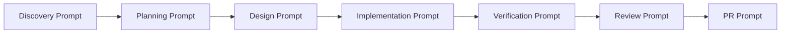
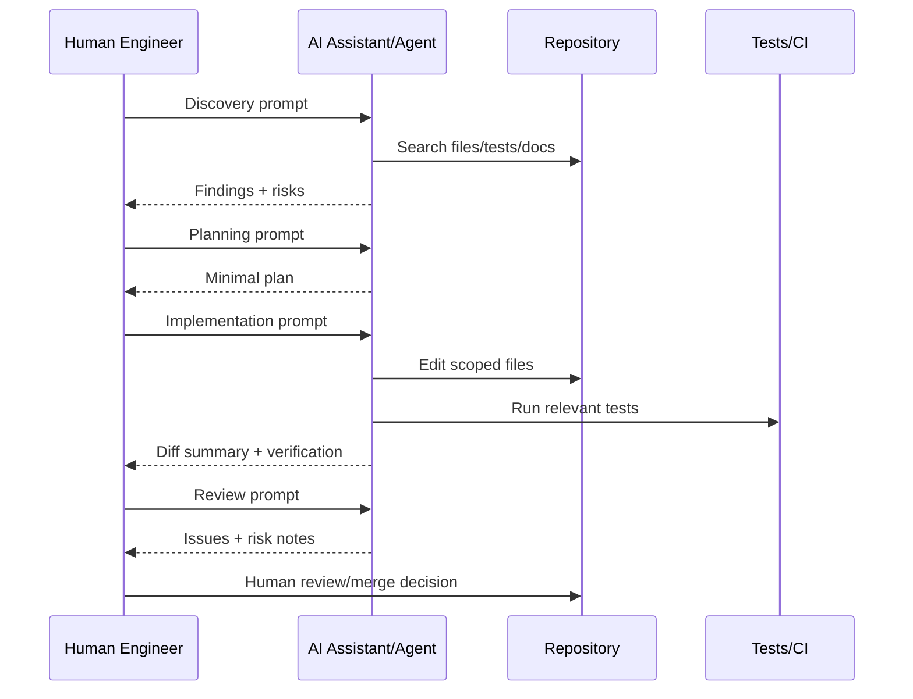
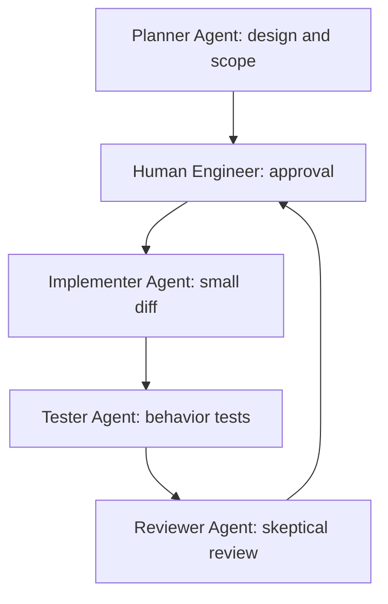

------
title: Learn AI Development Driven Implementation and Usage - Part 006
description: Prompting as an engineering control surface: how to write task contracts, planning prompts, implementation prompts, verification prompts, and review prompts that make AI-assisted delivery bounded, testable, and safe.
series: learn-ai-development-driven-implementation-usage
seriesTitle: Learn AI Development Driven Implementation and Usage
order: 6
partTitle: Prompting as Engineering Control Surface
tags:
- ai
- prompting
- software-engineering
- implementation
- coding-agents
- delivery
- series
date: 2026-06-30
---

# Part 006 — Prompting as Engineering Control Surface

> Goal: setelah bagian ini, kamu mampu menulis prompt bukan sebagai “pertanyaan”, tetapi sebagai **engineering control surface**: kontrak kerja yang mengatur scope, behavior, constraints, plan, tool use, verification, dan reviewability.

Prompt dalam AI-driven development bukan trik bahasa. Prompt adalah mekanisme kontrol. Ia menentukan:

- apa yang dikerjakan,
- apa yang tidak boleh disentuh,
- fakta mana yang dianggap authoritative,
- bagaimana AI harus mengeksplorasi repo,
- kapan AI boleh edit,
- command apa yang harus dijalankan,
- bentuk output apa yang bisa direview,
- dan kapan AI harus berhenti.

Prompt yang lemah menghasilkan output yang tampak produktif tetapi sulit dipercaya. Prompt yang kuat membuat AI bekerja seperti engineer junior yang diberi task contract oleh staff engineer.

---

## 1. Kaufman Skill Deconstruction

Dalam kerangka Kaufman, skill ini bisa dipecah menjadi:

| Sub-skill | Tujuan | Output yang terlihat |
|---|---|---|
| Intent framing | AI tahu alasan perubahan | Solusi tidak overfit ke symptom |
| Scope control | AI tahu batas kerja | Diff kecil dan reviewable |
| Constraint declaration | AI tahu larangan | Tidak melanggar contract/security/architecture |
| Planning control | AI berpikir sebelum edit | Plan bisa dikoreksi lebih awal |
| Tool-use control | AI tahu kapan search/test/edit | Tidak asal mengubah file |
| Verification prompting | AI membuktikan output | Test relevan, bukan klaim kosong |
| Review prompting | AI memeriksa diff sendiri | Masalah ditemukan sebelum human review |
| Stop-condition prompting | AI tahu kapan tidak lanjut | Tidak membuat patch spekulatif |

Kaufman menekankan “learn enough to self-correct”. Untuk prompting, self-correction berarti kamu bisa melihat apakah kegagalan output disebabkan oleh:

- task terlalu besar,
- acceptance criteria tidak testable,
- negative scope tidak ada,
- invariant tidak ditulis,
- prompt meminta implementasi sebelum discovery,
- prompt tidak mengatur tool usage,
- prompt tidak mengharuskan verification,
- atau prompt tidak memberi stop condition.

---

## 2. Prompt Is Not a Wish; Prompt Is a Work Order

Prompt buruk:

```text
Can you implement this feature cleanly?
```

Prompt baik:

```text
Implement the optional escalationReason filter in the case search API.

Before editing:
- Inspect existing enum-based search filters.
- Identify the closest test pattern.
- Summarize the files you plan to modify.

Scope:
- Allowed: request DTO, predicate builder, API/repository tests.
- Not allowed: database schema, response shape, pagination, authorization rules.

Behavior:
- No filter: existing behavior unchanged.
- Valid filter: return only matching cases.
- Invalid filter: use existing validation error shape.
- Visibility rule: jurisdiction restrictions still apply.

Verification:
- Add tests that fail before implementation and pass after.
- Run ./gradlew test --tests '*CaseSearch*'.

Output:
- Plan.
- Diff summary.
- Tests added/updated.
- Verification result.
- Assumptions and risks.
```

Yang kedua adalah work order. Ada task, sequence, boundary, behavior, verification, dan output contract.

---

## 3. Anatomy of a High-Quality Engineering Prompt

Gunakan struktur dasar:

```text
1. Role / operating mode
2. Task intent
3. Current state
4. Expected behavior
5. Scope boundaries
6. Constraints and invariants
7. Relevant context
8. Workflow instructions
9. Verification instructions
10. Output format
11. Stop conditions
```

Tidak semua prompt butuh semua bagian. Namun untuk production code, minimal harus ada:

- task,
- scope,
- expected behavior,
- constraints,
- verification,
- output format.

### 3.1 Role / Operating Mode

Role bukan “act as a 10x engineer”. Itu terlalu abstrak.

Lebih baik:

```text
Operate as a conservative senior engineer making a small, reviewable production change. Prefer existing project patterns over introducing new abstractions. Ask/stop if the task requires a public contract change outside the stated scope.
```

Role harus mengatur behavior kerja, bukan identitas imajinatif.

### 3.2 Task Intent

```text
Intent: reduce manual analyst filtering by adding server-side filtering for escalation reason while preserving existing search semantics.
```

Intent mencegah AI memilih solusi terlalu sempit atau terlalu luas.

### 3.3 Current State

```text
Current state: case search supports status and date range filters. Escalation reason is stored on the current case escalation record but is not exposed as a search request field.
```

Current state mengurangi waktu discovery.

### 3.4 Expected Behavior

```text
Expected behavior:
- escalationReason absent: no behavior change.
- escalationReason present: AND-composed with existing filters.
- invalid value: same validation error format as status.
```

Expected behavior harus bisa diuji.

### 3.5 Scope Boundaries

```text
Allowed changes:
- CaseSearchRequest
- CaseSearchPredicateBuilder
- CaseSearchControllerIT
- OpenAPI generated output if generated by existing script

Do not change:
- database schema
- response schema
- authorization policy
- pagination or sorting defaults
```

Negative scope sangat penting karena AI coding agent sering melakukan opportunistic cleanup.

### 3.6 Constraints and Invariants

```text
Invariants:
- CaseVisibilityPolicy must remain mandatory for every search query.
- Soft-deleted cases must never be returned.
- Filters compose with AND semantics.
- Validation errors must use ProblemDetail format.
```

Invariant adalah versi prompt dari contract.

### 3.7 Workflow Instructions

```text
Workflow:
1. Inspect existing status filter implementation and tests.
2. Write a short plan.
3. Implement the smallest diff.
4. Add tests.
5. Run the relevant tests if tool access allows.
6. Summarize results and unresolved risks.
```

Workflow mengatur urutan kerja. Ini mencegah AI langsung mengedit berdasarkan asumsi.

### 3.8 Verification Instructions

```text
Verification:
- New test must fail before implementation if practical.
- Run ./gradlew test --tests '*CaseSearch*'.
- If tests cannot be run, explain why and provide the exact command for the reviewer.
```

AI tidak selalu bisa menjalankan command. Tetapi prompt harus tetap memaksa verifiability.

### 3.9 Output Format

```text
Output format:
- Plan: 3-5 bullets
- Changed files: path + reason
- Tests: added/updated + behavior covered
- Verification: command + result
- Risks: assumptions, follow-ups, skipped checks
```

Output format membuat review lebih cepat.

### 3.10 Stop Conditions

```text
Stop if:
- The change requires a database migration.
- The existing code has no escalationReason source field.
- Authorization behavior is unclear.
- Tests fail for reasons unrelated to this task.
```

Stop condition adalah guardrail melawan hallucinated progress.

---

## 4. Prompt Taxonomy for AI-Driven Implementation

Tidak semua prompt harus meminta implementasi. Senior workflow memisahkan prompt berdasarkan phase.



### 4.1 Discovery Prompt

Tujuan: menemukan fakta repo sebelum mengubah file.

```text
Inspect the repository to understand how case search filters are implemented.

Find:
- request DTO for search filters,
- predicate/query builder,
- validation error handling,
- closest tests for enum filters,
- command used to run relevant tests.

Do not edit files. Return:
- files found,
- current implementation pattern,
- likely files to change,
- open questions or risks.
```

Gunakan saat task menyentuh codebase yang belum sepenuhnya kamu pahami.

### 4.2 Planning Prompt

Tujuan: membuat plan kecil yang bisa dikoreksi.

```text
Using the discovered files, propose a minimal implementation plan.

Plan requirements:
- Max 5 steps.
- Each step must name files likely to change.
- Keep public API response unchanged.
- Include tests for default behavior, valid filter, invalid filter, and visibility composition.
- Do not implement yet.
```

Planning prompt bagus jika kamu ingin mencegah diff liar.

### 4.3 Design Prompt

Tujuan: membandingkan approach sebelum implementasi.

```text
Compare two implementation options:
A. Add escalationReason directly to existing predicate builder.
B. Introduce a reusable enum filter abstraction.

Evaluate against:
- diff size,
- consistency with existing patterns,
- testability,
- risk of over-abstraction,
- future extensibility.

Recommend one option. Do not edit code.
```

Gunakan saat ada trade-off, bukan untuk task trivial.

### 4.4 Implementation Prompt

Tujuan: membuat perubahan scoped.

```text
Implement the approved plan.

Rules:
- Keep diff minimal.
- Follow existing status filter pattern.
- Add tests before or alongside implementation.
- Do not refactor unrelated code.
- Do not change generated files manually.

After editing, run the relevant tests if possible.
```

Implementation prompt harus merujuk plan dan constraints.

### 4.5 Verification Prompt

Tujuan: memaksa pembuktian.

```text
Verify the current diff.

Check:
- Does it satisfy each acceptance criterion?
- Are all invariants preserved?
- Do tests cover both positive and negative behavior?
- Are there changed files outside scope?
- What commands were run and what were the results?

Do not make new changes unless verification finds a direct defect in the diff.
```

Verification prompt mencegah “I think it works”.

### 4.6 Review Prompt

Tujuan: membuat AI menjadi pre-reviewer.

```text
Review your own diff as a skeptical senior reviewer.

Focus on:
- behavior correctness,
- backward compatibility,
- authorization/security,
- test quality,
- unnecessary abstraction,
- edge cases,
- hidden coupling,
- migration or rollout risk.

Return blocking issues, non-blocking suggestions, and what you would approve.
```

Review prompt harus skeptis dan spesifik.

### 4.7 PR Prompt

Tujuan: menghasilkan PR summary yang berguna.

```text
Prepare a PR summary.

Include:
- Problem solved.
- Implementation approach.
- Files changed by category.
- Tests added/updated.
- Verification commands and results.
- Risk assessment.
- Rollback considerations if relevant.

Do not oversell. Mention checks that were not run.
```

PR prompt harus membuat human reviewer cepat memahami intent dan risk.

---

## 5. The Ask/Edit/Review Loop

AI pair programming efektif jika dilakukan dalam loop kecil.



Loop ini lebih lambat daripada “langsung implement”, tetapi jauh lebih murah daripada mereview diff kacau.

---

## 6. Prompt Patterns by Work Type

### 6.1 Feature Addition Prompt

```text
Implement [feature] with the smallest reviewable diff.

Intent:
[why this feature exists]

Expected behavior:
- [case 1]
- [case 2]
- [case 3]

Scope:
Allowed:
- [files/modules]

Not allowed:
- [dangerous areas]

Invariants:
- [domain/security/contract rule]

Existing pattern:
Follow [test/class/module] unless you find a strong reason not to.

Verification:
- Add tests for [behaviors].
- Run [commands].

Output:
- Plan before editing.
- Diff summary.
- Verification result.
- Risks.
```

Use untuk feature kecil sampai medium.

### 6.2 Bug Fix Prompt

```text
Fix the bug described below by changing product code, not weakening tests.

Symptom:
[observable failure]

Reproduction:
[command / test / steps]

Expected behavior:
[correct behavior]

Constraints:
- Do not remove assertions.
- Do not skip or disable tests.
- Do not broaden matchers unless the expected behavior is wrong and you explain why.
- Keep the fix close to the root cause.

Workflow:
1. Reproduce or inspect the failing test/log.
2. Build a hypothesis tree.
3. Identify the root cause.
4. Make the smallest fix.
5. Add regression test if missing.
6. Verify.
```

Bug fix prompt harus melarang “test weakening”.

### 6.3 Refactoring Prompt

```text
Perform a behavior-preserving refactor.

Objective:
[refactor target]

Behavior rule:
No public behavior changes are allowed.

Safety net:
- Run [tests] before change if possible.
- Run the same tests after each major step.

Allowed:
- [specific moves/extractions]

Not allowed:
- no feature changes,
- no validation behavior changes,
- no response schema changes,
- no opportunistic cleanup outside target area.

Output:
- Explain how behavior preservation is verified.
```

Refactor prompt harus lebih ketat daripada feature prompt.

### 6.4 Test Generation Prompt

```text
Add tests that increase behavioral confidence, not just coverage.

Behavior to prove:
- [behavior 1]
- [behavior 2]

Test oracle:
Given [setup]
When [action]
Then [observable result]

Rules:
- Follow existing test style in [test class].
- Avoid testing private implementation details unless existing module convention does so.
- Assertions must fail for meaningful behavior regressions.
- Do not add brittle timing sleeps.

Output:
- Tests added.
- What regression each test would catch.
```

Test prompt harus menyebut oracle.

### 6.5 Code Review Prompt

```text
Review this diff as a skeptical senior engineer.

Assess:
- correctness,
- edge cases,
- security/privacy,
- authorization,
- backward compatibility,
- test quality,
- maintainability,
- unnecessary complexity,
- performance risk,
- rollout risk.

Classify findings:
- Blocking: must fix before merge.
- Non-blocking: improvement suggestion.
- Question: needs clarification.

Do not nitpick style unless it affects maintainability or consistency.
```

Review prompt yang baik menghindari noise.

### 6.6 CI Failure Prompt

```text
Investigate the CI failure.

Inputs:
- Failing job: [name]
- Failing command: [command]
- Log excerpt: [log]
- Recent changes: [summary]

Workflow:
1. Identify the first meaningful failure, not cascading failures.
2. Map failure to changed files if possible.
3. Propose root cause hypotheses.
4. Make the smallest fix if root cause is clear.
5. Do not change unrelated code.
6. Do not disable checks.

Output:
- Root cause.
- Fix.
- Verification.
- Residual risk.
```

CI prompt harus fokus pada failure pertama.

### 6.7 Documentation Prompt

```text
Update documentation to match the implementation.

Rules:
- Do not describe intended behavior that is not implemented.
- Prefer concise operational docs over marketing language.
- Include examples only if they are valid against current API/schema.
- Mention limitations and unsupported cases.

Output:
- Docs changed.
- Source of truth used.
- Any behavior that remains undocumented.
```

Documentation prompt harus melawan hallucinated capabilities.

---

## 7. Constraint Language That Works

Instruksi negatif harus konkret.

| Weak constraint | Strong constraint |
|---|---|
| “Don’t break anything” | “Do not change response schema, pagination defaults, or authorization checks.” |
| “Keep it clean” | “Do not introduce a new abstraction unless used by at least two existing call sites in this diff.” |
| “Be secure” | “Do not log PII, do not bypass AuthorizationPolicy, do not disable CSRF checks.” |
| “Make tests good” | “Add tests for no-filter behavior, valid filter, invalid enum, and access-rule composition.” |
| “Use existing style” | “Follow CaseSearchStatusFilterTest and constructor injection pattern used in this module.” |
| “Avoid big changes” | “Change at most these modules: api/search, domain/search, test/search.” |

Constraint harus bisa direview. Jika reviewer tidak bisa membuktikan apakah constraint dilanggar, constraint itu terlalu abstrak.

---

## 8. Acceptance Criteria as Executable Thinking

Acceptance criteria yang baik bukan daftar harapan. Ia adalah model test.

Buruk:

```text
Search should support escalation reason.
```

Baik:

```text
Acceptance criteria:
1. Given no escalationReason parameter, search returns the same results as before.
2. Given escalationReason=MISSED_DEADLINE, search returns only cases with that reason.
3. Given escalationReason=UNKNOWN, API returns 400 with existing validation error shape.
4. Given user has access to J1 only, escalationReason filter cannot expose J2 cases.
5. Existing status/date filters compose with escalationReason using AND semantics.
```

Ini hampir langsung menjadi test suite.

---

## 9. Prompting for Invariants

AI perlu diingatkan pada hal yang tidak boleh berubah.

Contoh invariant categories:

| Category | Example invariant |
|---|---|
| Domain | Closed case cannot transition to investigation without reopen command |
| Security | Every search query must apply CaseVisibilityPolicy |
| API | Existing response fields remain backward compatible |
| Persistence | Applied migrations are append-only and never edited |
| Eventing | Lifecycle event is published only after transaction commit |
| Concurrency | Escalation creation must be idempotent by caseId + ruleId |
| Audit | Every decision change must append audit entry, not overwrite |
| Privacy | Redacted evidence fields must not appear in search index |

Prompt format:

```text
Before finalizing, verify the diff against these invariants:
- [invariant 1]
- [invariant 2]
- [invariant 3]

For each invariant, state:
- preserved? yes/no
- where in code,
- where in tests,
- remaining risk.
```

Ini mengubah invariant menjadi review task.

---

## 10. Prompting for Small Diffs

AI sering menghasilkan diff besar karena menganggap “lebih lengkap” sama dengan “lebih baik”. Untuk production delivery, diff kecil sering lebih aman.

Prompt:

```text
Optimize for a small, reviewable diff.

Rules:
- Prefer editing existing functions over introducing new abstractions.
- Do not rename files or symbols unless required.
- Do not reformat unrelated code.
- Do not update dependencies.
- Do not perform opportunistic cleanup.
- If you notice cleanup opportunities, list them as follow-up instead.
```

Small diff bukan berarti design buruk. Artinya setiap PR punya satu intent yang jelas.

---

## 11. Prompting for Assumption Management

Prompt harus memaksa AI membedakan fakta dari asumsi.

```text
Before implementation, list:
- Facts confirmed from code.
- Assumptions not yet confirmed.
- Questions that would change the implementation.

Proceed only if assumptions are low-risk and state them in the final summary.
```

Final output:

```text
Facts:
- Status filter uses CaseSearchPredicateBuilder.
- Validation errors use ProblemDetail.

Assumptions:
- Escalation reason is stored on current escalation record, not only in history.

Risk:
- If escalation reason should be historical, query logic must change.
```

Ini membantu reviewer mengetahui bagian mana yang harus dicek manual.

---

## 12. Prompting for Tool Use

Agentic coding tools bisa membaca file, mengedit, menjalankan test, memakai shell, mengakses GitHub, dan kadang memakai MCP tools. Prompt harus mengatur tool use.

### 12.1 Search Before Edit

```text
Do not edit yet. First inspect the existing implementation path and tests. Return a plan with files to change.
```

### 12.2 Test Before Fix

```text
Run or inspect the failing test before changing code. If you cannot run it, explain what evidence you used instead.
```

### 12.3 No Dangerous Commands

```text
Do not run destructive commands such as deleting files, resetting branches, force pushing, dropping databases, or modifying migrations unless explicitly approved.
```

### 12.4 Approval Boundary

```text
Ask before:
- adding dependencies,
- changing public contracts,
- introducing migrations,
- modifying authorization behavior,
- deleting tests,
- changing CI configuration.
```

Tool-use prompting is risk management.

---

## 13. Prompting with Examples

Examples are powerful. Use them carefully.

### 13.1 Good Example Prompt

```text
Follow the pattern in CaseSearchStatusFilterTest for:
- enum parsing,
- invalid value assertions,
- no-filter behavior,
- ProblemDetail error shape.

Do not copy unrelated setup from older tests if newer tests use CaseSearchTestFixtures.
```

### 13.2 Bad Example Prompt

```text
Use this old test as an example.
```

Why bad?

- old test may be obsolete,
- may use deprecated fixture,
- may encode bad style,
- may not cover current behavior.

Always state what exactly should be copied from an example.

---

## 14. Prompting for Design Trade-Offs

For non-trivial tasks, force AI to compare options.

```text
Before implementation, compare options:

Option A: extend existing predicate builder.
Option B: introduce generic enum filter abstraction.
Option C: add repository method for escalation reason.

Evaluate:
- consistency with current code,
- diff size,
- testability,
- performance,
- future extensibility,
- risk.

Recommend one. Bias toward minimal change unless future reuse is clearly justified.
```

AI sering over-engineer jika tidak diberi bias.

---

## 15. Prompting for Failure Modes

AI bagus dalam menghasilkan happy path. Senior engineer harus meminta failure modes.

```text
Before coding, identify likely failure modes:
- invalid input,
- missing data,
- authorization interaction,
- concurrent execution,
- stale cache,
- transaction rollback,
- partial migration,
- external dependency failure.

For each, say whether this task must handle it now or leave it as out of scope.
```

Ini penting untuk domain kompleks.

---

## 16. Prompting for Security Review

Security prompt harus spesifik ke surface.

```text
Security review this change.

Check specifically:
- user-controlled input validation,
- authorization bypass,
- IDOR risk,
- PII exposure in logs/errors/events,
- injection risk in query construction,
- unsafe deserialization,
- dependency changes,
- secrets handling,
- insecure test-only shortcut leaking into production code.

Return blocking findings only unless there are important non-blocking risks.
```

Jangan hanya tulis “is this secure?”

---

## 17. Prompting for Performance Review

Performance prompt harus menyebut workload.

```text
Review performance risk.

Context:
- enforcement_case has about 80M rows.
- Search API p95 target is 300ms for common filters.
- escalationReason cardinality is low.
- Query must compose with jurisdiction filter.

Check:
- whether the predicate can use existing indexes,
- whether it causes table scan,
- whether join cardinality can explode,
- whether pagination remains stable,
- whether a new index or migration is needed.

Do not add an index unless you first explain migration risk.
```

Tanpa workload, AI akan memberi jawaban generik.

---

## 18. Prompting for Migration Safety

```text
Design the database migration plan.

Constraints:
- Zero downtime deployment.
- Applied migrations are immutable.
- Table has 80M rows.
- Backfill must be resumable.
- Application version N and N+1 may run concurrently during deployment.

Output:
- Expand step.
- Backfill step.
- Contract step.
- Rollback strategy.
- Verification queries.
- Risks.

Do not write migration SQL until the plan is approved.
```

Migration prompt harus memisahkan plan dan SQL.

---

## 19. Prompting for Distributed Systems Correctness

```text
Evaluate this design under distributed execution.

Assume:
- multiple app instances,
- retries from message broker,
- at-least-once delivery,
- database transaction rollback possible,
- duplicate commands possible.

Check:
- idempotency key,
- transaction boundary,
- event publication timing,
- optimistic/pessimistic locking,
- ordering assumptions,
- duplicate side effects,
- recovery after partial failure.
```

AI default cenderung single-threaded mental model. Prompt ini memaksanya berpikir distributed.

---

## 20. Prompting for Regulatory Defensibility

Untuk enforcement/regulatory systems:

```text
Review this change for regulatory defensibility.

Check:
- actor identity recorded,
- decision reason preserved,
- audit trail append-only,
- evidence redaction respected,
- jurisdiction visibility enforced,
- SLA calculation unchanged,
- policy basis traceable,
- notification content allowed,
- manual override distinguishable from system action.

For each issue, classify:
- legal/audit risk,
- operational risk,
- technical risk.
```

Prompt ini lebih tepat daripada “review compliance”.

---

## 21. Prompt Chaining

Prompt chaining adalah memecah satu task menjadi beberapa control checkpoint.

Buruk:

```text
Implement feature X end to end.
```

Baik:

```text
Step 1: Discover implementation path. Do not edit.
Step 2: Propose plan. Do not edit.
Step 3: Implement approved minimal plan.
Step 4: Verify tests.
Step 5: Self-review diff.
Step 6: Prepare PR summary.
```

Prompt chain memberi kamu kesempatan mengoreksi AI sebelum damage membesar.

### 21.1 Chain Example

#### Prompt 1 — Discovery

```text
Find how status filters are implemented in case search. Do not edit. Return relevant files, tests, and current pattern.
```

#### Prompt 2 — Plan

```text
Based on the discovered pattern, plan escalationReason filter implementation. Keep it under 5 steps. Do not edit.
```

#### Prompt 3 — Implement

```text
Implement the plan. Keep the diff limited to request parsing, predicate builder, and tests. Run relevant tests.
```

#### Prompt 4 — Review

```text
Review the diff against scope, invariants, and test quality. Identify blocking issues only.
```

---

## 22. Prompting for Multi-Agent or Multi-Tool Workflows

Jika memakai lebih dari satu AI/tool, pisahkan role.



Prompt role:

```text
Planner: You may inspect files and propose a plan, but do not edit.
Implementer: Implement only the approved plan. Do not expand scope.
Tester: Add or improve tests for stated behavior. Do not change product code unless asked.
Reviewer: Review the diff skeptically. Do not modify files.
```

Pemisahan role mengurangi konflik objective.

---

## 23. Prompt Evaluation Rubric

Sebelum menjalankan prompt, nilai prompt-mu.

```md
## Prompt Quality Rubric

Score 0-2 for each:

1. Intent clarity
2. Expected behavior clarity
3. Scope boundaries
4. Negative scope
5. Invariants
6. Relevant examples
7. Verification commands
8. Output format
9. Stop conditions
10. Task size

Interpretation:
- 0-7: unsafe prompt; rewrite.
- 8-14: usable for low-risk tasks.
- 15-20: suitable for production implementation.
```

Prompt yang tidak menyebut verification biasanya tidak layak untuk production task.

---

## 24. Prompt Smells

| Smell | Example | Risk | Fix |
|---|---|---|---|
| Hero prompt | “Act as a world-class engineer” | Style tanpa constraint | Define operating behavior |
| One-shot huge task | “Build the entire feature” | Large unreviewable diff | Chain discovery/plan/implementation |
| No negative scope | “Add X” | Opportunistic changes | Add do-not-change list |
| No test oracle | “Add tests” | Shallow coverage | Given/when/then behavior |
| No stop condition | “Keep going until fixed” | Risky guesses | Stop on ambiguity/danger |
| Tool ambiguity | “Check it” | AI may not run tests | Name exact commands |
| Hidden authority | “Use docs” | Stale docs trusted | State source-of-truth order |
| Best-practice trap | “Use best practice” | Generic architecture | Name repo-specific pattern |
| Review noise | “Review everything” | Nitpicks | Classify blocking/non-blocking |

---

## 25. Prompt Templates for Daily Use

### 25.1 Minimal Safe Implementation Template

```text
Task:
[one-sentence task]

Intent:
[why]

Expected behavior:
- ...

Scope:
Allowed:
- ...
Not allowed:
- ...

Invariants:
- ...

Existing pattern:
Follow ...

Workflow:
1. Inspect relevant files.
2. Propose brief plan.
3. Implement smallest diff.
4. Add/update tests.
5. Run verification if possible.

Verification:
- ...

Output:
- plan,
- changed files,
- tests,
- verification,
- risks.
```

### 25.2 Retrieval-Only Template

```text
Do not edit files.

Investigate [topic] in this repository.

Find:
- current implementation path,
- relevant tests,
- relevant commands,
- constraints or invariants,
- likely files to change.

Return:
- concise findings,
- plan candidate,
- open questions,
- risk assessment.
```

### 25.3 Safe Bug Fix Template

```text
Fix this bug conservatively.

Symptom:
...

Reproduction:
...

Expected behavior:
...

Rules:
- Change product code, not test expectations, unless the test is demonstrably wrong.
- Do not skip/disable tests.
- Keep fix close to root cause.
- Add regression test if missing.

Output:
- root cause,
- fix summary,
- tests,
- verification,
- residual risk.
```

### 25.4 Skeptical Review Template

```text
Review the current diff as a skeptical senior engineer.

Focus only on issues that affect:
- correctness,
- security/privacy,
- authorization,
- compatibility,
- test confidence,
- performance,
- maintainability.

Classify findings:
- Blocking
- Non-blocking
- Question

Avoid style nitpicks unless they indicate inconsistency with existing project conventions.
```

---

## 26. What Not to Ask AI To Do

Jangan meminta AI:

- membuat perubahan besar tanpa discovery,
- “fix all tests” tanpa failure analysis,
- refactor dan feature dalam satu prompt,
- mengubah migration lama,
- menambah dependency tanpa justification,
- mengubah public contract tanpa compatibility plan,
- menghapus test karena gagal,
- bypass authorization agar test lewat,
- membuat security-sensitive code tanpa review checklist,
- membuat production migration tanpa rollout plan.

Untuk task seperti ini, gunakan planning-only prompt dulu.

---

## 27. Human-in-the-Loop Decision Points

AI boleh membantu, tetapi human harus memutuskan pada titik tertentu.

| Decision | AI role | Human role |
|---|---|---|
| Public API compatibility | Analyze options | Decide allowed breaking/non-breaking path |
| Database migration | Draft plan | Approve rollout risk |
| Authorization logic | Identify affected rules | Approve policy semantics |
| Dependency addition | Compare libraries | Approve supply-chain and maintenance risk |
| Architecture boundary change | Explain trade-off | Approve design direction |
| Test expectation change | Explain mismatch | Approve behavior change |

Prompt harus mengandung “ask/stop before...” untuk decision ini.

---

## 28. The Top 1% Pattern: Prompt for Evidence, Not Confidence

AI sering berkata “this should work”. Itu tidak cukup.

Ganti:

```text
Are you confident this works?
```

Dengan:

```text
What evidence supports that this works?
List:
- tests run,
- tests added,
- behavior covered,
- invariants checked,
- assumptions not verified,
- remaining risks.
```

Senior engineer tidak membeli confidence. Senior engineer mencari evidence.

---

## 29. Practical 20-Hour Practice Plan

### Hour 1–2: Rewrite Bad Prompts

Ambil 10 prompt lama seperti:

- “fix this bug”,
- “add tests”,
- “refactor this module”,
- “review this code”.

Rewrite menjadi prompt dengan scope, constraints, verification, dan output format.

### Hour 3–5: Build Prompt Templates

Buat template untuk:

- feature,
- bug fix,
- refactor,
- test generation,
- review,
- CI failure,
- PR summary.

### Hour 6–8: Practice Discovery-Only

Untuk 3 task, jalankan hanya discovery prompt. Ukur apakah AI menemukan file dan tests yang benar.

### Hour 9–11: Practice Plan Review

Minta AI membuat plan. Jangan implement. Review plan seperti design review.

Nilai:

- apakah scope kecil,
- apakah risk muncul,
- apakah tests relevan,
- apakah ada over-engineering.

### Hour 12–15: Practice Implementation Prompt

Jalankan prompt implementasi hanya untuk task yang sudah punya plan. Review diff.

### Hour 16–18: Practice Verification Prompt

Minta AI memverifikasi diff. Bandingkan hasil AI dengan review manualmu.

### Hour 19–20: Build Team Prompt Playbook

Buat satu halaman:

- template wajib,
- stop conditions,
- command verification,
- review checklist,
- examples of bad/good prompts.

---

## 30. Senior Engineer Checklist

Sebelum mengirim prompt implementasi:

```md
- [ ] Task satu intent.
- [ ] Expected behavior testable.
- [ ] Scope allowed dan not allowed jelas.
- [ ] Invariants ditulis.
- [ ] Existing pattern disebut.
- [ ] Verification command ada.
- [ ] Output format ada.
- [ ] Stop conditions ada untuk high-risk cases.
- [ ] Prompt tidak meminta refactor dan feature sekaligus.
- [ ] Prompt meminta evidence, bukan confidence.
```

Setelah output AI:

```md
- [ ] AI mengikuti workflow.
- [ ] AI tidak menyentuh file di luar scope.
- [ ] AI menyatakan asumsi.
- [ ] Tests benar-benar membuktikan behavior.
- [ ] Tidak ada weakened tests.
- [ ] Tidak ada security/authorization shortcut.
- [ ] Verification result jelas.
- [ ] Risk residual dicatat.
```

---

## 31. Key Takeaways

1. Prompt adalah work order, bukan permintaan sopan.
2. Prompt yang baik mengatur intent, scope, constraints, workflow, verification, output, dan stop condition.
3. Pisahkan discovery, planning, implementation, verification, review, dan PR summary.
4. Negative scope sama pentingnya dengan scope.
5. Invariant lebih kuat daripada instruksi abstrak.
6. Prompt harus meminta evidence, bukan confidence.
7. Tool-use boundary mengurangi risiko agentic workflow.
8. Untuk task high-risk, mulai dengan planning-only atau discovery-only.
9. Output AI yang buruk sering berasal dari prompt yang tidak punya acceptance criteria dan verification contract.
10. Top engineer memakai AI dengan kontrol, bukan dengan harapan.

---

## 32. Practice Assignment

Pilih satu task implementasi nyata dari backlog. Buat prompt chain lengkap:

1. Discovery prompt.
2. Planning prompt.
3. Implementation prompt.
4. Verification prompt.
5. Review prompt.
6. PR summary prompt.

Kriteria selesai:

- Setiap prompt punya scope yang jelas.
- Implementation prompt tidak berdiri sendiri; ia merujuk hasil discovery/plan.
- Verification prompt meminta evidence konkret.
- Review prompt mengklasifikasikan issue berdasarkan blocking/non-blocking/question.
- Prompt chain menghasilkan diff yang bisa direview sebagai satu intent.

---

## References

- OpenAI Codex documentation on coding agents and repository instructions.
- GitHub Copilot documentation on repository custom instructions and coding agent workflows.
- Anthropic Claude Code documentation on memory, project instructions, and tool use.
- Model Context Protocol documentation for tools, resources, and prompts as external context interfaces.
- OWASP LLM application risk guidance for prompt injection, insecure output handling, and tool-use risk.
- NIST AI Risk Management Framework and Generative AI Profile for risk framing and governance language.

