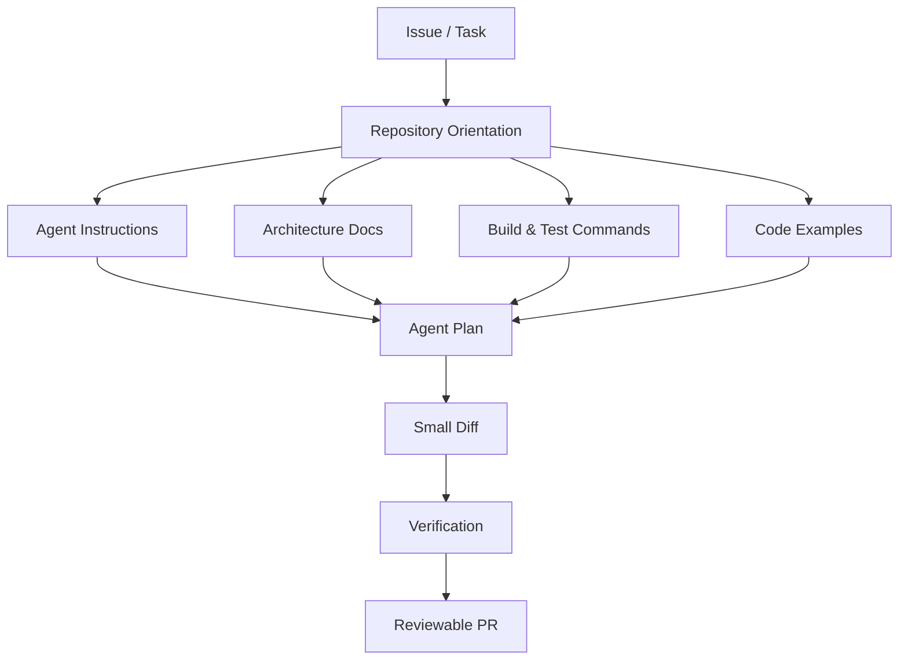
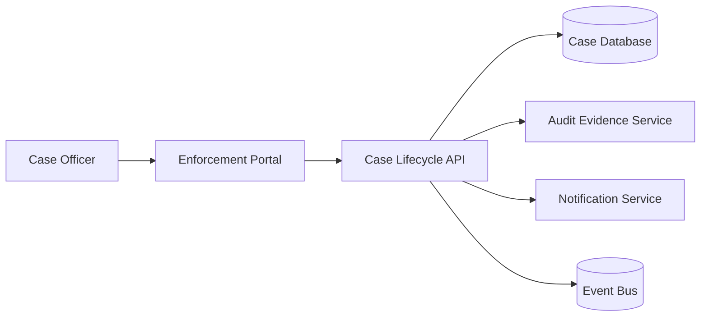
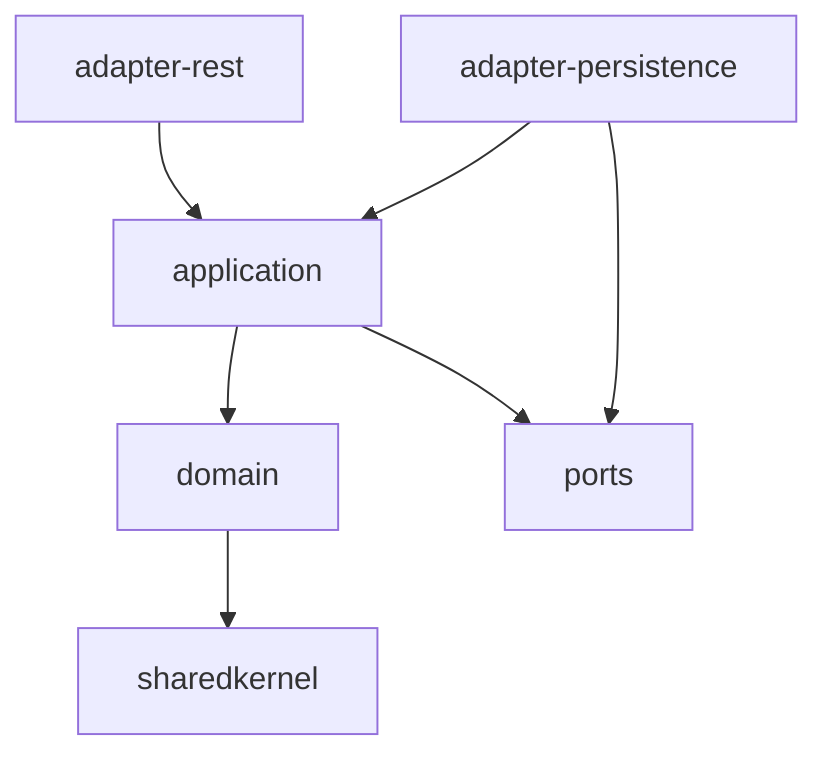
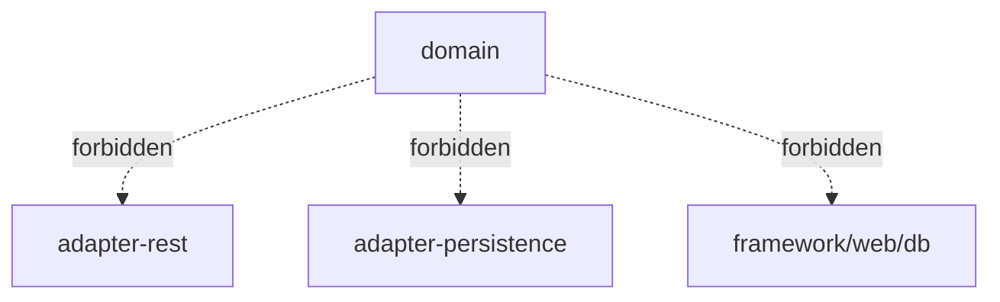
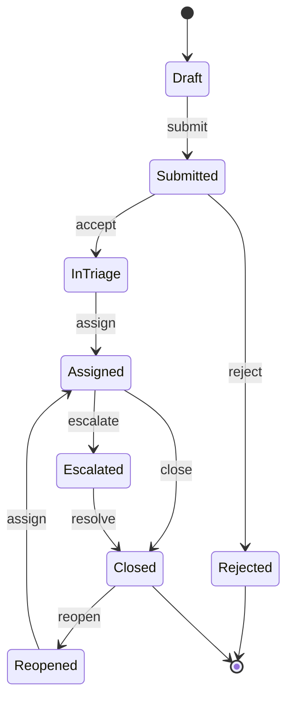

------
title: Learn AI Development Driven Implementation and Usage - Part 007
description: AI-readable repository design: how to structure a codebase so human engineers and AI coding agents can understand boundaries, run verification, preserve conventions, and produce small reviewable diffs.
series: learn-ai-development-driven-implementation-usage
seriesTitle: Learn AI Development Driven Implementation and Usage
order: 7
partTitle: AI-Readable Repository Design
tags:
- ai
- software-engineering
- repository-design
- coding-agents
- context-engineering
- architecture
- series
date: 2026-06-30
---

# Part 007 — AI-Readable Repository Design

> Goal: setelah bagian ini, kamu mampu mendesain repository yang mudah dibaca oleh AI coding agent **tanpa mengorbankan readability untuk manusia**. Repo yang baik membuat agent cepat menemukan entry point, boundary, convention, command, test strategy, dan risiko perubahan.

AI-readable repository bukan berarti repository dibuat untuk mesin. Justru kebalikannya: repository harus cukup eksplisit sehingga manusia baru, reviewer, dan agent bisa membangun mental model yang sama.

Repo yang buruk membuat AI melakukan “semantic archaeology”: membaca banyak file, menebak convention, mencoba command yang salah, mengedit terlalu luas, lalu menghasilkan diff yang sulit dipercaya.

Repo yang baik memberi agent peta kerja:

- di mana domain boundary berada,
- bagaimana module saling berhubungan,
- command apa yang authoritative,
- test apa yang membuktikan perubahan,
- convention apa yang tidak boleh dilanggar,
- file mana yang boleh dan tidak boleh disentuh,
- bagaimana PR harus diringkas,
- dan kapan agent harus berhenti.

Ini adalah fondasi agar AI-driven implementation tidak menjadi “speedrun ke technical debt”.

---

## 1. Kaufman Skill Deconstruction

Dalam kerangka Kaufman, skill “AI-readable repository design” bisa dipecah menjadi sub-skill berikut:

| Sub-skill | Tujuan | Output yang terlihat |
|---|---|---|
| Repository orientation | Membuat agent cepat tahu struktur repo | `README`, `AGENTS.md`, `docs/architecture`, module map |
| Boundary signaling | Menghindari edit lintas domain sembarangan | Package/module naming, ownership, ADR, dependency rule |
| Command discoverability | Membuat build/test/lint tidak ditebak | `Makefile`, `justfile`, `package.json`, Gradle task, CI docs |
| Convention encoding | Membuat style dan pattern eksplisit | coding standard, examples, “do/don't”, template |
| Test locality | Membuat agent menemukan test paling relevan | mirrored test path, naming convention, test index |
| Change-path clarity | Membuat feature change mengikuti jalur konsisten | controller → service → domain → persistence → test map |
| Architecture evidence | Membuat design constraint visible | C4, ADR, dependency graph, state machine diagram |
| Agent safety boundary | Membatasi kemampuan agent secara praktis | permission rules, forbidden paths, approval gates |
| Reviewability | Membuat diff kecil dan bisa diaudit | PR template, checklist, risk summary, verification log |

Kaufman menekankan **remove barriers to practice**. Dalam konteks repo, barrier utama adalah:

- command tidak jelas,
- test sulit ditemukan,
- module boundary kabur,
- domain rule tersebar di tribal knowledge,
- architecture docs tidak sinkron,
- naming tidak konsisten,
- generated code bercampur dengan hand-written code,
- dan reviewer harus membaca semua file untuk memahami satu perubahan kecil.

Tugas kita bukan membuat dokumentasi panjang. Tugas kita membuat **navigation surface** yang ringkas, akurat, dan operasional.

---

## 2. AI-Readable Repository: Definisi Praktis

Repository bisa disebut AI-readable jika agent bisa menjawab pertanyaan berikut dengan effort rendah:

1. Apa sistem ini dan apa boundary-nya?
2. Bagaimana cara build, test, lint, dan run secara lokal?
3. Di mana entry point utama?
4. Di mana domain rule authoritative berada?
5. Di mana contoh pattern yang harus diikuti?
6. File mana yang generated, migration, public contract, atau security-sensitive?
7. Bagaimana perubahan kecil seharusnya diverifikasi?
8. Apa risiko yang harus disebutkan di PR?

Repo AI-readable harus mengurangi ruang tebak. Agent yang menebak biasanya terlihat produktif, tetapi sebenarnya sedang memperbesar risk surface.

### 2.1 Human-readable dulu, baru agent-readable

Jangan membuat repository penuh instruksi agent yang tidak dipakai manusia. Itu akan busuk cepat.

Prinsipnya:

```text
If it helps a new senior engineer onboard faster,
it likely helps an AI coding agent behave better.
```

Instruksi agent yang baik adalah ringkasan dari engineering truth yang memang berlaku.

---

## 3. Repository as a Control Plane

Untuk AI-driven implementation, repository bukan sekadar storage kode. Repository adalah **control plane** untuk agent behavior.



Jika control plane lemah, agent akan membuat control plane sendiri di dalam probabilistic reasoning-nya. Itu tidak dapat diaudit.

---

## 4. Minimal Repository Navigation Surface

Repo AI-readable minimal punya surface berikut:

```text
repo/
├── README.md
├── AGENTS.md                  # or tool-specific equivalent
├── CONTRIBUTING.md
├── docs/
│   ├── architecture/
│   │   ├── system-context.md
│   │   ├── container-view.md
│   │   ├── module-boundaries.md
│   │   └── decision-records/
│   ├── domain/
│   │   ├── glossary.md
│   │   ├── invariants.md
│   │   └── workflows.md
│   ├── operations/
│   │   ├── runbook.md
│   │   └── troubleshooting.md
│   └── testing/
│       ├── test-strategy.md
│       └── test-selection.md
├── scripts/
│   ├── test-unit.sh
│   ├── test-integration.sh
│   └── verify-pr.sh
├── .github/
│   ├── pull_request_template.md
│   └── workflows/
└── src/
```

Tidak semua repo membutuhkan semua file. Tapi semua repo butuh jawaban untuk fungsi-fungsi tersebut.

### 4.1 README.md: orientasi manusia

`README.md` harus menjawab:

- sistem ini apa,
- siapa konsumen utamanya,
- cara menjalankan sistem,
- dependency utama,
- link ke architecture docs,
- link ke domain glossary,
- command paling penting.

README bukan tempat detail agent. README adalah pintu depan.

### 4.2 AGENTS.md / custom instructions: orientasi agent

`AGENTS.md` atau file instruksi tool-specific berfungsi sebagai “operating manual” untuk coding agent. Format `AGENTS.md` diposisikan sebagai tempat predictable untuk memberi context dan instruksi kepada coding agent. GitHub Copilot juga mendukung repository custom instructions agar Copilot memahami project dan cara build, test, serta validate.

Tapi instruksi agent harus minimal. Riset terbaru terhadap repository-level context files menunjukkan instruksi yang tidak perlu dapat menaikkan cost dan bahkan menurunkan task success. Jadi jangan menulis encyclopedia.

Gunakan prinsip:

```text
Agent instructions should contain stable rules,
not every detail someone might someday need.
```

---

## 5. Anatomy of a Good AGENTS.md

Contoh struktur:

```md
# AGENTS.md

## Purpose
This repository implements the enforcement case lifecycle service.
It manages case intake, triage, escalation, assignment, resolution, and audit evidence.

## Operating Rules
- Make the smallest safe change that satisfies the task.
- Prefer existing patterns over new abstractions.
- Do not change public API contracts unless the task explicitly asks for it.
- Do not edit generated code.
- Do not introduce new dependencies without explaining why.
- If behavior is ambiguous, add a question or assumption instead of inventing rules.

## Build and Test
- Full verification: `./gradlew clean check`
- Unit tests: `./gradlew test`
- Integration tests: `./gradlew integrationTest`
- API contract tests: `./gradlew contractTest`

## Architecture Boundaries
- `case-domain` contains domain state and invariants.
- `case-application` orchestrates use cases.
- `case-adapter-rest` exposes HTTP API.
- `case-adapter-persistence` maps domain objects to persistence records.
- Domain modules must not depend on adapters.

## Testing Rules
- New behavior requires tests.
- Bug fixes should add regression tests that fail before the fix.
- State transition changes require state-machine tests.
- API response changes require contract tests.

## Sensitive Areas
- Do not modify database migrations unless the task asks for schema change.
- Do not weaken authorization checks.
- Do not remove audit logging.
- Do not change idempotency behavior without explicit approval.

## PR Output
Every PR summary must include:
- What changed.
- Why it changed.
- Tests run.
- Risk and rollback notes.
```

Kualitas `AGENTS.md` diukur bukan dari panjangnya, tetapi dari seberapa sering ia mencegah perubahan salah.

---

## 6. What Not to Put in AGENTS.md

Jangan masukkan:

- sejarah panjang project,
- tutorial framework umum,
- preferensi style yang sudah ditegakkan formatter,
- semua command yang jarang dipakai,
- daftar semua package,
- opini yang sering berubah,
- requirement produk sementara,
- issue-specific instruction,
- detail confidential yang tidak perlu,
- instruksi bertentangan dengan CI.

Buruk:

```md
Always write comprehensive enterprise-grade code with clean architecture and best practices.
```

Lebih baik:

```md
Do not add a new service class if an existing use-case handler already owns the workflow.
Follow the pattern in `src/main/java/.../EscalateCaseHandler.java`.
```

Instruksi baik selalu menunjuk behavior yang bisa diamati.

---

## 7. Module Boundary Design for Agents

AI agent sering gagal bukan karena tidak bisa coding, tetapi karena tidak paham boundary.

Boundary harus terlihat dari:

- folder,
- package,
- dependency direction,
- naming,
- tests,
- docs,
- CI rule.

Contoh boundary buruk:

```text
src/
├── common/
├── utils/
├── service/
├── helper/
├── model/
└── manager/
```

Masalah:

- `common` jadi tempat dumping,
- `service` tidak menjelaskan use case,
- `model` bisa berarti DTO, entity, domain object, atau persistence row,
- agent harus membaca terlalu banyak file untuk memahami ownership.

Contoh boundary lebih baik:

```text
src/main/java/com/acme/enforcement/
├── caseintake/
│   ├── api/
│   ├── application/
│   ├── domain/
│   ├── persistence/
│   └── testfixture/
├── triage/
│   ├── application/
│   ├── domain/
│   └── policy/
├── escalation/
│   ├── application/
│   ├── domain/
│   ├── notification/
│   └── audit/
└── sharedkernel/
    ├── identity/
    ├── time/
    └── errors/
```

Agent sekarang bisa menebak lebih sedikit:

- perubahan intake masuk `caseintake`,
- perubahan escalation masuk `escalation`,
- shared code benar-benar shared kernel,
- test fixture punya lokasi eksplisit.

---

## 8. Architecture Documentation That Agents Can Use

Dokumentasi architecture yang terlalu naratif sulit dipakai agent. Gunakan format yang bisa diparse secara konseptual.

### 8.1 C4 sebagai navigation map

C4 model menyediakan struktur diagram: system context, container, component, dan code. Untuk agent, level paling berguna biasanya:

- **System Context**: sistem berinteraksi dengan siapa?
- **Container**: service/app/database/message broker apa saja?
- **Component**: module internal penting apa?

Contoh:



Yang lebih penting dari diagram adalah constraint di bawahnya:

```md
## Architecture Constraints
- Case Lifecycle API owns case state transitions.
- Audit Evidence Service owns immutable audit records.
- Notification Service must not be used as source of truth.
- Events are integration signals, not command execution guarantees.
```

Agent butuh constraint, bukan gambar indah.

### 8.2 Module boundary document

`docs/architecture/module-boundaries.md` harus menjawab:

```md
# Module Boundaries

## case-domain
Owns:
- Case aggregate.
- Case status transition rules.
- Escalation eligibility.
- Deadline calculation rules.

Must not:
- Call repositories directly.
- Call HTTP clients.
- Depend on framework annotations unless explicitly allowed.

## case-application
Owns:
- Use-case orchestration.
- Transaction boundary.
- Domain event publication.
- Authorization coordination.

Must not:
- Implement domain state transition rules inline.
- Build HTTP response DTOs.
```

Ini sangat membantu agent untuk tidak menaruh logic di layer yang salah.

---

## 9. Domain Glossary as Anti-Hallucination Tool

Banyak bug AI-generated code berasal dari vocabulary mismatch.

Contoh domain enforcement:

| Term | Meaning | Not this |
|---|---|---|
| Case | Regulatory enforcement matter tracked through lifecycle | Customer support ticket |
| Allegation | Claimed violation before validation | Confirmed breach |
| Finding | Determined conclusion after assessment | Raw complaint |
| Escalation | Formal movement to higher handling level | Simple priority flag |
| Closure | Terminal workflow state with evidence | UI hiding |
| Reopen | Controlled transition from terminal state | New case creation |

Letakkan ini di `docs/domain/glossary.md`.

Agent yang tahu glossary akan lebih jarang membuat class seperti `ComplaintTicketManager` ketika domain sebenarnya `CaseTriageHandler`.

---

## 10. Domain Invariants as Guardrails

`docs/domain/invariants.md` adalah salah satu file paling bernilai untuk AI-driven implementation.

Contoh:

```md
# Domain Invariants

## Case Lifecycle
- A case cannot move from `CLOSED` to `IN_REVIEW` without a reopen decision.
- A case cannot be assigned to an inactive officer.
- Escalated cases must preserve original intake timestamp.
- Closure requires at least one final finding.
- Audit events must be append-only.

## Jurisdiction
- Officers can only see cases within authorized jurisdiction.
- Cross-jurisdiction transfer requires explicit transfer reason.

## SLA
- SLA deadline is calculated from accepted intake time, not creation time.
- Paused cases must not accrue active SLA time.
```

Kemudian di `AGENTS.md`:

```md
Before changing lifecycle logic, read `docs/domain/invariants.md` and update or add tests for affected invariants.
```

Ini membuat domain rule menjadi executable secara sosial, meskipun belum semuanya encoded sebagai test.

---

## 11. Test Discoverability

Agent perlu menemukan test relevan dengan cepat.

### 11.1 Mirrored test structure

Bagus:

```text
src/main/java/com/acme/case/domain/CaseLifecycle.java
src/test/java/com/acme/case/domain/CaseLifecycleTest.java
```

Buruk:

```text
src/main/java/com/acme/case/domain/CaseLifecycle.java
tests/random/WorkflowTest2.java
```

Mirroring bukan soal estetika. Ini menurunkan search cost.

### 11.2 Test naming convention

Gunakan nama yang menjelaskan behavior:

```java
shouldRejectEscalationWhenCaseIsClosed()
shouldPreserveOriginalIntakeTimestampWhenEscalated()
shouldHideCasesOutsideOfficerJurisdiction()
```

Hindari:

```java
testEscalation1()
testCaseFlow()
testHappyPath()
```

Agent belajar pattern dari test existing. Test buruk mengajarkan behavior buruk.

### 11.3 Test selection guide

Buat `docs/testing/test-selection.md`:

```md
# Test Selection Guide

## When changing domain state transitions
Run:
- `./gradlew test --tests '*Lifecycle*'`
- `./gradlew test --tests '*StateTransition*'`

## When changing REST request/response shape
Run:
- `./gradlew test --tests '*Controller*'`
- `./gradlew contractTest`

## When changing persistence query logic
Run:
- `./gradlew test --tests '*Repository*'`
- `./gradlew integrationTest --tests '*CaseSearch*'`

## When changing authorization visibility
Run:
- `./gradlew test --tests '*Authorization*'`
- `./gradlew test --tests '*Visibility*'`
```

Ini jauh lebih berguna daripada “run all tests” untuk setiap task.

---

## 12. Command Surface: Make Verification Boring

Agent tidak boleh menebak command. Berikan satu command surface yang stabil.

Contoh `Makefile`:

```makefile
.PHONY: verify test unit integration lint format

verify:
	./gradlew clean check

unit:
	./gradlew test

integration:
	./gradlew integrationTest

lint:
	./gradlew spotlessCheck checkstyleMain checkstyleTest

format:
	./gradlew spotlessApply
```

Atau `justfile`:

```just
verify:
    ./gradlew clean check

unit pattern='*':
    ./gradlew test --tests '{{pattern}}'

integration pattern='*':
    ./gradlew integrationTest --tests '{{pattern}}'
```

Kemudian referensikan di `AGENTS.md`:

```md
Prefer repository commands over ad-hoc commands:
- `make unit`
- `make integration`
- `make verify`
```

Agent sekarang punya contract yang sama dengan CI.

---

## 13. PR Template as Review Protocol

AI-driven repo harus punya PR template yang memaksa evidence.

```md
## What changed?

## Why?

## Scope
- [ ] Feature behavior
- [ ] Refactor only
- [ ] Bug fix
- [ ] Test only
- [ ] Docs only

## Verification
- [ ] Unit tests
- [ ] Integration tests
- [ ] Contract tests
- [ ] Manual verification

Commands run:

```text
<command output summary>
```

## Risk
- Behavior risk:
- Data risk:
- Security risk:
- Rollback:

## AI Assistance Disclosure
- [ ] AI assisted implementation
- [ ] Human reviewed diff
- [ ] Tests reviewed for meaningful assertions
```

Jangan menjadikan disclosure sebagai ritual kosong. Tujuannya adalah auditability.

---

## 14. File Ownership and Sensitive Path Marking

Agent perlu tahu area sensitif.

Gunakan `CODEOWNERS`:

```text
/src/main/java/com/acme/enforcement/security/   @security-team
/src/main/java/com/acme/enforcement/audit/      @audit-platform-team
/src/main/resources/db/migration/               @database-reviewers
/openapi/                                       @api-governance
```

Gunakan juga `AGENTS.md`:

```md
Sensitive paths:
- `src/main/resources/db/migration/**`: schema/data migration. Do not edit unless explicitly requested.
- `src/main/java/**/security/**`: authorization/authentication logic. Require explicit risk summary.
- `openapi/**`: public contract. Require contract test update.
- `generated/**`: generated code. Do not edit manually.
```

Boundary ini mengurangi kemungkinan agent “memperbaiki test” dengan melemahkan security atau contract.

---

## 15. Generated Code Boundary

Generated code harus ditandai jelas.

Contoh:

```text
src/generated/
openapi/generated/
build/generated/
```

Tambahkan header:

```java
// GENERATED CODE - DO NOT EDIT MANUALLY.
// Regenerate with: ./gradlew generateOpenApiServer
```

Tambahkan instruksi:

```md
Generated code must not be edited directly.
If generated code appears wrong, update the source schema/template and regenerate.
```

Agent sering tergoda mengedit output generated karena cepat. Itu biasanya menciptakan drift.

---

## 16. Example-Driven Conventions

AI belajar sangat kuat dari contoh. Sediakan “golden examples”.

```text
docs/examples/
├── adding-a-search-filter.md
├── adding-a-state-transition.md
├── adding-a-domain-event.md
├── adding-an-api-endpoint.md
└── adding-a-database-migration.md
```

Contoh `adding-a-search-filter.md`:

```md
# Adding a Search Filter

Follow this path:
1. Add request field in `CaseSearchRequest`.
2. Add validation if the field is externally supplied.
3. Add predicate in `CaseSearchPredicateBuilder`.
4. Add repository integration test.
5. Add API test for request binding.
6. Update OpenAPI schema if public contract changes.

Do not:
- Change pagination semantics.
- Change default sort order.
- Bypass jurisdiction predicate.

Relevant examples:
- `CaseSearchPredicateBuilder#withStatus`
- `CaseSearchRepositoryIT#filtersByStatus`
```

Ini mengubah repo menjadi teacher.

---

## 17. Naming as Compression

AI dan manusia sama-sama bergantung pada naming untuk mengompresi meaning.

Buruk:

```java
CaseService.process(CaseRequest request)
```

Lebih baik:

```java
EscalateCaseHandler.handle(EscalateCaseCommand command)
CloseCaseHandler.handle(CloseCaseCommand command)
TransferCaseJurisdictionHandler.handle(TransferCaseJurisdictionCommand command)
```

Nama yang baik memberi agent clue tentang:

- use case,
- intent,
- boundary,
- expected test name,
- file location,
- coupling risk.

Repo dengan naming generik akan memaksa agent membaca body lebih banyak dan menebak lebih sering.

---

## 18. Dependency Direction Must Be Enforced

Instruksi saja tidak cukup. Gunakan enforcement.

Contoh aturan:

```text
domain -> sharedkernel only
application -> domain + ports
adapter-rest -> application + DTO mapper
adapter-persistence -> application ports + persistence model
```

Diagram:



Larangan:



Kalau memungkinkan, enforce dengan tools seperti ArchUnit, module boundary tests, lint rules, build modules, atau static analysis.

Agent harus melihat rule dan CI harus menegakkannya.

---

## 19. State Machine Documentation for Workflow Systems

Untuk sistem lifecycle, state machine lebih penting daripada class diagram.

Contoh:



Tambahkan transition rules:

```md
## Transition Rules

| From | To | Command | Required Evidence | Forbidden When |
|---|---|---|---|---|
| Draft | Submitted | SubmitCase | intake completeness | missing reporter |
| Submitted | InTriage | AcceptCase | jurisdiction check | duplicate case unresolved |
| Assigned | Escalated | EscalateCase | escalation reason | case closed |
| Closed | Reopened | ReopenCase | reopen decision | retention expired |
```

Agent yang mengubah workflow tanpa state machine hampir pasti membuat bug edge-case.

---

## 20. API Contract Surface

Public contract harus punya lokasi authoritative.

```text
openapi/
├── case-lifecycle-api.yaml
├── schemas/
└── examples/
```

Instruksi:

```md
Public API contract source of truth is `openapi/case-lifecycle-api.yaml`.
When changing request/response shape:
- update OpenAPI contract,
- update contract tests,
- update examples,
- preserve backward compatibility unless explicitly asked.
```

Agent sering hanya mengubah controller dan lupa contract. Jangan biarkan contract implicit.

---

## 21. Data Migration Surface

Database migration adalah area risk tinggi.

Buat `docs/database/migration-rules.md`:

```md
# Migration Rules

- Never edit an already applied migration.
- Add a new migration instead.
- Destructive changes require expand-contract migration plan.
- Backfills must be idempotent.
- Large table updates require batching.
- New non-null columns require default/backfill strategy.
- Rollback strategy must be documented.
```

Agent instruction:

```md
Do not create or modify database migrations unless task explicitly asks for schema/data change.
If migration is needed, include expand-contract plan and data-risk summary.
```

---

## 22. Configuration and Environment Clarity

Agent sering gagal karena environment setup kabur.

Minimal:

```text
.env.example
config/local.yml
docker-compose.yml
docs/development/local-setup.md
```

`local-setup.md` harus menjawab:

- dependency apa yang dibutuhkan,
- cara start service lokal,
- seed data,
- test database,
- port default,
- common failure.

Jangan taruh secret. Gunakan placeholder.

---

## 23. Log and Error Taxonomy

Untuk debugging dengan AI, error harus punya taxonomy.

Contoh:

```md
# Error Taxonomy

| Code | Meaning | Retryable | Owner |
|---|---|---|---|
| CASE_NOT_FOUND | Case id does not exist or is not visible | No | case-domain |
| CASE_STATE_CONFLICT | Command violates current lifecycle state | No | case-domain |
| JURISDICTION_DENIED | Officer lacks jurisdiction access | No | authorization |
| AUDIT_APPEND_FAILED | Audit evidence write failed | Yes | audit-adapter |
```

Agent yang tahu taxonomy akan lebih jarang membuat error baru sembarangan.

---

## 24. AI-Readable Commit and Branch Protocol

Branch/commit juga bagian dari repo readability.

Contoh convention:

```text
feature/case-search-escalation-reason
bugfix/closed-case-reopen-validation
refactor/extract-case-deadline-policy
```

Commit message:

```text
Add escalation reason filter to case search

- Adds request field and validation
- Extends predicate builder
- Adds repository and API tests
- Preserves jurisdiction predicate and pagination behavior
```

Agent harus diminta membuat commit kecil, bukan satu diff raksasa.

---

## 25. Repo Readiness Scorecard

Gunakan scorecard ini sebelum memberi agent task besar.

| Area | Question | Score 0-2 |
|---|---|---:|
| Orientation | README menjelaskan purpose, setup, dan commands? |  |
| Agent instruction | `AGENTS.md`/custom instruction ringkas dan akurat? |  |
| Build commands | Ada command build/test/lint yang stabil? |  |
| Test locality | Test mudah ditemukan dari source file? |  |
| Module boundary | Boundary terlihat dan/atau enforced? |  |
| Domain glossary | Vocabulary domain tersedia? |  |
| Invariants | Rule penting terdokumentasi atau ditest? |  |
| Contract source | API/event/schema contract jelas? |  |
| Sensitive paths | Security/db/generated/public contract ditandai? |  |
| PR template | Verification dan risk summary diminta? |  |

Interpretasi:

| Score | Meaning | Agent delegation level |
|---:|---|---|
| 0-6 | Repo opaque | Gunakan AI untuk explanation/research, bukan autonomous patch |
| 7-13 | Partially readable | Gunakan pair mode dan small scoped changes |
| 14-18 | Operationally readable | Delegasikan bounded implementation |
| 19-20 | Highly readable | Cocok untuk cloud agent + strict review gates |

---

## 26. Common Anti-Patterns

### 26.1 Documentation graveyard

Docs ada, tapi tidak dipakai dan tidak sinkron.

Countermeasure:

- docs harus dirujuk dari `AGENTS.md`, PR template, dan review checklist,
- update docs ketika behavior berubah,
- hapus docs yang tidak authoritative.

### 26.2 Instruction sprawl

Instruksi tersebar di `README`, `AGENTS.md`, wiki, Slack, Notion, issue template, dan komentar lama.

Countermeasure:

- satu source of truth untuk agent instruction,
- satu source of truth untuk architecture,
- satu source of truth untuk domain invariants.

### 26.3 Generic architecture labels

Folder `service`, `manager`, `util`, `common` tanpa boundary semantic.

Countermeasure:

- rename berdasarkan domain/use case,
- enforce dependency direction,
- dokumentasikan ownership.

### 26.4 Tests as implementation detail

Test sulit dicari dan assertion tidak bermakna.

Countermeasure:

- mirrored test layout,
- behavior-based names,
- regression tests for bug fixes,
- test selection guide.

### 26.5 Agent allowed to fix everything

Task kecil berubah menjadi refactor besar.

Countermeasure:

- scope boundary,
- forbidden paths,
- small diff policy,
- PR checklist.

---

## 27. Practice Drill: Make a Repo AI-Readable in 90 Minutes

Gunakan repo nyata.

### Step 1 — Orientation audit, 15 menit

Jawab:

- Apa purpose repo?
- Command build/test/lint apa yang benar?
- Di mana domain rule utama?
- Di mana test paling penting?
- File mana yang risk tinggi?

### Step 2 — Add or fix `AGENTS.md`, 20 menit

Tulis maksimal 80 baris.

Wajib ada:

- purpose,
- operating rules,
- build/test commands,
- architecture boundary,
- testing rule,
- sensitive paths,
- PR output.

### Step 3 — Add test selection guide, 15 menit

Buat `docs/testing/test-selection.md`.

### Step 4 — Add domain invariant file, 20 menit

Buat `docs/domain/invariants.md`.

Jangan terlalu lengkap. Tulis 10-20 invariant paling penting.

### Step 5 — Run an AI implementation dry run, 20 menit

Berikan task kecil ke AI:

```text
Without editing files, inspect this repository and propose the smallest safe path to add <small feature>.
Use AGENTS.md and docs. Return files likely to change, tests to run, and risk areas.
```

Evaluasi apakah agent menemukan jalur yang benar.

---

## 28. Self-Correction Checklist

Saat AI menghasilkan patch buruk, jangan langsung menyalahkan model. Tanya:

| Symptom | Possible repo design issue |
|---|---|
| Agent mengubah layer salah | Module boundary tidak jelas/enforced |
| Agent tidak menjalankan test benar | Test command tidak discoverable |
| Agent mengubah generated code | Generated boundary tidak ditandai |
| Agent melemahkan auth | Sensitive path/risk rule tidak eksplisit |
| Agent membuat abstraction baru | Existing pattern tidak diberi contoh |
| Agent mengubah API contract tanpa sadar | Contract source of truth tidak jelas |
| Agent over-refactor | Small diff policy tidak ada |
| Agent salah domain term | Glossary tidak ada |

Self-correction berarti memperbaiki control plane, bukan hanya memperbaiki satu prompt.

---

## 29. Definition of Done

Kamu dianggap menguasai bagian ini jika bisa:

- mendesain `AGENTS.md` yang ringkas dan actionable,
- membedakan context penting vs noise,
- membuat module boundary mudah dipahami agent,
- membuat command build/test/lint discoverable,
- menandai sensitive paths,
- membuat domain glossary dan invariant file,
- membuat test selection guide,
- mendesain PR template yang memaksa evidence,
- dan menilai readiness repo untuk agent delegation.

---

## 30. Key Takeaways

- AI-readable repo adalah repo yang mengurangi tebak-tebakan.
- Repo harus readable untuk manusia terlebih dahulu.
- `AGENTS.md` berguna jika ringkas, stabil, dan actionable.
- Context yang terlalu banyak bisa menjadi noise dan cost.
- Boundary harus terlihat dari struktur, naming, docs, dan CI.
- Test discoverability menentukan kualitas AI-generated implementation.
- Domain glossary dan invariants adalah anti-hallucination layer.
- PR template adalah review protocol, bukan formalitas.
- Agent safety dimulai dari repository design, bukan hanya dari prompt.

---

## 31. References

- AGENTS.md open format: https://github.com/agentsmd/agents.md
- OpenAI Codex AGENTS.md guide: https://developers.openai.com/codex/guides/agents-md
- GitHub Copilot repository custom instructions: https://docs.github.com/copilot/customizing-copilot/adding-custom-instructions-for-github-copilot
- VS Code custom instructions for Copilot: https://code.visualstudio.com/docs/copilot/customization/custom-instructions
- C4 model official site: https://c4model.com/
- C4 diagrams: https://c4model.com/diagrams
- Evaluating AGENTS.md repository-level context files: https://arxiv.org/abs/2602.11988
- Impact of AGENTS.md on AI coding agent efficiency: https://arxiv.org/abs/2601.20404
