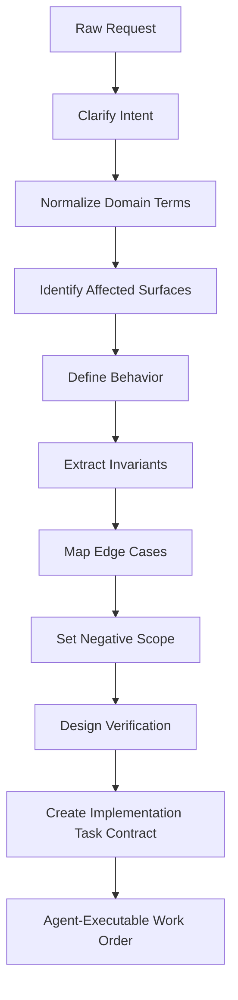
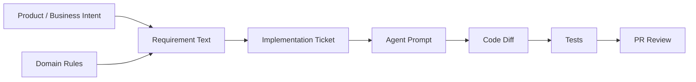
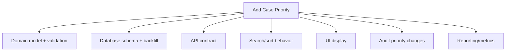

------
title: Learn AI Development Driven Implementation and Usage - Part 008
description: Requirement to implementation translation: how to convert ambiguous product, regulatory, operational, or bug requests into bounded implementation tasks that AI coding agents can execute safely and reviewers can validate.
series: learn-ai-development-driven-implementation-usage
seriesTitle: Learn AI Development Driven Implementation and Usage
order: 8
partTitle: Requirement to Implementation Translation
tags:
- ai
- requirements
- implementation
- software-engineering
- task-slicing
- acceptance-criteria
- series
date: 2026-06-30
---

# Part 008 — Requirement to Implementation Translation

> Goal: setelah bagian ini, kamu mampu mengubah requirement yang ambigu menjadi **implementation-ready task contract**: kecil, testable, bounded, berisi invariant, acceptance criteria, edge cases, negative scope, dan verification plan.

AI coding agent tidak gagal hanya karena model lemah. Agent sering gagal karena requirement yang diberikan bukan requirement engineering, melainkan kalimat produk yang masih mentah.

Contoh requirement mentah:

```text
Add escalation reason to case search.
```

Kalimat ini terlihat sederhana, tapi belum menjawab:

- escalation reason itu enum, free text, atau taxonomy?
- filter exact match atau partial match?
- apakah multiple reason didukung?
- apakah default behavior berubah?
- apakah field sudah ada di database?
- apakah jurisdiction visibility tetap berlaku?
- apakah API contract berubah?
- apakah invalid value error memakai existing error shape?
- apakah audit atau analytics ikut berubah?
- apakah pagination/sorting terdampak?
- test apa yang membuktikan behavior?

AI akan mengisi kekosongan dengan tebakan. Staff-level engineer tidak membiarkan implementation dimulai dari tebakan.

---

## 1. Kaufman Skill Deconstruction

Dalam kerangka Kaufman, skill ini dipecah menjadi:

| Sub-skill | Tujuan | Output yang terlihat |
|---|---|---|
| Intent extraction | Memahami alasan bisnis/teknis | Problem statement yang tidak overfit |
| Domain normalization | Menyamakan vocabulary | Glossary dan canonical terms |
| Scope slicing | Membuat task kecil dan aman | Single-purpose implementation ticket |
| Behavior specification | Menulis expected behavior | Given/When/Then atau decision table |
| Invariant discovery | Menemukan rule yang tidak boleh rusak | Domain/security/data constraints |
| Edge-case mapping | Menghindari happy-path bias | Boundary cases dan failure paths |
| Negative scope | Membatasi perubahan | “Do not change” section |
| Verification design | Menentukan bukti benar | Test plan dan command |
| Review contract | Membuat output bisa diaudit | PR checklist dan risk summary |

Kaufman menekankan “learn enough to self-correct”. Dalam skill ini, self-correction berarti kamu bisa melihat requirement dan mengatakan:

```text
This is not implementation-ready yet.
It is missing behavior, boundary, invariant, or verification evidence.
```

---

## 2. The Translation Pipeline

Requirement mentah harus melewati pipeline sebelum diberikan ke AI agent.



Jangan skip pipeline ini untuk task yang menyentuh:

- state transition,
- authorization,
- data migration,
- public API,
- payment/billing,
- audit evidence,
- compliance workflow,
- security,
- concurrency,
- idempotency,
- cross-service integration.

Semakin tinggi risk surface, semakin eksplisit task contract harus ditulis.

---

## 3. Raw Requirement vs Implementation-Ready Requirement

### 3.1 Raw requirement

```text
Users should be able to reopen closed cases.
```

Masalah:

- siapa “users”?
- semua closed case atau subset?
- butuh reason?
- state baru `REOPENED` atau balik ke `ASSIGNED`?
- audit event apa?
- notification apa?
- retention rule?
- SLA reset atau resume?
- authorization?
- idempotency?

### 3.2 Implementation-ready requirement

```md
## Task
Allow authorized case supervisors to reopen a closed case when the case is still within retention period.

## Intent
Some cases are closed prematurely because new evidence arrives. Supervisors need controlled reopening without creating duplicate cases.

## Behavior
- Only users with `CASE_SUPERVISOR` role can reopen a closed case.
- Case can be reopened only from `CLOSED` state.
- Reopen requires non-empty `reopenReason`.
- Reopened case transitions to `REOPENED` state.
- Original case id and intake timestamp must be preserved.
- SLA clock resumes from previous paused/closed context; it must not reset to current time.
- Reopen writes `CASE_REOPENED` audit event.

## Rejection Rules
- If case is not `CLOSED`, return existing state conflict error shape.
- If retention period has expired, return domain validation error.
- If user lacks role, return existing authorization error.

## Negative Scope
- Do not create a new case.
- Do not change close behavior.
- Do not change existing assignment rules.
- Do not add notification behavior in this task.
- Do not change API error envelope.

## Verification
- Add domain state transition tests.
- Add authorization test.
- Add API test for missing reopenReason.
- Add audit event assertion.
- Run `./gradlew test --tests '*ReopenCase*'`.
```

Ini baru siap untuk agent.

---

## 4. Requirement Translation Is Loss Control

Setiap tahap development kehilangan informasi:



Tugas requirement translation adalah menjaga agar informasi penting tidak hilang saat berpindah bentuk.

Informasi yang paling sering hilang:

- **why**: alasan perubahan,
- **who**: aktor dan permission,
- **when**: state/time condition,
- **what not**: negative scope,
- **existing behavior**: default behavior yang harus tetap,
- **error shape**: response contract,
- **auditability**: evidence requirement,
- **rollback**: cara kembali aman.

---

## 5. Implementation Surface Mapping

Sebelum memberi task ke AI, identifikasi surface yang mungkin terdampak.

| Surface | Pertanyaan | Contoh perubahan |
|---|---|---|
| API | Apakah request/response berubah? | add filter, add endpoint, new error code |
| Domain | Apakah rule/state berubah? | new transition, eligibility rule |
| Persistence | Apakah schema/query berubah? | new column, new index, predicate |
| Authorization | Siapa boleh melakukan apa? | role check, jurisdiction filter |
| Audit | Apakah evidence wajib dicatat? | audit event, actor id, reason |
| Eventing | Apakah event dipublish/dikonsumsi? | `CaseReopened`, `CaseEscalated` |
| UI/API client | Apakah consumer terdampak? | field visibility, validation message |
| Testing | Test apa yang jadi oracle? | domain test, contract test, integration test |
| Ops | Apakah ada rollout/migration? | feature flag, backfill, monitoring |

Surface map membantu menentukan scope. Jika task menyentuh terlalu banyak surface, pecah.

---

## 6. The Requirement Expansion Template

Gunakan template ini untuk mengubah request menjadi work order.

```md
# Implementation Task Contract

## 1. Task
<one sentence describing the concrete implementation>

## 2. Intent
<why this change exists; business/domain/technical reason>

## 3. Current Behavior
<what happens today>

## 4. Expected Behavior
<what must happen after the change>

## 5. Actors and Permissions
<who can perform/read/change this behavior>

## 6. Affected Surfaces
- API:
- Domain:
- Persistence:
- Events:
- Audit:
- UI/client:
- Ops:

## 7. Invariants
<things that must remain true>

## 8. Edge Cases
<boundary/failure/empty/null/concurrent/idempotent cases>

## 9. Negative Scope
<things explicitly not included>

## 10. Verification Plan
<tests to add/change and commands to run>

## 11. Review Notes
<risk, compatibility, migration, rollback>
```

Jangan semua bagian harus panjang. Yang penting tidak ada silent assumption pada area risk tinggi.

---

## 7. Intent Extraction

Requirement tanpa intent sering menghasilkan solusi yang salah tapi valid secara sintaks.

Contoh:

```text
Add a priority field to cases.
```

Kemungkinan intent:

1. UI ingin sorting case worklist.
2. Business ingin SLA berbeda per priority.
3. Compliance ingin audit trail perubahan priority.
4. Operations ingin routing otomatis.
5. Reporting ingin segmentasi.

Implementasi untuk masing-masing intent berbeda.

### 7.1 Intent prompt

Gunakan pertanyaan:

```text
What decision or workflow should become possible after this change?
```

Lalu ubah menjadi:

```md
Intent:
Supervisors need to identify cases requiring faster handling in the worklist.
This task only adds filtering/sorting visibility; it does not change SLA calculation.
```

Intent harus cukup spesifik untuk mencegah over-implementation.

---

## 8. Domain Normalization

AI sangat sensitif terhadap istilah. Requirement harus memakai vocabulary canonical.

Buruk:

```text
Let admins reopen tickets that are done.
```

Lebih baik:

```text
Allow case supervisors to reopen enforcement cases in CLOSED state.
```

Buat mapping:

| Raw term | Canonical term | Reason |
|---|---|---|
| admin | case supervisor | Permission model memakai role ini |
| ticket | enforcement case | Domain object bukan support ticket |
| done | CLOSED | State enum existing |
| reopen | ReopenCase command | Existing command naming convention |

Jika requirement memakai istilah non-canonical, agent akan membuat istilah baru di kode.

---

## 9. Current Behavior First

Sebelum expected behavior, tulis current behavior.

Kenapa? Karena AI perlu tahu baseline yang tidak boleh rusak.

Contoh:

```md
## Current Behavior
- Closed cases are terminal.
- API rejects commands against closed cases with `CASE_STATE_CONFLICT`.
- Closed cases remain visible in supervisor historical search.
- SLA calculation stops when case is closed.
- Audit event `CASE_CLOSED` is written during closure.
```

Tanpa current behavior, agent bisa mengubah terminal semantics tanpa sadar.

---

## 10. Expected Behavior as Decision Table

Untuk logic bercabang, decision table lebih baik daripada paragraph.

Contoh reopen:

| Case state | Role | Retention valid? | Reason present? | Result |
|---|---|---:|---:|---|
| CLOSED | CASE_SUPERVISOR | yes | yes | transition to REOPENED |
| CLOSED | CASE_SUPERVISOR | yes | no | validation error |
| CLOSED | CASE_SUPERVISOR | no | yes | retention error |
| CLOSED | CASE_OFFICER | yes | yes | authorization error |
| ASSIGNED | CASE_SUPERVISOR | yes | yes | state conflict |
| ESCALATED | CASE_SUPERVISOR | yes | yes | state conflict |

Decision table memaksa edge case keluar dari kepala ke artifact.

---

## 11. Behavior as Given/When/Then

Untuk test generation, Given/When/Then efektif.

```gherkin
Scenario: Supervisor reopens a closed case within retention period
  Given a case is CLOSED
  And the case is within retention period
  And the actor has CASE_SUPERVISOR role
  When the actor reopens the case with reason "new evidence received"
  Then the case state becomes REOPENED
  And the original intake timestamp is preserved
  And a CASE_REOPENED audit event is recorded
```

Scenario buruk:

```gherkin
Scenario: Reopen case works
```

Test yang baik bukan hanya menjalankan code. Test yang baik menjaga meaning.

---

## 12. Invariant Extraction

Invariant adalah rule yang harus tetap benar walau implementasi berubah.

Untuk setiap requirement, tanya:

- Apa yang tidak boleh berubah?
- Apa yang harus selalu benar?
- Apa yang jika rusak akan menjadi incident?
- Apa yang harus tetap kompatibel dengan consumer?

Contoh:

```md
## Invariants
- Case id must not change during reopen.
- Intake timestamp must not change during reopen.
- Authorization visibility rules must still apply.
- Audit log must remain append-only.
- API error envelope must remain backward compatible.
- Existing closed-case search behavior must remain unchanged.
```

Invariant adalah antidote terhadap “AI made it pass by changing the rules”.

---

## 13. Edge Case Inventory

Edge case harus sistematis.

| Category | Questions |
|---|---|
| Null/empty | Field kosong, null, whitespace, missing? |
| Boundary | max length, enum unknown, retention boundary? |
| State | state awal valid/tidak valid? |
| Permission | unauthorized, wrong role, wrong jurisdiction? |
| Time | timezone, deadline, retention, clock skew? |
| Concurrency | duplicate command, stale version, race condition? |
| Idempotency | repeated request menghasilkan apa? |
| Compatibility | old clients tetap jalan? |
| Observability | log/audit/metric perlu berubah? |
| Failure | downstream error, DB conflict, event publish failure? |

AI cenderung happy-path. Edge inventory memaksa non-happy path masuk scope.

---

## 14. Negative Scope

Negative scope adalah bagian paling sering hilang.

Requirement:

```text
Add filter by escalation reason.
```

Negative scope:

```md
## Negative Scope
- Do not add new escalation reasons.
- Do not change escalation creation flow.
- Do not change existing status filter semantics.
- Do not change default sort order.
- Do not change pagination behavior.
- Do not alter jurisdiction visibility predicates.
- Do not add UI changes in this task.
```

Tanpa negative scope, agent bisa “membantu” terlalu jauh.

---

## 15. Acceptance Criteria That Actually Test Something

Acceptance criteria buruk:

```md
- Code is clean.
- Feature works.
- Tests are added.
```

Acceptance criteria baik:

```md
- When `escalationReason=SAFETY_RISK` is supplied, case search returns only cases with that reason.
- When no escalation reason is supplied, result set is identical to existing behavior.
- Invalid escalation reason uses existing validation error envelope.
- Jurisdiction predicate is still applied together with escalation reason predicate.
- Pagination and sorting behavior remain unchanged.
- Repository integration test covers combined filter: status + escalation reason + jurisdiction.
```

Kriteria harus bisa dibuktikan oleh test atau review.

---

## 16. Verification Plan Before Implementation

Jangan menunggu setelah coding untuk memikirkan test.

Template:

```md
## Verification Plan

### Tests to add
- `CaseSearchPredicateBuilderTest.shouldFilterByEscalationReason`
- `CaseSearchRepositoryIT.shouldCombineEscalationReasonWithJurisdiction`
- `CaseSearchControllerTest.shouldRejectInvalidEscalationReason`

### Regression tests
- `CaseSearchRepositoryIT.shouldPreserveDefaultSearchWhenReasonAbsent`

### Commands
- `./gradlew test --tests '*CaseSearch*'`
- `./gradlew integrationTest --tests '*CaseSearch*'`

### Manual/contract checks
- Verify OpenAPI schema if request parameter is public.
```

Agent yang diberi verification plan akan lebih sedikit membuat test ornamental.

---

## 17. Turning Requirement into Agent Work Order

Setelah expanded requirement, buat prompt implementasi.

```text
Implement the escalationReason filter in case search.

Before editing:
1. Read AGENTS.md.
2. Inspect existing search filter patterns.
3. Identify current request DTO, predicate builder, repository tests, and API tests.
4. Return a brief plan and wait for confirmation if the implementation requires schema migration or API response change.

Scope:
- Allowed: request DTO/query parameter binding, validation, predicate builder, repository/API tests, OpenAPI request parameter if applicable.
- Not allowed: database schema change, response shape change, authorization semantics, pagination/sorting behavior, escalation creation flow.

Behavior:
- When escalationReason is absent, existing search behavior remains unchanged.
- When escalationReason is valid, search filters by exact reason.
- When escalationReason is invalid, use existing validation error envelope.
- Jurisdiction predicate must still apply.

Verification:
- Add regression test for absent filter.
- Add test for valid filter.
- Add test combining status + escalationReason + jurisdiction.
- Add invalid value API test.
- Run relevant CaseSearch tests.

Output:
- Files changed.
- Behavior implemented.
- Tests added/updated.
- Commands run and results.
- Risks/assumptions.
```

Ini berbeda dari prompt singkat. Ini adalah executable engineering contract.

---

## 18. Slicing: One Requirement May Need Multiple Tasks

Raw requirement:

```text
Add case priority across the system.
```

Jangan langsung beri ke agent sebagai satu task.

Pecah:



Urutan aman:

1. Add domain enum and validation behind internal code path.
2. Add nullable DB column with expand migration.
3. Add API request/response contract backward compatibly.
4. Add search/sort behavior.
5. Add audit trail for priority change.
6. Add UI display/control.
7. Add reporting.

AI agent lebih cocok diberi satu slice dengan acceptance criteria jelas.

---

## 19. Slice Size Heuristics

Task cocok untuk agent jika:

- diff expected kurang dari 300-500 line,
- file touch kurang dari 8-10 file,
- behavior bisa dites lokal,
- no ambiguous domain rule,
- no destructive migration,
- no hidden stakeholder dependency,
- no broad architecture decision.

Task perlu human design dulu jika:

- mengubah state machine utama,
- mengubah public contract besar,
- butuh migration/backfill besar,
- memengaruhi authorization model,
- memengaruhi data retention/audit,
- melibatkan concurrency/idempotency rumit,
- membutuhkan cross-team alignment.

---

## 20. Requirement Risk Classification

Klasifikasi sebelum implementasi:

| Risk Level | Characteristics | AI Usage Mode |
|---|---|---|
| Low | Local change, no public contract, test obvious | Pair/agent implementation |
| Medium | API/test/persistence touched, existing pattern clear | Agent with strict task contract |
| High | Auth, audit, money, lifecycle, migration, concurrency | Human design first, agent assists bounded slices |
| Critical | Legal/regulatory decisioning, destructive data, security boundary | Human-led, AI for analysis/test/checklist only |

AI bukan dilarang untuk high-risk work. Tapi delegation mode harus berubah.

---

## 21. Regulatory/Workflow Example: Escalation Rule Change

Raw request:

```text
Auto-escalate cases that are overdue.
```

Expanded:

```md
## Task
Add automatic eligibility marking for overdue cases, not automatic state transition.

## Intent
Supervisors need visibility into cases that may require escalation. The system should flag candidates but not escalate without human decision.

## Current Behavior
- Cases can be escalated manually by supervisor.
- SLA overdue status is calculated in worklist query.
- Escalation requires reason and audit event.

## Expected Behavior
- Assigned cases past SLA deadline are marked `escalationCandidate=true` in search response.
- No case state changes automatically.
- No audit event is emitted by candidate calculation.
- Existing manual escalation flow remains unchanged.

## Invariants
- Candidate flag is derived, not persisted.
- Jurisdiction visibility still applies.
- Closed cases are never escalation candidates.
- Paused cases do not accrue SLA time.

## Negative Scope
- Do not add scheduler.
- Do not auto-transition state.
- Do not create audit event.
- Do not notify supervisors.
```

Perhatikan bedanya: requirement “auto-escalate” berbahaya. Translation mengubahnya menjadi controlled workflow sesuai real intent.

---

## 22. Bug Report Translation

Raw bug:

```text
Search is broken when filtering closed cases.
```

Implementation-ready:

```md
## Bug
Closed case search returns cases outside officer jurisdiction when `status=CLOSED` is combined with `assignedOfficerId`.

## Expected
Jurisdiction predicate must apply to all status filters, including CLOSED.

## Evidence
Observed in production query logs on 2026-06-28:
- Request: `GET /cases?status=CLOSED&assignedOfficerId=...`
- Actor jurisdiction: `JKT-01`
- Result included case from `BDG-02`.

## Suspected Area
`CaseSearchPredicateBuilder` may bypass jurisdiction predicate for terminal states.

## Regression Test
Add integration test:
- actor jurisdiction `JKT-01`,
- one closed case in `JKT-01`,
- one closed case in `BDG-02`,
- query `status=CLOSED`,
- assert only `JKT-01` returned.

## Negative Scope
- Do not change assignment filter semantics.
- Do not change closed case visibility for authorized supervisors.
- Do not rewrite search builder architecture.
```

Bug fix tanpa reproduction adalah speculation.

---

## 23. Refactoring Requirement Translation

Raw request:

```text
Clean up case service.
```

Ini bukan task.

Implementation-ready refactoring:

```md
## Task
Extract deadline calculation from `CaseService` into `CaseDeadlinePolicy` without changing behavior.

## Intent
`CaseService` mixes orchestration and deadline rule calculation, making SLA changes risky.

## Scope
- Move deadline calculation logic only.
- Add/adjust unit tests around `CaseDeadlinePolicy`.
- Keep public method signatures unchanged.

## Non-Behavioral Constraint
This is semantic-preserving refactor.
No API, DB, event, authorization, or audit behavior may change.

## Verification
- Existing `CaseServiceTest` passes unchanged or with minimal wiring updates.
- New `CaseDeadlinePolicyTest` covers extracted rules.
- No production behavior snapshot changes.
```

Refactor harus punya target structural improvement, bukan rasa “clean”.

---

## 24. Migration Requirement Translation

Raw request:

```text
Make priority required.
```

Berisiko karena existing data.

Implementation-ready:

```md
## Task 1: Expand schema
Add nullable `priority` column to `case_record`.
No read/write behavior change yet.

## Task 2: Write path
Set priority for new cases using default `NORMAL` when not supplied.

## Task 3: Backfill
Backfill existing cases in batches with `NORMAL`, unless domain-specific priority can be derived.
Backfill must be idempotent.

## Task 4: Contract update
Expose priority in API response and request validation.
Keep backward compatibility for clients that omit priority during transition.

## Task 5: Contract phase
After backfill and client readiness, enforce non-null at DB/application boundary.
```

Satu kalimat requirement bisa menjadi lima deployment-safe tasks.

---

## 25. Agent Prompt Should Include Stop Conditions

Stop conditions mencegah agent improvisasi.

```md
## Stop Conditions
Stop and ask for human review if:
- implementation requires database schema migration,
- public API response shape must change,
- existing authorization behavior appears inconsistent,
- no relevant tests exist,
- task requires changing more than 10 production files,
- behavior conflicts with docs/domain/invariants.md,
- command output shows unrelated failures.
```

Tanpa stop condition, agent akan terus bergerak walau sudah keluar scope.

---

## 26. Requirement Quality Scorecard

Gunakan scorecard sebelum mengirim task ke agent.

| Area | Question | Score 0-2 |
|---|---|---:|
| Intent | Alasan perubahan jelas? |  |
| Current behavior | Baseline tertulis? |  |
| Expected behavior | Behavior testable? |  |
| Actor/permission | Role/visibility jelas? |  |
| Surface map | API/domain/db/event/test teridentifikasi? |  |
| Invariants | Rule yang tidak boleh rusak tertulis? |  |
| Edge cases | Failure/boundary cases tertulis? |  |
| Negative scope | Hal yang tidak boleh diubah tertulis? |  |
| Verification | Test plan dan command jelas? |  |
| Stop condition | Kapan agent harus berhenti jelas? |  |

Interpretasi:

| Score | Readiness |
|---:|---|
| 0-6 | Not implementation-ready |
| 7-12 | Human pairing required |
| 13-17 | Agent-ready with review |
| 18-20 | Strong agent work order |

---

## 27. Practice Drill: Translate 5 Requirements

Ambil lima request nyata dari backlog.

Untuk setiap request, tulis:

1. raw request,
2. intent,
3. current behavior,
4. expected behavior,
5. affected surfaces,
6. invariants,
7. edge cases,
8. negative scope,
9. verification plan,
10. final agent prompt.

Batasi tiap translation maksimal 30 menit. Tujuannya bukan sempurna, tetapi membangun muscle memory.

---

## 28. Common Anti-Patterns

### 28.1 Feature sentence as implementation task

```text
Add priority to cases.
```

Ini request, bukan task.

### 28.2 Acceptance criteria as wish list

```md
- Should be scalable.
- Should be secure.
- Should be user friendly.
```

Tidak testable.

### 28.3 Hidden permission rule

Requirement menyebut behavior, tapi tidak menyebut actor.

### 28.4 Silent default behavior change

Agent menambahkan filter tapi mengubah result ketika filter absent.

### 28.5 Edge case discovered during review

Jika reviewer baru menemukan edge case dasar, translation pipeline gagal.

### 28.6 Refactor disguised as feature

Task feature tiba-tiba mengubah architecture besar.

### 28.7 Test added after implementation only

Test menjadi dokumentasi output agent, bukan oracle behavior.

---

## 29. Self-Correction Checklist

Jika output AI salah, mapping ke masalah requirement:

| AI Output Problem | Likely Requirement Problem |
|---|---|
| Agent mengubah terlalu banyak file | Scope dan negative scope lemah |
| Agent salah state transition | State model/invariant tidak ditulis |
| Agent lupa authorization | Actor/permission hilang |
| Agent ubah API error shape | Contract constraint tidak ditulis |
| Agent hanya happy-path test | Edge cases dan verification plan lemah |
| Agent membuat schema migration tak diminta | Affected surface dan stop condition hilang |
| Agent refactor besar | Slice terlalu besar atau tidak ada diff limit |
| Agent menciptakan istilah baru | Domain normalization tidak dilakukan |

Self-correction terbaik adalah memperbaiki task contract, bukan mengulang prompt dengan “be careful”.

---

## 30. Definition of Done

Kamu dianggap menguasai bagian ini jika bisa:

- mengenali requirement yang belum implementation-ready,
- mengekstrak intent tanpa overbuilding,
- menormalisasi domain vocabulary,
- memetakan affected surfaces,
- menulis expected behavior sebagai decision table atau Given/When/Then,
- menemukan invariant dan edge case,
- menulis negative scope yang mencegah overreach,
- membuat verification plan sebelum coding,
- memecah requirement besar menjadi safe slices,
- dan menghasilkan agent work order yang bisa dieksekusi dengan diff kecil.

---

## 31. Key Takeaways

- AI agent tidak boleh diberi requirement mentah untuk pekerjaan risk tinggi.
- Requirement translation adalah loss control dari intent ke code.
- Current behavior sama pentingnya dengan expected behavior.
- Invariant dan negative scope mencegah AI “memperbaiki” dengan merusak rule.
- Decision table dan Given/When/Then membuat behavior testable.
- Verification plan harus ada sebelum implementation.
- Task besar harus dipecah berdasarkan deployment and review safety.
- Stop condition adalah bagian dari prompt, bukan tambahan opsional.
- Requirement yang bagus membuat AI lebih aman, reviewer lebih cepat, dan delivery lebih defensible.

---

## 32. References

- AGENTS.md open format: https://github.com/agentsmd/agents.md
- GitHub Copilot custom instructions: https://docs.github.com/copilot/customizing-copilot/adding-custom-instructions-for-github-copilot
- C4 model diagrams: https://c4model.com/diagrams
- NIST AI Risk Management Framework: https://www.nist.gov/itl/ai-risk-management-framework
- OWASP Top 10 for LLM Applications: https://owasp.org/www-project-top-10-for-large-language-model-applications/
